# PicoOS

PicoOS is a small educational operating system for the RETI teaching CPU. It
was developed as a master’s project to make central operating-system mechanisms
visible in a compact codebase: bootloading, interrupt vectors and service
routines, process creation and termination, scheduling and dispatching, wait
queues, signals, memory allocation, shared memory, file descriptors, and a
minimal userspace.

The project deliberately does not imitate the scale of Linux or claim POSIX
conformance. There is no virtual memory, MMU, process isolation, disk, or
on-device filesystem. All code and data use one physical 32-bit address space,
and filesystem operations are forwarded over UART to the RETI-Emulator host.
The small scope is intentional: a reader can connect a userspace call to its
interrupt entry, kernel data-structure changes, and eventual context switch.

This README is a report on what was implemented and how the main parts fit
together. It emphasizes kernel state, ownership, and lifecycle rather than
walking through every function statement by statement.

PicoOS is developed together with two sibling projects:

- [PicoC-Compiler](../PicoC-Compiler/README.md) compiles the PicoC subset of C,
  links multiple translation units, lays out interrupt, code, and data
  sections, and produces RETI assembly plus section metadata
- [RETI-Emulator](../RETI-Emulator/README.md) assembles and executes RETI,
  models EPROM, SRAM, UART, interrupts, the timer, and CPU exceptions, and
  supplies the host-side file protocol
- PicoOS provides the EPROM bootloader, kernel, libraries, init process, shell,
  user programs, and integration tests

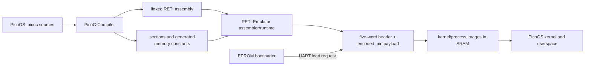

| Producer | Contract | Consumer |
| --- | --- | --- |
| PicoC-Compiler | Linked `.reti`, `.sections`, generated memory headers, and `.debuginfo` | RETI-Emulator assembler/debugger and PicoOS low-level builds |
| RETI-Emulator assembler | Five-word layout header followed by encoded RETI words in `.bin` | EPROM bootloader and kernel process loader |
| PicoOS libraries | Syscall number plus direct value/pointer or stack-local request structure | Interrupt entry, `handle_syscall()`, and the owning kernel subsystem |
| Kernel subsystems | PCBs, activations, queues, descriptor/shared-memory state, and periphery-register writes | Scheduler/dispatcher and emulated RETI hardware |
| PicoOS UART protocol | Bounded escape requests and big-endian responses | RETI-Emulator host file services, or a companion serial host on hardware |

## Intended physical hardware

The intended physical setup uses an Alchitry Cu V2 FPGA board, two ISSI
IS61WV25616BLL-10TLI SRAM chips, and a SparkFun Serial Basic USB-to-UART
adapter. The prices below are the example parts-list prices used for this
design, including VAT. They were last checked at DigiKey Germany on 12 August
2026; component and shipping prices can change.

- **FPGA: [Alchitry Cu V2](https://www.digikey.de/short/8cmz0qnc) with Lattice
  iCE40-HX8K** ([board schematic](https://cdn.sparkfun.com/assets/2/f/9/9/3/CuSchematic.pdf),
  [FPGA datasheet](https://www.latticesemi.com/~/media/latticesemi/documents/datasheets/ice/ice40lphxfamilydatasheet.pdf)):
  **€55.66** (checked 12 August 2026). The FPGA implements the educational
  32-bit CPU, interrupt controller, UART controller, and SRAM interface.
- **SRAM: two [ISSI
  IS61WV25616BLL-10TLI](https://www.digikey.de/short/075fh38w) chips**
  ([datasheet](https://www.issi.com/WW/pdf/61-64WV25616.pdf)):
  **2 × €5.80 = €11.60** (checked 12 August 2026). Each asynchronous SRAM is
  organized as 256K × 16 bits. Both chips share the FPGA’s 18 address lines,
  chip enable, output enable, write enable, and byte-enable control. One chip
  connects its 16 data pins to CPU data bits 0–15 and the other to bits 16–31.
  Driving both chips with the same address and control signals therefore makes
  them one 256K × 32-bit SRAM. It provides 2^18 = 262,144 individually
  addressable 32-bit words, addressed from 0 through 2^18 - 1. Each word holds
  four bytes, so the total is
  `262,144 words × 4 bytes = 1,048,576 bytes = 1 MiB`. For comparison, 2^18
  bytes alone would be only 0.262144 MB.
- **USB-to-UART: [SparkFun Serial Basic Breakout with CH340C and
  USB-C](https://www.digikey.de/short/h83tqvbw)**
  ([product sheet](https://mm.digikey.com/Volume0/opasdata/d220001/medias/docus/739/DEV-15096_Web.pdf),
  [CH340C datasheet](https://cdn.sparkfun.com/assets/5/0/a/8/5/CH340DS1.PDF),
  [board schematic](https://cdn.sparkfun.com/assets/learn_tutorials/8/3/7/Serial-Basic-CH340C_Datasheet.pdf)):
  **€10.92** (checked 12 August 2026). Its `TXO` pin connects to the FPGA
  UART’s receive pin, its `RXI` pin connects to the FPGA UART’s transmit pin,
  and their grounds are connected. USB exposes the CH340C as a serial port on
  the host. The host and FPGA use the same baud rate and serial format, and
  UART transfers each request and response as a sequence of bytes.

The example total is **€55.66 + 2 × €5.80 + €10.92 = €78.18 including VAT**.
This excludes USB cables, wires, connectors, a printed circuit board, other
interconnection hardware, and shipping. In the rest of this README, PCB means
*process control block* unless the hardware context says otherwise.

PicoOS has no resident storage device or filesystem. In emulator use, UART
escape sequences ask `reti_emulator` to access files in the host directory
where it is running. On the physical FPGA, a companion host program must read
the same requests from the USB serial port, perform the requested operations
on the host filesystem, and return byte counts and file data over UART. This
is how the same bootloader, kernel file interface, and user programs can work
with either the emulator or a physical RETI implementation.

The generated binaries also show why 1 MiB is a plausible memory size for the
project. The measured example sizes below include each file’s five-word
header:

| Image | 32-bit words | Size |
| --- | ---: | ---: |
| `kernel.bin` | 37,179 | 0.148716 MB |
| `init.bin` | 10,749 | 0.042996 MB |
| `shell.bin` | 26,129 | 0.104516 MB |
| `cat.bin` | 8,772 | 0.035088 MB |
| `echo.bin` | 11,626 | 0.046504 MB |

A conservative calculation can count the headers as if they also occupied
SRAM. With the resident `kernel.bin`, `init.bin`, and `shell.bin` images,
`262,144 - (37,179 + 10,749 + 26,129) = 188,087` words remain. That space
could hold `floor(188,087 / 8,772) = 21` copies of `cat.bin`. The loader
actually keeps the five header words out of the copied program image. This is
only an image-size comparison—a running process also needs heap and stack
space—but it gives a useful scale for the available memory.

### RETI execution model

RETI chooses an address space from the two highest address bits:

| High bits | Address space | PicoOS use |
| --- | --- | --- |
| `00` | EPROM | Bootloader |
| `01` | Memory-mapped periphery | UART, interrupt controller, timer, stack boundary, exception cause |
| `10` or `11` | SRAM | Interrupt table, kernel, process images, heaps, and stacks |

PicoOS uses `0x80000000` as its SRAM base and configures 2^18 physical SRAM
words. Kernel code is non-preemptive: a timer interrupt that interrupted
kernel code returns to that code. User processes are timer-preempted and
scheduled round-robin. A UART interrupt can briefly run while the kernel is
waiting, but it returns to the interrupted kernel work. Kernel operations
therefore do not overlap with another process’s kernel operations, so the
kernel does not need internal locks.

## Contents

1. [Toolchain work required by PicoOS](#1-toolchain-work-required-by-picoos)
   - [1.1 PicoC-Compiler extensions](#11-picoc-compiler-extensions)
     - [1.1.1 Linked `.sections` metadata](#111-linked-sections-metadata)
     - [1.1.2 Generated `memory_constants.header` files](#112-generated-memory_constantsheader-files)
     - [1.1.3 Custom userspace startup](#113-custom-userspace-startup)
     - [1.1.4 Interrupt sections and naked functions](#114-interrupt-sections-and-naked-functions)
   - [1.2 RETI-Emulator extensions](#12-reti-emulator-extensions)
     - [1.2.1 Machine model and peripherals](#121-machine-model-and-peripherals)
     - [1.2.2 Debugger and terminal views](#122-debugger-and-terminal-views)
   - [1.3 UART host protocol](#13-uart-host-protocol)
2. [Bootloading and kernel startup](#2-bootloading-and-kernel-startup)
   - [2.1 Loading the kernel](#21-loading-the-kernel)
   - [2.2 Initializing the kernel](#22-initializing-the-kernel)
     - [2.2.1 Kernel startup code](#221-kernel-startup-code)
   - [2.3 Entering normal execution](#23-entering-normal-execution)
3. [Kernel storage and ownership](#3-kernel-storage-and-ownership)
   - [3.1 Storage and lifetime](#31-storage-and-lifetime)
   - [3.2 Ownership connections](#32-ownership-connections)
4. [Interrupts, system calls, and exceptions](#4-interrupts-system-calls-and-exceptions)
   - [4.1 Interrupt vector table](#41-interrupt-vector-table)
   - [4.2 Saved interrupt frame](#42-saved-interrupt-frame)
   - [4.3 System-call path](#43-system-call-path)
   - [4.4 Timer ISR and preemption](#44-timer-isr-and-preemption)
   - [4.5 UART ISR](#45-uart-isr)
   - [4.6 CPU exception path](#46-cpu-exception-path)
   - [4.7 Important interrupt and exception functions](#47-important-interrupt-and-exception-functions)
5. [Processes and the process table](#5-processes-and-the-process-table)
   - [5.1 Global process table](#51-global-process-table)
   - [5.2 Activation record](#52-activation-record)
   - [5.3 Process control block](#53-process-control-block)
   - [5.4 Process image and initial stack](#54-process-image-and-initial-stack)
   - [5.5 States and lifetime](#55-states-and-lifetime)
   - [5.6 Important process functions](#56-important-process-functions)
6. [Blocking, waiting, synchronization, and signals](#6-blocking-waiting-synchronization-and-signals)
   - [6.1 Wait queues](#61-wait-queues)
     - [6.1.1 Sleeping and waking](#611-sleeping-and-waking)
   - [6.2 `waitpid()` and saved wait state](#62-waitpid-and-saved-wait-state)
   - [6.3 Signals inside the PCB](#63-signals-inside-the-pcb)
   - [6.4 Important signal functions](#64-important-signal-functions)
   - [6.5 Mutexes](#65-mutexes)
7. [Scheduler and dispatcher](#7-scheduler-and-dispatcher)
   - [7.1 Scheduler](#71-scheduler)
   - [7.2 Saving and selecting](#72-saving-and-selecting)
   - [7.3 Restoring](#73-restoring)
8. [Memory management and shared memory](#8-memory-management-and-shared-memory)
   - [8.1 Three uses of one heap implementation](#81-three-uses-of-one-heap-implementation)
     - [8.1.1 Current kernel SRAM layout](#811-current-kernel-sram-layout)
     - [8.1.2 Per-process linked layout](#812-per-process-linked-layout)
   - [8.2 Heap and allocator functions](#82-heap-and-allocator-functions)
   - [8.3 Shared-memory registry and attachments](#83-shared-memory-registry-and-attachments)
     - [8.3.1 Shared-memory tests](#831-shared-memory-tests)
9. [Terminal, file descriptors, and host filesystem](#9-terminal-file-descriptors-and-host-filesystem)
   - [9.1 Per-process descriptor table](#91-per-process-descriptor-table)
   - [9.2 Global terminal](#92-global-terminal)
   - [9.3 Descriptor and terminal functions](#93-descriptor-and-terminal-functions)
   - [9.4 Opening, reading, writing, and seeking](#94-opening-reading-writing-and-seeking)
   - [9.5 Working directories and host operations](#95-working-directories-and-host-operations)
10. [Libraries and the userspace/kernel ABI](#10-libraries-and-the-userspacekernel-abi)
    - [10.1 System-call request structures](#101-system-call-request-structures)
      - [10.1.1 Process, wait, signal, and memory requests](#1011-process-wait-signal-and-memory-requests)
      - [10.1.2 File and directory requests](#1012-file-and-directory-requests)
    - [10.2 Implemented libraries](#102-implemented-libraries)
      - [10.2.1 `unistd`, `fcntl`, waiting, and scheduling](#1021-unistd-fcntl-waiting-and-scheduling)
      - [10.2.2 Signals, process control, shared memory, and mutexes](#1022-signals-process-control-shared-memory-and-mutexes)
      - [10.2.3 Directories](#1023-directories)
      - [10.2.4 Process heap, environment, strings, and exit](#1024-process-heap-environment-strings-and-exit)
      - [10.2.5 Standard I/O](#1025-standard-io)
      - [10.2.6 Startup library](#1026-startup-library)
    - [10.3 Library organization and scope](#103-library-organization-and-scope)
11. [Init process](#11-init-process)
    - [11.1 Purpose and separation of responsibilities](#111-purpose-and-separation-of-responsibilities)
    - [11.2 Startup sequence](#112-startup-sequence)
      - [11.2.1 Init startup code](#1121-init-startup-code)
    - [11.3 Configuration and environment](#113-configuration-and-environment)
    - [11.4 Shell restart policy](#114-shell-restart-policy)
12. [Shell](#12-shell)
    - [12.1 Shell-owned data](#121-shell-owned-data)
    - [12.2 Startup and main loop](#122-startup-and-main-loop)
    - [12.3 Line editing and history](#123-line-editing-and-history)
    - [12.4 Parsing and command execution](#124-parsing-and-command-execution)
    - [12.5 Shell built-ins](#125-shell-built-ins)
    - [12.6 Foreground, background, and signals](#126-foreground-background-and-signals)
    - [12.7 Output redirection](#127-output-redirection)
    - [12.8 Shell-test support](#128-shell-test-support)
13. [User applications](#13-user-applications)
    - [13.1 Applications and their library use](#131-applications-and-their-library-use)
    - [13.2 Command behavior and limitations](#132-command-behavior-and-limitations)
    - [13.3 Errors and exit status](#133-errors-and-exit-status)
14. [Use in operating-systems and real-time operating-systems lectures](#14-use-in-operating-systems-and-real-time-operating-systems-lectures)
    - [14.1 Real-time operating-systems topics](#141-real-time-operating-systems-topics)
    - [14.2 Operating-systems topics](#142-operating-systems-topics)
    - [14.3 Exercise and teaching material](#143-exercise-and-teaching-material)
15. [Test system](#15-test-system)
    - [15.1 Test categories and repository integration](#151-test-categories-and-repository-integration)
    - [15.2 Normal and fast execution](#152-normal-and-fast-execution)
    - [15.3 Covered behavior](#153-covered-behavior)
16. [Use of AI in the project](#16-use-of-ai-in-the-project)
17. [Limitations](#17-limitations)
- [Appendix: Inspecting `.bin` files with `hexyl`](#appendix-inspecting-bin-files-with-hexyl)

## Build and run

The build expects `picoc_compiler`, `reti_emulator`, and `make` on `PATH`. The
release-style boot path is:

```console
$ make bootload
```

This builds the bootloader, kernel, system programs, libraries, and user
programs, then starts the RETI debugger with the EPROM bootloader. The command
corresponds to:

```console
$ ./run_reti_emulator_isolated.sh -n 4 -e ./boot/bootloader.reti \
    -d -c -O -r 262144 \
    -S kernel/kernel.sections -D kernel/kernel.debuginfo
```

`-e` selects the EPROM image, `-r` selects the 2^18-cell SRAM, `-d -c` opens
the commented debug TUI, and `-S`/`-D` connect the compiler-generated kernel
layout/debug information to the emulator. `-O` supplies the initial modeled OS
context from which the first dispatcher `RTI` can leave. `-n 4` tells the
emulator that four IVT entries will later be loaded into SRAM by the
bootloader; they are not present in the initially parsed EPROM image.

Capital `V` opens the raw UART terminal and `Ctrl+]` returns to the debug view.
This single command therefore connects the generated bootloader, kernel
`.sections` and `.debuginfo`, emulated memory/peripherals, UART host service,
and the PicoOS userspace loaded after boot.

Useful narrower commands are:

| Command | Purpose |
| --- | --- |
| `make firmware` | Build the complete firmware/release tree |
| `make run-os OS_RUN_PATH=test/hello_world` | Run one configured OS scenario |
| `make test-lib` | Run the standalone library tests |
| `make test-os` | Run the OS feature tests |
| `make test-shell` | Run the shell tests |

# 1. Toolchain work required by PicoOS

PicoOS could not be implemented with the original teaching compiler and
emulator unchanged. A substantial part of the project was extending both tools
so that the OS could be written in PicoC while retaining inspectable RETI
output.

The detailed change histories are kept with the sibling projects in the
[PicoC-Compiler feature history](https://github.com/matthejue/PicoC-Compiler/blob/linker_update/documentation/new_features_for_pico_os.md)
and [RETI-Emulator feature history](https://github.com/matthejue/RETI-Emulator/blob/statemachine/documentation/new_features_for_pico_os.md).
This chapter records the complete project-facing surface rather than only the
few extensions that appear directly in kernel source.

## 1.1 PicoC-Compiler extensions

The compiler work spans the complete translation pipeline rather than one
isolated backend change:

```mermaid
flowchart LR
    source["PicoC source"]

    subgraph preprocessing["Preprocessing"]
        preprocessor["Includes, macros, and line splicing"]
        preprocessed["Preprocessed source"]
    end

    subgraph frontend["Lexing and parsing"]
        tokens["Token stream"]
        parse_tree["Tree-sitter parse tree"]
        ast["PicoC AST"]
    end

    subgraph compilation["Per-file compilation passes"]
        shrink["picoc_shrink"]
        blocks["picoc_blocks"]
        symbol["picoc_symbol"]
        typing["picoc_typing"]
        anf["picoc_anf"]
        reti_blocks["reti_blocks"]
    end

    subgraph linking["Program-wide linking passes"]
        merge["Merge units, symbols, and startup"]
        patch["reti_patch"]
        reti["reti"]
    end

    output["Flat linked RETI output"]

    source --> preprocessor --> preprocessed --> tokens --> parse_tree --> ast
    ast --> shrink --> blocks --> symbol --> typing --> anf --> reti_blocks
    reti_blocks --> merge --> patch --> reti --> output
```

| Feature | Contribution used by PicoOS |
| --- | --- |
| Installation | `make full-install` creates the environment and installs the `picoc_compiler` command |
| Preprocessing | `#include`, include paths, `#pragma once`, object-like macros, line splicing, dependency output, and optional syntax checking |
| Multiple translation units | Per-file compilation, symbol merging, cross-file calls/globals, and final program-wide linking |
| Reusable build artifacts | `.reti_blocks` and `.st` retain lowered code, symbols, data, startup, and debug metadata for later links |
| Automatic artifact reuse | Source/header hashes and compiler options decide whether an unchanged unit can be reused; Make dependency files expose the same inputs |
| Broader PicoC syntax | `typedef`, casts, mixed declarations/statements, postfix increment, array-size inference, and compile-time integer simplification |
| Pointer support | Pointer returns, `void *`, typed pointer arithmetic, dereference/member conditions, and compatible forward/repeated struct declarations |
| Function pointers | Declarations, arrays, assignments, indirect calls, and statically emitted function addresses |
| Variadic functions | Variadic declarations and the documented System-V-style stack-frame locations used by `printf()` and `scanf()` |
| String and character data | Escapes, inferred local arrays, global strings, deduplicated string literals, and linker-safe literal names |
| Inline RETI assembly | `asm("...")`, linked labels inside assembly, and safe pseudoinstructions such as `LOADI32`, `JUMP32`, `PUSH`, and `POP` |
| Low-level functions | `__attribute__((naked))` suppresses compiler prologue/epilogue code for startup and interrupt handlers |
| Custom sections | `__attribute__((section("ivt")))` places the vector table before `.text` and `.data` |
| Interrupt-vector entries | `IVTE` resolves handler pointers into tagged SRAM addresses |
| Runtime startup | Generated default `_start` or a replaceable custom `-C` startup such as PicoOS `libstart` |
| Global initialization | `-O1` emits known scalar, string, struct, array, and function-pointer initializers directly into `.data` |
| Shared epilogues | All ordinary returns converge on one generated restore/return block |
| Section layout | Separate `.ivt`, `.text`, and `.data` regions and the paired final `.sections` file |
| Linked labels | Human-readable labels remain until final patching, making generated RETI inspectable |
| Kernel headers | `-k sram` and `-k eprom` generate `memory_constants.header` for code that has no PCB/runtime loader context |
| Debug information | `.debuginfo` describes source ranges, globals, frames, arguments, calls, returns, and local variables for the emulator TUI |
| Inspectable intermediates | Preprocessed source and named RETI-block stages make the result of individual compiler passes visible |
| Source trap and RETI `NOP` | `debug;` lowers to the emulator trap and inline `NOP` remains a real instruction |

These additions affected preprocessing, the syntax tree and PicoC AST, the
per-file semantic/lowering passes, and the final linker. In particular, the OS
needed both high-level facilities such as structures and separate compilation
and low-level control over startup, sections, interrupt frames, and absolute
machine addresses.

### 1.1.1 Linked `.sections` metadata

Every final link writes `program.reti` and `program.sections` together. The
section file is not executable data; it is JSON-like layout metadata produced
after the linker has fixed the locations of `.ivt`, `.text`, and `.data`. A
typical userspace file has this form:

```json
{
  "codesegment_start": 0,
  "datasegment_start": 11595,
  "heap_start": 11621,
  "heap_size": 2000,
  "stack_start": 14621
}
```

| Entry | Meaning |
| --- | --- |
| `interrupt_service_routines_start` | Optional start of separately identified ISR code when the linked image contains it |
| `codesegment_start` | Process-relative start loaded into `CS`; for a normal userspace image this is also its initial entry region |
| `datasegment_start` | Process-relative start loaded into `DS` |
| `heap_start` | First cell after static data and first cell managed by the process-local heap |
| `heap_size` | Heap capacity in RETI cells; `-1` requests PicoOS's default |
| `stack_start` | Highest process-relative stack cell; `-1` requests the kernel's default placement |

The compiler creates this file only at the final link. A compile-only `-c`
invocation instead creates reusable `.reti_blocks` and `.st` files because no
complete program layout exists yet. Given `program.reti`, the emulator looks
for `program.sections` automatically. `-S` is needed only for a differently
named layout—for example when the EPROM bootloader is running while the TUI
must display the kernel that will later occupy SRAM.

The linked section metadata is the contract between compiler, emulator,
bootloader, and process loader. When the emulator assembles a program to
`.bin`, it copies five values from `.sections` into a fixed big-endian header:

| Word | Value | Use in PicoOS |
| ---: | --- | --- |
| 0 | `codesegment_start` | Initial code segment and entry point |
| 1 | `datasegment_start` | Initial data segment |
| 2 | `heap_start` | Start of the userspace heap within a process image |
| 3 | `heap_size` | Configured heap size, or `-1` for the PicoOS default |
| 4 | `stack_start` | Highest stack cell, or `-1` for the PicoOS default |

The UART `load` response supplies the total word count separately. The
bootloader and process loader consume the five header words and copy only the
encoded RETI words after the header to SRAM. Consequently the PCB's
`word_count` records the complete transferred file count, while the allocated
process image contains only the linked program and its heap/stack room.

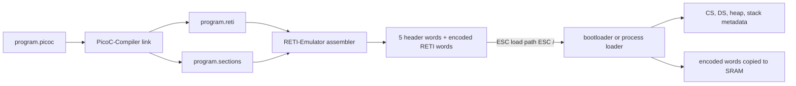

### 1.1.2 Generated `memory_constants.header` files

The kernel and EPROM bootloader need their own absolute addresses before an
ordinary runtime object can tell them where they are. The compiler option
`-k sram` therefore generates [`kernel/memory_constants.header`](kernel/memory_constants.header),
and `-k eprom` generates [`boot/memory_constants.header`](boot/memory_constants.header).
These are compile-time interfaces, not tables allocated by PicoOS.

| Kernel constant | Consumer and purpose |
| --- | --- |
| `SRAM_BASE` | Converts process-relative linked addresses to the absolute SRAM address space |
| `SRAM_MAX_ADDRESS_IN_MEMORY_MAP` | Inclusive final configured SRAM cell; bounds the process-memory heap |
| `KERNEL_HEAP_START`, `KERNEL_HEAP_SIZE` | Initialize the global `kernel_heap` descriptor and define its stack boundary |
| `PROCESS_MEMORY_START` | First cell managed by the global `process_memory_heap` for process images and shared data |
| `KERNEL_CS_START_ASM`, `KERNEL_DS_START_ASM` | Inline assembly fragments used when interrupt entries install kernel segments |
| `KERNEL_SP_START_ASM` | Inline assembly fragment that installs the linked kernel stack start |
| `KERNEL_CS_ACC_ASM` | Loads the kernel code base for timer/exception context comparisons |

| Bootloader constant | Consumer and purpose |
| --- | --- |
| `SRAM_MAX_ADDRESS` | Final physical SRAM offset; used for the temporary boot stack |
| `EPROM_DS_START_ASM` | Loads the bootloader's linked EPROM data segment |
| `EPROM_STACK_START_ASM` | Loads the absolute top-of-SRAM temporary stack |

Both `kernel.sections` and the kernel header come from the same final linked
layout. The header adds `SRAM_BASE` where an absolute address is required;
the `.sections` file retains program-relative values for loading and debug
views. The bootloader reads the kernel's five-word binary header to load that
image, but uses its own EPROM header before any kernel state exists.

### 1.1.3 Custom userspace startup

PicoOS links [`library/start/libstart.picoc`](library/start/libstart.picoc) as
the custom startup unit. Its naked `_start` must see the initial stack exactly
as the kernel built it. It passes `argc` and `argv` to `start_process()`, which
initializes the process-local heap, clones the `envp` entries placed after
`argv`, calls `main(argc, argv)`, and sends `main`'s result through `exit()`.
The bootloader and kernel also use custom naked startup functions, but those
install machine registers rather than enter an application `main()`.

### 1.1.4 Interrupt sections and naked functions

`__attribute__((section("ivt")))` tells the linker to place the declared
function-pointer array in `.ivt` before ordinary `.text` and `.data`; the
attribute uses `"ivt"` without a leading dot. With compile-time global
initialization, handler addresses become static vector words, so no startup
code must run before the CPU can use the table. `IVTE` and the final linker
patch pass encode those function addresses with the correct SRAM tag.

`__attribute__((naked))` suppresses the normal PicoC function prologue,
shared epilogue, and automatic return. Startup functions need this before
`BAF`/segments have been established, and ISRs need it so they can push the
exact register order expected by the kernel activation layout and end with
`RTI`. Linked labels inside inline assembly allow these low-level stubs to
refer to normal C helpers after final placement. The result is a direct
compiler-to-kernel contract: compiler frame/offset rules determine the saved
interrupt frame, and the dispatcher restores the same layout.

## 1.2 RETI-Emulator extensions

| Feature | Contribution used by PicoOS |
| --- | --- |
| Plain execution output | Without the debugger, completed UART output is written directly to host stdout |
| Commented assembly | Debug mode can show source-derived labels and comments beside instructions |
| Atomic locking | `TSL` atomically returns a cell's old value and stores `1`, supporting the mutex library |
| Structured loading | `.sections` distinguishes the vector table, ISR code, `.text`, `.data`, heap, and stack |
| Binary assembly | `--assemble program.reti` combines RETI words with the five layout header words in `program.bin` |
| EPROM-only boot | `-e boot/bootloader.reti` starts reset execution without preloading a program into SRAM |
| Configurable SRAM | PicoOS selects 262,144 physical 32-bit cells while retaining the RETI tagged address space |
| Memory-mapped periphery | UART, device mappings, priorities, timer interval, stack boundary, and exception cause occupy offsets 0–11 |
| Interrupt controller | Timer, custom device, and UART have configurable vector mappings, priorities, pending state, and nesting behavior |
| Manual interrupts | The TUI can select and trigger an interrupt vector for inspection |
| Runtime timer | An instruction-count interval produces repeatable userspace preemption and exposes the live counter in the TUI |
| Raw-byte UART | Receive/send registers and status bits model byte delivery rather than line-oriented console input |
| UART host services | The emulator parses bounded load, read, file-size, output, directory, and removal requests from the byte stream |
| Normal and raw terminals | The normal view preserves host signal processing; raw mode forwards control and escape bytes needed by the shell |
| CPU exceptions | Divide by zero, stack overflow, and illegal instructions enter fixed vector 3 and expose a cause value |
| Stack/heap protection | The active inclusive boundary is checked whenever an instruction attempts to decrease `SP` |
| Runtime segment interpretation | Code/data/watch views follow live `CS` and `DS` after bootloading and context switches |
| Source-level debugging | `.debuginfo` and preprocessed source provide globals, locals, arguments, calls, frames, and source positions |
| SRAM transcoding | Memory can be viewed as numbers, characters, or decoded instructions without losing known-code regions |
| Snapshots and restart | Complete CPU, memory, interrupt, UART, and peripheral state can be saved, restored repeatedly, or restarted |
| Live inspection/editing | Windows can be selected, scrolled, centered, and edited while inspecting registers or memory |
| Synthetic OS context | The initial debugger state can model the kernel/interrupt context needed before PicoOS's first `RTI` |
| Explicit vector count | The emulator can reserve the four-entry IVT before the bootloader populates SRAM |
| Isolated assembly runs | The repository wrapper keeps assembler processes from overwriting peripheral files belonging to an active OS instance |

### 1.2.1 Machine model and peripherals

The emulator does not provide a special PicoOS API. It implements RETI
instructions and memory-mapped devices; PicoOS reaches those devices through
ordinary loads/stores and interrupt vectors. Periphery offset `n` has address
`0x40000000 + n`, while kernel/process code uses absolute SRAM addresses based
at `0x80000000`.

| Offset | Register | Access and connection to PicoOS |
| ---: | --- | --- |
| 0 | UART send | Kernel/bootloader write the low byte and clear send-ready in offset 2 |
| 1 | UART receive | Emulator writes an incoming byte; polling code or UART ISR reads it |
| 2 | UART status | Bit 0 reports send-ready and bit 1 receive-ready |
| 3–5 | Device-to-vector mappings | Timer, custom device, and UART select IVT indices; 255 disables a line |
| 6–8 | Device priorities | Interrupt controller selects the highest-priority pending device |
| 9 | Timer interval | Instruction-count period; zero disables and a write restarts the counter |
| 10 | Stack/heap boundary | Inclusive active lower stack limit; dispatcher rewrites it on every context switch |
| 11 | CPU exception cause | Read-only: none, divide by zero, stack overflow, or illegal instruction |

CPU exception vector 3 is fixed rather than configured through cells 3–8.
The kernel initializes timer/UART mappings from its global arrays; the
dispatcher connects each PCB's `base_address`, `heap_start`, and `heap_size` to
cell 10. This is a concrete example of a kernel data structure controlling an
emulated hardware protection register.

### 1.2.2 Debugger and terminal views

The debugger keeps RETI state and PicoC source visible together; its three
action pages cover execution, window/interrupt, and snapshot/source/terminal
operations:

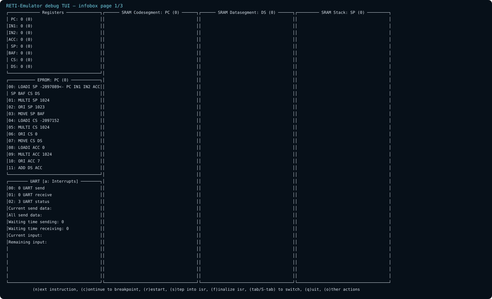

The first page exposes instruction stepping, continue, restart, ISR stepping,
window selection, and quitting. This is useful for following the bootloader's
polling loop and the first transition into SRAM.

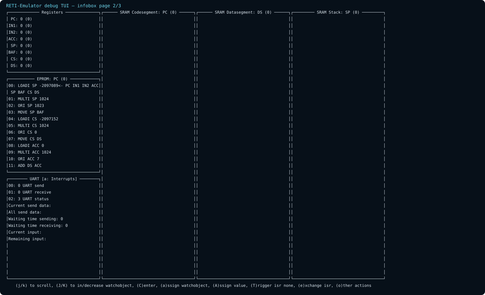

The second page scrolls/centers/selects watch objects, edits registers or
memory, selects an ISR, and triggers it manually. It makes the IVT and saved
activation layout inspectable without changing PicoOS source.

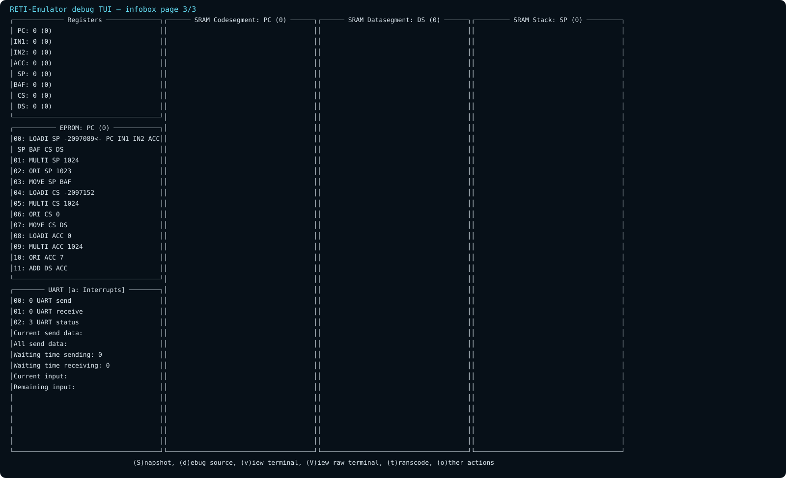

The third page saves/restores snapshots, opens PicoC source debugging, enters
normal/raw UART terminals, and changes SRAM interpretation. During continuous
execution the terminal remains live and each delivered input byte can raise a
UART hardware interrupt.

The TUI can follow live `CS`/`DS` as the bootloader installs the kernel and the
dispatcher switches processes. Compiler `.debuginfo`, preprocessed source,
labels, and `.sections` supply the source/section meaning that raw RETI words
cannot contain themselves. The emulator can therefore show source frames and
section-aware memory while still executing the same encoded words intended
for hardware.

Normal terminal view `v` leaves host signal processing active and returns with
Escape. Raw view `V` forwards control and escape bytes—including `Ctrl+C`,
`Ctrl+Z`, and arrow-key sequences—and returns with `Ctrl+]`. Raw mode is the
appropriate view for the PicoOS shell because these bytes drive terminal
signals and command-history editing.

## 1.3 UART host protocol

UART transports bytes only. PicoOS and the emulator place a small request
protocol on top of it. Requests start with escape byte 27 and end with
`<ESC>/`.

| Request form | Result |
| --- | --- |
| `<ESC>load <path><ESC>/` | Big-endian word count followed by binary bytes |
| `<ESC>read-range <offset> <count> <path><ESC>/` | Returned byte count followed by that file range |
| `<ESC>file-size <path><ESC>/` | File size as one 32-bit value |
| `<ESC>write <path><ESC>/` | Create/truncate a file and route following UART bytes to it |
| `<ESC>append <path><ESC>/` | Route following UART bytes to the end of a file |
| `<ESC>write stdout<ESC>/` / `stderr` | Restore a host standard output stream |
| `<ESC>pwd<ESC>/` | Host startup directory |
| `<ESC>is-directory <path><ESC>/` | Directory test |
| `<ESC>mkdir <path><ESC>/` | Create a directory |
| `<ESC>ls <path><ESC>/` | Length-prefixed directory listing |
| `<ESC>unlink <path><ESC>/` | Remove a file |
| `<ESC>rmdir <path><ESC>/` | Remove an empty directory |

These are fixed operations, not a generic host-command mechanism. The emulator
debugger additionally shows RETI registers, EPROM, SRAM, periphery state, PicoC
source, snapshots, and normal/raw UART terminals.

For `load`, the host returns the complete file length in words followed by the
file bytes; `UINT32_MAX` represents failure. `read-range`, `file-size`, `pwd`,
and `ls` begin their responses with a big-endian length/value. Output-selection
requests are different: after `<ESC>write path<ESC>/` or
`<ESC>append path<ESC>/`, ordinary subsequent UART bytes go to that host file
until PicoOS sends `<ESC>write stdout<ESC>/` or selects stderr.

This protocol is the boundary between PicoOS descriptor/path state and host
files. The compiler creates `.bin` files, the emulator both assembles and
serves them, the bootloader/process loader request them, and later kernel file
operations use the same UART transport for bounded host services.

# 2. Bootloading and kernel startup

## 2.1 Loading the kernel

The EPROM bootloader in
[`boot/bootloader.picoc`](boot/bootloader.picoc) has three important
functions:

| Function | Purpose and state change |
| --- | --- |
| `void _start(void)` | Establishes EPROM `CS`/`DS` and a temporary stack at the top of SRAM, then jumps to `boot_main()` |
| `void boot_main(void)` | Requests `kernel/kernel.bin`, validates and consumes its header, and copies the payload into SRAM |
| `void start_loaded_kernel(void)` | Converts relative code/data/stack values to SRAM addresses, replaces the boot stack with the kernel stack, and jumps to the kernel entry |

The bootloader has no dynamic memory and no process structures. Its locals and
call frames use the temporary SRAM stack. The loaded kernel image contains its
interrupt table, code, and initialized globals.

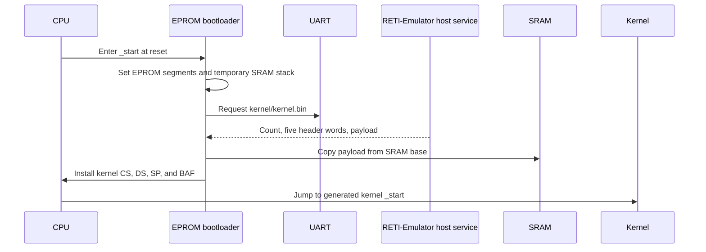

## 2.2 Initializing the kernel

The generated kernel `_start` calls
[`int main(void)`](kernel/kernel.picoc). Kernel initialization is deliberately
ordered around allocation and ownership:

### 2.2.1 Kernel startup code

The complete current kernel entry function is short enough to show directly:

```c
int main(void) {
    int init_pid;
    struct RunProcessRequest init_request;

    activate_kernel_stack_boundary();
    debug;
    init_kernel_heap();
    initialize_terminal();
    initialize_process_table();
    init_process_memory_heap();
    initialize_shared_memory();
    interrupt_controller_initialize();
    init_pid = load_process("system/init.bin", false);
    init_request.pid = init_pid;
    init_request.arguments = NULL;
    init_request.environment = NULL;
    if (mark_process_ready_with_arguments(&init_request)) {
        interrupt_controller_activate_timer();
        dispatcher_start_next_process();
    }
    return 0;
}
```

`init_request` is a kernel-stack object, not a persistent process-table entry.
`mark_process_ready_with_arguments()` consumes it to build init's process
stack and change its PCB from `NEW` to `READY`.

1. Activate the kernel heap/stack boundary
2. Initialize the kernel heap before any `kmalloc()` user
3. Initialize the global terminal singleton
4. Reset the process-list globals
5. Initialize the process-memory heap
6. Reset the named shared-memory registry
7. Configure interrupt-vector mappings and priorities
8. Load `system/init.bin` as a `NEW` process
9. Build init’s initial stack and change it to `READY`
10. Activate the timer and dispatch init

## 2.3 Entering normal execution

There is no ordinary infinite loop in `main()`. A successful dispatch leaves
the kernel through `RTI`. If all existing processes are blocked, the
dispatcher waits in kernel context until an interrupt makes one runnable.

| Kernel function | Purpose and state change |
| --- | --- |
| `int main(void)` | Initializes every global subsystem, creates PID 1, activates the timer, and enters the dispatcher |
| `void shutdown(void)` | Halts by jumping to the current instruction; it does not free structures because execution ends |

# 3. Kernel storage and ownership

## 3.1 Storage and lifetime

The most important implementation distinction is not the C type but where an
object lives and who releases it. “The process table,” for example, is not one
allocated table. It is a set of global list pointers plus separately allocated
PCB nodes.

| Object | Where it lives | Allocation | Main access path | Lifetime |
| --- | --- | --- | --- | --- |
| Process-list head/tail/current/PID counter | Kernel `.data` globals | Static | `first_process()`, `current_process()`, `find_process_by_pid()` | Whole kernel run |
| One `struct Process` PCB | Kernel heap | `kmalloc()` | Linked from `process_list_head` | Load until removal/reaping |
| Process image: code, data, userspace heap, stack | Process-memory arena | `pmalloc()` | PCB `base_address` and absolute pointers | Load until PCB removal |
| Activation and saved signal activation | Embedded in PCB | Part of PCB | `process->activation` | Same as PCB |
| Binary path and working directory | Kernel heap | `kmalloc()` copies | PCB pointers | Same as PCB, replaceable directory |
| File-descriptor table and entry array | Kernel heap | `kmalloc()` | `current_process()->file_descriptors` | Same as PCB |
| Regular-file descriptor path | Kernel heap | `kmalloc()` copy | Descriptor `path` | Close, replacement, or PCB removal |
| Kernel terminal and 128-cell ring | Kernel `.data` global | Static | `kernel_terminal()` | Whole kernel run |
| Wait-queue object | Embedded in PCB, terminal, or userspace mutex | No queue allocation | Owner field/address | Same as owner |
| Shared-memory registry head and next ID | Kernel `.data` globals | Static | Internal find helpers | Whole kernel run |
| Shared-memory entry/name | Kernel heap | `kmalloc()` | Registry linked list | Until unlinked and unused |
| Shared-memory data region | Process-memory arena | `pmalloc()` | Entry `address` | Until entry destruction |
| Per-process shared-memory attachment | Kernel heap | `kmalloc()` | PCB attachment list | Mapping until process removal |
| Kernel/process-memory heap descriptors | Kernel `.data` globals | Static | `kmalloc()`/`pmalloc()` | Whole kernel run |
| Heap block headers | Inside managed heap region | Written by allocator | Linked from `struct Heap` | Split/merged dynamically |
| Syscall request objects | Usually userspace stack | Local struct | Pointer in `IN1` | One syscall |
| Interrupt saved frame | Interrupted process stack | Register pushes and return cell | `caller_context` | Until return/copy |
| Interrupt vector table | Kernel `.ivt` section | Linked static array | CPU vector lookup | Whole kernel run |

Kernel-heap metadata and process/shared data regions use different allocators.
`kfree()` releases PCBs, names, paths, tables, and attachment nodes.
`pfree()` releases complete process images and shared-memory data regions. No
kernel object is allocated with userspace `malloc()`.

## 3.2 Ownership connections

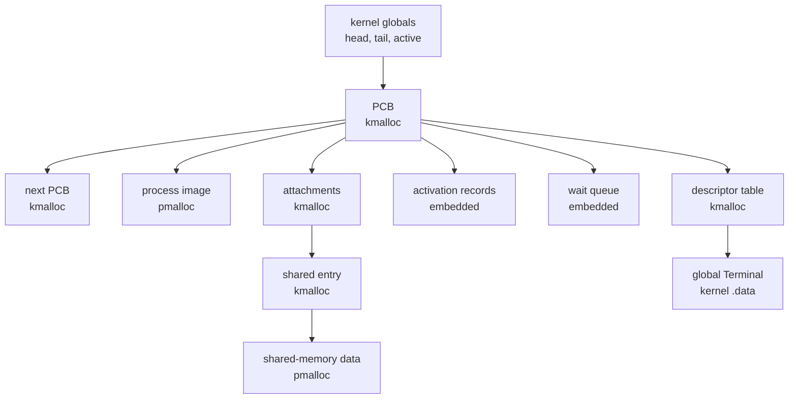

# 4. Interrupts, system calls, and exceptions

## 4.1 Interrupt vector table

The linked kernel has four vector cells at the beginning of SRAM:

```c
__attribute__((section("ivt")))
void (*interrupt_vector_table[OS_INTERRUPT_VECTOR_COUNT])(void) = {
    syscall_interrupt,
    timer_interrupt,
    uart_interrupt,
    cpu_exception_interrupt
};
```

| Vector | Entry | Source |
| ---: | --- | --- |
| 0 | `syscall_interrupt` | Software `INT 0` from userspace |
| 1 | `timer_interrupt` | Timer device |
| 2 | `uart_interrupt` | UART receive device |
| 3 | `cpu_exception_interrupt` | Fixed synchronous CPU exception vector |

An `INT` automatically saves only the interrupted return PC. Each ISR
explicitly saves any general registers it needs. `RTI` reloads the PC from
`SP + 1`, increments `SP`, and advances execution.

The interrupt controller has two static global arrays in kernel `.data`.
`interrupt_device_isrs[]` maps timer/custom/UART to `1/disabled/2`, and
`interrupt_device_priorities[]` assigns `1/0/2`. Initialization reads these
arrays and writes periphery registers 3–8; neither array uses `kmalloc()`.

## 4.2 Saved interrupt frame

System calls and process timer preemption create the same process-stack frame.
`caller_context` points to its free cell:

| Offset | Stored value |
| ---: | --- |
| `+0` | Free cell addressed by `caller_context` |
| `+1` | Saved `DS` |
| `+2` | Saved `CS` |
| `+3` | Saved `BAF` |
| `+4` | Saved `IN2` |
| `+5` | Saved `IN1` |
| `+6` | Saved `ACC` |
| `+7` | Return PC saved by interrupt entry |

`dispatcher_switch_from_context()` copies offsets 1–6 into the current PCB’s
embedded activation and records `activation.sp = caller_context + 6`. The
return PC remains at `activation.sp + 1` for the later `RTI`.

## 4.3 System-call path

Userspace wrappers place the syscall number in `ACC`, one integer or request
pointer in `IN1`, and execute `INT 0`. The naked entry saves the process
registers, disables the process boundary while changing stacks, installs
kernel segments and the kernel stack, and calls the normal C dispatcher:

```c
__attribute__((naked))
void syscall_interrupt(void) {
    asm("PUSH ACC");
    asm("PUSH IN1");
    asm("PUSH IN2");
    asm("PUSH BAF");
    asm("PUSH CS");
    asm("PUSH DS");

    // Switches to kernel CS, DS, SP and boundary
    // Passes number, argument, and saved context to handle_syscall()
    // Returns through a register-restoration stub
}
```

[`handle_syscall()`](kernel/syscall.picoc) has 38 selectors, numbered 0–37.
It is a dispatch hub rather than the owner of subsystem state:

```c
int handle_syscall(int number, int argument, int *caller_context) {
    if (number == SYSCALL_LOAD_PROCESS) {
        return load_process(
            ((struct LoadProcessRequest *)argument)->path,
            ((struct LoadProcessRequest *)argument)->show_loading_bar
        );
    } else if (number == SYSCALL_WAITPID) {
        return wait_for_process_by_pid(
            (struct WaitPidRequest *)argument,
            caller_context
        );
    } else if (number == SYSCALL_READ) {
        return read_file_descriptor(
            (struct IoRequest *)argument,
            caller_context
        );
    }
    // Process, signal, memory, file, and directory selectors
    return 0;
}
```

Immediate syscalls restore registers, place the C return value in `ACC`,
restore the process boundary, and execute `RTI`. Blocking, yielding, exiting,
and signal restoration may save or replace the activation and dispatch another
process instead.

| Selectors | Kernel subsystem reached |
| --- | --- |
| 0–2 | Direct UART byte send/receive and shutdown |
| 3–10 | Process load/list/unload, heap-bound queries, run, exit, and exact-child wait |
| 11–14 | Wait-queue sleep/wakeup, scheduler yield, and PID query |
| 15–20 | Open/read/write/close/seek and descriptor availability |
| 21–23 | Shared-memory open, map, and unlink |
| 24–25 | Descriptor `dup2` and test-only process reset |
| 26–30 | Signal install/send/return, parent-death control, and foreground/input owner |
| 31 | Userspace heap-exhaustion exception path |
| 32–37 | Working-directory, directory-list/create, file unlink, and directory removal |

Multi-argument calls use stack-local request structures such as
`LoadProcessRequest`, `RunProcessRequest`, `WaitPidRequest`, `SignalRequest`,
`KillRequest`, `ShmOpenRequest`, `OpenRequest`, `IoRequest`, and
`SeekRequest`. The kernel reads them through the absolute pointer in `IN1`.
They are not persistent kernel objects unless a subsystem explicitly copies a
referenced value, such as a path or shared-memory name.

## 4.4 Timer ISR and preemption

The timer is mapped to vector 1 with priority 1 and activated with an interval
of 1000 instructions after init becomes ready:

```c
__attribute__((naked))
void timer_interrupt(void) {
    // Pushes ACC, IN1, IN2, BAF, CS, and DS

    // If the saved PC belongs to kernel text:
    // Restore the six registers and RTI

    // Otherwise preserves the process SP and installs kernel context
    // Calls dispatcher_switch_from_context(old_sp)
}
```

Kernel work resumes directly. A process activation is saved and goes through
the scheduler. This is the implementation of a non-preemptive kernel with
preemptive userspace.

## 4.5 UART ISR

UART is mapped to vector 2 at the higher priority 2. The naked vector entry
temporarily enters kernel code, calls `handle_uart_interrupt()`, and restores
the exact interrupted context. The C portion is:

```c
void handle_uart_interrupt(void) {
    struct Process *process = terminal_input_process();
    struct Terminal *terminal = kernel_terminal();
    int value;
    int status;

    value = periphery_read_register(UART_RECEIVE_REGISTER) & 255;
    status = periphery_read_register(UART_STATUS_REGISTER);
    periphery_write_register(
        UART_STATUS_REGISTER,
        status | UART_RECEIVE_READY
    );

    if (handle_terminal_signal_character(value)) {
        return;
    }

    enqueue_terminal_byte(terminal, value);
    complete_pending_terminal_read(process, terminal);
}
```

The ISR acknowledges one byte. `Ctrl+C` and `Ctrl+Z` become foreground-process
signals. Any other byte enters the global terminal ring; if a process is
waiting, the handler writes the read result into that PCB’s saved
`activation.acc` and wakes it.

## 4.6 CPU exception path

Divide-by-zero, stack overflow, and illegal instruction set cause register 11
and enter vector 3. The exception ISR retains the interrupted code segment long
enough to identify a kernel or process fault, then loads the kernel context:

```c
__attribute__((naked))
void cpu_exception_interrupt(void) {
    // Preserves interrupted CS
    // Disables the old boundary and loads kernel CS, DS, and SP
    // Passes interrupted_cs - kernel_cs to handle_cpu_exception()
}
```

The normal C policy is:

```c
void handle_cpu_exception(int interrupted_kernel_cs_difference) {
    int cause = periphery_read_register(CPU_EXCEPTION_CAUSE_REGISTER);
    bool kernel_exception = interrupted_kernel_cs_difference == 0;

    print_cpu_exception_message(cause, kernel_exception);
    if (kernel_exception) {
        shutdown();
    }

    exit_process(PROCESS_EXIT_STATUS_EXCEPTION);
}
```

A user fault prints through descriptor 1 and terminates only the current
process. A kernel fault prints directly over UART and halts. Process heap
exhaustion is not a CPU exception; userspace invokes syscall 31, which calls
`handle_process_heap_full_exception()`. Kernel-heap exhaustion calls
`panic_kernel_heap_full()`.

Periphery register 10 protects the active heap/stack boundary:

- kernel boundary: `KERNEL_HEAP_START + KERNEL_HEAP_SIZE - 1`
- process boundary: `base_address + heap_start + heap_size - 1`

The dispatcher installs the selected process boundary before `RTI`. Interrupt
entries temporarily disable the old boundary while changing stacks.

## 4.7 Important interrupt and exception functions

| Function | Return | Effect on kernel/machine state |
| --- | --- | --- |
| `periphery_read_register(int register_index)` | Register value | Reads one periphery cell; no kernel structure changes |
| `periphery_write_register(int register_index, int value)` | `void` | Changes one device register |
| `interrupt_controller_initialize(void)` | `void` | Rewrites mappings/priorities from static arrays |
| `interrupt_controller_assign_device(int device, int interrupt_index, int priority)` | `void` | Writes one device vector and priority |
| `interrupt_controller_disable_device(int device)` | `void` | Writes mapping 255 and priority 0 |
| `interrupt_controller_activate_timer(void)` | `void` | Writes timer interval 1000 |
| `activate_kernel_stack_boundary(void)` | `void` | Selects kernel heap end in register 10 |
| `process_stack_boundary(struct Process *process)` | Absolute address | Computes one PCB’s heap end |
| `activate_current_process_stack_boundary(void)` | `void` | Writes current PCB boundary |
| `handle_cpu_exception(int interrupted_kernel_cs_difference)` | Does not return normally | Reads cause; shuts down or terminates current PCB |
| `handle_process_heap_full_exception(void)` | Does not return normally | Writes diagnostic, terminates current PCB, and dispatches |
| `panic_kernel_heap_full(void)` | Does not return | Writes diagnostic and shuts down |
| `handle_syscall(int syscall_number, int argument, int *caller_context)` | Selector-dependent | Delegates; may mutate, block, dispatch, terminate, or return |
| `send_byte_over_uart(int value)` | `void` | Polls UART send state and transmits the low byte; no kernel structure changes |
| `receive_byte_over_uart(void)` | Received byte | Polls UART receive state and returns one byte; no kernel structure changes |

# 5. Processes and the process table

## 5.1 Global process table

The process table is a singly linked list, not an array and not one
`kmalloc()` allocation. These four definitions in
[`kernel/process/process.picoc`](kernel/process/process.picoc) are globals in
kernel `.data`:

```c
struct Process *process_list_head = NULL;
struct Process *process_list_tail = NULL;
struct Process *active_process = NULL;
int next_process_id = 1;
```

`process_list_head` is the traversal entry, `process_list_tail` makes append
cheap, `active_process` is the PCB whose activation is currently in the CPU,
and `next_process_id` supplies monotonically increasing PIDs. Each linked PCB
is separately allocated with `kmalloc(sizeof(struct Process))`.
`first_process()` and `current_process()` provide access to the important
globals.

The scheduler scans this same list. There is no separate ready queue. Blocking
queues use a different intrusive link inside each PCB, so `next` remains
available for process-table order.

## 5.2 Activation record

The activation record is embedded in the PCB:

```c
struct ActivationRecord {
    int in1;
    int in2;
    int acc;
    int sp;
    int baf;
    int cs;
    int ds;
};
```

| Field | Restored machine state |
| --- | --- |
| `in1`, `in2`, `acc` | General argument/result registers at the suspension point |
| `sp` | Free cell immediately below the saved return PC on the process stack |
| `baf` | Base address of the interrupted PicoC function frame |
| `cs` | Absolute code-segment base used for instruction addresses |
| `ds` | Absolute data-segment base used for globals/static data |

These are the RETI registers required to resume a process.
`dispatcher_switch_from_context()` fills the record from an interrupt frame.
`dispatcher_jump_to_process()` reads it by fixed PCB offsets and restores the
registers. It is not a pointer to a stack frame and is not allocated
separately.

Each PCB also embeds `signal_saved_activation`. A custom signal handler copies
the normal activation there before changing the normal activation’s `sp`.
`sigreturn` later copies it back.

## 5.3 Process control block

The current PCB layout is:

```c
struct Process {
    int pid;
    int state;
    int base_address;
    int size;
    int heap_start;
    int heap_size;
    int word_count;
    char *binary_path;
    char *working_directory;
    struct ActivationRecord activation;
    struct FileDescriptorTable *file_descriptors;
    int *waiting_status_ptr;
    struct wait_queue waiters;
    struct wait_queue *waiting_queue_ptr;
    struct Process *wait_next;
    struct Process *next;
    struct SharedMemoryAttachment *shared_memory_attachments;
    int parent_pid;
    int parent_death_signal;
    int exit_status;
    int stopped_from_state;
    int pending_signals;
    int signal_handlers[SIGNAL_COUNT];
    int signal_restorer;
    bool handling_signal;
    struct ActivationRecord signal_saved_activation;
};
```

| Field(s) | Meaning and mutation |
| --- | --- |
| `pid` | Assigned from the global counter when the PCB is created; never changes |
| `state` | `NEW`, `READY`, `RUNNING`, `BLOCKED`, `STOPPED`, or `ZOMBIE`; changed by run, queues, signals, dispatcher, and termination |
| `base_address`, `size` | Absolute start and total cell count of the `pmalloc()` process image |
| `heap_start`, `heap_size` | Process-relative userspace heap start and cell count from the binary header/defaults |
| `word_count` | Loader-reported complete binary word count, including its five header words |
| `binary_path` | PCB-owned `kmalloc()` copy of the path used to load the binary |
| `working_directory` | PCB-owned absolute host path, copied from the parent or initialized with host `pwd` for PID 1 |
| `activation` | Embedded saved CPU context used by dispatcher and blocked syscall returns |
| `file_descriptors` | Pointer to a kernel-heap table and entry array owned by this PCB |
| `waiting_status_ptr` | Pointer into this process’s suspended userspace `waitpid()` frame; child exit/stop writes through it |
| `waiters` | Embedded FIFO queue of processes waiting for this process |
| `waiting_queue_ptr` | Queue currently containing this PCB, or `NULL` |
| `wait_next` | Intrusive link used only while this PCB is in one wait queue |
| `next` | Link in the global process list |
| `shared_memory_attachments` | Head of kernel-heap mapping records owned by this PCB |
| `parent_pid` | PID of the process that loaded this image; zero means no parent |
| `parent_death_signal` | Signal inherited at creation and sent when the parent terminates; zero disables it |
| `exit_status` | Status retained while the process is a zombie |
| `stopped_from_state` | Remembers whether `SIGTSTP` interrupted runnable or blocked state |
| `pending_signals` | Bit set; repeated equal signals collapse into one bit |
| `signal_handlers[]` | User addresses or default/ignore sentinels, embedded in the PCB |
| `signal_restorer` | User restorer address used after a custom handler |
| `handling_signal` | Prevents normal nested custom handlers |
| `signal_saved_activation` | Embedded pre-handler CPU state |

The PCB is kernel metadata, but its address fields refer into the separate
process image. Because RETI has no MMU, these are ordinary absolute pointers;
there is no address translation or protection between processes.

## 5.4 Process image and initial stack

`load_process()` allocates one contiguous region from the global
process-memory heap:


Before a process becomes ready, `store_process_arguments()` writes this layout
directly into the high end of its image:

| Order | Contents |
| --- | --- |
| 1 | Entry PC used by the first `RTI` |
| 2 | `argc` |
| 3 | `argv[]` pointers and terminating `NULL` |
| 4 | `envp[]` pointers and terminating `NULL` |
| 5 | Copied binary path, arguments, and environment strings |

All pointers in the tables are absolute SRAM addresses. `argv[0]` points to a
copy of `binary_path`; the supplied argument string supplies later entries;
`envp` begins immediately after `argv[argc] == NULL`. The entry cell contains
`activation.cs - 1` because the first `RTI` advances to the real entry. The
saved `SP` points to the free cell below it, while `BAF` is chosen so naked
`_start` observes `argc` and `argv` in normal argument positions.

Arguments and the initial environment are process-image data, not persistent
kernel allocations. Userspace `libstart` later clones the environment into
the process heap, so parent and child environment arrays become independent.

Loading and starting are deliberately separate operations:

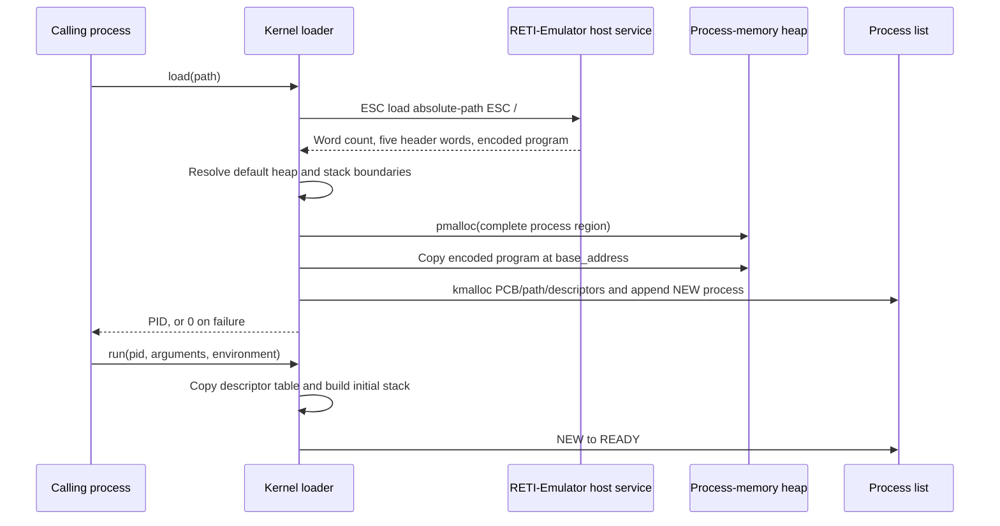

If the binary header contains `heap_size == -1`, PicoOS uses its 1000-cell
default. If `stack_start == -1`, it leaves another 1000 cells above the heap
for the downward-growing stack. An explicit stack start is rejected if it
overlaps the heap. These choices determine the size passed to `pmalloc()`;
the loader does not allocate code, heap, and stack as separate blocks.

## 5.5 States and lifetime

| State | Meaning | Typical transition |
| --- | --- | --- |
| `NEW` | Image and PCB exist but initial run state is incomplete | `load_process()` |
| `READY` | Eligible for the scheduler | Run setup, queue wakeup, or signal wakeup |
| `RUNNING` | Activation is loaded into the CPU | Dispatcher |
| `BLOCKED` | PCB is linked into one wait queue | Terminal read, `waitpid()`, or `sleep()` |
| `STOPPED` | Suspended by `SIGTSTP` | Signal subsystem |
| `ZOMBIE` | Terminated status retained for a parent | `terminate_process()` |

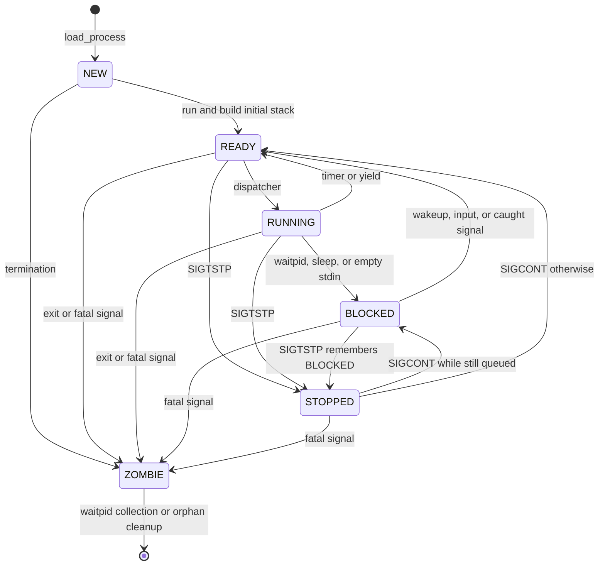

Loading and starting are separate. `load_process()` creates a `NEW` PCB.
`mark_process_ready_with_arguments()` inherits descriptor values, writes the
initial stack, and changes it to `READY`.

Creation first gives every PCB a new standard descriptor table. When a process
later calls `run`, `mark_process_ready_with_arguments()` deep-copies the
running caller’s descriptor table, destroys the child's initial table, and
installs the copy. PID 1 has no running caller and keeps its initial standard
table. The parent PID and working directory, in contrast, are established when
the image is loaded.

Termination first handles children, records status, changes the PCB to
`ZOMBIE`, wakes waiting parents, and sends `SIGCHLD`. An orphan or a child
whose parent was already waiting can be removed immediately. Otherwise the
zombie retains its PCB, image, descriptor table, paths, and attachments until
the parent collects it with `waitpid()`.

Final removal unlinks the PCB from a wait queue and process list, releases
shared-memory attachments, calls `pfree(base_address)`, destroys the descriptor
table, and frees PCB-owned strings and the PCB with `kfree()`.

## 5.6 Important process functions

| Function | Return | Data-structure effect |
| --- | --- | --- |
| `initialize_process_table(void)` | `void` | Resets head, tail, active pointer, and next PID globals |
| `create_process(int base_address, int size, int code_start, int data_start, int heap_start, int heap_size, int word_count, char *binary_path)` | PCB pointer or `NULL` | Allocates PCB/path/table metadata, initializes embedded state, inherits parent fields, appends PCB |
| `first_process(void)` | Head PCB | Reads global head |
| `current_process(void)` | Active PCB | Reads global active pointer |
| `set_current_process(struct Process *process)` | `void` | Replaces global active pointer |
| `find_process_by_pid(int pid)` | PCB or `NULL` | Scans list without mutation |
| `list_processes(void)` | `void` | Scans list and prints PID/path |
| `remove_process(struct Process *process)` | `void` | Internal final destructor for queues, list, image, attachments, table, strings, and PCB |
| `orphan_and_signal_children(struct Process *parent)` | `void` | Clears matching child parent PIDs, removes zombie children, and sends configured parent-death signals |
| `wake_parent_waiting_for_process(struct Process *process, int status)` | `void` | Writes status to the matching parent waiter, clears its pointer, and drains the process's waiter queue |
| `terminate_process(struct Process *process, int status)` | `void` | Orphans/signals children, stores status, makes zombie, wakes waiters, sends `SIGCHLD`, may remove |
| `exit_process(int status)` | Does not return normally | Terminates current PCB and dispatches |
| `unload_process_by_pid(int pid)` | Success | Terminates/removes a non-running target |
| `wait_for_process_by_pid(struct WaitPidRequest *request, int *caller_context)` | Immediate-completion flag | Collects status or stores status pointer and blocks caller on child queue |
| `enqueue_current_process_on_wait_queue(struct wait_queue *queue)` | `void` | Links current PCB at tail and changes it to `BLOCKED` |
| `sleep_on_wait_queue(struct wait_queue *queue, int *caller_context)` | Does not return immediately | Enqueues caller and saves/switches activation |
| `wakeup_wait_queue(struct wait_queue *queue)` | Whether one PCB woke | Removes FIFO head and makes it ready, or updates stopped-from state |
| `remove_from_wait_queue(struct Process *process)` | `void` | Unlinks one PCB and clears its intrusive fields |
| `process_heap_start(void)` | Absolute address | Reads current PCB memory fields |
| `process_heap_size(void)` | Size | Reads current PCB heap size |
| `remove_test_processes(void)` | `void` | Test hook that removes non-system processes and resets PID state |

Process-loading functions are kept separately:

| Function | Return | Data-structure effect |
| --- | --- | --- |
| [`load_process(char *path, bool show_loading_bar)`](kernel/process/process_loader.picoc) | PID or 0 | Receives header/payload, `pmalloc()`s image, creates and appends `NEW` PCB |
| [`store_process_arguments(struct Process *process, char *arguments, char **environment)`](kernel/process/process_arguments.picoc) | `void` | Writes initial stack/tables/strings into image and changes activation `sp`/`baf` |
| [`mark_process_ready_with_arguments(struct RunProcessRequest *request)`](kernel/process/process_arguments.picoc) | Success | Installs inherited descriptor copy, stores startup data, changes `NEW` to `READY` |

# 6. Blocking, waiting, synchronization, and signals

## 6.1 Wait queues

A wait queue contains only two PCB pointers:

```c
struct wait_queue {
    struct Process *head;
    struct Process *tail;
};
```

| Field | Meaning |
| --- | --- |
| `head` | First blocked PCB to wake, or `NULL` when empty |
| `tail` | Last blocked PCB, allowing constant-time append; also `NULL` when empty |

The remaining links live in each queued PCB: `wait_next` selects the next
waiter and `waiting_queue_ptr` points back to the owning queue.

The queue does not allocate list nodes. A blocked PCB supplies
`waiting_queue_ptr` and `wait_next`, so one process can be present in at most
one queue. Queue locations include:

- `process->waiters`, embedded in a PCB for exact-child `waitpid()`
- `terminal.input_waiters`, embedded in the global terminal
- `mutex.waiters`, embedded in a userspace mutex, possibly in shared memory

The last case works because there is no address isolation: userspace passes the
queue address to the kernel, which links PCB pointers through that memory.

`sleep_on_wait_queue()` changes the current PCB to `BLOCKED` and dispatches.
`wakeup_wait_queue()` wakes one FIFO entry. If a PCB is currently `STOPPED`, it
remains stopped but records that its underlying blocking condition has ended.

For `waitpid()`, the child owns the queue and the waiting parent owns
`waiting_status_ptr`. That pointer targets a status object in the suspended
parent’s process stack. Child stop or termination writes through the pointer,
clears it, and wakes the parent.

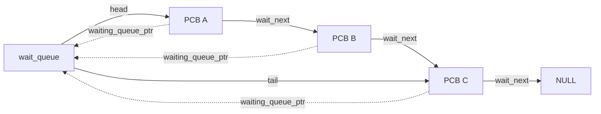

### 6.1.1 Sleeping and waking

`sleep(queue)` is not a timed delay. It invokes `SYSCALL_SLEEP`, appends the
current PCB to the supplied queue, changes it to `BLOCKED`, saves its
activation, and dispatches. `wakeup(queue)` invokes `SYSCALL_WAKEUP` and
removes at most the FIFO head. The woken PCB becomes `READY`, but the caller
keeps running until normal scheduling occurs. If the waiter is also
`STOPPED`, the kernel changes `stopped_from_state` to `READY` and leaves the
visible state stopped until `SIGCONT`.

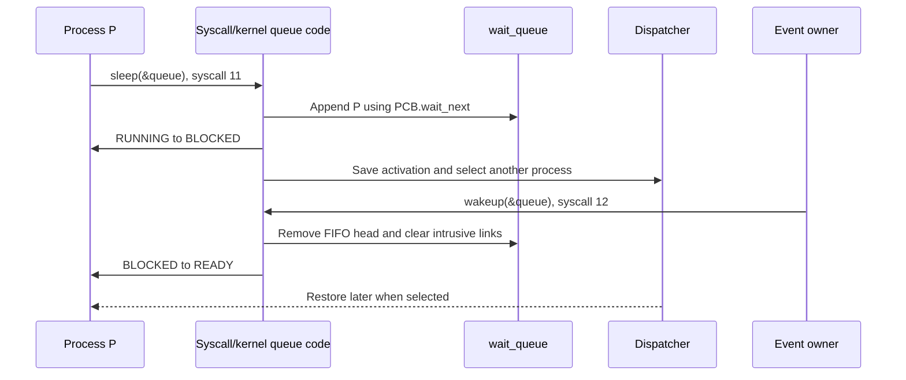

## 6.2 `waitpid()` and saved wait state

The public API waits for one exact child and has no options argument. Its
stack-local `struct WaitPidRequest` contains the target PID and a pointer to a
stack-local status cell. If the child is already stopped or a zombie, the
kernel writes the status immediately. Otherwise it stores the status pointer
in the waiting parent's PCB, puts that parent on the child's embedded
`waiters` queue, and dispatches.

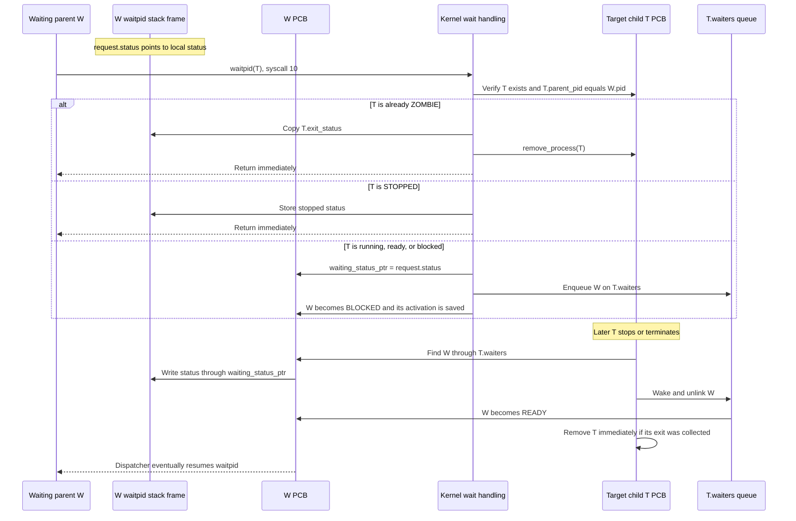

The request and status remain valid because the parent's userspace stack is
suspended while it is blocked. `waiting_status_ptr` is stored in the parent,
whereas the queue is stored in the child. If the child exits before the call,
it remains a `ZOMBIE` with `exit_status` until collected. Invalid PIDs and
non-children produce `-1`. Exact-child waiting matters to init and the shell:
a state change in another child must not complete the wrong wait.

## 6.3 Signals inside the PCB

Signal state is not stored in a global signal table. Almost all of it is
embedded in each PCB:

| PCB field | Role |
| --- | --- |
| `pending_signals` | Integer bit set; lower-numbered signals are selected first |
| `signal_handlers[SIGNAL_COUNT]` | Default, ignore, or user function address |
| `signal_restorer` | Userspace return stub |
| `handling_signal` | Prevents normal handler nesting |
| `signal_saved_activation` | Complete pre-handler CPU state |
| `stopped_from_state` | State reconsidered on `SIGCONT` |
| `parent_death_signal` | Signal delivered when the parent terminates |

The subsystem also has global `foreground_process_id` and
`terminal_input_process_id` integers in kernel `.data`. They are not PCB
pointers; lookup validates that the process still exists.

Five signals are implemented: `SIGKILL`, `SIGTERM`, `SIGCHLD`, `SIGCONT`, and
`SIGTSTP`. `SIGKILL` cannot be caught or ignored. `SIGCHLD` and `SIGCONT` are
ignored by default; `SIGTSTP` stops; other default actions terminate.

Sending a custom-handled signal sets one bit and, if necessary, removes a
blocked process from its queue, sets saved `ACC` to zero, and makes it ready.
Repeated delivery of the same pending signal does not create multiple records.
Default termination of the currently `RUNNING` PCB is also first represented
as a pending bit, because freeing the active interrupt-return context would be
unsafe; the dispatcher performs the termination before the next restore.

Before dispatch, `prepare_process_signal()` inspects pending bits. A default
action can terminate the PCB. A custom action copies the activation and builds
this process-stack frame:

| Cell relative to new free `SP` | Value |
| ---: | --- |
| `+1` | Handler address minus one, consumed by `RTI` |
| `+2` | Signal restorer address |
| `+3` | Signal number argument |

The next `RTI` enters the user handler. The restorer invokes `sigreturn`; the
kernel restores `signal_saved_activation`, clears `handling_signal`, and
redispatches. Normal custom handlers are not nested, although `SIGKILL` is
still honored.

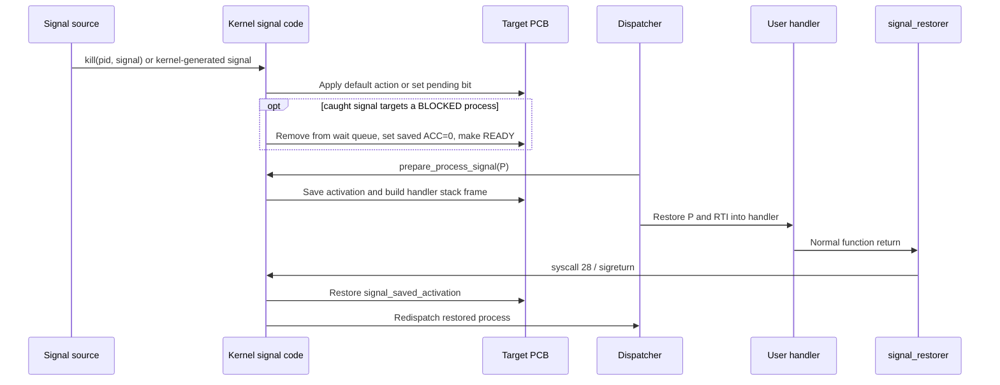

Raw-terminal `Ctrl+C` and `Ctrl+Z` arrive as UART bytes 3 and 26. The UART ISR
consumes them before ring-buffer insertion and resolves
`foreground_process_id`; byte 3 sends `SIGTERM`, while byte 26 sends
`SIGTSTP`. The shell changes this global before and after foreground waiting,
so background work does not receive prompt-time terminal signals.

## 6.4 Important signal functions

| Function | Return | Data-structure effect |
| --- | --- | --- |
| `install_signal_handler(struct SignalRequest *request)` | Previous handler or `-1` | Changes current PCB handler entry and restorer |
| `send_signal_by_pid(struct KillRequest *request)` | 0 or `-1` | Finds target; signal 0 only checks existence |
| `send_signal_to_process(struct Process *process, int signal_number)` | `void` | Continues, stops, terminates, ignores, or sets a pending bit |
| `queue_signal_handler(struct Process *process, int signal_number)` | `void` | Internal: sets bit and wakes a blocked target |
| `stop_process(struct Process *process)` | `void` | Saves prior state, changes to `STOPPED`, reports to waiters |
| `continue_process(struct Process *process)` | `void` | Restores `BLOCKED` if still queued, otherwise changes to `READY` |
| `prepare_process_signal(struct Process *process)` | Dispatchable flag | Consumes next bit; may terminate or prepare handler activation |
| `begin_signal_handler(struct Process *process, int signal_number)` | `void` | Copies activation, writes handler frame, changes activation `sp` |
| `restore_signal_context(void)` | Does not return normally | Restores activation, clears handling, makes ready, dispatches |
| `set_parent_death_signal(struct PrctlRequest *request)` | 0 or `-1` | Changes current PCB parent-death setting |
| `set_foreground_process(int pid)` | 0 or `-1` | Changes foreground/input-owner globals after validating a direct child |
| `terminal_input_process(void)` | PCB pointer | Resolves input owner or falls back to current PCB |
| `handle_terminal_signal_character(int value)` | Consumed flag | Maps `Ctrl+C`/`Ctrl+Z` to foreground signals |

When a parent terminates, every direct child gets `parent_pid = 0`. Zombie
children are removed; live children receive their configured parent-death
signal. This is part of `terminate_process()`, not a background reaper.

## 6.5 Mutexes

Userspace mutexes combine one lock cell with an embedded wait queue. Atomic
`TSL` changes the lock from 0 to 1 while returning the old value. A contending
process sleeps on the mutex queue instead of spinning; unlock clears the lock
and wakes one waiter.

The mutex is userspace data, not a kernel-heap object. In a shared-memory data
region, both its lock and queue are visible to all participants. The kernel
still owns the PCBs linked through that queue.

# 7. Scheduler and dispatcher

The scheduler chooses a PCB. The dispatcher saves/restores CPU state and
changes which PCB is current.

## 7.1 Scheduler

There is no scheduler object or ready queue.
[`scheduler_next_process()`](kernel/scheduler.picoc) reads the process list and
active PCB. It begins after the current PCB, wraps once, and returns the first
`READY` or still-current `RUNNING` PCB. Other states remain in the list but are
skipped.

```c
struct Process *scheduler_next_process(void) {
    struct Process *start;
    struct Process *candidate;

    if (first_process() == NULL) {
        return NULL;
    }
    if (current_process() == NULL || current_process()->next == NULL) {
        start = first_process();
    } else {
        start = current_process()->next;
    }

    candidate = start;
    while (candidate != NULL) {
        if (scheduler_can_run(candidate)) {
            return candidate;
        }
        candidate = candidate->next;
    }

    candidate = first_process();
    while (candidate != start) {
        if (scheduler_can_run(candidate)) {
            return candidate;
        }
        candidate = candidate->next;
    }
    return NULL;
}
```

Including `RUNNING` permits the current process to be selected again when it is
the only runnable one.

## 7.2 Saving and selecting

Timer preemption, `yield()`, terminal blocking, queues, and `waitpid()`
eventually pass a saved frame to:

```c
void dispatcher_switch_from_context(int *caller_context) {
    struct Process *process = current_process();

    if (process != NULL) {
        process->activation.sp = (int)(caller_context + 6);
        process->activation.ds = caller_context[1];
        process->activation.cs = caller_context[2];
        process->activation.baf = caller_context[3];
        process->activation.in2 = caller_context[4];
        process->activation.in1 = caller_context[5];
        process->activation.acc = caller_context[6];

        if (process->state == PROCESS_STATE_RUNNING) {
            process->state = PROCESS_STATE_READY;
        }
    }
    dispatcher_start_next_process();
}
```

Blocking code has already changed the PCB to `BLOCKED`, so that state remains.
Timer preemption or `yield()` reaches the dispatcher from `RUNNING`, which
becomes `READY`.

`dispatcher_start_next_process()` schedules and calls
`prepare_process_signal()` before running a PCB. Signal preparation can remove
that PCB, requiring another pass. If all existing processes are blocked, the
loop waits in kernel context until an interrupt makes one ready.

## 7.3 Restoring

`dispatcher_switch_to_process()` updates old/new states and the global active
pointer, then enters:

```c
__attribute__((naked))
void dispatcher_jump_to_process(struct Process *process, int stack_boundary) {
    asm("LOADIN SP BAF 2");
    asm("LOADIN SP IN1 3");
    asm("LOADI ACC 1048576");
    asm("MULTI ACC 1024");
    asm("STOREIN ACC IN1 10");
    asm("LOADIN BAF SP 12");
    asm("LOADIN BAF CS 14");
    asm("LOADIN BAF DS 15");
    asm("LOADIN BAF IN1 9");
    asm("LOADIN BAF IN2 10");
    asm("LOADIN BAF ACC 11");
    asm("LOADIN BAF BAF 13");
    asm("RTI");
}
```

The fixed offsets are why `activation` must remain at its defined PCB
position. The helper writes the boundary, restores the activation, and leaves
kernel code through `RTI`.

| Function | Return | Data-structure effect |
| --- | --- | --- |
| `scheduler_next_process(void)` | Runnable PCB or `NULL` | Reads list/current globals |
| `dispatcher_switch_from_context(int *caller_context)` | Does not return on switch | Copies frame to activation, may change `RUNNING` to `READY` |
| `dispatcher_start_next_process(void)` | Normally leaves through `RTI` | Schedules, consumes signal actions, waits if all blocked |
| `dispatcher_switch_to_process(struct Process *process)` | Does not return normally | Updates states and active pointer |
| `dispatcher_jump_to_process(struct Process *process, int stack_boundary)` | Leaves through `RTI` | Writes boundary and restores activation |

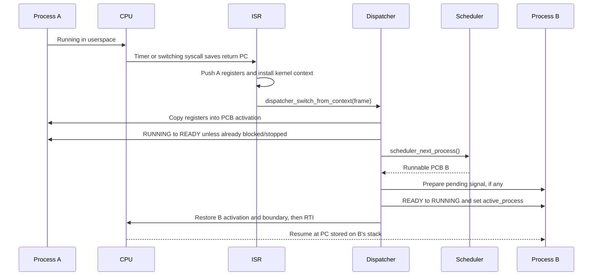

# 8. Memory management and shared memory

## 8.1 Three uses of one heap implementation

```c
struct BlockHeader {
    int size;
    bool free;
    struct BlockHeader *next;
};

struct Heap {
    struct BlockHeader *first_block;
};
```

`struct Heap` is only an entry pointer. Each `BlockHeader` is stored inside the
managed region immediately before its payload. Allocation performs a first-fit
scan and may split a block. Free marks it and merges adjacent free blocks.
Reallocation shrinks/splits, grows into a following free block, or
allocates/copies/frees.

| Field | Meaning |
| --- | --- |
| `BlockHeader.size` | Number of usable cells after this header and before the next header |
| `BlockHeader.free` | Whether the associated cells may satisfy an allocation |
| `BlockHeader.next` | Address of the next in-region header, or `NULL`; splitting inserts and merging removes links |
| `Heap.first_block` | First header in the managed region; the descriptor owns no separate block array |

Allocator sizes are RETI memory cells. PicoC’s scalar values occupy one 32-bit
cell, so no separate byte-alignment layer is needed in these heaps.

| Heap instance | Descriptor location | Managed region | Contents |
| --- | --- | --- | --- |
| Kernel heap | Global `kernel_heap` in kernel `.data` | Fixed region after kernel data | PCBs and kernel metadata |
| Process-memory heap | Global `process_memory_heap` in kernel `.data` | SRAM after kernel stack | Complete process images and shared-memory data regions |
| One userspace heap per process | Global `process_heap` in that process’s `.data` | Heap range inside its image | Userspace allocations |

“Global” is therefore relative to the linked program. Every process receives
its own copy of the library’s `process_heap` global.

### 8.1.1 Current kernel SRAM layout

The checked-in [`kernel/memory_constants.header`](kernel/memory_constants.header)
currently describes these offsets relative to `SRAM_BASE`. They are generated
values and move when linked kernel code/data sizes change:

| SRAM offset | Region and ownership |
| ---: | --- |
| `0..3` | Four-cell kernel `.ivt` |
| `4..35668` | Kernel `.text` beginning at `KERNEL_CS_START_ASM` |
| `35669..36333` | Kernel `.data`, including process-list pointers, terminal, registry heads, and heap descriptors |
| `36334..40429` | 4096-cell kernel heap beginning at `KERNEL_HEAP_START` |
| `40430..43144` | Reserved room for the downward-growing kernel stack |
| `43145` | Initial kernel `SP`, the free cell immediately below its first stack value |
| `43146..262143` | Global process-memory heap beginning at `PROCESS_MEMORY_START` |

The interrupt boundary for kernel execution is the final kernel-heap cell.
The process-memory heap shares its free-block list between complete process
images and shared-memory data regions.

### 8.1.2 Per-process linked layout

Inside one `pmalloc()` process image, the `.sections`/binary header values have
the following relationship:

| Relative address | Role |
| --- | --- |
| `codesegment_start` | Added to `base_address` for initial `CS`/entry |
| `datasegment_start` | Added to `base_address` for `DS` |
| `heap_start` | First header of the process-global `process_heap` |
| `heap_start + heap_size - 1` | Inclusive boundary installed in periphery register 10 |
| `stack_start` | Initial free `SP`; the stack grows downward through the gap above the heap |

The kernel relocates only by adding the image's absolute `base_address` to
these linked offsets. There is no MMU or later relocation. Compiler
`.sections` data becomes the five-word `.bin` header in RETI-Emulator; the
loader consumes that header to fill PCB fields and allocate the one complete
image; `libstart` then asks the PCB-backed syscalls for the absolute heap
range.

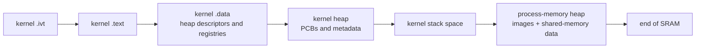

## 8.2 Heap and allocator functions

| Function | Return | Data-structure effect |
| --- | --- | --- |
| `heap_init_region(struct Heap *heap, void *start, int cell_count)` | `void` | Points heap at one initial free header written into region |
| `heap_alloc_from(struct Heap *heap, int size)` | Payload or `NULL` | First-fit scan, optional split, marks block used |
| `heap_realloc_from(struct Heap *heap, void *ptr, int size)` | Payload or `NULL` | May split, merge/grow, move/copy, or free on zero |
| `heap_free_from(struct Heap *heap, void *ptr)` | `void` | Marks preceding header free and merges |
| `init_kernel_heap(void)` | `void` | Initializes global kernel descriptor |
| `kmalloc(int size)` | Kernel pointer | Allocates from kernel heap; positive failure panics |
| `krealloc(void *ptr, int size)` | Kernel pointer | Reallocates in kernel heap; positive failure panics |
| `kfree(void *ptr)` | `void` | Releases/merges kernel block |
| `init_process_memory_heap(void)` | `void` | Initializes process-memory descriptor over remaining SRAM |
| `pmalloc(int size)` | Absolute start or invalid sentinel | Allocates process/shared region |
| `prealloc(int start, int size)` | Absolute start or invalid sentinel | Reallocates process-memory region |
| `pfree(int start)` | `void` | Releases/merges process-memory region |

The stack-boundary register catches stack growth into the configured heap, but
there is no isolation between arbitrary process data accesses and other memory.

## 8.3 Shared-memory registry and attachments

```c
struct SharedMemoryEntry {
    char *name;
    int id;
    void *address;
    size_t size;
    int reference_count;
    bool unlink_requested;
    struct SharedMemoryEntry *next;
};

struct SharedMemoryAttachment {
    struct SharedMemoryEntry *entry;
    struct SharedMemoryAttachment *next;
};
```

`shared_memory_list_head` and `next_shared_memory_id` are kernel globals. Each
entry and name use `kmalloc()`. The data region uses `pmalloc()` and lies beside
process images. Mapping allocates an attachment with `kmalloc()`, links it into
the current PCB, increments the count, and returns the same absolute data
pointer to every mapper.

| Entry field | Meaning |
| --- | --- |
| `name` | Kernel-owned lookup name; freed and set to `NULL` on unlink |
| `id` | Numeric open/map handle |
| `address` | Absolute start of the `pmalloc()` shared-memory data region |
| `size` | Shared data size in cells |
| `reference_count` | Attachment count, not distinct PID count |
| `unlink_requested` | Defers destruction until the last attachment disappears |
| `next` | Link in global registry |

| Attachment field | Meaning and ownership |
| --- | --- |
| `entry` | Non-owning pointer to the registry entry whose reference count this mapping contributes to |
| `next` | Link in one PCB's `shared_memory_attachments` list |

Opening an existing name returns its ID and does not resize it. Unlink removes
the name immediately. With no attachment the entry is destroyed; otherwise it
survives by ID until release. The old ID can still be mapped while that entry
exists, and opening the former name can create a new entry. Process removal
decrements counts, frees attachments, and destroys eligible unlinked entries.

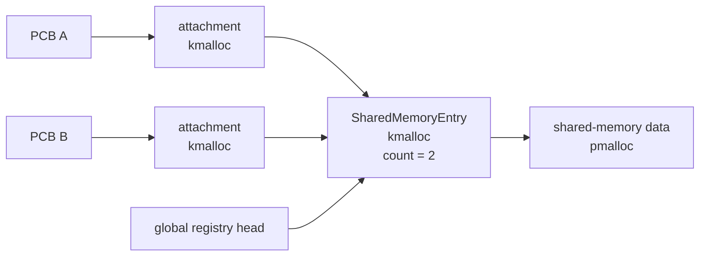

The two-list design is important: the global registry answers name/ID lookup,
while each PCB's attachment list records which reference counts must be
released when that process disappears. There is no `munmap()` call, so every
successful `mmap(id)` creates one attachment and one reference even if the
same process maps the ID more than once.

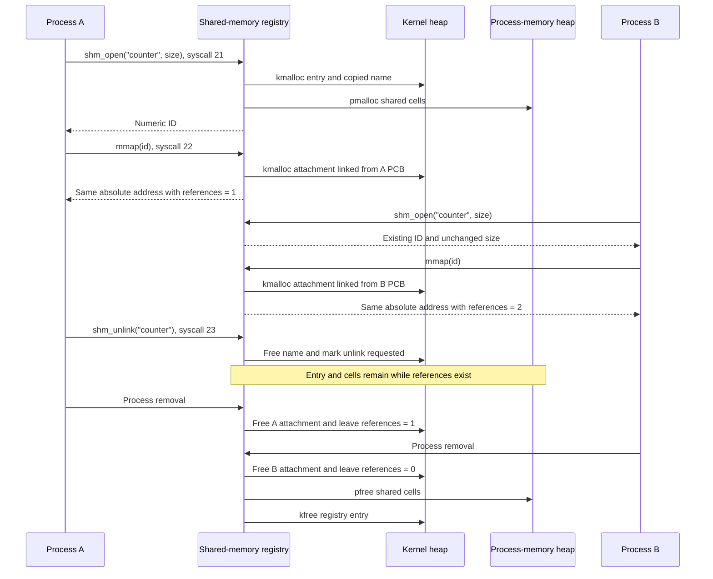

Unlinking removes the name immediately, not the entry's ID. While an unlinked
entry still has attachments, a caller that already knows its ID can map it and
the former name can be used to create a separate new entry. The old entry is
destroyed only after its reference count reaches zero. The registry provides
lifetime and shared visibility; a mutex or another protocol is still required
for concurrent updates.

| Function | Return | Data-structure effect |
| --- | --- | --- |
| `initialize_shared_memory(void)` | `void` | Resets registry head and next ID |
| `open_shared_memory(struct ShmOpenRequest *request)` | ID or `-1` | Finds existing or allocates entry/name/data region and prepends |
| `map_shared_memory(int shared_memory_id)` | Address or `NULL` | Adds PCB attachment and increments count |
| `unlink_shared_memory(char *name)` | 0 or `-1` | Frees name, sets unlink flag, may destroy |
| `release_process_shared_memory(struct Process *process)` | `void` | Clears attachments, decrements counts, destroys eligible entries |
| `destroy_shared_memory_entry(struct SharedMemoryEntry *entry)` | `void` | Internal: unlinks entry, `pfree()`s data region, `kfree()`s metadata |

Shared memory provides visibility, not mutual exclusion. The shared-memory
mutual-exclusion test places a mutex and its queue in the shared data region.

### 8.3.1 Shared-memory tests

The basic shared-memory scenario starts several worker processes with the same
name and different array indices. Each calls `shm_open()` and `mmap()`, writes
one distinct cell, and exits. The launcher waits for them and observes all
values through its own mapping, demonstrating that the returned addresses
refer to the same physical data rather than copies.

The mutual-exclusion scenario deliberately shares one value:

```c
struct SharedState {
    int value;
    struct mutex mutex;
};
```

The launcher creates a region of `sizeof(struct SharedState)`, initializes the
value and embedded mutex, and passes the numeric shared-memory ID to workers.
One worker yields while holding the lock. The other worker's `TSL` sees the
locked cell and its `sleep()` queues that PCB on the shared embedded wait
queue; `mutex_unlock()` clears the cell and wakes it. This connects the
process-memory allocation, per-PCB attachment records, atomic emulator
instruction, kernel wait queues, scheduler, and dispatcher in one test.

# 9. Terminal, file descriptors, and host filesystem

PicoOS does not store file contents in SRAM. The kernel supplies process-local
descriptor state, path normalization, terminal blocking, and a UART protocol;
the emulator performs the actual host file operations.

## 9.1 Per-process descriptor table

Each PCB owns one table object and one six-entry array, both allocated with
`kmalloc()`:

```c
struct FileDescriptor {
    int kind;
    int flags;
    int offset;
    char *path;
};

struct FileDescriptorTable {
    struct FileDescriptor *entries;
};
```

Valid descriptor numbers are 0–5. A new table initializes 0 as read-only
stdin, 1 as write-only stdout, and 2 as write-only stderr. All three store the
special path `/device/terminal`. Entries 3–5 begin free, although closing a
standard descriptor allows a later open to reuse its number.

| Descriptor field | Meaning and ownership |
| --- | --- |
| `kind` | Free, stdin, stdout, stderr, or regular host file |
| `flags` | Access mode plus create/truncate/append flags |
| `offset` | Per-descriptor logical position; reads and successful writes advance it |
| `path` | Kernel-owned absolute path; `/device/terminal` selects the kernel terminal |

Descriptor inheritance deep-copies the table, entries, and paths.
Offsets are copied by value and later diverge; PicoOS has no Unix-style shared
open-file descriptions. The terminal itself remains a kernel singleton; only
its special path is copied into each applicable descriptor.

`dup2()` frees the target path, copies scalar fields, allocates a new path copy
if needed, and replaces the target. Closing frees the path and resets every
field. Destroying a table frees all paths, the entry array, and table, but
never the global terminal.

## 9.2 Global terminal

Terminal input does not live in each descriptor table. One global
`struct Terminal terminal` is stored directly in kernel `.data`:

```c
struct Terminal {
    char input_buffer[TERMINAL_INPUT_BUFFER_CAPACITY];
    int input_head;
    int input_tail;
    int input_count;
    struct wait_queue input_waiters;
    char *pending_read_buffer;
    int pending_read_count;
    bool pending_character_read;
};
```

| Terminal field | Meaning |
| --- | --- |
| `input_buffer[128]` | Embedded ring storage; no `kmalloc()` allocation |
| `input_head` | Index of next byte to consume |
| `input_tail` | Index of next insertion |
| `input_count` | Distinguishes full from empty when indices match |
| `input_waiters` | Embedded FIFO queue of blocked reader PCBs |
| `pending_read_buffer` | Pointer into blocked input owner’s process memory |
| `pending_read_count` | Maximum requested byte count |
| `pending_character_read` | Single-character syscall versus buffered `read()` |

`kernel_terminal()` returns `&terminal`. When the ring is full, a new byte
discards the oldest. A read copies as many available bytes as possible and
need not fill the requested count.

The descriptor layer reaches this object through the hardcoded virtual path
`/device/terminal`. Opening that path skips host-file requests, terminal reads
use the input ring, terminal writes use UART output, and seeking fails. The
release tree also contains `binary/device/terminal.dev` as a visible dummy
device marker; it stores no terminal data and is not the implementation.

If the ring is empty, `begin_terminal_read()` briefly disables UART delivery
to prevent a lost wakeup, stores buffer/count/kind in the terminal, enqueues
the current PCB on `input_waiters`, restores UART routing, and dispatches. A
later UART ISR copies bytes, stores the result in `process->activation.acc`,
clears pending state, and wakes the reader.

The shell transfers `terminal_input_process_id` between itself and one
foreground child. This makes one pending-reader slot sufficient for the small
job-control model.

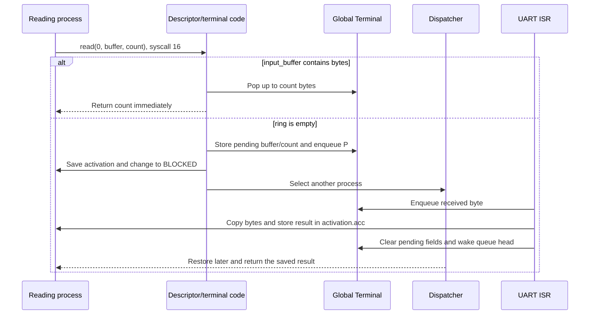

## 9.3 Descriptor and terminal functions

| Function | Return | Data-structure effect |
| --- | --- | --- |
| `create_file_descriptor_table(void)` | Table or `NULL` | Allocates table/entries and gives standard descriptors the terminal device path |
| `inherit_file_descriptors(struct FileDescriptorTable *source)` | Copy or `NULL` | Deep-copies entries and paths |
| `destroy_file_descriptor_table(struct FileDescriptorTable *table)` | `void` | Frees paths, entry array, and table |
| `close_file_descriptor(int file_descriptor)` | 0 or `-1` | Frees path and resets selected entry |
| `duplicate_file_descriptor(struct Dup2Request *request)` | Target or `-1` | Replaces target with independent copy |
| `file_descriptor_is_valid(int file_descriptor)` | Boolean | Reads fixed range |
| `file_descriptor_can_read(struct FileDescriptor *descriptor)` | Boolean | Reads access bits |
| `file_descriptor_can_write(struct FileDescriptor *descriptor)` | Boolean | Reads access bits |
| `initialize_terminal(void)` | `void` | Resets global ring, queue, and pending-read fields |
| `kernel_terminal(void)` | Global pointer | No mutation |
| `is_terminal_device_path(char *path)` | Boolean | Recognizes `/device/terminal` |
| `pop_terminal_byte(struct Terminal *terminal)` | Byte | Advances head and decrements count |
| `copy_terminal_bytes(struct Terminal *terminal, char *buffer, int count)` | Count | Pops bytes into process buffer |
| `enqueue_terminal_byte(struct Terminal *terminal, int value)` | `void` | Inserts at tail; may discard oldest |
| `begin_terminal_read(struct Terminal *terminal, char *buffer, int count, bool character_read, int *caller_context)` | Immediate or later result | Reads ring or fills pending fields, queues PCB, saves activation, dispatches |
| `read_stdin_character(int *caller_context)` | Character | Uses singleton terminal in character mode |
| `complete_pending_terminal_read(struct Process *process, struct Terminal *terminal)` | `void` | Internal: copies available input, writes saved `activation.acc`, clears pending fields, wakes reader |
| `handle_uart_interrupt(void)` | `void` | Acknowledges byte, signals target or mutates terminal/reader PCB |

## 9.4 Opening, reading, writing, and seeking

| Flag | Meaning in `OpenRequest.flags` |
| --- | --- |
| `O_RDONLY`, `O_WRONLY`, `O_RDWR` | Two-bit access mode checked by later read/write calls |
| `O_CREAT` | Allows a missing path to be created |
| `O_TRUNC` | With writable access, sends `<ESC>write path<ESC>/` during open to create/empty the file |
| `O_APPEND` | Records append intent; regular PicoOS writes append in all writable file modes |

`open_file_descriptor()` normalizes a path against the current PCB’s working
directory, selects the lowest free descriptor, allocates an absolute path copy,
and fills that entry. `O_TRUNC` with a writable mode asks the host to
create/truncate immediately. Without `O_TRUNC`, a missing file is created only
with `O_CREAT`. The special `/device/terminal` path bypasses these host-file
operations and opens the kernel terminal directly.

`read_file_descriptor()` validates the entry and read mode. A descriptor whose
path is `/device/terminal` reads from the kernel terminal and may block. Any
other file path sends a ranged host request at `descriptor->offset`, copies
returned bytes, and advances the offset.

`write_file_descriptor()` validates write mode. Stdout sends bytes directly.
Stderr temporarily selects host stderr. A regular file selects
`append <path>`, sends the requested bytes, restores stdout, and advances its
offset. Regular-file writes are append-only: `O_TRUNC` implements shell `>` by
emptying at open time, while opening without truncation implements `>>`.
An explicitly opened `/device/terminal` writes directly to terminal stdout.
Seeking changes the logical read offset but not the append destination and is
rejected for the terminal device.

| Function | Return | Data-structure effect |
| --- | --- | --- |
| `open_file_descriptor(struct OpenRequest *request)` | Descriptor or `-1` | Allocates path and changes a free entry to regular file |
| `read_file_descriptor(struct IoRequest *request, int *caller_context)` | Count or `-1` | Advances file offset, or changes terminal/queue/activation |
| `write_file_descriptor(struct IoRequest *request)` | Count or `-1` | Routes UART output and advances offset |
| `seek_file_descriptor(struct SeekRequest *request)` | New offset or `-1` | Replaces regular-file offset |

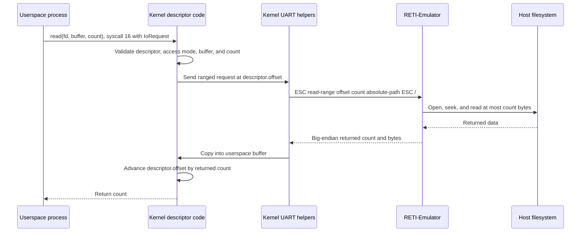

## 9.5 Working directories and host operations

Every PCB owns a kernel-heap absolute working-directory string. PID 1 has no
parent, so creation sends `pwd` to the emulator and stores the host startup
directory. A child receives its own copy of the parent’s string. Changing
directory validates a normalized path with the host before freeing the old
copy and installing the new one. It never changes the emulator process’s
actual working directory.

Path normalization starts at `/`, prepends the PCB directory for a relative
path, removes repeated separators and `.`, resolves `..` without moving above
root, and enforces `PATH_MAX`.

| Function | Return | Data-structure effect |
| --- | --- | --- |
| `build_process_path(char *path, char *result, int capacity)` | Success | Reads PCB directory and writes normalized local result |
| `set_process_working_directory(struct Process *process, char *path)` | Success | Allocates new kernel copy, frees old string, replaces PCB pointer |
| `initialize_working_directory(struct Process *process)` | 0 or `-1` | Receives host `pwd` and sets first PCB directory |
| `get_working_directory(struct GetCwdRequest *request)` | 0 or `-1` | Copies PCB string into caller buffer |
| `change_working_directory(char *path)` | 0 or `-1` | Validates host directory and replaces current PCB string |
| `make_host_directory(char *path)` | Host status | Normalizes and sends `mkdir`; no kernel table mutation |
| `read_host_directory(struct ReadDirectoryRequest *request)` | Count or `-1` | Writes host listing into caller buffer |
| `unlink_host_file(char *path)` | Host status | Sends bounded host unlink request |
| `remove_host_directory(char *path)` | Host status | Sends bounded host rmdir request |

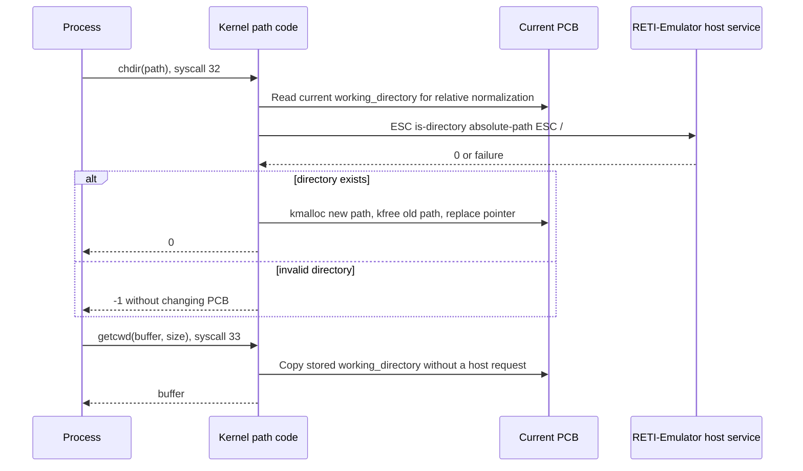

# 10. Libraries and the userspace/kernel ABI

Public interfaces live under `library`; structures and constants shared with
the kernel live under `common`; kernel-private structures remain under
`kernel`. PicoC uses `.header` as its header extension. Familiar C/POSIX names
describe the role of an interface, but do not imply complete compatibility.

## 10.1 System-call request structures

A system call has room for one integer argument in `IN1`. Wrappers that need
several values therefore create a request structure in their current userspace
stack frame, put its absolute address in `IN1`, put the selector in `ACC`, and
execute `INT 0`. The structures are declared in
[`common/syscall.header`](common/syscall.header) and
[`common/file.header`](common/file.header):

```c
struct LoadProcessRequest { char *path; bool show_loading_bar; };
struct RunProcessRequest { int pid; char *arguments; char **environment; };
struct WaitPidRequest { int pid; int *status; };
struct SignalRequest { int signal_number; int handler; int restorer; };
struct KillRequest { int pid; int signal_number; };
struct PrctlRequest { int option; int argument; };
struct ShmOpenRequest { char *name; size_t size; };
struct GetCwdRequest { char *buffer; int size; };
struct ReadDirectoryRequest { char *path; char *buffer; int capacity; };

struct OpenRequest { char *path; int flags; };
struct IoRequest {
    int file_descriptor;
    char *buffer;
    int count;
    bool show_loading_bar;
};
struct SeekRequest {
    int file_descriptor;
    int offset;
    int origin;
    bool show_loading_bar;
};
struct Dup2Request { int old_file_descriptor; int new_file_descriptor; };
```

These request objects are not allocated with `malloc()`, `kmalloc()`, or
`pmalloc()`: they are ordinary locals in the caller's process stack. The
kernel reads them synchronously through the absolute pointer. It does not keep
the request pointer after the syscall. The important exception is the value of
`WaitPidRequest.status`: when waiting blocks, the kernel copies that separate
pointer into `PCB.waiting_status_ptr`; the pointed-to status cell remains safe
because the caller's stack is suspended.

### 10.1.1 Process, wait, signal, and memory requests

| Structure and field | Meaning | Consumer and retained state |
| --- | --- | --- |
| `LoadProcessRequest.path` | Path of the `.bin` image | `load()` / syscall 3; the loader normalizes it and the PCB receives its own `kmalloc()` path copy |
| `LoadProcessRequest.show_loading_bar` | Whether UART transfer progress should be printed | Read only during loading; derived from `PICOOS_LOADING_BAR` |
| `RunProcessRequest.pid` | PID of an existing `NEW` PCB | `run()` / syscall 8; identifies the PCB changed to `READY` |
| `RunProcessRequest.arguments` | Space/tab-separated argument string, or `NULL` | Copied into the child's initial process stack; the pointer itself is not retained |
| `RunProcessRequest.environment` | Null-terminated array of `NAME=value` pointers | Strings and pointer table are copied into the child's initial stack |
| `WaitPidRequest.pid` | Exact child PID | `waitpid()` / syscall 10; used to find and validate the child |
| `WaitPidRequest.status` | Address of caller's status cell | Immediate status destination or copied into the waiting parent's `waiting_status_ptr` while blocked |
| `SignalRequest.signal_number` | Signal whose disposition changes | `signal()` / syscall 26; selects one PCB `signal_handlers[]` entry |
| `SignalRequest.handler` | `SIG_DFL`, `SIG_IGN`, or user handler address | Copied into the current PCB |
| `SignalRequest.restorer` | Address of userspace `signal_restorer` | Copied into PCB `signal_restorer` for handler return |
| `KillRequest.pid` | Target process | `kill()` / syscall 27; lookup only, not retained |
| `KillRequest.signal_number` | Signal to deliver; 0 probes existence | May change target state/pending bits, but the request is not retained |
| `PrctlRequest.option` | Currently only `PR_SET_PDEATHSIG` | `prctl()` / syscall 29; selects the supported operation |
| `PrctlRequest.argument` | Signal number, or 0 to disable | Copied into current PCB `parent_death_signal` |
| `ShmOpenRequest.name` | Name used in the global registry | `shm_open()` / syscall 21; a new entry receives a `kmalloc()` copy |
| `ShmOpenRequest.size` | Requested shared region size in RETI cells | Used only when creating a name; an existing entry is not resized |

### 10.1.2 File and directory requests

| Structure and field | Meaning | Consumer and retained state |
| --- | --- | --- |
| `OpenRequest.path` | Relative or absolute host-backed path | `open()`/`fopen()` and syscall 15; normalized and copied into the selected descriptor |
| `OpenRequest.flags` | Access mode plus `O_CREAT`, `O_TRUNC`, or `O_APPEND` | Copied into the descriptor; also decides which host request is sent during open |
| `IoRequest.file_descriptor` | Entry number in the current PCB's six-entry table | `read()`/`write()` and syscalls 16/17 |
| `IoRequest.buffer` | Userspace destination for read or source for write | Used directly during the call; for a blocked terminal read the terminal temporarily retains the destination pointer |
| `IoRequest.count` | Maximum cells to read or exact cells to write | Validated before transfer; retained in terminal pending state only while stdin is blocked |
| `IoRequest.show_loading_bar` | Whether a host-file read shows progress | `read()` derives this from the environment; writes set it false |
| `SeekRequest.file_descriptor` | Regular-file descriptor to reposition | `lseek()` / syscall 19 |
| `SeekRequest.offset` | Signed displacement | Combined with `SEEK_SET`, current descriptor offset, or host file size |
| `SeekRequest.origin` | `SEEK_SET`, `SEEK_CUR`, or `SEEK_END` | Selects the base for the new descriptor offset |
| `SeekRequest.show_loading_bar` | Whether the `SEEK_END` file-size request shows progress | Read during the syscall only |
| `Dup2Request.old_file_descriptor` | Descriptor to copy | `dup2()` / syscall 24; source entry remains unchanged |
| `Dup2Request.new_file_descriptor` | Entry to replace | Target path is freed, then fields/path are independently copied |
| `GetCwdRequest.buffer` | Userspace destination | `getcwd()` / syscall 33; receives a copy of PCB `working_directory` |
| `GetCwdRequest.size` | Destination capacity | Prevents copying a path that does not fit |
| `ReadDirectoryRequest.path` | Directory to list | `opendir()` / syscall 35; normalized for the host request |
| `ReadDirectoryRequest.buffer` | Userspace listing buffer | Receives `d name\n` / `- name\n` records from the host |
| `ReadDirectoryRequest.capacity` | Maximum returned cells | Bounds the UART response and copy |

Single-argument calls do not need a request: PID selectors, descriptor close,
`mmap(id)`, `shm_unlink(name)`, path-only operations, wait-queue pointers, and
foreground-process selection pass the value or pointer directly in `IN1`.

## 10.2 Implemented libraries

| Directory | Main facilities |
| --- | --- |
| `library/unistd` | Read/write/close/dup2/lseek, directories, process load/run/unload, PID, sleep/wakeup |
| `library/fcntl` | Open/create and descriptor flags |
| `library/sys/wait` | Exact-child `waitpid()` and stopped-status test |
| `library/schedule` | Voluntary `yield()` |
| `library/mutex` | Atomic test-and-set mutex with wait queue |
| `library/signal` | Signal installation and delivery |
| `library/sys/prctl` | Parent-death signal |
| `library/sys/mman` | Named shared memory |
| `library/dirent` and `sys/stat` | Directory streams and creation |
| `library/stdlib` | Userspace heap, environment, conversion, and exit |
| `library/string` | Basic memory/string functions |
| `library/stdio` | Descriptor-backed streams and small format/scan subset |
| `library/start` | Heap/environment initialization and application `main` |

Low-level wrappers package request structures and invoke `INT 0`. Pure
userspace string, environment, formatting, and heap code does not call the
kernel until it needs I/O or a process service.

### 10.2.1 `unistd`, `fcntl`, waiting, and scheduling

| Function | Return and purpose | Syscall and request |
| --- | --- | --- |
| `int load(char *path)` | PID, or 0; creates a `NEW` process | 3, `LoadProcessRequest` |
| `bool run(int pid, char *arguments, char **environment)` | Whether a `NEW` process was initialized and made `READY`; `NULL` environment means current `environ` | 8, `RunProcessRequest` |
| `bool unload(int pid)` | Whether a non-current target was terminated/removed | 5, PID directly |
| `void list(void)` | Prints all known PIDs and binary paths | 4, no request |
| `int getpid(void)` | Current PCB's PID | 14, no request |
| `void reset_processes(void)` | Test hook that removes non-system processes and resets related state | 25, no request |
| `int set_foreground_process(int pid)` | 0 or `-1`; gives terminal input/signals to a direct child, or back to the shell for PID 0 | 30, PID directly |
| `int read(int fd, void *buffer, int count)` | Number read or `-1`; may block on stdin | 16, `IoRequest` |
| `int write(int fd, void *buffer, int count)` | Number written or `-1` | 17, `IoRequest` |
| `int close(int fd)` | 0 or `-1`; releases the descriptor entry's path/state | 18, descriptor directly |
| `int dup2(int old_fd, int new_fd)` | New descriptor or `-1`; independently copies the entry | 24, `Dup2Request` |
| `int lseek(int fd, int offset, int origin)` | New logical offset or `-1` | 19, `SeekRequest` |
| `int chdir(char *path)` | 0 or `-1`; replaces current PCB working-directory string | 32, path pointer directly |
| `char *getcwd(char *buffer, int size)` | Buffer or `NULL` | 33, `GetCwdRequest` |
| `int unlink(char *path)` | Host status for removing a file | 36, path pointer directly |
| `int rmdir(char *path)` | Host status for removing an empty directory | 37, path pointer directly |
| `void wait_queue_init(struct wait_queue *queue)` | Initializes embedded `head`/`tail` locally | No syscall |
| `void sleep(struct wait_queue *queue)` | Blocks caller on the intrusive queue | 11, queue pointer directly |
| `void wakeup(struct wait_queue *queue)` | Wakes at most the FIFO head | 12, queue pointer directly |
| `int open(char *path, int flags, ...)` | Lowest free descriptor or `-1`; the optional mode is not used | 15, `OpenRequest` |
| `int creat(char *path, int mode)` | Equivalent to write/create/truncate open; `mode` is ignored | Calls `open()` and therefore syscall 15 |
| `int waitpid(int pid)` | Exact child's exit/stopped status, or `-1` | 10, `WaitPidRequest`; may suspend its stack frame |
| `bool WIFSTOPPED(int status)` | Whether status equals PicoOS's `SIGTSTP` stopped value | No syscall |
| `void yield(void)` | Voluntarily saves the current activation and schedules | 13, no request |

`invoke_syscall(number, argument)` is the common assembly bridge used by most
of these wrappers. It is an implementation helper, not an additional kernel
operation: the `number` already identifies the real syscall and `argument`
becomes `IN1`.

### 10.2.2 Signals, process control, shared memory, and mutexes

| Function | Return and purpose | Syscall and request |
| --- | --- | --- |
| `int signal(int signal_number, sighandler_t handler)` | Previous handler or `SIG_ERR`; installs default, ignore, or a user address | 26, `SignalRequest` including `signal_restorer` |
| `int kill(int pid, int signal_number)` | 0 or `-1`; signal 0 only probes existence | 27, `KillRequest` |
| `int prctl(int option, int argument)` | 0 or `-1`; supports `PR_SET_PDEATHSIG` | 29, `PrctlRequest` |
| `int shm_open(const char *name, size_t size)` | Existing/new shared-memory ID or `-1` | 21, `ShmOpenRequest` |
| `void *mmap(int shared_memory_id)` | Shared absolute address or `NULL`; creates a PCB attachment | 22, ID directly |
| `int shm_unlink(const char *name)` | 0 or `-1`; removes name and requests deferred destruction | 23, name pointer directly |
| `bool testset(bool *lock_addr)` | Atomically writes 1 and returns the old lock value | No syscall; one RETI `TSL` instruction |
| `void mutex_init(struct mutex *mutex)` | Clears lock and initializes embedded wait queue | No syscall |
| `void mutex_lock(struct mutex *mutex)` | Acquires lock; contenders block instead of spinning | Uses `testset()` and syscall 11 through `sleep()` |
| `void mutex_unlock(struct mutex *mutex)` | Clears lock and wakes one contender | Uses syscall 12 through `wakeup()` |

`struct mutex` contains a one-cell Boolean and a complete `struct wait_queue`.
It is normal userspace data, not a kernel allocation. Placing it in a shared
memory region lets all participating processes see both the lock cell and the
queue object; the queue still links kernel-owned PCBs.

The naked `signal_restorer()` is another internal bridge. A normal return from
a user handler enters syscall 28, which restores `signal_saved_activation`
instead of returning through the temporary handler frame.

### 10.2.3 Directories

```c
struct dirent {
    int d_type;
    char d_name[DIRENT_NAME_MAX];
};

struct DirectoryStream {
    char *contents;
    int length;
    int offset;
    struct dirent entry;
};
```

`DIR` is a userspace heap object. `contents` points to a separately allocated
512-cell listing, `length` is the returned host listing length, `offset` is the
next record, and embedded `entry` is overwritten by every `readdir()` call.
Neither object is stored in the PCB or kernel descriptor table.

| Function | Return and purpose | Syscall and request |
| --- | --- | --- |
| `DIR *opendir(char *path)` | Allocates stream/buffer and fetches a bounded listing | 35, `ReadDirectoryRequest`; also uses `malloc()` |
| `struct dirent *readdir(DIR *directory)` | Parses the next `d name` or `- name` record into embedded `entry` | No syscall |
| `int closedir(DIR *directory)` | Frees listing buffer and stream | No syscall |
| `int mkdir(char *path)` | Host status for creating one directory | 34, path pointer directly |

### 10.2.4 Process heap, environment, strings, and exit

Each linked process contains its own global `struct Heap process_heap` and
`char **environ` in that process's `.data`; these are not shared kernel
globals. Environment arrays and `NAME=value` strings are allocated inside the
process heap.

| Function | Return and purpose | Kernel interaction |
| --- | --- | --- |
| `void init_process_heap(void)` | Initializes `process_heap` over the PCB-described region | Syscalls 6 and 7 obtain absolute heap start and size |
| `void *malloc(int size)` | First-fit allocation from `process_heap` | Pure userspace unless positive allocation fails, then syscall 31 terminates the process |
| `void *realloc(void *ptr, int size)` | Resize/move using the shared heap implementation | Same failure policy as `malloc()` |
| `void free(void *ptr)` | Releases and coalesces a process-heap block | No syscall |
| `int atoi(char *text)` | Converts optional sign and decimal characters | No syscall |
| `char *getenv(char *name)` | Pointer to value within matching `NAME=value` string, or `NULL` | No syscall |
| `char **current_environment(void)` | Current process-global `environ` pointer | No syscall |
| `int setenv(char *name, char *value, bool overwrite)` | Allocates/replaces one owned environment string | No syscall |
| `int unsetenv(char *name)` | Frees one string and compacts pointer array | No syscall |
| `int putenv(char *variable)` | Copies and stores one `NAME=value` entry | No syscall |
| `int clearenv(void)` | Frees all strings but retains an empty array | No syscall |
| `char **clone_environment(void)` | Deep process-heap copy used by shell tests | No syscall |
| `void destroy_environment(char **environment)` | Frees a cloned array and its strings | No syscall |
| `int restore_environment(char **environment)` | Clears and recreates current `environ` from a clone | No syscall |
| `void exit(int status)` | Terminates current process and does not normally return | Syscall 9, status directly |
| `memcpy`, `memset` | Cell-wise copying/filling | No syscall |
| `strcpy`, `strcat` | Copy/append terminated strings | No syscall |
| `strcmp`, `strncmp`, `strlen` | Compare strings or count cells before `NUL` | No syscall |

### 10.2.5 Standard I/O

```c
struct PicoFile {
    int file_descriptor;
};
```

The process has three global standard stream objects, five global `fopen`
slots, a five-cell used/free array, and pointers used by the `stdin`, `stdout`,
and `stderr` macros. A `FILE` contains only a descriptor—there is no userspace
buffer, EOF flag, error flag, or shared open-file object. `scanf()` separately
uses the process-global `has_unread_input` and `unread_input` cells as a
one-character pushback slot.

| Function | Return and purpose | Syscall and request |
| --- | --- | --- |
| `void initialize_standard_streams(void)` | Initializes stream globals and requires descriptor-backed operation | Syscall 20 checks descriptor availability |
| `FILE *standard_input/output/error(void)` | Addresses of the three process-global stream objects | Syscall 20 only on lazy first preparation |
| `FILE *fopen(char *path, char *mode)` | One of five stream slots or `NULL`; supports `r`, `w`, `a`, and `+` | 15, `OpenRequest` after mode-to-flag conversion |
| `int fclose(FILE *stream)` | Closes descriptor and frees its stream slot | 18, descriptor directly |
| `int fputc(int character, FILE *stream)` | Written character or `-1` | 17 with `IoRequest`; standalone stdout may use direct UART syscall 0 |
| `int fputs(char *text, FILE *stream)` | Written count or `-1` | 17 with `IoRequest`, or repeated syscall 0 in fallback mode |
| `int fprintf(FILE *stream, char *format, ...)` | Written count or `-1` | Formatting is userspace; output reduces to `fputc()`/`fputs()` |
| `int printf(char *format, ...)` | Written count or `-1` to `stdout` | Same as `fprintf()` |
| `int scanf(char *format, ...)` | Number of assigned arguments | Input characters use syscall 1 through `receive_byte_over_uart()` |
| `int receive_byte_over_uart(void)` | One terminal character, blocking if necessary | Syscall 1; kernel uses the global terminal pending-read state |

Formatting supports `%d`, `%c`, `%s`, and `%%`; scanning supports `%d`, `%c`,
`%s`, literal characters, and whitespace matching. Variadic values are read
from documented `BAF`-relative cells because PicoC does not provide a standard
`va_list` implementation.

| Frame cell | Meaning for the formatting functions |
| ---: | --- |
| `BAF + 1` | Saved caller `BAF` |
| `BAF + 2` | Return address |
| `BAF + 3` onward | Fixed arguments in declaration order |
| `BAF + 4` | First extra argument of `printf(format, ...)` |
| `BAF + 5` | First extra argument of `fprintf(stream, format, ...)` |

The compiler's right-to-left argument pushing makes these cells contiguous;
this is another direct dependency between the library implementation and the
PicoC-Compiler calling convention.

### 10.2.6 Startup library

[`library/start/libstart.picoc`](library/start/libstart.picoc) is selected by
the compiler's `-C` option. Its naked `_start(int argc, char *first_argument)`
preserves the kernel-built frame, treats `&first_argument` as `argv`, and calls
`start_process(argc, argv)`. `start_process()` initializes `process_heap`,
clones the initial `envp` found at `argv + argc + 1`, calls application
`main(argc, argv)`, and invokes syscall 9 through `exit(main_result)`.

## 10.3 Library organization and scope

An umbrella unit such as `library/stdio/libstdio.picoc` includes its
implementation parts, while `// dependencies:` records the separately
compiled `.reti_blocks` units needed at link time. The Makefile combines these
libraries with the program and custom startup. This connects ordinary-looking
PicoC headers/calls to the compiler's separate-compilation and linker work.

The libraries intentionally remain small: values and sizes use RETI cells,
streams are unbuffered descriptor wrappers, only five extra `FILE` slots
exist, formatting/scanning support a few conversions, `waitpid()` has no
options, and the POSIX-like names do not promise POSIX corner cases. The
request-structure ABI keeps the interrupt interface compact and visible at the
cost of trusting pointers in the single physical address space.

# 11. Init process

## 11.1 Purpose and separation of responsibilities

[`system/init.picoc`](system/init.picoc) is the first userspace image loaded by
the kernel and becomes PID 1. It establishes the initial environment,
repeatedly starts one shell, and waits for that exact shell. Keeping this
policy in userspace prevents configuration and session behavior from becoming
kernel mechanisms.

| Component | Responsibility |
| --- | --- |
| Kernel `main()` | Initialize global structures and devices, load PID 1, construct its first activation, and dispatch |
| Init | Read configuration, establish environment policy, load/run a shell, and restart it after a session |
| Shell | Read and edit commands, search `PATH`, launch programs, redirect output, and manage the foreground process |

## 11.2 Startup sequence

### 11.2.1 Init startup code

After the common userspace `libstart` code initializes init's local heap and
environment and calls `main()`, init executes this complete startup/session
loop:

```c
int main(void) {
    int shell_pid;

    if (!read_environment()) {
        return 1;
    }
    if (loading_bar_enabled) {
        if (setenv(
                LOADING_BAR_ENVIRONMENT_VARIABLE,
                "true",
                true
            ) != 0) {
            init_write_error("init: could not configure loading bar\n");
            return 1;
        }
    }

    while (1) {
        shell_pid = load("./user/shell.bin");
        if (shell_pid == 0) {
            init_write_error("init: could not load shell\n");
            return 1;
        }

        if (!run(shell_pid, NULL, NULL)) {
            init_write_error("init: could not start shell\n");
            return 1;
        }

        waitpid(shell_pid);
    }
}
```

The helper `read_environment()` remains summarized in section 11.3 because
its parsing loop is not part of the central startup control flow.

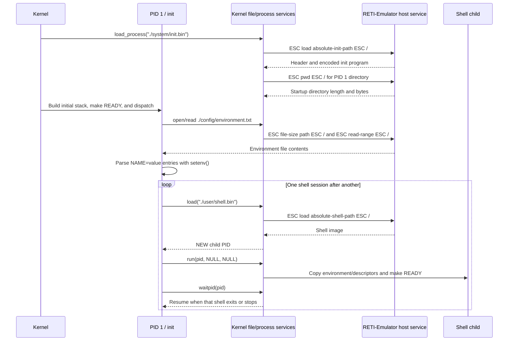

The kernel creates init's PCB before init exists. Since PID 1 has no parent
from which to inherit a directory, PCB creation sends `<ESC>pwd<ESC>/` and
stores a `kmalloc()` copy of the host startup path in
`Process.working_directory`. Init otherwise uses the same public libraries and
syscalls as every other process.

## 11.3 Configuration and environment

`read_environment()` allocates a 257-cell buffer, opens
`./config/environment.txt` with `open(O_RDONLY)`, reads at most 256 cells,
closes the descriptor, and parses newline/CRLF-separated `NAME=value` records.
Each valid record is copied into the process heap by
`setenv(name, value, true)`. The current configuration establishes
`PATH=./user`; a build-time setting may additionally create
`PICOOS_LOADING_BAR=true`.

| Init function | Return | Important library calls and effect |
| --- | --- | --- |
| `void init_write_error(char *text)` | `void` | Calls `write(STDERR_FILENO, ...)` without changing persistent init state |
| `bool read_environment(void)` | Success | Uses `malloc`, `open`, `read`, `close`, `setenv`, and `free`; changes the process-global `environ` array |
| `int main(void)` | Failure status if setup/launch fails; otherwise loops | Uses `setenv`, `load`, `run`, and exact-child `waitpid` |

Missing, unreadable, oversized, or malformed environment input makes init
report an error and return status 1. `load()` is given the shell's direct path,
not a `PATH` search. `run(pid, NULL, NULL)` inherits init's current environment
and descriptor values into the child.

## 11.4 Shell restart policy

Init blocks on `waitpid(shell_pid)`, not on an arbitrary child notification.
Entering the shell built-in `exit` therefore ends one shell process; init
collects it and loads a new shell. `poweroff.bin` is different: it invokes the
kernel shutdown syscall and halts PicoOS. Since `waitpid()` also reports a
stopped child, explicitly stopping the shell itself can make init begin a new
session; normal foreground job control targets the shell's children instead.

Init and `fast_os_test_launcher` live under `system` because they implement
system policy. They are not exposed through the normal `PATH=./user` command
directory.

# 12. Shell

## 12.1 Shell-owned data

The shell is an ordinary process. Its persistent state is stored in globals in
that shell image's `.data`, not in a kernel shell object:

| Global | Meaning and storage |
| --- | --- |
| `last_foreground_exit_status` | One integer used for `$?` |
| `last_background_process_id` | Most recently tracked background/stopped PID used for `$!`, `fg`, and `bg` |
| `initial_shell_environment` | Process-heap deep copy used to reset isolated shell tests |
| `initial_shell_working_directory[PATH_MAX]` | Embedded startup-directory copy used for reset and relative `PATH` entries |
| `shell_executable_path[PATH_MAX]` | Embedded scratch buffer for one `PATH` candidate |
| `command_history[8][80]` | Embedded ring containing at most eight recent commands; only consecutive duplicates are suppressed |
| `command_history_draft[80]` | Current unfinished line preserved while navigating history |
| `command_history_start`, `command_history_count` | Ring indices/count |

The active command buffer is an 80-cell local array in `main()`'s userspace
stack. Redirection temporarily reserves descriptors 4 and 5 for shell tests
and saved stdout; all descriptor state itself remains in the shell PCB's
kernel-heap table.

## 12.2 Startup and main loop

At startup the shell calls `set_foreground_process(0)`, configures
`prctl(PR_SET_PDEATHSIG, SIGTERM)`, clones its environment, and records its
working directory with `getcwd()`. It then repeatedly calls `read_line()`,
stores nonempty commands in history, and sends them to `eval()`. Only the
`exit` built-in makes `eval()` return false.

| Important function | Return | Main effect and library calls |
| --- | --- | --- |
| `int read_line(char *buffer, int capacity)` | Command length | Repeatedly calls `read(0, ..., 1)`, edits the stack buffer, and updates history-navigation state |
| `void remember_shell_command(char *command)` | `void` | Mutates the global eight-entry history ring; skips consecutive duplicates |
| `char *expand_variables(char *arguments, char *result, int capacity)` | Expanded buffer or `NULL` | Uses `getenv()` and shell `$?`/`$!` globals; removes double quotes |
| `int load_from_path(char *name)` | PID or 0 | Reads `PATH` with `getenv()`, builds candidates, and calls `load()` in order |
| `bool run_process(int pid, char *arguments, bool background, char *stdout_path, bool append)` | Whether `run()` succeeded | Uses `open`, `dup2`, `close`, `run`, `set_foreground_process`, and `waitpid`; changes `$?`/`$!` state |
| `void continue_background_process(bool foreground)` | `void` | Uses `kill(pid, SIGCONT)` and, for `fg`, foreground selection plus `waitpid()` |
| `bool eval(char *command)` | Continue-shell flag | Selects a built-in or external execution path |
| `int main(int argc, char **argv)` | Shell exit status | Initializes signal/reset state and owns the prompt loop |

## 12.3 Line editing and history

The terminal ISR and descriptor layer deliver bytes; the shell interprets
them as editing operations:

| Input | Shell behavior |
| --- | --- |
| Line feed or carriage return | Echo one newline and finish the command |
| Backspace (8) or Delete (127) | Remove one buffered character and erase it visually |
| `Ctrl+U` | Erase the complete current line |
| `Ctrl+W` | Erase trailing whitespace and the previous word |
| Up arrow | Move toward older entries in the eight-command history ring |
| Down arrow | Move toward newer entries and finally restore the draft |
| Left/right arrows | Consume the escape sequence but do not move the cursor |
| Tab or printable byte | Append it if space remains in the 80-cell buffer |

`read(0, ..., 1)` blocks when the global terminal ring is empty. The command
buffer and its stack frame remain intact while the PCB waits on
`terminal.input_waiters`; the UART ISR writes the character and the dispatcher
later resumes the shell.

## 12.4 Parsing and command execution

The parser validates balanced double quotes, removes a trailing `&`, recognizes
one final whitespace-preceded `>` or `>>`, splits the command name from its raw
arguments, expands `$NAME`, `$?`, and `$!`, and removes double-quote
characters. A command containing `/` is loaded directly; another name is
searched through colon-separated `PATH` entries.

Absolute `PATH` entries are used directly. A relative entry such as the
configured `./user` is resolved from `initial_shell_working_directory`, not
from the shell's later current directory. Programs therefore remain
discoverable after `cd`, while ordinary relative operands still use the PCB's
current `working_directory` in kernel path normalization.

```mermaid
sequenceDiagram
    participant U as User
    participant M as Shell main loop
    participant E as eval and parsing helpers
    participant K as PicoOS kernel
    participant H as RETI-Emulator host services
    participant C as Child process

    U->>M: Type bytes and Enter
    M->>M: read_line edits, terminates, and remembers command
    M->>E: eval(command)
    E->>E: Validate quotes and select built-in or external path
    alt shell built-in
        E->>E: Call the required library function in this shell process
    else external command
        E->>E: Parse background and redirection markers, name, and arguments
        E->>K: load(direct path or PATH candidate)
        K->>H: ESC load absolute-path ESC /
        H-->>K: Program image or failure
        K-->>E: NEW child PID
        E->>E: Expand variables and remove double quotes
        E->>K: run(pid, arguments, current environment)
        K->>C: Copy initial stack/descriptors and make READY
        alt foreground
            E->>K: set_foreground_process(pid)
            E->>K: waitpid(pid)
            K-->>E: Exit or stopped status
            E->>K: set_foreground_process(0)
            E->>E: Store status in $?
        else background
            E->>E: Store PID in $!
        end
    end
```

Argument handling is intentionally small. The kernel splits the final string
on spaces and tabs; double quotes are removed but do not preserve embedded
whitespace as one argument, and there is no single-quote or general escape
grammar. `echo.bin` itself interprets the two characters `\n`.

## 12.5 Shell built-ins

Built-ins execute inside the shell process. This is essential for operations
such as `cd` and `export`, since a separate child could change only its own PCB
or process-local `environ`.

| Built-in | Behavior | Library functions called |
| --- | --- | --- |
| `exit` | Accepts no argument and returns false from `eval()`, ending this shell session | No immediate syscall; `libstart` later calls `exit(main_result)` |
| `eval COMMAND` | Recursively evaluates the remaining text in the same shell state | Re-enters `eval()`; resulting command calls apply normally |
| `run-shell-tests MANIFEST` | Runs scripted shell test directories and resets shell state between them | `open`, `read`, `lseek`, `close`, `dup2`, `chdir`, `reset_processes`, environment clone/restore helpers |
| `export NAME=value` | Expands the complete assignment and stores/replaces the variable | `getenv` during expansion and `setenv(..., true)` |
| `cd DIRECTORY` | Changes this shell PCB's working-directory string after host validation | `chdir()` / syscall 32 |
| `load PATH` | Loads a binary but leaves its PCB in `NEW` | `load()` / syscall 3 |
| `run PID [ARGUMENTS]` | Starts a previously loaded PCB; supports `&`, `>`, and `>>` | `run`, and possibly `open`/`dup2`/`close`, `set_foreground_process`, `waitpid` |
| `unload PID` | Terminates/removes the selected non-current process | `unload()` / syscall 5 |
| `list` | Prints the kernel process list | `list()` / syscall 4 |
| `fg` | Sends `SIGCONT` to the most recently tracked PID, makes it foreground, and waits | `kill`, `set_foreground_process`, `waitpid` |
| `bg` | Sends `SIGCONT` to the most recently tracked PID without waiting | `kill()` |

Every built-in validates the operands it supports. `cd -h`/`--help` prints its
usage; the process-management built-ins report missing or surplus arguments
rather than silently accepting them. A bare `NAME=value` is not assignment
syntax and is treated as an external command; `unset` is not implemented even
though the library provides `unsetenv()`.

## 12.6 Foreground, background, and signals

For a foreground child, the shell gives the child's PID to
`set_foreground_process()`, waits for exactly that PID, restores terminal
ownership with PID 0, and stores the returned status in `$?`. `Ctrl+C` becomes
`SIGTERM`; `Ctrl+Z` becomes `SIGTSTP`. A stopped status is recorded as the
current `$!` target so `fg` or `bg` can continue it.

A trailing `&` starts the child without waiting and stores the PID in `$!`.
The shell tracks only one background/stopped PID rather than a job table. A
background start does not replace `$?`. At shell startup,
`PR_SET_PDEATHSIG=SIGTERM` is installed on the shell and inherited by children,
so descendants receive `SIGTERM` if their shell terminates.

## 12.7 Output redirection

For `COMMAND > PATH`, the shell opens with
`O_WRONLY | O_CREAT | O_TRUNC`; for `>>`, it uses
`O_WRONLY | O_CREAT | O_APPEND`. It saves stdout in private descriptor 5,
copies the opened file onto descriptor 1, starts the child, and restores its
own stdout. Since `run()` deep-copies the descriptor table, the child's
descriptor 1 retains the file path after the shell restores itself.

```mermaid
sequenceDiagram
    participant S as Shell
    participant K as Kernel descriptor/process code
    participant H as RETI-Emulator host file
    participant C as Child

    S->>K: open(path, write/create/truncate or append)
    opt truncating redirect
        K->>H: ESC write path ESC / then restore stdout
    end
    K-->>S: Temporary descriptor
    S->>K: dup2(1, 5), then dup2(temporary, 1)
    S->>K: run(child)
    K->>C: Deep-copy all six descriptor entries
    S->>K: dup2(5, 1), then close(5)
    C->>K: write(1, bytes, count)
    K->>H: ESC append path ESC /, bytes, ESC write stdout ESC /
```

Regular writes append regardless of the descriptor's logical seek position.
The distinction between `>` and `>>` is therefore whether open first empties
the host file. There is no input redirection, pipeline, or `dup()` interface.

## 12.8 Shell-test support

`run-shell-tests` is an internal built-in used so many interactive cases can
run after one boot. The shell snapshots its initial environment and directory,
closes private descriptors, resets non-system processes/PIDs, redirects test
output as required, evaluates each input line, and restores state. This is why
test-reset helpers appear in the userspace/kernel ABI even though they are not
normal interactive facilities.

# 13. User applications

PicoOS builds the shell plus ten standalone commands. An application runs in
its own process and cannot directly change its parent shell's environment,
working directory, or descriptor table.

## 13.1 Applications and their library use

| Binary | Behavior | Principal library functions called |
| --- | --- | --- |
| `shell.bin` | Interactive command interpreter described above | `read`, `write`, process/wait/signal/prctl APIs, environment/string helpers, `open`, `dup2`, `close`, `chdir`, `getcwd` |
| `echo.bin` | Prints `argv[1..]` separated by spaces, converts `\n` inside an argument, and adds a newline | `printf()` |
| `count.bin` | Counts forever with an optional busy-loop delay and yields after each displayed value | `printf`, `atoi`, `yield`, `command_is_help` |
| `cat.bin` | Opens each file read-only, copies it in 64-cell chunks to stdout, continues after per-file errors | `open`, `read`, `write`, `close`, `unsetenv`, `command_write`, `command_is_help` |
| `ls.bin` | Lists `.` or one directory and prefixes entries with `d` or `-` | `opendir`, `readdir`, `closedir`, `command_write`, `command_is_help` |
| `mkdir.bin` | Creates every supplied directory and reports individual failures | `mkdir`, `command_write`, `command_is_help` |
| `pwd.bin` | Prints the working directory copied from its PCB | `getcwd`, `command_write`, `command_is_help` |
| `rm.bin` | Removes every supplied file and continues after errors | `unlink`, `command_write`, `command_is_help` |
| `rmdir.bin` | Removes every supplied empty directory and continues after errors | `rmdir`, `command_write`, `command_is_help` |
| `kill.bin` | Sends `SIGTERM` by default, a named/numbered signal, or signal 0 as a PID probe | `kill`, `atoi`, `yield`, `command_write`, `command_is_help` |
| `poweroff.bin` | Halts PicoOS after validating that there are no operands | `invoke_syscall(SYSCALL_SHUTDOWN, 0)`, `command_write`, `command_is_help` |

[`common/user_command.picoc`](common/user_command.picoc) supplies two shared
application helpers. `command_write(fd, text)` counts the string and calls
`write()`. `command_is_help(argument)` recognizes `-h` and `--help`. These
helpers allocate no state and use no request structure beyond the `IoRequest`
created inside `write()`.

## 13.2 Command behavior and limitations

`echo.bin` always returns 0 and implements no `-n` option. `count.bin` accepts
at most one nonnegative loop-count delay; its delay is not milliseconds, and
`yield()` makes its infinite loop a visible scheduler example.

`cat.bin` requires at least one path and does not read stdin when no operand is
given. It disables `PICOOS_LOADING_BAR` so progress output cannot corrupt file
contents. It closes each descriptor before opening the next and returns 1 if
any read/write/open operation failed.

`ls.bin` preserves host listing order and includes hidden entries and `.`/`..`.
There is no sorting, long format, filtering, or recursion. `mkdir.bin` has no
`-p`; `rm.bin` has no force/recursive mode; `rmdir.bin` removes only empty
directories. All continue through later operands after an individual error.

`kill.bin` accepts `SIGKILL`, `SIGTERM`, `SIGCHLD`, `SIGCONT`, `SIGTSTP`, or a
number. Signal 0 checks existence without delivery. It yields after success so
the target can be selected promptly. `poweroff.bin` differs from shell `exit`:
the former invokes syscall 2 and halts the OS, whereas the latter lets init
start a new shell.

## 13.3 Errors and exit status

Commands send ordinary results to stdout and diagnostics/usage failures to
stderr, so shell redirection of descriptor 1 does not hide errors. `cat`,
`mkdir`, `rm`, and `rmdir` retain a failure result while continuing through
later operands. `kill` distinguishes an invalid PID, invalid signal, and a PID
that does not exist. The shell similarly diagnoses unmatched quotes, malformed
redirection, missing built-in operands, failed process operations, and unknown
commands. Foreground return values become `$?`; signal termination/stopping is
reported with the PID and signal name.

# 14. Use in operating-systems and real-time operating-systems lectures

## 14.1 Real-time operating-systems topics

The process-state constants, process-list scan, and dispatcher separate the
state of work from selection and execution. Timer interrupts preempt
userspace, while `yield()` voluntarily enters the same activation-saving path.
Wait queues demonstrate event-driven blocking; `TSL` plus `mutex_lock()` and
`mutex_unlock()` demonstrate how an atomic operation can be combined with
blocking rather than continual spinning. The shared-memory mutex test then
connects shared visibility to synchronization.

The kernel is non-preemptive even though userspace is preemptive. That design
keeps kernel data-structure mutation serialized and gives students a compact
example in which preemption policy differs by execution context.

## 14.2 Operating-systems topics

The project connects lecture concepts to concrete state:

- the loaders demonstrate sections, binary metadata, relocation bases, and
  initial stacks
- the process list and PCBs demonstrate parent/child relationships, zombies,
  exact-child waiting, and cleanup ownership
- the IVT and handlers distinguish software interrupts, hardware interrupts,
  and synchronous exceptions
- activation records, scheduler, and dispatcher separate saving state,
  choosing work, and restoring state
- the three heap instances show one allocator managing different ownership
  domains
- descriptor tables show per-process handles and inheritance, while the
  terminal shows a shared kernel object
- shared memory plus a mutex shows that shared visibility still requires
  synchronization

Generated `.reti`, `.sections`, and debug files allow PicoC source, symbolic
RETI, binary layout, and live machine state to be compared.

## 14.3 Exercise and teaching material

The repository includes focused examples for allocation, freeing and block
coalescing (`test/basic_malloc.picoc`, `basic_free.picoc`, and
`basic_free_block_merging.picoc`), complete-process first-fit reuse
(`test/process_memory_first_fit`), and course-named source such as
`config/sheet7ex1_fib_2.picoc`. The compiler sibling additionally retains
symbolic pass output and example programs from exercise sheets, so PicoC,
linked RETI, `.sections`, and live emulator state can be compared.

# 15. Test system

## 15.1 Test categories and repository integration

The test system covers standalone libraries, full OS feature scenarios, and
interactive shell behavior. Full OS tests compile and assemble programs, boot
through EPROM, inject UART input, normalize terminal output, and compare
fixtures. Fast mode reuses one boot while resetting process, descriptor,
environment, and PID state between cases.

Feature tests cover process loading and arguments, environments, round-robin
scheduling and timer switches, first-fit process memory, wait queues and
mutexes, signals and parent-death signals, shared memory, descriptors,
redirection, terminal editing, and process exceptions.

Detailed runner behavior is in [`test/README.md`](test/README.md). Repository
CI rebuilds the compiler and emulator before exercising PicoOS integration.

```mermaid
flowchart TD
    T["make test"] --> L["make test-lib<br/>standalone library programs"]
    T --> S["make test-sys<br/>complete PicoOS sessions"]
    S --> O["make test-os<br/>kernel/OS feature scenarios"]
    S --> H["make test-shell<br/>interactive shell scenarios"]
    L --> LC["compile, emulate, compare metadata output"]
    O --> K["assemble binaries, boot EPROM/kernel, inject UART, compare"]
    H --> K
```

The three related repositories validate different levels: PicoC-Compiler tests
compile source and commonly compare the result with GCC; RETI-Emulator system
tests execute focused assembly programs; PicoOS tests exercise the complete
compiler-emulator-bootloader-kernel-userspace chain. The PicoOS workflow checks
out and rebuilds the integration branches of both sibling repositories rather
than relying only on locally installed binaries.

## 15.2 Normal and fast execution

| Target | Scope | Boot strategy |
| --- | --- | --- |
| `make test` | Libraries, OS features, and shell | Normal default |
| `make test-lib` | Standalone library programs | No PicoOS boot; direct RETI execution |
| `make test-sys` | OS features then shell | One fresh boot per scenario |
| `make test-os` | Kernel/OS feature scenarios | One fresh boot per scenario |
| `make test-shell` | Interactive shell scenarios | One fresh boot per scenario |
| `make test-sys-fast` | OS features then shell | One shared boot per group |
| `make test-os-fast` | OS features | One shared boot |
| `make test-shell-fast` | Shell | One shared boot |

Normal OS tests compile and assemble every program in one test directory,
start the release-style EPROM bootloader, wait for shell prompts, inject UART
input, capture raw terminal output, normalize terminal control sequences, and
compare the result with `expected_output.txt`. Generated test binaries are
staged below `binary/test`; observed output remains with the source fixture.

Fast mode amortizes boot cost but explicitly resets mutable state. The system
launcher redirects output, loads and waits for one test launcher, restores
stdout, removes remaining test processes, destroys their descriptor tables,
and resets the expected PID sequence. Fast shell tests additionally restore
the initial environment, directory, private descriptors, `$?`, and `$!`.

```mermaid
flowchart LR
    subgraph Normal["normal targets"]
        N1["compile test binaries"] --> N2["boot release runtime"]
        N2 --> N3["inject input at prompts"]
        N3 --> N4["normalize raw output"]
        N4 --> N5["compare fixture"]
        N5 --> N6["repeat with fresh boot"]
    end

    subgraph Fast["fast targets"]
        F1["compile binaries and manifests"] --> F2["boot once"]
        F2 --> F3["run/eval each case"]
        F3 --> F4["reset processes, descriptors, env, cwd"]
        F4 --> F5["compare each output"]
    end
```

The line-editing scenario must still traverse raw UART and `read_line()`; it
cannot be replaced by a direct `eval()` call. Library tests instead read their
input/expected-output metadata, compile one program, apply a timeout, and
compare normalized output. `TEST_BUILD_MODE=direct` is available when a test
should bypass staged compilation artifacts and rebuild merged RETI directly
from PicoC sources.

## 15.3 Covered behavior

The OS scenarios cover process loading and initial arguments, environment
inheritance, process states, round-robin/timer switches, first-fit process
memory, wait queues, mutexes, signals and parent-death signals, shared memory,
descriptor inheritance and duplication, host files/directories, redirection,
terminal blocking/editing, and process exceptions. The split between normal
and fast modes also checks that explicit cleanup is sufficient to isolate
successive scenarios.

# 16. Use of AI in the project

AI tools were used for parts of the Makefile and Python test runners,
repetitive implementation and test setup, refactoring, debugging, and
documentation. Generated changes were reviewed against PicoOS,
PicoC-Compiler, and RETI-Emulator source and the relevant tests. The
architecture, project scope, and final technical decisions remained the
project author's responsibility.

# 17. Limitations

The main deliberate limitations are:

- one physical address space with no MMU, isolation, or virtual memory
- host-backed UART files rather than a resident filesystem
- six descriptors per process and copied state rather than shared open-file
  descriptions
- linked-list round-robin scanning rather than a separate ready queue
- non-preemptive kernel scheduling and timer-preempted userspace
- wait-queue `sleep()` rather than timed sleep
- exact-child `waitpid()` rather than a general wait interface
- five signals and one foreground/input owner rather than full job control
- one global terminal with at most one pending input read
- append-only regular-file writes and a logical seek offset mainly for reads
- fixed/default process heap and stack sizing with no dynamic stack growth
- small formatting, scanning, shell parsing, and standard-library subsets
- familiar POSIX-like names without full POSIX semantics

# Appendix: Inspecting `.bin` files with `hexyl`

[`hexyl`](https://github.com/sharkdp/hexyl) is useful for checking the
five-word big-endian loader header and encoded words in a generated `.bin`
file. `-s N`/`--skip N` skips bytes and `-n N`/`--length N` limits output;
values accept decimal, hexadecimal, and size suffixes. A negative skip is
relative to the file end, so this displays its final 64 bytes:

```console
$ hexyl -s -64 -n 64 program.bin
```
