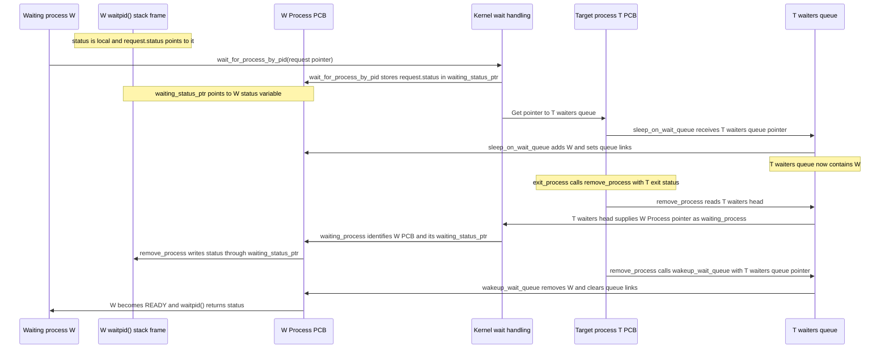

# Waiting For a Process

This diagram focuses only on how `waitpid(pid)` queues the waiting process and
how the exiting process delivers its status.

`status` and `request` belong to W's suspended `waitpid()` stack frame.
`waiting_status_ptr` belongs to W's PCB and points to W's `status` variable.
The waited-on process T owns the `waiters` queue in its PCB. **The same
`T->waiters` attribute is used both times:** W's user-space `waitpid(pid)` enters
the kernel function `wait_for_process_by_pid()`, which calls
`sleep_on_wait_queue(&T->waiters)` to add W to that queue. When T exits,
`exit_process()` calls `remove_process(T, status)`, which reads waiters from
that same `T->waiters`, writes T's exit status through each waiting process's
`waiting_status_ptr`, and calls `wakeup_wait_queue(&T->waiters)` on that same
queue to remove and ready each waiter.
