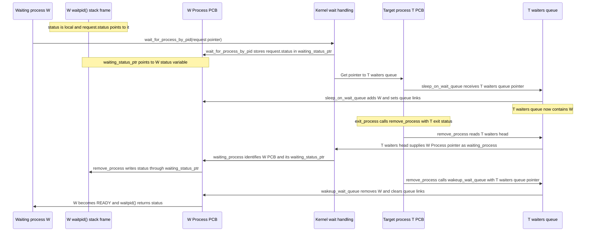

# Waiting For a Process

This diagram focuses only on how `waitpid(pid)` queues the waiting process and
how the exiting process delivers its status.



`status` and `request` belong to W's suspended `waitpid()` stack frame.
`waiting_status_ptr` belongs to W's PCB and points to W's `status` variable.
The waited-on process T owns the `waiters` queue in its PCB. **The same
`T->waiters` attribute is used both times:** W's user-space `waitpid(pid)` enters
the kernel function `wait_for_process_by_pid()`, which calls
`sleep_on_wait_queue(&T->waiters)` to add W to that queue. When T exits,
`exit_process()` calls `remove_process(T, status)`, which reads waiters from
that same `T->waiters`, writes T's exit status through each waiting process's
`waiting_status_ptr`, and calls `wakeup_wait_queue(&T->waiters)` on that same
queue to remove and ready each waiter.

# Shared Memory

The `lib/sys/mman` library provides kernel-supported shared memory through this
API:

```c
int shm_open(const char *name, size_t size);
void *mmap(int shm_id);
int shm_unlink(const char *name);
```

Shared-memory entries are dynamically allocated on the kernel heap using
`kmalloc()`. The kernel keeps a linked list of all shared-memory entries. Each
entry stores:

- its name
- a unique ID
- the address of the shared RAM block
- its size
- its reference count
- an `unlink_requested` flag
- a pointer to the next shared-memory entry

## `shm_open(const char *name, size_t size)`

`shm_open()` creates or opens a shared-memory block.

- If a block with the given name already exists, it returns that block's
  shared-memory ID.
- Otherwise, it allocates a new shared-memory entry using `kmalloc()`, allocates
  the actual shared RAM block using the existing memory-block allocator,
  initializes the entry, and inserts it into the kernel's linked list.
- It returns `-1` on failure.

## `mmap(int shm_id)`

`mmap()` gives the current process access to an existing shared-memory block.

- It records that the current process uses the block.
- It increases the block's reference count.
- It returns the address of the shared RAM block.
- It returns `NULL` if the shared-memory ID is invalid.

This is not a real virtual-memory mapping. It simply returns the address of the
already allocated shared-memory block.

## `shm_unlink(const char *name)`

`shm_unlink()` marks a shared-memory block for deletion.

- It removes the block's name so future `shm_open()` calls cannot find it.
- Existing processes may continue using the block.
- The block is only actually freed after the last process using it has
  terminated.
- It returns `0` on success or `-1` if the name does not exist.

## Process Termination

Each process keeps track of the shared-memory blocks it has attached. During
process exit, the kernel iterates over all attached shared-memory blocks and:

- decreases each block's reference count
- frees the shared RAM block using the existing memory-block allocator when
  `unlink_requested` is true and the reference count becomes zero
- frees the shared-memory entry itself using `kfree()` at the same time

This allows shared memory to stay alive until the last process using it has
terminated, even if `shm_unlink()` was called earlier.
