# PicoOS
[\[↓ TOC\]](#contents)

PicoOS is a small educational operating system for the RETI teaching CPU. It
was developed as a master’s project to make central operating-system mechanisms
visible in a compact codebase: bootloading, interrupt vectors and service
routines, process creation and termination, scheduling and dispatching, wait
queues, signals, memory allocation, shared memory, file descriptors, and a
minimal userspace.

The current userspace contains **14 distinct libraries**, including the startup
library in [`library/`](library/), and **18 user applications** in
[`user/`](user/), including the [shell](user/shell.picoc). The kernel exposes
**38 implemented syscalls**; [the syscall overview](#25-system-call-dispatch-and-return-path)
explains their selector numbers and subsystem connections.

The project deliberately does not imitate the scale of Linux or claim POSIX
conformance. There is no virtual memory, MMU, process isolation, disk, or
on-device filesystem. All code and data use one physical 32-bit address space,
and filesystem operations are forwarded over UART to the RETI-Emulator host.
The small scope is intentional: a reader can connect a userspace call to its
interrupt entry, kernel data-structure changes, and eventual context switch.

This README is a report on what was implemented and how the main parts fit
together. It emphasizes kernel state, ownership, and lifecycle rather than
walking through every function statement by statement.

PicoOS is developed together with two sibling projects:

- [PicoC-Compiler](../PicoC-Compiler/README.md) compiles the PicoC subset of C,
  links multiple translation units, lays out interrupt, code, and data
  sections, and produces RETI assembly plus section metadata
- [RETI-Emulator](../RETI-Emulator/README.md) assembles and executes RETI,
  models EPROM, SRAM, UART, interrupts, the timer, and CPU exceptions, and
  supplies the host-side file protocol
- PicoOS provides the EPROM bootloader, kernel, libraries, init process, shell,
  user programs, and tests

The following diagram follows source files through assembly and runtime loading.
The bootloader loads the kernel; the kernel loader later loads user programs.

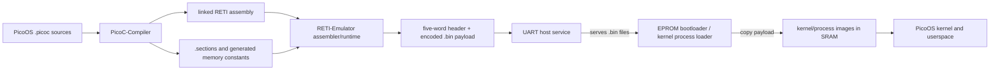

The table below identifies what each part passes to the next, including runtime
requests that are separate from the generated build files.

| Producer | Contract | Consumer |
| --- | --- | --- |
| PicoC-Compiler | Linked `.reti`, `.sections`, generated memory headers, and `.debuginfo` | RETI-Emulator assembler/debugger and PicoOS low-level builds |
| RETI-Emulator assembler | Five-word layout header followed by encoded RETI words in `.bin` | EPROM bootloader and kernel process loader |
| PicoOS libraries | Syscall number plus direct value/pointer or stack-local request structure | Interrupt entry, [`handle_syscall()`](kernel/syscall.picoc#L16), and the owning kernel subsystem |
| Kernel subsystems | PCBs, activations, queues, descriptor/shared-memory state, and periphery-register writes | Scheduler/dispatcher and emulated RETI hardware |
| PicoOS UART host request protocol | Bounded `<ESC>...<ESC>/` requests and big-endian responses | RETI-Emulator host file services, or a companion serial host on hardware |

## Build and run
[\[↓ TOC\]](#contents)

The build expects `picoc_compiler`, `reti_emulator`, and `make` on `PATH`. The
release-style boot path is:

```console
$ make bootload
```

This builds the bootloader, kernel, system programs, libraries, user programs,
and device markers, then starts the RETI debugger with the EPROM bootloader.
The command corresponds to:

```console
$ cd binary
$ ../run_reti_emulator_isolated.sh -n 5 -e ./boot/bootloader.reti \
    -d -c -O -r 262144 \
    -S kernel/kernel.sections -D kernel/kernel.debuginfo
```

The options in this command select the boot image, memory size, and debugger
metadata as summarized below. Run the command from [`binary/`](binary/) so
runtime paths resolve to the release files.

| Option | Role in `make bootload` |
| --- | --- |
| `-e` | Selects the EPROM bootloader image |
| `-r` | Configures 2^18 SRAM cells |
| `-d -c` | Opens the commented debug TUI |
| `-S` / `-D` | Supplies the compiler-generated kernel layout and debug information |
| `-O` | Supplies the modeled OS context from which the first dispatcher `RTI` can leave |
| `-n 5` | Reserves five IVT entries that the bootloader later loads into SRAM |

### Use the PicoOS shell
[\[↓ TOC\]](#contents)

Readers who want to use the shell instead of inspecting startup state have two
paths:

- Run `make bootload-notui` to omit `-d` and connect the terminal directly to PicoOS. It also accepts `DMA=1`.

- Run `make bootload` for the debug-TUI path:

  1. Choose `c`, then Enter, to continue execution.
  2. Press capital `V` for the raw UART terminal when arrow keys, `Ctrl+C`, or `Ctrl+Z` must reach PicoOS; `Ctrl+]` returns to the debugger.
  3. Press lowercase `v` for the normal terminal when those sequences are not needed; Escape returns from it.

`make bootload-dma` adds DMA loading to the debug-TUI path.

After startup, this short [shell](user/shell.picoc) session makes loading and
running visible as separate steps. In a fresh session, init and the shell have
PIDs 1 and 2, so loading [`echo.picoc`](user/echo.picoc)'s binary creates PID 3.
Use the reported PID if other programs have already been loaded. Here `PicoOS>` is
the PicoOS prompt, unlike the host shell's `$` in the build commands above.
Loading-progress output is omitted from this transcript:

```console
PicoOS> load user/echo.bin
process with pid 3 created
PicoOS> run 3 hello PicoOS
hello PicoOS
```

The first command creates a [`NEW`](kernel/process/process.header#L12) process; the second makes it ready and waits
for its exit. [Process states and transitions](#45-process-states-and-transitions) connects these
commands to the PCB transitions.

This short session crosses the complete runtime boundary: the generated
bootloader and kernel metadata start the emulated machine, the UART host
service supplies the program image, and the kernel creates a userspace
process for it.

The available tests comprise **12 library test classes, 23 OS test classes,
and 28 shell test classes** in [`test/`](test/). Here a class means one
standalone library source or one system-test directory, rather than each
assertion inside it. [`run_sys_tests.sh`](run_sys_tests.sh) selects the standalone
sources; [`run_os_tests.py`](run_os_tests.py) classifies OS and shell scenarios
by their launcher and input script.

The table below lists build commands and ways to select these test groups:

| Command | Purpose |
| --- | --- |
| `make firmware` | Build the complete firmware/release tree |
| `make release-tree` / `make release-archive` | Build the release tree or create the release archive |
| `make clean-firmware` / `make rebuild-firmware` | Remove generated firmware files or rebuild them |
| `make devices` | Add the terminal and null device markers under [`binary/device`](binary/device/) |
| `make eprom` / `make kernel` | Build only the EPROM bootloader or kernel image |
| `make system` / `make user` | Build the complete release tree, including system and user programs |
| `make run-firmware` | Run the kernel image directly in the debug TUI |
| `make run-kernel` | Rebuild and run the kernel image directly |
| `make bootload-debug` | Rebuild bootloader and kernel with source/debug metadata, then boot through the debug TUI |
| `make bootload-dma` | Boot through the debug TUI with DMA enabled |
| `make bootload-notui` | Boot directly in the terminal without the debug TUI |
| `make bootload-notui DMA=1` | Boot directly in the terminal with DMA enabled |
| `make run-os OS_RUN_PATH=test/hello_world` | Run one configured OS scenario |
| `make test` / `make test-fast` | Run all library, OS, and shell tests normally or with shared OS sessions |
| `make test-lib` | Run the standalone library tests |
| `make test-sys` / `make test-sys-fast` | Run OS feature and shell tests normally or with shared OS sessions |
| `make test-os` | Run the OS feature tests |
| `make test-shell` | Run the shell tests |
| `make test-os-fast` / `make test-shell-fast` | Run only OS feature or shell tests with a shared boot |
| `make test DMA=1` | Run the complete test workflow with emulator DMA enabled |
| `make test-fast DMA=1` | Run the fast workflow with emulator DMA enabled |

### Release archive layout
[\[↓ TOC\]](#contents)

`make release-archive` first rebuilds the generated [`binary/`](binary/)
release tree, verifies that it contains only release files, and packages its
contents as `pico-os-runtime.tar.gz`. The archive contains a complete PicoOS
runtime and the scripts needed to start it in RETI-Emulator; it is not a copy
of the source repository and contains no test fixtures, PicoC sources, or
libraries.

Both `make bootload` and the archive launchers start the emulator in the runtime directory.
That directory becomes PicoOS `/`. Host `/tmp` is not mounted or added to directory listings.
Use the updated RETI-Emulator together with the rebuilt PicoOS binaries.

The following paths show where to find each runtime component in that archive;
the links point to their generated locations under [`binary/`](binary/).

| Archive path | Contents and purpose |
| --- | --- |
| [`binary/README.md`](binary/README.md) | Short release-specific startup and host-filesystem instructions. It becomes `README.md` at the archive root. |
| [`binary/start-picoos.sh`](binary/start-picoos.sh), [`binary/start-picoos.ps1`](binary/start-picoos.ps1) | Linux/macOS/Android and Windows launchers. They find or download the tools, select the boot and kernel metadata, and start the emulator. |
| [`binary/download-tools.sh`](binary/download-tools.sh), [`binary/download-tools.ps1`](binary/download-tools.ps1) | Download matching released `picoc_compiler` and `reti_emulator` binaries when they are not already available. |
| [`binary/boot/`](binary/boot/) | [`bootloader.reti`](binary/boot/bootloader.reti), the RETI EPROM image built from [`bootloader.picoc`](boot/bootloader.picoc) that loads and starts the kernel. |
| [`binary/kernel/`](binary/kernel/) | [`kernel.bin`](binary/kernel/kernel.bin), the loadable image built from [`kernel.picoc`](kernel/kernel.picoc); [`kernel.sections`](binary/kernel/kernel.sections), its linked memory-layout metadata; and [`kernel.debuginfo`](binary/kernel/kernel.debuginfo), its source/debug metadata. |
| [`binary/system/`](binary/system/) | Loadable system-program binaries, currently [`init.bin`](system/init.picoc). The test-only fast launcher is deliberately excluded. |
| [`binary/user/`](binary/user/) | Loadable PicoOS command binaries, including [`shell.bin`](user/shell.picoc) and the standard user commands built from [`user/`](user/). |
| [`binary/config/`](binary/config/) | Runtime configuration copied from [`config/`](config/): the initial environment, emulator options, and PicoOS release version. |
| [`binary/device/`](binary/device/) | `terminal.dev` and `null.dev` marker files. They represent PicoOS virtual device paths; they do not hold device data. |

For the corresponding source-tree directories and local helper scripts, see
[Repository layout](documentation/repository_layout.md).

## Intended physical hardware
[\[↓ TOC\]](#contents)

The intended physical setup uses an Alchitry Cu V2 FPGA board, two ISSI
IS61WV25616BLL-10TLI SRAM chips, and a SparkFun Serial Basic USB-to-UART
adapter. The prices below are the example parts-list prices used for this
design, including VAT. They were last checked at DigiKey Germany on 12 August
2026; component and shipping prices can change.

- **FPGA: [Alchitry Cu V2](https://www.digikey.de/short/8cmz0qnc) with Lattice
  iCE40-HX8K** ([board schematic](https://cdn.sparkfun.com/assets/2/f/9/9/3/CuSchematic.pdf),
  [FPGA datasheet](https://www.latticesemi.com/~/media/latticesemi/documents/datasheets/ice/ice40lphxfamilydatasheet.pdf)):
  **€55.66** (checked 12 August 2026). The FPGA implements the educational
  32-bit CPU, interrupt controller, UART controller, and SRAM interface.
- **SRAM: two [ISSI
  IS61WV25616BLL-10TLI](https://www.digikey.de/short/075fh38w) chips**
  ([datasheet](https://www.issi.com/WW/pdf/61-64WV25616.pdf)):
  **2 × €5.80 = €11.60** (checked 12 August 2026). Each asynchronous SRAM is
  organized as 256K × 16 bits. Both chips share the FPGA’s 18 address lines,
  chip enable, output enable, write enable, and byte-enable control. One chip
  connects its 16 data pins to CPU data bits 0–15 and the other to bits 16–31.
  Driving both chips with the same address and control signals therefore makes
  them one 256K × 32-bit SRAM. It provides 2^18 = 262,144 individually
  addressable 32-bit words, addressed from 0 through 2^18 - 1. Each word holds
  four bytes, so the total is
  `262,144 words × 4 bytes = 1,048,576 bytes = 1 MiB`. For comparison, 2^18
  bytes alone would be only 0.262144 MB.
- **USB-to-UART: [SparkFun Serial Basic Breakout with CH340C and
  USB-C](https://www.digikey.de/short/h83tqvbw)**
  ([product sheet](https://mm.digikey.com/Volume0/opasdata/d220001/medias/docus/739/DEV-15096_Web.pdf),
  [CH340C datasheet](https://cdn.sparkfun.com/assets/5/0/a/8/5/CH340DS1.PDF),
  [board schematic](https://cdn.sparkfun.com/assets/learn_tutorials/8/3/7/Serial-Basic-CH340C_Datasheet.pdf)):
  **€10.92** (checked 12 August 2026). Its `TXO` pin connects to the FPGA
  UART’s receive pin, its `RXI` pin connects to the FPGA UART’s transmit pin,
  and their grounds are connected. USB exposes the CH340C as a serial port on
  the host. The host and FPGA use the same baud rate and serial format, and
  UART transfers each request and response as a sequence of bytes.

The example total is **€55.66 + 2 × €5.80 + €10.92 = €78.18 including VAT**.
This excludes USB cables, wires, connectors, a printed circuit board, other
interconnection hardware, and shipping. In the rest of this README, PCB means
*process control block* unless the hardware context says otherwise.

PicoOS has no resident storage device or filesystem. In emulator use, the UART
host request protocol asks `reti_emulator` to access files in the host directory
where it is running, with that directory exposed as PicoOS `/`; see [working directories and host operations](#79-picoos-paths-working-directories-and-host-operations).
On the physical FPGA, a companion host program must read
the same requests from the USB serial port, perform the requested operations
on the host filesystem, and return byte counts and file data over UART. This
is how the same bootloader, kernel file interface, and user programs can work
with either the emulator or a physical RETI implementation.

The generated binaries also show why 1 MiB is a plausible memory size for the
project. The example sizes below come from the generated files currently in
[`binary/`](binary/) and include each file’s five-word header. Sizes change
with source code and compiler options:

| Image | 32-bit words | Size |
| --- | ---: | ---: |
| [`kernel.bin`](binary/kernel/kernel.bin) ([`kernel.picoc`](kernel/kernel.picoc)) | 41,693 | 0.166772 MB |
| [`init.bin`](binary/system/init.bin) ([`init.picoc`](system/init.picoc)) | 10,858 | 0.043432 MB |
| [`shell.bin`](binary/user/shell.bin) ([`shell.picoc`](user/shell.picoc)) | 32,655 | 0.130620 MB |
| [`cat.bin`](binary/user/cat.bin) ([`cat.picoc`](user/cat.picoc)) | 9,953 | 0.039812 MB |
| [`echo.bin`](binary/user/echo.bin) ([`echo.picoc`](user/echo.picoc)) | 12,018 | 0.048072 MB |

A conservative calculation can count the headers as if they also occupied
SRAM. With the resident [`kernel.bin`](kernel/kernel.picoc), [`init.bin`](system/init.picoc), and [`shell.bin`](user/shell.picoc) images,
`262,144 - (41,693 + 10,858 + 32,655) = 176,938` words remain. That space
could hold `floor(176,938 / 9,953) = 17` copies of [`cat.bin`](user/cat.picoc). The loader
actually keeps the five header words out of the copied program image. This is
only an image-size comparison—a running process also needs heap and stack
space—but it gives a useful scale for the available memory.

### RETI execution model
[\[↓ TOC\]](#contents)

RETI chooses an address space from the two highest address bits:

| High bits | Address space | PicoOS use |
| --- | --- | --- |
| `00` | EPROM | Bootloader |
| `01` | Memory-mapped periphery | UART, interrupt controller, timer, stack boundary, exception cause, DMA |
| `10` or `11` | SRAM | Interrupt table, kernel, process images, heaps, and stacks |

## Contents

The introductory sections above explain what PicoOS is, how to run it, and which physical platform it targets. The numbered chapters below begin with the compiler and emulator extensions, establish the kernel mechanisms, then follow the runtime handoff from the bootloader through init and the shell to user applications.

Use the nested links to jump directly to a mechanism or reference table.

1. [Toolchain extensions for PicoOS](#1-toolchain-extensions-for-picoos)
   - [1.1 PicoC-Compiler extensions](#11-picoc-compiler-extensions)
      - [1.1.1 Compilation pipeline and compiler passes](#111-compilation-pipeline-and-compiler-passes)
      - [1.1.2 Separate compilation, reusable artifacts, and linking](#112-separate-compilation-reusable-artifacts-and-linking)
      - [1.1.3 System V ABI stack frames and call cleanup](#113-system-v-abi-stack-frames-and-call-cleanup)
         - [1.1.3.1 Stack-frame layout and caller cleanup](#1131-stack-frame-layout-and-caller-cleanup)
         - [1.1.3.2 Shared function epilogue and return values](#1132-shared-function-epilogue-and-return-values)
         - [1.1.3.3 Naked functions without a generated frame](#1133-naked-functions-without-a-generated-frame)
      - [1.1.4 Selecting a startup function with `-C` / `--startup-source`](#114-selecting-a-startup-function-with--c---startup-source)
         - [1.1.4.1 Default compiler-generated `_start`](#1141-default-compiler-generated-start)
         - [1.1.4.2 Supplying a custom startup function](#1142-supplying-a-custom-startup-function)
         - [1.1.4.3 PicoOS `libstart` startup sequence](#1143-picoos-libstart-startup-sequence)
         - [1.1.4.4 Startup functions used by PicoOS images](#1144-startup-functions-used-by-picoos-images)
      - [1.1.5 Program sections, interrupt-vector entries, and linker placement](#115-program-sections-interrupt-vector-entries-and-linker-placement)
      - [1.1.6 RETI pseudoinstructions](#116-reti-pseudoinstructions)
         - [1.1.6.1 Interrupt-safe `PUSH` and `POP`](#1161-interrupt-safe-push-and-pop)
         - [1.1.6.2 Loading 32-bit values with `LOADI32`](#1162-loading-32-bit-values-with-loadi32)
         - [1.1.6.3 Long jumps with `JUMP32`](#1163-long-jumps-with-jump32)
         - [1.1.6.4 Pseudoinstruction expansion during linking](#1164-pseudoinstruction-expansion-during-linking)
      - [1.1.7 Linked `.sections` metadata and the five-word binary header](#117-linked-sections-metadata-and-the-five-word-binary-header)
      - [1.1.8 Generated memory constants for the bootloader and kernel](#118-generated-memory-constants-for-the-bootloader-and-kernel)
   - [1.2 RETI-Emulator extensions](#12-reti-emulator-extensions)
      - [1.2.1 RETI machine model and memory-mapped peripherals](#121-reti-machine-model-and-memory-mapped-peripherals)
      - [1.2.2 UART host-service protocol](#122-uart-host-service-protocol)
      - [1.2.3 Debugger, source view, and terminal modes](#123-debugger-source-view-and-terminal-modes)
1. [Interrupts, system calls, preemption, and exceptions](#2-interrupts-system-calls-preemption-and-exceptions)
   - [2.1 RETI interrupt entry and the interrupt vector table](#21-reti-interrupt-entry-and-the-interrupt-vector-table)
   - [2.2 Interrupt-controller mappings and priorities](#22-interrupt-controller-mappings-and-priorities)
   - [2.3 Saved interrupt stack frame](#23-saved-interrupt-stack-frame)
   - [2.4 System-call ABI](#24-system-call-abi)
      - [2.4.1 Syscall selectors and register convention](#241-syscall-selectors-and-register-convention)
      - [2.4.2 Process, wait, signal, and memory request structures](#242-process-wait-signal-and-memory-request-structures)
      - [2.4.3 File and directory request structures](#243-file-and-directory-request-structures)
      - [2.4.4 Request-pointer ownership and lifetime](#244-request-pointer-ownership-and-lifetime)
   - [2.5 System-call dispatch and return path](#25-system-call-dispatch-and-return-path)
   - [2.6 Timer interrupts and userspace preemption](#26-timer-interrupts-and-userspace-preemption)
   - [2.7 Kernel non-preemption and deferred rescheduling](#27-kernel-non-preemption-and-deferred-rescheduling)
   - [2.8 UART receive interrupt path](#28-uart-receive-interrupt-path)
   - [2.9 DMA completion interrupt path](#29-dma-completion-interrupt-path)
   - [2.10 CPU exceptions and stack-boundary faults](#210-cpu-exceptions-and-stack-boundary-faults)
   - [2.11 Interrupt, syscall, and exception function reference](#211-interrupt-syscall-and-exception-function-reference)
1. [Memory management and shared memory](#3-memory-management-and-shared-memory)
   - [3.1 Heap block layout and allocation algorithm](#31-heap-block-layout-and-allocation-algorithm)
   - [3.2 Kernel, process-memory, and per-process heap instances](#32-kernel-process-memory-and-per-process-heap-instances)
   - [3.3 Kernel SRAM memory map](#33-kernel-sram-memory-map)
   - [3.4 Linked code, data, heap, and stack address ranges](#34-linked-code-data-heap-and-stack-address-ranges)
   - [3.5 Heap and allocator function reference](#35-heap-and-allocator-function-reference)
   - [3.6 Shared-memory entries and mappings](#36-shared-memory-entries-and-mappings)
      - [3.6.1 Named entries and per-process attachments](#361-named-entries-and-per-process-attachments)
      - [3.6.2 Mapping, unlinking, and deferred destruction](#362-mapping-unlinking-and-deferred-destruction)
      - [3.6.3 Shared-memory test scenarios](#363-shared-memory-test-scenarios)
1. [Processes and process lifecycle](#4-processes-and-process-lifecycle)
   - [4.1 Global process list and current process](#41-global-process-list-and-current-process)
   - [4.2 Saved process activation](#42-saved-process-activation)
   - [4.3 Process control block fields](#43-process-control-block-fields)
   - [4.4 Process image and initial userspace stack](#44-process-image-and-initial-userspace-stack)
      - [4.4.1 Code, data, heap, and stack placement](#441-code-data-heap-and-stack-placement)
      - [4.4.2 Initial `argc`, `argv`, and `envp`](#442-initial-argc-argv-and-envp)
   - [4.5 Process states and transitions](#45-process-states-and-transitions)
   - [4.6 Loading and starting a process](#46-loading-and-starting-a-process)
      - [4.6.1 Executable transfer with polling or DMA](#461-executable-transfer-with-polling-or-dma)
      - [4.6.2 Changing a completed image from `NEW` to `READY`](#462-changing-a-completed-image-from-new-to-ready)
   - [4.7 Parent-child relationships, termination, and reaping](#47-parent-child-relationships-termination-and-reaping)
   - [4.8 Process-table and lifecycle function reference](#48-process-table-and-lifecycle-function-reference)
   - [4.9 Process-loader and run-setup function reference](#49-process-loader-and-run-setup-function-reference)
1. [Scheduling and context switching](#5-scheduling-and-context-switching)
   - [5.1 Round-robin process selection](#51-round-robin-process-selection)
   - [5.2 Saving the current process and selecting the next process](#52-saving-the-current-process-and-selecting-the-next-process)
   - [5.3 Restoring the selected process and returning with `RTI`](#53-restoring-the-selected-process-and-returning-with-rti)
1. [Blocking, wait queues, signals, and mutexes](#6-blocking-wait-queues-signals-and-mutexes)
   - [6.1 Wait-queue structure and intrusive PCB links](#61-wait-queue-structure-and-intrusive-pcb-links)
   - [6.2 Blocking with `sleep()` and waking with `wakeup()`](#62-blocking-with-sleep-and-waking-with-wakeup)
   - [6.3 Exact-child waiting](#63-exact-child-waiting)
   - [6.4 Process signals](#64-process-signals)
      - [6.4.1 Supported signals and fixed actions](#641-supported-signals-and-fixed-actions)
      - [6.4.2 Stopping and continuing a process](#642-stopping-and-continuing-a-process)
      - [6.4.3 Deferred termination of the running process](#643-deferred-termination-of-the-running-process)
      - [6.4.4 Fixed PicoOS signal actions compared with Unix](#644-fixed-picoos-signal-actions-compared-with-unix)
   - [6.5 Signal function reference](#65-signal-function-reference)
   - [6.6 Mutex locking with test-and-set and wait queues](#66-mutex-locking-with-test-and-set-and-wait-queues)
   - [6.7 Wait-queue function reference](#67-wait-queue-function-reference)
1. [Terminal, file descriptors, and host filesystem](#7-terminal-file-descriptors-and-host-filesystem)
   - [7.1 Per-process file-descriptor table](#71-per-process-file-descriptor-table)
   - [7.2 Global terminal input buffer](#72-global-terminal-input-buffer)
   - [7.3 Blocking and completing terminal reads](#73-blocking-and-completing-terminal-reads)
   - [7.4 Foreground input ownership and terminal-generated signals](#74-foreground-input-ownership-and-terminal-generated-signals)
   - [7.5 Virtual terminal and null-device paths](#75-virtual-terminal-and-null-device-paths)
   - [7.6 File-descriptor creation, inheritance, duplication, and cleanup](#76-file-descriptor-creation-inheritance-duplication-and-cleanup)
   - [7.7 Terminal-buffer and pending-read function reference](#77-terminal-buffer-and-pending-read-function-reference)
   - [7.8 Opening, reading, writing, and seeking](#78-opening-reading-writing-and-seeking)
   - [7.9 PicoOS paths, working directories, and host operations](#79-picoos-paths-working-directories-and-host-operations)
1. [Userspace libraries](#8-userspace-libraries)
   - [8.1 Library overview and dependencies](#81-library-overview-and-dependencies)
   - [8.2 Process, descriptor, waiting, and scheduling wrappers](#82-process-descriptor-waiting-and-scheduling-wrappers)
   - [8.3 Signals, process control, shared memory, and mutexes](#83-signals-process-control-shared-memory-and-mutexes)
   - [8.4 Directory streams and directory creation](#84-directory-streams-and-directory-creation)
   - [8.5 Process heap, environment, strings, and exit](#85-process-heap-environment-strings-and-exit)
   - [8.6 Standard I/O, formatting, and scanning](#86-standard-io-formatting-and-scanning)
   - [8.7 Library organization, scope, and limitations](#87-library-organization-scope-and-limitations)
1. [Kernel storage, ownership, and object lifetimes](#9-kernel-storage-ownership-and-object-lifetimes)
   - [9.1 Storage regions, allocation sources, and lifetimes](#91-storage-regions-allocation-sources-and-lifetimes)
   - [9.2 Ownership and reference relationships](#92-ownership-and-reference-relationships)
1. [Bootloading and kernel startup](#10-bootloading-and-kernel-startup)
   - [10.1 Loading the kernel from the EPROM bootloader](#101-loading-the-kernel-from-the-eprom-bootloader)
   - [10.2 Initializing kernel subsystems](#102-initializing-kernel-subsystems)
      - [10.2.1 Kernel startup code](#1021-kernel-startup-code)
   - [10.3 Loading init and entering normal execution](#103-loading-init-and-entering-normal-execution)
1. [Init process](#11-init-process)
   - [11.1 Init responsibilities](#111-init-responsibilities)
   - [11.2 Initial environment configuration](#112-initial-environment-configuration)
   - [11.3 Loading, starting, and waiting for the shell](#113-loading-starting-and-waiting-for-the-shell)
      - [11.3.1 Complete init startup code](#1131-complete-init-startup-code)
   - [11.4 Shell exit and restart policy](#114-shell-exit-and-restart-policy)
1. [Shell](#12-shell)
   - [12.1 Shell-owned state](#121-shell-owned-state)
   - [12.2 Shell startup and command loop](#122-shell-startup-and-command-loop)
   - [12.3 Interactive line editing and command history](#123-interactive-line-editing-and-command-history)
   - [12.4 Command parsing, expansion, and execution](#124-command-parsing-expansion-and-execution)
   - [12.5 Shell built-in commands](#125-shell-built-in-commands)
   - [12.6 Foreground processes, background processes, and job-control signals](#126-foreground-processes-background-processes-and-job-control-signals)
   - [12.7 Input/output redirection](#127-inputoutput-redirection)
   - [12.8 Sequential file-backed pipelines](#128-sequential-file-backed-pipelines)
   - [12.9 Shell-test execution and state reset](#129-shell-test-execution-and-state-reset)
1. [User applications and commands](#13-user-applications-and-commands)
   - [13.1 Available applications and their library use](#131-available-applications-and-their-library-use)
   - [13.2 Command behavior and supported options](#132-command-behavior-and-supported-options)
   - [13.3 Command errors and exit statuses](#133-command-errors-and-exit-statuses)
1. [Test system](#14-test-system)
   - [14.1 Library, OS, and shell test categories](#141-library-os-and-shell-test-categories)
   - [14.2 Execution modes and normal test runs](#142-execution-modes-and-normal-test-runs)
   - [14.3 Fast shared-session test execution and state reset](#143-fast-shared-session-test-execution-and-state-reset)
   - [14.4 Covered kernel and userspace behavior](#144-covered-kernel-and-userspace-behavior)
1. [Use in operating-systems and real-time operating-systems lectures](#15-use-in-operating-systems-and-real-time-operating-systems-lectures)
   - [15.1 Operating-systems topics](#151-operating-systems-topics)
      - [15.1.1 Inspecting PicoOS execution in the RETI-Emulator](#1511-inspecting-picoos-execution-in-the-reti-emulator)
      - [15.1.2 Exploring userspace heap allocation](#1512-exploring-userspace-heap-allocation)
      - [15.1.3 Editing and executing symbolic RETI assembly](#1513-editing-and-executing-symbolic-reti-assembly)
   - [15.2 Real-time operating-systems topics](#152-real-time-operating-systems-topics)
1. [Use of AI in the project](#16-use-of-ai-in-the-project)
1. [Limitations](#17-limitations)
- [Appendix: Inspecting `.bin` files with `hexyl`](#appendix-inspecting-bin-files-with-hexyl)

# 1. Toolchain extensions for PicoOS
[\[↑ TOC\]](#contents)

The original teaching compiler and emulator could run small standalone
programs, but they lacked the linking, loading, interrupt, and debugging
support needed by PicoOS. Both tools were therefore extended so the OS could
be written in PicoC, linked into complete images, booted, and inspected as
RETI code.

The detailed change histories are kept with the sibling projects in the
[PicoC-Compiler feature history](https://github.com/matthejue/PicoC-Compiler/blob/linker_update/documentation/new_features_for_pico_os.md)
and [RETI-Emulator feature history](https://github.com/matthejue/RETI-Emulator/blob/statemachine/documentation/new_features_for_pico_os.md).
This chapter records the complete project-facing surface rather than only the
few extensions that appear directly in kernel source.

## 1.1 PicoC-Compiler extensions
[\[↑ TOC\]](#contents)

PicoOS needs whole programs built from many files, headers that affect their
inputs, a broader PicoC language, and control over final memory layout. The
following compiler features were added to provide those capabilities.

| Feature | Contribution used by PicoOS |
| --- | --- |
| Installation | The compiler installation creates the environment and installs the `picoc_compiler` command |
| Preprocessing | `#include`, include paths, `#pragma once`, object-like macros, line splicing, dependency output, and optional syntax checking |
| Multiple translation units | Per-file compilation, symbol merging, cross-file calls/globals, and final program-wide linking |
| Reusable build artifacts | `.reti_blocks` and `.st` retain lowered code, symbols, data, startup, and debug metadata for later links |
| Automatic artifact reuse | Source/header hashes and compiler options decide whether an unchanged unit can be reused; Make dependency files expose the same inputs |
| Broader PicoC syntax | `typedef`, casts, mixed declarations/statements, postfix increment, array-size inference, and compile-time integer simplification |
| Pointer support | Pointer returns, `void *`, typed pointer arithmetic, dereference/member conditions, and compatible forward/repeated struct declarations |
| Function pointers | Declarations, arrays, assignments, indirect calls, and statically emitted function addresses |
| Variadic functions | Variadic declarations and the documented System-V-style stack-frame locations used by [`printf()`](library/stdio/stdio.picoc#L354) and [`scanf()`](library/stdio/scanf.picoc#L112) |
| String and character data | Escapes, inferred local arrays, global strings, deduplicated string literals, and linker-safe literal names |
| Inline RETI assembly | `asm("...")`, linked labels inside assembly, and safe pseudoinstructions such as `LOADI32`, `JUMP32`, `PUSH`, and `POP` |
| Low-level functions | `__attribute__((naked))` suppresses compiler prologue/epilogue code for startup and interrupt handlers |
| Custom sections | `__attribute__((section("ivt")))` places selected globals or functions in `.ivt`; ordinary functions and globals use `.text` and `.data` |
| Interrupt-vector entries | `IVTE` resolves handler pointers into tagged SRAM addresses |
| Runtime startup | Generated default entry or a replaceable custom `-C` startup such as PicoOS [`libstart`](library/start/libstart.picoc) |
| Global initialization | `-O1` emits known scalar, string, struct, array, and function-pointer initializers directly into `.data` or an attributed `.ivt` |
| Shared epilogues | All ordinary returns converge on one generated restore/return block |
| Section layout | Separate `.ivt`, `.text`, and `.data` regions and the paired final `.sections` file |
| Linked labels | Human-readable labels remain until final patching, making generated RETI inspectable |
| Kernel headers | `-k sram` and `-k eprom` generate [`memory_constants.header`](kernel/memory_constants.header) for code that has no PCB/runtime loader context |
| Debug information | `.debuginfo` describes source ranges, globals, frames, arguments, calls, returns, and local variables for the emulator TUI |
| Inspectable intermediates | Preprocessed source and named RETI-block stages make the result of individual compiler passes visible |
| Source trap and RETI `NOP` | `debug;` lowers to the emulator trap and inline `NOP` remains a real instruction |

### 1.1.1 Compilation pipeline and compiler passes
[\[↑ TOC\]](#contents)

These features required more than individual backend changes. The original
compiler accepted one PicoC file and transformed it directly into one RETI
program. It used Lark to parse the source and a transformer to create the
PicoC AST; its [passes](https://github.com/matthejue/PicoC-Compiler/blob/master/src/passes.py)
and [AST transformer](https://github.com/matthejue/PicoC-Compiler/blob/master/src/ast_transformers.py)
show the following lowering sequence. The boxed final group runs once for that
one input file and produces that file's RETI program.


For the added preprocessing, separate compilation, typing, and linking
features, this pipeline was extended before and after the per-file passes.
Preprocessing resolves includes, macros, and line splicing before parsing. The
new symbol and typing passes check names, declarations, and types before
ANF and RETI lowering. A final program-wide linker merges compiled units, their symbols, and
startup code before resolving final addresses. The diagram below shows where
these additions surround the per-file lowering sequence.

```mermaid
flowchart LR
    source["PicoC source"]

    subgraph preprocessing["Preprocessing"]
        preprocessor["Includes, macros, and line splicing"]
        preprocessed["Preprocessed source"]
    end

    subgraph frontend["Lexing and parsing"]
        tokens["Token stream"]
        parse_tree["Tree-sitter parse tree"]
        ast["PicoC AST"]
    end

    subgraph compilation["Per-file compilation passes"]
        shrink["picoc_shrink"]
        blocks["picoc_blocks"]
        symbol["picoc_symbol"]
        typing["picoc_typing"]
        anf["picoc_anf"]
        reti_blocks["reti_blocks"]
    end

    subgraph linking["Program-wide linking passes"]
        merge["Merge units, symbols, and startup"]
        patch["reti_patch"]
        reti["reti"]
    end

    output["Flat linked RETI output"]

    source --> preprocessor --> preprocessed --> tokens --> parse_tree --> ast
    ast --> shrink --> blocks --> symbol --> typing --> anf --> reti_blocks
    reti_blocks --> merge --> patch --> reti --> output
```

### 1.1.2 Separate compilation, reusable artifacts, and linking
[\[↑ TOC\]](#contents)

PicoC separate compilation follows the familiar C object-file workflow. GCC
and Clang use `-c` to turn one `.c` file, with its included `.h` headers, into
an `.o` object file. Similarly, `picoc_compiler -c` turns one `.picoc` file,
with its included `.header` files, into paired `.reti_blocks` and `.st` files.
The former contains the lowered RETI blocks; the latter is a JSON symbol table
used when later linking units. A conventional `.o` file stores its symbol table
inside the object file instead. The illustrative commands below compare both
compile-and-link workflows; the `example/` paths stand for your own source files.

```console
$ gcc -c -O2 example/c/main.c example/c/math.c
$ ls example/c
main.c  main.h  main.o  math.c  math.h  math.o

$ picoc_compiler -c -O1 example/picoc/main.picoc example/picoc/math.picoc
$ ls example/picoc
main.header  main.picoc  main.reti_blocks  main.st  math.header  math.picoc  math.reti_blocks  math.st

$ gcc -o binary/c-example example/c/main.o example/c/math.o
$ picoc_compiler -O1 -o binary/picoc-example.reti \
    example/picoc/main.reti_blocks example/picoc/math.reti_blocks
$ ls binary
c-example  picoc-example.reti  picoc-example.sections
```

The `-o` option selects the path and name of the linked executable: the native
`binary/c-example` in the C command and the final linked RETI assembly
`binary/picoc-example.reti` in the PicoC command. PicoC's paired artifacts
keep the lowered code and linker metadata independently inspectable and
reusable. The PicoC/RETI toolchain keeps the accompanying metadata in separate
JSON-like files: `.st` holds linker symbols, `.sections` holds the linked
layout, and `.debuginfo` holds source/debug data.

### 1.1.3 System V ABI stack frames and call cleanup
[\[↑ TOC\]](#contents)

The PicoC-Compiler uses a System-V-style calling convention so compiled code,
hand-written wrappers, startup functions, and interrupt code agree on the
location of arguments and saved control state. The three parts below cover the
ordinary stack frame, its shared return path, and the frame-free functions used
for low-level control transfers.

#### 1.1.3.1 Stack-frame layout and caller cleanup
[\[↑ TOC\]](#contents)

The called function saves and restores `BAF`, while the call site uses a
generated continuation-block label as its return address. Arguments are
evaluated and pushed from right to left. Their total size is calculated from
the actual call, and the caller releases that argument space after the callee
returns.

Multi-cell arrays and structs occupy their complete width. A struct passed by
value uses its base cell as its logical address, so member access and
forwarding use the correct stack cells. The table below lists the layout from
higher to lower addresses and shows which side manages each cell.

| Address relative to `BAF` | Contents | Managed by |
| --- | --- | --- |
| `BAF + 4` | Second argument or first variadic argument | Caller |
| `BAF + 3` | First argument | Caller |
| `BAF + 2` | Return address | Caller |
| `BAF + 1` | Saved previous `BAF` | Callee |
| `BAF` | First local variable | Callee |
| `BAF - 1` | Later local variable | Callee |
| `SP` | Free cell below the occupied stack | Current stack boundary |

Thus `asm("LOADIN BAF ACC 3")` reads the first argument. PicoOS
[`printf()`](library/stdio/stdio.picoc#L354) starts its variadic arguments at
`BAF + 4`, while [`fprintf()`](library/stdio/stdio.picoc#L346) starts them at
`BAF + 5`. The later [interrupt-safe stack operations](#1161-interrupt-safe-push-and-pop)
explain how concrete `PUSH` and `POP` instructions protect these live cells if
an interrupt arrives between their two machine instructions.

#### 1.1.3.2 Shared function epilogue and return values
[\[↑ TOC\]](#contents)

Every ordinary function has one generated `<function>_epilogue` block. Each
source-level return stores a non-void result in `IN2` and converges on that
block, which restores `BAF` and jumps to the saved return address. The diagram
shows this shared return path and why the result remains separate from `ACC`,
which long jumps use as a scratch register.

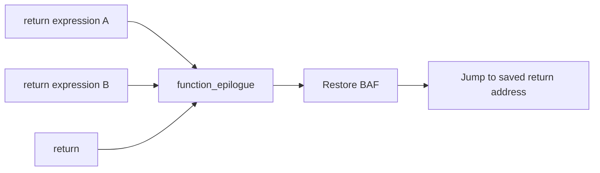

#### 1.1.3.3 Naked functions without a generated frame
[\[↑ TOC\]](#contents)

`__attribute__((naked))` removes both the compiler-generated stack-frame
prologue and the shared epilogue. `return;` emits no epilogue jump, while
`return expression;` only evaluates the expression and places its value in
`IN2`. A naked function must therefore provide its own register setup and
return or control-transfer sequence.

PicoOS uses naked functions for the EPROM entry, the userspace `_start`
function, interrupt entries, and dispatcher restoration because those paths
must exactly match hardware-created or kernel-created stack layouts. There is
no hidden prologue or epilogue around the instructions shown in those
functions. This is a direct compiler-to-kernel contract: the compiler's frame
and offset rules determine the saved interrupt frame, and the dispatcher
restores that same layout.

### 1.1.4 Selecting a startup function with `-C` / `--startup-source`
[\[↑ TOC\]](#contents)

The compiler either generates the normal entry point or uses a startup source
selected at link time. Understanding the generated default first makes the
custom `libstart` sequence and the entry chosen for each PicoOS image easier to
follow.

#### 1.1.4.1 Default compiler-generated `_start`
[\[↑ TOC\]](#contents)

When no custom startup source is selected, a linked program with a global
`main` receives a compiler-generated `_start`. The following source-equivalent
example shows its control flow; `Exit` represents the compiler's internal exit
operation rather than a PicoC function that application code can call:

```c
void _start(void) {
    main();
    Exit(0);
}
```

The generated entry runs any remaining global initializer code before calling
`main`, then terminates with `LOADI ACC 0` and `JUMP 0` after `main` returns.

#### 1.1.4.2 Supplying a custom startup function
[\[↑ TOC\]](#contents)

The `-C PATH` / `--startup-source PATH` option instead links an additional
PicoC or compiled `.reti_blocks` startup unit. If that unit defines `_start`,
the compiler places it first in `.text` and uses it in place of the generated
default; otherwise, the compiler still creates the default entry. Global
initializer code precedes either form.

#### 1.1.4.3 PicoOS `libstart` startup sequence
[\[↑ TOC\]](#contents)

PicoOS selects [`library/start/libstart.picoc`](library/start/libstart.picoc)
for userspace with `-C library/start/libstart.picoc`. The wrapper records its
compiled-library dependency and includes the actual startup implementation:

```c
// dependencies: ../stdlib/libstdlib.reti_blocks

#include "start.picoc"
```

The included [`library/start/start.picoc`](library/start/start.picoc) contains
the complete userspace startup path:

```c
#include "../stdlib/stdlib.header"
#include "../unistd/unistd.header"

int main(int argc, char **argv);
void initialize_environment(char **environment);

void start_process(int argc, char **argv) {
    init_process_heap();
    initialize_environment(argv + argc + 1);
    exit(main(argc, argv));
}

__attribute__((naked))
void _start(int argc, char *first_argument) {
    start_process(argc, (char **)&first_argument);
}
```

The naked [`_start()`](library/start/start.picoc#L14) sees the initial stack
exactly as the kernel built it and treats
[`&first_argument`](library/start/start.picoc#L14) as the start of `argv`.
It passes that table to [`start_process()`](library/start/start.picoc#L7),
which calls [`init_process_heap()`](library/stdlib/malloc.picoc#L18), clones
the initial environment through
[`initialize_environment()`](library/stdlib/env.picoc#L97), calls the
application's `main`, and passes its result to
[`exit()`](library/stdlib/exit.picoc#L3). The initial userspace stack is shown
in [Process image and initial stack](#44-process-image-and-initial-userspace-stack).

#### 1.1.4.4 Startup functions used by PicoOS images
[\[↑ TOC\]](#contents)

The following table distinguishes the entry used for each PicoOS image. The
init process and shell are userspace programs, so they deliberately use the
same startup path as every other system or user application.

| Image | `_start` used | Next function |
| --- | --- | --- |
| EPROM bootloader | Its explicitly defined naked [`_start()`](boot/bootloader.picoc#L9), compiled as part of the bootloader without `-C` | [`boot_main()`](boot/bootloader.picoc#L41) |
| SRAM kernel | Compiler-generated default `_start`, because the kernel is linked without `-C` | [`main()`](kernel/kernel.picoc#L31) |
| Init process | [`libstart` `_start()`](library/start/start.picoc#L14), selected with `-C library/start/libstart.picoc` | [`main()`](system/init.picoc#L100) |
| Shell | [`libstart` `_start()`](library/start/start.picoc#L14), selected with the same `-C` option | [`main()`](user/shell.picoc#L1577) |
| Other system and user applications | [`libstart` `_start()`](library/start/start.picoc#L14), selected by the common userspace link rule | The application's `main` |

### 1.1.5 Program sections, interrupt-vector entries, and linker placement
[\[↑ TOC\]](#contents)

The extended compilation and linking pipeline orders every linked image as
`.ivt`, `.text`, then `.data`. These are regions of the final flat RETI
program, not separate files. Their recorded boundaries are explained further
in [Linked `.sections` metadata](#117-linked-sections-metadata-and-the-five-word-binary-header).

| Section | Default contents and addressing | How source selects it |
| --- | --- | --- |
| `.ivt` | Interrupt-vector words and, when requested, low-level functions; it begins at image offset 0 and uses `CS`-relative global references | Add `__attribute__((section("ivt")))` to a global variable, function declaration, or function definition |
| `.text` | `_start` followed by ordinary functions and their instructions; execution and code labels are relative to `CS` | This is the default for functions |
| `.data` | Ordinary global and static storage, addressed relative to `DS` | This is the default for global and static variables |

The attribute string is `"ivt"` without a leading dot. The compiler currently
supports this explicit section choice only for `.ivt`; it chooses `.text` and
`.data` from whether a declaration is a function or stored data. For example,
PicoOS places its global
[`interrupt_vector_table`](interrupt_service_routines/os_isrs.picoc#L24)
array at the beginning of the kernel image:

```c
__attribute__((section("ivt")))
void (*interrupt_vector_table[OS_INTERRUPT_VECTOR_COUNT])(void) = {
    syscall_interrupt,
    timer_interrupt,
    uart_interrupt,
    cpu_exception_interrupt,
    dma_interrupt
};
```

With `-O1`, compile-time-known initializers for global scalars, strings,
structs, arrays, and function pointers are emitted directly as words in
`.data`, or in `.ivt` when the declaration carries the section attribute.
Runtime-dependent initializers still execute from startup code. Consequently,
the five initialized function pointers in
[`interrupt_vector_table`](interrupt_service_routines/os_isrs.picoc#L24)
are already the first five words of the kernel payload when the binary is
loaded into SRAM. The interrupt hardware can therefore read the vector table
immediately, before any `_start` code has executed. `IVTE` and the final linker
patch pass encode those function addresses with the correct SRAM tag.

The stack-frame and naked-function rules used by these low-level stubs are
defined in [System V ABI stack frames and call cleanup](#113-system-v-abi-stack-frames-and-call-cleanup).
Linked labels inside inline assembly let the stubs refer to normal C helpers
after final placement.

### 1.1.6 RETI pseudoinstructions
[\[↑ TOC\]](#contents)

The RETI hardware has no native stack instructions, its immediate fields are
only 22 bits wide, and an ordinary `JUMP` contains only a relative 22-bit
offset. The compiler therefore adds four pseudoinstructions to the RETI syntax
used by generated `.reti_blocks` and PicoC `asm("...")` statements. They are
represented in the normal RETI AST and replaced with concrete machine
instructions during the final linking passes. The table summarizes the purpose
and expansion size of each pseudoinstruction.

| Pseudoinstruction | Purpose | Concrete size |
| --- | --- | ---: |
| `PUSH reg` | Reserves one stack cell and stores `reg` in it | 2 instructions |
| `POP reg` | Loads the top stack cell into `reg` and releases it | 2 instructions |
| `LOADI32 reg operand` | Loads a 32-bit literal, linked symbol, or `symbol +/- offset` | 3 instructions |
| `JUMP32[relation] target` | Jumps to an immediate address or linked code label without the normal jump-range limit | 4--6 instructions when retained |

`relation` is optional and uses the normal RETI conditions: `<`, `<=`, `>`,
`>=`, `==`, `!=`, or `_NOP`. Thus `JUMP32 target` is unconditional, while
`JUMP32== target` jumps only when `ACC` is zero; RETI compares `ACC` directly and has no
separate condition-flags register. Numeric
operands and targets are accepted directly; symbols and symbolic offsets are
resolved only after all compilation units and sections have been combined.

#### 1.1.6.1 Interrupt-safe `PUSH` and `POP`
[\[↑ TOC\]](#contents)

The RETI stack grows toward lower addresses. `PUSH` moves `SP` before writing
the new value, while `POP` reads the value before moving `SP` back:

| Pseudoinstruction | Expansion |
| --- | --- |
| `PUSH ACC` | `SUBI SP 1`<br>`STOREIN SP ACC 1` |
| `POP ACC` | `LOADIN SP ACC 1`<br>`ADDI SP 1` |

This order matters in PicoOS because a hardware interrupt can occur between
the two concrete instructions. On a push, the earlier `SP` update protects the
new stack cell from the interrupt frame. On a pop, the later update keeps the
still-needed cell protected until it has been read.

The compiler uses these operations for function arguments, return addresses,
and saved `BAF` values. PicoOS also uses them directly in naked startup and
interrupt code to construct and restore the activation record shared by the
compiler, interrupt handlers, and dispatcher. For example, an ISR can preserve
registers without spelling out the indexed stack accesses:

```c
asm("PUSH ACC");
asm("PUSH IN1");
/* Handle the interrupt */
asm("POP IN1");
asm("POP ACC");
```

#### 1.1.6.2 Loading 32-bit values with `LOADI32`
[\[↑ TOC\]](#contents)

`LOADI32 reg operand` provides a full 32-bit value even though the concrete
`LOADI` instruction has only a signed 22-bit immediate. After resolving a
symbol, the linker divides the value into a signed upper 22-bit part and an
unsigned lower 10-bit part, then always emits:

```reti
LOADI reg upper_22_bits
MULTI reg 1024
ORI reg lower_10_bits
```

The result is the original 32-bit bit pattern. This works for values such as
the tagged SRAM base `-2147483648` as well as linked addresses. A code label is
resolved relative to `CS`, so code that needs the absolute address adds `CS`
afterward. PicoOS's bootloader uses exactly this sequence conceptually:

```c
asm("LOADI32 ACC start_loaded_kernel");
asm("ADD ACC CS");
asm("MOVE ACC PC");
```

The same pseudoinstruction loads absolute segment and stack values generated
in the generated [kernel](kernel/memory_constants.header) and
[bootloader](boot/memory_constants.header) headers, and the compiler itself uses it when constructing
function pointers and return addresses.

#### 1.1.6.3 Long jumps with `JUMP32`
[\[↑ TOC\]](#contents)

`JUMP32` avoids the signed 22-bit relative-offset limit of the hardware
`JUMP`. For a symbolic target, the linker builds the target's `CS`-relative
address in `ACC`, adds `CS`, and moves the absolute result into `PC`:

```reti
LOADI ACC upper_22_bits
MULTI ACC 1024
ORI ACC lower_10_bits
ADD ACC CS
MOVE ACC PC
```

A numeric target is treated as an absolute address, so its expansion omits
`ADD ACC CS` and contains four instructions. A conditional form first emits a
short jump with the opposite relation to skip over the long-jump sequence when
the condition is false. It is therefore one instruction longer: six
instructions for a symbolic target and five for an immediate target.

Taken `JUMP32` operations use `ACC` as a scratch register. The compiler keeps
function results in `IN2`, leaving `ACC` available for generated block and
shared-epilogue jumps. It emits symbolic `JUMP32` nodes for ordinary PicoC
control flow as well as accepting statements such as
`asm("JUMP32 signal_epilogue");` in naked low-level code.

#### 1.1.6.4 Pseudoinstruction expansion during linking
[\[↑ TOC\]](#contents)

Expansion is split across the two final RETI-side passes so instruction and
label positions remain correct:

1. `reti_patch` expands each `PUSH` and `POP`, removes an unconditional jump to
   the immediately following block, and then records every block's concrete
   instruction count and start position.
2. `reti` resolves program-wide symbols, flattens the blocks, and expands
   `LOADI32` and `JUMP32` using the now-final section and block addresses.

Because inline assembly is parsed into the same AST as compiler-generated
RETI, these rules and symbolic resolution apply identically to both. No
pseudoinstruction reaches the emulator or assembled binary.

### 1.1.7 Linked `.sections` metadata and the five-word binary header
[\[↑ TOC\]](#contents)

Each completed link step emits `program.reti` together with
`program.sections`. The JSON-like `.sections` file records the linked relative
locations of `.ivt`, `.text`, and `.data`, allowing RETI-Emulator to create the
load header and allowing PicoOS to place an image and initialize its segments,
heap, and stack correctly. A typical userspace file has this form:

```json
{
  "codesegment_start": 0,
  "datasegment_start": 11595,
  "heap_start": 11621,
  "heap_size": 2000,
  "stack_start": 14621
}
```

The following table explains the layout entries and which runtime addresses
they determine; the optional ISR entry need not appear in a userspace file.

| Entry | Meaning |
| --- | --- |
| `interrupt_service_routines_start` | Optional start of separately identified ISR code when the linked image contains it |
| `codesegment_start` | Process-relative start loaded into `CS`; for a normal userspace image this is also its initial entry region |
| `datasegment_start` | Process-relative start loaded into `DS` |
| [`heap_start`](kernel/process/process.header#L36) | First cell after static data and first cell managed by the process-local heap |
| [`heap_size`](kernel/process/process.header#L37) | Heap capacity in RETI cells; `-1` requests PicoOS's default |
| `stack_start` | Highest process-relative stack cell; `-1` requests the kernel's default placement |

The compiler creates this file only at the final link. A compile-only `-c`
invocation instead creates reusable `.reti_blocks` and `.st` files because no
complete program layout exists yet. Given `program.reti`, the emulator looks
for `program.sections` automatically. `-S` is needed only for a differently
named layout—for example when the EPROM bootloader is running while the TUI
must display the kernel that will later occupy SRAM.

For example, with the `.sections` values above, assembling an illustrative
`program.reti` produces this five-word header:

```console
$ reti_emulator -a program.reti
$ hexyl -n 20 program.bin
┌────────┬─────────────────────────┬─────────────────────────┬────────┬────────┐
│00000000│ 00 00 00 00 00 00 2d 4b ┊ 00 00 2d 65 00 00 07 d0 │......-K┊..-e....│
│00000010│ 00 00 39 1d             ┊                         │..9.    ┊        │
└────────┴─────────────────────────┴─────────────────────────┴────────┴────────┘
```

When RETI-Emulator runs `-a program.reti`, it reads this metadata while
assembling the RETI program and prepends the resulting five layout words to
the encoded RETI words in `program.bin`. This example shows only those first
20 bytes: five big-endian 32-bit words corresponding to the displayed
`.sections` values. The [appendix](#appendix-inspecting-bin-files-with-hexyl)
shows how to inspect other ranges of a `.bin` file.

The linked section metadata is the contract between compiler, emulator,
bootloader, and process loader. When the emulator assembles a program to
`.bin`, it copies five values from `.sections` into a fixed big-endian header:

| Word | Value | Use in PicoOS |
| ---: | --- | --- |
| 0 | `codesegment_start` | Initial code segment and entry point |
| 1 | `datasegment_start` | Initial data segment |
| 2 | [`heap_start`](kernel/process/process.header#L36) | Start of the userspace heap within a process image |
| 3 | [`heap_size`](kernel/process/process.header#L37) | Configured heap size, or `-1` for the PicoOS default |
| 4 | `stack_start` | Highest stack cell, or `-1` for the PicoOS default |

The [`load` host request](#122-uart-host-service-protocol) supplies a
bootloader with a total word count before this header and payload. The
userspace process loader first obtains the byte count with `file-size`, then
uses `read-range` to obtain the header and encoded payload. Both loaders
consume the five header words and copy only the encoded RETI words to SRAM.
The allocated process image therefore contains only the linked program and its
heap/stack room. The combined transfer and loading sequence appears in
[Process image and initial stack](#44-process-image-and-initial-userspace-stack).

### 1.1.8 Generated memory constants for the bootloader and kernel
[\[↑ TOC\]](#contents)

The kernel and EPROM bootloader need their own absolute addresses before an
ordinary runtime object can tell them where they are. The compiler option
`-k sram` therefore generates [`kernel/memory_constants.header`](kernel/memory_constants.header),
and `-k eprom` generates [`boot/memory_constants.header`](boot/memory_constants.header).
These are compile-time interfaces, not tables allocated by PicoOS. The first
table connects the kernel constants to the state they initialize or restore.

| Kernel constant | Consumer and purpose |
| --- | --- |
| [`SRAM_BASE`](kernel/memory_constants.header#L1) | Converts process-relative linked addresses to the absolute SRAM address space |
| [`SRAM_MAX_ADDRESS_IN_MEMORY_MAP`](kernel/memory_constants.header#L2) | Inclusive final configured SRAM cell; bounds the process-memory heap |
| [`KERNEL_HEAP_START`](kernel/memory_constants.header#L3), [`KERNEL_HEAP_SIZE`](kernel/memory_constants.header#L4) | Initialize the global [`kernel_heap`](kernel/kmalloc.picoc#L7) descriptor and define its stack boundary |
| [`PROCESS_MEMORY_START`](kernel/memory_constants.header#L5) | First cell managed by the global [`process_memory_heap`](kernel/pmalloc.picoc#L7) for process images and shared data |
| [`KERNEL_CS_START_ASM`](kernel/memory_constants.header#L6), [`KERNEL_DS_START_ASM`](kernel/memory_constants.header#L7) | Inline assembly fragments used when interrupt entries install kernel segments |
| [`KERNEL_SP_START_ASM`](kernel/memory_constants.header#L8) | Inline assembly fragment that installs the linked kernel stack start |
| [`KERNEL_CS_ACC_ASM`](kernel/memory_constants.header#L9) | Generated fragment for loading the kernel code base into `ACC`; currently unused by PicoOS source |

The bootloader constants in the next table establish the temporary context
used before the kernel image can supply its own segment and stack values.

| Bootloader constant | Consumer and purpose |
| --- | --- |
| [`SRAM_MAX_ADDRESS`](boot/memory_constants.header#L1) | Final physical SRAM offset; fallback kernel stack offset when the loaded header contains -1 |
| [`EPROM_DS_START_ASM`](boot/memory_constants.header#L2) | Loads the bootloader's linked EPROM data segment |
| [`EPROM_STACK_START_ASM`](boot/memory_constants.header#L3) | Loads the absolute top-of-SRAM temporary stack |

Both [`kernel.sections`](kernel/kernel.sections) and the kernel header come from the same final linked
layout. The header adds [`SRAM_BASE`](kernel/memory_constants.header#L1) where an absolute address is required;
the `.sections` file retains program-relative values for loading and debug
views. The bootloader reads the kernel's five-word binary header to load that
image, but uses its own EPROM header before any kernel state exists.

## 1.2 RETI-Emulator extensions
[\[↑ TOC\]](#contents)

The compiler produces the linked images and metadata described above. The
emulator assembles those images, runs the RETI machine, and provides the
peripherals and host file services used by PicoOS. The table summarizes the
emulator features on which the OS depends.

| Feature | Contribution used by PicoOS |
| --- | --- |
| Plain execution output | Without the debugger, completed UART output is written directly to host stdout |
| Commented assembly | Debug mode can show source-derived labels and comments beside instructions |
| Atomic locking | `TSL` atomically returns a cell's old value and stores `1`, supporting the mutex library |
| Structured loading | `.sections` distinguishes the vector table, ISR code, `.text`, `.data`, heap, and stack |
| Binary assembly | `--assemble program.reti` combines RETI words with the five layout header words in `program.bin` |
| EPROM-only boot | `-e boot/bootloader.reti` starts CPU execution at the EPROM bootloader without preloading a program into SRAM |
| Configurable SRAM | PicoOS selects 262,144 physical 32-bit cells while retaining the RETI tagged address space |
| Memory-mapped periphery | UART, device mappings, priorities, timer interval, stack boundary, exception cause, and optional DMA occupy offsets 0–16 |
| Interrupt controller | Timer, DMA through the custom device line, and UART have configurable vector mappings, priorities, pending state, and nesting behavior |
| Direct memory access | Optional DMA copies UART words into SRAM for kernel, init, and later program loading; scheduled loads receive a completion interrupt |
| Manual interrupts | The TUI can select and trigger an interrupt vector for inspection |
| Runtime timer | An instruction-count interval produces repeatable userspace preemption and exposes the live counter in the TUI |
| Raw-byte UART | Receive/send registers and status bits model byte delivery rather than line-oriented console input |
| UART host services | The emulator parses bounded load, read, file-size, output, directory, and removal requests from the byte stream |
| Normal and raw terminals | The normal view preserves host signal processing; raw mode forwards control and escape bytes needed by the shell |
| CPU exceptions | Divide by zero, stack overflow, and illegal instructions enter fixed vector 3 and expose a cause value |
| Stack/heap protection | The active inclusive boundary is checked whenever an instruction attempts to decrease `SP` |
| Runtime segment interpretation | Code/data/watch views follow live `CS` and `DS` after bootloading and context switches |
| Source-level debugging | `.debuginfo` and preprocessed source provide globals, locals, arguments, calls, frames, and source positions |
| SRAM transcoding | Memory can be viewed as numbers, characters, or decoded instructions without losing known-code regions |
| Snapshots and restart | Complete CPU, memory, interrupt, UART, and peripheral state can be saved, restored repeatedly, or restarted |
| Live inspection/editing | Windows can be selected, scrolled, centered, and edited while inspecting registers or memory |
| Synthetic OS context | The initial debugger state can model the kernel/interrupt context needed before PicoOS's first `RTI` |
| Explicit vector count | The emulator can reserve the five-entry IVT before the bootloader populates SRAM |
| Isolated assembly runs | The repository wrapper keeps assembler processes from overwriting peripheral files belonging to an active OS instance |

### 1.2.1 RETI machine model and memory-mapped peripherals
[\[↑ TOC\]](#contents)

The debugger views reflect the emulator's ordinary RETI instructions and
memory-mapped devices; PicoOS reaches them through loads/stores and interrupt
vectors rather than a special emulator API. Periphery offset `n` has address
`0x40000000 + n`, while kernel/process code uses absolute SRAM addresses based
at `0x80000000`. The register table below connects each offset to the device
operation that kernel code can request or observe.

| Offset | Register | Access and connection to PicoOS |
| ---: | --- | --- |
| 0 | UART send | Kernel/bootloader write the low byte and clear send-ready in offset 2 |
| 1 | UART receive | Emulator writes an incoming byte; polling code or UART ISR reads it |
| 2 | UART status | Bit 0 reports send-ready and bit 1 receive-ready |
| 3–5 | Device-to-vector mappings | Timer, custom device, and UART select IVT indices; 255 disables a line |
| 6–8 | Device priorities | Interrupt controller selects the highest-priority pending device |
| 9 | Timer interval | Instruction-count period; zero disables and a write restarts the counter |
| 10 | Stack/heap boundary | Inclusive active lower stack limit; dispatcher rewrites it on every context switch |
| 11 | CPU exception cause | Read-only: none, divide by zero, stack overflow, or illegal instruction |
| 12 | DMA active | Always present; `1` enables DMA and exposes offsets 13–16 |
| 13 | DMA source | Absolute UART receive address used by PicoOS |
| 14 | DMA destination | Absolute SRAM destination address |
| 15 | DMA word count | Number of complete 32-bit words to copy |
| 16 | DMA status/control | `0` idle, write/read `1` for start/busy, `2` complete, `3` error |

CPU exception vector 3 is fixed rather than configured through cells 3–8.
The kernel initializes timer/DMA/UART mappings from its global arrays; the
dispatcher connects each PCB's [`base_address`](kernel/process/process.header#L34), [`heap_start`](kernel/process/process.header#L36), and [`heap_size`](kernel/process/process.header#L37) to
cell 10. This is a concrete example of a kernel data structure controlling an
emulated hardware protection register.

### 1.2.2 UART host-service protocol
[\[↑ TOC\]](#contents)

UART transports bytes only. PicoOS and the emulator place the UART host
request protocol on top of it. Every host request starts with escape byte 27
and has the form `<ESC>operation arguments<ESC>/`. The table below lists the
request forms and the host operation or response each one selects.

| Request form | Result |
| --- | --- |
| `<ESC>load <path><ESC>/` | Big-endian word count followed by binary bytes; used by the bootloader |
| `<ESC>read-range <offset> <count> <path><ESC>/` | Returned byte count followed by that file range |
| `<ESC>file-size <path><ESC>/` | File size as one 32-bit value |
| `<ESC>write <path><ESC>/` | Create/truncate a file and route following UART bytes to it |
| `<ESC>write-at <offset> <path><ESC>/` | Preserve a file and route following UART bytes to the byte offset |
| `<ESC>write stdout<ESC>/` / `stderr` | Restore a host standard output stream |
| `<ESC>literal-output <count><ESC>/` | Treat exactly the next `count` UART bytes as output data, even when they contain `<ESC>` |
| `<ESC>pwd<ESC>/` | PicoOS root `/` as a length-prefixed string |
| `<ESC>is-directory <path><ESC>/` | Directory test |
| `<ESC>mkdir <path><ESC>/` | Create a directory |
| `<ESC>ls <path><ESC>/` | Length-prefixed directory listing |
| `<ESC>unlink <path><ESC>/` | Remove a file |
| `<ESC>rmdir <path><ESC>/` | Remove an empty directory |
| `<ESC>move <old path>\n<new path><ESC>/` | Move or rename a file or directory |
| `<ESC>touch <path><ESC>/` | Create a file or update its timestamps |

These are fixed operations, not a generic host-command mechanism. The emulator
debugger additionally shows RETI registers, EPROM, SRAM, periphery state, PicoC
source, snapshots, and normal/raw UART terminals.

Requests that return data receive it on the same UART stream. A `load` host
request has the file-transfer form below. In this and the following diagram,
`ESC` denotes the escape byte written as `<ESC>` in the request forms above:

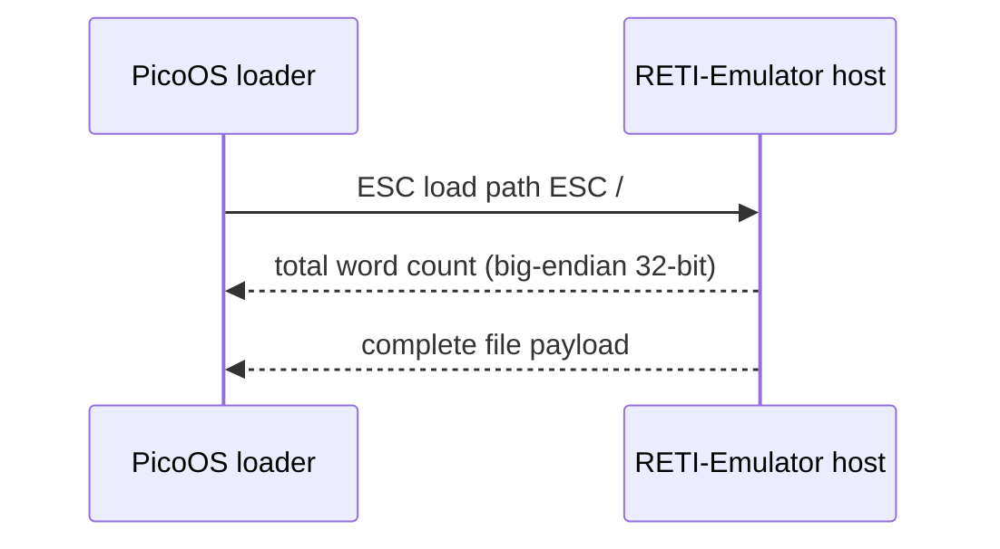

Other host requests use the response form that fits their operation. Ranged
reads prefix a byte payload with its byte count, while metadata and status
requests return one big-endian value without a payload:

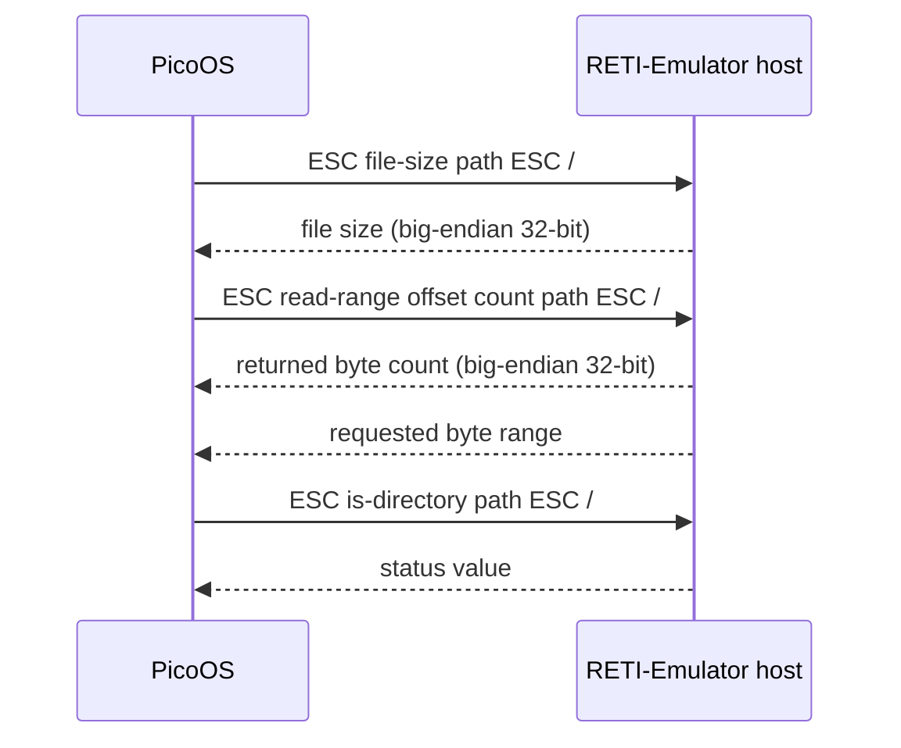

For `load`, the host returns the complete file length in words followed by the
file bytes; `UINT32_MAX` represents failure. The EPROM bootloader and the
kernel's initial [`init`](system/init.picoc) load consume this stream before scheduling exists. They
copy it with DMA when register 12 reports DMA active and otherwise receive one
word at a time. Later process loading combines `file-size` with `read-range`:
the DMA path requests the complete payload, while the fallback uses independent
1 KiB responses so another process can safely use the host request protocol between
chunks. `read-range`, `file-size`, `pwd`, and `ls` begin their responses with a
big-endian length/value.
Output-selection requests are different: after `<ESC>write path<ESC>/` or
`<ESC>write-at offset path<ESC>/`, ordinary subsequent UART bytes go to that
host file until PicoOS sends `<ESC>write stdout<ESC>/` or selects stderr.
The `literal-output` request protects a known byte count from being parsed as
another host command; regular-file writes use it when their data contains an
escape byte.

The protocol keeps descriptor and path state in PicoOS while leaving file
storage on the host. The bootloader and process loader request binaries through
the same UART transport that later carries bounded file and directory
operations.

### 1.2.3 Debugger, source view, and terminal modes
[\[↑ TOC\]](#contents)

The debugger is the reader's main view of RETI state and PicoC source while
PicoOS runs. The following recording demonstrates its execution controls,
state views, source debugging, snapshots, and UART terminal:

[](https://asciinema.org/a/1264549)

Selecting the thumbnail opens the recording on Asciinema. Its controls let a
reader step, continue, restart, step an ISR, inspect or edit registers and
memory, trigger an interrupt, save/restore snapshots, open source debugging,
and enter normal or raw UART terminal mode. During continuous execution the
terminal remains live and each delivered input byte can raise a UART hardware
interrupt.

The TUI follows live `CS` and `DS` as the bootloader installs the kernel and the
dispatcher switches processes. Compiler `.debuginfo`, preprocessed source,
labels, and `.sections` supply the source/section meaning that raw RETI words
cannot contain themselves. The emulator can therefore show source frames and
section-aware memory while still executing the same encoded words intended for
hardware. The machine model, peripherals, and host protocol described above
provide the state shown in these views.

Normal terminal view `v` leaves host signal processing active and returns with
Escape. Raw view `V` forwards control and escape bytes—including `Ctrl+C`,
`Ctrl+Z`, and arrow-key sequences—and returns with `Ctrl+]`. Raw mode is the
appropriate view for the PicoOS shell because these bytes drive terminal
signals and command-history editing.

# 2. Interrupts, system calls, preemption, and exceptions
[\[↑ TOC\]](#contents)

Interrupts are the controlled entry points for software requests, hardware
events, and synchronous CPU faults. This chapter keeps the vector table,
system-call ABI, dispatch path, preemption rules, device interrupts, and
exceptions together so later kernel chapters can refer to one execution
boundary.

## 2.1 RETI interrupt entry and the interrupt vector table
[\[↑ TOC\]](#contents)

The linked kernel has five vector cells at the beginning of SRAM. The array
below defines their order, and the following table connects each entry to the
software instruction or hardware source that invokes it:

```c
__attribute__((section("ivt")))
void (*interrupt_vector_table[OS_INTERRUPT_VECTOR_COUNT])(void) = {
    syscall_interrupt,
    timer_interrupt,
    uart_interrupt,
    cpu_exception_interrupt,
    dma_interrupt
};
```

| Vector | Entry | Source |
| ---: | --- | --- |
| 0 | [`syscall_interrupt()`](interrupt_service_routines/isrs.picoc#L74) | Software `INT 0` from userspace |
| 1 | [`timer_interrupt()`](interrupt_service_routines/isrs.picoc#L68) | Timer device |
| 2 | [`uart_interrupt()`](interrupt_service_routines/os_isrs.picoc#L195) | UART receive device |
| 3 | [`cpu_exception_interrupt()`](interrupt_service_routines/os_isrs.picoc#L171) | Fixed synchronous CPU exception vector |
| 4 | [`dma_interrupt()`](interrupt_service_routines/os_isrs.picoc#L233) | DMA completion on the hardware custom-device line |

An `INT` automatically saves only the interrupted return PC. Each ISR
explicitly saves any general registers it needs. `RTI` reloads the PC from
`SP + 1`, increments `SP`, and advances execution.

## 2.2 Interrupt-controller mappings and priorities
[\[↑ TOC\]](#contents)

The vector table fixes the kernel entry order, while the interrupt controller
connects hardware devices to those entries and chooses between pending events.
The following globals provide the mappings and priorities installed during
kernel startup.

The interrupt controller has two static global arrays in kernel `.data`.
[`interrupt_device_isrs[]`](kernel/interrupt_controller.picoc#L3) maps timer/DMA/UART to `1/4/2`, and
[`interrupt_device_priorities[]`](kernel/interrupt_controller.picoc#L9) assigns `1/1/2`. Initialization reads these
arrays and writes periphery registers 3–8; neither array uses [`kmalloc()`](kernel/kmalloc.picoc#L23).

## 2.3 Saved interrupt stack frame
[\[↑ TOC\]](#contents)

System calls and process timer preemption create the same process-stack frame.
[`caller_context`](kernel/dispatcher.picoc#L71) points to its free cell:

| Offset | Stored value |
| ---: | --- |
| `+0` | Free cell addressed by [`caller_context`](kernel/dispatcher.picoc#L71) |
| `+1` | Saved `DS` |
| `+2` | Saved `CS` |
| `+3` | Saved `BAF` |
| `+4` | Saved `IN2` |
| `+5` | Saved `IN1` |
| `+6` | Saved `ACC` |
| `+7` | Return PC saved by interrupt entry |

[`dispatcher_switch_from_context()`](kernel/dispatcher.picoc#L71) copies offsets 1–6 into the current PCB’s
embedded activation and records [`activation.sp`](kernel/process/process.header#L25) = [`caller_context`](kernel/dispatcher.picoc#L71) + 6. The
return PC remains at [`activation.sp`](kernel/process/process.header#L25) + 1 for the later `RTI`.

## 2.4 System-call ABI
[\[↑ TOC\]](#contents)

Userspace and the kernel share one compact calling convention. The register
rules below define the interrupt boundary; the request structures then show
how wrappers carry calls that need more than one argument.

### 2.4.1 Syscall selectors and register convention
[\[↑ TOC\]](#contents)

Userspace wrappers place the syscall selector in `ACC`, one integer or request
pointer in `IN1`, and execute `INT 0`. After `RTI`, `IN2` contains the result,
matching the normal PicoC function-return convention described in the
[stack-frame section](#113-system-v-abi-stack-frames-and-call-cleanup).

A system call has room for one integer argument in `IN1`. Wrappers that need several values
therefore create a request structure in their current userspace stack frame, put its absolute
address in `IN1`, put the selector in `ACC`, and execute `INT 0`. The structures are declared in
[`common/syscall.header`](common/syscall.header) and [`common/file.header`](common/file.header). The
declarations below show all request shapes; the following field tables describe initialization and
use:

```c
struct LoadProcessRequest { char *path; bool show_loading_bar; };
struct RunProcessRequest { int pid; char *arguments; char **environment; };
struct WaitPidRequest { int pid; int *status; };
struct KillRequest { int pid; int signal_number; };
struct PrctlRequest { int option; int argument; };
struct ShmOpenRequest { char *name; size_t size; };
struct GetCwdRequest { char *buffer; int size; };
struct ReadDirectoryRequest { char *path; char *buffer; int capacity; };
struct MoveRequest { char *old_path; char *new_path; };

struct OpenRequest { char *path; int flags; };
struct IoRequest {
    int file_descriptor;
    char *buffer;
    int count;
    bool protect_uart_control;
    bool show_loading_bar;
    int transferred;
    int loading_bar_update;
    bool complete;
};
struct SeekRequest {
    int file_descriptor;
    int offset;
    int origin;
};
struct Dup2Request { int old_file_descriptor; int new_file_descriptor; };
```

### 2.4.2 Process, wait, signal, and memory request structures
[\[↑ TOC\]](#contents)

The table identifies each request field’s purpose. [`load()`](library/unistd/process.picoc#L17),
[`run()`](library/unistd/process.picoc#L31), [`waitpid()`](library/sys/wait/wait.picoc#L14),
[`kill()`](library/signal/signal.picoc#L14), [`prctl()`](library/sys/prctl/prctl.picoc#L14), and
[`shm_open()`](library/sys/mman/mman.picoc#L15) first initialize every field of their respective
local request before invoking the kernel. Kernel startup also constructs a
[`RunProcessRequest`](common/syscall.header#L56) in [`main()`](kernel/kernel.picoc#L31) for init.

| Field | Meaning | Used by |
| --- | --- | --- |
| [`LoadProcessRequest.path`](common/syscall.header#L52) | Path of the `.bin` image | First initialized by [`load()`](library/unistd/process.picoc#L17); [`load()`](library/unistd/process.picoc#L17) / syscall 2; the loader normalizes it and the PCB receives its own [`kmalloc()`](kernel/kmalloc.picoc#L23) path copy |
| [`LoadProcessRequest.show_loading_bar`](common/syscall.header#L53) | Whether UART transfer progress should be printed | First initialized by [`load()`](library/unistd/process.picoc#L17); read only during loading; derived from `PICOOS_LOADING_BAR` |
| [`RunProcessRequest.pid`](common/syscall.header#L57) | PID of an existing `NEW` PCB | First initialized by [`run()`](library/unistd/process.picoc#L31) (or kernel [`main()`](kernel/kernel.picoc#L31) for init); [`run()`](library/unistd/process.picoc#L31) / syscall 3; identifies the PCB changed to `READY` |
| [`RunProcessRequest.arguments`](common/syscall.header#L58) | Space/tab-separated argument string, or `NULL` | First initialized by [`run()`](library/unistd/process.picoc#L31) (or kernel [`main()`](kernel/kernel.picoc#L31) for init); copied into the child's initial process stack; the pointer itself is not retained |
| [`RunProcessRequest.environment`](common/syscall.header#L59) | Null-terminated array of `NAME=value` pointers | First initialized by [`run()`](library/unistd/process.picoc#L31) (or kernel [`main()`](kernel/kernel.picoc#L31) for init); strings and pointer table are copied into the child's initial stack |
| [`WaitPidRequest.pid`](common/syscall.header#L63) | Exact child PID | First initialized by [`waitpid()`](library/sys/wait/wait.picoc#L14); [`waitpid()`](library/sys/wait/wait.picoc#L14) / syscall 7; used to find and validate the child |
| [`WaitPidRequest.status`](common/syscall.header#L64) | Address of caller's status cell | First initialized by [`waitpid()`](library/sys/wait/wait.picoc#L14); immediate status destination or copied into the waiting parent's [`waiting_status_ptr`](kernel/process/process.header#L44) while blocked |
| [`KillRequest.pid`](common/syscall.header#L68) | Target process | First initialized by [`kill()`](library/signal/signal.picoc#L14); [`kill()`](library/signal/signal.picoc#L14) / syscall 11; lookup only, not retained |
| [`KillRequest.signal_number`](common/syscall.header#L69) | Signal to deliver; 0 probes existence | First initialized by [`kill()`](library/signal/signal.picoc#L14); may change target state or defer termination, but the request is not retained |
| [`PrctlRequest.option`](common/syscall.header#L74) | Currently only [`PR_SET_PDEATHSIG`](common/prctl.header#L3) | First initialized by [`prctl()`](library/sys/prctl/prctl.picoc#L14); [`prctl()`](library/sys/prctl/prctl.picoc#L14) / syscall 12; selects the supported operation |
| [`PrctlRequest.argument`](common/syscall.header#L76) | Signal number, or 0 to disable | First initialized by [`prctl()`](library/sys/prctl/prctl.picoc#L14); copied into current PCB [`parent_death_signal`](kernel/process/process.header#L59) |
| [`ShmOpenRequest.name`](common/syscall.header#L80) | Name used to find an entry in the kernel's shared-memory linked list | First initialized by [`shm_open()`](library/sys/mman/mman.picoc#L15); [`shm_open()`](library/sys/mman/mman.picoc#L15) / syscall 19; a new entry receives a [`kmalloc()`](kernel/kmalloc.picoc#L23) copy |
| [`ShmOpenRequest.size`](common/syscall.header#L81) | Requested shared region size in RETI cells | First initialized by [`shm_open()`](library/sys/mman/mman.picoc#L15); used only when creating a name; an existing entry is not resized |

### 2.4.3 File and directory request structures
[\[↑ TOC\]](#contents)

The table traces file and directory arguments from userspace into the kernel.
[`open()`](library/fcntl/fcntl.picoc#L5) and [`fopen()`](library/stdio/stdio.picoc#L125) initialize
[`OpenRequest`](common/file.header#L26); [`read()`](library/unistd/io.picoc#L6),
[`write()`](library/unistd/io.picoc#L32), and [`write_without_uart_escape_check()`](library/unistd/io.picoc#L43) initialize
the [`IoRequest`](common/file.header#L31) fields each operation uses.
[`lseek()`](library/unistd/io.picoc#L66), [`dup2()`](library/unistd/io.picoc#L58),
[`getcwd()`](library/unistd/working_directory.picoc#L11),
[`opendir()`](library/dirent/dirent.picoc#L8), and [`move()`](library/unistd/file_removal.picoc#L12)
initialize their corresponding request structures before the call.

| Field | Meaning | Used by |
| --- | --- | --- |
| [`OpenRequest.path`](common/file.header#L27) | Relative or absolute PicoOS path to a host-backed file or kernel device | First initialized by [`open()`](library/fcntl/fcntl.picoc#L5) or [`fopen()`](library/stdio/stdio.picoc#L125); [`open()`](library/fcntl/fcntl.picoc#L5)/[`fopen()`](library/stdio/stdio.picoc#L125) and syscall 23; normalized and copied into the selected descriptor |
| [`OpenRequest.flags`](common/file.header#L28) | Access mode plus [`O_CREAT`](common/file.header#L13), [`O_TRUNC`](common/file.header#L14), or [`O_APPEND`](common/file.header#L15) | First initialized by [`open()`](library/fcntl/fcntl.picoc#L5) or [`fopen()`](library/stdio/stdio.picoc#L125); copied into the descriptor; create/truncate decide open requests and append changes later write positioning |
| [`IoRequest.file_descriptor`](common/file.header#L32) | Entry number in the current PCB’s eight-entry table | First initialized by [`read()`](library/unistd/io.picoc#L6), [`write()`](library/unistd/io.picoc#L32), [`write_without_uart_escape_check()`](library/unistd/io.picoc#L43), or stdio I/O wrappers; used by syscalls 24/25 |
| [`IoRequest.buffer`](common/file.header#L33) | Userspace destination for read or source for write | First initialized by [`read()`](library/unistd/io.picoc#L6), [`write()`](library/unistd/io.picoc#L32), [`write_without_uart_escape_check()`](library/unistd/io.picoc#L43), or stdio I/O wrappers; used directly during the call; for a blocked terminal read the caller's PCB temporarily retains the destination pointer |
| [`IoRequest.count`](common/file.header#L34) | Maximum cells to read or exact cells to write | First initialized by [`read()`](library/unistd/io.picoc#L6), [`write()`](library/unistd/io.picoc#L32), [`write_without_uart_escape_check()`](library/unistd/io.picoc#L43), or stdio I/O wrappers; validated before transfer; retained in terminal pending state only while stdin is blocked |
| [`IoRequest.protect_uart_control`](common/file.header#L35) | Whether a write must scan for `<ESC>` and protect a matching buffer with `literal-output <count>` | First initialized to `true` by [`write()`](library/unistd/io.picoc#L32), [`fputc()`](library/stdio/stdio.picoc#L204), and [`fputs()`](library/stdio/stdio.picoc#L229); initialized to `false` by [`write_without_uart_escape_check()`](library/unistd/io.picoc#L43), [`read()`](library/unistd/io.picoc#L6), [`fgetc()`](library/stdio/stdio.picoc#L178), [`write_process_exception_message()`](kernel/exception.picoc#L29), and [`list_processes()`](kernel/process/process.picoc#L32); read by [`write_file_descriptor()`](kernel/filesystem/filesystem.picoc#L217) |
| [`IoRequest.show_loading_bar`](common/file.header#L36) | Whether a host-file read shows progress | First initialized by [`read()`](library/unistd/io.picoc#L6), write wrappers, or stdio I/O wrappers; [`read()`](library/unistd/io.picoc#L6) derives this from the environment; writes set it false |
| [`IoRequest.transferred`](common/file.header#L37) | Bytes already copied by earlier chunks of the same [`read()`](library/unistd/io.picoc#L6) | First initialized to 0 by [`read()`](library/unistd/io.picoc#L6) (or stdio input); updated by [`read()`](library/unistd/io.picoc#L6) and read by [`read_regular_file()`](kernel/filesystem/filesystem.picoc#L90) as the next buffer position |
| [`IoRequest.loading_bar_update`](common/file.header#L38) | Next total byte count that redraws read progress | First initialized by [`read_regular_file()`](kernel/filesystem/filesystem.picoc#L90) after the first successful range response; retained and updated for subsequent chunks |
| [`IoRequest.complete`](common/file.header#L39) | Whether [`read()`](library/unistd/io.picoc#L6) should return instead of invoking another chunk | First initialized to false by [`read()`](library/unistd/io.picoc#L6); set by [`read_file_descriptor()`](kernel/filesystem/filesystem.picoc#L150) or [`read_regular_file()`](kernel/filesystem/filesystem.picoc#L90) on completion/error |
| [`SeekRequest.file_descriptor`](common/file.header#L43) | Regular-file descriptor to reposition | First initialized by [`lseek()`](library/unistd/io.picoc#L66); [`lseek()`](library/unistd/io.picoc#L66) / syscall 27 |
| [`SeekRequest.offset`](common/file.header#L44) | Signed displacement | First initialized by [`lseek()`](library/unistd/io.picoc#L66); combined with [`SEEK_SET`](common/file.header#L17), current descriptor offset, or host file size |
| [`SeekRequest.origin`](common/file.header#L45) | [`SEEK_SET`](common/file.header#L17), [`SEEK_CUR`](common/file.header#L18), or [`SEEK_END`](common/file.header#L19) | First initialized by [`lseek()`](library/unistd/io.picoc#L66); selects the base for the new descriptor offset |
| [`Dup2Request.old_file_descriptor`](common/file.header#L49) | Descriptor to copy | First initialized by [`dup2()`](library/unistd/io.picoc#L58); [`dup2()`](library/unistd/io.picoc#L58) / syscall 28; source entry remains unchanged |
| [`Dup2Request.new_file_descriptor`](common/file.header#L50) | Entry to replace | First initialized by [`dup2()`](library/unistd/io.picoc#L58); the target receives an independent copy of the source fields/path |
| [`GetCwdRequest.buffer`](common/syscall.header#L85) | Userspace destination | First initialized by [`getcwd()`](library/unistd/working_directory.picoc#L11); [`getcwd()`](library/unistd/working_directory.picoc#L11) / syscall 31; receives the selected directory copy |
| [`GetCwdRequest.size`](common/syscall.header#L86) | Destination capacity | First initialized by [`getcwd()`](library/unistd/working_directory.picoc#L11); prevents copying a path that does not fit |
| [`ReadDirectoryRequest.path`](common/syscall.header#L90) | Directory to list | First initialized by [`opendir()`](library/dirent/dirent.picoc#L8); [`opendir()`](library/dirent/dirent.picoc#L8) / syscall 33; normalized for the host request |
| [`ReadDirectoryRequest.buffer`](common/syscall.header#L91) | Userspace listing buffer | First initialized by [`opendir()`](library/dirent/dirent.picoc#L8); receives `d name\n` / `- name\n` records from the host |
| [`ReadDirectoryRequest.capacity`](common/syscall.header#L92) | Maximum returned cells | First initialized by [`opendir()`](library/dirent/dirent.picoc#L8); bounds the UART response and copy |
| [`MoveRequest.old_path`](common/syscall.header#L96) | Existing file or directory | First initialized by [`move()`](library/unistd/file_removal.picoc#L12); normalized and sent as the first `move` host request path |
| [`MoveRequest.new_path`](common/syscall.header#L97) | New file or directory path | First initialized by [`move()`](library/unistd/file_removal.picoc#L12); normalized and sent as the second `move` host request path |

Single-argument calls do not need a request: PID selectors, descriptor close,
[`mmap(id)`](library/sys/mman/mman.picoc#L23),
[`shm_unlink(name)`](library/sys/mman/mman.picoc#L27), path-only operations, wait-queue pointers,
and foreground-process selection pass the value or pointer directly in `IN1`.

### 2.4.4 Request-pointer ownership and lifetime
[\[↑ TOC\]](#contents)

These request objects are not allocated with [`malloc()`](library/stdlib/malloc.picoc#L35),
[`kmalloc()`](kernel/kmalloc.picoc#L23), or [`pmalloc()`](kernel/pmalloc.picoc#L20): they are
ordinary locals in the caller's process stack. The kernel reads them synchronously through the
absolute pointer. [`load()`](library/unistd/process.picoc#L17) and regular-file
[`read()`](library/unistd/io.picoc#L6) keep their local request alive while their wrappers make
repeated syscalls, but the kernel does not retain its pointer between calls. The important exception
is the value of [`WaitPidRequest.status`](common/syscall.header#L64): when waiting blocks, the
kernel copies that separate pointer into
[`Process.waiting_status_ptr`](kernel/process/process.header#L44); the pointed-to status cell
remains safe because the caller’s stack is suspended. A blocked or stopped terminal read similarly
retains the destination buffer and count in the PCB, as shown in
[Blocking and completing terminal reads](#73-blocking-and-completing-terminal-reads).

## 2.5 System-call dispatch and return path
[\[↑ TOC\]](#contents)

The [system-call ABI](#24-system-call-abi) enters vector 0 with the selector
and argument already placed in registers. The naked entry saves the process
registers, disables the process boundary while changing stacks, installs
kernel segments and the kernel stack, and calls the normal C dispatcher. The
complete [`syscall_interrupt()`](interrupt_service_routines/os_isrs.picoc#L104)
entry, [`syscall_interrupt_return()`](interrupt_service_routines/os_isrs.picoc#L143)
continuation, and
[`syscall_interrupt_restore()`](interrupt_service_routines/os_isrs.picoc#L158)
restoration stub are shown below so the complete entry and return path remains
visible:

```c
__attribute__((naked))
void syscall_interrupt(void) {
    // Saves the same context layout as timer_interrupt
    asm("PUSH ACC"); // Syscall number
    asm("PUSH IN1"); // Syscall argument
    asm("PUSH IN2");
    asm("PUSH BAF");
    asm("PUSH CS");
    asm("PUSH DS");

    // BAF keeps old_sp while loading kernel CS, DS and SP
    asm("MOVE SP BAF");
    asm("LOADI IN1 0");
    write_stack_heap_boundary_from_in1();
    asm(KERNEL_CS_START_ASM);
    asm(KERNEL_DS_START_ASM);
    asm(KERNEL_SP_START_ASM);
    activate_kernel_stack_boundary();

    // Builds the handle_syscall arguments from the saved context
    asm("PUSH BAF"); // Caller context
    asm("LOADIN BAF IN2 5");
    asm("PUSH IN2"); // Syscall argument
    asm("LOADIN BAF IN2 6");
    asm("PUSH IN2"); // Syscall number

    // A syscall that switches processes resumes with a successful IN2 result
    asm("LOADI IN2 1");
    asm("STOREIN BAF IN2 4");

    // Calls handle_syscall and returns through syscall_interrupt_return
    asm("LOADI32 ACC syscall_interrupt_return");
    asm("ADD ACC CS");
    asm("PUSH ACC"); // Return address: syscall restoration stub
    asm("LOADI32 ACC handle_syscall");
    asm("ADD ACC CS");
    asm("MOVE ACC PC");
}

__attribute__((naked))
void syscall_interrupt_return(void) {
    // Handle_syscall restores BAF to the saved caller context before returning
    // Saves the IN2 result before a pending timer request can dispatch the caller
    asm("STOREIN BAF IN2 4");

    asm("PUSH BAF"); // Caller context
    asm("LOADI32 ACC syscall_interrupt_restore");
    asm("ADD ACC CS");
    asm("PUSH ACC");
    asm("LOADI32 ACC dispatcher_reschedule_if_requested");
    asm("ADD ACC CS");
    asm("MOVE ACC PC");
}

__attribute__((naked))
void syscall_interrupt_restore(void) {
    asm("MOVE BAF SP");
    activate_current_process_stack_boundary();
    asm("POP DS");
    asm("POP CS");
    asm("POP BAF");
    asm("POP IN2");
    asm("POP IN1");
    asm("POP ACC");
    asm("RTI");
}
```

[`handle_syscall()`](kernel/syscall.picoc#L16) implements **38 syscalls** in
the continuous selector range **0–37**. Every selector in that range reaches a
kernel operation. The declarations in
[`common/syscall.header`](common/syscall.header) and the branches in
[`handle_syscall()`](kernel/syscall.picoc#L16) keep related operations
adjacent; the groups are organizational and do not affect dispatch.

The following sequence connects the assembly above to the C syscall handler
and the scheduling decision at return. It shows a call whose subsystem returns
normally; a blocking syscall instead saves its frame and dispatches from
inside the subsystem, as shown in [blocking and waking](#62-blocking-with-sleep-and-waking-with-wakeup).

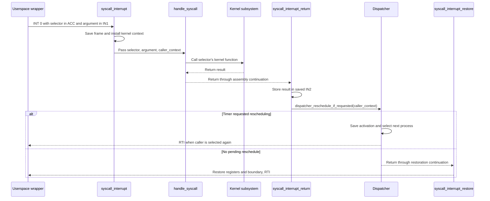

Immediate syscalls replace the saved `IN2` with the C return value. Before
restoring the other registers, the return stub checks whether a timer requested
rescheduling while the kernel was running. A pending request dispatches from
the saved frame; otherwise the stub restores the process boundary and executes
`RTI`. Saved `ACC` remains the syscall number, while saved `IN2` carries the
result through either path.

The userspace [`load()`](library/unistd/process.picoc#L17) and regular-file
[`read()`](library/unistd/io.picoc#L6) wrappers repeat chunk syscalls while
work remains without explicitly yielding. Blocking, yielding, exiting,
deferred timer scheduling, and deferred termination may save or replace the
activation and dispatch another process instead.

The selector table below groups the implemented calls by subsystem. Its
`Kernel functions` column identifies the entry points reached by each group;
the preceding [ABI subsection](#24-system-call-abi) defines the corresponding
request structures.

| Group | Selectors | Purpose, in selector order | Kernel functions |
| --- | --- | --- | --- |
| System control | 0–1 | Shutdown, reboot | [`shutdown()`](kernel/kernel.picoc#L15), [`reboot()`](kernel/kernel.picoc#L19) |
| Process management | 2–12 | Load, run, list, unload, exit, exact-child wait, PID query, test-process reset, terminal ownership, signal delivery, parent-death setting | [`load_process_chunk()`](kernel/process/process_loader.picoc#L292), [`mark_process_ready_with_arguments()`](kernel/process/process_arguments.picoc#L241), [`list_processes()`](kernel/process/process.picoc#L32), [`unload_process_by_pid()`](kernel/process/process.picoc#L328), [`exit_process()`](kernel/process/process.picoc#L451), [`wait_for_process_by_pid()`](kernel/process/process.picoc#L369), [`current_process()`](kernel/process/process.picoc#L62), [`remove_test_processes()`](kernel/process/process.picoc#L348), [`set_foreground_process()`](kernel/signal.picoc#L147), [`send_signal_by_pid()`](kernel/signal.picoc#L107), [`set_parent_death_signal()`](kernel/signal.picoc#L136) |
| Scheduling | 13–15 | Queue sleep, queue wakeup, yield | [`sleep_on_wait_queue()`](kernel/process/process.picoc#L411), [`wakeup_wait_queue()`](kernel/process/process.picoc#L416), [`dispatcher_switch_from_context()`](kernel/dispatcher.picoc#L71) |
| Process memory | 16–21 | Heap start, heap size, heap-exhaustion handling, shared-memory open, map, unlink | [`process_heap_start()`](kernel/process/process.picoc#L439), [`process_heap_size()`](kernel/process/process.picoc#L445), [`handle_process_heap_full_exception()`](kernel/exception.picoc#L82), [`open_shared_memory()`](kernel/shared_memory.picoc#L92), [`map_shared_memory()`](kernel/shared_memory.picoc#L130), [`unlink_shared_memory()`](kernel/shared_memory.picoc#L151) |
| Descriptors and I/O | 22–29 | Descriptor availability, open, read, write, close, seek, duplicate, direct UART byte send | Selector 22 returns 1 directly; [`open_file_descriptor()`](kernel/filesystem/filesystem.picoc#L39), [`read_file_descriptor()`](kernel/filesystem/filesystem.picoc#L150), [`write_file_descriptor()`](kernel/filesystem/filesystem.picoc#L217), [`close_file_descriptor()`](kernel/filesystem/file_descriptor.picoc#L143), [`seek_file_descriptor()`](kernel/filesystem/filesystem.picoc#L268), [`duplicate_file_descriptor()`](kernel/filesystem/file_descriptor.picoc#L160), [`send_byte_over_uart()`](kernel/uart_hardware.picoc#L9) |
| Paths and directories | 30–37 | Change/get working directory, make/read directory, unlink file, remove directory, move path, touch file | [`change_working_directory()`](kernel/filesystem/host_filesystem.picoc#L163), [`get_working_directory()`](kernel/filesystem/host_filesystem.picoc#L156), [`make_host_directory()`](kernel/filesystem/host_filesystem.picoc#L177), [`read_host_directory()`](kernel/filesystem/host_filesystem.picoc#L187), [`unlink_host_file()`](kernel/filesystem/host_filesystem.picoc#L208), [`remove_host_directory()`](kernel/filesystem/host_filesystem.picoc#L212), [`move_host_path()`](kernel/filesystem/host_filesystem.picoc#L216), [`touch_host_file()`](kernel/filesystem/host_filesystem.picoc#L234) |

## 2.6 Timer interrupts and userspace preemption
[\[↑ TOC\]](#contents)

The timer is mapped to vector 1 with priority 1 and activated with an interval
of 1000 instructions after init becomes ready. The complete
[`timer_interrupt()`](interrupt_service_routines/os_isrs.picoc#L33) entry,
[`timer_interrupt_kernel_return()`](interrupt_service_routines/os_isrs.picoc#L62),
[`timer_interrupt_process()`](interrupt_service_routines/os_isrs.picoc#L74), and
[`timer_interrupt_after_reschedule_request()`](interrupt_service_routines/os_isrs.picoc#L91)
continuations are:

```c
__attribute__((naked))
void timer_interrupt(void) {
    // Saves the interrupted context before requesting a process switch
    asm("PUSH ACC");
    asm("PUSH IN1");
    asm("PUSH IN2");
    asm("PUSH BAF");
    asm("PUSH CS");
    asm("PUSH DS");
    // SP is saved later. From then on, its value is called old_sp

    // Uses kernel segments because an interrupt can arrive during entry or return
    asm(KERNEL_CS_START_ASM);
    asm(KERNEL_DS_START_ASM);

    // Process interrupts must leave the nearly exhausted process stack before
    // calling kernel functions. Kernel interrupts keep their live kernel stack
    asm("LOADIN SP ACC 7"); // Interrupted PC above the six saved registers
    asm("SUB ACC DS");
    asm("JUMP32>= timer_interrupt_process");

    asm("LOADI32 ACC timer_interrupt_kernel_return");
    asm("ADD ACC CS");
    asm("PUSH ACC");
    asm("LOADI32 ACC dispatcher_request_reschedule");
    asm("ADD ACC CS");
    asm("MOVE ACC PC");
}

__attribute__((naked))
void timer_interrupt_kernel_return(void) {
    // The pending request is consumed when this kernel work returns to a process
    asm("POP DS");
    asm("POP CS");
    asm("POP BAF");
    asm("POP IN2");
    asm("POP IN1");
    asm("POP ACC");
    asm("RTI");
}

__attribute__((naked))
void timer_interrupt_process(void) {
    // BAF keeps old_sp while loading kernel CS, DS and SP
    asm("MOVE SP BAF");
    asm("LOADI IN1 0");
    write_stack_heap_boundary_from_in1();
    asm(KERNEL_SP_START_ASM);
    activate_kernel_stack_boundary();

    asm("LOADI32 ACC timer_interrupt_after_reschedule_request");
    asm("ADD ACC CS");
    asm("PUSH ACC");
    asm("LOADI32 ACC dispatcher_request_reschedule");
    asm("ADD ACC CS");
    asm("MOVE ACC PC");
}

__attribute__((naked))
void timer_interrupt_after_reschedule_request(void) {
    // Passes the interrupted stack frame to the dispatcher
    asm("PUSH BAF"); // Caller context

    // The dispatcher switches to a process through RTI and does not return
    asm("LOADI ACC 0");
    asm("PUSH ACC"); // Unreachable return address required by the call frame
    asm("LOADI32 ACC dispatcher_switch_from_context");
    asm("ADD ACC CS");
    asm("MOVE ACC PC");
}
```

After saving six registers, the entry reads the interrupted `PC` seven cells
above `SP` and compares it with the kernel data-segment boundary. It does this
before building a call frame: [`dispatcher_request_reschedule()`](kernel/dispatcher.picoc#L10)
needs stack space, and calling it while `SP` still referred to an almost-full
process stack could cross that process's stack/heap boundary after kernel `CS`
and `DS` were already active. The resulting fault would then appear to be a
kernel stack overflow instead of the intended user-process stack overflow.

For a userspace interruption, [`timer_interrupt_process()`](interrupt_service_routines/os_isrs.picoc#L74)
preserves the process frame in `BAF`, disables its boundary while changing
stacks, installs `KERNEL_SP_START_ASM`, and activates the kernel boundary before
requesting rescheduling. Its continuation then passes the preserved frame to
[`dispatcher_switch_from_context()`](kernel/dispatcher.picoc#L71). For a kernel
interruption, [`timer_interrupt_kernel_return()`](interrupt_service_routines/os_isrs.picoc#L62)
keeps the live kernel stack, restores the saved registers, and executes `RTI`.

If the timer interrupted userspace, its process activation is saved and goes
through the scheduler immediately. If it interrupted kernel code, that code
resumes directly and the pending request is consumed by the next syscall-return
path. This keeps kernel execution non-preemptive without losing a time slice
that expires inside a syscall.

## 2.7 Kernel non-preemption and deferred rescheduling
[\[↑ TOC\]](#contents)

The timer interrupt behaves differently in userspace and in the kernel. That
distinction makes kernel execution non-preemptive and explains why long
polling transfers return to userspace between bounded chunks.

PicoOS uses `0x80000000` as its SRAM base and configures 2^18 physical SRAM
words. Kernel code is non-preemptive: a timer interrupt that interrupted
kernel code records a pending reschedule and returns to that code. The request
is consumed when the syscall next leaves the kernel, before its process resumes
in userspace. A UART interrupt can briefly run while the kernel is waiting, but
it returns to the interrupted kernel work. Kernel operations therefore do not
overlap with another process’s kernel operations, so the kernel does not need
internal locks.

Executable loading and regular-file reads keep that kernel model while
bounding its latency. Regular-file reads and process loading without DMA
transfer at most 1 KiB of payload per syscall. Their wrappers can request the
next chunk directly because
a timer observed during the previous chunk is handled at that syscall's return
boundary. With DMA, process loading starts one complete payload transfer and
blocks its caller until the DMA completion interrupt wakes it.

## 2.8 UART receive interrupt path
[\[↑ TOC\]](#contents)

UART is mapped to vector 2 at the higher priority 2. The naked vector entry
temporarily enters kernel code, calls [`handle_uart_interrupt()`](kernel/filesystem/terminal.picoc#L214), and restores
the exact interrupted context. The C portion is:

```c
void handle_uart_interrupt(void) {
    struct Process *process = terminal_input_process();
    struct Terminal *terminal = kernel_terminal();
    int value;
    int status;

    value = periphery_read_register(UART_RECEIVE_REGISTER) & 255;
    status = periphery_read_register(UART_STATUS_REGISTER);
    periphery_write_register(
        UART_STATUS_REGISTER,
        status | UART_RECEIVE_READY
    );

    if (handle_terminal_signal_character(value)) {
        return;
    }

    enqueue_terminal_byte(terminal, value);
    complete_pending_terminal_read(process, terminal);
}
```

The ISR acknowledges one byte. `Ctrl+C` becomes [`SIGINT`](common/signal.header#L4) and `Ctrl+Z` becomes
[`SIGTSTP`](common/signal.header#L8) for the foreground process. Any other byte enters the global terminal
ring; if the foreground process is waiting, the handler copies into that
process's pending read buffer, writes the result into its saved
[`activation.in2`](kernel/process/process.header#L23), and wakes it.

## 2.9 DMA completion interrupt path
[\[↑ TOC\]](#contents)

DMA completion uses vector 4 on the custom-device interrupt line. The naked
[`dma_interrupt()`](interrupt_service_routines/os_isrs.picoc#L233) entry saves
the interrupted registers, installs kernel segments, and calls
[`handle_dma_interrupt()`](kernel/dma.picoc#L40). That handler wakes the FIFO
head of the global [`dma_waiters`](kernel/dma.picoc#L6) queue; the interrupted
context is then restored with `RTI`. Process loading later explains how a
caller enters this queue while a UART-to-SRAM transfer is active.

[`initialize_dma()`](kernel/dma.picoc#L9) initializes that queue once and records
the result in [`dma_initialized`](kernel/dma.picoc#L7). A later
[`start_dma_uart_receive()`](kernel/dma.picoc#L18) accepts a transfer only when
DMA is active, the device is idle, and no process is already waiting. It stores
the load-continuation result in the saved syscall frame, blocks the caller,
programs the transfer, and dispatches. This permits one kernel-managed DMA
load at a time; the completion interrupt makes its caller ready again.

## 2.10 CPU exceptions and stack-boundary faults
[\[↑ TOC\]](#contents)

Divide-by-zero, stack overflow, and illegal instruction set cause register 11
and enter vector 3. The exception ISR retains the interrupted code segment long
enough to identify a kernel or process fault, then loads the kernel context.
The complete
[`cpu_exception_interrupt()`](interrupt_service_routines/os_isrs.picoc#L171)
entry is:

```c
__attribute__((naked))
void cpu_exception_interrupt(void) {
    // BAF preserves the interrupted CS while the handler resets kernel context
    asm("MOVE CS BAF");
    asm("LOADI IN1 0");
    write_stack_heap_boundary_from_in1();
    asm(KERNEL_CS_START_ASM);
    asm(KERNEL_DS_START_ASM);
    asm(KERNEL_SP_START_ASM);
    activate_kernel_stack_boundary();

    // A zero difference identifies an exception raised in kernel code
    asm("MOVE BAF ACC");
    asm("SUB ACC CS");
    asm("PUSH ACC");

    // The exception handler terminates the process or halts after a kernel panic
    asm("LOADI ACC 0");
    asm("PUSH ACC");
    asm("LOADI32 ACC handle_cpu_exception");
    asm("ADD ACC CS");
    asm("MOVE ACC PC");
}
```

The normal C policy in
[`handle_cpu_exception()`](kernel/exception.picoc#L70) is:

```c
void handle_cpu_exception(int interrupted_kernel_cs_difference) {
    int cause = periphery_read_register(CPU_EXCEPTION_CAUSE_REGISTER);
    bool kernel_exception = interrupted_kernel_cs_difference == 0;

    print_cpu_exception_message(cause, kernel_exception);
    if (kernel_exception) {
        shutdown();
    }

    exit_process(PROCESS_EXIT_STATUS_EXCEPTION);
}
```

A user fault prints through descriptor 1 and terminates only the current
process. A kernel fault prints directly over UART and halts. Process heap
exhaustion is not a CPU exception; userspace invokes syscall 18, which calls
[`handle_process_heap_full_exception()`](kernel/exception.picoc#L82). Kernel-heap exhaustion calls
[`panic_kernel_heap_full()`](kernel/exception.picoc#L89).

Periphery register 10 protects the active heap/stack boundary:

- kernel boundary: [`KERNEL_HEAP_START`](kernel/memory_constants.header#L3) + [`KERNEL_HEAP_SIZE`](kernel/memory_constants.header#L4) − 1
- process boundary: [`base_address`](kernel/process/process.header#L34) + [`heap_start`](kernel/process/process.header#L36) + [`heap_size`](kernel/process/process.header#L37) − 1

The dispatcher installs the selected process boundary before `RTI`. Interrupt
entries temporarily disable the old boundary while changing stacks.

## 2.11 Interrupt, syscall, and exception function reference
[\[↑ TOC\]](#contents)

The entries below separate returned status, state changes, and direct calls so
the interrupt boundary can be followed into the owning subsystem. The `Called by` column
distinguishes ordinary C callers from system-call, hardware-interrupt, and
CPU-exception entry paths.

| Kernel function | Return value / status | Effects | Calls | Called by |
| --- | --- | --- | --- | --- |
| [`handle_process_heap_full_exception(void)`](kernel/exception.picoc#L82) | Does not return normally | Writes a diagnostic through descriptor 1 and terminates the current PCB | [`write_process_exception_message()`](kernel/exception.picoc#L29), [`exit_process()`](kernel/process/process.picoc#L451) | **Library functions:** [`require_process_heap_allocation()`](library/stdlib/malloc.picoc#L8)<br>**System calls:** via [`handle_syscall()`](kernel/syscall.picoc#L16) |
| [`send_byte_over_uart(value)`](kernel/uart_hardware.picoc#L9) | Returns no value | Polls UART state and transmits the low byte; changes no kernel structure | [`switch_to_periphery_address_space()`](kernel/uart_hardware.picoc#L1) | **Library functions:** [`send_byte_over_uart()`](library/stdio/stdio.picoc#L19)<br>**System calls:** via [`handle_syscall()`](kernel/syscall.picoc#L16) |
|  |  |  |  |  |
| [`periphery_read_register(register_index)`](kernel/periphery.picoc#L5) | Returns the selected periphery value | Reads one memory-mapped periphery cell; changes no kernel structure | — | **Kernel functions:** [`begin_terminal_read()`](kernel/filesystem/terminal.picoc#L135), [`handle_cpu_exception()`](kernel/exception.picoc#L70), [`handle_uart_interrupt()`](kernel/filesystem/terminal.picoc#L214), [`resume_pending_terminal_read()`](kernel/filesystem/terminal.picoc#L85) |
| [`periphery_write_register(register_index, value)`](kernel/periphery.picoc#L11) | Returns no value | Changes one memory-mapped periphery cell | — | **Kernel functions:** [`activate_current_process_stack_boundary()`](kernel/exception.picoc#L22), [`activate_kernel_stack_boundary()`](kernel/exception.picoc#L11), [`handle_uart_interrupt()`](kernel/filesystem/terminal.picoc#L214), [`interrupt_controller_activate_timer()`](kernel/interrupt_controller.picoc#L34), [`interrupt_controller_assign_device()`](kernel/interrupt_controller.picoc#L59), [`interrupt_controller_disable_device()`](kernel/interrupt_controller.picoc#L23), [`reboot()`](kernel/kernel.picoc#L19) |
| [`interrupt_controller_initialize(void)`](kernel/interrupt_controller.picoc#L41) | Returns no value | Rewrites timer, DMA, and UART mappings/priorities in periphery registers 3–8 from [`interrupt_device_isrs`](kernel/interrupt_controller.picoc#L3) and [`interrupt_device_priorities`](kernel/interrupt_controller.picoc#L9) | [`interrupt_controller_disable_device()`](kernel/interrupt_controller.picoc#L23), [`interrupt_controller_assign_device()`](kernel/interrupt_controller.picoc#L59) | **Kernel functions:** [`main()`](kernel/kernel.picoc#L31) |
| [`interrupt_controller_assign_device(device, interrupt_index, priority)`](kernel/interrupt_controller.picoc#L59) | Returns no value | Writes one device vector and priority | [`periphery_write_register()`](kernel/periphery.picoc#L11), [`interrupt_controller_device_to_isr_register()`](kernel/interrupt_controller.picoc#L15), [`interrupt_controller_device_to_priority_register()`](kernel/interrupt_controller.picoc#L19) | **Kernel functions:** [`begin_terminal_read()`](kernel/filesystem/terminal.picoc#L135), [`interrupt_controller_initialize()`](kernel/interrupt_controller.picoc#L41), [`resume_pending_terminal_read()`](kernel/filesystem/terminal.picoc#L85) |
| [`interrupt_controller_disable_device(device)`](kernel/interrupt_controller.picoc#L23) | Returns no value | Writes mapping 255 and priority 0 for one device | [`periphery_write_register()`](kernel/periphery.picoc#L11), [`interrupt_controller_device_to_isr_register()`](kernel/interrupt_controller.picoc#L15), [`interrupt_controller_device_to_priority_register()`](kernel/interrupt_controller.picoc#L19) | **Kernel functions:** [`begin_terminal_read()`](kernel/filesystem/terminal.picoc#L135), [`interrupt_controller_initialize()`](kernel/interrupt_controller.picoc#L41), [`reboot()`](kernel/kernel.picoc#L19), [`resume_pending_terminal_read()`](kernel/filesystem/terminal.picoc#L85) |
| [`interrupt_controller_activate_timer(void)`](kernel/interrupt_controller.picoc#L34) | Returns no value | Writes the 1000-instruction timer interval | [`periphery_write_register()`](kernel/periphery.picoc#L11) | **Kernel functions:** [`main()`](kernel/kernel.picoc#L31) |
| [`activate_kernel_stack_boundary(void)`](kernel/exception.picoc#L11) | Returns no value | Selects the kernel heap end in periphery register 10 | [`periphery_write_register()`](kernel/periphery.picoc#L11) | **System calls:** [`syscall_interrupt()`](interrupt_service_routines/os_isrs.picoc#L104)<br>**Hardware interrupts:** Timer via [`timer_interrupt_process()`](interrupt_service_routines/os_isrs.picoc#L74)<br>**CPU exceptions:** via [`cpu_exception_interrupt()`](interrupt_service_routines/os_isrs.picoc#L171)<br>**Kernel functions:** [`main()`](kernel/kernel.picoc#L31) |
| [`process_stack_boundary(process)`](kernel/exception.picoc#L18) | Returns one PCB's absolute heap end | Reads the process [`base_address`](kernel/process/process.header#L34), [`heap_start`](kernel/process/process.header#L36), and [`heap_size`](kernel/process/process.header#L37) | — | **Kernel functions:** [`activate_current_process_stack_boundary()`](kernel/exception.picoc#L22), [`dispatcher_switch_to_process()`](kernel/dispatcher.picoc#L43) |
| [`activate_current_process_stack_boundary(void)`](kernel/exception.picoc#L22) | Returns no value | Writes the current PCB boundary to periphery register 10 | [`periphery_write_register()`](kernel/periphery.picoc#L11), [`process_stack_boundary()`](kernel/exception.picoc#L18), [`current_process()`](kernel/process/process.picoc#L62) | **System calls:** return through [`syscall_interrupt_restore()`](interrupt_service_routines/os_isrs.picoc#L158) |
| [`handle_cpu_exception(interrupted_kernel_cs_difference)`](kernel/exception.picoc#L70) | Does not return normally | Reads exception cause; shuts down for a kernel fault or terminates the current PCB for a process fault | [`periphery_read_register()`](kernel/periphery.picoc#L5), [`print_cpu_exception_message()`](kernel/exception.picoc#L44), [`shutdown()`](kernel/kernel.picoc#L15), [`exit_process()`](kernel/process/process.picoc#L451) | **CPU exceptions:** CPU exception vector via [`cpu_exception_interrupt()`](interrupt_service_routines/os_isrs.picoc#L171) |
| [`panic_kernel_heap_full(void)`](kernel/exception.picoc#L89) | Does not return | Writes a UART diagnostic and shuts down | [`uart_print_string()`](common/uart_protocol.picoc#L73), [`shutdown()`](kernel/kernel.picoc#L15) | **Kernel functions:** [`require_kernel_heap_allocation()`](kernel/kmalloc.picoc#L9) |
| [`handle_syscall(syscall_number, argument, caller_context)`](kernel/syscall.picoc#L16) | Selector-dependent result; may not return through this activation | Delegates to the process, wait, signal, memory, file, or directory subsystem; may mutate, block, dispatch, or terminate | See the `Kernel functions` column in [System-call dispatch and return path](#25-system-call-dispatch-and-return-path) | **System calls:** system-call instruction via [`syscall_interrupt()`](interrupt_service_routines/os_isrs.picoc#L104) |
| [`receive_byte_over_uart(void)`](kernel/uart_hardware.picoc#L24) | Returns one received byte | Polls UART state and returns one byte; changes no kernel structure | [`switch_to_periphery_address_space()`](kernel/uart_hardware.picoc#L1) | **Library functions:** [`fgetc()`](library/stdio/stdio.picoc#L178)<br>**Kernel functions:** [`drain_process_bytes()`](kernel/process/process_loader.picoc#L62), [`read_regular_file()`](kernel/filesystem/filesystem.picoc#L90), [`receive_word()`](common/uart_protocol.picoc#L7), [`uart_receive_string()`](kernel/filesystem/host_filesystem.picoc#L10) |
| [`initialize_dma(void)`](kernel/dma.picoc#L9) | Returns no value | Initializes [`dma_waiters`](kernel/dma.picoc#L6) and sets [`dma_initialized`](kernel/dma.picoc#L7) once when DMA is active; otherwise changes nothing | [`dma_is_active()`](common/dma.picoc#L17) | **Kernel functions:** [`main()`](kernel/kernel.picoc#L31), [`start_dma_uart_receive()`](kernel/dma.picoc#L18) |
| [`start_dma_uart_receive(destination, word_count, caller_context)`](kernel/dma.picoc#L18) | Returns `false` when DMA is unavailable, busy, or already has a waiter; after a successful transfer setup, dispatches and returns `true` when the caller resumes | Stores the internal continuation result in the caller's saved frame, blocks the caller on [`dma_waiters`](kernel/dma.picoc#L6), and starts a UART-to-SRAM transfer | [`dma_is_active()`](common/dma.picoc#L17), [`initialize_dma()`](kernel/dma.picoc#L9), [`dma_transfer_status()`](common/dma.picoc#L21), [`enqueue_current_process_on_wait_queue()`](kernel/process/process.picoc#L396), [`start_dma_uart_transfer()`](common/dma.picoc#L25), [`dispatcher_switch_from_context()`](kernel/dispatcher.picoc#L71) | **Kernel functions:** [`begin_process_load()`](kernel/process/process_loader.picoc#L109) |
| [`handle_dma_interrupt(void)`](kernel/dma.picoc#L40) | Returns no value | Wakes the first PCB waiting for DMA completion on [`dma_waiters`](kernel/dma.picoc#L6) | [`wakeup_wait_queue()`](kernel/process/process.picoc#L416) | **Hardware interrupts:** DMA completion via [`dma_interrupt()`](interrupt_service_routines/os_isrs.picoc#L233) |

# 3. Memory management and shared memory
[\[↑ TOC\]](#contents)

The interrupt and syscall boundary established above changes objects stored in
one physical SRAM address space. This chapter explains the allocator shared by
the kernel and userspace, the three heap instances built from it, their memory
maps, and the named regions that processes share.

## 3.1 Heap block layout and allocation algorithm
[\[↑ TOC\]](#contents)

The declarations below show the common allocator’s two structures: [`Heap`](common/heap.header#L11)
locates the first [`BlockHeader`](common/heap.header#L5), and each header describes the payload
immediately following it. The field table explains how those links change.

```c
struct BlockHeader {
    int size;
    bool free;
    struct BlockHeader *next;
};

struct Heap {
    struct BlockHeader *first_block;
};
```

[`struct Heap`](common/heap.header#L11) is the stable representation of one heap, while its
[`Heap.first_block`](common/heap.header#L12) entry pointer is mutable. The heap therefore remains
the same object when [`heap_init_region()`](common/heap.picoc#L49) assigns its first block or a
later allocator change replaces that block. A bare [`BlockHeader`](common/heap.header#L5) pointer
would identify only the current first block. A `struct BlockHeader **` parameter could also let an
allocator replace that pointer, but it would not represent the heap itself as clearly. Keeping the
mutable entry pointer in [`struct Heap`](common/heap.header#L11) gives the allocator a stable heap
object even when that pointer changes. The same representation lets the allocator operate on the kernel,
process-memory, and per-process heaps. Each
[`BlockHeader`](common/heap.header#L5) is stored inside the managed region immediately before its
payload. Allocation performs a first-fit scan and may split a block. Free marks it and merges
adjacent free blocks. Reallocation shrinks/splits, grows into a following free block, or
allocates/copies/frees.

| Field | Meaning | Used by |
| --- | --- | --- |
| [`BlockHeader.size`](common/heap.header#L6) | Number of usable cells after this header and before the next header | First initialized by [`heap_init_region()`](common/heap.picoc#L49); changed by [`heap_split_block()`](common/heap.picoc#L14), [`heap_merge_free_blocks()`](common/heap.picoc#L30), and [`heap_realloc_from()`](common/heap.picoc#L87) |
| [`BlockHeader.free`](common/heap.header#L7) | Whether the associated cells may satisfy an allocation | First initialized by [`heap_init_region()`](common/heap.picoc#L49); initialized for split blocks by [`heap_split_block()`](common/heap.picoc#L14); read/changed by [`heap_alloc_from()`](common/heap.picoc#L65), [`heap_realloc_from()`](common/heap.picoc#L87), [`heap_free_from()`](common/heap.picoc#L146), and [`heap_merge_free_blocks()`](common/heap.picoc#L30) |
| [`BlockHeader.next`](common/heap.header#L8) | Address of the next in-region header, or `NULL`; splitting inserts and merging removes links | First initialized by [`heap_init_region()`](common/heap.picoc#L49); changed by [`heap_split_block()`](common/heap.picoc#L14), [`heap_merge_free_blocks()`](common/heap.picoc#L30), and [`heap_realloc_from()`](common/heap.picoc#L87) |
| [`Heap.first_block`](common/heap.header#L12) | First header in the managed region; the descriptor owns no separate block array | First initialized by [`heap_init_region()`](common/heap.picoc#L49); used by [`heap_alloc_from()`](common/heap.picoc#L65) and [`heap_merge_free_blocks()`](common/heap.picoc#L30); indirectly used by reallocation/freeing |

## 3.2 Kernel, process-memory, and per-process heap instances
[\[↑ TOC\]](#contents)

The next table shows which descriptor and memory region each allocator uses. Allocator sizes are
RETI memory cells. PicoC’s scalar values occupy one 32-bit cell, so no separate byte-alignment layer
is needed in these heaps.

| Heap instance | Descriptor location | Managed region | Contents |
| --- | --- | --- | --- |
| Kernel heap | Global [`kernel_heap`](kernel/kmalloc.picoc#L7) in kernel `.data` | Fixed region after kernel data | PCBs and kernel metadata |
| Process-memory heap | Global [`process_memory_heap`](kernel/pmalloc.picoc#L7) in kernel `.data` | SRAM after kernel stack | Complete process images and shared-memory data regions |
| One userspace heap per process | Global [`process_heap`](library/stdlib/malloc.picoc#L6) in that process’s `.data` | Heap range inside its image | Userspace allocations |

“Global” is therefore relative to the linked program. Every process receives its own copy of the
library’s [`process_heap`](library/stdlib/malloc.picoc#L6) global. The process-memory heap is one
shared allocator region: a complete process image and a shared-memory data region are separate
[`pmalloc()`](kernel/pmalloc.picoc#L20) allocations from that same region. Each allocation has its
own [`BlockHeader`](common/heap.header#L5) immediately before its payload. Thus they do not share a
header, and their headers are not in the kernel heap. The separate kernel heap is used only by
[`kmalloc()`](kernel/kmalloc.picoc#L23) allocations such as PCBs and shared-memory metadata.

## 3.3 Kernel SRAM memory map
[\[↑ TOC\]](#contents)

The checked-in [`kernel/memory_constants.header`](kernel/memory_constants.header) currently
describes the offsets in the table below, relative to
[`SRAM_BASE`](kernel/memory_constants.header#L1). They are generated values and move when linked
kernel code/data sizes change:

| SRAM offset | Region and ownership |
| ---: | --- |
| `0..4` | Five-cell kernel `.ivt` |
| `5..40955` | Kernel `.text` beginning at [`KERNEL_CS_START_ASM`](kernel/memory_constants.header#L6) |
| `40956..41687` | Kernel `.data`, including process-list pointers, terminal state, shared-memory list head, and heap descriptors |
| `41688..45783` | 4096-cell kernel heap beginning at [`KERNEL_HEAP_START`](kernel/memory_constants.header#L3) |
| `45784..48498` | Reserved room for the downward-growing kernel stack |
| `48499` | Initial kernel `SP`, the free cell immediately below its first stack value |
| `48500..262143` | Global process-memory heap beginning at [`PROCESS_MEMORY_START`](kernel/memory_constants.header#L5) |

The interrupt boundary for kernel execution is the final kernel-heap cell. The process-memory heap
shares its free-block list between complete process images and shared-memory data regions. The
diagram follows increasing SRAM addresses and places both heaps relative to kernel code, data, and
stack. Its arrows show memory order, not pointers or function calls.

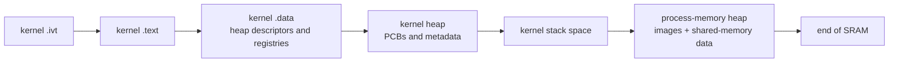

## 3.4 Linked code, data, heap, and stack address ranges
[\[↑ TOC\]](#contents)

Inside one [`pmalloc()`](kernel/pmalloc.picoc#L20) process image, the `.sections`/binary header
values have the relationship shown in the table below. These are linked offsets before the kernel
adds the image’s absolute base. The loader receives the first two header values in its
[`code_start`](kernel/process/process_loader.picoc#L308) and
[`data_start`](kernel/process/process_loader.picoc#L309) variables. The links in the table use the
generated kernel metadata as a concrete example of the corresponding `.sections` entries:

| Relative address | Role |
| --- | --- |
| [`codesegment_start`](kernel/kernel.sections#L3) | Added to [`base_address`](kernel/process/process.header#L34) for initial `CS`/entry |
| [`datasegment_start`](kernel/kernel.sections#L4) | Added to [`base_address`](kernel/process/process.header#L34) for `DS` |
| [`heap_start`](kernel/process/process.header#L36) | First header of the process-global [`process_heap`](library/stdlib/malloc.picoc#L6) |
| [`heap_start + heap_size - 1`](kernel/exception.picoc#L19) | Inclusive boundary installed in periphery register 10 |
| [`stack_start`](kernel/process/process_loader.picoc#L121) | Initial free `SP`; the stack grows downward through the gap above the heap |

The kernel relocates only by adding the image's absolute
[`base_address`](kernel/process/process.header#L34) to these linked offsets. There is no MMU or
later relocation. Compiler `.sections` data becomes the five-word `.bin` header in RETI-Emulator;
the loader consumes that header to fill PCB fields and allocate the one complete image;
[`libstart`](library/start/libstart.picoc) then asks the PCB-backed syscalls for the absolute heap
range.

## 3.5 Heap and allocator function reference
[\[↑ TOC\]](#contents)

The common allocator is linked directly into both kernel and library targets. The table places
each function name first and follows it with `Shared/Common`, `Kernel only`, or `Library only` in
parentheses. Directly linked library callers do not cross a syscall boundary and appear before
direct kernel callers. Kernel-heap exhaustion panics; process-memory allocation instead returns
[`PMALLOC_INVALID_START`](kernel/pmalloc.header#L3) (0), allowing a loader or shared-memory request
to fail.

| Kernel / Library Function | Return value / status | Effects | Calls | Called by |
| --- | --- | --- | --- | --- |
| [`heap_init_region(heap, start, cell_count)`](common/heap.picoc#L49) (Shared/Common) | Returns no value | Writes the initial free block and stores it in the heap descriptor | — | **Library functions (directly linked):** [`init_process_heap()`](library/stdlib/malloc.picoc#L18)<br>**Kernel functions (directly linked):** [`init_kernel_heap()`](kernel/kmalloc.picoc#L17), [`init_process_memory_heap()`](kernel/pmalloc.picoc#L9) |
| [`heap_alloc_from(heap, size)`](common/heap.picoc#L65) (Shared/Common) | Payload pointer, or `NULL` for invalid size/no fit | First-fit scan, optional split, marks block used | [`heap_split_block()`](common/heap.picoc#L14) | **Library functions (directly linked):** [`malloc()`](library/stdlib/malloc.picoc#L35)<br>**Kernel functions (directly linked):** [`kmalloc()`](kernel/kmalloc.picoc#L23), [`pmalloc()`](kernel/pmalloc.picoc#L20)<br>**Shared/common functions (directly linked):** [`heap_realloc_from()`](common/heap.picoc#L87) |
| [`heap_realloc_from(heap, ptr, size)`](common/heap.picoc#L87) (Shared/Common) | Payload pointer, or `NULL` for invalid heap/no fit/nonpositive size | May split, merge/grow, move/copy, or free on nonpositive size; failed growth leaves the old allocation intact | [`heap_free_from()`](common/heap.picoc#L146), [`heap_alloc_from()`](common/heap.picoc#L65), [`heap_split_block()`](common/heap.picoc#L14), [`heap_merge_free_blocks()`](common/heap.picoc#L30), [`heap_copy_cells()`](common/heap.picoc#L3) | **Library functions (directly linked):** [`realloc()`](library/stdlib/malloc.picoc#L42)<br>**Kernel functions (directly linked):** [`krealloc()`](kernel/kmalloc.picoc#L31), [`prealloc()`](kernel/pmalloc.picoc#L31) |
| [`heap_free_from(heap, ptr)`](common/heap.picoc#L146) (Shared/Common) | Returns no value | Marks the preceding header free and merges adjacent blocks | [`heap_merge_free_blocks()`](common/heap.picoc#L30) | **Library functions (directly linked):** [`free()`](library/stdlib/malloc.picoc#L49)<br>**Kernel functions (directly linked):** [`kfree()`](kernel/kmalloc.picoc#L38), [`pfree()`](kernel/pmalloc.picoc#L47)<br>**Shared/common functions (directly linked):** [`heap_realloc_from()`](common/heap.picoc#L87) |
| [`heap_split_block(block, size)`](common/heap.picoc#L14) (Shared/Common) | Returns no value | Splits a sufficiently large free block after the requested payload | — | **Shared/common functions (directly linked):** [`heap_alloc_from()`](common/heap.picoc#L65), [`heap_realloc_from()`](common/heap.picoc#L87) |
| [`heap_merge_free_blocks(heap)`](common/heap.picoc#L30) (Shared/Common) | Returns no value | Coalesces adjacent free blocks in one heap | — | **Shared/common functions (directly linked):** [`heap_realloc_from()`](common/heap.picoc#L87), [`heap_free_from()`](common/heap.picoc#L146) |
| [`heap_copy_cells(destination, source, count)`](common/heap.picoc#L3) (Shared/Common) | Returns no value | Copies cells from the old allocation into a replacement allocation | — | **Shared/common functions (directly linked):** [`heap_realloc_from()`](common/heap.picoc#L87) |
| [`init_process_heap(void)`](library/stdlib/malloc.picoc#L18) (Library only) | Returns no value | Retrieves the process heap range through selectors 16 and 17, then initializes the library heap descriptor | [`heap_init_region()`](common/heap.picoc#L49) | **Library functions:** [`start_process()`](library/start/start.picoc#L7) |
| [`malloc(size)`](library/stdlib/malloc.picoc#L35) (Library only) | Pointer, or triggers the process-heap-full exception for a positive failed allocation | Allocates a process-heap block | [`require_process_heap_allocation()`](library/stdlib/malloc.picoc#L8), [`heap_alloc_from()`](common/heap.picoc#L65) | **Library functions:** [`opendir()`](library/dirent/dirent.picoc#L8), [`copy_environment_variable()`](library/stdlib/env.picoc#L20), [`initialize_environment()`](library/stdlib/env.picoc#L97), [`setenv()`](library/stdlib/env.picoc#L126), [`clone_environment()`](library/stdlib/env.picoc#L205) |
| [`realloc(ptr, size)`](library/stdlib/malloc.picoc#L42) (Library only) | Pointer, or triggers the process-heap-full exception for a positive failed allocation | Resizes a process-heap block | [`require_process_heap_allocation()`](library/stdlib/malloc.picoc#L8), [`heap_realloc_from()`](common/heap.picoc#L87) | **Library functions:** [`store_environment_variable()`](library/stdlib/env.picoc#L67) |
| [`free(ptr)`](library/stdlib/malloc.picoc#L49) (Library only) | Returns no value | Releases a process-heap block | [`heap_free_from()`](common/heap.picoc#L146) | **Library functions:** [`opendir()`](library/dirent/dirent.picoc#L8), [`closedir()`](library/dirent/dirent.picoc#L66), [`store_environment_variable()`](library/stdlib/env.picoc#L67), [`unsetenv()`](library/stdlib/env.picoc#L157), [`clearenv()`](library/stdlib/env.picoc#L194), [`destroy_environment()`](library/stdlib/env.picoc#L230) |
|  |  |  |  |  |
| [`init_kernel_heap(void)`](kernel/kmalloc.picoc#L17) (Kernel only) | Returns no value | Initializes global kernel descriptor over the fixed kernel heap | [`heap_init_region()`](common/heap.picoc#L49) | **Kernel functions:** [`main()`](kernel/kernel.picoc#L31) |
| [`init_process_memory_heap(void)`](kernel/pmalloc.picoc#L9) (Kernel only) | Returns no value | Initializes the process-memory descriptor over remaining SRAM | [`heap_init_region()`](common/heap.picoc#L49) | **Kernel functions:** [`main()`](kernel/kernel.picoc#L31) |
| [`kmalloc(size)`](kernel/kmalloc.picoc#L23) (Kernel only) | Kernel pointer; panics on positive allocation failure | Allocates from the kernel heap | [`require_kernel_heap_allocation()`](kernel/kmalloc.picoc#L9), [`heap_alloc_from()`](common/heap.picoc#L65) | **Kernel functions:** [`copy_shared_memory_name()`](kernel/shared_memory.picoc#L27), [`open_shared_memory()`](kernel/shared_memory.picoc#L92), [`map_shared_memory()`](kernel/shared_memory.picoc#L130), [`copy_process_path()`](kernel/process/process.picoc#L70), [`create_process()`](kernel/process/process.picoc#L89), [`begin_process_load()`](kernel/process/process_loader.picoc#L109), [`copy_file_path()`](kernel/filesystem/file_descriptor.picoc#L6), [`create_file_descriptor_table()`](kernel/filesystem/file_descriptor.picoc#L35) |
| [`krealloc(ptr, size)`](kernel/kmalloc.picoc#L31) (Kernel only) | Kernel pointer; panics on positive allocation failure | Reallocates a kernel-heap block | [`require_kernel_heap_allocation()`](kernel/kmalloc.picoc#L9), [`heap_realloc_from()`](common/heap.picoc#L87) | — |
| [`kfree(ptr)`](kernel/kmalloc.picoc#L38) (Kernel only) | Returns no value | Releases and merges a kernel-heap block | [`heap_free_from()`](common/heap.picoc#L146) | **Kernel functions:** [`destroy_shared_memory_entry()`](kernel/shared_memory.picoc#L69), [`open_shared_memory()`](kernel/shared_memory.picoc#L92), [`unlink_shared_memory()`](kernel/shared_memory.picoc#L151), [`release_process_shared_memory()`](kernel/shared_memory.picoc#L172), [`free_process_load()`](kernel/process/process_loader.picoc#L71), [`remove_process()`](kernel/process/process.picoc#L209), [`open_file_descriptor()`](kernel/filesystem/filesystem.picoc#L39), [`set_process_working_directory()`](kernel/filesystem/host_filesystem.picoc#L128), [`copy_file_descriptor()`](kernel/filesystem/file_descriptor.picoc#L82), [`destroy_file_descriptor_table()`](kernel/filesystem/file_descriptor.picoc#L115), [`close_file_descriptor()`](kernel/filesystem/file_descriptor.picoc#L143) |
| [`pmalloc(size)`](kernel/pmalloc.picoc#L20) (Kernel only) | Absolute start, or [`PMALLOC_INVALID_START`](kernel/pmalloc.header#L3) (0) for invalid size/no fit | Allocates a process image or shared-data region | [`heap_alloc_from()`](common/heap.picoc#L65) | **Kernel functions:** [`open_shared_memory()`](kernel/shared_memory.picoc#L92), [`begin_process_load()`](kernel/process/process_loader.picoc#L109), [`load_process()`](kernel/process/process_loader.picoc#L305) |
| [`prealloc(start, size)`](kernel/pmalloc.picoc#L31) (Kernel only) | Absolute start, or [`PMALLOC_INVALID_START`](kernel/pmalloc.header#L3) (0) for invalid size/no fit | Reallocates a process-memory region | [`heap_realloc_from()`](common/heap.picoc#L87) | — |
| [`pfree(start)`](kernel/pmalloc.picoc#L47) (Kernel only) | Returns no value | Releases and merges a process-memory region | [`heap_free_from()`](common/heap.picoc#L146) | **Kernel functions:** [`destroy_shared_memory_entry()`](kernel/shared_memory.picoc#L69), [`cancel_process_load()`](kernel/process/process_loader.picoc#L76), [`remove_process()`](kernel/process/process.picoc#L209) |

The decision graph follows [`heap_realloc_from()`](common/heap.picoc#L87) for a valid existing block
and a positive requested size. It shows when the payload address stays the same and when allocation,
copying, and freeing move it. A failed replacement allocation leaves the original block intact. A
null input pointer instead uses ordinary allocation; a nonpositive size frees the block and returns
`NULL`.

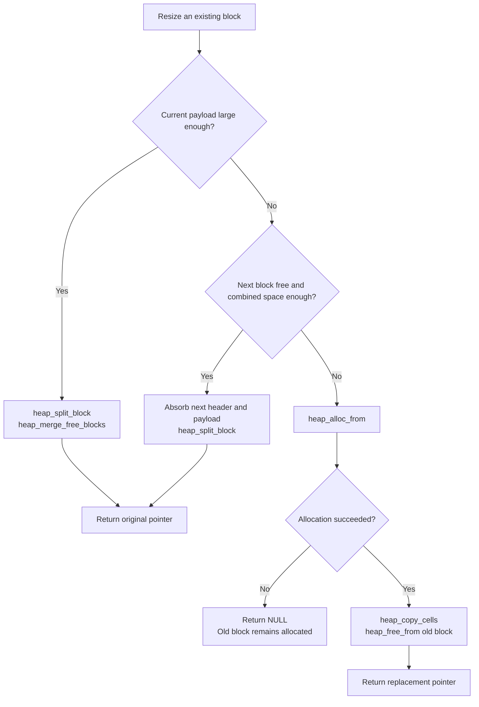

The stack-boundary register catches stack growth into the configured heap, but there is no isolation
between arbitrary process data accesses and other memory.

## 3.6 Shared-memory entries and mappings
[\[↑ TOC\]](#contents)

The kernel keeps one linked-list entry for every named shared-memory region. Each
process that maps a region keeps its own attachment record. The first subsection
defines these records; the next follows their lifetime through mapping and
unlinking.

### 3.6.1 Named entries and per-process attachments
[\[↑ TOC\]](#contents)

Each [`SharedMemoryEntry`](kernel/shared_memory.header#L8) represents one named shared-memory data
region. The kernel's linked list contains one entry for each region. A
[`SharedMemoryAttachment`](kernel/shared_memory.header#L17) represents one process's mapping of
an entry. Attachments are linked from the owning PCB's
[`shared_memory_attachments`](kernel/process/process.header#L55) field; they refer to an entry but
do not own it.

[`shared_memory_list_head`](kernel/shared_memory.picoc#L6) and
[`next_shared_memory_id`](kernel/shared_memory.picoc#L7) are kernel-global variables, declared once
in [`kernel/shared_memory.picoc`](kernel/shared_memory.picoc). They are part of the kernel's global
data, not heap allocations. The head points to the first entry in the kernel's linked list or is
`NULL` when the list is empty. The ID counter supplies the next unique numeric ID when
[`open_shared_memory()`](kernel/shared_memory.picoc#L92) creates an entry; both globals are reset by
[`initialize_shared_memory()`](kernel/shared_memory.picoc#L9). The two field tables explain the
kernel's linked list first and each process’s attachment list second.

```c
struct SharedMemoryEntry {
    char *name;
    int id;
    void *address;
    int reference_count;
    bool unlink_requested;
    struct SharedMemoryEntry *next;
};

struct SharedMemoryAttachment {
    struct SharedMemoryEntry *entry;
    struct SharedMemoryAttachment *next;
};
```

These structures are kernel metadata, not part of the shared-data allocation and not part of any
user process stack. [`open_shared_memory()`](kernel/shared_memory.picoc#L92) allocates one
[`SharedMemoryEntry`](kernel/shared_memory.header#L8), plus its copied name, as separate
[`kmalloc()`](kernel/kmalloc.picoc#L23) allocations in the kernel heap. It then allocates the
shared-data region separately with [`pmalloc()`](kernel/pmalloc.picoc#L20). The entry stores that
region's start address in its [`address`](kernel/shared_memory.header#L11) field. Like a complete
process image, the data region has its own generic [`BlockHeader`](common/heap.header#L5)
immediately before its payload in the process-memory heap. It shares neither that header nor the
kernel heap with the entry and name allocations.

Each call to [`map_shared_memory()`](kernel/shared_memory.picoc#L130) allocates one
[`SharedMemoryAttachment`](kernel/shared_memory.header#L17) with
[`kmalloc()`](kernel/kmalloc.picoc#L23), also in the kernel heap. The attachment is linked from the
current PCB's [`shared_memory_attachments`](kernel/process/process.header#L55) field, points back to
the linked-list entry, and accounts for that process's mapping. This lets
[`release_process_shared_memory()`](kernel/shared_memory.picoc#L172) find and free the attachment
when the process is removed. The [`SharedMemoryEntry`](kernel/shared_memory.header#L8) remains in
the kernel's linked list for name/ID lookup, records the shared-data address and mapping count, and
returns the same absolute data pointer to every mapper.

The [`SharedMemoryAttachment`](kernel/shared_memory.header#L17) is needed because a
[`SharedMemoryEntry`](kernel/shared_memory.header#L8) alone does not say which process must release
a mapping.
For example, if two processes map one ID, there is one [`SharedMemoryEntry`](kernel/shared_memory.header#L8)
and two [`SharedMemoryAttachment`](kernel/shared_memory.header#L17) records: one in each PCB.
When one process exits, [`release_process_shared_memory()`](kernel/shared_memory.picoc#L172) walks
only that PCB's attachment list, frees its record, and decrements the entry's
[`SharedMemoryEntry.reference_count`](kernel/shared_memory.header#L12). The other process's
[`SharedMemoryAttachment`](kernel/shared_memory.header#L17) and the shared-data region remain. A
[`SharedMemoryAttachment`](kernel/shared_memory.header#L17) therefore does not hold shared bytes or
give the process a different address; it records that this process currently maps the
[`SharedMemoryEntry`](kernel/shared_memory.header#L8).

| Field | Meaning | Used by |
| --- | --- | --- |
| [`SharedMemoryEntry.name`](kernel/shared_memory.header#L9) | Kernel-owned lookup name; freed and set to `NULL` on unlink | First initialized by [`open_shared_memory()`](kernel/shared_memory.picoc#L92); read by [`find_shared_memory_by_name()`](kernel/shared_memory.picoc#L45); freed by [`unlink_shared_memory()`](kernel/shared_memory.picoc#L151) and [`destroy_shared_memory_entry()`](kernel/shared_memory.picoc#L69) |
| [`SharedMemoryEntry.id`](kernel/shared_memory.header#L10) | Numeric open/map handle | First initialized by [`open_shared_memory()`](kernel/shared_memory.picoc#L92); looked up by [`map_shared_memory()`](kernel/shared_memory.picoc#L130) |
| [`SharedMemoryEntry.address`](kernel/shared_memory.header#L11) | Absolute start of the [`pmalloc()`](kernel/pmalloc.picoc#L20) shared-memory data region | First initialized by [`open_shared_memory()`](kernel/shared_memory.picoc#L92); returned by [`map_shared_memory()`](kernel/shared_memory.picoc#L130) and freed by [`destroy_shared_memory_entry()`](kernel/shared_memory.picoc#L69) |
| [`SharedMemoryEntry.reference_count`](kernel/shared_memory.header#L12) | Attachment count, not distinct PID count | First initialized by [`open_shared_memory()`](kernel/shared_memory.picoc#L92); changed by [`map_shared_memory()`](kernel/shared_memory.picoc#L130) and [`release_process_shared_memory()`](kernel/shared_memory.picoc#L172); checked by [`unlink_shared_memory()`](kernel/shared_memory.picoc#L151) |
| [`SharedMemoryEntry.unlink_requested`](kernel/shared_memory.header#L13) | Defers destruction until the last attachment disappears | First initialized by [`open_shared_memory()`](kernel/shared_memory.picoc#L92); set by [`unlink_shared_memory()`](kernel/shared_memory.picoc#L151) and checked by [`release_process_shared_memory()`](kernel/shared_memory.picoc#L172) |
| [`SharedMemoryEntry.next`](kernel/shared_memory.header#L14) | Link to the next entry in the kernel's linked list | First initialized by [`open_shared_memory()`](kernel/shared_memory.picoc#L92); traversed by [`find_shared_memory_by_name()`](kernel/shared_memory.picoc#L45), [`find_shared_memory_by_id()`](kernel/shared_memory.picoc#L57), and [`destroy_shared_memory_entry()`](kernel/shared_memory.picoc#L69) |

The attachment table shows how a mapping records its contribution to the entry’s lifetime without
owning the entry itself.

| Field | Meaning | Used by |
| --- | --- | --- |
| [`SharedMemoryAttachment.entry`](kernel/shared_memory.header#L18) | Non-owning pointer to the linked-list entry whose reference count this mapping contributes to | First initialized by [`map_shared_memory()`](kernel/shared_memory.picoc#L130); released by [`release_process_shared_memory()`](kernel/shared_memory.picoc#L172) |
| [`SharedMemoryAttachment.next`](kernel/shared_memory.header#L19) | Link in one PCB's [`shared_memory_attachments`](kernel/process/process.header#L55) list | First initialized by [`map_shared_memory()`](kernel/shared_memory.picoc#L130); traversed by [`release_process_shared_memory()`](kernel/shared_memory.picoc#L172) |

### 3.6.2 Mapping, unlinking, and deferred destruction
[\[↑ TOC\]](#contents)

With the entry and attachment roles established, their lifetime can be
followed through the public operations. Opening an existing name returns its ID
and does not resize it. Unlink removes the name immediately.
With no attachment the entry is destroyed; otherwise it survives by ID until release. The old ID can
still be mapped while that entry exists, and opening the former name can create a new entry. Process
removal decrements counts and frees attachments. If [`shm_unlink()`](library/sys/mman/mman.picoc#L27)
already removed a [`SharedMemoryEntry`](kernel/shared_memory.header#L8)'s name, the kernel removes
that [`SharedMemoryEntry`](kernel/shared_memory.header#L8) from its linked list and frees it only
when its [`SharedMemoryEntry.reference_count`](kernel/shared_memory.header#L12) reaches zero. A
count of zero means no process still maps or uses the shared-memory data region. The graph shows two
PCBs pointing through their own attachments to one shared entry and data region; those two mappings
account for its reference count of 2.

[`shm_open()`](library/sys/mman/mman.picoc#L15) returns a numeric ID, not a pointer to the shared
bytes. The code below shows Process A creating a counter and passing its ID to Process B as a startup
argument. Both processes call [`mmap()`](library/sys/mman/mman.picoc#L23) because both access the
counter. Process B does not call [`shm_open()`](library/sys/mman/mman.picoc#L15), because it already
received the ID.

```c
// Process A
int shared_memory_id_a;
int *counter_a;

shared_memory_id_a = shm_open("counter", 1);
counter_a = (int *)mmap(shared_memory_id_a);
counter_a[0] = 0;

// Starts Process B with shared_memory_id_a as its first argument

// Process B
int shared_memory_id_b = atoi(argv[1]);
int *counter_b = (int *)mmap(shared_memory_id_b);

counter_b[0] = counter_b[0] + 1;
```

`counter_a` and `counter_b` contain the same absolute address. A process that only creates the
region for another process, or only passes its ID, does not need to call
[`mmap()`](library/sys/mman/mman.picoc#L23). The [`shared_memory`](test/shared_memory/) launcher
and workers demonstrate the alternative where every process calls
[`shm_open()`](library/sys/mman/mman.picoc#L15) with the same name and then maps the returned ID.

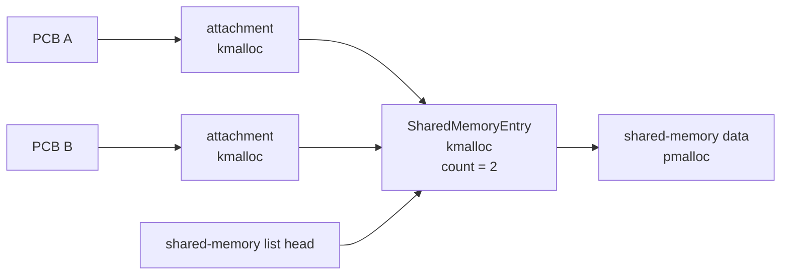

The linked list beginning at [`shared_memory_list_head`](kernel/shared_memory.picoc#L6) finds an
entry by name or ID. Each PCB's attachment list records which reference counts must be released when
that process disappears. There is no `munmap()` call, so every successful
[`mmap(id)`](library/sys/mman/mman.picoc#L23) creates one
attachment and one reference even if the same process maps the ID more than once. The sequence below
follows [`shm_open()`](library/sys/mman/mman.picoc#L15),
[`mmap()`](library/sys/mman/mman.picoc#L23), and [`shm_unlink()`](library/sys/mman/mman.picoc#L27)
across two processes, then shows
[`release_process_shared_memory()`](kernel/shared_memory.picoc#L172) freeing the data only after the
last attachment disappears.

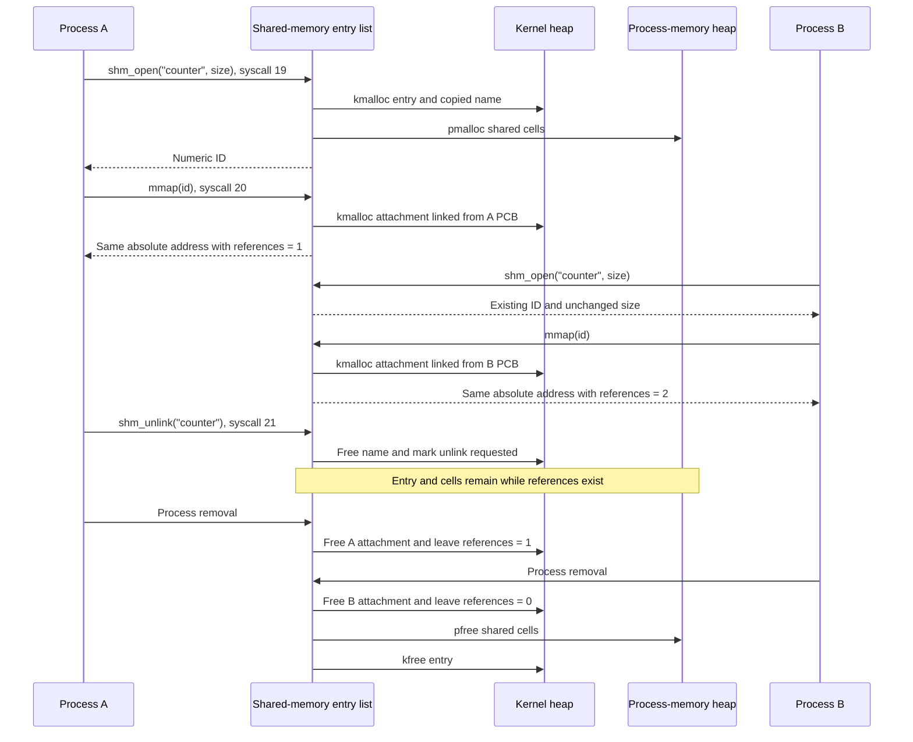

The function table below identifies which kernel operations implement the lookup, attachment, and
cleanup steps shown above. The syscall-backed operations come first; their **Called by** entries
show the library function that reaches them before their kernel caller. The remaining rows are
internal kernel operations.

| Kernel function | Return value / status | Effects | Calls | Called by |
| --- | --- | --- | --- | --- |
| [`open_shared_memory(request)`](kernel/shared_memory.picoc#L92) | Existing/new ID; `-1` for a null request/name, a nonpositive new size, or insufficient process memory | If the name already exists, returns its [`SharedMemoryEntry.id`](kernel/shared_memory.header#L10) without creating a structure. Otherwise creates a [`SharedMemoryEntry`](kernel/shared_memory.header#L8) and copied name with [`kmalloc()`](kernel/kmalloc.picoc#L23), creates its data region with [`pmalloc()`](kernel/pmalloc.picoc#L20), and prepends the [`SharedMemoryEntry`](kernel/shared_memory.header#L8) to the kernel's linked list | [`find_shared_memory_by_name()`](kernel/shared_memory.picoc#L45), [`kmalloc()`](kernel/kmalloc.picoc#L23), [`copy_shared_memory_name()`](kernel/shared_memory.picoc#L27), [`pmalloc()`](kernel/pmalloc.picoc#L20), [`kfree()`](kernel/kmalloc.picoc#L38) | **Library functions:** [`shm_open()`](library/sys/mman/mman.picoc#L15)<br>**System calls:** via [`handle_syscall()`](kernel/syscall.picoc#L16) |
| [`map_shared_memory(shared_memory_id)`](kernel/shared_memory.picoc#L130) | Address, or `NULL` for an unknown ID or no current process | For every successful mapping, creates one [`SharedMemoryAttachment`](kernel/shared_memory.header#L17) with [`kmalloc()`](kernel/kmalloc.picoc#L23), links it from the current PCB's [`shared_memory_attachments`](kernel/process/process.header#L55) field, points it at the existing [`SharedMemoryEntry`](kernel/shared_memory.header#L8), and increments that entry's count | [`current_process()`](kernel/process/process.picoc#L62), [`find_shared_memory_by_id()`](kernel/shared_memory.picoc#L57), [`kmalloc()`](kernel/kmalloc.picoc#L23) | **Library functions:** [`mmap()`](library/sys/mman/mman.picoc#L23)<br>**System calls:** via [`handle_syscall()`](kernel/syscall.picoc#L16) |
| [`unlink_shared_memory(name)`](kernel/shared_memory.picoc#L151) | `0` on unlink; `-1` for a null or unknown name | Frees the name and marks the existing [`SharedMemoryEntry`](kernel/shared_memory.header#L8) for removal; destroys that [`SharedMemoryEntry`](kernel/shared_memory.header#L8) immediately only when its mapping count is zero | [`find_shared_memory_by_name()`](kernel/shared_memory.picoc#L45), [`kfree()`](kernel/kmalloc.picoc#L38), [`destroy_shared_memory_entry()`](kernel/shared_memory.picoc#L69) | **Library functions:** [`shm_unlink()`](library/sys/mman/mman.picoc#L27)<br>**System calls:** via [`handle_syscall()`](kernel/syscall.picoc#L16) |
|  |  |  |  |  |
| [`initialize_shared_memory(void)`](kernel/shared_memory.picoc#L9) | Returns no value | Resets the shared-memory list head and next ID | — | **Kernel functions:** [`main()`](kernel/kernel.picoc#L31) |
| [`release_process_shared_memory(process)`](kernel/shared_memory.picoc#L172) | Returns no value | Walks one PCB's [`SharedMemoryAttachment`](kernel/shared_memory.header#L17) list, frees every [`SharedMemoryAttachment`](kernel/shared_memory.header#L17), and decrements the referenced [`SharedMemoryEntry.reference_count`](kernel/shared_memory.header#L12); destroys an unlinked [`SharedMemoryEntry`](kernel/shared_memory.header#L8) after its last attachment is released | [`kfree()`](kernel/kmalloc.picoc#L38), [`destroy_shared_memory_entry()`](kernel/shared_memory.picoc#L69) | **Kernel functions:** [`remove_process()`](kernel/process/process.picoc#L209) |
| [`destroy_shared_memory_entry(entry)`](kernel/shared_memory.picoc#L69) | Returns no value | Removes one [`SharedMemoryEntry`](kernel/shared_memory.header#L8) from the kernel's linked list, frees its [`SharedMemoryEntry.address`](kernel/shared_memory.header#L11) data region with [`pfree()`](kernel/pmalloc.picoc#L47), and frees the [`SharedMemoryEntry`](kernel/shared_memory.header#L8) and its name with [`kfree()`](kernel/kmalloc.picoc#L38) | [`pfree()`](kernel/pmalloc.picoc#L47), [`kfree()`](kernel/kmalloc.picoc#L38) | **Kernel functions:** [`unlink_shared_memory()`](kernel/shared_memory.picoc#L151), [`release_process_shared_memory()`](kernel/shared_memory.picoc#L172) |

Shared memory provides visibility, not mutual exclusion. The shared-memory mutual-exclusion test
places a mutex and its queue in the shared data region.

### 3.6.3 Shared-memory test scenarios
[\[↑ TOC\]](#contents)

The repository exercises the ownership rules above in three of its **23 OS
test classes**:
[`shared_memory`](test/shared_memory/), [`shared_memory_mutex`](test/shared_memory_mutex/), and
[`shared_memory_mutual_exclusion`](test/shared_memory_mutual_exclusion/). The
[test-system chapter](#14-test-system) explains their execution.

The basic shared-memory scenario starts several worker processes with the same name and different
array indices. Each calls [`shm_open()`](library/sys/mman/mman.picoc#L15) and
[`mmap()`](library/sys/mman/mman.picoc#L23), writes one distinct cell, and exits. The launcher waits
for them and observes all values through its own mapping, demonstrating that the returned addresses
refer to the same physical data rather than copies.

The mutual-exclusion scenario deliberately shares one value. The declaration from
[`shared.header`](test/shared_memory_mutual_exclusion/shared.header) below shows how
[`SharedState.value`](test/shared_memory_mutual_exclusion/shared.header#L6) and
[`SharedState.mutex`](test/shared_memory_mutual_exclusion/shared.header#L7) occupy the same region:

```c
struct SharedState {
    int value;
    struct mutex mutex;
};
```

The [`launcher`](test/shared_memory_mutual_exclusion/launcher.picoc#L44) creates a region of the
size of [`SharedState`](test/shared_memory_mutual_exclusion/shared.header#L5), initializes the value
and embedded mutex, and passes the numeric shared-memory ID to workers. The first
[`worker`](test/shared_memory_mutual_exclusion/worker.picoc#L30) yields while holding the lock; the
launcher disables the timer so this order is controlled by voluntary yields. The other worker's
`TSL` sees the locked cell and its [`sleep()`](library/unistd/blocking.picoc#L9) queues that PCB on
the shared embedded wait queue; [`mutex_unlock()`](library/mutex/mutex.picoc#L25) clears the cell
and wakes it. This connects the process-memory allocation, per-PCB attachment records, atomic
emulator instruction, kernel wait queues, scheduler, and dispatcher in one test.

# 4. Processes and process lifecycle
[\[↑ TOC\]](#contents)

Memory regions become executable processes only after the kernel records their
identity, resources, saved registers, and state. This chapter defines that
representation, then follows loading, startup, termination, and final removal.

## 4.1 Global process list and current process
[\[↑ TOC\]](#contents)

The process table is a singly linked list, not an array and not one
[`kmalloc()`](kernel/kmalloc.picoc#L23) allocation. These four definitions in
[`kernel/process/process.picoc`](kernel/process/process.picoc) are globals in
kernel `.data`:

```c
struct Process *process_list_head = NULL;
struct Process *process_list_tail = NULL;
struct Process *active_process = NULL;
int next_process_id = 1;
```

[`process_list_head`](kernel/process/process.picoc#L16) is the traversal entry,
[`process_list_tail`](kernel/process/process.picoc#L17) makes append cheap,
[`active_process`](kernel/process/process.picoc#L18) is the PCB whose activation
is currently in the CPU, and [`next_process_id`](kernel/process/process.picoc#L19)
supplies monotonically increasing PIDs. Each linked
[`struct Process`](kernel/process/process.header#L31) PCB is separately allocated
with [`kmalloc()`](kernel/kmalloc.picoc#L23). [`first_process()`](kernel/process/process.picoc#L28)
and [`current_process()`](kernel/process/process.picoc#L62) provide access to the
important globals.

The scheduler scans this same list. There is no separate ready queue. Blocking
queues use a different intrusive link inside each PCB, so [`next`](kernel/process/process.header#L53) remains
available for process-table order.

## 4.2 Saved process activation
[\[↑ TOC\]](#contents)

The [`struct ActivationRecord`](kernel/process/process.header#L21) is embedded
in the PCB. The definition below fixes the register order used by assembly;
the following attribute table explains who initializes and later uses each value:

```c
struct ActivationRecord {
    int in1;
    int in2;
    int acc;
    int sp;
    int baf;
    int cs;
    int ds;
};
```

| Attribute | Meaning | Used by |
| --- | --- | --- |
| [`in1`](kernel/process/process.header#L22), [`in2`](kernel/process/process.header#L23), [`acc`](kernel/process/process.header#L24) | General argument/result registers at the suspension point | First initialized by [`create_process()`](kernel/process/process.picoc#L89); saved by [`dispatcher_switch_from_context()`](kernel/dispatcher.picoc#L71) and restored by [`dispatcher_jump_to_process()`](kernel/dispatcher.picoc#L21) |
| [`sp`](kernel/process/process.header#L25) | Free cell immediately below the saved return PC on the process stack | First initialized by [`create_process()`](kernel/process/process.picoc#L89); rebuilt by [`store_process_arguments()`](kernel/process/process_arguments.picoc#L125), saved by [`dispatcher_switch_from_context()`](kernel/dispatcher.picoc#L71), restored by [`dispatcher_jump_to_process()`](kernel/dispatcher.picoc#L21) |
| [`baf`](kernel/process/process.header#L26) | Base address of the interrupted PicoC function frame | First initialized by [`create_process()`](kernel/process/process.picoc#L89); rebuilt by [`store_process_arguments()`](kernel/process/process_arguments.picoc#L125), saved by [`dispatcher_switch_from_context()`](kernel/dispatcher.picoc#L71), restored by [`dispatcher_jump_to_process()`](kernel/dispatcher.picoc#L21) |
| [`cs`](kernel/process/process.header#L27) | Absolute code-segment base used for instruction addresses | First initialized by [`create_process()`](kernel/process/process.picoc#L89); saved by [`dispatcher_switch_from_context()`](kernel/dispatcher.picoc#L71) and restored by [`dispatcher_jump_to_process()`](kernel/dispatcher.picoc#L21) |
| [`ds`](kernel/process/process.header#L28) | Absolute data-segment base used for globals/static data | First initialized by [`create_process()`](kernel/process/process.picoc#L89); saved by [`dispatcher_switch_from_context()`](kernel/dispatcher.picoc#L71) and restored by [`dispatcher_jump_to_process()`](kernel/dispatcher.picoc#L21) |

These are the RETI registers required to resume a process.
[`dispatcher_switch_from_context()`](kernel/dispatcher.picoc#L71) fills the
record from an interrupt frame.
[`dispatcher_jump_to_process()`](kernel/dispatcher.picoc#L21) reads it by fixed
PCB offsets and restores the registers. It is not a pointer to a stack frame
and is not allocated separately.

## 4.3 Process control block fields
[\[↑ TOC\]](#contents)

The current PCB layout below groups the image, activation, resource pointers,
and wait/signal state in one object. The following attribute table connects
those fields to their initializers and consumers:

```c
struct Process {
    int pid;
    int state;
    int base_address;
    int size;
    int heap_start;
    int heap_size;
    char *binary_path;
    char *working_directory;
    struct ActivationRecord activation;
    struct FileDescriptorTable *file_descriptors;
    int *waiting_status_ptr;
    struct wait_queue waiters;
    struct wait_queue *waiting_queue_ptr;
    struct Process *wait_next;
    struct Process *next;
    struct SharedMemoryAttachment *shared_memory_attachments;
    int parent_pid;
    int parent_death_signal;
    int exit_status;
    int stop_signal;
    int stopped_from_state;
    int pending_termination_signal;
    char *pending_terminal_read_buffer;
    int pending_terminal_read_count;
    struct ProcessLoad *pending_load;
};
```

| Attribute | Meaning | Used by |
| --- | --- | --- |
| [`pid`](kernel/process/process.header#L32) | Assigned from the global counter when the PCB is created; never changes | First initialized by [`create_process()`](kernel/process/process.picoc#L89); read by [`find_process_by_pid()`](kernel/process/process.picoc#L162) and [`wait_for_process_by_pid()`](kernel/process/process.picoc#L369) |
| [`state`](kernel/process/process.header#L33) | [`NEW`](kernel/process/process.header#L12), [`READY`](kernel/process/process.header#L13), [`RUNNING`](kernel/process/process.header#L14), [`BLOCKED`](kernel/process/process.header#L15), [`STOPPED`](kernel/process/process.header#L16), or [`ZOMBIE`](kernel/process/process.header#L17) | First initialized by [`create_process()`](kernel/process/process.picoc#L89); changed by [`mark_process_ready_with_arguments()`](kernel/process/process_arguments.picoc#L241), queue helpers, [`stop_process()`](kernel/signal.picoc#L36), [`continue_process()`](kernel/signal.picoc#L49), [`dispatcher_switch_to_process()`](kernel/dispatcher.picoc#L43), and [`terminate_process()`](kernel/process/process.picoc#L304) |
| [`base_address`](kernel/process/process.header#L34), [`size`](kernel/process/process.header#L35) | Absolute start and total cell count of the [`pmalloc()`](kernel/pmalloc.picoc#L20) process image | First initialized by [`create_process()`](kernel/process/process.picoc#L89); released by [`remove_process()`](kernel/process/process.picoc#L209) |
| [`heap_start`](kernel/process/process.header#L36), [`heap_size`](kernel/process/process.header#L37) | Process-relative userspace heap start and cell count from the binary header/defaults | First initialized by [`create_process()`](kernel/process/process.picoc#L89); read by [`process_heap_start()`](kernel/process/process.picoc#L439), [`process_heap_size()`](kernel/process/process.picoc#L445), and [`process_stack_boundary()`](kernel/exception.picoc#L18) |
| [`binary_path`](kernel/process/process.header#L38) | PCB-owned executable path; also copied to [`argv[0]`](kernel/process/process_arguments.picoc#L140) | First initialized by [`create_process()`](kernel/process/process.picoc#L89); copied by [`store_process_arguments()`](kernel/process/process_arguments.picoc#L125), printed by [`list_processes()`](kernel/process/process.picoc#L32), freed by [`remove_process()`](kernel/process/process.picoc#L209) |
| [`working_directory`](kernel/process/process.header#L39) | PCB-owned absolute PicoOS path, copied from the parent or initialized to `/` for PID 1 | First initialized by [`create_process()`](kernel/process/process.picoc#L89) through copying; read by [`build_process_path()`](kernel/filesystem/host_filesystem.picoc#L92), replaced by [`change_working_directory()`](kernel/filesystem/host_filesystem.picoc#L163), freed by [`remove_process()`](kernel/process/process.picoc#L209) |
| [`activation`](kernel/process/process.header#L40) | Embedded saved CPU context used by dispatcher and blocked syscall returns | First initialized by [`create_process()`](kernel/process/process.picoc#L89); updated by [`store_process_arguments()`](kernel/process/process_arguments.picoc#L125), [`dispatcher_switch_from_context()`](kernel/dispatcher.picoc#L71), and [`complete_pending_terminal_read()`](kernel/filesystem/terminal.picoc#L183); restored by [`dispatcher_jump_to_process()`](kernel/dispatcher.picoc#L21) |
| [`file_descriptors`](kernel/process/process.header#L42) | Kernel-heap descriptor table and entry array owned by this PCB | First initialized by [`create_process()`](kernel/process/process.picoc#L89) through [`create_file_descriptor_table()`](kernel/filesystem/file_descriptor.picoc#L35); inherited by [`mark_process_ready_with_arguments()`](kernel/process/process_arguments.picoc#L241); destroyed by [`remove_process()`](kernel/process/process.picoc#L209) |
| [`waiting_status_ptr`](kernel/process/process.header#L44) | Pointer into this process’s suspended userspace [`waitpid()`](library/sys/wait/wait.picoc#L14) frame | First initialized to `NULL` by [`create_process()`](kernel/process/process.picoc#L89); set by [`wait_for_process_by_pid()`](kernel/process/process.picoc#L369); written and cleared by [`wake_parent_waiting_for_process()`](kernel/process/process.picoc#L261) or [`notify_process_stopped()`](kernel/signal.picoc#L22) |
| [`waiters`](kernel/process/process.header#L46) | Embedded FIFO queue of processes waiting for this process | First initialized by [`create_process()`](kernel/process/process.picoc#L89); filled by [`wait_for_process_by_pid()`](kernel/process/process.picoc#L369); drained by [`wake_parent_waiting_for_process()`](kernel/process/process.picoc#L261) or [`notify_process_stopped()`](kernel/signal.picoc#L22) |
| [`waiting_queue_ptr`](kernel/process/process.header#L48), [`wait_next`](kernel/process/process.header#L51) | Queue containing this PCB and its intrusive successor link | First initialized by [`create_process()`](kernel/process/process.picoc#L89); maintained by [`enqueue_current_process_on_wait_queue()`](kernel/process/process.picoc#L396), [`enqueue_terminal_reader()`](kernel/filesystem/terminal.picoc#L62), [`wakeup_wait_queue()`](kernel/process/process.picoc#L416), and [`remove_from_wait_queue()`](kernel/process/process.picoc#L176) |
| [`next`](kernel/process/process.header#L53) | Link in the global process list | First initialized/linked by [`create_process()`](kernel/process/process.picoc#L89); traversed by [`scheduler_next_process()`](kernel/scheduler.picoc#L12) and [`find_process_by_pid()`](kernel/process/process.picoc#L162); unlinked by [`remove_process()`](kernel/process/process.picoc#L209) |
| [`shared_memory_attachments`](kernel/process/process.header#L55) | Head of kernel-heap mapping records owned by this PCB | First initialized by [`create_process()`](kernel/process/process.picoc#L89); extended by [`map_shared_memory()`](kernel/shared_memory.picoc#L130); released by [`remove_process()`](kernel/process/process.picoc#L209) through [`release_process_shared_memory()`](kernel/shared_memory.picoc#L172) |
| [`parent_pid`](kernel/process/process.header#L57), [`parent_death_signal`](kernel/process/process.header#L59) | Creator PID and optional signal delivered when that parent terminates | First initialized by [`create_process()`](kernel/process/process.picoc#L89); parent-death setting changed by [`set_parent_death_signal()`](kernel/signal.picoc#L136); used by [`orphan_and_signal_children()`](kernel/process/process.picoc#L279) |
| [`exit_status`](kernel/process/process.header#L60) | Status retained while the process is a zombie | First initialized to 0 by [`create_process()`](kernel/process/process.picoc#L89); set by [`terminate_process()`](kernel/process/process.picoc#L304); collected by [`wait_for_process_by_pid()`](kernel/process/process.picoc#L369) |
| [`stop_signal`](kernel/process/process.header#L61), [`stopped_from_state`](kernel/process/process.header#L62), [`pending_termination_signal`](kernel/process/process.header#L63) | Signal state for stopped and deferred termination paths | First initialized by [`create_process()`](kernel/process/process.picoc#L89); used by [`stop_process()`](kernel/signal.picoc#L36), [`continue_process()`](kernel/signal.picoc#L49), [`send_signal_to_process()`](kernel/signal.picoc#L74), and [`prepare_process_termination()`](kernel/signal.picoc#L125) |
| [`pending_terminal_read_buffer`](kernel/process/process.header#L65), [`pending_terminal_read_count`](kernel/process/process.header#L66) | Userspace request retained while a terminal read is blocked or stopped | First initialized to `NULL`/0 by [`create_process()`](kernel/process/process.picoc#L89); set by [`begin_terminal_read()`](kernel/filesystem/terminal.picoc#L135); consumed by [`complete_pending_terminal_read()`](kernel/filesystem/terminal.picoc#L183) or [`resume_pending_terminal_read()`](kernel/filesystem/terminal.picoc#L85) |
| [`pending_load`](kernel/process/process.header#L68) | Executable metadata, paths, progress, and reserved process-memory region while this process is between load chunks | First initialized to `NULL` by [`create_process()`](kernel/process/process.picoc#L89); set by [`begin_process_load()`](kernel/process/process_loader.picoc#L109); advanced by [`continue_process_load()`](kernel/process/process_loader.picoc#L227); cleared by [`finish_process_load()`](kernel/process/process_loader.picoc#L90) or [`cancel_process_load()`](kernel/process/process_loader.picoc#L76) |

The PCB is kernel metadata, but its address fields refer into the separate
process image. Because RETI has no MMU, these are ordinary absolute pointers;
there is no address translation or protection between processes.

## 4.4 Process image and initial userspace stack
[\[↑ TOC\]](#contents)

The boot-time [`load_process()`](kernel/process/process_loader.picoc#L305) and
userspace [`load_process_chunk()`](kernel/process/process_loader.picoc#L292) paths each
allocate one contiguous region from the global process-memory heap. The first subsection shows the image regions, and the second explains the startup values stored on its stack.

### 4.4.1 Code, data, heap, and stack placement
[\[↑ TOC\]](#contents)

The diagram orders a process image from low to high addresses. The stack grows
back toward the heap, whose final cell is protected by the active boundary
register:


### 4.4.2 Initial `argc`, `argv`, and `envp`
[\[↑ TOC\]](#contents)

Once those regions have been placed and the image has been loaded,
[`store_process_arguments()`](kernel/process/process_arguments.picoc#L125) writes this layout
directly into the high end of its image:

| Order | Contents |
| --- | --- |
| 1 | Entry PC used by the first `RTI` |
| 2 | [`argc`](kernel/process/process_arguments.picoc#L131) |
| 3 | [`argv[]`](kernel/process/process_arguments.picoc#L140) pointers and terminating `NULL` |
| 4 | [`envp[]`](kernel/process/process_arguments.picoc#L141) pointers and terminating `NULL` |
| 5 | Copied binary path, arguments, and environment strings |

All pointers in the tables are absolute SRAM addresses. [`argv[0]`](kernel/process/process_arguments.picoc#L140) points to a
copy of [`binary_path`](kernel/process/process.header#L38); the supplied argument string supplies later entries;
[`envp`](kernel/process/process_arguments.picoc#L141) begins immediately after [`argv[argc] == NULL`](kernel/process/process_arguments.picoc#L180). The entry cell contains
[`activation.cs`](kernel/process/process.header#L27) - 1 because the first `RTI` advances to the real entry. The
saved `SP` points to the free cell below it, while `BAF` is chosen so naked
[`_start()`](library/start/start.picoc#L14) observes [`argc`](kernel/process/process_arguments.picoc#L131) and [`argv`](kernel/process/process_arguments.picoc#L140) in normal argument positions.

Arguments and the initial environment are process-image data, not persistent
kernel allocations. Userspace [`libstart`](library/start/libstart.picoc) later clones the environment into
the process heap, so parent and child environment arrays become independent.

## 4.5 Process states and transitions
[\[↑ TOC\]](#contents)

The table lists the six PCB states and their numeric values. The state diagram
then shows the usual load/run, blocking, signal, and termination paths; removal
ends the PCB's lifetime rather than assigning another state value.

| State | Numeric value | Meaning | Typical transition |
| --- | --- | --- | --- |
| [`NEW`](kernel/process/process.header#L12) | 0 | Complete image and PCB exist but initial run state is incomplete | Completed process load |
| [`READY`](kernel/process/process.header#L13) | 1 | Eligible for the scheduler | Run setup, queue wakeup, or [`SIGCONT`](common/signal.header#L6) |
| [`RUNNING`](kernel/process/process.header#L14) | 2 | Activation is loaded into the CPU | Dispatcher |
| [`BLOCKED`](kernel/process/process.header#L15) | 3 | PCB is linked into one wait queue | Terminal read, DMA completion wait, [`waitpid()`](library/sys/wait/wait.picoc#L14), or [`sleep()`](library/unistd/blocking.picoc#L9) |
| [`STOPPED`](kernel/process/process.header#L16) | 4 | Suspended by [`SIGSTOP`](common/signal.header#L7), [`SIGTSTP`](common/signal.header#L8), or [`SIGTTIN`](common/signal.header#L9) | Signal subsystem |
| [`ZOMBIE`](kernel/process/process.header#L17) | 5 | Terminated status retained for a parent | [`terminate_process()`](kernel/process/process.picoc#L304) |

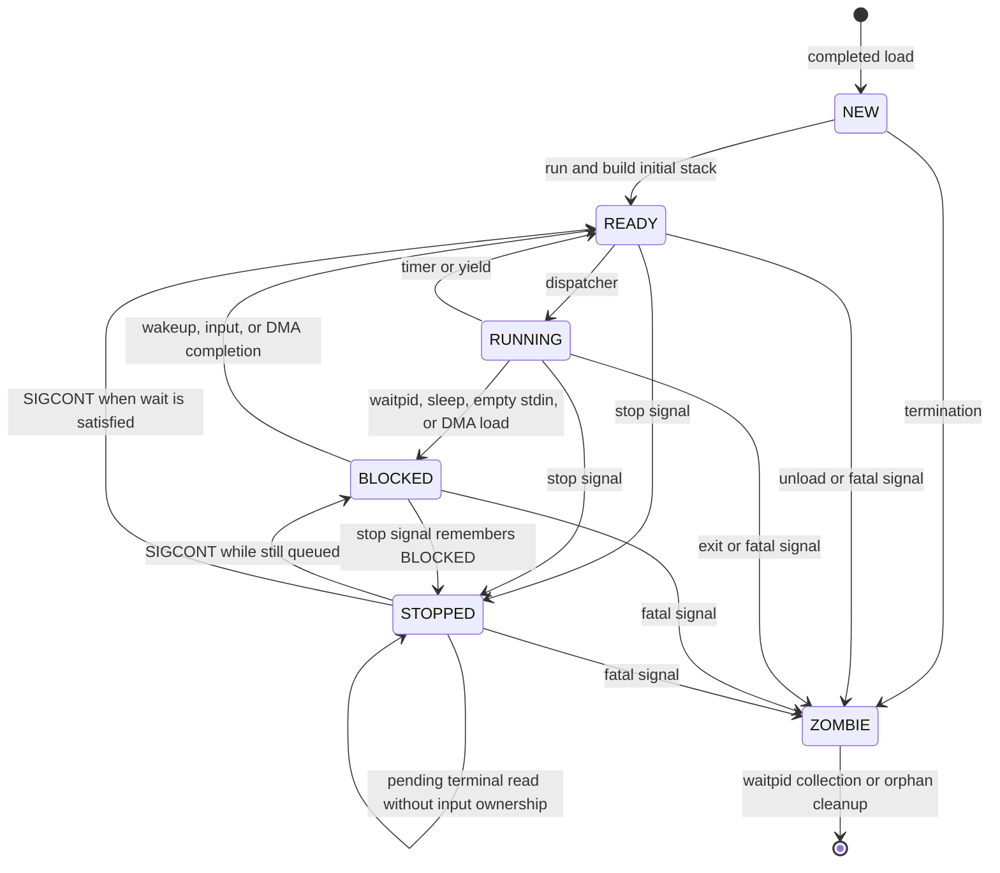

## 4.6 Loading and starting a process
[\[↑ TOC\]](#contents)

Loading reserves and fills an image before run setup constructs its initial
stack. The transfer must finish before a `NEW` process can be prepared and
made eligible for scheduling.

### 4.6.1 Executable transfer with polling or DMA
[\[↑ TOC\]](#contents)

Loading and starting are deliberately separate operations. The sequence below
follows a successful userspace [`load()`](library/unistd/process.picoc#L17) through [`load_process_chunk()`](kernel/process/process_loader.picoc#L292) and
then [`run()`](library/unistd/process.picoc#L31) through [`mark_process_ready_with_arguments()`](kernel/process/process_arguments.picoc#L241). It distinguishes
DMA from the 1 KiB fallback; `ESC` is the host-request delimiter. Boot-time
loading instead uses the continuous transfer in [Loading the kernel](#101-loading-the-kernel-from-the-eprom-bootloader).

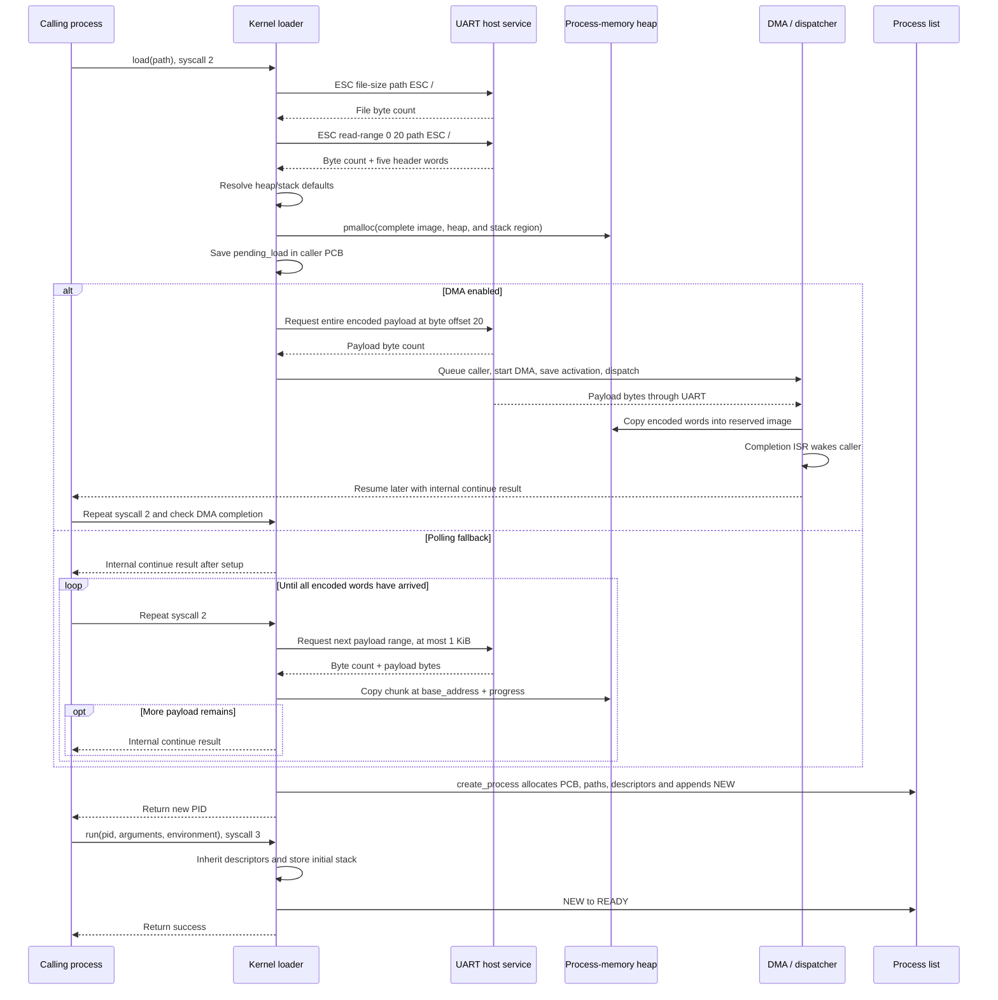

While a userspace load is incomplete, the caller's PCB owns one
[`ProcessLoad`](kernel/process/process_loader.picoc#L14) allocated from the
kernel heap. It keeps the validated header, reserved image, transfer progress,
and copied path across repeated syscall 2 invocations. The field table shows
which values describe the future process and which exist only to resume the
transfer.

| Field | Meaning | Used by |
| --- | --- | --- |
| [`ProcessLoad.base_address`](kernel/process/process_loader.picoc#L15) | Absolute start of the reserved process-memory region | First initialized by [`begin_process_load(path, show_loading_bar, caller_context)`](kernel/process/process_loader.picoc#L109); used by [`continue_process_load(owner)`](kernel/process/process_loader.picoc#L227), [`finish_process_load(owner)`](kernel/process/process_loader.picoc#L90), and [`cancel_process_load(process)`](kernel/process/process_loader.picoc#L76) |
| [`ProcessLoad.process_size`](kernel/process/process_loader.picoc#L16) | Total reserved cells for code, data, heap, stack, and startup values | First initialized by [`begin_process_load(path, show_loading_bar, caller_context)`](kernel/process/process_loader.picoc#L109); passed to [`create_process()`](kernel/process/process.picoc#L89) by [`finish_process_load(owner)`](kernel/process/process_loader.picoc#L90) |
| [`ProcessLoad.code_start`](kernel/process/process_loader.picoc#L17), [`ProcessLoad.data_start`](kernel/process/process_loader.picoc#L18) | Linked code- and data-segment offsets from the binary header | First initialized by [`begin_process_load(path, show_loading_bar, caller_context)`](kernel/process/process_loader.picoc#L109); passed to [`create_process()`](kernel/process/process.picoc#L89) by [`finish_process_load(owner)`](kernel/process/process_loader.picoc#L90) |
| [`ProcessLoad.heap_start`](kernel/process/process_loader.picoc#L19), [`ProcessLoad.heap_size`](kernel/process/process_loader.picoc#L20) | Resolved userspace heap offset and cell count | First initialized by [`begin_process_load(path, show_loading_bar, caller_context)`](kernel/process/process_loader.picoc#L109); passed to [`create_process()`](kernel/process/process.picoc#L89) by [`finish_process_load(owner)`](kernel/process/process_loader.picoc#L90) |
| [`ProcessLoad.payload_word_count`](kernel/process/process_loader.picoc#L21) | Encoded program words after the five-word header | First initialized by [`begin_process_load(path, show_loading_bar, caller_context)`](kernel/process/process_loader.picoc#L109); bounds both DMA and polling transfers in [`begin_process_load(path, show_loading_bar, caller_context)`](kernel/process/process_loader.picoc#L109) and [`continue_process_load(owner)`](kernel/process/process_loader.picoc#L227) |
| [`ProcessLoad.loaded_word_count`](kernel/process/process_loader.picoc#L22) | Words copied by the polling transfer so far | First initialized to 0 by [`begin_process_load(path, show_loading_bar, caller_context)`](kernel/process/process_loader.picoc#L109); advanced and checked by [`continue_process_load(owner)`](kernel/process/process_loader.picoc#L227) |
| [`ProcessLoad.loading_bar_update`](kernel/process/process_loader.picoc#L23) | Next word count at which progress output is redrawn | First initialized by [`begin_process_load(path, show_loading_bar, caller_context)`](kernel/process/process_loader.picoc#L109); updated by [`continue_process_load(owner)`](kernel/process/process_loader.picoc#L227) |
| [`ProcessLoad.uses_dma`](kernel/process/process_loader.picoc#L24) | Whether the reserved image is being filled by one DMA transfer rather than polling chunks | First initialized to `false` and set to `true` by [`begin_process_load(path, show_loading_bar, caller_context)`](kernel/process/process_loader.picoc#L109); checked by [`continue_process_load(owner)`](kernel/process/process_loader.picoc#L227) and [`cancel_process_load(process)`](kernel/process/process_loader.picoc#L76) |
| [`ProcessLoad.path`](kernel/process/process_loader.picoc#L25) | Kernel-owned absolute binary path used by later range requests and copied into the completed PCB | First initialized by [`begin_process_load(path, show_loading_bar, caller_context)`](kernel/process/process_loader.picoc#L109); read by [`continue_process_load(owner)`](kernel/process/process_loader.picoc#L227) and [`finish_process_load(owner)`](kernel/process/process_loader.picoc#L90); freed by [`free_process_load(load)`](kernel/process/process_loader.picoc#L71) |

If the binary header contains [`heap_size`](kernel/process/process.header#L37) == -1, PicoOS uses its 1000-cell
default. If `stack_start == -1`, the highest stack offset becomes the first cell after
the heap plus the 1000-cell default. Because that offset is inclusive, the
allocated region has 1001 cells above the heap, including startup data. An explicit stack start is rejected if it
overlaps the heap. These choices determine the size passed to [`pmalloc()`](kernel/pmalloc.picoc#L20);
the loader does not allocate code, heap, and stack as separate blocks. The partial image belongs to the caller's PCB and is released when that PCB is
removed; a retained zombie can therefore still own an unfinished load. A PCB for the new process is only
created after the last chunk arrives.

### 4.6.2 Changing a completed image from `NEW` to `READY`
[\[↑ TOC\]](#contents)

Completing [`load_process()`](kernel/process/process_loader.picoc#L305) or
[`load_process_chunk()`](kernel/process/process_loader.picoc#L292) creates a
[`NEW`](kernel/process/process.header#L12) PCB. The later
[`mark_process_ready_with_arguments()`](kernel/process/process_arguments.picoc#L241)
inherits descriptor values, writes the initial stack, and changes it to
[`READY`](kernel/process/process.header#L13).

Creation first gives every PCB a new standard descriptor table. When a process
later calls [`run()`](library/unistd/process.picoc#L31),
[`mark_process_ready_with_arguments()`](kernel/process/process_arguments.picoc#L241)
deep-copies the running caller's descriptor table, destroys the child's initial
table, and installs the copy. PID 1 has no running caller and keeps its initial
standard table. The parent PID and working directory, in contrast, are
established when the image is loaded.

## 4.7 Parent-child relationships, termination, and reaping
[\[↑ TOC\]](#contents)

Loading and run setup create a live process; termination unwinds the same
ownership relationships. It first handles children, records status, changes the PCB to
[`ZOMBIE`](kernel/process/process.header#L17), and wakes waiting parents. An orphan or a child whose parent was
already waiting can be removed immediately. Otherwise the zombie retains its
PCB, image, descriptor table, paths, and attachments until the parent collects
it with [`waitpid()`](library/sys/wait/wait.picoc#L14).

Explicit unloading also removes an uncollected zombie; the test reset helper
removes selected PCBs directly. Final removal unlinks the PCB from a wait queue and process list, releases
shared-memory attachments and any pending process load, calls
[`pfree()`](kernel/pmalloc.picoc#L47) on [`base_address`](kernel/process/process.header#L34),
destroys the descriptor table, and frees PCB-owned strings and the PCB with
[`kfree()`](kernel/kmalloc.picoc#L38).

## 4.8 Process-table and lifecycle function reference
[\[↑ TOC\]](#contents)

The table below collects functions that own the global process list, process
state, parent-child relationships, and final PCB removal. Process loading is
covered next; wait-queue operations have their own reference in
[Blocking, wait queues, signals, and mutexes](#6-blocking-wait-queues-signals-and-mutexes).

| Kernel function | Return value / status | Effects | Calls | Called by |
| --- | --- | --- | --- | --- |
| [`find_process_by_pid(pid)`](kernel/process/process.picoc#L162), [`list_processes(void)`](kernel/process/process.picoc#L32) | Return a PCB or `NULL`; list function returns no value | Read/traverse the process list; the list function writes each PID/path through descriptor 1 | [`first_process()`](kernel/process/process.picoc#L28), [`uart_append_decimal()`](common/uart_protocol.picoc#L26), [`system_relative_path()`](kernel/filesystem/host_filesystem.picoc#L121), [`write_file_descriptor()`](kernel/filesystem/filesystem.picoc#L217) | **Library functions:** [`list_processes()`](library/unistd/process.picoc#L51)<br>**System calls:** via [`handle_syscall()`](kernel/syscall.picoc#L16) (for [`list_processes()`](kernel/process/process.picoc#L32)) |
| [`terminate_process(process, status)`](kernel/process/process.picoc#L304), [`exit_process(status)`](kernel/process/process.picoc#L451), [`unload_process_by_pid(pid)`](kernel/process/process.picoc#L328) | Termination returns no value; [`exit_process()`](kernel/process/process.picoc#L451) does not return normally; unload returns `true` on removal, `false` for a missing or current PID | Store status, make a PCB zombie, wake waiters, and remove it when permitted | [`orphan_and_signal_children()`](kernel/process/process.picoc#L279), [`find_process_by_pid()`](kernel/process/process.picoc#L162), [`process_has_waiting_parent()`](kernel/process/process.picoc#L249), [`wake_parent_waiting_for_process()`](kernel/process/process.picoc#L261), [`remove_process()`](kernel/process/process.picoc#L209), [`terminate_process()`](kernel/process/process.picoc#L304), [`current_process()`](kernel/process/process.picoc#L62), [`dispatcher_start_next_process()`](kernel/dispatcher.picoc#L55), [`shutdown()`](kernel/kernel.picoc#L15) | **Library functions:** [`unload()`](library/unistd/process.picoc#L47)<br>**System calls:** via [`handle_syscall()`](kernel/syscall.picoc#L16) (for [`unload_process_by_pid()`](kernel/process/process.picoc#L328))<br>**CPU exceptions:** via [`handle_cpu_exception()`](kernel/exception.picoc#L70) (for [`exit_process()`](kernel/process/process.picoc#L451)) |
| [`process_heap_start(void)`](kernel/process/process.picoc#L439), [`process_heap_size(void)`](kernel/process/process.picoc#L445) | Return current process's absolute heap start or heap size | Read current PCB memory fields only | [`current_process()`](kernel/process/process.picoc#L62) | **Library functions:** [`malloc()`](library/stdlib/malloc.picoc#L35)<br>**System calls:** via [`handle_syscall()`](kernel/syscall.picoc#L16) |
| [`remove_test_processes(void)`](kernel/process/process.picoc#L348) | Returns no value | Removes all PCBs except PID 1, PID 2, and the caller; resets the next PID to 3 only when the caller is PID 2 | [`remove_process()`](kernel/process/process.picoc#L209) | **Library functions:** [`reset_processes()`](library/unistd/process.picoc#L59)<br>**System calls:** via [`handle_syscall()`](kernel/syscall.picoc#L16) |
|  |  |  |  |  |
| [`initialize_process_table(void)`](kernel/process/process.picoc#L21) | Returns no value | Resets process-list globals and the next PID | — | **Kernel functions:** [`main()`](kernel/kernel.picoc#L31) |
| [`create_process(base_address, size, code_start, data_start, heap_start, heap_size, binary_path)`](kernel/process/process.picoc#L89) | Returns a PCB pointer; kernel-heap exhaustion halts the OS | Allocates and initializes a PCB, paths, descriptor table, embedded queues, and list link; copies the parent's working directory or uses `/` when there is no parent | [`kmalloc()`](kernel/kmalloc.picoc#L23), [`current_process()`](kernel/process/process.picoc#L62), [`copy_process_path()`](kernel/process/process.picoc#L70), [`create_file_descriptor_table()`](kernel/filesystem/file_descriptor.picoc#L35) | **Kernel functions:** [`finish_process_load()`](kernel/process/process_loader.picoc#L90), [`load_process()`](kernel/process/process_loader.picoc#L305) |
| [`first_process(void)`](kernel/process/process.picoc#L28), [`current_process(void)`](kernel/process/process.picoc#L62) | Return the head or active PCB, possibly `NULL` | Read process-list globals only | — | **Kernel functions:** [`activate_current_process_stack_boundary()`](kernel/exception.picoc#L22), [`begin_process_load()`](kernel/process/process_loader.picoc#L109), [`begin_terminal_read()`](kernel/filesystem/terminal.picoc#L135), [`build_process_path()`](kernel/filesystem/host_filesystem.picoc#L92), [`change_working_directory()`](kernel/filesystem/host_filesystem.picoc#L163), [`close_file_descriptor()`](kernel/filesystem/file_descriptor.picoc#L143), [`create_process()`](kernel/process/process.picoc#L89), [`dispatcher_start_next_process()`](kernel/dispatcher.picoc#L55), [`dispatcher_switch_from_context()`](kernel/dispatcher.picoc#L71), [`dispatcher_switch_to_process()`](kernel/dispatcher.picoc#L43), [`duplicate_file_descriptor()`](kernel/filesystem/file_descriptor.picoc#L160), [`enqueue_current_process_on_wait_queue()`](kernel/process/process.picoc#L396), [`exit_process()`](kernel/process/process.picoc#L451), [`get_working_directory()`](kernel/filesystem/host_filesystem.picoc#L156), [`handle_syscall()`](kernel/syscall.picoc#L16), [`list_processes()`](kernel/process/process.picoc#L32), [`load_process_chunk()`](kernel/process/process_loader.picoc#L292), [`map_shared_memory()`](kernel/shared_memory.picoc#L130), [`mark_process_ready_with_arguments()`](kernel/process/process_arguments.picoc#L241), [`open_file_descriptor()`](kernel/filesystem/filesystem.picoc#L39), [`process_heap_size()`](kernel/process/process.picoc#L445), [`process_heap_start()`](kernel/process/process.picoc#L439), [`read_file_descriptor()`](kernel/filesystem/filesystem.picoc#L150), [`scheduler_next_process()`](kernel/scheduler.picoc#L12), [`seek_file_descriptor()`](kernel/filesystem/filesystem.picoc#L268), [`send_signal_to_process()`](kernel/signal.picoc#L74), [`set_foreground_process()`](kernel/signal.picoc#L147), [`set_parent_death_signal()`](kernel/signal.picoc#L136), [`terminal_input_process()`](kernel/signal.picoc#L171), [`wait_for_process_by_pid()`](kernel/process/process.picoc#L369), [`write_file_descriptor()`](kernel/filesystem/filesystem.picoc#L217) |
| [`set_current_process(process)`](kernel/process/process.picoc#L66) | Returns no value | Replaces the active PCB global | — | **Kernel functions:** [`dispatcher_switch_to_process()`](kernel/dispatcher.picoc#L43) |
| [`remove_process(process)`](kernel/process/process.picoc#L209) | Returns no value | Final destructor: unlinks queues/list and releases image, attachments, descriptor table, strings, and PCB | [`remove_from_wait_queue()`](kernel/process/process.picoc#L176), [`release_process_shared_memory()`](kernel/shared_memory.picoc#L172), [`cancel_process_load()`](kernel/process/process_loader.picoc#L76), [`pfree()`](kernel/pmalloc.picoc#L47), [`destroy_file_descriptor_table()`](kernel/filesystem/file_descriptor.picoc#L115), [`kfree()`](kernel/kmalloc.picoc#L38) | **Kernel functions:** [`orphan_and_signal_children()`](kernel/process/process.picoc#L279), [`remove_test_processes()`](kernel/process/process.picoc#L348), [`terminate_process()`](kernel/process/process.picoc#L304), [`unload_process_by_pid()`](kernel/process/process.picoc#L328), [`wait_for_process_by_pid()`](kernel/process/process.picoc#L369) |
| [`orphan_and_signal_children(parent)`](kernel/process/process.picoc#L279), [`wake_parent_waiting_for_process(process, status)`](kernel/process/process.picoc#L261) | Return no value | Update child parent fields or parent wait status/queue | [`remove_process()`](kernel/process/process.picoc#L209), [`send_signal_to_process()`](kernel/signal.picoc#L74), [`wakeup_wait_queue()`](kernel/process/process.picoc#L416) | **Kernel functions:** [`terminate_process()`](kernel/process/process.picoc#L304) |

## 4.9 Process-loader and run-setup function reference
[\[↑ TOC\]](#contents)

The next table follows executable transfer, cleanup, and run setup. It shows
when a reserved image becomes a PCB and when that PCB becomes runnable:

| Kernel function | Return value / status | Effects | Calls | Called by |
| --- | --- | --- | --- | --- |
| [`load_process_chunk(path, show_loading_bar, caller_context)`](kernel/process/process_loader.picoc#L292) | Returns a positive PID on completion, 0 on failure, or [`SYSCALL_LOAD_PROCESS_CONTINUE`](common/syscall.header#L49) (-1) while work remains | Starts or advances the caller's load; DMA blocks for the full payload, polling receives at most 1 KiB per continuation; creates a [`NEW`](kernel/process/process.header#L12) PCB on completion | [`current_process()`](kernel/process/process.picoc#L62), [`begin_process_load()`](kernel/process/process_loader.picoc#L109), [`continue_process_load()`](kernel/process/process_loader.picoc#L227) | **Library functions:** [`load()`](library/unistd/process.picoc#L17)<br>**System calls:** via [`handle_syscall()`](kernel/syscall.picoc#L16) |
| [`mark_process_ready_with_arguments(request)`](kernel/process/process_arguments.picoc#L241) | Returns `true` after run setup; `false` for a missing PID or a PCB that is not [`NEW`](kernel/process/process.header#L12) | Installs inherited descriptors, stores startup data, and changes [`NEW`](kernel/process/process.header#L12) to [`READY`](kernel/process/process.header#L13) | [`find_process_by_pid()`](kernel/process/process.picoc#L162), [`current_process()`](kernel/process/process.picoc#L62), [`inherit_file_descriptors()`](kernel/filesystem/file_descriptor.picoc#L99), [`destroy_file_descriptor_table()`](kernel/filesystem/file_descriptor.picoc#L115), [`store_process_arguments()`](kernel/process/process_arguments.picoc#L125) | **Library functions:** [`run()`](library/unistd/process.picoc#L31)<br>**System calls:** via [`handle_syscall()`](kernel/syscall.picoc#L16)<br>**Kernel functions:** [`main()`](kernel/kernel.picoc#L31) |
|  |  |  |  |  |
| [`load_process(path, show_loading_bar)`](kernel/process/process_loader.picoc#L305) | Returns PID, or 0 on failure | Resolves the boot-time path from PicoOS `/`, performs the continuous transfer, and creates a [`NEW`](kernel/process/process.header#L12) PCB | [`build_process_path()`](kernel/filesystem/host_filesystem.picoc#L92), [`uart_send_host_request()`](common/uart_protocol.picoc#L82), [`receive_word()`](common/uart_protocol.picoc#L7), [`drain_process_words()`](kernel/process/process_loader.picoc#L40), [`uart_print_loading_bar_label()`](common/loading_bar.picoc#L6), [`system_relative_path()`](kernel/filesystem/host_filesystem.picoc#L121), [`loaded_process_stack_start()`](kernel/process/process_loader.picoc#L28), [`uart_print_string()`](common/uart_protocol.picoc#L73), [`pmalloc()`](kernel/pmalloc.picoc#L20), [`receive_words_to_sram()`](common/sram_loader.picoc#L6), [`create_process()`](kernel/process/process.picoc#L89) | **Kernel functions:** [`main()`](kernel/kernel.picoc#L31) |
| [`cancel_process_load(process)`](kernel/process/process_loader.picoc#L76) | Returns no value | Cancels an active DMA load if necessary; clears the caller's pending-load pointer and frees the partial image, copied path, and metadata | [`dma_transfer_status()`](common/dma.picoc#L21), [`cancel_dma_transfer()`](common/dma.picoc#L32), [`pfree()`](kernel/pmalloc.picoc#L47), [`free_process_load()`](kernel/process/process_loader.picoc#L71) | **Kernel functions:** [`begin_process_load()`](kernel/process/process_loader.picoc#L109), [`continue_process_load()`](kernel/process/process_loader.picoc#L227), [`remove_process()`](kernel/process/process.picoc#L209) |
| [`store_process_arguments(process, arguments, environment)`](kernel/process/process_arguments.picoc#L125) | Returns no value | Writes initial stack/tables/strings into the image and sets activation [`sp`](kernel/process/process.header#L25)/[`baf`](kernel/process/process.header#L26) | [`process_argument_token_count()`](kernel/process/process_arguments.picoc#L14), [`process_environment_count()`](kernel/process/process_arguments.picoc#L89), [`process_string_cell_count()`](kernel/process/process_arguments.picoc#L103), [`process_argument_string_cell_count()`](kernel/process/process_arguments.picoc#L51), [`copy_process_string()`](kernel/process/process_arguments.picoc#L113), [`process_argument_is_space()`](kernel/process/process_arguments.picoc#L5), [`process_argument_is_quote()`](kernel/process/process_arguments.picoc#L9) | **Kernel functions:** [`mark_process_ready_with_arguments()`](kernel/process/process_arguments.picoc#L241) |

# 5. Scheduling and context switching
[\[↑ TOC\]](#contents)

After a process blocks, yields, or exhausts its timer interval, the scheduler chooses a runnable
[`Process`](kernel/process/process.header#L31) PCB. Selection and context switching are separate:
the scheduler chooses the PCB, while the dispatcher saves the current
activation and restores the selected one.

## 5.1 Round-robin process selection
[\[↑ TOC\]](#contents)

There is no scheduler object or ready queue.
[`scheduler_next_process()`](kernel/scheduler.picoc#L12) reads the process list and active PCB. It
begins after the current PCB, wraps once, and returns the first `READY` or still-current `RUNNING`
PCB. Other states remain in the list but are skipped. The complete function below shows the two
scans that preserve round-robin order without maintaining a separate ready queue.

```c
struct Process *scheduler_next_process(void) {
    struct Process *start;
    struct Process *candidate;

    if (first_process() == NULL) {
        return NULL;
    }
    if (current_process() == NULL || current_process()->next == NULL) {
        start = first_process();
    } else {
        start = current_process()->next;
    }

    candidate = start;
    while (candidate != NULL) {
        if (scheduler_can_run(candidate)) {
            return candidate;
        }
        candidate = candidate->next;
    }

    candidate = first_process();
    while (candidate != start) {
        if (scheduler_can_run(candidate)) {
            return candidate;
        }
        candidate = candidate->next;
    }
    return NULL;
}
```

Including `RUNNING` permits the current process to be selected again when it is the only runnable
one.

## 5.2 Saving the current process and selecting the next process
[\[↑ TOC\]](#contents)

Immediate timer preemption, deferred timer requests,
[`yield()`](library/schedule/schedule.picoc#L4), terminal blocking, queues, and
[`waitpid()`](library/sys/wait/wait.picoc#L14) eventually pass a saved frame to
[`dispatcher_switch_from_context()`](kernel/dispatcher.picoc#L71). The complete function below shows
how it preserves the caller’s registers and leaves an already blocked or stopped state intact:

```c
void dispatcher_switch_from_context(int *caller_context) {
    struct Process *process = current_process();

    if (process != NULL) {
        process->activation.sp = (int)(caller_context + 6);
        process->activation.ds = caller_context[1];
        process->activation.cs = caller_context[2];
        process->activation.baf = caller_context[3];
        process->activation.in2 = caller_context[4];
        process->activation.in1 = caller_context[5];
        process->activation.acc = caller_context[6];

        if (process->state == PROCESS_STATE_RUNNING) {
            process->state = PROCESS_STATE_READY;
        }
    }
    dispatcher_start_next_process();
}
```

Blocking code has already changed the PCB to `BLOCKED`, so that state remains. Timer preemption or
[`yield()`](library/schedule/schedule.picoc#L4) reaches the dispatcher from `RUNNING`, which becomes
`READY`. [`dispatcher_request_reschedule()`](kernel/dispatcher.picoc#L10) records timer expiry
without switching inside the kernel, and
[`dispatcher_reschedule_if_requested()`](kernel/dispatcher.picoc#L14) sends the syscall's saved
frame through this same path at return. Selecting a process for dispatch clears the request, even if
it is the same process again.

[`dispatcher_start_next_process()`](kernel/dispatcher.picoc#L55) schedules and calls
[`prepare_process_termination()`](kernel/signal.picoc#L125) before running a PCB. Deferred
termination can remove that PCB, requiring another pass. If processes exist but none is runnable,
the loop repeatedly scans in kernel context until an interrupt makes one ready. If the process list
is empty, [`dispatcher_start_next_process()`](kernel/dispatcher.picoc#L55) returns.

## 5.3 Restoring the selected process and returning with `RTI`
[\[↑ TOC\]](#contents)

[`dispatcher_switch_to_process()`](kernel/dispatcher.picoc#L43) updates old/new states and the
global active pointer, then enters [`dispatcher_jump_to_process()`](kernel/dispatcher.picoc#L21).
The complete restoration code below shows why this last step must be naked: it installs another
process’s stack and finishes with `RTI`, without a normal function return.

```c
__attribute__((naked))
void dispatcher_jump_to_process(struct Process *process, int stack_boundary) {
    // Reads the process pointer and its precomputed stack boundary from the call frame
    asm("LOADIN SP BAF 2");
    asm("LOADIN SP IN1 3");

    // Restores SP before the process boundary so an interrupt cannot compare the
    // kernel stack against the process heap during this context-switch window
    asm("LOADIN BAF SP 11");
    write_stack_heap_boundary_from_in1();

    // Restores the remaining activation record while BAF still points to the process
    asm("LOADIN BAF CS 13");
    asm("LOADIN BAF DS 14");
    asm("LOADIN BAF IN1 8");
    asm("LOADIN BAF IN2 9");
    asm("LOADIN BAF ACC 10");
    asm("LOADIN BAF BAF 12");

    // Returns to the restored process context
    asm("RTI");
}
```

The fixed offsets are why [`activation`](kernel/process/process.header#L40) must remain at its
defined PCB position. The helper restores `SP` before installing the process boundary, so an
interrupt cannot compare the still-active kernel stack with the selected process's heap boundary.
It then restores the remaining activation and leaves kernel code through `RTI`. The table below
connects the scheduler and dispatcher functions to their state changes and direct calls.

| Kernel function | Return value / status | Effects | Calls | Called by |
| --- | --- | --- | --- | --- |
| [`dispatcher_switch_from_context(caller_context)`](kernel/dispatcher.picoc#L71) | Returns only if scheduling finds an empty process list; otherwise leaves through `RTI` | Copies the saved frame into PCB activation and may change `RUNNING` to `READY` | [`current_process()`](kernel/process/process.picoc#L62), [`dispatcher_start_next_process()`](kernel/dispatcher.picoc#L55) | **Library functions:** [`yield()`](library/schedule/schedule.picoc#L4)<br>**Hardware interrupts:** Timer via [`timer_interrupt_after_reschedule_request()`](interrupt_service_routines/os_isrs.picoc#L91)<br>**System calls:** via [`handle_syscall()`](kernel/syscall.picoc#L16)<br>**Kernel functions:** [`dispatcher_reschedule_if_requested()`](kernel/dispatcher.picoc#L14), [`begin_terminal_read()`](kernel/filesystem/terminal.picoc#L135) |
|  |  |  |  |  |
| [`scheduler_next_process(void)`](kernel/scheduler.picoc#L12) | Runnable PCB, or `NULL` when none is runnable | Reads process-list and active-PCB globals | [`first_process()`](kernel/process/process.picoc#L28), [`current_process()`](kernel/process/process.picoc#L62), [`scheduler_can_run()`](kernel/scheduler.picoc#L4) | **Kernel functions:** [`dispatcher_start_next_process()`](kernel/dispatcher.picoc#L55), [`scheduler_can_run()`](kernel/scheduler.picoc#L4) |
| [`dispatcher_request_reschedule(void)`](kernel/dispatcher.picoc#L10) | Returns no value | Sets [`reschedule_requested`](kernel/dispatcher.picoc#L8) after timer expiry | — | **Hardware interrupts:** Timer via [`timer_interrupt()`](interrupt_service_routines/os_isrs.picoc#L33) and [`timer_interrupt_process()`](interrupt_service_routines/os_isrs.picoc#L74)<br>**Kernel functions:** [`send_signal_to_process()`](kernel/signal.picoc#L74) |
| [`dispatcher_reschedule_if_requested(caller_context)`](kernel/dispatcher.picoc#L14) | Returns if no request is pending, or dispatch finds an empty process list | Dispatches from the syscall frame when a timer request is pending | [`dispatcher_switch_from_context()`](kernel/dispatcher.picoc#L71) | **System calls:** return through [`syscall_interrupt_return()`](interrupt_service_routines/os_isrs.picoc#L143) |
| [`dispatcher_start_next_process(void)`](kernel/dispatcher.picoc#L55) | Leaves through `RTI` for a runnable PCB; spins while existing PCBs cannot run; returns for an empty list | Schedules, consumes deferred signal actions, and retries when a selected PCB has a pending termination signal | [`scheduler_next_process()`](kernel/scheduler.picoc#L12), [`first_process()`](kernel/process/process.picoc#L28), [`prepare_process_termination()`](kernel/signal.picoc#L125), [`dispatcher_switch_to_process()`](kernel/dispatcher.picoc#L43) | **Kernel functions:** [`dispatcher_switch_from_context()`](kernel/dispatcher.picoc#L71), [`exit_process()`](kernel/process/process.picoc#L451), [`main()`](kernel/kernel.picoc#L31) |
| [`dispatcher_switch_to_process(process)`](kernel/dispatcher.picoc#L43) | Does not return normally | Updates states, clears the reschedule request, and sets the active PCB | [`current_process()`](kernel/process/process.picoc#L62), [`set_current_process()`](kernel/process/process.picoc#L66), [`dispatcher_jump_to_process()`](kernel/dispatcher.picoc#L21), [`process_stack_boundary()`](kernel/exception.picoc#L18) | **Kernel functions:** [`dispatcher_start_next_process()`](kernel/dispatcher.picoc#L55) |
| [`dispatcher_jump_to_process(process, stack_boundary)`](kernel/dispatcher.picoc#L21) | Leaves through `RTI` | Writes the stack boundary to periphery register 10 and restores activation | [`write_stack_heap_boundary_from_in1()`](common/periphery_asm.header#L2) | **Kernel functions:** [`dispatcher_switch_to_process()`](kernel/dispatcher.picoc#L43) |

The sequence diagram follows an immediate switch from process A to a runnable process B through
[`dispatcher_switch_from_context()`](kernel/dispatcher.picoc#L71),
[`dispatcher_start_next_process()`](kernel/dispatcher.picoc#L55), and
[`dispatcher_switch_to_process()`](kernel/dispatcher.picoc#L43). The selection loop matters:
[`prepare_process_termination()`](kernel/signal.picoc#L125) can reject the scheduler’s candidate
before any registers are restored. Deferred timer requests enter this same path at
[system-call return](#25-system-call-dispatch-and-return-path).

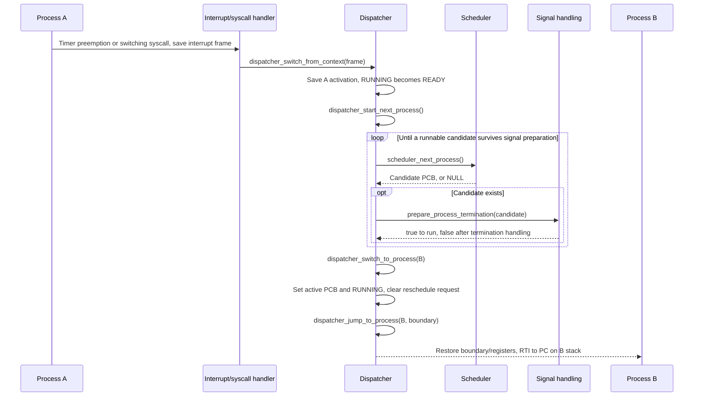

# 6. Blocking, wait queues, signals, and mutexes
[\[↑ TOC\]](#contents)

Process states become most visible when work cannot continue immediately.
PCB fields and intrusive queues preserve a blocked operation, while signals
add explicit stop, continue, and termination paths. With scheduling already
established, this chapter can show why a process stops running and which event
makes it eligible again.

## 6.1 Wait-queue structure and intrusive PCB links
[\[↑ TOC\]](#contents)

A [`struct wait_queue`](common/wait_queue.header#L5) contains only two PCB
pointers. The definition and attribute table below show how those endpoints
support FIFO insertion and removal:

```c
struct wait_queue {
    struct Process *head;
    struct Process *tail;
};
```

| Attribute | Meaning | Used by |
| --- | --- | --- |
| [`head`](common/wait_queue.header#L6) | First blocked PCB to wake, or `NULL` when empty | First initialized by [`create_process()`](kernel/process/process.picoc#L89) for child waiters, [`initialize_terminal()`](kernel/filesystem/terminal.picoc#L14) for terminal input, [`wait_queue_init()`](library/unistd/blocking.picoc#L4) for userspace queues, or [`initialize_dma()`](kernel/dma.picoc#L9) for DMA; maintained by [`enqueue_current_process_on_wait_queue()`](kernel/process/process.picoc#L396), [`enqueue_terminal_reader()`](kernel/filesystem/terminal.picoc#L62), [`wakeup_wait_queue()`](kernel/process/process.picoc#L416), and [`remove_from_wait_queue()`](kernel/process/process.picoc#L176) |
| [`tail`](common/wait_queue.header#L7) | Last blocked PCB, allowing constant-time append; also `NULL` when empty | First initialized by [`create_process()`](kernel/process/process.picoc#L89) for child waiters, [`initialize_terminal()`](kernel/filesystem/terminal.picoc#L14) for terminal input, [`wait_queue_init()`](library/unistd/blocking.picoc#L4) for userspace queues, or [`initialize_dma()`](kernel/dma.picoc#L9) for DMA; maintained by [`enqueue_current_process_on_wait_queue()`](kernel/process/process.picoc#L396), [`enqueue_terminal_reader()`](kernel/filesystem/terminal.picoc#L62), [`wakeup_wait_queue()`](kernel/process/process.picoc#L416), and [`remove_from_wait_queue()`](kernel/process/process.picoc#L176) |

The remaining links live in each queued PCB: [`wait_next`](kernel/process/process.header#L51) selects the next
waiter and [`waiting_queue_ptr`](kernel/process/process.header#L48) points back to the owning queue.

The queue does not allocate list nodes. A blocked PCB supplies
[`waiting_queue_ptr`](kernel/process/process.header#L48) and [`wait_next`](kernel/process/process.header#L51), so one process can be present in at most
one queue. Queue locations include:

- [`process->waiters`](kernel/process/process.header#L46), embedded in a PCB for exact-child [`waitpid()`](library/sys/wait/wait.picoc#L14)
- [`terminal.input_waiters`](kernel/filesystem/terminal.header#L14), embedded in the global terminal
- [`mutex.waiters`](library/mutex/mutex.header#L8), embedded in a userspace mutex, possibly in shared memory
- [`dma_waiters`](kernel/dma.picoc#L6), a kernel global for a process awaiting DMA completion

The last case works because there is no address isolation: userspace passes the
queue address to the kernel, which links PCB pointers through that memory.

[`sleep_on_wait_queue()`](kernel/process/process.picoc#L411) changes the current PCB to [`BLOCKED`](kernel/process/process.header#L15) and dispatches.
[`wakeup_wait_queue()`](kernel/process/process.picoc#L416) wakes one FIFO entry. If a PCB is currently [`STOPPED`](kernel/process/process.header#L16), it
remains stopped but records that its underlying blocking condition has ended.

For [`waitpid()`](library/sys/wait/wait.picoc#L14), the child owns the queue and the waiting parent owns
[`waiting_status_ptr`](kernel/process/process.header#L44). That pointer targets a status object in the suspended
parent’s process stack. Child stop or termination writes through the pointer,
clears it, and wakes the parent. The graph below shows why these queues need
no separately allocated nodes: each PCB supplies both its successor and its
back-reference to the queue.

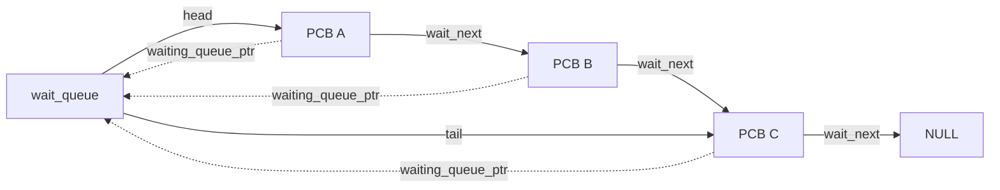

## 6.2 Blocking with `sleep()` and waking with `wakeup()`
[\[↑ TOC\]](#contents)

[`sleep(queue)`](library/unistd/blocking.picoc#L9) is not a timed delay. It invokes [`SYSCALL_SLEEP`](common/syscall.header#L20), appends the
current PCB to the supplied queue, changes it to [`BLOCKED`](kernel/process/process.header#L15), saves its
activation, and dispatches. [`wakeup(queue)`](library/unistd/blocking.picoc#L19) invokes [`SYSCALL_WAKEUP`](common/syscall.header#L21) and
removes at most the FIFO head. The woken PCB becomes [`READY`](kernel/process/process.header#L13), but the caller
keeps running until normal scheduling occurs. If the waiter is also
[`STOPPED`](kernel/process/process.header#L16), the kernel changes [`stopped_from_state`](kernel/process/process.header#L62) to [`READY`](kernel/process/process.header#L13) and leaves the
visible state stopped until [`SIGCONT`](common/signal.header#L6). The sequence below shows an ordinary
blocked waiter: waking it makes it eligible, while the dispatcher determines
when its suspended call actually resumes.


## 6.3 Exact-child waiting
[\[↑ TOC\]](#contents)

The public API waits for one exact child and has no options argument. Its
stack-local [`struct WaitPidRequest`](common/syscall.header#L62) contains the target PID and a pointer to a
stack-local status cell. If the child is already stopped or a zombie, the
kernel writes the status immediately. Otherwise it stores the status pointer
in the waiting parent's PCB, puts that parent on the child's embedded
[`waiters`](kernel/process/process.header#L46) queue, and dispatches. The sequence below separates immediate status
collection from a suspended wait and shows which process owns each saved value.

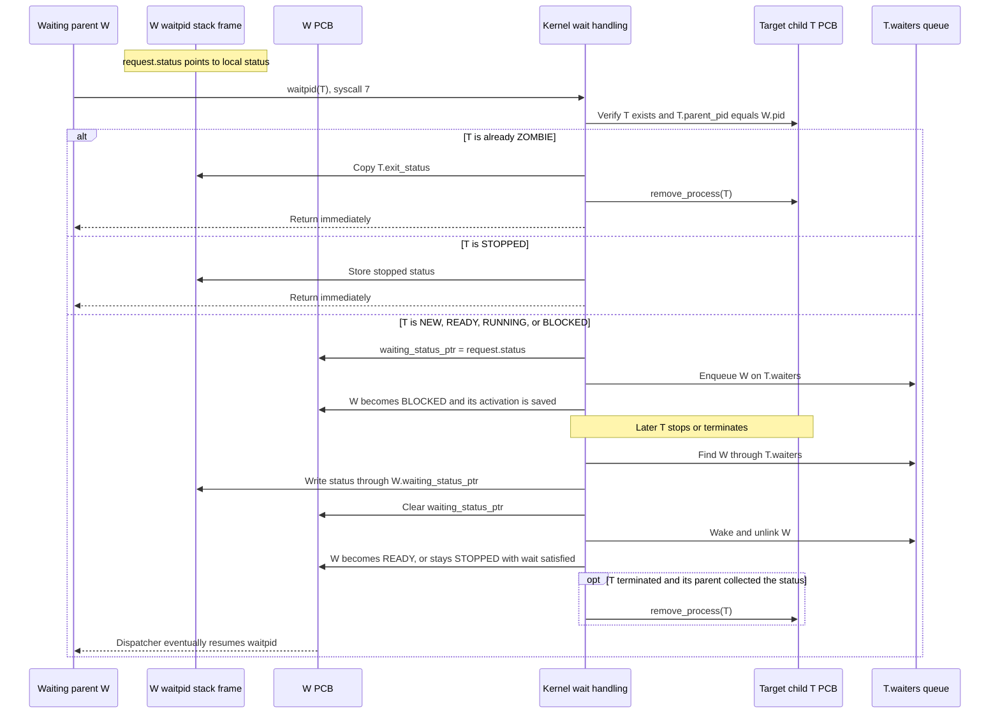

The request and status remain valid because the parent's userspace stack is
suspended while it is blocked. [`waiting_status_ptr`](kernel/process/process.header#L44) is stored in the parent,
whereas the queue is stored in the child. If the child exits before the call,
it remains a [`ZOMBIE`](kernel/process/process.header#L17) with [`exit_status`](kernel/process/process.header#L60) until collected. Invalid PIDs and
non-children produce `-1`. Exact-child waiting matters to init and the shell:
a state change in another child must not complete the wrong wait.

## 6.4 Process signals
[\[↑ TOC\]](#contents)

Signals reuse process states and scheduling, but they also need a small amount
of state of their own. The following parts define the supported actions, then
show how stopping, continuing, and safe termination use that state.

### 6.4.1 Supported signals and fixed actions
[\[↑ TOC\]](#contents)

Signals have fixed kernel actions and cannot be caught or ignored. The small
amount of per-process signal state is embedded in each PCB:

| Attribute | Meaning | Used by |
| --- | --- | --- |
| [`pending_termination_signal`](kernel/process/process.header#L63) | [`SIGINT`](common/signal.header#L4)/[`SIGKILL`](common/signal.header#L5) deferred while the target is the running process | First initialized to 0 by [`create_process()`](kernel/process/process.picoc#L89); set by [`send_signal_to_process()`](kernel/signal.picoc#L74); consumed by [`prepare_process_termination()`](kernel/signal.picoc#L125) |
| [`stop_signal`](kernel/process/process.header#L61) | Identifies the signal reported for the current stopped state | First initialized to 0 by [`create_process()`](kernel/process/process.picoc#L89); set by [`stop_process()`](kernel/signal.picoc#L36) and the input-ownership check in [`continue_process()`](kernel/signal.picoc#L49); read by [`notify_process_stopped()`](kernel/signal.picoc#L22) and [`wait_for_process_by_pid()`](kernel/process/process.picoc#L369) |
| [`stopped_from_state`](kernel/process/process.header#L62) | State reconsidered on [`SIGCONT`](common/signal.header#L6) | First initialized to [`READY`](kernel/process/process.header#L13) by [`create_process()`](kernel/process/process.picoc#L89); set by [`stop_process()`](kernel/signal.picoc#L36), [`wakeup_wait_queue()`](kernel/process/process.picoc#L416), and [`resume_pending_terminal_read()`](kernel/filesystem/terminal.picoc#L85); read by [`continue_process()`](kernel/signal.picoc#L49) |
| [`parent_death_signal`](kernel/process/process.header#L59) | Signal delivered when the parent terminates | First initialized by [`create_process()`](kernel/process/process.picoc#L89); set by [`set_parent_death_signal()`](kernel/signal.picoc#L136) |
| [`pending_terminal_read_buffer`](kernel/process/process.header#L65), [`pending_terminal_read_count`](kernel/process/process.header#L66) | Terminal request retained across any stop while the read is pending | First initialized to `NULL`/0 by [`create_process()`](kernel/process/process.picoc#L89); set by [`begin_terminal_read()`](kernel/filesystem/terminal.picoc#L135); consumed by [`complete_pending_terminal_read()`](kernel/filesystem/terminal.picoc#L183) or [`resume_pending_terminal_read()`](kernel/filesystem/terminal.picoc#L85) |

The subsystem also has global [`foreground_process_id`](kernel/signal.picoc#L10) and
[`terminal_input_process_id`](kernel/signal.picoc#L11) integers in kernel `.data`. They are not PCB
pointers; lookup validates that the process still exists.

Six signals are implemented. [`SIGINT`](common/signal.header#L4) and [`SIGKILL`](common/signal.header#L5) terminate; [`SIGSTOP`](common/signal.header#L7),
[`SIGTSTP`](common/signal.header#L8), and [`SIGTTIN`](common/signal.header#L9) stop; and [`SIGCONT`](common/signal.header#L6) resumes a stopped process. Signal
0 remains an existence probe for [`kill()`](library/signal/signal.picoc#L14) and performs no action. The table
below maps the accepted numbers to their fixed actions and reported statuses.

| Number | Name | Kernel action | Reported status/state |
| ---: | --- | --- | --- |
| 0 | Probe | Validates that a non-zombie PID exists | No change |
| 2 | [`SIGINT`](common/signal.header#L4) | Terminates the target | Exit status 130 |
| 9 | [`SIGKILL`](common/signal.header#L5) | Terminates the target | Exit status 137 |
| 18 | [`SIGCONT`](common/signal.header#L6) | Resumes a stopped target | [`READY`](kernel/process/process.header#L13), or [`BLOCKED`](kernel/process/process.header#L15) if its original wait is still active |
| 19 | [`SIGSTOP`](common/signal.header#L7) | Stops the target | [`STOPPED`](kernel/process/process.header#L16); status 147 |
| 20 | [`SIGTSTP`](common/signal.header#L8) | Stops the target | [`STOPPED`](kernel/process/process.header#L16); status 148 |
| 21 | [`SIGTTIN`](common/signal.header#L9) | Stops the target; generated when a background process reads the terminal | [`STOPPED`](kernel/process/process.header#L16); status 149 |

[`signal_number_is_valid()`](kernel/signal.picoc#L13) compares against those six named constants
explicitly. A numeric value in a gap between them is not accepted merely
because it lies within the implemented range. Signal 0 is handled separately by
[`send_signal_by_pid()`](kernel/signal.picoc#L107) because it performs lookup without delivery.

### 6.4.2 Stopping and continuing a process
[\[↑ TOC\]](#contents)

When a stop signal changes a PCB to [`STOPPED`](kernel/process/process.header#L16), the signal and prior state are
retained in [`stop_signal`](kernel/process/process.header#L61) and [`stopped_from_state`](kernel/process/process.header#L62). The child-owned waiter queue
is drained and each waiting process receives that signal's stopped status
through its saved [`waiting_status_ptr`](kernel/process/process.header#L44). [`WIFSTOPPED()`](library/sys/wait/wait.picoc#L25) recognizes all three
stopped statuses. If the process was blocked in a terminal read, it is detached
from [`terminal.input_waiters`](kernel/filesystem/terminal.header#L14), but its userspace buffer and requested count stay
in the PCB. This keeps the inactive reader out of the terminal's active wait
queue without losing the suspended system call.
[`SIGCONT`](common/signal.header#L6) returns an ordinary stopped process to [`READY`](kernel/process/process.header#L13); a process that was
blocked and is still linked to its original wait queue returns to [`BLOCKED`](kernel/process/process.header#L15)
instead, because continuing it does not satisfy that blocking operation.

### 6.4.3 Deferred termination of the running process
[\[↑ TOC\]](#contents)

Termination of the currently [`RUNNING`](kernel/process/process.header#L14) PCB stores its signal in
[`pending_termination_signal`](kernel/process/process.header#L63), because freeing the active interrupt-return
context would be unsafe, and [`dispatcher_request_reschedule()`](kernel/dispatcher.picoc#L10) ensures that the
next safe syscall-return boundary enters the dispatcher. Before a PCB is restored,
[`prepare_process_termination()`](kernel/signal.picoc#L125) clears that value and terminates the process
through [`kill_process()`](kernel/signal.picoc#L70), causing the dispatcher to select another PCB. The
more general
[`terminate_process(process, status)`](kernel/process/process.picoc#L304) still accepts a status because normal
exit, exceptions, and unloading use different values. Other targets can be
terminated immediately; stop and continue actions update their state directly.
This value is only a safe-destruction handoff to the dispatcher, not a general
queue: signal delivery never copies or replaces the process activation and
never enters userspace code.

### 6.4.4 Fixed PicoOS signal actions compared with Unix
[\[↑ TOC\]](#contents)

Unlike Unix/Linux, PicoOS does not support catching or ignoring signals.
Unix/Linux permits a process to catch and handle [`SIGINT`](common/signal.header#L4), while [`SIGKILL`](common/signal.header#L5)
cannot be caught; this educational OS deliberately gives both the same fixed
termination action. Unix/Linux likewise makes [`SIGSTOP`](common/signal.header#L7) uncatchable while
[`SIGTSTP`](common/signal.header#L8) and [`SIGTTIN`](common/signal.header#L9) can normally be caught or ignored. PicoOS gives all
three the same fixed stop action. The sequence below highlights the one
deferred action: destroying a currently running target waits for dispatch,
whereas stop and continue update PCB state immediately.

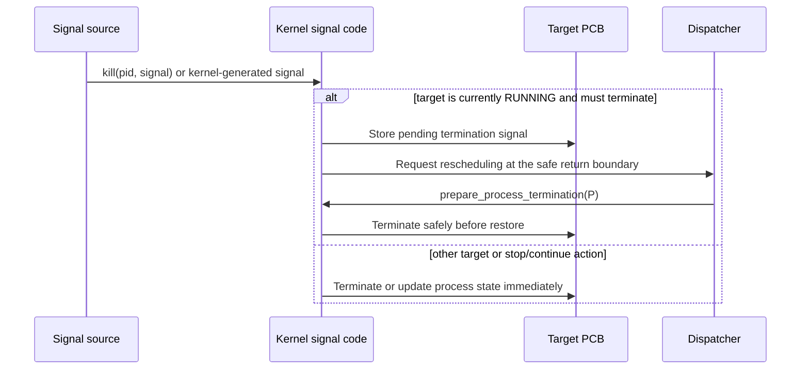

## 6.5 Signal function reference
[\[↑ TOC\]](#contents)

The table below covers signal validation, state changes, deferred termination,
and parent-death configuration. Terminal ownership functions appear with the
terminal subsystem that uses them.

| Kernel function | Return value / status | Effects | Calls | Called by |
| --- | --- | --- | --- | --- |
| [`send_signal_by_pid(request)`](kernel/signal.picoc#L107) | `0` on delivery/probe; `-1` for an invalid signal, missing PID, or zombie | Finds target; signal 0 only checks existence | [`signal_number_is_valid()`](kernel/signal.picoc#L13), [`find_process_by_pid()`](kernel/process/process.picoc#L162), [`send_signal_to_process()`](kernel/signal.picoc#L74) | **Library functions:** [`kill()`](library/signal/signal.picoc#L14)<br>**System calls:** via [`handle_syscall()`](kernel/syscall.picoc#L16) |
| [`set_parent_death_signal(request)`](kernel/signal.picoc#L136) | `0` on success; `-1` for an unsupported option or invalid signal | Changes current PCB parent-death setting | [`signal_number_is_valid()`](kernel/signal.picoc#L13), [`current_process()`](kernel/process/process.picoc#L62) | **Library functions:** [`prctl()`](library/sys/prctl/prctl.picoc#L14)<br>**System calls:** via [`handle_syscall()`](kernel/syscall.picoc#L16) |
|  |  |  |  |  |
| [`send_signal_to_process(process, signal_number)`](kernel/signal.picoc#L74) | Returns no value | Continues, stops, terminates, or defers running-target termination and requests a safe reschedule | [`signal_number_is_valid()`](kernel/signal.picoc#L13), [`continue_process()`](kernel/signal.picoc#L49), [`stop_process()`](kernel/signal.picoc#L36), [`current_process()`](kernel/process/process.picoc#L62), [`dispatcher_request_reschedule()`](kernel/dispatcher.picoc#L10), [`kill_process()`](kernel/signal.picoc#L70) | **Kernel functions:** [`begin_terminal_read()`](kernel/filesystem/terminal.picoc#L135), [`handle_terminal_signal_character()`](kernel/signal.picoc#L184), [`orphan_and_signal_children()`](kernel/process/process.picoc#L279), [`send_signal_by_pid()`](kernel/signal.picoc#L107) |
| [`kill_process(process, signal_number)`](kernel/signal.picoc#L70) | Returns no value | Calls the general termination path with that termination signal's status | [`terminate_process()`](kernel/process/process.picoc#L304) | **Kernel functions:** [`prepare_process_termination()`](kernel/signal.picoc#L125), [`send_signal_to_process()`](kernel/signal.picoc#L74) |
| [`stop_process(process, signal_number)`](kernel/signal.picoc#L36) | Returns no value | Saves signal/prior state, changes to [`STOPPED`](kernel/process/process.header#L16), reports to waiters | [`suspend_pending_terminal_read()`](kernel/filesystem/terminal.picoc#L76), [`notify_process_stopped()`](kernel/signal.picoc#L22) | **Kernel functions:** [`send_signal_to_process()`](kernel/signal.picoc#L74) |
| [`continue_process(process)`](kernel/signal.picoc#L49) | Returns no value | Resumes ordinary stops; a pending terminal read additionally requires input ownership | [`process_has_terminal_input()`](kernel/signal.picoc#L167), [`resume_pending_terminal_read()`](kernel/filesystem/terminal.picoc#L85) | **Kernel functions:** [`send_signal_to_process()`](kernel/signal.picoc#L74) |
| [`prepare_process_termination(process)`](kernel/signal.picoc#L125) | `true` when no termination is pending; `false` after applying deferred termination | Applies deferred termination | [`kill_process()`](kernel/signal.picoc#L70) | **Kernel functions:** [`dispatcher_start_next_process()`](kernel/dispatcher.picoc#L55) |

When a parent terminates, every direct child gets [`parent_pid`](kernel/process/process.header#L57) = 0. Zombie
children are removed; live children receive their configured parent-death
signal. New processes inherit [`parent_death_signal`](kernel/process/process.header#L59) from their parent, while
[`prctl(PR_SET_PDEATHSIG, 0)`](library/sys/prctl/prctl.picoc#L14) disables it before further inheritance. This is
part of [`terminate_process()`](kernel/process/process.picoc#L304), not a background reaper. Child status itself is
communicated through the exact-child [`waitpid()`](library/sys/wait/wait.picoc#L14) queue; there is no separate
child-exit notification signal.

## 6.6 Mutex locking with test-and-set and wait queues
[\[↑ TOC\]](#contents)

Userspace mutexes combine one lock cell with an embedded wait queue. Atomic
`TSL` changes the lock from 0 to 1 while returning the old value. A contending
process sleeps on the mutex queue instead of spinning; unlock clears the lock
and wakes one waiter.

The mutex is userspace data, not a kernel-heap object. In a shared-memory data
region, both its lock and queue are visible to all participants. The kernel
still owns the PCBs linked through that queue.


The implementation below shows how [`mutex_lock()`](library/mutex/mutex.picoc#L18) retries [`testset()`](library/mutex/mutex.picoc#L3) after
every wakeup. [`mutex_init()`](library/mutex/mutex.picoc#L12) must initialize both the lock and the embedded
queue before another process uses the object. These are the complete mutex
functions from [`library/mutex/mutex.picoc`](library/mutex/mutex.picoc):

```c
bool testset(bool *lock_addr) {
    int old;

    asm("LOADIN BAF IN2 3");
    asm("TSL IN2 ACC 0");
    asm("STOREIN BAF ACC 0");
    return old;
}

void mutex_init(struct mutex *m) {
    m->lock = false;
    wait_queue_init(&(m->waiters));
    return;
}

void mutex_lock(struct mutex *m) {
    while (testset(&(m->lock))) {
        sleep(&(m->waiters));
    }
    return;
}

void mutex_unlock(struct mutex *m) {
    m->lock = false;
    wakeup(&(m->waiters));
    return;
}
```

The attribute table identifies the two pieces of shared state; the library
function table then connects the operations above to the queue syscalls.

| Attribute | Meaning | Used by |
| --- | --- | --- |
| [`lock`](library/mutex/mutex.header#L7) | False when unlocked; `TSL` stores true and returns the old value | First initialized by [`mutex_init()`](library/mutex/mutex.picoc#L12); tested/set by [`testset()`](library/mutex/mutex.picoc#L3) from [`mutex_lock()`](library/mutex/mutex.picoc#L18); cleared by [`mutex_unlock()`](library/mutex/mutex.picoc#L25) |
| [`waiters`](library/mutex/mutex.header#L8) | Embedded FIFO of contending PCBs | First initialized by [`mutex_init()`](library/mutex/mutex.picoc#L12) through [`wait_queue_init()`](library/unistd/blocking.picoc#L4); passed to [`sleep()`](library/unistd/blocking.picoc#L9) and [`wakeup()`](library/unistd/blocking.picoc#L19) |

| Library function | Return value / status and purpose | Syscalls |
| --- | --- | --- |
| [`testset(lock_addr)`](library/mutex/mutex.picoc#L3) | Returns the previous lock value while atomically storing true | None; uses RETI `TSL` |
| [`mutex_init(m)`](library/mutex/mutex.picoc#L12) | No value; clears the lock and initializes the queue | None |
| [`mutex_lock(m)`](library/mutex/mutex.picoc#L18) | No value; returns after acquiring the lock, sleeping and retrying while it is held | 13 through [`sleep()`](library/unistd/blocking.picoc#L9) |
| [`mutex_unlock(m)`](library/mutex/mutex.picoc#L25) | No value; clears the lock and makes at most one waiter eligible | 14 through [`wakeup()`](library/unistd/blocking.picoc#L19) |

Only the `TSL` operation itself is atomic. The failed test and subsequent
[`sleep()`](library/unistd/blocking.picoc#L9) are separate: if the owner unlocks between them, the wakeup can occur
before the contender joins the queue. The current implementation can therefore
miss a wakeup under preemption. Also, waking a waiter does not hand it the lock;
it must acquire the lock again when scheduled. The earlier
[Scheduling and context switching](#5-scheduling-and-context-switching)
chapter explains how the scheduler and dispatcher choose when that retry runs.

## 6.7 Wait-queue function reference
[\[↑ TOC\]](#contents)

The functions below implement exact-child waiting and the intrusive queue
operations used by blocking calls, terminal reads, DMA, and mutexes. Syscall-backed
wait operations are listed before the shared queue helpers.

| Kernel function | Return value / status | Effects | Calls | Called by |
| --- | --- | --- | --- | --- |
| [`wait_for_process_by_pid(request, caller_context)`](kernel/process/process.picoc#L369) | Returns `true` after immediate status/error collection; blocking dispatch normally resumes userspace with saved `IN2 = 1` | Collects status or records the caller's status pointer and blocks it on a child queue | [`current_process()`](kernel/process/process.picoc#L62), [`find_process_by_pid()`](kernel/process/process.picoc#L162), [`remove_process()`](kernel/process/process.picoc#L209), [`sleep_on_wait_queue()`](kernel/process/process.picoc#L411) | **Library functions:** [`waitpid()`](library/sys/wait/wait.picoc#L14)<br>**System calls:** via [`handle_syscall()`](kernel/syscall.picoc#L16) |
|  |  |  |  |  |
| [`enqueue_current_process_on_wait_queue(queue)`](kernel/process/process.picoc#L396), [`sleep_on_wait_queue(queue, caller_context)`](kernel/process/process.picoc#L411), [`wakeup_wait_queue(queue)`](kernel/process/process.picoc#L416), [`remove_from_wait_queue(process)`](kernel/process/process.picoc#L176) | Enqueue/remove return no value; wake returns `false` for an empty queue and `true` after removing one waiter; sleep dispatches before resuming userspace | Maintain intrusive wait links and blocked/ready state | [`current_process()`](kernel/process/process.picoc#L62), [`enqueue_current_process_on_wait_queue()`](kernel/process/process.picoc#L396), [`dispatcher_switch_from_context()`](kernel/dispatcher.picoc#L71) | **Kernel functions:** [`begin_terminal_read()`](kernel/filesystem/terminal.picoc#L135), [`complete_pending_terminal_read()`](kernel/filesystem/terminal.picoc#L183), [`handle_dma_interrupt()`](kernel/dma.picoc#L40), [`handle_syscall()`](kernel/syscall.picoc#L16), [`notify_process_stopped()`](kernel/signal.picoc#L22), [`remove_process()`](kernel/process/process.picoc#L209), [`resume_pending_terminal_read()`](kernel/filesystem/terminal.picoc#L85), [`sleep_on_wait_queue()`](kernel/process/process.picoc#L411), [`start_dma_uart_receive()`](kernel/dma.picoc#L18), [`suspend_pending_terminal_read()`](kernel/filesystem/terminal.picoc#L76), [`wait_for_process_by_pid()`](kernel/process/process.picoc#L369), [`wake_parent_waiting_for_process()`](kernel/process/process.picoc#L261) |

# 7. Terminal, file descriptors, and host filesystem
[\[↑ TOC\]](#contents)

PicoOS does not store file contents in SRAM. The kernel manages process-local
descriptors, path normalization, terminal blocking, and UART requests, while
the emulator performs the host file operations. Building on the UART interrupt
handling described earlier, this chapter follows terminal input through
descriptor state to kernel devices and host-backed files.

## 7.1 Per-process file-descriptor table
[\[↑ TOC\]](#contents)

Each PCB owns one table object and one eight-entry array, both allocated with
[`kmalloc()`](kernel/kmalloc.picoc#L23). The declarations below show the table’s pointer and the
fields of each entry:

```c
struct FileDescriptor {
    int kind;
    int flags;
    int offset;
    char *path;
};

struct FileDescriptorTable {
    struct FileDescriptor *entries;
};
```

The field table below explains the state stored in each
[`FileDescriptor`](kernel/filesystem/file_descriptor.header#L14) and the array owned by
[`FileDescriptorTable.entries`](kernel/filesystem/file_descriptor.header#L22). Valid descriptor
numbers are 0–7, as defined by
[`FILE_DESCRIPTOR_COUNT`](kernel/filesystem/file_descriptor.header#L6). A new table initializes 0 as
read-only stdin, 1 as write-only stdout, and 2 as write-only stderr. All three store the special
path `/device/terminal.dev`. Entries 3–7 begin free, although closing a standard descriptor allows a
later open to reuse its number.

| Field | Meaning | Used by |
| --- | --- | --- |
| [`FileDescriptor.kind`](kernel/filesystem/file_descriptor.header#L15) | Free, initial stdin/stdout/stderr, or explicitly opened file/device | First initialized by [`initialize_file_descriptor()`](kernel/filesystem/file_descriptor.picoc#L24), called by [`create_file_descriptor_table()`](kernel/filesystem/file_descriptor.picoc#L35); read by [`read_file_descriptor()`](kernel/filesystem/filesystem.picoc#L150) and [`write_file_descriptor()`](kernel/filesystem/filesystem.picoc#L217) |
| [`FileDescriptor.flags`](kernel/filesystem/file_descriptor.header#L16) | Access mode plus create/truncate/append flags | First initialized by [`initialize_file_descriptor()`](kernel/filesystem/file_descriptor.picoc#L24); set by [`open_file_descriptor()`](kernel/filesystem/filesystem.picoc#L39); read by [`file_descriptor_can_read()`](kernel/filesystem/file_descriptor.picoc#L131) and [`file_descriptor_can_write()`](kernel/filesystem/file_descriptor.picoc#L137) |
| [`FileDescriptor.offset`](kernel/filesystem/file_descriptor.header#L17) | Logical regular-file position; regular reads and successful writes advance it | First initialized by [`initialize_file_descriptor()`](kernel/filesystem/file_descriptor.picoc#L24); changed by [`read_regular_file()`](kernel/filesystem/filesystem.picoc#L90), [`write_file_descriptor()`](kernel/filesystem/filesystem.picoc#L217), and [`seek_file_descriptor()`](kernel/filesystem/filesystem.picoc#L268) |
| [`FileDescriptor.path`](kernel/filesystem/file_descriptor.header#L18) | Kernel-owned absolute path; an exact special path selects a kernel device | First initialized to `NULL` by [`initialize_file_descriptor()`](kernel/filesystem/file_descriptor.picoc#L24); standard paths assigned by [`create_file_descriptor_table()`](kernel/filesystem/file_descriptor.picoc#L35); copied by [`copy_file_descriptor()`](kernel/filesystem/file_descriptor.picoc#L82) and freed by close/destruction |
| [`FileDescriptorTable.entries`](kernel/filesystem/file_descriptor.header#L22) | Owned eight-entry array of descriptor state | First allocated by [`create_file_descriptor_table()`](kernel/filesystem/file_descriptor.picoc#L35); copied by [`inherit_file_descriptors()`](kernel/filesystem/file_descriptor.picoc#L99), indexed by I/O, and freed by [`destroy_file_descriptor_table()`](kernel/filesystem/file_descriptor.picoc#L115) |

Descriptor inheritance deep-copies the table, entries, and paths. Offsets are copied by value and
later diverge; PicoOS has no Unix-style shared open-file descriptions. The terminal itself remains a
kernel singleton; only its special path is copied into each applicable descriptor.

[`dup2()`](library/unistd/io.picoc#L58) copies scalar fields and the path into an independent entry.
A source copy is allocated before the old target path is freed; duplicating a descriptor onto itself
leaves it unchanged. Closing frees the path and resets every field. Destroying a table frees all
paths, the entry array, and table, but never the global terminal.

## 7.2 Global terminal input buffer
[\[↑ TOC\]](#contents)

Terminal input does not live in each descriptor table. One global
[`Terminal`](kernel/filesystem/terminal.header#L9) instance,
[`terminal`](kernel/filesystem/terminal.picoc#L12), is stored directly in kernel `.data`. The
declaration and field table below show the ring buffer and its reader queue, which are shared by all
descriptors that name this device:

```c
struct Terminal {
    char input_buffer[TERMINAL_INPUT_BUFFER_CAPACITY];
    int input_head;
    int input_tail;
    int input_count;
    struct wait_queue input_waiters;
};
```

| Field | Meaning | Used by |
| --- | --- | --- |
| [`Terminal.input_buffer`](kernel/filesystem/terminal.header#L10) | Embedded ring storage; no [`kmalloc()`](kernel/kmalloc.picoc#L23) allocation | First written by [`enqueue_terminal_byte()`](kernel/filesystem/terminal.picoc#L49); read by [`pop_terminal_byte()`](kernel/filesystem/terminal.picoc#L26) (only occupied cells are meaningful) |
| [`Terminal.input_head`](kernel/filesystem/terminal.header#L11) | Index of next byte to consume | First initialized by [`initialize_terminal()`](kernel/filesystem/terminal.picoc#L14); advanced by [`pop_terminal_byte()`](kernel/filesystem/terminal.picoc#L26) and by [`enqueue_terminal_byte()`](kernel/filesystem/terminal.picoc#L49) when full |
| [`Terminal.input_tail`](kernel/filesystem/terminal.header#L12) | Index of next insertion | First initialized by [`initialize_terminal()`](kernel/filesystem/terminal.picoc#L14); advanced by [`enqueue_terminal_byte()`](kernel/filesystem/terminal.picoc#L49) |
| [`Terminal.input_count`](kernel/filesystem/terminal.header#L13) | Distinguishes full from empty when indices match | First initialized by [`initialize_terminal()`](kernel/filesystem/terminal.picoc#L14); read and changed by [`enqueue_terminal_byte()`](kernel/filesystem/terminal.picoc#L49), [`copy_terminal_bytes()`](kernel/filesystem/terminal.picoc#L35), and [`pop_terminal_byte()`](kernel/filesystem/terminal.picoc#L26) |
| [`Terminal.input_waiters`](kernel/filesystem/terminal.header#L14) | Generic blocking queue containing the active foreground reader while it waits for input | First initialized by [`initialize_terminal()`](kernel/filesystem/terminal.picoc#L14); [`begin_terminal_read()`](kernel/filesystem/terminal.picoc#L135) and [`resume_pending_terminal_read()`](kernel/filesystem/terminal.picoc#L85) queue readers; completion/suspension remove them |

The PicoC compiler does not implement usable `extern` variable declarations, so other kernel files
cannot declare [`terminal`](kernel/filesystem/terminal.picoc#L12) directly.
[`kernel_terminal()`](kernel/filesystem/terminal.picoc#L22) provides the pointer to the single
global instance instead. When the ring is full, a new byte discards the oldest. A read copies as
many available bytes as possible and need not fill the requested count.

Callers retrieve this pointer once and pass it to terminal helpers. This avoids extra
[`kernel_terminal()`](kernel/filesystem/terminal.picoc#L22) calls when one helper invokes another.

The descriptor layer reaches this object through the virtual device paths described below. They skip
host-file requests, unlike ordinary paths.

## 7.3 Blocking and completing terminal reads
[\[↑ TOC\]](#contents)

The global ring returns available input immediately. When it is empty, the
kernel preserves the request in the reading PCB and uses the dispatcher and
UART handler to complete it later.

If the input ring is empty during a foreground read,
[`begin_terminal_read()`](kernel/filesystem/terminal.picoc#L135) briefly disables UART delivery to
prevent a lost wakeup, stores buffer/count in the current PCB, enqueues it on
[`input_waiters`](kernel/filesystem/terminal.header#L14), restores UART routing, and dispatches. A
later UART ISR resolves the current input owner, copies bytes into that process's request, stores
the result in [`process->activation.in2`](kernel/process/process.header#L23), clears its pending
state, and wakes it.

The shell transfers [`terminal_input_process_id`](kernel/signal.picoc#L11) between itself and one
foreground child. Because there is only one input owner, at most that active reader belongs in
[`input_waiters`](kernel/filesystem/terminal.header#L14); a stop signal detaches it from the queue.
The queue is still useful for the normal block/wakeup and process-removal machinery, but it does not
choose among stopped jobs. Per-process pending-read fields remain necessary because every stopped
reader must retain the userspace destination and requested count until the shell later selects it
with `fg`.

The sequence below shows [`begin_terminal_read()`](kernel/filesystem/terminal.picoc#L135) for a
foreground process: its request is stored in the PCB before dispatch, and
[`handle_uart_interrupt()`](kernel/filesystem/terminal.picoc#L214) calls
[`complete_pending_terminal_read()`](kernel/filesystem/terminal.picoc#L183) to make that specific
reader ready. Background reads instead stop with [`SIGTTIN`](common/signal.header#L9), as explained
under [Foreground processes, background processes, and job-control signals](#126-foreground-processes-background-processes-and-job-control-signals).

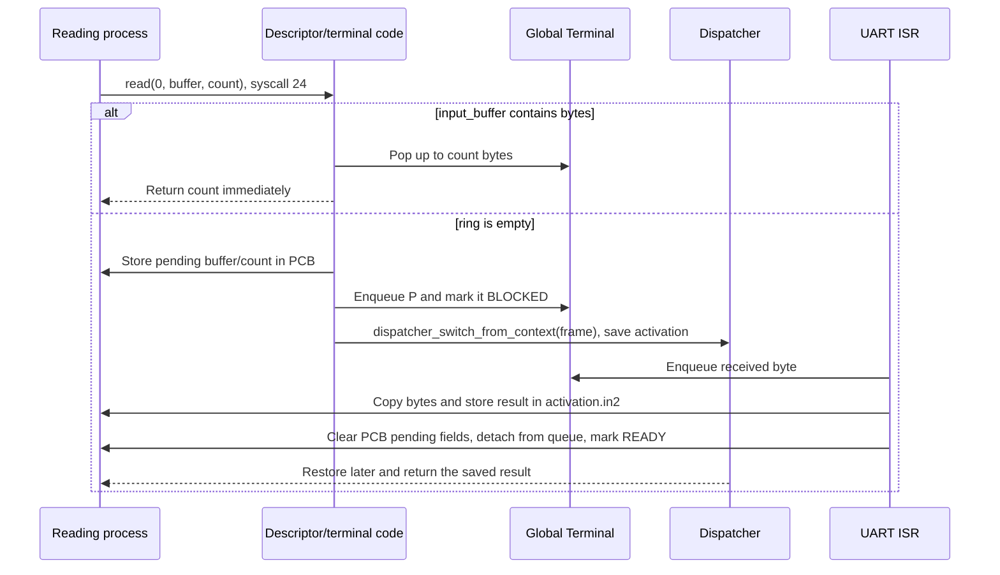

## 7.4 Foreground input ownership and terminal-generated signals
[\[↑ TOC\]](#contents)

Only one process owns terminal input, and control bytes target the current
foreground process rather than entering the ordinary input ring. The following
rules connect ownership changes, stopped reads, and signal delivery.

Raw-terminal `Ctrl+C` and `Ctrl+Z` arrive as UART bytes 3 and 26. The UART ISR
consumes them before ring-buffer insertion and resolves
[`foreground_process_id`](kernel/signal.picoc#L10); byte 3 sends [`SIGINT`](common/signal.header#L4), while byte 26 sends
[`SIGTSTP`](common/signal.header#L8). The shell changes this global before and after foreground waiting,
so background work does not receive prompt-time terminal signals.

A terminal [`read()`](library/unistd/io.picoc#L6) first checks [`terminal_input_process_id`](kernel/signal.picoc#L11). If the caller is
not the input owner, the kernel retains its buffer/count in the PCB and sends
it [`SIGTTIN`](common/signal.header#L9) before the read can consume buffered input or claim the terminal
wait queue. Input arrival does not select or continue any [`SIGTTIN`](common/signal.header#L9)-stopped
process. The shell explicitly chooses its tracked job with `fg`, assigns
foreground ownership first, and then sends [`SIGCONT`](common/signal.header#L6). Only then can the read
consume buffered input or join the terminal wait queue until a byte arrives.
A background [`SIGCONT`](common/signal.header#L6) leaves any pending terminal read stopped with
[`SIGTTIN`](common/signal.header#L9), including a read that originally stopped through [`SIGSTOP`](common/signal.header#L7) or
[`SIGTSTP`](common/signal.header#L8). This resume path briefly masks UART delivery around its ring check
and queue insertion to prevent a lost wakeup.

The terminal-specific kernel functions below select the owner and translate
control bytes into signals. Their effects are kept here because they govern
terminal state rather than general signal validation.

| Kernel function | Return value / status | Effects | Calls | Called by |
| --- | --- | --- | --- | --- |
| [`set_foreground_process(pid)`](kernel/signal.picoc#L147) | `0` for PID 0 or an existing direct child; `-1` otherwise | PID 0 clears the foreground signal target and returns input ownership to the caller; a child PID sets both owner globals | [`current_process()`](kernel/process/process.picoc#L62), [`find_process_by_pid()`](kernel/process/process.picoc#L162) | **Library functions:** [`set_foreground_process()`](library/unistd/process.picoc#L63)<br>**System calls:** via [`handle_syscall()`](kernel/syscall.picoc#L16) |
|  |  |  |  |  |
| [`continue_process(process)`](kernel/signal.picoc#L49) | Returns no value | Resumes ordinary stops; a pending terminal read additionally requires input ownership | [`process_has_terminal_input()`](kernel/signal.picoc#L167), [`resume_pending_terminal_read()`](kernel/filesystem/terminal.picoc#L85) | **Kernel functions:** [`send_signal_to_process()`](kernel/signal.picoc#L74) |
| [`process_has_terminal_input(process)`](kernel/signal.picoc#L167) | `true` only for the input-owning PCB | Checks terminal-input ownership | — | **Kernel functions:** [`begin_terminal_read()`](kernel/filesystem/terminal.picoc#L135), [`continue_process()`](kernel/signal.picoc#L49) |
| [`terminal_input_process(void)`](kernel/signal.picoc#L171) | Input-owning PCB or current PCB fallback | Resolves the input owner | [`find_process_by_pid()`](kernel/process/process.picoc#L162), [`current_process()`](kernel/process/process.picoc#L62) | **Kernel functions:** [`handle_uart_interrupt()`](kernel/filesystem/terminal.picoc#L214) |
| [`handle_terminal_signal_character(value)`](kernel/signal.picoc#L184) | `true` when it consumed `Ctrl+C`/`Ctrl+Z`; otherwise `false` | Maps terminal control bytes to foreground signals | [`find_process_by_pid()`](kernel/process/process.picoc#L162), [`send_signal_to_process()`](kernel/signal.picoc#L74) | **Kernel functions:** [`handle_uart_interrupt()`](kernel/filesystem/terminal.picoc#L214) |

## 7.5 Virtual terminal and null-device paths
[\[↑ TOC\]](#contents)

The two special paths in the table below name kernel-provided devices. Other paths, including other
names under `/device`, use normal host-file I/O. The release tree has matching marker files in
[`binary/device/`](binary/device/) so the paths are visible to users; those files hold no device
data and are not the device implementations.
[`device_paths_match()`](kernel/filesystem/device.picoc#L3) compares the complete normalized path
with the special device paths, so a relative runtime-tree marker path does not automatically select
the device.

| Device path | Role | Used by |
| --- | --- | --- |
| `/device/terminal.dev` | The terminal device. It is the initial path for standard input, output, and error; reads use the global terminal input ring and may block, writes go to UART output, and seeking fails. | [`create_file_descriptor_table()`](kernel/filesystem/file_descriptor.picoc#L35), [`open_file_descriptor()`](kernel/filesystem/filesystem.picoc#L39), [`read_file_descriptor()`](kernel/filesystem/filesystem.picoc#L150), [`write_file_descriptor()`](kernel/filesystem/filesystem.picoc#L217), [`seek_file_descriptor()`](kernel/filesystem/filesystem.picoc#L268) |
| `/device/null.dev` | The null device. Reads return EOF immediately, writes report success after discarding their bytes, and seeking fails. | [`open_file_descriptor()`](kernel/filesystem/filesystem.picoc#L39), [`read_file_descriptor()`](kernel/filesystem/filesystem.picoc#L150), [`write_file_descriptor()`](kernel/filesystem/filesystem.picoc#L217), [`seek_file_descriptor()`](kernel/filesystem/filesystem.picoc#L268) |

## 7.6 File-descriptor creation, inheritance, duplication, and cleanup
[\[↑ TOC\]](#contents)

The table below collects descriptor-lifecycle operations. I/O operations that
consume these entries are documented separately afterward.

| Kernel function | Return value / status | Effects | Calls | Called by |
| --- | --- | --- | --- | --- |
| [`close_file_descriptor(file_descriptor)`](kernel/filesystem/file_descriptor.picoc#L143) | `0` on close; `-1` for an invalid descriptor | Frees path and resets selected entry | [`current_process()`](kernel/process/process.picoc#L62), [`file_descriptor_is_valid()`](kernel/filesystem/file_descriptor.picoc#L126), [`kfree()`](kernel/kmalloc.picoc#L38), [`initialize_file_descriptor()`](kernel/filesystem/file_descriptor.picoc#L24) | **Library functions:** [`close()`](library/unistd/io.picoc#L54), [`fclose()`](library/stdio/stdio.picoc#L155)<br>**System calls:** via [`handle_syscall()`](kernel/syscall.picoc#L16) |
| [`duplicate_file_descriptor(request)`](kernel/filesystem/file_descriptor.picoc#L160) | Target descriptor; `-1` for out-of-range descriptors or a free source; panics on allocation failure | Replaces target with an independent copy | [`current_process()`](kernel/process/process.picoc#L62), [`file_descriptor_is_valid()`](kernel/filesystem/file_descriptor.picoc#L126), [`copy_file_descriptor()`](kernel/filesystem/file_descriptor.picoc#L82) | **Library functions:** [`dup2()`](library/unistd/io.picoc#L58)<br>**System calls:** via [`handle_syscall()`](kernel/syscall.picoc#L16) |
|  |  |  |  |  |
| [`create_file_descriptor_table(void)`](kernel/filesystem/file_descriptor.picoc#L35) | New table; panics if kernel allocation fails | Allocates table/entries and gives standard descriptors terminal paths | [`kmalloc()`](kernel/kmalloc.picoc#L23), [`initialize_file_descriptor()`](kernel/filesystem/file_descriptor.picoc#L24), [`copy_file_path()`](kernel/filesystem/file_descriptor.picoc#L6) | **Kernel functions:** [`create_process()`](kernel/process/process.picoc#L89), [`inherit_file_descriptors()`](kernel/filesystem/file_descriptor.picoc#L99) |
| [`inherit_file_descriptors(source)`](kernel/filesystem/file_descriptor.picoc#L99) | Independent table copy; panics if kernel allocation fails | Deep-copies entries and paths | [`create_file_descriptor_table()`](kernel/filesystem/file_descriptor.picoc#L35), [`copy_file_descriptor()`](kernel/filesystem/file_descriptor.picoc#L82) | **Kernel functions:** [`mark_process_ready_with_arguments()`](kernel/process/process_arguments.picoc#L241) |
| [`destroy_file_descriptor_table(table)`](kernel/filesystem/file_descriptor.picoc#L115) | Returns no value | Frees paths, entry array, and table | [`kfree()`](kernel/kmalloc.picoc#L38) | **Kernel functions:** [`mark_process_ready_with_arguments()`](kernel/process/process_arguments.picoc#L241), [`remove_process()`](kernel/process/process.picoc#L209) |
| [`file_descriptor_is_valid(file_descriptor)`](kernel/filesystem/file_descriptor.picoc#L126) | `true` for descriptor 0–7, including a currently free entry; otherwise `false` | Reads fixed descriptor-number range | — | **Kernel functions:** [`close_file_descriptor()`](kernel/filesystem/file_descriptor.picoc#L143), [`duplicate_file_descriptor()`](kernel/filesystem/file_descriptor.picoc#L160), [`read_file_descriptor()`](kernel/filesystem/filesystem.picoc#L150), [`seek_file_descriptor()`](kernel/filesystem/filesystem.picoc#L268), [`write_file_descriptor()`](kernel/filesystem/filesystem.picoc#L217) |
| [`file_descriptor_can_read(descriptor)`](kernel/filesystem/file_descriptor.picoc#L131), [`file_descriptor_can_write(descriptor)`](kernel/filesystem/file_descriptor.picoc#L137) | Boolean access permission | Read descriptor access bits | — | **Kernel functions:** [`read_file_descriptor()`](kernel/filesystem/filesystem.picoc#L150), [`write_file_descriptor()`](kernel/filesystem/filesystem.picoc#L217) |
| [`is_terminal_device_path(path)`](kernel/filesystem/device.picoc#L16), [`is_null_device_path(path)`](kernel/filesystem/device.picoc#L12), [`is_device_path(path)`](kernel/filesystem/device.picoc#L20) | Boolean path classification | Recognize kernel device paths | [`device_paths_match()`](kernel/filesystem/device.picoc#L3), [`is_null_device_path()`](kernel/filesystem/device.picoc#L12), [`is_terminal_device_path()`](kernel/filesystem/device.picoc#L16) | **Kernel functions:** [`is_device_path()`](kernel/filesystem/device.picoc#L20), [`open_file_descriptor()`](kernel/filesystem/filesystem.picoc#L39), [`read_file_descriptor()`](kernel/filesystem/filesystem.picoc#L150), [`seek_file_descriptor()`](kernel/filesystem/filesystem.picoc#L268), [`write_file_descriptor()`](kernel/filesystem/filesystem.picoc#L217) |

## 7.7 Terminal-buffer and pending-read function reference
[\[↑ TOC\]](#contents)

The following functions maintain the global input ring and the request saved
while a terminal reader is blocked or stopped.

| Kernel function | Return value / status | Effects | Calls | Called by |
| --- | --- | --- | --- | --- |
| [`initialize_terminal(void)`](kernel/filesystem/terminal.picoc#L14) | Returns no value | Resets global ring and reader queue | — | **Kernel functions:** [`main()`](kernel/kernel.picoc#L31) |
| [`kernel_terminal(void)`](kernel/filesystem/terminal.picoc#L22) | Pointer to the global terminal | No mutation | — | **Kernel functions:** [`handle_uart_interrupt()`](kernel/filesystem/terminal.picoc#L214), [`read_file_descriptor()`](kernel/filesystem/filesystem.picoc#L150), [`resume_pending_terminal_read()`](kernel/filesystem/terminal.picoc#L85), [`suspend_pending_terminal_read()`](kernel/filesystem/terminal.picoc#L76) |
| [`pop_terminal_byte(terminal)`](kernel/filesystem/terminal.picoc#L26) | Next byte; caller must ensure the ring is nonempty | Advances head and decrements count | — | **Kernel functions:** [`copy_terminal_bytes()`](kernel/filesystem/terminal.picoc#L35) |
| [`copy_terminal_bytes(terminal, buffer, count)`](kernel/filesystem/terminal.picoc#L35) | Number of bytes copied | Pops terminal bytes into a process buffer | [`pop_terminal_byte()`](kernel/filesystem/terminal.picoc#L26) | **Kernel functions:** [`begin_terminal_read()`](kernel/filesystem/terminal.picoc#L135), [`complete_pending_terminal_read()`](kernel/filesystem/terminal.picoc#L183), [`resume_pending_terminal_read()`](kernel/filesystem/terminal.picoc#L85) |
| [`enqueue_terminal_byte(terminal, value)`](kernel/filesystem/terminal.picoc#L49) | Returns no value | Inserts at tail and may discard the oldest byte | — | **Kernel functions:** [`handle_uart_interrupt()`](kernel/filesystem/terminal.picoc#L214) |
| [`suspend_pending_terminal_read(process)`](kernel/filesystem/terminal.picoc#L76) | Returns no value | Detaches a stopped reader from active terminal waiters while retaining its PCB request | [`kernel_terminal()`](kernel/filesystem/terminal.picoc#L22), [`remove_from_wait_queue()`](kernel/process/process.picoc#L176) | **Kernel functions:** [`stop_process()`](kernel/signal.picoc#L36) |
| [`begin_terminal_read(terminal, buffer, count, caller_context)`](kernel/filesystem/terminal.picoc#L135) | Immediate count, or a saved result on later resumption after blocking/stopping | Reads ring or fills pending fields, queues PCB, saves activation, and dispatches | [`current_process()`](kernel/process/process.picoc#L62), [`process_has_terminal_input()`](kernel/signal.picoc#L167), [`send_signal_to_process()`](kernel/signal.picoc#L74), [`dispatcher_switch_from_context()`](kernel/dispatcher.picoc#L71), [`periphery_read_register()`](kernel/periphery.picoc#L5), [`interrupt_controller_disable_device()`](kernel/interrupt_controller.picoc#L23), [`interrupt_controller_assign_device()`](kernel/interrupt_controller.picoc#L59), [`copy_terminal_bytes()`](kernel/filesystem/terminal.picoc#L35), [`enqueue_current_process_on_wait_queue()`](kernel/process/process.picoc#L396) | **Kernel functions:** [`read_file_descriptor()`](kernel/filesystem/filesystem.picoc#L150) |
| [`resume_pending_terminal_read(process)`](kernel/filesystem/terminal.picoc#L85) | Returns no value | With UART delivery temporarily disabled, fills a stopped foreground reader’s buffer immediately or requeues it; sets [`Process.stopped_from_state`](kernel/process/process.header#L62) for continuation | [`kernel_terminal()`](kernel/filesystem/terminal.picoc#L22), [`periphery_read_register()`](kernel/periphery.picoc#L5), [`interrupt_controller_disable_device()`](kernel/interrupt_controller.picoc#L23), [`copy_terminal_bytes()`](kernel/filesystem/terminal.picoc#L35), [`remove_from_wait_queue()`](kernel/process/process.picoc#L176), [`interrupt_controller_assign_device()`](kernel/interrupt_controller.picoc#L59), [`enqueue_terminal_reader()`](kernel/filesystem/terminal.picoc#L62) | **Kernel functions:** [`continue_process()`](kernel/signal.picoc#L49) |
| [`complete_pending_terminal_read(process, terminal)`](kernel/filesystem/terminal.picoc#L183) | Returns no value | Copies input, writes saved [`activation.in2`](kernel/process/process.header#L23), clears pending fields, and marks the selected reader ready | [`copy_terminal_bytes()`](kernel/filesystem/terminal.picoc#L35), [`remove_from_wait_queue()`](kernel/process/process.picoc#L176) | **Kernel functions:** [`handle_uart_interrupt()`](kernel/filesystem/terminal.picoc#L214) |
| [`handle_uart_interrupt(void)`](kernel/filesystem/terminal.picoc#L214) | Returns no value | Acknowledges byte, signals target, or mutates terminal/reader PCB | [`terminal_input_process()`](kernel/signal.picoc#L171), [`kernel_terminal()`](kernel/filesystem/terminal.picoc#L22), [`periphery_read_register()`](kernel/periphery.picoc#L5), [`periphery_write_register()`](kernel/periphery.picoc#L11), [`handle_terminal_signal_character()`](kernel/signal.picoc#L184), [`enqueue_terminal_byte()`](kernel/filesystem/terminal.picoc#L49), [`complete_pending_terminal_read()`](kernel/filesystem/terminal.picoc#L183) | **Hardware interrupts:** UART receive via [`uart_interrupt()`](interrupt_service_routines/os_isrs.picoc#L195) |

## 7.8 Opening, reading, writing, and seeking
[\[↑ TOC\]](#contents)

Once a descriptor entry exists, its flags and offset determine how the kernel
performs I/O. The flag table explains how [`OpenRequest.flags`](common/file.header#L28) selects access and
creation behavior. Those choices remain in
[`FileDescriptor.flags`](kernel/filesystem/file_descriptor.header#L16) and govern later I/O.

| Flag | Meaning in [`OpenRequest.flags`](common/file.header#L28) |
| --- | --- |
| [`O_RDONLY`](common/file.header#L9), [`O_WRONLY`](common/file.header#L10), [`O_RDWR`](common/file.header#L11) | Two-bit access mode checked by later read/write calls |
| [`O_CREAT`](common/file.header#L13) | Allows a missing path to be created |
| [`O_TRUNC`](common/file.header#L14) | With writable access, sends `<ESC>write path<ESC>/` during open to create/empty the file |
| [`O_APPEND`](common/file.header#L15) | Makes each regular-file write request the current file size and use it as its write offset |

[`open_file_descriptor()`](kernel/filesystem/filesystem.picoc#L39) normalizes a path against the
current PCB’s working directory, selects the lowest free descriptor, allocates an absolute path
copy, and fills that entry. [`O_TRUNC`](common/file.header#L14) with a writable mode asks the host
to create/truncate immediately. Without [`O_TRUNC`](common/file.header#L14), a missing file is
created only with [`O_CREAT`](common/file.header#L13). The `/device/terminal.dev` and
`/device/null.dev` paths bypass these host-file operations and open their kernel devices directly.

[`read_file_descriptor()`](kernel/filesystem/filesystem.picoc#L150) validates the entry and read
mode. A descriptor whose path is `/device/terminal.dev` reads from the kernel terminal and may
block. A read from `/device/null.dev` returns EOF. Any other file path sends independent ranged host
requests of at most 1 KiB at [`descriptor->offset`](kernel/filesystem/file_descriptor.header#L17),
copies returned bytes, and advances the offset. The userspace [`read()`](library/unistd/io.picoc#L6)
wrapper repeats syscall 24 until the requested count, EOF, or an error. If an error follows
successful chunks, it returns the count already transferred; it returns `-1` only when nothing was
read. It does not need to yield between chunks because deferred timer requests are consumed when
each syscall returns.

[`write_file_descriptor()`](kernel/filesystem/filesystem.picoc#L217) validates write mode. Stdout
sends bytes directly. Stderr temporarily selects host stderr. A regular file sends
`write-at <offset> <path>`, sends the requested bytes, restores stdout, and advances its offset.
For binary-safe [`write()`](library/unistd/io.picoc#L32),
[`write_uart_bytes()`](kernel/filesystem/filesystem.picoc#L195) checks its buffer for `<ESC>` before
transmission. If it finds one, it sends `literal-output <count>`, so the emulator treats exactly
that many following bytes as data. [`cat.bin`](user/cat.picoc) therefore needs no configuration or
special environment variable: its existing [`write()`](library/unistd/io.picoc#L32) calls remain
safe for arbitrary file contents.

[`write_without_uart_escape_check()`](library/unistd/io.picoc#L43) is the explicit fast path for buffers already known
not to contain `<ESC>`. It clears
[`IoRequest.protect_uart_control`](common/file.header#L35), so
[`write_uart_bytes()`](kernel/filesystem/filesystem.picoc#L195) sends the buffer without first
scanning it. This per-call choice avoids a [`getenv()`](library/stdlib/env.picoc#L115) lookup in the
write path and prevents an inherited process-wide setting from accidentally disabling protection
for unrelated binary output. Callers must use [`write()`](library/unistd/io.picoc#L32) whenever a
buffer may contain `<ESC>`.

Without [`O_APPEND`](common/file.header#L15), the descriptor offset selects where bytes overwrite
the file, so seeking affects both reads and writes. With [`O_APPEND`](common/file.header#L15), the
kernel requests the current file size immediately before every write and uses that as the offset,
regardless of an earlier seek. An explicitly opened `/device/terminal.dev` writes directly to
terminal stdout. Writes to `/device/null.dev` report success without sending their bytes anywhere.
Seeking is rejected for both devices.

The `file-size` and `write-at` requests are separate, so concurrent modification of one host file by
multiple PicoOS processes or host programs is unsupported: another writer could change the size
between the two requests. The kernel function table below distinguishes descriptor validation,
offset changes, and terminal blocking. Host creation and writing send commands without an
acknowledgment, so their return values cannot report every host-side failure.

| Kernel function | Return value / status | Effects | Calls | Called by |
| --- | --- | --- | --- | --- |
| [`open_file_descriptor(request)`](kernel/filesystem/filesystem.picoc#L39) | Descriptor, or `-1` for invalid path/mode, no free entry, or a missing file without create/truncate | Allocates a path and changes a free entry to a file or device | [`current_process()`](kernel/process/process.picoc#L62), [`free_file_descriptor()`](kernel/filesystem/filesystem.picoc#L27), [`build_process_path()`](kernel/filesystem/host_filesystem.picoc#L92), [`copy_file_path()`](kernel/filesystem/file_descriptor.picoc#L6), [`is_device_path()`](kernel/filesystem/device.picoc#L20), [`kfree()`](kernel/kmalloc.picoc#L38), [`uart_send_host_request()`](common/uart_protocol.picoc#L82), [`file_exists()`](kernel/filesystem/filesystem.picoc#L18) | **Library functions:** [`open()`](library/fcntl/fcntl.picoc#L5), [`fopen()`](library/stdio/stdio.picoc#L125)<br>**System calls:** via [`handle_syscall()`](kernel/syscall.picoc#L16) |
| [`read_file_descriptor(request, caller_context)`](kernel/filesystem/filesystem.picoc#L150) | Count, `0` at EOF, or `-1` for an invalid request, unreadable descriptor, or failed host range request | Advances regular-file offset, or changes terminal queue/activation state | [`current_process()`](kernel/process/process.picoc#L62), [`file_descriptor_is_valid()`](kernel/filesystem/file_descriptor.picoc#L126), [`file_descriptor_can_read()`](kernel/filesystem/file_descriptor.picoc#L131), [`is_terminal_device_path()`](kernel/filesystem/device.picoc#L16), [`begin_terminal_read()`](kernel/filesystem/terminal.picoc#L135), [`kernel_terminal()`](kernel/filesystem/terminal.picoc#L22), [`is_null_device_path()`](kernel/filesystem/device.picoc#L12), [`read_regular_file()`](kernel/filesystem/filesystem.picoc#L90) | **Library functions:** [`read()`](library/unistd/io.picoc#L6), [`fgetc()`](library/stdio/stdio.picoc#L178)<br>**System calls:** via [`handle_syscall()`](kernel/syscall.picoc#L16) |
| [`write_file_descriptor(request)`](kernel/filesystem/filesystem.picoc#L217) | Count, or `-1` for an invalid/unwritable descriptor or failed append-size request | Routes UART output, applies the request's [`IoRequest.protect_uart_control`](common/file.header#L35) choice, and advances the regular-file offset | [`current_process()`](kernel/process/process.picoc#L62), [`file_descriptor_is_valid()`](kernel/filesystem/file_descriptor.picoc#L126), [`file_descriptor_can_write()`](kernel/filesystem/file_descriptor.picoc#L137), [`is_null_device_path()`](kernel/filesystem/device.picoc#L12), [`is_terminal_device_path()`](kernel/filesystem/device.picoc#L16), [`uart_send_host_request()`](common/uart_protocol.picoc#L82), [`receive_file_size()`](kernel/filesystem/filesystem.picoc#L13), [`uart_send_file_write_command()`](common/uart_protocol.picoc#L102), [`write_uart_bytes()`](kernel/filesystem/filesystem.picoc#L195) | **Library functions:** [`write()`](library/unistd/io.picoc#L32), [`write_without_uart_escape_check()`](library/unistd/io.picoc#L43), [`fputc()`](library/stdio/stdio.picoc#L204), [`fputs()`](library/stdio/stdio.picoc#L229)<br>**System calls:** via [`handle_syscall()`](kernel/syscall.picoc#L16)<br>**Kernel functions:** [`write_process_exception_message()`](kernel/exception.picoc#L29), [`list_processes()`](kernel/process/process.picoc#L32) |
| [`seek_file_descriptor(request)`](kernel/filesystem/filesystem.picoc#L268) | New offset, or `-1` for invalid descriptor/origin/device/negative result | Replaces a regular-file descriptor offset | [`current_process()`](kernel/process/process.picoc#L62), [`file_descriptor_is_valid()`](kernel/filesystem/file_descriptor.picoc#L126), [`is_device_path()`](kernel/filesystem/device.picoc#L20), [`receive_file_size()`](kernel/filesystem/filesystem.picoc#L13) | **Library functions:** [`lseek()`](library/unistd/io.picoc#L66)<br>**System calls:** via [`handle_syscall()`](kernel/syscall.picoc#L16) |
|  |  |  |  |  |
| [`write_uart_bytes(buffer, count, protect_uart_control)`](kernel/filesystem/filesystem.picoc#L195) | Returns no value | When protection is enabled, scans for `<ESC>` and starts a counted literal-output region if found; then sends exactly `count` bytes to the selected host destination | [`uart_send_literal_output_command()`](common/uart_protocol.picoc#L112), [`uart_print_character()`](common/uart_protocol.picoc#L21) | **Kernel functions:** [`write_file_descriptor()`](kernel/filesystem/filesystem.picoc#L217) |

The sequence diagram follows one regular-file [`read()`](library/unistd/io.picoc#L6) through
[`read_file_descriptor()`](kernel/filesystem/filesystem.picoc#L150) and
[`read_regular_file()`](kernel/filesystem/filesystem.picoc#L90). Each syscall returns one chunk; the
wrapper owns [`IoRequest.transferred`](common/file.header#L37) and decides when to return the
combined count to its caller.

```mermaid
sequenceDiagram
    participant C as Application caller
    participant A as Userspace read wrapper
    participant K as Kernel descriptor code
    participant U as Kernel UART helpers
    participant E as RETI-Emulator
    participant H as Host filesystem

    C->>A: read(fd, buffer, count)
    loop Until count, EOF, or error
        A->>K: read chunk, syscall 24 with IoRequest
        K->>K: Validate descriptor and remaining count
        K->>U: Request at most 1 KiB at descriptor.offset
        U->>E: ESC read-range offset chunk-count absolute-path ESC /
        E->>H: Open, seek, and read the bounded range
        H-->>E: Returned data
        E-->>U: Big-endian returned count and bytes
        U->>K: Copy at buffer + transferred
        K->>K: Advance descriptor offset, update completion/progress fields
        K-->>A: Chunk count and completion flag
        A->>A: Add chunk count to transferred
    end
    A-->>C: Combined count, or -1 if the first chunk failed
```

## 7.9 PicoOS paths, working directories, and host operations
[\[↑ TOC\]](#contents)

The emulator's startup directory is PicoOS `/`. The launchers start it inside
[`binary/`](binary/) or the extracted release directory, so `/kernel`, `/boot`, `/system`,
`/user`, `/config`, and `/device` refer to directories there. Host `/tmp` is not mounted, and
root listings have no artificial `tmp` entry. A PicoOS path `/tmp` refers only to an ordinary
`tmp` directory inside the runtime, if one has been created.

All UART filesystem commands use this boundary, including binary loading, reads, writes, directory
listing, and moves. `..` stops at `/`. The emulator does not follow symlinks or Windows junctions
and does not open hard-linked or special host files. The guest root cannot be removed or renamed
through its PicoOS paths. Explicit emulator command-line inputs, such as boot assembly and debug metadata,
still use host paths.

Every PCB owns a kernel-heap absolute PicoOS working-directory string. PID 1 starts at `/`.
A child receives its own copy of the parent’s current string. Changing directory validates a normalized path with the host
before freeing the old copy and installing the new one. It never changes the emulator process’s
actual working directory.

Path normalization starts at `/`, prepends the current PCB directory for a relative path when a
process is running, removes repeated separators and `.`, resolves `..` without moving above root,
and enforces [`PATH_MAX`](common/file.header#L21). The table below shows which functions only copy
kernel state and which request host validation or file operations.

| Kernel function | Return value / status | Effects | Calls | Called by |
| --- | --- | --- | --- | --- |
| [`get_working_directory(request)`](kernel/filesystem/host_filesystem.picoc#L156) | `0` on success; `-1` when the stored directory is missing or the destination capacity is too small | Copies the PCB directory into the caller buffer | [`copy_working_directory()`](kernel/filesystem/host_filesystem.picoc#L135), [`current_process()`](kernel/process/process.picoc#L62) | **Library functions:** [`getcwd()`](library/unistd/working_directory.picoc#L11)<br>**System calls:** via [`handle_syscall()`](kernel/syscall.picoc#L16) |
| [`change_working_directory(path)`](kernel/filesystem/host_filesystem.picoc#L163) | `0` on success; `-1` for an invalid path or host failure | Validates host directory and replaces current PCB string | [`build_process_path()`](kernel/filesystem/host_filesystem.picoc#L92), [`uart_send_host_request()`](common/uart_protocol.picoc#L82), [`receive_word()`](common/uart_protocol.picoc#L7), [`set_process_working_directory()`](kernel/filesystem/host_filesystem.picoc#L128), [`current_process()`](kernel/process/process.picoc#L62) | **Library functions:** [`chdir()`](library/unistd/working_directory.picoc#L4)<br>**System calls:** via [`handle_syscall()`](kernel/syscall.picoc#L16) |
| [`make_host_directory(path)`](kernel/filesystem/host_filesystem.picoc#L177) | `0` on success; `-1` on invalid path or host failure | Normalizes and sends `mkdir`; no kernel table mutation | [`build_process_path()`](kernel/filesystem/host_filesystem.picoc#L92), [`uart_send_host_request()`](common/uart_protocol.picoc#L82), [`receive_word()`](common/uart_protocol.picoc#L7) | **Library functions:** [`mkdir()`](library/sys/stat/stat.picoc#L5)<br>**System calls:** via [`handle_syscall()`](kernel/syscall.picoc#L16) |
| [`read_host_directory(request)`](kernel/filesystem/host_filesystem.picoc#L187) | Listing count, or `-1` for invalid request/host failure | Writes host listing into caller buffer | [`build_process_path()`](kernel/filesystem/host_filesystem.picoc#L92), [`uart_send_host_request()`](common/uart_protocol.picoc#L82), [`uart_receive_string()`](kernel/filesystem/host_filesystem.picoc#L10) | **Library functions:** [`readdir()`](library/dirent/dirent.picoc#L40)<br>**System calls:** via [`handle_syscall()`](kernel/syscall.picoc#L16) |
| [`unlink_host_file(path)`](kernel/filesystem/host_filesystem.picoc#L208), [`remove_host_directory(path)`](kernel/filesystem/host_filesystem.picoc#L212) | `0` on success; `-1` on invalid path or host failure | Send bounded host unlink/rmdir requests | [`request_host_path_operation()`](kernel/filesystem/host_filesystem.picoc#L198) | **Library functions:** [`unlink()`](library/unistd/file_removal.picoc#L4), [`rmdir()`](library/unistd/file_removal.picoc#L8)<br>**System calls:** via [`handle_syscall()`](kernel/syscall.picoc#L16) |
| [`move_host_path(request)`](kernel/filesystem/host_filesystem.picoc#L216) | `0` on success; `-1` on invalid path or host failure | Normalizes both paths and sends a two-path move request to the emulator | [`build_process_path()`](kernel/filesystem/host_filesystem.picoc#L92), [`uart_print_character()`](common/uart_protocol.picoc#L21), [`uart_print_string()`](common/uart_protocol.picoc#L73), [`receive_word()`](common/uart_protocol.picoc#L7) | **Library functions:** [`move()`](library/unistd/file_removal.picoc#L12)<br>**System calls:** via [`handle_syscall()`](kernel/syscall.picoc#L16) |
| [`touch_host_file(path)`](kernel/filesystem/host_filesystem.picoc#L234) | `0` on success; `-1` on invalid path or host failure | Sends a touch request to create a host file or update its timestamps | [`request_host_path_operation()`](kernel/filesystem/host_filesystem.picoc#L198) | **Library functions:** [`touch()`](library/unistd/file_removal.picoc#L20)<br>**System calls:** via [`handle_syscall()`](kernel/syscall.picoc#L16) |
|  |  |  |  |  |
| [`build_process_path(path, result, capacity)`](kernel/filesystem/host_filesystem.picoc#L92) | `true` on a nonempty normalized path that fits; otherwise `false` | Writes an absolute PicoOS path; relative input starts from the current PCB directory, or from `/` before the first process exists | [`append_path_segments()`](kernel/filesystem/host_filesystem.picoc#L37), [`current_process()`](kernel/process/process.picoc#L62) | **Kernel functions:** [`begin_process_load()`](kernel/process/process_loader.picoc#L109), [`change_working_directory()`](kernel/filesystem/host_filesystem.picoc#L163), [`load_process()`](kernel/process/process_loader.picoc#L305), [`make_host_directory()`](kernel/filesystem/host_filesystem.picoc#L177), [`move_host_path()`](kernel/filesystem/host_filesystem.picoc#L216), [`open_file_descriptor()`](kernel/filesystem/filesystem.picoc#L39), [`read_host_directory()`](kernel/filesystem/host_filesystem.picoc#L187), [`request_host_path_operation()`](kernel/filesystem/host_filesystem.picoc#L198) |
| [`system_relative_path(path)`](kernel/filesystem/host_filesystem.picoc#L121) | Pointer to the input path or the text after its leading `/` | Removes the leading `/` for program names and loading labels | — | **Kernel functions:** [`begin_process_load()`](kernel/process/process_loader.picoc#L109), [`finish_process_load()`](kernel/process/process_loader.picoc#L90), [`list_processes()`](kernel/process/process.picoc#L32), [`load_process()`](kernel/process/process_loader.picoc#L305) |
| [`set_process_working_directory(process, path)`](kernel/filesystem/host_filesystem.picoc#L128) | Returns no value | Allocates a new kernel copy, frees old string, and replaces PCB pointer | [`copy_process_path()`](kernel/process/process.picoc#L70), [`kfree()`](kernel/kmalloc.picoc#L38) | **Kernel functions:** [`change_working_directory()`](kernel/filesystem/host_filesystem.picoc#L163) |

The sequence contrasts [`chdir()`](library/unistd/working_directory.picoc#L4), which calls
[`change_working_directory()`](kernel/filesystem/host_filesystem.picoc#L163) and validates with the
host, with [`getcwd()`](library/unistd/working_directory.picoc#L11), which only copies stored state
through [`get_working_directory()`](kernel/filesystem/host_filesystem.picoc#L156). The kernel
returns a status integer; the [`getcwd()`](library/unistd/working_directory.picoc#L11) wrapper
converts success to the caller’s buffer pointer.

```mermaid
sequenceDiagram
    participant P as Process/library wrapper
    participant K as Kernel path code
    participant PCB as Current PCB
    participant E as RETI-Emulator host service

    P->>K: chdir(path), syscall 30
    K->>PCB: Read current working_directory for relative normalization
    K->>E: ESC is-directory absolute-path ESC /
    E-->>K: 0 or failure
    alt directory exists
        K->>PCB: kmalloc new path, kfree old path, replace pointer
        K-->>P: 0
    else invalid directory
        K-->>P: -1 without changing PCB
    end
    P->>K: getcwd(buffer, size), syscall 31
    K->>PCB: Copy stored working_directory without a host request
    K-->>P: 0, getcwd wrapper returns buffer
```

# 8. Userspace libraries
[\[↑ TOC\]](#contents)

Public interfaces live under [`library`](library/); structures and constants
shared with the kernel live under [`common`](common/); kernel-private
structures remain under [`kernel`](kernel/). The complete syscall ABI and its
request structures are documented under [System-call ABI](#24-system-call-abi), while
this chapter organizes the public wrappers and pure userspace facilities.

## 8.1 Library overview and dependencies
[\[↑ TOC\]](#contents)

The directory table groups all **14 libraries** by their facilities; the directory-stream and
directory-creation row represents two distinct libraries. The repository also contains **12 library
test classes**, each a top-level PicoC program in [`test`](test/), covering strings, environment,
allocation, formatting, and scanning. Their standalone execution is described in the
[test-system chapter](#14-test-system).

| Directory | Main facilities |
| --- | --- |
| [`library/unistd`](library/unistd/) | Binary-safe [`write()`](library/unistd/io.picoc#L32), explicit no-scan [`write_without_uart_escape_check()`](library/unistd/io.picoc#L43), read/close/dup2/lseek, directories, process load/run/unload, PID, sleep/wakeup |
| [`library/fcntl`](library/fcntl/) | Open/create and descriptor flags |
| [`library/sys/wait`](library/sys/wait/) | Exact-child [`waitpid()`](library/sys/wait/wait.picoc#L14) and stopped-status test |
| [`library/schedule`](library/schedule/) | Voluntary [`yield()`](library/schedule/schedule.picoc#L4) |
| [`library/mutex`](library/mutex/) | Atomic test-and-set mutex with wait queue |
| [`library/signal`](library/signal/) | Signal delivery through [`kill()`](library/signal/signal.picoc#L14) |
| [`library/sys/prctl`](library/sys/prctl/) | Parent-death signal |
| [`library/sys/mman`](library/sys/mman/) | Named shared memory |
| [`library/dirent`](library/dirent/) and [`library/sys/stat`](library/sys/stat/) | Directory streams and creation |
| [`library/stdlib`](library/stdlib/) | Userspace heap, environment, conversion, and exit |
| [`library/string`](library/string/) | Basic memory/string functions |
| [`library/stdio`](library/stdio/) | Descriptor-backed streams and small format/scan subset |
| [`library/start`](library/start/) | Heap/environment initialization and application [`main`](library/start/start.picoc#L4) |

Low-level wrappers package request structures and invoke `INT 0`. Pure userspace string,
environment, formatting, and heap code does not call the kernel until it needs I/O or a process
service.

## 8.2 Process, descriptor, waiting, and scheduling wrappers
[\[↑ TOC\]](#contents)

The table maps process, descriptor, and scheduling wrappers to their syscall selectors. Queue
initialization and status inspection operate directly on userspace data and therefore need no
syscall.

| Library function | Return value / status and purpose | Syscalls |
| --- | --- | --- |
| [`load(path)`](library/unistd/process.picoc#L17) | PID, or 0; repeats bounded syscall 2 transfers and creates a `NEW` process | 2, [`LoadProcessRequest`](common/syscall.header#L51) |
| [`run(pid, arguments, environment)`](library/unistd/process.picoc#L31) | Whether a `NEW` process was initialized and made `READY`; `NULL` environment means current [`environ`](library/stdlib/env.picoc#L4) | 3, [`RunProcessRequest`](common/syscall.header#L56) |
| [`unload(pid)`](library/unistd/process.picoc#L47) | Whether a non-current target was terminated/removed | 5, PID directly |
| [`list_processes(void)`](library/unistd/process.picoc#L51) | Prints all known PIDs and binary paths | 4, no request |
| [`getpid(void)`](library/unistd/process.picoc#L55) | Current PCB’s PID | 8, no request |
| [`reset_processes(void)`](library/unistd/process.picoc#L59) | Test hook that removes non-system processes and resets related state | 9, no request |
| [`set_foreground_process(pid)`](library/unistd/process.picoc#L63) | 0 or `-1`; gives terminal input/signals to a direct child, or back to the shell for PID 0 | 10, PID directly |
| [`read(file_descriptor, buffer, count)`](library/unistd/io.picoc#L6) | Number read or `-1`; repeats bounded regular-file chunks and may block on stdin | 24, [`IoRequest`](common/file.header#L31) |
| [`write(file_descriptor, buffer, count)`](library/unistd/io.picoc#L32) | Number written or `-1`; protects arbitrary data from UART control parsing | 25, [`IoRequest`](common/file.header#L31) |
| [`write_without_uart_escape_check(file_descriptor, buffer, count)`](library/unistd/io.picoc#L43) | Number written or `-1`; skips the UART `<ESC>` scan and requires a buffer known not to contain `<ESC>` | 25, [`IoRequest`](common/file.header#L31) |
| [`close(file_descriptor)`](library/unistd/io.picoc#L54) | 0 or `-1`; releases the descriptor entry's path/state | 26, descriptor directly |
| [`dup2(old_file_descriptor, new_file_descriptor)`](library/unistd/io.picoc#L58) | New descriptor or `-1`; independently copies the entry | 28, [`Dup2Request`](common/file.header#L48) |
| [`lseek(file_descriptor, offset, origin)`](library/unistd/io.picoc#L66) | New logical offset or `-1` | 27, [`SeekRequest`](common/file.header#L42) |
| [`chdir(path)`](library/unistd/working_directory.picoc#L4) | 0 or `-1`; replaces current PCB working-directory string | 30, path pointer directly |
| [`getcwd(buffer, size)`](library/unistd/working_directory.picoc#L11) | Buffer or `NULL` | 31, [`GetCwdRequest`](common/syscall.header#L84) |
| [`unlink(path)`](library/unistd/file_removal.picoc#L4) | Host status for removing a file | 34, path pointer directly |
| [`rmdir(path)`](library/unistd/file_removal.picoc#L8) | Host status for removing an empty directory | 35, path pointer directly |
| [`move(old_path, new_path)`](library/unistd/file_removal.picoc#L12) | Host status for moving or renaming a file or directory | 36, [`MoveRequest`](common/syscall.header#L95) |
| [`touch(path)`](library/unistd/file_removal.picoc#L20) | Host status for creating a file or updating its timestamps | 37, path pointer directly |
| [`wait_queue_init(wq)`](library/unistd/blocking.picoc#L4) | Initializes embedded [`wait_queue.head`](common/wait_queue.header#L6)/[`wait_queue.tail`](common/wait_queue.header#L7) locally | No syscall |
| [`sleep(wq)`](library/unistd/blocking.picoc#L9) | Blocks caller on the intrusive queue | 13, queue pointer directly |
| [`wakeup(wq)`](library/unistd/blocking.picoc#L19) | Wakes at most the FIFO head | 14, queue pointer directly |
| [`open(path, flags)`](library/fcntl/fcntl.picoc#L5) | Lowest free descriptor or `-1` | 23, [`OpenRequest`](common/file.header#L26) |
| [`creat(path)`](library/fcntl/fcntl.picoc#L13) | Equivalent to write/create/truncate open | Calls [`open()`](library/fcntl/fcntl.picoc#L5) and therefore syscall 23 |
| [`waitpid(pid)`](library/sys/wait/wait.picoc#L14) | Exact child's exit/stopped status, or `-1` | 7, [`WaitPidRequest`](common/syscall.header#L62); may suspend its stack frame |
| [`WIFSTOPPED(status)`](library/sys/wait/wait.picoc#L25) | Whether status represents [`SIGSTOP`](common/signal.header#L7), [`SIGTSTP`](common/signal.header#L8), or [`SIGTTIN`](common/signal.header#L9) | No syscall |
| [`yield(void)`](library/schedule/schedule.picoc#L4) | Voluntarily saves the current activation and schedules | 15, no request |

[`invoke_syscall(number, argument)`](library/unistd/process.picoc#L7) is the common assembly bridge
used by most of these wrappers. It is an implementation helper, not an additional kernel operation:
the [`number`](library/unistd/process.picoc#L7) already identifies the real syscall and
[`argument`](library/unistd/process.picoc#L7) becomes `IN1`.

## 8.3 Signals, process control, shared memory, and mutexes
[\[↑ TOC\]](#contents)

The table connects signal and shared-memory wrappers to kernel operations. The mutex functions
combine an atomic userspace instruction with the blocking and wakeup syscalls described under
[Mutex locking with test-and-set and wait queues](#66-mutex-locking-with-test-and-set-and-wait-queues).

| Library function | Return value / status and purpose | Syscalls |
| --- | --- | --- |
| [`kill(pid, signal_number)`](library/signal/signal.picoc#L14) | 0 or `-1`; signal 0 only probes existence | 11, [`KillRequest`](common/syscall.header#L67) |
| [`prctl(option, argument)`](library/sys/prctl/prctl.picoc#L14) | 0 or `-1`; supports [`PR_SET_PDEATHSIG`](common/prctl.header#L3) | 12, [`PrctlRequest`](common/syscall.header#L72) |
| [`shm_open(name, size)`](library/sys/mman/mman.picoc#L15) | Existing/new shared-memory ID or `-1` | 19, [`ShmOpenRequest`](common/syscall.header#L79) |
| [`mmap(shared_memory_id)`](library/sys/mman/mman.picoc#L23) | Shared absolute address or `NULL`; creates a PCB attachment | 20, ID directly |
| [`shm_unlink(name)`](library/sys/mman/mman.picoc#L27) | 0 or `-1`; removes name and requests deferred destruction | 21, name pointer directly |
| [`testset(lock_addr)`](library/mutex/mutex.picoc#L3) | Atomically writes 1 and returns the old lock value | No syscall; one RETI `TSL` instruction |
| [`mutex_init(m)`](library/mutex/mutex.picoc#L12) | Clears lock and initializes embedded wait queue | No syscall |
| [`mutex_lock(m)`](library/mutex/mutex.picoc#L18) | Acquires lock; contenders block instead of spinning | Uses [`testset()`](library/mutex/mutex.picoc#L3) and syscall 13 through [`sleep()`](library/unistd/blocking.picoc#L9) |
| [`mutex_unlock(m)`](library/mutex/mutex.picoc#L25) | Clears lock and wakes one contender | Uses syscall 14 through [`wakeup()`](library/unistd/blocking.picoc#L19) |

[`kill()`](library/signal/signal.picoc#L14) builds [`KillRequest`](common/syscall.header#L67) as a
local in the caller's userspace stack and passes its address synchronously to syscall 11. The kernel
validates the signal and PID during that call and does not retain the request pointer. A
self-directed [`SIGINT`](common/signal.header#L4) or [`SIGKILL`](common/signal.header#L5) stores
[`pending_termination_signal`](kernel/process/process.header#L63) and can return from the syscall
before termination is applied. At the next scheduling pass, including a deferred timer request at
syscall return, the dispatcher consumes that value and does not restore the process again.

[`struct mutex`](library/mutex/mutex.header#L6) contains a one-cell Boolean and a complete
[`struct wait_queue`](common/wait_queue.header#L5). It is normal userspace data, not a kernel
allocation. Placing it in a shared memory region lets all participating processes see both the lock
cell and the queue object; the queue still links kernel-owned PCBs.

## 8.4 Directory streams and directory creation
[\[↑ TOC\]](#contents)

The declarations below show why a directory stream needs no kernel descriptor:
[`DirectoryStream`](library/dirent/dirent.header#L14) owns a listing buffer and reuses one embedded
[`dirent`](library/dirent/dirent.header#L9) for each parsed result.

```c
struct dirent {
    int d_type;
    char d_name[DIRENT_NAME_MAX];
};

struct DirectoryStream {
    char *contents;
    int length;
    int offset;
    struct dirent entry;
};
```

[`DIR`](library/dirent/dirent.header#L21) is a userspace heap object.
[`contents`](library/dirent/dirent.header#L15) points to a separately allocated 512-cell listing,
[`length`](library/dirent/dirent.header#L16) is the returned host listing length,
[`offset`](library/dirent/dirent.header#L17) is the next record, and embedded
[`entry`](library/dirent/dirent.header#L18) is overwritten by every
[`readdir()`](library/dirent/dirent.picoc#L40) call. Neither object is stored in the PCB or kernel
descriptor table. The field table identifies who first fills each value and who consumes it; in
particular, the embedded entry is first populated when a record is read.

| Field | Meaning | Used by |
| --- | --- | --- |
| [`DirectoryStream.contents`](library/dirent/dirent.header#L15) | Owned 512-cell listing buffer | First allocated by [`opendir()`](library/dirent/dirent.picoc#L8) and filled by [`read_host_directory()`](kernel/filesystem/host_filesystem.picoc#L187); parsed by [`readdir()`](library/dirent/dirent.picoc#L40) and freed by [`closedir()`](library/dirent/dirent.picoc#L66) |
| [`DirectoryStream.length`](library/dirent/dirent.header#L16) | Received listing length, excluding its terminator | First initialized by [`opendir()`](library/dirent/dirent.picoc#L8); bounds reads in [`readdir()`](library/dirent/dirent.picoc#L40) |
| [`DirectoryStream.offset`](library/dirent/dirent.header#L17) | Position of the next listing record | First initialized to 0 by [`opendir()`](library/dirent/dirent.picoc#L8); advanced by [`readdir()`](library/dirent/dirent.picoc#L40) |
| [`DirectoryStream.entry`](library/dirent/dirent.header#L18) | Embedded result reused for each directory entry | First populated by [`readdir()`](library/dirent/dirent.picoc#L40); its returned pointer stays valid only while the stream exists and its contents change on the next read |
| [`dirent.d_type`](library/dirent/dirent.header#L10) | Directory or regular-file type | First initialized by [`readdir()`](library/dirent/dirent.picoc#L40) from the record’s leading character |
| [`dirent.d_name`](library/dirent/dirent.header#L11) | Terminated name, limited to 127 characters | First initialized by [`readdir()`](library/dirent/dirent.picoc#L40); long names are truncated |

The function table below shows that only opening needs a host listing request; subsequent reads
parse the stored listing, and closing releases both allocations.

| Library function | Return value / status and purpose | Syscalls |
| --- | --- | --- |
| [`opendir(path)`](library/dirent/dirent.picoc#L8) | Stream pointer, or `NULL` for an invalid path/listing failure; allocates stream and buffer | 33, [`ReadDirectoryRequest`](common/syscall.header#L89); also uses [`malloc()`](library/stdlib/malloc.picoc#L35) |
| [`readdir(directory)`](library/dirent/dirent.picoc#L40) | Pointer to the reused [`entry`](library/dirent/dirent.header#L18), or `NULL` at end/for a null stream | No syscall |
| [`closedir(directory)`](library/dirent/dirent.picoc#L66) | `0` after freeing buffer/stream; `-1` for a null stream | No syscall |
| [`mkdir(path)`](library/sys/stat/stat.picoc#L5) | `0` on success; `-1` on invalid path or host failure | 32, path pointer directly |

## 8.5 Process heap, environment, strings, and exit
[\[↑ TOC\]](#contents)

Beyond syscall wrappers, each linked process contains its own global
[`Heap`](common/heap.header#L11) descriptor,
[`process_heap`](library/stdlib/malloc.picoc#L6), and [`environ`](library/stdlib/env.picoc#L4) in
that process's `.data`; these are not shared kernel globals. Environment arrays and `NAME=value`
strings are allocated inside the process heap. The table below separates these local operations from
heap setup and termination, which need kernel services.

| Library function | Return value / status and purpose | Syscalls |
| --- | --- | --- |
| [`init_process_heap(void)`](library/stdlib/malloc.picoc#L18) | Initializes [`process_heap`](library/stdlib/malloc.picoc#L6) over the PCB-described region | Syscalls 16 and 17 obtain absolute heap start and size |
| [`malloc(size)`](library/stdlib/malloc.picoc#L35) | First-fit allocation from [`process_heap`](library/stdlib/malloc.picoc#L6) | Pure userspace unless positive allocation fails, then syscall 18 terminates the process |
| [`realloc(ptr, size)`](library/stdlib/malloc.picoc#L42) | Resize/move using the shared heap implementation | Same failure policy as [`malloc()`](library/stdlib/malloc.picoc#L35) |
| [`free(ptr)`](library/stdlib/malloc.picoc#L49) | Releases and coalesces a process-heap block | No syscall |
| [`atoi(text)`](library/stdlib/atoi.picoc#L4) | Converts optional sign and decimal characters | No syscall |
| [`getenv(name)`](library/stdlib/env.picoc#L115) | Pointer to value within matching `NAME=value` string, or `NULL` | No syscall |
| [`current_environment(void)`](library/stdlib/env.picoc#L6) | Current process-global [`environ`](library/stdlib/env.picoc#L4) pointer | No syscall |
| [`setenv(name, value, overwrite)`](library/stdlib/env.picoc#L126) | Allocates/replaces one owned environment string | No syscall |
| [`unsetenv(name)`](library/stdlib/env.picoc#L157) | Frees one string and compacts pointer array | No syscall |
| [`putenv(variable)`](library/stdlib/env.picoc#L174) | Copies and stores one `NAME=value` entry | No syscall |
| [`clearenv(void)`](library/stdlib/env.picoc#L194) | Frees all strings but retains an empty array | No syscall |
| [`clone_environment(void)`](library/stdlib/env.picoc#L205) | Deep process-heap copy used by shell tests | No syscall |
| [`destroy_environment(environment)`](library/stdlib/env.picoc#L230) | Frees a cloned array and its strings | No syscall |
| [`restore_environment(environment)`](library/stdlib/env.picoc#L243) | Clears and recreates current [`environ`](library/stdlib/env.picoc#L4) from a clone | No syscall |
| [`exit(status)`](library/stdlib/exit.picoc#L3) | Terminates current process and does not normally return | Syscall 6, status directly |
| [`strcpy(destination, source)`](library/string/string.picoc#L4), [`strcat(destination, source)`](library/string/string.picoc#L16) | Copy/append terminated strings | No syscall |
| [`strcmp(left, right)`](library/string/string.picoc#L34), [`strncmp(left, right, count)`](library/string/string.picoc#L44), [`strlen(string)`](library/string/string.picoc#L60) | Compare strings or count cells before `NUL` | No syscall |

## 8.6 Standard I/O, formatting, and scanning
[\[↑ TOC\]](#contents)

The declaration below shows that a [`PicoFile`](library/stdio/stdio.header#L3) stores only a
descriptor number. The function table then traces these stream operations to the descriptor ABI.

```c
struct PicoFile {
    int file_descriptor;
};
```

The process has three global standard stream objects, five global
[`fopen`](library/stdio/stdio.picoc#L125) slots, a five-cell used/free array, and pointers used by
the [`stdin`](library/stdio/stdio.header#L9), [`stdout`](library/stdio/stdio.header#L10), and
[`stderr`](library/stdio/stdio.header#L11) macros. A [`FILE`](library/stdio/stdio.header#L7)
contains only a descriptor—there is no userspace buffer, EOF flag, error flag, or shared open-file
object. [`scanf()`](library/stdio/scanf.picoc#L112) separately uses the process-global
[`has_unread_input`](library/stdio/scanf.picoc#L4) and
[`unread_input`](library/stdio/scanf.picoc#L5) cells as a one-character pushback slot. The field
table shows how stream preparation and opening supply the descriptor used by later I/O.

| Field | Meaning | Used by |
| --- | --- | --- |
| [`PicoFile.file_descriptor`](library/stdio/stdio.header#L4) | Entry number in the current process’s descriptor table | First initialized by [`prepare_standard_streams()`](library/stdio/stdio.picoc#L45) for standard streams and [`fopen()`](library/stdio/stdio.picoc#L125) for extra streams; used by [`fgetc()`](library/stdio/stdio.picoc#L178), [`fputc()`](library/stdio/stdio.picoc#L204), [`fputs()`](library/stdio/stdio.picoc#L229), and [`fclose()`](library/stdio/stdio.picoc#L155) |

The function table connects stream selection, formatting, and scanning to the syscalls that
eventually perform the I/O.

| Library function | Return value / status and purpose | Syscalls |
| --- | --- | --- |
| [`standard_input(void)`](library/stdio/stdio.picoc#L79), [`standard_output(void)`](library/stdio/stdio.picoc#L84), [`standard_error(void)`](library/stdio/stdio.picoc#L89) | Addresses of the three process-global stream objects | Syscall 22 only on lazy first preparation |
| [`fopen(path, mode)`](library/stdio/stdio.picoc#L125) | One of five stream slots or `NULL`; supports `r`, `w`, `a`, and `+` | 23, [`OpenRequest`](common/file.header#L26) after mode-to-flag conversion |
| [`fclose(stream)`](library/stdio/stdio.picoc#L155) | `0` on close, or `-1` for an invalid stream/descriptor; releases an extra stream slot | 26, descriptor directly |
| [`fgetc(stream)`](library/stdio/stdio.picoc#L178) | Read character or `-1` | 24 with [`IoRequest`](common/file.header#L31); standalone stdin may use test-only UART selector 38 |
| [`fputc(character, stream)`](library/stdio/stdio.picoc#L204) | Written character or `-1` | 25 with [`IoRequest`](common/file.header#L31); standalone stdout may use direct UART syscall 29 |
| [`fputs(text, stream)`](library/stdio/stdio.picoc#L229) | Written count or `-1` | 25 with [`IoRequest`](common/file.header#L31), or repeated syscall 29 in fallback mode |
| [`fprintf(stream, format, ...)`](library/stdio/stdio.picoc#L346) | Written count or `-1` | Formatting is userspace; output reduces to [`fputc()`](library/stdio/stdio.picoc#L204)/[`fputs()`](library/stdio/stdio.picoc#L229) |
| [`printf(format, ...)`](library/stdio/stdio.picoc#L354) | Written count or `-1` to [`stdout`](library/stdio/stdio.header#L10) | Same as [`fprintf()`](library/stdio/stdio.picoc#L346) |
| [`scanf(format, ...)`](library/stdio/scanf.picoc#L112) | Number of assigned arguments | Input reduces to [`fgetc(stdin)`](library/stdio/stdio.picoc#L178) |

The legacy UART fallbacks support standalone library and compiler tests linked with
`isrs.reti` from [`isrs.picoc`](interrupt_service_routines/isrs.picoc), allowing those tests to use
[`printf()`](library/stdio/stdio.picoc#L354) and [`scanf()`](library/stdio/scanf.picoc#L112) without
linking and booting the complete PicoOS kernel. PicoOS detects descriptor support through syscall
22, then uses descriptor-backed standard I/O. The test-only receive selector 38 is outside the
kernel's continuous 0–37 range.

Formatting supports `%d`, `%c`, `%s`, and `%%`; scanning supports `%d`, `%c`, `%s`, literal
characters, and whitespace matching.

The [System V ABI stack-frame section](#113-system-v-abi-stack-frames-and-call-cleanup)
gives the exact `BAF`-relative locations used by the variadic formatting
functions.


## 8.7 Library organization, scope, and limitations
[\[↑ TOC\]](#contents)

An umbrella unit such as [`libstdio.picoc`](library/stdio/libstdio.picoc) includes its
implementation parts, while `// dependencies:` records the separately compiled `.reti_blocks` units
needed at link time. The compiler links these libraries with the program and selects custom startup
through `-C`. This connects ordinary-looking PicoC headers/calls to the compiler’s
[separate compilation and linking](#112-separate-compilation-reusable-artifacts-and-linking).

The libraries intentionally remain small: values and sizes use RETI cells, streams are unbuffered
descriptor wrappers, only five extra [`FILE`](library/stdio/stdio.header#L7) slots exist,
formatting/scanning support a few conversions, [`waitpid()`](library/sys/wait/wait.picoc#L14) has no
options, and the POSIX-like names do not promise POSIX corner cases. The request-structure ABI keeps
the interrupt interface compact and visible at the cost of trusting pointers in the single physical
address space.

# 9. Kernel storage, ownership, and object lifetimes
[\[↑ TOC\]](#contents)

The kernel mechanisms above depend on where each object lives, which object
owns it, and when it can be released. This chapter brings those rules together
for processes, descriptors, wait queues, allocators, and shared memory, using
the structures already introduced in the preceding chapters.

## 9.1 Storage regions, allocation sources, and lifetimes
[\[↑ TOC\]](#contents)

The most important implementation distinction is not the C type but where an
object lives and who releases it. “The process table,” for example, is not one
allocated table. It is a set of global list pointers plus separately allocated
PCB nodes. The table below separates static, embedded, kernel-heap, and
process-memory storage so readers can see which operation releases each object.

| Object | Where it lives | Allocation | Main access path | Lifetime |
| --- | --- | --- | --- | --- |
| Process-list head/tail/current/PID counter | Kernel `.data` globals | Static | [`first_process()`](kernel/process/process.picoc#L28), [`current_process()`](kernel/process/process.picoc#L62), [`find_process_by_pid()`](kernel/process/process.picoc#L162) | Whole kernel run |
| One [`struct Process`](kernel/process/process.header#L31) PCB | Kernel heap | [`kmalloc()`](kernel/kmalloc.picoc#L23) | Linked from [`process_list_head`](kernel/process/process.picoc#L16) | Load until removal/reaping |
| Process image: code, data, userspace heap, stack | Process-memory arena | [`pmalloc()`](kernel/pmalloc.picoc#L20) | PCB [`base_address`](kernel/process/process.header#L34) and absolute pointers | Load until PCB removal |
| Process activation | Embedded in PCB | Part of PCB | [`process->activation`](kernel/process/process.header#L40) | Same as PCB |
| Pending process load | Kernel heap plus reserved process-memory region | [`kmalloc()`](kernel/kmalloc.picoc#L23) and [`pmalloc()`](kernel/pmalloc.picoc#L20) | Loading PCB [`pending_load`](kernel/process/process.header#L68) | Until completion, failure, or loader removal |
| Binary path and working directory | Kernel heap | [`kmalloc()`](kernel/kmalloc.picoc#L23) copies | PCB pointers | Same as PCB, replaceable directory |
| File-descriptor table and entry array | Kernel heap | [`kmalloc()`](kernel/kmalloc.picoc#L23) | [`current_process()`](kernel/process/process.picoc#L62) → [`file_descriptors`](kernel/process/process.header#L42) | Same as PCB |
| Regular-file descriptor path | Kernel heap | [`kmalloc()`](kernel/kmalloc.picoc#L23) copy | Descriptor [`path`](kernel/filesystem/file_descriptor.header#L18) | Close, replacement, or PCB removal |
| Kernel terminal and 128-cell ring | Kernel `.data` global | Static | [`kernel_terminal()`](kernel/filesystem/terminal.picoc#L22) | Whole kernel run |
| Wait-queue object | Embedded in PCB, terminal, or userspace mutex; DMA queue is a kernel global | No queue allocation | Owner field/address, or [`dma_waiters`](kernel/dma.picoc#L6) | Same as owner; DMA queue lasts for the kernel run |
| Shared-memory list head and next ID | Kernel `.data` globals | Static | Internal find helpers | Whole kernel run |
| Shared-memory entry/name | Kernel heap | [`kmalloc()`](kernel/kmalloc.picoc#L23) | Registry linked list | Until unlinked and unused |
| Shared-memory data region | Process-memory arena | [`pmalloc()`](kernel/pmalloc.picoc#L20) | Entry [`address`](kernel/shared_memory.header#L11) | Until entry destruction |
| Per-process shared-memory attachment | Kernel heap | [`kmalloc()`](kernel/kmalloc.picoc#L23) | PCB attachment list | Mapping until process removal |
| Kernel/process-memory heap descriptors | Kernel `.data` globals | Static | [`kmalloc()`](kernel/kmalloc.picoc#L23)/[`pmalloc()`](kernel/pmalloc.picoc#L20) | Whole kernel run |
| Heap block headers | Inside managed heap region | Written by allocator | Linked from [`struct Heap`](common/heap.header#L11) | Split/merged dynamically |
| Syscall request objects | Usually userspace stack | Local struct | Pointer in `IN1` | One wrapper call; the kernel never retains the request pointer |
| Interrupt saved frame | Interrupted process stack | Register pushes and return cell | [`caller_context`](kernel/dispatcher.picoc#L71) | Until return/copy |
| Interrupt vector table | Kernel `.ivt` section | Linked static array | CPU vector lookup | Whole kernel run |

Kernel-heap metadata and process/shared data regions use different allocators.
[`kfree()`](kernel/kmalloc.picoc#L38) releases PCBs, names, paths, tables, and attachment nodes.
[`pfree()`](kernel/pmalloc.picoc#L47) releases complete process images and shared-memory data regions. No
kernel object is allocated with userspace [`malloc()`](library/stdlib/malloc.picoc#L35).

## 9.2 Ownership and reference relationships
[\[↑ TOC\]](#contents)

The diagram below traces ownership and references behind the storage categories in
the preceding table. Kernel globals anchor the process list; each PCB owns its
process image and kernel-side state, while a shared-memory attachment refers to
a shared-memory list entry that owns the shared data region. Embedded activation records
and wait queues are released with their PCB rather than separately. Solid
arrows mean ownership or list linkage; dotted arrows mean a reference to shared
state. A terminal descriptor selects the global terminal by its kind; it does
not own the terminal or contain a terminal pointer.

```mermaid
flowchart TD
    G["kernel globals<br/>head, tail, active"] --> P1["PCB<br/>kmalloc"]
    P1 --> P2["next PCB<br/>kmalloc"]
    P1 --> I1["process image<br/>pmalloc"]
    P1 --> F1["descriptor table<br/>kmalloc"]
    P1 --> A1["activation record<br/>embedded"]
    P1 --> W1["wait queue<br/>embedded"]
    P1 --> S1["attachments<br/>kmalloc"]
    S1 -. references .-> SE["shared entry<br/>kmalloc"]
    SE --> SM["shared-memory data<br/>pmalloc"]
    F1 -. "stdin/stdout/stderr kind selects device behavior" .-> T["global Terminal<br/>kernel .data"]
```

# 10. Bootloading and kernel startup
[\[↑ TOC\]](#contents)

The preceding chapters define the toolchain, kernel mechanisms, ownership
rules, and userspace interfaces used during execution. This chapter begins the
runtime sequence: the EPROM bootloader installs the kernel, the kernel creates
init, and the first dispatch enters userspace.

## 10.1 Loading the kernel from the EPROM bootloader
[\[↑ TOC\]](#contents)

The EPROM bootloader in
[`boot/bootloader.picoc`](boot/bootloader.picoc) has three important
functions:

| Bootloader function | Return value / status | Effects | Calls |
| --- | --- | --- | --- |
| [`_start(void)`](boot/bootloader.picoc#L9) | Does not return | Establishes EPROM `CS`/`DS` and a temporary stack at the top of SRAM | Jumps to [`boot_main()`](boot/bootloader.picoc#L41) |
| [`boot_main(void)`](boot/bootloader.picoc#L41) | Jumps into the kernel on success; halts on a missing or undersized image | Requests `kernel/kernel.bin`, consumes the five header words, and copies the payload to SRAM | [`uart_send_host_request()`](common/uart_protocol.picoc#L82), [`receive_word()`](common/uart_protocol.picoc#L7), [`uart_print_string()`](common/uart_protocol.picoc#L73), [`uart_print_loading_bar_label()`](common/loading_bar.picoc#L6), [`receive_words_to_sram()`](common/sram_loader.picoc#L6); jumps to [`start_loaded_kernel()`](boot/bootloader.picoc#L21) |
| [`start_loaded_kernel(void)`](boot/bootloader.picoc#L21) | Does not return | Adds the SRAM base to the header's code/data/stack offsets, replaces the boot stack, and installs kernel `CS`, `DS`, `SP`, and `BAF` | Jumps to the generated kernel entry, which calls [`main()`](kernel/kernel.picoc#L31) |

The bootloader has no dynamic memory and no process structures. Its locals and
call frames use the temporary SRAM stack. The loaded kernel image contains its
interrupt table, code, and initialized globals. The sequence below follows the
UART request and the final jump from EPROM into that SRAM image.

```mermaid
sequenceDiagram
    participant CPU
    participant EPROM as EPROM bootloader
    participant UART
    participant Host as RETI-Emulator host service
    participant SRAM
    participant Kernel

    CPU->>EPROM: Enter _start
    EPROM->>EPROM: Set EPROM segments and temporary SRAM stack
    EPROM->>UART: Request kernel/kernel.bin
    UART->>Host: Forward load request
    Host-->>UART: Count, five header words, payload
    UART-->>EPROM: Receive header and payload bytes
    EPROM->>EPROM: Check the DMA active register
    EPROM->>SRAM: Copy payload through DMA or one word at a time
    EPROM->>CPU: Install kernel CS, DS, SP, and BAF
    CPU->>Kernel: Jump to generated kernel _start
```

## 10.2 Initializing kernel subsystems
[\[↑ TOC\]](#contents)

The generated kernel entry calls
[`int main(void)`](kernel/kernel.picoc#L31). Kernel initialization is deliberately
ordered around allocation and ownership. The calls below establish the globals
whose ownership is described in [Kernel storage, ownership, and object lifetimes](#9-kernel-storage-ownership-and-object-lifetimes):

### 10.2.1 Kernel startup code
[\[↑ TOC\]](#contents)

The complete kernel entry below shows the dependencies between initialization
steps: heap setup precedes allocation, and init must be ready before the timer
and dispatcher start:

```c
int main(void) {
    int init_pid;
    struct RunProcessRequest init_request;

    activate_kernel_stack_boundary();
    init_kernel_heap();
    initialize_terminal();
    initialize_process_table();
    init_process_memory_heap();
    initialize_shared_memory();
    if (dma_is_active()) {
        initialize_dma();
    }
    interrupt_controller_initialize();
    init_pid = load_process("system/init.bin", loading_bar_enabled);
    init_request.pid = init_pid;
    init_request.arguments = NULL;
    init_request.environment = NULL;
    if (mark_process_ready_with_arguments(&init_request)) {
        interrupt_controller_activate_timer();
        dispatcher_start_next_process();
    }
    return 0;
}
```

[`init_request`](kernel/kernel.picoc#L33) is a kernel-stack object, not a
persistent process-table entry.
[`mark_process_ready_with_arguments()`](kernel/process/process_arguments.picoc#L241)
consumes it to build init's process stack and change its PCB from [`NEW`](kernel/process/process.header#L12) to
[`READY`](kernel/process/process.header#L13).

The order in the code matters: the kernel heap must exist before PCB and
descriptor allocation, and interrupt mappings must exist before the timer is
activated. [`load_process()`](kernel/process/process_loader.picoc#L305) creates
init's image and PCB; run setup supplies its initial arguments and environment
before the dispatcher can enter it.

## 10.3 Loading init and entering normal execution
[\[↑ TOC\]](#contents)

There is no ordinary infinite loop in [`main()`](kernel/kernel.picoc#L31). A successful dispatch leaves
the kernel through `RTI`. If all existing processes are blocked, the
dispatcher waits in kernel context until an interrupt makes one runnable. The
following table connects the entry and machine-control functions to their
initialization or shutdown effects.

| Kernel function | Return value / status | Effects | Calls | Called by |
| --- | --- | --- | --- | --- |
| [`shutdown(void)`](kernel/kernel.picoc#L15) | Does not return | Stops execution in the current instruction; allocated objects remain because the machine stops | — | **System calls:** shutdown selector through [`handle_syscall()`](kernel/syscall.picoc#L16)<br>**CPU exceptions:** via [`handle_cpu_exception()`](kernel/exception.picoc#L70)<br>**Kernel functions:** [`panic_kernel_heap_full()`](kernel/exception.picoc#L89), [`exit_process()`](kernel/process/process.picoc#L451) |
| [`reboot(void)`](kernel/kernel.picoc#L19) | Does not return | Disables hardware interrupts and stack protection, then jumps to the EPROM bootloader | [`interrupt_controller_disable_device()`](kernel/interrupt_controller.picoc#L23), [`periphery_write_register()`](kernel/periphery.picoc#L11) | **System calls:** reboot selector through [`handle_syscall()`](kernel/syscall.picoc#L16) |
|  |  |  |  |  |
| [`main(void)`](kernel/kernel.picoc#L31) | Returns `0` only if dispatch does not take control | Initializes kernel heaps, terminal, process table, shared-memory list, DMA, and interrupt registers; loads and makes PID 1 ready | [`activate_kernel_stack_boundary()`](kernel/exception.picoc#L11), [`init_kernel_heap()`](kernel/kmalloc.picoc#L17), [`initialize_terminal()`](kernel/filesystem/terminal.picoc#L14), [`initialize_process_table()`](kernel/process/process.picoc#L21), [`init_process_memory_heap()`](kernel/pmalloc.picoc#L9), [`initialize_shared_memory()`](kernel/shared_memory.picoc#L9), [`dma_is_active()`](common/dma.picoc#L17), [`initialize_dma()`](kernel/dma.picoc#L9), [`interrupt_controller_initialize()`](kernel/interrupt_controller.picoc#L41), [`load_process()`](kernel/process/process_loader.picoc#L305), [`mark_process_ready_with_arguments()`](kernel/process/process_arguments.picoc#L241), [`interrupt_controller_activate_timer()`](kernel/interrupt_controller.picoc#L34), [`dispatcher_start_next_process()`](kernel/dispatcher.picoc#L55) | **Bootloader functions:** [`start_loaded_kernel()`](boot/bootloader.picoc#L21) |

# 11. Init process
[\[↑ TOC\]](#contents)

Once the kernel has loaded and dispatched its first process, userspace takes over session policy.
Init connects the kernel's process-loading interface to the configured environment and the shell
users interact with. Configuration is explained before the session loop that consumes
it, followed by the policy applied when a shell exits.

## 11.1 Init responsibilities
[\[↑ TOC\]](#contents)

[`system/init.picoc`](system/init.picoc) is the first userspace image loaded by the kernel and
becomes PID 1. It establishes the initial environment, repeatedly starts one shell, and waits for
that exact shell. Keeping this policy in userspace prevents configuration and session behavior from
becoming kernel mechanisms. The responsibility table separates kernel setup from init’s session
policy and the shell’s command handling.

| Component | Responsibility |
| --- | --- |
| Kernel [`main()`](kernel/kernel.picoc#L31) | Initialize global structures and devices, load PID 1, construct its first activation, and dispatch |
| [`Init`](system/init.picoc#L100) | Read configuration, establish environment policy, load/run a shell, and restart it after a session |
| [`Shell`](user/shell.picoc#L1577) | Read and edit commands, search `PATH`, launch programs, redirect output, and manage the foreground process |

## 11.2 Initial environment configuration
[\[↑ TOC\]](#contents)

[`read_environment()`](system/init.picoc#L19) allocates a 257-cell buffer, opens
[`config/environment.txt`](config/environment.txt) with
[`open(O_RDONLY)`](library/fcntl/fcntl.picoc#L5), reads at most 256 cells (a file of 256 or more
cells is rejected), closes the descriptor, and parses newline/CRLF-separated `NAME=value` records.
Each valid record is copied into the process heap by
[`setenv(name, value, true)`](library/stdlib/env.picoc#L126). The current configuration establishes
`PATH=/user`; a build-time setting may additionally create `PICOOS_LOADING_BAR=true`. The function
table relates configuration parsing and shell restarts to the libraries init uses.

| Init function | Return value / status | Library functions |
| --- | --- | --- |
| [`init_write_error(text)`](system/init.picoc#L10) | No value | [`write()`](library/unistd/io.picoc#L32) sends the diagnostic to standard error without changing persistent init state |
| [`read_environment(void)`](system/init.picoc#L19) | `true` when the complete file was installed; `false` after an allocation, file, size, or syntax failure | [`malloc()`](library/stdlib/malloc.picoc#L35), [`open()`](library/fcntl/fcntl.picoc#L5), [`read()`](library/unistd/io.picoc#L6), [`close()`](library/unistd/io.picoc#L54), [`setenv()`](library/stdlib/env.picoc#L126), and [`free()`](library/stdlib/malloc.picoc#L49); changes the process-global [`environ`](library/stdlib/env.picoc#L4) array |
| [`main(void)`](system/init.picoc#L100) | Returns status 1 when setup or shell launch fails; otherwise does not return | [`setenv()`](library/stdlib/env.picoc#L126), [`load()`](library/unistd/process.picoc#L17), [`run()`](library/unistd/process.picoc#L31), and exact-child [`waitpid()`](library/sys/wait/wait.picoc#L14) |

Missing, unreadable, oversized, or malformed environment input makes init report an error and return
status 1. [`load()`](library/unistd/process.picoc#L17) is given the shell's direct path, not a
`PATH` search. [`run(pid, NULL, NULL)`](library/unistd/process.picoc#L31) inherits init's current
environment into the child’s stack, while the kernel copies init’s descriptor table. The working
directory was already copied when the child was loaded.

## 11.3 Loading, starting, and waiting for the shell
[\[↑ TOC\]](#contents)

Init's responsibilities become a small startup path followed by a repeated shell session. The
[startup code](#1131-complete-init-startup-code) shows that handoff;
[configuration](#112-initial-environment-configuration) and [restart policy](#114-shell-exit-and-restart-policy)
explain the decisions around it.

### 11.3.1 Complete init startup code
[\[↑ TOC\]](#contents)

After the common userspace [`libstart`](library/start/libstart.picoc) code initializes init's local
heap and environment and calls [`main()`](system/init.picoc#L100), init executes this complete
startup/session loop:

```c
int main(void) {
    int shell_pid;

    if (!read_environment()) {
        return 1;
    }
    if (loading_bar_enabled) {
        if (setenv(
                LOADING_BAR_ENVIRONMENT_VARIABLE,
                "true",
                true
            ) != 0) {
            init_write_error("init: could not configure loading bar\n");
            return 1;
        }
    }

    while (true) {
        shell_pid = load("./user/shell.bin");
        if (shell_pid == 0) {
            init_write_error("init: could not load shell\n");
            return 1;
        }

        if (!run(shell_pid, NULL, NULL)) {
            init_write_error("init: could not start shell\n");
            return 1;
        }

        waitpid(shell_pid);
    }
}
```

The helper [`read_environment()`](system/init.picoc#L19) is explained under
[Initial environment configuration](#112-initial-environment-configuration). The sequence below connects the startup loop to
kernel loading: [`load_process()`](kernel/process/process_loader.picoc#L305) loads init during boot,
whereas the userspace [`load()`](library/unistd/process.picoc#L17) wrapper invokes
[`load_process_chunk()`](kernel/process/process_loader.picoc#L292) for each shell. The latter uses
bounded UART ranges, or DMA when enabled, as described under
[Executable transfer with polling or DMA](#461-executable-transfer-with-polling-or-dma).

```mermaid
sequenceDiagram
    participant K as Kernel
    participant Init as PID 1 / init
    participant F as Kernel file/process services
    participant H as RETI-Emulator host service
    participant S as Shell child

    K->>F: load_process("system/init.bin", loading_bar_enabled)
    F->>H: ESC load /system/init.bin ESC /
    H-->>F: Header and encoded init program
    F->>F: Create PID 1 with working directory /
    K->>Init: Build initial stack, make READY, and dispatch
    Init->>F: open/read ./config/environment.txt
    F->>H: ESC file-size path ESC / and ESC read-range ... ESC /
    H-->>F: Environment file contents
    F-->>Init: Return data through read wrapper
    Init->>Init: Parse NAME=value entries with setenv()
    loop One shell session after another
        Init->>F: load("./user/shell.bin")
        F->>H: file-size and read-range for five-word header
        loop Image transfer via chunked reads or DMA completion
            F->>H: read-range for image bytes
            H-->>F: Shell image data
        end
        F-->>Init: NEW child PID
        Init->>F: run(pid, NULL, NULL)
        F->>S: Copy environment/descriptors and make READY
        Init->>F: waitpid(pid)
        F-->>Init: Resume when that shell exits or stops
    end
```

The kernel creates init's PCB before any current process exists. Therefore
[`build_process_path()`](kernel/filesystem/host_filesystem.picoc#L92) resolves the relative
`system/init.bin` input from PicoOS `/` and sends `/system/init.bin` to the emulator. Since PID 1
also has no parent from which to inherit a directory, [`create_process()`](kernel/process/process.picoc#L89)
stores a [`kmalloc()`](kernel/kmalloc.picoc#L23) copy of `/` directly in
[`Process.working_directory`](kernel/process/process.header#L39); no `pwd` request is needed. Init
otherwise uses the same public libraries and syscalls as every other process.

## 11.4 Shell exit and restart policy
[\[↑ TOC\]](#contents)

Init blocks on [`waitpid()`](library/sys/wait/wait.picoc#L14) for
[`shell_pid`](system/init.picoc#L101), not on an arbitrary child notification. Entering the shell
built-in `exit` therefore ends one shell process; init collects it and loads a new shell.
[`poweroff.bin`](user/poweroff.picoc#L12) invokes the kernel shutdown syscall and halts PicoOS,
while [`reboot.bin`](user/reboot.picoc#L12) asks the kernel to disable active hardware state and
jump back to the EPROM bootloader. Since [`waitpid()`](library/sys/wait/wait.picoc#L14) also reports
a stopped child, explicitly stopping the shell itself can make init begin a new session; normal
foreground job control targets the shell's children instead.

Init and [`fast_os_test_launcher`](system/fast_os_test_launcher.picoc) live under
[`system`](system/) because they implement system policy. They are not exposed through the normal
`PATH=/user` command directory.

# 12. Shell
[\[↑ TOC\]](#contents)

The shell is init's interactive child and turns terminal input into userspace process operations.
[`shell.picoc`](user/shell.picoc#L1577) is one of the **18 user applications** in [`user`](user/):
the shell plus 17 standalone commands, listed under
[User applications and commands](#13-user-applications-and-commands). It builds on
the descriptor, signal, process, and library interfaces described above, then
hands command execution to the applications in the next chapter. The sections
below follow a command from persistent shell state through input, parsing,
process control, redirection, and optional pipeline execution.


## 12.1 Shell-owned state
[\[↑ TOC\]](#contents)

The shell is an ordinary process. Its persistent state is stored in globals in that shell image’s
`.data`. The table below identifies the values retained between commands and the buffers used by
command editing and pipelines:

| Global | Meaning and storage |
| --- | --- |
| [`last_command_exit_status`](user/shell.picoc#L30) | One integer used for `$?` |
| [`last_background_process_id`](user/shell.picoc#L31) | Most recently tracked background/stopped PID used for `$!`, `fg`, and `bg` |
| [`initial_shell_environment`](user/shell.picoc#L32) | Process-heap deep copy used to reset isolated shell tests |
| [`initial_shell_working_directory`](user/shell.picoc#L33) | Embedded shell startup-directory copy used for test reset |
| [`shell_executable_path`](user/shell.picoc#L34) | Embedded scratch buffer for one `PATH` candidate |
| [`shell_pipe_left_command`](user/shell.picoc#L35), [`shell_pipe_right_command`](user/shell.picoc#L36), [`shell_pipe_path`](user/shell.picoc#L37) | Embedded command and temporary-path storage for one two-command pipeline |
| [`command_history`](user/shell.picoc#L39) | Embedded ring containing at most eight recent commands; only consecutive duplicates are suppressed |
| [`command_history_draft`](user/shell.picoc#L42) | Current unfinished line preserved while navigating history |
| [`command_history_start`](user/shell.picoc#L45), [`command_history_count`](user/shell.picoc#L46) | Ring indices/count |

The active command buffer is an 80-cell local array in [`main()`](user/shell.picoc#L1577)'s
userspace stack. Redirection temporarily reserves descriptors 3–7 for saved stdin, fast-test output,
saved stdout, saved stderr, and fast-test error output; all descriptor state itself remains in the
shell PCB's kernel-heap table. [`main()`](user/shell.picoc#L1577) initializes the environment and
directory snapshots; the status and history counters have zero initializers in the image, and
command helpers fill the scratch buffers; [`shell_reset()`](user/shell.picoc#L241) resets the
test-specific state between cases.

## 12.2 Shell startup and command loop
[\[↑ TOC\]](#contents)

At startup the shell calls [`set_foreground_process()`](library/unistd/process.picoc#L63),
configures [`prctl(PR_SET_PDEATHSIG, SIGKILL)`](library/sys/prctl/prctl.picoc#L14), clones its
environment, and records its current directory. It
then repeatedly calls [`read_line()`](user/shell.picoc#L261), stores nonempty commands in history,
and sends them to [`eval()`](user/shell.picoc#L1340). [`read_line()`](user/shell.picoc#L261) returns
`-1` at EOF, so redirected stdin ends the shell normally. Therefore, `shell.bin < commands.txt`
reads and executes the newline-separated commands in `commands.txt` without requiring typed terminal
input. The function table below links the main loop’s operations to their library calls and local
effects.

| Shell function | Return value / status | Library functions |
| --- | --- | --- |
| [`read_line(buffer, capacity)`](user/shell.picoc#L261) | Command length, or `-1` at EOF | Repeatedly calls [`read()`](library/unistd/io.picoc#L6), echoes known escape-free output through [`write_without_uart_escape_check()`](library/unistd/io.picoc#L43), edits the stack buffer, and updates history-navigation state |
| [`remember_shell_command(command)`](user/shell.picoc#L147) | No value | [`strcmp()`](library/string/string.picoc#L34) and [`strcpy()`](library/string/string.picoc#L4); mutates the global eight-entry history ring and skips consecutive duplicates |
| [`expand_variables(arguments, result, capacity)`](user/shell.picoc#L430) | Expanded buffer (truncated to capacity minus one), or `NULL` for a null input | Uses [`getenv()`](library/stdlib/env.picoc#L115) and the `$?`/`$!` globals while preserving quotes for argument parsing; expansion also occurs inside single quotes |
| [`load_from_path(name)`](user/shell.picoc#L1148) | Loaded PID, or 0 | Reads `PATH` with [`getenv()`](library/stdlib/env.picoc#L115), builds candidates, and calls [`load()`](library/unistd/process.picoc#L17) in order |
| [`run_process(pid, arguments, background, stdin_path, stdout_path, append_stdout, stderr_path, append_stderr)`](user/shell.picoc#L996) | `true` when [`run()`](library/unistd/process.picoc#L31) succeeds; otherwise `false` | [`run()`](library/unistd/process.picoc#L31), [`WIFSTOPPED()`](library/sys/wait/wait.picoc#L25), [`open()`](library/fcntl/fcntl.picoc#L5), [`dup2()`](library/unistd/io.picoc#L58), [`close()`](library/unistd/io.picoc#L54), [`set_foreground_process()`](library/unistd/process.picoc#L63), and [`waitpid()`](library/sys/wait/wait.picoc#L14); changes `$?`/`$!` state |
| [`continue_background_process(foreground)`](user/shell.picoc#L1089) | `true` when the tracked process was continued; otherwise `false` | [`kill()`](library/signal/signal.picoc#L14) and, for `fg`, [`set_foreground_process()`](library/unistd/process.picoc#L63) and [`waitpid()`](library/sys/wait/wait.picoc#L14) |
| [`eval(command)`](user/shell.picoc#L1340) | `false` only for `exit`; otherwise `true` | Selects a built-in or external execution path |
| [`main(argc, argv)`](user/shell.picoc#L1577) | Shell exit status | [`prctl()`](library/sys/prctl/prctl.picoc#L14), [`set_foreground_process()`](library/unistd/process.picoc#L63), [`clone_environment()`](library/stdlib/env.picoc#L205), [`getcwd()`](library/unistd/working_directory.picoc#L11), [`lseek()`](library/unistd/io.picoc#L66), and [`unsetenv()`](library/stdlib/env.picoc#L157); initializes signal/reset state and owns the interactive or redirected-input execution path |

## 12.3 Interactive line editing and command history
[\[↑ TOC\]](#contents)

The terminal ISR and descriptor layer deliver bytes; the shell interprets them as the editing
operations listed in the table below. The 80-cell line buffer holds at most 79 characters plus the
terminator:

| Input | Shell behavior |
| --- | --- |
| Line feed or carriage return | Echo one newline and finish the command |
| Backspace (8) or Delete (127) | Remove one buffered character and erase it visually |
| `Ctrl+U` | Erase the complete current line |
| `Ctrl+W` | Erase trailing whitespace and the previous word |
| Up arrow | Move toward older entries in the eight-command history ring |
| Down arrow | Move toward newer entries and finally restore the draft |
| Left/right arrows | Consume the escape sequence but do not move the cursor |
| Tab | Append one space if room remains in the 80-cell buffer |
| Printable byte | Append it if space remains in the 80-cell buffer |

[`read()`](library/unistd/io.picoc#L6) blocks when the global terminal ring is empty. The command
buffer and its stack frame remain intact while the PCB waits on
[`Terminal.input_waiters`](kernel/filesystem/terminal.header#L14); the UART ISR writes the character
and the dispatcher later resumes [`shell.bin`](user/shell.picoc).
[`shell_write_character()`](user/shell.picoc#L50),
[`erase_shell_line_suffix()`](user/shell.picoc#L125), and
[`replace_shell_line()`](user/shell.picoc#L171) use
[`write_without_uart_escape_check()`](library/unistd/io.picoc#L43) because the application consumes input escape sequences
and only passes known escape-free characters, backspaces, spaces, and newlines to these output
paths. This avoids scanning the echoed buffer before every typed character is shown.

## 12.4 Command parsing, expansion, and execution
[\[↑ TOC\]](#contents)

The parser validates balanced single and double quotes and recognizes one unquoted `|` before
selecting a built-in or external command. For external commands and the `run` built-in, it removes a
trailing `&`, extracts final whitespace-preceded `<`, `>`, `>>`, `2>`, and `2>>` redirections, and
separates the command/PID from its raw arguments. [`run_process()`](user/shell.picoc#L996) expands
`$NAME`, `$?`, and `$!` in those arguments; `export` expands its assignment separately. Expansion
preserves quote characters, including single quotes, and truncates at the output buffer limit.
Command names and redirection paths are not expanded. A command containing `/` is loaded directly;
another name is searched through colon-separated `PATH` entries.

The configured `PATH=/user` uses the PicoOS root, so commands remain discoverable after `cd`
and from nested shells. A relative entry supplied by the user is resolved from the shell's current
[`Process.working_directory`](kernel/process/process.header#L39), just like other relative paths. The
sequence below follows a successful command without a pipeline through
[`eval()`](user/shell.picoc#L1340), [`load_from_path()`](user/shell.picoc#L1148), and
[`run_process()`](user/shell.picoc#L996). It shows that redirection changes the shell’s descriptors
before [`run()`](library/unistd/process.picoc#L31), so the child inherits those values.

```mermaid
sequenceDiagram
    participant U as User
    participant M as Shell main loop
    participant E as eval and parsing helpers
    participant K as PicoOS kernel
    participant H as RETI-Emulator host services
    participant C as Child process

    U->>M: Type bytes and Enter
    M->>M: read_line edits and terminates, remember_shell_command stores history
    M->>E: eval(command)
    E->>E: Validate quotes and select built-in or external path
    alt shell built-in
        E->>E: Call the required library function in this shell process
    else external command
        E->>E: Parse background and redirection markers, name, and arguments
        E->>K: load(direct path or PATH candidate)
        K->>H: file-size and read-range, chunked or DMA image transfer
        H-->>K: Program image or failure
        K-->>E: NEW child PID
        E->>K: Save/redirect standard descriptors, if requested
        E->>E: Expand argument variables
        E->>K: run(pid, arguments, current environment)
        K->>C: Copy initial stack/descriptors and make READY
        E->>K: Restore shell standard descriptors
        alt foreground
            E->>K: set_foreground_process(pid)
            E->>K: waitpid(pid)
            K-->>E: Exit or stopped status
            E->>K: set_foreground_process(0)
            E->>E: Store status in $?
        else background
            E->>E: Store PID in $!
        end
    end
```

Argument handling is intentionally small. The kernel splits the final string on unquoted spaces and
tabs and removes matching single or double quotes. There is no general escape grammar.
[`echo.bin`](user/echo.picoc#L20) itself interprets the two characters `\n`.

## 12.5 Shell built-in commands
[\[↑ TOC\]](#contents)

Built-ins execute inside the shell process. This is essential for operations such as `cd` and
`export`, since a separate child could change only its own PCB or process-local
[`environ`](library/stdlib/env.picoc#L4). The table lists all **10 built-ins** and the library
operations they use.

| Built-in | Behavior | Library functions |
| --- | --- | --- |
| `exit` | Accepts no argument and returns false from [`eval()`](user/shell.picoc#L1340), ending this shell session | No immediate syscall; [`libstart`](library/start/libstart.picoc) later calls [`exit(main_result)`](library/stdlib/exit.picoc#L3) |
| `eval COMMAND` | Recursively evaluates the remaining text in the same shell state | Re-enters [`eval()`](user/shell.picoc#L1340); resulting command calls apply normally |
| `run-shell-tests MANIFEST` | Runs scripted shell test directories and resets shell state between them | [`open`](library/fcntl/fcntl.picoc#L5), [`read`](library/unistd/io.picoc#L6), [`lseek`](library/unistd/io.picoc#L66), [`close`](library/unistd/io.picoc#L54), [`dup2`](library/unistd/io.picoc#L58), [`chdir`](library/unistd/working_directory.picoc#L4), [`reset_processes`](library/unistd/process.picoc#L59), environment clone/restore helpers |
| `export NAME=value` | Expands the complete assignment and stores/replaces the variable | [`getenv`](library/stdlib/env.picoc#L115) during expansion and [`setenv(..., true)`](library/stdlib/env.picoc#L126) |
| `cd DIRECTORY` | Changes this shell PCB's working-directory string after host validation | [`chdir()`](library/unistd/working_directory.picoc#L4) / syscall 30 |
| `load PATH` | Loads a binary but leaves its PCB in `NEW` | [`load()`](library/unistd/process.picoc#L17) / syscall 2 |
| `run PID [ARGUMENTS]` | Starts a previously loaded PCB; supports `&`, `<`, `>`, `>>`, `2>`, and `2>>` | [`run()`](library/unistd/process.picoc#L31), and possibly [`open`](library/fcntl/fcntl.picoc#L5)/[`dup2`](library/unistd/io.picoc#L58)/[`close`](library/unistd/io.picoc#L54), [`set_foreground_process`](library/unistd/process.picoc#L63), [`waitpid`](library/sys/wait/wait.picoc#L14) |
| `unload PID` | Terminates/removes the selected non-current process | [`unload()`](library/unistd/process.picoc#L47) / syscall 5 |
| `fg` | Makes the most recently tracked PID foreground, sends [`SIGCONT`](common/signal.header#L6), and waits | [`set_foreground_process`](library/unistd/process.picoc#L63), [`kill`](library/signal/signal.picoc#L14), [`waitpid`](library/sys/wait/wait.picoc#L14) |
| `bg` | Sends [`SIGCONT`](common/signal.header#L6) to the most recently tracked PID without waiting | [`kill()`](library/signal/signal.picoc#L14) |

The built-ins report missing required operands. `exit`, `fg`, and `bg` reject extra operands, while
`cd` requires exactly one directory or help argument. `load` accepts the remaining text as its path;
`run` accepts arguments after the PID. `cd -h`/`--help` prints its usage. A bare `NAME=value` is not
assignment syntax and is treated as an external command; `unset` is not implemented even though the
library provides [`unsetenv()`](library/stdlib/env.picoc#L157).

## 12.6 Foreground processes, background processes, and job-control signals
[\[↑ TOC\]](#contents)

For a foreground child, the shell gives the child's PID to
[`set_foreground_process()`](library/unistd/process.picoc#L63), waits for exactly that PID, restores
terminal ownership with PID 0, and stores the returned status in `$?`. `Ctrl+C` becomes
[`SIGINT`](common/signal.header#L4); `Ctrl+Z` becomes [`SIGTSTP`](common/signal.header#L8). A
stopped status is recorded as the current `$!` target so `fg` or `bg` can continue it.

A trailing `&` starts the child without waiting and stores the PID in `$!`. The shell tracks only
one background/stopped PID rather than a job table. A background process that reads terminal stdin
is stopped with [`SIGTTIN`](common/signal.header#L9); `fg` chooses that tracked process, transfers
input ownership, and then continues its pending read. New input never wakes or selects a stopped
background process on its own. `bg` alone cannot continue any stopped process that has a pending
terminal read. A successful external background start preserves `$?`; a successful `run PID &`
built-in sets it to 0. At shell startup, `PR_SET_PDEATHSIG=SIGKILL` is installed on the shell and
inherited by children, so children receive [`SIGKILL`](common/signal.header#L5) when their direct
parent terminates, with termination propagating to further descendants that retain this setting.

## 12.7 Input/output redirection
[\[↑ TOC\]](#contents)

For `COMMAND < PATH`, the shell saves stdin in private descriptor 3, closes descriptor 0, and opens
the path read-only into that lowest free slot. It starts the child with the resulting descriptor
table and then restores its own stdin. For example, `cat.bin < input.txt` uses cat's ordinary
no-argument stdin path; cat contains no redirection parser. `shell.bin < commands.txt` likewise uses
its normal line reader and exits when that input reaches EOF.

For `COMMAND > PATH`, the shell opens with `O_WRONLY | O_CREAT | O_TRUNC`; for `>>`, it uses
`O_WRONLY | O_CREAT | O_APPEND`. It saves stdout in private descriptor 5, copies the opened file
onto descriptor 1, starts the child, and restores its own stdout. Since
[`run()`](library/unistd/process.picoc#L31) deep-copies the descriptor table, the child's descriptor
1 retains the file path after the shell restores itself.

For `COMMAND 2> PATH`, the shell performs the same operation for stderr with private descriptor 6
and opens the destination with truncation. `2>>` instead opens it for appending. Thus normal stdout
stays visible while diagnostics can be inspected separately, accumulated across commands, or sent to
`/device/null.dev`.

The two paths under `/device` are exceptions to ordinary host-file redirection.
`/device/terminal.dev` connects output to UART, while `/device/null.dev` accepts and discards it.
The kernel does not truncate or write either marker file when the normalized path is exactly one of
those two special paths. The sequence below follows [`redirect_output()`](user/shell.picoc#L965),
[`run()`](library/unistd/process.picoc#L31), and
[`restore_standard_descriptors()`](user/shell.picoc#L928) for stdout. The write branch explains why
append needs a size request while ordinary output uses its saved offset.

```mermaid
sequenceDiagram
    participant S as Shell
    participant K as Kernel descriptor/process code
    participant H as RETI-Emulator host file
    participant C as Child

    S->>K: open(path, write/create/truncate or append)
    opt truncating redirect
        K->>H: ESC write path ESC /, then restore stdout
    end
    K-->>S: Temporary descriptor
    S->>K: dup2(1, 5), dup2(temporary, 1), close(temporary)
    S->>K: run(child)
    K->>C: Deep-copy all eight descriptor entries
    S->>K: dup2(5, 1), then close(5)
    C->>K: write(1, bytes, count)
    alt Append redirect
        K->>H: ESC file-size path ESC /
        H-->>K: Current size becomes write offset
    else Truncating redirect
        K->>K: Use descriptor offset, initially zero
    end
    K->>H: ESC write-at offset path ESC /, bytes, ESC write stdout ESC /
```

For `>`, opening first empties the host file and ordinary writes begin at offset zero. For `>>`,
[`O_APPEND`](common/file.header#L15) makes every write request the current file size and write
there. Redirections can be combined, including `sed.bin "5iNEW" < input.txt > output.txt`.

## 12.8 Sequential file-backed pipelines
[\[↑ TOC\]](#contents)

Redirection also provides the storage used by the shell's single pipeline
operator. PicoOS implements it with a temporary host-backed file rather than a
streaming kernel pipe, which determines both the execution order and the
limitations described here.

One `LEFT | RIGHT` operator is supported. For two foreground external commands,
[`run_pipeline()`](user/shell.picoc#L725) runs `LEFT` to completion with stdout redirected to a
hidden `.picoos-pipe-PID.tmp` file, then runs `RIGHT` with that file as stdin and removes it. This
supports finite commands such as `cat.bin file.txt | sed.bin "5aNEW" > file2.txt`, but it is
sequential rather than streaming and does not support longer pipelines. Combining `&` with a
pipeline does not provide this completion ordering; commands that require a streaming pipe cannot
use this temporary-file mechanism. Arbitrary descriptor syntax and a general `dup()` interface are
not implemented.

The command example below uses [`echo.bin`](user/echo.picoc#L20) to create input,
[`cat.bin`](user/cat.picoc#L103) and [`sed.bin`](user/sed.picoc#L66) to pass it through a
two-command pipeline, and [`rm.bin`](user/rm.picoc#L11) to remove the files afterward. Enter the
lines at the PicoOS prompt in a writable working directory; the final display is `first`,
`INSERTED`, and `second` on separate lines. The intermediate pipeline file is removed by the shell.

```text
echo.bin "first\nsecond" > pipeline-input.txt
cat.bin pipeline-input.txt | sed.bin "1aINSERTED" > pipeline-output.txt
cat.bin pipeline-output.txt
rm.bin pipeline-input.txt pipeline-output.txt
```

## 12.9 Shell-test execution and state reset
[\[↑ TOC\]](#contents)

The repository has **28 shell test classes**, counted as scenario directories with input/output
fixtures that the runner classifies as shell tests. The
[runner’s classification](run_os_tests.py#L115) is based on each scenario’s launcher and input
script, not its directory name; the other **23 OS test classes** use the standard launcher script.
Together with the **12 library test classes**, these are the categories described in the
[test-system chapter](#14-test-system).

`run-shell-tests` is an internal built-in used so many interactive cases can run after one boot. The
shell snapshots its initial environment and directory, closes private descriptors, resets non-system
processes/PIDs, redirects test output as required, evaluates each input line, and restores state.
This is why test-reset helpers appear in the userspace/kernel ABI even though they are not normal
interactive facilities. [`run_shell_test_manifest()`](user/shell.picoc#L1306) calls
[`run_shell_test()`](user/shell.picoc#L1212) for each listed scenario, and
[`shell_reset()`](user/shell.picoc#L241) restores processes, descriptors 3–7, environment,
directory, `$?`, and `$!` between cases. The [fast runner](run_os_tests_fast.py) sends raw editing
input through UART and uses separate sessions for nested interactive shells and direct terminal
output; those scenarios cannot be represented by calls to [`eval()`](user/shell.picoc#L1340) alone.

# 13. User applications and commands
[\[↑ TOC\]](#contents)

The shell described above is one of **18 user applications** in [`user/`](user/):
**17 standalone commands plus the shell**. The separate init and test-launcher
programs in [`system/`](system/) are not included in this count. An application
runs in its own process and cannot directly change its parent shell's
environment, working directory, or descriptor table. This chapter first maps
each application to its libraries, then documents command behavior and error
reporting.

## 13.1 Available applications and their library use
[\[↑ TOC\]](#contents)

The table lists all 18 programs, links each source at its entry point, and
identifies the main library calls behind its behavior. These calls come from
the [14 libraries](#81-library-overview-and-dependencies), which expose the
[38 kernel syscalls](#25-system-call-dispatch-and-return-path) where a kernel service is needed.
Shared command helpers are explained below the table.

| Binary (source link) | Behavior | Library functions |
| --- | --- | --- |
| [`shell.bin`](user/shell.picoc#L1577) | Interactive command interpreter that can read newline-separated commands from redirected stdin | [`read()`](library/unistd/io.picoc#L6), [`write_without_uart_escape_check()`](library/unistd/io.picoc#L43), [`lseek()`](library/unistd/io.picoc#L66), [`load()`](library/unistd/process.picoc#L17), [`run()`](library/unistd/process.picoc#L31), [`waitpid()`](library/sys/wait/wait.picoc#L14), [`kill()`](library/signal/signal.picoc#L14), [`prctl()`](library/sys/prctl/prctl.picoc#L14), [`getenv()`](library/stdlib/env.picoc#L115), [`setenv()`](library/stdlib/env.picoc#L126), [`strlen()`](library/string/string.picoc#L60), [`open()`](library/fcntl/fcntl.picoc#L5), [`dup2()`](library/unistd/io.picoc#L58), [`close()`](library/unistd/io.picoc#L54), [`unlink()`](library/unistd/file_removal.picoc#L4), [`chdir()`](library/unistd/working_directory.picoc#L4), [`getcwd()`](library/unistd/working_directory.picoc#L11); see [Shell](#12-shell) for the other calls |
| [`echo.bin`](user/echo.picoc#L20) | Prints [`argv[1..]`](user/echo.picoc#L20) separated by spaces, converts `\n` inside an argument, and adds a newline | [`printf()`](library/stdio/stdio.picoc#L354) |
| [`count.bin`](user/count.picoc#L20) | Counts forever with an optional busy-loop delay and yields after each displayed value | [`printf()`](library/stdio/stdio.picoc#L354), [`atoi()`](library/stdlib/atoi.picoc#L4), [`yield()`](library/schedule/schedule.picoc#L4) |
| [`cat.bin`](user/cat.picoc#L103) | Copies named files or stdin to stdout; terminal stdin supports line editing | [`open()`](library/fcntl/fcntl.picoc#L5), [`read()`](library/unistd/io.picoc#L6), [`write()`](library/unistd/io.picoc#L32), [`lseek()`](library/unistd/io.picoc#L66), [`close()`](library/unistd/io.picoc#L54), [`unsetenv()`](library/stdlib/env.picoc#L157) |
| [`touch.bin`](user/touch.picoc#L11) | Creates each named file or updates its timestamps while preserving contents | [`touch()`](library/unistd/file_removal.picoc#L20) |
| [`cp.bin`](user/cp.picoc#L16) | Copies one file to another in 64-cell chunks | [`open()`](library/fcntl/fcntl.picoc#L5), [`read()`](library/unistd/io.picoc#L6), [`write()`](library/unistd/io.picoc#L32), [`close()`](library/unistd/io.picoc#L54), [`unsetenv()`](library/stdlib/env.picoc#L157) |
| [`mv.bin`](user/mv.picoc#L11) | Moves or renames one file or directory | [`move()`](library/unistd/file_removal.picoc#L12) |
| [`sed.bin`](user/sed.picoc#L66) | Reads stdin and inserts, changes, or appends text at selected lines | [`lseek()`](library/unistd/io.picoc#L66), [`read()`](library/unistd/io.picoc#L6), [`write()`](library/unistd/io.picoc#L32), [`malloc()`](library/stdlib/malloc.picoc#L35), [`free()`](library/stdlib/malloc.picoc#L49), [`unsetenv()`](library/stdlib/env.picoc#L157) |
| [`ps.bin`](user/ps.picoc#L11) | Prints every process PID and canonical system-relative binary path | [`list_processes()`](library/unistd/process.picoc#L51) |
| [`ls.bin`](user/ls.picoc#L13) | Lists `.` or one directory, hides dot entries by default, and supports `-a` | [`opendir()`](library/dirent/dirent.picoc#L8), [`readdir()`](library/dirent/dirent.picoc#L40), [`closedir()`](library/dirent/dirent.picoc#L66) |
| [`mkdir.bin`](user/mkdir.picoc#L12) | Creates every supplied directory and reports individual failures | [`mkdir()`](library/sys/stat/stat.picoc#L5) |
| [`pwd.bin`](user/pwd.picoc#L11) | Prints the working directory copied from its PCB | [`getcwd()`](library/unistd/working_directory.picoc#L11) |
| [`rm.bin`](user/rm.picoc#L11) | Removes every supplied file and continues after errors | [`unlink()`](library/unistd/file_removal.picoc#L4) |
| [`rmdir.bin`](user/rmdir.picoc#L11) | Removes every supplied empty directory and continues after errors | [`rmdir()`](library/unistd/file_removal.picoc#L8) |
| [`kill.bin`](user/kill.picoc#L69) | Sends [`SIGKILL`](common/signal.header#L5) by default, a named/numbered signal, or signal 0 as a PID probe | [`kill()`](library/signal/signal.picoc#L14), [`atoi()`](library/stdlib/atoi.picoc#L4), [`yield()`](library/schedule/schedule.picoc#L4) |
| [`poweroff.bin`](user/poweroff.picoc#L12) | Halts PicoOS | [`invoke_syscall()`](library/unistd/process.picoc#L7) with shutdown selector 0 |
| [`reboot.bin`](user/reboot.picoc#L12) | Requests a kernel-controlled reboot | [`invoke_syscall()`](library/unistd/process.picoc#L7) with reboot selector 1 |
| [`uname.bin`](user/uname.picoc#L15) | Prints the PicoOS version stored in [`config/os-release.txt`](config/os-release.txt) | [`open()`](library/fcntl/fcntl.picoc#L5), [`read()`](library/unistd/io.picoc#L6), [`write()`](library/unistd/io.picoc#L32), [`close()`](library/unistd/io.picoc#L54) |

[`common/user_command.picoc`](common/user_command.picoc) supplies two shared
application helpers. The table explains their return values, output effects,
and calls; neither helper keeps persistent state.

| Kernel function (shared helper) | Return value / status | Effects | Calls | Called by |
| --- | --- | --- | --- | --- |
| [`command_write(file_descriptor, text)`](common/user_command.picoc#L4) | No return value; the write result is ignored | Counts the text and writes it to the selected descriptor, such as stdout or stderr; the call creates an [`IoRequest`](common/file.header#L31) inside the library | [`write()`](library/unistd/io.picoc#L32) | **User applications:** [`cat_usage()`](user/cat.picoc#L21), [`count_usage()`](user/count.picoc#L12), [`cp_usage()`](user/cp.picoc#L11), [`edit_standard_input()`](user/cat.picoc#L48), [`kill_write_usage()`](user/kill.picoc#L58), [`ls_usage()`](user/ls.picoc#L7), [`main()`](user/kill.picoc#L69), [`main()`](user/mkdir.picoc#L12), [`main()`](user/pwd.picoc#L11), [`main()`](user/rm.picoc#L11), [`main()`](user/rmdir.picoc#L11), [`main()`](user/cp.picoc#L16), [`main()`](user/ls.picoc#L13), [`main()`](user/mv.picoc#L11), [`main()`](user/touch.picoc#L11), [`main()`](user/uname.picoc#L15), [`main()`](user/cat.picoc#L103), [`main()`](user/count.picoc#L20), [`main()`](user/sed.picoc#L66), [`mkdir_usage()`](user/mkdir.picoc#L7), [`mv_usage()`](user/mv.picoc#L6), [`poweroff_usage()`](user/poweroff.picoc#L7), [`print_path_error()`](user/cat.picoc#L13), [`ps_usage()`](user/ps.picoc#L6), [`pwd_usage()`](user/pwd.picoc#L6), [`reboot_usage()`](user/reboot.picoc#L7), [`rm_usage()`](user/rm.picoc#L6), [`rmdir_usage()`](user/rmdir.picoc#L6), [`sed_usage()`](user/sed.picoc#L61), [`shell_usage()`](user/shell.picoc#L71), [`touch_usage()`](user/touch.picoc#L6), [`uname_usage()`](user/uname.picoc#L10), [`write_replacement()`](user/sed.picoc#L56) |
| [`command_is_help(argument)`](common/user_command.picoc#L13) | `true` for exactly `-h` or `--help`; `false` otherwise | Reads the argument without changing it | None | **User applications:** [`eval()`](user/shell.picoc#L1340), [`main()`](user/kill.picoc#L69), [`main()`](user/mkdir.picoc#L12), [`main()`](user/pwd.picoc#L11), [`main()`](user/rm.picoc#L11), [`main()`](user/rmdir.picoc#L11), [`main()`](user/cp.picoc#L16), [`main()`](user/ls.picoc#L13), [`main()`](user/mv.picoc#L11), [`main()`](user/poweroff.picoc#L12), [`main()`](user/ps.picoc#L11), [`main()`](user/reboot.picoc#L12), [`main()`](user/touch.picoc#L11), [`main()`](user/uname.picoc#L15), [`main()`](user/cat.picoc#L103), [`main()`](user/count.picoc#L20), [`main()`](user/sed.picoc#L66), [`main()`](user/shell.picoc#L1577) |

Every user program except [`echo.bin`](user/echo.picoc) uses [`command_is_help()`](common/user_command.picoc#L13) for a sole help
argument. [`echo.bin`](user/echo.picoc) keeps `-h` and `--help` as ordinary text to print.

## 13.2 Command behavior and supported options
[\[↑ TOC\]](#contents)

[`echo.bin`](user/echo.picoc) always returns 0 and implements no `-n` option. [`count.bin`](user/count.picoc) accepts
at most one nonnegative loop-count delay; its delay is not measured in milliseconds, and
[`yield()`](library/schedule/schedule.picoc#L4) makes its infinite loop a visible scheduler example.

[`cat.bin`](user/cat.picoc) copies each named path in 64-cell chunks. With no operands, seekable
stdin is copied byte-for-byte, so `cat.bin < input.txt` needs no special cat
logic. Terminal stdin is line-buffered: Backspace/Delete edits the current
line, Enter writes it to stdout, and Ctrl+D finishes. When stdout is redirected
to a file, editing feedback goes to stderr so `cat.bin > output.txt` remains
usable. It returns 1 after an open, read, or write failure.

[`touch.bin`](user/touch.picoc) accepts one or more paths and stops at the first failure. [`cp.bin`](user/cp.picoc) and [`mv.bin`](user/mv.picoc) each accept exactly
one source and destination and have no options. [`cp.bin`](user/cp.picoc) also disables
`PICOOS_LOADING_BAR`; [`mv.bin`](user/mv.picoc) demonstrates a small multi-path syscall and the
emulator's matching `move` host request. [`ps.bin`](user/ps.picoc) calls the process-list
syscall from its own process.

[`sed.bin`](user/sed.picoc) has no path operand: `sed.bin EXPRESSION` reads seekable stdin and
writes its result to stdout. Input can come from `< input.txt` or from the
shell's file-backed pipeline. Expressions such as `5iNEW LINE`, `5cNEW LINE`,
`5aNEW LINE`, and `/pattern/iNEW LINE` respectively insert before, change,
append after, or insert before every matching line. `s/pattern/replacement/`
replaces the first literal occurrence of `pattern` on every line. Sed loads
stdin into memory and disables `PICOOS_LOADING_BAR` so output is not mixed with
progress text.

[`ls.bin`](user/ls.picoc) receives entries sorted by name from the emulator and hides names
beginning with `.` unless `-a` is given. It prefixes directories with `d ` and other entries with
`- `. There is no long format or recursion. [`mkdir.bin`](user/mkdir.picoc) has no
`-p`; [`rm.bin`](user/rm.picoc) has no force/recursive mode; [`rmdir.bin`](user/rmdir.picoc) removes only empty
directories. [`mkdir.bin`](user/mkdir.picoc), [`rm.bin`](user/rm.picoc), and [`rmdir.bin`](user/rmdir.picoc) continue through later
operands after an individual error.

[`kill.bin`](user/kill.picoc) accepts [`SIGINT`](common/signal.header#L4), [`SIGKILL`](common/signal.header#L5), [`SIGCONT`](common/signal.header#L6), [`SIGSTOP`](common/signal.header#L7), [`SIGTSTP`](common/signal.header#L8), and
[`SIGTTIN`](common/signal.header#L9) by name without a leading `-`, or by number. Signal 0 checks
existence without delivery. It yields after success so the target can be
selected promptly. [`poweroff.bin`](user/poweroff.picoc) differs from shell built-in [`exit`](user/shell.picoc#L1373): the former
invokes syscall 0 and halts the OS, whereas the latter lets init start a new
shell. [`reboot.bin`](user/reboot.picoc) invokes syscall 1, which performs a full bootloader and
kernel startup without ending the emulator process.
[`uname.bin`](user/uname.picoc) prints `PicoOS-` followed by the release version installed from
[`config/os-release.txt`](config/os-release.txt).

The following commands can be entered in the PicoOS shell from a writable
directory. They show how [`echo.bin`](user/echo.picoc), [`cat.bin`](user/cat.picoc), and [`sed.bin`](user/sed.picoc) work together:
create two lines, replace text through a file-backed pipeline, then read and
remove both files. Each line after a prompt is a separate shell command.

```console
PicoOS> echo.bin "first\nsecond" > demo.txt
PicoOS> cat.bin demo.txt | sed.bin "s/second/changed/" > edited.txt
PicoOS> cat.bin edited.txt
first
changed
PicoOS> rm.bin demo.txt edited.txt
```

The example omits process-created messages. The shell waits for the producer
to finish before starting the consumer, as explained under
[Sequential file-backed pipelines](#128-sequential-file-backed-pipelines).

## 13.3 Command errors and exit statuses
[\[↑ TOC\]](#contents)

Commands send ordinary results to stdout and diagnostics/usage failures to
stderr, so shell redirection of descriptor 1 does not hide errors. [`cat.bin`](user/cat.picoc),
[`mkdir.bin`](user/mkdir.picoc), [`rm.bin`](user/rm.picoc), and [`rmdir.bin`](user/rmdir.picoc) retain a failure result while continuing
through later operands. [`kill.bin`](user/kill.picoc) distinguishes an invalid PID, invalid signal, and a PID
that does not exist. The shell similarly diagnoses unmatched quotes, malformed
redirection, missing built-in operands, failed process operations, and unknown
commands. Successful built-ins set `$?` to 0, built-in errors set it to 1, and
foreground process return values replace it with their exit status. Signal
termination/stopping is reported with the PID and signal name.

Error checking is intentionally small: [`cp.bin`](user/cp.picoc) returns failure for open/read
errors but does not check write results, and [`sed.bin`](user/sed.picoc) does not check output
writes or fully validate expressions. [`echo.bin`](user/echo.picoc) also ignores output failures.
A zero exit status therefore does not guarantee that all output was written.
For the status transfer from a child to the shell, see
[`run_process()`](user/shell.picoc#L996) and
[Exact-child waiting](#63-exact-child-waiting).

# 14. Test system
[\[↑ TOC\]](#contents)

The preceding chapters describe the runtime path from compiler output to user
commands. The test system exercises that path at library, kernel, and
interactive-shell levels, including the boundaries between the sibling
projects. The category overview establishes what is counted; the execution
sections then distinguish fresh-boot runs from fast shared sessions before the
final coverage summary.

## 14.1 Library, OS, and shell test categories
[\[↑ TOC\]](#contents)

The repository contains **63 test classes: 12 library, 23 OS feature, and
28 shell classes**. Here, a class means one top-level library source or one
system-test directory, which may contain several programs and checks. The
table explains how the runners classify them, so a directory containing
PicoC code is not automatically counted as an OS feature class.

| Test category | Classes | Classification and execution |
| --- | ---: | --- |
| Library | 12 | A top-level `.picoc` file in [`test/`](test/); direct RETI execution with test ISR support, without booting PicoOS |
| OS feature | 23 | A directory with `launcher.picoc` and exactly the three input lines that load that launcher, run PID 3, and power off |
| Shell | 28 | Every other test directory; exercises command handling and application behavior through shell input |

Library tests integrate library code with the compiler, emulator, and small
[test ISR implementation](interrupt_service_routines/isrs.picoc), including
UART I/O and heap-bound queries. They do not run the full kernel. OS feature
and shell tests validate complete PicoOS sessions.

For example, [`test/hello_world/input.txt`](test/hello_world/input.txt) contains
the following three lines. This input makes
[`run_os_tests.py`](run_os_tests.py#L115) classify the directory as an OS
feature test; [`launcher.picoc`](test/hello_world/launcher.picoc) performs the
process orchestration inside PicoOS:

```text
load test/hello_world/launcher.bin
run 3
poweroff.bin
```

Detailed fixture and runner behavior is in [`test/README.md`](test/README.md).
The [CI workflow](.github/workflows/run_tests.yml) checks out the compiler's
`linker_update` branch and the latest version-sorted `v*` release tag of the
emulator, rebuilds both, and runs PicoOS tests with direct source linking and
DMA enabled. The diagram distinguishes the standalone library path from the
complete boot path shared by OS feature and shell tests.

```mermaid
flowchart TD
    T["63 test classes"] --> L["12 library classes"]
    T --> S["51 system classes"]
    S --> O["23 OS feature classes"]
    S --> H["28 shell classes"]
    L --> LC["Compile and run RETI with test ISRs<br/>Compare metadata-based expected output"]
    O --> K["Compile and assemble programs<br/>Boot EPROM, kernel, init, shell<br/>Run scenario and compare fixture"]
    H --> K
```

The three related repositories validate different levels: PicoC-Compiler tests
compile source and commonly compare the result with GCC; RETI-Emulator system
tests execute assembly programs; PicoOS system tests exercise the complete
compiler-emulator-bootloader-kernel-userspace chain.

## 14.2 Execution modes and normal test runs
[\[↑ TOC\]](#contents)

Normal and fast runners use the same fixtures but differ in how much runtime
state they reuse. The table shows where each case gets a fresh boot and where
explicit cleanup replaces it; build commands remain in [Build and run](#build-and-run).

| Execution mode | Scope | Boot strategy |
| --- | --- | --- |
| Standalone library runner, [`run_lib_test_case.sh`](run_lib_test_case.sh) | Library programs | No PicoOS boot; one emulator process per program |
| Normal runner, [`run_os_tests.py`](run_os_tests.py) | OS feature or shell cases selected with `--kind os` or `--kind shell` | Fresh boot per case; independent cases can run in parallel |
| Fast runner, [`run_os_tests_fast.py`](run_os_tests_fast.py) | OS feature cases | One shared boot for compatible cases |
| Fast runner, [`run_os_tests_fast.py`](run_os_tests_fast.py) | Shell cases | Shared boot for compatible cases; nested interactive shells and direct terminal output use independent boots |

Normal system tests compile and assemble every program in one test directory,
start the release-style EPROM bootloader, wait for shell prompts, inject UART
input, capture raw terminal output, normalize terminal control sequences, and
compare the result with that directory's `expected_output.txt`. Generated test
binaries and input fixtures are staged below the generated `binary/test/`
directory. Observed `output.txt` and `raw_output.txt` files are written beside
the source fixture, such as [`test/hello_world/`](test/hello_world/).

The compiler's `-C library/start/libstart.picoc` option supplies the
[`libstart` startup code](#1143-picoos-libstart-startup-sequence), and
`reti_emulator -a` assembles the resulting `.reti` files. Runtime execution
uses `-e boot/bootloader.reti`, `-O`, `-n 5`, and `-r 262144`, with kernel
layout/debug metadata supplied by `-S` and `-D`.

## 14.3 Fast shared-session test execution and state reset
[\[↑ TOC\]](#contents)

Fast execution trades fresh boots for explicit cleanup. It reuses only the
state that can be reset safely; scenarios that depend on raw terminal behavior
or a separate interactive shell still receive independent sessions.

Fast mode reuses a boot but explicitly resets mutable state.
[`run_test_launcher()`](system/fast_os_test_launcher.picoc#L31) redirects stdout,
loads and starts one test launcher, restores its own stdout, waits for the
child, then calls [`reset_processes()`](library/unistd/process.picoc#L59) to remove remaining test processes and
reset PID allocation. The child retains its inherited output descriptor.
Fast shell tests additionally use [`shell_reset()`](user/shell.picoc#L241) to restore the initial
environment, working directory, private descriptors, `$?`, and `$!`.

The flowchart compares the order of work in the normal runner and the shared
part of fast execution. Both prepare binaries before booting and compare
outputs on the host afterward; fast execution captures and isolates each case
inside the shared session.

```mermaid
flowchart TD
    subgraph Normal["Normal system execution"]
        N1["Compile and assemble test binaries"] --> N2["Fresh boot for a case"]
        N2 --> N3["Inject UART input at prompts"]
        N3 --> N4["Normalize output and compare fixture"]
        N4 -->|Next case| N2
    end
    subgraph Fast["Shared fast execution"]
        F1["Compile binaries and write manifests"] --> F2["Boot once"]
        F2 --> F3["OS: run child launcher with captured stdout<br/>Shell: reset state, then evaluate captured commands"]
        F3 --> F4["OS: wait and remove remaining test processes<br/>Shell: restore descriptors after capture"]
        F4 -->|Next compatible case| F3
        F4 -->|Session complete| F5["Compare each captured output on host"]
    end
```

The fast runner scans `input.txt` for cases that require an independent boot:
an exact [`shell.bin`](user/shell.picoc) command, a command ending in `/shell.bin`, or a line
containing `/device/terminal.dev`. It identifies raw UART cases through
line-editing escape sequences. Those cases still traverse UART and [`read_line()`](user/shell.picoc#L261)
at the end of the shared boot instead of going through [`eval()`](user/shell.picoc#L1340) directly.

Library tests instead read input/expected-output metadata, compile one program,
apply a five-second emulator timeout, and compare output with trailing
whitespace removed. The normal system runner allows 120 seconds per case;
the fast runner budgets 60 seconds per shared case. Passing `--direct` to a
system runner selects `picoc_compiler --direct-source-link`, which compiles
from PicoC sources instead of reusing staged `.reti_blocks`/`.st` artifacts.

## 14.4 Covered kernel and userspace behavior
[\[↑ TOC\]](#contents)

The OS scenarios cover process loading and initial arguments, environment
inheritance, process states, round-robin/timer switches, first-fit process
memory, wait queues, mutexes, signals and parent-death signals, shared memory,
descriptor inheritance and duplication, host files/directories, redirection,
terminal blocking/editing, and process exceptions. Running both normal
and fast modes can also reveal state left behind between successive scenarios.
The [fixture directories](test/) hold the concrete scenarios; these tests do
not establish full POSIX compatibility or real-time deadline guarantees.

# 15. Use in operating-systems and real-time operating-systems lectures
[\[↑ TOC\]](#contents)

PicoOS was developed primarily so that students can inspect implementations of
operating-systems and real-time operating-systems lecture concepts directly in
the code and while the OS is executing. The first part gives operating-systems
examples at the PicoC, RETI, and emulator levels; the second relates the
scheduler, wait queues, and mutexes to real-time operating-systems topics.

## 15.1 Operating-systems topics
[\[↑ TOC\]](#contents)

The table connects operating-systems lecture topics
to the code and runtime state students can inspect. Host file access uses
per-process file descriptors and UART requests; PicoOS does not implement an
on-device filesystem.

| Operating-systems lecture topic | What students can inspect in PicoOS |
| --- | --- |
| Parent/child relationships and process loading | [`load()`](library/unistd/process.picoc#L17), [`run()`](library/unistd/process.picoc#L31), [`Process`](kernel/process/process.header#L31), its [`parent_pid`](kernel/process/process.header#L57), process images, zombies, [`waitpid()`](library/sys/wait/wait.picoc#L14), and cleanup |
| Signals | [Pending signals, stopping, continuing, and parent-death signals](#64-process-signals) in [`Process`](kernel/process/process.header#L31) |
| Interrupt vector tables and ISRs | The [IVT](#21-reti-interrupt-entry-and-the-interrupt-vector-table), saved [`ActivationRecord`](kernel/process/process.header#L21), timer/UART handlers, and `RTI` |
| Software, hardware, and synchronous interrupts | System calls, timer and UART interrupts, and CPU exceptions with their fixed exception vector |
| [`malloc()`](library/stdlib/malloc.picoc#L35) / [`free()`](library/stdlib/malloc.picoc#L49) | Heap headers, first-fit allocation, block splitting, freeing, and merging adjacent free blocks |
| Filesystem boundary | Per-process file descriptors, descriptor inheritance, and UART host requests instead of an on-device filesystem |

Generated `.reti`, `.sections`, and debug files allow PicoC source, symbolic
RETI, binary layout, and live machine state to be compared.

### 15.1.1 Inspecting PicoOS execution in the RETI-Emulator
[\[↑ TOC\]](#contents)

Students who want to understand one of the RTOS or OS lecture concepts above
can follow it directly while PicoOS is executing in the RETI-Emulator. The
following commands illustrate compiling a standalone program with intermediate
output (`-i -w`), debug metadata (`-g`), and verbose annotations (`-v`), then
opening its commented debugger (`-d -c`) with that metadata (`-D`):

```console
$ picoc_compiler -O1 -i -w -g -v -o program.reti program.picoc
$ reti_emulator -d -c -D program.debuginfo program.reti
```

For the kernel, use the EPROM boot command and kernel metadata described in
[Build and run](#build-and-run). While PicoOS is running, students can use the
following controls for the teaching uses described here. The RETI-Emulator documentation covers its other
controls.

| Keys or option | What students can inspect or do |
| --- | --- |
| `c`, then `E` (`Enter again`) | Continue execution and stop it at any point to see the RETI instruction of the kernel/PicoOS code currently being executed |
| `d` (`debug source`) | Show the PicoC source code from which the current RETI instruction resulted |
| `A` (`Assign value`) | Correct a wrong register or memory cell and continue without starting again |
| `r` (`restart`) | Quickly restart the emulator |
| `S` / `R` (`Snapshot` / `Restore`) | Save/restore emulator state to repeat a scheduler decision, system call, or interrupt |
| `e`, then `T` | Trigger and inspect an interrupt handler without waiting for a timer event or UART input |

`d` uses `<program>.debuginfo`, or the file supplied with `-D`, and the
matching `.pre` source file. It also shows annotations for global data,
string literals, and the current stack frame's local variables and arguments.
The table below illustrates the annotation format; its addresses and variable
names are examples, not fixed PicoOS locations:

| SRAM address | Value | Annotation in the debug TUI |
| ---: | ---: | --- |
| `8012` | `3` | `global current_pid@12` |
| `8179` | `42` | `var timeslice@0` |
| `8182` | `9001` | `return addr.` |
| `8183` | `7` | `arg next_pid@0` |

Their exact form is documented in the
[RETI-Emulator README](../RETI-Emulator/README.md).

The [PicoC-Compiler](../PicoC-Compiler/README.md) and
[RETI-Emulator](../RETI-Emulator/README.md) documentation describe their
command-line options.

This lets students follow the PicoC-to-RETI translation patterns from the
operating-systems lecture slides while the real kernel executes.

<!-- TODO: Add the details for trying out memory-mapped devices with `(A)ssign value`. -->

### 15.1.2 Exploring userspace heap allocation
[\[↑ TOC\]](#contents)

[`test/exercise_sheet_4_heap/launcher.picoc`](test/exercise_sheet_4_heap/launcher.picoc)
can be used to understand PicoOS's heap, [`malloc()`](library/stdlib/malloc.picoc#L35), and [`free()`](library/stdlib/malloc.picoc#L49). It is based
on an exercise from operating-systems exercise sheet 4 and uses the complete
PicoOS heap implementation. The full test below lets students follow stack
objects, pointers to the same object, one heap allocation, and its cleanup:

```c
// dependencies: ../../library/stdlib/libstdlib.reti_blocks

#include "../../library/stdlib/stdlib.header"

struct point {
    int x;
    int y;
};

int main(void) {
    struct point *p1;
    struct point *p3;
    int *a;
    struct point p2;

    a = &(p2.x);
    p2.x = 7;
    p2.y = 4;

    p1 = (struct point *)malloc(sizeof(struct point));
    (*p1).y = *a;
    p3 = p1;
    p1 = &p2;

    if ((*p1).y > 5) {
        *a = 42;
    } else {
        *a = 1;
    }

    free(p3);
    return 0;
}
```

The test does not call [`init_process_heap()`](library/stdlib/malloc.picoc#L18) itself. Every OS test program is
linked with [`library/start/libstart.picoc`](library/start/libstart.picoc)
through `-C library/start/libstart.picoc`. The complete source and the default
startup it replaces appear earlier in
[startup-function selection](#114-selecting-a-startup-function-with--c---startup-source). Its
[`_start()`](library/start/start.picoc#L14) reaches
[`init_process_heap()`](library/stdlib/malloc.picoc#L18) before the application
entry point.

The sequence diagram separates initialization calls from application calls:
[`_start()`](library/start/start.picoc#L14) enters [`start_process()`](library/start/start.picoc#L7), which calls [`init_process_heap()`](library/stdlib/malloc.picoc#L18)
(and therefore [`heap_init_region()`](common/heap.picoc#L49)), then [`initialize_environment()`](library/stdlib/env.picoc#L97). Only
after both return does it call the test's [`main()`](test/exercise_sheet_4_heap/launcher.picoc#L10);
its return value is passed to [`exit()`](library/stdlib/exit.picoc#L3).

```mermaid
sequenceDiagram
    participant S as Startup library
    participant H as Heap routines
    participant E as Environment routines
    participant A as Heap exercise
    participant K as Kernel
    S->>H: init_process_heap()
    H->>K: Query heap start and size (syscalls 16 and 17)
    K-->>H: Process heap bounds
    H->>H: heap_init_region()
    H-->>S: Heap ready
    S->>E: initialize_environment()
    E-->>S: Environment ready
    S->>A: main()
    A->>H: malloc(sizeof(struct point))
    H-->>A: Heap pointer
    Note over A: Reassign a pointer to the stack object
    A->>H: free(p3)
    H-->>A: Block freed and adjacent free blocks merged
    A-->>S: Return 0
    S->>K: exit(0) invokes syscall 6
```

[`malloc()`](library/stdlib/malloc.picoc#L35) uses first fit and splits a sufficiently large free block;
[`free()`](library/stdlib/malloc.picoc#L49) marks the block free and merges adjacent free blocks. In this test,
[`p3`](test/exercise_sheet_4_heap/launcher.picoc#L12) keeps the heap address after
[`p1`](test/exercise_sheet_4_heap/launcher.picoc#L11) is redirected to
[`p2`](test/exercise_sheet_4_heap/launcher.picoc#L14). Because
[`p2.y`](test/exercise_sheet_4_heap/launcher.picoc#L7) is 4, the else branch
changes [`p2.x`](test/exercise_sheet_4_heap/launcher.picoc#L6) to 1 through
[`a`](test/exercise_sheet_4_heap/launcher.picoc#L13). The final free uses the
saved heap pointer. This exercise has only one allocation; allocation after
freeing and merging are exercised separately in
[`basic_free.picoc`](test/basic_free.picoc) and
[`basic_free_block_merging.picoc`](test/basic_free_block_merging.picoc).

### 15.1.3 Editing and executing symbolic RETI assembly
[\[↑ TOC\]](#contents)

The heap exercise stays at the PicoC level. To inspect and modify the
compiler's symbolic RETI output instead, a compile-only build can be edited
before the final link.

The [PicoC-Compiler](../PicoC-Compiler/README.md) supports structured,
symbolic RETI assembly in `.reti_blocks` files. This example counts down from
three, stores the final value in a global cell, and then stops at `JUMP 0`.
That instruction jumps to itself and is the emulator's stop marker; it does
not jump to address zero.

First save this small source as `exercise.picoc`. It declares the global and
entry point so the compiler can generate their matching symbol metadata:

```c
int result;

int main(void) {
    result = 0;
    return 0;
}
```

Compile it without linking to produce `exercise.reti_blocks` and `exercise.st`:

```console
$ picoc_compiler -c exercise.picoc
```

Keep `exercise.st` and replace the contents of `exercise.reti_blocks` with the
complete assembly unit below. The symbolic loop label avoids manually
calculating a branch offset; the global operand uses the symbol table:

```reti
  .ivt
  .text
main:
  LOADI ACC 3
loop:
  SUBI ACC 1
  JUMP> loop
  STOREIN DS ACC result
  JUMP 0
  .data
```

Link the edited assembly and its matching `exercise.st` using `-o`, then
open the result in the debugger. Watch ACC count down and the global data cell
receive zero:

```console
$ picoc_compiler -o exercise.reti exercise.reti_blocks
$ reti_emulator -d -c exercise.reti
```

## 15.2 Real-time operating-systems topics
[\[↑ TOC\]](#contents)

PicoOS also connects with topics from the real-time operating-systems lecture,
including mutexes, process states, scheduling, dispatching, [`waitpid()`](library/sys/wait/wait.picoc#L14),
wait-queue [`sleep()`](library/unistd/blocking.picoc#L9), and [`wakeup()`](library/unistd/blocking.picoc#L19). The table identifies the runtime behavior
behind each topic; these are teaching mechanisms, with no deadline guarantees.

| Real-time operating-systems lecture topic | What students can inspect in PicoOS |
| --- | --- |
| Process states | New, ready, running, blocked, stopped, and zombie entries in the [`Process`](kernel/process/process.header#L31) list; [termination and removal](#47-parent-child-relationships-termination-and-reaping) are separate steps |
| Scheduling and dispatching | The scheduler chooses a ready process; the dispatcher saves and restores its activation record |
| [`waitpid()`](library/sys/wait/wait.picoc#L14), [`sleep()`](library/unistd/blocking.picoc#L9), and [`wakeup()`](library/unistd/blocking.picoc#L19) | A process blocks in a wait queue until a child, mutex, or other event wakes it |
| Mutexes | [`mutex_lock()`](library/mutex/mutex.picoc#L18) blocks a contending process and [`mutex_unlock()`](library/mutex/mutex.picoc#L25) wakes a waiting process |

[`test/shared_memory_mutex/worker.picoc`](test/shared_memory_mutex/worker.picoc)
is a minimal demonstration of [`mutex_lock()`](library/mutex/mutex.picoc#L18) and [`mutex_unlock()`](library/mutex/mutex.picoc#L25). Two workers
map the same [`SharedState`](test/shared_memory_mutex/shared.header#L5) and increment its [`workers`](test/shared_memory_mutex/shared.header#L6) counter. Worker 1 yields while
holding the mutex, giving the other worker a chance to try the lock. If it
tries the lock before worker 1 unlocks, it must wait. The complete
worker below includes the shared-state definition and library headers needed
for mapping, locking, and yielding:

```c
// dependencies: ../../library/stdlib/libstdlib.reti_blocks ../../library/mutex/libmutex.reti_blocks ../../library/schedule/libschedule.reti_blocks ../../library/sys/mman/libmman.reti_blocks

#include "shared.header"
#include "../../library/schedule/schedule.header"
#include "../../library/stdlib/stdlib.header"
#include "../../library/sys/mman/mman.header"

int main(int argc, char **argv) {
    struct SharedState *shared_state;

    shared_state = (struct SharedState *)mmap(atoi(argv[2]));
    mutex_lock(&(shared_state->mutex));
    shared_state->workers = shared_state->workers + 1;
    if (atoi(argv[1]) == 1) {
        yield();
    }
    mutex_unlock(&(shared_state->mutex));
    return 0;
}
```

The [`launcher`](test/shared_memory_mutex/launcher.picoc#L33) initializes the
counter to zero and calls [`mutex_init()`](library/mutex/mutex.picoc#L12) before starting the workers, prints
`workers: 2` after waiting for both, then calls [`shm_unlink()`](library/sys/mman/mman.picoc#L27) to release the
name. The yield occurs **after** the increment, so it demonstrates holding a
lock across a scheduling point; it does not force a lost update without the
lock. The separate
[`shared_memory_mutual_exclusion`](test/shared_memory_mutual_exclusion/)
scenario adds messages around lock acquisition, yielding, and unlocking so
students can follow the order in its
[expected output](test/shared_memory_mutual_exclusion/expected_output.txt).

The flowchart shows why a contending [`mutex_lock()`](library/mutex/mutex.picoc#L18) can sleep instead of
spinning continuously: it retries [`testset()`](library/mutex/mutex.picoc#L3) after [`sleep()`](library/unistd/blocking.picoc#L9) returns.
[`mutex_unlock()`](library/mutex/mutex.picoc#L25) clears the lock and calls [`wakeup()`](library/unistd/blocking.picoc#L19); waking a process makes
it eligible to run, but does not transfer ownership of the lock.

```mermaid
flowchart TD
    A["mutex_lock: try testset"] --> B{"Was it already locked?"}
    B -->|No| C["Enter critical section"]
    B -->|Yes| D["sleep on mutex wait queue"]
    D --> E["Resume when scheduled after wakeup"]
    E --> A
    C --> F["mutex_unlock: clear lock, then call wakeup"]
    F -.->|If another process is waiting| E
```

# 16. Use of AI in the project
[\[↑ TOC\]](#contents)

Alongside the implementation and testing described above, AI tools were used
for parts of the [Makefile](Makefile) and Python test runners
([normal](run_os_tests.py) and [fast](run_os_tests_fast.py)),
repetitive implementation and test setup, refactoring, debugging, and
documentation. Generated changes were reviewed against PicoOS,
PicoC-Compiler, and RETI-Emulator source and the relevant tests. The
architecture, project scope, and final technical decisions remained the
project author's responsibility.

# 17. Limitations
[\[↑ TOC\]](#contents)

The lecture examples and tests above should be read with these limits in
mind. The list links each main limitation to the implementation or its fuller
explanation:

- one [physical address space](#3-memory-management-and-shared-memory) with no
  MMU, hardware memory isolation, or virtual memory
- [host-backed UART files](#79-picoos-paths-working-directories-and-host-operations) rather
  than a resident filesystem
- eight descriptors per process (0–7), set by
  [`FILE_DESCRIPTOR_COUNT`](kernel/filesystem/file_descriptor.header#L6), with
  [copied descriptor state](#71-per-process-file-descriptor-table) rather than shared
  open-file descriptions
- [linked-list round-robin scanning](#51-round-robin-process-selection) rather than a separate ready queue
- [non-preemptive kernel execution and deferred rescheduling](#27-kernel-non-preemption-and-deferred-rescheduling)
- wait-queue [`sleep()`](library/unistd/blocking.picoc#L9) rather than timed sleep
- exact-child [`waitpid()`](library/sys/wait/wait.picoc#L14) rather than a general wait interface
- [six fixed-action signals](#64-process-signals) and one
  [foreground/input owner](#126-foreground-processes-background-processes-and-job-control-signals) rather than full job control
- one [global terminal ring and wait queue](#72-global-terminal-input-buffer) with per-process pending input reads
- non-atomic [`O_APPEND`](common/file.header#L15) positioning when another process or host program writes
  the same host-backed file concurrently
- [fixed/default process heap and stack sizing](#44-process-image-and-initial-userspace-stack)
  with no dynamic stack growth
- small [formatting, scanning](#86-standard-io-formatting-and-scanning), [shell parsing](#124-command-parsing-expansion-and-execution),
  and [standard-library subsets](#87-library-organization-scope-and-limitations)
- one [sequential, file-backed pipeline](#128-sequential-file-backed-pipelines) per command,
  with no streaming kernel pipes
- familiar POSIX-like names without full POSIX semantics

# Appendix: Inspecting `.bin` files with `hexyl`
[\[↑ TOC\]](#contents)

[`hexyl`](https://github.com/sharkdp/hexyl) helps connect the
[process-image layout](#44-process-image-and-initial-userspace-stack) to the bytes in a
generated `.bin` file. Each RETI word occupies four file bytes in big-endian
order. The first five words form a **20-byte loader header**, followed by the
image payload. The table gives byte offsets for finding those header words;
the stored addresses and sizes are measured in RETI cells, not file bytes.

| File byte offset | Header word | Meaning |
| --- | --- | --- |
| `0x00` | Code start | Offset of executable code within the loaded image |
| `0x04` | Data start | Offset used to initialize the data-segment register |
| `0x08` | Heap start | Start of the process heap within its allocated memory |
| `0x0c` | Heap size | Number of cells reserved for the process heap; `ff ff ff ff` selects the kernel default |
| `0x10` | Stack start | Initial stack offset; `ff ff ff ff` denotes automatic stack placement |

The [bootloader](boot/bootloader.picoc#L41) receives a word count from the UART
load protocol before reading these five header words. That count is **not**
an extra word stored at the beginning of the `.bin` file. Process loading
reads the same header in [`begin_process_load()`](kernel/process/process_loader.picoc#L109).

After a user binary has been assembled, these commands show its header and
then the first 64 payload bytes. Grouping four bytes with `-g 4` makes each
32-bit RETI word easier to recognize; `-s` skips bytes and `-n` limits how
many bytes are displayed:

```console
$ hexyl -g 4 -n 20 binary/user/echo.bin
$ hexyl -g 4 -s 20 -n 64 binary/user/echo.bin
```

For example, a header group `00000020` means 32 RETI cells. To inspect the word
at image offset 32, skip `20 + 4 * 32 = 148` file bytes. This conversion avoids
confusing the byte positions shown by `hexyl` with the cell addresses in the
emulator.

Skip and length values accept decimal, hexadecimal, and size suffixes. A
negative skip is relative to the file end, so the following command displays
the final 64 bytes of the binary. The `=` keeps the negative number attached
to the option, as in [hexyl's negative-offset examples](https://github.com/sharkdp/hexyl/releases/tag/v0.9.0):

```console
$ hexyl --skip=-64 -n 64 binary/user/echo.bin
```
