# PicoOS
[\[↓ TOC\]](#contents)

PicoOS is a small educational operating system for the RETI teaching CPU. It
was developed as a master’s project to make central operating-system mechanisms
visible in a compact codebase: bootloading, interrupt vectors and service
routines, process creation and termination, scheduling and dispatching, wait
queues, signals, memory allocation, shared memory, file descriptors, and a
minimal userspace.

The current userspace contains **15 distinct libraries**, including the startup
library in [`library/`](library/), and **18 user applications** in
[`user/`](user/), including the [shell](user/shell.picoc). The kernel exposes
**37 implemented syscalls**, [Section 2.5.2, System-call groups](#252-system-call-groups)
explains their selector numbers and subsystem connections.

[POSIX](https://pubs.opengroup.org/onlinepubs/9799919799/basedefs/V1_chap01.html)
is a family of standards for portable Unix-like operating-system interfaces
and command behavior. It standardizes source-level C interfaces and headers
for processes, signals, file descriptors, paths and directories, terminals,
and shared memory, as well as shell syntax, common utilities, environment
variables, and command-line conventions. These areas are relevant because
PicoOS uses the same recognizable names and basic conventions for its
libraries, descriptor-based I/O, process control, environment, shell, and
commands. PicoOS deliberately implements only a small subset and does not
claim POSIX conformance. There is no virtual memory, MMU, process isolation,
disk, or on-device filesystem. All code and data use one physical 32-bit
address space, and filesystem operations are forwarded over UART to the
RETI-Emulator host. The small scope is intentional: a reader can connect a
userspace call to its interrupt entry, kernel data-structure changes, and
eventual context switch.

This README is a report on what was implemented and how the main parts fit
together. It emphasizes kernel state, ownership, and lifecycle rather than
walking through every function statement by statement.

PicoOS is developed together with two sibling projects:

- [PicoC-Compiler](../PicoC-Compiler/README.md) compiles the PicoC subset of C,
  links multiple translation units, lays out interrupt, code, and data
  sections, and produces RETI assembly plus section metadata
- [RETI-Emulator](../RETI-Emulator/README.md) assembles and executes RETI,
  models EPROM, SRAM, UART, interrupts, the timer, and CPU exceptions, and
  supplies the host-side file protocol
- PicoOS provides the EPROM bootloader, kernel, libraries, init process, shell,
  user programs, and tests

The following diagram follows source files through assembly and runtime loading.
The bootloader loads the kernel, the kernel loader later loads user programs.

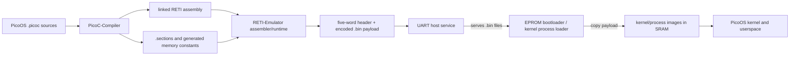
```mermaid
flowchart LR
    SRC["PicoOS .picoc sources"] --> CPL["PicoC-Compiler"]
    CPL --> ASM["linked RETI assembly"]
    CPL --> SEC[".sections and generated memory constants"]
    ASM --> EMU["RETI-Emulator assembler/runtime"]
    SEC --> EMU
    EMU --> BIN["five-word header + encoded .bin payload"]
    HOST["UART host service"] -->|serves .bin files| BOOT["EPROM bootloader / kernel process loader"]
    BIN --> HOST
    BOOT -->|copy payload| SRAM["kernel/process images in SRAM"]
    SRAM --> K["PicoOS kernel and userspace"]
```

The table below identifies what each part passes to the next, including runtime
requests that are separate from the generated build files.

| Producer | Contract | Consumer |
| --- | --- | --- |
| PicoC-Compiler | Linked `.reti`, `.sections`, generated memory headers, and `.debuginfo` | RETI-Emulator assembler/debugger and PicoOS low-level builds |
| RETI-Emulator assembler | Five-word layout header followed by encoded RETI words in `.bin` | EPROM bootloader and kernel process loader |
| PicoOS libraries | Syscall number plus direct value/pointer or stack-local request structure | Interrupt entry, [`handle_syscall()`](kernel/syscall.picoc#L16), and the owning kernel subsystem |
| Kernel subsystems | PCBs, activations, queues, descriptor/shared-memory state, and periphery-register writes | Scheduler/dispatcher and emulated RETI hardware |
| PicoOS UART host request protocol | Bounded `<ESC>...<ESC>/` requests and big-endian responses | RETI-Emulator host file services, or a companion serial host on hardware |

## Build and run
[\[↓ TOC\]](#contents)

The build expects `picoc_compiler`, `reti_emulator`, and `make` on `PATH`. The
release-style boot path is:

```console
$ make bootload
```

This builds the bootloader, kernel, system programs, libraries, user programs,
and device markers, then starts the RETI debugger with the EPROM bootloader.
The command corresponds to:

```console
$ cd binary
$ ../run_reti_emulator_isolated.sh -n 5 -e ./boot/bootloader.reti \
    -d -c -O -r 262144 \
    -S kernel/kernel.sections -D kernel/kernel.debuginfo
```

The options in this command select the boot image, memory size, and debugger
metadata as summarized below. Run the command from [`binary/`](binary/) so
runtime paths resolve to the release files.

| Option | Role in `make bootload` |
| --- | --- |
| `-e` | Selects the EPROM bootloader image |
| `-r` | Configures 2^18 SRAM cells |
| `-d -c` | Opens the commented debug TUI |
| `-S` / `-D` | Supplies the compiler-generated kernel layout and debug information |
| `-O` | Supplies the modeled OS context from which the first dispatcher `RTI` can leave |
| `-n 5` | Reserves five IVT entries that the bootloader later loads into SRAM |

### Use the PicoOS shell
[\[↓ TOC\]](#contents)

Readers who want to use the shell instead of inspecting startup state have two
paths:

- Run `make bootload-notui` to omit `-d` and connect the terminal directly to PicoOS. It also accepts `DMA=1`.

- Run `make bootload` for the debug-TUI path:

  1. Choose `c`, then Enter, to continue execution.
  2. Press capital `V` for the raw UART terminal when arrow keys, `Ctrl+C`, or `Ctrl+Z` must reach PicoOS, `Ctrl+]` returns to the debugger.
  3. Press lowercase `v` for the normal terminal when those sequences are not needed, Escape returns from it.

`make bootload-dma` adds DMA loading to the debug-TUI path.

After startup, this short [shell](user/shell.picoc) session makes loading and
running visible as separate steps. In a fresh session, init and the shell have
PIDs 1 and 2, so loading [`echo.picoc`](user/echo.picoc)'s binary creates PID 3.
Use the reported PID if other programs have already been loaded. Here `PicoOS>` is
the PicoOS prompt, unlike the host shell's `$` in the build commands above.
Loading-progress output is omitted from this transcript:

```console
PicoOS> load user/echo.bin
process with pid 3 created
PicoOS> run 3 hello PicoOS
hello PicoOS
```

The first command creates a [`NEW`](kernel/process/process.header#L12) process, the second makes it ready and waits
for its exit. [Section 4.4, Process states and transitions](#44-process-states-and-transitions) connects these
commands to the PCB transitions.

This short session crosses the complete runtime boundary: the generated
bootloader and kernel metadata start the emulated machine, the UART host
service supplies the program image, and the kernel creates a userspace
process for it.

The available tests comprise **12 library test classes, 23 OS test classes,
28 shell test classes, and one boot test class** in [`test/`](test/). Here a class means one
standalone library source or one system-test directory, rather than each
assertion inside it. [`run_sys_tests.sh`](run_sys_tests.sh) selects the standalone
sources, [`run_os_tests.py`](run_os_tests.py) classifies OS and shell scenarios
by their launcher and input script.

The table below lists build commands and ways to select these test groups:

| Command | Purpose |
| --- | --- |
| `make firmware` | Build the complete firmware/release tree |
| `make release-tree` / `make release-archive` | Build the release tree or create the release archive |
| `make clean-firmware` / `make rebuild-firmware` | Remove generated firmware files or rebuild them |
| `make devices` | Add the terminal and null device markers under [`binary/device`](binary/device/) |
| `make eprom` / `make kernel` | Build only the EPROM bootloader or kernel image |
| `make system` / `make user` | Build the complete release tree, including system and user programs |
| `make run-firmware` | Run the kernel image directly in the debug TUI |
| `make run-kernel` | Rebuild and run the kernel image directly |
| `make bootload-debug` | Rebuild bootloader and kernel with source/debug metadata, then boot through the debug TUI |
| `make bootload-dma` | Boot through the debug TUI with DMA enabled |
| `make bootload-notui` | Boot directly in the terminal without the debug TUI |
| `make bootload-notui DMA=1` | Boot directly in the terminal with DMA enabled |
| `make run-os OS_RUN_PATH=test/hello_world` | Run one configured OS scenario |
| `make test` | Run the library, OS feature, shell, and boot tests |
| `make test-lib` | Run the standalone library tests |
| `make test-sys` | Run the OS feature and shell tests |
| `make test-os` | Run the OS feature tests |
| `make test-shell` | Run the shell tests |
| `make test-boot` | Boot through the EPROM bootloader and run one `echo.bin` command |
| `make test DMA=1` | Run the complete test workflow with emulator DMA enabled |

### Release archive layout
[\[↓ TOC\]](#contents)

`make release-archive` first rebuilds the generated [`binary/`](binary/)
release tree, verifies that it contains only release files, and packages its
contents as `pico-os-runtime.tar.gz`. The archive contains a complete PicoOS
runtime and the scripts needed to start it in RETI-Emulator, it is not a copy
of the source repository and contains no test fixtures, PicoC sources, or
libraries.

Both `make bootload` and the archive launchers start the emulator in the runtime directory.
That directory becomes PicoOS `/`. Host `/tmp` is not mounted or added to directory listings.
Use the updated RETI-Emulator together with the rebuilt PicoOS binaries.

The following paths show where to find each runtime component in that archive,
the links point to their generated locations under [`binary/`](binary/).

| Archive path | Contents and purpose |
| --- | --- |
| [`binary/README.md`](binary/README.md) | Short release-specific startup and host-filesystem instructions. It becomes `README.md` at the archive root. |
| [`binary/start-picoos.sh`](binary/start-picoos.sh), [`binary/start-picoos.ps1`](binary/start-picoos.ps1) | Linux/macOS/Android and Windows launchers. They find or download the tools, select the boot and kernel metadata, and start the emulator. |
| [`binary/download-tools.sh`](binary/download-tools.sh), [`binary/download-tools.ps1`](binary/download-tools.ps1) | Download matching released `picoc_compiler` and `reti_emulator` binaries when they are not already available. |
| [`binary/boot/`](binary/boot/) | [`bootloader.reti`](binary/boot/bootloader.reti), the RETI EPROM image built from [`bootloader.picoc`](boot/bootloader.picoc) that loads and starts the kernel. |
| [`binary/kernel/`](binary/kernel/) | [`kernel.bin`](binary/kernel/kernel.bin), the loadable image built from [`kernel.picoc`](kernel/kernel.picoc), [`kernel.sections`](binary/kernel/kernel.sections), its linked memory-layout metadata, and [`kernel.debuginfo`](binary/kernel/kernel.debuginfo), its source/debug metadata. |
| [`binary/system/`](binary/system/) | Loadable system-program binaries, currently [`init.bin`](system/init.picoc). |
| [`binary/user/`](binary/user/) | Loadable PicoOS command binaries, including [`shell.bin`](user/shell.picoc) and the standard user commands built from [`user/`](user/). |
| [`binary/config/`](binary/config/) | Runtime configuration copied from [`config/`](config/): the initial environment, emulator options, and PicoOS release version. |
| [`binary/device/`](binary/device/) | `terminal.dev` and `null.dev` marker files. They represent PicoOS virtual device paths, they do not hold device data. |

For the corresponding source-tree directories and local helper scripts, see
[Repository layout](documentation/repository_layout.md).

## Intended physical hardware
[\[↓ TOC\]](#contents)

The intended physical setup uses an Alchitry Cu V2 FPGA board, two ISSI
IS61WV25616BLL-10TLI SRAM chips, and a SparkFun Serial Basic USB-to-UART
adapter. The prices below are the example parts-list prices used for this
design, including VAT. They were last checked at DigiKey Germany on 12 August
2026, component and shipping prices can change.

- **FPGA: [Alchitry Cu V2](https://www.digikey.de/short/8cmz0qnc) with Lattice
  iCE40-HX8K** ([board schematic](https://cdn.sparkfun.com/assets/2/f/9/9/3/CuSchematic.pdf),
  [FPGA datasheet](https://www.latticesemi.com/~/media/latticesemi/documents/datasheets/ice/ice40lphxfamilydatasheet.pdf)):
  **€55.66** (checked 12 August 2026). The FPGA implements the educational
  32-bit CPU, interrupt controller, UART controller, and SRAM interface.
- **SRAM: two [ISSI
  IS61WV25616BLL-10TLI](https://www.digikey.de/short/075fh38w) chips**
  ([datasheet](https://www.issi.com/WW/pdf/61-64WV25616.pdf)):
  **2 × €5.80 = €11.60** (checked 12 August 2026). Each asynchronous SRAM is
  organized as 256K × 16 bits. Both chips share the FPGA’s 18 address lines,
  chip enable, output enable, write enable, and byte-enable control. One chip
  connects its 16 data pins to CPU data bits 0–15 and the other to bits 16–31.
  Driving both chips with the same address and control signals therefore makes
  them one 256K × 32-bit SRAM. It provides 2^18 = 262,144 individually
  addressable 32-bit words, addressed from 0 through 2^18 - 1. Each word holds
  four bytes, so the total is
  `262,144 words × 4 bytes = 1,048,576 bytes = 1 MiB`. For comparison, 2^18
  bytes alone would be only 0.262144 MB.
- **USB-to-UART: [SparkFun Serial Basic Breakout with CH340C and
  USB-C](https://www.digikey.de/short/h83tqvbw)**
  ([product sheet](https://mm.digikey.com/Volume0/opasdata/d220001/medias/docus/739/DEV-15096_Web.pdf),
  [CH340C datasheet](https://cdn.sparkfun.com/assets/5/0/a/8/5/CH340DS1.PDF),
  [board schematic](https://cdn.sparkfun.com/assets/learn_tutorials/8/3/7/Serial-Basic-CH340C_Datasheet.pdf)):
  **€10.92** (checked 12 August 2026). Its `TXO` pin connects to the FPGA
  UART’s receive pin, its `RXI` pin connects to the FPGA UART’s transmit pin,
  and their grounds are connected. USB exposes the CH340C as a serial port on
  the host. The host and FPGA use the same baud rate and serial format, and
  UART transfers each request and response as a sequence of bytes.

The example total is **€55.66 + 2 × €5.80 + €10.92 = €78.18 including VAT**.
This excludes USB cables, wires, connectors, a printed circuit board, other
interconnection hardware, and shipping. In the rest of this README, PCB means
*process control block* unless the hardware context says otherwise.

PicoOS has no resident storage device or filesystem. In emulator use, the UART
host request protocol asks `reti_emulator` to access files in the host directory
where it is running, with that directory exposed as PicoOS `/`, see [Section 7.9, PicoOS paths, working directories, and host operations](#79-picoos-paths-working-directories-and-host-operations).
On the physical FPGA, a companion host program must read
the same requests from the USB serial port, perform the requested operations
on the host filesystem, and return byte counts and file data over UART. This
is how the same bootloader, kernel file interface, and user programs can work
with either the emulator or a physical RETI implementation.

The generated binaries also show why 1 MiB is a plausible memory size for the
project. The example sizes below come from the generated files currently in
[`binary/`](binary/) and include each file’s five-word header. Sizes change
with source code and compiler options:

| Image | 32-bit words | Size |
| --- | ---: | ---: |
| [`kernel.bin`](binary/kernel/kernel.bin) ([`kernel.picoc`](kernel/kernel.picoc)) | 41,693 | 0.166772 MB |
| [`init.bin`](binary/system/init.bin) ([`init.picoc`](system/init.picoc)) | 10,858 | 0.043432 MB |
| [`shell.bin`](binary/user/shell.bin) ([`shell.picoc`](user/shell.picoc)) | 32,655 | 0.130620 MB |
| [`cat.bin`](binary/user/cat.bin) ([`cat.picoc`](user/cat.picoc)) | 9,953 | 0.039812 MB |
| [`echo.bin`](binary/user/echo.bin) ([`echo.picoc`](user/echo.picoc)) | 12,018 | 0.048072 MB |

A conservative calculation can count the headers as if they also occupied
SRAM. With the resident [`kernel.bin`](kernel/kernel.picoc), [`init.bin`](system/init.picoc), and [`shell.bin`](user/shell.picoc) images,
`262,144 - (41,693 + 10,858 + 32,655) = 176,938` words remain. That space
could hold `floor(176,938 / 9,953) = 17` copies of [`cat.bin`](user/cat.picoc). The loader
actually keeps the five header words out of the copied program image. This is
only an image-size comparison,a running process also needs heap and stack
space,but it gives a useful scale for the available memory.

### RETI execution model
[\[↓ TOC\]](#contents)

The RETI memory map determines where the bootloader, peripherals, and PicoOS
runtime execute. The CPU selects one of these address spaces from the two
highest address bits:

| High bits | Address space | PicoOS use |
| --- | --- | --- |
| `00` | EPROM | Bootloader |
| `01` | Memory-mapped periphery | UART, interrupt controller, timer, stack boundary, exception cause, DMA |
| `10` or `11` | SRAM | Interrupt table, kernel, process images, heaps, and stacks |

## Contents

The chapters cover toolchain extensions and kernel functionality, then follow
startup from the bootloader through the kernel, init, and the shell to the
individual user applications. Testing and the use of PicoOS in OS and RTOS
lectures follow.

1. [Toolchain extensions for PicoOS](#1-toolchain-extensions-for-picoos)
   - [1.1 PicoC-Compiler extensions](#11-picoc-compiler-extensions)
      - [1.1.1 Compilation pipeline and compiler passes](#111-compilation-pipeline-and-compiler-passes)
      - [1.1.2 Separate compilation, reusable artifacts, and linking](#112-separate-compilation-reusable-artifacts-and-linking)
      - [1.1.3 System V ABI stack frames and call cleanup](#113-system-v-abi-stack-frames-and-call-cleanup)
         - [1.1.3.1 Stack-frame layout and caller cleanup](#1131-stack-frame-layout-and-caller-cleanup)
         - [1.1.3.2 Shared function epilogue and return values](#1132-shared-function-epilogue-and-return-values)
         - [1.1.3.3 Naked functions without a generated frame](#1133-naked-functions-without-a-generated-frame)
      - [1.1.4 Selecting a startup function with `-C` / `--startup-source`](#114-selecting-a-startup-function-with--c---startup-source)
         - [1.1.4.1 Default compiler-generated `_start`](#1141-default-compiler-generated-start)
         - [1.1.4.2 Supplying a custom startup function](#1142-supplying-a-custom-startup-function)
         - [1.1.4.3 PicoOS `libstart` startup sequence](#1143-picoos-libstart-startup-sequence)
         - [1.1.4.4 Startup functions used by PicoOS images](#1144-startup-functions-used-by-picoos-images)
      - [1.1.5 Program sections, interrupt-vector entries, and linker placement](#115-program-sections-interrupt-vector-entries-and-linker-placement)
      - [1.1.6 RETI pseudoinstructions](#116-reti-pseudoinstructions)
         - [1.1.6.1 Interrupt-safe `PUSH` and `POP`](#1161-interrupt-safe-push-and-pop)
         - [1.1.6.2 Loading 32-bit values with `LOADI32`](#1162-loading-32-bit-values-with-loadi32)
         - [1.1.6.3 Long jumps with `JUMP32`](#1163-long-jumps-with-jump32)
         - [1.1.6.4 Pseudoinstruction expansion during linking](#1164-pseudoinstruction-expansion-during-linking)
      - [1.1.7 Linked `.sections` metadata and the five-word binary header](#117-linked-sections-metadata-and-the-five-word-binary-header)
      - [1.1.8 Generated memory constants for the bootloader and kernel](#118-generated-memory-constants-for-the-bootloader-and-kernel)
   - [1.2 RETI-Emulator extensions](#12-reti-emulator-extensions)
      - [1.2.1 RETI machine model and memory-mapped peripherals](#121-reti-machine-model-and-memory-mapped-peripherals)
      - [1.2.2 UART host-service protocol](#122-uart-host-service-protocol)
      - [1.2.3 Debugger, source view, and terminal modes](#123-debugger-source-view-and-terminal-modes)
1. [Interrupts, system calls, preemption, and exceptions](#2-interrupts-system-calls-preemption-and-exceptions)
   - [2.1 RETI interrupt entry and the interrupt vector table](#21-reti-interrupt-entry-and-the-interrupt-vector-table)
   - [2.2 Interrupt-controller mappings and priorities](#22-interrupt-controller-mappings-and-priorities)
   - [2.3 Saved interrupt stack frame](#23-saved-interrupt-stack-frame)
   - [2.4 System-call ABI](#24-system-call-abi)
      - [2.4.1 Syscall selectors and register convention](#241-syscall-selectors-and-register-convention)
      - [2.4.2 Process, wait, signal, and memory request structures](#242-process-wait-signal-and-memory-request-structures)
      - [2.4.3 File and directory request structures](#243-file-and-directory-request-structures)
      - [2.4.4 Request-pointer ownership and lifetime](#244-request-pointer-ownership-and-lifetime)
   - [2.5 Handling system calls and returning to userspace](#25-handling-system-calls-and-returning-to-userspace)
      - [2.5.1 Selecting the return path](#251-selecting-the-return-path)
      - [2.5.2 System-call groups](#252-system-call-groups)
   - [2.6 Timer interrupts and userspace preemption](#26-timer-interrupts-and-userspace-preemption)
      - [2.6.1 Timer interrupt path](#261-timer-interrupt-path)
      - [2.6.2 Kernel non-preemption and deferred rescheduling](#262-kernel-non-preemption-and-deferred-rescheduling)
      - [2.6.3 Shell character delay for different timer intervals](#263-shell-character-delay-for-different-timer-intervals)
   - [2.7 UART receive interrupt path](#27-uart-receive-interrupt-path)
   - [2.8 DMA completion interrupt path](#28-dma-completion-interrupt-path)
   - [2.9 CPU exceptions and runtime errors](#29-cpu-exceptions-and-runtime-errors)
      - [2.9.1 CPU exception entry and registers](#291-cpu-exception-entry-and-registers)
      - [2.9.2 Supported exceptions and allocation errors](#292-supported-exceptions-and-allocation-errors)
      - [2.9.3 Interrupt, system-call, and exception function reference](#293-interrupt-system-call-and-exception-function-reference)
         - [2.9.3.1 Exception policy and stack boundaries](#2931-exception-policy-and-stack-boundaries)
         - [2.9.3.2 System-call selection](#2932-system-call-selection)
         - [2.9.3.3 Interrupt-controller configuration](#2933-interrupt-controller-configuration)
         - [2.9.3.4 Memory-mapped periphery access](#2934-memory-mapped-periphery-access)
         - [2.9.3.5 Polled UART access](#2935-polled-uart-access)
         - [2.9.3.6 DMA waiting and completion](#2936-dma-waiting-and-completion)
1. [Memory management and shared memory](#3-memory-management-and-shared-memory)
   - [3.1 Heap block layout and allocation algorithm](#31-heap-block-layout-and-allocation-algorithm)
   - [3.2 Kernel, process-image/shared-memory, and per-process heap instances](#32-kernel-process-imageshared-memory-and-per-process-heap-instances)
   - [3.3 Kernel SRAM memory map](#33-kernel-sram-memory-map)
   - [3.4 Linked code, data, heap, and stack address ranges](#34-linked-code-data-heap-and-stack-address-ranges)
   - [3.5 Heap and allocator function reference](#35-heap-and-allocator-function-reference)
   - [3.6 Shared-memory entries and mappings](#36-shared-memory-entries-and-mappings)
      - [3.6.1 Named entries and per-process attachments](#361-named-entries-and-per-process-attachments)
      - [3.6.2 Mapping, unlinking, and deferred destruction](#362-mapping-unlinking-and-deferred-destruction)
1. [Processes and process lifecycle](#4-processes-and-process-lifecycle)
   - [4.1 Global process list and current process](#41-global-process-list-and-current-process)
   - [4.2 Process control block fields](#42-process-control-block-fields)
   - [4.3 Process image and initial userspace stack](#43-process-image-and-initial-userspace-stack)
      - [4.3.1 Code, data, heap, and stack placement](#431-code-data-heap-and-stack-placement)
      - [4.3.2 Initial `argc`, `argv`, and `envp`](#432-initial-argc-argv-and-envp)
   - [4.4 Process states and transitions](#44-process-states-and-transitions)
   - [4.5 Loading and starting a process](#45-loading-and-starting-a-process)
      - [4.5.1 Executable transfer with polling or DMA](#451-executable-transfer-with-polling-or-dma)
      - [4.5.2 Changing a completed image from `NEW` to `READY`](#452-changing-a-completed-image-from-new-to-ready)
   - [4.6 Parent-child relationships, termination, and collection](#46-parent-child-relationships-termination-and-collection)
      - [4.6.1 Creating parent-child relationships and handling orphans](#461-creating-parent-child-relationships-and-handling-orphans)
      - [4.6.2 Recording termination status](#462-recording-termination-status)
      - [4.6.3 Parent collection and final removal](#463-parent-collection-and-final-removal)
   - [4.7 Process list, PCB metadata, and lifecycle function reference](#47-process-list-pcb-metadata-and-lifecycle-function-reference)
   - [4.8 Process-loader and run-setup function reference](#48-process-loader-and-run-setup-function-reference)
1. [Scheduling and context switching](#5-scheduling-and-context-switching)
   - [5.1 Scheduler implementation](#51-scheduler-implementation)
      - [5.1.1 Algorithm and Round Robin comparison](#511-algorithm-and-round-robin-comparison)
      - [5.1.2 Scheduler function reference](#512-scheduler-function-reference)
   - [5.2 Saved process activation](#52-saved-process-activation)
   - [5.3 Saving the current process and selecting the next process](#53-saving-the-current-process-and-selecting-the-next-process)
   - [5.4 Restoring the selected process and returning with `RTI`](#54-restoring-the-selected-process-and-returning-with-rti)
   - [5.5 Dispatcher function reference](#55-dispatcher-function-reference)
1. [Blocking, wait queues, signals, and mutexes](#6-blocking-wait-queues-signals-and-mutexes)
   - [6.1 Wait Queue Structure and Intrusive PCB Links](#61-wait-queue-structure-and-intrusive-pcb-links)
      - [6.1.1 Blocking with `sleep` and Waking with `wakeup`](#611-blocking-with-sleep-and-waking-with-wakeup)
      - [6.1.2 Child Waiting with `waitpid`](#612-child-waiting-with-waitpid)
      - [6.1.3 Wait Queue Function Reference](#613-wait-queue-function-reference)
   - [6.2 Process Signals](#62-process-signals)
      - [6.2.1 Supported signals and fixed actions](#621-supported-signals-and-fixed-actions)
      - [6.2.2 Stopping and continuing a process](#622-stopping-and-continuing-a-process)
      - [6.2.3 Termination, `Ctrl-C`, and parent collection](#623-termination-ctrl-c-and-parent-collection)
      - [6.2.4 Fixed PicoOS signal actions compared with Unix](#624-fixed-picoos-signal-actions-compared-with-unix)
      - [6.2.5 Signal Function Reference](#625-signal-function-reference)
   - [6.3 Mutex Locking with Test-and-Set and Wait Queues](#63-mutex-locking-with-test-and-set-and-wait-queues)
1. [Terminal, file descriptors, and host filesystem](#7-terminal-file-descriptors-and-host-filesystem)
   - [7.1 Per-process file-descriptor table](#71-per-process-file-descriptor-table)
   - [7.2 Global terminal input buffer](#72-global-terminal-input-buffer)
   - [7.3 Blocking and completing terminal reads](#73-blocking-and-completing-terminal-reads)
   - [7.4 Foreground input ownership and terminal-generated signals](#74-foreground-input-ownership-and-terminal-generated-signals)
   - [7.5 Virtual terminal and null-device paths](#75-virtual-terminal-and-null-device-paths)
   - [7.6 File-descriptor creation, inheritance, duplication, and cleanup](#76-file-descriptor-creation-inheritance-duplication-and-cleanup)
   - [7.7 Terminal-buffer and pending-read function reference](#77-terminal-buffer-and-pending-read-function-reference)
   - [7.8 Opening, reading, writing, and seeking](#78-opening-reading-writing-and-seeking)
   - [7.9 PicoOS paths, working directories, and host operations](#79-picoos-paths-working-directories-and-host-operations)
1. [Userspace libraries](#8-userspace-libraries)
   - [8.1 From a library call to the kernel: waitpid](#81-from-a-library-call-to-the-kernel-waitpid)
      - [8.1.1 Header, implementation, and linking](#811-header-implementation-and-linking)
      - [8.1.2 Packing arguments and executing the syscall](#812-packing-arguments-and-executing-the-syscall)
      - [8.1.3 Interrupt entry, waiting, and return](#813-interrupt-entry-waiting-and-return)
   - [8.2 Library overview and dependencies](#82-library-overview-and-dependencies)
      - [8.2.1 unistd: processes, descriptors, paths, and wait queues](#821-unistd-processes-descriptors-paths-and-wait-queues)
         - [8.2.1.1 Process operations in `process.picoc`](#8211-process-operations-in-processpicoc)
         - [8.2.1.2 Descriptor operations in `io.picoc`](#8212-descriptor-operations-in-iopicoc)
         - [8.2.1.3 Working-directory operations in `working_directory.picoc`](#8213-working-directory-operations-in-working_directorypicoc)
         - [8.2.1.4 Path operations in `file_removal.picoc`](#8214-path-operations-in-file_removalpicoc)
         - [8.2.1.5 Wait-queue operations in `blocking.picoc`](#8215-wait-queue-operations-in-blockingpicoc)
      - [8.2.2 fcntl: opening and creating files](#822-fcntl-opening-and-creating-files)
      - [8.2.3 sys/wait: waiting for children](#823-syswait-waiting-for-children)
      - [8.2.4 mutex: locking and waking contenders](#824-mutex-locking-and-waking-contenders)
      - [8.2.5 sys/mman: named shared memory](#825-sysmman-named-shared-memory)
      - [8.2.6 dirent: directory streams](#826-dirent-directory-streams)
      - [8.2.7 stdlib: process heap, environment, conversion, and exit](#827-stdlib-process-heap-environment-conversion-and-exit)
         - [8.2.7.1 Heap operations in `malloc.picoc`](#8271-heap-operations-in-mallocpicoc)
         - [8.2.7.2 Decimal conversion in `atoi.picoc`](#8272-decimal-conversion-in-atoipicoc)
         - [8.2.7.3 Environment operations in `env.picoc`](#8273-environment-operations-in-envpicoc)
         - [8.2.7.4 Process exit in `exit.picoc`](#8274-process-exit-in-exitpicoc)
      - [8.2.8 string: copying, comparison, and length](#828-string-copying-comparison-and-length)
      - [8.2.9 stdio: streams, formatting, and scanning](#829-stdio-streams-formatting-and-scanning)
         - [8.2.9.1 Streams and output in `stdio.picoc`](#8291-streams-and-output-in-stdiopicoc)
         - [8.2.9.2 Scanning in `scanf.picoc`](#8292-scanning-in-scanfpicoc)
      - [8.2.10 start: entering and leaving a user program](#8210-start-entering-and-leaving-a-user-program)
      - [8.2.11 Single-function libraries](#8211-single-function-libraries)
1. [Kernel storage, ownership, and object lifetimes](#9-kernel-storage-ownership-and-object-lifetimes)
   - [9.1 Storage regions, allocation sources, and lifetimes](#91-storage-regions-allocation-sources-and-lifetimes)
   - [9.2 Ownership and reference relationships](#92-ownership-and-reference-relationships)
1. [Bootloading and kernel startup](#10-bootloading-and-kernel-startup)
   - [10.1 Loading the kernel from the EPROM bootloader](#101-loading-the-kernel-from-the-eprom-bootloader)
   - [10.2 Initializing kernel subsystems](#102-initializing-kernel-subsystems)
      - [10.2.1 Kernel startup code](#1021-kernel-startup-code)
   - [10.3 Loading init and entering normal execution](#103-loading-init-and-entering-normal-execution)
1. [Init process](#11-init-process)
   - [11.1 Init responsibilities](#111-init-responsibilities)
   - [11.2 Initial environment configuration](#112-initial-environment-configuration)
   - [11.3 Loading, starting, and waiting for the shell](#113-loading-starting-and-waiting-for-the-shell)
      - [11.3.1 Complete init startup code](#1131-complete-init-startup-code)
   - [11.4 Shell exit and restart policy](#114-shell-exit-and-restart-policy)
1. [Shell](#12-shell)
   - [12.1 Shell-owned state](#121-shell-owned-state)
   - [12.2 Shell startup and command loop](#122-shell-startup-and-command-loop)
   - [12.3 Interactive line editing and command history](#123-interactive-line-editing-and-command-history)
   - [12.4 Command parsing, expansion, and execution](#124-command-parsing-expansion-and-execution)
   - [12.5 Shell built-in commands](#125-shell-built-in-commands)
   - [12.6 Foreground processes, background processes, and job-control signals](#126-foreground-processes-background-processes-and-job-control-signals)
   - [12.7 Input/output redirection](#127-inputoutput-redirection)
   - [12.8 Sequential file-backed pipelines](#128-sequential-file-backed-pipelines)
1. [User applications and commands](#13-user-applications-and-commands)
   - [13.1 Available applications and their library use](#131-available-applications-and-their-library-use)
   - [13.2 Command behavior and supported options](#132-command-behavior-and-supported-options)
   - [13.3 Command errors and exit statuses](#133-command-errors-and-exit-statuses)
1. [Test system](#14-test-system)
   - [14.1 Library, OS, shell, and boot test categories](#141-library-os-shell-and-boot-test-categories)
   - [14.2 Test execution](#142-test-execution)
1. [Use in operating-systems and real-time operating-systems lectures](#15-use-in-operating-systems-and-real-time-operating-systems-lectures)
   - [15.1 Operating-systems topics](#151-operating-systems-topics)
      - [15.1.1 Inspecting PicoOS execution in the RETI-Emulator](#1511-inspecting-picoos-execution-in-the-reti-emulator)
      - [15.1.2 Exploring userspace heap allocation](#1512-exploring-userspace-heap-allocation)
      - [15.1.3 Editing and executing symbolic RETI assembly](#1513-editing-and-executing-symbolic-reti-assembly)
   - [15.2 Real-time operating-systems topics](#152-real-time-operating-systems-topics)
1. [Use of AI in the project](#16-use-of-ai-in-the-project)
1. [Limitations](#17-limitations)
- [Appendix: Inspecting `.bin` files with `hexyl`](#appendix-inspecting-bin-files-with-hexyl)

# 1. Toolchain extensions for PicoOS
[\[↑ TOC\]](#contents)

The original teaching compiler and emulator could run small standalone
programs, but they lacked the linking, loading, interrupt, and debugging
support needed by PicoOS. Both tools were therefore extended so the OS could
be written in PicoC, linked into complete images, booted, and inspected as
RETI code.

The detailed change histories are kept with the sibling projects in the
[PicoC-Compiler feature history](https://github.com/matthejue/PicoC-Compiler/blob/linker_update/documentation/new_features_for_pico_os.md)
and [RETI-Emulator feature history](https://github.com/matthejue/RETI-Emulator/blob/statemachine/documentation/new_features_for_pico_os.md).
This chapter records the complete project-facing surface rather than only the
few extensions that appear directly in kernel source.

## 1.1 PicoC-Compiler extensions
[\[↑ TOC\]](#contents)

PicoOS needs whole programs built from many files, headers that affect their
inputs, a broader PicoC language, and control over final memory layout. The
following compiler features were added to provide those capabilities.

| Feature | Contribution used by PicoOS |
| --- | --- |
| Installation | The compiler installation creates the environment and installs the `picoc_compiler` command |
| Preprocessing | `#include`, include paths, `#pragma once`, object-like macros, line splicing, dependency output, and optional syntax checking |
| Multiple translation units | Per-file compilation, symbol merging, cross-file calls/globals, and final program-wide linking |
| Reusable build artifacts | `.reti_blocks` and `.st` retain lowered code, symbols, data, startup, and debug metadata for later links |
| Automatic artifact reuse | Source/header hashes and compiler options decide whether an unchanged unit can be reused, Make dependency files expose the same inputs |
| Broader PicoC syntax | `typedef`, casts, mixed declarations/statements, postfix increment, array-size inference, and compile-time integer simplification |
| Pointer support | Pointer returns, `void *`, typed pointer arithmetic, dereference/member conditions, and compatible forward/repeated struct declarations |
| Function pointers | Declarations, arrays, assignments, indirect calls, and statically emitted function addresses |
| Variadic functions | Variadic declarations and the documented System-V-style stack-frame locations used by [`printf()`](library/stdio/stdio.picoc#L354) and [`scanf()`](library/stdio/scanf.picoc#L112) |
| String and character data | Escapes, inferred local arrays, global strings, deduplicated string literals, and linker-safe literal names |
| Inline RETI assembly | `asm("...")`, linked labels inside assembly, and safe pseudoinstructions such as `LOADI32`, `JUMP32`, `PUSH`, and `POP` |
| Low-level functions | `__attribute__((naked))` suppresses compiler prologue/epilogue code for startup and interrupt handlers |
| Custom sections | `__attribute__((section("ivt")))` places selected globals or functions in `.ivt`, ordinary functions and globals use `.text` and `.data` |
| Interrupt-vector entries | `IVTE` resolves handler pointers into tagged SRAM addresses |
| Runtime startup | Generated default entry or a replaceable custom `-C` startup such as PicoOS [`libstart`](library/start/libstart.picoc) |
| Global initialization | `-O1` emits known scalar, string, struct, array, and function-pointer initializers directly into `.data` or an attributed `.ivt` |
| Shared epilogues | All ordinary returns converge on one generated restore/return block |
| Section layout | Separate `.ivt`, `.text`, and `.data` regions and the paired final `.sections` file |
| Linked labels | Human-readable labels remain until final patching, making generated RETI inspectable |
| Kernel headers | `-k sram` and `-k eprom` generate [`memory_constants.header`](kernel/memory_constants.header) for code that has no PCB/runtime loader context |
| Debug information | `.debuginfo` describes source ranges, globals, frames, arguments, calls, returns, and local variables for the emulator TUI |
| Inspectable intermediates | Preprocessed source and named RETI-block stages make the result of individual compiler passes visible |
| Source trap and RETI `NOP` | `debug;` lowers to the emulator trap and inline `NOP` remains a real instruction |

### 1.1.1 Compilation pipeline and compiler passes
[\[↑ TOC\]](#contents)

These features required more than individual backend changes. The original
compiler accepted one PicoC file and transformed it directly into one RETI
program. It used Lark to parse the source and a transformer to create the
PicoC AST, its [passes](https://github.com/matthejue/PicoC-Compiler/blob/master/src/passes.py)
and [AST transformer](https://github.com/matthejue/PicoC-Compiler/blob/master/src/ast_transformers.py)
show the following lowering sequence. The boxed final group runs once for that
one input file and produces that file's RETI program.


```mermaid
flowchart LR
    source["One PicoC source file"]

    subgraph frontend["Lexing and parsing"]
        lexer["Lark lexer and parser"]
        tree["Parse tree"]
        ast["TransformerPicoC AST"]
    end

    subgraph compilation["Single-file compilation passes"]
        shrink["picoc_shrink"]
        blocks["picoc_blocks"]
        anf["picoc_anf"]
        reti_blocks["reti_blocks"]
        patch["reti_patch"]
        reti["reti"]
    end

    output["One RETI program"]

    source --> lexer --> tree --> ast
    ast --> shrink --> blocks --> anf --> reti_blocks --> patch --> reti --> output
```

For the added preprocessing, separate compilation, typing, and linking
features, this pipeline was extended before and after the per-file passes.
Preprocessing resolves includes, macros, and line splicing before parsing. The
new symbol and typing passes check names, declarations, and types before
ANF and RETI lowering. A final program-wide linker merges compiled units, their symbols, and
startup code before resolving final addresses. The diagram below shows where
these additions surround the per-file lowering sequence.


```mermaid
flowchart LR
    source["PicoC source"]

    subgraph preprocessing["Preprocessing"]
        preprocessor["Includes, macros, and line splicing"]
        preprocessed["Preprocessed source"]
    end

    subgraph frontend["Lexing and parsing"]
        tokens["Token stream"]
        parse_tree["Tree-sitter parse tree"]
        ast["PicoC AST"]
    end

    subgraph compilation["Per-file compilation passes"]
        shrink["picoc_shrink"]
        blocks["picoc_blocks"]
        symbol["picoc_symbol"]
        typing["picoc_typing"]
        anf["picoc_anf"]
        reti_blocks["reti_blocks"]
    end

    subgraph linking["Program-wide linking passes"]
        merge["Merge units, symbols, and startup"]
        patch["reti_patch"]
        reti["reti"]
    end

    output["Flat linked RETI output"]

    source --> preprocessor --> preprocessed --> tokens --> parse_tree --> ast
    ast --> shrink --> blocks --> symbol --> typing --> anf --> reti_blocks
    reti_blocks --> merge --> patch --> reti --> output
```

### 1.1.2 Separate compilation, reusable artifacts, and linking
[\[↑ TOC\]](#contents)

PicoC separate compilation follows the familiar C object-file workflow. GCC
and Clang use `-c` to turn one `.c` file, with its included `.h` headers, into
an `.o` object file. Similarly, `picoc_compiler -c` turns one `.picoc` file,
with its included `.header` files, into paired `.reti_blocks` and `.st` files.
The former contains the lowered RETI blocks, the latter is a JSON symbol table
used when later linking units. A conventional `.o` file stores its symbol table
inside the object file instead. The illustrative commands below compare both
compile-and-link workflows, the `example/` paths stand for your own source files.

```console
$ gcc -c -O2 example/c/main.c example/c/math.c
$ ls example/c
main.c  main.h  main.o  math.c  math.h  math.o

$ picoc_compiler -c -O1 example/picoc/main.picoc example/picoc/math.picoc
$ ls example/picoc
main.header  main.picoc  main.reti_blocks  main.st  math.header  math.picoc  math.reti_blocks  math.st

$ gcc -o binary/c-example example/c/main.o example/c/math.o
$ picoc_compiler -O1 -o binary/picoc-example.reti \
    example/picoc/main.reti_blocks example/picoc/math.reti_blocks
$ ls binary
c-example  picoc-example.reti  picoc-example.sections
```

The `-o` option selects the path and name of the linked executable: the native
`binary/c-example` in the C command and the final linked RETI assembly
`binary/picoc-example.reti` in the PicoC command. PicoC's paired artifacts
keep the lowered code and linker metadata independently inspectable and
reusable. The PicoC/RETI toolchain keeps the accompanying metadata in separate
JSON-like files: `.st` holds linker symbols, `.sections` holds the linked
layout, and `.debuginfo` holds source/debug data.

### 1.1.3 System V ABI stack frames and call cleanup
[\[↑ TOC\]](#contents)

The [System V Application Binary Interface (ABI)](https://github.com/hjl-tools/x86-psABI/wiki/x86-64-psABI-1.0.pdf)
is a family of specifications that defines how separately compiled machine
code interoperates, including calling conventions, register use, and stack
frames. The linked AMD64 supplement is a common reference, PicoC adapts the
same general model to RETI rather than implementing the AMD64 ABI. This
convention lets compiled code, hand-written wrappers, startup functions, and
interrupt code agree on the location of arguments and saved control state. The
three parts below cover the ordinary stack frame, its shared return path, and
the frame-free functions used for low-level control transfers.

#### 1.1.3.1 Stack-frame layout and caller cleanup
[\[↑ TOC\]](#contents)

The called function saves and restores `BAF`, while the call site uses a
generated continuation-block label as its return address. Arguments are
evaluated and pushed from right to left. Their total size is calculated from
the actual call, and the caller releases that argument space after the callee
returns.

Multi-cell arrays and structs occupy their complete width. A struct passed by
value uses its base cell as its logical address, so member access and
forwarding use the correct stack cells. The table below lists the layout from
higher to lower addresses and shows which side manages each cell.

| Address relative to `BAF` | Contents | Managed by |
| --- | --- | --- |
| `BAF + 4` | Second argument or first variadic argument | Caller |
| `BAF + 3` | First argument | Caller |
| `BAF + 2` | Return address | Caller |
| `BAF + 1` | Saved previous `BAF` | Callee |
| `BAF` | First local variable | Callee |
| `BAF - 1` | Later local variable | Callee |
| `SP` | Free cell below the occupied stack | Current stack boundary |

Thus `asm("LOADIN BAF ACC 3")` reads the first argument. PicoOS
[`printf()`](library/stdio/stdio.picoc#L354) starts its variadic arguments at
`BAF + 4`, while [`fprintf()`](library/stdio/stdio.picoc#L346) starts them at
`BAF + 5`. The later [Section 1.1.6.1, Interrupt-safe `PUSH` and `POP`](#1161-interrupt-safe-push-and-pop)
explain how concrete `PUSH` and `POP` instructions protect these live cells if
an interrupt arrives between their two machine instructions.

#### 1.1.3.2 Shared function epilogue and return values
[\[↑ TOC\]](#contents)

Every ordinary function has one generated `<function>_epilogue` block. Each
source-level return stores a non-void result in `IN2` and converges on that
block, which restores `BAF` and jumps to the saved return address. The diagram
shows this shared return path and why the result remains separate from `ACC`,
which long jumps use as a scratch register.

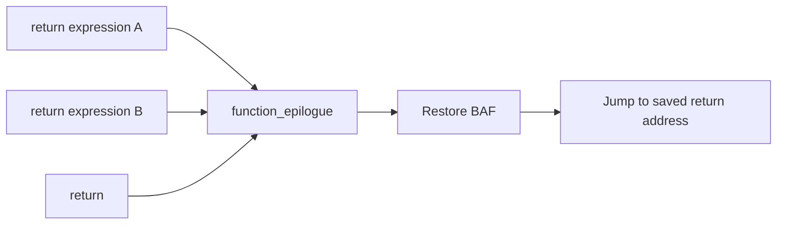
```mermaid
flowchart LR
    return_a["return expression A"] --> epilogue["function_epilogue"]
    return_b["return expression B"] --> epilogue
    return_void["return"] --> epilogue
    epilogue --> restore["Restore BAF"]
    restore --> caller["Jump to saved return address"]
```

#### 1.1.3.3 Naked functions without a generated frame
[\[↑ TOC\]](#contents)

`__attribute__((naked))` removes both the compiler-generated stack-frame
prologue and the shared epilogue. `return;` emits no epilogue jump, while
`return expression;` only evaluates the expression and places its value in
`IN2`. A naked function must therefore provide its own register setup and
return or control-transfer sequence.

PicoOS uses naked functions for the EPROM entry, the userspace `_start`
function, interrupt entries, and dispatcher restoration because those paths
must exactly match hardware-created or kernel-created stack layouts. There is
no hidden prologue or epilogue around the instructions shown in those
functions. This is a direct compiler-to-kernel contract: the compiler's frame
and offset rules determine the saved interrupt frame, and the dispatcher
restores that same layout.

### 1.1.4 Selecting a startup function with `-C` / `--startup-source`
[\[↑ TOC\]](#contents)

The compiler either generates the normal entry point or uses a startup source
selected at link time. Understanding the generated default first makes the
custom `libstart` sequence and the entry chosen for each PicoOS image easier to
follow.

#### 1.1.4.1 Default compiler-generated `_start`
[\[↑ TOC\]](#contents)

When no custom startup source is selected, a linked program with a global
`main` receives a compiler-generated `_start`. The following source-equivalent
example shows its control flow, `Exit` represents the compiler's internal exit
operation rather than a PicoC function that application code can call:

```c
void _start(void) {
    main();
    Exit(0);
}
```

The generated entry runs any remaining global initializer code before calling
`main`, then terminates with `LOADI ACC 0` and `JUMP 0` after `main` returns.

#### 1.1.4.2 Supplying a custom startup function
[\[↑ TOC\]](#contents)

The `-C PATH` / `--startup-source PATH` option instead links an additional
PicoC or compiled `.reti_blocks` startup unit. If that unit defines `_start`,
the compiler places it first in `.text` and uses it in place of the generated
default, otherwise, the compiler still creates the default entry. Global
initializer code precedes either form.

#### 1.1.4.3 PicoOS `libstart` startup sequence
[\[↑ TOC\]](#contents)

PicoOS selects [`library/start/libstart.picoc`](library/start/libstart.picoc)
for userspace with `-C library/start/libstart.picoc`. The wrapper records its
compiled-library dependency and includes the actual startup implementation:

```c
// dependencies: ../stdlib/libstdlib.reti_blocks

#include "start.picoc"
```

The included [`library/start/start.picoc`](library/start/start.picoc) contains
the complete userspace startup path:

```c
#include "../stdlib/stdlib.header"
#include "../unistd/unistd.header"

int main(int argc, char **argv);
void initialize_environment(char **environment);

void start_process(int argc, char **argv) {
    init_process_heap();
    initialize_environment(argv + argc + 1);
    exit(main(argc, argv));
}

__attribute__((naked))
void _start(int argc, char *first_argument) {
    start_process(argc, (char **)&first_argument);
}
```

The naked [`_start()`](library/start/start.picoc#L14) sees the initial stack
exactly as the kernel built it and treats
[`&first_argument`](library/start/start.picoc#L14) as the start of `argv`.
It passes that table to [`start_process()`](library/start/start.picoc#L7),
which calls [`init_process_heap()`](library/stdlib/malloc.picoc#L18), clones
the initial environment through
[`initialize_environment()`](library/stdlib/env.picoc#L97), calls the
application's [`main()`](library/start/start.picoc#L4), and passes its result to
[`exit()`](library/stdlib/exit.picoc#L3). The initial userspace stack is shown
in [Section 4.3, Process image and initial userspace stack](#43-process-image-and-initial-userspace-stack).
PicoOS [`libstart`](library/start/libstart.picoc) is therefore a small
counterpart to the startup support normally supplied with `libc`: it prepares
runtime state before calling [`main()`](library/start/start.picoc#L4) and turns
the return value into an exit status.

#### 1.1.4.4 Startup functions used by PicoOS images
[\[↑ TOC\]](#contents)

The following table distinguishes the entry used for each PicoOS image. The
init process and shell are userspace programs, so they deliberately use the
same startup path as every other system or user application.

| Image | `_start` used | Next function |
| --- | --- | --- |
| EPROM bootloader | Its explicitly defined naked [`_start()`](boot/bootloader.picoc#L9), compiled as part of the bootloader without `-C` | [`boot_main()`](boot/bootloader.picoc#L41) |
| SRAM kernel | Compiler-generated default `_start`, because the kernel is linked without `-C` | [`main()`](kernel/kernel.picoc#L31) |
| Init process | [`libstart` `_start()`](library/start/start.picoc#L14), selected with `-C library/start/libstart.picoc` | [`main()`](system/init.picoc#L100) |
| Shell | [`libstart` `_start()`](library/start/start.picoc#L14), selected with the same `-C` option | [`main()`](user/shell.picoc#L1448) |
| Other system and user applications | [`libstart` `_start()`](library/start/start.picoc#L14), selected by the common userspace link rule | The application's `main` |

### 1.1.5 Program sections, interrupt-vector entries, and linker placement
[\[↑ TOC\]](#contents)

The extended compilation and linking pipeline orders every linked image as
`.ivt`, `.text`, then `.data`. These are regions of the final flat RETI
program, not separate files. Their recorded boundaries are explained further
in [Section 1.1.7, Linked `.sections` metadata and the five-word binary header](#117-linked-sections-metadata-and-the-five-word-binary-header).

| Section | Default contents and addressing | How source selects it |
| --- | --- | --- |
| `.ivt` | Interrupt-vector words and, when requested, low-level functions, it begins at image offset 0 and uses `CS`-relative global references | Add `__attribute__((section("ivt")))` to a global variable, function declaration, or function definition |
| `.text` | `_start` followed by ordinary functions and their instructions, execution and code labels are relative to `CS` | This is the default for functions |
| `.data` | Ordinary global and static storage, addressed relative to `DS` | This is the default for global and static variables |

The attribute string is `"ivt"` without a leading dot. The compiler currently
supports this explicit section choice only for `.ivt`, it chooses `.text` and
`.data` from whether a declaration is a function or stored data. For example,
PicoOS places its global
[`interrupt_vector_table`](interrupt_service_routines/os_isrs.picoc#L24)
array at the beginning of the kernel image:

```c
__attribute__((section("ivt")))
void (*interrupt_vector_table[OS_INTERRUPT_VECTOR_COUNT])(void) = {
    syscall_interrupt,
    timer_interrupt,
    uart_interrupt,
    cpu_exception_interrupt,
    dma_interrupt
};
```

With `-O1`, compile-time-known initializers for global scalars, strings,
structs, arrays, and function pointers are emitted directly as words in
`.data`, or in `.ivt` when the declaration carries the section attribute.
Runtime-dependent initializers still execute from startup code. Consequently,
the five initialized function pointers in
[`interrupt_vector_table`](interrupt_service_routines/os_isrs.picoc#L24)
are already the first five words of the kernel payload when the binary is
loaded into SRAM. The interrupt hardware can therefore read the vector table
immediately, before any `_start` code has executed. `IVTE` and the final linker
patch pass encode those function addresses with the correct SRAM tag.

The stack-frame and naked-function rules used by these low-level stubs are
defined in [Section 1.1.3, System V ABI stack frames and call cleanup](#113-system-v-abi-stack-frames-and-call-cleanup).
Linked labels inside inline assembly let the stubs refer to normal C helpers
after final placement.

### 1.1.6 RETI pseudoinstructions
[\[↑ TOC\]](#contents)

The RETI hardware has no native stack instructions, its immediate fields are
only 22 bits wide, and an ordinary `JUMP` contains only a relative 22-bit
offset. The compiler therefore adds four pseudoinstructions to the RETI syntax
used by generated `.reti_blocks` and PicoC `asm("...")` statements. They are
represented in the normal RETI AST and replaced with concrete machine
instructions during the final linking passes. The table summarizes the purpose
and expansion size of each pseudoinstruction.

| Pseudoinstruction | Purpose | Concrete size |
| --- | --- | ---: |
| `PUSH reg` | Reserves one stack cell and stores `reg` in it | 2 instructions |
| `POP reg` | Loads the top stack cell into `reg` and releases it | 2 instructions |
| `LOADI32 reg operand` | Loads a 32-bit literal, linked symbol, or `symbol +/- offset` | 3 instructions |
| `JUMP32[relation] target` | Jumps to an immediate address or linked code label without the normal jump-range limit | 4--6 instructions when retained |

`relation` is optional and uses the normal RETI conditions: `<`, `<=`, `>`,
`>=`, `==`, `!=`, or `_NOP`. Thus `JUMP32 target` is unconditional, while
`JUMP32== target` jumps only when `ACC` is zero, RETI compares `ACC` directly and has no
separate condition-flags register. Numeric
operands and targets are accepted directly, symbols and symbolic offsets are
resolved only after all compilation units and sections have been combined.

#### 1.1.6.1 Interrupt-safe `PUSH` and `POP`
[\[↑ TOC\]](#contents)

The RETI stack grows toward lower addresses. `PUSH` moves `SP` before writing
the new value, while `POP` reads the value before moving `SP` back:

| Pseudoinstruction | Expansion |
| --- | --- |
| `PUSH ACC` | `SUBI SP 1`<br>`STOREIN SP ACC 1` |
| `POP ACC` | `LOADIN SP ACC 1`<br>`ADDI SP 1` |

This order matters in PicoOS because a hardware interrupt can occur between
the two concrete instructions. On a push, the earlier `SP` update protects the
new stack cell from the interrupt frame. On a pop, the later update keeps the
still-needed cell protected until it has been read.

The compiler uses these operations for function arguments, return addresses,
and saved `BAF` values. PicoOS also uses them directly in naked startup and
interrupt code to construct and restore the activation record shared by the
compiler, interrupt handlers, and dispatcher. For example, an ISR can preserve
registers without spelling out the indexed stack accesses:

```c
asm("PUSH ACC");
asm("PUSH IN1");
/* Handle the interrupt */
asm("POP IN1");
asm("POP ACC");
```

#### 1.1.6.2 Loading 32-bit values with `LOADI32`
[\[↑ TOC\]](#contents)

`LOADI32 reg operand` provides a full 32-bit value even though the concrete
`LOADI` instruction has only a signed 22-bit immediate. After resolving a
symbol, the linker divides the value into a signed upper 22-bit part and an
unsigned lower 10-bit part, then always emits:

```reti
LOADI reg upper_22_bits
MULTI reg 1024
ORI reg lower_10_bits
```

The result is the original 32-bit bit pattern. This works for values such as
the tagged SRAM base `-2147483648` as well as linked addresses. A code label is
resolved relative to `CS`, so code that needs the absolute address adds `CS`
afterward. PicoOS's bootloader uses exactly this sequence conceptually:

```c
asm("LOADI32 ACC start_loaded_kernel");
asm("ADD ACC CS");
asm("MOVE ACC PC");
```

The same pseudoinstruction loads absolute segment and stack values generated
in the generated [kernel](kernel/memory_constants.header) and
[bootloader](boot/memory_constants.header) headers, and the compiler itself uses it when constructing
function pointers and return addresses.

#### 1.1.6.3 Long jumps with `JUMP32`
[\[↑ TOC\]](#contents)

`JUMP32` avoids the signed 22-bit relative-offset limit of the hardware
`JUMP`. For a symbolic target, the linker builds the target's `CS`-relative
address in `ACC`, adds `CS`, and moves the absolute result into `PC`:

```reti
LOADI ACC upper_22_bits
MULTI ACC 1024
ORI ACC lower_10_bits
ADD ACC CS
MOVE ACC PC
```

A numeric target is treated as an absolute address, so its expansion omits
`ADD ACC CS` and contains four instructions. A conditional form first emits a
short jump with the opposite relation to skip over the long-jump sequence when
the condition is false. It is therefore one instruction longer: six
instructions for a symbolic target and five for an immediate target.

Taken `JUMP32` operations use `ACC` as a scratch register. The compiler keeps
function results in `IN2`, leaving `ACC` available for generated block and
shared-epilogue jumps. It emits symbolic `JUMP32` nodes for ordinary PicoC
control flow as well as accepting statements such as
`asm("JUMP32 signal_epilogue");` in naked low-level code.

#### 1.1.6.4 Pseudoinstruction expansion during linking
[\[↑ TOC\]](#contents)

Expansion is split across the two final RETI-side passes so instruction and
label positions remain correct:

1. `reti_patch` expands each `PUSH` and `POP`, removes an unconditional jump to
   the immediately following block, and then records every block's concrete
   instruction count and start position.
2. `reti` resolves program-wide symbols, flattens the blocks, and expands
   `LOADI32` and `JUMP32` using the now-final section and block addresses.

Because inline assembly is parsed into the same AST as compiler-generated
RETI, these rules and symbolic resolution apply identically to both. No
pseudoinstruction reaches the emulator or assembled binary.

### 1.1.7 Linked `.sections` metadata and the five-word binary header
[\[↑ TOC\]](#contents)

Each completed link step emits `program.reti` together with
`program.sections`. The JSON-like `.sections` file records the linked relative
locations of `.ivt`, `.text`, and `.data`, allowing RETI-Emulator to create the
load header and allowing PicoOS to place an image and initialize its segments,
heap, and stack correctly. A typical userspace file has this form:

```json
{
  "codesegment_start": 0,
  "datasegment_start": 11595,
  "heap_start": 11621,
  "heap_size": 2000,
  "stack_start": 14621
}
```

The following table explains the layout entries and which runtime addresses
they determine, the optional ISR entry need not appear in a userspace file.

| Entry | Meaning |
| --- | --- |
| `interrupt_service_routines_start` | Optional start of separately identified ISR code when the linked image contains it |
| `codesegment_start` | Process-relative start loaded into `CS`, for a normal userspace image this is also its initial entry region |
| `datasegment_start` | Process-relative start loaded into `DS` |
| [`heap_start`](kernel/process/process.header#L36) | First cell after static data and first cell managed by the process-local heap |
| [`heap_size`](kernel/process/process.header#L37) | Heap capacity in RETI cells, `-1` requests PicoOS's default |
| `stack_start` | Highest process-relative stack cell, `-1` requests the kernel's default placement |

The compiler creates this file only at the final link. A compile-only `-c`
invocation instead creates reusable `.reti_blocks` and `.st` files because no
complete program layout exists yet. Given `program.reti`, the emulator looks
for `program.sections` automatically. `-S` is needed only for a differently
named layout,for example when the EPROM bootloader is running while the TUI
must display the kernel that will later occupy SRAM.

For example, with the `.sections` values above, assembling an illustrative
`program.reti` produces this five-word header:

```console
$ reti_emulator -a program.reti
$ hexyl -n 20 program.bin
┌────────┬─────────────────────────┬─────────────────────────┬────────┬────────┐
│00000000│ 00 00 00 00 00 00 2d 4b ┊ 00 00 2d 65 00 00 07 d0 │......-K┊..-e....│
│00000010│ 00 00 39 1d             ┊                         │..9.    ┊        │
└────────┴─────────────────────────┴─────────────────────────┴────────┴────────┘
```

When RETI-Emulator runs `-a program.reti`, it reads this metadata while
assembling the RETI program and prepends the resulting five layout words to
the encoded RETI words in `program.bin`. This example shows only those first
20 bytes: five big-endian 32-bit words corresponding to the displayed
`.sections` values. The [appendix](#appendix-inspecting-bin-files-with-hexyl)
shows how to inspect other ranges of a `.bin` file.

The linked section metadata is the contract between compiler, emulator,
bootloader, and process loader. When the emulator assembles a program to
`.bin`, it copies five values from `.sections` into a fixed big-endian header:

| Word | Value | Use in PicoOS |
| ---: | --- | --- |
| 0 | `codesegment_start` | Initial code segment and entry point |
| 1 | `datasegment_start` | Initial data segment |
| 2 | [`heap_start`](kernel/process/process.header#L36) | Start of the userspace heap within a process image |
| 3 | [`heap_size`](kernel/process/process.header#L37) | Configured heap size, or `-1` for the PicoOS default |
| 4 | `stack_start` | Highest stack cell, or `-1` for the PicoOS default |

The `load` host request described in
[Section 1.2.2, UART host-service protocol](#122-uart-host-service-protocol) supplies a
bootloader with a total word count before this header and payload. The
userspace process loader first obtains the byte count with `file-size`, then
uses `read-range` to obtain the header and encoded payload. Both loaders
consume the five header words and copy only the encoded RETI words to SRAM.
The allocated process image therefore contains only the linked program and its
heap/stack room. The combined transfer and loading sequence appears in
[Section 4.3, Process image and initial userspace stack](#43-process-image-and-initial-userspace-stack).

### 1.1.8 Generated memory constants for the bootloader and kernel
[\[↑ TOC\]](#contents)

The kernel and EPROM bootloader need their own absolute addresses before an
ordinary runtime object can tell them where they are. The compiler option
`-k sram` therefore generates [`kernel/memory_constants.header`](kernel/memory_constants.header),
and `-k eprom` generates [`boot/memory_constants.header`](boot/memory_constants.header).
These are compile-time interfaces, not tables allocated by PicoOS. The first
table connects the kernel constants to the state they initialize or restore.

| Kernel constant | Consumer and purpose |
| --- | --- |
| [`SRAM_BASE`](kernel/memory_constants.header#L1) | Converts process-relative linked addresses to the absolute SRAM address space |
| [`SRAM_MAX_ADDRESS_IN_MEMORY_MAP`](kernel/memory_constants.header#L2) | Inclusive final configured SRAM cell, bounds the process-image/shared-memory heap |
| [`KERNEL_HEAP_START`](kernel/memory_constants.header#L3), [`KERNEL_HEAP_SIZE`](kernel/memory_constants.header#L4) | Initialize the global [`kernel_heap`](kernel/kmalloc.picoc#L7) descriptor and define its stack boundary |
| [`PROCESS_MEMORY_START`](kernel/memory_constants.header#L5) | First cell managed by the global [`process_memory_heap`](kernel/pmalloc.picoc#L7) for process images and shared data |
| [`KERNEL_CS_START_ASM`](kernel/memory_constants.header#L6), [`KERNEL_DS_START_ASM`](kernel/memory_constants.header#L7) | Inline assembly fragments used when interrupt entries install kernel segments |
| [`KERNEL_SP_START_ASM`](kernel/memory_constants.header#L8) | Inline assembly fragment that installs the linked kernel stack start |
| [`KERNEL_CS_ACC_ASM`](kernel/memory_constants.header#L9) | Generated fragment for loading the kernel code base into `ACC`, currently unused by PicoOS source |

The bootloader constants in the next table establish the temporary context
used before the kernel image can supply its own segment and stack values.

| Bootloader constant | Consumer and purpose |
| --- | --- |
| [`SRAM_MAX_ADDRESS`](boot/memory_constants.header#L1) | Final physical SRAM offset, fallback kernel stack offset when the loaded header contains -1 |
| [`EPROM_DS_START_ASM`](boot/memory_constants.header#L2) | Loads the bootloader's linked EPROM data segment |
| [`EPROM_STACK_START_ASM`](boot/memory_constants.header#L3) | Loads the absolute top-of-SRAM temporary stack |

Both [`kernel.sections`](kernel/kernel.sections) and the kernel header come from the same final linked
layout. The header adds [`SRAM_BASE`](kernel/memory_constants.header#L1) where an absolute address is required,
the `.sections` file retains program-relative values for loading and debug
views. The bootloader reads the kernel's five-word binary header to load that
image, but uses its own EPROM header before any kernel state exists.

## 1.2 RETI-Emulator extensions
[\[↑ TOC\]](#contents)

The compiler produces the linked images and metadata described above. The
emulator assembles those images, runs the RETI machine, and provides the
peripherals and host file services used by PicoOS. The table summarizes the
emulator features on which the OS depends.

| Feature | Contribution used by PicoOS |
| --- | --- |
| Plain execution output | Without the debugger, completed UART output is written directly to host stdout |
| Commented assembly | Debug mode can show source-derived labels and comments beside instructions |
| Atomic locking | `TSL` atomically returns a cell's old value and stores `1`, supporting the mutex library |
| Structured loading | `.sections` distinguishes the vector table, ISR code, `.text`, `.data`, heap, and stack |
| Binary assembly | `--assemble program.reti` combines RETI words with the five layout header words in `program.bin` |
| EPROM-only boot | `-e boot/bootloader.reti` starts CPU execution at the EPROM bootloader without preloading a program into SRAM |
| Configurable SRAM | PicoOS selects 262,144 physical 32-bit cells while retaining the RETI tagged address space |
| Memory-mapped periphery | UART, device mappings, priorities, timer interval, stack boundary, exception cause, and optional DMA occupy offsets 0–16 |
| Interrupt controller | Timer, DMA through the custom device line, and UART have configurable vector mappings, priorities, pending state, and nesting behavior |
| Direct memory access | Optional DMA copies UART words into SRAM for kernel, init, and later program loading, scheduled loads receive a completion interrupt |
| Manual interrupts | The TUI can select and trigger an interrupt vector for inspection |
| Runtime timer | An instruction-count interval produces repeatable userspace preemption and exposes the live counter in the TUI |
| Raw-byte UART | Receive/send registers and status bits model byte delivery rather than line-oriented console input |
| UART host services | The emulator parses bounded load, read, file-size, output, directory, and removal requests from the byte stream |
| Normal and raw terminals | The normal view preserves host signal processing, raw mode forwards control and escape bytes needed by the shell |
| CPU exceptions | Divide by zero, stack overflow, and illegal instructions enter fixed vector 3 and expose a cause value |
| Stack/heap protection | The active inclusive boundary is checked whenever an instruction attempts to decrease `SP` |
| Runtime segment interpretation | Code/data/watch views follow live `CS` and `DS` after bootloading and context switches |
| Source-level debugging | `.debuginfo` and preprocessed source provide globals, locals, arguments, calls, frames, and source positions |
| SRAM transcoding | Memory can be viewed as numbers, characters, or decoded instructions without losing known-code regions |
| Snapshots and restart | Complete CPU, memory, interrupt, UART, and peripheral state can be saved, restored repeatedly, or restarted |
| Live inspection/editing | Windows can be selected, scrolled, centered, and edited while inspecting registers or memory |
| Synthetic OS context | The initial debugger state can model the kernel/interrupt context needed before PicoOS's first `RTI` |
| Explicit vector count | The emulator can reserve the five-entry IVT before the bootloader populates SRAM |
| Isolated assembly runs | The repository wrapper keeps assembler processes from overwriting peripheral files belonging to an active OS instance |

### 1.2.1 RETI machine model and memory-mapped peripherals
[\[↑ TOC\]](#contents)

The debugger views reflect the emulator's ordinary RETI instructions and
memory-mapped devices, PicoOS reaches them through loads/stores and interrupt
vectors rather than a special emulator API. Periphery offset `n` has address
`0x40000000 + n`, while kernel/process code uses absolute SRAM addresses based
at `0x80000000`. The register table below connects each offset to the device
operation that kernel code can request or observe.

| Offset | Register | Access and connection to PicoOS |
| ---: | --- | --- |
| 0 | UART send | Kernel/bootloader write the low byte and clear send-ready in offset 2 |
| 1 | UART receive | Emulator writes an incoming byte, polling code or UART ISR reads it |
| 2 | UART status | Bit 0 reports send-ready and bit 1 receive-ready |
| 3–5 | Device-to-vector mappings | Timer, custom device, and UART select IVT indices, 255 disables a line |
| 6–8 | Device priorities | Interrupt controller selects the highest-priority pending device |
| 9 | Timer interval | Instruction-count period, zero disables and a write restarts the counter |
| 10 | Stack/heap boundary | Inclusive active lower stack limit, dispatcher rewrites it on every context switch |
| 11 | CPU exception cause | Read-only: none, divide by zero, stack overflow, or illegal instruction |
| 12 | DMA active | Always present, `1` enables DMA and exposes offsets 13–16 |
| 13 | DMA source | Absolute UART receive address used by PicoOS |
| 14 | DMA destination | Absolute SRAM destination address |
| 15 | DMA word count | Number of complete 32-bit words to copy |
| 16 | DMA status/control | `0` idle, write/read `1` for start/busy, `2` complete, `3` error |

CPU exception vector 3 is fixed rather than configured through cells 3–8.
The kernel initializes timer/DMA/UART mappings from its global arrays, the
dispatcher connects each PCB's [`base_address`](kernel/process/process.header#L34), [`heap_start`](kernel/process/process.header#L36), and [`heap_size`](kernel/process/process.header#L37) to
cell 10. This is a concrete example of a kernel data structure controlling an
emulated hardware protection register.

### 1.2.2 UART host-service protocol
[\[↑ TOC\]](#contents)

UART transports bytes only. PicoOS and the emulator place the UART host
request protocol on top of it. Every host request starts with escape byte 27
and has the form `<ESC>operation arguments<ESC>/`. The table below lists the
request forms and the host operation or response each one selects.

| Request form | Result |
| --- | --- |
| `<ESC>load <path><ESC>/` | Big-endian word count followed by binary bytes, used by the bootloader |
| `<ESC>read-range <offset> <count> <path><ESC>/` | Returned byte count followed by that file range |
| `<ESC>file-size <path><ESC>/` | File size as one 32-bit value |
| `<ESC>write <path><ESC>/` | Create/truncate a file and route following UART bytes to it |
| `<ESC>write-at <offset> <path><ESC>/` | Preserve a file and route following UART bytes to the byte offset |
| `<ESC>write stdout<ESC>/` / `stderr` | Restore a host standard output stream |
| `<ESC>literal-output <count><ESC>/` | Treat exactly the next `count` UART bytes as output data, even when they contain `<ESC>` |
| `<ESC>pwd<ESC>/` | PicoOS root `/` as a length-prefixed string |
| `<ESC>is-directory <path><ESC>/` | Directory test |
| `<ESC>mkdir <path><ESC>/` | Create a directory |
| `<ESC>ls <path><ESC>/` | Length-prefixed directory listing |
| `<ESC>unlink <path><ESC>/` | Remove a file |
| `<ESC>rmdir <path><ESC>/` | Remove an empty directory |
| `<ESC>move <old path>\n<new path><ESC>/` | Move or rename a file or directory |
| `<ESC>touch <path><ESC>/` | Create a file or update its timestamps |

These are fixed operations, not a generic host-command mechanism. The emulator
debugger additionally shows RETI registers, EPROM, SRAM, periphery state, PicoC
source, snapshots, and normal/raw UART terminals.

Requests that return data receive it on the same UART stream. A `load` host
request has the file-transfer form below. In this and the following diagram,
`ESC` denotes the escape byte written as `<ESC>` in the request forms above:

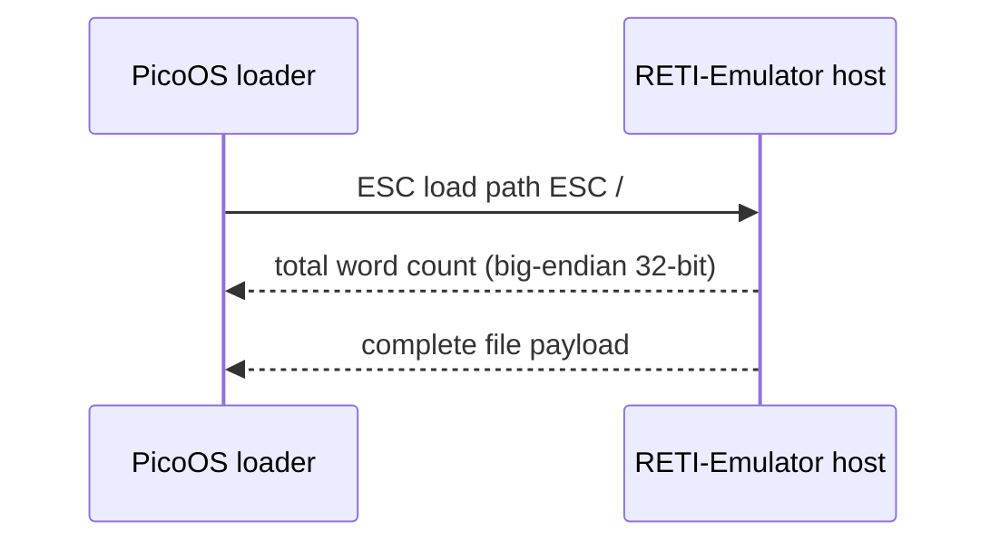
```mermaid
sequenceDiagram
    participant P as PicoOS loader
    participant H as RETI-Emulator host

    P->>H: ESC load path ESC /
    H-->>P: total word count (big-endian 32-bit)
    H-->>P: complete file payload
```

Other host requests use the response form that fits their operation. Ranged
reads prefix a byte payload with its byte count, while metadata and status
requests return one big-endian value without a payload:

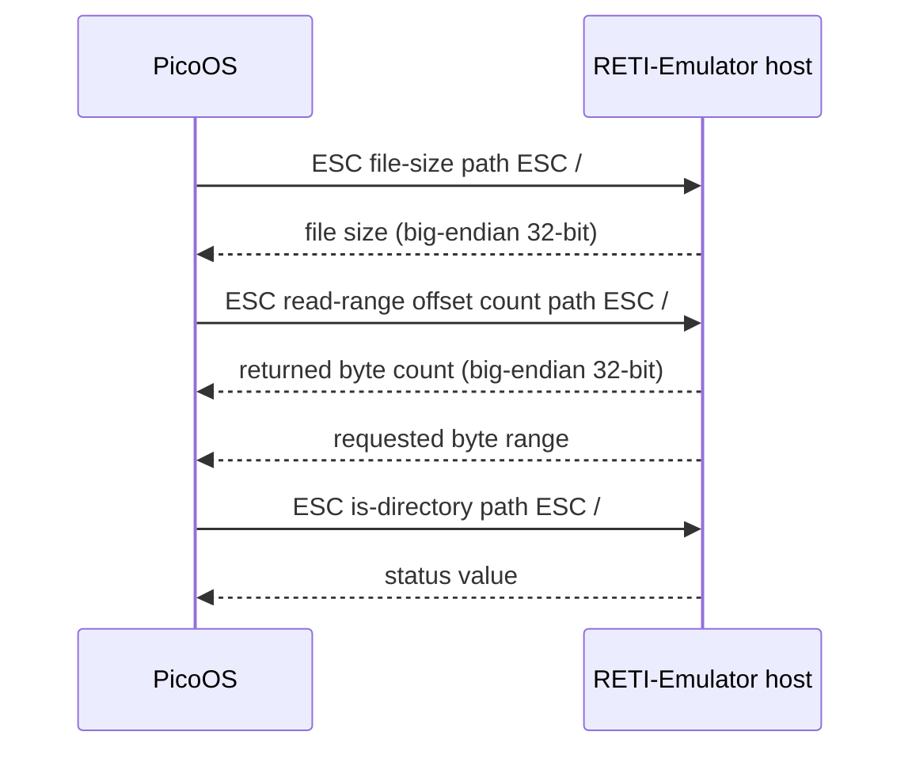
```mermaid
sequenceDiagram
    participant P as PicoOS
    participant H as RETI-Emulator host

    P->>H: ESC file-size path ESC /
    H-->>P: file size (big-endian 32-bit)
    P->>H: ESC read-range offset count path ESC /
    H-->>P: returned byte count (big-endian 32-bit)
    H-->>P: requested byte range
    P->>H: ESC is-directory path ESC /
    H-->>P: status value
```

For `load`, the host returns the complete file length in words followed by the
file bytes, `UINT32_MAX` represents failure. The EPROM bootloader and the
kernel's initial [`init`](system/init.picoc) load consume this stream before scheduling exists. They
copy it with DMA when register 12 reports DMA active and otherwise receive one
word at a time. Later process loading combines `file-size` with `read-range`:
the DMA path requests the complete payload, while the fallback uses independent
1 KiB responses so another process can safely use the host request protocol between
chunks. `read-range`, `file-size`, `pwd`, and `ls` begin their responses with a
big-endian length/value.
Output-selection requests are different: after `<ESC>write path<ESC>/` or
`<ESC>write-at offset path<ESC>/`, ordinary subsequent UART bytes go to that
host file until PicoOS sends `<ESC>write stdout<ESC>/` or selects stderr.
The `literal-output` request protects a known byte count from being parsed as
another host command, regular-file writes use it when their data contains an
escape byte.

The protocol keeps descriptor and path state in PicoOS while leaving file
storage on the host. The bootloader and process loader request binaries through
the same UART transport that later carries bounded file and directory
operations.

### 1.2.3 Debugger, source view, and terminal modes
[\[↑ TOC\]](#contents)

The debugger is the reader's main view of RETI state and PicoC source while
PicoOS runs. The following recording demonstrates its execution controls,
state views, source debugging, snapshots, and UART terminal:

[](https://asciinema.org/a/1264549)

Selecting the thumbnail opens the recording on Asciinema. Its controls let a
reader step, continue, restart, step an ISR, inspect or edit registers and
memory, trigger an interrupt, save/restore snapshots, open source debugging,
and enter normal or raw UART terminal mode. During continuous execution the
terminal remains live and each delivered input byte can raise a UART hardware
interrupt.

The TUI follows live `CS` and `DS` as the bootloader installs the kernel and the
dispatcher switches processes. Compiler `.debuginfo`, preprocessed source,
labels, and `.sections` supply the source/section meaning that raw RETI words
cannot contain themselves. The emulator can therefore show source frames and
section-aware memory while still executing the same encoded words intended for
hardware. The machine model, peripherals, and host protocol described above
provide the state shown in these views.

Normal terminal view `v` leaves host signal processing active and returns with
Escape. Raw view `V` forwards control and escape bytes,including `Ctrl+C`,
`Ctrl+Z`, and arrow-key sequences,and returns with `Ctrl+]`. Raw mode is the
appropriate view for the PicoOS shell because these bytes drive terminal
signals and command-history editing.

# 2. Interrupts, system calls, preemption, and exceptions
[\[↑ TOC\]](#contents)

Interrupts are the controlled entry points for software requests, hardware
events, and synchronous CPU faults. Library functions use system calls to
request kernel services, while timer and device interrupts let the kernel
respond to events that do not originate in the running process. CPU exceptions
use the same interrupt-entry machinery to report instructions that cannot
complete safely.

## 2.1 RETI interrupt entry and the interrupt vector table
[\[↑ TOC\]](#contents)

The linked kernel has five vector cells at the beginning of SRAM. The array
below defines their order, and the following table connects each entry to the
software instruction or hardware source that invokes it:

```c
__attribute__((section("ivt")))
void (*interrupt_vector_table[OS_INTERRUPT_VECTOR_COUNT])(void) = {
    syscall_interrupt,
    timer_interrupt,
    uart_interrupt,
    cpu_exception_interrupt,
    dma_interrupt
};
```

| Vector | Entry | Source |
| ---: | --- | --- |
| 0 | [`syscall_interrupt()`](interrupt_service_routines/isrs.picoc#L74) | Software `INT 0` from userspace |
| 1 | [`timer_interrupt()`](interrupt_service_routines/isrs.picoc#L68) | Timer device |
| 2 | [`uart_interrupt()`](interrupt_service_routines/os_isrs.picoc#L195) | UART receive device |
| 3 | [`cpu_exception_interrupt()`](interrupt_service_routines/os_isrs.picoc#L171) | Fixed synchronous CPU exception vector |
| 4 | [`dma_interrupt()`](interrupt_service_routines/os_isrs.picoc#L233) | DMA completion on the hardware custom-device line |

An `INT` automatically saves only the interrupted return PC. Each ISR
explicitly saves any general registers it needs. `RTI` reloads the PC from
`SP + 1`, increments `SP`, and advances execution.

## 2.2 Interrupt-controller mappings and priorities
[\[↑ TOC\]](#contents)

The vector table fixes the kernel entry order, while the interrupt controller
connects hardware devices to those entries and chooses between pending events.
[`interrupt_device_isrs[]`](kernel/interrupt_controller.picoc#L3) maps
timer/DMA/UART to `1/4/2`, and
[`interrupt_device_priorities[]`](kernel/interrupt_controller.picoc#L9) assigns
priorities `1/1/2`. UART can therefore interrupt the timer or DMA handler,
while timer and DMA requests at the same priority wait for the active handler
to finish.

The following excerpt shows how startup applies those arrays. It disables each
device before restoring the configured vector and priority. The timer remains
inactive until [`interrupt_controller_activate_timer()`](kernel/interrupt_controller.picoc#L34)
sets its 5,000-instruction interval after init is ready:

```c
int interrupt_device_isrs[INTERRUPT_DEVICE_COUNT] = {
    1,                            // INTERRUPT_DEVICE_INTTIMER (index 0)
    4,                            // INTERRUPT_DEVICE_DMA (index 1)
    2                             // INTERRUPT_DEVICE_UART (index 2)
};

int interrupt_device_priorities[INTERRUPT_DEVICE_COUNT] = {
    1, // INTERRUPT_DEVICE_INTTIMER (index 0)
    1, // INTERRUPT_DEVICE_DMA (index 1)
    2  // INTERRUPT_DEVICE_UART (index 2)
};

void interrupt_controller_initialize(void) {
    int device = 0;
    int interrupt_index;
    int priority;

    while (device < INTERRUPT_DEVICE_COUNT) {
        interrupt_controller_disable_device(device);
        interrupt_index = interrupt_device_isrs[device];
        priority = interrupt_device_priorities[device];

        if (interrupt_index != INTERRUPT_CONTROLLER_DISABLED) {
            interrupt_controller_assign_device(device, interrupt_index, priority);
        }

        device = device + 1;
    }
}
```

The two arrays have static storage in kernel `.data`, they do not use
[`kmalloc()`](kernel/kmalloc.picoc#L23). Terminal reads may temporarily disable
and restore the UART mapping so their buffer checks cannot race with the UART
interrupt service routine.

## 2.3 Saved interrupt stack frame
[\[↑ TOC\]](#contents)

System calls and process timer preemption create the same process-stack frame.
[`caller_context`](kernel/dispatcher.picoc#L71) points to its free cell:

| Offset | Stored value |
| ---: | --- |
| `+0` | Free cell addressed by [`caller_context`](kernel/dispatcher.picoc#L71) |
| `+1` | Saved `DS` |
| `+2` | Saved `CS` |
| `+3` | Saved `BAF` |
| `+4` | Saved `IN2` |
| `+5` | Saved `IN1` |
| `+6` | Saved `ACC` |
| `+7` | Return PC saved by interrupt entry |

[`dispatcher_switch_from_context()`](kernel/dispatcher.picoc#L71) copies offsets 1–6 into the current PCB’s
embedded activation and records [`activation.sp`](kernel/process/process.header#L25) = [`caller_context`](kernel/dispatcher.picoc#L71) + 6. The
return PC remains at [`activation.sp`](kernel/process/process.header#L25) + 1 for the later `RTI`.

## 2.4 System-call ABI
[\[↑ TOC\]](#contents)

A library function requests a kernel service by its syscall selector and arguments, rather than
calling a kernel function at a hardcoded address. The installed kernel's syscall interrupt service
routine receives that request, and [`handle_syscall()`](kernel/syscall.picoc#L16) selects the kernel
function that implements it. The library is linked into the user program. The kernel resolves its
own internal function locations when it is built.

This arrangement lets kernel functions move between OS versions without changing the calling
library code. Compatibility still requires the same syscall selectors, register convention, request
layouts, and meaning of arguments and results. Those rules form the system-call ABI documented
below. A change to that ABI can require updated libraries or programs. Using a syscall alone is not
a promise of compatibility with every future PicoOS version.

Standardized library interfaces solve a related problem at the source-code level: an application
using the same supported functions and behavior can be compiled for different operating systems,
with each system's library implementing its own kernel calls. The
[POSIX scope](https://pubs.opengroup.org/onlinepubs/9799919799/basedefs/V1_chap01.html) explicitly targets
source portability and excludes binary portability. It does not standardize PicoOS's syscall
selectors or RETI register convention. PicoOS provides a small set of POSIX-like functions, with some
different signatures and behavior, so familiar names alone do not establish POSIX conformance.
[`8.1 From a library call to the kernel: waitpid`](#81-from-a-library-call-to-the-kernel-waitpid)
shows one complete library implementation using this interface.

The following register rules describe the syscall boundary. The request structures then show how
functions pass several values through its single argument register.

### 2.4.1 Syscall selectors and register convention
[\[↑ TOC\]](#contents)

Userspace wrappers place the syscall selector in `ACC`, one integer or request
pointer in `IN1`, and execute `INT 0`. After `RTI`, `IN2` contains the result,
matching the normal PicoC function-return convention described in the
[Section 1.1.3, System V ABI stack frames and call cleanup](#113-system-v-abi-stack-frames-and-call-cleanup).

A system call has room for one integer argument in `IN1`. Wrappers that need several values
therefore create a request structure in their current userspace stack frame, put its absolute
address in `IN1`, put the selector in `ACC`, and execute `INT 0`. The structures are declared in
[`common/syscall.header`](common/syscall.header) and [`common/file.header`](common/file.header). The
declarations below show all request shapes, the following field tables describe initialization and
use:

```c
struct LoadProcessRequest { char *path; bool show_loading_bar; };
struct RunProcessRequest { int pid; char *arguments; char **environment; };
struct WaitPidRequest { int pid; int *status; };
struct KillRequest { int pid; int signal_number; };
struct PrctlRequest { int option; int argument; };
struct ShmOpenRequest { char *name; size_t size; };
struct GetCwdRequest { char *buffer; int size; };
struct ReadDirectoryRequest { char *path; char *buffer; int capacity; };
struct MoveRequest { char *old_path; char *new_path; };

struct OpenRequest { char *path; int flags; };
struct IoRequest {
    int file_descriptor;
    char *buffer;
    int count;
    bool protect_uart_control;
    bool show_loading_bar;
    int transferred;
    int loading_bar_update;
    bool complete;
};
struct SeekRequest {
    int file_descriptor;
    int offset;
    int origin;
};
struct Dup2Request { int old_file_descriptor; int new_file_descriptor; };
```

### 2.4.2 Process, wait, signal, and memory request structures
[\[↑ TOC\]](#contents)

The table identifies each request field’s purpose. [`load()`](library/unistd/process.picoc#L17),
[`run()`](library/unistd/process.picoc#L31), [`waitpid()`](library/sys/wait/wait.picoc#L14),
[`kill()`](library/signal/signal.picoc#L14), [`prctl()`](library/sys/prctl/prctl.picoc#L14), and
[`shm_open()`](library/sys/mman/mman.picoc#L15) first initialize every field of their respective
local request before invoking the kernel. Kernel startup also constructs a
[`RunProcessRequest`](common/syscall.header#L55) in [`main()`](kernel/kernel.picoc#L31) for init.

| Field | Meaning | Used by |
| --- | --- | --- |
| [`LoadProcessRequest.path`](common/syscall.header#L51) | Path of the `.bin` image | First initialized by [`load()`](library/unistd/process.picoc#L17), [`load()`](library/unistd/process.picoc#L17) / syscall 2, the loader normalizes it and the PCB receives its own [`kmalloc()`](kernel/kmalloc.picoc#L23) path copy |
| [`LoadProcessRequest.show_loading_bar`](common/syscall.header#L52) | Whether UART transfer progress should be printed | First initialized by [`load()`](library/unistd/process.picoc#L17), read only during loading, derived from `PICOOS_LOADING_BAR` |
| [`RunProcessRequest.pid`](common/syscall.header#L56) | PID of an existing `NEW` PCB | First initialized by [`run()`](library/unistd/process.picoc#L31) (or kernel [`main()`](kernel/kernel.picoc#L31) for init), [`run()`](library/unistd/process.picoc#L31) / syscall 3, identifies the PCB changed to `READY` |
| [`RunProcessRequest.arguments`](common/syscall.header#L57) | Space/tab-separated argument string, or `NULL` | First initialized by [`run()`](library/unistd/process.picoc#L31) (or kernel [`main()`](kernel/kernel.picoc#L31) for init), copied into the child's initial process stack, the pointer itself is not retained |
| [`RunProcessRequest.environment`](common/syscall.header#L58) | Null-terminated array of `NAME=value` pointers | First initialized by [`run()`](library/unistd/process.picoc#L31) (or kernel [`main()`](kernel/kernel.picoc#L31) for init), strings and pointer table are copied into the child's initial stack |
| [`WaitPidRequest.pid`](common/syscall.header#L62) | Exact child PID | First initialized by [`waitpid()`](library/sys/wait/wait.picoc#L14), [`waitpid()`](library/sys/wait/wait.picoc#L14) / syscall 7, used to find and validate the child |
| [`WaitPidRequest.status`](common/syscall.header#L63) | Address of caller's status cell | First initialized by [`waitpid()`](library/sys/wait/wait.picoc#L14), immediate status destination or copied into the waiting parent's [`waiting_status_ptr`](kernel/process/process.header#L44) while blocked |
| [`KillRequest.pid`](common/syscall.header#L67) | Target process | First initialized by [`kill()`](library/signal/signal.picoc#L14), [`kill()`](library/signal/signal.picoc#L14) / syscall 10, lookup only, not retained |
| [`KillRequest.signal_number`](common/syscall.header#L68) | Signal to deliver, 0 probes existence | First initialized by [`kill()`](library/signal/signal.picoc#L14), may change target state or defer termination, but the request is not retained |
| [`PrctlRequest.option`](common/syscall.header#L73) | Currently only [`PR_SET_PDEATHSIG`](common/prctl.header#L3) | First initialized by [`prctl()`](library/sys/prctl/prctl.picoc#L14), [`prctl()`](library/sys/prctl/prctl.picoc#L14) / syscall 11, selects the supported operation |
| [`PrctlRequest.argument`](common/syscall.header#L75) | Signal number, or 0 to disable | First initialized by [`prctl()`](library/sys/prctl/prctl.picoc#L14), copied into current PCB [`parent_death_signal`](kernel/process/process.header#L59) |
| [`ShmOpenRequest.name`](common/syscall.header#L79) | Name used to find an entry in the kernel's shared-memory linked list | First initialized by [`shm_open()`](library/sys/mman/mman.picoc#L15), [`shm_open()`](library/sys/mman/mman.picoc#L15) / syscall 18, a new entry receives a [`kmalloc()`](kernel/kmalloc.picoc#L23) copy |
| [`ShmOpenRequest.size`](common/syscall.header#L80) | Requested shared region size in RETI cells | First initialized by [`shm_open()`](library/sys/mman/mman.picoc#L15), used only when creating a name, an existing entry is not resized |

### 2.4.3 File and directory request structures
[\[↑ TOC\]](#contents)

The table traces file and directory arguments from userspace into the kernel.
[`open()`](library/fcntl/fcntl.picoc#L5) and [`fopen()`](library/stdio/stdio.picoc#L125) initialize
[`OpenRequest`](common/file.header#L26), [`read()`](library/unistd/io.picoc#L6),
[`write()`](library/unistd/io.picoc#L32), and [`write_without_uart_escape_check()`](library/unistd/io.picoc#L43) initialize
the [`IoRequest`](common/file.header#L31) fields each operation uses.
[`lseek()`](library/unistd/io.picoc#L66), [`dup2()`](library/unistd/io.picoc#L58),
[`getcwd()`](library/unistd/working_directory.picoc#L11),
[`opendir()`](library/dirent/dirent.picoc#L8), and [`move()`](library/unistd/file_removal.picoc#L12)
initialize their corresponding request structures before the call.

| Field | Meaning | Used by |
| --- | --- | --- |
| [`OpenRequest.path`](common/file.header#L27) | Relative or absolute PicoOS path to a host-backed file or kernel device | First initialized by [`open()`](library/fcntl/fcntl.picoc#L5) or [`fopen()`](library/stdio/stdio.picoc#L125), [`open()`](library/fcntl/fcntl.picoc#L5)/[`fopen()`](library/stdio/stdio.picoc#L125) and syscall 22, normalized and copied into the selected descriptor |
| [`OpenRequest.flags`](common/file.header#L28) | Access mode plus [`O_CREAT`](common/file.header#L13), [`O_TRUNC`](common/file.header#L14), or [`O_APPEND`](common/file.header#L15) | First initialized by [`open()`](library/fcntl/fcntl.picoc#L5) or [`fopen()`](library/stdio/stdio.picoc#L125), copied into the descriptor, create/truncate decide open requests and append changes later write positioning |
| [`IoRequest.file_descriptor`](common/file.header#L32) | Entry number in the current PCB’s eight-entry table | First initialized by [`read()`](library/unistd/io.picoc#L6), [`write()`](library/unistd/io.picoc#L32), [`write_without_uart_escape_check()`](library/unistd/io.picoc#L43), or stdio I/O wrappers, used by syscalls 23/24 |
| [`IoRequest.buffer`](common/file.header#L33) | Userspace destination for read or source for write | First initialized by [`read()`](library/unistd/io.picoc#L6), [`write()`](library/unistd/io.picoc#L32), [`write_without_uart_escape_check()`](library/unistd/io.picoc#L43), or stdio I/O wrappers, used directly during the call, for a blocked terminal read the caller's PCB temporarily retains the destination pointer |
| [`IoRequest.count`](common/file.header#L34) | Maximum cells to read or exact cells to write | First initialized by [`read()`](library/unistd/io.picoc#L6), [`write()`](library/unistd/io.picoc#L32), [`write_without_uart_escape_check()`](library/unistd/io.picoc#L43), or stdio I/O wrappers, validated before transfer, retained in terminal pending state only while stdin is blocked |
| [`IoRequest.protect_uart_control`](common/file.header#L35) | Whether a write must scan for `<ESC>` and protect a matching buffer with `literal-output <count>` | First initialized to `true` by [`write()`](library/unistd/io.picoc#L32), [`fputc()`](library/stdio/stdio.picoc#L204), and [`fputs()`](library/stdio/stdio.picoc#L229), initialized to `false` by [`write_without_uart_escape_check()`](library/unistd/io.picoc#L43), [`read()`](library/unistd/io.picoc#L6), [`fgetc()`](library/stdio/stdio.picoc#L178), [`write_process_exception_message()`](kernel/exception.picoc#L29), and [`list_processes()`](kernel/process/process.picoc#L32), read by [`write_file_descriptor()`](kernel/filesystem/filesystem.picoc#L217) |
| [`IoRequest.show_loading_bar`](common/file.header#L36) | Whether a host-file read shows progress | First initialized by [`read()`](library/unistd/io.picoc#L6), write wrappers, or stdio I/O wrappers, [`read()`](library/unistd/io.picoc#L6) derives this from the environment, writes set it false |
| [`IoRequest.transferred`](common/file.header#L37) | Bytes already copied by earlier chunks of the same [`read()`](library/unistd/io.picoc#L6) | First initialized to 0 by [`read()`](library/unistd/io.picoc#L6) (or stdio input), updated by [`read()`](library/unistd/io.picoc#L6) and read by [`read_regular_file()`](kernel/filesystem/filesystem.picoc#L90) as the next buffer position |
| [`IoRequest.loading_bar_update`](common/file.header#L38) | Next total byte count that redraws read progress | First initialized by [`read_regular_file()`](kernel/filesystem/filesystem.picoc#L90) after the first successful range response, retained and updated for subsequent chunks |
| [`IoRequest.complete`](common/file.header#L39) | Whether [`read()`](library/unistd/io.picoc#L6) should return instead of invoking another chunk | First initialized to false by [`read()`](library/unistd/io.picoc#L6), set by [`read_file_descriptor()`](kernel/filesystem/filesystem.picoc#L150) or [`read_regular_file()`](kernel/filesystem/filesystem.picoc#L90) on completion/error |
| [`SeekRequest.file_descriptor`](common/file.header#L43) | Regular-file descriptor to reposition | First initialized by [`lseek()`](library/unistd/io.picoc#L66), [`lseek()`](library/unistd/io.picoc#L66) / syscall 26 |
| [`SeekRequest.offset`](common/file.header#L44) | Signed displacement | First initialized by [`lseek()`](library/unistd/io.picoc#L66), combined with [`SEEK_SET`](common/file.header#L17), current descriptor offset, or host file size |
| [`SeekRequest.origin`](common/file.header#L45) | [`SEEK_SET`](common/file.header#L17), [`SEEK_CUR`](common/file.header#L18), or [`SEEK_END`](common/file.header#L19) | First initialized by [`lseek()`](library/unistd/io.picoc#L66), selects the base for the new descriptor offset |
| [`Dup2Request.old_file_descriptor`](common/file.header#L49) | Descriptor to copy | First initialized by [`dup2()`](library/unistd/io.picoc#L58), syscall 27 leaves the source entry unchanged |
| [`Dup2Request.new_file_descriptor`](common/file.header#L50) | Entry to replace | First initialized by [`dup2()`](library/unistd/io.picoc#L58), the target receives an independent copy of the source fields and path |
| [`GetCwdRequest.buffer`](common/syscall.header#L84) | Userspace destination | First initialized by [`getcwd()`](library/unistd/working_directory.picoc#L11), [`getcwd()`](library/unistd/working_directory.picoc#L11) / syscall 30, receives the selected directory copy |
| [`GetCwdRequest.size`](common/syscall.header#L85) | Destination capacity | First initialized by [`getcwd()`](library/unistd/working_directory.picoc#L11), prevents copying a path that does not fit |
| [`ReadDirectoryRequest.path`](common/syscall.header#L89) | Directory to list | First initialized by [`opendir()`](library/dirent/dirent.picoc#L8), [`opendir()`](library/dirent/dirent.picoc#L8) / syscall 32, normalized for the host request |
| [`ReadDirectoryRequest.buffer`](common/syscall.header#L90) | Userspace listing buffer | First initialized by [`opendir()`](library/dirent/dirent.picoc#L8), receives `d name\n` / `- name\n` records from the host |
| [`ReadDirectoryRequest.capacity`](common/syscall.header#L91) | Maximum returned cells | First initialized by [`opendir()`](library/dirent/dirent.picoc#L8), bounds the UART response and copy |
| [`MoveRequest.old_path`](common/syscall.header#L95) | Existing file or directory | First initialized by [`move()`](library/unistd/file_removal.picoc#L12), normalized and sent as the first `move` host request path |
| [`MoveRequest.new_path`](common/syscall.header#L96) | New file or directory path | First initialized by [`move()`](library/unistd/file_removal.picoc#L12), normalized and sent as the second `move` host request path |

Single-argument calls do not need a request: PID selectors, descriptor close,
[`mmap(id)`](library/sys/mman/mman.picoc#L23),
[`shm_unlink(name)`](library/sys/mman/mman.picoc#L27), path-only operations, wait-queue pointers,
and foreground-process selection pass the value or pointer directly in `IN1`.

### 2.4.4 Request-pointer ownership and lifetime
[\[↑ TOC\]](#contents)

These request objects are not allocated with [`malloc()`](library/stdlib/malloc.picoc#L35),
[`kmalloc()`](kernel/kmalloc.picoc#L23), or [`pmalloc()`](kernel/pmalloc.picoc#L20): they are
ordinary locals in the caller's process stack. The kernel reads them synchronously through the
absolute pointer. [`load()`](library/unistd/process.picoc#L17) and regular-file
[`read()`](library/unistd/io.picoc#L6) keep their local request alive while their wrappers make
repeated syscalls, but the kernel does not retain its pointer between calls. The important exception
is the value of [`WaitPidRequest.status`](common/syscall.header#L63): when waiting blocks, the
kernel copies that separate pointer into
[`Process.waiting_status_ptr`](kernel/process/process.header#L44), the pointed-to status cell
remains safe because the caller’s stack is suspended. A blocked or stopped terminal read similarly
retains the destination buffer and count in the PCB, as shown in
[Section 7.3, Blocking and completing terminal reads](#73-blocking-and-completing-terminal-reads).

## 2.5 Handling system calls and returning to userspace
[\[↑ TOC\]](#contents)

[Section 2.4, System-call ABI](#24-system-call-abi) explains how a system call enters vector 0
with the selector and argument already placed in registers. This entry does not pass through the
dispatcher. The RETI interrupt mechanism decrements the current process's
`SP`, stores the `INT 0` instruction's PC at `SP + 1`, and loads the handler PC
from vector 0. It does not select the kernel stack, change `CS` or `DS`, or
save any general register.

The naked assembly entry completes that work before any C code runs. While the
process stack is still active, it pushes `ACC`, `IN1`, `IN2`, `BAF`, `CS`, and
`DS`, producing the frame described in [Section 2.3, Saved interrupt stack frame](#23-saved-interrupt-stack-frame).
It then copies the frame's free-cell address from `SP` to `BAF`, this value is
the [`caller_context`](kernel/dispatcher.picoc#L71) passed through the kernel.
Only after the complete process context is on that stack does the entry
temporarily disable stack-overflow
checking by writing `0` to periphery register 10, load the kernel `CS`, `DS`,
and `SP`, and re-enable checking with the kernel stack boundary. It sets `IN1`
to `0` for
[`write_stack_heap_boundary_from_in1()`](common/periphery_asm.header#L2), then
reuses `IN2` and `ACC` to build the C call after their process values are safe
in the saved frame. Its later argument and return-address pushes therefore use
the kernel stack. The
complete [`syscall_interrupt()`](interrupt_service_routines/os_isrs.picoc#L104)
entry, [`syscall_interrupt_return()`](interrupt_service_routines/os_isrs.picoc#L143)
continuation, and
[`syscall_interrupt_restore()`](interrupt_service_routines/os_isrs.picoc#L158)
restoration stub are shown below so the complete entry and return path remains
visible:

```c
__attribute__((naked))
void syscall_interrupt(void) {
    // Saves the same context layout as timer_interrupt
    asm("PUSH ACC"); // Syscall number
    asm("PUSH IN1"); // Syscall argument
    asm("PUSH IN2");
    asm("PUSH BAF");
    asm("PUSH CS");
    asm("PUSH DS");

    // BAF keeps old_sp while loading kernel CS, DS and SP
    asm("MOVE SP BAF");
    asm("LOADI IN1 0");
    write_stack_heap_boundary_from_in1();
    asm(KERNEL_CS_START_ASM);
    asm(KERNEL_DS_START_ASM);
    asm(KERNEL_SP_START_ASM);
    activate_kernel_stack_boundary();

    // Builds the handle_syscall arguments from the saved context
    asm("PUSH BAF"); // Caller context
    asm("LOADIN BAF IN2 5");
    asm("PUSH IN2"); // Syscall argument
    asm("LOADIN BAF IN2 6");
    asm("PUSH IN2"); // Syscall number

    // A syscall that switches processes resumes with a successful IN2 result
    asm("LOADI IN2 1");
    asm("STOREIN BAF IN2 4");

    // Calls handle_syscall and returns through syscall_interrupt_return
    asm("LOADI32 ACC syscall_interrupt_return");
    asm("ADD ACC CS");
    asm("PUSH ACC"); // Return address: syscall restoration stub
    asm("LOADI32 ACC handle_syscall");
    asm("ADD ACC CS");
    asm("MOVE ACC PC");
}

__attribute__((naked))
void syscall_interrupt_return(void) {
    // Handle_syscall restores BAF to the saved caller context before returning
    // Saves the IN2 result before a pending timer request can dispatch the caller
    asm("STOREIN BAF IN2 4");

    asm("PUSH BAF"); // Caller context
    asm("LOADI32 ACC syscall_interrupt_restore");
    asm("ADD ACC CS");
    asm("PUSH ACC");
    asm("LOADI32 ACC dispatcher_reschedule_if_requested");
    asm("ADD ACC CS");
    asm("MOVE ACC PC");
}

__attribute__((naked))
void syscall_interrupt_restore(void) {
    asm("MOVE BAF SP");
    activate_current_process_stack_boundary();
    asm("POP DS");
    asm("POP CS");
    asm("POP BAF");
    asm("POP IN2");
    asm("POP IN1");
    asm("POP ACC");
    asm("RTI");
}
```

The three context-loading macros come from the generated
[`kernel/memory_constants.header`](kernel/memory_constants.header):
[`KERNEL_CS_START_ASM`](kernel/memory_constants.header#L6) and
[`KERNEL_DS_START_ASM`](kernel/memory_constants.header#L7) contain `LOADI32`
instructions for the absolute linked segment bases, and
[`KERNEL_SP_START_ASM`](kernel/memory_constants.header#L8) contains the
`LOADI32 SP` instruction for the top of the kernel stack. The build rule in
[`Makefile`](Makefile#L716) runs `picoc_compiler` with `-k sram`, the configured
`--heap-size` and `--stack-size`, and all kernel sources. The compiler links far
enough to calculate `codesegment_start`, `datasegment_start`, `heap_start`, and
`stack_start`, writes their absolute SRAM values into the header, and then the
normal kernel build includes that header through
[`os_isrs.picoc`](interrupt_service_routines/os_isrs.picoc#L3). The same file's
[`KERNEL_HEAP_START`](kernel/memory_constants.header#L3) and
[`KERNEL_HEAP_SIZE`](kernel/memory_constants.header#L4) define the boundary
installed by
[`activate_kernel_stack_boundary()`](kernel/exception.picoc#L11). The complete
set of generated values is described in
[Section 1.1.8, Generated memory constants for the bootloader and kernel](#118-generated-memory-constants-for-the-bootloader-and-kernel).

Once the assembly entry has installed the kernel stack,
[`handle_syscall()`](kernel/syscall.picoc#L16) selects the requested operation
with an `if`/`else if` chain. Simple calls pass their argument directly, while
larger calls cast it to the request structure defined by the ABI. The excerpt
shows both forms and a call that also needs the saved process context, the
remaining selectors follow the same pattern:

```c
int handle_syscall(int syscall_number, int argument, int *caller_context) {
    if (syscall_number == SYSCALL_SHUTDOWN) {
        shutdown();
        return 1;
    } else if (syscall_number == SYSCALL_REBOOT) {
        reboot();
        return 1;
    } else if (syscall_number == SYSCALL_LOAD_PROCESS) {
        return load_process_chunk(
            ((struct LoadProcessRequest *)argument)->path,
            ((struct LoadProcessRequest *)argument)->show_loading_bar,
            caller_context
        );
    } else if (syscall_number == SYSCALL_RUN_PROCESS_WITH_ARGUMENTS) {
        return mark_process_ready_with_arguments((struct RunProcessRequest *)argument);
    } else if (syscall_number == SYSCALL_LIST_PROCESSES) {
        list_processes();
        return 1;
    } else if (syscall_number == SYSCALL_UNLOAD_PROCESS) {
        return unload_process_by_pid(argument);
    }

    // ...

    return 0;
}
```

### 2.5.1 Selecting the return path
[\[↑ TOC\]](#contents)

After [`handle_syscall()`](kernel/syscall.picoc#L16) returns, its result is in
`IN2`. [`syscall_interrupt_return()`](interrupt_service_routines/os_isrs.picoc#L143)
first copies that value into saved `IN2` at `caller_context[4]`, then calls
[`dispatcher_reschedule_if_requested()`](kernel/dispatcher.picoc#L14) with
[`syscall_interrupt_restore()`](interrupt_service_routines/os_isrs.picoc#L158)
as the return address.

If no rescheduling is pending, the check returns to
[`syscall_interrupt_restore()`](interrupt_service_routines/os_isrs.picoc#L158),
so that stub restores the calling process directly. If rescheduling is pending,
the check enters the dispatcher and does not return to the restoration stub.
The dispatcher copies saved `IN2` from `caller_context[4]` to
[`activation.in2`](kernel/process/process.header#L23), preserving the syscall
result until it restores that process. Therefore, the result survives because
it is moved from `IN2` into the saved frame and then into the PCB activation.

The following sequence shows these two outcomes after the syscall handler
returns.

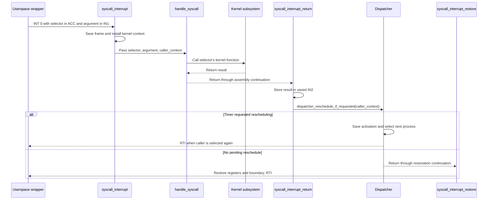
```mermaid
sequenceDiagram
    participant U as Userspace wrapper
    participant I as syscall_interrupt
    participant K as handle_syscall
    participant S as Kernel subsystem
    participant R as syscall_interrupt_return
    participant D as Dispatcher
    participant X as syscall_interrupt_restore

    U->>I: INT 0 with selector in ACC and argument in IN1
    I->>I: Save frame and install kernel context
    I->>K: Pass selector, argument, caller_context
    K->>S: Call selector's kernel function
    S-->>K: Return result
    K-->>R: Return through assembly continuation
    R->>R: Store result in saved IN2
    R->>D: dispatcher_reschedule_if_requested(caller_context)
    alt Timer requested rescheduling
        D->>D: Save activation and select next process
        D-->>U: RTI when caller is selected again
    else No pending reschedule
        D-->>X: Return through restoration continuation
        X-->>U: Restore registers and boundary, RTI
    end
```

When [`syscall_interrupt_restore()`](interrupt_service_routines/os_isrs.picoc#L158)
runs, it restores the saved registers, including the result in `IN2`, and then
executes `RTI`. On the dispatcher path, the dispatcher later restores the same
register values from the PCB and executes `RTI` itself, so
[`syscall_interrupt_restore()`](interrupt_service_routines/os_isrs.picoc#L158)
is not executed afterward. In short, the restoration stub runs only when the
syscall handler returns and the rescheduling check also returns normally.

### 2.5.2 System-call groups
[\[↑ TOC\]](#contents)

PicoOS implements **37 syscalls** in the consecutive selector range **0–36**.
Related selectors are adjacent in [`common/syscall.header`](common/syscall.header) and
[`handle_syscall()`](kernel/syscall.picoc#L16).

The table groups these calls by subsystem. Its `Kernel functions` column shows
the entry points reached by each group, while the preceding
[Section 2.4, System-call ABI](#24-system-call-abi) defines the request structures used for
multi-argument calls.

| Group | Selectors | Purpose, in selector order | Kernel functions |
| --- | --- | --- | --- |
| System control | 0–1 | Shutdown, reboot | [`shutdown()`](kernel/kernel.picoc#L15), [`reboot()`](kernel/kernel.picoc#L19) |
| Process management | 2–11 | Load, run, list, unload, exit, exact-child wait, PID query, terminal ownership, signal delivery, parent-death setting | [`load_process_chunk()`](kernel/process/process_loader.picoc#L292), [`mark_process_ready_with_arguments()`](kernel/process/process_arguments.picoc#L241), [`list_processes()`](kernel/process/process.picoc#L32), [`unload_process_by_pid()`](kernel/process/process.picoc#L328), [`exit_process()`](kernel/process/process.picoc#L430), [`wait_for_process_by_pid()`](kernel/process/process.picoc#L348), [`current_process()`](kernel/process/process.picoc#L62), [`set_foreground_process()`](kernel/signal.picoc#L148), [`send_signal_by_pid()`](kernel/signal.picoc#L108), [`set_parent_death_signal()`](kernel/signal.picoc#L137) |
| Scheduling | 12–14 | Queue sleep, queue wakeup, yield | [`sleep_on_wait_queue()`](kernel/process/process.picoc#L390), [`wakeup_wait_queue()`](kernel/process/process.picoc#L395), [`dispatcher_switch_from_context()`](kernel/dispatcher.picoc#L71) |
| Process and shared memory | 15–20 | Heap start, heap size, heap-exhaustion handling, shared-memory open, map, unlink | [`process_heap_start()`](kernel/process/process.picoc#L418), [`process_heap_size()`](kernel/process/process.picoc#L424), [`handle_process_heap_full_exception()`](kernel/exception.picoc#L82), [`open_shared_memory()`](kernel/shared_memory.picoc#L92), [`map_shared_memory()`](kernel/shared_memory.picoc#L130), [`unlink_shared_memory()`](kernel/shared_memory.picoc#L151) |
| Descriptors and I/O | 21–28 | Descriptor availability, open, read, write, close, seek, duplicate, direct UART byte send | Selector 21 returns 1 directly, [`open_file_descriptor()`](kernel/filesystem/filesystem.picoc#L39), [`read_file_descriptor()`](kernel/filesystem/filesystem.picoc#L150), [`write_file_descriptor()`](kernel/filesystem/filesystem.picoc#L217), [`close_file_descriptor()`](kernel/filesystem/file_descriptor.picoc#L146), [`seek_file_descriptor()`](kernel/filesystem/filesystem.picoc#L268), [`duplicate_file_descriptor()`](kernel/filesystem/file_descriptor.picoc#L163), [`send_byte_over_uart()`](kernel/uart_hardware.picoc#L9) |
| Paths and directories | 29–36 | Change/get working directory, make/read directory, unlink file, remove directory, move path, touch file | [`change_working_directory()`](kernel/filesystem/host_filesystem.picoc#L163), [`get_working_directory()`](kernel/filesystem/host_filesystem.picoc#L156), [`make_host_directory()`](kernel/filesystem/host_filesystem.picoc#L177), [`read_host_directory()`](kernel/filesystem/host_filesystem.picoc#L187), [`unlink_host_file()`](kernel/filesystem/host_filesystem.picoc#L208), [`remove_host_directory()`](kernel/filesystem/host_filesystem.picoc#L212), [`move_host_path()`](kernel/filesystem/host_filesystem.picoc#L216), [`touch_host_file()`](kernel/filesystem/host_filesystem.picoc#L234) |

## 2.6 Timer interrupts and userspace preemption
[\[↑ TOC\]](#contents)

The timer is mapped to vector 1 with priority 1 and activated with an interval
of 5,000 instructions after init becomes ready. The interval counts emulated
instructions rather than wall-clock time.
[Section 2.6.3, Shell character delay for different timer intervals](#263-shell-character-delay-for-different-timer-intervals) explains why PicoOS
uses this value. [Section 12.3, Interactive line editing and command history](#123-interactive-line-editing-and-command-history)
separately reduces the time spent receiving and printing typed characters.

### 2.6.1 Timer interrupt path
[\[↑ TOC\]](#contents)

The complete [`timer_interrupt()`](interrupt_service_routines/os_isrs.picoc#L33)
entry, [`timer_interrupt_kernel_return()`](interrupt_service_routines/os_isrs.picoc#L62),
[`timer_interrupt_process()`](interrupt_service_routines/os_isrs.picoc#L74), and
[`timer_interrupt_after_reschedule_request()`](interrupt_service_routines/os_isrs.picoc#L91)
continuations are shown below so the context-switch work behind that tradeoff is
visible:

```c
__attribute__((naked))
void timer_interrupt(void) {
    // Saves the interrupted context before requesting a process switch
    asm("PUSH ACC");
    asm("PUSH IN1");
    asm("PUSH IN2");
    asm("PUSH BAF");
    asm("PUSH CS");
    asm("PUSH DS");
    // SP is saved later. From then on, its value is called old_sp

    // Uses kernel segments because an interrupt can arrive during entry or return
    asm(KERNEL_CS_START_ASM);
    asm(KERNEL_DS_START_ASM);

    // Process interrupts must leave the nearly exhausted process stack before
    // calling kernel functions. Kernel interrupts keep their live kernel stack
    asm("LOADIN SP ACC 7"); // Interrupted PC above the six saved registers
    asm("SUB ACC DS");
    asm("JUMP32>= timer_interrupt_process");

    asm("LOADI32 ACC timer_interrupt_kernel_return");
    asm("ADD ACC CS");
    asm("PUSH ACC");
    asm("LOADI32 ACC dispatcher_request_reschedule");
    asm("ADD ACC CS");
    asm("MOVE ACC PC");
}

__attribute__((naked))
void timer_interrupt_kernel_return(void) {
    // The pending request is consumed when this kernel work returns to a process
    asm("POP DS");
    asm("POP CS");
    asm("POP BAF");
    asm("POP IN2");
    asm("POP IN1");
    asm("POP ACC");
    asm("RTI");
}

__attribute__((naked))
void timer_interrupt_process(void) {
    // BAF keeps old_sp while loading kernel CS, DS and SP
    asm("MOVE SP BAF");
    asm("LOADI IN1 0");
    write_stack_heap_boundary_from_in1();
    asm(KERNEL_SP_START_ASM);
    activate_kernel_stack_boundary();

    asm("LOADI32 ACC timer_interrupt_after_reschedule_request");
    asm("ADD ACC CS");
    asm("PUSH ACC");
    asm("LOADI32 ACC dispatcher_request_reschedule");
    asm("ADD ACC CS");
    asm("MOVE ACC PC");
}

__attribute__((naked))
void timer_interrupt_after_reschedule_request(void) {
    // Passes the interrupted stack frame to the dispatcher
    asm("PUSH BAF"); // Caller context

    // The dispatcher switches to a process through RTI and does not return
    asm("LOADI ACC 0");
    asm("PUSH ACC"); // Unreachable return address required by the call frame
    asm("LOADI32 ACC dispatcher_switch_from_context");
    asm("ADD ACC CS");
    asm("MOVE ACC PC");
}
```

After saving six registers, the entry reads the interrupted `PC` seven cells
above `SP` and compares it with the kernel data-segment boundary. It does this
before building a call frame: [`dispatcher_request_reschedule()`](kernel/dispatcher.picoc#L10)
needs stack space, and calling it while `SP` still referred to an almost-full
process stack could cross that process's stack/heap boundary after kernel `CS`
and `DS` were already active. The resulting fault would then appear to be a
kernel stack overflow instead of the intended user-process stack overflow.

For a userspace interruption, [`timer_interrupt_process()`](interrupt_service_routines/os_isrs.picoc#L74)
preserves the process frame in `BAF`, disables its boundary while changing
stacks, installs `KERNEL_SP_START_ASM`, and activates the kernel boundary before
requesting rescheduling. Its continuation then passes the preserved frame to
[`dispatcher_switch_from_context()`](kernel/dispatcher.picoc#L71). For a kernel
interruption, [`timer_interrupt_kernel_return()`](interrupt_service_routines/os_isrs.picoc#L62)
keeps the live kernel stack, restores the saved registers, and executes `RTI`.

If the timer interrupted userspace, its process activation is saved and goes
through the scheduler immediately. If it interrupted kernel code, that code
resumes directly and the pending request is consumed by the next syscall-return
path. This keeps kernel execution non-preemptive without losing a time slice
that expires inside a syscall.

### 2.6.2 Kernel non-preemption and deferred rescheduling
[\[↑ TOC\]](#contents)

The timer interrupt behaves differently in userspace and in the kernel. That
distinction makes kernel execution non-preemptive and explains why long
polling transfers return to userspace between bounded chunks.

PicoOS uses `0x80000000` as its SRAM base and configures 2^18 physical SRAM
words. Kernel code is non-preemptive: a timer interrupt that interrupted
kernel code records a pending reschedule and returns to that code. The request
is consumed when the syscall next leaves the kernel, before its process resumes
in userspace. A UART interrupt can briefly run while the kernel is waiting, but
it returns to the interrupted kernel work. Kernel operations therefore do not
overlap with another process’s kernel operations, so the kernel does not need
internal locks.

Executable loading and regular-file reads keep that kernel model while
bounding its latency. Regular-file reads and process loading without DMA
transfer at most 1 KiB of payload per syscall. Their wrappers can request the
next chunk directly because
a timer observed during the previous chunk is handled at that syscall's return
boundary. With DMA, process loading starts one complete payload transfer and
blocks its caller until the DMA completion interrupt wakes it.

### 2.6.3 Shell character delay for different timer intervals
[\[↑ TOC\]](#contents)

Choosing the interval is useful because it decides how often PicoOS can give a
waiting shell or program a turn, while every timer interrupt also takes time
away from useful program work. The measurement times character delay while an
endless empty loop is running.

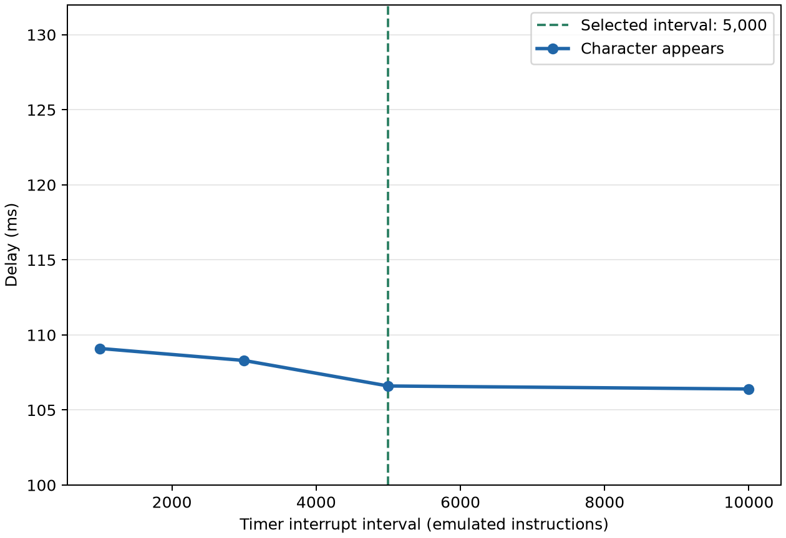

**PicoOS uses 5,000 instructions because it was the best balance:** character
delay was nearly the same as at 10,000, but 10,000 can make the shell wait
longer. Shorter intervals waste more time switching programs. The method,
results, and tradeoffs are in
[Shell input latency and timer interval](documentation/shell_input_latency.md).

## 2.7 UART receive interrupt path
[\[↑ TOC\]](#contents)

UART is mapped to vector 2 at the higher priority 2. The naked
[`uart_interrupt()`](interrupt_service_routines/os_isrs.picoc#L195) entry
temporarily enters kernel code, calls
[`handle_uart_interrupt()`](kernel/filesystem/terminal.picoc#L213), and continues
through [`uart_interrupt_return()`](interrupt_service_routines/os_isrs.picoc#L220)
to restore the exact interrupted context. The interrupt service routine below
shows this entry and return sequence:

```c
__attribute__((naked))
void uart_interrupt(void) {
    // Saves the interrupted context while the kernel transfers one input byte
    asm("PUSH ACC");
    asm("PUSH IN1");
    asm("PUSH IN2");
    asm("PUSH BAF");
    asm("PUSH CS");
    asm("PUSH DS");

    // BAF keeps the interrupted stack while the handler uses kernel segments
    // Keeping SP avoids overwriting a suspended kernel call frame when all
    // processes are blocked and the dispatcher is waiting for an interrupt
    asm("MOVE SP BAF");
    asm(KERNEL_CS_START_ASM);
    asm(KERNEL_DS_START_ASM);

    asm("LOADI32 ACC uart_interrupt_return");
    asm("ADD ACC CS");
    asm("PUSH ACC");
    asm("LOADI32 ACC handle_uart_interrupt");
    asm("ADD ACC CS");
    asm("MOVE ACC PC");
}

__attribute__((naked))
void uart_interrupt_return(void) {
    // Restores the context that was active before the UART interrupt
    asm("MOVE BAF SP");
    asm("POP DS");
    asm("POP CS");
    asm("POP BAF");
    asm("POP IN2");
    asm("POP IN1");
    asm("POP ACC");
    asm("RTI");
}
```

[`uart_interrupt()`](interrupt_service_routines/os_isrs.picoc#L195) first saves
the six registers used by interrupted code. It keeps the interrupted `SP` in
`BAF`, installs the kernel code and data segments, and jumps to
[`handle_uart_interrupt()`](kernel/filesystem/terminal.picoc#L213) with
[`uart_interrupt_return()`](interrupt_service_routines/os_isrs.picoc#L220) as
the return address. The return continuation restores the interrupted stack and
registers before `RTI` resumes the interrupted instruction stream.

With that context protected, the C handler can acknowledge and dispatch the
received byte without changing the state that the interrupted code observes:

```c
void handle_uart_interrupt(void) {
    struct Process *process = terminal_input_process();
    struct Terminal *terminal = kernel_terminal();
    int value;
    int status;

    value = periphery_read_register(UART_RECEIVE_REGISTER) & 255;
    status = periphery_read_register(UART_STATUS_REGISTER);
    periphery_write_register(
        UART_STATUS_REGISTER,
        status | UART_RECEIVE_READY
    );

    if (handle_terminal_signal_character(value)) {
        return;
    }

    enqueue_terminal_byte(terminal, value);
    complete_pending_terminal_read(process, terminal);
}
```

The C handler acknowledges one byte. `Ctrl+C` becomes [`SIGINT`](common/signal.header#L4) and `Ctrl+Z` becomes
[`SIGTSTP`](common/signal.header#L8) for the foreground process. Any other byte is offered to the global terminal
ring. If the ring is already full, the new byte is dropped so unread bytes are
not overwritten. If the foreground process is waiting, the handler copies
available ring bytes into that process's pending read buffer, writes the result
into its saved [`activation.in2`](kernel/process/process.header#L23), and wakes
it. The ring states and overflow policy are detailed in
[Section 7.2, Global terminal input buffer](#72-global-terminal-input-buffer).

## 2.8 DMA completion interrupt path
[\[↑ TOC\]](#contents)

DMA completion uses vector 4 on the custom-device interrupt line. The naked
[`dma_interrupt()`](interrupt_service_routines/os_isrs.picoc#L233) entry saves
the interrupted registers, installs kernel segments, and calls
[`handle_dma_interrupt()`](kernel/dma.picoc#L40). That handler wakes the FIFO
head of the global [`dma_waiters`](kernel/dma.picoc#L6) queue, the interrupted
context is then restored with `RTI`. Process loading later explains how a
caller enters this queue while a UART-to-SRAM transfer is active.

The interrupt service routine and its C handler are short enough to show
together. The assembly preserves the interrupted stack in `BAF`, and the
handler only wakes the process waiting for the completed transfer:

```c
__attribute__((naked))
void dma_interrupt(void) {
    // Saves the interrupted context while the kernel completes the DMA wait
    asm("PUSH ACC");
    asm("PUSH IN1");
    asm("PUSH IN2");
    asm("PUSH BAF");
    asm("PUSH CS");
    asm("PUSH DS");

    // BAF keeps the interrupted stack while the handler uses kernel segments
    asm("MOVE SP BAF");
    asm(KERNEL_CS_START_ASM);
    asm(KERNEL_DS_START_ASM);

    asm("LOADI32 ACC dma_interrupt_return");
    asm("ADD ACC CS");
    asm("PUSH ACC");
    asm("LOADI32 ACC handle_dma_interrupt");
    asm("ADD ACC CS");
    asm("MOVE ACC PC");
}

__attribute__((naked))
void dma_interrupt_return(void) {
    // Restores the context that was active before the DMA interrupt
    asm("MOVE BAF SP");
    asm("POP DS");
    asm("POP CS");
    asm("POP BAF");
    asm("POP IN2");
    asm("POP IN1");
    asm("POP ACC");
    asm("RTI");
}

void handle_dma_interrupt(void) {
    wakeup_wait_queue(&dma_waiters);
}
```

[`initialize_dma()`](kernel/dma.picoc#L9) initializes that queue once and records
the result in [`dma_initialized`](kernel/dma.picoc#L7). A later
[`start_dma_uart_receive()`](kernel/dma.picoc#L18) accepts a transfer only when
DMA is active, the device is idle, and no process is already waiting. It stores
the load-continuation result in the saved syscall frame, blocks the caller,
programs the transfer, and switches processes. This permits one kernel-managed DMA
load at a time, the completion interrupt makes its caller ready again.

## 2.9 CPU exceptions and runtime errors
[\[↑ TOC\]](#contents)

Device interrupts report work that completed outside the CPU, but a CPU
exception stops an instruction that cannot continue safely. PicoOS also has
dedicated handlers for heap exhaustion, which is detected by its allocators
rather than by the CPU. In both cases the kernel must decide whether it can
terminate one process or whether the whole system has become unsafe.

### 2.9.1 CPU exception entry and registers
[\[↑ TOC\]](#contents)

The RETI CPU model in the emulator detects division or modulo by zero, a
protected stack crossing, and an illegal instruction while executing RETI
code. It records the cause and enters the fixed CPU-exception vector 3
directly. This entry does not use the hardware interrupt controller mappings
or priorities described in
[Section 2.2, Interrupt-controller mappings and priorities](#22-interrupt-controller-mappings-and-priorities).

Two memory-mapped periphery registers take part in stack protection and
exception reporting. The table states which side writes each register and what
PicoOS reads from it:

| Register | Written by | Contents and use |
| ---: | --- | --- |
| 10, [`STACK_HEAP_BOUNDARY_REGISTER`](kernel/exception.header#L5) | PicoOS | `0` disables stack protection. Any other value is the active boundary, the emulator raises a stack-overflow exception when an instruction decreases `SP` to a value below it. [`activate_kernel_stack_boundary()`](kernel/exception.picoc#L11) writes [`KERNEL_HEAP_START`](kernel/memory_constants.header#L3) + [`KERNEL_HEAP_SIZE`](kernel/memory_constants.header#L4) − 1. A process boundary is [`base_address`](kernel/process/process.header#L34) + [`heap_start`](kernel/process/process.header#L36) + [`heap_size`](kernel/process/process.header#L37) − 1. |
| 11, [`CPU_EXCEPTION_CAUSE_REGISTER`](kernel/exception.header#L6) | RETI CPU/emulator | `0` means no exception has been recorded, `1` means division or modulo by zero, `2` means stack overflow, and `3` means illegal instruction. Guest writes are ignored. [`handle_cpu_exception()`](kernel/exception.picoc#L70) reads this value after exception entry. |

When the emulator detects a fault, it stores the cause exposed through register
11 and starts the fixed exception entry. As with a syscall, the automatic
mechanism decrements the current `SP`, leaves a PC value at `SP + 1`, and loads
vector 3, because `RTI` advances after loading that cell, the saved value is one
instruction address before the faulting instruction so a returning handler
could retry it.
No PicoOS exception path actually retries it.

Unlike [`syscall_interrupt()`](interrupt_service_routines/os_isrs.picoc#L104),
the assembly exception entry does not push `ACC`, `IN1`, `IN2`, `BAF`, `CS`, or
`DS`. The old stack therefore retains only the automatically saved PC. This is
intentional because a userspace CPU exception always terminates the process,
while a kernel CPU exception shuts down the system. The entry keeps the
interrupted `CS` only temporarily in `BAF`, writes `0` to the stack-boundary
register, and overwrites `CS`, `DS`, and `SP` with the same generated
[`KERNEL_CS_START_ASM`](kernel/memory_constants.header#L6),
[`KERNEL_DS_START_ASM`](kernel/memory_constants.header#L7), and
[`KERNEL_SP_START_ASM`](kernel/memory_constants.header#L8) values used by
syscall entry. It then installs the kernel boundary and passes the difference
between the old and kernel `CS` to C. The complete
[`cpu_exception_interrupt()`](interrupt_service_routines/os_isrs.picoc#L171)
entry shows these steps:

```c
__attribute__((naked))
void cpu_exception_interrupt(void) {
    // BAF preserves the interrupted CS while the handler resets kernel context
    asm("MOVE CS BAF");
    asm("LOADI IN1 0");
    write_stack_heap_boundary_from_in1();
    asm(KERNEL_CS_START_ASM);
    asm(KERNEL_DS_START_ASM);
    asm(KERNEL_SP_START_ASM);
    activate_kernel_stack_boundary();

    // A zero difference identifies an exception raised in kernel code
    asm("MOVE BAF ACC");
    asm("SUB ACC CS");
    asm("PUSH ACC");

    // The exception handler terminates the process or halts after a kernel panic
    asm("LOADI ACC 0");
    asm("PUSH ACC");
    asm("LOADI32 ACC handle_cpu_exception");
    asm("ADD ACC CS");
    asm("MOVE ACC PC");
}
```

The temporary `CS` value distinguishes the two outcomes. If user code was
interrupted,
[`handle_cpu_exception()`](kernel/exception.picoc#L70) writes a message through
descriptor 1 and [`exit_process()`](kernel/process/process.picoc#L430)
terminates the current process with status
[`PROCESS_EXIT_STATUS_EXCEPTION`](kernel/process/process.header#L19). If the
fault occurred with the kernel code segment active, the handler writes the
kernel-panic message directly over UART and [`shutdown()`](kernel/kernel.picoc#L15)
halts with `JUMP 0`. The C handler implements that choice as follows:

```c
void handle_cpu_exception(int interrupted_kernel_cs_difference) {
    int cause = periphery_read_register(CPU_EXCEPTION_CAUSE_REGISTER);
    bool kernel_exception = interrupted_kernel_cs_difference == 0;

    print_cpu_exception_message(cause, kernel_exception);
    if (kernel_exception) {
        shutdown();
    }

    exit_process(PROCESS_EXIT_STATUS_EXCEPTION);
}
```

The dispatcher is not involved in exception entry and the fault-time
activation is never copied to its PCB. For a userspace fault,
[`exit_process(status)`](kernel/process/process.picoc#L430) reaches
[`terminate_process(process, status)`](kernel/process/process.picoc#L304), which
stores the exception status in
[`Process.exit_status`](kernel/process/process.header#L60), changes
[`Process.state`](kernel/process/process.header#L33) to `ZOMBIE`, and removes
the PCB immediately when no parent must collect it. It then calls
[`dispatcher_start_next_process()`](kernel/dispatcher.picoc#L55). The scheduler
chooses a different runnable process, and
[`dispatcher_jump_to_process(process, stack_boundary)`](kernel/dispatcher.picoc#L21)
restores that process's saved `SP`, boundary, general registers, segments, and
PC through `RTI`, exactly as described for a switched syscall in
[Section 2.5, Handling system calls and returning to userspace](#25-handling-system-calls-and-returning-to-userspace). The PC on
the faulting process's old stack is abandoned. If no process remains,
[`exit_process(status)`](kernel/process/process.picoc#L430) shuts down, a kernel
fault goes directly to [`shutdown()`](kernel/kernel.picoc#L15). Consequently,
CPU exceptions never return to the interrupted context in the current
implementation.

The system-call entry, the userspace branch of the timer interrupt, and the
CPU-exception entry temporarily write `0` while moving from the process stack
to the kernel stack, then activate the kernel boundary. Only syscall and timer
entry preserve a resumable process frame, exception entry does not. Process
heap exhaustion follows the syscall path through selector 17, so its complete
context is initially saved as described in
[Section 2.5, Handling system calls and returning to userspace](#25-handling-system-calls-and-returning-to-userspace), but
[`handle_process_heap_full_exception()`](kernel/exception.picoc#L82)
terminates it instead of returning.

### 2.9.2 Supported exceptions and allocation errors
[\[↑ TOC\]](#contents)

The table covers every CPU exception emitted by the RETI emulator, the two
allocation failures routed through dedicated exception or panic handlers, and
exhaustion of the separate process-image/shared-memory heap. Invalid syscall arguments,
missing files, and rejected process images use normal failure return values
instead and are not fatal runtime errors.

| Condition | Trigger | Entry or reported cause | PicoOS handling |
| --- | --- | --- | --- |
| Division or modulo by zero | A RETI `DIV`, `DIVI`, `MOD`, or `MODI` instruction has a zero divisor | CPU exception cause `1`, fixed vector 3 | [`handle_cpu_exception()`](kernel/exception.picoc#L70) reports division by zero. It terminates the current process with exception status for a userspace fault, or reports a kernel panic and shuts down for a kernel fault. |
| Stack overflow | An instruction decreases `SP` below the active boundary in periphery register 10 | CPU exception cause `2`, fixed vector 3 | [`handle_cpu_exception()`](kernel/exception.picoc#L70) reports process stack overflow and terminates that process, or reports kernel stack overflow and shuts down. |
| Illegal instruction | The fetched word is not a valid RETI instruction, or instruction decoding reaches an unsupported opcode | CPU exception cause `3`, fixed vector 3 | [`handle_cpu_exception()`](kernel/exception.picoc#L70) reports an illegal instruction and applies the process-or-kernel policy above. The message helper also treats any unexpected cause value as illegal instruction. |
| Process heap full | [`malloc()`](library/stdlib/malloc.picoc#L35) or [`realloc()`](library/stdlib/malloc.picoc#L42) cannot satisfy a positive-size allocation | [`require_process_heap_allocation()`](library/stdlib/malloc.picoc#L8) invokes syscall 17 | [`handle_process_heap_full_exception()`](kernel/exception.picoc#L82) reports `Process terminated: heap full` through descriptor 1 and terminates the current process with exception status. |
| Kernel heap full | [`kmalloc()`](kernel/kmalloc.picoc#L23) or [`krealloc()`](kernel/kmalloc.picoc#L31) cannot satisfy a positive-size allocation | [`require_kernel_heap_allocation()`](kernel/kmalloc.picoc#L9) calls the panic handler directly | [`panic_kernel_heap_full()`](kernel/exception.picoc#L89) writes `Kernel panic: kernel heap full` directly over UART and shuts down. |
| Process-image/shared-memory heap exhausted | [`pmalloc()`](kernel/pmalloc.picoc#L20) cannot reserve a contiguous process image or shared-memory region | Returns [`PMALLOC_INVALID_START`](kernel/pmalloc.header#L3), no CPU exception is raised | [`begin_process_load()`](kernel/process/process_loader.picoc#L109) and [`load_process()`](kernel/process/process_loader.picoc#L305) report `error: not enough process memory` and fail the load. [`open_shared_memory()`](kernel/shared_memory.picoc#L92) frees the new entry and returns `-1`. The running process and kernel continue. |

### 2.9.3 Interrupt, system-call, and exception function reference
[\[↑ TOC\]](#contents)

The kernel functions below implement the interrupt setup, system-call handling,
device access, and failure policies described in the preceding sections. They
are grouped by source file so each table shows one part of the implementation.
The `Called by` entries list direct source callers, relevant userspace library
entry points, and interrupt or system-call entry points separately.

#### 2.9.3.1 Exception policy and stack boundaries
[\[↑ TOC\]](#contents)

Functions in [`kernel/exception.picoc`](kernel/exception.picoc) manage the
active stack boundary and decide whether a fault terminates a process or the
kernel. The table also includes the two heap-exhaustion handlers implemented in
that file.

| Kernel function | Return value / status | Effects | Calls | Called by |
| --- | --- | --- | --- | --- |
| [`handle_process_heap_full_exception(void)`](kernel/exception.picoc#L82) | Does not return normally | Writes a diagnostic through descriptor 1 and terminates the current PCB with exception status | [`write_process_exception_message()`](kernel/exception.picoc#L29), [`exit_process()`](kernel/process/process.picoc#L430) | **Library functions:** [`require_process_heap_allocation()`](library/stdlib/malloc.picoc#L8) through syscall 17<br>**Kernel functions:** [`handle_syscall()`](kernel/syscall.picoc#L16) |
| [`activate_kernel_stack_boundary(void)`](kernel/exception.picoc#L11) | Returns no value | Writes the kernel heap end to periphery register 10 | [`periphery_write_register()`](kernel/periphery.picoc#L11) | **System-call entry:** [`syscall_interrupt()`](interrupt_service_routines/os_isrs.picoc#L104)<br>**Hardware interrupts:** timer via [`timer_interrupt_process()`](interrupt_service_routines/os_isrs.picoc#L74)<br>**CPU exceptions:** [`cpu_exception_interrupt()`](interrupt_service_routines/os_isrs.picoc#L171)<br>**Kernel functions:** [`main()`](kernel/kernel.picoc#L31) |
| [`process_stack_boundary(process)`](kernel/exception.picoc#L18) | Returns the process's absolute heap end | Reads [`base_address`](kernel/process/process.header#L34), [`heap_start`](kernel/process/process.header#L36), and [`heap_size`](kernel/process/process.header#L37), changes no state | — | **Kernel functions:** [`activate_current_process_stack_boundary()`](kernel/exception.picoc#L22), [`dispatcher_switch_to_process()`](kernel/dispatcher.picoc#L43) |
| [`activate_current_process_stack_boundary(void)`](kernel/exception.picoc#L22) | Returns no value | Writes the current process boundary to periphery register 10 | [`current_process()`](kernel/process/process.picoc#L62), [`process_stack_boundary()`](kernel/exception.picoc#L18), [`periphery_write_register()`](kernel/periphery.picoc#L11) | **System-call return:** [`syscall_interrupt_restore()`](interrupt_service_routines/os_isrs.picoc#L158) |
| [`handle_cpu_exception(interrupted_kernel_cs_difference)`](kernel/exception.picoc#L70) | Does not return normally | Reads register 11, terminates the current PCB for a process fault or shuts down for a kernel fault | [`periphery_read_register()`](kernel/periphery.picoc#L5), [`print_cpu_exception_message()`](kernel/exception.picoc#L44), [`shutdown()`](kernel/kernel.picoc#L15), [`exit_process()`](kernel/process/process.picoc#L430) | **CPU exceptions:** [`cpu_exception_interrupt()`](interrupt_service_routines/os_isrs.picoc#L171) |
| [`panic_kernel_heap_full(void)`](kernel/exception.picoc#L89) | Does not return | Writes a UART kernel-panic message and shuts down | [`uart_print_string()`](common/uart_protocol.picoc#L73), [`shutdown()`](kernel/kernel.picoc#L15) | **Kernel functions:** [`require_kernel_heap_allocation()`](kernel/kmalloc.picoc#L9) |

#### 2.9.3.2 System-call selection
[\[↑ TOC\]](#contents)

[`kernel/syscall.picoc`](kernel/syscall.picoc) contains the C handler reached
after the system-call interrupt has installed the kernel context. Its table row
summarizes the selector-dependent behavior whose individual targets appear in
[Section 2.5.2, System-call groups](#252-system-call-groups).

| Kernel function | Return value / status | Effects | Calls | Called by |
| --- | --- | --- | --- | --- |
| [`handle_syscall(syscall_number, argument, caller_context)`](kernel/syscall.picoc#L16) | Returns the selected operation's result for immediate calls. Calls that switch processes leave through the saved interrupt frame, exit, shutdown, and reboot do not return normally | Selects one of 37 kernel operations and may change process, scheduler, memory, descriptor, or host-filesystem state | The kernel functions in [Section 2.5.2, System-call groups](#252-system-call-groups) | **System-call entry:** [`syscall_interrupt()`](interrupt_service_routines/os_isrs.picoc#L104) after userspace executes `INT 0` |

#### 2.9.3.3 Interrupt-controller configuration
[\[↑ TOC\]](#contents)

Functions in
[`kernel/interrupt_controller.picoc`](kernel/interrupt_controller.picoc)
translate device numbers into controller registers, install vector and priority
values, and activate the timer. The table identifies every direct caller of the
four public configuration functions.

| Kernel function | Return value / status | Effects | Calls | Called by |
| --- | --- | --- | --- | --- |
| [`interrupt_controller_initialize(void)`](kernel/interrupt_controller.picoc#L41) | Returns no value | Rewrites timer, DMA, and UART mappings and priorities in periphery registers 3–8 from [`interrupt_device_isrs`](kernel/interrupt_controller.picoc#L3) and [`interrupt_device_priorities`](kernel/interrupt_controller.picoc#L9) | [`interrupt_controller_disable_device()`](kernel/interrupt_controller.picoc#L23), [`interrupt_controller_assign_device()`](kernel/interrupt_controller.picoc#L59) | **Kernel functions:** [`main()`](kernel/kernel.picoc#L31) |
| [`interrupt_controller_assign_device(device, interrupt_index, priority)`](kernel/interrupt_controller.picoc#L59) | Returns no value | Writes one device's vector and priority | [`interrupt_controller_device_to_isr_register()`](kernel/interrupt_controller.picoc#L15), [`interrupt_controller_device_to_priority_register()`](kernel/interrupt_controller.picoc#L19), [`periphery_write_register()`](kernel/periphery.picoc#L11) | **Kernel functions:** [`begin_terminal_read()`](kernel/filesystem/terminal.picoc#L134), [`interrupt_controller_initialize()`](kernel/interrupt_controller.picoc#L41), [`resume_pending_terminal_read()`](kernel/filesystem/terminal.picoc#L84) |
| [`interrupt_controller_disable_device(device)`](kernel/interrupt_controller.picoc#L23) | Returns no value | Writes mapping 255 and priority 0 for one device | [`interrupt_controller_device_to_isr_register()`](kernel/interrupt_controller.picoc#L15), [`interrupt_controller_device_to_priority_register()`](kernel/interrupt_controller.picoc#L19), [`periphery_write_register()`](kernel/periphery.picoc#L11) | **Kernel functions:** [`begin_terminal_read()`](kernel/filesystem/terminal.picoc#L134), [`interrupt_controller_initialize()`](kernel/interrupt_controller.picoc#L41), [`reboot()`](kernel/kernel.picoc#L19), [`resume_pending_terminal_read()`](kernel/filesystem/terminal.picoc#L84) |
| [`interrupt_controller_activate_timer(void)`](kernel/interrupt_controller.picoc#L34) | Returns no value | Writes the 5,000-instruction interval to periphery register 9 | [`periphery_write_register()`](kernel/periphery.picoc#L11) | **Kernel functions:** [`main()`](kernel/kernel.picoc#L31) |

#### 2.9.3.4 Memory-mapped periphery access
[\[↑ TOC\]](#contents)

[`kernel/periphery.picoc`](kernel/periphery.picoc) provides the two small
helpers used to read and write memory-mapped periphery cells. The following
table shows all direct kernel callers of these helpers.

| Kernel function | Return value / status | Effects | Calls | Called by |
| --- | --- | --- | --- | --- |
| [`periphery_read_register(register_index)`](kernel/periphery.picoc#L5) | Returns the selected periphery value | Reads one memory-mapped periphery cell, changes no kernel state | — | **Kernel functions:** [`begin_terminal_read()`](kernel/filesystem/terminal.picoc#L134), [`handle_cpu_exception()`](kernel/exception.picoc#L70), [`handle_uart_interrupt()`](kernel/filesystem/terminal.picoc#L213), [`resume_pending_terminal_read()`](kernel/filesystem/terminal.picoc#L84) |
| [`periphery_write_register(register_index, value)`](kernel/periphery.picoc#L11) | Returns no value | Writes one memory-mapped periphery cell | — | **Kernel functions:** [`activate_current_process_stack_boundary()`](kernel/exception.picoc#L22), [`activate_kernel_stack_boundary()`](kernel/exception.picoc#L11), [`handle_uart_interrupt()`](kernel/filesystem/terminal.picoc#L213), [`interrupt_controller_activate_timer()`](kernel/interrupt_controller.picoc#L34), [`interrupt_controller_assign_device()`](kernel/interrupt_controller.picoc#L59), [`interrupt_controller_disable_device()`](kernel/interrupt_controller.picoc#L23), [`reboot()`](kernel/kernel.picoc#L19) |

#### 2.9.3.5 Polled UART access
[\[↑ TOC\]](#contents)

The target-specific functions in
[`kernel/uart_hardware.picoc`](kernel/uart_hardware.picoc) implement polled
UART access for kernel and shared/common code. Their table distinguishes those
directly linked callers from the userspace wrapper that reaches the send
function through syscall 28.

| Kernel function | Return value / status | Effects | Calls | Called by |
| --- | --- | --- | --- | --- |
| [`send_byte_over_uart(value)`](kernel/uart_hardware.picoc#L9) | Returns no value | Sends the low byte through UART register 0 and polls UART status, changes no kernel structure | [`switch_to_periphery_address_space()`](kernel/uart_hardware.picoc#L1) | **Library functions:** [`send_byte_over_uart()`](library/stdio/stdio.picoc#L19) through syscall 28<br>**Shared/Common functions:** [`uart_print_character()`](common/uart_protocol.picoc#L21), linked directly to the kernel implementation<br>**Kernel functions:** [`handle_syscall()`](kernel/syscall.picoc#L16) |
| [`receive_byte_over_uart(void)`](kernel/uart_hardware.picoc#L24) | Returns one received byte | Polls UART status and reads UART register 1, changes no kernel structure | [`switch_to_periphery_address_space()`](kernel/uart_hardware.picoc#L1) | **Shared/Common functions:** [`receive_word()`](common/uart_protocol.picoc#L7), linked directly to the kernel implementation<br>**Kernel functions:** [`drain_process_bytes()`](kernel/process/process_loader.picoc#L62), [`read_regular_file()`](kernel/filesystem/filesystem.picoc#L90), [`uart_receive_string()`](kernel/filesystem/host_filesystem.picoc#L10) |

#### 2.9.3.6 DMA waiting and completion
[\[↑ TOC\]](#contents)

Functions in [`kernel/dma.picoc`](kernel/dma.picoc) connect process loading to
the DMA device and its completion interrupt. The table follows the waiting
process from setup through the interrupt that makes it runnable again.

| Kernel function | Return value / status | Effects | Calls | Called by |
| --- | --- | --- | --- | --- |
| [`initialize_dma(void)`](kernel/dma.picoc#L9) | Returns no value | Initializes [`dma_waiters`](kernel/dma.picoc#L6) and sets [`dma_initialized`](kernel/dma.picoc#L7) once when DMA is active, otherwise changes nothing | [`dma_is_active()`](common/dma.picoc#L17) | **Kernel functions:** [`main()`](kernel/kernel.picoc#L31), [`start_dma_uart_receive()`](kernel/dma.picoc#L18) |
| [`start_dma_uart_receive(destination, word_count, caller_context)`](kernel/dma.picoc#L18) | Returns `false` when DMA is unavailable, busy, or already has a waiter. Successful setup does not return through the current kernel call, the process later resumes from its saved interrupt frame with [`SYSCALL_LOAD_PROCESS_CONTINUE`](common/syscall.header#L48) | Stores the continuation result in the saved syscall frame, blocks the caller on [`dma_waiters`](kernel/dma.picoc#L6), starts a UART-to-SRAM transfer, and switches processes | [`dma_is_active()`](common/dma.picoc#L17), [`initialize_dma()`](kernel/dma.picoc#L9), [`dma_transfer_status()`](common/dma.picoc#L21), [`enqueue_current_process_on_wait_queue()`](kernel/process/process.picoc#L375), [`start_dma_uart_transfer()`](common/dma.picoc#L25), [`dispatcher_switch_from_context()`](kernel/dispatcher.picoc#L71) | **Kernel functions:** [`begin_process_load()`](kernel/process/process_loader.picoc#L109) |
| [`handle_dma_interrupt(void)`](kernel/dma.picoc#L40) | Returns no value | Wakes the first PCB waiting for DMA completion on [`dma_waiters`](kernel/dma.picoc#L6) | [`wakeup_wait_queue()`](kernel/process/process.picoc#L395) | **Hardware interrupts:** DMA completion via [`dma_interrupt()`](interrupt_service_routines/os_isrs.picoc#L233) |

# 3. Memory management and shared memory
[\[↑ TOC\]](#contents)

The interrupt and syscall boundary established above changes objects stored in
one physical SRAM address space. This chapter explains the allocator shared by
the kernel and userspace, the three heap instances built from it, their memory
maps, and the named regions that processes share.

## 3.1 Heap block layout and allocation algorithm
[\[↑ TOC\]](#contents)

The declarations below show the common allocator’s two structures: [`Heap`](common/heap.header#L11)
locates the first [`BlockHeader`](common/heap.header#L5), and each header describes the payload
immediately following it. The field table explains how those links change.

```c
struct BlockHeader {
    int size;
    bool free;
    struct BlockHeader *next;
};

struct Heap {
    struct BlockHeader *first_block;
};
```

[`struct Heap`](common/heap.header#L11) is the stable representation of one heap, while its
[`Heap.first_block`](common/heap.header#L12) entry pointer is mutable. The heap therefore remains
the same object when [`heap_init_region()`](common/heap.picoc#L49) assigns its first block or a
later allocator change replaces that block. A bare [`BlockHeader`](common/heap.header#L5) pointer
would identify only the current first block. A `struct BlockHeader **` parameter could also let an
allocator replace that pointer, but it would not represent the heap itself as clearly. Keeping the
mutable entry pointer in [`struct Heap`](common/heap.header#L11) gives the allocator a stable heap
object even when that pointer changes. The same representation lets the allocator operate on the kernel,
process-image/shared-memory, and per-process heaps. Each
[`BlockHeader`](common/heap.header#L5) is stored inside the managed region immediately before its
payload. Allocation performs a first-fit scan and may split a block. Free marks it and merges
adjacent free blocks. Reallocation shrinks/splits, grows into a following free block, or
allocates/copies/frees.

| Field | Meaning | Used by |
| --- | --- | --- |
| [`BlockHeader.size`](common/heap.header#L6) | Number of usable cells after this header and before the next header | First initialized by [`heap_init_region()`](common/heap.picoc#L49), changed by [`heap_split_block()`](common/heap.picoc#L14), [`heap_merge_free_blocks()`](common/heap.picoc#L30), and [`heap_realloc_from()`](common/heap.picoc#L87) |
| [`BlockHeader.free`](common/heap.header#L7) | Whether the associated cells may satisfy an allocation | First initialized by [`heap_init_region()`](common/heap.picoc#L49), initialized for split blocks by [`heap_split_block()`](common/heap.picoc#L14), read/changed by [`heap_alloc_from()`](common/heap.picoc#L65), [`heap_realloc_from()`](common/heap.picoc#L87), [`heap_free_from()`](common/heap.picoc#L146), and [`heap_merge_free_blocks()`](common/heap.picoc#L30) |
| [`BlockHeader.next`](common/heap.header#L8) | Address of the next in-region header, or `NULL`, splitting inserts and merging removes links | First initialized by [`heap_init_region()`](common/heap.picoc#L49), changed by [`heap_split_block()`](common/heap.picoc#L14), [`heap_merge_free_blocks()`](common/heap.picoc#L30), and [`heap_realloc_from()`](common/heap.picoc#L87) |
| [`Heap.first_block`](common/heap.header#L12) | First header in the managed region, the descriptor owns no separate block array | First initialized by [`heap_init_region()`](common/heap.picoc#L49), used by [`heap_alloc_from()`](common/heap.picoc#L65) and [`heap_merge_free_blocks()`](common/heap.picoc#L30), indirectly used by reallocation/freeing |

## 3.2 Kernel, process-image/shared-memory, and per-process heap instances
[\[↑ TOC\]](#contents)

PicoOS uses the common allocator in three ownership domains: kernel objects,
process images and shared-memory regions, and each process's local allocations.
The SRAM section after the kernel stack is called the process-image/shared-memory heap. The table
shows which descriptor and memory region each allocator uses.
Allocator sizes are RETI memory cells. PicoC’s scalar values occupy one 32-bit
cell, so no separate byte-alignment layer is needed in these heaps.

| Heap instance | Descriptor location | Managed region | Contents |
| --- | --- | --- | --- |
| Kernel heap | Global [`kernel_heap`](kernel/kmalloc.picoc#L7) in kernel `.data` | Fixed region after kernel data | PCBs and kernel metadata |
| Process-image/shared-memory heap | Global [`process_memory_heap`](kernel/pmalloc.picoc#L7) in kernel `.data` | SRAM after the kernel stack | Complete process images and shared-memory data regions |
| One userspace heap per process | Global [`process_heap`](library/stdlib/malloc.picoc#L6) in that process’s `.data` | Heap range inside its image | Userspace allocations |

“Global” is therefore relative to the linked program. Every process receives its own copy of the
library’s [`process_heap`](library/stdlib/malloc.picoc#L6) global. The
process-image/shared-memory heap is one shared allocator region: a complete process image and a
shared-memory data region are separate [`pmalloc()`](kernel/pmalloc.picoc#L20) allocations from
that same region. Each allocation has its
own [`BlockHeader`](common/heap.header#L5) immediately before its payload. Thus they do not share a
header, and their headers are not in the kernel heap. The separate kernel heap is used only by
[`kmalloc()`](kernel/kmalloc.picoc#L23) allocations such as PCBs and shared-memory metadata.

The process-image/shared-memory heap uses First Fit allocation with free-block merging. First Fit
starts at the first block and uses the first free block that is large enough for the request.
[`heap_alloc_from()`](common/heap.picoc#L65) follows exactly this rule for every
[`pmalloc()`](kernel/pmalloc.picoc#L20) request. When [`pfree()`](kernel/pmalloc.picoc#L47) releases
an allocation, [`heap_merge_free_blocks()`](common/heap.picoc#L30) joins neighboring free blocks so
that a later First Fit search can reuse the combined space.

The diagram places the complete SRAM address space from lower to higher
addresses. The kernel comes first, and [`kmalloc()`](kernel/kmalloc.picoc#L23)
manages only its heap. After the kernel stack, the process-image/shared-memory
heap contains whole process images and shared-memory regions allocated by
[`pmalloc()`](kernel/pmalloc.picoc#L20), within each process image, userspace
[`malloc()`](library/stdlib/malloc.picoc#L35) manages only that process's heap.
The example allocation order and widths are illustrative because First Fit
allocation can place process images and shared-memory regions in a different
order at runtime.

<!-- Slidev: Use the same left-to-right style as the existing memory-layout and memory-allocation diagrams. -->


```mermaid
block-beta
    columns 15
    IVT["kernel .ivt"]:1
    KT["kernel .text"]:2
    KD["kernel .data"]:2
    KH["kernel heap<br/>kmalloc"]:2
    KS["kernel stack"]:2
    P1["process image A<br/>pmalloc region<br/>contains userspace malloc heap"]:2
    SM["shared memory<br/>pmalloc region"]:1
    P2["process image B<br/>pmalloc region<br/>contains userspace malloc heap"]:2
    FREE["free process-image/<br/>shared-memory heap"]:1
```

## 3.3 Kernel SRAM memory map
[\[↑ TOC\]](#contents)

The checked-in [`kernel/memory_constants.header`](kernel/memory_constants.header) currently
describes the offsets in the table below, relative to
[`SRAM_BASE`](kernel/memory_constants.header#L1). They are generated values and move when linked
kernel code/data sizes change:

| SRAM offset | Region and ownership |
| ---: | --- |
| `0..4` | Five-cell kernel `.ivt` |
| `5..40955` | Kernel `.text` beginning at [`KERNEL_CS_START_ASM`](kernel/memory_constants.header#L6) |
| `40956..41687` | Kernel `.data`, including process-list pointers, terminal state, shared-memory list head, and heap descriptors |
| `41688..45783` | 4096-cell kernel heap beginning at [`KERNEL_HEAP_START`](kernel/memory_constants.header#L3) |
| `45784..48498` | Reserved room for the downward-growing kernel stack |
| `48499` | Initial kernel `SP`, the free cell immediately below its first stack value |
| `48500..262143` | Process-image/shared-memory heap beginning at [`PROCESS_MEMORY_START`](kernel/memory_constants.header#L5) |

The interrupt boundary for kernel execution is the final kernel-heap cell. The
process-image/shared-memory heap shares its free-block list between complete process images and
shared-memory data regions. The memory-allocation diagram places adjoining regions from lower to
higher SRAM addresses. Its widths group the regions for readability and are not proportional to
their sizes.


```mermaid
block-beta
    columns 12
    IVT["kernel .ivt<br/>0–4"]:1
    KT["kernel .text<br/>5–40955"]:3
    KD["kernel .data<br/>40956–41687"]:2
    KH["kernel heap<br/>41688–45783"]:2
    KS["kernel stack space<br/>45784–48499"]:2
    PM["process-image/shared-memory heap<br/>48500–262143"]:2
```

## 3.4 Linked code, data, heap, and stack address ranges
[\[↑ TOC\]](#contents)

Inside one [`pmalloc()`](kernel/pmalloc.picoc#L20) process image, the `.sections`/binary header
values have the relationship shown in the table below. These are linked offsets before the kernel
adds the image’s absolute base. The loader receives the first two header values in its
[`code_start`](kernel/process/process_loader.picoc#L308) and
[`data_start`](kernel/process/process_loader.picoc#L309) variables. The links in the table use the
generated kernel metadata as a concrete example of the corresponding `.sections` entries:

| Relative address | Role |
| --- | --- |
| [`codesegment_start`](kernel/kernel.sections#L3) | Added to [`base_address`](kernel/process/process.header#L34) for initial `CS`/entry |
| [`datasegment_start`](kernel/kernel.sections#L4) | Added to [`base_address`](kernel/process/process.header#L34) for `DS` |
| [`heap_start`](kernel/process/process.header#L36) | First header of the process-global [`process_heap`](library/stdlib/malloc.picoc#L6) |
| [`heap_start + heap_size - 1`](kernel/exception.picoc#L19) | Inclusive heap boundary installed in periphery register 10, the RETI emulator raises a stack-overflow exception when an instruction decreases `SP` below it |
| [`stack_start`](kernel/process/process_loader.picoc#L121) | Initial free `SP`, the stack grows downward through the gap above the heap |

The kernel relocates only by adding the image's absolute
[`base_address`](kernel/process/process.header#L34) to these linked offsets. There is no MMU or
later relocation. Compiler `.sections` data becomes the five-word `.bin` header in RETI-Emulator,
the loader consumes that header to fill PCB fields and allocate the one complete image,
[`libstart`](library/start/libstart.picoc) then asks the PCB-backed syscalls for the absolute heap
range.

## 3.5 Heap and allocator function reference
[\[↑ TOC\]](#contents)

These functions implement the heap and allocation mechanisms used throughout PicoOS. The same
[`common/heap.picoc`](common/heap.picoc) implementation is linked into the kernel and included in
the userspace [`libstdlib`](library/stdlib/libstdlib.picoc), so it becomes kernel code in the first
case and library code in the second. Kernel wrappers use [`kmalloc()`](kernel/kmalloc.picoc#L23)
for [`Process`](kernel/process/process.header#L31) structures and other kernel metadata, while
[`pmalloc()`](kernel/pmalloc.picoc#L20) reserves complete process images and shared-memory data
regions from the process-image/shared-memory heap. Each program's [`malloc()`](library/stdlib/malloc.picoc#L35)
instead manages the userspace heap inside that process image, startup obtains its bounds through
syscalls 15 and 16, but later block searches and updates run directly in the linked library code.

User-facing operations that allocate outside the calling process's local heap enter the kernel.
[`load()`](library/unistd/process.picoc#L17) reaches process loading and its [`pmalloc()`](kernel/pmalloc.picoc#L20)
allocation through syscall 2. [`shm_open()`](library/sys/mman/mman.picoc#L15) reaches
[`open_shared_memory()`](kernel/shared_memory.picoc#L92) through syscall 18, which allocates kernel
metadata with [`kmalloc()`](kernel/kmalloc.picoc#L23) and the shared data with
[`pmalloc()`](kernel/pmalloc.picoc#L20). [`mmap()`](library/sys/mman/mman.picoc#L23) reaches
[`map_shared_memory()`](kernel/shared_memory.picoc#L130) through syscall 19, which allocates a
kernel attachment record. The table distinguishes these target-specific wrappers from the common
functions linked directly into each target.

| Kernel / Library Function | Return value / status | Effects | Calls | Called by |
| --- | --- | --- | --- | --- |
| [`heap_init_region(heap, start, cell_count)`](common/heap.picoc#L49) (Shared/Common) | Returns no value | Writes the initial free block and stores it in the heap descriptor | — | **Library functions (directly linked):** [`init_process_heap()`](library/stdlib/malloc.picoc#L18)<br>**Kernel functions (directly linked):** [`init_kernel_heap()`](kernel/kmalloc.picoc#L17), [`init_process_memory_heap()`](kernel/pmalloc.picoc#L9) |
| [`heap_alloc_from(heap, size)`](common/heap.picoc#L65) (Shared/Common) | Payload pointer, or `NULL` for invalid size/no fit | First-fit scan, optional split, marks block used | [`heap_split_block()`](common/heap.picoc#L14) | **Library functions (directly linked):** [`malloc()`](library/stdlib/malloc.picoc#L35)<br>**Kernel functions (directly linked):** [`kmalloc()`](kernel/kmalloc.picoc#L23), [`pmalloc()`](kernel/pmalloc.picoc#L20)<br>**Shared/common functions (directly linked):** [`heap_realloc_from()`](common/heap.picoc#L87) |
| [`heap_realloc_from(heap, ptr, size)`](common/heap.picoc#L87) (Shared/Common) | Payload pointer, or `NULL` for invalid heap/no fit/nonpositive size | May split, merge/grow, move/copy, or free on nonpositive size, failed growth leaves the old allocation intact | [`heap_free_from()`](common/heap.picoc#L146), [`heap_alloc_from()`](common/heap.picoc#L65), [`heap_split_block()`](common/heap.picoc#L14), [`heap_merge_free_blocks()`](common/heap.picoc#L30), [`heap_copy_cells()`](common/heap.picoc#L3) | **Library functions (directly linked):** [`realloc()`](library/stdlib/malloc.picoc#L42)<br>**Kernel functions (directly linked):** [`krealloc()`](kernel/kmalloc.picoc#L31), [`prealloc()`](kernel/pmalloc.picoc#L31) |
| [`heap_free_from(heap, ptr)`](common/heap.picoc#L146) (Shared/Common) | Returns no value | Marks the preceding header free and merges adjacent blocks | [`heap_merge_free_blocks()`](common/heap.picoc#L30) | **Library functions (directly linked):** [`free()`](library/stdlib/malloc.picoc#L49)<br>**Kernel functions (directly linked):** [`kfree()`](kernel/kmalloc.picoc#L38), [`pfree()`](kernel/pmalloc.picoc#L47)<br>**Shared/common functions (directly linked):** [`heap_realloc_from()`](common/heap.picoc#L87) |
| [`heap_split_block(block, size)`](common/heap.picoc#L14) (Shared/Common) | Returns no value | Splits a sufficiently large free block after the requested payload | — | **Shared/common functions (directly linked):** [`heap_alloc_from()`](common/heap.picoc#L65), [`heap_realloc_from()`](common/heap.picoc#L87) |
| [`heap_merge_free_blocks(heap)`](common/heap.picoc#L30) (Shared/Common) | Returns no value | Coalesces adjacent free blocks in one heap | — | **Shared/common functions (directly linked):** [`heap_realloc_from()`](common/heap.picoc#L87), [`heap_free_from()`](common/heap.picoc#L146) |
| [`heap_copy_cells(destination, source, count)`](common/heap.picoc#L3) (Shared/Common) | Returns no value | Copies cells from the old allocation into a replacement allocation | — | **Shared/common functions (directly linked):** [`heap_realloc_from()`](common/heap.picoc#L87) |
| [`init_process_heap(void)`](library/stdlib/malloc.picoc#L18) (Library only) | Returns no value | Retrieves the process heap range through selectors 15 and 16, then initializes the library heap descriptor | [`heap_init_region()`](common/heap.picoc#L49) | **Library functions:** [`start_process()`](library/start/start.picoc#L7) |
| [`malloc(size)`](library/stdlib/malloc.picoc#L35) (Library only) | Pointer, or triggers the process-heap-full exception for a positive failed allocation | Allocates a process-heap block | [`require_process_heap_allocation()`](library/stdlib/malloc.picoc#L8), [`heap_alloc_from()`](common/heap.picoc#L65) | **Library functions:** [`opendir()`](library/dirent/dirent.picoc#L8), [`copy_environment_variable()`](library/stdlib/env.picoc#L20), [`initialize_environment()`](library/stdlib/env.picoc#L97), [`setenv()`](library/stdlib/env.picoc#L126), [`clone_environment()`](library/stdlib/env.picoc#L205) |
| [`realloc(ptr, size)`](library/stdlib/malloc.picoc#L42) (Library only) | Pointer, or triggers the process-heap-full exception for a positive failed allocation | Resizes a process-heap block | [`require_process_heap_allocation()`](library/stdlib/malloc.picoc#L8), [`heap_realloc_from()`](common/heap.picoc#L87) | **Library functions:** [`store_environment_variable()`](library/stdlib/env.picoc#L67) |
| [`free(ptr)`](library/stdlib/malloc.picoc#L49) (Library only) | Returns no value | Releases a process-heap block | [`heap_free_from()`](common/heap.picoc#L146) | **Library functions:** [`opendir()`](library/dirent/dirent.picoc#L8), [`closedir()`](library/dirent/dirent.picoc#L66), [`store_environment_variable()`](library/stdlib/env.picoc#L67), [`unsetenv()`](library/stdlib/env.picoc#L157), [`clearenv()`](library/stdlib/env.picoc#L194), [`destroy_environment()`](library/stdlib/env.picoc#L230) |
|  |  |  |  |  |
| [`init_kernel_heap(void)`](kernel/kmalloc.picoc#L17) (Kernel only) | Returns no value | Initializes global kernel descriptor over the fixed kernel heap | [`heap_init_region()`](common/heap.picoc#L49) | **Kernel functions:** [`main()`](kernel/kernel.picoc#L31) |
| [`init_process_memory_heap(void)`](kernel/pmalloc.picoc#L9) (Kernel only) | Returns no value | Initializes the process-image/shared-memory heap descriptor over remaining SRAM | [`heap_init_region()`](common/heap.picoc#L49) | **Kernel functions:** [`main()`](kernel/kernel.picoc#L31) |
| [`kmalloc(size)`](kernel/kmalloc.picoc#L23) (Kernel only) | Kernel pointer, panics on positive allocation failure | Allocates from the kernel heap | [`require_kernel_heap_allocation()`](kernel/kmalloc.picoc#L9), [`heap_alloc_from()`](common/heap.picoc#L65) | **Kernel functions:** [`copy_shared_memory_name()`](kernel/shared_memory.picoc#L27), [`open_shared_memory()`](kernel/shared_memory.picoc#L92), [`map_shared_memory()`](kernel/shared_memory.picoc#L130), [`copy_process_path()`](kernel/process/process.picoc#L70), [`create_process()`](kernel/process/process.picoc#L89), [`begin_process_load()`](kernel/process/process_loader.picoc#L109), [`copy_file_path()`](kernel/filesystem/file_descriptor.picoc#L6), [`create_file_descriptor_table()`](kernel/filesystem/file_descriptor.picoc#L35) |
| [`krealloc(ptr, size)`](kernel/kmalloc.picoc#L31) (Kernel only) | Kernel pointer, panics on positive allocation failure | Reallocates a kernel-heap block | [`require_kernel_heap_allocation()`](kernel/kmalloc.picoc#L9), [`heap_realloc_from()`](common/heap.picoc#L87) | — |
| [`kfree(ptr)`](kernel/kmalloc.picoc#L38) (Kernel only) | Returns no value | Releases and merges a kernel-heap block | [`heap_free_from()`](common/heap.picoc#L146) | **Kernel functions:** [`destroy_shared_memory_entry()`](kernel/shared_memory.picoc#L69), [`open_shared_memory()`](kernel/shared_memory.picoc#L92), [`unlink_shared_memory()`](kernel/shared_memory.picoc#L151), [`release_process_shared_memory()`](kernel/shared_memory.picoc#L172), [`free_process_load()`](kernel/process/process_loader.picoc#L71), [`remove_process()`](kernel/process/process.picoc#L209), [`open_file_descriptor()`](kernel/filesystem/filesystem.picoc#L39), [`set_process_working_directory()`](kernel/filesystem/host_filesystem.picoc#L128), [`copy_file_descriptor()`](kernel/filesystem/file_descriptor.picoc#L82), [`destroy_file_descriptor_table()`](kernel/filesystem/file_descriptor.picoc#L118), [`close_file_descriptor()`](kernel/filesystem/file_descriptor.picoc#L146) |
| [`pmalloc(size)`](kernel/pmalloc.picoc#L20) (Kernel only) | Absolute start, or [`PMALLOC_INVALID_START`](kernel/pmalloc.header#L3) (`-1`) for invalid size/no fit | Allocates a process image or shared-data region | [`heap_alloc_from()`](common/heap.picoc#L65) | **Kernel functions:** [`open_shared_memory()`](kernel/shared_memory.picoc#L92), [`begin_process_load()`](kernel/process/process_loader.picoc#L109), [`load_process()`](kernel/process/process_loader.picoc#L305) |
| [`prealloc(start, size)`](kernel/pmalloc.picoc#L31) (Kernel only) | Absolute start, or [`PMALLOC_INVALID_START`](kernel/pmalloc.header#L3) (`-1`) for invalid size/no fit | Reallocates a process-image/shared-memory heap region | [`heap_realloc_from()`](common/heap.picoc#L87) | — |
| [`pfree(start)`](kernel/pmalloc.picoc#L47) (Kernel only) | Returns no value | Releases and merges a process-image/shared-memory heap region | [`heap_free_from()`](common/heap.picoc#L146) | **Kernel functions:** [`destroy_shared_memory_entry()`](kernel/shared_memory.picoc#L69), [`cancel_process_load()`](kernel/process/process_loader.picoc#L76), [`remove_process()`](kernel/process/process.picoc#L209) |

The decision graph follows [`heap_realloc_from()`](common/heap.picoc#L87) for a valid existing block
and a positive requested size. It shows when the payload address stays the same and when allocation,
copying, and freeing move it. A failed replacement allocation leaves the original block intact. A
null input pointer instead uses ordinary allocation, a nonpositive size frees the block and returns
`NULL`.

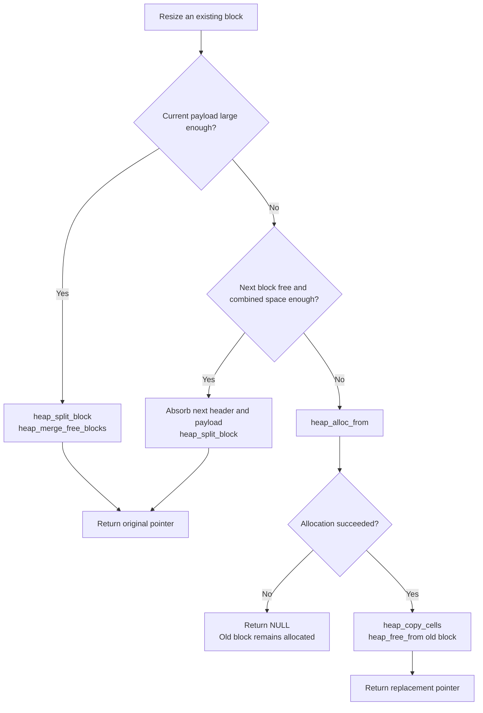
```mermaid
flowchart TD
    R["Resize an existing block"] --> FIT{"Current payload large enough?"}
    FIT -->|Yes| SHRINK["heap_split_block<br/>heap_merge_free_blocks"]
    SHRINK --> SAME["Return original pointer"]
    FIT -->|No| NEXT{"Next block free and combined space enough?"}
    NEXT -->|Yes| GROW["Absorb next header and payload<br/>heap_split_block"]
    GROW --> SAME
    NEXT -->|No| ALLOC["heap_alloc_from"]
    ALLOC --> OK{"Allocation succeeded?"}
    OK -->|No| KEEP["Return NULL<br/>Old block remains allocated"]
    OK -->|Yes| COPY["heap_copy_cells<br/>heap_free_from old block"]
    COPY --> NEW["Return replacement pointer"]
```

The stack-boundary register catches stack growth into the configured heap, but there is no isolation
between arbitrary process data accesses and other memory.

## 3.6 Shared-memory entries and mappings
[\[↑ TOC\]](#contents)

Shared memory gives multiple processes access to the same physical cells, so a value written by
one process is visible to the others that map the region. PicoOS allocates each shared-memory data
region with [`pmalloc()`](kernel/pmalloc.picoc#L20) from the same process-image/shared-memory heap that holds
complete process images. A process image and a shared-memory region are separate allocations, but
both occupy the payload of a [`BlockHeader`](common/heap.header#L5) in that heap. The kernel keeps a
named entry for each shared region and a separate attachment record in every process that maps it.

### 3.6.1 Named entries and per-process attachments
[\[↑ TOC\]](#contents)

Each [`SharedMemoryEntry`](kernel/shared_memory.header#L8) represents one named shared-memory data
region. The kernel's linked list contains one entry for each region. A
[`SharedMemoryAttachment`](kernel/shared_memory.header#L17) represents one process's mapping of
an entry. Attachments are linked from the owning PCB's
[`shared_memory_attachments`](kernel/process/process.header#L55) field, they refer to an entry but
do not own it.

[`shared_memory_list_head`](kernel/shared_memory.picoc#L6) and
[`next_shared_memory_id`](kernel/shared_memory.picoc#L7) are kernel-global variables, declared once
in [`kernel/shared_memory.picoc`](kernel/shared_memory.picoc). They are part of the kernel's global
data, not heap allocations. The head points to the first entry in the kernel's linked list or is
`NULL` when the list is empty. The ID counter supplies the next unique numeric ID when
[`open_shared_memory()`](kernel/shared_memory.picoc#L92) creates an entry.
[`initialize_shared_memory()`](kernel/shared_memory.picoc#L9) initializes both globals during
kernel startup. The two field tables explain the kernel's linked list first and each process’s
attachment list second.

```c
struct SharedMemoryEntry {
    char *name;
    int id;
    void *address;
    int reference_count;
    bool unlink_requested;
    struct SharedMemoryEntry *next;
};

struct SharedMemoryAttachment {
    struct SharedMemoryEntry *entry;
    struct SharedMemoryAttachment *next;
};
```

These structures are kernel metadata, not part of the shared-data allocation and not part of any
user process stack. [`open_shared_memory()`](kernel/shared_memory.picoc#L92) allocates one
[`SharedMemoryEntry`](kernel/shared_memory.header#L8), plus its copied name, as separate
[`kmalloc()`](kernel/kmalloc.picoc#L23) allocations in the kernel heap. It then allocates the
shared-data region separately with [`pmalloc()`](kernel/pmalloc.picoc#L20). The entry stores that
region's start address in its [`address`](kernel/shared_memory.header#L11) field. The shared data is
therefore separate from the entry and name allocations in the kernel heap.

Each call to [`map_shared_memory()`](kernel/shared_memory.picoc#L130) allocates one
[`SharedMemoryAttachment`](kernel/shared_memory.header#L17) with
[`kmalloc()`](kernel/kmalloc.picoc#L23), also in the kernel heap. The attachment is linked from the
current PCB's [`shared_memory_attachments`](kernel/process/process.header#L55) field, points back to
the linked-list entry, and accounts for that process's mapping. The
[`SharedMemoryEntry`](kernel/shared_memory.header#L8) remains the single object used for name and ID
lookup, records the data address and mapping count, and returns the same absolute data pointer to
every mapper.

The [`SharedMemoryAttachment`](kernel/shared_memory.header#L17) is needed because a
[`SharedMemoryEntry`](kernel/shared_memory.header#L8) alone does not say which process must release
a mapping during process cleanup. If two processes map one ID, there is one
[`SharedMemoryEntry`](kernel/shared_memory.header#L8) and two
[`SharedMemoryAttachment`](kernel/shared_memory.header#L17) records, one linked from each PCB. An
attachment does not hold shared bytes or give its process a different address, it records which
entry that process maps.

| Field | Meaning | Used by |
| --- | --- | --- |
| [`SharedMemoryEntry.name`](kernel/shared_memory.header#L9) | Kernel-owned lookup name, freed and set to `NULL` on unlink | First initialized by [`open_shared_memory()`](kernel/shared_memory.picoc#L92), read by [`find_shared_memory_by_name()`](kernel/shared_memory.picoc#L45), freed by [`unlink_shared_memory()`](kernel/shared_memory.picoc#L151) and [`destroy_shared_memory_entry()`](kernel/shared_memory.picoc#L69) |
| [`SharedMemoryEntry.id`](kernel/shared_memory.header#L10) | Numeric open/map handle | First initialized by [`open_shared_memory()`](kernel/shared_memory.picoc#L92), looked up by [`map_shared_memory()`](kernel/shared_memory.picoc#L130) |
| [`SharedMemoryEntry.address`](kernel/shared_memory.header#L11) | Absolute start of the [`pmalloc()`](kernel/pmalloc.picoc#L20) shared-memory data region | First initialized by [`open_shared_memory()`](kernel/shared_memory.picoc#L92), returned by [`map_shared_memory()`](kernel/shared_memory.picoc#L130) and freed by [`destroy_shared_memory_entry()`](kernel/shared_memory.picoc#L69) |
| [`SharedMemoryEntry.reference_count`](kernel/shared_memory.header#L12) | Attachment count, not distinct PID count | First initialized by [`open_shared_memory()`](kernel/shared_memory.picoc#L92), changed by [`map_shared_memory()`](kernel/shared_memory.picoc#L130) and [`release_process_shared_memory()`](kernel/shared_memory.picoc#L172), checked by [`unlink_shared_memory()`](kernel/shared_memory.picoc#L151) |
| [`SharedMemoryEntry.unlink_requested`](kernel/shared_memory.header#L13) | Defers destruction until the last attachment disappears | First initialized by [`open_shared_memory()`](kernel/shared_memory.picoc#L92), set by [`unlink_shared_memory()`](kernel/shared_memory.picoc#L151) and checked by [`release_process_shared_memory()`](kernel/shared_memory.picoc#L172) |
| [`SharedMemoryEntry.next`](kernel/shared_memory.header#L14) | Link to the next entry in the kernel's linked list | First initialized by [`open_shared_memory()`](kernel/shared_memory.picoc#L92), traversed by [`find_shared_memory_by_name()`](kernel/shared_memory.picoc#L45), [`find_shared_memory_by_id()`](kernel/shared_memory.picoc#L57), and [`destroy_shared_memory_entry()`](kernel/shared_memory.picoc#L69) |

The attachment table shows how a mapping records its contribution to the entry’s lifetime without
owning the entry itself.

| Field | Meaning | Used by |
| --- | --- | --- |
| [`SharedMemoryAttachment.entry`](kernel/shared_memory.header#L18) | Non-owning pointer to the linked-list entry whose reference count this mapping contributes to | First initialized by [`map_shared_memory()`](kernel/shared_memory.picoc#L130), released by [`release_process_shared_memory()`](kernel/shared_memory.picoc#L172) |
| [`SharedMemoryAttachment.next`](kernel/shared_memory.header#L19) | Link in one PCB's [`shared_memory_attachments`](kernel/process/process.header#L55) list | First initialized by [`map_shared_memory()`](kernel/shared_memory.picoc#L130), traversed by [`release_process_shared_memory()`](kernel/shared_memory.picoc#L172) |

### 3.6.2 Mapping, unlinking, and deferred destruction
[\[↑ TOC\]](#contents)

With the entry and attachment roles established, the public operations define their lifetime.
[`shm_unlink()`](library/sys/mman/mman.picoc#L27) frees the name and marks the existing
[`SharedMemoryEntry`](kernel/shared_memory.header#L8) for destruction, so the object can no longer
be obtained through that name. Existing attachments and their absolute data addresses remain
valid. The old numeric ID can also still be mapped while the entry exists, whereas opening the
former name creates a new entry. If no attachment exists at unlink time, destruction is immediate.

There is no `munmap()` operation. Every successful [`mmap()`](library/sys/mman/mman.picoc#L23)
therefore adds one attachment and increments
[`SharedMemoryEntry.reference_count`](kernel/shared_memory.header#L12), even when one process maps
the same ID more than once. When [`remove_process()`](kernel/process/process.picoc#L209) removes a
process, [`release_process_shared_memory()`](kernel/shared_memory.picoc#L172) uses that PCB's
attachment list to find each referenced entry, free the attachment, and decrement the count once
for that mapping. The entry and its [`pmalloc()`](kernel/pmalloc.picoc#L20) data region are destroyed
only after unlink has been requested and the count reaches zero. The graph shows the structure
before cleanup, with two attachments accounting for a count of 2.

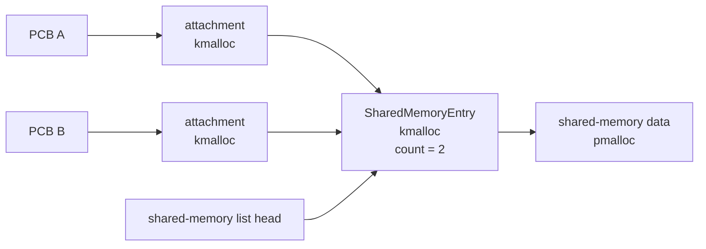
```mermaid
flowchart LR
    P1["PCB A"] --> A1["attachment<br/>kmalloc"]
    P2["PCB B"] --> A2["attachment<br/>kmalloc"]
    A1 --> E["SharedMemoryEntry<br/>kmalloc<br/>count = 2"]
    A2 --> E
    E --> M["shared-memory data<br/>pmalloc"]
    G["shared-memory list head"] --> E
```

[`shm_open()`](library/sys/mman/mman.picoc#L15) returns a numeric ID, and
[`mmap()`](library/sys/mman/mman.picoc#L23) returns the shared address. The following PicoC launcher
opens and maps one cell, writes `7`, and starts a worker with the shared-memory name as
[`argv[1]`](kernel/process/process_arguments.picoc#L190). After
[`waitpid()`](library/sys/wait/wait.picoc#L14) returns, the launcher observes the worker's change to
the same cell.

```c
// dependencies: ../../library/unistd/libunistd.reti_blocks ../../library/sys/wait/libwait.reti_blocks ../../library/sys/mman/libmman.reti_blocks

#include "../../library/unistd/unistd.header"
#include "../../library/sys/wait/wait.header"
#include "../../library/sys/mman/mman.header"

int main(void) {
    int shared_memory_id;
    int *shared_value;
    int worker_pid;
    int result = 1;

    shared_memory_id = shm_open("shared-value", 1);
    shared_value = (int *)mmap(shared_memory_id);
    shared_value[0] = 7;

    worker_pid = load("test/shared_value/worker.bin");
    run(worker_pid, "shared-value", NULL);
    waitpid(worker_pid);

    if (shared_value[0] == 8) {
        result = 0;
    }
    shm_unlink("shared-value");
    return result;
}
```

The worker uses the same name to obtain the existing ID, maps the region, reads `7`, and writes `8`.
These are the complete source-level steps needed for the second process to access the region, the
[`load()`](library/unistd/process.picoc#L17) and [`run()`](library/unistd/process.picoc#L31) calls in
the launcher perform process creation and startup rather than hiding them in a comment.

```c
// dependencies: ../../library/sys/mman/libmman.reti_blocks

#include "../../library/sys/mman/mman.header"

int main(int argc, char **argv) {
    int shared_memory_id;
    int *shared_value;

    shared_memory_id = shm_open(argv[1], 1);
    shared_value = (int *)mmap(shared_memory_id);
    shared_value[0] = shared_value[0] + 1;
    return 0;
}
```

The first sequence follows only creation and mapping. It shows the main idea:
the kernel keeps one shared-memory entry, while each successful mapping adds a
process-owned attachment and returns the same data address.

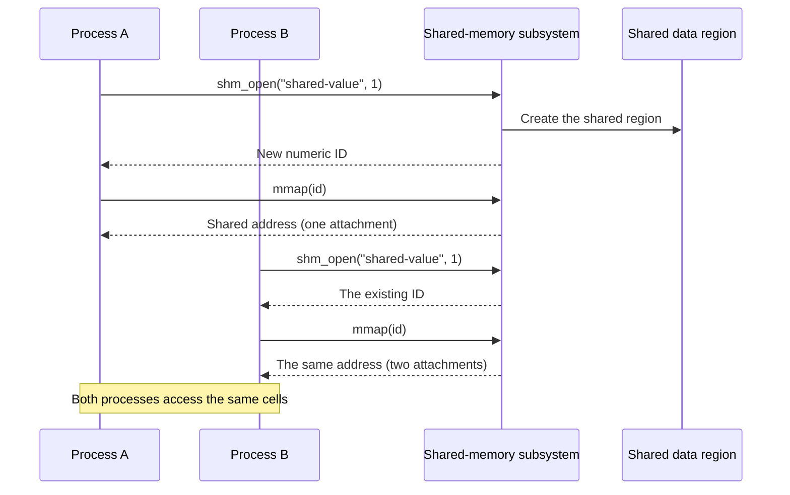
```mermaid
sequenceDiagram
    participant A as Process A
    participant B as Process B
    participant K as Shared-memory subsystem
    participant M as Shared data region

    A->>K: shm_open("shared-value", 1)
    K->>M: Create the shared region
    K-->>A: New numeric ID
    A->>K: mmap(id)
    K-->>A: Shared address (one attachment)
    B->>K: shm_open("shared-value", 1)
    K-->>B: The existing ID
    B->>K: mmap(id)
    K-->>B: The same address (two attachments)
    Note over A,B: Both processes access the same cells
```

The launcher then waits for the worker, so the worker's process removal
releases one attachment before the launcher unlinks the name. The second
sequence starts at that cleanup and shows why unlinking does not destroy the
region while the launcher's attachment still exists.

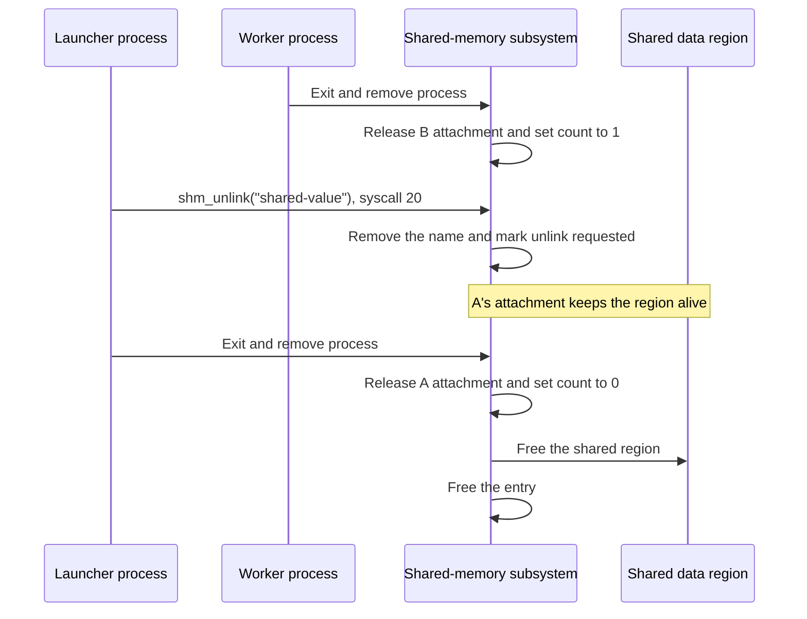
```mermaid
sequenceDiagram
    participant A as Launcher process
    participant B as Worker process
    participant K as Shared-memory subsystem
    participant M as Shared data region

    B->>K: Exit and remove process
    K->>K: Release B attachment and set count to 1
    A->>K: shm_unlink("shared-value"), syscall 20
    K->>K: Remove the name and mark unlink requested
    Note over K,M: A's attachment keeps the region alive
    A->>K: Exit and remove process
    K->>K: Release A attachment and set count to 0
    K->>M: Free the shared region
    K->>K: Free the entry
```

The function table below identifies which kernel operations implement the lookup, attachment, and
cleanup steps shown above. The syscall-backed operations come first, their **Called by** entries
show the library function that reaches them before their kernel caller. The remaining rows are
internal kernel operations.

| Kernel function | Return value / status | Effects | Calls | Called by |
| --- | --- | --- | --- | --- |
| [`open_shared_memory(request)`](kernel/shared_memory.picoc#L92) | Existing/new ID, `-1` for a null request/name, a nonpositive new size, or insufficient process-image/shared-memory heap space | If the name already exists, returns its [`SharedMemoryEntry.id`](kernel/shared_memory.header#L10) without creating a structure. Otherwise creates a [`SharedMemoryEntry`](kernel/shared_memory.header#L8) and copied name with [`kmalloc()`](kernel/kmalloc.picoc#L23), creates its data region with [`pmalloc()`](kernel/pmalloc.picoc#L20), and prepends the [`SharedMemoryEntry`](kernel/shared_memory.header#L8) to the kernel's linked list | [`find_shared_memory_by_name()`](kernel/shared_memory.picoc#L45), [`kmalloc()`](kernel/kmalloc.picoc#L23), [`copy_shared_memory_name()`](kernel/shared_memory.picoc#L27), [`pmalloc()`](kernel/pmalloc.picoc#L20), [`kfree()`](kernel/kmalloc.picoc#L38) | **Library functions:** [`shm_open()`](library/sys/mman/mman.picoc#L15)<br>**System calls:** via [`handle_syscall()`](kernel/syscall.picoc#L16) |
| [`map_shared_memory(shared_memory_id)`](kernel/shared_memory.picoc#L130) | Address, or `NULL` for an unknown ID or no current process | For every successful mapping, creates one [`SharedMemoryAttachment`](kernel/shared_memory.header#L17) with [`kmalloc()`](kernel/kmalloc.picoc#L23), links it from the current PCB's [`shared_memory_attachments`](kernel/process/process.header#L55) field, points it at the existing [`SharedMemoryEntry`](kernel/shared_memory.header#L8), and increments that entry's count | [`current_process()`](kernel/process/process.picoc#L62), [`find_shared_memory_by_id()`](kernel/shared_memory.picoc#L57), [`kmalloc()`](kernel/kmalloc.picoc#L23) | **Library functions:** [`mmap()`](library/sys/mman/mman.picoc#L23)<br>**System calls:** via [`handle_syscall()`](kernel/syscall.picoc#L16) |
| [`unlink_shared_memory(name)`](kernel/shared_memory.picoc#L151) | `0` on unlink, `-1` for a null or unknown name | Frees the name and marks the existing [`SharedMemoryEntry`](kernel/shared_memory.header#L8) for removal, destroys that [`SharedMemoryEntry`](kernel/shared_memory.header#L8) immediately only when its mapping count is zero | [`find_shared_memory_by_name()`](kernel/shared_memory.picoc#L45), [`kfree()`](kernel/kmalloc.picoc#L38), [`destroy_shared_memory_entry()`](kernel/shared_memory.picoc#L69) | **Library functions:** [`shm_unlink()`](library/sys/mman/mman.picoc#L27)<br>**System calls:** via [`handle_syscall()`](kernel/syscall.picoc#L16) |
|  |  |  |  |  |
| [`initialize_shared_memory(void)`](kernel/shared_memory.picoc#L9) | Returns no value | Initializes the shared-memory list head and next ID | — | **Kernel functions:** [`main()`](kernel/kernel.picoc#L31) |
| [`release_process_shared_memory(process)`](kernel/shared_memory.picoc#L172) | Returns no value | Walks one PCB's [`SharedMemoryAttachment`](kernel/shared_memory.header#L17) list, frees every [`SharedMemoryAttachment`](kernel/shared_memory.header#L17), and decrements the referenced [`SharedMemoryEntry.reference_count`](kernel/shared_memory.header#L12), destroys an unlinked [`SharedMemoryEntry`](kernel/shared_memory.header#L8) after its last attachment is released | [`kfree()`](kernel/kmalloc.picoc#L38), [`destroy_shared_memory_entry()`](kernel/shared_memory.picoc#L69) | **Kernel functions:** [`remove_process()`](kernel/process/process.picoc#L209) |
| [`destroy_shared_memory_entry(entry)`](kernel/shared_memory.picoc#L69) | Returns no value | Removes one [`SharedMemoryEntry`](kernel/shared_memory.header#L8) from the kernel's linked list, frees its [`SharedMemoryEntry.address`](kernel/shared_memory.header#L11) data region with [`pfree()`](kernel/pmalloc.picoc#L47), and frees the [`SharedMemoryEntry`](kernel/shared_memory.header#L8) and its name with [`kfree()`](kernel/kmalloc.picoc#L38) | [`pfree()`](kernel/pmalloc.picoc#L47), [`kfree()`](kernel/kmalloc.picoc#L38) | **Kernel functions:** [`unlink_shared_memory()`](kernel/shared_memory.picoc#L151), [`release_process_shared_memory()`](kernel/shared_memory.picoc#L172) |

Shared memory provides visibility, not mutual exclusion. [Section 15.2, Real-time operating-systems topics](#152-real-time-operating-systems-topics)
shows how a shared [`mutex`](library/mutex/mutex.header#L6) protects data accessed by more than one
process.

# 4. Processes and process lifecycle
[\[↑ TOC\]](#contents)

The memory regions from the previous chapter become useful when the kernel
treats each executing program as a process. A process combines a program's
memory with the identity, resources, saved registers, and state that let the
operating system manage it independently. The sections first describe the
process list, PCB, image, and states, then follow loading, startup,
parent-child relationships, termination, and final removal.

## 4.1 Global process list and current process
[\[↑ TOC\]](#contents)

The name *process table* describes the collection's role, not its concrete data
structure. PicoOS implements it as a singly linked list of PCBs, not as a fixed
array or a dynamically resized array. There is no separately allocated table
object. Instead, these four definitions in
[`kernel/process/process.picoc`](kernel/process/process.picoc) are globals in
kernel `.data`:

```c
struct Process *process_list_head = NULL;
struct Process *process_list_tail = NULL;
struct Process *active_process = NULL;
int next_process_id = 1;
```

The globals point directly into the list of separately allocated PCBs. The
diagram uses the implementation's actual lower-case names; conceptual labels
such as `ProcessListHead` and `ProcessListTail` correspond to
[`process_list_head`](kernel/process/process.picoc#L16) and
[`process_list_tail`](kernel/process/process.picoc#L17) here.

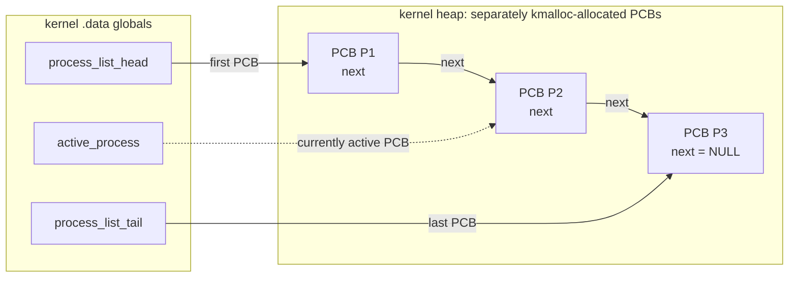
```mermaid
flowchart LR
    subgraph DATA["kernel .data globals"]
        H["process_list_head"]
        T["process_list_tail"]
        A["active_process"]
    end
    subgraph KH["kernel heap: separately kmalloc-allocated PCBs"]
        P1["PCB P1<br/>next"]
        P2["PCB P2<br/>next"]
        P3["PCB P3<br/>next = NULL"]
    end
    H -->|"first PCB"| P1
    P1 -->|"next"| P2
    P2 -->|"next"| P3
    T -->|"last PCB"| P3
    A -.->|"currently active PCB"| P2
```

Each node is one [`struct Process`](kernel/process/process.header#L31) PCB: the
complete kernel record for one process. Its
[`next`](kernel/process/process.header#L53) field points to the following PCB,
and the final node uses `NULL` for that field.
[`process_list_head`](kernel/process/process.picoc#L16) points to the first node
and is the starting point for traversal, while
[`process_list_tail`](kernel/process/process.picoc#L17) points to the final node
so a new PCB can be appended without first walking the list.
[`active_process`](kernel/process/process.picoc#L18) is not a separate PCB or a
separate list entry: it points to the node for the process whose saved
activation is currently loaded into the CPU, or is `NULL` while no process is
active.
[`next_process_id`](kernel/process/process.picoc#L19) supplies monotonically
increasing PIDs. [`first_process()`](kernel/process/process.picoc#L28) and
[`current_process()`](kernel/process/process.picoc#L62) provide access to the
head and active PCB respectively, while
[`find_process_by_pid()`](kernel/process/process.picoc#L162) finds process state
by walking the same list from its head.

[`initialize_process_table()`](kernel/process/process.picoc#L21) only clears the
three PCB pointers and resets the next PID, it does not allocate an array or
reserve PCB slots. [`create_process()`](kernel/process/process.picoc#L89)
allocates each new PCB separately from the kernel heap with
[`kmalloc()`](kernel/kmalloc.picoc#L23), initializes it, clears its list link,
and appends it after the tail. For the first process, both the head and tail
point to that PCB. Later insertions connect the old tail to the new PCB and
then advance the tail. Consequently, the process list grows one kernel-heap
allocation at a time and is never resized or reallocated as one block.

Process-list removal also works on one node rather than marking a reusable
slot. [`remove_process()`](kernel/process/process.picoc#L209) walks from the
head to find the PCB and its predecessor, then bypasses it by changing either
the head pointer or the predecessor's list link. It moves the tail pointer when
the final node is removed and updates the active-process pointer if it referred
to that node. [Section 4.6.3, Parent collection and final removal](#463-parent-collection-and-final-removal)
explains when removal is allowed and which resources are released.
[Section 6.1, Wait Queue Structure and Intrusive PCB Links](#61-wait-queue-structure-and-intrusive-pcb-links)
explains the separate unlinking required if the PCB is also in a wait queue.

The scheduler scans this same list. There is no separate ready queue. Blocking
queues use a different intrusive link inside each PCB, so
[`next`](kernel/process/process.header#L53) remains available for process-table
order. [Section 5.1.1, Algorithm and Round Robin comparison](#511-algorithm-and-round-robin-comparison)
explains how the scheduler traverses this list.

## 4.2 Process control block fields
[\[↑ TOC\]](#contents)

A process control block (PCB) is the kernel's record for one process. Its
fields keep identity, image metadata, resource pointers, saved CPU state, and
wait/signal state together while the process moves through its lifecycle. The
following definition and attribute table show the complete layout and connect
each field to its initializers and consumers:

```c
struct Process {
    int pid;
    int state;
    int base_address;
    int size;
    int heap_start;
    int heap_size;
    char *binary_path;
    char *working_directory;
    struct ActivationRecord activation;
    struct FileDescriptorTable *file_descriptors;
    int *waiting_status_ptr;
    struct wait_queue waiters;
    struct wait_queue *waiting_queue_ptr;
    struct Process *wait_next;
    struct Process *next;
    struct SharedMemoryAttachment *shared_memory_attachments;
    int parent_pid;
    int parent_death_signal;
    int exit_status;
    int stop_signal;
    int stopped_from_state;
    int pending_termination_signal;
    char *pending_terminal_read_buffer;
    int pending_terminal_read_count;
    struct ProcessLoad *pending_load;
};
```

| Attribute | Meaning | Used by |
| --- | --- | --- |
| [`pid`](kernel/process/process.header#L32) | Assigned from the global counter when the PCB is created, never changes | First initialized by [`create_process()`](kernel/process/process.picoc#L89), read by [`find_process_by_pid()`](kernel/process/process.picoc#L162) and [`wait_for_process_by_pid()`](kernel/process/process.picoc#L348) |
| [`state`](kernel/process/process.header#L33) | [`NEW`](kernel/process/process.header#L12), [`READY`](kernel/process/process.header#L13), [`RUNNING`](kernel/process/process.header#L14), [`BLOCKED`](kernel/process/process.header#L15), [`STOPPED`](kernel/process/process.header#L16), or [`ZOMBIE`](kernel/process/process.header#L17) | First initialized by [`create_process()`](kernel/process/process.picoc#L89), changed by [`mark_process_ready_with_arguments()`](kernel/process/process_arguments.picoc#L241), queue helpers, [`stop_process()`](kernel/signal.picoc#L37), [`continue_process()`](kernel/signal.picoc#L50), [`dispatcher_switch_to_process()`](kernel/dispatcher.picoc#L43), and [`terminate_process()`](kernel/process/process.picoc#L304) |
| [`base_address`](kernel/process/process.header#L34), [`size`](kernel/process/process.header#L35) | Absolute start and total cell count of the [`pmalloc()`](kernel/pmalloc.picoc#L20) process image | First initialized by [`create_process()`](kernel/process/process.picoc#L89), released by [`remove_process()`](kernel/process/process.picoc#L209) |
| [`heap_start`](kernel/process/process.header#L36), [`heap_size`](kernel/process/process.header#L37) | Process-relative userspace heap start and cell count from the binary header/defaults | First initialized by [`create_process()`](kernel/process/process.picoc#L89), read by [`process_heap_start()`](kernel/process/process.picoc#L418), [`process_heap_size()`](kernel/process/process.picoc#L424), and [`process_stack_boundary()`](kernel/exception.picoc#L18) |
| [`binary_path`](kernel/process/process.header#L38) | PCB-owned executable path without the leading `/`, it exists while the process is [`NEW`](kernel/process/process.header#L12), supplies the later [`argv[0]`](kernel/process/process_arguments.picoc#L184) copy, and remains the kernel's stable name for process listings | First initialized by [`create_process()`](kernel/process/process.picoc#L89), copied by [`store_process_arguments()`](kernel/process/process_arguments.picoc#L125), printed by [`list_processes()`](kernel/process/process.picoc#L32), freed by [`remove_process()`](kernel/process/process.picoc#L209) |
| [`working_directory`](kernel/process/process.header#L39) | PCB-owned absolute PicoOS path, copied from the parent or initialized to `/` for PID 1 | First initialized by [`create_process()`](kernel/process/process.picoc#L89) through copying, read by [`build_process_path()`](kernel/filesystem/host_filesystem.picoc#L92), replaced by [`change_working_directory()`](kernel/filesystem/host_filesystem.picoc#L163), freed by [`remove_process()`](kernel/process/process.picoc#L209) |
| [`activation`](kernel/process/process.header#L40) | Embedded saved CPU context needed later by the dispatcher, [Section 5.2, Saved process activation](#52-saved-process-activation) explains its fields | First initialized by [`create_process()`](kernel/process/process.picoc#L89), later maintained by [`store_process_arguments()`](kernel/process/process_arguments.picoc#L125), [`dispatcher_switch_from_context()`](kernel/dispatcher.picoc#L71), [`complete_pending_terminal_read()`](kernel/filesystem/terminal.picoc#L182), and [`dispatcher_jump_to_process()`](kernel/dispatcher.picoc#L21) |
| [`file_descriptors`](kernel/process/process.header#L42) | Kernel-heap descriptor table and entry array owned by this PCB | First initialized by [`create_process()`](kernel/process/process.picoc#L89) through [`create_file_descriptor_table()`](kernel/filesystem/file_descriptor.picoc#L35), inherited by [`mark_process_ready_with_arguments()`](kernel/process/process_arguments.picoc#L241), destroyed by [`remove_process()`](kernel/process/process.picoc#L209) |
| [`waiting_status_ptr`](kernel/process/process.header#L44) | Pointer into this process’s suspended userspace [`waitpid()`](library/sys/wait/wait.picoc#L14) frame | First initialized to `NULL` by [`create_process()`](kernel/process/process.picoc#L89), set by [`wait_for_process_by_pid()`](kernel/process/process.picoc#L348), written and cleared by [`wake_parent_waiting_for_process()`](kernel/process/process.picoc#L261) or [`notify_process_stopped()`](kernel/signal.picoc#L23) |
| [`waiters`](kernel/process/process.header#L46) | Embedded FIFO queue of processes waiting for this process | First initialized by [`create_process()`](kernel/process/process.picoc#L89), filled by [`wait_for_process_by_pid()`](kernel/process/process.picoc#L348), drained by [`wake_parent_waiting_for_process()`](kernel/process/process.picoc#L261) or [`notify_process_stopped()`](kernel/signal.picoc#L23) |
| [`waiting_queue_ptr`](kernel/process/process.header#L48), [`wait_next`](kernel/process/process.header#L51) | Queue containing this PCB and its intrusive successor link | First initialized by [`create_process()`](kernel/process/process.picoc#L89), maintained by [`enqueue_current_process_on_wait_queue()`](kernel/process/process.picoc#L375), [`enqueue_terminal_reader()`](kernel/filesystem/terminal.picoc#L62), [`wakeup_wait_queue()`](kernel/process/process.picoc#L395), and [`remove_from_wait_queue()`](kernel/process/process.picoc#L176) |
| [`next`](kernel/process/process.header#L53) | Link in the global process list | First initialized/linked by [`create_process()`](kernel/process/process.picoc#L89), traversed by [`scheduler_next_process()`](kernel/scheduler.picoc#L12) and [`find_process_by_pid()`](kernel/process/process.picoc#L162), unlinked by [`remove_process()`](kernel/process/process.picoc#L209) |
| [`shared_memory_attachments`](kernel/process/process.header#L55) | Head of kernel-heap mapping records owned by this PCB | First initialized by [`create_process()`](kernel/process/process.picoc#L89), extended by [`map_shared_memory()`](kernel/shared_memory.picoc#L130), released by [`remove_process()`](kernel/process/process.picoc#L209) through [`release_process_shared_memory()`](kernel/shared_memory.picoc#L172) |
| [`parent_pid`](kernel/process/process.header#L57), [`parent_death_signal`](kernel/process/process.header#L59) | Creator PID and optional signal delivered when that parent terminates | First initialized by [`create_process()`](kernel/process/process.picoc#L89), parent-death setting changed by [`set_parent_death_signal()`](kernel/signal.picoc#L137), used by [`orphan_and_signal_children()`](kernel/process/process.picoc#L279) |
| [`exit_status`](kernel/process/process.header#L60) | Status retained while the process is a zombie | First initialized to 0 by [`create_process()`](kernel/process/process.picoc#L89), set by [`terminate_process()`](kernel/process/process.picoc#L304), collected by [`wait_for_process_by_pid()`](kernel/process/process.picoc#L348) |
| [`stop_signal`](kernel/process/process.header#L61), [`stopped_from_state`](kernel/process/process.header#L62), [`pending_termination_signal`](kernel/process/process.header#L63) | Signal state for stopped and deferred termination paths | First initialized by [`create_process()`](kernel/process/process.picoc#L89), used by [`stop_process()`](kernel/signal.picoc#L37), [`continue_process()`](kernel/signal.picoc#L50), [`send_signal_to_process()`](kernel/signal.picoc#L75), and [`prepare_process_termination()`](kernel/signal.picoc#L126) |
| [`pending_terminal_read_buffer`](kernel/process/process.header#L65), [`pending_terminal_read_count`](kernel/process/process.header#L66) | Userspace request retained while a terminal read is blocked or stopped | First initialized to `NULL`/0 by [`create_process()`](kernel/process/process.picoc#L89), set by [`begin_terminal_read()`](kernel/filesystem/terminal.picoc#L134), consumed by [`complete_pending_terminal_read()`](kernel/filesystem/terminal.picoc#L182) or [`resume_pending_terminal_read()`](kernel/filesystem/terminal.picoc#L84) |
| [`pending_load`](kernel/process/process.header#L68) | Executable metadata, paths, progress, and reserved process-image/shared-memory heap region while this process is between load chunks | First initialized to `NULL` by [`create_process()`](kernel/process/process.picoc#L89), set by [`begin_process_load()`](kernel/process/process_loader.picoc#L109), advanced by [`continue_process_load()`](kernel/process/process_loader.picoc#L227), cleared by [`finish_process_load()`](kernel/process/process_loader.picoc#L90) or [`cancel_process_load()`](kernel/process/process_loader.picoc#L76) |

The PCB is kernel metadata, but its address fields refer into the separate
process image. Because RETI has no MMU, these are ordinary absolute pointers,
there is no address translation or protection between processes.

Three resource fields are explained where their behavior is used. The
[`working_directory`](kernel/process/process.header#L39) lifecycle and relative-path resolution are
in [Section 7.9, PicoOS paths, working directories, and host operations](#79-picoos-paths-working-directories-and-host-operations),
and the [`file_descriptors`](kernel/process/process.header#L42) ownership model is in
[Section 7.1, Per-process file-descriptor table](#71-per-process-file-descriptor-table).
[Section 4.3.2, Initial `argc`, `argv`, and `envp`](#432-initial-argc-argv-and-envp)
explains the process-image copy used for `argv[0]`. The separate
[`binary_path`](kernel/process/process.header#L38) is required before that copy exists and remains
available to [`list_processes()`](kernel/process/process.picoc#L32) even if userspace later changes
`argv[0]`, it is therefore neither an alias of `argv[0]` nor redundant storage.

## 4.3 Process image and initial userspace stack
[\[↑ TOC\]](#contents)

A process image is the prepared initial memory state from which a process will
execute. It places the linked `.ivt`, `.text`, and `.data` sections at their
expected offsets and reserves room for the userspace heap and stack. `.text`
contains executable instructions, while `.data` holds static data, with the
PicoC-Compiler [`-O1` option](../PicoC-Compiler/README.md#command-line-options),
values known at compile time are written directly into `.data` or `.ivt`.

The compiler records this layout in `program.sections`, and RETI-Emulator uses
it when assembling `program.bin` to prepend the five-word header described in
[Section 1.1.7, Linked `.sections` metadata and the five-word binary header](#117-linked-sections-metadata-and-the-five-word-binary-header).
The loader consumes that header to size the allocation and set the linked
section bases, but copies only the following program words into the process
image. The header's heap and stack values reserve the remaining space. The
initial userspace stack is then built at the high end of that region, so its
entry point, arguments, and environment are part of the prepared state from
which execution begins.

The PCB fields above describe the allocated image by its address, size, and
heap range. The boot-time [`load_process()`](kernel/process/process_loader.picoc#L305)
and userspace [`load_process_chunk()`](kernel/process/process_loader.picoc#L292)
paths each allocate it as one contiguous region from the process-image/shared-memory
heap. The first subsection shows these regions, and the second explains the
startup values stored on the stack.

### 4.3.1 Code, data, heap, and stack placement
[\[↑ TOC\]](#contents)

Within the region reserved by [`pmalloc()`](kernel/pmalloc.picoc#L20), the
diagram orders a process image from its
[`base_address`](kernel/process/process.header#L34) toward higher addresses.
[`malloc()`](library/stdlib/malloc.picoc#L35) manages the userspace heap, while
the stack grows back toward the heap and the final heap cell is protected by
the active boundary register. The widths group the regions for readability and
are not proportional to their sizes.


```mermaid
block-beta
    columns 12
    V["optional .ivt"]:1
    C[".text<br/>executable instructions"]:3
    D[".data<br/>globals"]:2
    H["userspace heap<br/>malloc<br/>BlockHeaders + allocations"]:2
    F["free stack space"]:2
    S["initial stack<br/>high address<br/>grows left toward heap"]:2
```

The binary header determines the size of this complete region. If its
[`heap_size`](kernel/process/process_loader.picoc#L120) word is `-1`, the loader
uses the 1000-cell
[`DEFAULT_PROCESS_HEAP_CELLS`](kernel/process/process_loader.header#L6) value.
If [`stack_start`](kernel/process/process_loader.picoc#L121) is `-1`,
[`loaded_process_stack_start()`](kernel/process/process_loader.picoc#L28) places
the highest stack offset 1000 cells after the first cell beyond the heap. The
offset is inclusive, so the allocation contains 1001 cells above the heap. An
explicit stack offset is rejected if it overlaps the heap. The effective stack
offset plus one becomes the size passed to
[`pmalloc()`](kernel/pmalloc.picoc#L20), so code, data, heap, and stack occupy
one allocation rather than separate blocks.

### 4.3.2 Initial `argc`, `argv`, and `envp`
[\[↑ TOC\]](#contents)

Once those regions have been placed and the image has been loaded,
[`store_process_arguments()`](kernel/process/process_arguments.picoc#L125) writes this layout
directly into the high end of its image:

| Order | Contents |
| --- | --- |
| 1 | Entry PC used by the first `RTI` |
| 2 | [`argc`](kernel/process/process_arguments.picoc#L131) |
| 3 | [`argv[]`](kernel/process/process_arguments.picoc#L173) pointers and terminating `NULL` |
| 4 | [`envp[]`](kernel/process/process_arguments.picoc#L141) pointers and terminating `NULL` |
| 5 | Copied binary path, arguments, and environment strings |

All pointers in the tables are absolute SRAM addresses. [`argv[0]`](kernel/process/process_arguments.picoc#L184) points to a
copy of [`binary_path`](kernel/process/process.header#L38), the supplied argument string supplies later entries,
[`envp`](kernel/process/process_arguments.picoc#L141) begins immediately after [`argv[argc] == NULL`](kernel/process/process_arguments.picoc#L180). The entry cell contains
[`activation.cs`](kernel/process/process.header#L27) - 1 because the first `RTI` advances to the real entry. The
saved `SP` points to the free cell below it, while `BAF` is chosen so naked
[`_start()`](library/start/start.picoc#L14) observes [`argc`](kernel/process/process_arguments.picoc#L131) and [`argv`](kernel/process/process_arguments.picoc#L173) in normal argument positions.

Arguments and the initial environment are process-image data, not persistent
kernel allocations. Userspace [`libstart`](library/start/libstart.picoc) later clones the environment into
the process heap, so parent and child environment arrays become independent.

## 4.4 Process states and transitions
[\[↑ TOC\]](#contents)

Process states show where each process is in its lifecycle: whether it can run,
is waiting or stopped, or has finished. The operating system uses them to
decide which processes the scheduler may select and which lifecycle work is
still pending. The table lists PicoOS's six states and their numeric values.

| State | Numeric value | Meaning | Typical transition |
| --- | --- | --- | --- |
| [`NEW`](kernel/process/process.header#L12) | 0 | Complete image and PCB exist but initial run state is incomplete | Completed process load |
| [`READY`](kernel/process/process.header#L13) | 1 | Eligible for the scheduler | Run setup, queue wakeup, or [`SIGCONT`](common/signal.header#L6) |
| [`RUNNING`](kernel/process/process.header#L14) | 2 | Activation is loaded into the CPU | Dispatcher |
| [`BLOCKED`](kernel/process/process.header#L15) | 3 | PCB is linked into one wait queue | Terminal read, DMA completion wait, [`waitpid()`](library/sys/wait/wait.picoc#L14), or [`sleep()`](library/unistd/blocking.picoc#L9) |
| [`STOPPED`](kernel/process/process.header#L16) | 4 | Suspended by [`SIGSTOP`](common/signal.header#L7), [`SIGTSTP`](common/signal.header#L8), or [`SIGTTIN`](common/signal.header#L9) | Signal subsystem |
| [`ZOMBIE`](kernel/process/process.header#L17) | 5 | Terminated status retained for a parent | [`terminate_process()`](kernel/process/process.picoc#L304) |

[`ZOMBIE`](kernel/process/process.header#L17) separates the end of execution
from final removal. It records that execution has ended while the parent may
still need to collect the termination status. The additional state also keeps
the terminated process outside the
[`READY`](kernel/process/process.header#L13) and
[`RUNNING`](kernel/process/process.header#L14) states accepted by
[`scheduler_next_process()`](kernel/scheduler.picoc#L12), so the scheduler does
not select it for execution. [Section 4.6, Parent-child relationships, termination, and collection](#46-parent-child-relationships-termination-and-collection)
explains status retention, parent notification, and final removal.

The state diagram shows the usual load/run, blocking, signal, and termination
paths. Removal ends the PCB's lifetime rather than assigning another state
value. [Section 5, Scheduling and context switching](#5-scheduling-and-context-switching)
explains the [`READY`](kernel/process/process.header#L13) and
[`RUNNING`](kernel/process/process.header#L14) transitions, while
[Section 6, Blocking, wait queues, signals, and mutexes](#6-blocking-wait-queues-signals-and-mutexes)
explains the [`BLOCKED`](kernel/process/process.header#L15) and
[`STOPPED`](kernel/process/process.header#L16) transitions.

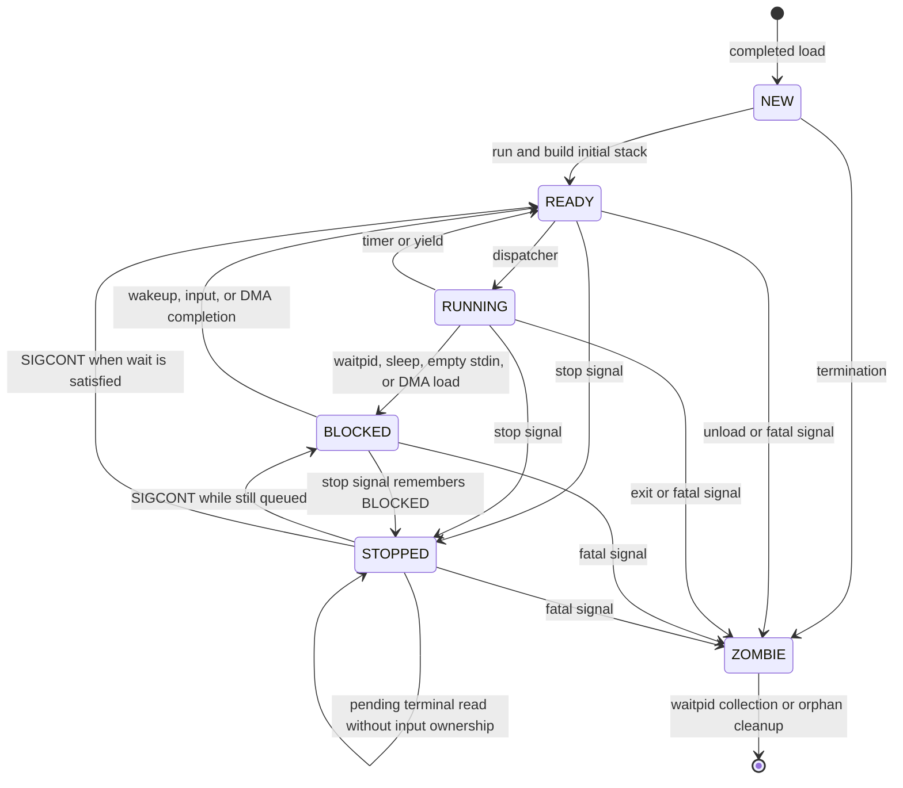
```mermaid
stateDiagram-v2
    [*] --> NEW: completed load
    NEW --> READY: run and build initial stack
    READY --> RUNNING: dispatcher
    RUNNING --> READY: timer or yield
    RUNNING --> BLOCKED: waitpid, sleep, empty stdin, or DMA load
    BLOCKED --> READY: wakeup, input, or DMA completion
    READY --> STOPPED: stop signal
    RUNNING --> STOPPED: stop signal
    BLOCKED --> STOPPED: stop signal remembers BLOCKED
    STOPPED --> BLOCKED: SIGCONT while still queued
    STOPPED --> READY: SIGCONT when wait is satisfied
    STOPPED --> STOPPED: pending terminal read without input ownership
    NEW --> ZOMBIE: termination
    READY --> ZOMBIE: unload or fatal signal
    RUNNING --> ZOMBIE: exit or fatal signal
    BLOCKED --> ZOMBIE: fatal signal
    STOPPED --> ZOMBIE: fatal signal
    ZOMBIE --> [*]: waitpid collection or orphan cleanup
```

## 4.5 Loading and starting a process
[\[↑ TOC\]](#contents)

Before a process can execute, the prepared process image described in
[Section 4.3, Process image and initial userspace stack](#43-process-image-and-initial-userspace-stack) must be loaded into
memory. The loader reserves one contiguous region, copies the linked sections,
and leaves the header-defined heap and stack space in place, establishing the
layout from which execution will begin. It then creates the PCB and sets the
initial code, data, stack, and frame register values. Run setup builds the
initial userspace stack, and [`init_process_heap()`](library/stdlib/malloc.picoc#L18)
initializes the reserved heap when the process first starts. The dispatcher
later restores the saved register values before transferring control to the
process, as described in
[Section 5.4, Restoring the selected process and returning with `RTI`](#54-restoring-the-selected-process-and-returning-with-rti).

### 4.5.1 Executable transfer with polling or DMA
[\[↑ TOC\]](#contents)

Loading and starting are deliberately separate operations. Every successful
userspace [`load()`](library/unistd/process.picoc#L17) first reads and validates
the binary header, reserves the complete process image, and stores the partial
load in the caller's PCB. The following sequence shows only that common setup.
The two payload-transfer modes are shown separately afterward. Boot-time
loading instead uses the continuous transfer in
[Section 10.1, Loading the kernel from the EPROM bootloader](#101-loading-the-kernel-from-the-eprom-bootloader).

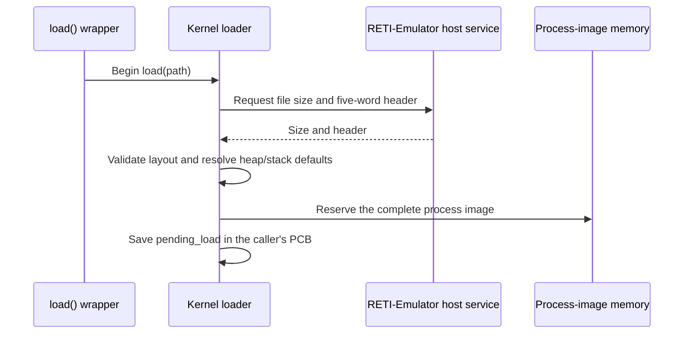
```mermaid
sequenceDiagram
    participant C as load() wrapper
    participant K as Kernel loader
    participant H as RETI-Emulator host service
    participant M as Process-image memory

    C->>K: Begin load(path)
    K->>H: Request file size and five-word header
    H-->>K: Size and header
    K->>K: Validate layout and resolve heap/stack defaults
    K->>M: Reserve the complete process image
    K->>K: Save pending_load in the caller's PCB
```

Without DMA, [`load()`](library/unistd/process.picoc#L17) re-enters the kernel
for each bounded payload chunk. The next sequence shows how those short
syscalls fill the reserved image and eventually create the PCB.

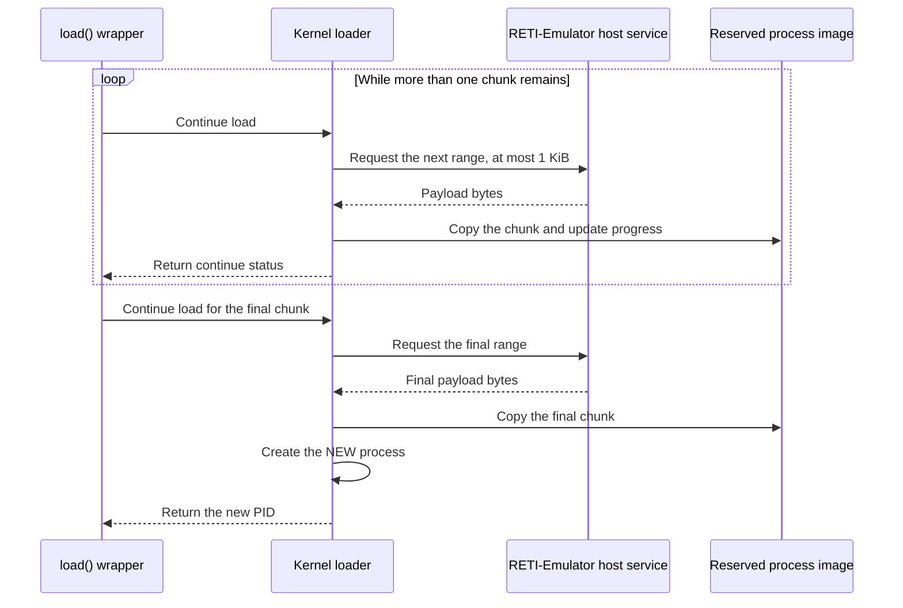
```mermaid
sequenceDiagram
    participant C as load() wrapper
    participant K as Kernel loader
    participant H as RETI-Emulator host service
    participant M as Reserved process image

    loop While more than one chunk remains
        C->>K: Continue load
        K->>H: Request the next range, at most 1 KiB
        H-->>K: Payload bytes
        K->>M: Copy the chunk and update progress
        K-->>C: Return continue status
    end
    C->>K: Continue load for the final chunk
    K->>H: Request the final range
    H-->>K: Final payload bytes
    K->>M: Copy the final chunk
    K->>K: Create the NEW process
    K-->>C: Return the new PID
```

With DMA, the loader requests the whole payload once and blocks the caller
while the device copies it. The completion interrupt wakes the caller, whose
next continuation syscall verifies the transfer and creates the PCB.

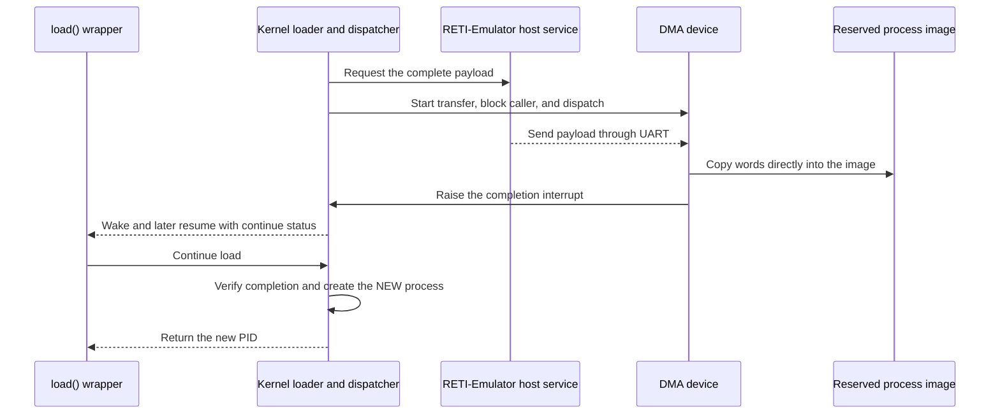
```mermaid
sequenceDiagram
    participant C as load() wrapper
    participant K as Kernel loader and dispatcher
    participant H as RETI-Emulator host service
    participant D as DMA device
    participant M as Reserved process image

    K->>H: Request the complete payload
    K->>D: Start transfer, block caller, and dispatch
    H-->>D: Send payload through UART
    D->>M: Copy words directly into the image
    D->>K: Raise the completion interrupt
    K-->>C: Wake and later resume with continue status
    C->>K: Continue load
    K->>K: Verify completion and create the NEW process
    K-->>C: Return the new PID
```

Both transfer modes end with a complete image and a PCB whose state is
[`NEW`](kernel/process/process.header#L12).
[Section 4.5.2, Changing a completed image from `NEW` to `READY`](#452-changing-a-completed-image-from-new-to-ready) continues
from the returned PID with the separate run setup.

[`ProcessLoad`](kernel/process/process_loader.picoc#L14) is a temporary kernel
structure used while userspace [`load()`](library/unistd/process.picoc#L17) asks
the kernel to receive an executable. [`begin_process_load()`](kernel/process/process_loader.picoc#L109)
allocates it from the kernel heap and stores its pointer in the calling
process's [`pending_load`](kernel/process/process.header#L68) PCB field.
Later load syscall requests follow that pointer to reuse the validated header,
reserved image address, transfer progress, and copied path. Completion or
cancellation clears the pointer and frees the structure. The field table shows
which values describe the process being created and which exist only to resume
the transfer.

| Field | Meaning | Used by |
| --- | --- | --- |
| [`ProcessLoad.base_address`](kernel/process/process_loader.picoc#L15) | Absolute start of the reserved process-image/shared-memory heap region | First initialized by [`begin_process_load(path, show_loading_bar, caller_context)`](kernel/process/process_loader.picoc#L109), used by [`continue_process_load(owner)`](kernel/process/process_loader.picoc#L227), [`finish_process_load(owner)`](kernel/process/process_loader.picoc#L90), and [`cancel_process_load(process)`](kernel/process/process_loader.picoc#L76) |
| [`ProcessLoad.process_size`](kernel/process/process_loader.picoc#L16) | Total reserved cells for code, data, heap, stack, and startup values | First initialized by [`begin_process_load(path, show_loading_bar, caller_context)`](kernel/process/process_loader.picoc#L109), passed to [`create_process()`](kernel/process/process.picoc#L89) by [`finish_process_load(owner)`](kernel/process/process_loader.picoc#L90) |
| [`ProcessLoad.code_start`](kernel/process/process_loader.picoc#L17), [`ProcessLoad.data_start`](kernel/process/process_loader.picoc#L18) | Linked code- and data-segment offsets from the binary header | First initialized by [`begin_process_load(path, show_loading_bar, caller_context)`](kernel/process/process_loader.picoc#L109), passed to [`create_process()`](kernel/process/process.picoc#L89) by [`finish_process_load(owner)`](kernel/process/process_loader.picoc#L90) |
| [`ProcessLoad.heap_start`](kernel/process/process_loader.picoc#L19), [`ProcessLoad.heap_size`](kernel/process/process_loader.picoc#L20) | Resolved userspace heap offset and cell count | First initialized by [`begin_process_load(path, show_loading_bar, caller_context)`](kernel/process/process_loader.picoc#L109), passed to [`create_process()`](kernel/process/process.picoc#L89) by [`finish_process_load(owner)`](kernel/process/process_loader.picoc#L90) |
| [`ProcessLoad.payload_word_count`](kernel/process/process_loader.picoc#L21) | Encoded program words after the five-word header | First initialized by [`begin_process_load(path, show_loading_bar, caller_context)`](kernel/process/process_loader.picoc#L109), bounds both DMA and polling transfers in [`begin_process_load(path, show_loading_bar, caller_context)`](kernel/process/process_loader.picoc#L109) and [`continue_process_load(owner)`](kernel/process/process_loader.picoc#L227) |
| [`ProcessLoad.loaded_word_count`](kernel/process/process_loader.picoc#L22) | Words copied by the polling transfer so far | First initialized to 0 by [`begin_process_load(path, show_loading_bar, caller_context)`](kernel/process/process_loader.picoc#L109), advanced and checked by [`continue_process_load(owner)`](kernel/process/process_loader.picoc#L227) |
| [`ProcessLoad.loading_bar_update`](kernel/process/process_loader.picoc#L23) | Next word count at which progress output is redrawn | First initialized by [`begin_process_load(path, show_loading_bar, caller_context)`](kernel/process/process_loader.picoc#L109), updated by [`continue_process_load(owner)`](kernel/process/process_loader.picoc#L227) |
| [`ProcessLoad.uses_dma`](kernel/process/process_loader.picoc#L24) | Whether the reserved image is being filled by one DMA transfer rather than polling chunks | First initialized to `false` and set to `true` by [`begin_process_load(path, show_loading_bar, caller_context)`](kernel/process/process_loader.picoc#L109), checked by [`continue_process_load(owner)`](kernel/process/process_loader.picoc#L227) and [`cancel_process_load(process)`](kernel/process/process_loader.picoc#L76) |
| [`ProcessLoad.path`](kernel/process/process_loader.picoc#L25) | Kernel-owned absolute binary path used by later range requests and copied into the completed PCB | First initialized by [`begin_process_load(path, show_loading_bar, caller_context)`](kernel/process/process_loader.picoc#L109), read by [`continue_process_load(owner)`](kernel/process/process_loader.picoc#L227) and [`finish_process_load(owner)`](kernel/process/process_loader.picoc#L90), freed by [`free_process_load(load)`](kernel/process/process_loader.picoc#L71) |

The caller PCB's [`pending_load`](kernel/process/process.header#L68) pointer
tracks the partial image allocation until the transfer finishes or is
cancelled. [`cancel_process_load()`](kernel/process/process_loader.picoc#L76)
releases that allocation, the copied path, and the temporary
[`ProcessLoad`](kernel/process/process_loader.picoc#L14). The PCB that
represents the new process is created only after the last chunk arrives.

### 4.5.2 Changing a completed image from `NEW` to `READY`
[\[↑ TOC\]](#contents)

Completing [`load_process()`](kernel/process/process_loader.picoc#L305) or
[`load_process_chunk()`](kernel/process/process_loader.picoc#L292) creates a new
PCB with its state set to [`NEW`](kernel/process/process.header#L12). The later
[`mark_process_ready_with_arguments()`](kernel/process/process_arguments.picoc#L241)
inherits descriptor values, writes the initial stack, and changes it to
[`READY`](kernel/process/process.header#L13). This state makes the process
available to [`scheduler_next_process()`](kernel/scheduler.picoc#L12) for
selection.

Creation first gives every PCB a new standard descriptor table. A completed
[`load()`](library/unistd/process.picoc#L17) therefore does not yet inherit the
caller's descriptors. When a process later calls
[`run()`](library/unistd/process.picoc#L31),
[`mark_process_ready_with_arguments()`](kernel/process/process_arguments.picoc#L241)
deep-copies the running caller's inheritable entries, destroys the child's
initial table, and installs the copy before changing the child to `READY`.
The copy always includes standard descriptors 0–2. Slots 3 and 4 are copied
only when they contain descriptors created by [`open()`](library/fcntl/fcntl.picoc#L5),
while the shell's reserved save slots 5–7 stay free. PID 1 has no running
caller and keeps its initial standard table. This timing is why shell
redirection must be installed before [`run()`](library/unistd/process.picoc#L31),
not merely before the child is first scheduled. [Section 7.6, File-descriptor creation, inheritance, duplication, and cleanup](#76-file-descriptor-creation-inheritance-duplication-and-cleanup)
explains the descriptor-table details. Parent-child metadata is established
during PCB creation and is covered next in
[Section 4.6.1, Creating parent-child relationships and handling orphans](#461-creating-parent-child-relationships-and-handling-orphans).

## 4.6 Parent-child relationships, termination, and collection
[\[↑ TOC\]](#contents)

Parent-child metadata determines who may collect a termination status and when
a terminated PCB can be deleted. Unix literature calls that final status
collection and deletion *reaping*; this section uses the clearer term
*collection*. It covers relationship creation, termination, the two important
[`waitpid()`](library/sys/wait/wait.picoc#L14) orderings, and final resource
release. Detailed wait-queue and signal mechanics are in
[Section 6, Blocking, wait queues, signals, and mutexes](#6-blocking-wait-queues-signals-and-mutexes).

### 4.6.1 Creating parent-child relationships and handling orphans
[\[↑ TOC\]](#contents)

The parent relationship is established when
[`create_process()`](kernel/process/process.picoc#L89) creates the PCB, not when
the new process first runs. If [`current_process()`](kernel/process/process.picoc#L62)
returns a PCB, the new PCB receives that process's
[`pid`](kernel/process/process.header#L32) as its
[`parent_pid`](kernel/process/process.header#L57). It also inherits
[`parent_death_signal`](kernel/process/process.header#L59) and receives a copy
of the parent's [`working_directory`](kernel/process/process.header#L39). PID 1
is created without a current process, so its parent PID is 0 and its working
directory starts as `/`. [Section 7.9, PicoOS paths, working directories, and host operations](#79-picoos-paths-working-directories-and-host-operations)
explains how that copied path is used and changed.

Creation and [`run()`](library/unistd/process.picoc#L31) initialize child state at different times.
The table distinguishes copied state from independently created state, there is no general
`fork()`-style PCB or address-space copy.

| Child state | Source and time | Relationship to parent afterward |
| --- | --- | --- |
| [`parent_pid`](kernel/process/process.header#L57) | Parent PID recorded by [`create_process()`](kernel/process/process.picoc#L89) | Identifies the parent until orphaning, not a shared object |
| [`working_directory`](kernel/process/process.header#L39) | Kernel-heap string copied by [`create_process()`](kernel/process/process.picoc#L89) | Independent copy, a later [`chdir()`](library/unistd/working_directory.picoc#L4) changes only the calling process |
| [`parent_death_signal`](kernel/process/process.header#L59) | Integer copied by [`create_process()`](kernel/process/process.picoc#L89) | Later [`prctl()`](library/sys/prctl/prctl.picoc#L14) changes only that process and what its future children inherit |
| [`file_descriptors`](kernel/process/process.header#L42) | Fresh standard table at creation, replaced by a deep copy of the caller's current standard descriptors and opened-file entries in slots 3–4 when [`mark_process_ready_with_arguments()`](kernel/process/process_arguments.picoc#L241) handles [`run()`](library/unistd/process.picoc#L31) | Entry fields, offsets, and path strings are independent, reserved save slots 5–7 remain only in the caller, and changes after the copy do not propagate |
| Initial environment | [`run()`](library/unistd/process.picoc#L31) uses the caller's current environment unless an explicit array is supplied, [`store_process_arguments()`](kernel/process/process_arguments.picoc#L125) copies the selected strings into the child image | [`libstart`](library/start/libstart.picoc) later copies them into the child's userspace heap |
| Executable image, [`binary_path`](kernel/process/process.header#L38), PID, activation, queues, signal state, and shared-memory attachment list | Created or initialized for the child rather than inherited | Separate child-owned state, shared-memory attachments are not inherited |

Because the working-directory copy occurs at process creation but descriptor and environment copies
occur at [`run()`](library/unistd/process.picoc#L31), changes made between
[`load()`](library/unistd/process.picoc#L17) and [`run()`](library/unistd/process.picoc#L31) affect
the latter two but not the already copied directory. The complete directory lifecycle and path
normalization are in [Section 7.9, PicoOS paths, working directories, and host operations](#79-picoos-paths-working-directories-and-host-operations).

When a parent terminates,
[`orphan_and_signal_children()`](kernel/process/process.picoc#L279) changes each
direct child's [`parent_pid`](kernel/process/process.header#L57) to 0. It removes
a child that is already a zombie because no parent remains to collect its
status. A live child instead receives its configured parent-death signal when
that value is nonzero. [Section 6.2, Process Signals](#62-process-signals) explains the
signal state and delivery rules.

### 4.6.2 Recording termination status
[\[↑ TOC\]](#contents)

A normal [`exit()`](library/stdlib/exit.picoc#L3), fatal signal or CPU exception,
and explicit unloading all reach
[`terminate_process()`](kernel/process/process.picoc#L304). It first handles the
terminating process's children, stores the supplied status in
[`exit_status`](kernel/process/process.header#L60), changes
[`state`](kernel/process/process.header#L33) to
[`ZOMBIE`](kernel/process/process.header#L17), and wakes the process's
[`waiters`](kernel/process/process.header#L46). Section
[6.1.2, Child Waiting with `waitpid`](#612-child-waiting-with-waitpid) traces the
status pointer and wakeup; [Section 6.2.1, Supported signals and fixed
actions](#621-supported-signals-and-fixed-actions) and [Section 2.9, CPU
exceptions and runtime errors](#29-cpu-exceptions-and-runtime-errors) define
the non-normal status values.

For normal completion, [`start_process()`](library/start/start.picoc#L7) passes
the application entry point's return value to
[`exit()`](library/stdlib/exit.picoc#L3); explicit unloading uses the success
status and then forces removal.

### 4.6.3 Parent collection and final removal
[\[↑ TOC\]](#contents)

The order of [`waitpid()`](library/sys/wait/wait.picoc#L14) and child
termination decides which kernel path deletes the child PCB. Deletion is not a
later dispatcher task in either case.

| Lifecycle order | Status handoff and child state | Who deletes the child PCB, and when |
| --- | --- | --- |
| Parent calls [`waitpid()`](library/sys/wait/wait.picoc#L14) while child is alive | [`wait_for_process_by_pid()`](kernel/process/process.picoc#L348) links the parent PCB into the child's [`waiters`](kernel/process/process.header#L46) queue and blocks it. Child termination writes through the parent's [`waiting_status_ptr`](kernel/process/process.header#L44) and wakes it. | [`terminate_process()`](kernel/process/process.picoc#L304) calls [`remove_process()`](kernel/process/process.picoc#L209) directly after the status handoff because [`process_has_waiting_parent()`](kernel/process/process.picoc#L249) was true. Deletion occurs inside termination, not during later dispatch; for self-exit it precedes the [`exit_process()`](kernel/process/process.picoc#L430) dispatch. |
| Child terminates before parent calls [`waitpid()`](library/sys/wait/wait.picoc#L14) | The complete child PCB remains [`ZOMBIE`](kernel/process/process.header#L17), retaining [`pid`](kernel/process/process.header#L32), [`parent_pid`](kernel/process/process.header#L57), [`exit_status`](kernel/process/process.header#L60), and owned resources. | The later syscall reaches [`wait_for_process_by_pid()`](kernel/process/process.picoc#L348), which copies [`exit_status`](kernel/process/process.header#L60) to the stack-local status and immediately calls [`remove_process()`](kernel/process/process.picoc#L209) before returning. |
| No live parent remains | No future caller can collect the status. | [`terminate_process()`](kernel/process/process.picoc#L304) removes an orphan immediately; [`orphan_and_signal_children()`](kernel/process/process.picoc#L279) also removes children that were already zombies when their parent terminates. |

PicoOS keeps the complete zombie PCB because it has no smaller exit-status
record. Section [6.1.2, Child Waiting with `waitpid`](#612-child-waiting-with-waitpid)
shows where the suspended request lives, how the child-owned queue reaches the
parent, and how the resumed call returns the status.

Explicit unloading also removes an uncollected zombie, and the test reset
helper removes selected PCBs directly. Final removal unlinks the PCB from its
wait queue and the process list, releases shared-memory attachments, and calls
[`cancel_process_load()`](kernel/process/process_loader.picoc#L76) for any
unfinished load. A retained zombie can therefore retain the partial image of
another process that it had been loading until the zombie is removed.
[Section 3.6.2, Mapping, unlinking, and deferred destruction](#362-mapping-unlinking-and-deferred-destruction)
explains how releasing the attachments affects shared-memory entries.
[`remove_process()`](kernel/process/process.picoc#L209) then calls
[`pfree()`](kernel/pmalloc.picoc#L47) on
[`base_address`](kernel/process/process.header#L34), destroys the descriptor
table, and frees the PCB-owned paths and the PCB with
[`kfree()`](kernel/kmalloc.picoc#L38).

## 4.7 Process list, PCB metadata, and lifecycle function reference
[\[↑ TOC\]](#contents)

Process management is split between global process-list operations, PCB
metadata, and lifecycle operations collected here and the loading and
run-setup operations in the next section. This table covers traversal and
updates of the global process list, process heap queries, process state,
parent-child relationships, and final PCB removal. Wait-queue operations have
their own reference in
[Section 6, Blocking, wait queues, signals, and mutexes](#6-blocking-wait-queues-signals-and-mutexes).

| Kernel function | Return value / status | Effects | Calls | Called by |
| --- | --- | --- | --- | --- |
| [`find_process_by_pid(pid)`](kernel/process/process.picoc#L162), [`list_processes(void)`](kernel/process/process.picoc#L32) | Return a PCB or `NULL`, list function returns no value | Read/traverse the process list, the list function writes each PID/path through descriptor 1 | [`first_process()`](kernel/process/process.picoc#L28), [`uart_append_decimal()`](common/uart_protocol.picoc#L26), [`system_relative_path()`](kernel/filesystem/host_filesystem.picoc#L121), [`write_file_descriptor()`](kernel/filesystem/filesystem.picoc#L217)<br>**Host requests from `list_processes`:** regular-file descriptor 1 uses `write-at <offset> <path>`, optional append `file-size <path>`, then `write stdout`, a copied terminal-stderr entry uses `write stderr` then `write stdout`, terminal-stdout/null output needs none | **Library functions:** [`list_processes()`](library/unistd/process.picoc#L51)<br>**System calls:** via [`handle_syscall()`](kernel/syscall.picoc#L16) (for [`list_processes()`](kernel/process/process.picoc#L32)) |
| [`terminate_process(process, status)`](kernel/process/process.picoc#L304), [`exit_process(status)`](kernel/process/process.picoc#L430), [`unload_process_by_pid(pid)`](kernel/process/process.picoc#L328) | Termination returns no value, [`exit_process()`](kernel/process/process.picoc#L430) does not return normally, unload returns `true` on removal, `false` for a missing or current PID | Store status, set the PCB state to [`ZOMBIE`](kernel/process/process.header#L17), wake waiters, and remove the PCB when permitted | [`orphan_and_signal_children()`](kernel/process/process.picoc#L279), [`find_process_by_pid()`](kernel/process/process.picoc#L162), [`process_has_waiting_parent()`](kernel/process/process.picoc#L249), [`wake_parent_waiting_for_process()`](kernel/process/process.picoc#L261), [`remove_process()`](kernel/process/process.picoc#L209), [`terminate_process()`](kernel/process/process.picoc#L304), [`current_process()`](kernel/process/process.picoc#L62), [`dispatcher_start_next_process()`](kernel/dispatcher.picoc#L55), [`shutdown()`](kernel/kernel.picoc#L15) | **Library functions:** [`unload()`](library/unistd/process.picoc#L47)<br>**System calls:** via [`handle_syscall()`](kernel/syscall.picoc#L16) (for [`unload_process_by_pid()`](kernel/process/process.picoc#L328))<br>**CPU exceptions:** via [`handle_cpu_exception()`](kernel/exception.picoc#L70) (for [`exit_process()`](kernel/process/process.picoc#L430)) |
| [`process_heap_start(void)`](kernel/process/process.picoc#L418), [`process_heap_size(void)`](kernel/process/process.picoc#L424) | Return current process's absolute heap start or heap size | Read current PCB memory fields only | [`current_process()`](kernel/process/process.picoc#L62) | **Library functions:** [`malloc()`](library/stdlib/malloc.picoc#L35)<br>**System calls:** via [`handle_syscall()`](kernel/syscall.picoc#L16) |
|  |  |  |  |  |
| [`initialize_process_table(void)`](kernel/process/process.picoc#L21) | Returns no value | Resets process-list globals and the next PID | — | **Kernel functions:** [`main()`](kernel/kernel.picoc#L31) |
| [`create_process(base_address, size, code_start, data_start, heap_start, heap_size, binary_path)`](kernel/process/process.picoc#L89) | Returns a PCB pointer, kernel-heap exhaustion halts the OS | Allocates and initializes a PCB, paths, descriptor table, embedded queues, and list link, copies the parent's working directory or uses `/` when there is no parent | [`kmalloc()`](kernel/kmalloc.picoc#L23), [`current_process()`](kernel/process/process.picoc#L62), [`copy_process_path()`](kernel/process/process.picoc#L70), [`create_file_descriptor_table()`](kernel/filesystem/file_descriptor.picoc#L35) | **Kernel functions:** [`finish_process_load()`](kernel/process/process_loader.picoc#L90), [`load_process()`](kernel/process/process_loader.picoc#L305) |
| [`first_process(void)`](kernel/process/process.picoc#L28), [`current_process(void)`](kernel/process/process.picoc#L62) | Return the head or active PCB, possibly `NULL` | Read process-list globals only | — | **Kernel functions:** [`activate_current_process_stack_boundary()`](kernel/exception.picoc#L22), [`begin_process_load()`](kernel/process/process_loader.picoc#L109), [`begin_terminal_read()`](kernel/filesystem/terminal.picoc#L134), [`build_process_path()`](kernel/filesystem/host_filesystem.picoc#L92), [`change_working_directory()`](kernel/filesystem/host_filesystem.picoc#L163), [`close_file_descriptor()`](kernel/filesystem/file_descriptor.picoc#L146), [`create_process()`](kernel/process/process.picoc#L89), [`dispatcher_start_next_process()`](kernel/dispatcher.picoc#L55), [`dispatcher_switch_from_context()`](kernel/dispatcher.picoc#L71), [`dispatcher_switch_to_process()`](kernel/dispatcher.picoc#L43), [`duplicate_file_descriptor()`](kernel/filesystem/file_descriptor.picoc#L163), [`enqueue_current_process_on_wait_queue()`](kernel/process/process.picoc#L375), [`exit_process()`](kernel/process/process.picoc#L430), [`get_working_directory()`](kernel/filesystem/host_filesystem.picoc#L156), [`handle_syscall()`](kernel/syscall.picoc#L16), [`list_processes()`](kernel/process/process.picoc#L32), [`load_process_chunk()`](kernel/process/process_loader.picoc#L292), [`map_shared_memory()`](kernel/shared_memory.picoc#L130), [`mark_process_ready_with_arguments()`](kernel/process/process_arguments.picoc#L241), [`open_file_descriptor()`](kernel/filesystem/filesystem.picoc#L39), [`process_heap_size()`](kernel/process/process.picoc#L424), [`process_heap_start()`](kernel/process/process.picoc#L418), [`read_file_descriptor()`](kernel/filesystem/filesystem.picoc#L150), [`scheduler_next_process()`](kernel/scheduler.picoc#L12), [`seek_file_descriptor()`](kernel/filesystem/filesystem.picoc#L268), [`send_signal_to_process()`](kernel/signal.picoc#L75), [`set_foreground_process()`](kernel/signal.picoc#L148), [`set_parent_death_signal()`](kernel/signal.picoc#L137), [`terminal_input_process()`](kernel/signal.picoc#L178), [`wait_for_process_by_pid()`](kernel/process/process.picoc#L348), [`write_file_descriptor()`](kernel/filesystem/filesystem.picoc#L217) |
| [`set_current_process(process)`](kernel/process/process.picoc#L66) | Returns no value | Replaces the active PCB global | — | **Kernel functions:** [`dispatcher_switch_to_process()`](kernel/dispatcher.picoc#L43) |
| [`remove_process(process)`](kernel/process/process.picoc#L209) | Returns no value | Final destructor: unlinks queues/list and releases image, attachments, descriptor table, strings, and PCB | [`remove_from_wait_queue()`](kernel/process/process.picoc#L176), [`release_process_shared_memory()`](kernel/shared_memory.picoc#L172), [`cancel_process_load()`](kernel/process/process_loader.picoc#L76), [`pfree()`](kernel/pmalloc.picoc#L47), [`destroy_file_descriptor_table()`](kernel/filesystem/file_descriptor.picoc#L118), [`kfree()`](kernel/kmalloc.picoc#L38) | **Kernel functions:** [`orphan_and_signal_children()`](kernel/process/process.picoc#L279), [`terminate_process()`](kernel/process/process.picoc#L304), [`unload_process_by_pid()`](kernel/process/process.picoc#L328), [`wait_for_process_by_pid()`](kernel/process/process.picoc#L348) |
| [`orphan_and_signal_children(parent)`](kernel/process/process.picoc#L279), [`wake_parent_waiting_for_process(process, status)`](kernel/process/process.picoc#L261) | Return no value | Update child parent fields or parent wait status/queue | [`remove_process()`](kernel/process/process.picoc#L209), [`send_signal_to_process()`](kernel/signal.picoc#L75), [`wakeup_wait_queue()`](kernel/process/process.picoc#L395) | **Kernel functions:** [`terminate_process()`](kernel/process/process.picoc#L304) |

## 4.8 Process-loader and run-setup function reference
[\[↑ TOC\]](#contents)

Loading reserves memory, copies the executable image, and creates the PCB that
represents the new process with its state set to
[`NEW`](kernel/process/process.header#L12). Run setup later installs inherited
descriptors and startup data, then changes the process state to
[`READY`](kernel/process/process.header#L13) so the scheduler may select it.
The table separates the operations that prepare the image and create the PCB
from the operations that make the represented process eligible for scheduling.

| Kernel function | Return value / status | Effects | Calls | Called by |
| --- | --- | --- | --- | --- |
| [`load_process_chunk(path, show_loading_bar, caller_context)`](kernel/process/process_loader.picoc#L292) | Returns a positive PID on completion, 0 on failure, or [`SYSCALL_LOAD_PROCESS_CONTINUE`](common/syscall.header#L48) (-1) while work remains | Starts or advances the caller's load, DMA blocks for the full payload, polling receives at most 1 KiB per continuation, creates a [`NEW`](kernel/process/process.header#L12) PCB on completion | [`current_process()`](kernel/process/process.picoc#L62), [`begin_process_load()`](kernel/process/process_loader.picoc#L109), [`continue_process_load()`](kernel/process/process_loader.picoc#L227)<br>**Host requests:** `file-size <path>`, then one or more `read-range <offset> <count> <path>` requests | **Library functions:** [`load()`](library/unistd/process.picoc#L17)<br>**System calls:** via [`handle_syscall()`](kernel/syscall.picoc#L16) |
| [`mark_process_ready_with_arguments(request)`](kernel/process/process_arguments.picoc#L241) | Returns `true` after run setup, `false` for a missing PID or a PCB that is not [`NEW`](kernel/process/process.header#L12) | Installs inherited descriptors, stores startup data, and changes [`NEW`](kernel/process/process.header#L12) to [`READY`](kernel/process/process.header#L13) | [`find_process_by_pid()`](kernel/process/process.picoc#L162), [`current_process()`](kernel/process/process.picoc#L62), [`inherit_file_descriptors()`](kernel/filesystem/file_descriptor.picoc#L99), [`destroy_file_descriptor_table()`](kernel/filesystem/file_descriptor.picoc#L118), [`store_process_arguments()`](kernel/process/process_arguments.picoc#L125) | **Library functions:** [`run()`](library/unistd/process.picoc#L31)<br>**System calls:** via [`handle_syscall()`](kernel/syscall.picoc#L16)<br>**Kernel functions:** [`main()`](kernel/kernel.picoc#L31) |
|  |  |  |  |  |
| [`load_process(path, show_loading_bar)`](kernel/process/process_loader.picoc#L305) | Returns PID, or 0 on failure | Resolves the boot-time path from PicoOS `/`, performs the continuous transfer, and creates a [`NEW`](kernel/process/process.header#L12) PCB | [`build_process_path()`](kernel/filesystem/host_filesystem.picoc#L92), [`uart_send_host_request()`](common/uart_protocol.picoc#L82), [`receive_word()`](common/uart_protocol.picoc#L7), [`drain_process_words()`](kernel/process/process_loader.picoc#L40), [`uart_print_loading_bar_label()`](common/loading_bar.picoc#L6), [`system_relative_path()`](kernel/filesystem/host_filesystem.picoc#L121), [`loaded_process_stack_start()`](kernel/process/process_loader.picoc#L28), [`uart_print_string()`](common/uart_protocol.picoc#L73), [`pmalloc()`](kernel/pmalloc.picoc#L20), [`receive_words_to_sram()`](common/sram_loader.picoc#L6), [`create_process()`](kernel/process/process.picoc#L89)<br>**Host request:** `load <path>` | **Kernel functions:** [`main()`](kernel/kernel.picoc#L31) |
| [`cancel_process_load(process)`](kernel/process/process_loader.picoc#L76) | Returns no value | Cancels an active DMA load if necessary, clears the caller's pending-load pointer and frees the partial image, copied path, and metadata | [`dma_transfer_status()`](common/dma.picoc#L21), [`cancel_dma_transfer()`](common/dma.picoc#L32), [`pfree()`](kernel/pmalloc.picoc#L47), [`free_process_load()`](kernel/process/process_loader.picoc#L71) | **Kernel functions:** [`begin_process_load()`](kernel/process/process_loader.picoc#L109), [`continue_process_load()`](kernel/process/process_loader.picoc#L227), [`remove_process()`](kernel/process/process.picoc#L209) |
| [`store_process_arguments(process, arguments, environment)`](kernel/process/process_arguments.picoc#L125) | Returns no value | Writes initial stack/tables/strings into the image and sets activation [`sp`](kernel/process/process.header#L25)/[`baf`](kernel/process/process.header#L26) | [`process_argument_token_count()`](kernel/process/process_arguments.picoc#L14), [`process_environment_count()`](kernel/process/process_arguments.picoc#L89), [`process_string_cell_count()`](kernel/process/process_arguments.picoc#L103), [`process_argument_string_cell_count()`](kernel/process/process_arguments.picoc#L51), [`copy_process_string()`](kernel/process/process_arguments.picoc#L113), [`process_argument_is_space()`](kernel/process/process_arguments.picoc#L5), [`process_argument_is_quote()`](kernel/process/process_arguments.picoc#L9) | **Kernel functions:** [`mark_process_ready_with_arguments()`](kernel/process/process_arguments.picoc#L241) |

# 5. Scheduling and context switching
[\[↑ TOC\]](#contents)

The scheduler and dispatcher have separate responsibilities. The scheduler decides which runnable
process should execute next by examining the process table and the state stored in each process's
[`struct Process`](kernel/process/process.header#L31) PCB. The dispatcher performs the context
switch: it saves the outgoing process's register state, asks the scheduler for the next process,
makes that process current, restores its register state, and transfers execution to it.

After a process blocks, yields, or exhausts its timer interval, the scheduler therefore chooses a
process, represented by its PCB, it does not choose a PCB as though the PCB were the process.
PicoOS uses integer constants rather than a `ProcessState` enum:
[`PROCESS_STATE_READY`](kernel/process/process.header#L13) makes a process runnable, and the
currently selected process remains runnable while its PCB is still
[`PROCESS_STATE_RUNNING`](kernel/process/process.header#L14).
[`PROCESS_STATE_NEW`](kernel/process/process.header#L12),
[`PROCESS_STATE_BLOCKED`](kernel/process/process.header#L15),
[`PROCESS_STATE_STOPPED`](kernel/process/process.header#L16), and
[`PROCESS_STATE_ZOMBIE`](kernel/process/process.header#L17) are not runnable.
The scheduler scans the linked process table, tests each PCB's
[`state`](kernel/process/process.header#L33), and returns the PCB that represents the next runnable
process. The dispatcher uses that returned PCB to perform the switch described in
[Section 5.3, Saving the current process and selecting the next process](#53-saving-the-current-process-and-selecting-the-next-process)
and [Section 5.4, Restoring the selected process and returning with `RTI`](#54-restoring-the-selected-process-and-returning-with-rti).

## 5.1 Scheduler implementation
[\[↑ TOC\]](#contents)

The scheduler implementation uses the process list directly. The first
subsection combines the policy, complete algorithm, example, edge cases, and
comparison with textbook Round Robin. The second is a findable reference for
the two functions in
[`kernel/scheduler.picoc`](kernel/scheduler.picoc).

### 5.1.1 Algorithm and Round Robin comparison
[\[↑ TOC\]](#contents)

PicoOS uses *Lazy Round Robin*: it cyclically scans the complete singly linked
process list described in [Section 4.1, Global process list and current
process](#41-global-process-list-and-current-process), rather than maintaining a
separate FIFO ready queue. [`scheduler_next_process()`](kernel/scheduler.picoc#L12)
starts after [`current_process()`](kernel/process/process.picoc#L62), or at
[`first_process()`](kernel/process/process.picoc#L28) when there is no current
PCB or it is the tail. It scans to the end, wraps to the head, and stops at its
original starting point, so it examines every PCB at most once.

For each PCB, [`scheduler_can_run()`](kernel/scheduler.picoc#L4) accepts
[`PROCESS_STATE_READY`](kernel/process/process.header#L13) or
[`PROCESS_STATE_RUNNING`](kernel/process/process.header#L14). It skips
[`PROCESS_STATE_NEW`](kernel/process/process.header#L12),
[`PROCESS_STATE_BLOCKED`](kernel/process/process.header#L15),
[`PROCESS_STATE_STOPPED`](kernel/process/process.header#L16), and
[`PROCESS_STATE_ZOMBIE`](kernel/process/process.header#L17). Sleeping and waiting processes use the
`BLOCKED` state, so the scan may pass several such PCBs before it finds a process that can execute.

Processes that remain runnable receive cyclic turns, but this is not strict
FIFO Round Robin across state changes. A conventional ready queue appends a
newly unblocked process behind processes already waiting. PicoOS leaves every
PCB at its fixed process-list position, so that process may be found first; a
scheduling decision may also inspect `BLOCKED`, `STOPPED`, `NEW`, and `ZOMBIE`
PCBs that a ready queue would not contain.

Preemption is also slightly looser than a textbook per-process quantum. The timer configured by
[`interrupt_controller_activate_timer()`](kernel/interrupt_controller.picoc#L34) requests a switch
every 5,000 emulated instructions by default.
[`timer_interrupt_process()`](interrupt_service_routines/os_isrs.picoc#L74) dispatches immediately
after a userspace interruption, while a kernel interruption is deferred until syscall return. The
dispatcher does not restart the timer in
[`dispatcher_switch_to_process()`](kernel/dispatcher.picoc#L43), so a process selected after a
voluntary switch may receive only the remainder of the current timer interval rather than a fresh
full quantum.

The example below shows the linked-list order, each process state, and `P3` as the current process.
It makes both the cyclic order and the extra traversal caused by non-runnable PCBs visible.


```mermaid
flowchart LR
    P1["P1<br/>READY"] --> P2["P2<br/>BLOCKED"]
    P2 --> P3["P3<br/>RUNNING<br/>current"]
    P3 --> P4["P4<br/>STOPPED"]
    P4 --> P5["P5<br/>READY"]
```

When `P3` yields or is preempted, the scheduler starts at `P4`, skips it, and
selects `P5`. The following search wraps from tail `P5` to `P1`. A textbook
ready queue would take its runnable head directly; PicoOS obtains the cyclic
order by inspecting the general process list.

If a complete scan finds no `READY` or `RUNNING` PCB,
[`scheduler_next_process()`](kernel/scheduler.picoc#L12) returns `NULL`. PicoOS
has no idle process: [`dispatcher_start_next_process()`](kernel/dispatcher.picoc#L55)
retries while PCBs exist, allowing a UART or DMA interrupt to make one ready;
it can spin indefinitely if no event can do so, and returns if the process
list becomes empty. Preemption and
[`yield()`](library/schedule/schedule.picoc#L4) normally avoid this case because
[`dispatcher_switch_from_context()`](kernel/dispatcher.picoc#L71) first changes
the outgoing process to `READY`.

Scanning the existing list keeps state transitions simple because no ready
queue must also be updated. The cost is an O(number of PCBs) selection in the
worst case, including inspection of non-runnable PCBs; a textbook ready queue
normally selects its head directly.

The complete implementation below shows that
[`scheduler_can_run()`](kernel/scheduler.picoc#L4) checks whether one process can run, while
[`scheduler_next_process()`](kernel/scheduler.picoc#L12) chooses the starting point and performs the
two-part scan with wrap-around.

```c
bool scheduler_can_run(struct Process *process) {
    return process != NULL &&
           (process->state == PROCESS_STATE_READY ||
            // A still-current RUNNING process may be the only runnable process
            // when scheduler_next_process() wraps around to it
            process->state == PROCESS_STATE_RUNNING);
}

struct Process *scheduler_next_process(void) {
    struct Process *start;
    struct Process *candidate;

    if (first_process() == NULL) {
        return NULL;
    }
    if (current_process() == NULL || current_process()->next == NULL) {
        start = first_process();
    } else {
        start = current_process()->next;
    }

    candidate = start;
    while (candidate != NULL) {
        if (scheduler_can_run(candidate)) {
            return candidate;
        }
        candidate = candidate->next;
    }

    candidate = first_process();
    while (candidate != start) {
        if (scheduler_can_run(candidate)) {
            return candidate;
        }
        candidate = candidate->next;
    }
    return NULL;
}
```

### 5.1.2 Scheduler function reference
[\[↑ TOC\]](#contents)

The algorithm above is implemented entirely by the following two functions in
[`kernel/scheduler.picoc`](kernel/scheduler.picoc). The table separates their
contracts, state access, and callers; dispatcher functions remain in [Section
5.5, Dispatcher function reference](#55-dispatcher-function-reference).

| Kernel function | Return value / status | Effects | Calls | Called by |
| --- | --- | --- | --- | --- |
| [`scheduler_can_run(process)`](kernel/scheduler.picoc#L4) | `true` for a non-`NULL` PCB whose state is `READY` or `RUNNING`, otherwise `false` | Reads the candidate PCB's [`state`](kernel/process/process.header#L33) | — | **Kernel functions:** [`scheduler_next_process()`](kernel/scheduler.picoc#L12) |
| [`scheduler_next_process(void)`](kernel/scheduler.picoc#L12) | PCB representing the first runnable process found during one cyclic scan, or `NULL` when the process list is empty or no process can run | Reads [`process_list_head`](kernel/process/process.picoc#L16), [`active_process`](kernel/process/process.picoc#L18), and PCB [`next`](kernel/process/process.header#L53) and [`state`](kernel/process/process.header#L33) fields, does not change process state | [`first_process()`](kernel/process/process.picoc#L28), [`current_process()`](kernel/process/process.picoc#L62), [`scheduler_can_run()`](kernel/scheduler.picoc#L4) | **Kernel functions:** [`dispatcher_start_next_process()`](kernel/dispatcher.picoc#L55) |

## 5.2 Saved process activation
[\[↑ TOC\]](#contents)

The scheduler's PCB result identifies a process, but resuming it also requires the register state
from the point where it stopped. Each PCB therefore embeds an
[`activation`](kernel/process/process.header#L40) field of type
[`struct ActivationRecord`](kernel/process/process.header#L21). This activation is not a separate
global context structure: it belongs to that process's PCB and preserves the values the dispatcher
will restore later.

For an outgoing process, [`current_process()`](kernel/process/process.picoc#L62) reads the global
[`active_process`](kernel/process/process.picoc#L18) PCB pointer. The dispatcher follows that PCB
pointer to its embedded activation and saves the outgoing register state there. For an incoming
process, the scheduler returns its PCB pointer, which the dispatcher passes through
[`dispatcher_switch_to_process()`](kernel/dispatcher.picoc#L43) to
[`dispatcher_jump_to_process()`](kernel/dispatcher.picoc#L21), the latter reads the selected PCB's
activation by fixed offsets. The field order is therefore part of the assembly interface, and the
following definition and table show the values that must remain available.

The containment diagram distinguishes the embedded activation record from
objects referenced by pointers. The PCB and its activation occupy one
[`kmalloc()`](kernel/kmalloc.picoc#L23) allocation on the kernel heap;
[`activation`](kernel/process/process.header#L40) is not separately allocated.

```mermaid
flowchart LR
    AP["active_process<br/>kernel .data"] --> PCB
    subgraph PCB["struct Process / PCB<br/>kernel heap"]
        direction TB
        ID["pid, state, memory metadata"]
        AR["activation: ActivationRecord<br/>in1, in2, acc, sp, baf, cs, ds"]
        FDP["file_descriptors pointer"]
        WAIT["wait and lifecycle fields"]
    end
    FDP --> FDT["FileDescriptorTable<br/>separate kernel-heap allocation"]
```

```c
struct ActivationRecord {
    int in1;
    int in2;
    int acc;
    int sp;
    int baf;
    int cs;
    int ds;
};
```

| Attribute | Meaning | Used by |
| --- | --- | --- |
| [`in1`](kernel/process/process.header#L22), [`in2`](kernel/process/process.header#L23), [`acc`](kernel/process/process.header#L24) | General argument/result registers at the suspension point | First initialized by [`create_process()`](kernel/process/process.picoc#L89), saved by [`dispatcher_switch_from_context()`](kernel/dispatcher.picoc#L71) and restored by [`dispatcher_jump_to_process()`](kernel/dispatcher.picoc#L21) |
| [`sp`](kernel/process/process.header#L25) | Stack position immediately below the saved return PC, the return PC remains at `sp + 1` | First initialized by [`create_process()`](kernel/process/process.picoc#L89), rebuilt by [`store_process_arguments()`](kernel/process/process_arguments.picoc#L125), saved by [`dispatcher_switch_from_context()`](kernel/dispatcher.picoc#L71), and restored by [`dispatcher_jump_to_process()`](kernel/dispatcher.picoc#L21) |
| [`baf`](kernel/process/process.header#L26) | Base address of the interrupted PicoC function frame | First initialized by [`create_process()`](kernel/process/process.picoc#L89), rebuilt by [`store_process_arguments()`](kernel/process/process_arguments.picoc#L125), saved by [`dispatcher_switch_from_context()`](kernel/dispatcher.picoc#L71), and restored by [`dispatcher_jump_to_process()`](kernel/dispatcher.picoc#L21) |
| [`cs`](kernel/process/process.header#L27) | Absolute code-segment base used for instruction addresses | First initialized by [`create_process()`](kernel/process/process.picoc#L89), saved by [`dispatcher_switch_from_context()`](kernel/dispatcher.picoc#L71) and restored by [`dispatcher_jump_to_process()`](kernel/dispatcher.picoc#L21) |
| [`ds`](kernel/process/process.header#L28) | Absolute data-segment base used for globals/static data | First initialized by [`create_process()`](kernel/process/process.picoc#L89), saved by [`dispatcher_switch_from_context()`](kernel/dispatcher.picoc#L71) and restored by [`dispatcher_jump_to_process()`](kernel/dispatcher.picoc#L21) |

These are the RETI registers required to resume a process. The saved program counter is the one
exception: it stays on that process's own interrupt stack at
[`activation.sp`](kernel/process/process.header#L25) + 1 rather than being
copied into the activation. The fixed PCB offsets and the stack/heap boundary update protect this
representation while another process is activated. In particular,
[`dispatcher_jump_to_process()`](kernel/dispatcher.picoc#L21) keeps the selected PCB pointer in
`BAF` while loading the activation, restores `SP` before enabling the selected process's boundary,
and only then replaces `BAF` with its saved process value.

## 5.3 Saving the current process and selecting the next process
[\[↑ TOC\]](#contents)

This is the first part of the dispatcher/context-switch path. Its responsibility is to preserve a
resumable outgoing process and start dispatching another process, the scheduler's responsibility is
limited to selecting which runnable process comes next.

The resumable entry paths all provide the saved frame described in
[Section 2.3, Saved interrupt stack frame](#23-saved-interrupt-stack-frame):

- Userspace timer preemption calls
  [`dispatcher_switch_from_context()`](kernel/dispatcher.picoc#L71) immediately after saving the
  interrupted process's registers.
- The [`yield()`](library/schedule/schedule.picoc#L4) system call switches unconditionally.
  [`sleep()`](library/unistd/blocking.picoc#L9) also switches after placing the process on its wait
  queue, while [`waitpid()`](library/sys/wait/wait.picoc#L14) does so only when the requested child
  has not stopped or exited.
- A terminal [`read()`](library/unistd/io.picoc#L6) switches when input is unavailable after marking
  the reader `BLOCKED`, or when a background read stops the process with `SIGTTIN`. A DMA-backed
  [`load()`](library/unistd/process.picoc#L17) switches after queuing the caller for DMA completion.
- A timer expiry observed while kernel code is running, or deferred termination requested for the
  running process, sets [`reschedule_requested`](kernel/dispatcher.picoc#L8). Every normally
  returning syscall calls
  [`dispatcher_reschedule_if_requested()`](kernel/dispatcher.picoc#L14), but it enters the context
  switch only when that flag is set.

Every syscall initially saves `ACC`, `IN1`, `IN2`, `BAF`, `CS`, and `DS` on the process stack, RETI
interrupt entry has already saved the program counter. It then installs the kernel segments and
stack before calling [`handle_syscall()`](kernel/syscall.picoc#L16). This common entry does not mean
that every syscall switches processes. Ordinary syscalls restore their caller directly.
Switching/blocking syscalls save the activation, exit and heap-exhaustion syscalls abandon the
outgoing frame, and a pending deferred request switches at syscall return.
[Section 2.5, Handling system calls and returning to userspace](#25-handling-system-calls-and-returning-to-userspace)
shows the complete syscall entry and both return paths.

The complete save function below shows how the dispatcher locates the outgoing PCB through
[`current_process()`](kernel/process/process.picoc#L62), copies the frame into that PCB's activation,
and preserves a state that blocking or signal code has already changed.

```c
void dispatcher_switch_from_context(int *caller_context) {
    struct Process *process = current_process();

    if (process != NULL) {
        process->activation.sp = (int)(caller_context + 6);
        process->activation.ds = caller_context[1];
        process->activation.cs = caller_context[2];
        process->activation.baf = caller_context[3];
        process->activation.in2 = caller_context[4];
        process->activation.in1 = caller_context[5];
        process->activation.acc = caller_context[6];

        if (process->state == PROCESS_STATE_RUNNING) {
            process->state = PROCESS_STATE_READY;
        }
    }
    dispatcher_start_next_process();
}
```

Before a blocking switch, the process's PCB
[`state`](kernel/process/process.header#L33) has already been set to
[`PROCESS_STATE_BLOCKED`](kernel/process/process.header#L15). The process still has to leave the
CPU, so the dispatcher saves its context and continues with another process. The conditional above
changes only `RUNNING` to `READY`, a process already marked `BLOCKED` remains blocked. The
corresponding condition later makes it runnable again, for example when a waited-for process exits
and wakes its waiters. [Section 6.1.1, Blocking with `sleep` and Waking with `wakeup`](#611-blocking-with-sleep-and-waking-with-wakeup)
and [Section 6.1.2, Child Waiting with `waitpid`](#612-child-waiting-with-waitpid)
describe those wakeups.

Timer preemption or [`yield()`](library/schedule/schedule.picoc#L4) instead reaches the dispatcher
with the outgoing process still `RUNNING`, so it becomes `READY`.
[`dispatcher_request_reschedule()`](kernel/dispatcher.picoc#L10) records a deferred timer or
termination request without switching inside the kernel, and
[`dispatcher_reschedule_if_requested()`](kernel/dispatcher.picoc#L14) sends the syscall's saved
frame through the same save path at return. Selecting a process for dispatch clears the request,
even when the same process is selected again.

[`dispatcher_start_next_process()`](kernel/dispatcher.picoc#L55) now asks
[`scheduler_next_process()`](kernel/scheduler.picoc#L12) to select a process and calls
[`prepare_process_termination()`](kernel/signal.picoc#L126) before dispatching it. Deferred
termination can remove the selected process, requiring another scheduler pass. The no-runnable,
interrupt-wakeup, and empty-list cases are explained with the selection loop in
[Section 5.1.1, Algorithm and Round Robin comparison](#511-algorithm-and-round-robin-comparison).

## 5.4 Restoring the selected process and returning with `RTI`
[\[↑ TOC\]](#contents)

This is the second part of the dispatcher/context-switch path. After the scheduler has selected a
process, [`dispatcher_switch_to_process()`](kernel/dispatcher.picoc#L43) updates the old and new PCB
states, makes the selected PCB the global current-process reference, and enters
[`dispatcher_jump_to_process()`](kernel/dispatcher.picoc#L21). The complete restoration code below
shows why this last step must be naked: it installs another process's stack and finishes with `RTI`
instead of returning through a C call frame.

```c
__attribute__((naked))
void dispatcher_jump_to_process(struct Process *process, int stack_boundary) {
    // Reads the process pointer and its precomputed stack boundary from the call frame
    asm("LOADIN SP BAF 2");
    asm("LOADIN SP IN1 3");

    // Restores SP before the process boundary so an interrupt cannot compare the
    // kernel stack against the process heap during this context-switch window
    asm("LOADIN BAF SP 11");
    write_stack_heap_boundary_from_in1();

    // Restores the remaining activation record while BAF still points to the process
    asm("LOADIN BAF CS 13");
    asm("LOADIN BAF DS 14");
    asm("LOADIN BAF IN1 8");
    asm("LOADIN BAF IN2 9");
    asm("LOADIN BAF ACC 10");
    asm("LOADIN BAF BAF 12");

    // Restores the saved program counter from the selected process's restored stack and resumes there
    asm("RTI");
}
```

The fixed offsets are why [`activation`](kernel/process/process.header#L40) must remain at its
defined PCB position. The helper restores `SP` before installing the process boundary, so an
interrupt cannot compare the still-active kernel stack with the selected process's heap boundary.
It then restores `CS`, `DS`, `IN1`, `IN2`, `ACC`, and `BAF` from the selected PCB's activation. At
this point the selected register context, including its stack pointer, is active, but the saved
program counter is still at `SP + 1` on that process's own stack. Restoring `SP` therefore makes the
selected process's saved interrupt frame active again. In the RETI emulator, `RTI` loads `PC` from
memory at `SP + 1`, increments `SP`, and completes the instruction's normal PC advance. Hardware
interrupt entry stores one instruction before the interrupted PC, software interrupt entry stores
the `INT` instruction's PC, and a new process starts with `CS - 1`, the final advance consequently
resumes an interrupted process at its interrupted instruction, resumes a syscall after `INT`, or
starts a new process at its first instruction.

A resumable switch arrives with a timer or syscall frame: immediate userspace
timer preemption, [`yield()`](library/schedule/schedule.picoc#L4), a blocking
operation, a DMA load wait, or a deferred request consumed at syscall return.
The following sequence shows this common context-switch case. Its main point is
that the dispatcher saves one activation before selecting and restoring the
next one.

```mermaid
sequenceDiagram
    participant A as Outgoing process
    participant D as Dispatcher
    participant S as Scheduler
    participant B as Selected process

    A->>D: Switch with a saved interrupt frame
    D->>D: Copy the frame into A's PCB activation
    D->>S: Select the next runnable process
    S-->>D: B's PCB
    D->>D: Make B current and mark it RUNNING
    D-->>B: Restore B's activation and resume through RTI
```

Kernel startup and termination are different because there is no outgoing
activation to preserve. Their shorter path begins directly with
[`dispatcher_start_next_process()`](kernel/dispatcher.picoc#L55), as the next
sequence shows. In both paths,
[`prepare_process_termination()`](kernel/signal.picoc#L126) may reject a
scheduler candidate and make the dispatcher select another one before restore.

```mermaid
sequenceDiagram
    participant C as Startup or termination path
    participant D as Dispatcher
    participant S as Scheduler
    participant B as Selected process

    C->>D: Start the next process without saving context
    D->>S: Select a runnable process
    S-->>D: B's PCB
    D->>D: Make B current and mark it RUNNING
    D-->>B: Restore B's activation and resume through RTI
```

## 5.5 Dispatcher function reference
[\[↑ TOC\]](#contents)

The preceding save and restore subsections show the two assembly-sensitive functions in full. This
separate table covers every function implemented in
[`kernel/dispatcher.picoc`](kernel/dispatcher.picoc) and states how each one contributes to
rescheduling, process selection, context preservation, or execution transfer.

| Kernel function | Return value / status | Effects | Calls | Called by |
| --- | --- | --- | --- | --- |
| [`dispatcher_switch_from_context(caller_context)`](kernel/dispatcher.picoc#L71) | Returns only if the process list becomes empty. Otherwise the dispatch path leaves through `RTI` | Copies `caller_context` into the current PCB's activation and changes only `RUNNING` to `READY` | [`current_process()`](kernel/process/process.picoc#L62), [`dispatcher_start_next_process()`](kernel/dispatcher.picoc#L55) | **Library functions:** [`yield()`](library/schedule/schedule.picoc#L4), blocking [`sleep()`](library/unistd/blocking.picoc#L9), waiting [`waitpid()`](library/sys/wait/wait.picoc#L14), blocking terminal [`read()`](library/unistd/io.picoc#L6), and DMA-backed [`load()`](library/unistd/process.picoc#L17), all through syscalls<br>**Hardware interrupts:** userspace timer via [`timer_interrupt_after_reschedule_request()`](interrupt_service_routines/os_isrs.picoc#L91)<br>**Kernel functions:** [`dispatcher_reschedule_if_requested()`](kernel/dispatcher.picoc#L14), [`begin_terminal_read()`](kernel/filesystem/terminal.picoc#L134), [`sleep_on_wait_queue()`](kernel/process/process.picoc#L390), [`start_dma_uart_receive()`](kernel/dma.picoc#L18), and selector 14 in [`handle_syscall()`](kernel/syscall.picoc#L16) |
| [`dispatcher_request_reschedule(void)`](kernel/dispatcher.picoc#L10) | Returns no value | Sets [`reschedule_requested`](kernel/dispatcher.picoc#L8) after timer expiry or a terminating signal for the running process | — | **Hardware interrupts:** timer through [`timer_interrupt()`](interrupt_service_routines/os_isrs.picoc#L33) and [`timer_interrupt_process()`](interrupt_service_routines/os_isrs.picoc#L74)<br>**Kernel functions:** [`send_signal_to_process()`](kernel/signal.picoc#L75) |
| [`dispatcher_reschedule_if_requested(caller_context)`](kernel/dispatcher.picoc#L14) | Returns when no request is pending, otherwise returns only if dispatch finds an empty process list | Sends the saved syscall frame into the dispatcher when a deferred request is pending | [`dispatcher_switch_from_context()`](kernel/dispatcher.picoc#L71) | **System-call return:** every normally returning syscall through [`syscall_interrupt_return()`](interrupt_service_routines/os_isrs.picoc#L143) |
| [`dispatcher_start_next_process(void)`](kernel/dispatcher.picoc#L55) | Leaves through `RTI` for a runnable process, waits while existing processes cannot run, or returns for an empty process list | Repeatedly requests a scheduler choice, consumes deferred termination for a selected process, and starts dispatch | [`scheduler_next_process()`](kernel/scheduler.picoc#L12), [`first_process()`](kernel/process/process.picoc#L28), [`prepare_process_termination()`](kernel/signal.picoc#L126), [`dispatcher_switch_to_process()`](kernel/dispatcher.picoc#L43) | **Kernel functions:** [`dispatcher_switch_from_context()`](kernel/dispatcher.picoc#L71), [`exit_process()`](kernel/process/process.picoc#L430), [`main()`](kernel/kernel.picoc#L31) |
| [`dispatcher_switch_to_process(process)`](kernel/dispatcher.picoc#L43) | Does not return normally | Changes an old `RUNNING` process to `READY`, clears the reschedule request, updates [`active_process`](kernel/process/process.picoc#L18), marks the selected process `RUNNING`, and begins restoration | [`current_process()`](kernel/process/process.picoc#L62), [`set_current_process()`](kernel/process/process.picoc#L66), [`process_stack_boundary()`](kernel/exception.picoc#L18), [`dispatcher_jump_to_process()`](kernel/dispatcher.picoc#L21) | **Kernel functions:** [`dispatcher_start_next_process()`](kernel/dispatcher.picoc#L55) |
| [`dispatcher_jump_to_process(process, stack_boundary)`](kernel/dispatcher.picoc#L21) | Leaves through `RTI`, it has no normal C return | Installs the selected process's `SP` and stack boundary, restores the other activation registers, then restores `PC` from the process stack | [`write_stack_heap_boundary_from_in1()`](common/periphery_asm.header#L2) | **Kernel functions:** [`dispatcher_switch_to_process()`](kernel/dispatcher.picoc#L43) |

# 6. Blocking, wait queues, signals, and mutexes
[\[↑ TOC\]](#contents)

Process states become most visible when work cannot continue immediately.
PCB fields and intrusive queues preserve a blocked operation, while signals
add explicit stop, continue, and termination paths. With scheduling already
established, this chapter can show why a process stops running and which event
makes it eligible again.

## 6.1 Wait Queue Structure and Intrusive PCB Links
[\[↑ TOC\]](#contents)

A [`struct wait_queue`](common/wait_queue.header#L5) contains the endpoints of
a FIFO of PCBs. Its declaration is in the shared
[`common/wait_queue.header`](common/wait_queue.header), which is included by
both kernel and library headers, there is no common linked queue
implementation. The library defines
[`wait_queue_init()`](library/unistd/blocking.picoc#L4),
[`sleep()`](library/unistd/blocking.picoc#L9), and
[`wakeup()`](library/unistd/blocking.picoc#L19), while the kernel defines the
operations that link and unlink PCBs in
[`kernel/process/process.picoc`](kernel/process/process.picoc).

The definition below shows that the queue object stores only its first and last
waiter. The links between those waiters are stored in their PCBs.

```c
struct wait_queue {
    struct Process *head;
    struct Process *tail;
};
```

| Attribute | Meaning | Used by |
| --- | --- | --- |
| [`head`](common/wait_queue.header#L6) | First blocked PCB to wake, or `NULL` when empty | First initialized by [`create_process()`](kernel/process/process.picoc#L89) for child waiters, [`initialize_terminal()`](kernel/filesystem/terminal.picoc#L14) for terminal input, [`wait_queue_init()`](library/unistd/blocking.picoc#L4) for userspace queues, or [`initialize_dma()`](kernel/dma.picoc#L9) for DMA, maintained by [`enqueue_current_process_on_wait_queue()`](kernel/process/process.picoc#L375), [`enqueue_terminal_reader()`](kernel/filesystem/terminal.picoc#L62), [`wakeup_wait_queue()`](kernel/process/process.picoc#L395), and [`remove_from_wait_queue()`](kernel/process/process.picoc#L176) |
| [`tail`](common/wait_queue.header#L7) | Last blocked PCB, allowing constant-time append, also `NULL` when empty | First initialized by [`create_process()`](kernel/process/process.picoc#L89) for child waiters, [`initialize_terminal()`](kernel/filesystem/terminal.picoc#L14) for terminal input, [`wait_queue_init()`](library/unistd/blocking.picoc#L4) for userspace queues, or [`initialize_dma()`](kernel/dma.picoc#L9) for DMA, maintained by [`enqueue_current_process_on_wait_queue()`](kernel/process/process.picoc#L375), [`enqueue_terminal_reader()`](kernel/filesystem/terminal.picoc#L62), [`wakeup_wait_queue()`](kernel/process/process.picoc#L395), and [`remove_from_wait_queue()`](kernel/process/process.picoc#L176) |

PicoOS uses this representation for the four concrete cases below. An embedded
[`waiters`](kernel/process/process.header#L46) field is itself a complete
[`struct wait_queue`](common/wait_queue.header#L5), the DMA case instead uses a
standalone queue object.

| Use case | What waits for what | Code using the queue | Queue owner and form | Memory location and lifetime |
| --- | --- | --- | --- | --- |
| Exact-child [`waitpid()`](library/sys/wait/wait.picoc#L14) | A parent waits for one child to stop or terminate | Kernel, the library call starts the syscall but does not access the queue | Target child's embedded [`Process.waiters`](kernel/process/process.header#L46) | Inside the child's PCB allocated by [`kmalloc()`](kernel/kmalloc.picoc#L23) on the kernel heap, exists for the PCB's lifetime |
| Terminal read | The input owner waits for a UART byte when the terminal ring is empty | Kernel only | Global [`Terminal`](kernel/filesystem/terminal.header#L9) object's embedded [`Terminal.input_waiters`](kernel/filesystem/terminal.header#L14) | Inside [`terminal`](kernel/filesystem/terminal.picoc#L12) in kernel `.data`, persistent for the kernel run |
| DMA-assisted process loading | The loading process waits for the active UART DMA transfer to complete | Kernel only | Standalone global [`dma_waiters`](kernel/dma.picoc#L6) | Kernel `.data`, initialized when DMA is first used and persistent for the kernel run |
| Mutex contention | A process waits for another process to unlock the same mutex | Both, the library initializes and passes the queue, the kernel maintains PCB links | Embedded [`mutex.waiters`](library/mutex/mutex.header#L8) | Wherever the userspace [`mutex`](library/mutex/mutex.header#L6) lives: a process stack frame in [`mutex_lock_unlock.picoc`](test/mutex_lock_unlock/mutex_lock_unlock.picoc#L6), or mapped shared SRAM inside [`SharedState`](test/shared_memory_mutex/shared.header#L5), exists for the containing object or mapping |

Userspace passes a mutex queue address to the kernel. This is possible because
PicoOS has no address isolation, the kernel then stores PCB pointers in that
userspace queue object. The [`waitpid()`](library/sys/wait/wait.picoc#L14)
request and result are stack-local, but its queue is not: the queue is the
target child's kernel-heap PCB field. Those local objects exist only for the
duration of the possibly suspended call.

The compact reference below brings together the request, queue, and PCB state
used by both direct sleeping and exact-child waiting. It also distinguishes
embedded fields from pointers into userspace memory.

| Field and containing storage | Meaning and why it exists | Used by and important relationships |
| --- | --- | --- |
| [`WaitPidRequest.pid`](common/syscall.header#L62), in [`request`](library/sys/wait/wait.picoc#L16) on the parent's userspace stack | Exact child PID requested by the public API; it prevents another child's state change from completing this wait. | Set by [`waitpid()`](library/sys/wait/wait.picoc#L14); read by [`wait_for_process_by_pid()`](kernel/process/process.picoc#L348), which also checks the child's [`parent_pid`](kernel/process/process.header#L57). The kernel does not retain this field after blocking. |
| [`WaitPidRequest.status`](common/syscall.header#L63), in the same stack-local request | Points to the separate stack-local [`status`](library/sys/wait/wait.picoc#L15) result. The indirection lets the kernel use one request argument for both PID and result storage. | Set to `&status` by [`waitpid()`](library/sys/wait/wait.picoc#L14). Immediate paths write through it; the blocking path copies its value into the parent PCB's [`waiting_status_ptr`](kernel/process/process.header#L44). Neither the request nor status is allocated on the kernel heap. |
| [`wait_queue.head`](common/wait_queue.header#L6) and [`wait_queue.tail`](common/wait_queue.header#L7), embedded in an owner or stored as a global/userspace object | First and last PCB in a FIFO. `tail` makes append constant-time; both are `NULL` when empty. | Initialized by each queue owner; maintained by [`enqueue_current_process_on_wait_queue()`](kernel/process/process.picoc#L375), [`wakeup_wait_queue()`](kernel/process/process.picoc#L395), and [`remove_from_wait_queue()`](kernel/process/process.picoc#L176). The nodes are PCBs linked through [`wait_next`](kernel/process/process.header#L51). |
| [`Process.waiters`](kernel/process/process.header#L46), embedded in each kernel-heap PCB | Queue of other processes waiting for this process to stop or terminate. It is queue ownership, not the queue containing this process. | Initialized empty by [`create_process()`](kernel/process/process.picoc#L89); the target child is found from the PID and its address `&child->waiters` is passed to [`sleep_on_wait_queue()`](kernel/process/process.picoc#L390). Drained by [`notify_process_stopped()`](kernel/signal.picoc#L23) or [`wake_parent_waiting_for_process()`](kernel/process/process.picoc#L261). |
| [`Process.waiting_status_ptr`](kernel/process/process.header#L44), pointer stored in the waiting parent's kernel-heap PCB | Reaches the `status` integer in the suspended parent's userspace [`waitpid()`](library/sys/wait/wait.picoc#L14) frame. It exists because the child may finish while that call is not executing. | Initialized to `NULL` by [`create_process()`](kernel/process/process.picoc#L89); set from [`WaitPidRequest.status`](common/syscall.header#L63) by [`wait_for_process_by_pid()`](kernel/process/process.picoc#L348); written and cleared through the parent PCB by [`wake_parent_waiting_for_process()`](kernel/process/process.picoc#L261) or [`notify_process_stopped()`](kernel/signal.picoc#L23). |
| [`Process.waiting_queue_ptr`](kernel/process/process.header#L48), pointer stored in every kernel-heap PCB | Back-reference to the one queue currently containing this PCB, or `NULL`. It lets code unlink a blocked process without already knowing whether the owner is a child, mutex, terminal, or DMA subsystem. | Set on insertion and cleared on wake/removal. [`remove_process()`](kernel/process/process.picoc#L209) follows it through [`remove_from_wait_queue()`](kernel/process/process.picoc#L176) before freeing the PCB; this prevents a later wakeup from following a dangling PCB pointer. It is also used when terminal reads are stopped or resumed. |
| [`Process.wait_next`](kernel/process/process.header#L51), embedded in every kernel-heap PCB | Intrusive link to the next PCB in whichever wait queue contains this process. One field is sufficient because a blocked process can join only one queue at a time. | Initialized to `NULL` by [`create_process()`](kernel/process/process.picoc#L89); linked through the old queue tail by [`enqueue_current_process_on_wait_queue()`](kernel/process/process.picoc#L375); traversed by [`remove_from_wait_queue()`](kernel/process/process.picoc#L176); cleared on wake/removal. It is independent of global-list [`next`](kernel/process/process.header#L53). |
| [`Process.state`](kernel/process/process.header#L33) and [`Process.stopped_from_state`](kernel/process/process.header#L62), in the PCB | Record whether the waiter is `BLOCKED`, runnable, or visibly `STOPPED`, including whether a stopped wait completed. | Enqueue changes `state` to `BLOCKED`; [`wakeup_wait_queue()`](kernel/process/process.picoc#L395) changes an ordinary waiter to `READY`, or keeps `state == STOPPED` and changes `stopped_from_state` to `READY` so [`continue_process()`](kernel/signal.picoc#L50) can resume it correctly. |
| [`Process.parent_pid`](kernel/process/process.header#L57), [`Process.exit_status`](kernel/process/process.header#L60), and [`Process.stop_signal`](kernel/process/process.header#L61), in the child PCB | Verify that only the parent can wait and retain the child state needed by immediate/zombie/stopped `waitpid` paths. | Initialized by [`create_process()`](kernel/process/process.picoc#L89); read by [`wait_for_process_by_pid()`](kernel/process/process.picoc#L348); termination writes `exit_status`, stopping writes `stop_signal`, and later collection reads the corresponding value. |

A wait queue is the PCB pointer in [`head`](common/wait_queue.header#L6),
followed through [`wait_next`](kernel/process/process.header#L51) until `NULL`.
[`tail`](common/wait_queue.header#L7) points to the same final PCB. Both endpoints
are `NULL` for an empty queue. Queue owners initialize those endpoints, while
[`create_process()`](kernel/process/process.picoc#L89) initializes every PCB's
membership fields and its own [`waiters`](kernel/process/process.header#L46)
queue.

Normal blocking insertion sets the running PCB's
[`wait_next`](kernel/process/process.header#L51) to `NULL`, saves the queue in
[`waiting_queue_ptr`](kernel/process/process.header#L48), appends the PCB, and
changes it to [`BLOCKED`](kernel/process/process.header#L15). The back-reference
lets later code remove a PCB without already knowing which owner contains it,
[`remove_process()`](kernel/process/process.picoc#L209) and terminal-read stop
and resume handling need this. It is unrelated to the PCB's own
[`waiters`](kernel/process/process.header#L46) queue.

Waking or explicit removal reconnects the neighboring entries and clears both
membership fields. A stopped waiter stays [`STOPPED`](kernel/process/process.header#L16),
but waking records that its underlying wait has finished so
[`SIGCONT`](common/signal.header#L6) can make it ready. Stopping a terminal read
explicitly removes it from the terminal queue, other stopped waits remain
linked. Termination drains the terminating process's own
[`waiters`](kernel/process/process.header#L46) queue. The terminating PCB is
unlinked from any queue that contains it when
[`remove_process()`](kernel/process/process.picoc#L209) frees it, if the PCB is
retained as a zombie, [`terminate_process()`](kernel/process/process.picoc#L304)
does not itself clear that membership before later reaping. Signal killing
through [`kill_process()`](kernel/signal.picoc#L71) uses this same termination
path and has no separate queue cleanup.

One queue can contain several PCBs, but one PCB can belong to only one queue at
a time. Once blocked, that process cannot run another operation and join a
second queue before it is woken. A single
[`wait_next`](kernel/process/process.header#L51) link is therefore sufficient.
A process may simultaneously own its separate
[`waiters`](kernel/process/process.header#L46) queue while its own PCB is blocked
on another queue, ownership does not make the owner an entry in that queue.

The graph below shows why these queues need no separately allocated nodes. Each
PCB supplies both its successor and its back-reference to the queue. The
specific child-owned queue and return-value handoff used by
[`waitpid()`](library/sys/wait/wait.picoc#L14) are explained in
[Section 6.1.2, Child Waiting with `waitpid`](#612-child-waiting-with-waitpid).

```mermaid
flowchart LR
    Q["wait_queue"] -->|head| A["PCB A"]
    A -->|wait_next| B["PCB B"]
    B -->|wait_next| C["PCB C"]
    C -->|wait_next| N["NULL"]
    Q -->|tail| C
    A -. waiting_queue_ptr .-> Q
    B -. waiting_queue_ptr .-> Q
    C -. waiting_queue_ptr .-> Q
```

### 6.1.1 Blocking with `sleep` and Waking with `wakeup`
[\[↑ TOC\]](#contents)

The library-facing blocking calls use the representation above directly.
[`sleep(queue)`](library/unistd/blocking.picoc#L9) is not a timed delay. It invokes [`SYSCALL_SLEEP`](common/syscall.header#L19), appends the
current PCB to the supplied queue, changes it to [`BLOCKED`](kernel/process/process.header#L15), saves its
activation, and dispatches. [`wakeup(queue)`](library/unistd/blocking.picoc#L19) invokes [`SYSCALL_WAKEUP`](common/syscall.header#L20) and
removes at most the FIFO head. The woken PCB becomes [`READY`](kernel/process/process.header#L13), but the caller
keeps running until normal scheduling occurs. If the waiter is also
[`STOPPED`](kernel/process/process.header#L16), the kernel changes [`stopped_from_state`](kernel/process/process.header#L62) to [`READY`](kernel/process/process.header#L13) and leaves the
visible state stopped until [`SIGCONT`](common/signal.header#L6). The sequence below shows an ordinary
blocked waiter: waking it makes it eligible, while the dispatcher determines
when its suspended call actually resumes.

```mermaid
sequenceDiagram
    participant P as Process P
    participant K as Syscall/kernel queue code
    participant Q as wait_queue
    participant D as Dispatcher
    participant E as Event owner

    P->>K: sleep(&queue), syscall 12
    K->>Q: Append P using PCB.wait_next
    K->>P: RUNNING to BLOCKED
    K->>D: Save activation and select another process
    E->>K: wakeup(&queue), syscall 13
    K->>Q: Remove FIFO head and clear intrusive links
    K->>P: BLOCKED to READY
    D-->>P: Restore later when selected
```

### 6.1.2 Child Waiting with `waitpid`
[\[↑ TOC\]](#contents)

Beyond direct queue calls, [`waitpid()`](library/sys/wait/wait.picoc#L14) uses a
queue owned by the target child. The public API waits for one exact child and
has no options argument. This is one instance of the single active blocking operation described in
[Section 6.1, Wait Queue Structure and Intrusive PCB Links](#61-wait-queue-structure-and-intrusive-pcb-links).
When [`waitpid()`](library/sys/wait/wait.picoc#L14) blocks, the parent cannot
start another wait or any other operation until it is woken. It creates two local objects in the
parent's userspace stack frame. They are the integer
[`status`](library/sys/wait/wait.picoc#L15) and the
[`request`](library/sys/wait/wait.picoc#L16) structure, whose type is
[`struct WaitPidRequest`](common/syscall.header#L61).
[`WaitPidRequest.status`](common/syscall.header#L63) points to the separate
local [`status`](library/sys/wait/wait.picoc#L15) variable, and the syscall
passes the address of [`request`](library/sys/wait/wait.picoc#L16) to the
kernel. If the child is already stopped or a zombie, the kernel writes the
status through that pointer immediately.

If the child has neither stopped nor terminated, the kernel copies
[`WaitPidRequest.status`](common/syscall.header#L63) into the parent PCB's
[`waiting_status_ptr`](kernel/process/process.header#L44). It does not retain
or search for the request structure after blocking the parent. Instead, the
parent PCB is linked into the child's embedded
[`waiters`](kernel/process/process.header#L46) queue. When the child terminates,
[`wake_parent_waiting_for_process()`](kernel/process/process.picoc#L261) finds
the parent PCB in that queue, writes the status through
[`waiting_status_ptr`](kernel/process/process.header#L44), and calls
[`wakeup_wait_queue()`](kernel/process/process.picoc#L395). Waking removes the
parent from the queue. An ordinary [`BLOCKED`](kernel/process/process.header#L15)
parent changes to [`READY`](kernel/process/process.header#L13). A parent that
was stopped after it began waiting remains [`STOPPED`](kernel/process/process.header#L16)
but records that the wait has ended, as described in
[Section 6.1.1, Blocking with `sleep` and Waking with `wakeup`](#611-blocking-with-sleep-and-waking-with-wakeup). Once the
parent is ready, the scheduler can select it. It resumes its suspended
[`waitpid()`](library/sys/wait/wait.picoc#L14) call and returns its updated local
[`status`](library/sys/wait/wait.picoc#L15) value.

The immediate cases do not put the parent on a wait queue. The following
sequence shows the kernel either collecting an existing zombie or reporting an
already stopped child before returning directly.

```mermaid
sequenceDiagram
    participant P as Waiting Parent (P)
    participant K as Kernel wait handling
    participant C as Child (C)

    P->>K: waitpid(C.pid), syscall 7
    K->>C: Find PCB and check C.parent_pid matches P.pid
    alt C is already ZOMBIE
        K->>C: Read C.exit_status and call remove_process(C)
        K-->>P: Return exit status directly
    else C is STOPPED
        K->>C: Read C.stop_signal
        K-->>P: Return stopped status directly
    end
```

An active child requires a later event to finish the call. The second sequence
shows the essential asynchronous flow: the kernel retains a pointer to the
parent's stack-local status, blocks the parent on the child's queue, and writes
the result before recording that the wait has completed. An ordinary blocked
parent becomes ready immediately, a stopped parent can resume after
[`SIGCONT`](common/signal.header#L6).

```mermaid
sequenceDiagram
    participant P as Waiting Parent (P)
    participant K as Kernel wait handling
    participant C as Active Child (C)

    P->>K: waitpid(C.pid) with request.status pointing to status
    K->>C: Find PCB and verify C.parent_pid matches P.pid
    K->>P: Copy request.status to P.waiting_status_ptr
    K->>C: Call sleep_on_wait_queue with C.waiters
    K->>P: C.waiters points to P and P.waiting_queue_ptr points back
    K->>P: Set P.state to BLOCKED
    Note over P,C: P's suspended userspace frame keeps request and status alive
    C->>K: terminate_process(C, exit_status) later
    K->>C: Walk C.waiters from head through PCB.wait_next
    K->>P: Reach P PCB and write exit_status through P.waiting_status_ptr
    K->>P: Clear P.waiting_status_ptr
    K->>C: wakeup_wait_queue on C.waiters advances head and tail
    K->>P: Clear membership links and set P READY
    opt C terminated while P was already waiting
        K->>C: remove_process(C) immediately, before dispatch
    end
    K-->>P: Dispatcher later resumes suspended waitpid
```

The unlink uses the child's queue object, not a search of the global process
list: [`wakeup_wait_queue()`](kernel/process/process.picoc#L395) removes
`C.waiters.head`, follows that parent PCB's
[`wait_next`](kernel/process/process.header#L51), updates `C.waiters.head` and
`tail`, then clears the parent's
[`waiting_queue_ptr`](kernel/process/process.header#L48) and `wait_next`.
Conversely, if the waiting parent itself is deleted first,
[`remove_process()`](kernel/process/process.picoc#L209) follows
`P.waiting_queue_ptr` to `C.waiters` and calls
[`remove_from_wait_queue()`](kernel/process/process.picoc#L176) before freeing
P, preventing a later child wakeup from dereferencing a freed PCB.

The local status variable remains valid because the parent's userspace stack
is suspended while it is blocked. If the child exits before the call, it
remains a [`ZOMBIE`](kernel/process/process.header#L17) with
[`exit_status`](kernel/process/process.header#L60) until collected, as described
in [Section 4.6.3, Parent collection and final removal](#463-parent-collection-and-final-removal).
Invalid PIDs and non-children produce `-1`. Exact-child waiting matters to
[`init`](system/init.picoc#L100) and the
[`shell`](user/shell.picoc#L1448) because a state change in another child must
not complete the wrong wait.

### 6.1.3 Wait Queue Function Reference
[\[↑ TOC\]](#contents)

After the direct blocking and child-waiting examples, the table below collects
the paths from each public operation to the shared kernel primitives. It makes
the connection to [Section 6.1.1, Blocking with `sleep` and Waking with
`wakeup`](#611-blocking-with-sleep-and-waking-with-wakeup) and [Section 6.1.2,
Child Waiting with `waitpid`](#612-child-waiting-with-waitpid) explicit.

| Public/library operation | Syscall and kernel call path | Queue and request storage | Completion path |
| --- | --- | --- | --- |
| [`sleep(wq)`](library/unistd/blocking.picoc#L9) | [`SYSCALL_SLEEP`](common/syscall.header#L19) → [`handle_syscall()`](kernel/syscall.picoc#L16) → [`sleep_on_wait_queue(wq, caller_context)`](kernel/process/process.picoc#L390) → [`enqueue_current_process_on_wait_queue(wq)`](kernel/process/process.picoc#L375) | Caller supplies the [`wait_queue`](common/wait_queue.header#L5). It may be embedded in a userspace [`mutex`](library/mutex/mutex.header#L6) on that process's stack or in shared memory. | An event owner reaches [`wakeup_wait_queue(wq)`](kernel/process/process.picoc#L395), often through [`wakeup(wq)`](library/unistd/blocking.picoc#L19). |
| [`wakeup(wq)`](library/unistd/blocking.picoc#L19) | [`SYSCALL_WAKEUP`](common/syscall.header#L20) → [`handle_syscall()`](kernel/syscall.picoc#L16) → [`wakeup_wait_queue(wq)`](kernel/process/process.picoc#L395) | Uses the same caller-supplied queue address and wakes at most its FIFO head. | Clears the removed PCB's intrusive membership fields and makes it `READY`, or records completion beneath `STOPPED`. |
| [`waitpid(pid)`](library/sys/wait/wait.picoc#L14) | [`SYSCALL_WAITPID`](common/syscall.header#L13) → [`handle_syscall()`](kernel/syscall.picoc#L16) → [`wait_for_process_by_pid(request, caller_context)`](kernel/process/process.picoc#L348) → the same [`sleep_on_wait_queue()`](kernel/process/process.picoc#L390) used by `sleep` | [`request`](library/sys/wait/wait.picoc#L16) and [`status`](library/sys/wait/wait.picoc#L15) are on the parent's userspace stack. The queue is not allocated for the syscall: it is the child PCB's embedded [`waiters`](kernel/process/process.header#L46) on the kernel heap. | Child termination calls [`wake_parent_waiting_for_process()`](kernel/process/process.picoc#L261), which writes the status and calls the same [`wakeup_wait_queue()`](kernel/process/process.picoc#L395) used by public `wakeup`. Child stopping uses [`notify_process_stopped()`](kernel/signal.picoc#L23) and that same wake primitive. |

The kernel function reference gives every relevant function its own row.
Syscall-backed operations come first, followed by internal queue and child
lifecycle helpers.

| Kernel function | Return value / status | Effects | Calls | Called by |
| --- | --- | --- | --- | --- |
| [`wait_for_process_by_pid(request, caller_context)`](kernel/process/process.picoc#L348) | Returns `true` after an immediate invalid, zombie, or stopped result. The normal blocking path switches away and resumes userspace with the successful `IN2 = 1` preset by [`syscall_interrupt()`](interrupt_service_routines/os_isrs.picoc#L104); the source-level `false` fallback is reached only if dispatch returns instead of restoring a process. | Validates the parent-child relationship; immediately collects a zombie or stopped status; otherwise copies `request->status` into the parent PCB and blocks it on `&child->waiters`. | [`current_process()`](kernel/process/process.picoc#L62), [`find_process_by_pid()`](kernel/process/process.picoc#L162), [`remove_process()`](kernel/process/process.picoc#L209), [`sleep_on_wait_queue()`](kernel/process/process.picoc#L390) | **Library functions:** [`waitpid()`](library/sys/wait/wait.picoc#L14) through [`SYSCALL_WAITPID`](common/syscall.header#L13)<br>**Kernel functions:** [`handle_syscall()`](kernel/syscall.picoc#L16) |
| [`sleep_on_wait_queue(queue, caller_context)`](kernel/process/process.picoc#L390) | Returns no value. Normally dispatch leaves through `RTI` and the saved userspace context resumes after a later wakeup; a C return is possible only if dispatch finds an empty process list. | Links the current PCB to `queue`, changes it to `BLOCKED`, saves its activation, and dispatches another process. | [`enqueue_current_process_on_wait_queue()`](kernel/process/process.picoc#L375), [`dispatcher_switch_from_context()`](kernel/dispatcher.picoc#L71) | **Library functions:** [`sleep()`](library/unistd/blocking.picoc#L9) through [`SYSCALL_SLEEP`](common/syscall.header#L19); [`waitpid()`](library/sys/wait/wait.picoc#L14) through [`wait_for_process_by_pid()`](kernel/process/process.picoc#L348)<br>**Kernel functions:** [`handle_syscall()`](kernel/syscall.picoc#L16), [`wait_for_process_by_pid()`](kernel/process/process.picoc#L348) |
| [`wakeup_wait_queue(queue)`](kernel/process/process.picoc#L395) | `false` when empty; `true` after waking one FIFO head. | Advances `head`, fixes `tail`, clears the removed PCB's `wait_next` and `waiting_queue_ptr`, and makes it ready or records a completed wait under `STOPPED`. | — | **Library functions:** [`wakeup()`](library/unistd/blocking.picoc#L19) through [`SYSCALL_WAKEUP`](common/syscall.header#L20)<br>**Kernel functions:** [`handle_syscall()`](kernel/syscall.picoc#L16), [`handle_dma_interrupt()`](kernel/dma.picoc#L40), [`notify_process_stopped()`](kernel/signal.picoc#L23), [`wake_parent_waiting_for_process()`](kernel/process/process.picoc#L261) |
|  |  |  |  |  |
| [`enqueue_current_process_on_wait_queue(queue)`](kernel/process/process.picoc#L375) | Returns no value. | Appends the current PCB in constant time, sets its `waiting_queue_ptr`, clears its `wait_next`, and changes it to `BLOCKED`. | [`current_process()`](kernel/process/process.picoc#L62) | **Library functions:** [`sleep()`](library/unistd/blocking.picoc#L9) and [`waitpid()`](library/sys/wait/wait.picoc#L14) through [`sleep_on_wait_queue()`](kernel/process/process.picoc#L390)<br>**Kernel functions:** [`sleep_on_wait_queue()`](kernel/process/process.picoc#L390), [`begin_terminal_read()`](kernel/filesystem/terminal.picoc#L134), [`start_dma_uart_receive()`](kernel/dma.picoc#L18) |
| [`remove_from_wait_queue(process)`](kernel/process/process.picoc#L176) | Returns no value; no change when `waiting_queue_ptr == NULL` or the PCB is not found. | Follows the PCB's queue back-reference, finds its predecessor, reconnects the intrusive list, fixes queue endpoints, and clears membership fields. This is the arbitrary-member removal path, unlike FIFO wakeup. | — | **Kernel functions:** [`remove_process()`](kernel/process/process.picoc#L209), [`complete_pending_terminal_read()`](kernel/filesystem/terminal.picoc#L182), [`resume_pending_terminal_read()`](kernel/filesystem/terminal.picoc#L84), [`suspend_pending_terminal_read()`](kernel/filesystem/terminal.picoc#L75) |
| [`process_has_waiting_parent(process)`](kernel/process/process.picoc#L249) | `true` when the target process's queue contains a PCB whose PID equals its `parent_pid`; otherwise `false`. | Traverses `process->waiters` through `wait_next` without mutation. The result tells termination whether status delivery permits immediate child removal. | — | **Kernel functions:** [`terminate_process()`](kernel/process/process.picoc#L304) |
| [`wake_parent_waiting_for_process(process, status)`](kernel/process/process.picoc#L261) | Returns no value. | Drains the process's waiter queue; for its parent PCB, writes through `waiting_status_ptr` and clears that pointer before waking. | [`wakeup_wait_queue()`](kernel/process/process.picoc#L395) | **Kernel functions:** [`terminate_process()`](kernel/process/process.picoc#L304) |
| [`notify_process_stopped(process)`](kernel/signal.picoc#L23) | Returns no value. | Drains the stopped process's waiter queue, writes `128 + stop_signal` through each non-`NULL` `waiting_status_ptr`, clears it, and wakes each waiter. | [`wakeup_wait_queue()`](kernel/process/process.picoc#L395) | **Kernel functions:** [`stop_process()`](kernel/signal.picoc#L37) |

## 6.2 Process Signals
[\[↑ TOC\]](#contents)

After wait queues establish ordinary blocking, signals add explicit stop,
continue, and termination transitions. The following subsections define their
PCB state, trace those transitions and status delivery, compare the fixed
actions with Unix/Linux, and finish with the kernel function reference.

### 6.2.1 Supported signals and fixed actions
[\[↑ TOC\]](#contents)

Signals have fixed kernel actions and cannot be caught or ignored. The small
amount of per-process signal state is embedded in each PCB:

| Attribute | Meaning | Used by |
| --- | --- | --- |
| [`pending_termination_signal`](kernel/process/process.header#L63) | [`SIGINT`](common/signal.header#L4)/[`SIGKILL`](common/signal.header#L5) deferred while the target is the running process | First initialized to 0 by [`create_process()`](kernel/process/process.picoc#L89), set by [`send_signal_to_process()`](kernel/signal.picoc#L75), consumed by [`prepare_process_termination()`](kernel/signal.picoc#L126) |
| [`stop_signal`](kernel/process/process.header#L61) | Identifies the signal reported for the current stopped state | First initialized to 0 by [`create_process()`](kernel/process/process.picoc#L89), set by [`stop_process()`](kernel/signal.picoc#L37) and the input-ownership check in [`continue_process()`](kernel/signal.picoc#L50), read by [`notify_process_stopped()`](kernel/signal.picoc#L23) and [`wait_for_process_by_pid()`](kernel/process/process.picoc#L348) |
| [`stopped_from_state`](kernel/process/process.header#L62) | State reconsidered on [`SIGCONT`](common/signal.header#L6) | First initialized to [`READY`](kernel/process/process.header#L13) by [`create_process()`](kernel/process/process.picoc#L89), set by [`stop_process()`](kernel/signal.picoc#L37), [`wakeup_wait_queue()`](kernel/process/process.picoc#L395), and [`resume_pending_terminal_read()`](kernel/filesystem/terminal.picoc#L84), read by [`continue_process()`](kernel/signal.picoc#L50) |
| [`parent_death_signal`](kernel/process/process.header#L59) | Signal delivered when the parent terminates | First initialized by [`create_process()`](kernel/process/process.picoc#L89), set by [`set_parent_death_signal()`](kernel/signal.picoc#L137) |
| [`pending_terminal_read_buffer`](kernel/process/process.header#L65), [`pending_terminal_read_count`](kernel/process/process.header#L66) | Terminal request retained across any stop while the read is pending | First initialized to `NULL`/0 by [`create_process()`](kernel/process/process.picoc#L89), set by [`begin_terminal_read()`](kernel/filesystem/terminal.picoc#L134), consumed by [`complete_pending_terminal_read()`](kernel/filesystem/terminal.picoc#L182) or [`resume_pending_terminal_read()`](kernel/filesystem/terminal.picoc#L84) |

The subsystem also has the signed global
[`foreground_process_target`](kernel/signal.picoc#L12) integer in kernel `.data`. It combines the
terminal input owner and terminal-generated signal target without storing a PCB pointer. Its signed
representation, control-character mappings, and the complete [`SIGTTIN`](common/signal.header#L9)
pending-read behavior are documented in
[Section 7.4, Foreground input ownership and terminal-generated signals](#74-foreground-input-ownership-and-terminal-generated-signals).

Six signals are implemented. [`SIGINT`](common/signal.header#L4) and [`SIGKILL`](common/signal.header#L5) terminate, [`SIGSTOP`](common/signal.header#L7),
[`SIGTSTP`](common/signal.header#L8), and [`SIGTTIN`](common/signal.header#L9) stop, and [`SIGCONT`](common/signal.header#L6) resumes a stopped process. Signal
0 remains an existence probe for [`kill()`](library/signal/signal.picoc#L14) and performs no action. The table
below maps the accepted numbers to their fixed actions and reported statuses.

| Number | Name | Kernel action | Reported status/state |
| ---: | --- | --- | --- |
| 0 | Probe | Validates that a non-zombie PID exists | No change |
| 2 | [`SIGINT`](common/signal.header#L4) | Terminates the target | Exit status 130 |
| 9 | [`SIGKILL`](common/signal.header#L5) | Terminates the target | Exit status 137 |
| 18 | [`SIGCONT`](common/signal.header#L6) | Resumes a stopped target | [`READY`](kernel/process/process.header#L13), or [`BLOCKED`](kernel/process/process.header#L15) if its original wait is still active |
| 19 | [`SIGSTOP`](common/signal.header#L7) | Stops the target | [`STOPPED`](kernel/process/process.header#L16), status 147 |
| 20 | [`SIGTSTP`](common/signal.header#L8) | Stops the target | [`STOPPED`](kernel/process/process.header#L16), status 148 |
| 21 | [`SIGTTIN`](common/signal.header#L9) | Stops the target, generated when a background process reads the terminal | [`STOPPED`](kernel/process/process.header#L16), status 149 |

[`signal_number_is_valid()`](kernel/signal.picoc#L14) compares against those six named constants
explicitly. A numeric value in a gap between them is not accepted merely
because it lies within the implemented range. Signal 0 is handled separately by
[`send_signal_by_pid()`](kernel/signal.picoc#L108) because it performs lookup without delivery.

### 6.2.2 Stopping and continuing a process
[\[↑ TOC\]](#contents)

The three stop signals from the preceding table share one state transition.
When one changes a PCB to [`STOPPED`](kernel/process/process.header#L16), the signal and prior state are
retained in [`stop_signal`](kernel/process/process.header#L61) and [`stopped_from_state`](kernel/process/process.header#L62). The child-owned waiter queue
is drained and each waiting process receives that signal's stopped status
through its saved [`waiting_status_ptr`](kernel/process/process.header#L44). [`WIFSTOPPED()`](library/sys/wait/wait.picoc#L25) recognizes all three
stopped statuses. If the process was blocked in a terminal read, it is detached
from [`terminal.input_waiters`](kernel/filesystem/terminal.header#L14), but its userspace buffer and requested count stay
in the PCB. This keeps the inactive reader out of the terminal's active wait
queue without losing the suspended system call.
[`SIGCONT`](common/signal.header#L6) returns an ordinary stopped process to [`READY`](kernel/process/process.header#L13), a process that was
blocked and is still linked to its original wait queue returns to [`BLOCKED`](kernel/process/process.header#L15)
instead, because continuing it does not satisfy that blocking operation.

A process that does not own terminal input cannot consume even already buffered
input. [`begin_terminal_read()`](kernel/filesystem/terminal.picoc#L134) saves the
request in its PCB, sends [`SIGTTIN`](common/signal.header#L9), and dispatches
without inserting it into the terminal wait queue. The
[`shell`](user/shell.picoc#L1448) must give the process foreground ownership
before [`SIGCONT`](common/signal.header#L6) can resume that read.
[Section 7.4, Foreground input ownership and terminal-generated signals](#74-foreground-input-ownership-and-terminal-generated-signals)
explains this terminal-specific state transition and the `fg`/`bg` behavior.

### 6.2.3 Termination, `Ctrl-C`, and parent collection
[\[↑ TOC\]](#contents)

Unlike a reversible stop, termination records a final status and eventually
releases the process. Normal completion reaches
[`exit(status)`](library/stdlib/exit.picoc#L3) through
[`start_process()`](library/start/start.picoc#L7). Signal termination reaches
the same general [`terminate_process(process, status)`](kernel/process/process.picoc#L304)
path through [`kill_process()`](kernel/signal.picoc#L71). The
[`kill.bin`](user/kill.picoc#L69) application sends the selected signal through
[`kill()`](library/signal/signal.picoc#L14), using
[`SIGKILL`](common/signal.header#L5) by default, then yields after an accepted
request. A signal status is `128 + signal_number`, normal exit passes the
application's return value. CPU exceptions and explicit unloading supply the
statuses described in [Section 4.6.2, Recording termination status](#462-recording-termination-status).

`Ctrl-C` follows the terminal-specific path in
[Section 7.4, Foreground input ownership and terminal-generated signals](#74-foreground-input-ownership-and-terminal-generated-signals):
the UART interrupt service routine passes byte 3 to
[`handle_terminal_signal_character()`](kernel/signal.picoc#L192), which sends
[`SIGINT`](common/signal.header#L4) to the positive foreground PID. If that PCB
is blocked or otherwise not the current running process, termination happens
immediately. If it is the current [`RUNNING`](kernel/process/process.header#L14)
PCB, [`send_signal_to_process()`](kernel/signal.picoc#L75) stores the signal in
[`pending_termination_signal`](kernel/process/process.header#L63) and
[`dispatcher_request_reschedule()`](kernel/dispatcher.picoc#L10) requests a
safe switch. The next syscall-return dispatch or timer dispatch saves the
activation, before selecting that PCB again,
[`prepare_process_termination()`](kernel/signal.picoc#L126) consumes the signal,
terminates it, and makes the dispatcher choose another runnable process.

[`terminate_process()`](kernel/process/process.picoc#L304) stores the supplied
status in [`exit_status`](kernel/process/process.header#L60), changes the target
to [`ZOMBIE`](kernel/process/process.header#L17), and drains its embedded
[`waiters`](kernel/process/process.header#L46) queue. If the parent is already
blocked in [`waitpid()`](library/sys/wait/wait.picoc#L14),
[`wake_parent_waiting_for_process()`](kernel/process/process.picoc#L261) writes
the status through the parent's saved
[`waiting_status_ptr`](kernel/process/process.header#L44), clears that pointer,
and wakes the parent, changing an ordinary blocked parent to
[`READY`](kernel/process/process.header#L13) so the scheduler can select it. The
child is then removed immediately. This is the usual foreground `Ctrl-C` case
because the [`shell`](user/shell.picoc#L1448) is waiting for that child, the
parent later resumes, receives status 130, and restores its own terminal
ownership.

If the parent has not waited yet, the child remains a zombie and preserves
[`exit_status`](kernel/process/process.header#L60). A later exact-child
[`waitpid()`](library/sys/wait/wait.picoc#L14) returns that value and reaps the
child. Final removal unlinks the PCB from any wait queue and releases its
remaining resources as detailed in
[Section 4.6.3, Parent collection and final removal](#463-parent-collection-and-final-removal).

### 6.2.4 Fixed PicoOS signal actions compared with Unix
[\[↑ TOC\]](#contents)

With the PicoOS actions established, their main difference from Unix/Linux is
that PicoOS does not support catching or ignoring signals.
Unix/Linux permits a process to catch and handle [`SIGINT`](common/signal.header#L4), while [`SIGKILL`](common/signal.header#L5)
cannot be caught, this educational OS deliberately gives both the same fixed
termination action. Unix/Linux likewise makes [`SIGSTOP`](common/signal.header#L7) uncatchable while
[`SIGTSTP`](common/signal.header#L8) and [`SIGTTIN`](common/signal.header#L9) can normally be caught or ignored. PicoOS gives all
three the same fixed stop action. The sequence below highlights the one
deferred action: destroying a currently running target waits for dispatch,
whereas stop and continue update PCB state immediately.

```mermaid
sequenceDiagram
    participant S as Signal source
    participant K as Kernel signal code
    participant P as Target PCB
    participant D as Dispatcher

    S->>K: kill(pid, signal) or kernel-generated signal
    alt target is currently RUNNING and must terminate
        K->>P: Store pending termination signal
        K->>D: Request rescheduling at the safe return boundary
        D->>K: prepare_process_termination(P)
        K->>P: Terminate safely before restore
    else other target or stop/continue action
        K->>P: Terminate or update process state immediately
    end
```

### 6.2.5 Signal Function Reference
[\[↑ TOC\]](#contents)

The preceding subsections explain the signal behavior, the table below maps it
to signal validation, state changes, deferred termination, and parent-death
configuration. Terminal ownership functions remain with the terminal
subsystem that uses them.

| Kernel function | Return value / status | Effects | Calls | Called by |
| --- | --- | --- | --- | --- |
| [`send_signal_by_pid(request)`](kernel/signal.picoc#L108) | `0` on delivery/probe, `-1` for an invalid signal, missing PID, or zombie | Finds target, signal 0 only checks existence | [`signal_number_is_valid()`](kernel/signal.picoc#L14), [`find_process_by_pid()`](kernel/process/process.picoc#L162), [`send_signal_to_process()`](kernel/signal.picoc#L75) | **Library functions:** [`kill()`](library/signal/signal.picoc#L14)<br>**System calls:** via [`handle_syscall()`](kernel/syscall.picoc#L16) |
| [`set_parent_death_signal(request)`](kernel/signal.picoc#L137) | `0` on success, `-1` for an unsupported option or invalid signal | Changes current PCB parent-death setting | [`signal_number_is_valid()`](kernel/signal.picoc#L14), [`current_process()`](kernel/process/process.picoc#L62) | **Library functions:** [`prctl()`](library/sys/prctl/prctl.picoc#L14)<br>**System calls:** via [`handle_syscall()`](kernel/syscall.picoc#L16) |
|  |  |  |  |  |
| [`send_signal_to_process(process, signal_number)`](kernel/signal.picoc#L75) | Returns no value | Continues, stops, terminates, or defers running-target termination and requests a safe reschedule | [`signal_number_is_valid()`](kernel/signal.picoc#L14), [`continue_process()`](kernel/signal.picoc#L50), [`stop_process()`](kernel/signal.picoc#L37), [`current_process()`](kernel/process/process.picoc#L62), [`dispatcher_request_reschedule()`](kernel/dispatcher.picoc#L10), [`kill_process()`](kernel/signal.picoc#L71) | **Kernel functions:** [`begin_terminal_read()`](kernel/filesystem/terminal.picoc#L134), [`handle_terminal_signal_character()`](kernel/signal.picoc#L192), [`orphan_and_signal_children()`](kernel/process/process.picoc#L279), [`send_signal_by_pid()`](kernel/signal.picoc#L108) |
| [`kill_process(process, signal_number)`](kernel/signal.picoc#L71) | Returns no value | Calls the general termination path with that termination signal's status | [`terminate_process()`](kernel/process/process.picoc#L304) | **Kernel functions:** [`prepare_process_termination()`](kernel/signal.picoc#L126), [`send_signal_to_process()`](kernel/signal.picoc#L75) |
| [`stop_process(process, signal_number)`](kernel/signal.picoc#L37) | Returns no value | Saves signal/prior state, changes to [`STOPPED`](kernel/process/process.header#L16), reports to waiters | [`suspend_pending_terminal_read()`](kernel/filesystem/terminal.picoc#L75), [`notify_process_stopped()`](kernel/signal.picoc#L23) | **Kernel functions:** [`send_signal_to_process()`](kernel/signal.picoc#L75) |
| [`continue_process(process)`](kernel/signal.picoc#L50) | Returns no value | Resumes ordinary stops, a pending terminal read additionally requires input ownership | [`process_has_terminal_input()`](kernel/signal.picoc#L173), [`resume_pending_terminal_read()`](kernel/filesystem/terminal.picoc#L84) | **Kernel functions:** [`send_signal_to_process()`](kernel/signal.picoc#L75) |
| [`prepare_process_termination(process)`](kernel/signal.picoc#L126) | `true` when no termination is pending, `false` after applying deferred termination | Applies deferred termination | [`kill_process()`](kernel/signal.picoc#L71) | **Kernel functions:** [`dispatcher_start_next_process()`](kernel/dispatcher.picoc#L55) |

When a parent terminates, every direct child gets [`parent_pid`](kernel/process/process.header#L57) = 0. Zombie
children are removed, live children receive their configured parent-death
signal. New processes inherit [`parent_death_signal`](kernel/process/process.header#L59) from their parent, while
[`prctl(PR_SET_PDEATHSIG, 0)`](library/sys/prctl/prctl.picoc#L14) disables it before further inheritance. This is
part of [`terminate_process()`](kernel/process/process.picoc#L304), not a background reaper. Child status itself is
communicated through the exact-child [`waitpid()`](library/sys/wait/wait.picoc#L14) queue, there is no separate
child-exit notification signal.

## 6.3 Mutex Locking with Test-and-Set and Wait Queues
[\[↑ TOC\]](#contents)

With blocking and signal-driven state changes established, this final
subsection applies the intrusive representation from
[Section 6.1, Wait Queue Structure and Intrusive PCB Links](#61-wait-queue-structure-and-intrusive-pcb-links)
to userspace mutex contention. Atomic `TSL` changes the lock from 0 to 1 while
returning the old value. A contending process sleeps on the embedded mutex
queue instead of spinning, unlock clears the lock and wakes one waiter.

The mutex is userspace data, not a kernel-heap object. In a shared-memory data
region, both its lock and queue are visible to all participants. The kernel
still owns the PCBs linked through that queue.


The implementation below shows how [`mutex_lock()`](library/mutex/mutex.picoc#L18) retries [`testset()`](library/mutex/mutex.picoc#L3) after
every wakeup. [`mutex_init()`](library/mutex/mutex.picoc#L12) must initialize both the lock and the embedded
queue before another process uses the object. These are the complete mutex
functions from [`library/mutex/mutex.picoc`](library/mutex/mutex.picoc):

```c
bool testset(bool *lock_addr) {
    int old;

    asm("LOADIN BAF IN2 3");
    asm("TSL IN2 ACC 0");
    asm("STOREIN BAF ACC 0");
    return old;
}

void mutex_init(struct mutex *m) {
    m->lock = false;
    wait_queue_init(&(m->waiters));
    return;
}

void mutex_lock(struct mutex *m) {
    while (testset(&(m->lock))) {
        sleep(&(m->waiters));
    }
    return;
}

void mutex_unlock(struct mutex *m) {
    m->lock = false;
    wakeup(&(m->waiters));
    return;
}
```

The attribute table identifies the two pieces of shared state, the library
function table then connects the operations above to the queue syscalls.

| Attribute | Meaning | Used by |
| --- | --- | --- |
| [`lock`](library/mutex/mutex.header#L7) | False when unlocked, `TSL` stores true and returns the old value | First initialized by [`mutex_init()`](library/mutex/mutex.picoc#L12), tested/set by [`testset()`](library/mutex/mutex.picoc#L3) from [`mutex_lock()`](library/mutex/mutex.picoc#L18), cleared by [`mutex_unlock()`](library/mutex/mutex.picoc#L25) |
| [`waiters`](library/mutex/mutex.header#L8) | Embedded FIFO of contending PCBs | First initialized by [`mutex_init()`](library/mutex/mutex.picoc#L12) through [`wait_queue_init()`](library/unistd/blocking.picoc#L4), passed to [`sleep()`](library/unistd/blocking.picoc#L9) and [`wakeup()`](library/unistd/blocking.picoc#L19) |

| Library function | Return value / status and purpose | Syscalls |
| --- | --- | --- |
| [`testset(lock_addr)`](library/mutex/mutex.picoc#L3) | Returns the previous lock value while atomically storing true | None, uses RETI `TSL` |
| [`mutex_init(m)`](library/mutex/mutex.picoc#L12) | No value, clears the lock and initializes the queue | None |
| [`mutex_lock(m)`](library/mutex/mutex.picoc#L18) | No value, returns after acquiring the lock, sleeping and retrying while it is held | 12 through [`sleep()`](library/unistd/blocking.picoc#L9) |
| [`mutex_unlock(m)`](library/mutex/mutex.picoc#L25) | No value, clears the lock and makes at most one waiter eligible | 13 through [`wakeup()`](library/unistd/blocking.picoc#L19) |

Only the `TSL` operation itself is atomic. The failed test and subsequent
[`sleep()`](library/unistd/blocking.picoc#L9) are separate: if the owner unlocks between them, the wakeup can occur
before the contender joins the queue. The current implementation can therefore
miss a wakeup under preemption. Also, waking a waiter does not hand it the lock,
it must acquire the lock again when scheduled. The earlier
[Section 5, Scheduling and context switching](#5-scheduling-and-context-switching)
chapter explains how the scheduler and dispatcher choose when that retry runs.

# 7. Terminal, file descriptors, and host filesystem
[\[↑ TOC\]](#contents)

PicoOS does not store file contents in SRAM. The kernel manages process-local
descriptors, path normalization, terminal blocking, and UART requests, while
the emulator performs the host file operations. Building on the UART interrupt
handling described earlier, this chapter follows terminal input through
descriptor state to kernel devices and host-backed files.

## 7.1 Per-process file-descriptor table
[\[↑ TOC\]](#contents)

Each [`Process.file_descriptors`](kernel/process/process.header#L42) points to a
[`FileDescriptorTable`](kernel/filesystem/file_descriptor.header#L22) wrapper, whose
[`entries`](kernel/filesystem/file_descriptor.header#L23) pointer owns one fixed
eight-element [`FileDescriptor`](kernel/filesystem/file_descriptor.header#L15) array. It is an
array indexed directly by descriptor number, not a linked list. The declarations below show these
two levels of kernel metadata:

```c
struct FileDescriptor {
    int kind;
    int flags;
    int offset;
    char *path;
};

struct FileDescriptorTable {
    struct FileDescriptor *entries;
};
```

The pointer and allocation relationships are shown below. A descriptor number
is an array index; it is not a pointer to a separately allocated descriptor
object. Only a non-`NULL` [`path`](kernel/filesystem/file_descriptor.header#L19)
leads to an additional allocation.

```mermaid
flowchart LR
    subgraph PCBALLOC["kernel heap: one PCB allocation"]
        PCB["struct Process"]
        FP["file_descriptors pointer"]
        PCB --- FP
    end
    subgraph TABLEALLOC["kernel heap: table wrapper allocation"]
        FDT["struct FileDescriptorTable"]
        EP["entries pointer"]
        FDT --- EP
    end
    subgraph ARRAYALLOC["kernel heap: one contiguous 8-element array"]
        E0["entries[0]<br/>kind flags offset path"]
        ED["..."]
        E7["entries[7]<br/>kind flags offset path"]
        E0 --- ED --- E7
    end
    PATH["separate path string allocation<br/>when path != NULL"]
    FP --> FDT
    EP --> E0
    E0 -. "path" .-> PATH
```

[`create_file_descriptor_table()`](kernel/filesystem/file_descriptor.picoc#L35) uses
[`kmalloc()`](kernel/kmalloc.picoc#L23) once for the wrapper and once for the complete array.
Individual entries are not separately allocated. It calls
[`initialize_file_descriptor()`](kernel/filesystem/file_descriptor.picoc#L24) for all eight entries,
then initializes the three standard entries and allocates their path strings separately.
[`create_process()`](kernel/process/process.picoc#L89) creates this state with every PCB. When a
process is started by another process, [`inherit_file_descriptors()`](kernel/filesystem/file_descriptor.picoc#L99)
creates another wrapper and array, deep-copies standard descriptors 0–2 and opened-file entries in
slots 3–4, and
[`mark_process_ready_with_arguments()`](kernel/process/process_arguments.picoc#L241) destroys the
new process's initial table. Reserved slots 5–7 remain free in the copy. PID 1 has no current
parent during startup and keeps its initial table.
[`close_file_descriptor()`](kernel/filesystem/file_descriptor.picoc#L146)
frees one path, [`destroy_file_descriptor_table()`](kernel/filesystem/file_descriptor.picoc#L118)
frees all remaining paths, the array, and the wrapper when the PCB is removed. The PCB owns all of
these kernel-heap allocations.

The wrapper gives the PCB one typed table object that owns the array. It is only partly analogous to
the [`Heap`](common/heap.header#L11) wrapper explained in
[Section 3.1, Heap block layout and allocation algorithm](#31-heap-block-layout-and-allocation-algorithm):
[`Heap.first_block`](common/heap.header#L12) can change while the heap object stays stable, whereas
[`FileDescriptorTable.entries`](kernel/filesystem/file_descriptor.header#L23) is never replaced or
resized after construction. The current implementation therefore does not require this extra
indirection for behavior, it provides a named table object that owns the array. The source records
no stronger runtime reason for the wrapper.

Valid descriptor numbers are 0–7, as defined by
[`FILE_DESCRIPTOR_COUNT`](kernel/filesystem/file_descriptor.header#L6), but ordinary
[`open()`](library/fcntl/fcntl.picoc#L5) allocation ends before slot 5 as defined by
[`FILE_DESCRIPTOR_OPEN_COUNT`](kernel/filesystem/file_descriptor.header#L7). The index table
separates ordinary descriptor slots from the shell's three reserved save slots.

| Index | Initial or conventional use | Availability to [`open()`](library/fcntl/fcntl.picoc#L5) |
| ---: | --- | --- |
| 0 | [`STDIN_FILENO`](common/file.header#L5), initially terminal input | Reused if closed |
| 1 | [`STDOUT_FILENO`](common/file.header#L6), initially terminal output | Reused if closed |
| 2 | [`STDERR_FILENO`](common/file.header#L7), initially terminal error output | Reused if closed |
| 3 | Free initially, first additional opened file or device | Available |
| 4 | Free initially, second additional opened file or device | Available |
| 5 | Reserved shell save slot for stdin during `<` | Never returned by `open()` |
| 6 | Reserved shell save slot for stdout during `>` or `>>` | Never returned by `open()` |
| 7 | Reserved shell save slot for stderr during `2>` or `2>>` | Never returned by `open()` |

The inheritance loop examines only indices `0` through `4`, but "the first
five are inherited" needs one qualification: slots 0–2 are always copied,
whereas slots 3–4 are copied only when their
[`kind`](kernel/filesystem/file_descriptor.header#L16) is
[`FILE_DESCRIPTOR_FILE`](kernel/filesystem/file_descriptor.header#L13).
Slots 5–7 are not examined. Every copied entry and path is independent; the
parent and child do not share Unix-style open-file descriptions.

```mermaid
flowchart LR
    subgraph PARENT["parent entries[0..7]"]
        P02["0, 1, 2<br/>always copy"]
        P34["3, 4<br/>copy only FILE kind"]
        P57["5, 6, 7<br/>never examine"]
    end
    subgraph CHILD["new child table and array"]
        C02["0, 1, 2<br/>deep copies"]
        C34["3, 4<br/>FILE deep copies or FREE"]
        C57["5, 6, 7<br/>FREE"]
    end
    P02 --> C02
    P34 -->|"conditional"| C34
    P57 -. "not inherited" .-> C57
```

[`free_file_descriptor()`](kernel/filesystem/filesystem.picoc#L27) always returns the lowest entry
whose kind is free among slots 0–4. With all three standard descriptors present, a process can
therefore open two additional files or devices simultaneously. Closing a standard descriptor makes
that lower slot available, so at most five ordinary opens can exist when 0–4 all contain opened
files. If none of those five slots is free, [`open_file_descriptor()`](kernel/filesystem/filesystem.picoc#L39)
returns `-1` without changing the table or touching slots 5–7. PicoOS has no `errno`, so callers
must check this return value. [`dup2()`](library/unistd/io.picoc#L58) may explicitly target a valid
slot, which is how the shell uses the reserved entries, but ordinary opens cannot consume them.
[`main()`](user/shell.picoc#L1448) closes descriptors 3–7 once after validating
its arguments. A nested shell therefore keeps inherited redirection on 0–2 but
discards inherited nonstandard entries before accepting commands. The shell
then closes every temporary copy itself, so its save slots are free before
each redirection. The target's own [`open()`](library/fcntl/fcntl.picoc#L5)
can use only 0–4 and therefore cannot collide with slots 5–7.
[Section 12.7, Input/output redirection](#127-inputoutput-redirection) explains
the complete sequence.

The field table below shows that a descriptor is not merely a path. Integer kind constants, access
flags, and the current offset all participate in dispatch.

| Field | Meaning | Used by |
| --- | --- | --- |
| [`FileDescriptor.kind`](kernel/filesystem/file_descriptor.header#L16) | Integer constant, not an enum: [`FILE_DESCRIPTOR_FREE`](kernel/filesystem/file_descriptor.header#L9) = 0, [`FILE_DESCRIPTOR_STDIN`](kernel/filesystem/file_descriptor.header#L10) = 1, [`FILE_DESCRIPTOR_STDOUT`](kernel/filesystem/file_descriptor.header#L11) = 2, [`FILE_DESCRIPTOR_STDERR`](kernel/filesystem/file_descriptor.header#L12) = 3, and [`FILE_DESCRIPTOR_FILE`](kernel/filesystem/file_descriptor.header#L13) = 4. The three standard kinds preserve stream identity. Every explicit open, including a device path, uses `FILE_DESCRIPTOR_FILE`. Slots 3–4 are inherited only for this last kind. | First initialized by [`initialize_file_descriptor()`](kernel/filesystem/file_descriptor.picoc#L24), read by [`inherit_file_descriptors()`](kernel/filesystem/file_descriptor.picoc#L99), [`read_file_descriptor()`](kernel/filesystem/filesystem.picoc#L150), and [`write_file_descriptor()`](kernel/filesystem/filesystem.picoc#L217) |
| [`FileDescriptor.flags`](kernel/filesystem/file_descriptor.header#L17) | Integer bit field containing the read/write mode and create, truncate, or append choices. It decides whether later reads and writes are allowed. | First initialized by [`initialize_file_descriptor()`](kernel/filesystem/file_descriptor.picoc#L24), set by [`open_file_descriptor()`](kernel/filesystem/filesystem.picoc#L39), read by [`file_descriptor_can_read()`](kernel/filesystem/file_descriptor.picoc#L134) and [`file_descriptor_can_write()`](kernel/filesystem/file_descriptor.picoc#L140) |
| [`FileDescriptor.offset`](kernel/filesystem/file_descriptor.header#L18) | Per-entry logical byte position, initialized to 0. Regular reads and successful writes advance it, append writes replace it with the resulting end position, and [`lseek()`](library/unistd/io.picoc#L66) can replace it. | First initialized by [`initialize_file_descriptor()`](kernel/filesystem/file_descriptor.picoc#L24), changed by [`read_regular_file()`](kernel/filesystem/filesystem.picoc#L90), [`write_file_descriptor()`](kernel/filesystem/filesystem.picoc#L217), and [`seek_file_descriptor()`](kernel/filesystem/filesystem.picoc#L268) |
| [`FileDescriptor.path`](kernel/filesystem/file_descriptor.header#L19) | Kernel-owned normalized absolute PicoOS path, or `NULL` for a free entry. Exact terminal/null paths select device behavior before ordinary-file dispatch. | First initialized to `NULL` by [`initialize_file_descriptor()`](kernel/filesystem/file_descriptor.picoc#L24), standard paths assigned by [`create_file_descriptor_table()`](kernel/filesystem/file_descriptor.picoc#L35), copied by [`copy_file_descriptor()`](kernel/filesystem/file_descriptor.picoc#L82), and freed by close/destruction |
| [`FileDescriptorTable.entries`](kernel/filesystem/file_descriptor.header#L23) | Owned eight-entry array of descriptor state | First allocated by [`create_file_descriptor_table()`](kernel/filesystem/file_descriptor.picoc#L35), copied by [`inherit_file_descriptors()`](kernel/filesystem/file_descriptor.picoc#L99), indexed by I/O, and freed by [`destroy_file_descriptor_table()`](kernel/filesystem/file_descriptor.picoc#L118) |

The case table makes the combined `kind`/`path` dispatch explicit. There is no pipe kind: the shell
implements its pipeline with an ordinary temporary file.

| Descriptor case | `kind` | `path` | Read/write behavior |
| --- | --- | --- | --- |
| Initial standard input | [`FILE_DESCRIPTOR_STDIN`](kernel/filesystem/file_descriptor.header#L10) | `/device/terminal.dev` | Read-only, consumes the global terminal ring and may block |
| Initial standard output | [`FILE_DESCRIPTOR_STDOUT`](kernel/filesystem/file_descriptor.header#L11) | `/device/terminal.dev` | Write-only, sends ordinary UART output to emulator stdout |
| Initial standard error | [`FILE_DESCRIPTOR_STDERR`](kernel/filesystem/file_descriptor.header#L12) | `/device/terminal.dev` | Write-only, selects emulator stderr for the bytes, then restores emulator stdout |
| Opened regular file | [`FILE_DESCRIPTOR_FILE`](kernel/filesystem/file_descriptor.header#L13) | Normalized absolute path | Access flags gate I/O, `read-range` and `write-at` use the saved offset, while `file-size` supports existence checks, append, and `SEEK_END`, and `write` creates or truncates |
| Explicitly opened terminal device | [`FILE_DESCRIPTOR_FILE`](kernel/filesystem/file_descriptor.header#L13) | `/device/terminal.dev` | Access flags gate I/O, reads use the terminal ring and writes use emulator stdout because the kind is not `FILE_DESCRIPTOR_STDERR` |
| Explicitly opened null device | [`FILE_DESCRIPTOR_FILE`](kernel/filesystem/file_descriptor.header#L13) | `/device/null.dev` | Reads return 0, writes discard bytes and return the requested count |

[`read_file_descriptor()`](kernel/filesystem/filesystem.picoc#L150) checks flags, then terminal and
null paths, then requires `FILE` for a regular-file read.
[`write_file_descriptor()`](kernel/filesystem/filesystem.picoc#L217) similarly checks flags and
paths, but uses the `STDERR` kind to distinguish terminal error output from terminal stdout. Thus a
descriptor copied from standard error retains stderr behavior even at another index, while opening
`/device/terminal.dev` on descriptor 2 does not acquire stderr behavior merely because of that
number. Unsupported or corrupted combinations that reach neither a device-path branch nor a
`FILE` regular-file branch return `-1`.

Descriptor inheritance deep-copies standard slots 0–2 unconditionally. In slots
3–4 it copies only entries whose [`FileDescriptor.kind`](kernel/filesystem/file_descriptor.header#L16)
is [`FILE_DESCRIPTOR_FILE`](kernel/filesystem/file_descriptor.header#L13), meaning the entry came
from an ordinary open or from duplicating such an entry. A temporary copy of stdin, stdout, or
stderr in slots 3–4 has its standard-stream kind and is skipped. Slots 5–7 are never examined, so
the shell's saved originals cannot consume child slots or give the child access to the original
terminal. Offsets are copied by value and later diverge. PicoOS has no Unix-style shared open-file
descriptions. The terminal itself remains a kernel singleton. Only its special path is copied into
each applicable descriptor.

[`dup2()`](library/unistd/io.picoc#L58) copies scalar fields and the path into an
independent entry. A source path copy is allocated before the old target path
is freed. Duplicating a descriptor onto itself leaves it unchanged. Closing
frees the path and resets every field. Destroying a table frees all paths, the
entry array, and table, but never the global terminal. A process that has
exited but is still a zombie retains its table and process image until its
parent collects it or is removed.

## 7.2 Global terminal input buffer
[\[↑ TOC\]](#contents)

Terminal input does not live in each descriptor table. One global
[`Terminal`](kernel/filesystem/terminal.header#L9) instance,
[`terminal`](kernel/filesystem/terminal.picoc#L12), is stored directly in kernel `.data`. The
declaration and field table below show the ring buffer and its reader queue, which are shared by all
descriptors that name this device:

```c
struct Terminal {
    char input_buffer[TERMINAL_INPUT_BUFFER_CAPACITY];
    int input_head;
    int input_tail;
    int input_count;
    struct wait_queue input_waiters;
};
```

| Field | Meaning | Used by |
| --- | --- | --- |
| [`Terminal.input_buffer`](kernel/filesystem/terminal.header#L10) | Embedded ring storage, no [`kmalloc()`](kernel/kmalloc.picoc#L23) allocation | First written by [`enqueue_terminal_byte()`](kernel/filesystem/terminal.picoc#L49), read by [`pop_terminal_byte()`](kernel/filesystem/terminal.picoc#L26) (only occupied cells are meaningful) |
| [`Terminal.input_head`](kernel/filesystem/terminal.header#L11) | Index of next unread byte to consume | First initialized by [`initialize_terminal()`](kernel/filesystem/terminal.picoc#L14), advanced only by [`pop_terminal_byte()`](kernel/filesystem/terminal.picoc#L26) |
| [`Terminal.input_tail`](kernel/filesystem/terminal.header#L12) | Index of next insertion | First initialized by [`initialize_terminal()`](kernel/filesystem/terminal.picoc#L14), advanced by [`enqueue_terminal_byte()`](kernel/filesystem/terminal.picoc#L49) |
| [`Terminal.input_count`](kernel/filesystem/terminal.header#L13) | Distinguishes full from empty when indices match | First initialized by [`initialize_terminal()`](kernel/filesystem/terminal.picoc#L14), read and changed by [`enqueue_terminal_byte()`](kernel/filesystem/terminal.picoc#L49), [`copy_terminal_bytes()`](kernel/filesystem/terminal.picoc#L35), and [`pop_terminal_byte()`](kernel/filesystem/terminal.picoc#L26) |
| [`Terminal.input_waiters`](kernel/filesystem/terminal.header#L14) | Generic blocking queue containing the active foreground reader while it waits for input | First initialized by [`initialize_terminal()`](kernel/filesystem/terminal.picoc#L14), [`begin_terminal_read()`](kernel/filesystem/terminal.picoc#L134) and [`resume_pending_terminal_read()`](kernel/filesystem/terminal.picoc#L84) queue readers, completion/suspension remove them |

[`main()`](kernel/kernel.picoc#L31) calls [`initialize_terminal()`](kernel/filesystem/terminal.picoc#L14)
once during kernel startup, before the first process is loaded. The object, its 128-cell embedded
[`input_buffer`](kernel/filesystem/terminal.header#L10), and its embedded queue therefore require no
heap allocation and live until shutdown or reboot. Descriptors do not contain a terminal pointer.
Their exact `/device/terminal.dev` path makes the descriptor layer call
[`kernel_terminal()`](kernel/filesystem/terminal.picoc#L22). The queue contains PCB pointers through
their intrusive [`wait_next`](kernel/process/process.header#L51) links, while the separate
[`foreground_process_target`](kernel/signal.picoc#L12) identifies the process allowed to consume
input.

The PicoC compiler does not implement usable `extern` variable declarations, so other kernel files
cannot declare [`terminal`](kernel/filesystem/terminal.picoc#L12) directly.
[`kernel_terminal()`](kernel/filesystem/terminal.picoc#L22) provides the pointer to the single
global instance instead. [`input_count`](kernel/filesystem/terminal.header#L13) = 0 means empty and
`input_count` = [`TERMINAL_INPUT_BUFFER_CAPACITY`](kernel/filesystem/terminal.header#L7) (128) means
full. In either state, [`input_head`](kernel/filesystem/terminal.header#L11) can equal
[`input_tail`](kernel/filesystem/terminal.header#L12), so the count is what
distinguishes them and also avoids sacrificing one array element. Head and tail
advance modulo 128 during normal consumption and insertion. An index wrapping
from 127 to 0 is only array wraparound, it does not itself mean that the
producer has caught the consumer or that the ring is full. Full is represented
only by `input_count == 128`.

When the ring is full, [`enqueue_terminal_byte()`](kernel/filesystem/terminal.picoc#L49)
returns without changing head, tail, count, or stored bytes. The newly arrived
UART byte is therefore dropped and all unread input is preserved. PicoOS does
not record an overflow counter, report an error to a reader, or use hardware or
software flow control. Blocking is unsuitable in this producer path because
the call runs inside the UART interrupt service routine. Dropping the new byte
is the explicit overload policy, a later read still receives the 128 older
bytes in order. A read copies as many available bytes as possible and need not
fill the requested count.

Callers retrieve this pointer once and pass it to terminal helpers. This avoids extra
[`kernel_terminal()`](kernel/filesystem/terminal.picoc#L22) calls when one helper invokes another.

There is one insertion path in PicoOS. The RETI emulator delivers an interactive, scripted, or test
input byte through the UART receive register and raises the UART hardware interrupt.
[`uart_interrupt()`](interrupt_service_routines/os_isrs.picoc#L195) enters
[`handle_uart_interrupt()`](kernel/filesystem/terminal.picoc#L213), which reads the low eight bits,
acknowledges the device, handles terminal signal characters, and otherwise calls
[`enqueue_terminal_byte()`](kernel/filesystem/terminal.picoc#L49). If space is
available, that helper updates tail and count, if the ring is full, it leaves
the buffered input unchanged. The handler then tries to complete the pending
read owned by the selected input process.

The descriptor layer reaches this object through the virtual device paths described below. They skip
host-file requests, unlike ordinary paths.

## 7.3 Blocking and completing terminal reads
[\[↑ TOC\]](#contents)

The global ring returns available input immediately. When it is empty, the
kernel preserves the request in the reading PCB and uses the dispatcher and
UART handler to complete it later.

If the input ring is empty during a foreground read,
[`begin_terminal_read()`](kernel/filesystem/terminal.picoc#L134) briefly disables UART delivery to
prevent a lost wakeup, stores buffer/count in the current PCB, enqueues it on
[`input_waiters`](kernel/filesystem/terminal.header#L14), restores UART routing, and dispatches. A
later UART ISR resolves the current input owner, copies bytes into that process's request, stores
the result in [`process->activation.in2`](kernel/process/process.header#L23), clears its pending
state, and wakes it.

The saved [`pending_terminal_read_buffer`](kernel/process/process.header#L65) is the absolute pointer
to the caller's actual userspace destination, not a kernel copy, the process image and stack remain
allocated while the PCB is blocked. [`pending_terminal_read_count`](kernel/process/process.header#L66)
stores the requested capacity, and [`waiting_queue_ptr`](kernel/process/process.header#L48) plus
[`wait_next`](kernel/process/process.header#L51) are the kernel queue bookkeeping. When input arrives,
[`complete_pending_terminal_read()`](kernel/filesystem/terminal.picoc#L182) copies directly from the
global ring to that destination, puts the byte count in the saved syscall return register
[`activation.in2`](kernel/process/process.header#L23), clears the pending fields, removes the PCB
from the queue, and changes it from [`BLOCKED`](kernel/process/process.header#L15) to
[`READY`](kernel/process/process.header#L13). The dispatcher later restores the activation, so the
original [`read()`](library/unistd/io.picoc#L6) returns without being issued again.

The shell changes [`foreground_process_target`](kernel/signal.picoc#L12) between its own negative
process ID and one foreground child's positive process ID. [`terminal_input_owner_id()`](kernel/signal.picoc#L166)
returns the represented process ID without the sign. Because there is only one input owner, at most
that active reader belongs in
[`input_waiters`](kernel/filesystem/terminal.header#L14), a stop signal detaches it from the queue.
The queue is still useful for the normal block/wakeup and process-removal machinery, but it does not
choose among stopped jobs. Per-process pending-read fields remain necessary because every stopped
reader must retain the userspace destination and requested count until the shell later selects it
with `fg`.

The sequence below shows [`begin_terminal_read()`](kernel/filesystem/terminal.picoc#L134) for a
foreground process: its request is stored in the PCB before dispatch, and
[`handle_uart_interrupt()`](kernel/filesystem/terminal.picoc#L213) calls
[`complete_pending_terminal_read()`](kernel/filesystem/terminal.picoc#L182) to make that specific
reader ready. Background reads instead stop with [`SIGTTIN`](common/signal.header#L9), as explained
in [Section 7.4, Foreground input ownership and terminal-generated signals](#74-foreground-input-ownership-and-terminal-generated-signals).
[Section 12.6, Foreground processes, background processes, and job-control signals](#126-foreground-processes-background-processes-and-job-control-signals)
shows how the shell selects and resumes the job.

```mermaid
sequenceDiagram
    participant P as Reading process
    participant K as Descriptor/terminal code
    participant T as Global Terminal
    participant D as Dispatcher
    participant U as UART ISR

    P->>K: read(0, buffer, count), syscall 23
    alt input_buffer contains bytes
        K->>T: Pop up to count bytes
        K-->>P: Return count immediately
    else ring is empty
        K->>P: Store pending buffer/count in PCB
        K->>T: Enqueue P and mark it BLOCKED
        K->>D: dispatcher_switch_from_context(frame), save activation
        U->>T: Enqueue received byte
        U->>P: Copy bytes and store result in activation.in2
        U->>P: Clear PCB pending fields, detach from queue, mark READY
        D-->>P: Restore later and return the saved result
    end
```

For a concrete call, consider this PicoC source in a user process:

```c
char buffer[16];
read(STDIN_FILENO, buffer, 16);
```

Here `buffer` is a local array in that process's stack portion of its
contiguous process image. PicoOS has one physical address space and no virtual
address translation, so `buffer` evaluates to an address that the kernel can
use directly. The [`read()`](library/unistd/io.picoc#L6) wrapper places that
address and the requested count in its stack-local
[`IoRequest`](common/file.header#L31). The following lines are the actual
wrapper setup:

```c
request.file_descriptor = file_descriptor;
request.buffer = (char *)buffer;
request.count = count;
request.protect_uart_control = false;
request.show_loading_bar =
    getenv(LOADING_BAR_ENVIRONMENT_VARIABLE) != NULL;
request.transferred = 0;
request.complete = false;
```

[`invoke_syscall()`](library/unistd/process.picoc#L7) passes `(int)&request` in
`IN1`. Syscall 23 casts that address back to `struct IoRequest *` and calls
[`read_file_descriptor()`](kernel/filesystem/filesystem.picoc#L150). After
descriptor validation, the actual terminal branch passes the user-buffer
address—not the address of the request object—to
[`begin_terminal_read()`](kernel/filesystem/terminal.picoc#L134):

```c
if (is_terminal_device_path(descriptor->path)) {
    request->complete = true;
    return begin_terminal_read(
        kernel_terminal(),
        request->buffer + request->transferred,
        request->count - request->transferred,
        caller_context
    );
}
```

If bytes are already buffered, [`copy_terminal_bytes()`](kernel/filesystem/terminal.picoc#L35)
returns `min(available, 16)` immediately. Terminal reads are not line-oriented
and do not wait to fill the array. If the ring is empty, the following actual
code stores only the destination and remaining count in the PCB, joins the
terminal's intrusive wait queue, and switches processes:

```c
process->pending_terminal_read_buffer = buffer;
process->pending_terminal_read_count = count;
enqueue_current_process_on_wait_queue(&(terminal->input_waiters));
interrupt_controller_assign_device(
    INTERRUPT_DEVICE_UART,
    uart_interrupt_index,
    uart_interrupt_priority
);
dispatcher_switch_from_context(caller_context);
```

The stack-local [`IoRequest`](common/file.header#L31) is not saved in the PCB.
The process stack and the caller's `buffer`, however, remain allocated while
the process is blocked. On an ordinary UART byte,
[`handle_uart_interrupt()`](kernel/filesystem/terminal.picoc#L213) first calls
[`enqueue_terminal_byte()`](kernel/filesystem/terminal.picoc#L49), then
[`complete_pending_terminal_read()`](kernel/filesystem/terminal.picoc#L182)
executes the following delivery code. Input therefore always enters the ring
before a waiting reader receives it, there is no direct UART-to-user-buffer
bypass.

```c
result = copy_terminal_bytes(
    terminal,
    process->pending_terminal_read_buffer,
    process->pending_terminal_read_count
);

process->activation.in2 = result;
process->pending_terminal_read_buffer = NULL;
process->pending_terminal_read_count = 0;
remove_from_wait_queue(process);
process->state = PROCESS_STATE_READY;
```

The dispatcher later restores [`Process.activation`](kernel/process/process.header#L40),
so the suspended syscall returns the saved count. In the empty-ring case this
is normally one byte, because the interrupt inserts one byte and immediately
completes the read. A local array such as `buffer` lives on the process stack.
A global or `static` array lives in that process image's data segment, and an
array returned by [`malloc()`](library/stdlib/malloc.picoc#L35) lives in its
userspace heap. All three yield an address in the same contiguous physical
process allocation, and the pending PCB pointer can refer to any of them. None
is copied into the kernel heap merely because the process blocks.

## 7.4 Foreground input ownership and terminal-generated signals
[\[↑ TOC\]](#contents)

Only one process owns terminal input, and a positive
[`foreground_process_target`](kernel/signal.picoc#L12) also makes that process the target of terminal-generated
signals. A negative process ID keeps the same process as input owner while suppressing those
signals. General fixed signal actions and reported statuses are defined in
[Section 6.2, Process Signals](#62-process-signals), this section traces the terminal-specific
sources and pending-read behavior. The following cases show how the signed value changes as the
shell transfers the terminal.

| Situation | Saved [`foreground_process_target`](kernel/signal.picoc#L12) value | Ordinary input | `Ctrl+C`/`Ctrl+Z` |
| --- | ---: | --- | --- |
| Before shell registration | `0` | No process passes the ownership check, bytes are buffered, while [`terminal_input_process()`](kernel/signal.picoc#L178) uses the current PCB only as a possible pending-read completion target | Consumed without signal delivery |
| Shell prompt, including while background work runs | Negative shell process ID | Delivered to the shell | Consumed without signal delivery, so the shell is not terminated or stopped |
| Foreground child runs or resumes through `fg` | Positive child process ID | Delivered to the child | Delivered to the child as [`SIGINT`](common/signal.header#L4) or [`SIGTSTP`](common/signal.header#L8) |

Raw-terminal `Ctrl+C` and `Ctrl+Z` arrive as UART bytes 3 and 26. The UART ISR
consumes them before ring-buffer insertion. For a positive
[`foreground_process_target`](kernel/signal.picoc#L12), byte 3 sends [`SIGINT`](common/signal.header#L4) and byte 26 sends
[`SIGTSTP`](common/signal.header#L8) to the represented process. A value of 0 or a negative process
ID has no signal target, so the handler consumes either control byte without delivering a signal.
The same happens if a positive saved PID no longer resolves to a process. The control-byte table
distinguishes that kernel handling from `Ctrl+D`, whose EOF convention is implemented only by
[`cat.bin`](user/cat.picoc).

| Input byte | Detection and action | Buffered? |
| ---: | --- | --- |
| 3 (`Ctrl+C`) | [`handle_uart_interrupt()`](kernel/filesystem/terminal.picoc#L213) passes it to [`handle_terminal_signal_character()`](kernel/signal.picoc#L192), which sends [`SIGINT`](common/signal.header#L4) to a valid positive foreground target | No, always consumed |
| 26 (`Ctrl+Z`) | The same path sends [`SIGTSTP`](common/signal.header#L8) | No, always consumed |
| 4 (`Ctrl+D`) | Not special to the kernel, follows the ordinary byte path into the ring | Stored as ordinary value 4 when space exists, dropped if the ring is full |
| Any other byte | [`enqueue_terminal_byte()`](kernel/filesystem/terminal.picoc#L49) stores it when space exists and [`complete_pending_terminal_read()`](kernel/filesystem/terminal.picoc#L182) may deliver it | Stored unless the ring is full, an already pending read consumes available bytes immediately after insertion |

The shell saves a positive child-process ID before foreground waiting and restores its own negative
process ID afterward, so background work does not receive prompt-time terminal signals.

A terminal [`read()`](library/unistd/io.picoc#L6) calls [`process_has_terminal_input()`](kernel/signal.picoc#L173), which
compares the caller against the magnitude returned by
[`terminal_input_owner_id()`](kernel/signal.picoc#L166). The sign therefore never changes which
process owns ordinary input. If the caller is not that owner, the kernel retains its buffer/count in
the PCB and sends
it [`SIGTTIN`](common/signal.header#L9) before the read can consume buffered input or claim the terminal
wait queue. Input arrival does not select or continue any [`SIGTTIN`](common/signal.header#L9)-stopped
process. The shell explicitly chooses its tracked job with `fg`, assigns
foreground ownership first, and then sends [`SIGCONT`](common/signal.header#L6). Only then can the read
consume buffered input or join the terminal wait queue until a byte arrives.
A background [`SIGCONT`](common/signal.header#L6) leaves any pending terminal read stopped with
[`SIGTTIN`](common/signal.header#L9), including a read that originally stopped through [`SIGSTOP`](common/signal.header#L7) or
[`SIGTSTP`](common/signal.header#L8). This resume path briefly masks UART delivery around its ring check
and queue insertion to prevent a lost wakeup.

The background read is suspended, not failed or aborted. Before sending
[`SIGTTIN`](common/signal.header#L9), [`begin_terminal_read()`](kernel/filesystem/terminal.picoc#L134)
saves the destination and count but does not put the process on
[`Terminal.input_waiters`](kernel/filesystem/terminal.header#L14). `bg` sends
[`SIGCONT`](common/signal.header#L6), but [`continue_process()`](kernel/signal.picoc#L50) sees that the
process still lacks input ownership and leaves it [`STOPPED`](kernel/process/process.header#L16).
`fg` first makes the process the positive foreground target and then sends `SIGCONT`.
[`resume_pending_terminal_read()`](kernel/filesystem/terminal.picoc#L84) can then copy already buffered
bytes and make the process ready, or enqueue it and leave it blocked until the next byte arrives.
In either case the saved system call eventually returns its byte count, the application does not
retry the read.

`Ctrl+D` is therefore not a kernel EOF marker. When [`cat.bin`](user/cat.picoc) has no path argument,
it uses [`lseek()`](library/unistd/io.picoc#L66) to distinguish seekable redirected input from
terminal-style input. [`edit_standard_input()`](user/cat.picoc#L49) reads one terminal byte at a
time and stops when the received value is 4. It consumes that byte, does not write it, flushes any
partially collected line to stdout, and returns from `cat`, the kernel never converts it into a
zero-length [`read()`](library/unistd/io.picoc#L6). Thus `cat.bin > file.txt` finishes because the
application recognizes the buffered `Ctrl+D`, writes any remaining characters through its
redirected descriptor 1, and exits. Completed writes have already reached the host file, and final
process removal destroys the child's descriptor table. A regular-file input instead reaches EOF
when `read-range` returns zero bytes.

The terminal-specific kernel functions below select the owner and translate
control bytes into signals. Their effects are kept here because they govern
terminal state rather than general signal validation.

| Kernel function | Return value / status | Effects | Calls | Called by |
| --- | --- | --- | --- | --- |
| [`set_foreground_process(pid)`](kernel/signal.picoc#L148) | `0` for PID 0 or an existing direct child, `-1` otherwise | PID 0 saves the negative current-process ID to [`foreground_process_target`](kernel/signal.picoc#L12), giving the caller input without terminal-generated signals, a child PID saves that positive process ID, giving the child input and those signals | [`current_process()`](kernel/process/process.picoc#L62), [`find_process_by_pid()`](kernel/process/process.picoc#L162) | **Library functions:** [`set_foreground_process()`](library/unistd/process.picoc#L59)<br>**System calls:** via [`handle_syscall()`](kernel/syscall.picoc#L16) |
|  |  |  |  |  |
| [`continue_process(process)`](kernel/signal.picoc#L50) | Returns no value | Resumes ordinary stops, a pending terminal read additionally requires input ownership | [`process_has_terminal_input()`](kernel/signal.picoc#L173), [`resume_pending_terminal_read()`](kernel/filesystem/terminal.picoc#L84) | **Kernel functions:** [`send_signal_to_process()`](kernel/signal.picoc#L75) |
| [`terminal_input_owner_id(void)`](kernel/signal.picoc#L166) | `0` for a saved 0, otherwise the positive process ID represented by the saved positive or negative value | Reads [`foreground_process_target`](kernel/signal.picoc#L12) and removes its sign to identify the input owner | — | **Kernel functions:** [`process_has_terminal_input()`](kernel/signal.picoc#L173), [`terminal_input_process()`](kernel/signal.picoc#L178) |
| [`process_has_terminal_input(process)`](kernel/signal.picoc#L173) | `true` only for the PCB whose process ID matches the represented input owner | Checks terminal-input ownership regardless of whether [`foreground_process_target`](kernel/signal.picoc#L12) contains a positive or negative process ID | [`terminal_input_owner_id()`](kernel/signal.picoc#L166) | **Kernel functions:** [`begin_terminal_read()`](kernel/filesystem/terminal.picoc#L134), [`continue_process()`](kernel/signal.picoc#L50) |
| [`terminal_input_process(void)`](kernel/signal.picoc#L178) | Represented input-owner PCB, or current PCB when 0 is saved or the represented process cannot be used | Selects the PCB whose pending read the UART handler may try to complete, the fallback does not itself grant read ownership | [`terminal_input_owner_id()`](kernel/signal.picoc#L166), [`find_process_by_pid()`](kernel/process/process.picoc#L162), [`current_process()`](kernel/process/process.picoc#L62) | **Kernel functions:** [`handle_uart_interrupt()`](kernel/filesystem/terminal.picoc#L213) |
| [`handle_terminal_signal_character(value)`](kernel/signal.picoc#L192) | `true` when it consumed `Ctrl+C`/`Ctrl+Z`, otherwise `false` | Sends the mapped signal when [`foreground_process_target`](kernel/signal.picoc#L12) contains a positive process ID, a saved 0 or negative process ID suppresses delivery while still consuming the byte | [`find_process_by_pid()`](kernel/process/process.picoc#L162), [`send_signal_to_process()`](kernel/signal.picoc#L75) | **Kernel functions:** [`handle_uart_interrupt()`](kernel/filesystem/terminal.picoc#L213) |

## 7.5 Virtual terminal and null-device paths
[\[↑ TOC\]](#contents)

The two special paths in the table below are filesystem-visible names for kernel-provided I/O
behavior, not ordinary PicoOS files backed by persistent data blocks. Unlike a conventional device
inode, the host filesystem stores no device type for them. Instead,
[`open_file_descriptor()`](kernel/filesystem/filesystem.picoc#L39) normalizes the requested name and
[`device_paths_match()`](kernel/filesystem/device.picoc#L3) compares the complete string with
[`TERMINAL_DEVICE_PATH`](kernel/filesystem/device.header#L6) and
[`NULL_DEVICE_PATH`](kernel/filesystem/device.header#L5). Exact matches skip host existence,
creation, and truncation requests, later reads, writes, and seeks special-case the saved path.
Other names under `/device` use ordinary host-file I/O.

The release tree has descriptive marker files in [`binary/device/`](binary/device/) so directory
listings expose the names. Their text is not the device state and cannot be read through the matching
PicoOS path because descriptor dispatch selects the device first. Removing or changing a marker's
host contents does not implement or store terminal/null I/O.

| Device path | Role | Used by |
| --- | --- | --- |
| `/device/terminal.dev` | The terminal device. It is the initial path for standard input, output, and error, reads use the global terminal input ring and may block, writes go to UART output, and seeking fails. | [`create_file_descriptor_table()`](kernel/filesystem/file_descriptor.picoc#L35), [`open_file_descriptor()`](kernel/filesystem/filesystem.picoc#L39), [`read_file_descriptor()`](kernel/filesystem/filesystem.picoc#L150), [`write_file_descriptor()`](kernel/filesystem/filesystem.picoc#L217), [`seek_file_descriptor()`](kernel/filesystem/filesystem.picoc#L268) |
| `/device/null.dev` | The null device. Reads return EOF immediately, writes report success after discarding their bytes, and seeking fails. | [`open_file_descriptor()`](kernel/filesystem/filesystem.picoc#L39), [`read_file_descriptor()`](kernel/filesystem/filesystem.picoc#L150), [`write_file_descriptor()`](kernel/filesystem/filesystem.picoc#L217), [`seek_file_descriptor()`](kernel/filesystem/filesystem.picoc#L268) |

For `echo.bin test > /device/terminal.dev`, the shell opens the terminal path as a `FILE`-kind
descriptor and copies it onto stdout. [`write_file_descriptor()`](kernel/filesystem/filesystem.picoc#L217)
recognizes the path and sends the bytes as ordinary UART terminal output, so `test` appears in the
terminal, no `write` or `write-at` host request touches the marker file. For
`command > /device/null.dev`, the same function recognizes the null path, advances the descriptor's
logical offset, and returns the requested count without sending the bytes over UART. No persistent
null-device contents are created.

## 7.6 File-descriptor creation, inheritance, duplication, and cleanup
[\[↑ TOC\]](#contents)

Descriptor lifecycle operations create, copy, replace, and release the entries
that each process uses for I/O. The table collects those operations, the calls
that consume the entries are documented separately afterward.

| Kernel function | Return value / status | Effects | Calls | Called by |
| --- | --- | --- | --- | --- |
| [`close_file_descriptor(file_descriptor)`](kernel/filesystem/file_descriptor.picoc#L146) | `0` on close, `-1` for an invalid or already free descriptor | Frees the path and resets the selected entry | [`current_process()`](kernel/process/process.picoc#L62), [`file_descriptor_is_valid()`](kernel/filesystem/file_descriptor.picoc#L129), [`kfree()`](kernel/kmalloc.picoc#L38), [`initialize_file_descriptor()`](kernel/filesystem/file_descriptor.picoc#L24) | **Library functions:** [`close()`](library/unistd/io.picoc#L54), [`fclose()`](library/stdio/stdio.picoc#L155)<br>**System calls:** via [`handle_syscall()`](kernel/syscall.picoc#L16) |
| [`duplicate_file_descriptor(request)`](kernel/filesystem/file_descriptor.picoc#L163) | Target descriptor, `-1` for out-of-range descriptors or a free source, panics on allocation failure | Replaces any valid target slot 0–7 with an independent copy | [`current_process()`](kernel/process/process.picoc#L62), [`file_descriptor_is_valid()`](kernel/filesystem/file_descriptor.picoc#L129), [`copy_file_descriptor()`](kernel/filesystem/file_descriptor.picoc#L82) | **Library functions:** [`dup2()`](library/unistd/io.picoc#L58)<br>**System calls:** via [`handle_syscall()`](kernel/syscall.picoc#L16) |
|  |  |  |  |  |
| [`create_file_descriptor_table(void)`](kernel/filesystem/file_descriptor.picoc#L35) | New table, panics if kernel allocation fails | Allocates table/entries and gives standard descriptors terminal paths | [`kmalloc()`](kernel/kmalloc.picoc#L23), [`initialize_file_descriptor()`](kernel/filesystem/file_descriptor.picoc#L24), [`copy_file_path()`](kernel/filesystem/file_descriptor.picoc#L6) | **Kernel functions:** [`create_process()`](kernel/process/process.picoc#L89), [`inherit_file_descriptors()`](kernel/filesystem/file_descriptor.picoc#L99) |
| [`inherit_file_descriptors(source)`](kernel/filesystem/file_descriptor.picoc#L99) | Independent table copy, panics if kernel allocation fails | Deep-copies 0–2 and `FILE_DESCRIPTOR_FILE` entries in 3–4, leaves every other nonstandard entry free, including reserved slots 5–7 | [`create_file_descriptor_table()`](kernel/filesystem/file_descriptor.picoc#L35), [`copy_file_descriptor()`](kernel/filesystem/file_descriptor.picoc#L82) | **Kernel functions:** [`mark_process_ready_with_arguments()`](kernel/process/process_arguments.picoc#L241) |
| [`destroy_file_descriptor_table(table)`](kernel/filesystem/file_descriptor.picoc#L118) | Returns no value | Frees paths, entry array, and table | [`kfree()`](kernel/kmalloc.picoc#L38) | **Kernel functions:** [`mark_process_ready_with_arguments()`](kernel/process/process_arguments.picoc#L241), [`remove_process()`](kernel/process/process.picoc#L209) |
| [`file_descriptor_is_valid(file_descriptor)`](kernel/filesystem/file_descriptor.picoc#L129) | `true` for descriptor 0–7, including a currently free entry, otherwise `false` | Reads fixed descriptor-number range | — | **Kernel functions:** [`close_file_descriptor()`](kernel/filesystem/file_descriptor.picoc#L146), [`duplicate_file_descriptor()`](kernel/filesystem/file_descriptor.picoc#L163), [`read_file_descriptor()`](kernel/filesystem/filesystem.picoc#L150), [`seek_file_descriptor()`](kernel/filesystem/filesystem.picoc#L268), [`write_file_descriptor()`](kernel/filesystem/filesystem.picoc#L217) |
| [`file_descriptor_can_read(descriptor)`](kernel/filesystem/file_descriptor.picoc#L134), [`file_descriptor_can_write(descriptor)`](kernel/filesystem/file_descriptor.picoc#L140) | Boolean access permission | Read descriptor access bits | — | **Kernel functions:** [`read_file_descriptor()`](kernel/filesystem/filesystem.picoc#L150), [`write_file_descriptor()`](kernel/filesystem/filesystem.picoc#L217) |
| [`is_terminal_device_path(path)`](kernel/filesystem/device.picoc#L16), [`is_null_device_path(path)`](kernel/filesystem/device.picoc#L12), [`is_device_path(path)`](kernel/filesystem/device.picoc#L20) | Boolean path classification | Recognize kernel device paths | [`device_paths_match()`](kernel/filesystem/device.picoc#L3), [`is_null_device_path()`](kernel/filesystem/device.picoc#L12), [`is_terminal_device_path()`](kernel/filesystem/device.picoc#L16) | **Kernel functions:** [`is_device_path()`](kernel/filesystem/device.picoc#L20), [`open_file_descriptor()`](kernel/filesystem/filesystem.picoc#L39), [`read_file_descriptor()`](kernel/filesystem/filesystem.picoc#L150), [`seek_file_descriptor()`](kernel/filesystem/filesystem.picoc#L268), [`write_file_descriptor()`](kernel/filesystem/filesystem.picoc#L217) |

## 7.7 Terminal-buffer and pending-read function reference
[\[↑ TOC\]](#contents)

The following functions maintain the global input ring and the request saved
while a terminal reader is blocked or stopped.

| Kernel function | Return value / status | Effects | Calls | Called by |
| --- | --- | --- | --- | --- |
| [`initialize_terminal(void)`](kernel/filesystem/terminal.picoc#L14) | Returns no value | Resets global ring and reader queue | — | **Kernel functions:** [`main()`](kernel/kernel.picoc#L31) |
| [`kernel_terminal(void)`](kernel/filesystem/terminal.picoc#L22) | Pointer to the global terminal | No mutation | — | **Kernel functions:** [`handle_uart_interrupt()`](kernel/filesystem/terminal.picoc#L213), [`read_file_descriptor()`](kernel/filesystem/filesystem.picoc#L150), [`resume_pending_terminal_read()`](kernel/filesystem/terminal.picoc#L84), [`suspend_pending_terminal_read()`](kernel/filesystem/terminal.picoc#L75) |
| [`pop_terminal_byte(terminal)`](kernel/filesystem/terminal.picoc#L26) | Next byte, caller must ensure the ring is nonempty | Advances head and decrements count | — | **Kernel functions:** [`copy_terminal_bytes()`](kernel/filesystem/terminal.picoc#L35) |
| [`copy_terminal_bytes(terminal, buffer, count)`](kernel/filesystem/terminal.picoc#L35) | Number of bytes copied | Pops terminal bytes into a process buffer | [`pop_terminal_byte()`](kernel/filesystem/terminal.picoc#L26) | **Kernel functions:** [`begin_terminal_read()`](kernel/filesystem/terminal.picoc#L134), [`complete_pending_terminal_read()`](kernel/filesystem/terminal.picoc#L182), [`resume_pending_terminal_read()`](kernel/filesystem/terminal.picoc#L84) |
| [`enqueue_terminal_byte(terminal, value)`](kernel/filesystem/terminal.picoc#L49) | Returns no value | Inserts at tail when space exists, drops the new byte without changing unread data when full | — | **Kernel functions:** [`handle_uart_interrupt()`](kernel/filesystem/terminal.picoc#L213) |
| [`suspend_pending_terminal_read(process)`](kernel/filesystem/terminal.picoc#L75) | Returns no value | Detaches a stopped reader from active terminal waiters while retaining its PCB request | [`kernel_terminal()`](kernel/filesystem/terminal.picoc#L22), [`remove_from_wait_queue()`](kernel/process/process.picoc#L176) | **Kernel functions:** [`stop_process()`](kernel/signal.picoc#L37) |
| [`begin_terminal_read(terminal, buffer, count, caller_context)`](kernel/filesystem/terminal.picoc#L134) | Immediate available count, or a saved result on later resumption after blocking/stopping, it does not wait to fill `count` | Reads ring or fills pending fields, queues PCB, saves activation, and dispatches | [`current_process()`](kernel/process/process.picoc#L62), [`process_has_terminal_input()`](kernel/signal.picoc#L173), [`send_signal_to_process()`](kernel/signal.picoc#L75), [`dispatcher_switch_from_context()`](kernel/dispatcher.picoc#L71), [`periphery_read_register()`](kernel/periphery.picoc#L5), [`interrupt_controller_disable_device()`](kernel/interrupt_controller.picoc#L23), [`interrupt_controller_assign_device()`](kernel/interrupt_controller.picoc#L59), [`copy_terminal_bytes()`](kernel/filesystem/terminal.picoc#L35), [`enqueue_current_process_on_wait_queue()`](kernel/process/process.picoc#L375) | **Kernel functions:** [`read_file_descriptor()`](kernel/filesystem/filesystem.picoc#L150) |
| [`resume_pending_terminal_read(process)`](kernel/filesystem/terminal.picoc#L84) | Returns no value | With UART delivery temporarily disabled, fills a stopped foreground reader’s buffer immediately or requeues it, sets [`Process.stopped_from_state`](kernel/process/process.header#L62) for continuation | [`kernel_terminal()`](kernel/filesystem/terminal.picoc#L22), [`periphery_read_register()`](kernel/periphery.picoc#L5), [`interrupt_controller_disable_device()`](kernel/interrupt_controller.picoc#L23), [`copy_terminal_bytes()`](kernel/filesystem/terminal.picoc#L35), [`remove_from_wait_queue()`](kernel/process/process.picoc#L176), [`interrupt_controller_assign_device()`](kernel/interrupt_controller.picoc#L59), [`enqueue_terminal_reader()`](kernel/filesystem/terminal.picoc#L62) | **Kernel functions:** [`continue_process()`](kernel/signal.picoc#L50) |
| [`complete_pending_terminal_read(process, terminal)`](kernel/filesystem/terminal.picoc#L182) | Returns no value | Copies available input, writes saved [`activation.in2`](kernel/process/process.header#L23), clears pending fields, and marks the selected reader ready | [`copy_terminal_bytes()`](kernel/filesystem/terminal.picoc#L35), [`remove_from_wait_queue()`](kernel/process/process.picoc#L176) | **Kernel functions:** [`handle_uart_interrupt()`](kernel/filesystem/terminal.picoc#L213) |
| [`handle_uart_interrupt(void)`](kernel/filesystem/terminal.picoc#L213) | Returns no value | Acknowledges one byte, consumes a terminal signal character or offers ordinary input to the ring, then tries to complete the selected reader | [`terminal_input_process()`](kernel/signal.picoc#L178), [`kernel_terminal()`](kernel/filesystem/terminal.picoc#L22), [`periphery_read_register()`](kernel/periphery.picoc#L5), [`periphery_write_register()`](kernel/periphery.picoc#L11), [`handle_terminal_signal_character()`](kernel/signal.picoc#L192), [`enqueue_terminal_byte()`](kernel/filesystem/terminal.picoc#L49), [`complete_pending_terminal_read()`](kernel/filesystem/terminal.picoc#L182) | **Hardware interrupts:** UART receive via [`uart_interrupt()`](interrupt_service_routines/os_isrs.picoc#L195) |

## 7.8 Opening, reading, writing, and seeking
[\[↑ TOC\]](#contents)

Once a descriptor entry exists, its flags and offset determine how the kernel
performs I/O. The flag table explains how [`OpenRequest.flags`](common/file.header#L28) selects access and
creation behavior. Those choices remain in
[`FileDescriptor.flags`](kernel/filesystem/file_descriptor.header#L16) and govern later I/O.

| Flag | Value | Meaning in [`OpenRequest.flags`](common/file.header#L28) |
| --- | ---: | --- |
| [`O_RDONLY`](common/file.header#L9) | 0 | Permit reads |
| [`O_WRONLY`](common/file.header#L10) | 1 | Permit writes |
| [`O_RDWR`](common/file.header#L11) | 2 | Permit reads and writes, [`O_ACCMODE`](common/file.header#L12) = 3 extracts these two access bits |
| [`O_CREAT`](common/file.header#L13) | 64 | Allow a missing regular path to be created |
| [`O_TRUNC`](common/file.header#L14) | 512 | With writable access, create/empty the regular host file during open |
| [`O_APPEND`](common/file.header#L15) | 1024 | Resolve the current file size before every write and use it as that write's offset |

The kernel validates only the access value masked by
[`O_ACCMODE`](common/file.header#L12). It stores other flag bits unchanged, but only
[`O_CREAT`](common/file.header#L13), [`O_TRUNC`](common/file.header#L14), and
[`O_APPEND`](common/file.header#L15) have implemented behavior.

[`open_file_descriptor()`](kernel/filesystem/filesystem.picoc#L39) normalizes a path against the
current PCB’s working directory, selects the lowest free descriptor, allocates an absolute path
copy, and fills that entry. [`O_TRUNC`](common/file.header#L14) with a writable mode asks the host
to create/truncate immediately. Without [`O_TRUNC`](common/file.header#L14), a missing file is
created only with [`O_CREAT`](common/file.header#L13). The `/device/terminal.dev` and
`/device/null.dev` paths bypass these host-file operations and open their kernel devices directly.

The mode table gives the exact host-request order. Every successful descriptor starts at offset 0.
`literal-output` appears between output selection and data only when a write buffer contains
`<ESC>`.

| Operation or mode | Descriptor flags/state | Offset handling | PicoOS functions | RETI emulator host requests and result |
| --- | --- | --- | --- | --- |
| Open existing without truncation | Any valid access mode, no `O_TRUNC` | Initializes 0 | [`open_file_descriptor()`](kernel/filesystem/filesystem.picoc#L39), [`file_exists()`](kernel/filesystem/filesystem.picoc#L18) | `file-size <path>` verifies that the regular file is readable by the host service, the contents are unchanged |
| Create missing file | `O_CREAT` with any valid access mode | Initializes 0 | [`open_file_descriptor()`](kernel/filesystem/filesystem.picoc#L39) | `file-size <path>` returns failure, then `write <path>`, `write stdout`, the emulator creates/truncates the path while selecting and restoring its output destination |
| Truncate/overwrite open | Writable mode plus `O_TRUNC`, usually with `O_CREAT` | Initializes 0 | [`open_file_descriptor()`](kernel/filesystem/filesystem.picoc#L39) | `write <path>`, `write stdout`, the file is created if needed and emptied immediately |
| Read | Readable descriptor | Starts at saved offset, advances by returned bytes | [`read_file_descriptor()`](kernel/filesystem/filesystem.picoc#L150), [`read_regular_file()`](kernel/filesystem/filesystem.picoc#L90) | `read-range <offset> <count> <path>` returns a count and up to 1 KiB per syscall, zero bytes is EOF |
| Ordinary overwrite/write | Writable regular descriptor without `O_APPEND` | Uses saved offset, advances by requested count | [`write_file_descriptor()`](kernel/filesystem/filesystem.picoc#L217), [`write_uart_bytes()`](kernel/filesystem/filesystem.picoc#L195) | `write-at <offset> <path>`, optional `literal-output <count>`, data bytes, `write stdout`, existing bytes outside the written range remain |
| Append write | Writable regular descriptor with `O_APPEND` | Ignores the prior offset for placement, saves file size plus requested count afterward | [`write_file_descriptor()`](kernel/filesystem/filesystem.picoc#L217), [`receive_file_size()`](kernel/filesystem/filesystem.picoc#L13) | `file-size <path>`, `write-at <size> <path>`, optional `literal-output <count>`, data bytes, `write stdout`, a missing file must first have been created by the open sequence |
| Seek from end | Regular non-device descriptor | File size plus requested displacement becomes the new nonnegative offset | [`seek_file_descriptor()`](kernel/filesystem/filesystem.picoc#L268), [`receive_file_size()`](kernel/filesystem/filesystem.picoc#L13) | `file-size <path>`, no data transfer |

[`read_file_descriptor()`](kernel/filesystem/filesystem.picoc#L150) validates the entry and read
mode. A descriptor whose path is `/device/terminal.dev` reads from the kernel terminal and may
block. A read from `/device/null.dev` returns EOF. Any other file path sends independent ranged host
requests of at most 1 KiB at [`descriptor->offset`](kernel/filesystem/file_descriptor.header#L17),
copies returned bytes, and advances the offset. The userspace [`read()`](library/unistd/io.picoc#L6)
wrapper repeats syscall 23 until the requested count, EOF, or an error. If an error follows
successful chunks, it returns the count already transferred, it returns `-1` only when nothing was
read. It does not need to yield between chunks because deferred timer requests are consumed when
each syscall returns.

[`write_file_descriptor()`](kernel/filesystem/filesystem.picoc#L217) validates write mode. Stdout
sends bytes directly with the emulator's default stdout destination. A standard-error-kind terminal
descriptor sends `write stderr`, the bytes, and `write stdout`. A regular file sends
`write-at <offset> <path>`, sends the requested bytes, then sends `write stdout` and advances its
offset. The emulator therefore does maintain one global UART output destination, but PicoOS scopes
each non-stdout write by selecting its destination immediately before the bytes and restoring stdout
immediately afterward. The descriptor path and offset are sent again for every regular-file write.
The emulator does not retain a per-descriptor file identity.
For binary-safe [`write()`](library/unistd/io.picoc#L32),
[`write_uart_bytes()`](kernel/filesystem/filesystem.picoc#L195) checks its buffer for `<ESC>` before
transmission. If it finds one, it sends `literal-output <count>`, so the emulator treats exactly
that many following bytes as data. [`cat.bin`](user/cat.picoc) therefore needs no configuration or
special environment variable: its existing [`write()`](library/unistd/io.picoc#L32) calls remain
safe for arbitrary file contents.

[`write_without_uart_escape_check()`](library/unistd/io.picoc#L43) is the explicit fast path for buffers already known
not to contain `<ESC>`. It clears
[`IoRequest.protect_uart_control`](common/file.header#L35), so
[`write_uart_bytes()`](kernel/filesystem/filesystem.picoc#L195) sends the buffer without first
scanning it. This per-call choice avoids a [`getenv()`](library/stdlib/env.picoc#L115) lookup in the
write path and prevents an inherited process-wide setting from accidentally disabling protection
for unrelated binary output. Callers must use [`write()`](library/unistd/io.picoc#L32) whenever a
buffer may contain `<ESC>`.

Without [`O_APPEND`](common/file.header#L15), the descriptor offset selects where bytes overwrite
the file, so seeking affects both reads and writes. With [`O_APPEND`](common/file.header#L15), the
kernel requests the current file size immediately before every write and uses that as the offset,
regardless of an earlier seek. An explicitly opened `/device/terminal.dev` writes directly to
terminal stdout. Writes to `/device/null.dev` report success without sending their bytes anywhere.
Seeking is rejected for both devices. Successful terminal and null writes still advance their
descriptor offset, although that offset cannot be sought or used to place device output.

The `file-size` and `write-at` requests are separate, so concurrent modification of one host file by
multiple PicoOS processes or host programs is unsupported: another writer could change the size
between the two requests. Empty or overlong PicoOS paths make
[`build_process_path()`](kernel/filesystem/host_filesystem.picoc#L92) fail. A missing path or one
rejected by the emulator makes the existence check fail, an open without `O_CREAT` then returns
`-1`. Host read permissions and the sandbox's regular-file
checks can also make `file-size` or `read-range` return `-1`. With `O_CREAT`, however, a failed
existence check is followed by an unacknowledged `write` request. `write` and `write-at` failures,
including insufficient host permissions, only produce an emulator warning and switch its output to
discard, [`open_file_descriptor()`](kernel/filesystem/filesystem.picoc#L39) may still return a
descriptor and an ordinary [`write()`](library/unistd/io.picoc#L32) may still report the requested
count. Append is different because its preceding acknowledged `file-size` failure makes the kernel
return `-1`. Invalid descriptor numbers, free entries, forbidden access modes, negative read counts,
device seeks, and unsupported kind/path combinations are rejected in PicoOS with `-1`, null reads
and regular-file end-of-file return 0. The kernel function table below distinguishes descriptor
validation, offset changes, terminal blocking, and the host requests each function can trigger.

| Kernel function | Return value / status | Effects | Calls | Called by |
| --- | --- | --- | --- | --- |
| [`open_file_descriptor(request)`](kernel/filesystem/filesystem.picoc#L39) | Descriptor, or `-1` for invalid path/mode, no free entry, or a missing file without create/truncate | Allocates a path and changes a free entry to a file or device | [`current_process()`](kernel/process/process.picoc#L62), [`free_file_descriptor()`](kernel/filesystem/filesystem.picoc#L27), [`build_process_path()`](kernel/filesystem/host_filesystem.picoc#L92), [`copy_file_path()`](kernel/filesystem/file_descriptor.picoc#L6), [`is_device_path()`](kernel/filesystem/device.picoc#L20), [`kfree()`](kernel/kmalloc.picoc#L38), [`uart_send_host_request()`](common/uart_protocol.picoc#L82), [`file_exists()`](kernel/filesystem/filesystem.picoc#L18)<br>**Host requests:** `file-size <path>` for existence, `write <path>` then `write stdout` for create/truncate | **Library functions:** [`open()`](library/fcntl/fcntl.picoc#L5), [`fopen()`](library/stdio/stdio.picoc#L125)<br>**System calls:** via [`handle_syscall()`](kernel/syscall.picoc#L16) |
| [`read_file_descriptor(request, caller_context)`](kernel/filesystem/filesystem.picoc#L150) | Count, `0` at EOF, or `-1` for an invalid request, unreadable descriptor, or failed host range request | Advances regular-file offset, or changes terminal queue/activation state | [`current_process()`](kernel/process/process.picoc#L62), [`file_descriptor_is_valid()`](kernel/filesystem/file_descriptor.picoc#L129), [`file_descriptor_can_read()`](kernel/filesystem/file_descriptor.picoc#L134), [`is_terminal_device_path()`](kernel/filesystem/device.picoc#L16), [`begin_terminal_read()`](kernel/filesystem/terminal.picoc#L134), [`kernel_terminal()`](kernel/filesystem/terminal.picoc#L22), [`is_null_device_path()`](kernel/filesystem/device.picoc#L12), [`read_regular_file()`](kernel/filesystem/filesystem.picoc#L90)<br>**Host request:** `read-range <offset> <count> <path>` for a regular file | **Library functions:** [`read()`](library/unistd/io.picoc#L6), [`fgetc()`](library/stdio/stdio.picoc#L178)<br>**System calls:** via [`handle_syscall()`](kernel/syscall.picoc#L16) |
| [`write_file_descriptor(request)`](kernel/filesystem/filesystem.picoc#L217) | Count, or `-1` for an invalid/unwritable descriptor or failed append-size request | Routes UART output, applies the request's [`IoRequest.protect_uart_control`](common/file.header#L35) choice, and advances the descriptor offset | [`current_process()`](kernel/process/process.picoc#L62), [`file_descriptor_is_valid()`](kernel/filesystem/file_descriptor.picoc#L129), [`file_descriptor_can_write()`](kernel/filesystem/file_descriptor.picoc#L140), [`is_null_device_path()`](kernel/filesystem/device.picoc#L12), [`is_terminal_device_path()`](kernel/filesystem/device.picoc#L16), [`uart_send_host_request()`](common/uart_protocol.picoc#L82), [`receive_file_size()`](kernel/filesystem/filesystem.picoc#L13), [`uart_send_file_write_command()`](common/uart_protocol.picoc#L102), [`write_uart_bytes()`](kernel/filesystem/filesystem.picoc#L195)<br>**Host requests:** optional `file-size <path>` for append, `write-at <offset> <path>` and `write stdout` for a regular file, `write stderr` and `write stdout` for terminal stderr, optional `literal-output <count>` | **Library functions:** [`write()`](library/unistd/io.picoc#L32), [`write_without_uart_escape_check()`](library/unistd/io.picoc#L43), [`fputc()`](library/stdio/stdio.picoc#L204), [`fputs()`](library/stdio/stdio.picoc#L229)<br>**System calls:** via [`handle_syscall()`](kernel/syscall.picoc#L16)<br>**Kernel functions:** [`write_process_exception_message()`](kernel/exception.picoc#L29), [`list_processes()`](kernel/process/process.picoc#L32) |
| [`seek_file_descriptor(request)`](kernel/filesystem/filesystem.picoc#L268) | New offset, or `-1` for invalid descriptor/origin/device/negative result | Replaces a regular-file descriptor offset | [`current_process()`](kernel/process/process.picoc#L62), [`file_descriptor_is_valid()`](kernel/filesystem/file_descriptor.picoc#L129), [`is_device_path()`](kernel/filesystem/device.picoc#L20), [`receive_file_size()`](kernel/filesystem/filesystem.picoc#L13)<br>**Host request:** `file-size <path>` for `SEEK_END` | **Library functions:** [`lseek()`](library/unistd/io.picoc#L66)<br>**System calls:** via [`handle_syscall()`](kernel/syscall.picoc#L16) |
|  |  |  |  |  |
| [`free_file_descriptor(table)`](kernel/filesystem/filesystem.picoc#L27) | Lowest free slot in 0–4, or `-1` when all ordinary slots are occupied | Reads descriptor kinds without changing the table, slots 5–7 are reserved and never considered | — | **Kernel functions:** [`open_file_descriptor()`](kernel/filesystem/filesystem.picoc#L39) |
| [`write_uart_bytes(buffer, count, protect_uart_control)`](kernel/filesystem/filesystem.picoc#L195) | Returns no value | When protection is enabled, scans for `<ESC>` and starts a counted literal-output region if found, then sends exactly `count` bytes to the selected host destination | [`uart_send_literal_output_command()`](common/uart_protocol.picoc#L112), [`uart_print_character()`](common/uart_protocol.picoc#L21)<br>**Host request:** optional `literal-output <count>` | **Kernel functions:** [`write_file_descriptor()`](kernel/filesystem/filesystem.picoc#L217) |

The sequence diagram follows one regular-file [`read()`](library/unistd/io.picoc#L6) through
[`read_file_descriptor()`](kernel/filesystem/filesystem.picoc#L150) and
[`read_regular_file()`](kernel/filesystem/filesystem.picoc#L90). Each syscall returns one chunk, the
wrapper owns [`IoRequest.transferred`](common/file.header#L37) and decides when to return the
combined count to its caller.

```mermaid
sequenceDiagram
    participant C as Application caller
    participant A as Userspace read wrapper
    participant K as Kernel descriptor code
    participant U as Kernel UART helpers
    participant E as RETI-Emulator
    participant H as Host filesystem

    C->>A: read(fd, buffer, count)
    loop Until count, EOF, or error
        A->>K: read chunk, syscall 23 with IoRequest
        K->>K: Validate descriptor and remaining count
        K->>U: Request at most 1 KiB at descriptor.offset
        U->>E: ESC read-range offset chunk-count absolute-path ESC /
        E->>H: Open, seek, and read the bounded range
        H-->>E: Returned data
        E-->>U: Big-endian returned count and bytes
        U->>K: Copy at buffer + transferred
        K->>K: Advance descriptor offset, update completion/progress fields
        K-->>A: Chunk count and completion flag
        A->>A: Add chunk count to transferred
    end
    A-->>C: Combined count, or -1 if the first chunk failed
```

## 7.9 PicoOS paths, working directories, and host operations
[\[↑ TOC\]](#contents)

The host directory in which the RETI emulator starts is PicoOS `/`. The repository and release
launchers change into [`binary/`](binary/) or the extracted runtime directory before starting it, so
`/kernel`, `/boot`, `/system`, `/user`, `/config`, and `/device` refer to entries below that directory.
When the emulator initializes UART, its
[`init_guest_filesystem()`](../RETI-Emulator/source/guest_filesystem.c#L113) opens and retains a handle
for `.`, PicoOS [`chdir()`](library/unistd/working_directory.picoc#L4) never changes the emulator
process's actual working directory. If the emulator is invoked directly from a different directory,
that directory becomes the guest root. Host `/tmp` is not mounted: PicoOS `/tmp` means only a `tmp`
entry created below the selected guest root.

The sandbox lets arbitrary student/user programs use host-backed files without giving PicoOS paths
authority to read, create, overwrite, move, or delete arbitrary host files. PicoOS first normalizes
paths lexically with [`build_process_path()`](kernel/filesystem/host_filesystem.picoc#L92), including
clamping `..` at `/`. The emulator independently normalizes every request path with
[`normalize_guest_path()`](../RETI-Emulator/source/guest_filesystem.c#L13), then performs operations
relative to the retained root handle. On POSIX hosts,
[`open_beneath()`](../RETI-Emulator/source/guest_filesystem.c#L120) pins each directory and refuses
symbolic links, Linux additionally requests `RESOLVE_BENEATH`, `RESOLVE_NO_SYMLINKS`, and
`RESOLVE_NO_XDEV`. Regular file opens reject special files and files with multiple hard links. The
Windows implementation uses root-relative handles and rejects reparse points such as junctions.

This boundary covers `load`, `read-range`, `file-size`, `write`, `write-at`, `is-directory`,
`mkdir`, `ls`, `unlink`, `rmdir`, `move`, and `touch` because their emulator handlers all use the
guest-filesystem API. Root mutation is rejected, and `cd ..` at PicoOS `/` normalizes back to `/`
before `is-directory /` validates it. Explicit emulator command-line inputs, debug metadata,
terminal logs, and emulator configuration are host-side features outside this guest-filesystem
boundary, so the sandbox is specifically filesystem isolation for PicoOS host requests rather than
complete isolation of the emulator process.

Every PCB owns a kernel-heap absolute PicoOS working-directory string. PID 1 receives a copy of `/`
from [`create_process()`](kernel/process/process.picoc#L89), each later child receives a separately
allocated copy of the parent's value at creation. Relative filesystem operations read that string
through [`build_process_path()`](kernel/filesystem/host_filesystem.picoc#L92). A successful
[`change_working_directory()`](kernel/filesystem/host_filesystem.picoc#L163) allocates the normalized
replacement first, frees the old string, and changes only the calling PCB, final
[`remove_process()`](kernel/process/process.picoc#L209) frees it. The storage is kernel-heap metadata,
not a userspace string or emulator working-directory setting.

Path normalization starts at `/`, prepends the current PCB directory for a relative path when a
process is running, removes repeated separators and `.`, resolves `..` without moving above root,
and enforces [`PATH_MAX`](common/file.header#L21). The cases below all use the same
[`append_path_segments()`](kernel/filesystem/host_filesystem.picoc#L37) logic before any host request.

| Requested path | Base and normalization | Example result from current directory `/a/b` |
| --- | --- | --- |
| Relative child `dir` | Append to the PCB directory | `/a/b/dir` |
| `.` or repeated separators | Ignore `.` and empty segments | `/a/b` |
| `..` | Remove one existing result segment, but never remove root | `/a`, from `/`, still `/` |
| `../dir` and longer combinations | Apply segments from left to right | `/a/dir` |
| Absolute `/dir` | Ignore the PCB directory and start at root | `/dir` |
| Empty or result at least [`PATH_MAX`](common/file.header#L21) cells | Reject before contacting the emulator | Operation returns failure |

For [`chdir()`](library/unistd/working_directory.picoc#L4), the normalized candidate is sent in an
`is-directory <path>` host request. Only a zero response causes
[`set_process_working_directory()`](kernel/filesystem/host_filesystem.picoc#L128) to replace the PCB
string, a missing path, regular file, permission failure, or sandbox rejection returns `-1` and
leaves the old directory intact. The table below shows which functions only copy kernel state and
which request host validation or file operations.

| Kernel function | Return value / status | Effects | Calls | Called by |
| --- | --- | --- | --- | --- |
| [`get_working_directory(request)`](kernel/filesystem/host_filesystem.picoc#L156) | `0` on success, `-1` when the stored directory is missing or the destination capacity is too small | Copies the PCB directory into the caller buffer | [`copy_working_directory()`](kernel/filesystem/host_filesystem.picoc#L135), [`current_process()`](kernel/process/process.picoc#L62) | **Library functions:** [`getcwd()`](library/unistd/working_directory.picoc#L11)<br>**System calls:** via [`handle_syscall()`](kernel/syscall.picoc#L16) |
| [`change_working_directory(path)`](kernel/filesystem/host_filesystem.picoc#L163) | `0` on success, `-1` for an invalid path or host failure | Validates host directory and replaces current PCB string | [`build_process_path()`](kernel/filesystem/host_filesystem.picoc#L92), [`uart_send_host_request()`](common/uart_protocol.picoc#L82), [`receive_word()`](common/uart_protocol.picoc#L7), [`set_process_working_directory()`](kernel/filesystem/host_filesystem.picoc#L128), [`current_process()`](kernel/process/process.picoc#L62)<br>**Host request:** `is-directory <path>` | **Library functions:** [`chdir()`](library/unistd/working_directory.picoc#L4)<br>**System calls:** via [`handle_syscall()`](kernel/syscall.picoc#L16) |
| [`make_host_directory(path)`](kernel/filesystem/host_filesystem.picoc#L177) | `0` on success, `-1` on invalid path or host failure | Normalizes and sends `mkdir`, no kernel table mutation | [`build_process_path()`](kernel/filesystem/host_filesystem.picoc#L92), [`uart_send_host_request()`](common/uart_protocol.picoc#L82), [`receive_word()`](common/uart_protocol.picoc#L7)<br>**Host request:** `mkdir <path>` | **Library functions:** [`mkdir()`](library/sys/stat/stat.picoc#L5)<br>**System calls:** via [`handle_syscall()`](kernel/syscall.picoc#L16) |
| [`read_host_directory(request)`](kernel/filesystem/host_filesystem.picoc#L187) | Listing count, or `-1` for invalid request/host failure | Writes host listing into caller buffer | [`build_process_path()`](kernel/filesystem/host_filesystem.picoc#L92), [`uart_send_host_request()`](common/uart_protocol.picoc#L82), [`uart_receive_string()`](kernel/filesystem/host_filesystem.picoc#L10)<br>**Host request:** `ls <path>` | **Library functions:** [`opendir()`](library/dirent/dirent.picoc#L8)<br>**System calls:** via [`handle_syscall()`](kernel/syscall.picoc#L16) |
| [`unlink_host_file(path)`](kernel/filesystem/host_filesystem.picoc#L208), [`remove_host_directory(path)`](kernel/filesystem/host_filesystem.picoc#L212) | `0` on success, `-1` on invalid path or host failure | Send bounded host unlink/rmdir requests | [`request_host_path_operation()`](kernel/filesystem/host_filesystem.picoc#L198)<br>**Host requests:** `unlink <path>` or `rmdir <path>` | **Library functions:** [`unlink()`](library/unistd/file_removal.picoc#L4), [`rmdir()`](library/unistd/file_removal.picoc#L8)<br>**System calls:** via [`handle_syscall()`](kernel/syscall.picoc#L16) |
| [`move_host_path(request)`](kernel/filesystem/host_filesystem.picoc#L216) | `0` on success, `-1` on invalid path or host failure | Normalizes both paths and sends a two-path move request to the emulator | [`build_process_path()`](kernel/filesystem/host_filesystem.picoc#L92), [`uart_print_character()`](common/uart_protocol.picoc#L21), [`uart_print_string()`](common/uart_protocol.picoc#L73), [`receive_word()`](common/uart_protocol.picoc#L7)<br>**Host request:** `move <old path>\n<new path>` | **Library functions:** [`move()`](library/unistd/file_removal.picoc#L12)<br>**System calls:** via [`handle_syscall()`](kernel/syscall.picoc#L16) |
| [`touch_host_file(path)`](kernel/filesystem/host_filesystem.picoc#L234) | `0` on success, `-1` on invalid path or host failure | Sends a touch request to create a host file or update its timestamps | [`request_host_path_operation()`](kernel/filesystem/host_filesystem.picoc#L198)<br>**Host request:** `touch <path>` | **Library functions:** [`touch()`](library/unistd/file_removal.picoc#L20)<br>**System calls:** via [`handle_syscall()`](kernel/syscall.picoc#L16) |
|  |  |  |  |  |
| [`build_process_path(path, result, capacity)`](kernel/filesystem/host_filesystem.picoc#L92) | `true` on a nonempty normalized path that fits, otherwise `false` | Writes an absolute PicoOS path, relative input starts from the current PCB directory, or from `/` before the first process exists | [`append_path_segments()`](kernel/filesystem/host_filesystem.picoc#L37), [`current_process()`](kernel/process/process.picoc#L62) | **Kernel functions:** [`begin_process_load()`](kernel/process/process_loader.picoc#L109), [`change_working_directory()`](kernel/filesystem/host_filesystem.picoc#L163), [`load_process()`](kernel/process/process_loader.picoc#L305), [`make_host_directory()`](kernel/filesystem/host_filesystem.picoc#L177), [`move_host_path()`](kernel/filesystem/host_filesystem.picoc#L216), [`open_file_descriptor()`](kernel/filesystem/filesystem.picoc#L39), [`read_host_directory()`](kernel/filesystem/host_filesystem.picoc#L187), [`request_host_path_operation()`](kernel/filesystem/host_filesystem.picoc#L198) |
| [`system_relative_path(path)`](kernel/filesystem/host_filesystem.picoc#L121) | Pointer to the input path or the text after its leading `/` | Removes the leading `/` for program names and loading labels | — | **Kernel functions:** [`begin_process_load()`](kernel/process/process_loader.picoc#L109), [`finish_process_load()`](kernel/process/process_loader.picoc#L90), [`list_processes()`](kernel/process/process.picoc#L32), [`load_process()`](kernel/process/process_loader.picoc#L305) |
| [`set_process_working_directory(process, path)`](kernel/filesystem/host_filesystem.picoc#L128) | Returns no value | Allocates a new kernel copy, frees old string, and replaces PCB pointer | [`copy_process_path()`](kernel/process/process.picoc#L70), [`kfree()`](kernel/kmalloc.picoc#L38) | **Kernel functions:** [`change_working_directory()`](kernel/filesystem/host_filesystem.picoc#L163) |

The sequence contrasts [`chdir()`](library/unistd/working_directory.picoc#L4), which calls
[`change_working_directory()`](kernel/filesystem/host_filesystem.picoc#L163) and validates with the
host, with [`getcwd()`](library/unistd/working_directory.picoc#L11), which only copies stored state
through [`get_working_directory()`](kernel/filesystem/host_filesystem.picoc#L156). The kernel
returns a status integer, the [`getcwd()`](library/unistd/working_directory.picoc#L11) wrapper
converts success to the caller’s buffer pointer.

```mermaid
sequenceDiagram
    participant P as Process/library wrapper
    participant K as Kernel path code
    participant PCB as Current PCB
    participant E as RETI-Emulator host service

    P->>K: chdir(path), syscall 29
    K->>PCB: Read current working_directory for relative normalization
    K->>E: ESC is-directory absolute-path ESC /
    E-->>K: 0 or failure
    alt directory exists
        K->>PCB: kmalloc new path, kfree old path, replace pointer
        K-->>P: 0
    else invalid directory
        K-->>P: -1 without changing PCB
    end
    P->>K: getcwd(buffer, size), syscall 30
    K->>PCB: Copy stored working_directory without a host request
    K-->>P: 0, getcwd wrapper returns buffer
```

# 8. Userspace libraries
[\[↑ TOC\]](#contents)

Libraries are collections of reusable functions that user programs call to read files, start
processes, manage memory, or perform other common tasks. PicoOS supplies them so each program can
use these operations without implementing them again. Some functions work entirely inside the
program. Others ask the kernel to do work through a system call.

For kernel services, a library function sends a syscall selector and arguments instead of requiring
the program to know or hardcode where a kernel function is located. Kernel functions can move
between OS versions without changing that library code, provided the syscall interface remains
compatible. [`2.4 System-call ABI`](#24-system-call-abi) explains this boundary and its compatibility
requirements. Standardized library interfaces can also let application source code work on different
operating systems, with a suitable implementation of the library on each system. They do not by
themselves make compiled libraries or executables portable. PicoOS uses familiar names such as
[`open()`](library/fcntl/fcntl.picoc#L5) and [`waitpid()`](library/sys/wait/wait.picoc#L14), but
implements only the parameters and behavior documented here.

The following walkthrough follows one call from a user program into the kernel. The library
reference then groups the available functions by the library that provides them.

## 8.1 From a library call to the kernel: waitpid
[\[↑ TOC\]](#contents)

[`waitpid(pid)`](library/sys/wait/wait.picoc#L14) waits for the calling process's child selected by
[`pid`](library/sys/wait/wait.picoc#L14) and returns its exit or stopped status. It provides a
concrete example of how declarations, linked library code, request structures, and the syscall
handler fit together.

### 8.1.1 Header, implementation, and linking
[\[↑ TOC\]](#contents)

A header tells the compiler how a program may call a function. The implementation supplies the
code that runs. PicoOS uses `.header` files for declarations and `.picoc` files for PicoC source,
rather than the conventional C suffixes `.h` and `.c`. The wait library consists of these files:

| File | Role |
| --- | --- |
| [`wait.header`](library/sys/wait/wait.header) | Declares `int waitpid(int pid);` and `bool WIFSTOPPED(int status);` for callers |
| [`wait.picoc`](library/sys/wait/wait.picoc) | Defines both functions and the assembly helper [`invoke_waitpid_syscall()`](library/sys/wait/wait.picoc#L4) |
| [`libwait.picoc`](library/sys/wait/libwait.picoc) | The compilation unit, containing `#include "wait.picoc"` |
| [`common/syscall.header`](common/syscall.header) | Defines [`SYSCALL_WAITPID`](common/syscall.header#L13) and the shared [`WaitPidRequest`](common/syscall.header#L61) structure used by the library and kernel |

For example, the [`shell`](user/shell.picoc) includes the header below and calls
[`waitpid(pid)`](library/sys/wait/wait.picoc#L14) after starting a foreground child. These are
excerpts from that program:

```c
#include "../library/sys/wait/wait.header"

last_command_exit_status = waitpid(pid);
```

Including the header does not copy the function's implementation into the program. The compiler
also compiles [`libwait.picoc`](library/sys/wait/libwait.picoc). With `-c`, it produces
`libwait.reti_blocks` containing RETI code blocks and `libwait.st` containing symbols. When linking,
the compiler resolves the program's call to the definition in those library blocks and places the
library code in the program image. This is an ordinary call to code linked into the user program.
The later syscall crosses into the separately built kernel. The shell's build supplies this wait
library together with its other runtime libraries.

Other libraries use the same pattern: an umbrella source such as
[`libstdio.picoc`](library/stdio/libstdio.picoc) includes its implementation parts, and
`// dependencies:` comments name additional `.reti_blocks` units needed during linking, as in
[`libfcntl.picoc`](library/fcntl/libfcntl.picoc). Header inclusion and linking are separate steps.
[`1.1.2 Separate compilation, reusable artifacts, and linking`](#112-separate-compilation-reusable-artifacts-and-linking)
shows the compiler commands. `-C` selects the startup source as explained in
[`1.1.4 Selecting a startup function with -C / --startup-source`](#114-selecting-a-startup-function-with--c---startup-source).

### 8.1.2 Packing arguments and executing the syscall
[\[↑ TOC\]](#contents)

The wrapper must pass both the child's PID and somewhere to store its status. It uses exactly the
[`WaitPidRequest`](common/syscall.header#L61) declared in the syscall interface, not a separate
library-only request type. Its definition is:

```c
struct WaitPidRequest {
    int pid;
    int *status;
};
```

The local object is named [`request`](library/sys/wait/wait.picoc#L16), not `waitreq`. Its
[`pid`](common/syscall.header#L62) field receives the function argument and its
[`status`](common/syscall.header#L63) field receives the address of a local integer. The following
complete helper and wrapper from [`wait.picoc`](library/sys/wait/wait.picoc) show how that object
reaches the kernel:

```c
int invoke_waitpid_syscall(int number, int argument) {
    int result;

    asm("LOADIN BAF ACC 3");
    asm("LOADIN BAF IN1 4");
    asm("INT 0");
    asm("STOREIN BAF IN2 0");
    return result;
}

int waitpid(int pid) {
    int status = 0;
    struct WaitPidRequest request;

    request.pid = pid;
    request.status = &status;
    while (!invoke_waitpid_syscall(SYSCALL_WAITPID, (int)&request)) {
    }
    return status;
}
```

Each `asm("...");` embeds a RETI instruction written as a quoted string in the PicoC source.
`LOADIN BAF ACC 3` loads the helper's first argument,
[`SYSCALL_WAITPID`](common/syscall.header#L13), into `ACC`.
`LOADIN BAF IN1 4` loads its second argument, the absolute address of the request, into `IN1`.
`INT 0` invokes the syscall interrupt service routine. After this process resumes,
`STOREIN BAF IN2 0` copies the syscall result from `IN2` to the helper's local result slot.
These stack offsets follow
[`1.1.3 System V ABI stack frames and call cleanup`](#113-system-v-abi-stack-frames-and-call-cleanup).

The syscall result tells the wrapper whether the wait completed. The child's status is returned
separately through [`WaitPidRequest.status`](common/syscall.header#L63). The wrapper retries if the
helper returns zero, then returns the stored status. This one-argument form has no options or
POSIX-style output parameter. The same request type and its fields are documented in
[`2.4.2 Process, wait, signal, and memory request structures`](#242-process-wait-signal-and-memory-request-structures).

### 8.1.3 Interrupt entry, waiting, and return
[\[↑ TOC\]](#contents)

Execution after `INT 0` first enters
[`syscall_interrupt()`](interrupt_service_routines/os_isrs.picoc#L104) in
[`interrupt_service_routines/os_isrs.picoc`](interrupt_service_routines/os_isrs.picoc). It saves the
process registers, selects the kernel's code, data, and stack, and passes the saved selector,
argument, and caller context to [`handle_syscall()`](kernel/syscall.picoc#L16). The syscall dispatch
file is [`kernel/syscall.picoc`](kernel/syscall.picoc). Its branch for
[`SYSCALL_WAITPID`](common/syscall.header#L13) casts the integer
argument back to the shared request pointer and calls the process code:

```c
} else if (syscall_number == SYSCALL_WAITPID) {
        return wait_for_process_by_pid(
            (struct WaitPidRequest *)argument,
            caller_context
        );
    }
```

[`wait_for_process_by_pid()`](kernel/process/process.picoc#L348) finds the child and checks that it
belongs to the caller. It writes `-1` for an invalid child, collects an already terminated child's
status, or reports the status when the child's
[`Process.state`](kernel/process/process.header#L33) is
[`PROCESS_STATE_STOPPED`](kernel/process/process.header#L16). Otherwise, it saves the status destination
in [`Process.waiting_status_ptr`](kernel/process/process.header#L44) and calls
[`sleep_on_wait_queue()`](kernel/process/process.picoc#L390), which enqueues the caller on the
child's wait queue and calls
[`dispatcher_switch_from_context()`](kernel/dispatcher.picoc#L71) to run another process.

An immediate return goes through
[`syscall_interrupt_return()`](interrupt_service_routines/os_isrs.picoc#L143) and, after any deferred
rescheduling, [`syscall_interrupt_restore()`](interrupt_service_routines/os_isrs.picoc#L158).
A caller whose [`Process.state`](kernel/process/process.header#L33) was set to
[`PROCESS_STATE_BLOCKED`](kernel/process/process.header#L15) resumes later through the dispatcher
after the child wakes it. The saved syscall
result is already set to 1 by the interrupt entry. In either case, `RTI` resumes the user program
after `INT 0`, so the assembly helper can return to the wrapper. The complete entry and return
mechanism belongs in
[`2.5 Handling system calls and returning to userspace`](#25-handling-system-calls-and-returning-to-userspace).
The child-wait behavior is explained in
[`6.1.2 Child Waiting with waitpid`](#612-child-waiting-with-waitpid).

The kernel retains the pointer to the status cell when waiting blocks, not the request object
itself. The suspended caller's stack keeps both locals alive. PicoOS trusts these absolute pointers
in its single physical address space. The ownership rules are in
[`2.4.4 Request-pointer ownership and lifetime`](#244-request-pointer-ownership-and-lifetime).

## 8.2 Library overview and dependencies
[\[↑ TOC\]](#contents)

PicoOS provides **15 libraries** under [`library/`](library/). The table below identifies each
library and the code it uses. Shared declarations live in [`common/`](common/). Kernel-private
structures remain in [`kernel/`](kernel/). A dependency on another library means that its code must
also be linked into the user program, not that a syscall links the two libraries at runtime.

| Library | Main facilities | Library or common code used |
| --- | --- | --- |
| [`unistd`](library/unistd/) | Processes, descriptors, paths, and wait queues | [`stdlib`](library/stdlib/) for environment access |
| [`fcntl`](library/fcntl/) | Opening and creating files | [`unistd`](library/unistd/) syscall helper |
| [`sys/wait`](library/sys/wait/) | Child waiting and stopped-status inspection | Own syscall helper |
| [`mutex`](library/mutex/) | Atomic lock with a wait queue | [`unistd`](library/unistd/) queue functions |
| [`sys/mman`](library/sys/mman/) | Named shared memory | Own syscall helper |
| [`dirent`](library/dirent/) | Directory streams | [`unistd`](library/unistd/) and [`stdlib`](library/stdlib/) |
| [`stdlib`](library/stdlib/) | Process heap, environment, conversion, and exit | [`common/heap.picoc`](common/heap.picoc) included in its compilation unit |
| [`string`](library/string/) | String copying, comparison, and length | [`common/string.picoc`](common/string.picoc) included in its compilation unit |
| [`stdio`](library/stdio/) | Streams, formatting, and scanning | [`common/decimal.picoc`](common/decimal.picoc) included in its compilation unit and its own syscall helper |
| [`start`](library/start/) | Program entry and runtime initialization | [`stdlib`](library/stdlib/) |
| [`schedule`](library/schedule/) | Voluntary scheduling | Direct inline syscall |
| [`signal`](library/signal/) | Sending signals | Own syscall helper |
| [`sys/prctl`](library/sys/prctl/) | Parent-death signal setup | Own syscall helper |
| [`sys/reboot`](library/sys/reboot/) | Restart and power-off | [`unistd`](library/unistd/) syscall helper |
| [`sys/stat`](library/sys/stat/) | Directory creation | [`unistd`](library/unistd/) syscall helper |

The function tables name each syscall and every host request that an operation can issue,
including requests made later by kernel code. A request body such as `file-size <path>` means the
complete UART escape sequence `<ESC>file-size <path><ESC>/`: `<ESC>` is byte 27, placeholders stand
for actual arguments, and `\n` in a move request is one newline byte. Paths are normalized PicoOS
paths, resolved inside the emulator's configured filesystem root. These are emulator **host
requests**, not additional syscalls or shell commands. Their framing and responses are defined in
[`1.2.2 UART host-service protocol`](#122-uart-host-service-protocol).

Requests listed in a row are conditional on the descriptor, flags, input, or failure described
there. Ordinary terminal output needs no destination request, null-device output needs none,
and redirected output can reach a host file even when the library function does not explicitly
open one. The output routing is explained once in
[`7.8 Opening, reading, writing, and seeking`](#78-opening-reading-writing-and-seeking).
The tables describe the function's own operation and its callees. An unrelated program selected
by the scheduler can issue its own requests independently.

### 8.2.1 unistd: processes, descriptors, paths, and wait queues
[\[↑ TOC\]](#contents)

The [`unistd`](library/unistd/) library supplies the basic operations on processes, open
descriptors, paths, and wait queues. Its implementation is divided by topic into the source files
below. Each table follows one source file so the relationship between the public functions and the
implementation remains clear.

#### 8.2.1.1 Process operations in `process.picoc`
[\[↑ TOC\]](#contents)

[`process.picoc`](library/unistd/process.picoc) contains the shared syscall helper and the process
operations. These functions load process images, change a process from
[`PROCESS_STATE_NEW`](kernel/process/process.header#L12) to
[`PROCESS_STATE_READY`](kernel/process/process.header#L13), terminate processes, or read and change
process metadata.

| Library function | Return value / status and purpose | Syscalls / Host Requests |
| --- | --- | --- |
| [`invoke_syscall(number, argument)`](library/unistd/process.picoc#L7) | Result returned by the selected syscall in `IN2`. Internal bridge used by `unistd` and libraries that depend on it | Forwards the supplied selector and argument. The wrapper rows in this section identify each concrete syscall and host request |
| [`load(path)`](library/unistd/process.picoc#L17) | PID, or 0 on failure. Repeats bounded transfers and creates a process whose [`Process.state`](kernel/process/process.header#L33) is [`PROCESS_STATE_NEW`](kernel/process/process.header#L12) | [`SYSCALL_LOAD_PROCESS`](common/syscall.header#L8) with [`LoadProcessRequest`](common/syscall.header#L50)<br>**Host Requests:** `file-size <path>`, then one or more `read-range <offset> <count> <path>` requests |
| [`run(pid, arguments, environment)`](library/unistd/process.picoc#L31) | Whether the process was initialized and its [`Process.state`](kernel/process/process.header#L33) was changed from [`PROCESS_STATE_NEW`](kernel/process/process.header#L12) to [`PROCESS_STATE_READY`](kernel/process/process.header#L13). A `NULL` environment selects the current [`environ`](library/stdlib/env.picoc#L4) | [`SYSCALL_RUN_PROCESS_WITH_ARGUMENTS`](common/syscall.header#L9) with [`RunProcessRequest`](common/syscall.header#L55) |
| [`unload(pid)`](library/unistd/process.picoc#L47) | Whether a non-current target was terminated and removed | [`SYSCALL_UNLOAD_PROCESS`](common/syscall.header#L11) with the PID directly |
| [`list_processes(void)`](library/unistd/process.picoc#L51) | Prints every known PID and binary path | [`SYSCALL_LIST_PROCESSES`](common/syscall.header#L10) with no request structure<br>**Host Requests through descriptor 1:** `write-at <offset> <path>`, then `write stdout` for regular files<br>Optional `file-size <path>` before append<br>`write stderr`, then `write stdout` for terminal stderr<br>No `literal-output` request |
| [`getpid(void)`](library/unistd/process.picoc#L55) | PID stored in the current [`Process`](kernel/process/process.header#L31) | [`SYSCALL_GETPID`](common/syscall.header#L14) with no request structure |
| [`set_foreground_process(pid)`](library/unistd/process.picoc#L59) | 0 or `-1`. A direct child PID stores that positive value in [`foreground_process_target`](kernel/signal.picoc#L12) for input and terminal-generated signals. PID 0 stores the caller's negative PID for input without those signals | [`SYSCALL_SET_FOREGROUND_PROCESS`](common/syscall.header#L15) with the PID directly |

[`invoke_syscall(number, argument)`](library/unistd/process.picoc#L7), also declared in
[`unistd.header`](library/unistd/unistd.header#L7), passes the chosen selector in `ACC` and the
argument in `IN1`, just as the wait-library helper does in
[`8.1.2 Packing arguments and executing the syscall`](#812-packing-arguments-and-executing-the-syscall).
It has no fixed operation of its own. Selecting a supported syscall gives that syscall's effects,
including the host requests listed for the wrappers that call it.

#### 8.2.1.2 Descriptor operations in `io.picoc`
[\[↑ TOC\]](#contents)

[`io.picoc`](library/unistd/io.picoc) builds descriptor requests and repeats reads when the kernel
returns a partial regular-file transfer. The destination descriptor and its flags determine which
host requests a read, write, or seek can issue.

| Library function | Return value / status and purpose | Syscalls / Host Requests |
| --- | --- | --- |
| [`read(file_descriptor, buffer, count)`](library/unistd/io.picoc#L6) | Number read or `-1`. Repeats bounded regular-file chunks and may wait for terminal input | [`SYSCALL_READ`](common/syscall.header#L32) with [`IoRequest`](common/file.header#L31)<br>**Host Request:** `read-range <offset> <count> <path>` for a regular-file descriptor |
| [`write(file_descriptor, buffer, count)`](library/unistd/io.picoc#L32) | Number written or `-1`. Protects arbitrary data from UART control parsing | [`SYSCALL_WRITE`](common/syscall.header#L33) with [`IoRequest`](common/file.header#L31)<br>**Host Requests:** `write-at <offset> <path>`, then `write stdout` for regular files<br>Optional `file-size <path>` before append<br>`write stderr`, then `write stdout` for terminal stderr<br>`literal-output <count>` before output containing `<ESC>`, except for the null device |
| [`write_without_uart_escape_check(file_descriptor, buffer, count)`](library/unistd/io.picoc#L43) | Number written or `-1`. Skips the UART `<ESC>` scan and therefore requires a buffer known not to contain `<ESC>` | [`SYSCALL_WRITE`](common/syscall.header#L33) with [`IoRequest`](common/file.header#L31)<br>**Host Requests:** `write-at <offset> <path>`, then `write stdout` for regular files<br>Optional `file-size <path>` before append<br>`write stderr`, then `write stdout` for terminal stderr<br>No `literal-output` request |
| [`close(file_descriptor)`](library/unistd/io.picoc#L54) | 0 or `-1`. Releases the descriptor entry's path and state | [`SYSCALL_CLOSE`](common/syscall.header#L34) with the descriptor directly |
| [`dup2(old_file_descriptor, new_file_descriptor)`](library/unistd/io.picoc#L58) | New descriptor or `-1`. Copies the entry independently. Later inheritance depends on the target slot and copied descriptor kind | [`SYSCALL_DUP2`](common/syscall.header#L36) with [`Dup2Request`](common/file.header#L48) |
| [`lseek(file_descriptor, offset, origin)`](library/unistd/io.picoc#L66) | New logical offset or `-1` | [`SYSCALL_LSEEK`](common/syscall.header#L35) with [`SeekRequest`](common/file.header#L42)<br>**Host Request:** `file-size <path>` only for `SEEK_END` |

#### 8.2.1.3 Working-directory operations in `working_directory.picoc`
[\[↑ TOC\]](#contents)

[`working_directory.picoc`](library/unistd/working_directory.picoc) reads or replaces the working
directory stored in the calling process's [`Process.working_directory`](kernel/process/process.header#L39).
Only changing the directory must verify a host directory.

| Library function | Return value / status and purpose | Syscalls / Host Requests |
| --- | --- | --- |
| [`chdir(path)`](library/unistd/working_directory.picoc#L4) | 0 or `-1`. Replaces [`Process.working_directory`](kernel/process/process.header#L39) | [`SYSCALL_CHDIR`](common/syscall.header#L39) with the path pointer directly<br>**Host Request:** `is-directory <path>` |
| [`getcwd(buffer, size)`](library/unistd/working_directory.picoc#L11) | The supplied buffer, or `NULL` on failure | [`SYSCALL_GETCWD`](common/syscall.header#L40) with [`GetCwdRequest`](common/syscall.header#L83) |

#### 8.2.1.4 Path operations in `file_removal.picoc`
[\[↑ TOC\]](#contents)

[`file_removal.picoc`](library/unistd/file_removal.picoc) forwards removal, move, and touch
operations to the host filesystem after the kernel normalizes their PicoOS paths.

| Library function | Return value / status and purpose | Syscalls / Host Requests |
| --- | --- | --- |
| [`unlink(path)`](library/unistd/file_removal.picoc#L4) | Host status for removing a file | [`SYSCALL_UNLINK`](common/syscall.header#L43) with the path pointer directly<br>**Host Request:** `unlink <path>` |
| [`rmdir(path)`](library/unistd/file_removal.picoc#L8) | Host status for removing an empty directory | [`SYSCALL_RMDIR`](common/syscall.header#L44) with the path pointer directly<br>**Host Request:** `rmdir <path>` |
| [`move(old_path, new_path)`](library/unistd/file_removal.picoc#L12) | Host status for moving or renaming a file or directory | [`SYSCALL_MOVE`](common/syscall.header#L45) with [`MoveRequest`](common/syscall.header#L94)<br>**Host Request:** `move <old path>\n<new path>` |
| [`touch(path)`](library/unistd/file_removal.picoc#L20) | Host status for creating a file or updating its timestamps | [`SYSCALL_TOUCH`](common/syscall.header#L46) with the path pointer directly<br>**Host Request:** `touch <path>` |

#### 8.2.1.5 Wait-queue operations in `blocking.picoc`
[\[↑ TOC\]](#contents)

[`blocking.picoc`](library/unistd/blocking.picoc) initializes a userspace wait queue and lets a
process wait on or wake that queue. Queue initialization changes the queue object directly and does
not enter the kernel.

| Library function | Return value / status and purpose | Syscalls / Host Requests |
| --- | --- | --- |
| [`wait_queue_init(wq)`](library/unistd/blocking.picoc#L4) | Initializes [`wait_queue.head`](common/wait_queue.header#L6) and [`wait_queue.tail`](common/wait_queue.header#L7) to `NULL` | No syscall |
| [`sleep(wq)`](library/unistd/blocking.picoc#L9) | Sets the process's [`Process.state`](kernel/process/process.header#L33) to [`PROCESS_STATE_BLOCKED`](kernel/process/process.header#L15) and places it on the queue | [`SYSCALL_SLEEP`](common/syscall.header#L19) with the queue pointer directly |
| [`wakeup(wq)`](library/unistd/blocking.picoc#L19) | Wakes at most the process at the FIFO head | [`SYSCALL_WAKEUP`](common/syscall.header#L20) with the queue pointer directly |

### 8.2.2 fcntl: opening and creating files
[\[↑ TOC\]](#contents)

The descriptor operations above need an open descriptor. [`fcntl`](library/fcntl/) provides the
two functions below for opening an existing path or creating or truncating a file. Device paths are
handled inside PicoOS without host file requests.

| Library function | Return value / status and purpose | Syscalls / Host Requests |
| --- | --- | --- |
| [`open(path, flags)`](library/fcntl/fcntl.picoc#L5) | Lowest free descriptor or `-1` | [`SYSCALL_OPEN`](common/syscall.header#L31) with [`OpenRequest`](common/file.header#L26)<br>**Host Requests:** `file-size <path>` for every nontruncating regular open. After failure with `O_CREAT`, or for `O_TRUNC`, the requests are `write <path>` then `write stdout` |
| [`creat(path)`](library/fcntl/fcntl.picoc#L13) | Equivalent to an open for writing, creation, and truncation | Calls [`open()`](library/fcntl/fcntl.picoc#L5), which uses [`SYSCALL_OPEN`](common/syscall.header#L31)<br>**Host Requests:** `write <path>`, then `write stdout` for a regular path |

### 8.2.3 sys/wait: waiting for children
[\[↑ TOC\]](#contents)

The [`sys/wait`](library/sys/wait/) library contains two public functions, so it is not a
single-function library. The walkthrough in
[`8.1 From a library call to the kernel: waitpid`](#81-from-a-library-call-to-the-kernel-waitpid)
explains the implementation. This table summarizes the caller-visible results.

| Library function | Return value / status and purpose | Syscalls / Host Requests |
| --- | --- | --- |
| [`waitpid(pid)`](library/sys/wait/wait.picoc#L14) | Exact child's exit or stopped status, or `-1` | [`SYSCALL_WAITPID`](common/syscall.header#L13) with [`WaitPidRequest`](common/syscall.header#L61). Waiting may suspend its stack frame |
| [`WIFSTOPPED(status)`](library/sys/wait/wait.picoc#L25) | Whether status represents [`SIGSTOP`](common/signal.header#L7), [`SIGTSTP`](common/signal.header#L8), or [`SIGTTIN`](common/signal.header#L9) | No syscall |

### 8.2.4 mutex: locking and waking contenders
[\[↑ TOC\]](#contents)

The [`mutex`](library/mutex/) library combines the RETI `TSL` instruction with the queue
operations in [`unistd`](library/unistd/). Its functions below acquire a lock or block on its wait
queue instead of repeatedly checking the lock.

| Library function | Return value / status and purpose | Syscalls / Host Requests |
| --- | --- | --- |
| [`testset(lock_addr)`](library/mutex/mutex.picoc#L3) | Atomically writes 1 and returns the old lock value | No syscall, one RETI `TSL` instruction |
| [`mutex_init(m)`](library/mutex/mutex.picoc#L12) | Clears lock and initializes embedded wait queue | No syscall |
| [`mutex_lock(m)`](library/mutex/mutex.picoc#L18) | Acquires the lock. Contenders wait instead of spinning | Uses [`testset()`](library/mutex/mutex.picoc#L3), then [`SYSCALL_SLEEP`](common/syscall.header#L19) through [`sleep()`](library/unistd/blocking.picoc#L9) when the lock is held |
| [`mutex_unlock(m)`](library/mutex/mutex.picoc#L25) | Clears the lock and wakes one contender | Uses [`SYSCALL_WAKEUP`](common/syscall.header#L20) through [`wakeup()`](library/unistd/blocking.picoc#L19) |

[`struct mutex`](library/mutex/mutex.header#L6) contains a Boolean lock and an embedded
[`struct wait_queue`](common/wait_queue.header#L5). It is userspace data. Placing it in shared
memory lets participating processes use the same lock and queue, although the queue links
kernel-owned [`Process`](kernel/process/process.header#L31) structures. See
[`6.3 Mutex Locking with Test-and-Set and Wait Queues`](#63-mutex-locking-with-test-and-set-and-wait-queues)
for the acquisition and wakeup sequence.

### 8.2.5 sys/mman: named shared memory
[\[↑ TOC\]](#contents)

The [`sys/mman`](library/sys/mman/) functions below let processes share storage by name.
Opening obtains an ID, mapping attaches the storage to the caller, and unlinking removes its name.
[`3.6 Shared-memory entries and mappings`](#36-shared-memory-entries-and-mappings) explains when the
storage can finally be freed.

| Library function | Return value / status and purpose | Syscalls / Host Requests |
| --- | --- | --- |
| [`shm_open(name, size)`](library/sys/mman/mman.picoc#L15) | Existing or new shared-memory ID, or `-1` | [`SYSCALL_SHM_OPEN`](common/syscall.header#L26) with [`ShmOpenRequest`](common/syscall.header#L78) |
| [`mmap(shared_memory_id)`](library/sys/mman/mman.picoc#L23) | Shared absolute address or `NULL`. Creates a [`SharedMemoryAttachment`](kernel/shared_memory.header#L17) for the calling process | [`SYSCALL_MMAP`](common/syscall.header#L27) with the ID directly |
| [`shm_unlink(name)`](library/sys/mman/mman.picoc#L27) | 0 or `-1`. Removes the name and requests deferred destruction | [`SYSCALL_SHM_UNLINK`](common/syscall.header#L28) with the name pointer directly |

### 8.2.6 dirent: directory streams
[\[↑ TOC\]](#contents)

The [`dirent`](library/dirent/) library obtains a directory listing once and parses it in the
user program. The declarations below show why a directory stream needs no kernel descriptor.
[`DirectoryStream`](library/dirent/dirent.header#L14) owns a listing buffer and reuses one embedded
[`dirent`](library/dirent/dirent.header#L9) for each result.

```c
struct dirent {
    int d_type;
    char d_name[DIRENT_NAME_MAX];
};

struct DirectoryStream {
    char *contents;
    int length;
    int offset;
    struct dirent entry;
};
```

[`DIR`](library/dirent/dirent.header#L21) is a userspace heap object.
[`contents`](library/dirent/dirent.header#L15) points to a separately allocated 512-cell listing,
[`length`](library/dirent/dirent.header#L16) is the returned host listing length,
[`offset`](library/dirent/dirent.header#L17) is the next record, and embedded
[`entry`](library/dirent/dirent.header#L18) is overwritten by every
[`readdir()`](library/dirent/dirent.picoc#L40) call. Neither object is stored in a
[`Process`](kernel/process/process.header#L31) or
[`FileDescriptorTable`](kernel/filesystem/file_descriptor.header#L22). The field table identifies
who first fills each value and who consumes it. In particular, the embedded entry is first
populated when a record is read.

| Field | Meaning | Used by |
| --- | --- | --- |
| [`DirectoryStream.contents`](library/dirent/dirent.header#L15) | Owned 512-cell listing buffer | First allocated by [`opendir()`](library/dirent/dirent.picoc#L8) and filled by [`read_host_directory()`](kernel/filesystem/host_filesystem.picoc#L187), parsed by [`readdir()`](library/dirent/dirent.picoc#L40) and freed by [`closedir()`](library/dirent/dirent.picoc#L66) |
| [`DirectoryStream.length`](library/dirent/dirent.header#L16) | Received listing length, excluding its terminator | First initialized by [`opendir()`](library/dirent/dirent.picoc#L8), bounds reads in [`readdir()`](library/dirent/dirent.picoc#L40) |
| [`DirectoryStream.offset`](library/dirent/dirent.header#L17) | Position of the next listing record | First initialized to 0 by [`opendir()`](library/dirent/dirent.picoc#L8), advanced by [`readdir()`](library/dirent/dirent.picoc#L40) |
| [`DirectoryStream.entry`](library/dirent/dirent.header#L18) | Embedded result reused for each directory entry | First populated by [`readdir()`](library/dirent/dirent.picoc#L40), its returned pointer stays valid only while the stream exists and its contents change on the next read |
| [`dirent.d_type`](library/dirent/dirent.header#L10) | Directory or regular-file type | First initialized by [`readdir()`](library/dirent/dirent.picoc#L40) from the record’s leading character |
| [`dirent.d_name`](library/dirent/dirent.header#L11) | Terminated name, limited to 127 characters | First initialized by [`readdir()`](library/dirent/dirent.picoc#L40), long names are truncated |

Only opening requests a listing. Reading parses the stored listing and closing frees it, as the
function table shows. Opening also allocates memory, so allocation failure can issue the diagnostic
output requests described under
[`8.2.7 stdlib: process heap, environment, conversion, and exit`](#827-stdlib-process-heap-environment-conversion-and-exit).

| Library function | Return value / status and purpose | Syscalls / Host Requests |
| --- | --- | --- |
| [`opendir(path)`](library/dirent/dirent.picoc#L8) | Stream pointer, or `NULL` for a null path or listing failure. Allocates the stream and buffer. Allocation failure terminates the process in PicoOS | [`SYSCALL_READ_DIRECTORY`](common/syscall.header#L42) with [`ReadDirectoryRequest`](common/syscall.header#L88)<br>[`SYSCALL_PROCESS_HEAP_FULL`](common/syscall.header#L25) through [`malloc()`](library/stdlib/malloc.picoc#L35) on allocation failure<br>**Host Requests:** `ls <path>`<br>For the heap-full message, `write-at <offset> <path>`, then `write stdout` for a regular descriptor 1<br>Optional `file-size <path>` before append<br>`write stderr`, then `write stdout` for terminal stderr |
| [`readdir(directory)`](library/dirent/dirent.picoc#L40) | Pointer to the reused [`entry`](library/dirent/dirent.header#L18), or `NULL` at end/for a null stream | No syscall |
| [`closedir(directory)`](library/dirent/dirent.picoc#L66) | `0` after freeing buffer/stream, `-1` for a null stream | No syscall |

### 8.2.7 stdlib: process heap, environment, conversion, and exit
[\[↑ TOC\]](#contents)

Each program linked with [`stdlib`](library/stdlib/) has its own
[`process_heap`](library/stdlib/malloc.picoc#L6) descriptor and
[`environ`](library/stdlib/env.picoc#L4) pointer in its data section. Environment arrays and strings
are allocated in that process's heap. The implementation separates allocation, conversion,
environment handling, and process exit into four source files.

#### 8.2.7.1 Heap operations in `malloc.picoc`
[\[↑ TOC\]](#contents)

A failed positive allocation is an important exception:
[`malloc()`](library/stdlib/malloc.picoc#L35) or [`realloc()`](library/stdlib/malloc.picoc#L42) calls
[`require_process_heap_allocation()`](library/stdlib/malloc.picoc#L8), which invokes
[`SYSCALL_PROCESS_HEAP_FULL`](common/syscall.header#L25).
[`handle_syscall()`](kernel/syscall.picoc#L16) then calls
[`handle_process_heap_full_exception()`](kernel/exception.picoc#L82), which calls
[`write_process_exception_message()`](kernel/exception.picoc#L29) and
[`write_file_descriptor()`](kernel/filesystem/filesystem.picoc#L217) before terminating the process.
The message goes through descriptor 1, so redirection can trigger host requests even for an
allocation or environment operation. This fixed message contains no escape byte and requests no
`literal-output` protection. The table includes that failure path wherever allocation can occur.

| Library function | Return value / status and purpose | Syscalls / Host Requests |
| --- | --- | --- |
| [`require_process_heap_allocation(memory, size)`](library/stdlib/malloc.picoc#L8) | Returns `memory`. A `NULL` result for a positive size terminates the process | [`SYSCALL_PROCESS_HEAP_FULL`](common/syscall.header#L25) only for a failed positive allocation<br>**Host Requests for the heap-full message:** `write-at <offset> <path>`, then `write stdout` for a regular descriptor 1<br>Optional `file-size <path>` before append<br>`write stderr`, then `write stdout` for terminal stderr |
| [`init_process_heap(void)`](library/stdlib/malloc.picoc#L18) | Initializes [`process_heap`](library/stdlib/malloc.picoc#L6) over the region recorded in the current [`Process`](kernel/process/process.header#L31) | [`SYSCALL_PROCESS_HEAP_START`](common/syscall.header#L23) and [`SYSCALL_PROCESS_HEAP_SIZE`](common/syscall.header#L24) |
| [`malloc(size)`](library/stdlib/malloc.picoc#L35) | Pointer to a first-fit allocation. Returns `NULL` for a nonpositive size. A failed positive allocation terminates the process | [`SYSCALL_PROCESS_HEAP_FULL`](common/syscall.header#L25) through [`require_process_heap_allocation()`](library/stdlib/malloc.picoc#L8) only on failure<br>**Host Requests:** The heap-full diagnostic requests listed above |
| [`realloc(ptr, size)`](library/stdlib/malloc.picoc#L42) | Resized or moved pointer. Size 0 frees the block and returns `NULL`. A failed positive allocation terminates the process | [`SYSCALL_PROCESS_HEAP_FULL`](common/syscall.header#L25) through [`require_process_heap_allocation()`](library/stdlib/malloc.picoc#L8) only on failure<br>**Host Requests:** The heap-full diagnostic requests listed above |
| [`free(ptr)`](library/stdlib/malloc.picoc#L49) | Releases and coalesces a process-heap block | No syscall |

#### 8.2.7.2 Decimal conversion in `atoi.picoc`
[\[↑ TOC\]](#contents)

[`atoi.picoc`](library/stdlib/atoi.picoc) converts text by reading the supplied string directly. It
does not allocate memory or enter the kernel.

| Library function | Return value / status and purpose | Syscalls / Host Requests |
| --- | --- | --- |
| [`atoi(text)`](library/stdlib/atoi.picoc#L4) | Converts optional sign and decimal characters | No syscall |

#### 8.2.7.3 Environment operations in `env.picoc`
[\[↑ TOC\]](#contents)

[`env.picoc`](library/stdlib/env.picoc) reads and modifies the process-global
[`environ`](library/stdlib/env.picoc#L4) array. Functions that create or enlarge strings use
[`malloc()`](library/stdlib/malloc.picoc#L35) or [`realloc()`](library/stdlib/malloc.picoc#L42), so
their allocation-failure path can print the heap-full diagnostic described in
[`8.2.7.1 Heap operations in malloc.picoc`](#8271-heap-operations-in-mallocpicoc).

| Library function | Return value / status and purpose | Syscalls / Host Requests |
| --- | --- | --- |
| [`getenv(name)`](library/stdlib/env.picoc#L115) | Pointer to value within matching `NAME=value` string, or `NULL` | No syscall |
| [`current_environment(void)`](library/stdlib/env.picoc#L6) | Current process-global [`environ`](library/stdlib/env.picoc#L4) pointer | No syscall |
| [`copy_environment_variable(variable)`](library/stdlib/env.picoc#L20) | Pointer to an allocated copy. A failed positive allocation terminates the process | [`SYSCALL_PROCESS_HEAP_FULL`](common/syscall.header#L25) through [`malloc()`](library/stdlib/malloc.picoc#L35) only on failure<br>**Host Requests for the heap-full message:** `write-at <offset> <path>`, then `write stdout` for a regular descriptor 1<br>Optional `file-size <path>` before append<br>`write stderr`, then `write stdout` for terminal stderr |
| [`store_environment_variable(variable, name_length)`](library/stdlib/env.picoc#L67) | 0 after replacing or adding an entry. A failed positive reallocation terminates the process | [`SYSCALL_PROCESS_HEAP_FULL`](common/syscall.header#L25) through [`realloc()`](library/stdlib/malloc.picoc#L42) only on failure<br>**Host Requests for the heap-full message:** `write-at <offset> <path>`, then `write stdout` for a regular descriptor 1<br>Optional `file-size <path>` before append<br>`write stderr`, then `write stdout` for terminal stderr |
| [`initialize_environment(environment)`](library/stdlib/env.picoc#L97) | Creates [`environ`](library/stdlib/env.picoc#L4) and copies the initial strings. Used internally during process startup | [`SYSCALL_PROCESS_HEAP_FULL`](common/syscall.header#L25) through allocation helpers only on failure<br>**Host Requests for the heap-full message:** `write-at <offset> <path>`, then `write stdout` for a regular descriptor 1<br>Optional `file-size <path>` before append<br>`write stderr`, then `write stdout` for terminal stderr |
| [`setenv(name, value, overwrite)`](library/stdlib/env.picoc#L126) | 0 on success or when overwrite is disabled for an existing name. Allocates or replaces one owned string | [`SYSCALL_PROCESS_HEAP_FULL`](common/syscall.header#L25) through allocation helpers only on failure<br>**Host Requests for the heap-full message:** `write-at <offset> <path>`, then `write stdout` for a regular descriptor 1<br>Optional `file-size <path>` before append<br>`write stderr`, then `write stdout` for terminal stderr |
| [`unsetenv(name)`](library/stdlib/env.picoc#L157) | 0. Frees a matching string and compacts the pointer array | No syscall |
| [`putenv(variable)`](library/stdlib/env.picoc#L174) | 0 after copying and storing `NAME=value`, or `-1` when `=` is missing | [`SYSCALL_PROCESS_HEAP_FULL`](common/syscall.header#L25) through allocation helpers only on failure<br>**Host Requests for the heap-full message:** `write-at <offset> <path>`, then `write stdout` for a regular descriptor 1<br>Optional `file-size <path>` before append<br>`write stderr`, then `write stdout` for terminal stderr |
| [`clearenv(void)`](library/stdlib/env.picoc#L194) | 0. Frees all strings but retains an empty array | No syscall |
| [`clone_environment(void)`](library/stdlib/env.picoc#L205) | Deep process-heap copy of the current environment. Exposed to applications but not used by PicoOS programs | [`SYSCALL_PROCESS_HEAP_FULL`](common/syscall.header#L25) through allocation helpers only on failure<br>**Host Requests for the heap-full message:** `write-at <offset> <path>`, then `write stdout` for a regular descriptor 1<br>Optional `file-size <path>` before append<br>`write stderr`, then `write stdout` for terminal stderr |
| [`destroy_environment(environment)`](library/stdlib/env.picoc#L230) | Frees a cloned array and its strings | No syscall |
| [`restore_environment(environment)`](library/stdlib/env.picoc#L243) | 0 after recreating current [`environ`](library/stdlib/env.picoc#L4), or `-1` for an invalid entry | [`SYSCALL_PROCESS_HEAP_FULL`](common/syscall.header#L25) through allocation helpers only on failure<br>**Host Requests for the heap-full message:** `write-at <offset> <path>`, then `write stdout` for a regular descriptor 1<br>Optional `file-size <path>` before append<br>`write stderr`, then `write stdout` for terminal stderr |

[`initialize_environment(environment)`](library/stdlib/env.picoc#L97) is declared internally by
[`start.picoc`](library/start/start.picoc#L5), not in the public
[`stdlib.header`](library/stdlib/stdlib.header).

#### 8.2.7.4 Process exit in `exit.picoc`
[\[↑ TOC\]](#contents)

[`exit.picoc`](library/stdlib/exit.picoc) contains the terminating operation used both directly and
when the application entry function returns.

| Library function | Return value / status and purpose | Syscalls / Host Requests |
| --- | --- | --- |
| [`exit(status)`](library/stdlib/exit.picoc#L3) | Terminates the current process and does not normally return | [`SYSCALL_EXIT`](common/syscall.header#L12) with the status directly |

### 8.2.8 string: copying, comparison, and length
[\[↑ TOC\]](#contents)

The [`string`](library/string/) functions below work entirely on memory supplied by their
caller. They neither allocate memory nor invoke syscalls. Lengths and sizes use RETI cells.
Callers must provide enough space for a copied string and its terminator.

| Library function | Return value / status and purpose | Syscalls / Host Requests |
| --- | --- | --- |
| [`strcpy(destination, source)`](library/string/string.picoc#L4) | Copies a terminated string and returns the destination | No syscall |
| [`strcat(destination, source)`](library/string/string.picoc#L16) | Appends a terminated string and returns the destination | No syscall |
| [`strcmp(left, right)`](library/string/string.picoc#L34) | Difference between the first unequal cells, or 0 for equal strings | No syscall |
| [`strncmp(left, right, count)`](library/string/string.picoc#L44) | Comparison limited to `count` cells. Returns a negative value, zero, or a positive value | No syscall |
| [`strlen(string)`](library/string/string.picoc#L60) | Number of cells before the terminator | No syscall |

### 8.2.9 stdio: streams, formatting, and scanning
[\[↑ TOC\]](#contents)

The [`stdio`](library/stdio/) library builds streams and formatted I/O on the descriptor
interface. The declaration below shows that a [`PicoFile`](library/stdio/stdio.header#L3) stores
only a descriptor number.

```c
struct PicoFile {
    int file_descriptor;
};
```

The process has three global standard stream objects, five
[`file_streams`](library/stdio/stdio.picoc#L12) slots, a five-cell
[`file_stream_used`](library/stdio/stdio.picoc#L13) array, and pointers used by
the [`stdin`](library/stdio/stdio.header#L9), [`stdout`](library/stdio/stdio.header#L10), and
[`stderr`](library/stdio/stdio.header#L11) macros. A [`FILE`](library/stdio/stdio.header#L7)
contains only a descriptor. There is no userspace buffer, EOF flag, error flag, or shared open-file
object. [`scanf()`](library/stdio/scanf.picoc#L112) separately uses the process-global
[`has_unread_input`](library/stdio/scanf.picoc#L4) and
[`unread_input`](library/stdio/scanf.picoc#L5) cells as a one-character pushback slot. The field
table shows how stream preparation and opening supply the descriptor used by later I/O.

| Field | Meaning | Used by |
| --- | --- | --- |
| [`PicoFile.file_descriptor`](library/stdio/stdio.header#L4) | Entry number in the current process’s descriptor table | First initialized by [`prepare_standard_streams()`](library/stdio/stdio.picoc#L45) for standard streams and [`fopen()`](library/stdio/stdio.picoc#L125) for extra streams, used by [`fgetc()`](library/stdio/stdio.picoc#L178), [`fputc()`](library/stdio/stdio.picoc#L204), [`fputs()`](library/stdio/stdio.picoc#L229), and [`fclose()`](library/stdio/stdio.picoc#L155) |

The implementation separates stream and output operations from scanning. Each source file has its
own table below, while the host requests still include requests caused by redirected standard
streams.

#### 8.2.9.1 Streams and output in `stdio.picoc`
[\[↑ TOC\]](#contents)

[`stdio.picoc`](library/stdio/stdio.picoc) prepares standard streams, manages five additional stream
slots, and performs descriptor-backed input and output. Formatting happens in userspace before the
result is passed to the same output functions. Each function below may first call
[`prepare_standard_streams()`](library/stdio/stdio.picoc#L45), which invokes
[`SYSCALL_FILE_DESCRIPTORS_AVAILABLE`](common/syscall.header#L30) once for the process.

| Library function | Return value / status and purpose | Syscalls / Host Requests |
| --- | --- | --- |
| [`standard_input(void)`](library/stdio/stdio.picoc#L79) | Address of the process-global input stream | [`SYSCALL_FILE_DESCRIPTORS_AVAILABLE`](common/syscall.header#L30) only on first stream preparation. No host request |
| [`standard_output(void)`](library/stdio/stdio.picoc#L84) | Address of the process-global output stream | [`SYSCALL_FILE_DESCRIPTORS_AVAILABLE`](common/syscall.header#L30) only on first stream preparation. No host request |
| [`standard_error(void)`](library/stdio/stdio.picoc#L89) | Address of the process-global error stream | [`SYSCALL_FILE_DESCRIPTORS_AVAILABLE`](common/syscall.header#L30) only on first stream preparation. No host request |
| [`fopen(path, mode)`](library/stdio/stdio.picoc#L125) | One of five stream slots or `NULL`. Supports `r`, `w`, `a`, and `+` | [`SYSCALL_FILE_DESCRIPTORS_AVAILABLE`](common/syscall.header#L30) on first preparation<br>[`SYSCALL_OPEN`](common/syscall.header#L31) with [`OpenRequest`](common/file.header#L26)<br>**Host Requests:** `file-size <path>` for a nontruncating regular open<br>`write <path>`, then `write stdout` for truncation or creation after a failed existence check |
| [`fclose(stream)`](library/stdio/stdio.picoc#L155) | 0 on close, or `-1` for an invalid stream or descriptor. Releases an additional stream slot | [`SYSCALL_FILE_DESCRIPTORS_AVAILABLE`](common/syscall.header#L30) on first preparation<br>[`SYSCALL_CLOSE`](common/syscall.header#L34) with the descriptor directly |
| [`fgetc(stream)`](library/stdio/stdio.picoc#L178) | Read character or `-1` | [`SYSCALL_FILE_DESCRIPTORS_AVAILABLE`](common/syscall.header#L30) on first preparation<br>[`SYSCALL_READ`](common/syscall.header#L32) with [`IoRequest`](common/file.header#L31)<br>**Host Request:** `read-range <offset> <count> <path>` for a regular-file stream |
| [`fputc(character, stream)`](library/stdio/stdio.picoc#L204) | Written character or `-1` | [`SYSCALL_FILE_DESCRIPTORS_AVAILABLE`](common/syscall.header#L30) on first preparation<br>[`SYSCALL_WRITE`](common/syscall.header#L33) with [`IoRequest`](common/file.header#L31)<br>**Host Requests:** `write-at <offset> <path>`, then `write stdout` for regular files<br>Optional `file-size <path>` before append<br>`write stderr`, then `write stdout` for terminal stderr<br>`literal-output <count>` before output containing `<ESC>`, except for the null device |
| [`fputs(text, stream)`](library/stdio/stdio.picoc#L229) | Written count or `-1` | [`SYSCALL_FILE_DESCRIPTORS_AVAILABLE`](common/syscall.header#L30) on first preparation<br>[`SYSCALL_WRITE`](common/syscall.header#L33) with [`IoRequest`](common/file.header#L31)<br>**Host Requests:** `write-at <offset> <path>`, then `write stdout` for regular files<br>Optional `file-size <path>` before append<br>`write stderr`, then `write stdout` for terminal stderr<br>`literal-output <count>` before output containing `<ESC>`, except for the null device |
| [`write_decimal(stream, value)`](library/stdio/stdio.picoc#L259) | Count written, or `-1` if writing a digit fails. Internal formatting helper | [`SYSCALL_FILE_DESCRIPTORS_AVAILABLE`](common/syscall.header#L30) on first preparation and [`SYSCALL_WRITE`](common/syscall.header#L33) through [`fputc()`](library/stdio/stdio.picoc#L204)<br>**Host Requests:** `write-at <offset> <path>`, then `write stdout` for regular files<br>Optional `file-size <path>` before append<br>`write stderr`, then `write stdout` for terminal stderr<br>No `literal-output` request because decimal output contains no `<ESC>` |
| [`format_stream(stream, format, argument_base, first_argument)`](library/stdio/stdio.picoc#L277) | Formatted count, or `-1` if output fails. Internal formatting helper | [`SYSCALL_FILE_DESCRIPTORS_AVAILABLE`](common/syscall.header#L30) on first preparation and [`SYSCALL_WRITE`](common/syscall.header#L33) through [`fputc()`](library/stdio/stdio.picoc#L204) or [`fputs()`](library/stdio/stdio.picoc#L229)<br>**Host Requests:** `write-at <offset> <path>`, then `write stdout` for regular files<br>Optional `file-size <path>` before append<br>`write stderr`, then `write stdout` for terminal stderr<br>`literal-output <count>` before an output value containing `<ESC>`, except for the null device |
| [`fprintf(stream, format, ...)`](library/stdio/stdio.picoc#L346) | Written count or `-1` | [`SYSCALL_FILE_DESCRIPTORS_AVAILABLE`](common/syscall.header#L30) on first preparation and [`SYSCALL_WRITE`](common/syscall.header#L33) through [`format_stream()`](library/stdio/stdio.picoc#L277)<br>**Host Requests:** `write-at <offset> <path>`, then `write stdout` for regular files<br>Optional `file-size <path>` before append<br>`write stderr`, then `write stdout` for terminal stderr<br>`literal-output <count>` before an output value containing `<ESC>`, except for the null device |
| [`printf(format, ...)`](library/stdio/stdio.picoc#L354) | Written count or `-1` to [`stdout`](library/stdio/stdio.header#L10) | [`SYSCALL_FILE_DESCRIPTORS_AVAILABLE`](common/syscall.header#L30) on first preparation and [`SYSCALL_WRITE`](common/syscall.header#L33) through [`format_stream()`](library/stdio/stdio.picoc#L277)<br>**Host Requests:** `write-at <offset> <path>`, then `write stdout` when descriptor 1 is a regular file<br>Optional `file-size <path>` before append<br>`write stderr`, then `write stdout` when descriptor 1 is a copied terminal-stderr entry<br>`literal-output <count>` before an output value containing `<ESC>`, except for the null device |

Formatting supports `%d`, `%c`, `%s`, and `%%`.
[`1.1.3 System V ABI stack frames and call cleanup`](#113-system-v-abi-stack-frames-and-call-cleanup)
gives the stack locations used for variadic arguments.

#### 8.2.9.2 Scanning in `scanf.picoc`
[\[↑ TOC\]](#contents)

[`scanf.picoc`](library/stdio/scanf.picoc) parses `%d`, `%c`, `%s`, literal characters, and
whitespace. It reads through [`fgetc()`](library/stdio/stdio.picoc#L178) and uses
[`has_unread_input`](library/stdio/scanf.picoc#L4) with
[`unread_input`](library/stdio/scanf.picoc#L5) as one-character pushback state.

| Library function | Return value / status and purpose | Syscalls / Host Requests |
| --- | --- | --- |
| [`read_input(void)`](library/stdio/scanf.picoc#L16) | Returns the saved pushback character when present, otherwise reads one character from [`stdin`](library/stdio/stdio.header#L9). Internal scanning helper | [`SYSCALL_FILE_DESCRIPTORS_AVAILABLE`](common/syscall.header#L30) on first stream preparation and [`SYSCALL_READ`](common/syscall.header#L32) through [`fgetc()`](library/stdio/stdio.picoc#L178) when no character is saved<br>**Host Request:** `read-range <offset> <count> <path>` when descriptor 0 is a regular file |
| [`skip_whitespace(void)`](library/stdio/scanf.picoc#L30) | Consumes whitespace and saves the first following character. Internal scanning helper | [`SYSCALL_FILE_DESCRIPTORS_AVAILABLE`](common/syscall.header#L30) on first stream preparation and [`SYSCALL_READ`](common/syscall.header#L32) through [`read_input()`](library/stdio/scanf.picoc#L16)<br>**Host Request:** `read-range <offset> <count> <path>` when descriptor 0 is a regular file |
| [`read_decimal(target)`](library/stdio/scanf.picoc#L40) | Whether a signed decimal value was read into `target`. Internal scanning helper | [`SYSCALL_FILE_DESCRIPTORS_AVAILABLE`](common/syscall.header#L30) on first stream preparation and [`SYSCALL_READ`](common/syscall.header#L32) through [`read_input()`](library/stdio/scanf.picoc#L16)<br>**Host Request:** `read-range <offset> <count> <path>` when descriptor 0 is a regular file |
| [`read_string(target)`](library/stdio/scanf.picoc#L83) | Whether a nonempty, whitespace-delimited string was read into `target`. Internal scanning helper | [`SYSCALL_FILE_DESCRIPTORS_AVAILABLE`](common/syscall.header#L30) on first stream preparation and [`SYSCALL_READ`](common/syscall.header#L32) through [`read_input()`](library/stdio/scanf.picoc#L16)<br>**Host Request:** `read-range <offset> <count> <path>` when descriptor 0 is a regular file |
| [`scanf(format, ...)`](library/stdio/scanf.picoc#L112) | Number of assigned arguments | [`SYSCALL_FILE_DESCRIPTORS_AVAILABLE`](common/syscall.header#L30) on first stream preparation and [`SYSCALL_READ`](common/syscall.header#L32) through the scanning helpers above<br>**Host Request:** `read-range <offset> <count> <path>` when descriptor 0 is a regular file |

### 8.2.10 start: entering and leaving a user program
[\[↑ TOC\]](#contents)

The [`start`](library/start/) library supplies the entry point selected with `-C` and a helper
that prepares the process before calling its application entry function. It has no public header
and contains two function definitions. The table shows their roles. The complete source and stack
setup are in [`1.1.4.3 PicoOS libstart startup sequence`](#1143-picoos-libstart-startup-sequence).
Calls made by the application's own entry function depend on that application.

| Library function | Return value / status and purpose | Syscalls / Host Requests |
| --- | --- | --- |
| [`_start(argc, first_argument)`](library/start/start.picoc#L14) | Entry point without a generated stack frame. Calls [`start_process()`](library/start/start.picoc#L7) | Through [`start_process()`](library/start/start.picoc#L7), [`SYSCALL_PROCESS_HEAP_START`](common/syscall.header#L23), [`SYSCALL_PROCESS_HEAP_SIZE`](common/syscall.header#L24), and [`SYSCALL_EXIT`](common/syscall.header#L12)<br>[`SYSCALL_PROCESS_HEAP_FULL`](common/syscall.header#L25) on environment allocation failure<br>**Host Requests for the heap-full message:** `write-at <offset> <path>`, then `write stdout` for a regular descriptor 1<br>Optional `file-size <path>` before append<br>`write stderr`, then `write stdout` for terminal stderr |
| [`start_process(argc, argv)`](library/start/start.picoc#L7) | Initializes the heap and environment, calls the application entry function, then exits with its status | [`SYSCALL_PROCESS_HEAP_START`](common/syscall.header#L23), [`SYSCALL_PROCESS_HEAP_SIZE`](common/syscall.header#L24), and [`SYSCALL_EXIT`](common/syscall.header#L12)<br>[`SYSCALL_PROCESS_HEAP_FULL`](common/syscall.header#L25) on environment allocation failure<br>**Host Requests for the heap-full message:** `write-at <offset> <path>`, then `write stdout` for a regular descriptor 1<br>Optional `file-size <path>` before append<br>`write stderr`, then `write stdout` for terminal stderr |

### 8.2.11 Single-function libraries
[\[↑ TOC\]](#contents)

Five libraries each expose one public function: [`schedule`](library/schedule/),
[`signal`](library/signal/), [`sys/prctl`](library/sys/prctl/), [`sys/reboot`](library/sys/reboot/),
and [`sys/stat`](library/sys/stat/). Private assembly helpers in some implementations do not add
public operations. This combined table identifies the library for each function.

| Library | Library function | Return value / status and purpose | Syscalls / Host Requests |
| --- | --- | --- | --- |
| [`schedule`](library/schedule/) | [`yield(void)`](library/schedule/schedule.picoc#L4) | Voluntarily saves the current activation and schedules another runnable process | [`SYSCALL_YIELD`](common/syscall.header#L21) with no request structure |
| [`signal`](library/signal/) | [`kill(pid, signal_number)`](library/signal/signal.picoc#L14) | 0 or `-1`. Signal 0 only probes existence | [`SYSCALL_KILL`](common/syscall.header#L16) with [`KillRequest`](common/syscall.header#L66) |
| [`sys/prctl`](library/sys/prctl/) | [`prctl(option, argument)`](library/sys/prctl/prctl.picoc#L14) | 0 or `-1`. Supports [`PR_SET_PDEATHSIG`](common/prctl.header#L3) | [`SYSCALL_PRCTL`](common/syscall.header#L17) with [`PrctlRequest`](common/syscall.header#L71) |
| [`sys/reboot`](library/sys/reboot/) | [`reboot(command)`](library/sys/reboot/reboot.picoc#L5) | Does not return for [`REBOOT_CMD_RESTART`](library/sys/reboot/reboot.header#L3) or [`REBOOT_CMD_POWER_OFF`](library/sys/reboot/reboot.header#L4). Returns `-1` for any other command | [`SYSCALL_REBOOT`](common/syscall.header#L6) for restart or [`SYSCALL_SHUTDOWN`](common/syscall.header#L5) for power-off<br>**Host Requests after firmware restart:** `load kernel/kernel.bin` from the bootloader, then `load /system/init.bin` from kernel startup<br>None for power-off |
| [`sys/stat`](library/sys/stat/) | [`mkdir(path)`](library/sys/stat/stat.picoc#L5) | 0 on success, or `-1` for an invalid path or host failure | [`SYSCALL_MKDIR`](common/syscall.header#L41) with the path pointer directly<br>**Host Request:** `mkdir <path>` |

The restart path in [`reboot()`](library/sys/reboot/reboot.picoc#L5) reaches
[`reboot()`](kernel/kernel.picoc#L19) in the kernel, which jumps to EPROM address 0. With the PicoOS
bootloader installed, [`boot_main()`](boot/bootloader.picoc#L41) requests the kernel image and the
restarted kernel's [`main()`](kernel/kernel.picoc#L31) calls
[`load_process()`](kernel/process/process_loader.picoc#L305) to load the initial process. These
requests are consequences of restarting, not a separate UART restart command. See
[`10. Bootloading and kernel startup`](#10-bootloading-and-kernel-startup) for the boot sequence.

Signal requests are read synchronously. A self-directed terminating signal can return before the
dispatcher applies termination. The actions and timing are explained in
[`6.2 Process Signals`](#62-process-signals).

# 9. Kernel storage, ownership, and object lifetimes
[\[↑ TOC\]](#contents)

The kernel mechanisms above depend on where each object lives, which object
owns it, and when it can be released. This chapter brings those rules together
for processes, descriptors, wait queues, allocators, and shared memory, using
the structures already introduced in the preceding chapters.

## 9.1 Storage regions, allocation sources, and lifetimes
[\[↑ TOC\]](#contents)

The most important implementation distinction is not the C type but where an
object lives and who releases it. “The process table,” for example, is not one
allocated table. It is a set of global list pointers plus separately allocated
PCB nodes. The table below separates static, embedded, kernel-heap, and
process-image/shared-memory heap storage so readers can see which operation releases each object.

| Object | Where it lives | Allocation | Main access path | Lifetime |
| --- | --- | --- | --- | --- |
| Process-list head/tail/current/PID counter | Kernel `.data` globals | Static | [`first_process()`](kernel/process/process.picoc#L28), [`current_process()`](kernel/process/process.picoc#L62), [`find_process_by_pid()`](kernel/process/process.picoc#L162) | Whole kernel run |
| One [`struct Process`](kernel/process/process.header#L31) PCB | Kernel heap | [`kmalloc()`](kernel/kmalloc.picoc#L23) | Linked from [`process_list_head`](kernel/process/process.picoc#L16) | Load until removal/reaping |
| Process image: code, data, userspace heap, stack | Process-image/shared-memory heap | [`pmalloc()`](kernel/pmalloc.picoc#L20) | PCB [`base_address`](kernel/process/process.header#L34) and absolute pointers | Load until PCB removal |
| Process activation | Embedded in PCB | Part of PCB | [`process->activation`](kernel/process/process.header#L40) | Same as PCB |
| Pending process load | Kernel heap plus reserved process-image/shared-memory heap region | [`kmalloc()`](kernel/kmalloc.picoc#L23) and [`pmalloc()`](kernel/pmalloc.picoc#L20) | Loading PCB [`pending_load`](kernel/process/process.header#L68) | Until completion, failure, or loader removal |
| Binary path and working directory | Kernel heap | [`kmalloc()`](kernel/kmalloc.picoc#L23) copies | PCB pointers | Same as PCB, replaceable directory |
| File-descriptor table and entry array | Kernel heap | [`kmalloc()`](kernel/kmalloc.picoc#L23) | [`current_process()`](kernel/process/process.picoc#L62) → [`file_descriptors`](kernel/process/process.header#L42) | Same as PCB |
| Regular-file descriptor path | Kernel heap | [`kmalloc()`](kernel/kmalloc.picoc#L23) copy | Descriptor [`path`](kernel/filesystem/file_descriptor.header#L18) | Close, replacement, or PCB removal |
| Kernel terminal and 128-cell ring | Kernel `.data` global | Static | [`kernel_terminal()`](kernel/filesystem/terminal.picoc#L22) | Whole kernel run |
| Pending terminal-read address and count | Embedded in PCB | Part of PCB | [`pending_terminal_read_buffer`](kernel/process/process.header#L65) and [`pending_terminal_read_count`](kernel/process/process.header#L66) | Set only while a terminal read is blocked or stopped, cleared on delivery |
| Terminal-read user destination | Calling process's stack, data segment, or userspace heap | Process image or [`malloc()`](library/stdlib/malloc.picoc#L35) | Absolute address retained in [`pending_terminal_read_buffer`](kernel/process/process.header#L65) | At least through the blocked call, whole process image remains allocated while blocked |
| Wait-queue object | Embedded in PCB, terminal, or userspace mutex, DMA queue is a kernel global | No queue allocation | Owner field/address, or [`dma_waiters`](kernel/dma.picoc#L6) | Same as owner, DMA queue lasts for the kernel run |
| Shared-memory list head and next ID | Kernel `.data` globals | Static | Internal find helpers | Whole kernel run |
| Shared-memory entry/name | Kernel heap | [`kmalloc()`](kernel/kmalloc.picoc#L23) | Registry linked list | Until unlinked and unused |
| Shared-memory data region | Process-image/shared-memory heap | [`pmalloc()`](kernel/pmalloc.picoc#L20) | Entry [`address`](kernel/shared_memory.header#L11) | Until entry destruction |
| Per-process shared-memory attachment | Kernel heap | [`kmalloc()`](kernel/kmalloc.picoc#L23) | PCB attachment list | Mapping until process removal |
| Kernel and process-image/shared-memory heap descriptors | Kernel `.data` globals | Static | [`kmalloc()`](kernel/kmalloc.picoc#L23)/[`pmalloc()`](kernel/pmalloc.picoc#L20) | Whole kernel run |
| Heap block headers | Inside managed heap region | Written by allocator | Linked from [`struct Heap`](common/heap.header#L11) | Split/merged dynamically |
| Syscall request objects | Usually userspace stack | Local struct | Pointer in `IN1` | One wrapper call, a blocked terminal read retains only the request's buffer address and remaining count, not the request pointer |
| Interrupt saved frame | Interrupted process stack | Register pushes and return cell | [`caller_context`](kernel/dispatcher.picoc#L71) | Until return/copy |
| Interrupt vector table | Kernel `.ivt` section | Linked static array | CPU vector lookup | Whole kernel run |

Kernel-heap metadata and process/shared data regions use different allocators.
[`kfree()`](kernel/kmalloc.picoc#L38) releases PCBs, names, paths, tables, and attachment nodes.
[`pfree()`](kernel/pmalloc.picoc#L47) releases complete process images and shared-memory data regions. No
kernel object is allocated with userspace [`malloc()`](library/stdlib/malloc.picoc#L35).

## 9.2 Ownership and reference relationships
[\[↑ TOC\]](#contents)

The diagram below traces ownership and references behind the storage categories in
the preceding table. Kernel globals anchor the process list, each PCB owns its
process image and kernel-side state, while a shared-memory attachment refers to
a shared-memory list entry that owns the shared data region. Embedded activation records
and wait queues are released with their PCB rather than separately. Solid
arrows mean ownership or list linkage, dotted arrows mean a reference to shared
state. A terminal descriptor selects the global terminal through its exact device path, its kind
additionally distinguishes standard error output. It does not own the terminal or contain a
terminal pointer.

```mermaid
flowchart TD
    G["kernel globals<br/>head, tail, active"] --> P1["PCB<br/>kmalloc"]
    P1 --> P2["next PCB<br/>kmalloc"]
    P1 --> I1["process image<br/>pmalloc"]
    P1 --> F1["descriptor table<br/>kmalloc"]
    P1 --> A1["activation record<br/>embedded"]
    P1 --> W1["wait queue<br/>embedded"]
    P1 --> S1["attachments<br/>kmalloc"]
    S1 -. references .-> SE["shared entry<br/>kmalloc"]
    SE --> SM["shared-memory data<br/>pmalloc"]
    F1 -. "terminal-device path selects global terminal" .-> T["global Terminal<br/>kernel .data"]
```

# 10. Bootloading and kernel startup
[\[↑ TOC\]](#contents)

The preceding chapters define the toolchain, kernel mechanisms, ownership
rules, and userspace interfaces used during execution. This chapter begins the
runtime sequence: the EPROM bootloader installs the kernel, the kernel creates
init, and the first dispatch enters userspace.

## 10.1 Loading the kernel from the EPROM bootloader
[\[↑ TOC\]](#contents)

The EPROM bootloader establishes the first execution context, transfers the
kernel image into SRAM, and hands control to it. Three functions in
[`boot/bootloader.picoc`](boot/bootloader.picoc) divide those responsibilities:

| Bootloader function | Return value / status | Effects | Calls |
| --- | --- | --- | --- |
| [`_start(void)`](boot/bootloader.picoc#L9) | Does not return | Establishes EPROM `CS`/`DS` and a temporary stack at the top of SRAM | Jumps to [`boot_main()`](boot/bootloader.picoc#L41) |
| [`boot_main(void)`](boot/bootloader.picoc#L41) | Jumps into the kernel on success, halts on a missing or undersized image | Requests `kernel/kernel.bin`, consumes the five header words, and copies the payload to SRAM | [`uart_send_host_request()`](common/uart_protocol.picoc#L82), [`receive_word()`](common/uart_protocol.picoc#L7), [`uart_print_string()`](common/uart_protocol.picoc#L73), [`uart_print_loading_bar_label()`](common/loading_bar.picoc#L6), [`receive_words_to_sram()`](common/sram_loader.picoc#L6), jumps to [`start_loaded_kernel()`](boot/bootloader.picoc#L21)<br>**Host request:** `load kernel/kernel.bin` |
| [`start_loaded_kernel(void)`](boot/bootloader.picoc#L21) | Does not return | Adds the SRAM base to the header's code/data/stack offsets, replaces the boot stack, and installs kernel `CS`, `DS`, `SP`, and `BAF` | Jumps to the generated kernel entry, which calls [`main()`](kernel/kernel.picoc#L31) |

The bootloader has no dynamic memory and no process structures. Its locals and
call frames use the temporary SRAM stack. The loaded kernel image contains its
interrupt table, code, and initialized globals. The sequence below follows the
UART request and the final jump from EPROM into that SRAM image.

```mermaid
sequenceDiagram
    participant CPU
    participant EPROM as EPROM bootloader
    participant UART
    participant Host as RETI-Emulator host service
    participant SRAM
    participant Kernel

    CPU->>EPROM: Enter _start
    EPROM->>EPROM: Set EPROM segments and temporary SRAM stack
    EPROM->>UART: Request kernel/kernel.bin
    UART->>Host: Forward load request
    Host-->>UART: Count, five header words, payload
    UART-->>EPROM: Receive header and payload bytes
    EPROM->>EPROM: Check the DMA active register
    EPROM->>SRAM: Copy payload through DMA or one word at a time
    EPROM->>CPU: Install kernel CS, DS, SP, and BAF
    CPU->>Kernel: Jump to generated kernel _start
```

## 10.2 Initializing kernel subsystems
[\[↑ TOC\]](#contents)

The generated kernel entry calls
[`int main(void)`](kernel/kernel.picoc#L31). Kernel initialization is deliberately
ordered around allocation and ownership. The calls below establish the globals
whose ownership is described in [Section 9, Kernel storage, ownership, and object lifetimes](#9-kernel-storage-ownership-and-object-lifetimes):

### 10.2.1 Kernel startup code
[\[↑ TOC\]](#contents)

The complete kernel entry below shows the dependencies between initialization
steps: heap setup precedes allocation, and init must be ready before the timer
and dispatcher start:

```c
int main(void) {
    int init_pid;
    struct RunProcessRequest init_request;

    activate_kernel_stack_boundary();
    init_kernel_heap();
    initialize_terminal();
    initialize_process_table();
    init_process_memory_heap();
    initialize_shared_memory();
    if (dma_is_active()) {
        initialize_dma();
    }
    interrupt_controller_initialize();
    init_pid = load_process("system/init.bin", loading_bar_enabled);
    init_request.pid = init_pid;
    init_request.arguments = NULL;
    init_request.environment = NULL;
    if (mark_process_ready_with_arguments(&init_request)) {
        interrupt_controller_activate_timer();
        dispatcher_start_next_process();
    }
    return 0;
}
```

[`init_request`](kernel/kernel.picoc#L33) is a kernel-stack object, not a
persistent process-table entry.
[`mark_process_ready_with_arguments()`](kernel/process/process_arguments.picoc#L241)
consumes it to build init's process stack and change its PCB from [`NEW`](kernel/process/process.header#L12) to
[`READY`](kernel/process/process.header#L13).

The order in the code matters: the kernel heap must exist before PCB and
descriptor allocation, and interrupt mappings must exist before the timer is
activated. [`load_process()`](kernel/process/process_loader.picoc#L305) creates
init's image and PCB, run setup supplies its initial arguments and environment
before the dispatcher can enter it.

## 10.3 Loading init and entering normal execution
[\[↑ TOC\]](#contents)

There is no ordinary infinite loop in [`main()`](kernel/kernel.picoc#L31). A successful dispatch leaves
the kernel through `RTI`. If all existing processes are blocked, the
dispatcher waits in kernel context until an interrupt makes one runnable. The
following table connects the entry and machine-control functions to their
initialization or shutdown effects.

| Kernel function | Return value / status | Effects | Calls | Called by |
| --- | --- | --- | --- | --- |
| [`shutdown(void)`](kernel/kernel.picoc#L15) | Does not return | Stops execution in the current instruction, allocated objects remain because the machine stops | — | **Library functions:** [`reboot(REBOOT_CMD_POWER_OFF)`](library/sys/reboot/reboot.picoc#L5) through syscall 0<br>**System calls:** shutdown selector through [`handle_syscall()`](kernel/syscall.picoc#L16)<br>**CPU exceptions:** via [`handle_cpu_exception()`](kernel/exception.picoc#L70)<br>**Kernel functions:** [`panic_kernel_heap_full()`](kernel/exception.picoc#L89), [`exit_process()`](kernel/process/process.picoc#L430) |
| [`reboot(void)`](kernel/kernel.picoc#L19) | Does not return | Disables hardware interrupts and stack protection, then jumps to the EPROM bootloader | [`interrupt_controller_disable_device()`](kernel/interrupt_controller.picoc#L23), [`periphery_write_register()`](kernel/periphery.picoc#L11) | **Library functions:** [`reboot(REBOOT_CMD_RESTART)`](library/sys/reboot/reboot.picoc#L5) through syscall 1<br>**System calls:** reboot selector through [`handle_syscall()`](kernel/syscall.picoc#L16) |
|  |  |  |  |  |
| [`main(void)`](kernel/kernel.picoc#L31) | Returns `0` only if dispatch does not take control | Initializes kernel heaps, terminal, process table, shared-memory list, DMA, and interrupt registers, loads and makes PID 1 ready | [`activate_kernel_stack_boundary()`](kernel/exception.picoc#L11), [`init_kernel_heap()`](kernel/kmalloc.picoc#L17), [`initialize_terminal()`](kernel/filesystem/terminal.picoc#L14), [`initialize_process_table()`](kernel/process/process.picoc#L21), [`init_process_memory_heap()`](kernel/pmalloc.picoc#L9), [`initialize_shared_memory()`](kernel/shared_memory.picoc#L9), [`dma_is_active()`](common/dma.picoc#L17), [`initialize_dma()`](kernel/dma.picoc#L9), [`interrupt_controller_initialize()`](kernel/interrupt_controller.picoc#L41), [`load_process()`](kernel/process/process_loader.picoc#L305), [`mark_process_ready_with_arguments()`](kernel/process/process_arguments.picoc#L241), [`interrupt_controller_activate_timer()`](kernel/interrupt_controller.picoc#L34), [`dispatcher_start_next_process()`](kernel/dispatcher.picoc#L55) | **Bootloader functions:** [`start_loaded_kernel()`](boot/bootloader.picoc#L21) |

# 11. Init process
[\[↑ TOC\]](#contents)

Once the kernel has loaded and dispatched its first process, userspace takes over session policy.
Init connects the kernel's process-loading interface to the configured environment and the shell
users interact with. Configuration is explained before the session loop that consumes
it, followed by the policy applied when a shell exits.

## 11.1 Init responsibilities
[\[↑ TOC\]](#contents)

[`system/init.picoc`](system/init.picoc) is the first userspace image loaded by the kernel and
becomes PID 1. Like an init system such as `systemd` on Linux, it starts the userspace session,
PicoOS init only establishes the initial environment, repeatedly starts one shell, and waits for
that exact shell. Keeping this policy in userspace prevents configuration and session behavior from
becoming kernel mechanisms. The responsibility table separates kernel setup from init’s session
policy and the shell’s command handling.

| Component | Responsibility |
| --- | --- |
| Kernel [`main()`](kernel/kernel.picoc#L31) | Initialize global structures and devices, load PID 1, construct its first activation, and dispatch |
| [`Init`](system/init.picoc#L100) | Read configuration, establish environment policy, load/run a shell, and restart it after a session |
| [`Shell`](user/shell.picoc#L1448) | Read and edit commands, search `PATH`, launch programs, redirect output, and manage the foreground process |

## 11.2 Initial environment configuration
[\[↑ TOC\]](#contents)

[`read_environment()`](system/init.picoc#L19) allocates a 257-cell buffer, opens
[`config/environment.txt`](config/environment.txt) with
[`open(O_RDONLY)`](library/fcntl/fcntl.picoc#L5), reads at most 256 cells (a file of 256 or more
cells is rejected), closes the descriptor, and parses newline/CRLF-separated `NAME=value` records.
Each valid record is copied into the process heap by
[`setenv(name, value, true)`](library/stdlib/env.picoc#L126). The current configuration establishes
`PATH=/user`, a build-time setting may additionally create `PICOOS_LOADING_BAR=true`. The function
table relates configuration parsing and shell restarts to the libraries init uses.

| Init function | Return value / status | Library functions |
| --- | --- | --- |
| [`init_write_error(text)`](system/init.picoc#L10) | No value | [`write()`](library/unistd/io.picoc#L32) sends the diagnostic to standard error without changing persistent init state |
| [`read_environment(void)`](system/init.picoc#L19) | `true` when the complete file was installed, `false` after an allocation, file, size, or syntax failure | [`malloc()`](library/stdlib/malloc.picoc#L35), [`open()`](library/fcntl/fcntl.picoc#L5), [`read()`](library/unistd/io.picoc#L6), [`close()`](library/unistd/io.picoc#L54), [`setenv()`](library/stdlib/env.picoc#L126), and [`free()`](library/stdlib/malloc.picoc#L49), changes the process-global [`environ`](library/stdlib/env.picoc#L4) array |
| [`main(void)`](system/init.picoc#L100) | Returns status 1 when setup or shell launch fails, otherwise does not return | [`setenv()`](library/stdlib/env.picoc#L126), [`load()`](library/unistd/process.picoc#L17), [`run()`](library/unistd/process.picoc#L31), and exact-child [`waitpid()`](library/sys/wait/wait.picoc#L14) |

Missing, unreadable, oversized, or malformed environment input makes init report an error and return
status 1. [`load()`](library/unistd/process.picoc#L17) is given the shell's direct path, not a
`PATH` search. [`run(pid, NULL, NULL)`](library/unistd/process.picoc#L31) inherits init's current
environment into the child’s stack, while the kernel copies init’s descriptor table. The working
directory was already copied when the child was loaded.

## 11.3 Loading, starting, and waiting for the shell
[\[↑ TOC\]](#contents)

Init's responsibilities become a small startup path followed by a repeated shell session. The
[Section 11.3.1, Complete init startup code](#1131-complete-init-startup-code) shows that handoff,
[Section 11.2, Initial environment configuration](#112-initial-environment-configuration) and [Section 11.4, Shell exit and restart policy](#114-shell-exit-and-restart-policy)
explain the decisions around it.

### 11.3.1 Complete init startup code
[\[↑ TOC\]](#contents)

After the common userspace [`libstart`](library/start/libstart.picoc) code initializes init's local
heap and environment and calls [`main()`](system/init.picoc#L100), init executes this complete
startup/session loop:

```c
int main(void) {
    int shell_pid;

    if (!read_environment()) {
        return 1;
    }
    if (loading_bar_enabled) {
        if (setenv(
                LOADING_BAR_ENVIRONMENT_VARIABLE,
                "true",
                true
            ) != 0) {
            init_write_error("init: could not configure loading bar\n");
            return 1;
        }
    }

    while (true) {
        shell_pid = load("./user/shell.bin");
        if (shell_pid == 0) {
            init_write_error("init: could not load shell\n");
            return 1;
        }

        if (!run(shell_pid, NULL, NULL)) {
            init_write_error("init: could not start shell\n");
            return 1;
        }

        waitpid(shell_pid);
    }
}
```

The helper [`read_environment()`](system/init.picoc#L19) is explained under
[Section 11.2, Initial environment configuration](#112-initial-environment-configuration).
The complete code above expresses init's policy directly: after configuration,
each loop iteration loads one shell, makes it ready, and waits for that exact
child before starting another session. The userspace
[`load()`](library/unistd/process.picoc#L17) wrapper invokes
[`load_process_chunk()`](kernel/process/process_loader.picoc#L292), its separate
polling and DMA flows are shown in
[Section 4.5.1, Executable transfer with polling or DMA](#451-executable-transfer-with-polling-or-dma).

Kernel boot uses the distinct [`load_process()`](kernel/process/process_loader.picoc#L305)
operation to load init before any userspace process exists. That continuous
boot-time transfer and the later init session loop are separate flows, so they
are documented in
[Section 10.3, Loading init and entering normal execution](#103-loading-init-and-entering-normal-execution)
and by the source above instead of being combined into one sequence diagram.

The kernel creates init's PCB before any current process exists. Therefore
[`build_process_path()`](kernel/filesystem/host_filesystem.picoc#L92) resolves the relative
`system/init.bin` input from PicoOS `/` and sends `/system/init.bin` to the emulator. Since PID 1
also has no parent from which to inherit a directory, [`create_process()`](kernel/process/process.picoc#L89)
stores a [`kmalloc()`](kernel/kmalloc.picoc#L23) copy of `/` directly in
[`Process.working_directory`](kernel/process/process.header#L39), no `pwd` request is needed. Init
otherwise uses the same public libraries and syscalls as every other process.

## 11.4 Shell exit and restart policy
[\[↑ TOC\]](#contents)

Init blocks on [`waitpid()`](library/sys/wait/wait.picoc#L14) for
[`shell_pid`](system/init.picoc#L101), not on an arbitrary child notification. Entering the shell
built-in `exit` therefore ends one shell process, init collects it and loads a new shell.
[`poweroff.bin`](user/poweroff.picoc#L12) calls
[`reboot(REBOOT_CMD_POWER_OFF)`](library/sys/reboot/reboot.picoc#L5) to halt PicoOS, while
[`reboot.bin`](user/reboot.picoc#L12) calls
[`reboot(REBOOT_CMD_RESTART)`](library/sys/reboot/reboot.picoc#L5) to disable active hardware state
and jump back to the EPROM bootloader. Since [`waitpid()`](library/sys/wait/wait.picoc#L14) also reports
a stopped child, explicitly stopping the shell itself can make init begin a new session, normal
foreground job control targets the shell's children instead.

[`init`](system/init.picoc) lives under [`system`](system/) because it implements
system policy. It is not exposed through the normal `PATH=/user` command directory.

# 12. Shell
[\[↑ TOC\]](#contents)

The shell is init's interactive child and turns terminal input into userspace process operations.
[`shell.picoc`](user/shell.picoc#L1448) is one of the **18 user applications** in [`user`](user/):
the shell plus 17 standalone commands, listed under
[Section 13, User applications and commands](#13-user-applications-and-commands). It builds on
the descriptor, signal, process, and library interfaces described above, then
hands command execution to the applications in the next chapter. The sections
below follow a command from persistent shell state through input, parsing,
process control, redirection, and optional pipeline execution.


## 12.1 Shell-owned state
[\[↑ TOC\]](#contents)

The shell is an ordinary process. Its persistent state is stored in globals in that shell image’s
`.data`. The table below identifies the values retained between commands and the buffers used by
command editing and pipelines:

| Global | Meaning and storage |
| --- | --- |
| [`last_command_exit_status`](user/shell.picoc#L29) | One integer used for `$?` |
| [`last_background_process_id`](user/shell.picoc#L30) | Most recently tracked background/stopped PID used for `$!`, `fg`, and `bg` |
| [`shell_executable_path`](user/shell.picoc#L31) | Embedded scratch buffer for one `PATH` candidate |
| [`shell_pipe_left_command`](user/shell.picoc#L32), [`shell_pipe_right_command`](user/shell.picoc#L33), [`shell_pipe_path`](user/shell.picoc#L34) | Embedded command and temporary-path storage for one two-command pipeline |
| [`command_history`](user/shell.picoc#L36) | Embedded ring containing at most eight recent commands, only consecutive duplicates are suppressed |
| [`command_history_draft`](user/shell.picoc#L39) | Current unfinished line preserved while navigating history |
| [`shell_input_buffer`](user/shell.picoc#L42) | Up to 128 input bytes retained across command lines so one [`read()`](library/unistd/io.picoc#L6) can drain the kernel terminal ring |
| [`command_history_start`](user/shell.picoc#L43), [`command_history_count`](user/shell.picoc#L44) | History ring indices/count |
| [`shell_input_index`](user/shell.picoc#L45), [`shell_input_count`](user/shell.picoc#L46) | Next retained input byte and number of valid bytes in [`shell_input_buffer`](user/shell.picoc#L42) |

The active command buffer is an 80-cell local array in [`main()`](user/shell.picoc#L1448)'s
userspace stack. The shell closes inherited descriptors 3–7 during startup,
then uses ordinary slot 3 or 4 while opening a redirection target, reserved slot
5 to save stdin, slot 6 to save stdout, and slot 7 to save stderr. The kernel
never allocates 5–7 for [`open()`](library/fcntl/fcntl.picoc#L5), and
[`run()`](library/unistd/process.picoc#L31) never copies them to a child. All
descriptor state itself remains in the shell PCB's kernel-heap table. The status,
history, and input counters have zero initializers in the shell image, and
command helpers fill the scratch buffers.

## 12.2 Shell startup and command loop
[\[↑ TOC\]](#contents)

At startup the shell first closes descriptors 3–7 so its private redirection
slots cannot collide with nonstandard descriptors inherited from init or a
nested-shell parent. It retains descriptors 0–2, including any redirection
used to start this shell. Because save slots 5–7 are never inherited, the test
runner no longer needs to start a second shell merely to avoid a saved-descriptor
collision. A nested shell is still supported when a command actually requests
one. The shell then calls
[`set_foreground_process(0)`](library/unistd/process.picoc#L59), which
saves its negative process ID to [`foreground_process_target`](kernel/signal.picoc#L12) so it can
read commands without becoming a `Ctrl+C` or `Ctrl+Z` target. It then
configures [`prctl(PR_SET_PDEATHSIG, SIGKILL)`](library/sys/prctl/prctl.picoc#L14), then repeatedly
calls [`read_line()`](user/shell.picoc#L271), stores nonempty commands in history,
and sends them to [`eval()`](user/shell.picoc#L1224). [`read_line()`](user/shell.picoc#L271) returns
`-1` at EOF, so redirected stdin ends the shell normally. Therefore, `shell.bin < commands.txt`
reads and executes the newline-separated commands in `commands.txt` without requiring typed terminal
input. The function table below links the main loop’s operations to their library calls and local
effects.

| Shell function | Return value / status | Library functions |
| --- | --- | --- |
| [`read_shell_character(character)`](user/shell.picoc#L252) | 1 after returning one byte, 0 at EOF, or the negative [`read()`](library/unistd/io.picoc#L6) error | Refills [`shell_input_buffer`](user/shell.picoc#L46) with one [`read()`](library/unistd/io.picoc#L6) and returns retained bytes one at a time across command lines |
| [`read_line(buffer, capacity)`](user/shell.picoc#L271) | Command length, or `-1` at EOF | Calls [`read_shell_character()`](user/shell.picoc#L252), batches consecutive printable echoes through [`flush_shell_line_echo()`](user/shell.picoc#L240), flushes them before editing controls, edits the stack buffer, and updates history-navigation state |
| [`remember_shell_command(command)`](user/shell.picoc#L147) | No value | [`strcmp()`](library/string/string.picoc#L34) and [`strcpy()`](library/string/string.picoc#L4), mutates the global eight-entry history ring and skips consecutive duplicates |
| [`expand_variables(arguments, result, capacity)`](user/shell.picoc#L466) | Expanded buffer (truncated to capacity minus one), or `NULL` for a null input | Uses [`getenv()`](library/stdlib/env.picoc#L115) and the `$?`/`$!` globals while preserving quotes for argument parsing, expansion also occurs inside single quotes |
| [`load_from_path(name)`](user/shell.picoc#L1186) | Loaded PID, or 0 | Reads `PATH` with [`getenv()`](library/stdlib/env.picoc#L115), builds candidates, and calls [`load()`](library/unistd/process.picoc#L17) in order |
| [`run_process(pid, arguments, background, stdin_path, stdout_path, append_stdout, stderr_path, append_stderr)`](user/shell.picoc#L1034) | `true` when [`run()`](library/unistd/process.picoc#L31) succeeds, otherwise `false` | [`run()`](library/unistd/process.picoc#L31), [`WIFSTOPPED()`](library/sys/wait/wait.picoc#L25), [`open()`](library/fcntl/fcntl.picoc#L5), [`dup2()`](library/unistd/io.picoc#L58), [`close()`](library/unistd/io.picoc#L54), [`set_foreground_process()`](library/unistd/process.picoc#L59), and [`waitpid()`](library/sys/wait/wait.picoc#L14), changes `$?`/`$!` state |
| [`continue_background_process(foreground)`](user/shell.picoc#L1127) | `true` when the tracked process was continued, otherwise `false` | [`kill()`](library/signal/signal.picoc#L14) and, for `fg`, [`set_foreground_process()`](library/unistd/process.picoc#L59) and [`waitpid()`](library/sys/wait/wait.picoc#L14) |
| [`eval(command)`](user/shell.picoc#L1224) | `false` only for `exit`, otherwise `true` | Selects a built-in or external execution path |
| [`main(argc, argv)`](user/shell.picoc#L1448) | Shell exit status | [`prctl()`](library/sys/prctl/prctl.picoc#L14), [`set_foreground_process()`](library/unistd/process.picoc#L59), [`lseek()`](library/unistd/io.picoc#L66), [`unsetenv()`](library/stdlib/env.picoc#L157), [`close()`](library/unistd/io.picoc#L54), [`read_line()`](user/shell.picoc#L271), and [`eval()`](user/shell.picoc#L1224), closes 3–7 at startup and owns the interactive or redirected-input execution path |

## 12.3 Interactive line editing and command history
[\[↑ TOC\]](#contents)

The terminal ISR and descriptor layer deliver bytes, the shell interprets them as the editing
operations listed in the table below. The 80-cell line buffer holds at most 79 characters plus the
terminator:

| Input | Shell behavior |
| --- | --- |
| Line feed or carriage return | Echo one newline and finish the command |
| Backspace (8) or Delete (127) | Remove one buffered character and erase it visually |
| `Ctrl+U` | Erase the complete current line |
| `Ctrl+W` | Erase trailing whitespace and the previous word |
| Up arrow | Move toward older entries in the eight-command history ring |
| Down arrow | Move toward newer entries and finally restore the draft |
| Left/right arrows | Consume the escape sequence but do not move the cursor |
| Tab | Append one space if room remains in the 80-cell buffer |
| Printable byte | Append it if space remains in the 80-cell buffer |

[`read_shell_character()`](user/shell.picoc#L252) refills the shell's 128-byte input buffer with one
[`read()`](library/unistd/io.picoc#L6). If several typed bytes have accumulated in the kernel ring,
this drains them together instead of making one syscall per byte. Bytes after a newline remain
available for the next command. The read blocks when the global terminal ring is empty. The command
buffer and its stack frame remain intact while the PCB waits on
[`Terminal.input_waiters`](kernel/filesystem/terminal.header#L14), the UART ISR writes the character
and the dispatcher later resumes [`shell.bin`](user/shell.picoc).
[`read_line()`](user/shell.picoc#L271) passes consecutive printable bytes to
[`flush_shell_line_echo()`](user/shell.picoc#L240) in one call and flushes them before applying an
editing control. [`shell_write_character()`](user/shell.picoc#L50),
[`erase_shell_line_suffix()`](user/shell.picoc#L125), and
[`replace_shell_line()`](user/shell.picoc#L171) use
[`write_without_uart_escape_check()`](library/unistd/io.picoc#L43) because the application consumes input escape sequences
and only passes known escape-free characters, backspaces, spaces, and newlines to these output
paths. This avoids scanning known-safe output and avoids one output syscall per byte when input has
accumulated.

## 12.4 Command parsing, expansion, and execution
[\[↑ TOC\]](#contents)

The parser validates balanced single and double quotes and recognizes one unquoted `|` before
selecting a built-in or external command. For external commands and the `run` built-in, it removes a
trailing `&`, extracts final whitespace-preceded `<`, `>`, `>>`, `2>`, and `2>>` redirections, and
separates the command/PID from its raw arguments. [`run_process()`](user/shell.picoc#L1034) expands
`$NAME`, `$?`, and `$!` in those arguments. `export` expands its assignment separately. Expansion
preserves quote characters, including single quotes, and truncates at the output buffer limit.
Command names and redirection paths are not expanded. A command containing `/` is loaded directly,
another name is searched through colon-separated `PATH` entries.

The configured `PATH=/user` uses the PicoOS root, so commands remain discoverable after `cd`
and from nested shells. A relative entry supplied by the user is resolved from the shell's current
[`Process.working_directory`](kernel/process/process.header#L39), just like other relative paths.

Built-ins execute directly in the shell and are listed in
[Section 12.5, Shell built-in commands](#125-shell-built-in-commands). The
following sequence instead shows one successful foreground external command
through [`eval()`](user/shell.picoc#L1224),
[`load_from_path()`](user/shell.picoc#L1186), and
[`run_process()`](user/shell.picoc#L1034). Image transfer is one overview step
here because
[Section 4.5.1, Executable transfer with polling or DMA](#451-executable-transfer-with-polling-or-dma)
documents its two flows.

```mermaid
sequenceDiagram
    participant U as User
    participant S as Shell
    participant K as Kernel
    participant C as Child process

    U->>S: Submit command
    S->>S: Validate and parse command
    S->>K: Load executable
    K-->>S: NEW child PID
    S->>K: Apply redirection and run child
    K->>C: Copy startup state and mark READY
    S->>K: Restore descriptors, give child input, and wait
    C->>K: Exit or stop
    K-->>S: Resume with child status
    S->>K: Restore shell input ownership
    S->>S: Store status in $?
```

A background external command shares the load and run preparation but does not
transfer terminal ownership or call [`waitpid()`](library/sys/wait/wait.picoc#L14).
The next sequence begins after loading has returned the new PID and shows the
shorter handoff that lets the shell accept another command.

```mermaid
sequenceDiagram
    participant U as User
    participant S as Shell
    participant K as Kernel
    participant C as Background child

    S->>K: run(pid, arguments, environment)
    K->>C: Copy startup state and mark READY
    K-->>S: Child started
    S->>S: Restore descriptors and store PID in $!
    S-->>U: Display the next prompt
```

Argument handling is intentionally small. The kernel splits the final string on unquoted spaces and
tabs and removes matching single or double quotes. There is no general escape grammar.
[`echo.bin`](user/echo.picoc#L20) itself interprets the two characters `\n`.

## 12.5 Shell built-in commands
[\[↑ TOC\]](#contents)

Built-ins execute inside the shell process. This is essential for operations such as `cd` and
`export`, since a separate child could change only its own PCB or process-local
[`environ`](library/stdlib/env.picoc#L4). The table lists all **9 built-ins** and the library
operations they use.

| Built-in | Behavior | Library functions |
| --- | --- | --- |
| `exit` | Accepts no argument and returns false from [`eval()`](user/shell.picoc#L1224), ending this shell session | No immediate syscall, [`libstart`](library/start/libstart.picoc) later calls [`exit(main_result)`](library/stdlib/exit.picoc#L3) |
| `eval COMMAND` | Recursively evaluates the remaining text in the same shell state | Re-enters [`eval()`](user/shell.picoc#L1224), resulting command calls apply normally |
| `export NAME=value` | Expands the complete assignment and stores/replaces the variable | [`getenv`](library/stdlib/env.picoc#L115) during expansion and [`setenv(..., true)`](library/stdlib/env.picoc#L126) |
| `cd DIRECTORY` | Changes this shell PCB's working-directory string after host validation | [`chdir()`](library/unistd/working_directory.picoc#L4) / syscall 29 |
| `load PATH` | Loads a binary but leaves its PCB in `NEW` | [`load()`](library/unistd/process.picoc#L17) / syscall 2 |
| `run PID [ARGUMENTS]` | Starts a previously loaded PCB, supports `&`, `<`, `>`, `>>`, `2>`, and `2>>` | [`run()`](library/unistd/process.picoc#L31), and possibly [`open`](library/fcntl/fcntl.picoc#L5)/[`dup2`](library/unistd/io.picoc#L58)/[`close`](library/unistd/io.picoc#L54), [`set_foreground_process`](library/unistd/process.picoc#L59), [`waitpid`](library/sys/wait/wait.picoc#L14) |
| `unload PID` | Terminates/removes the selected non-current process | [`unload()`](library/unistd/process.picoc#L47) / syscall 5 |
| `fg` | Makes the most recently tracked PID foreground, sends [`SIGCONT`](common/signal.header#L6), and waits | [`set_foreground_process`](library/unistd/process.picoc#L59), [`kill`](library/signal/signal.picoc#L14), [`waitpid`](library/sys/wait/wait.picoc#L14) |
| `bg` | Sends [`SIGCONT`](common/signal.header#L6) to the most recently tracked PID without waiting | [`kill()`](library/signal/signal.picoc#L14) |

The built-ins report missing required operands. `exit`, `fg`, and `bg` reject extra operands, while
`cd` requires exactly one directory or help argument. `load` accepts the remaining text as its path,
`run` accepts arguments after the PID. `cd -h`/`--help` prints its usage. A bare `NAME=value` is not
assignment syntax and is treated as an external command, `unset` is not implemented even though the
library provides [`unsetenv()`](library/stdlib/env.picoc#L157).

## 12.6 Foreground processes, background processes, and job-control signals
[\[↑ TOC\]](#contents)

For a foreground child, the shell gives the child's PID to
[`set_foreground_process(pid)`](library/unistd/process.picoc#L59), which saves the positive process
ID to [`foreground_process_target`](kernel/signal.picoc#L12). The shell waits for exactly that PID,
calls [`set_foreground_process(0)`](library/unistd/process.picoc#L59) to save its own negative process
ID and restore input without making itself a signal target, and stores the returned status in `$?`.
`Ctrl+C` becomes
[`SIGINT`](common/signal.header#L4), `Ctrl+Z` becomes [`SIGTSTP`](common/signal.header#L8). A
stopped status is recorded as the current `$!` target so `fg` or `bg` can continue it.

A trailing `&` starts the child without waiting and stores the PID in `$!`. The
shell tracks only one background or stopped PID rather than a job table. A
successful ordinary external background start leaves `$?` unchanged, a
successful `run PID &` built-in explicitly sets `$?` to 0. Failures set `$?`
to 1. Background completion does not update either parameter asynchronously,
so `$!` remains the last stored PID until another background/stopped process
replaces it or shell job handling clears it.

Redirection does not change that scheduling rule. For `command > file &`, the
shell installs the file on its descriptor 1, calls
[`run()`](library/unistd/process.picoc#L31), and immediately restores its own
descriptor 1. The child already received an independent copy during that
[`run()`](library/unistd/process.picoc#L31) syscall, so it can continue writing
the file after the shell prints another prompt. The same applies to redirected
stdin and stderr. A background process whose stdin still names the terminal is
stopped with [`SIGTTIN`](common/signal.header#L9) when it tries to read, a
process with file-redirected stdin can read without terminal ownership.

The general library route for obtaining the eventual status is the exact-child
[`waitpid(pid)`](library/sys/wait/wait.picoc#L14) call. The shell exposes no
`wait PID` built-in. Its `fg` command can wait for the PID in `$!` while that
process is running or stopped, but if the process has already become a zombie,
the preceding `SIGCONT` request fails and the current shell code reports that
there is no background process instead of collecting it. An uncollected
background exit therefore remains [`ZOMBIE`](kernel/process/process.header#L17)
with its exit status and resources until its parent explicitly waits, unloads
it, or terminates. Older background PIDs that are replaced in `$!` cannot be
selected by this shell's `fg`, their zombies are removed when the shell exits
and they become parentless. This is a small teaching job-control interface, not
a complete job table or asynchronous reaper.

For a stopped terminal reader, `fg` chooses the tracked process, transfers
input ownership by saving its positive process ID, and then continues its
pending read. The retained buffer pointer, queue changes, and exact `fg`/`bg`
resume behavior are traced in
[Section 7.4, Foreground input ownership and terminal-generated signals](#74-foreground-input-ownership-and-terminal-generated-signals).
At shell startup, `PR_SET_PDEATHSIG=SIGKILL` is installed on the shell and
inherited by children, so children receive [`SIGKILL`](common/signal.header#L5)
when their direct parent terminates, with termination propagating to further
descendants that retain this setting.

## 12.7 Input/output redirection
[\[↑ TOC\]](#contents)

PicoOS has no general-purpose `fork()`,
paging, virtual memory, or copy-on-write. Paging is not inherently required to
implement a `fork()` operation, but PicoOS does not provide any operation that
clones a running process. Its shell therefore cannot use the conventional
`fork()`, change descriptors in the child, then `exec()` sequence. Instead it
temporarily rearranges its own descriptors before
[`run()`](library/unistd/process.picoc#L31) copies them into the child, then
restores its original descriptors as soon as [`run()`](library/unistd/process.picoc#L31)
returns.

[`dup2(old_file_descriptor, new_file_descriptor)`](library/unistd/io.picoc#L58)
does not create a shared alias in PicoOS. [`duplicate_file_descriptor()`](kernel/filesystem/file_descriptor.picoc#L163)
first deep-copies the source path, frees the previous target path, and copies `kind`, flags, and
offset by value. The source remains unchanged and both entries then evolve independently. If the
numbers are equal it simply returns that number. This replacement operation is what lets the same
mechanism install regular files for redirection and for the shell's file-backed pipeline.

The shell constants reserve the last three table entries for redirection:
[`SHELL_SAVED_STDIN_FILENO`](user/shell.picoc#L21) is 5,
[`SHELL_SAVED_STDOUT_FILENO`](user/shell.picoc#L22) is 6, and
[`SHELL_SAVED_STDERR_FILENO`](user/shell.picoc#L23) is 7. Stdin is therefore
temporarily saved too, but only when `<` is used. The kernel's
[`free_file_descriptor()`](kernel/filesystem/filesystem.picoc#L27) searches only
0–4, so neither an earlier normal [`open()`](library/fcntl/fcntl.picoc#L5) nor
opening a redirection target can consume 5–7. When 0–4 are occupied, another
open returns `-1`, and [`run_process()`](user/shell.picoc#L1034) reports the
corresponding redirection error without starting the process.

The table shows the complete descriptor choreography. The shell also closes
3–7 once in [`main()`](user/shell.picoc#L1448), so a nested shell starts command
processing without inherited nonstandard entries. Output targets normally use
slot 3, slot 4 remains available for a second ordinary open.

| Shell form | Opens/creates | Copies and replacements before [`run()`](library/unistd/process.picoc#L31) | Child endpoints and shell cleanup |
| --- | --- | --- | --- |
| `COMMAND` | None | None | Child receives independent copies of 0–2 and opened-file entries in 3–4 |
| `COMMAND < IN` | Save 0 in reserved slot 5, close 0, then [`open(IN, O_RDONLY)`](library/fcntl/fcntl.picoc#L5) must return 0 | [`dup2(0, 5)`](library/unistd/io.picoc#L58) saves current stdin | Child reads `IN` on 0 but does not inherit slot 5, shell restores 5 to 0, then closes 5 |
| `COMMAND > OUT` | [`open(OUT, O_WRONLY \| O_CREAT \| O_TRUNC)`](library/fcntl/fcntl.picoc#L5), normally temporary slot 3 | [`dup2(1, 6)`](library/unistd/io.picoc#L58) saves stdout, [`dup2(temporary, 1)`](library/unistd/io.picoc#L58) installs `OUT`, close temporary | Child writes `OUT` on 1 but does not inherit slot 6, shell restores 6 to 1, then closes 6 |
| `COMMAND >> OUT` | Same, with `O_APPEND` instead of `O_TRUNC` | Same stdout operations | Each child write appends using a `file-size` request |
| `COMMAND 2> ERR` / `2>> ERR` | Open with the corresponding truncate/append flags | [`dup2(2, 7)`](library/unistd/io.picoc#L58) saves stderr, [`dup2(temporary, 2)`](library/unistd/io.picoc#L58) installs `ERR`, close temporary | Child writes `ERR` on 2 but does not inherit slot 7, shell restores 7 to 2, then closes 7 |
| `COMMAND < IN > OUT 2> ERR` | Perform stdout, stderr, then stdin setup, append variants may replace either output operator | Combines the operations above, using reserved slots 5, 6, and 7 | Child receives all redirected 0/1/2 endpoints but none of the saved originals, shell restores and closes every used save slot after [`run()`](library/unistd/process.picoc#L31) |
| `LEFT \| RIGHT` | Create `.picoos-pipe-PID.tmp` through `LEFT > temporary`, then open it through `RIGHT < temporary` | Uses stdout save slot 6 for `LEFT` and stdin save slot 5 for `RIGHT`, no pipe descriptor kind exists | `LEFT` writes the host-backed file and exits before `RIGHT` reads it, each command's shell descriptors are restored, then the shell unlinks the temporary path |

In a combined redirection, the operators must appear in the shown input, stdout, stderr order.
[`strip_command_redirections()`](user/shell.picoc#L926) removes them in reverse order, and each
individual [`strip_redirection()`](user/shell.picoc#L850) accepts only a current command suffix.

The descriptor used only to open an output path is closed before
[`run()`](library/unistd/process.picoc#L31), after its contents have been copied onto descriptor 1
or 2. Saved descriptors must remain open until the shell restores itself, but
[`inherit_file_descriptors()`](kernel/filesystem/file_descriptor.picoc#L99)
never copies slots 5–7. This prevents an application from consuming one of the
reserved entries or using a saved descriptor to bypass redirection and reach
the shell's original terminal. The shell immediately restores and closes its own saved entries after
[`run()`](library/unistd/process.picoc#L31) returns,
before waiting for a foreground child. Consequently the next command starts with normal standard
streams. Because the table, entry array, path strings, and offsets were copied,
a later [`open()`](library/fcntl/fcntl.picoc#L5), [`close()`](library/unistd/io.picoc#L54),
or [`lseek()`](library/unistd/io.picoc#L66) in the child changes only the
child's table and cannot overwrite a shell descriptor. No shell cleanup changes
a RETI-emulator-wide stdout setting: each kernel file/error write
selects the emulator destination for that write and restores stdout itself, as explained in
[Section 7.8, Opening, reading, writing, and seeking](#78-opening-reading-writing-and-seeking).

`cat.bin < input.txt` uses [`cat.bin`](user/cat.picoc)'s ordinary no-argument stdin path. The
application contains no redirection parser. `shell.bin < commands.txt` similarly uses its normal
line reader and exits when regular-file input reaches EOF. A nested
[`shell.bin`](user/shell.picoc) can also have stdout and stderr redirected. It
retains those inherited 0–2 entries while its startup cleanup closes only 3–7.
Its prompts and command output then follow the redirected streams.
`/device/terminal.dev` and
`/device/null.dev` can be redirection targets with the special behavior explained in
[Section 7.5, Virtual terminal and null-device paths](#75-virtual-terminal-and-null-device-paths).

For `program > file.txt`, [`run_process()`](user/shell.picoc#L1034) calls
[`redirect_output()`](user/shell.picoc#L1003) with stdout, reserved slot 6, and
`append_stdout == false`. The following actual source chooses `O_TRUNC`, opens
the target, saves descriptor 1, installs the file on descriptor 1, and closes
the temporary ordinary slot:

```c
int flags = O_WRONLY | O_CREAT;

if (append) {
    flags = flags | O_APPEND;
} else {
    flags = flags | O_TRUNC;
}
opened_file_descriptor = open(path, flags);
if (opened_file_descriptor < 0) {
    return false;
}
if (dup2(target_file_descriptor, saved_file_descriptor) < 0) {
    close(opened_file_descriptor);
    return false;
}
if (dup2(opened_file_descriptor, target_file_descriptor) < 0) {
    close(opened_file_descriptor);
    close(saved_file_descriptor);
    return false;
}
close(opened_file_descriptor);
return true;
```

For `program >> file.txt`, the same actual call site passes the parsed
[`append_stdout`](user/shell.picoc#L1040) value:

```c
if (!redirect_output(
        STDOUT_FILENO,
        SHELL_SAVED_STDOUT_FILENO,
        stdout_path,
        append_stdout
    )) {
    shell_write_error_string("error: could not redirect stdout\n");
    return false;
}
```

Here `>>` makes `append_stdout` true, so the first branch in the preceding
[`redirect_output()`](user/shell.picoc#L1003) excerpt selects
[`O_APPEND`](common/file.header#L15). Each later write asks for the current file
size before writing, `>` instead selects [`O_TRUNC`](common/file.header#L14).

For `program 2> str_err_file.txt`, this actual
[`run_process()`](user/shell.picoc#L1034) block uses stderr and reserved slot 7:

```c
if (stderr_path != NULL) {
    if (!redirect_output(
            STDERR_FILENO,
            SHELL_SAVED_STDERR_FILENO,
            stderr_path,
            append_stderr
        )) {
        restore_standard_descriptors(
            false,
            stdout_redirected,
            false
        );
        shell_write_error_string("error: could not redirect stderr\n");
        return false;
    }
    stderr_redirected = true;
}
```

For `2>`, `append_stderr` is false and the shared output helper selects
`O_TRUNC`, `2>>` sets it true and selects `O_APPEND`. The helper copies the
opened target onto descriptor 2 in the same way it copies a stdout target onto
descriptor 1.

For `program < input.txt`, [`redirect_standard_input()`](user/shell.picoc#L985)
saves stdin in reserved slot 5, frees slot 0, and requires the lowest-free
allocation rule to return the input file on slot 0. This is the actual input
redirection code:

```c
if (dup2(STDIN_FILENO, SHELL_SAVED_STDIN_FILENO) < 0) {
    return false;
}
close(STDIN_FILENO);
file_descriptor = open(path, O_RDONLY);
if (file_descriptor != STDIN_FILENO) {
    if (file_descriptor >= 0) {
        close(file_descriptor);
    }
    restore_standard_descriptors(true, false, false);
    return false;
}
return true;
```

After any setup, [`run_process()`](user/shell.picoc#L1034) calls
[`run()`](library/unistd/process.picoc#L31) while 0–2 still contain the
redirected entries, then executes the following restoration immediately. The
inheritance occurs inside [`run()`](library/unistd/process.picoc#L31), before
the kernel marks the new process ready, so restoration cannot change the
child's independent table:

```c
started = run(pid, expand_variables(
                       arguments,
                       expanded_arguments,
                       SHELL_COMMAND_BUFFER_CAPACITY),
              NULL);

restore_standard_descriptors(
    stdin_redirected,
    stdout_redirected,
    stderr_redirected
);
```

At that exact syscall, [`mark_process_ready_with_arguments()`](kernel/process/process_arguments.picoc#L241)
copies redirected 0–2 plus opened-file descriptors in 3–4 into a new child
table and leaves 5–7 free, then marks the process ready. The following sequence
gives an overview of stdout redirection across process
startup. It follows [`redirect_output()`](user/shell.picoc#L1003),
[`run()`](library/unistd/process.picoc#L31), and
[`restore_standard_descriptors()`](user/shell.picoc#L966), showing that the
child keeps the redirected descriptor after the shell restores its own stdout.

```mermaid
sequenceDiagram
    participant S as Shell
    participant K as Kernel descriptor/process code
    participant H as RETI-Emulator host file
    participant C as Child

    S->>K: Open the output path
    K-->>S: Temporary descriptor
    S->>K: Save stdout in reserved slot 6
    S->>K: Replace stdout with the file and close the temporary slot
    S->>K: run(child)
    K->>C: Copy redirected stdout and leave slots 5–7 free
    S->>K: Restore stdout from slot 6 and close it
    C->>K: write(1, bytes, count)
    K->>H: Write bytes to the redirected host file
```

This also explains background redirection. [`run()`](library/unistd/process.picoc#L31)
finishes the independent descriptor-table copy before returning, so the shell
can restore its own 0–2 immediately while `command > file &` continues with
the child's copied descriptor 1. The background status, `$?`, `$!`, and zombie
behavior are described in [Section 12.6, Foreground and background execution](#126-foreground-and-background-execution).
Redirections can be combined, including
`sed.bin "5iNEW" < input.txt > output.txt 2> str_err_file.txt`.

## 12.8 Sequential file-backed pipelines
[\[↑ TOC\]](#contents)

Redirection also provides the storage used by the shell's single pipeline
operator. PicoOS implements it with a temporary host-backed file rather than a
streaming kernel pipe, which determines both the execution order and the
limitations described here.

One `LEFT | RIGHT` operator is supported. [`build_shell_pipe_path()`](user/shell.picoc#L753)
chooses `.picoos-pipe-<shell PID>.tmp`, relative to the shell's current
directory. [`run_pipeline()`](user/shell.picoc#L762) inserts `> temporary` at
the end of the left command and inserts `< temporary` before any output
redirection on the right command. The central mechanism is this actual PicoOS
source:

```c
build_shell_pipe_path();
if (!insert_redirection(
        command,
        ">",
        shell_pipe_path,
        strlen(command),
        shell_pipe_left_command
    ) || !insert_redirection(
        right_command,
        "<",
        shell_pipe_path,
        find_output_redirection(right_command),
        shell_pipe_right_command
    )) {
    shell_write_error_string("error: pipeline is too long\n");
    last_command_exit_status = 1;
    return true;
}

eval(shell_pipe_left_command);
evaluating = eval(shell_pipe_right_command);
unlink(shell_pipe_path);
```

The first [`eval()`](user/shell.picoc#L1224) opens the path with
`O_CREAT | O_TRUNC`, which creates or empties the host-backed file, starts the
producer, and waits for it because the generated left command has no `&`.
After the producer exits, the second [`eval()`](user/shell.picoc#L1224) opens
the same path read-only as consumer stdin and waits for the consumer. Only
after that call returns does [`unlink()`](library/unistd/file_removal.picoc#L4)
remove the path. Producer stdout becomes consumer stdin through two independent
descriptors that store the same normalized pathname. No bytes pass through an
in-memory kernel pipe. A pre-existing file with the generated name is
truncated and later removed, so the PID-derived hidden name reduces accidental
collisions but does not provide exclusive temporary-file creation.

This supports finite commands such as
`cat.bin file.txt | sed.bin "5aNEW" > file2.txt`, but it is sequential rather
than streaming and does not support longer pipelines. `LEFT | RIGHT &` starts
the right side in the background and then immediately unlinks its pathname.
Because regular-file descriptors reopen by saved path on each read, later
consumer reads can fail. `LEFT & | RIGHT` has no producer/consumer completion
coordination and can expose an empty or partial file. Combining `&` with `|` is
therefore unsupported even though the small parser may accept it.

A conventional kernel pipe would be faster for larger transfers because it
would avoid UART host-filesystem requests and allow producer and consumer to
run concurrently. Its bounded in-memory ring would also provide backpressure:
a reader would block while the ring is empty, and a writer would block while
it is full, so neither side needs the complete intermediate result in storage.
The tradeoff is substantially more PicoOS machinery than the current shell
rewrite. A real implementation would require at least a shared pipe object and
buffer, read- and write-wait queues, reference counts for inherited endpoints,
EOF and last-reader/last-writer rules, descriptor kinds that refer to shared
objects rather than copied paths, `pipe()` creation through the syscall and
library ABIs, pipe-specific read/write/close dispatch, and cleanup integrated
with [`run()`](library/unistd/process.picoc#L31), process removal, and blocked
process termination. It would also need a shell launch scheme that makes both
children ready before waiting for either one. In repository terms this is a
new subsystem touching roughly ten existing common, kernel, library, process,
and shell source/header files plus a pipe implementation and its tests, not a
small replacement of [`Terminal.input_buffer`](kernel/filesystem/terminal.header#L10).

The terminal ring offers reusable ideas—modulo head/tail movement, a count, and
the existing intrusive [`wait_queue`](common/wait_queue.header#L5)—but it is not
a pipe implementation that can simply be reused. It has one global buffer, one
reader queue, terminal ownership rules, and an interrupt-context producer that
drops new bytes on full. A pipe needs separately allocated instances, two
endpoint roles, potentially several readers and writers, reference-counted
lifetime, and process-context writers that can safely block on a full buffer.
Generalizing the small ring-copy operations is reasonable, but most pipe
architecture would still be new. PicoOS intentionally keeps the file-backed
solution because it reuses its existing path, descriptor, redirection,
host-filesystem, and blocking process infrastructure with very little kernel
code. The cost is host I/O, whole-result storage, sequential execution, no
backpressure, and no support for unbounded or interactive streaming pipelines.

The command example below uses [`echo.bin`](user/echo.picoc#L20) to create input,
[`cat.bin`](user/cat.picoc#L104) and [`sed.bin`](user/sed.picoc#L67) to pass it through a
two-command pipeline, and [`rm.bin`](user/rm.picoc#L11) to remove the files afterward. Enter the
lines at the PicoOS prompt in a writable working directory, the final display is `first`,
`INSERTED`, and `second` on separate lines. The intermediate pipeline file is removed by the shell.

```text
echo.bin "first\nsecond" > pipeline-input.txt
cat.bin pipeline-input.txt | sed.bin "1aINSERTED" > pipeline-output.txt
cat.bin pipeline-output.txt
rm.bin pipeline-input.txt pipeline-output.txt
```

# 13. User applications and commands
[\[↑ TOC\]](#contents)

The shell described above is one of **18 user applications** in [`user/`](user/):
**17 standalone commands plus the shell**. The separate init program in
[`system/`](system/) is not included in this count. An application
runs in its own process and cannot directly change its parent shell's
environment, working directory, or descriptor table. This chapter first maps
each application to its libraries, then documents command behavior and error
reporting.

## 13.1 Available applications and their library use
[\[↑ TOC\]](#contents)

The table lists all 18 programs, links each source at its entry point, and
identifies the main library calls behind its behavior. These calls come from
the 15 libraries listed in [`8.2 Library overview and dependencies`](#82-library-overview-and-dependencies).
They use the 37 kernel syscalls listed in
[Section 2.5.2, System-call groups](#252-system-call-groups) when a kernel service is needed.
Shared command helpers are explained below the table.

| Binary (source link) | Behavior | Library functions |
| --- | --- | --- |
| [`shell.bin`](user/shell.picoc#L1448) | Interactive command interpreter that can read newline-separated commands from redirected stdin | [`read()`](library/unistd/io.picoc#L6), [`write_without_uart_escape_check()`](library/unistd/io.picoc#L43), [`lseek()`](library/unistd/io.picoc#L66), [`load()`](library/unistd/process.picoc#L17), [`run()`](library/unistd/process.picoc#L31), [`waitpid()`](library/sys/wait/wait.picoc#L14), [`kill()`](library/signal/signal.picoc#L14), [`prctl()`](library/sys/prctl/prctl.picoc#L14), [`getenv()`](library/stdlib/env.picoc#L115), [`setenv()`](library/stdlib/env.picoc#L126), [`strlen()`](library/string/string.picoc#L60), [`open()`](library/fcntl/fcntl.picoc#L5), [`dup2()`](library/unistd/io.picoc#L58), [`close()`](library/unistd/io.picoc#L54), [`unlink()`](library/unistd/file_removal.picoc#L4), [`chdir()`](library/unistd/working_directory.picoc#L4), [`getcwd()`](library/unistd/working_directory.picoc#L11), see [Section 12, Shell](#12-shell) for the other calls |
| [`echo.bin`](user/echo.picoc#L20) | Prints [`argv[1..]`](user/echo.picoc#L20) separated by spaces, converts `\n` inside an argument, and adds a newline | [`printf()`](library/stdio/stdio.picoc#L354) |
| [`count.bin`](user/count.picoc#L20) | Counts forever with an optional busy-loop delay and yields after each displayed value | [`printf()`](library/stdio/stdio.picoc#L354), [`atoi()`](library/stdlib/atoi.picoc#L4), [`yield()`](library/schedule/schedule.picoc#L4) |
| [`cat.bin`](user/cat.picoc#L104) | Copies named files or stdin to stdout, terminal stdin supports line editing | [`open()`](library/fcntl/fcntl.picoc#L5), [`read()`](library/unistd/io.picoc#L6), [`write()`](library/unistd/io.picoc#L32), [`lseek()`](library/unistd/io.picoc#L66), [`close()`](library/unistd/io.picoc#L54), [`unsetenv()`](library/stdlib/env.picoc#L157) |
| [`touch.bin`](user/touch.picoc#L11) | Creates each named file or updates its timestamps while preserving contents | [`touch()`](library/unistd/file_removal.picoc#L20) |
| [`cp.bin`](user/cp.picoc#L16) | Copies one file to another in 64-cell chunks | [`open()`](library/fcntl/fcntl.picoc#L5), [`read()`](library/unistd/io.picoc#L6), [`write()`](library/unistd/io.picoc#L32), [`close()`](library/unistd/io.picoc#L54), [`unsetenv()`](library/stdlib/env.picoc#L157) |
| [`mv.bin`](user/mv.picoc#L11) | Moves or renames one file or directory | [`move()`](library/unistd/file_removal.picoc#L12) |
| [`sed.bin`](user/sed.picoc#L67) | Reads stdin and inserts, changes, or appends text at selected lines | [`lseek()`](library/unistd/io.picoc#L66), [`read()`](library/unistd/io.picoc#L6), [`write()`](library/unistd/io.picoc#L32), [`malloc()`](library/stdlib/malloc.picoc#L35), [`free()`](library/stdlib/malloc.picoc#L49), [`unsetenv()`](library/stdlib/env.picoc#L157) |
| [`ps.bin`](user/ps.picoc#L11) | Prints every process PID and canonical system-relative binary path | [`list_processes()`](library/unistd/process.picoc#L51) |
| [`ls.bin`](user/ls.picoc#L13) | Lists `.` or one directory, hides dot entries by default, and supports `-a` | [`opendir()`](library/dirent/dirent.picoc#L8), [`readdir()`](library/dirent/dirent.picoc#L40), [`closedir()`](library/dirent/dirent.picoc#L66) |
| [`mkdir.bin`](user/mkdir.picoc#L12) | Creates every supplied directory and reports individual failures | [`mkdir()`](library/sys/stat/stat.picoc#L5) |
| [`pwd.bin`](user/pwd.picoc#L11) | Prints the working directory copied from its PCB | [`getcwd()`](library/unistd/working_directory.picoc#L11) |
| [`rm.bin`](user/rm.picoc#L11) | Removes every supplied file and continues after errors | [`unlink()`](library/unistd/file_removal.picoc#L4) |
| [`rmdir.bin`](user/rmdir.picoc#L11) | Removes every supplied empty directory and continues after errors | [`rmdir()`](library/unistd/file_removal.picoc#L8) |
| [`kill.bin`](user/kill.picoc#L69) | Sends [`SIGKILL`](common/signal.header#L5) by default, a named/numbered signal, or signal 0 as a PID probe | [`kill()`](library/signal/signal.picoc#L14), [`atoi()`](library/stdlib/atoi.picoc#L4), [`yield()`](library/schedule/schedule.picoc#L4) |
| [`poweroff.bin`](user/poweroff.picoc#L12) | Halts PicoOS | [`reboot(REBOOT_CMD_POWER_OFF)`](library/sys/reboot/reboot.picoc#L5) |
| [`reboot.bin`](user/reboot.picoc#L12) | Requests a kernel-controlled reboot | [`reboot(REBOOT_CMD_RESTART)`](library/sys/reboot/reboot.picoc#L5) |
| [`uname.bin`](user/uname.picoc#L15) | Prints the PicoOS version stored in [`config/os-release.txt`](config/os-release.txt) | [`open()`](library/fcntl/fcntl.picoc#L5), [`read()`](library/unistd/io.picoc#L6), [`write()`](library/unistd/io.picoc#L32), [`close()`](library/unistd/io.picoc#L54) |

[`common/user_command.picoc`](common/user_command.picoc) supplies two shared
application helpers. The table explains their return values, output effects,
and calls, neither helper keeps persistent state.

| Kernel function (shared helper) | Return value / status | Effects | Calls | Called by |
| --- | --- | --- | --- | --- |
| [`command_write(file_descriptor, text)`](common/user_command.picoc#L4) | No return value, the write result is ignored | Counts the text and writes it to the selected descriptor, such as stdout or stderr, the call creates an [`IoRequest`](common/file.header#L31) inside the library | [`write()`](library/unistd/io.picoc#L32)<br>**Host requests:** descriptor-dependent `file-size`, `write-at`, `write stderr`, `write stdout`, and optional `literal-output` requests described in [Section 7.8, Opening, reading, writing, and seeking](#78-opening-reading-writing-and-seeking) | **User applications:** [`cat_usage()`](user/cat.picoc#L21), [`count_usage()`](user/count.picoc#L12), [`cp_usage()`](user/cp.picoc#L11), [`edit_standard_input()`](user/cat.picoc#L49), [`kill_write_usage()`](user/kill.picoc#L58), [`ls_usage()`](user/ls.picoc#L7), [`main()`](user/kill.picoc#L69), [`main()`](user/mkdir.picoc#L12), [`main()`](user/pwd.picoc#L11), [`main()`](user/rm.picoc#L11), [`main()`](user/rmdir.picoc#L11), [`main()`](user/cp.picoc#L16), [`main()`](user/ls.picoc#L13), [`main()`](user/mv.picoc#L11), [`main()`](user/touch.picoc#L11), [`main()`](user/uname.picoc#L15), [`main()`](user/cat.picoc#L104), [`main()`](user/count.picoc#L20), [`main()`](user/sed.picoc#L67), [`mkdir_usage()`](user/mkdir.picoc#L7), [`mv_usage()`](user/mv.picoc#L6), [`poweroff_usage()`](user/poweroff.picoc#L7), [`print_path_error()`](user/cat.picoc#L13), [`ps_usage()`](user/ps.picoc#L6), [`pwd_usage()`](user/pwd.picoc#L6), [`reboot_usage()`](user/reboot.picoc#L7), [`rm_usage()`](user/rm.picoc#L6), [`rmdir_usage()`](user/rmdir.picoc#L6), [`sed_usage()`](user/sed.picoc#L62), [`shell_usage()`](user/shell.picoc#L71), [`touch_usage()`](user/touch.picoc#L6), [`uname_usage()`](user/uname.picoc#L10), [`write_replacement()`](user/sed.picoc#L57) |
| [`command_is_help(argument)`](common/user_command.picoc#L13) | `true` for exactly `-h` or `--help`, `false` otherwise | Reads the argument without changing it | None | **User applications:** [`eval()`](user/shell.picoc#L1224), [`main()`](user/kill.picoc#L69), [`main()`](user/mkdir.picoc#L12), [`main()`](user/pwd.picoc#L11), [`main()`](user/rm.picoc#L11), [`main()`](user/rmdir.picoc#L11), [`main()`](user/cp.picoc#L16), [`main()`](user/ls.picoc#L13), [`main()`](user/mv.picoc#L11), [`main()`](user/poweroff.picoc#L12), [`main()`](user/ps.picoc#L11), [`main()`](user/reboot.picoc#L12), [`main()`](user/touch.picoc#L11), [`main()`](user/uname.picoc#L15), [`main()`](user/cat.picoc#L104), [`main()`](user/count.picoc#L20), [`main()`](user/sed.picoc#L67), [`main()`](user/shell.picoc#L1448) |

Every user program except [`echo.bin`](user/echo.picoc) uses [`command_is_help()`](common/user_command.picoc#L13) for a sole help
argument. [`echo.bin`](user/echo.picoc) keeps `-h` and `--help` as ordinary text to print.

## 13.2 Command behavior and supported options
[\[↑ TOC\]](#contents)

The application overview identifies each command's main purpose. This section
records the accepted operands and options, along with behavior that differs
from familiar Unix commands.

[`echo.bin`](user/echo.picoc) always returns 0 and implements no `-n` option. [`count.bin`](user/count.picoc) accepts
at most one nonnegative loop-count delay, its delay is not measured in milliseconds, and
[`yield()`](library/schedule/schedule.picoc#L4) makes its infinite loop a visible scheduler example.

[`cat.bin`](user/cat.picoc) copies each named path in 64-cell chunks. With no operands, seekable
stdin is copied byte-for-byte, so `cat.bin < input.txt` needs no special cat
logic. Terminal stdin is line-buffered: Backspace/Delete edits the current
line, Enter writes it to stdout, and Ctrl+D finishes. When stdout is redirected
to a file, editing feedback goes to stderr so `cat.bin > output.txt` remains
usable. It returns 1 after an open, read, or write failure.

[`touch.bin`](user/touch.picoc) accepts one or more paths and stops at the first failure. [`cp.bin`](user/cp.picoc) and [`mv.bin`](user/mv.picoc) each accept exactly
one source and destination and have no options. [`cp.bin`](user/cp.picoc) also disables
`PICOOS_LOADING_BAR`, [`mv.bin`](user/mv.picoc) demonstrates a small multi-path syscall and the
emulator's matching `move` host request. [`ps.bin`](user/ps.picoc) calls the process-list
syscall from its own process.

[`sed.bin`](user/sed.picoc) has no path operand: `sed.bin EXPRESSION` reads seekable stdin and
writes its result to stdout. Input can come from `< input.txt` or from the
shell's file-backed pipeline. Expressions such as `5iNEW LINE`, `5cNEW LINE`,
`5aNEW LINE`, and `/pattern/iNEW LINE` respectively insert before, change,
append after, or insert before every matching line. `s/pattern/replacement/`
replaces the first literal occurrence of `pattern` on every line. Sed loads
stdin into memory and disables `PICOOS_LOADING_BAR` so output is not mixed with
progress text.

[`ls.bin`](user/ls.picoc) receives entries sorted by name from the emulator and hides names
beginning with `.` unless `-a` is given. It prefixes directories with `d ` and other entries with
`- `. There is no long format or recursion. [`mkdir.bin`](user/mkdir.picoc) has no
`-p`, [`rm.bin`](user/rm.picoc) has no force/recursive mode, [`rmdir.bin`](user/rmdir.picoc) removes only empty
directories. [`mkdir.bin`](user/mkdir.picoc), [`rm.bin`](user/rm.picoc), and [`rmdir.bin`](user/rmdir.picoc) continue through later
operands after an individual error.

[`kill.bin`](user/kill.picoc) accepts [`SIGINT`](common/signal.header#L4), [`SIGKILL`](common/signal.header#L5), [`SIGCONT`](common/signal.header#L6), [`SIGSTOP`](common/signal.header#L7), [`SIGTSTP`](common/signal.header#L8), and
[`SIGTTIN`](common/signal.header#L9) by name without a leading `-`, or by number. Signal 0 checks
existence without delivery. It yields after success so the target can be
selected promptly. [`poweroff.bin`](user/poweroff.picoc) differs from shell built-in [`exit`](user/shell.picoc#L1257): the former
uses [`reboot(REBOOT_CMD_POWER_OFF)`](library/sys/reboot/reboot.picoc#L5), which invokes syscall 0
and halts the OS, whereas the latter lets init start a new shell.
[`reboot.bin`](user/reboot.picoc) uses
[`reboot(REBOOT_CMD_RESTART)`](library/sys/reboot/reboot.picoc#L5), which invokes syscall 1 and
performs a full bootloader and kernel startup without ending the emulator process.
[`uname.bin`](user/uname.picoc) prints `PicoOS-` followed by the release version installed from
[`config/os-release.txt`](config/os-release.txt).

The following commands can be entered in the PicoOS shell from a writable
directory. They show how [`echo.bin`](user/echo.picoc), [`cat.bin`](user/cat.picoc), and [`sed.bin`](user/sed.picoc) work together:
create two lines, replace text through a file-backed pipeline, then read and
remove both files. Each line after a prompt is a separate shell command.

```console
PicoOS> echo.bin "first\nsecond" > demo.txt
PicoOS> cat.bin demo.txt | sed.bin "s/second/changed/" > edited.txt
PicoOS> cat.bin edited.txt
first
changed
PicoOS> rm.bin demo.txt edited.txt
```

The example omits process-created messages. The shell waits for the producer
to finish before starting the consumer, as explained under
[Section 12.8, Sequential file-backed pipelines](#128-sequential-file-backed-pipelines).

## 13.3 Command errors and exit statuses
[\[↑ TOC\]](#contents)

Commands send ordinary results to stdout and diagnostics/usage failures to
stderr, so shell redirection of descriptor 1 does not hide errors. [`cat.bin`](user/cat.picoc),
[`mkdir.bin`](user/mkdir.picoc), [`rm.bin`](user/rm.picoc), and [`rmdir.bin`](user/rmdir.picoc) retain a failure result while continuing
through later operands. [`kill.bin`](user/kill.picoc) distinguishes an invalid PID, invalid signal, and a PID
that does not exist. The shell similarly diagnoses unmatched quotes, malformed
redirection, missing built-in operands, failed process operations, and unknown
commands. Successful built-ins set `$?` to 0, built-in errors set it to 1, and
foreground process return values replace it with their exit status. Signal
termination/stopping is reported with the PID and signal name.

Error checking is intentionally small: [`cp.bin`](user/cp.picoc) returns failure for open/read
errors but does not check write results, and [`sed.bin`](user/sed.picoc) does not check output
writes or fully validate expressions. [`echo.bin`](user/echo.picoc) also ignores output failures.
A zero exit status therefore does not guarantee that all output was written.
For the status transfer from a child to the shell, see
[`run_process()`](user/shell.picoc#L1034) and
[Section 6.1.2, Child Waiting with `waitpid`](#612-child-waiting-with-waitpid).

# 14. Test system
[\[↑ TOC\]](#contents)

The preceding chapters describe the runtime path from compiler output to user
commands. The test system exercises that path at library, kernel, and
interactive-shell levels, including the boundaries between the sibling
projects. The category overview establishes what is counted, then the execution
section explains the standalone, system, and boot paths.

## 14.1 Library, OS, shell, and boot test categories
[\[↑ TOC\]](#contents)

The repository contains **64 test classes: 12 library, 23 OS feature, 28 shell,
and 1 boot class**. Here, a class means one top-level library source or one
test directory, which may contain several programs and checks. The
table explains how the runners classify them, so a directory containing
PicoC code is not automatically counted as an OS feature class.

| Test category | Classes | Classification and execution |
| --- | ---: | --- |
| Library | 12 | A top-level `.picoc` file in [`test/`](test/), direct RETI execution with test ISR support, without booting PicoOS |
| OS feature | 23 | A directory with `launcher.picoc` and exactly the three input lines that load that launcher, run PID 3, and power off |
| Shell | 28 | Every remaining scenario directory except [`test/boot/`](test/boot/), exercises command handling and application behavior through shell input |
| Boot | 1 | [`test/boot/`](test/boot/) has no private PicoC program, it runs the release `echo.bin` after the complete bootloader, kernel, init, and shell startup |

Library tests integrate library code with the compiler, emulator, and small
[test ISR implementation](interrupt_service_routines/isrs.picoc), including
UART I/O and heap-bound queries. They do not run the full kernel. OS feature,
shell, and boot tests validate complete PicoOS sessions.

For example, [`test/hello_world/input.txt`](test/hello_world/input.txt) contains
the following three lines. This input makes
[`run_os_tests.py`](run_os_tests.py#L115) classify the directory as an OS
feature test, [`launcher.picoc`](test/hello_world/launcher.picoc) performs the
process orchestration inside PicoOS:

```text
load test/hello_world/launcher.bin
run 3
poweroff.bin
```

Detailed fixture and runner behavior is in [`test/README.md`](test/README.md).
The [CI workflow](.github/workflows/run_tests.yml) checks out the compiler's
`linker_update` branch and the latest version-sorted `v*` release tag of the
emulator, rebuilds both, and runs PicoOS tests with direct source linking and
DMA enabled. The diagram distinguishes the standalone library path from the
complete boot path used by every OS feature, shell, and boot case.

```mermaid
flowchart TD
    T["64 test classes"] --> L["12 library classes"]
    T --> S["52 booted classes"]
    S --> O["23 OS feature classes"]
    S --> H["28 shell classes"]
    S --> B["1 boot class"]
    L --> LC["Compile and run RETI with test ISRs<br/>Compare metadata-based expected output"]
    O --> K["Compile and assemble programs<br/>Boot EPROM, kernel, init, shell<br/>Run scenario and compare fixture"]
    H --> K
    B --> K
```

The three related repositories validate different levels: PicoC-Compiler tests
compile source and commonly compare the result with GCC, RETI-Emulator system
tests execute assembly programs, PicoOS system tests exercise the complete
compiler-emulator-bootloader-kernel-userspace chain.

## 14.2 Test execution
[\[↑ TOC\]](#contents)

The runners isolate every test case instead of resetting and reusing a running
PicoOS session. The table shows which cases boot PicoOS, build commands remain
in [Build and run](#build-and-run).

| Execution mode | Scope | Boot strategy |
| --- | --- | --- |
| Standalone library runner, [`run_lib_test_case.sh`](run_lib_test_case.sh) | Library programs | No PicoOS boot, one emulator process per program |
| System runner, [`run_os_tests.py`](run_os_tests.py) | OS feature or shell cases selected with `--kind os` or `--kind shell` | Fresh boot per case, independent cases can run in parallel |
| System runner, [`run_os_tests.py`](run_os_tests.py) | The one case selected with `--kind boot` | One complete boot, then `echo.bin hello world` and `poweroff.bin` |

Normal system tests compile and assemble every program in one test directory,
start the release-style EPROM bootloader, wait for shell prompts, inject UART
input, capture raw terminal output, normalize terminal control sequences, and
compare the result with that directory's `expected_output.txt`. Generated test
binaries and input fixtures are staged below the generated `binary/test/`
directory. Observed `output.txt` and `raw_output.txt` files are written beside
the source fixture, such as [`test/hello_world/`](test/hello_world/).

The compiler's `-C library/start/libstart.picoc` option supplies the
[Section 1.1.4.3, PicoOS `libstart` startup sequence](#1143-picoos-libstart-startup-sequence), and
`reti_emulator -a` assembles the resulting `.reti` files. Runtime execution
uses `-e boot/bootloader.reti`, `-O`, `-n 5`, and `-r 262144`, with kernel
layout/debug metadata supplied by `-S` and `-D`. Library tests instead read
input/expected-output metadata, compile one program, apply a five-second
emulator timeout, and compare output with trailing whitespace removed. Booted
tests allow 120 seconds per case. Passing `--direct` to a system runner selects
`picoc_compiler --direct-source-link`, which compiles from PicoC sources instead
of reusing staged `.reti_blocks`/`.st` artifacts.

`make test-sys` runs `make test-os` and `make test-shell`. `make test` runs
`make test-lib`, `make test-sys`, and finally `make test-boot`. The boot target
uses the real EPROM image through `-e boot/bootloader.reti`. Its deliberately
small [`input.txt`](test/boot/input.txt) checks that the bootloader loads the
kernel, the kernel starts init, init starts the shell, and the shell can load
and run an ordinary user command. The GitHub Actions workflow calls `make test`,
so this boot check is also part of CI.

# 15. Use in operating-systems and real-time operating-systems lectures
[\[↑ TOC\]](#contents)

PicoOS was developed primarily so that students can inspect implementations of
operating-systems and real-time operating-systems lecture concepts directly in
the code and while the OS is executing. The first part gives operating-systems
examples at the PicoC, RETI, and emulator levels, the second relates the
scheduler, wait queues, and mutexes to real-time operating-systems topics.

## 15.1 Operating-systems topics
[\[↑ TOC\]](#contents)

The table connects operating-systems lecture topics
to the code and runtime state students can inspect. Host file access uses
per-process file descriptors and UART requests, PicoOS does not implement an
on-device filesystem.

| Operating-systems lecture topic | What students can inspect in PicoOS |
| --- | --- |
| Parent/child relationships and process loading | [`load()`](library/unistd/process.picoc#L17), [`run()`](library/unistd/process.picoc#L31), [`Process`](kernel/process/process.header#L31), its [`parent_pid`](kernel/process/process.header#L57), process images, zombies, [`waitpid()`](library/sys/wait/wait.picoc#L14), and cleanup |
| Signals | [Section 6.2, Process Signals](#62-process-signals) in [`Process`](kernel/process/process.header#L31) |
| Interrupt vector tables and ISRs | The IVT and interrupt service routines in [Section 2.1, RETI interrupt entry and the interrupt vector table](#21-reti-interrupt-entry-and-the-interrupt-vector-table), the saved [`ActivationRecord`](kernel/process/process.header#L21), timer/UART handlers, and `RTI` |
| Software, hardware, and synchronous interrupts | System calls, timer and UART interrupts, and CPU exceptions with their fixed exception vector |
| [`malloc()`](library/stdlib/malloc.picoc#L35) / [`free()`](library/stdlib/malloc.picoc#L49) | Heap headers, first-fit allocation, block splitting, freeing, and merging adjacent free blocks |
| Filesystem boundary | Per-process file descriptors, descriptor inheritance, and UART host requests instead of an on-device filesystem |

Generated `.reti`, `.sections`, and debug files allow PicoC source, symbolic
RETI, binary layout, and live machine state to be compared.

### 15.1.1 Inspecting PicoOS execution in the RETI-Emulator
[\[↑ TOC\]](#contents)

Students who want to understand one of the RTOS or OS lecture concepts above
can follow it directly while PicoOS is executing in the RETI-Emulator. The
following commands illustrate compiling a standalone program with intermediate
output (`-i -w`), debug metadata (`-g`), and verbose annotations (`-v`), then
opening its commented debugger (`-d -c`) with that metadata (`-D`):

```console
$ picoc_compiler -O1 -i -w -g -v -o program.reti program.picoc
$ reti_emulator -d -c -D program.debuginfo program.reti
```

For the kernel, use the EPROM boot command and kernel metadata described in
[Build and run](#build-and-run). While PicoOS is running, students can use the
following controls for the teaching uses described here. The RETI-Emulator documentation covers its other
controls.

| Keys or option | What students can inspect or do |
| --- | --- |
| `c`, then `E` (`Enter again`) | Continue execution and stop it at any point to see the RETI instruction of the kernel/PicoOS code currently being executed |
| `d` (`debug source`) | Show the PicoC source code from which the current RETI instruction resulted |
| `A` (`Assign value`) | Correct a wrong register or memory cell and continue without starting again |
| `r` (`restart`) | Quickly restart the emulator |
| `S` / `R` (`Snapshot` / `Restore`) | Save/restore emulator state to repeat a scheduler decision, system call, or interrupt |
| `e`, then `T` | Trigger and inspect an interrupt handler without waiting for a timer event or UART input |

`d` uses `<program>.debuginfo`, or the file supplied with `-D`, and the
matching `.pre` source file. It also shows annotations for global data,
string literals, and the current stack frame's local variables and arguments.
The table below illustrates the annotation format, its addresses and variable
names are examples, not fixed PicoOS locations:

| SRAM address | Value | Annotation in the debug TUI |
| ---: | ---: | --- |
| `8012` | `3` | `global current_pid@12` |
| `8179` | `42` | `var timeslice@0` |
| `8182` | `9001` | `return addr.` |
| `8183` | `7` | `arg next_pid@0` |

Their exact form is documented in the
[RETI-Emulator README](../RETI-Emulator/README.md).

The [PicoC-Compiler](../PicoC-Compiler/README.md) and
[RETI-Emulator](../RETI-Emulator/README.md) documentation describe their
command-line options.

This lets students follow the PicoC-to-RETI translation patterns from the
operating-systems lecture slides while the real kernel executes.

<!-- TODO: Add the details for trying out memory-mapped devices with `(A)ssign value`. -->

### 15.1.2 Exploring userspace heap allocation
[\[↑ TOC\]](#contents)

[`test/exercise_sheet_4_heap/launcher.picoc`](test/exercise_sheet_4_heap/launcher.picoc)
can be used to understand PicoOS's heap, [`malloc()`](library/stdlib/malloc.picoc#L35), and [`free()`](library/stdlib/malloc.picoc#L49). It is based
on an exercise from operating-systems exercise sheet 4 and uses the complete
PicoOS heap implementation. The full test below lets students follow stack
objects, pointers to the same object, one heap allocation, and its cleanup:

```c
// dependencies: ../../library/stdlib/libstdlib.reti_blocks

#include "../../library/stdlib/stdlib.header"

struct point {
    int x;
    int y;
};

int main(void) {
    struct point *p1;
    struct point *p3;
    int *a;
    struct point p2;

    a = &(p2.x);
    p2.x = 7;
    p2.y = 4;

    p1 = (struct point *)malloc(sizeof(struct point));
    (*p1).y = *a;
    p3 = p1;
    p1 = &p2;

    if ((*p1).y > 5) {
        *a = 42;
    } else {
        *a = 1;
    }

    free(p3);
    return 0;
}
```

The test does not call [`init_process_heap()`](library/stdlib/malloc.picoc#L18) itself. Every OS test program is
linked with [`library/start/libstart.picoc`](library/start/libstart.picoc)
through `-C library/start/libstart.picoc`. The complete source and the default
startup it replaces appear earlier in
[Section 1.1.4, Selecting a startup function with `-C` / `--startup-source`](#114-selecting-a-startup-function-with--c---startup-source). Its
[`_start()`](library/start/start.picoc#L14) reaches
[`init_process_heap()`](library/stdlib/malloc.picoc#L18) before the application
entry point.

The sequence diagram separates initialization calls from application calls:
[`_start()`](library/start/start.picoc#L14) enters [`start_process()`](library/start/start.picoc#L7), which calls [`init_process_heap()`](library/stdlib/malloc.picoc#L18)
(and therefore [`heap_init_region()`](common/heap.picoc#L49)), then [`initialize_environment()`](library/stdlib/env.picoc#L97). Only
after both return does it call the test's [`main()`](test/exercise_sheet_4_heap/launcher.picoc#L10),
its return value is passed to [`exit()`](library/stdlib/exit.picoc#L3).

```mermaid
sequenceDiagram
    participant S as Startup library
    participant H as Heap routines
    participant E as Environment routines
    participant A as Heap exercise
    participant K as Kernel
    S->>H: init_process_heap()
    H->>K: Query heap start and size (syscalls 15 and 16)
    K-->>H: Process heap bounds
    H->>H: heap_init_region()
    H-->>S: Heap ready
    S->>E: initialize_environment()
    E-->>S: Environment ready
    S->>A: main()
    A->>H: malloc(sizeof(struct point))
    H-->>A: Heap pointer
    Note over A: Reassign a pointer to the stack object
    A->>H: free(p3)
    H-->>A: Block freed and adjacent free blocks merged
    A-->>S: Return 0
    S->>K: exit(0) invokes syscall 6
```

[`malloc()`](library/stdlib/malloc.picoc#L35) uses first fit and splits a sufficiently large free block,
[`free()`](library/stdlib/malloc.picoc#L49) marks the block free and merges adjacent free blocks. In this test,
[`p3`](test/exercise_sheet_4_heap/launcher.picoc#L12) keeps the heap address after
[`p1`](test/exercise_sheet_4_heap/launcher.picoc#L11) is redirected to
[`p2`](test/exercise_sheet_4_heap/launcher.picoc#L14). Because
[`p2.y`](test/exercise_sheet_4_heap/launcher.picoc#L7) is 4, the else branch
changes [`p2.x`](test/exercise_sheet_4_heap/launcher.picoc#L6) to 1 through
[`a`](test/exercise_sheet_4_heap/launcher.picoc#L13). The final free uses the
saved heap pointer. This exercise has only one allocation, allocation after
freeing and merging are exercised separately in
[`basic_free.picoc`](test/basic_free.picoc) and
[`basic_free_block_merging.picoc`](test/basic_free_block_merging.picoc).

### 15.1.3 Editing and executing symbolic RETI assembly
[\[↑ TOC\]](#contents)

The heap exercise stays at the PicoC level. To inspect and modify the
compiler's symbolic RETI output instead, a compile-only build can be edited
before the final link.

The [PicoC-Compiler](../PicoC-Compiler/README.md) supports structured,
symbolic RETI assembly in `.reti_blocks` files. This example counts down from
three, stores the final value in a global cell, and then stops at `JUMP 0`.
That instruction jumps to itself and is the emulator's stop marker, it does
not jump to address zero.

First save this small source as `exercise.picoc`. It declares the global and
entry point so the compiler can generate their matching symbol metadata:

```c
int result;

int main(void) {
    result = 0;
    return 0;
}
```

Compile it without linking to produce `exercise.reti_blocks` and `exercise.st`:

```console
$ picoc_compiler -c exercise.picoc
```

Keep `exercise.st` and replace the contents of `exercise.reti_blocks` with the
complete assembly unit below. The symbolic loop label avoids manually
calculating a branch offset, the global operand uses the symbol table:

```reti
  .ivt
  .text
main:
  LOADI ACC 3
loop:
  SUBI ACC 1
  JUMP> loop
  STOREIN DS ACC result
  JUMP 0
  .data
```

Link the edited assembly and its matching `exercise.st` using `-o`, then
open the result in the debugger. Watch ACC count down and the global data cell
receive zero:

```console
$ picoc_compiler -o exercise.reti exercise.reti_blocks
$ reti_emulator -d -c exercise.reti
```

## 15.2 Real-time operating-systems topics
[\[↑ TOC\]](#contents)

PicoOS also connects with topics from the real-time operating-systems lecture,
including mutexes, process states, scheduling, dispatching, [`waitpid()`](library/sys/wait/wait.picoc#L14),
wait-queue [`sleep()`](library/unistd/blocking.picoc#L9), and [`wakeup()`](library/unistd/blocking.picoc#L19). The table identifies the runtime behavior
behind each topic, these are teaching mechanisms, with no deadline guarantees.

| Real-time operating-systems lecture topic | What students can inspect in PicoOS |
| --- | --- |
| Process states | New, ready, running, blocked, stopped, and zombie entries in the [`Process`](kernel/process/process.header#L31) list, [Section 4.6, Parent-child relationships, termination, and collection](#46-parent-child-relationships-termination-and-collection) explains why termination and removal are separate steps |
| Scheduling and dispatching | The scheduler chooses a ready process, the dispatcher saves and restores its activation record |
| [`waitpid()`](library/sys/wait/wait.picoc#L14), [`sleep()`](library/unistd/blocking.picoc#L9), and [`wakeup()`](library/unistd/blocking.picoc#L19) | A process blocks in a wait queue until a child, mutex, or other event wakes it |
| Mutexes | [`mutex_lock()`](library/mutex/mutex.picoc#L18) blocks a contending process and [`mutex_unlock()`](library/mutex/mutex.picoc#L25) wakes a waiting process |

[`test/shared_memory_mutex/worker.picoc`](test/shared_memory_mutex/worker.picoc)
is a minimal demonstration of [`mutex_lock()`](library/mutex/mutex.picoc#L18) and [`mutex_unlock()`](library/mutex/mutex.picoc#L25). Two workers
map the same [`SharedState`](test/shared_memory_mutex/shared.header#L5) and increment its [`workers`](test/shared_memory_mutex/shared.header#L6) counter. Worker 1 yields while
holding the mutex, giving the other worker a chance to try the lock. If it
tries the lock before worker 1 unlocks, it must wait. The complete
worker below includes the shared-state definition and library headers needed
for mapping, locking, and yielding:

```c
// dependencies: ../../library/stdlib/libstdlib.reti_blocks ../../library/mutex/libmutex.reti_blocks ../../library/schedule/libschedule.reti_blocks ../../library/sys/mman/libmman.reti_blocks

#include "shared.header"
#include "../../library/schedule/schedule.header"
#include "../../library/stdlib/stdlib.header"
#include "../../library/sys/mman/mman.header"

int main(int argc, char **argv) {
    struct SharedState *shared_state;

    shared_state = (struct SharedState *)mmap(atoi(argv[2]));
    mutex_lock(&(shared_state->mutex));
    shared_state->workers = shared_state->workers + 1;
    if (atoi(argv[1]) == 1) {
        yield();
    }
    mutex_unlock(&(shared_state->mutex));
    return 0;
}
```

The [`launcher`](test/shared_memory_mutex/launcher.picoc#L33) initializes the
counter to zero and calls [`mutex_init()`](library/mutex/mutex.picoc#L12) before starting the workers, prints
`workers: 2` after waiting for both, then calls [`shm_unlink()`](library/sys/mman/mman.picoc#L27) to release the
name. The yield occurs **after** the increment, so it demonstrates holding a
lock across a scheduling point, it does not force a lost update without the
lock. The separate
[`shared_memory_mutual_exclusion`](test/shared_memory_mutual_exclusion/)
scenario adds messages around lock acquisition, yielding, and unlocking so
students can follow the order in its
[expected output](test/shared_memory_mutual_exclusion/expected_output.txt).

The flowchart shows why a contending [`mutex_lock()`](library/mutex/mutex.picoc#L18) can sleep instead of
spinning continuously: it retries [`testset()`](library/mutex/mutex.picoc#L3) after [`sleep()`](library/unistd/blocking.picoc#L9) returns.
[`mutex_unlock()`](library/mutex/mutex.picoc#L25) clears the lock and calls [`wakeup()`](library/unistd/blocking.picoc#L19), waking a process makes
it eligible to run, but does not transfer ownership of the lock.

```mermaid
flowchart TD
    A["mutex_lock: try testset"] --> B{"Was it already locked?"}
    B -->|No| C["Enter critical section"]
    B -->|Yes| D["sleep on mutex wait queue"]
    D --> E["Resume when scheduled after wakeup"]
    E --> A
    C --> F["mutex_unlock: clear lock, then call wakeup"]
    F -.->|If another process is waiting| E
```

# 16. Use of AI in the project
[\[↑ TOC\]](#contents)

This section applies the University of Freiburg's transparency and documentation
principles from its
[Academic Writing Guide](https://uni-freiburg.de/ska/wp-content/uploads/sites/186/AcademicWritingGuide_2025.09.29.pdf)
to PicoOS. The guide is about academic writing, not source-code creation, and
does not explicitly cover code generation. For this project, I apply its
distinction between work done on one's own and help with repetitive or
time-consuming tasks to source-code work. Its recommendation to state the
tool, stage, use, and result also gives a useful way to document AI use in this
project.

I developed all core concepts, the architecture, structural decisions,
and the understanding behind PicoOS on my own. AI was not used
to decide how the operating system should work or how its core mechanisms
should be structured.

A **substantial part of the work consisted of manual debugging**. I had to add
my own source-code debugger to the RETI-Emulator, which I had previously used
as an assembly-level debugger. GDB cannot be used with this custom RETI
architecture. RETI assembly is the assembly language of a custom, little-known
educational CPU architecture, for which little public training material exists.
The PicoC-Compiler compiles PicoC into this RETI assembly, and its code
generation, including its stack-frame layout and other runtime conventions, is
also highly custom. AI could not directly use my RETI-Emulator or its
source-code debugger: AI companies obviously wouldn't and also couldn't use such non-established custom
tools to train their models. AI could not reliably see how all these parts fit
together: the generated RETI assembly and the way the
compiler's stack-frame layout and runtime conventions arrange data on the
stack. There is no established debugging ecosystem for this architecture, so I
had to debug the code myself with my own tools.

I used AI only to speed up repetitive or very time-consuming work, or work
that was not important to the core operating system and not directly related to
the results I had to present at the end. In each case, the intended behavior,
implementation approach, and expected result were already clear. This work did
not involve AI doing the work that a Master's project is meant to assess:
understanding a complex system in detail, keeping an overview of it, and
planning and integrating new features into it. It reduced the time spent on
repetitive tasks and made small extra additions possible that I otherwise would
not have had time to create.

Low-level pointer arithmetic is one example. I may already understand the
solution and required memory layout, but writing the exact address calculations
and fixing small arithmetic mistakes by hand can take a lot of time. When the
requirements were known, AI could often produce an almost correct
implementation immediately, leaving only a few small changes or fixes. In
these cases, I did not use AI to find the solution, but to write an already
understood solution more quickly.

Compared with the core operating-system mechanisms, user applications, tests,
Makefiles, Python and shell scripts, and similar supporting code are generally
simple and do not contribute to understanding how an operating system works.
I would simply not have created some of these applications and tests without
AI. They are the cherry on top of the project, not a central part of it. The
[AI usage record](documentation/ai_usage.md) lists where AI was used in the
source code.

Towards the end of the project, the models in GitHub Copilot through GitHub
Education became better, so I started using AI more. At other university chairs
(especially AI chairs), I saw that supervisors even told students to use AI. I
therefore thought that using the newest technical advances was entirely normal,
as people similarly began using computers instead of typewriters and the
internet instead of going to libraries.
By then, I was already far beyond the 18 ECTS mark: I had worked on this
Master's project for three semesters and spent the last one doing nothing but
coding this operating system, so I thought it was reasonable to use AI a bit
more extensively.

# 17. Limitations
[\[↑ TOC\]](#contents)

The lecture examples and tests above should be read with these limits in
mind. The list links each main limitation to the implementation or its fuller
explanation.

- one physical address space with no MMU, hardware memory isolation, or virtual
  memory, as described in [Section 3, Memory management and shared memory](#3-memory-management-and-shared-memory)
- host-backed UART files rather than a resident filesystem, as described in
  [Section 7.9, PicoOS paths, working directories, and host operations](#79-picoos-paths-working-directories-and-host-operations)
- eight descriptors per process (0–7), set by
  [`FILE_DESCRIPTOR_COUNT`](kernel/filesystem/file_descriptor.header#L6), with
  copied descriptor state rather than shared open-file descriptions, as
  described in [Section 7.1, Per-process file-descriptor table](#71-per-process-file-descriptor-table)
- cyclic process selection (Lazy Round Robin) rather than ready-queue rotation (Round Robin), as described in
  [Section 5.1.1, Algorithm and Round Robin comparison](#511-algorithm-and-round-robin-comparison)
- non-preemptive kernel execution and deferred rescheduling, as explained in
  [Section 2.6.2, Kernel non-preemption and deferred rescheduling](#262-kernel-non-preemption-and-deferred-rescheduling)
- fixed/default process heap and stack sizing with no dynamic stack growth, as
  described in [Section 4.3, Process image and initial userspace stack](#43-process-image-and-initial-userspace-stack)
- limited formatting and scanning, shell parsing, and standard-library subsets,
  as described in [`8.2.9 stdio: streams, formatting, and scanning`](#829-stdio-streams-formatting-and-scanning),
  [Section 12.4, Command parsing, expansion, and execution](#124-command-parsing-expansion-and-execution), and
  [`8.2 Library overview and dependencies`](#82-library-overview-and-dependencies)
- no implemented PicoOS-specific physical RETI CPU or hardware timer: the
  emulator's instruction-count timer provides reproducible preemption, not
  exact elapsed-time behavior, so programs that require exact timing, such as
  games, cannot be supported reliably
- no sound hardware or dedicated LCD monitor: terminal I/O and host-backed
  files are provided through the emulator and host operating system rather
  than PicoOS devices
- statically linked program images, with no dynamic loader, shared libraries,
  or dynamically linked libc, the C library is a reduced PicoOS subset linked
  through [`libstart`](library/start/libstart.picoc)
- familiar POSIX-like names without full POSIX semantics

# Appendix: Inspecting `.bin` files with `hexyl`
[\[↑ TOC\]](#contents)

[`hexyl`](https://github.com/sharkdp/hexyl) helps connect the process-image layout from
[Section 4.3, Process image and initial userspace stack](#43-process-image-and-initial-userspace-stack) to the bytes in a
generated `.bin` file. Each RETI word occupies four file bytes in big-endian
order. The first five words form a **20-byte loader header**, followed by the
image payload. The table gives byte offsets for finding those header words,
the stored addresses and sizes are measured in RETI cells, not file bytes.

| File byte offset | Header word | Meaning |
| --- | --- | --- |
| `0x00` | Code start | Offset of executable code within the loaded image |
| `0x04` | Data start | Offset used to initialize the data-segment register |
| `0x08` | Heap start | Start of the process heap within its allocated memory |
| `0x0c` | Heap size | Number of cells reserved for the process heap, `ff ff ff ff` selects the kernel default |
| `0x10` | Stack start | Initial stack offset, `ff ff ff ff` denotes automatic stack placement |

The [bootloader](boot/bootloader.picoc#L41) receives a word count from the UART
load protocol before reading these five header words. That count is **not**
an extra word stored at the beginning of the `.bin` file. Process loading
reads the same header in [`begin_process_load()`](kernel/process/process_loader.picoc#L109).

After a user binary has been assembled, these commands show its header and
then the first 64 payload bytes. Grouping four bytes with `-g 4` makes each
32-bit RETI word easier to recognize, `-s` skips bytes and `-n` limits how
many bytes are displayed:

```console
$ hexyl -g 4 -n 20 binary/user/echo.bin
$ hexyl -g 4 -s 20 -n 64 binary/user/echo.bin
```

For example, a header group `00000020` means 32 RETI cells. To inspect the word
at image offset 32, skip `20 + 4 * 32 = 148` file bytes. This conversion avoids
confusing the byte positions shown by `hexyl` with the cell addresses in the
emulator.

Skip and length values accept decimal, hexadecimal, and size suffixes. A
negative skip is relative to the file end, so the following command displays
the final 64 bytes of the binary. The `=` keeps the negative number attached
to the option, as in [hexyl's negative-offset examples](https://github.com/sharkdp/hexyl/releases/tag/v0.9.0):

```console
$ hexyl --skip=-64 -n 64 binary/user/echo.bin
```
