# PicoOS
[\[↓ TOC\]](#contents)

PicoOS is a small educational operating system for the RETI teaching CPU. The
repository contains a working kernel, bootloader, userspace, and test system.
This README is also a small operating-systems book. It uses the implementation
to explain how bootloading, interrupt service routines, system calls, processes,
scheduling, wait queues, signals, memory, file descriptors, and a shell fit
together.

You can approach PicoOS in three ways. To try the system, start with
[Build and run](#build-and-run) and [Use the PicoOS shell](#use-the-picoos-shell).
To study operating-system concepts, follow the numbered chapters from the
[contents](#contents). To change or rebuild PicoOS, use the separate
[development workflow](documentation/development_workflow.md). Each chapter
links the explanation back to the relevant source, data structures, and state
changes so that the code remains the concrete example.

The current userspace contains **15 distinct libraries**, including the startup
library in [`library/`](library/), and **18 user applications** in
[`user/`](user/), including the [shell](user/shell.picoc). The kernel exposes
**37 implemented syscalls**, [Section 2.4.6.2, System-call groups](#2462-system-call-groups)
explains their subsystem connections.

[POSIX](https://pubs.opengroup.org/onlinepubs/9799919799/basedefs/V1_chap01.html)
is a family of standards for portable Unix-like operating-system interfaces
and command behavior. It standardizes source-level C interfaces and headers
for processes, signals, file descriptors, paths and directories, terminals,
and shared memory, as well as shell syntax, common utilities, environment
variables, and command-line conventions. These areas are relevant because
PicoOS uses the same recognizable names and basic conventions for its
libraries, descriptor-based I/O, process control, environment, shell, and
commands. PicoOS deliberately implements only a small subset and does not
claim POSIX conformance. There is no virtual memory, MMU, process isolation,
disk, or on-device filesystem. All code and data use one physical 32-bit
address space, and filesystem operations are forwarded over UART to the
RETI-Emulator host. The small scope is intentional: a reader can connect a
userspace call to its interrupt entry, kernel data-structure changes, and
eventual context switch.

PicoOS is developed together with two sibling projects. Together, these three
repositories form the path from PicoC source to an executing operating system:

- [PicoC-Compiler](../PicoC-Compiler/README.md) compiles the PicoC subset of C,
  links multiple translation units, lays out interrupt, code, and data
  sections, and produces RETI assembly plus section metadata
- [RETI-Emulator](../RETI-Emulator/README.md) assembles and executes RETI,
  models EPROM, SRAM, UART, interrupts, the timer, and CPU exceptions, and
  supplies the host-side file protocol
- PicoOS provides the EPROM bootloader, kernel, libraries, init process, shell,
  user programs, and tests

The overview separates compilation and assembly from booting. PicoOS source
code written in PicoC provides two images: an EEPROM-resident bootloader and a
kernel loaded into SRAM. The PicoC-Compiler links their RETI programs, and the
RETI-Emulator both assembles the kernel binary and executes the bootloader.
Reusable `.reti_blocks` and `.st` files can be linked with the source. Optional
memory headers generated with `-k eprom` or `-k sram` supply constants for the
corresponding source. They are separate from the linked `.sections` metadata.

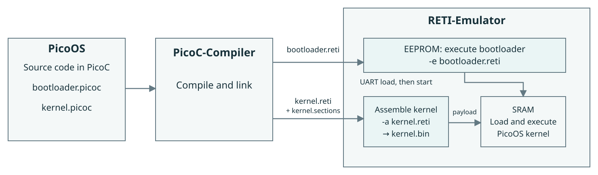

`-e` loads the RETI boot program into the emulator's EEPROM, called EPROM in
its options and source. It does not preload the kernel into SRAM. The
bootloader requests the separately assembled kernel binary through UART,
consumes its header, copies its payload into SRAM, and starts the kernel. The
exact formats and header-generation options are explained in
[`1.1.8 Linked .sections metadata and the five-word binary header`](#118-linked-sections-metadata-and-the-five-word-binary-header)
and [`1.1.9 Generated memory constants for the bootloader and kernel`](#119-generated-memory-constants-for-the-bootloader-and-kernel).

The table below identifies what each part passes to the next, including runtime
requests that are separate from the generated build files.

| Producer | Contract | Consumer |
| --- | --- | --- |
| PicoC-Compiler | Linked `.reti`, `.sections`, generated memory headers, and `.debuginfo` | RETI-Emulator assembler/debugger and PicoOS low-level builds |
| RETI-Emulator assembler | Five-word layout header followed by encoded RETI words in `.bin` | EPROM bootloader and kernel process loader |
| PicoOS libraries | Syscall number plus direct value/pointer or stack-local request structure | Interrupt entry, [`handle_syscall()`](kernel/syscall.picoc#L16), and the owning kernel subsystem |
| Kernel subsystems | PCBs, activations, queues, descriptor/shared-memory state, and periphery-register writes | Scheduler/dispatcher and emulated RETI hardware |
| PicoOS UART host request protocol | Bounded `<ESC>...<ESC>/` requests and big-endian responses | RETI-Emulator host file services, or a companion serial host on hardware |

## Build and run
[\[↓ TOC\]](#contents)

The quickest way to run PicoOS is the ready-built archive attached to the
[latest PicoOS release](https://github.com/matthejue/Pico-OS/releases/latest).
Download `pico-os-runtime.tar.gz`, extract it into its own directory, enter that
directory, and use the launcher for your platform. The archive expands its
runtime files directly, without an extra top-level directory.

```console
$ curl -fLO https://github.com/matthejue/Pico-OS/releases/latest/download/pico-os-runtime.tar.gz
$ mkdir pico-os-runtime
$ tar -xzf pico-os-runtime.tar.gz -C pico-os-runtime
$ cd pico-os-runtime
$ ./start-picoos.sh
```

On Windows, extract the same archive and run `./start-picoos.ps1` from
PowerShell. On Android, use Termux and the shell launcher. The launchers search
the archive directory and `PATH` for the tools. When the RETI Emulator or PicoC
Compiler is absent, `start-picoos` offers to download a compatible release
beside the archive files. The extracted directory becomes PicoOS `/`, so files
created from PicoOS remain there. The emulator is required to run PicoOS. The
compiler is included for related PicoC work.

The launcher options let you choose the runtime mode without editing
`config/emulator_options.txt`:

| Behavior | Shell launcher | PowerShell launcher |
| --- | --- | --- |
| Use a specific emulator | `--reti-emulator PATH` | `-RetiEmulator PATH` |
| Enable DMA loading | `--dma` or `-M` | `-Dma` or `-M` |
| Run directly in the terminal | `--notui` or `-N` | `-NoTui` or `-N` |
| Show help | `--help` or `-h` | `-Help` or `-h` |
| Pass remaining emulator options | `-- EMULATOR_ARGS...` | `-- EMULATOR_ARGS...` |

If DMA was not selected on the command line, the launcher asks whether to
enable it. Direct memory access lets the emulated DMA device copy an executable
from UART into SRAM while the CPU can schedule other work. This reduces CPU
copying and avoids repeated polling syscalls during process loading. Choose it
when studying the asynchronous device path, or answer no to use the simpler
polling path. [Section 4.5.1, Executable transfer with polling or DMA](#451-executable-transfer-with-polling-or-dma)
compares both paths, and [Section 2.7, DMA completion interrupt path](#27-dma-completion-interrupt-path)
explains how a completed transfer wakes the waiting process.

On its first run, the launcher also offers to download
[`picoos-cheatsheet.pdf`](https://github.com/matthejue/Pico-OS_Cheatsheet/releases/latest/download/picoos-cheatsheet.pdf)
into the archive directory. If you decline, it adds that download link to the
archive README instead. Either choice is recorded on the README's last line so
the launcher does not ask again. You can use the linked release asset to
download the cheat sheet directly at any time.

The archive is for running the released system. Contributors who want to build
from source, use Make targets such as `bootload`, or run a locally built kernel
should follow the [development workflow](documentation/development_workflow.md).

### Use the PicoOS shell
[\[↓ TOC\]](#contents)

The release launcher opens the Debug TUI by default. Press `c`, then Enter, to
continue through bootloader, kernel, and init startup. Press capital `V` to
open the raw UART terminal, where arrow keys, `Ctrl+C`, and `Ctrl+Z` reach
PicoOS. `Ctrl+]` returns to the debugger. Lowercase `v` opens the normal
terminal and Escape returns from it. Alternatively, start with `--notui` on
the shell launcher or `-NoTui` on PowerShell to use the PicoOS terminal
directly.

At the `PicoOS>` prompt, a program can be run by its executable name, a
relative path, or an absolute PicoOS path inside the runtime directory. The
shell finds names such as `echo.bin` in `/user`, so normal use does not require separate `load`
and `run` commands. This compact session sends `echo.bin` through one
file-backed pipeline, redirects the result to `topics.txt`, and then reads the
file:

```console
PicoOS> echo.bin "kernel\ncontext switcher\nscheduler" | sed.bin s/context switch/dispatcher/ > topics.txt
PicoOS> cat.bin topics.txt
kernel
dispatcher
scheduler
```

The pipeline is sequential rather than concurrent. The shell first redirects
the left command into a temporary file, then makes that file the right
command's standard input. The final `>` makes the right command's standard
output name `topics.txt`. [Section 11.7, Sequential file-backed pipelines](#117-sequential-file-backed-pipelines)
and [Section 11.6, Input/output redirection](#116-inputoutput-redirection)
explain the implementation. The [development workflow](documentation/development_workflow.md#reaching-the-shell-from-a-source-checkout)
documents the corresponding source-tree launch choices.

### Release archive layout
[\[↓ TOC\]](#contents)

For every `v*` tag, the [release workflow](.github/workflows/build.yml) builds
and verifies [`binary/`](binary/), then publishes its contents as
`pico-os-runtime.tar.gz`. The archive contains a complete PicoOS runtime and
the scripts needed to start it in RETI Emulator. It is not a copy of the
source repository and contains no test fixtures, PicoC sources, or libraries.
The [development workflow](documentation/development_workflow.md#building-the-release-tree-and-archive)
explains how contributors create the same tree and archive locally.

Host `/tmp` is not mounted or added to directory listings. Use the RETI
Emulator version offered by the launcher with these binaries.

The following paths show where to find each runtime component in that archive,
the links point to their generated locations under [`binary/`](binary/).

| Archive path | Contents and purpose |
| --- | --- |
| [`binary/README.md`](binary/README.md) | Short release-specific startup and host-filesystem instructions. It becomes `README.md` at the archive root. |
| [`binary/start-picoos.sh`](binary/start-picoos.sh), [`binary/start-picoos.ps1`](binary/start-picoos.ps1) | Linux/macOS/Android and Windows launchers. They find or download the tools, select the boot and kernel metadata, and start the emulator. |
| [`binary/download-tools.sh`](binary/download-tools.sh), [`binary/download-tools.ps1`](binary/download-tools.ps1) | Helpers used by the launcher to download matching released `picoc_compiler` and `reti_emulator` binaries when they are missing. |
| [`binary/boot/`](binary/boot/) | [`bootloader.reti`](binary/boot/bootloader.reti), the RETI EPROM image built from [`bootloader.picoc`](boot/bootloader.picoc) that loads and starts the kernel. |
| [`binary/kernel/`](binary/kernel/) | [`kernel.bin`](binary/kernel/kernel.bin), the loadable image built from [`kernel.picoc`](kernel/kernel.picoc), [`kernel.sections`](binary/kernel/kernel.sections), its linked memory-layout metadata, and [`kernel.debuginfo`](binary/kernel/kernel.debuginfo), its source/debug metadata. |
| [`binary/system/`](binary/system/) | Loadable system-program binaries, currently [`init.bin`](system/init.picoc). |
| [`binary/user/`](binary/user/) | Loadable PicoOS command binaries, including [`shell.bin`](user/shell.picoc) and the standard user commands built from [`user/`](user/). |
| [`binary/config/`](binary/config/) | Runtime configuration copied from [`config/`](config/): the initial environment, emulator options, and PicoOS release version. |
| [`binary/device/`](binary/device/) | `terminal.dev` and `null.dev` marker files. They represent PicoOS virtual device paths, they do not hold device data. |

For the corresponding source-tree directories and local helper scripts, see
[Repository layout](documentation/repository_layout.md).

## Intended physical hardware
[\[↓ TOC\]](#contents)

The intended physical setup uses an Alchitry Cu V2 FPGA board, two ISSI
IS61WV25616BLL-10TLI SRAM chips, and a SparkFun Serial Basic USB-to-UART
adapter. The prices below are the example parts-list prices used for this
design, including VAT. They were last checked at DigiKey Germany on 12 August
2026, component and shipping prices can change.

The circuit view shows the host connection, FPGA logic, and the two SRAM chips
in one system. The CPU and DMA controller share a 32-bit SRAM interface.
Both chips receive the same address and control signals, while their separate
16-bit data buses supply the lower and upper halves of each word. UART carries
8-bit bytes, with a receive buffer assembling four bytes for each DMA word.
The CPU configures the peripherals through memory-mapped I/O.

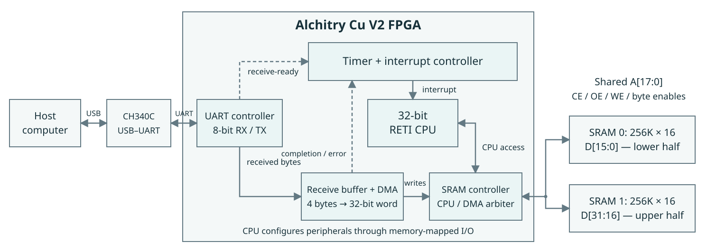

The UART interrupt line reports receive-ready events to the interrupt
controller. Typed terminal characters commonly cause those events, but the
hardware source is the UART receiver rather than a keyboard controller. The
same interrupt can be caused by bytes returned by the companion host program.
When DMA owns a receive transfer, the receive buffer supplies complete words
to DMA instead of requiring the CPU to poll and copy each word.

The DMA controller, receive word buffer, interrupt paths, and SRAM arbitration
are FPGA logic using the existing SRAM and USB-to-UART connections. The
detailed [DMA connections](documentation/dma_connections.md) describe how this
logic connects to the PicoOS interface.

- **FPGA: [Alchitry Cu V2](https://www.digikey.de/short/8cmz0qnc) with Lattice
  iCE40-HX8K** ([board schematic](https://cdn.sparkfun.com/assets/2/f/9/9/3/CuSchematic.pdf),
  [FPGA datasheet](https://www.latticesemi.com/~/media/latticesemi/documents/datasheets/ice/ice40lphxfamilydatasheet.pdf)):
  **€55.66** (checked 12 August 2026). The FPGA implements the educational
  32-bit CPU, timer, interrupt controller, UART controller, DMA controller,
  receive word buffer, and arbitrated SRAM interface.
- **SRAM: two [ISSI
  IS61WV25616BLL-10TLI](https://www.digikey.de/short/075fh38w) chips**
  ([datasheet](https://www.issi.com/WW/pdf/61-64WV25616.pdf)):
  **2 × €5.80 = €11.60** (checked 12 August 2026). Each asynchronous SRAM is
  organized as 256K × 16 bits. Both chips share the FPGA’s 18 address lines,
  chip enable, output enable, write enable, and byte-enable control. One chip
  connects its 16 data pins to FPGA SRAM data bits 0–15 and the other to bits
  16–31.
  Driving both chips with the same address and control signals therefore makes
  them one 256K × 32-bit SRAM shared by CPU and DMA accesses. It provides
  2^18 = 262,144 individually
  addressable 32-bit words, addressed from 0 through 2^18 - 1. Each word holds
  four bytes, so the total is
  `262,144 words × 4 bytes = 1,048,576 bytes = 1 MiB`. For comparison, 2^18
  bytes alone would be only 0.262144 MB.
- **USB-to-UART: [SparkFun Serial Basic Breakout with CH340C and
  USB-C](https://www.digikey.de/short/h83tqvbw)**
  ([product sheet](https://mm.digikey.com/Volume0/opasdata/d220001/medias/docus/739/DEV-15096_Web.pdf),
  [CH340C datasheet](https://cdn.sparkfun.com/assets/5/0/a/8/5/CH340DS1.PDF),
  [board schematic](https://cdn.sparkfun.com/assets/learn_tutorials/8/3/7/Serial-Basic-CH340C_Datasheet.pdf)):
  **€10.92** (checked 12 August 2026). Its `TXO` pin connects to the FPGA
  UART’s receive pin, its `RXI` pin connects to the FPGA UART’s transmit pin,
  and their grounds are connected. USB exposes the CH340C as a serial port on
  the host. The host and FPGA use the same baud rate and serial format, and
  UART transfers each request and response as a sequence of bytes.
  UART receive-ready drives the FPGA interrupt controller for ordinary
  interrupt-driven input. During an active DMA transfer, the receive buffer
  instead supplies groups of four incoming bytes to the DMA controller.

The example total is **€55.66 + 2 × €5.80 + €10.92 = €78.18 including VAT**.
This excludes USB cables, wires, connectors, a printed circuit board, other
interconnection hardware, and shipping. In the rest of this README, PCB means
*process control block* unless the hardware context says otherwise.

The physical setup is not yet used. During development, the RETI-Emulator
provides the UART controller and host services, displaying UART terminal output
in the terminal from which it was started. PicoOS has no resident storage
device or filesystem. The emulator exposes its launch directory as PicoOS `/`,
with the files and directories recursively below it forming the host filesystem
sandbox. Repeated `..` components stop at this root, and symbolic links cannot
provide a route outside it.

On the physical FPGA, a companion host program must instead interpret requests
from the USB serial port, perform the sandboxed filesystem operations, and
return results or file data over UART. The architecture and current emulator
replacement are shown in
[`1.2.3 UART host-service protocol`](#123-uart-host-service-protocol). PicoOS path
handling is explained in
[`7.9 PicoOS paths, working directories, and host operations`](#79-picoos-paths-working-directories-and-host-operations).

The generated binaries also show why 1 MiB is a plausible memory size for the
project. The example sizes below come from the generated files currently in
[`binary/`](binary/) and include each file’s five-word header. Sizes change
with source code and compiler options:

| Image | 32-bit words | Size |
| --- | ---: | ---: |
| [`kernel.bin`](binary/kernel/kernel.bin) ([`kernel.picoc`](kernel/kernel.picoc)) | 41,693 | 0.166772 MB |
| [`init.bin`](binary/system/init.bin) ([`init.picoc`](system/init.picoc)) | 10,858 | 0.043432 MB |
| [`shell.bin`](binary/user/shell.bin) ([`shell.picoc`](user/shell.picoc)) | 32,655 | 0.130620 MB |
| [`cat.bin`](binary/user/cat.bin) ([`cat.picoc`](user/cat.picoc)) | 9,953 | 0.039812 MB |
| [`echo.bin`](binary/user/echo.bin) ([`echo.picoc`](user/echo.picoc)) | 12,018 | 0.048072 MB |

A conservative calculation can count the headers as if they also occupied
SRAM. With the resident [`kernel.bin`](kernel/kernel.picoc), [`init.bin`](system/init.picoc), and [`shell.bin`](user/shell.picoc) images,
`262,144 - (41,693 + 10,858 + 32,655) = 176,938` words remain. That space
could hold `floor(176,938 / 9,953) = 17` copies of [`cat.bin`](user/cat.picoc). The loader
actually keeps the five header words out of the copied program image. This is
only an image-size comparison,a running process also needs heap and stack
space,but it gives a useful scale for the available memory.

### RETI execution model
[\[↓ TOC\]](#contents)

The RETI memory map determines where the bootloader, peripherals, and PicoOS
runtime execute. The CPU selects one of these address spaces from the two
highest address bits:

| High bits | Address space | PicoOS use |
| --- | --- | --- |
| `00` | EPROM | Bootloader |
| `01` | Memory-mapped periphery | UART, interrupt controller, timer, stack boundary, exception cause, DMA |
| `10` or `11` | SRAM | Interrupt table, kernel, process images, heaps, and stacks |

## Contents

The chapters cover toolchain extensions and kernel functionality, then follow
startup from the bootloader through the kernel, init, and the shell to the
individual user applications. Testing and the use of PicoOS in OS and RTOS
lectures follow.

1. [Toolchain extensions for PicoOS](#1-toolchain-extensions-for-picoos)
   - [1.1 PicoC-Compiler extensions](#11-picoc-compiler-extensions)
      - [1.1.1 Compilation pipeline and compiler passes](#111-compilation-pipeline-and-compiler-passes)
      - [1.1.2 Separate compilation, reusable artifacts, and linking](#112-separate-compilation-reusable-artifacts-and-linking)
      - [1.1.3 System V ABI stack frames and call cleanup](#113-system-v-abi-stack-frames-and-call-cleanup)
         - [1.1.3.1 Stack-frame layout and caller cleanup](#1131-stack-frame-layout-and-caller-cleanup)
         - [1.1.3.2 Shared function epilogue and return values](#1132-shared-function-epilogue-and-return-values)
         - [1.1.3.3 Naked functions without a generated frame](#1133-naked-functions-without-a-generated-frame)
      - [1.1.4 Placing globals in `.ivt` with `section("ivt")`](#114-placing-globals-in-ivt-with-sectionivt)
      - [1.1.5 Selecting a startup function with `-C` / `--startup-source`](#115-selecting-a-startup-function-with--c----startup-source)
         - [1.1.5.1 Default compiler-generated `_start`](#1151-default-compiler-generated-_start)
         - [1.1.5.2 PicoOS `libstart` startup sequence](#1152-picoos-libstart-startup-sequence)
         - [1.1.5.3 Startup functions used by PicoOS images](#1153-startup-functions-used-by-picoos-images)
      - [1.1.6 Program sections, interrupt-vector entries, and linker placement](#116-program-sections-interrupt-vector-entries-and-linker-placement)
      - [1.1.7 RETI pseudoinstructions](#117-reti-pseudoinstructions)
         - [1.1.7.1 Interrupt-safe `PUSH` and `POP`](#1171-interrupt-safe-push-and-pop)
         - [1.1.7.2 Loading 32-bit values with `LOADI32`](#1172-loading-32-bit-values-with-loadi32)
         - [1.1.7.3 Long jumps with `JUMP32`](#1173-long-jumps-with-jump32)
         - [1.1.7.4 Pseudoinstruction expansion during linking](#1174-pseudoinstruction-expansion-during-linking)
      - [1.1.8 Linked `.sections` metadata and the five-word binary header](#118-linked-sections-metadata-and-the-five-word-binary-header)
      - [1.1.9 Generated memory constants for the bootloader and kernel](#119-generated-memory-constants-for-the-bootloader-and-kernel)
   - [1.2 RETI-Emulator extensions](#12-reti-emulator-extensions)
      - [1.2.1 RETI machine model and memory-mapped peripherals](#121-reti-machine-model-and-memory-mapped-peripherals)
      - [1.2.2 Atomic test-and-set with `TSL`](#122-atomic-test-and-set-with-tsl)
      - [1.2.3 UART host-service protocol](#123-uart-host-service-protocol)
      - [1.2.4 Debugger, source view, and terminal modes](#124-debugger-source-view-and-terminal-modes)
1. [Interrupts, system calls, preemption, and exceptions](#2-interrupts-system-calls-preemption-and-exceptions)
   - [2.1 RETI interrupt entry and the interrupt vector table](#21-reti-interrupt-entry-and-the-interrupt-vector-table)
   - [2.2 Interrupt-controller mappings and priorities](#22-interrupt-controller-mappings-and-priorities)
      - [2.2.1 Interrupt-controller function reference](#221-interrupt-controller-function-reference)
      - [2.2.2 Memory-mapped periphery function reference](#222-memory-mapped-periphery-function-reference)
   - [2.3 Saved interrupt stack frame](#23-saved-interrupt-stack-frame)
   - [2.4 System-call interface and execution](#24-system-call-interface-and-execution)
      - [2.4.1 Syscall selectors and register convention](#241-syscall-selectors-and-register-convention)
      - [2.4.2 Process, wait, signal, and memory request structures](#242-process-wait-signal-and-memory-request-structures)
      - [2.4.3 File and directory request structures](#243-file-and-directory-request-structures)
      - [2.4.4 Request-pointer ownership and lifetime](#244-request-pointer-ownership-and-lifetime)
      - [2.4.5 Loading-bar policy and environment inheritance](#245-loading-bar-policy-and-environment-inheritance)
      - [2.4.6 System-call entry, execution, and return to userspace](#246-system-call-entry-execution-and-return-to-userspace)
         - [2.4.6.1 Selecting the return path](#2461-selecting-the-return-path)
         - [2.4.6.2 System-call groups](#2462-system-call-groups)
      - [2.4.7 System-call selection function reference](#247-system-call-selection-function-reference)
   - [2.5 Timer interrupts and userspace preemption](#25-timer-interrupts-and-userspace-preemption)
      - [2.5.1 Timer interrupt path](#251-timer-interrupt-path)
      - [2.5.2 Kernel non-preemption and deferred rescheduling](#252-kernel-non-preemption-and-deferred-rescheduling)
      - [2.5.3 Shell character delay for different timer intervals](#253-shell-character-delay-for-different-timer-intervals)
   - [2.6 UART receive interrupt path](#26-uart-receive-interrupt-path)
      - [2.6.1 Polled UART function reference](#261-polled-uart-function-reference)
   - [2.7 DMA completion interrupt path](#27-dma-completion-interrupt-path)
      - [2.7.1 DMA waiting and completion function reference](#271-dma-waiting-and-completion-function-reference)
   - [2.8 CPU exceptions and runtime errors](#28-cpu-exceptions-and-runtime-errors)
      - [2.8.1 CPU exception entry and registers](#281-cpu-exception-entry-and-registers)
      - [2.8.2 Supported exceptions and allocation errors](#282-supported-exceptions-and-allocation-errors)
      - [2.8.3 Exception and stack-boundary function reference](#283-exception-and-stack-boundary-function-reference)
1. [Memory management and shared memory](#3-memory-management-and-shared-memory)
   - [3.1 Heap block layout and allocation algorithm](#31-heap-block-layout-and-allocation-algorithm)
   - [3.2 SRAM image and heap hierarchy](#32-sram-image-and-heap-hierarchy)
   - [3.3 Kernel memory and kernel heap](#33-kernel-memory-and-kernel-heap)
      - [3.3.1 Kernel SRAM map](#331-kernel-sram-map)
      - [3.3.2 Kernel heap blocks and kernel objects](#332-kernel-heap-blocks-and-kernel-objects)
      - [3.3.3 Kernel Heap allocator function reference](#333-kernel-heap-allocator-function-reference)
   - [3.4 Process and Shared Data Heap](#34-process-and-shared-data-heap)
      - [3.4.1 Process-image allocations](#341-process-image-allocations)
      - [3.4.2 Shared-data allocations](#342-shared-data-allocations)
      - [3.4.3 Process and Shared Data Heap allocator function reference](#343-process-and-shared-data-heap-allocator-function-reference)
   - [3.5 User-process memory and heap](#35-user-process-memory-and-heap)
      - [3.5.1 Linked sections, heap, and stack ranges](#351-linked-sections-heap-and-stack-ranges)
      - [3.5.2 Per-process heap blocks and active context](#352-per-process-heap-blocks-and-active-context)
      - [3.5.3 User Process Heap allocator function reference](#353-user-process-heap-allocator-function-reference)
   - [3.6 Heap and allocator function reference](#36-heap-and-allocator-function-reference)
      - [3.6.1 Common allocator linkage and function reference](#361-common-allocator-linkage-and-function-reference)
      - [3.6.2 Reallocation decisions](#362-reallocation-decisions)
      - [3.6.3 Allocation and repeated coalescing example](#363-allocation-and-repeated-coalescing-example)
         - [3.6.3.1 Initial state and first-fit search](#3631-initial-state-and-first-fit-search)
         - [3.6.3.2 Allocation splits D](#3632-allocation-splits-d)
         - [3.6.3.3 Free D and merge its remainder](#3633-free-d-and-merge-its-remainder)
         - [3.6.3.4 Free C and merge repeatedly at B](#3634-free-c-and-merge-repeatedly-at-b)
   - [3.7 Shared-memory entries and mappings](#37-shared-memory-entries-and-mappings)
      - [3.7.1 Named entries and per-process attachments](#371-named-entries-and-per-process-attachments)
      - [3.7.2 Mapping, unlinking, and deferred destruction](#372-mapping-unlinking-and-deferred-destruction)
1. [Processes and process lifecycle](#4-processes-and-process-lifecycle)
   - [4.1 Global process list and current process](#41-global-process-list-and-current-process)
   - [4.2 Process control block fields](#42-process-control-block-fields)
   - [4.3 Process image and initial userspace stack](#43-process-image-and-initial-userspace-stack)
      - [4.3.1 Code, data, heap, and stack placement](#431-code-data-heap-and-stack-placement)
      - [4.3.2 Initial `argc`, `argv`, and `envp`](#432-initial-argc-argv-and-envp)
   - [4.4 Process states and transitions](#44-process-states-and-transitions)
   - [4.5 Loading and starting a process](#45-loading-and-starting-a-process)
      - [4.5.1 Executable transfer with polling or DMA](#451-executable-transfer-with-polling-or-dma)
      - [4.5.2 Changing a completed image from `NEW` to `READY`](#452-changing-a-completed-image-from-new-to-ready)
   - [4.6 Parent-child relationships, termination, and collection](#46-parent-child-relationships-termination-and-collection)
      - [4.6.1 Creating parent-child relationships and handling orphans](#461-creating-parent-child-relationships-and-handling-orphans)
      - [4.6.2 Recording termination status](#462-recording-termination-status)
      - [4.6.3 Parent collection and final removal](#463-parent-collection-and-final-removal)
   - [4.7 Process list, PCB metadata, and lifecycle function reference](#47-process-list-pcb-metadata-and-lifecycle-function-reference)
   - [4.8 Process-loader and run-setup function reference](#48-process-loader-and-run-setup-function-reference)
1. [Scheduling and context switching](#5-scheduling-and-context-switching)
   - [5.1 Scheduler implementation](#51-scheduler-implementation)
      - [5.1.1 Algorithm and Round Robin comparison](#511-algorithm-and-round-robin-comparison)
      - [5.1.2 Scheduler function reference](#512-scheduler-function-reference)
   - [5.2 Saved process activation](#52-saved-process-activation)
   - [5.3 Saving the current process and selecting the next process](#53-saving-the-current-process-and-selecting-the-next-process)
   - [5.4 Restoring the selected process and returning with `RTI`](#54-restoring-the-selected-process-and-returning-with-rti)
   - [5.5 Dispatcher function reference](#55-dispatcher-function-reference)
1. [Blocking, wait queues, signals, and mutexes](#6-blocking-wait-queues-signals-and-mutexes)
   - [6.1 Wait Queue Structure and Intrusive PCB Links](#61-wait-queue-structure-and-intrusive-pcb-links)
      - [6.1.1 Blocking with `sleep` and Waking with `wakeup`](#611-blocking-with-sleep-and-waking-with-wakeup)
      - [6.1.2 Child Waiting with `waitpid`](#612-child-waiting-with-waitpid)
      - [6.1.3 Wait Queue Function Reference](#613-wait-queue-function-reference)
   - [6.2 Process Signals](#62-process-signals)
      - [6.2.1 Supported signals and fixed actions](#621-supported-signals-and-fixed-actions)
      - [6.2.2 Stopping and continuing a process](#622-stopping-and-continuing-a-process)
      - [6.2.3 Termination, `Ctrl-C`, and parent collection](#623-termination-ctrl-c-and-parent-collection)
      - [6.2.4 Fixed PicoOS signal actions compared with Unix](#624-fixed-picoos-signal-actions-compared-with-unix)
      - [6.2.5 Signal Function Reference](#625-signal-function-reference)
   - [6.3 Mutex Locking with Test-and-Set and Wait Queues](#63-mutex-locking-with-test-and-set-and-wait-queues)
1. [Terminal, file descriptors, and host filesystem](#7-terminal-file-descriptors-and-host-filesystem)
   - [7.1 Per-process file-descriptor table](#71-per-process-file-descriptor-table)
   - [7.2 Global terminal input buffer](#72-global-terminal-input-buffer)
   - [7.3 Blocking and completing terminal reads](#73-blocking-and-completing-terminal-reads)
   - [7.4 Foreground input ownership and terminal-generated signals](#74-foreground-input-ownership-and-terminal-generated-signals)
   - [7.5 Virtual terminal and null-device paths](#75-virtual-terminal-and-null-device-paths)
   - [7.6 File-descriptor creation, inheritance, duplication, and cleanup](#76-file-descriptor-creation-inheritance-duplication-and-cleanup)
   - [7.7 Terminal-buffer and pending-read function reference](#77-terminal-buffer-and-pending-read-function-reference)
   - [7.8 Opening, reading, writing, and seeking](#78-opening-reading-writing-and-seeking)
   - [7.9 PicoOS paths, working directories, and host operations](#79-picoos-paths-working-directories-and-host-operations)
1. [Kernel data structures: relationships, storage, and lifetimes](#8-kernel-data-structures-relationships-storage-and-lifetimes)
   - [8.1 Memory layout, allocation sources, and lifetimes](#81-memory-layout-allocation-sources-and-lifetimes)
   - [8.2 Containment and reference relationships](#82-containment-and-reference-relationships)
   - [8.3 Kernel global variables and process-list roots](#83-kernel-global-variables-and-process-list-roots)
   - [8.4 Wait requests and queue storage](#84-wait-requests-and-queue-storage)
1. [Userspace libraries](#9-userspace-libraries)
   - [9.1 From a library call to the kernel: waitpid](#91-from-a-library-call-to-the-kernel-waitpid)
      - [9.1.1 Header, implementation, and linking](#911-header-implementation-and-linking)
      - [9.1.2 Packing arguments and executing the syscall](#912-packing-arguments-and-executing-the-syscall)
      - [9.1.3 Interrupt entry, waiting, and return](#913-interrupt-entry-waiting-and-return)
   - [9.2 Library overview and dependencies](#92-library-overview-and-dependencies)
      - [9.2.1 unistd: processes, descriptors, paths, and wait queues](#921-unistd-processes-descriptors-paths-and-wait-queues)
         - [9.2.1.1 Process operations in `process.picoc`](#9211-process-operations-in-processpicoc)
         - [9.2.1.2 Descriptor operations in `io.picoc`](#9212-descriptor-operations-in-iopicoc)
         - [9.2.1.3 Working-directory operations in `working_directory.picoc`](#9213-working-directory-operations-in-working_directorypicoc)
         - [9.2.1.4 Path operations in `file_removal.picoc`](#9214-path-operations-in-file_removalpicoc)
         - [9.2.1.5 Wait-queue operations in `blocking.picoc`](#9215-wait-queue-operations-in-blockingpicoc)
      - [9.2.2 fcntl: opening and creating files](#922-fcntl-opening-and-creating-files)
      - [9.2.3 sys/wait: waiting for children](#923-syswait-waiting-for-children)
      - [9.2.4 mutex: locking and waking contenders](#924-mutex-locking-and-waking-contenders)
      - [9.2.5 sys/mman: named shared memory](#925-sysmman-named-shared-memory)
      - [9.2.6 dirent: directory streams](#926-dirent-directory-streams)
      - [9.2.7 stdlib: process heap, environment, conversion, and exit](#927-stdlib-process-heap-environment-conversion-and-exit)
         - [9.2.7.1 Heap operations in `malloc.picoc`](#9271-heap-operations-in-mallocpicoc)
         - [9.2.7.2 Decimal conversion in `atoi.picoc`](#9272-decimal-conversion-in-atoipicoc)
         - [9.2.7.3 Environment operations in `env.picoc`](#9273-environment-operations-in-envpicoc)
         - [9.2.7.4 Process exit in `exit.picoc`](#9274-process-exit-in-exitpicoc)
      - [9.2.8 string: copying, comparison, and length](#928-string-copying-comparison-and-length)
      - [9.2.9 stdio: streams, formatting, and scanning](#929-stdio-streams-formatting-and-scanning)
         - [9.2.9.1 Streams and output in `stdio.picoc`](#9291-streams-and-output-in-stdiopicoc)
         - [9.2.9.2 Scanning in `scanf.picoc`](#9292-scanning-in-scanfpicoc)
      - [9.2.10 start: entering and leaving a user program](#9210-start-entering-and-leaving-a-user-program)
      - [9.2.11 Single-function libraries](#9211-single-function-libraries)
1. [Complete startup: bootloader, kernel, init, shell, and user applications](#10-complete-startup-bootloader-kernel-init-shell-and-user-applications)
   - [10.1 Loading the kernel from the EPROM bootloader](#101-loading-the-kernel-from-the-eprom-bootloader)
   - [10.2 Kernel startup](#102-kernel-startup)
      - [10.2.1 Loading init and entering normal execution](#1021-loading-init-and-entering-normal-execution)
   - [10.3 Init process](#103-init-process)
      - [10.3.1 Init responsibilities](#1031-init-responsibilities)
      - [10.3.2 Initial environment configuration](#1032-initial-environment-configuration)
      - [10.3.3 Loading, starting, and waiting for the shell](#1033-loading-starting-and-waiting-for-the-shell)
      - [10.3.4 Shell startup](#1034-shell-startup)
      - [10.3.5 Loading user applications](#1035-loading-user-applications)
      - [10.3.6 Shell exit and restart policy](#1036-shell-exit-and-restart-policy)
      - [10.3.7 When init terminates](#1037-when-init-terminates)
1. [Shell](#11-shell)
   - [11.1 Shell-owned state](#111-shell-owned-state)
   - [11.2 Shell startup and command loop](#112-shell-startup-and-command-loop)
   - [11.3 Interactive line editing and command history](#113-interactive-line-editing-and-command-history)
   - [11.4 Command parsing, expansion, and execution](#114-command-parsing-expansion-and-execution)
   - [11.5 Shell built-in commands](#115-shell-built-in-commands)
      - [11.5.1 Foreground processes, background processes, and job-control signals](#1151-foreground-processes-background-processes-and-job-control-signals)
   - [11.6 Input/output redirection](#116-inputoutput-redirection)
   - [11.7 Sequential file-backed pipelines](#117-sequential-file-backed-pipelines)
1. [User applications and commands](#12-user-applications-and-commands)
   - [12.1 Available applications, library functions, and Host Requests](#121-available-applications-library-functions-and-host-requests)
      - [12.1.1 Command behavior and supported options](#1211-command-behavior-and-supported-options)
      - [12.1.2 Command errors and exit statuses](#1212-command-errors-and-exit-statuses)
1. [Test system](#13-test-system)
   - [13.1 Library, OS, shell, and boot test categories](#131-library-os-shell-and-boot-test-categories)
      - [13.1.1 Files that make up a test](#1311-files-that-make-up-a-test)
      - [13.1.2 Library test example](#1312-library-test-example)
      - [13.1.3 OS test example](#1313-os-test-example)
      - [13.1.4 Shell test example](#1314-shell-test-example)
      - [13.1.5 Boot test example](#1315-boot-test-example)
   - [13.2 Test execution](#132-test-execution)
      - [13.2.1 Make targets](#1321-make-targets)
1. [Use in operating-systems and real-time operating-systems lectures](#14-use-in-operating-systems-and-real-time-operating-systems-lectures)
   - [14.1 Operating-systems topics](#141-operating-systems-topics)
      - [14.1.1 Inspecting PicoOS execution in the RETI-Emulator](#1411-inspecting-picoos-execution-in-the-reti-emulator)
      - [14.1.2 Exploring userspace heap allocation](#1412-exploring-userspace-heap-allocation)
      - [14.1.3 Editing and executing symbolic RETI assembly](#1413-editing-and-executing-symbolic-reti-assembly)
   - [14.2 Real-time operating-systems topics](#142-real-time-operating-systems-topics)
1. [Use of AI in the project](#15-use-of-ai-in-the-project)
1. [Limitations](#16-limitations)
- [Appendix: Inspecting `.bin` files with `hexyl`](#appendix-inspecting-bin-files-with-hexyl)

# 1. Toolchain extensions for PicoOS
[\[↑ TOC\]](#contents)

The original teaching compiler and emulator could run small standalone
programs, but they lacked the linking, loading, interrupt, and debugging
support needed by PicoOS. Both tools were therefore extended so the OS could
be written in PicoC, linked into complete images, booted, and inspected as
RETI code.

The detailed change histories are kept with the sibling projects in the
[PicoC-Compiler feature history](https://github.com/matthejue/PicoC-Compiler/blob/linker_update/documentation/new_features_for_pico_os.md)
and [RETI-Emulator feature history](https://github.com/matthejue/RETI-Emulator/blob/statemachine/documentation/new_features_for_pico_os.md).
This chapter records the complete project-facing surface rather than only the
few extensions that appear directly in kernel source.

## 1.1 PicoC-Compiler extensions
[\[↑ TOC\]](#contents)

PicoOS needs whole programs built from many files, headers that affect their
inputs, a broader PicoC language, and control over final memory layout. The
following compiler features were added to provide those capabilities.

| Feature | Contribution used by PicoOS |
| --- | --- |
| Installation | The compiler installation creates the environment and installs the `picoc_compiler` command |
| Preprocessing | `#include`, include paths, `#pragma once`, object-like macros, line splicing, dependency output, and optional syntax checking |
| Multiple translation units | Per-file compilation, symbol merging, cross-file calls/globals, and final program-wide linking |
| Reusable build artifacts | `.reti_blocks` and `.st` retain lowered code, symbols, data, startup, and debug metadata for later links |
| Automatic artifact reuse | Source/header hashes and compiler options decide whether an unchanged compiled file can be reused, Make dependency files expose the same inputs |
| Broader PicoC syntax | `typedef`, casts, mixed declarations/statements, postfix increment, array-size inference, and compile-time integer simplification |
| Pointer support | Pointer returns, `void *`, typed pointer arithmetic, dereference/member conditions, and compatible forward/repeated struct declarations |
| Function pointers | Declarations, arrays, assignments, indirect calls, and statically emitted function addresses |
| Variadic functions | Variadic declarations and the documented System-V-style stack-frame locations used by [`printf()`](library/stdio/stdio.picoc#L354) and [`scanf()`](library/stdio/scanf.picoc#L112) |
| String and character data | Escapes, inferred local arrays, global strings, deduplicated string literals, and linker-safe literal names |
| Inline RETI assembly | `asm("...")`, linked labels inside assembly, and safe pseudoinstructions such as `LOADI32`, `JUMP32`, `PUSH`, and `POP` |
| Low-level functions | `__attribute__((naked))` suppresses compiler prologue/epilogue code for startup and interrupt handlers |
| Custom sections | `__attribute__((section("ivt")))` places selected globals or functions in `.ivt`, ordinary functions and globals use `.text` and `.data` |
| Interrupt-vector entries | `IVTE` resolves handler pointers into tagged SRAM addresses |
| Runtime startup | Generated default entry or a replaceable custom `-C` startup such as PicoOS [`libstart`](library/start/libstart.picoc) |
| Global initialization | `-O1` emits known scalar, string, struct, array, and function-pointer initializers directly into `.data` or an attributed `.ivt` |
| Shared epilogues | All ordinary returns converge on one generated restore/return block |
| Section layout | Separate `.ivt`, `.text`, and `.data` regions and the paired final `.sections` file |
| Linked labels | Human-readable labels remain until final patching, making generated RETI inspectable |
| Kernel headers | `-k sram` and `-k eprom` generate [`memory_constants.header`](kernel/memory_constants.header) for code that has no PCB/runtime loader context |
| Debug information | `.debuginfo` describes source ranges, globals, frames, arguments, calls, returns, and local variables for the emulator TUI |
| Inspectable intermediates | Preprocessed source and named RETI-block stages make the result of individual compiler passes visible |
| Source trap and RETI `NOP` | `debug;` lowers to the emulator trap and inline `NOP` remains a real instruction |

### 1.1.1 Compilation pipeline and compiler passes
[\[↑ TOC\]](#contents)

These features required more than individual backend changes. The original
compiler accepted one PicoC file and transformed it directly into one RETI
program. It used Lark to parse the source and a transformer to create the
PicoC AST, its [passes](https://github.com/matthejue/PicoC-Compiler/blob/master/src/passes.py)
and [AST transformer](https://github.com/matthejue/PicoC-Compiler/blob/master/src/ast_transformers.py)
show the following left-to-right lowering sequence. The boxed compilation
group runs once for that input file and produces its RETI program.


```mermaid
flowchart LR
    source["One PicoC source file"]

    subgraph frontend["Lexing and parsing"]
        lexer["Lark lexer and parser"]
        tree["Parse tree"]
        ast["TransformerPicoC AST"]
    end

    subgraph compilation["Single-file compilation passes"]
        shrink["picoc_shrink"]
        blocks["picoc_blocks"]
        anf["picoc_anf"]
        reti_blocks["reti_blocks"]
        patch["reti_patch"]
        reti["reti"]
    end

    output["One RETI program"]

    source --> lexer --> tree --> ast
    ast --> shrink --> blocks --> anf --> reti_blocks --> patch --> reti --> output
```

For the added preprocessing, separate compilation, typing, and linking
features, this pipeline was extended before and after the per-file passes.
Preprocessing resolves includes, macros, and line splicing before parsing. The
new symbol and typing passes check names, declarations, and types before
ANF and RETI lowering. A program-wide linker combines the compiled code and
global symbols and inserts startup code before resolving final addresses.
The second diagram highlights the added preprocessing, symbol and typing
passes, and the merge/startup step in yellow. Other phases retain the neutral
style so the changes can be compared with the previous pipeline.


```mermaid
flowchart LR
    source["PicoC source files"]

    subgraph preprocessing["Preprocessing"]
        preprocessor["Includes, macros, and line splicing"]:::added
        preprocessed["Preprocessed source"]:::added
    end

    subgraph frontend["Lexing and parsing"]
        tokens["Token stream"]
        parse_tree["Tree-sitter parse tree"]
        ast["PicoC AST"]
    end

    subgraph compilation["Per-file compilation passes"]
        shrink["picoc_shrink"]
        blocks["picoc_blocks"]
        symbol["PicoC symbols<br/>picoc_symbol"]:::added
        typing["PicoC typing<br/>picoc_typing"]:::added
        anf["picoc_anf"]
        reti_blocks["reti_blocks"]
    end

    subgraph linking["Program-wide linking passes"]
        merge["Merge code / global symbols<br/>Insert startup code"]:::added
        patch["reti_patch"]
        reti["reti"]
    end

    output["Linked RETI program"]

    source --> preprocessor --> preprocessed --> tokens --> parse_tree --> ast
    ast --> shrink --> blocks --> symbol --> typing --> anf --> reti_blocks
    reti_blocks --> merge --> patch --> reti --> output
    classDef added fill:#fff2b2,stroke:#8a5a00,stroke-width:3px,color:#111
    style preprocessing fill:#fff8dc,stroke:#8a5a00,stroke-width:3px,color:#111
```

### 1.1.2 Separate compilation, reusable artifacts, and linking
[\[↑ TOC\]](#contents)

PicoC separate compilation follows the familiar C object-file workflow. GCC
and Clang use `-c` to turn one `.c` file, with its included `.h` headers, into
an `.o` object file. Similarly, `picoc_compiler -c` turns one `.picoc` file,
with its included `.header` files, into paired `.reti_blocks` and `.st` files.
The former contains the lowered RETI blocks, the latter is a JSON symbol table
used when later linking compiled files. A conventional `.o` file stores its symbol table
inside the object file instead. The example uses PicoOS's
[`libstring.picoc`](library/string/libstring.picoc), which includes
[`string.picoc`](library/string/string.picoc) and the shared string helpers,
and [`basic_string.picoc`](test/basic_string.picoc). The GCC commands use the
names of equivalent C versions to illustrate the comparison. Those `.c` files
are not part of this repository. The PicoC link also uses the test's existing
[`libstdlib`](library/stdlib/libstdlib.picoc) and
[`libstdio`](library/stdio/libstdio.picoc) dependencies, compiled alongside
the string library and test:

```console
$ gcc -c -O2 libstring.c basic_string.c
$ ls -1 basic_string.o libstring.o
basic_string.o
libstring.o

$ gcc -o basic_string basic_string.o libstring.o
$ ls -1 basic_string
basic_string

$ picoc_compiler -c -O1 library/string/libstring.picoc test/basic_string.picoc \
    library/stdlib/libstdlib.picoc library/stdio/libstdio.picoc
$ ls -1 library/string/libstring.{reti_blocks,st} test/basic_string.{reti_blocks,st}
library/string/libstring.reti_blocks
library/string/libstring.st
test/basic_string.reti_blocks
test/basic_string.st

$ picoc_compiler -O1 -o binary/basic_string.reti test/basic_string.reti_blocks \
    library/string/libstring.reti_blocks library/stdlib/libstdlib.reti_blocks \
    library/stdio/libstdio.reti_blocks
$ ls -1 binary/basic_string.{reti,sections}
binary/basic_string.reti
binary/basic_string.sections
```

The GCC diagram follows one object file from separate compilation into the
later link. Further object files can be supplied in the same way:

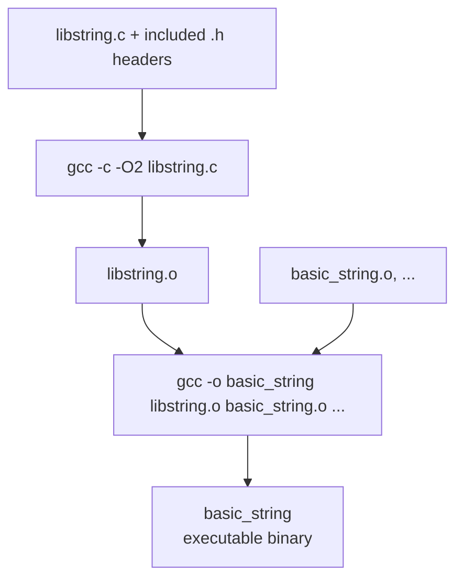
```mermaid
flowchart TB
    SRC["libstring.c + included .h headers"] --> COMPILE["gcc -c -O2 libstring.c"]
    COMPILE --> OBJ["libstring.o"]
    OBJ --> LINK["gcc -o basic_string libstring.o basic_string.o ..."]
    MORE["basic_string.o, ..."] --> LINK
    LINK --> OUT["basic_string<br/>executable binary"]
```

The corresponding PicoC diagram uses the verified `.reti_blocks` / `.st` pair.
There is no generated auxiliary `.c` file. Passing `libstring.reti_blocks` makes the
compiler automatically read the matching `libstring.st` from the same directory.
Each further `.reti_blocks` input likewise needs its corresponding `.st` file:

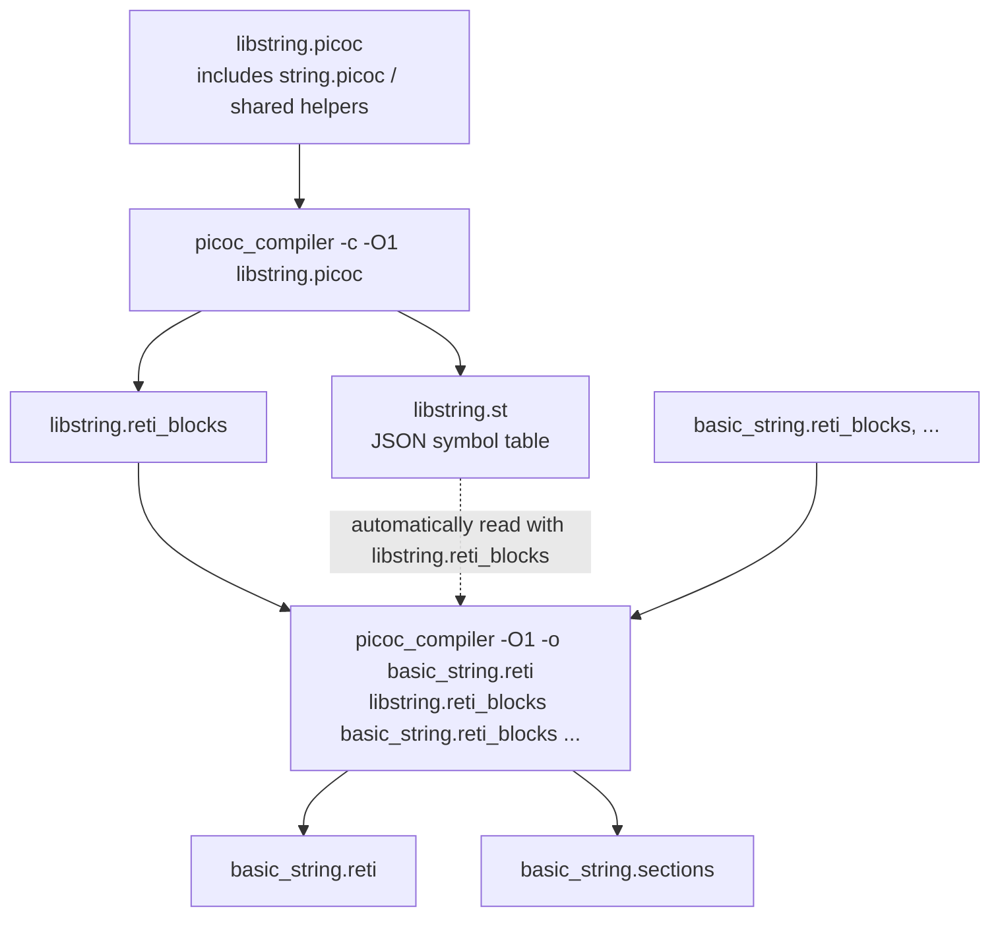
```mermaid
flowchart TB
    SRC["libstring.picoc<br/>includes string.picoc / shared helpers"] --> COMPILE["picoc_compiler -c -O1 libstring.picoc"]
    COMPILE --> OBJ["libstring.reti_blocks"]
    COMPILE --> SYMBOLS["libstring.st<br/>JSON symbol table"]
    OBJ --> LINK["picoc_compiler -O1 -o basic_string.reti<br/>libstring.reti_blocks basic_string.reti_blocks ..."]
    SYMBOLS -.->|automatically read with libstring.reti_blocks| LINK
    MORE["basic_string.reti_blocks, ..."] --> LINK
    LINK --> RETI["basic_string.reti"]
    LINK --> SECTIONS["basic_string.sections"]
```

The `-o` option selects the path and name of the linked executable: the native
`basic_string` in the C command and the final linked RETI assembly
`binary/basic_string.reti` in the PicoC command. PicoC's paired artifacts
keep the lowered code and linker metadata independently inspectable and
reusable. The PicoC/RETI toolchain keeps the accompanying metadata in separate
JSON-like files: `.st` holds linker symbols, `.sections` holds the linked
layout, and `.debuginfo` holds source/debug data.

### 1.1.3 System V ABI stack frames and call cleanup
[\[↑ TOC\]](#contents)

The [System V Application Binary Interface (ABI)](https://github.com/hjl-tools/x86-psABI/wiki/x86-64-psABI-1.0.pdf)
is a family of specifications that defines how separately compiled machine
code interoperates, including calling conventions, register use, and stack
frames. The linked AMD64 supplement is a common reference, PicoC adapts the
same general model to RETI rather than implementing the AMD64 ABI. This
convention lets compiled code, hand-written wrappers, startup functions, and
interrupt code agree on the location of arguments and saved control state. The
three parts below cover the ordinary stack frame, its shared return path, and
the frame-free functions used for low-level control transfers.

#### 1.1.3.1 Stack-frame layout and caller cleanup
[\[↑ TOC\]](#contents)

The called function saves and restores `BAF`. Its caller pushes a generated
continuation-block address and removes the argument cells after the return.
For `func(arg1, arg2)`, the compiler evaluates and pushes `arg2` first, then
`arg1`. This is the compiler's actual evaluation order, rather than a general
C guarantee.

The stack grows toward lower addresses. The table shows a two-cell argument
area for the current call inside a larger stack. Italic rows provide a simple
caller frame with one argument, one local, and one temporary expression value.
The caller's frame pointer is written as `caller BAF` to distinguish it from
the current `BAF`:

| Address direction / position | Contents | Managed by |
| --- | --- | --- |
| **Higher addresses ↑** | *Earlier stack contents* | *Earlier calls* |
| *`caller BAF + 3`* | *Caller function's argument* | *Caller's caller* |
| *`caller BAF + 2`* | *Caller function's return address* | *Caller's caller* |
| *`caller BAF + 1`* | *Frame pointer saved on entry to the caller* | *Caller function's own frame* |
| *`caller BAF`* | *Caller function's local variable* | *Caller function's own frame* |
| *`caller BAF - 1`* | *Temporary expression value retained across this call* | *Caller function's expression evaluation* |
| **`BAF + 4`** | **Second argument (`arg2`)** | **Caller, for this call** |
| **`BAF + 3`** | **First argument (`arg1`)** | **Caller, for this call** |
| **`BAF + 2`** | **Return address to the caller's continuation block** | **Caller, for this call** |
| **`BAF + 1`** | **Saved `caller BAF`** | **Current callee** |
| **`BAF`** | **First local variable, if present** | **Current callee** |
| **`BAF - 1`, ...** | **Further locals and temporary expression values** | **Current callee** |
| **`SP`** | **Free cell immediately below occupied stack cells** | **Current stack boundary** |
| **Lower addresses ↓** | **Direction of stack growth** | |

For these one-cell arguments, `arg1` is always at `BAF + 3` and `arg2` at
`BAF + 4`. Multi-cell arrays and structs occupy their complete width, so later
argument offsets increase by those widths. A struct passed by value uses its
base cell as its logical address for member access and forwarding. A caller
can retain a temporary value while evaluating an expression such as
`left + func(arg1, arg2)`, which explains the contextual row above the current
arguments.

This order helps variadic functions: the callee finds the first argument at
the fixed offset `BAF + 3`, then advances toward higher addresses through
successive arguments without knowing their total count first. With the
opposite arrangement, the first argument would lie at the far end of the
argument area, requiring its total extent before walking back through it.
PicoOS [`printf()`](library/stdio/stdio.picoc#L354) starts its variadic arguments
at `BAF + 4`, while [`fprintf()`](library/stdio/stdio.picoc#L346) starts them at
`BAF + 5` because it has two fixed arguments.
[`1.1.7.1 Interrupt-safe PUSH and POP`](#1171-interrupt-safe-push-and-pop)
explains how stack updates protect occupied cells during interrupts.

#### 1.1.3.2 Shared function epilogue and return values
[\[↑ TOC\]](#contents)

Every ordinary function has one generated `<function>_epilogue` block. Each
source-level return stores a non-void result in `IN2` and converges on that
block, which restores `BAF` and jumps to the saved return address. The diagram
shows this shared return path and why the result remains separate from `ACC`,
which long jumps use as a scratch register.

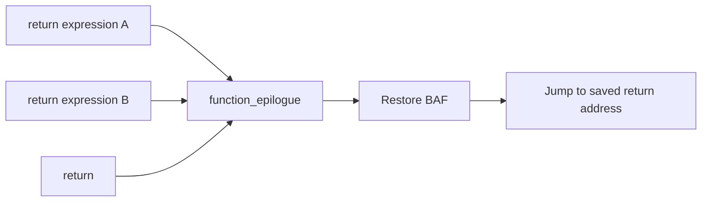
```mermaid
flowchart LR
    return_a["return expression A"] --> epilogue["function_epilogue"]
    return_b["return expression B"] --> epilogue
    return_void["return"] --> epilogue
    epilogue --> restore["Restore BAF"]
    restore --> caller["Jump to saved return address"]
```

A small compiled example makes all three responsibilities visible. The
ordinary function receives one argument and returns one value, while `main`
supplies the argument and later removes it from the stack:

```c
int add_one(int value) {
    return value + 1;
}

int main(void) {
    return add_one(41);
}
```

The options have separate jobs: `-c` stops after per-file compilation, `-v`
adds compiler-generated pattern comments, and `-w` writes the individual pass
results as side files. `-i` can also print those results to the terminal. `-C`
instead selects a startup source. Generate the following two representations
from the same source with:

```console
$ picoc_compiler -c -O1 -v -w normal-function.picoc
```

The PicoC ANF output in `normal-function.picoc_anf` is the last PicoC-level
representation before the `reti_blocks` pass lowers its operations into
symbolic RETI instruction structures:

```text
_global_inits:
add_one:
  NewStackframe(Num('0'))
  Exp(StackframeParam(Num('0')))
  Exp(Num('1'))
  Exp(BinOp(Stack(Num('2')), Add(), Stack(Num('1'))))
  Assign(IN2, Stack(Num('1')))
  Exp(GoTo(Name('add_one_epilogue')))
add_one_epilogue:
  RestoreStackframe()
  RestoreReturnAddress()
main:
  NewStackframe(Num('0'))
  // Call(Name('add_one'), [Num('41')])
  Exp(Num('41'))
  SaveReturnAddress(Name('main_cont.3'))
  Exp(FunRef(Name('add_one')))
  Exp(GoTo(Stack(Num('1'))))
main_cont.3:
  RemoveArguments(Num('1'))
  Exp(IN2)
  Assign(IN2, Stack(Num('1')))
  Exp(GoTo(Name('main_epilogue')))
main_epilogue:
  RestoreStackframe()
  RestoreReturnAddress()
```

The corresponding `.reti_blocks` output below retains symbolic labels and
pseudoinstructions. The `-v` comments identify the ANF operation expanded by
each instruction sequence. Only the machine-specific `# @picoc-cache` line is
omitted:

```reti
  .ivt
  .text
add_one:
  # NewStackframe(Num('0'))
  PUSH BAF
  MOVE SP BAF
  SUBI SP 0
  # Exp(StackframeParam(Num('0')))
  LOADIN BAF ACC 3
  PUSH ACC
  # Exp(Num('1'))
  LOADI ACC 1
  PUSH ACC
  # Exp(BinOp(Stack(Num('2')), Add(), Stack(Num('1'))))
  LOADIN SP ACC 2
  LOADIN SP IN2 1
  ADD ACC IN2
  STOREIN SP ACC 2
  ADDI SP 1
  # Assign(IN2, Stack(Num('1')))
  POP IN2
  # Exp(GoTo(Name('add_one_epilogue')))
  JUMP32 add_one_epilogue
add_one_epilogue:
  # RestoreStackframe()
  MOVE BAF SP
  POP BAF
  # RestoreReturnAddress()
  POP IN1
  MOVE IN1 PC
main:
  # NewStackframe(Num('0'))
  PUSH BAF
  MOVE SP BAF
  SUBI SP 0
  # // Call(Name('add_one'), [Num('41')])
  # Exp(Num('41'))
  LOADI ACC 41
  PUSH ACC
  # SaveReturnAddress(Name('main_cont.3'))
  LOADI32 ACC main_cont.3
  ADD ACC CS
  PUSH ACC
  # Exp(FunRef(Name('add_one')))
  LOADI32 ACC add_one
  ADD ACC CS
  PUSH ACC
  # Exp(GoTo(Stack(Num('1'))))
  POP ACC
  MOVE ACC PC
main_cont.3:
  # RemoveArguments(Num('1'))
  ADDI SP 1
  # Exp(IN2)
  PUSH IN2
  # Assign(IN2, Stack(Num('1')))
  POP IN2
  # Exp(GoTo(Name('main_epilogue')))
  JUMP32 main_epilogue
main_epilogue:
  # RestoreStackframe()
  MOVE BAF SP
  POP BAF
  # RestoreReturnAddress()
  POP IN1
  MOVE IN1 PC
  .data
```

[`NewStackframe`](../PicoC-Compiler/source/picoc_nodes.py#L754) saves the previous `BAF`, installs the new `BAF`, and reserves
locals. At the call site, [`SaveReturnAddress`](../PicoC-Compiler/source/picoc_nodes.py#L765) pushes the absolute continuation
address, while [`FunRef`](../PicoC-Compiler/source/picoc_nodes.py#L618) loads the callee address and `GoTo` transfers control.
The return expression is moved into `IN2` before entering the shared epilogue.
[`RestoreStackframe`](../PicoC-Compiler/source/picoc_nodes.py#L791) releases the callee's locals and restores `BAF`, then
[`RestoreReturnAddress`](../PicoC-Compiler/source/picoc_nodes.py#L787) pops the caller's address into `IN1` and transfers
control through `PC`. Back at `main_cont.3`, [`RemoveArguments`](../PicoC-Compiler/source/picoc_nodes.py#L776) releases the
single argument cell. Thus callee frame cleanup and caller argument cleanup
are distinct operations, and `IN2` carries the result across both.

#### 1.1.3.3 Naked functions without a generated frame
[\[↑ TOC\]](#contents)

`__attribute__((naked))` removes both the compiler-generated stack-frame
prologue and the shared epilogue. `return;` emits no epilogue jump, while
`return expression;` only evaluates the expression and places its value in
`IN2`. A naked function must therefore provide its own register setup and
return or control-transfer sequence.

The smallest executable comparison keeps a normal `main`, but implements the
entire naked function in inline RETI assembly. `constant` puts its result in
`IN2`, loads the caller's saved return address, releases that cell, and returns
by writing the address to `PC`:

```c
__attribute__((naked))
int constant(void) {
    asm("LOADI IN2 7");
    asm("LOADIN SP ACC 1");
    asm("ADDI SP 1");
    asm("MOVE ACC PC");
}

int main(void) {
    return constant();
}
```

Compile-only mode preserves the complete naked block and its surrounding
sections:

```console
$ picoc_compiler -c -O1 naked-function.picoc
```

```reti
  .ivt
  .text
constant:
  LOADI IN2 7
  LOADIN SP ACC 1
  ADDI SP 1
  MOVE ACC PC
main:
  PUSH BAF
  MOVE SP BAF
  SUBI SP 0
  LOADI32 ACC main_cont.2
  ADD ACC CS
  PUSH ACC
  LOADI32 ACC constant
  ADD ACC CS
  PUSH ACC
  POP ACC
  MOVE ACC PC
main_cont.2:
  PUSH IN2
  POP IN2
  JUMP32 main_epilogue
main_epilogue:
  MOVE BAF SP
  POP BAF
  POP IN1
  MOVE IN1 PC
  .data
```

Unlike `main`, the `constant` block begins immediately with the inline body. It
has no prologue or `constant_epilogue` block. The last three inline
instructions perform the return sequence that an ordinary epilogue otherwise
generates.

There is no dedicated compiler option for linking without `main`. The linker
already accepts such a source, warns that no `main` was found, and omits the
generated `_start`, so the resulting RETI is not directly executable through
the normal entry path. Compile-only `-c` also needs no `main`, but it stops at
`.reti_blocks` and `.st` artifacts rather than producing final linked RETI. The
example includes the minimal `main` so it can be run as a complete program.

PicoOS uses naked functions for the EPROM entry, the userspace `_start`
function, interrupt entries, and dispatcher restoration because those paths
must exactly match hardware-created or kernel-created stack layouts. There is
no hidden prologue or epilogue around the instructions shown in those
functions. This is a direct compiler-to-kernel contract: the compiler's frame
and offset rules determine the saved interrupt frame, and the dispatcher
restores that same layout.

### 1.1.4 Placing globals in `.ivt` with `section("ivt")`
[\[↑ TOC\]](#contents)

The `section` attribute controls where a selected global or function is placed
in the linked image. PicoC currently accepts only `"ivt"` as an explicit
section name. The source omits the leading dot, while the linked section is
called `.ivt`. Ordinary functions still go to `.text`, and ordinary global variables go to
`.data`.

The example below gives two one-entry function-pointer tables with identical
contents. Only `ivt_table` has the attribute. The linker places `.ivt` before
`.text` and `.data`, so the image begins with the interrupt service routine
table that hardware may read before `_start` executes:

```c
void handler(void);

__attribute__((section("ivt")))
void (*ivt_table[1])(void) = {handler};

void (*ordinary_table[1])(void) = {handler};

void handler(void) {
}

int main(void) {
    return 0;
}
```

With `-O1`, both known initializers become structured `IVTE` entries during
compilation instead of stores performed by `_start`. Compile-only mode keeps
their section and label placement before final address resolution:

```console
$ picoc_compiler -c -O1 section-placement.picoc
```

The emitted `section-placement.reti_blocks` program body is:

```reti
  .ivt
ivt_table:
  IVTE handler
  .text
handler:
  PUSH BAF
  MOVE SP BAF
  SUBI SP 0
  JUMP32 handler_epilogue
handler_epilogue:
  MOVE BAF SP
  POP BAF
  POP IN1
  MOVE IN1 PC
main:
  PUSH BAF
  MOVE SP BAF
  SUBI SP 0
  LOADI ACC 0
  PUSH ACC
  POP IN2
  JUMP32 main_epilogue
main_epilogue:
  MOVE BAF SP
  POP BAF
  POP IN1
  MOVE IN1 PC
  .data
ordinary_table:
  IVTE handler
```

Thus `ivt_table` remains under `.ivt`, `handler` and `main` remain under
`.text`, and `ordinary_table` remains under `.data`. Both `IVTE handler`
operations refer to the same label. Linking later resolves the tagged SRAM
address, but the attribute changes section placement rather than the pointer's
target. To see the final numeric words and instruction addresses, link the
same source with annotations:

```console
$ picoc_compiler -O1 -v -o section-placement.reti section-placement.picoc
```

This excerpt from the final `section-placement.reti` shows the resolved
entries and the first instructions of their handler. `# ...` marks omitted
startup and other function instructions:

```reti
# // Block('ivt_table', [])
2147483668
# ...
# // Block('handler', [])
# NewStackframe(Num('0'))
SUBI SP 1
STOREIN SP BAF 1
MOVE SP BAF
SUBI SP 0
# ...
# // Block('ordinary_table', [])
2147483668
```

The handler starts at image word offset `20` in this link. The final `reti`
pass replaces each `IVTE handler` with `2147483668 = 2^31 + 20 = 0x80000014`,
an absolute tagged SRAM address. This is an image offset plus the SRAM base,
not a relative jump distance. The generated kernel
[`SRAM_BASE`](kernel/memory_constants.header#L1) denotes the same `0x80000000`
bit pattern as a signed PicoC value. Here `.ivt` occupies one word, so `CS`
starts at `SRAM_BASE + 1` and the handler's `CS`-relative offset is `19`.
Adding `CS` to `19` reaches the same address. The `.ivt` entry is at image
offset `0`, while the identical ordinary table entry is at data offset `45`.
`IVTE` therefore constructs pointers for an image loaded at the SRAM base,
rather than relocating them to an arbitrary process-image base.

### 1.1.5 Selecting a startup function with `-C` / `--startup-source`
[\[↑ TOC\]](#contents)

The compiler either generates the normal entry point or uses a startup source
selected at link time. Understanding the generated default first makes the
custom `libstart` sequence and the entry chosen for each PicoOS image easier to
follow.

#### 1.1.5.1 Default compiler-generated `_start`
[\[↑ TOC\]](#contents)

When no custom startup source is selected, a linked program with a global
`main` receives a compiler-generated `_start`. The following source-equivalent
example shows its control flow, `Exit` represents the compiler's internal exit
operation rather than a PicoC function that application code can call:

```c
void _start(void) {
    main();
    Exit(0);
}
```

The generated entry runs any remaining global initializer code before calling
`main`, then terminates with `LOADI ACC 0` and `JUMP 0` after `main` returns.

#### 1.1.5.2 PicoOS `libstart` startup sequence
[\[↑ TOC\]](#contents)

The `-C PATH` / `--startup-source PATH` option links an additional PicoC source
or compiled `.reti_blocks` startup file. If it defines
[`_start()`](library/start/start.picoc#L14), the compiler places that function
first in `.text` and uses it instead of the generated default. Otherwise it
still creates the default entry. Remaining global initializer code precedes
either entry body.

PicoOS selects [`library/start/libstart.picoc`](library/start/libstart.picoc)
for userspace with `-C library/start/libstart.picoc`. The wrapper records its
compiled-library dependency and includes the actual startup implementation:

```c
// dependencies: ../stdlib/libstdlib.reti_blocks

#include "start.picoc"
```

The included [`library/start/start.picoc`](library/start/start.picoc) contains
the complete userspace startup path:

```c
#include "../stdlib/stdlib.header"
#include "../unistd/unistd.header"

int main(int argc, char **argv);
void initialize_environment(char **environment);

void start_process(int argc, char **argv) {
    init_process_heap();
    initialize_environment(argv + argc + 1);
    exit(main(argc, argv));
}

__attribute__((naked))
void _start(int argc, char *first_argument) {
    start_process(argc, (char **)&first_argument);
}
```

The naked [`_start()`](library/start/start.picoc#L14) sees the initial stack
exactly as the kernel built it and treats
[`&first_argument`](library/start/start.picoc#L14) as the start of `argv`.
It passes that table to [`start_process()`](library/start/start.picoc#L7),
which calls [`init_process_heap()`](library/stdlib/malloc.picoc#L18), clones
the initial environment through
[`initialize_environment()`](library/stdlib/env.picoc#L97), calls the
application's [`main()`](library/start/start.picoc#L4), and passes its result to
[`exit()`](library/stdlib/exit.picoc#L3). The initial userspace stack is shown
in [Section 4.3, Process image and initial userspace stack](#43-process-image-and-initial-userspace-stack).
PicoOS [`libstart`](library/start/libstart.picoc) is therefore a small
counterpart to the startup support normally supplied with `libc`: it prepares
runtime state before calling [`main()`](library/start/start.picoc#L4) and turns
the return value into an exit status.

#### 1.1.5.3 Startup functions used by PicoOS images
[\[↑ TOC\]](#contents)

The later chapters explain the
[`boot image in 10.1 Loading the kernel from the EPROM bootloader`](#101-loading-the-kernel-from-the-eprom-bootloader),
[`kernel image in 10.2 Kernel startup`](#102-kernel-startup),
[`init process image in 10.3 Init process`](#103-init-process),
[`shell image in 10.3.4 Shell startup`](#1034-shell-startup), and
[`user application images in 10.3.5 Loading user applications`](#1035-loading-user-applications).
The table first identifies the startup function used by each image. Init and
the shell are userspace programs and use the same entry as user applications.

| Image | `_start` used | Next function |
| --- | --- | --- |
| EPROM bootloader | Its explicitly defined naked [`_start()`](boot/bootloader.picoc#L9), compiled as part of the bootloader without `-C` | [`boot_main()`](boot/bootloader.picoc#L41) |
| SRAM kernel | Compiler-generated default `_start`, because the kernel is linked without `-C` | [`main()`](kernel/kernel.picoc#L31) |
| Init process | [`libstart` `_start()`](library/start/start.picoc#L14), selected with `-C library/start/libstart.picoc` | [`main()`](system/init.picoc#L100) |
| Shell | [`libstart` `_start()`](library/start/start.picoc#L14), selected with the same `-C` option | [`main()`](user/shell.picoc#L1448) |
| User applications | [`libstart` `_start()`](library/start/start.picoc#L14), selected by the common userspace link rule | The application's `main` |

### 1.1.6 Program sections, interrupt-vector entries, and linker placement
[\[↑ TOC\]](#contents)

The extended compilation and linking pipeline orders every linked image as
`.ivt`, `.text`, then `.data`. These are regions of the final flat RETI
program, not separate files. Their recorded boundaries are explained further
in [Section 1.1.8, Linked `.sections` metadata and the five-word binary header](#118-linked-sections-metadata-and-the-five-word-binary-header).

| Section | Default contents and addressing | How source selects it |
| --- | --- | --- |
| `.ivt` | Interrupt-vector words and, when requested, low-level functions, it begins at image offset 0 and uses `CS`-relative global references | Add `__attribute__((section("ivt")))` to a global variable, function declaration, or function definition |
| `.text` | `_start` followed by ordinary functions and their instructions, execution and code labels are relative to `CS` | This is the default for functions |
| `.data` | Ordinary global storage, addressed relative to `DS` | This is the default for global variables |

The source syntax and the minimal `.ivt` versus `.data` output comparison are
introduced in [Section 1.1.4, Placing globals in `.ivt` with
`section("ivt")`](#114-placing-globals-in-ivt-with-sectionivt). For the complete kernel table and hardware interrupt-entry behavior, see
[`2.1 RETI interrupt entry and the interrupt vector table`](#21-reti-interrupt-entry-and-the-interrupt-vector-table).
The kernel's [`interrupt_vector_table`](interrupt_service_routines/os_isrs.picoc#L24)
is a useful `.ivt` example: with `-O1`, its five known handler pointers become
the first five payload words, available immediately after loading. More
generally, known global scalar, string, struct, array, and function-pointer
initializers become words in `.data` or the selected `.ivt`. Runtime-dependent
initializers still run at startup.

<!-- Presentation: Show the interrupt_vector_table PicoC code example from
2.1 RETI interrupt entry and the interrupt vector table here, rather than
showing only the README cross-reference. -->

The stack-frame and naked-function rules used by these low-level stubs are
defined in [Section 1.1.3, System V ABI stack frames and call cleanup](#113-system-v-abi-stack-frames-and-call-cleanup).
Linked labels inside inline assembly let the stubs refer to normal C helpers
after final placement.

### 1.1.7 RETI pseudoinstructions
[\[↑ TOC\]](#contents)

The RETI hardware has no native stack instructions, its immediate fields are
only 22 bits wide, and an ordinary `JUMP` contains only a relative 22-bit
offset. The compiler therefore adds four pseudoinstructions to the RETI syntax
used by generated `.reti_blocks` and PicoC `asm("...")` statements. They are
represented in the normal RETI AST and replaced with concrete machine
instructions during the final linking passes. The table summarizes the purpose
and expansion size of each pseudoinstruction.

| Pseudoinstruction | Purpose | Concrete size |
| --- | --- | ---: |
| `PUSH reg` | Reserves one stack cell and stores `reg` in it | 2 instructions |
| `POP reg` | Loads the top stack cell into `reg` and releases it | 2 instructions |
| `LOADI32 reg operand` | Loads a 32-bit literal, linked symbol, or `symbol +/- offset` | 3 instructions |
| `JUMP32[relation] target` | Jumps to an immediate address or linked code label without the normal jump-range limit | 4--6 instructions when retained |

`relation` is optional and uses the normal RETI conditions: `<`, `<=`, `>`,
`>=`, `==`, `!=`, or `_NOP`. Thus `JUMP32 target` is unconditional, while
`JUMP32== target` jumps only when `ACC` is zero, RETI compares `ACC` directly and has no
separate condition-flags register. Numeric
operands and targets are accepted directly, symbols and symbolic offsets are
resolved only after all compilation units and sections have been combined.

#### 1.1.7.1 Interrupt-safe `PUSH` and `POP`
[\[↑ TOC\]](#contents)

The RETI stack grows toward lower addresses, with `SP` pointing to the free
cell immediately below the occupied cells. The pseudoinstructions encode the
safe update order once, avoiding mistakes in hand-written stack sequences:
`PUSH` reserves space before writing, and `POP` reads before releasing it.

| Pseudoinstruction | Expansion |
| --- | --- |
| `PUSH ACC` | `SUBI SP 1`<br>`STOREIN SP ACC 1` |
| `POP ACC` | `LOADIN SP ACC 1`<br>`ADDI SP 1` |

Let the initial stack pointer be `p`. A push first changes `SP` to `p - 1`,
then writes the value to `SP + 1 = p`. An interrupt between those instructions
starts its own frame at `p - 1`, so it cannot overwrite the reserved cell at
`p`. Writing to `p` while `SP` still equals `p` would leave that cell available
for the interrupt's saved return address. For a pop, the live value at `p + 1`
must be read while `SP` still equals `p`. Increasing `SP` first would make
`p + 1` available for an interrupt to overwrite before the load.

The compiler uses these operations for function arguments, return addresses,
and saved `BAF` values. PicoOS also uses them directly in naked startup and
interrupt code to construct and restore the activation record shared by the
compiler, interrupt handlers, and dispatcher. For example, an ISR can preserve
registers without spelling out the indexed stack accesses:

```c
asm("PUSH ACC");
asm("PUSH IN1");
/* Handle the interrupt */
asm("POP IN1");
asm("POP ACC");
```

#### 1.1.7.2 Loading 32-bit values with `LOADI32`
[\[↑ TOC\]](#contents)

`LOADI32 reg operand` builds a full 32-bit word from the concrete `LOADI`
instruction's signed 22-bit immediate. The compiler's
[`_write_large_immediate_in_register()`](../PicoC-Compiler/source/passes/common.py#L65)
first resolves the operand to its 32-bit pattern and splits that pattern into
bits `31..10` and bits `9..0`.

Write the original bits as $b_{31},\ldots,b_0$. The upper field is interpreted
as a signed two's-complement number, with its own sign bit at position `21`
(original bit `31`):

$$
\mathrm{signed\_upper} = -b_{31}2^{21} + \sum_{j=0}^{20} b_{j+10}2^j,
\qquad
\mathrm{lower\_bits} = \sum_{j=0}^{9} b_j2^j.
$$

In code, `unsigned_upper = bits >> 10` initially gives the unsigned upper field.
If its bit `21` is set, the compiler chooses
`signed_upper = unsigned_upper - 2^22`, otherwise `signed_upper = unsigned_upper`.
Thus `signed_upper` is the signed decimal immediate representing that exact 22-bit
pattern, within `-2097152..2097151`. The linker always emits three instructions:

```reti
LOADI reg signed_upper
MULTI reg 1024
ORI reg lower_bits
```

The emulator sign-extends the `LOADI` immediate to 32 bits. Multiplication by
`1024 = 2^10` moves the upper contribution into bits `31..10` and clears the
ten low bits. `ORI` then inserts `lower_bits` into those low bits, reconstructing
the original word. For `0x80000005`, `unsigned_upper = 2097152`,
`signed_upper = -2097152`, and `lower_bits = 5`:

```reti
LOADI ACC -2097152
MULTI ACC 1024
ORI ACC 5
```

This also explains the tagged SRAM base `0x80000000`, represented in PicoC as
`-2147483648`. Code labels are resolved relative to `CS`, so an absolute code
address requires adding `CS` afterward. The bootloader uses this pattern:

```c
asm("LOADI32 ACC start_loaded_kernel");
asm("ADD ACC CS");
asm("MOVE ACC PC");
```

The same pseudoinstruction loads absolute segment and stack values from the
generated [kernel](kernel/memory_constants.header) and
[bootloader](boot/memory_constants.header) headers and constructs function
addresses and continuation addresses.

As a retrospective implementation note, interpreting the same two 32-bit
operand patterns as signed two's-complement or unsigned numbers gives
**identical low 32 product bits**. The full products and their high halves can
differ. This is why the [RISC-V multiplication specification](https://docs.riscv.org/reference/isa/v20240411/unpriv/m-st-ext.html#_multiplication_operations)
uses one low-product instruction and distinguishes signedness for the
high-product instructions.

For this particular 22-bit field, `unsigned_upper` and `signed_upper` are equal
when bit `21` is zero. Otherwise,
$\mathrm{unsigned\_upper}-\mathrm{signed\_upper}=2^{22}$, so

$$
\mathrm{unsigned\_upper}\,2^{10} - \mathrm{signed\_upper}\,2^{10} = 2^{32}.
$$

The two products therefore have the same low 32 bits. Combining either with
`lower_bits` would reconstruct the same word **if multiplication is defined modulo
$2^{32}$**. However, the current assembler requires a signed 22-bit decimal
`LOADI` operand and rejects `LOADI ACC 2097152`. It also sign-extends that field
when decoding it. Thus the signed conversion remains necessary for the
implemented assembly interface.

The emulator's [`MULTI` implementation](../RETI-Emulator/source/interpr.c#L78)
uses signed `int32_t` multiplication. The chosen `signed_upper` keeps
`signed_upper * 1024` within `-2147483648..2147482624`, so this reconstruction
has no signed overflow. Using positive `unsigned_upper` instead would require
an interface that accepts it and unsigned or explicit modulo arithmetic.
The bit-pattern identity does not
justify overflowing signed multiplication in C, whose [expression rules](https://open-std.org/jtc1/sc22/wg14/www/docs/n1570.pdf#page=94)
make an unrepresentable signed result undefined.

#### 1.1.7.3 Long jumps with `JUMP32`
[\[↑ TOC\]](#contents)

`JUMP32` avoids the signed 22-bit relative-offset limit of the hardware
`JUMP`. For a symbolic target, the linker builds the target's `CS`-relative
address in `ACC`, adds `CS`, and moves the absolute result into `PC`. Here
`signed_upper` is the signed decimal interpretation of the upper 22-bit field
and `lower_bits` is the unsigned low ten bits, exactly as derived in
[`1.1.7.2 Loading 32-bit values with LOADI32`](#1172-loading-32-bit-values-with-loadi32):

```reti
LOADI ACC signed_upper
MULTI ACC 1024
ORI ACC lower_bits
ADD ACC CS
MOVE ACC PC
```

A numeric target is treated as an absolute address, so its expansion omits
`ADD ACC CS` and contains four instructions. A conditional form first emits a
short jump with the opposite relation to skip over the long-jump sequence when
the condition is false. It is therefore one instruction longer: six
instructions for a symbolic target and five for an immediate target.

Taken `JUMP32` operations use `ACC` as a scratch register. The compiler keeps
function results in `IN2`, leaving `ACC` available for generated block and
shared-epilogue jumps. It emits symbolic `JUMP32` nodes for ordinary PicoC
control flow as well as accepting statements such as
`asm("JUMP32 signal_epilogue");` in naked low-level code.

#### 1.1.7.4 Pseudoinstruction expansion during linking
[\[↑ TOC\]](#contents)

The final two passes separate changes to instruction counts from resolving
addresses. The current
[`reti_patch`](../PicoC-Compiler/source/passes/linking/reti_patch_pass.py)
pass expands each `PUSH` and `POP` into two instructions, patches large numeric
immediates, and removes an unconditional jump at a block's end when its target
is the next block. These operations do not require the target's final address.

It then records each block's effective instruction count, section start, and
position within that section. Remaining pseudoinstructions are counted by
their future expansion size: `LOADI32` contributes three instructions, a
symbolic unconditional `JUMP32` five, and an absolute numeric `JUMP32` four.
A condition adds one guard instruction. Comments contribute no instructions.
Thus the recorded positions already include the sizes of instructions that
have not yet been expanded.

The complete illustrative program below contains the three labeled blocks
used in the diagram, in their final order, before pseudoinstruction expansion:

```reti
entry:
    PUSH BAF
    LOADI32 ACC done
    JUMP32 done

work:
    PUSH ACC
    POP IN1
    LOADI32 ACC 7

done:
    POP BAF
```

The following code strip shows the same blocks after expansion. Their widths
represent their expanded sizes. The jump in `entry` targets `done`, skipping
`work`; the address of `done` still depends on the lengths of both preceding
blocks:

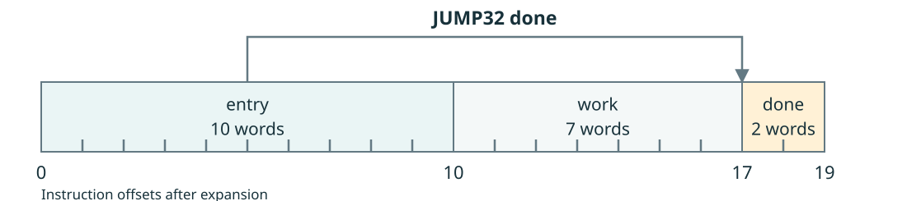

| Block | Symbolic instructions | Real instructions after expansion |
| --- | --- | ---: |
| `entry` | `PUSH BAF`, `LOADI32 ACC done`, `JUMP32 done` | `2 + 3 + 5 = 10` |
| `work` | `PUSH ACC`, `POP IN1`, `LOADI32 ACC 7` | `2 + 2 + 3 = 7` |
| `done` | `POP BAF` | `2` |

Here `done` begins at offset `10 + 7 = 17`. The symbolic `JUMP32` loads `17`
into `ACC` and adds `CS`. Counting each pseudoinstruction as just one word
would instead place `done` at offset `6`, producing the wrong target.

The later [`reti`](../PicoC-Compiler/source/passes/linking/reti_pass.py) pass
uses those recorded positions to determine `CS`, resolve code labels and
global symbols, and produce the final flat instruction stream. It expands
`LOADI32` and `JUMP32` with the resolved numeric values. Expanding a symbolic
address load or jump during `reti_patch` would require its final operand
before later blocks and their expansions had been counted. Keeping its
symbolic operand and counting its known size avoids that circular dependency.
Numeric `LOADI32` and `JUMP32` use the same late expansion path for consistency,
although their operands do not themselves depend on labels.

`PUSH` and `POP` can be expanded earlier because neither their operands nor
their two-instruction sizes depend on label positions. Inline assembly uses
the same RETI AST and follows the same rules. No pseudoinstruction reaches
the emulator or assembled binary.

### 1.1.8 Linked `.sections` metadata and the five-word binary header
[\[↑ TOC\]](#contents)

Each completed link step emits `program.reti` together with
`program.sections`. The JSON-like `.sections` file records the linked relative
locations of `.ivt`, `.text`, and `.data`, allowing RETI-Emulator to create the
load header and allowing PicoOS to place an image and initialize its segments,
heap, and stack correctly. A typical userspace file has this form:

```json
{
  "codesegment_start": 0,
  "datasegment_start": 11595,
  "heap_start": 11621,
  "heap_size": 2000,
  "stack_start": 14621
}
```

The following table explains the layout entries and which runtime addresses
they determine, the optional ISR entry need not appear in a userspace file.

| Entry | Meaning |
| --- | --- |
| `interrupt_service_routines_start` | Optional start of separately identified ISR code when the linked image contains it |
| `codesegment_start` | Process-relative start loaded into `CS`, for a normal userspace image this is also its initial entry region |
| `datasegment_start` | Process-relative start loaded into `DS` |
| [`heap_start`](kernel/process/process.header#L36) | First cell after static data and first cell managed by the process-local heap |
| [`heap_size`](kernel/process/process.header#L37) | Heap capacity in RETI cells, `-1` requests PicoOS's default |
| `stack_start` | Highest process-relative stack cell, `-1` requests the kernel's default placement |

The compiler creates this file only at the final link. A compile-only `-c`
invocation instead creates reusable `.reti_blocks` and `.st` files because no
complete program layout exists yet.

To produce a loadable binary, run `reti_emulator -a program.reti`. The emulator
automatically locates `program.sections` beside the input. It assembles the
instructions, retains raw data words, and uses the metadata to prepend five
layout words to the resulting `program.bin`. `-S PATH` explicitly selects a
different metadata file when needed. The diagram continues the compile/link
workflow with those two distinct inputs:

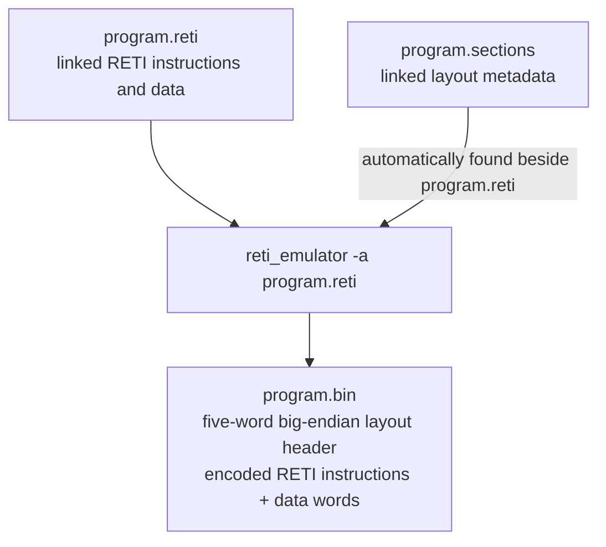
```mermaid
flowchart TB
    RETI["program.reti<br/>linked RETI instructions and data"] --> ASSEMBLE["reti_emulator -a program.reti"]
    SECTIONS["program.sections<br/>linked layout metadata"] -->|automatically found beside program.reti| ASSEMBLE
    ASSEMBLE --> BIN["program.bin<br/>five-word big-endian layout header<br/>encoded RETI instructions + data words"]
```

For example, with the `.sections` values above, assembling an illustrative
`program.reti` produces this five-word header:

```console
$ reti_emulator -a program.reti
$ hexyl -n 20 program.bin
┌────────┬─────────────────────────┬─────────────────────────┬────────┬────────┐
│00000000│ 00 00 00 00 00 00 2d 4b ┊ 00 00 2d 65 00 00 07 d0 │......-K┊..-e....│
│00000010│ 00 00 39 1d             ┊                         │..9.    ┊        │
└────────┴─────────────────────────┴─────────────────────────┴────────┴────────┘
```

This example shows only the first 20 bytes: five big-endian 32-bit words corresponding to the displayed
`.sections` values. The [appendix](#appendix-inspecting-bin-files-with-hexyl)
shows how to inspect other ranges of a `.bin` file.

The linked section metadata is the contract between compiler, emulator,
bootloader, and process loader. When the emulator assembles a program to
`.bin`, it copies five values from `.sections` into a fixed big-endian header:

| Word | Value | Use in PicoOS |
| ---: | --- | --- |
| 0 | `codesegment_start` | Initial code segment and entry point |
| 1 | `datasegment_start` | Initial data segment |
| 2 | [`heap_start`](kernel/process/process.header#L36) | Start of the userspace heap within a process image |
| 3 | [`heap_size`](kernel/process/process.header#L37) | Configured heap size, or `-1` for the PicoOS default |
| 4 | `stack_start` | Highest stack cell, or `-1` for the PicoOS default |

The `load` host request described in
[Section 1.2.3, UART host-service protocol](#123-uart-host-service-protocol) supplies a
bootloader with a total word count before this header and payload. The
userspace process loader first obtains the byte count with `file-size`, then
uses `read-range` to obtain the header and encoded payload. Both loaders
consume the five header words and copy only the encoded RETI words to SRAM.
The allocated process image therefore contains only the linked program and its
heap/stack room. The runtime loading modes are described in
[Section 4.5.1, Executable transfer with polling or DMA](#451-executable-transfer-with-polling-or-dma).

### 1.1.9 Generated memory constants for the bootloader and kernel
[\[↑ TOC\]](#contents)

The kernel and EPROM bootloader need their own absolute addresses before an
ordinary runtime object can tell them where they are. The compiler option
`-k sram` therefore generates [`kernel/memory_constants.header`](kernel/memory_constants.header),
and `-k eprom` generates [`boot/memory_constants.header`](boot/memory_constants.header).
These are generated C-style header files whose current extension is
`.header`, rather than `.h`. They are compile-time interfaces, not tables
allocated by PicoOS. A `-k` invocation performs the layout calculation and
writes only the header, so the normal compile/link invocation follows with
that header included by the source. The compiler fixes the filename to
`memory_constants.header` in the directory selected by `-o`.

The current kernel header is shown below. Its values come from the linked
kernel layout with a 4,096-cell heap and a 2,715-cell stack:

```c
#define SRAM_BASE (-2147483647 - 1) // -2^31
#define SRAM_MAX_ADDRESS_IN_MEMORY_MAP -2147221505 // -2^31 + 2^18 - 1
#define KERNEL_HEAP_START -2147442151 // -2^31 + heap_start
#define KERNEL_HEAP_SIZE 4096 // heap_size
#define PROCESS_MEMORY_START -2147435339 // -2^31 + stack_start + 1
#define KERNEL_CS_START_ASM "LOADI32 CS -2147483643" // -2^31 + codesegment_start
#define KERNEL_DS_START_ASM "LOADI32 DS -2147442882" // -2^31 + datasegment_start
#define KERNEL_SP_START_ASM "LOADI32 SP -2147435340" // -2^31 + stack_start
#define KERNEL_CS_ACC_ASM "LOADI32 ACC -2147483643" // -2^31 + codesegment_start
```

The table connects these constants to the state they initialize or restore.

| Kernel constant | Consumer and purpose |
| --- | --- |
| [`SRAM_BASE`](kernel/memory_constants.header#L1) | Converts process-relative linked addresses to the absolute SRAM address space |
| [`SRAM_MAX_ADDRESS_IN_MEMORY_MAP`](kernel/memory_constants.header#L2) | Inclusive final configured SRAM cell, bounds the Process and Shared Data Heap |
| [`KERNEL_HEAP_START`](kernel/memory_constants.header#L3), [`KERNEL_HEAP_SIZE`](kernel/memory_constants.header#L4) | Initialize the global [`kernel_heap`](kernel/kmalloc.picoc#L7) descriptor and define its stack boundary |
| [`PROCESS_MEMORY_START`](kernel/memory_constants.header#L5) | First cell managed by the global [`process_memory_heap`](kernel/pmalloc.picoc#L7) for process images and shared data |
| [`KERNEL_CS_START_ASM`](kernel/memory_constants.header#L6), [`KERNEL_DS_START_ASM`](kernel/memory_constants.header#L7) | Inline assembly fragments used when interrupt entries install kernel segments |
| [`KERNEL_SP_START_ASM`](kernel/memory_constants.header#L8) | Inline assembly fragment that installs the linked kernel stack start |
| [`KERNEL_CS_ACC_ASM`](kernel/memory_constants.header#L9) | Generated fragment for loading the kernel code base into `ACC`, currently unused by PicoOS source |

The current bootloader header establishes the temporary context before the
kernel image supplies its own segment and stack values. The code shows the
generated format, and the following table explains its three constants:

```c
#define SRAM_MAX_ADDRESS 262143 // 2^18 - 1
#define EPROM_DS_START_ASM "LOADI32 DS 3165" // datasegment_start
#define EPROM_STACK_START_ASM "LOADI32 SP -2147221505" // -2^31 + 2^18 - 1
```

| Bootloader constant | Consumer and purpose |
| --- | --- |
| [`SRAM_MAX_ADDRESS`](boot/memory_constants.header#L1) | Final physical SRAM offset, fallback kernel stack offset when the loaded header contains -1 |
| [`EPROM_DS_START_ASM`](boot/memory_constants.header#L2) | Loads the bootloader's linked EPROM data segment |
| [`EPROM_STACK_START_ASM`](boot/memory_constants.header#L3) | Loads the absolute top-of-SRAM temporary stack |

Both [`kernel.sections`](kernel/kernel.sections) and the kernel header come from the same final linked
layout. The header adds [`SRAM_BASE`](kernel/memory_constants.header#L1) where an absolute address is required,
the `.sections` file retains program-relative values for loading and debug
views. The bootloader reads the kernel's five-word binary header to load that
image, but uses its own EPROM header before any kernel state exists.

The constants become concrete runtime state later in the README. [Section
2.4.6, System-call entry, execution, and return to userspace](#246-system-call-entry-execution-and-return-to-userspace)
shows the generated `CS`, `DS`, and `SP` strings installing the kernel context,
[Section 3.3.1, Kernel SRAM map](#331-kernel-sram-map) shows the heap and stack
addresses in the complete kernel image, and [Section 5.4, Restoring the
selected process and returning with `RTI`](#54-restoring-the-selected-process-and-returning-with-rti)
shows how the dispatcher replaces that kernel context with a process context.

## 1.2 RETI-Emulator extensions
[\[↑ TOC\]](#contents)

The compiler produces the linked images and metadata described above. The
emulator assembles those images, runs the RETI machine, and provides the
peripherals and host file services used by PicoOS. The table summarizes the
emulator features on which the OS depends.

| Feature | Contribution used by PicoOS |
| --- | --- |
| Plain execution output | Without the debugger, completed UART output is written directly to host stdout |
| Commented assembly | Debug mode can show source-derived labels and comments beside instructions |
| Atomic locking | `TSL` atomically returns a cell's old value and stores `1`, supporting the mutex library |
| Structured loading | `.sections` distinguishes the vector table, ISR code, `.text`, `.data`, heap, and stack |
| Binary assembly | `--assemble program.reti` combines RETI words with the five layout header words in `program.bin` |
| EPROM-only boot | `-e boot/bootloader.reti` starts CPU execution at the EPROM bootloader without preloading a program into SRAM |
| Configurable SRAM | PicoOS selects 262,144 physical 32-bit cells while retaining the RETI tagged address space |
| Memory-mapped periphery | UART, device mappings, priorities, timer interval, stack boundary, exception cause, and optional DMA occupy offsets 0–16 |
| Interrupt controller | Timer, DMA through the custom device line, and UART have configurable vector mappings, priorities, pending state, and nesting behavior |
| Direct memory access | Optional DMA copies UART words into SRAM for kernel, init, and later program loading, scheduled loads receive a completion interrupt |
| Manual interrupts | The TUI can select and trigger an interrupt vector for inspection |
| Runtime timer | An instruction-count interval produces repeatable userspace preemption and exposes the live counter in the TUI |
| Raw-byte UART | Receive/send registers and status bits model byte delivery rather than line-oriented console input |
| UART host services | The emulator parses bounded load, read, file-size, output, directory, and removal requests from the byte stream |
| Normal and raw terminals | The normal view preserves host signal processing, raw mode forwards control and escape bytes needed by the shell |
| CPU exceptions | Divide by zero, stack overflow, and illegal instructions enter fixed vector 3 and expose a cause value |
| Stack/heap protection | The active inclusive boundary is checked whenever an instruction attempts to decrease `SP` |
| Runtime segment interpretation | Code/data/watch views follow live `CS` and `DS` after bootloading and context switches |
| Source-level debugging | `.debuginfo` and preprocessed source provide globals, locals, arguments, calls, frames, and source positions |
| SRAM transcoding | Memory can be viewed as numbers, characters, or decoded instructions without losing known-code regions |
| Snapshots and restart | Complete CPU, memory, interrupt, UART, and peripheral state can be saved, restored repeatedly, or restarted |
| Live inspection/editing | Windows can be selected, scrolled, centered, and edited while inspecting registers or memory |
| Synthetic OS context | The initial debugger state can model the kernel/interrupt context needed before PicoOS's first `RTI` |
| Explicit vector count | The emulator can reserve the five-entry IVT before the bootloader populates SRAM |
| Isolated assembly runs | The repository wrapper keeps assembler processes from overwriting peripheral files belonging to an active OS instance |

### 1.2.1 RETI machine model and memory-mapped peripherals
[\[↑ TOC\]](#contents)

The debugger views reflect the emulator's ordinary RETI instructions and
memory-mapped devices, PicoOS reaches them through loads/stores and interrupt
vectors rather than a special emulator API. Periphery offset `n` has address
`0x40000000 + n`, while kernel/process code uses absolute SRAM addresses based
at `0x80000000`.

The two most significant address bits select one of three regions. The emulator
documentation calls the `01` region **periphery**. The table places the
implemented periphery cells within the complete RETI address space without
implying that the unimplemented addresses contain registers:

| Address range | Top-bit prefix | RETI region | Implemented PicoOS use |
| --- | --- | --- | --- |
| `0x00000000..0x3fffffff` | `00` | EPROM | Bootloader code and data |
| `0x40000000..0x7fffffff` | `01` | Periphery | Offsets `0..16`, through `0x40000010`, are implemented memory-mapped registers |
| `0x80000000..0xffffffff` | `10` or `11` | SRAM | Kernel image, process images, heaps, stacks, and shared data |

Older RETI memory maps could label the middle region as the
UART area because it contained only send, receive, and status registers at
offsets 0 through 2. Those UART registers remain at the start of the region,
but interrupt-controller, timer, protection, exception, and DMA registers now
extend the implemented range through offset 16. **Periphery region** therefore
names the complete middle region, while UART names only its first three cells.
The register table below keeps its existing detail and describes only the
implemented part of that region, not the whole memory map.

| Offset | Register | Access and connection to PicoOS |
| ---: | --- | --- |
| 0 | UART send | Kernel/bootloader write the low byte and clear send-ready in offset 2 |
| 1 | UART receive | Emulator writes an incoming byte, polling code or UART ISR reads it |
| 2 | UART status | Bit 0 reports send-ready and bit 1 receive-ready |
| 3–5 | Device-to-vector mappings | Timer, custom device, and UART select IVT indices, 255 disables a line |
| 6–8 | Device priorities | Interrupt controller selects the highest-priority pending device |
| 9 | Timer interval | Instruction-count period, zero disables and a write restarts the counter |
| 10 | Stack/heap boundary | Inclusive active lower stack limit, dispatcher rewrites it on every context switch |
| 11 | CPU exception cause | Read-only: none, divide by zero, stack overflow, or illegal instruction |
| 12 | DMA active | Always present, `1` enables DMA and exposes offsets 13–16 |
| 13 | DMA source | Absolute UART receive address used by PicoOS |
| 14 | DMA destination | Absolute SRAM destination address |
| 15 | DMA word count | Number of complete 32-bit words to copy |
| 16 | DMA status/control | `0` idle, write/read `1` for start/busy, `2` complete, `3` error |

CPU exception vector 3 is fixed rather than configured through cells 3–8.
The kernel initializes timer/DMA/UART mappings from its global arrays, the
dispatcher connects each PCB's [`base_address`](kernel/process/process.header#L34), [`heap_start`](kernel/process/process.header#L36), and [`heap_size`](kernel/process/process.header#L37) to
cell 10. This is a concrete example of a kernel data structure controlling an
emulated hardware protection register.

### 1.2.2 Atomic test-and-set with `TSL`
[\[↑ TOC\]](#contents)

The emulator extension adds `TSL`, short for test and set lock, with syntax
`TSL S D i`. Register `S` contains the base address, `i` is a signed 22-bit
word offset, and register `D` receives the target cell's previous value. The
[`interpreter`](../RETI-Emulator/source/interpr.c#L398) first calculates and
saves the address `S + i`, then reads that cell, writes its old value to `D`,
and finally writes `1` to the saved address. These steps execute as one atomic
instruction, with no interrupt or process switch between the read and write.

The example uses a non-zero offset to distinguish the base from the target:

```reti
# Before: M[DS + 2] = 0
TSL DS ACC 2
# After:  ACC = 0 and M[DS + 2] = 1
```

The diagram places this access in the RETI memory map and then expands four
adjacent SRAM cells. Addresses count 32-bit words, so offset `2` advances two
cells, not two bytes:

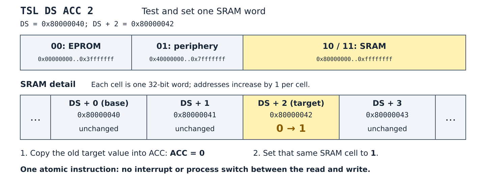

`ACC` always receives the exact previous word, with no conversion to a boolean.
For example, an old value of `7` returns `7` and still becomes `1` in memory.
If the old value is already `1`, it returns `1` and remains `1`. The saved
address also makes the operation well-defined when `S` and `D` are the same
register. As with other register-writing instructions, selecting `SP` as the
destination can trigger stack-overflow protection. If that register write
fails, the interpreter returns before setting the memory cell. Selecting
`PC` transfers control to the old cell value without the normal PC increment.
Neither special case applies to the shown `ACC` destination.

For machine encoding, `TSL` uses the **Store, Move** category, whose type bits
`I[31,30]` are `10`, and fills mode `10`. The
[`assembler`](../RETI-Emulator/source/assemble.c#L141) encodes `TSL DS ACC 2`
with the following fields. Field widths follow their bit counts:

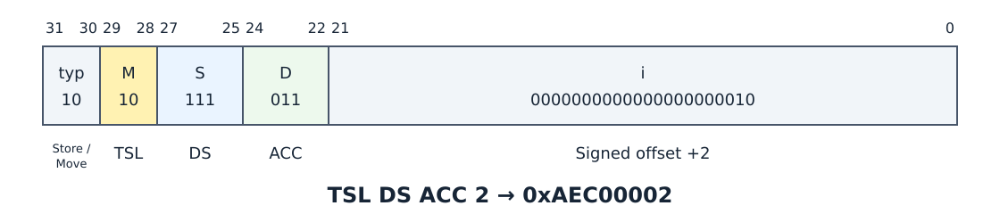

The complete machine word is `0xAEC00002`. The immediate field `i` is a signed
22-bit displacement, here `+2`.

The source and destination field roles vary within this category. For `TSL`,
`S` is the address base and `D` is the result register. The neighboring modes
make its position in the encoding explicit:

| Type | Mode `M` | Assembly syntax | Operation |
| --- | --- | --- | --- |
| `10` | `00` | `STORE S i` | Store register `S` at the direct, DS-completed address |
| `10` | `01` | `STOREIN D S i` | Store register `S` at address `D + i` |
| `10` | `10` | `TSL S D i` | Return `M[S + i]` in `D`, then set that cell to `1` |
| `10` | `11` | `MOVE S D` | Copy register `S` to register `D` |

PicoOS uses this instruction in
[`testset(lock_addr)`](library/mutex/mutex.picoc#L3), with `IN2` holding the
lock's address. The function returns the old word so
[`mutex_lock(m)`](library/mutex/mutex.picoc#L18) can distinguish acquisition
from contention. Its retry, sleeping, wakeup, and lost-wakeup limitations are
explained in
[`6.3 Mutex Locking with Test-and-Set and Wait Queues`](#63-mutex-locking-with-test-and-set-and-wait-queues).

### 1.2.3 UART host-service protocol
[\[↑ TOC\]](#contents)

UART transports bytes only. A physical RETI system needs dedicated host-side
service software to interpret PicoOS requests and connect them to the host
terminal and filesystem. The UART-to-USB adapter provides the serial transport,
while the service software provides the protocol behavior. The physical
architecture below shows requests and responses traversing the same path:

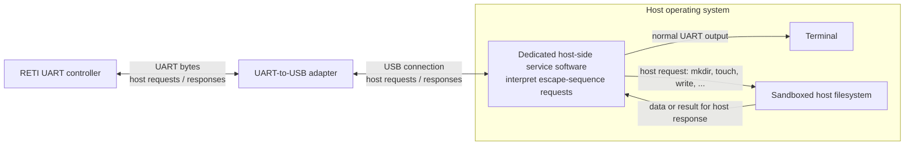
```mermaid
flowchart LR
    UART["RETI UART controller"] <-->|"UART bytes<br/>host requests / responses"| ADAPTER["UART-to-USB adapter"]
    ADAPTER <-->|"USB connection<br/>host requests / responses"| SERVICE
    subgraph HOST["Host operating system"]
        SERVICE["Dedicated host-side service software<br/>interpret escape-sequence requests"]
        TERMINAL["Terminal"]
        FILES["Sandboxed host filesystem"]
        SERVICE -->|normal UART output| TERMINAL
        SERVICE -->|"host request: mkdir, touch, write, ..."| FILES
        FILES -->|data or result for host response| SERVICE
    end
```

The RETI-Emulator replaces both the physical serial path and that dedicated
service software during current development. It models the UART controller
and handles the byte stream directly. It does not contain physical USB or
adapter hardware. The corresponding emulator architecture is:

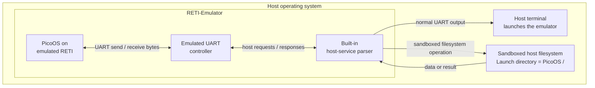
```mermaid
%%{init: {"flowchart": {"nodeSpacing": 20, "rankSpacing": 45, "wrappingWidth": 300}}}%%
flowchart LR
    subgraph HOST["Host operating system"]
        direction LR
        subgraph EMU["RETI-Emulator"]
            direction LR
            GUEST["PicoOS on<br/>emulated RETI"]
            UART["Emulated UART<br/>controller"]
            SERVICE["Built-in<br/>host-service parser"]
            GUEST <-->|UART send / receive bytes| UART
            UART <-->|host requests / responses| SERVICE
        end
        SERVICE -->|normal UART output| TERMINAL["Host terminal<br/>launches the emulator"]
        SERVICE -->|sandboxed filesystem operation| FILES["Sandboxed host filesystem<br/>Launch directory = PicoOS /"]
        FILES -->|data or result| SERVICE
    end
```

The terminal and filesystem resources are introduced in
[`Intended physical hardware`](#intended-physical-hardware). The emulator's
[`guest_filesystem.c`](../RETI-Emulator/source/guest_filesystem.c) pins the launch
directory as the sandbox root, with the files and directories recursively
below it forming PicoOS `/`. It normalizes `..` without going above this root
and blocks symbolic-link escape paths. Requests can create or modify files and
directories there or return metadata and file bytes to PicoOS.

Every host request starts with escape byte 27 and has the form
`<ESC>operation arguments<ESC>/`. Ordinary bytes are displayed in the terminal
unless an output-selection request has redirected them to a file. The table
lists each request form and its host operation or response.

| Request form | Result |
| --- | --- |
| `<ESC>load <path><ESC>/` | Big-endian word count followed by binary bytes, used by the bootloader |
| `<ESC>read-range <offset> <count> <path><ESC>/` | Returned byte count followed by that file range |
| `<ESC>file-size <path><ESC>/` | File size as one 32-bit value |
| `<ESC>write <path><ESC>/` | Create/truncate a file and route following UART bytes to it |
| `<ESC>write-at <offset> <path><ESC>/` | Preserve a file and route following UART bytes to the byte offset |
| `<ESC>write stdout<ESC>/` / `stderr` | Restore a host standard output stream |
| `<ESC>literal-output <count><ESC>/` | Treat exactly the next `count` UART bytes as output data, even when they contain `<ESC>` |
| `<ESC>pwd<ESC>/` | PicoOS root `/` as a length-prefixed string |
| `<ESC>is-directory <path><ESC>/` | Directory test |
| `<ESC>mkdir <path><ESC>/` | Create a directory |
| `<ESC>ls <path><ESC>/` | Length-prefixed directory listing |
| `<ESC>unlink <path><ESC>/` | Remove a file |
| `<ESC>rmdir <path><ESC>/` | Remove an empty directory |
| `<ESC>move <old path>\n<new path><ESC>/` | Move or rename a file or directory |
| `<ESC>touch <path><ESC>/` | Create a file or update its timestamps |

These are fixed operations, not a generic host-command mechanism. The emulator
debugger additionally shows RETI registers, EPROM, SRAM, periphery state, PicoC
source, snapshots, and normal/raw UART terminals.

Requests that return data receive it on the same UART stream. A `load` host
request has the file-transfer form below. In this and the following diagram,
`ESC` denotes the escape byte written as `<ESC>` in the request forms above:

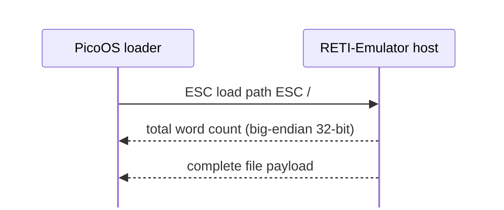
```mermaid
%%{init: {"sequence": {"wrap": false, "actorMargin": 60, "width": 180, "height": 45, "messageMargin": 25, "mirrorActors": false, "diagramMarginY": 35}, "themeCSS": "rect { rx: 0 !important; ry: 0 !important; }"}}%%
sequenceDiagram
    participant P as PicoOS loader
    participant H as RETI-Emulator host

    P->>H: ESC load path ESC /
    H-->>P: total word count (big-endian 32-bit)
    H-->>P: complete file payload
```

Other host requests use the response form that fits their operation. Ranged
reads prefix a byte payload with its byte count, while metadata and status
requests return one big-endian value without a payload:

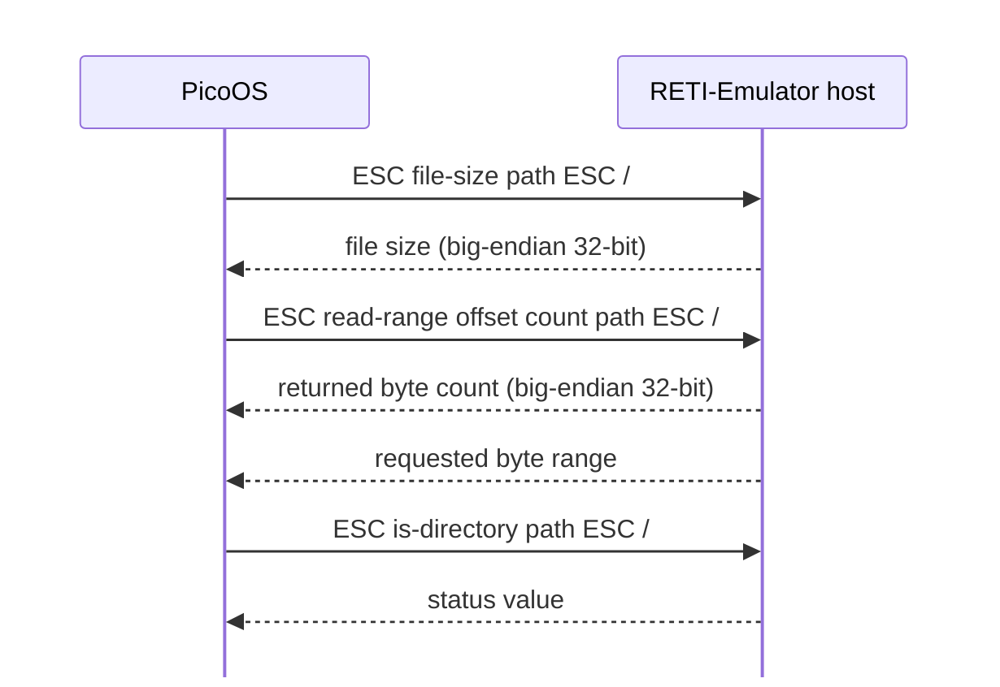
```mermaid
%%{init: {"sequence": {"wrap": false, "actorMargin": 60, "width": 180, "height": 45, "messageMargin": 25, "mirrorActors": false, "diagramMarginY": 35}, "themeCSS": "rect { rx: 0 !important; ry: 0 !important; }"}}%%
sequenceDiagram
    participant P as PicoOS
    participant H as RETI-Emulator host

    P->>H: ESC file-size path ESC /
    H-->>P: file size (big-endian 32-bit)
    P->>H: ESC read-range offset count path ESC /
    H-->>P: returned byte count (big-endian 32-bit)
    H-->>P: requested byte range
    P->>H: ESC is-directory path ESC /
    H-->>P: status value
```

For `load`, the host returns the complete file length in words followed by the
file bytes, `UINT32_MAX` represents failure. The EPROM bootloader and the
kernel's initial [`init`](system/init.picoc) load consume this stream before scheduling exists. They
copy it with DMA when register 12 reports DMA active and otherwise receive one
word at a time. Later process loading combines `file-size` with `read-range`:
the DMA path requests the complete payload, while the fallback uses independent
1 KiB responses so another process can safely use the host request protocol between
chunks. `read-range`, `file-size`, `pwd`, and `ls` begin their responses with a
big-endian length/value.
Output-selection requests are different: after `<ESC>write path<ESC>/` or
`<ESC>write-at offset path<ESC>/`, ordinary subsequent UART bytes go to that
host file until PicoOS sends `<ESC>write stdout<ESC>/` or selects stderr.
The `literal-output` request protects a known byte count from being parsed as
another host command, regular-file writes use it when their data contains an
escape byte.

The protocol keeps descriptor and path state in PicoOS while leaving file
storage on the host. The bootloader and process loader request binaries through
the same UART transport that later carries bounded file and directory
operations.

### 1.2.4 Debugger, source view, and terminal modes
[\[↑ TOC\]](#contents)

The debugger is the reader's main view of RETI state and PicoC source while
PicoOS runs. The following recording demonstrates its execution controls,
state views, source debugging, snapshots, and UART terminal:

[](https://asciinema.org/a/1264549)

Selecting the thumbnail opens the recording on Asciinema. Its controls let a
reader step, continue, restart, step an ISR, inspect or edit registers and
memory, trigger an interrupt, save/restore snapshots, open source debugging,
and enter normal or raw UART terminal mode. During continuous execution the
terminal remains live and each delivered input byte can raise a UART hardware
interrupt.

The TUI displays all eight CPU registers: `PC`, `IN1`, `IN2`, `ACC`, `SP`,
`BAF`, `CS`, and `DS`. Its default
[`watchobjects`](../RETI-Emulator/source/debug/core_debug.c#L69) center the EEPROM
and SRAM code windows on `PC`, the SRAM data window on `DS`, and the SRAM stack
window on `SP`. `PC` therefore follows bootloader execution in EEPROM and later
kernel and process execution in SRAM. The matching address-space window shows
the active instruction. `CS` and `DS` also determine the live interpretation
of code and data as the bootloader installs the kernel context and the
dispatcher restores each process's segments.

The table distinguishes the default views from values that can be selected:

| View | Default tracking | Additional selection |
| --- | --- | --- |
| CPU registers | All eight current register values | Select a register to inspect or edit its value |
| EEPROM / SRAM code | `PC`, in the matching address space | Assign another register or a direct memory address |
| SRAM data | `DS` | Assign another register or a direct memory address |
| SRAM stack | `SP` | Assign another register or a direct memory address |
| Periphery | UART state | Cycle interrupt/timer, exception, and DMA views |

Use `Tab` / `Shift+Tab` to select an address window and `a` to assign any CPU
register or a direct address as its watchobject. The window then tracks that
register's pointed-to location, or keeps the selected memory address visible.
`j` / `k` scroll independently, and `C` centers the view on the watchobject
again. This is live state inspection rather than a recorded time-series plot.

Compiler `.debuginfo`, preprocessed `.pre` source, labels, and `.sections`
connect that state to PicoC meaning. The source view uses the executing `PC`
and code context, while frame information and `BAF` locate arguments, locals,
saved frame pointers, and return addresses. These views expose the same
encoded words intended for hardware.

Normal terminal view `v` leaves host signal processing active and returns with
Escape. Raw view `V` forwards control and escape bytes,including `Ctrl+C`,
`Ctrl+Z`, and arrow-key sequences,and returns with `Ctrl+]`. Raw mode is the
appropriate view for the PicoOS shell because these bytes drive terminal
signals and command-history editing.

# 2. Interrupts, system calls, preemption, and exceptions
[\[↑ TOC\]](#contents)

Interrupts are the controlled entry points for software requests, hardware
events, and synchronous CPU faults. Library functions use system calls to
request kernel services, while timer and device interrupts let the kernel
respond to events that do not originate in the running process. CPU exceptions
use the same interrupt-entry machinery to report instructions that cannot
complete safely.

## 2.1 RETI interrupt entry and the interrupt vector table
[\[↑ TOC\]](#contents)

The linked kernel has five vector cells at the beginning of SRAM. The array
below defines their order, and the following table connects each entry to the
software instruction or hardware source that invokes it:

```c
__attribute__((section("ivt")))
void (*interrupt_vector_table[OS_INTERRUPT_VECTOR_COUNT])(void) = {
    syscall_interrupt,
    timer_interrupt,
    uart_interrupt,
    cpu_exception_interrupt,
    dma_interrupt
};
```

| Vector | Entry | Source |
| ---: | --- | --- |
| 0 | [`syscall_interrupt()`](interrupt_service_routines/isrs.picoc#L74) | Software `INT 0` from userspace |
| 1 | [`timer_interrupt()`](interrupt_service_routines/isrs.picoc#L68) | Timer device |
| 2 | [`uart_interrupt()`](interrupt_service_routines/os_isrs.picoc#L195) | UART receive device |
| 3 | [`cpu_exception_interrupt()`](interrupt_service_routines/os_isrs.picoc#L171) | Fixed synchronous CPU exception vector |
| 4 | [`dma_interrupt()`](interrupt_service_routines/os_isrs.picoc#L233) | DMA completion on the hardware custom-device line |

An `INT` automatically saves only the interrupted return PC. Each ISR
explicitly saves any general registers it needs. `RTI` reloads the PC from
`SP + 1`, increments `SP`, and advances execution.

## 2.2 Interrupt-controller mappings and priorities
[\[↑ TOC\]](#contents)

The vector table fixes the kernel entry order, while the interrupt controller
connects hardware devices to those entries and chooses between pending events.
[`interrupt_device_isrs[]`](kernel/interrupt_controller.picoc#L3) maps
timer/DMA/UART to `1/4/2`, and
[`interrupt_device_priorities[]`](kernel/interrupt_controller.picoc#L9) assigns
priorities `1/1/2`. UART can therefore interrupt the timer or DMA handler,
while timer and DMA requests at the same priority wait for the active handler
to finish.

The following excerpt shows how startup applies those arrays. It disables each
device before restoring the configured vector and priority. The timer remains
inactive until [`interrupt_controller_activate_timer()`](kernel/interrupt_controller.picoc#L34)
sets its 5,000-instruction interval after init is ready:

```c
int interrupt_device_isrs[INTERRUPT_DEVICE_COUNT] = {
    1,                            // INTERRUPT_DEVICE_INTTIMER (index 0)
    4,                            // INTERRUPT_DEVICE_DMA (index 1)
    2                             // INTERRUPT_DEVICE_UART (index 2)
};

int interrupt_device_priorities[INTERRUPT_DEVICE_COUNT] = {
    1, // INTERRUPT_DEVICE_INTTIMER (index 0)
    1, // INTERRUPT_DEVICE_DMA (index 1)
    2  // INTERRUPT_DEVICE_UART (index 2)
};

void interrupt_controller_initialize(void) {
    int device = 0;
    int interrupt_index;
    int priority;

    while (device < INTERRUPT_DEVICE_COUNT) {
        interrupt_controller_disable_device(device);
        interrupt_index = interrupt_device_isrs[device];
        priority = interrupt_device_priorities[device];

        if (interrupt_index != INTERRUPT_CONTROLLER_DISABLED) {
            interrupt_controller_assign_device(device, interrupt_index, priority);
        }

        device = device + 1;
    }
}
```

The arrays' exact types and storage are listed in
[Section 8.3, Kernel global variables and process-list roots](#83-kernel-global-variables-and-process-list-roots).
Terminal reads may temporarily disable and restore the UART mapping so their
buffer checks cannot race with the UART interrupt service routine.

### 2.2.1 Interrupt-controller function reference
[\[↑ TOC\]](#contents)

The controller functions in
[`kernel/interrupt_controller.picoc`](kernel/interrupt_controller.picoc) use
the memory-mapped helpers in the next subsection. This table connects the
controller's global mapping arrays to the register writes they produce.

| Kernel function | Return value / status | Effects | Calls | Called by |
| --- | --- | --- | --- | --- |
| [`interrupt_controller_initialize(void)`](kernel/interrupt_controller.picoc#L41) | Returns no value | Rewrites timer, DMA, and UART mappings and priorities in periphery registers 3–8 from [`interrupt_device_isrs`](kernel/interrupt_controller.picoc#L3) and [`interrupt_device_priorities`](kernel/interrupt_controller.picoc#L9) | [`interrupt_controller_disable_device()`](kernel/interrupt_controller.picoc#L23), [`interrupt_controller_assign_device()`](kernel/interrupt_controller.picoc#L59) | **Kernel functions:** [`main()`](kernel/kernel.picoc#L31) |
| [`interrupt_controller_assign_device(device, interrupt_index, priority)`](kernel/interrupt_controller.picoc#L59) | Returns no value | Writes one device's interrupt service routine-table index and priority | [`interrupt_controller_device_to_isr_register()`](kernel/interrupt_controller.picoc#L15), [`interrupt_controller_device_to_priority_register()`](kernel/interrupt_controller.picoc#L19), [`periphery_write_register()`](kernel/periphery.picoc#L11) | **Kernel functions:** [`begin_terminal_read()`](kernel/filesystem/terminal.picoc#L134), [`interrupt_controller_initialize()`](kernel/interrupt_controller.picoc#L41), [`resume_pending_terminal_read()`](kernel/filesystem/terminal.picoc#L84) |
| [`interrupt_controller_disable_device(device)`](kernel/interrupt_controller.picoc#L23) | Returns no value | Writes mapping 255 and priority 0 for one device | [`interrupt_controller_device_to_isr_register()`](kernel/interrupt_controller.picoc#L15), [`interrupt_controller_device_to_priority_register()`](kernel/interrupt_controller.picoc#L19), [`periphery_write_register()`](kernel/periphery.picoc#L11) | **Kernel functions:** [`begin_terminal_read()`](kernel/filesystem/terminal.picoc#L134), [`interrupt_controller_initialize()`](kernel/interrupt_controller.picoc#L41), [`reboot()`](kernel/kernel.picoc#L19), [`resume_pending_terminal_read()`](kernel/filesystem/terminal.picoc#L84) |
| [`interrupt_controller_activate_timer(void)`](kernel/interrupt_controller.picoc#L34) | Returns no value | Writes the 5,000-instruction interval to periphery register 9 | [`periphery_write_register()`](kernel/periphery.picoc#L11) | **Kernel functions:** [`main()`](kernel/kernel.picoc#L31) |

### 2.2.2 Memory-mapped periphery function reference
[\[↑ TOC\]](#contents)

Functions in [`kernel/periphery.picoc`](kernel/periphery.picoc) perform the
actual reads and writes. Their callers show that the same access layer also
serves stack protection, CPU exceptions, and UART handling.

| Kernel function | Return value / status | Effects | Calls | Called by |
| --- | --- | --- | --- | --- |
| [`periphery_read_register(register_index)`](kernel/periphery.picoc#L5) | Returns the selected periphery value | Reads one memory-mapped periphery cell, changes no kernel state | — | **Kernel functions:** [`begin_terminal_read()`](kernel/filesystem/terminal.picoc#L134), [`handle_cpu_exception()`](kernel/exception.picoc#L70), [`handle_uart_interrupt()`](kernel/filesystem/terminal.picoc#L213), [`resume_pending_terminal_read()`](kernel/filesystem/terminal.picoc#L84) |
| [`periphery_write_register(register_index, value)`](kernel/periphery.picoc#L11) | Returns no value | Writes one memory-mapped periphery cell | — | **Kernel functions:** [`activate_current_process_stack_boundary()`](kernel/exception.picoc#L22), [`activate_kernel_stack_boundary()`](kernel/exception.picoc#L11), [`handle_uart_interrupt()`](kernel/filesystem/terminal.picoc#L213), [`interrupt_controller_activate_timer()`](kernel/interrupt_controller.picoc#L34), [`interrupt_controller_assign_device()`](kernel/interrupt_controller.picoc#L59), [`interrupt_controller_disable_device()`](kernel/interrupt_controller.picoc#L23), [`reboot()`](kernel/kernel.picoc#L19) |

## 2.3 Saved interrupt stack frame
[\[↑ TOC\]](#contents)

System calls and process timer preemption create the same process-stack frame.
[`caller_context`](kernel/dispatcher.picoc#L71) points to its free cell:

| Offset | Stored value |
| ---: | --- |
| `+0` | Free cell addressed by [`caller_context`](kernel/dispatcher.picoc#L71) |
| `+1` | Saved `DS` |
| `+2` | Saved `CS` |
| `+3` | Saved `BAF` |
| `+4` | Saved `IN2` |
| `+5` | Saved `IN1` |
| `+6` | Saved `ACC` |
| `+7` | Return PC saved by interrupt entry |

[`dispatcher_switch_from_context()`](kernel/dispatcher.picoc#L71) copies offsets 1–6 into the current PCB’s
embedded activation and records [`activation.sp`](kernel/process/process.header#L25) = [`caller_context`](kernel/dispatcher.picoc#L71) + 6. The
return PC remains at [`activation.sp`](kernel/process/process.header#L25) + 1 for the later `RTI`.

## 2.4 System-call interface and execution
[\[↑ TOC\]](#contents)

A library function requests a kernel service by its syscall selector and arguments, rather than
calling a kernel function at a hardcoded address. The installed kernel's syscall interrupt service
routine receives that request, and [`handle_syscall()`](kernel/syscall.picoc#L16) selects the kernel
function that implements it. The library is linked into the user program. The kernel resolves its
own internal function locations when it is built.

This arrangement lets kernel functions move between OS versions without changing the calling
library code. Compatibility still requires the same syscall selectors, register convention, request
layouts, and meaning of arguments and results. Those rules form the system-call
ABI documented first. The later subsections follow the request through
interrupt entry, kernel execution, optional rescheduling, and return to
userspace. A change to that ABI can require updated libraries or programs.
Using a syscall alone is not a promise of compatibility with every future
PicoOS version.

Standardized library interfaces solve a related problem at the source-code level: an application
using the same supported functions and behavior can be compiled for different operating systems,
with each system's library implementing its own kernel calls. The
[POSIX scope](https://pubs.opengroup.org/onlinepubs/9799919799/basedefs/V1_chap01.html) explicitly targets
source portability and excludes binary portability. It does not standardize PicoOS's syscall
selectors or RETI register convention. PicoOS provides a small set of POSIX-like functions, with some
different signatures and behavior, so familiar names alone do not establish POSIX conformance.
[Section 9.1, From a library call to the kernel: waitpid](#91-from-a-library-call-to-the-kernel-waitpid)
shows one complete library implementation using this interface.

The following register rules describe the syscall boundary. The request structures then show how
functions pass several values through its single argument register.

### 2.4.1 Syscall selectors and register convention
[\[↑ TOC\]](#contents)

Userspace wrappers place the syscall selector in `ACC`, one integer or request
pointer in `IN1`, and execute `INT 0`. After `RTI`, `IN2` contains the result,
matching the normal PicoC function-return convention described in the
[Section 1.1.3, System V ABI stack frames and call cleanup](#113-system-v-abi-stack-frames-and-call-cleanup).

A system call has room for one integer argument in `IN1`. Wrappers that need several values
therefore create a request structure in their current userspace stack frame, put its absolute
address in `IN1`, put the selector in `ACC`, and execute `INT 0`. The structures are declared in
[`common/syscall.header`](common/syscall.header) and [`common/file.header`](common/file.header). The
declarations below show all request shapes, the following field tables describe initialization and
use:

```c
struct LoadProcessRequest { char *path; bool show_loading_bar; };
struct RunProcessRequest { int pid; char *arguments; char **environment; };
struct WaitPidRequest { int pid; int *status; };
struct KillRequest { int pid; int signal_number; };
struct PrctlRequest { int option; int argument; };
struct ShmOpenRequest { char *name; size_t size; };
struct GetCwdRequest { char *buffer; int size; };
struct ReadDirectoryRequest { char *path; char *buffer; int capacity; };
struct MoveRequest { char *old_path; char *new_path; };

struct OpenRequest { char *path; int flags; };
struct IoRequest {
    int file_descriptor;
    char *buffer;
    int count;
    bool protect_uart_control;
    bool show_loading_bar;
    int transferred;
    int loading_bar_update;
    bool complete;
};
struct SeekRequest {
    int file_descriptor;
    int offset;
    int origin;
};
struct Dup2Request { int old_file_descriptor; int new_file_descriptor; };
```

### 2.4.2 Process, wait, signal, and memory request structures
[\[↑ TOC\]](#contents)

The table identifies each request field’s purpose. [`load()`](library/unistd/process.picoc#L17),
[`run()`](library/unistd/process.picoc#L31), [`waitpid()`](library/sys/wait/wait.picoc#L14),
[`kill()`](library/signal/signal.picoc#L14), [`prctl()`](library/sys/prctl/prctl.picoc#L14), and
[`shm_open()`](library/sys/mman/mman.picoc#L15) first initialize every field of their respective
local request before invoking the kernel. Kernel startup also constructs a
[`RunProcessRequest`](common/syscall.header#L55) in [`main()`](kernel/kernel.picoc#L31) for init.
The complete [`waitpid()`](library/sys/wait/wait.picoc#L14) example in [Section
9.1.2, Packing arguments and executing the syscall](#912-packing-arguments-and-executing-the-syscall)
shows a concrete [`WaitPidRequest`](common/syscall.header#L61) being populated,
passed, and reused while the caller waits.

| Field | Meaning | Used by |
| --- | --- | --- |
| [`LoadProcessRequest.path`](common/syscall.header#L51) | Path of the `.bin` image | First initialized by [`load()`](library/unistd/process.picoc#L17), passed through [`SYSCALL_LOAD_PROCESS`](common/syscall.header#L7), the loader normalizes it and the PCB receives its own [`kmalloc()`](kernel/kmalloc.picoc#L23) path copy |
| [`LoadProcessRequest.show_loading_bar`](common/syscall.header#L52) | Whether UART transfer progress should be printed | First initialized by [`load()`](library/unistd/process.picoc#L17), read only during loading, derived from `PICOOS_LOADING_BAR` |
| [`RunProcessRequest.pid`](common/syscall.header#L56) | PID of an existing `NEW` PCB | First initialized by [`run()`](library/unistd/process.picoc#L31) (or kernel [`main()`](kernel/kernel.picoc#L31) for init), passed through [`SYSCALL_RUN_PROCESS_WITH_ARGUMENTS`](common/syscall.header#L8), identifies the PCB changed to `READY` |
| [`RunProcessRequest.arguments`](common/syscall.header#L57) | Space/tab-separated argument string, or `NULL` | First initialized by [`run()`](library/unistd/process.picoc#L31) (or kernel [`main()`](kernel/kernel.picoc#L31) for init), copied into the child's initial process stack, the pointer itself is not retained |
| [`RunProcessRequest.environment`](common/syscall.header#L58) | Null-terminated array of `NAME=value` pointers | First initialized by [`run()`](library/unistd/process.picoc#L31) (or kernel [`main()`](kernel/kernel.picoc#L31) for init), strings and pointer table are copied into the child's initial stack |
| [`WaitPidRequest.pid`](common/syscall.header#L62) | Exact child PID | First initialized by [`waitpid()`](library/sys/wait/wait.picoc#L14), passed through [`SYSCALL_WAITPID`](common/syscall.header#L13), used to find and validate the child |
| [`WaitPidRequest.status`](common/syscall.header#L63) | Address of caller's status cell | First initialized by [`waitpid()`](library/sys/wait/wait.picoc#L14), immediate status destination or copied into the waiting parent's [`waiting_status_ptr`](kernel/process/process.header#L44) while blocked |
| [`KillRequest.pid`](common/syscall.header#L67) | Target process | First initialized by [`kill()`](library/signal/signal.picoc#L14), passed through [`SYSCALL_KILL`](common/syscall.header#L16), lookup only, not retained |
| [`KillRequest.signal_number`](common/syscall.header#L68) | Signal to deliver, 0 probes existence | First initialized by [`kill()`](library/signal/signal.picoc#L14), may change target state or defer termination, but the request is not retained |
| [`PrctlRequest.option`](common/syscall.header#L73) | Currently only [`PR_SET_PDEATHSIG`](common/prctl.header#L3) | First initialized by [`prctl()`](library/sys/prctl/prctl.picoc#L14), passed through [`SYSCALL_PRCTL`](common/syscall.header#L17), selects the supported operation |
| [`PrctlRequest.argument`](common/syscall.header#L75) | Signal number, or 0 to disable | First initialized by [`prctl()`](library/sys/prctl/prctl.picoc#L14), copied into current PCB [`parent_death_signal`](kernel/process/process.header#L59) |
| [`ShmOpenRequest.name`](common/syscall.header#L79) | Name used to find an entry in the kernel's shared-memory linked list | First initialized by [`shm_open()`](library/sys/mman/mman.picoc#L15), passed through [`SYSCALL_SHM_OPEN`](common/syscall.header#L26), a new entry receives a [`kmalloc()`](kernel/kmalloc.picoc#L23) copy |
| [`ShmOpenRequest.size`](common/syscall.header#L80) | Requested shared region size in RETI cells | First initialized by [`shm_open()`](library/sys/mman/mman.picoc#L15), used only when creating a name, an existing entry is not resized |

### 2.4.3 File and directory request structures
[\[↑ TOC\]](#contents)

The table traces file and directory arguments from userspace into the kernel.
[`open()`](library/fcntl/fcntl.picoc#L5) and [`fopen()`](library/stdio/stdio.picoc#L125) initialize
[`OpenRequest`](common/file.header#L26), [`read()`](library/unistd/io.picoc#L6),
[`write()`](library/unistd/io.picoc#L32), and [`write_without_uart_escape_check()`](library/unistd/io.picoc#L43) initialize
the [`IoRequest`](common/file.header#L31) fields each operation uses.
[`lseek()`](library/unistd/io.picoc#L66), [`dup2()`](library/unistd/io.picoc#L58),
[`getcwd()`](library/unistd/working_directory.picoc#L11),
[`opendir()`](library/dirent/dirent.picoc#L8), and [`move()`](library/unistd/file_removal.picoc#L12)
initialize their corresponding request structures before the call.

| Field | Meaning | Used by |
| --- | --- | --- |
| [`OpenRequest.path`](common/file.header#L27) | Relative or absolute PicoOS path to a host-backed file or kernel device | First initialized by [`open()`](library/fcntl/fcntl.picoc#L5) or [`fopen()`](library/stdio/stdio.picoc#L125), passed through [`SYSCALL_OPEN`](common/syscall.header#L31), normalized and copied into the selected descriptor |
| [`OpenRequest.flags`](common/file.header#L28) | Access mode plus [`O_CREAT`](common/file.header#L13), [`O_TRUNC`](common/file.header#L14), or [`O_APPEND`](common/file.header#L15) | First initialized by [`open()`](library/fcntl/fcntl.picoc#L5) or [`fopen()`](library/stdio/stdio.picoc#L125), copied into the descriptor, create/truncate decide open requests and append changes later write positioning |
| [`IoRequest.file_descriptor`](common/file.header#L32) | Entry number in the current PCB’s eight-entry table | First initialized by [`read()`](library/unistd/io.picoc#L6), [`write()`](library/unistd/io.picoc#L32), [`write_without_uart_escape_check()`](library/unistd/io.picoc#L43), or stdio I/O wrappers, passed through [`SYSCALL_READ`](common/syscall.header#L32) or [`SYSCALL_WRITE`](common/syscall.header#L33) |
| [`IoRequest.buffer`](common/file.header#L33) | Userspace destination for read or source for write | First initialized by [`read()`](library/unistd/io.picoc#L6), [`write()`](library/unistd/io.picoc#L32), [`write_without_uart_escape_check()`](library/unistd/io.picoc#L43), or stdio I/O wrappers, used directly during the call, for a blocked terminal read the caller's PCB temporarily retains the destination pointer |
| [`IoRequest.count`](common/file.header#L34) | Maximum cells to read or exact cells to write | First initialized by [`read()`](library/unistd/io.picoc#L6), [`write()`](library/unistd/io.picoc#L32), [`write_without_uart_escape_check()`](library/unistd/io.picoc#L43), or stdio I/O wrappers, validated before transfer, retained in terminal pending state only while stdin is blocked |
| [`IoRequest.protect_uart_control`](common/file.header#L35) | Whether a write must scan for `<ESC>` and protect a matching buffer with `literal-output <count>` | First initialized to `true` by [`write()`](library/unistd/io.picoc#L32), [`fputc()`](library/stdio/stdio.picoc#L204), and [`fputs()`](library/stdio/stdio.picoc#L229), initialized to `false` by [`write_without_uart_escape_check()`](library/unistd/io.picoc#L43), [`read()`](library/unistd/io.picoc#L6), [`fgetc()`](library/stdio/stdio.picoc#L178), [`write_process_exception_message()`](kernel/exception.picoc#L29), and [`list_processes()`](kernel/process/process.picoc#L32), read by [`write_file_descriptor()`](kernel/filesystem/filesystem.picoc#L217) |
| [`IoRequest.show_loading_bar`](common/file.header#L36) | Whether a host-file read shows progress | First initialized by [`read()`](library/unistd/io.picoc#L6), write wrappers, or stdio I/O wrappers, [`read()`](library/unistd/io.picoc#L6) derives this from the environment, writes set it false |
| [`IoRequest.transferred`](common/file.header#L37) | Bytes already copied by earlier chunks of the same [`read()`](library/unistd/io.picoc#L6) | First initialized to 0 by [`read()`](library/unistd/io.picoc#L6) (or stdio input), updated by [`read()`](library/unistd/io.picoc#L6) and read by [`read_regular_file()`](kernel/filesystem/filesystem.picoc#L90) as the next buffer position |
| [`IoRequest.loading_bar_update`](common/file.header#L38) | Next total byte count that redraws read progress | First initialized by [`read_regular_file()`](kernel/filesystem/filesystem.picoc#L90) after the first successful range response, retained and updated for subsequent chunks |
| [`IoRequest.complete`](common/file.header#L39) | Whether [`read()`](library/unistd/io.picoc#L6) should return instead of invoking another chunk | First initialized to false by [`read()`](library/unistd/io.picoc#L6), set by [`read_file_descriptor()`](kernel/filesystem/filesystem.picoc#L150) or [`read_regular_file()`](kernel/filesystem/filesystem.picoc#L90) on completion/error |
| [`SeekRequest.file_descriptor`](common/file.header#L43) | Regular-file descriptor to reposition | First initialized by [`lseek()`](library/unistd/io.picoc#L66), passed through [`SYSCALL_LSEEK`](common/syscall.header#L35) |
| [`SeekRequest.offset`](common/file.header#L44) | Signed displacement | First initialized by [`lseek()`](library/unistd/io.picoc#L66), combined with [`SEEK_SET`](common/file.header#L17), current descriptor offset, or host file size |
| [`SeekRequest.origin`](common/file.header#L45) | [`SEEK_SET`](common/file.header#L17), [`SEEK_CUR`](common/file.header#L18), or [`SEEK_END`](common/file.header#L19) | First initialized by [`lseek()`](library/unistd/io.picoc#L66), selects the base for the new descriptor offset |
| [`Dup2Request.old_file_descriptor`](common/file.header#L49) | Descriptor to copy | First initialized by [`dup2()`](library/unistd/io.picoc#L58), [`SYSCALL_DUP2`](common/syscall.header#L36) leaves the source entry unchanged |
| [`Dup2Request.new_file_descriptor`](common/file.header#L50) | Entry to replace | First initialized by [`dup2()`](library/unistd/io.picoc#L58), the target receives an independent copy of the source fields and path |
| [`GetCwdRequest.buffer`](common/syscall.header#L84) | Userspace destination | First initialized by [`getcwd()`](library/unistd/working_directory.picoc#L11), passed through [`SYSCALL_GETCWD`](common/syscall.header#L40), receives the selected directory copy |
| [`GetCwdRequest.size`](common/syscall.header#L85) | Destination capacity | First initialized by [`getcwd()`](library/unistd/working_directory.picoc#L11), prevents copying a path that does not fit |
| [`ReadDirectoryRequest.path`](common/syscall.header#L89) | Directory to list | First initialized by [`opendir()`](library/dirent/dirent.picoc#L8), passed through [`SYSCALL_READ_DIRECTORY`](common/syscall.header#L42), normalized for the host request |
| [`ReadDirectoryRequest.buffer`](common/syscall.header#L90) | Userspace listing buffer | First initialized by [`opendir()`](library/dirent/dirent.picoc#L8), receives `d name\n` / `- name\n` records from the host |
| [`ReadDirectoryRequest.capacity`](common/syscall.header#L91) | Maximum returned cells | First initialized by [`opendir()`](library/dirent/dirent.picoc#L8), bounds the UART response and copy |
| [`MoveRequest.old_path`](common/syscall.header#L95) | Existing file or directory | First initialized by [`move()`](library/unistd/file_removal.picoc#L12), normalized and sent as the first `move` host request path |
| [`MoveRequest.new_path`](common/syscall.header#L96) | New file or directory path | First initialized by [`move()`](library/unistd/file_removal.picoc#L12), normalized and sent as the second `move` host request path |

Single-argument calls do not need a request: PID selectors, descriptor close,
[`mmap(id)`](library/sys/mman/mman.picoc#L23),
[`shm_unlink(name)`](library/sys/mman/mman.picoc#L27), path-only operations, wait-queue pointers,
and foreground-process selection pass the value or pointer directly in `IN1`.

### 2.4.4 Request-pointer ownership and lifetime
[\[↑ TOC\]](#contents)

The wrappers keep these request objects alive for the duration of the library call;
[Section 8.1, Memory layout, allocation sources, and lifetimes](#81-memory-layout-allocation-sources-and-lifetimes)
records their storage. The kernel reads them synchronously through the absolute pointer. [`load()`](library/unistd/process.picoc#L17) and regular-file
[`read()`](library/unistd/io.picoc#L6) keep their local request alive while their wrappers make
repeated syscalls, but the kernel does not retain its pointer between calls. The important exception
is the value of [`WaitPidRequest.status`](common/syscall.header#L63): when waiting blocks, the
kernel copies that separate pointer into
[`Process.waiting_status_ptr`](kernel/process/process.header#L44), the pointed-to status cell
remains safe because the caller’s stack is suspended. A blocked or stopped terminal read similarly
retains the destination buffer and count in the PCB, as shown in
[Section 7.3, Blocking and completing terminal reads](#73-blocking-and-completing-terminal-reads).

### 2.4.5 Loading-bar policy and environment inheritance
[\[↑ TOC\]](#contents)

Loading bars for process-image transfers and regular-file reads use two
different kinds of state. The source-defined
[`loading_bar_enabled`](config/config.header#L5) flag is compiled separately
into the bootloader, kernel, and init images. The bootloader's copy controls
the kernel transfer, and the kernel's copy controls the initial transfer of
init. Neither copy creates a userspace environment variable.

The userspace policy begins in [`init`](system/init.picoc#L100). Its own copy
of [`loading_bar_enabled`](config/config.header#L5) is currently `true`, so
init adds [`PICOOS_LOADING_BAR`](common/loading_bar.header#L5) to its
heap-backed environment after reading [`config/environment.txt`](config/environment.txt):

```c
if (loading_bar_enabled) {
    if (setenv(
            LOADING_BAR_ENVIRONMENT_VARIABLE,
            "true",
            true
        ) != 0) {
        init_write_error("init: could not configure loading bar\n");
        return 1;
    }
}
```

The variable is enabled by its presence. [`load()`](library/unistd/process.picoc#L17)
copies the result of
`getenv(LOADING_BAR_ENVIRONMENT_VARIABLE) != NULL` into
[`LoadProcessRequest.show_loading_bar`](common/syscall.header#L52), and
[`read()`](library/unistd/io.picoc#L6) does the same for
[`IoRequest.show_loading_bar`](common/file.header#L36). The string value is
not parsed, so even a present value such as `false` enables the bars.

Init does not give the kernel a persistent environment object. When it calls
[`run(shell_pid, NULL, NULL)`](system/init.picoc#L124), the library replaces
the `NULL` environment argument with init's
[`current_environment()`](library/stdlib/env.picoc#L6). The kernel copies that
array and its strings into the shell's initial userspace stack in
[`store_process_arguments()`](kernel/process/process_arguments.picoc#L125).
The shell's [`libstart`](library/start/start.picoc#L7) then copies the initial
`envp` into its own process heap. The shell repeats the same path when it calls
[`run()`](library/unistd/process.picoc#L31) with a `NULL` environment for an
application. The resulting inheritance chain is therefore `init` environment
to shell initial stack and heap, then shell environment to application initial
stack and heap. The variable used while loading a child comes from the
caller's environment because [`load()`](library/unistd/process.picoc#L17) runs
before that child exists.

[`cat.bin`](user/cat.picoc#L104) deliberately removes the inherited variable
from its own environment before it starts reading:

```c
unsetenv(LOADING_BAR_ENVIRONMENT_VARIABLE);
```

This does not change the shell's or init's copy. It makes each later
[`read()`](library/unistd/io.picoc#L6) set `show_loading_bar` to false. Without
it, [`copy_file_descriptor()`](user/cat.picoc#L35) would start a separate
loading-bar sequence for each 64-cell read while `cat` copies and outputs the
file, causing bars to appear repeatedly among the displayed file contents.
[`cp.bin`](user/cp.picoc#L16) and [`sed.bin`](user/sed.picoc#L67) remove the
same variable for their repeated file reads.

### 2.4.6 System-call entry, execution, and return to userspace
[\[↑ TOC\]](#contents)

[Section 2.4.1, Syscall selectors and register convention](#241-syscall-selectors-and-register-convention) explains how a system call enters vector 0
with the selector and argument already placed in registers. This entry does not pass through the
dispatcher. The RETI interrupt mechanism decrements the current process's
`SP`, stores the `INT 0` instruction's PC at `SP + 1`, and loads the handler PC
from vector 0. It does not select the kernel stack, change `CS` or `DS`, or
save any general register.

The naked assembly entry completes that work before any C code runs. While the
process stack is still active, it pushes `ACC`, `IN1`, `IN2`, `BAF`, `CS`, and
`DS`, producing the frame described in [Section 2.3, Saved interrupt stack frame](#23-saved-interrupt-stack-frame).
It then copies the frame's free-cell address from `SP` to `BAF`, this value is
the [`caller_context`](kernel/dispatcher.picoc#L71) passed through the kernel.
Only after the complete process context is on that stack does the entry
temporarily disable stack-overflow
checking by writing `0` to periphery register 10, load the kernel `CS`, `DS`,
and `SP`, and re-enable checking with the kernel stack boundary. It sets `IN1`
to `0` for
[`write_stack_heap_boundary_from_in1()`](common/periphery_asm.header#L2), then
reuses `IN2` and `ACC` to build the C call after their process values are safe
in the saved frame. Its later argument and return-address pushes therefore use
the kernel stack. The
complete [`syscall_interrupt()`](interrupt_service_routines/os_isrs.picoc#L104)
entry, [`syscall_interrupt_return()`](interrupt_service_routines/os_isrs.picoc#L143)
continuation, and
[`syscall_interrupt_restore()`](interrupt_service_routines/os_isrs.picoc#L158)
restoration stub are shown below so the complete entry and return path remains
visible:

```c
__attribute__((naked))
void syscall_interrupt(void) {
    // Saves the same context layout as timer_interrupt
    asm("PUSH ACC"); // Syscall number
    asm("PUSH IN1"); // Syscall argument
    asm("PUSH IN2");
    asm("PUSH BAF");
    asm("PUSH CS");
    asm("PUSH DS");

    // BAF keeps old_sp while loading kernel CS, DS and SP
    asm("MOVE SP BAF");
    asm("LOADI IN1 0");
    write_stack_heap_boundary_from_in1();
    asm(KERNEL_CS_START_ASM);
    asm(KERNEL_DS_START_ASM);
    asm(KERNEL_SP_START_ASM);
    activate_kernel_stack_boundary();

    // Builds the handle_syscall arguments from the saved context
    asm("PUSH BAF"); // Caller context
    asm("LOADIN BAF IN2 5");
    asm("PUSH IN2"); // Syscall argument
    asm("LOADIN BAF IN2 6");
    asm("PUSH IN2"); // Syscall number

    // A syscall that switches processes resumes with a successful IN2 result
    asm("LOADI IN2 1");
    asm("STOREIN BAF IN2 4");

    // Calls handle_syscall and returns through syscall_interrupt_return
    asm("LOADI32 ACC syscall_interrupt_return");
    asm("ADD ACC CS");
    asm("PUSH ACC"); // Return address: syscall restoration stub
    asm("LOADI32 ACC handle_syscall");
    asm("ADD ACC CS");
    asm("MOVE ACC PC");
}

__attribute__((naked))
void syscall_interrupt_return(void) {
    // Handle_syscall restores BAF to the saved caller context before returning
    // Saves the IN2 result before a pending timer request can dispatch the caller
    asm("STOREIN BAF IN2 4");

    asm("PUSH BAF"); // Caller context
    asm("LOADI32 ACC syscall_interrupt_restore");
    asm("ADD ACC CS");
    asm("PUSH ACC");
    asm("LOADI32 ACC dispatcher_reschedule_if_requested");
    asm("ADD ACC CS");
    asm("MOVE ACC PC");
}

__attribute__((naked))
void syscall_interrupt_restore(void) {
    asm("MOVE BAF SP");
    activate_current_process_stack_boundary();
    asm("POP DS");
    asm("POP CS");
    asm("POP BAF");
    asm("POP IN2");
    asm("POP IN1");
    asm("POP ACC");
    asm("RTI");
}
```

The three context-loading macros come from the generated
[`kernel/memory_constants.header`](kernel/memory_constants.header):
[`KERNEL_CS_START_ASM`](kernel/memory_constants.header#L6) and
[`KERNEL_DS_START_ASM`](kernel/memory_constants.header#L7) contain `LOADI32`
instructions for the absolute linked segment bases, and
[`KERNEL_SP_START_ASM`](kernel/memory_constants.header#L8) contains the
`LOADI32 SP` instruction for the top of the kernel stack. The build rule in
[`Makefile`](Makefile#L716) runs `picoc_compiler` with `-k sram`, the configured
`--heap-size` and `--stack-size`, and all kernel sources. The compiler links far
enough to calculate `codesegment_start`, `datasegment_start`, `heap_start`, and
`stack_start`, writes their absolute SRAM values into the header, and then the
normal kernel build includes that header through
[`os_isrs.picoc`](interrupt_service_routines/os_isrs.picoc#L3). The same file's
[`KERNEL_HEAP_START`](kernel/memory_constants.header#L3) and
[`KERNEL_HEAP_SIZE`](kernel/memory_constants.header#L4) define the boundary
installed by
[`activate_kernel_stack_boundary()`](kernel/exception.picoc#L11). The complete
set of generated values is described in
[Section 1.1.9, Generated memory constants for the bootloader and kernel](#119-generated-memory-constants-for-the-bootloader-and-kernel).

Once the assembly entry has installed the kernel stack,
[`handle_syscall()`](kernel/syscall.picoc#L16) selects the requested operation
with an `if`/`else if` chain. Simple calls pass their argument directly, while
larger calls cast it to the request structure defined by the ABI. The excerpt
shows both forms and a call that also needs the saved process context, the
remaining selectors follow the same pattern:

```c
int handle_syscall(int syscall_number, int argument, int *caller_context) {
    if (syscall_number == SYSCALL_SHUTDOWN) {
        shutdown();
        return 1;
    } else if (syscall_number == SYSCALL_REBOOT) {
        reboot();
        return 1;
    } else if (syscall_number == SYSCALL_LOAD_PROCESS) {
        return load_process_chunk(
            ((struct LoadProcessRequest *)argument)->path,
            ((struct LoadProcessRequest *)argument)->show_loading_bar,
            caller_context
        );
    } else if (syscall_number == SYSCALL_RUN_PROCESS_WITH_ARGUMENTS) {
        return mark_process_ready_with_arguments((struct RunProcessRequest *)argument);
    } else if (syscall_number == SYSCALL_LIST_PROCESSES) {
        list_processes();
        return 1;
    } else if (syscall_number == SYSCALL_UNLOAD_PROCESS) {
        return unload_process_by_pid(argument);
    }

    // ...

    return 0;
}
```

#### 2.4.6.1 Selecting the return path
[\[↑ TOC\]](#contents)

After [`handle_syscall()`](kernel/syscall.picoc#L16) returns, its result is in
`IN2`. [`syscall_interrupt_return()`](interrupt_service_routines/os_isrs.picoc#L143)
first copies that value into saved `IN2` at `caller_context[4]`, then calls
[`dispatcher_reschedule_if_requested()`](kernel/dispatcher.picoc#L14) with
[`syscall_interrupt_restore()`](interrupt_service_routines/os_isrs.picoc#L158)
as the return address.

If no rescheduling is pending, the check returns to
[`syscall_interrupt_restore()`](interrupt_service_routines/os_isrs.picoc#L158),
so that stub restores the calling process directly. If rescheduling is pending,
the check enters the dispatcher and does not return to the restoration stub.
The dispatcher copies saved `IN2` from `caller_context[4]` to
[`activation.in2`](kernel/process/process.header#L23), preserving the syscall
result until it restores that process. Therefore, the result survives because
it is moved from `IN2` into the saved frame and then into the PCB activation.

The decision below follows the saved result through the two return paths.

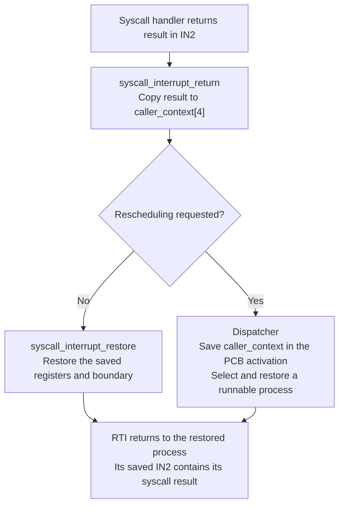
```mermaid
%%{init: {"flowchart": {"rankSpacing": 25, "nodeSpacing": 25}}}%%
flowchart TB
    RESULT["Syscall handler returns result in IN2"]
    SAVE["syscall_interrupt_return<br/>Copy result to caller_context[4]"]
    CHECK{"Rescheduling requested?"}
    DIRECT["syscall_interrupt_restore<br/>Restore the saved registers and boundary"]
    DISPATCH["Dispatcher<br/>Save caller_context in the PCB activation<br/>Select and restore a runnable process"]
    RTI["RTI returns to the restored process<br/>Its saved IN2 contains its syscall result"]
    RESULT --> SAVE --> CHECK
    CHECK -->|No| DIRECT --> RTI
    CHECK -->|Yes| DISPATCH --> RTI
```

When [`syscall_interrupt_restore()`](interrupt_service_routines/os_isrs.picoc#L158)
runs, it restores the saved registers, including the result in `IN2`, and then
executes `RTI`. On the dispatcher path, the dispatcher later restores the same
register values from the PCB and executes `RTI` itself, so
[`syscall_interrupt_restore()`](interrupt_service_routines/os_isrs.picoc#L158)
is not executed afterward. The restoration stub runs only when the syscall
handler returns and the rescheduling check also returns normally.

#### 2.4.6.2 System-call groups
[\[↑ TOC\]](#contents)

PicoOS implements **37 syscalls**. Related selector constants are adjacent in
[`common/syscall.header`](common/syscall.header) and
[`handle_syscall()`](kernel/syscall.picoc#L16).

The table groups these calls by subsystem. Its `Kernel functions` column shows
the entry points reached by each group, while the preceding
[Section 2.4, System-call interface and execution](#24-system-call-interface-and-execution) defines the request structures used for
multi-argument calls.

| Group | Syscalls, in declaration order | Kernel functions |
| --- | --- | --- |
| System control | Shutdown, reboot | [`shutdown()`](kernel/kernel.picoc#L15), [`reboot()`](kernel/kernel.picoc#L19) |
| Process management | Load, run, list, unload, exit, exact-child wait, PID query, terminal ownership, signal delivery, parent-death setting | [`load_process_chunk()`](kernel/process/process_loader.picoc#L292), [`mark_process_ready_with_arguments()`](kernel/process/process_arguments.picoc#L241), [`list_processes()`](kernel/process/process.picoc#L32), [`unload_process_by_pid()`](kernel/process/process.picoc#L328), [`exit_process()`](kernel/process/process.picoc#L430), [`wait_for_process_by_pid()`](kernel/process/process.picoc#L348), [`current_process()`](kernel/process/process.picoc#L62), [`set_foreground_process()`](kernel/signal.picoc#L148), [`send_signal_by_pid()`](kernel/signal.picoc#L108), [`set_parent_death_signal()`](kernel/signal.picoc#L137) |
| Scheduling | Queue sleep, queue wakeup, yield | [`sleep_on_wait_queue()`](kernel/process/process.picoc#L390), [`wakeup_wait_queue()`](kernel/process/process.picoc#L395), [`dispatcher_switch_from_context()`](kernel/dispatcher.picoc#L71) |
| Process and shared memory | Heap start, heap size, heap-exhaustion handling, shared-memory open, map, unlink | [`process_heap_start()`](kernel/process/process.picoc#L418), [`process_heap_size()`](kernel/process/process.picoc#L424), [`handle_process_heap_full_exception()`](kernel/exception.picoc#L82), [`open_shared_memory()`](kernel/shared_memory.picoc#L92), [`map_shared_memory()`](kernel/shared_memory.picoc#L130), [`unlink_shared_memory()`](kernel/shared_memory.picoc#L151) |
| Descriptors and I/O | Descriptor availability, open, read, write, close, seek, duplicate, direct UART byte send | Descriptor availability returns 1 directly, [`open_file_descriptor()`](kernel/filesystem/filesystem.picoc#L39), [`read_file_descriptor()`](kernel/filesystem/filesystem.picoc#L150), [`write_file_descriptor()`](kernel/filesystem/filesystem.picoc#L217), [`close_file_descriptor()`](kernel/filesystem/file_descriptor.picoc#L146), [`seek_file_descriptor()`](kernel/filesystem/filesystem.picoc#L268), [`duplicate_file_descriptor()`](kernel/filesystem/file_descriptor.picoc#L163), [`send_byte_over_uart()`](kernel/uart_hardware.picoc#L9) |
| Paths and directories | Change/get working directory, make/read directory, unlink file, remove directory, move path, touch file | [`change_working_directory()`](kernel/filesystem/host_filesystem.picoc#L163), [`get_working_directory()`](kernel/filesystem/host_filesystem.picoc#L156), [`make_host_directory()`](kernel/filesystem/host_filesystem.picoc#L177), [`read_host_directory()`](kernel/filesystem/host_filesystem.picoc#L187), [`unlink_host_file()`](kernel/filesystem/host_filesystem.picoc#L208), [`remove_host_directory()`](kernel/filesystem/host_filesystem.picoc#L212), [`move_host_path()`](kernel/filesystem/host_filesystem.picoc#L216), [`touch_host_file()`](kernel/filesystem/host_filesystem.picoc#L234) |

### 2.4.7 System-call selection function reference
[\[↑ TOC\]](#contents)

The C entry in [`kernel/syscall.picoc`](kernel/syscall.picoc) connects the ABI
and saved caller context to the subsystem functions grouped above.

| Kernel function | Return value / status | Effects | Calls | Called by |
| --- | --- | --- | --- | --- |
| [`handle_syscall(syscall_number, argument, caller_context)`](kernel/syscall.picoc#L16) | Returns the selected operation's result for immediate calls. Calls that switch processes leave through the saved interrupt frame. Exit, shutdown, and reboot do not return normally. | Selects one of 37 kernel operations and may change process, scheduler, memory, descriptor, or host-filesystem state | The kernel functions in [Section 2.4.6.2, System-call groups](#2462-system-call-groups) | **System-call entry:** [`syscall_interrupt()`](interrupt_service_routines/os_isrs.picoc#L104) after userspace executes `INT 0` |

## 2.5 Timer interrupts and userspace preemption
[\[↑ TOC\]](#contents)

The timer is mapped to vector 1 with priority 1 and activated with an interval
of 5,000 instructions after init becomes ready. The interval counts emulated
instructions rather than wall-clock time.
[Section 2.5.3, Shell character delay for different timer intervals](#253-shell-character-delay-for-different-timer-intervals) explains why PicoOS
uses this value. [Section 11.3, Interactive line editing and command history](#113-interactive-line-editing-and-command-history)
separately reduces the time spent receiving and printing typed characters.

### 2.5.1 Timer interrupt path
[\[↑ TOC\]](#contents)

The complete [`timer_interrupt()`](interrupt_service_routines/os_isrs.picoc#L33)
entry, [`timer_interrupt_kernel_return()`](interrupt_service_routines/os_isrs.picoc#L62),
[`timer_interrupt_process()`](interrupt_service_routines/os_isrs.picoc#L74), and
[`timer_interrupt_after_reschedule_request()`](interrupt_service_routines/os_isrs.picoc#L91)
continuations are shown below so the context-switch work behind that tradeoff is
visible:

```c
__attribute__((naked))
void timer_interrupt(void) {
    // Saves the interrupted context before requesting a process switch
    asm("PUSH ACC");
    asm("PUSH IN1");
    asm("PUSH IN2");
    asm("PUSH BAF");
    asm("PUSH CS");
    asm("PUSH DS");
    // SP is saved later. From then on, its value is called old_sp

    // Uses kernel segments because an interrupt can arrive during entry or return
    asm(KERNEL_CS_START_ASM);
    asm(KERNEL_DS_START_ASM);

    // Process interrupts must leave the nearly exhausted process stack before
    // calling kernel functions. Kernel interrupts keep their live kernel stack
    asm("LOADIN SP ACC 7"); // Interrupted PC above the six saved registers
    asm("SUB ACC DS");
    asm("JUMP32>= timer_interrupt_process");

    asm("LOADI32 ACC timer_interrupt_kernel_return");
    asm("ADD ACC CS");
    asm("PUSH ACC");
    asm("LOADI32 ACC dispatcher_request_reschedule");
    asm("ADD ACC CS");
    asm("MOVE ACC PC");
}

__attribute__((naked))
void timer_interrupt_kernel_return(void) {
    // The pending request is consumed when this kernel work returns to a process
    asm("POP DS");
    asm("POP CS");
    asm("POP BAF");
    asm("POP IN2");
    asm("POP IN1");
    asm("POP ACC");
    asm("RTI");
}

__attribute__((naked))
void timer_interrupt_process(void) {
    // BAF keeps old_sp while loading kernel CS, DS and SP
    asm("MOVE SP BAF");
    asm("LOADI IN1 0");
    write_stack_heap_boundary_from_in1();
    asm(KERNEL_SP_START_ASM);
    activate_kernel_stack_boundary();

    asm("LOADI32 ACC timer_interrupt_after_reschedule_request");
    asm("ADD ACC CS");
    asm("PUSH ACC");
    asm("LOADI32 ACC dispatcher_request_reschedule");
    asm("ADD ACC CS");
    asm("MOVE ACC PC");
}

__attribute__((naked))
void timer_interrupt_after_reschedule_request(void) {
    // Passes the interrupted stack frame to the dispatcher
    asm("PUSH BAF"); // Caller context

    // The dispatcher switches to a process through RTI and does not return
    asm("LOADI ACC 0");
    asm("PUSH ACC"); // Unreachable return address required by the call frame
    asm("LOADI32 ACC dispatcher_switch_from_context");
    asm("ADD ACC CS");
    asm("MOVE ACC PC");
}
```

After saving six registers, the entry reads the interrupted `PC` seven cells
above `SP` and compares it with the kernel data-segment boundary. It does this
before building a call frame: [`dispatcher_request_reschedule()`](kernel/dispatcher.picoc#L10)
needs stack space, and calling it while `SP` still referred to an almost-full
process stack could cross that process's stack/heap boundary after kernel `CS`
and `DS` were already active. The resulting fault would then appear to be a
kernel stack overflow instead of the intended user-process stack overflow.

For a userspace interruption, [`timer_interrupt_process()`](interrupt_service_routines/os_isrs.picoc#L74)
preserves the process frame in `BAF`, disables its boundary while changing
stacks, installs `KERNEL_SP_START_ASM`, and activates the kernel boundary before
requesting rescheduling. Its continuation then passes the preserved frame to
[`dispatcher_switch_from_context()`](kernel/dispatcher.picoc#L71). For a kernel
interruption, [`timer_interrupt_kernel_return()`](interrupt_service_routines/os_isrs.picoc#L62)
keeps the live kernel stack, restores the saved registers, and executes `RTI`.

If the timer interrupted userspace, its process activation is saved and goes
through the scheduler immediately. If it interrupted kernel code, that code
resumes directly and the pending request is consumed by the next syscall-return
path. This keeps kernel execution non-preemptive without losing a time slice
that expires inside a syscall.

### 2.5.2 Kernel non-preemption and deferred rescheduling
[\[↑ TOC\]](#contents)

The timer interrupt behaves differently in userspace and in the kernel. That
distinction makes kernel execution non-preemptive and explains why long
polling transfers return to userspace between bounded chunks.

PicoOS uses `0x80000000` as its SRAM base and configures 2^18 physical SRAM
words. Kernel code is non-preemptive: a timer interrupt that interrupted
kernel code records a pending reschedule and returns to that code. The request
is consumed when the syscall next leaves the kernel, before its process resumes
in userspace. A UART interrupt can briefly run while the kernel is waiting, but
it returns to the interrupted kernel work. Kernel operations therefore do not
overlap with another process’s kernel operations, so the kernel does not need
internal locks.

The sequence below follows the actual deferred path. The timer interrupt calls
[`dispatcher_request_reschedule()`](kernel/dispatcher.picoc#L10), restores the
interrupted kernel context, and leaves
[`reschedule_requested`](kernel/dispatcher.picoc#L8) set. Only the syscall
return continuation calls
[`dispatcher_reschedule_if_requested()`](kernel/dispatcher.picoc#L14) with the
saved process frame, which lets the dispatcher switch safely before `RTI`.

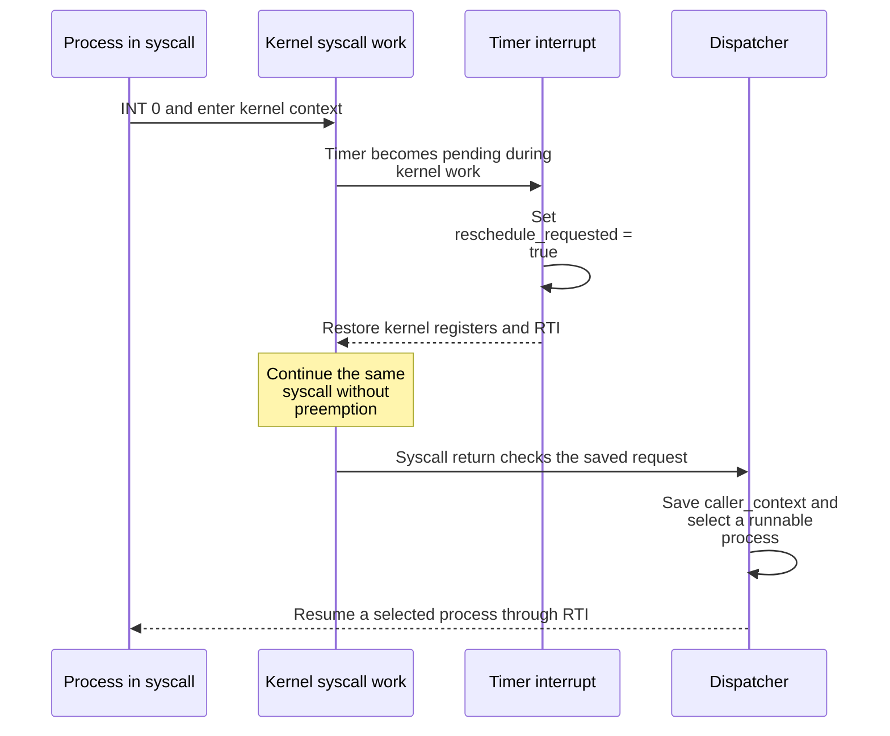
```mermaid
%%{init: {"sequence": {"wrap": true}, "themeCSS": "rect { rx: 0 !important; ry: 0 !important; }"}}%%
sequenceDiagram
    participant U as Process in syscall
    participant K as Kernel syscall work
    participant T as Timer interrupt
    participant D as Dispatcher

    U->>K: INT 0 and enter kernel context
    K->>T: Timer becomes pending during kernel work
    T->>T: Set reschedule_requested = true
    T-->>K: Restore kernel registers and RTI
    Note over K: Continue the same syscall without preemption
    K->>D: Syscall return checks the saved request
    D->>D: Save caller_context and select a runnable process
    D-->>U: Resume a selected process through RTI
```

Executable loading and regular-file reads keep that kernel model while
bounding its latency. Regular-file reads and process loading without DMA
transfer at most 1 KiB of payload per syscall. Their wrappers can request the
next chunk directly because
a timer observed during the previous chunk is handled at that syscall's return
boundary. With DMA, process loading starts one complete payload transfer and
blocks its caller until the DMA completion interrupt wakes it.

### 2.5.3 Shell character delay for different timer intervals
[\[↑ TOC\]](#contents)

Choosing the interval is useful because it decides how often PicoOS can give a
waiting shell or program a turn, while every timer interrupt also takes time
away from useful program work. The measurement times character delay while an
endless empty loop is running.


**PicoOS uses 5,000 instructions because it was the best balance:** character
delay was nearly the same as at 10,000, but 10,000 can make the shell wait
longer. Shorter intervals waste more time switching programs. The method,
results, and tradeoffs are in
[Shell input latency and timer interval](documentation/shell_input_latency.md).

## 2.6 UART receive interrupt path
[\[↑ TOC\]](#contents)

UART is mapped to vector 2 at the higher priority 2. The naked
[`uart_interrupt()`](interrupt_service_routines/os_isrs.picoc#L195) entry
temporarily enters kernel code, calls
[`handle_uart_interrupt()`](kernel/filesystem/terminal.picoc#L213), and continues
through [`uart_interrupt_return()`](interrupt_service_routines/os_isrs.picoc#L220)
to restore the exact interrupted context. The interrupt service routine below
shows this entry and return sequence:

```c
__attribute__((naked))
void uart_interrupt(void) {
    // Saves the interrupted context while the kernel transfers one input byte
    asm("PUSH ACC");
    asm("PUSH IN1");
    asm("PUSH IN2");
    asm("PUSH BAF");
    asm("PUSH CS");
    asm("PUSH DS");

    // BAF keeps the interrupted stack while the handler uses kernel segments
    // Keeping SP avoids overwriting a suspended kernel call frame when all
    // processes are blocked and the dispatcher is waiting for an interrupt
    asm("MOVE SP BAF");
    asm(KERNEL_CS_START_ASM);
    asm(KERNEL_DS_START_ASM);

    asm("LOADI32 ACC uart_interrupt_return");
    asm("ADD ACC CS");
    asm("PUSH ACC");
    asm("LOADI32 ACC handle_uart_interrupt");
    asm("ADD ACC CS");
    asm("MOVE ACC PC");
}

__attribute__((naked))
void uart_interrupt_return(void) {
    // Restores the context that was active before the UART interrupt
    asm("MOVE BAF SP");
    asm("POP DS");
    asm("POP CS");
    asm("POP BAF");
    asm("POP IN2");
    asm("POP IN1");
    asm("POP ACC");
    asm("RTI");
}
```

[`uart_interrupt()`](interrupt_service_routines/os_isrs.picoc#L195) first saves
the six registers used by interrupted code. It keeps the interrupted `SP` in
`BAF`, installs the kernel code and data segments, and jumps to
[`handle_uart_interrupt()`](kernel/filesystem/terminal.picoc#L213) with
[`uart_interrupt_return()`](interrupt_service_routines/os_isrs.picoc#L220) as
the return address. The return continuation restores the interrupted stack and
registers before `RTI` resumes the interrupted instruction stream.

With that context protected, the C handler can acknowledge and dispatch the
received byte without changing the state that the interrupted code observes:

```c
void handle_uart_interrupt(void) {
    struct Process *process = terminal_input_process();
    struct Terminal *terminal = kernel_terminal();
    int value;
    int status;

    value = periphery_read_register(UART_RECEIVE_REGISTER) & 255;
    status = periphery_read_register(UART_STATUS_REGISTER);
    periphery_write_register(
        UART_STATUS_REGISTER,
        status | UART_RECEIVE_READY
    );

    if (handle_terminal_signal_character(value)) {
        return;
    }

    enqueue_terminal_byte(terminal, value);
    complete_pending_terminal_read(process, terminal);
}
```

The C handler acknowledges one byte. `Ctrl+C` becomes [`SIGINT`](common/signal.header#L4) and `Ctrl+Z` becomes
[`SIGTSTP`](common/signal.header#L8) for the foreground process. Any other byte is offered to the global terminal
ring. If the ring is already full, the new byte is dropped so unread bytes are
not overwritten. If the foreground process is waiting, the handler copies
available ring bytes into that process's pending read buffer, writes the result
into its saved [`activation.in2`](kernel/process/process.header#L23), and wakes
it. The ring states and overflow policy are detailed in
[Section 7.2, Global terminal input buffer](#72-global-terminal-input-buffer).

### 2.6.1 Polled UART function reference
[\[↑ TOC\]](#contents)

The interrupt path above handles terminal input. The target-specific functions
in [`kernel/uart_hardware.picoc`](kernel/uart_hardware.picoc) provide the
separate polled UART path used by kernel and directly linked common code.

| Kernel function | Return value / status | Effects | Calls | Called by |
| --- | --- | --- | --- | --- |
| [`send_byte_over_uart(value)`](kernel/uart_hardware.picoc#L9) | Returns no value | Sends the low byte through UART register 0 and polls UART status, changes no kernel structure | [`switch_to_periphery_address_space()`](kernel/uart_hardware.picoc#L1) | **Library functions:** [`send_byte_over_uart()`](library/stdio/stdio.picoc#L19) through the direct-UART syscall<br>**Shared/Common functions:** [`uart_print_character()`](common/uart_protocol.picoc#L21), linked directly to the kernel implementation<br>**Kernel functions:** [`handle_syscall()`](kernel/syscall.picoc#L16) |
| [`receive_byte_over_uart(void)`](kernel/uart_hardware.picoc#L24) | Returns one received byte | Polls UART status and reads UART register 1, changes no kernel structure | [`switch_to_periphery_address_space()`](kernel/uart_hardware.picoc#L1) | **Shared/Common functions:** [`receive_word()`](common/uart_protocol.picoc#L7), linked directly to the kernel implementation<br>**Kernel functions:** [`drain_process_bytes()`](kernel/process/process_loader.picoc#L62), [`read_regular_file()`](kernel/filesystem/filesystem.picoc#L90), [`uart_receive_string()`](kernel/filesystem/host_filesystem.picoc#L10) |

## 2.7 DMA completion interrupt path
[\[↑ TOC\]](#contents)

DMA completion uses vector 4 on the custom-device interrupt line. The naked
[`dma_interrupt()`](interrupt_service_routines/os_isrs.picoc#L233) entry saves
the interrupted registers, installs kernel segments, and calls
[`handle_dma_interrupt()`](kernel/dma.picoc#L40). That handler wakes the FIFO
head of the global [`dma_waiters`](kernel/dma.picoc#L6) queue, the interrupted
context is then restored with `RTI`. Process loading later explains how a
caller enters this queue while a UART-to-SRAM transfer is active.

The interrupt service routine and its C handler are short enough to show
together. The assembly preserves the interrupted stack in `BAF`, and the
handler only wakes the process waiting for the completed transfer:

```c
__attribute__((naked))
void dma_interrupt(void) {
    // Saves the interrupted context while the kernel completes the DMA wait
    asm("PUSH ACC");
    asm("PUSH IN1");
    asm("PUSH IN2");
    asm("PUSH BAF");
    asm("PUSH CS");
    asm("PUSH DS");

    // BAF keeps the interrupted stack while the handler uses kernel segments
    asm("MOVE SP BAF");
    asm(KERNEL_CS_START_ASM);
    asm(KERNEL_DS_START_ASM);

    asm("LOADI32 ACC dma_interrupt_return");
    asm("ADD ACC CS");
    asm("PUSH ACC");
    asm("LOADI32 ACC handle_dma_interrupt");
    asm("ADD ACC CS");
    asm("MOVE ACC PC");
}

__attribute__((naked))
void dma_interrupt_return(void) {
    // Restores the context that was active before the DMA interrupt
    asm("MOVE BAF SP");
    asm("POP DS");
    asm("POP CS");
    asm("POP BAF");
    asm("POP IN2");
    asm("POP IN1");
    asm("POP ACC");
    asm("RTI");
}

void handle_dma_interrupt(void) {
    wakeup_wait_queue(&dma_waiters);
}
```

[`initialize_dma()`](kernel/dma.picoc#L9) initializes that queue once and records
the result in [`dma_initialized`](kernel/dma.picoc#L7). A later
[`start_dma_uart_receive()`](kernel/dma.picoc#L18) accepts a transfer only when
DMA is active, the device is idle, and no process is already waiting. It stores
the load-continuation result in the saved syscall frame, blocks the caller,
programs the transfer, and switches processes. This permits one kernel-managed DMA
load at a time, the completion interrupt makes its caller ready again.

### 2.7.1 DMA waiting and completion function reference
[\[↑ TOC\]](#contents)

The functions in [`kernel/dma.picoc`](kernel/dma.picoc) connect process
loading to the DMA registers and the completion path described above.

| Kernel function | Return value / status | Effects | Calls | Called by |
| --- | --- | --- | --- | --- |
| [`initialize_dma(void)`](kernel/dma.picoc#L9) | Returns no value | Initializes [`dma_waiters`](kernel/dma.picoc#L6) and sets [`dma_initialized`](kernel/dma.picoc#L7) once when DMA is active, otherwise changes nothing | [`dma_is_active()`](common/dma.picoc#L17) | **Kernel functions:** [`main()`](kernel/kernel.picoc#L31), [`start_dma_uart_receive()`](kernel/dma.picoc#L18) |
| [`start_dma_uart_receive(destination, word_count, caller_context)`](kernel/dma.picoc#L18) | Returns `false` when DMA is unavailable, busy, or already has a waiter. Successful setup does not return through the current kernel call. The process later resumes from its saved interrupt frame with [`SYSCALL_LOAD_PROCESS_CONTINUE`](common/syscall.header#L48). | Stores the continuation result in the saved syscall frame, blocks the caller on [`dma_waiters`](kernel/dma.picoc#L6), starts a UART-to-SRAM transfer, and switches processes | [`dma_is_active()`](common/dma.picoc#L17), [`initialize_dma()`](kernel/dma.picoc#L9), [`dma_transfer_status()`](common/dma.picoc#L21), [`enqueue_current_process_on_wait_queue()`](kernel/process/process.picoc#L375), [`start_dma_uart_transfer()`](common/dma.picoc#L25), [`dispatcher_switch_from_context()`](kernel/dispatcher.picoc#L71) | **Kernel functions:** [`begin_process_load()`](kernel/process/process_loader.picoc#L109) |
| [`handle_dma_interrupt(void)`](kernel/dma.picoc#L40) | Returns no value | Wakes the first PCB waiting for DMA completion on [`dma_waiters`](kernel/dma.picoc#L6) | [`wakeup_wait_queue()`](kernel/process/process.picoc#L395) | **Hardware interrupts:** DMA completion via [`dma_interrupt()`](interrupt_service_routines/os_isrs.picoc#L233) |

## 2.8 CPU exceptions and runtime errors
[\[↑ TOC\]](#contents)

Device interrupts report work that completed outside the CPU, but a CPU
exception stops an instruction that cannot continue safely. PicoOS also has
dedicated handlers for heap exhaustion, which is detected by its allocators
rather than by the CPU. In both cases the kernel must decide whether it can
terminate one process or whether the whole system has become unsafe.

### 2.8.1 CPU exception entry and registers
[\[↑ TOC\]](#contents)

The RETI CPU model in the emulator detects division or modulo by zero, a
protected stack crossing, and an illegal instruction while executing RETI
code. It records the cause and enters the fixed CPU-exception vector 3
directly. This entry does not use the hardware interrupt controller mappings
or priorities described in
[Section 2.2, Interrupt-controller mappings and priorities](#22-interrupt-controller-mappings-and-priorities).

Two memory-mapped periphery registers take part in stack protection and
exception reporting. The table states which side writes each register and what
PicoOS reads from it:

| Register | Written by | Contents and use |
| ---: | --- | --- |
| 10, [`STACK_HEAP_BOUNDARY_REGISTER`](kernel/exception.header#L5) | PicoOS | `0` disables stack protection. Any other value is the active boundary, the emulator raises a stack-overflow exception when an instruction decreases `SP` to a value below it. [`activate_kernel_stack_boundary()`](kernel/exception.picoc#L11) writes [`KERNEL_HEAP_START`](kernel/memory_constants.header#L3) + [`KERNEL_HEAP_SIZE`](kernel/memory_constants.header#L4) − 1. A process boundary is [`base_address`](kernel/process/process.header#L34) + [`heap_start`](kernel/process/process.header#L36) + [`heap_size`](kernel/process/process.header#L37) − 1. |
| 11, [`CPU_EXCEPTION_CAUSE_REGISTER`](kernel/exception.header#L6) | RETI CPU/emulator | `0` means no exception has been recorded, `1` means division or modulo by zero, `2` means stack overflow, and `3` means illegal instruction. Guest writes are ignored. [`handle_cpu_exception()`](kernel/exception.picoc#L70) reads this value after exception entry. |

When the emulator detects a fault, it stores the cause exposed through register
11 and starts the fixed exception entry. As with a syscall, the automatic
mechanism decrements the current `SP`, leaves a PC value at `SP + 1`, and loads
vector 3, because `RTI` advances after loading that cell, the saved value is one
instruction address before the faulting instruction so a returning handler
could retry it.
No PicoOS exception path actually retries it.

Unlike [`syscall_interrupt()`](interrupt_service_routines/os_isrs.picoc#L104),
the assembly exception entry does not push `ACC`, `IN1`, `IN2`, `BAF`, `CS`, or
`DS`. The old stack therefore retains only the automatically saved PC. This is
intentional because a userspace CPU exception always terminates the process,
while a kernel CPU exception shuts down the system. The entry keeps the
interrupted `CS` only temporarily in `BAF`, writes `0` to the stack-boundary
register, and overwrites `CS`, `DS`, and `SP` with the same generated
[`KERNEL_CS_START_ASM`](kernel/memory_constants.header#L6),
[`KERNEL_DS_START_ASM`](kernel/memory_constants.header#L7), and
[`KERNEL_SP_START_ASM`](kernel/memory_constants.header#L8) values used by
syscall entry. It then installs the kernel boundary and passes the difference
between the old and kernel `CS` to C. The complete
[`cpu_exception_interrupt()`](interrupt_service_routines/os_isrs.picoc#L171)
entry shows these steps:

```c
__attribute__((naked))
void cpu_exception_interrupt(void) {
    // BAF preserves the interrupted CS while the handler resets kernel context
    asm("MOVE CS BAF");
    asm("LOADI IN1 0");
    write_stack_heap_boundary_from_in1();
    asm(KERNEL_CS_START_ASM);
    asm(KERNEL_DS_START_ASM);
    asm(KERNEL_SP_START_ASM);
    activate_kernel_stack_boundary();

    // A zero difference identifies an exception raised in kernel code
    asm("MOVE BAF ACC");
    asm("SUB ACC CS");
    asm("PUSH ACC");

    // The exception handler terminates the process or halts after a kernel panic
    asm("LOADI ACC 0");
    asm("PUSH ACC");
    asm("LOADI32 ACC handle_cpu_exception");
    asm("ADD ACC CS");
    asm("MOVE ACC PC");
}
```

The temporary `CS` value distinguishes the two outcomes. If user code was
interrupted,
[`handle_cpu_exception()`](kernel/exception.picoc#L70) writes a message through
descriptor 1 and [`exit_process()`](kernel/process/process.picoc#L430)
terminates the current process with status
[`PROCESS_EXIT_STATUS_EXCEPTION`](kernel/process/process.header#L19). If the
fault occurred with the kernel code segment active, the handler writes the
kernel-panic message directly over UART and [`shutdown()`](kernel/kernel.picoc#L15)
halts with `JUMP 0`. The C handler implements that choice as follows:

```c
void handle_cpu_exception(int interrupted_kernel_cs_difference) {
    int cause = periphery_read_register(CPU_EXCEPTION_CAUSE_REGISTER);
    bool kernel_exception = interrupted_kernel_cs_difference == 0;

    print_cpu_exception_message(cause, kernel_exception);
    if (kernel_exception) {
        shutdown();
    }

    exit_process(PROCESS_EXIT_STATUS_EXCEPTION);
}
```

The dispatcher is not involved in exception entry and the fault-time
activation is never copied to its PCB. For a userspace fault,
[`exit_process(status)`](kernel/process/process.picoc#L430) reaches
[`terminate_process(process, status)`](kernel/process/process.picoc#L304), which
stores the exception status in
[`Process.exit_status`](kernel/process/process.header#L60), changes
[`Process.state`](kernel/process/process.header#L33) to `ZOMBIE`, and removes
the PCB immediately when no parent must collect it. It then calls
[`dispatcher_start_next_process()`](kernel/dispatcher.picoc#L55). The scheduler
chooses a different runnable process, and
[`dispatcher_jump_to_process(process, stack_boundary)`](kernel/dispatcher.picoc#L21)
restores that process's saved `SP`, boundary, general registers, segments, and
PC through `RTI`, exactly as described for a switched syscall in
[Section 2.4.6, System-call entry, execution, and return to userspace](#246-system-call-entry-execution-and-return-to-userspace). The PC on
the faulting process's old stack is abandoned. If no process remains,
[`exit_process(status)`](kernel/process/process.picoc#L430) shuts down, a kernel
fault goes directly to [`shutdown()`](kernel/kernel.picoc#L15). Consequently,
CPU exceptions never return to the interrupted context in the current
implementation.

The system-call entry, the userspace branch of the timer interrupt, and the
CPU-exception entry temporarily write `0` while moving from the process stack
to the kernel stack, then activate the kernel boundary. Only syscall and timer
entry preserve a resumable process frame, exception entry does not. Process
heap exhaustion follows the process-heap-full syscall path, so its complete
context is initially saved as described in
[Section 2.4.6, System-call entry, execution, and return to userspace](#246-system-call-entry-execution-and-return-to-userspace), but
[`handle_process_heap_full_exception()`](kernel/exception.picoc#L82)
terminates it instead of returning.

### 2.8.2 Supported exceptions and allocation errors
[\[↑ TOC\]](#contents)

The table covers every CPU exception emitted by the RETI emulator, the two
allocation failures routed through dedicated exception or panic handlers, and
exhaustion of the separate Process and Shared Data Heap. Invalid syscall arguments,
missing files, and rejected process images use normal failure return values
instead and are not fatal runtime errors.

| Condition | Trigger | Entry or reported cause | PicoOS handling |
| --- | --- | --- | --- |
| Division or modulo by zero | A RETI `DIV`, `DIVI`, `MOD`, or `MODI` instruction has a zero divisor | CPU exception cause `1`, fixed vector 3 | [`handle_cpu_exception()`](kernel/exception.picoc#L70) reports division by zero. It terminates the current process with exception status for a userspace fault, or reports a kernel panic and shuts down for a kernel fault. |
| Stack overflow | An instruction decreases `SP` below the active boundary in periphery register 10 | CPU exception cause `2`, fixed vector 3 | [`handle_cpu_exception()`](kernel/exception.picoc#L70) reports process stack overflow and terminates that process, or reports kernel stack overflow and shuts down. |
| Illegal instruction | The fetched word is not a valid RETI instruction, or instruction decoding reaches an unsupported opcode | CPU exception cause `3`, fixed vector 3 | [`handle_cpu_exception()`](kernel/exception.picoc#L70) reports an illegal instruction and applies the process-or-kernel policy above. The message helper also treats any unexpected cause value as illegal instruction. |
| Process heap full | [`malloc()`](library/stdlib/malloc.picoc#L35) or [`realloc()`](library/stdlib/malloc.picoc#L42) cannot satisfy a positive-size allocation | [`require_process_heap_allocation()`](library/stdlib/malloc.picoc#L8) invokes the process-heap-full syscall | [`handle_process_heap_full_exception()`](kernel/exception.picoc#L82) reports `Process terminated: heap full` through descriptor 1 and terminates the current process with exception status. |
| Kernel heap full | [`kmalloc()`](kernel/kmalloc.picoc#L23) or [`krealloc()`](kernel/kmalloc.picoc#L31) cannot satisfy a positive-size allocation | [`require_kernel_heap_allocation()`](kernel/kmalloc.picoc#L9) calls the panic handler directly | [`panic_kernel_heap_full()`](kernel/exception.picoc#L89) writes `Kernel panic: kernel heap full` directly over UART and shuts down. |
| Process and Shared Data Heap exhausted | [`pmalloc()`](kernel/pmalloc.picoc#L20) cannot reserve a contiguous process image or shared-memory region | Returns [`PMALLOC_INVALID_START`](kernel/pmalloc.header#L3), no CPU exception is raised | [`begin_process_load()`](kernel/process/process_loader.picoc#L109) and [`load_process()`](kernel/process/process_loader.picoc#L305) report `error: not enough process memory` and fail the load. [`open_shared_memory()`](kernel/shared_memory.picoc#L92) frees the new entry and returns `-1`. The running process and kernel continue. |

### 2.8.3 Exception and stack-boundary function reference
[\[↑ TOC\]](#contents)

Functions in [`kernel/exception.picoc`](kernel/exception.picoc) manage the
active stack boundary and decide whether a fault terminates a process or the
kernel. The table also includes the two heap-exhaustion handlers implemented in
that file.

| Kernel function | Return value / status | Effects | Calls | Called by |
| --- | --- | --- | --- | --- |
| [`handle_process_heap_full_exception(void)`](kernel/exception.picoc#L82) | Does not return normally | Writes a diagnostic through descriptor 1 and terminates the current PCB with exception status | [`write_process_exception_message()`](kernel/exception.picoc#L29), [`exit_process()`](kernel/process/process.picoc#L430) | **Library functions:** [`require_process_heap_allocation()`](library/stdlib/malloc.picoc#L8) through the process-heap-full syscall<br>**Kernel functions:** [`handle_syscall()`](kernel/syscall.picoc#L16) |
| [`activate_kernel_stack_boundary(void)`](kernel/exception.picoc#L11) | Returns no value | Writes the kernel heap end to periphery register 10 | [`periphery_write_register()`](kernel/periphery.picoc#L11) | **System-call entry:** [`syscall_interrupt()`](interrupt_service_routines/os_isrs.picoc#L104)<br>**Hardware interrupts:** timer via [`timer_interrupt_process()`](interrupt_service_routines/os_isrs.picoc#L74)<br>**CPU exceptions:** [`cpu_exception_interrupt()`](interrupt_service_routines/os_isrs.picoc#L171)<br>**Kernel functions:** [`main()`](kernel/kernel.picoc#L31) |
| [`process_stack_boundary(process)`](kernel/exception.picoc#L18) | Returns the process's absolute heap end | Reads [`base_address`](kernel/process/process.header#L34), [`heap_start`](kernel/process/process.header#L36), and [`heap_size`](kernel/process/process.header#L37), changes no state | — | **Kernel functions:** [`activate_current_process_stack_boundary()`](kernel/exception.picoc#L22), [`dispatcher_switch_to_process()`](kernel/dispatcher.picoc#L43) |
| [`activate_current_process_stack_boundary(void)`](kernel/exception.picoc#L22) | Returns no value | Writes the current process boundary to periphery register 10 | [`current_process()`](kernel/process/process.picoc#L62), [`process_stack_boundary()`](kernel/exception.picoc#L18), [`periphery_write_register()`](kernel/periphery.picoc#L11) | **System-call return:** [`syscall_interrupt_restore()`](interrupt_service_routines/os_isrs.picoc#L158) |
| [`handle_cpu_exception(interrupted_kernel_cs_difference)`](kernel/exception.picoc#L70) | Does not return normally | Reads register 11, terminates the current PCB for a process fault or shuts down for a kernel fault | [`periphery_read_register()`](kernel/periphery.picoc#L5), [`print_cpu_exception_message()`](kernel/exception.picoc#L44), [`shutdown()`](kernel/kernel.picoc#L15), [`exit_process()`](kernel/process/process.picoc#L430) | **CPU exceptions:** [`cpu_exception_interrupt()`](interrupt_service_routines/os_isrs.picoc#L171) |
| [`panic_kernel_heap_full(void)`](kernel/exception.picoc#L89) | Does not return | Writes a UART kernel-panic message and shuts down | [`uart_print_string()`](common/uart_protocol.picoc#L73), [`shutdown()`](kernel/kernel.picoc#L15) | **Kernel functions:** [`require_kernel_heap_allocation()`](kernel/kmalloc.picoc#L9) |

# 3. Memory management and shared memory
[\[↑ TOC\]](#contents)

The interrupt and syscall boundary established above changes objects stored in
one physical SRAM address space. This chapter explains the allocator shared by
the kernel and userspace, the three heap instances built from it, their memory
maps, and the named regions that processes share.

## 3.1 Heap block layout and allocation algorithm
[\[↑ TOC\]](#contents)

The declarations below show the common allocator’s two structures: [`Heap`](common/heap.header#L11)
locates the first [`BlockHeader`](common/heap.header#L5), and each header describes the payload
immediately following it. The field table explains how those links change.

```c
struct BlockHeader {
    int size;
    bool free;
    struct BlockHeader *next;
};

struct Heap {
    struct BlockHeader *first_block;
};
```

[`struct Heap`](common/heap.header#L11) is the stable representation of one heap, while its
[`Heap.first_block`](common/heap.header#L12) entry pointer is mutable. The heap therefore remains
the same object when [`heap_init_region()`](common/heap.picoc#L49) assigns its first block.
Allocation, splitting, and merging update the block list without replacing that entry pointer. A bare [`BlockHeader`](common/heap.header#L5) pointer
would identify only the current first block. A `struct BlockHeader **` parameter could also let an
allocator replace that pointer, but it would not represent the heap itself as clearly. Keeping the
mutable entry pointer in [`struct Heap`](common/heap.header#L11) gives the allocator a stable heap
object. The same representation lets the allocator operate on the Kernel Heap,
Process and Shared Data Heap, and User Process Heap. Each
[`BlockHeader`](common/heap.header#L5) is stored inside the managed region immediately before its
payload. Allocation performs a first-fit scan and may split a block. Free marks it and merges
adjacent free blocks. Reallocation shrinks/splits, grows into a following free block, or
allocates/copies/frees.

The generic layout below applies to every heap instance. Each
[`BlockHeader`](common/heap.header#L5) occupies three RETI cells for `size`,
`free`, and `next`, followed immediately by `size` payload cells. Lines without
arrowheads show physical neighbors in increasing address order. Labeled arrows
show stored pointers. The order and sizes are illustrative.

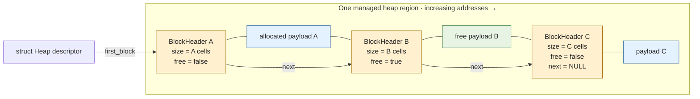
```mermaid
flowchart LR
    ROOT["struct Heap descriptor"] -->|first_block| H1

    subgraph ARENA["One managed heap region · increasing addresses →"]
        direction LR
        H1["BlockHeader A<br/>size = A cells<br/>free = false"] --- P1["allocated payload A"]
        P1 --- H2["BlockHeader B<br/>size = B cells<br/>free = true"]
        H2 --- P2["free payload B"]
        P2 --- H3["BlockHeader C<br/>size = C cells<br/>free = false<br/>next = NULL"]
        H3 --- P3["payload C"]
    end

    H1 -->|next| H2
    H2 -->|next| H3

    classDef header fill:#fff0cf,stroke:#a66b00,color:#242424
    classDef payload fill:#e4f1ff,stroke:#3d6fa3,color:#242424
    classDef free fill:#e7f4e4,stroke:#4d874a,color:#242424
    class H1,H2,H3 header
    class P1,P3 payload
    class P2 free
```

[`Heap.first_block`](common/heap.header#L12) and each
[`BlockHeader.next`](common/heap.header#L8) point to headers. If adjacent free
blocks are merged, their payloads and the intervening header become one larger
free block. The later heap-type sections apply this representation to the
Kernel Heap, Process and Shared Data Heap, and User Process Heap.

| Field | Meaning | Used by |
| --- | --- | --- |
| [`BlockHeader.size`](common/heap.header#L6) | Number of usable cells after this header, excluding the header itself | First initialized by [`heap_init_region()`](common/heap.picoc#L49), read by [`heap_alloc_from()`](common/heap.picoc#L65), read/changed by [`heap_split_block()`](common/heap.picoc#L14), [`heap_merge_free_blocks()`](common/heap.picoc#L30), and [`heap_realloc_from()`](common/heap.picoc#L87) |
| [`BlockHeader.free`](common/heap.header#L7) | Whether the associated cells may satisfy an allocation | First initialized by [`heap_init_region()`](common/heap.picoc#L49), initialized for new split headers by [`heap_split_block()`](common/heap.picoc#L14), read/changed by [`heap_alloc_from()`](common/heap.picoc#L65), changed by [`heap_free_from()`](common/heap.picoc#L146), read by [`heap_realloc_from()`](common/heap.picoc#L87) and [`heap_merge_free_blocks()`](common/heap.picoc#L30) |
| [`BlockHeader.next`](common/heap.header#L8) | Address of the next in-region header, or `NULL`. Splitting inserts and merging removes links | First initialized by [`heap_init_region()`](common/heap.picoc#L49), read by [`heap_alloc_from()`](common/heap.picoc#L65), read/changed by [`heap_split_block()`](common/heap.picoc#L14), [`heap_merge_free_blocks()`](common/heap.picoc#L30), and [`heap_realloc_from()`](common/heap.picoc#L87) |
| [`Heap.first_block`](common/heap.header#L12) | First header in the managed region, the descriptor owns no separate block array | First initialized by [`heap_init_region()`](common/heap.picoc#L49), read by [`heap_alloc_from()`](common/heap.picoc#L65) and [`heap_merge_free_blocks()`](common/heap.picoc#L30). Reallocation/freeing reach it through these functions |

[`3.6.3 Allocation and repeated coalescing example`](#363-allocation-and-repeated-coalescing-example)
follows these sizes and links through an allocation and two frees.

## 3.2 SRAM image and heap hierarchy
[\[↑ TOC\]](#contents)

PicoOS uses one physical SRAM address space and three allocator contexts. The
kernel heap and the Process and Shared Data Heap are peer regions managed by
kernel globals. A userspace heap is nested inside every process-image payload.
Sizes are RETI memory cells, and every PicoC scalar occupies one 32-bit cell.

| Heap context | Descriptor storage | Managed payloads | Interface |
| --- | --- | --- | --- |
| Kernel heap | [`kernel_heap`](kernel/kmalloc.picoc#L7) in kernel `.data` | PCBs, paths, descriptor tables, shared-memory metadata, and other kernel objects | [`kmalloc()`](kernel/kmalloc.picoc#L23) / [`kfree()`](kernel/kmalloc.picoc#L38) |
| Process and Shared Data Heap | [`process_memory_heap`](kernel/pmalloc.picoc#L7) in kernel `.data` | Whole process images and shared-memory data regions | [`pmalloc()`](kernel/pmalloc.picoc#L20) / [`pfree()`](kernel/pmalloc.picoc#L47) |
| One userspace heap per process image | [`process_heap`](library/stdlib/malloc.picoc#L6) in that image's `.data` | Allocations made by that process's linked userspace libraries | [`malloc()`](library/stdlib/malloc.picoc#L35) / [`free()`](library/stdlib/malloc.picoc#L49) |

The diagram moves from the complete SRAM layout to outer allocator blocks and
then into one process-image payload. `BH` denotes an in-region
[`BlockHeader`](common/heap.header#L5). The example block order is illustrative,
but the nesting and ownership are exact.

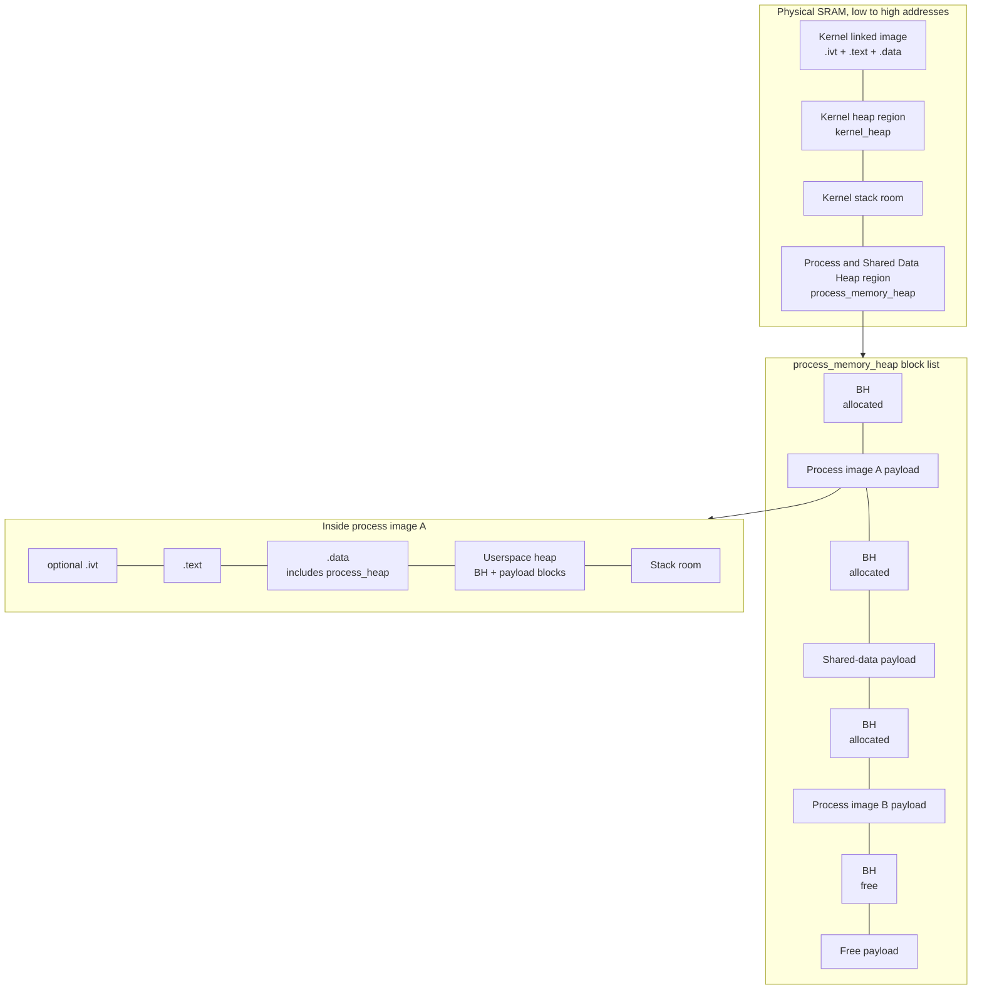
```mermaid
flowchart TB
    subgraph SRAM["Physical SRAM, low to high addresses"]
        direction LR
        KI["Kernel linked image<br/>.ivt + .text + .data"]
        KH["Kernel heap region<br/>kernel_heap"]
        KS["Kernel stack room"]
        PM["Process and Shared Data Heap region<br/>process_memory_heap"]
        KI --- KH --- KS --- PM
    end

    subgraph OUTER["process_memory_heap block list"]
        direction LR
        BH1["BH<br/>allocated"] --- P1["Process image A payload"]
        P1 --- BH2["BH<br/>allocated"] --- SH["Shared-data payload"]
        SH --- BH3["BH<br/>allocated"] --- P2["Process image B payload"]
        P2 --- BH4["BH<br/>free"] --- FREE["Free payload"]
    end

    subgraph IMAGE["Inside process image A"]
        direction LR
        PI["optional .ivt"] --- PT[".text"] --- PD[".data<br/>includes process_heap"]
        PD --- PH["Userspace heap<br/>BH + payload blocks"] --- PS["Stack room"]
    end

    PM --> OUTER
    P1 --> IMAGE
```

Freeing a userspace allocation changes only the inner list rooted at that
image's [`process_heap`](library/stdlib/malloc.picoc#L6). Releasing the complete
process calls [`pfree()`](kernel/pmalloc.picoc#L47) on its outer payload and
therefore returns the entire image, including its inner heap and stack room, to
[`process_memory_heap`](kernel/pmalloc.picoc#L7).

## 3.3 Kernel memory and kernel heap
[\[↑ TOC\]](#contents)

The linked kernel image owns the fixed kernel heap and stack reservations that
precede the dynamic Process and Shared Data Heap region. This section first places
those ranges in SRAM and then expands the kernel heap into allocator blocks.

### 3.3.1 Kernel SRAM map
[\[↑ TOC\]](#contents)

The checked-in [`kernel/memory_constants.header`](kernel/memory_constants.header)
and generated [`kernel/kernel.sections`](kernel/kernel.sections) currently give
the following offsets relative to [`SRAM_BASE`](kernel/memory_constants.header#L1).
They move when linked kernel code or data changes.

| Larger part | SRAM offset | Section or region | Contents |
| --- | ---: | --- | --- |
| Linked kernel image | `0..4` | `.ivt` section | Five interrupt service routine addresses |
| Linked kernel image | `5..40765` | `.text` section | Kernel code, including interrupt service routines |
| Linked kernel image | `40766..41496` | `.data` section | Kernel globals, including [`kernel_heap`](kernel/kmalloc.picoc#L7) and [`process_memory_heap`](kernel/pmalloc.picoc#L7) |
| Kernel runtime reservation | `41497..45592` | Kernel heap region | 4096 cells managed by [`kernel_heap`](kernel/kmalloc.picoc#L7) |
| Kernel runtime reservation | `45593..48308` | Kernel stack room | Downward-growing stack ending at the initial free `SP` cell |
| Dynamic process/shared area | `48309..262143` | Process and Shared Data Heap region | Outer blocks for complete process images and shared data |

The grouped diagram distinguishes linked sections from reservations and the
later dynamic area. Widths are not proportional to range sizes.

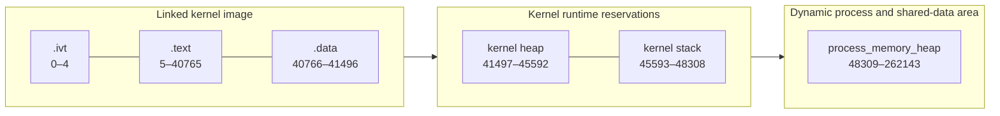
```mermaid
flowchart LR
    subgraph IMAGE["Linked kernel image"]
        direction LR
        IVT[".ivt<br/>0–4"] --- TEXT[".text<br/>5–40765"] --- DATA[".data<br/>40766–41496"]
    end
    subgraph RUNTIME["Kernel runtime reservations"]
        direction LR
        KHEAP["kernel heap<br/>41497–45592"] --- KSTACK["kernel stack<br/>45593–48308"]
    end
    subgraph DYNAMIC["Dynamic process and shared-data area"]
        PROCESS["process_memory_heap<br/>48309–262143"]
    end
    IMAGE --> RUNTIME --> DYNAMIC
```

The image payload is `.ivt`, `.text`, then `.data`, as explained in
[Section 1.1.6, Program sections, interrupt-vector entries, and linker placement](#116-program-sections-interrupt-vector-entries-and-linker-placement).
The five-word binary header is consumed by the
[`bootloader`](boot/bootloader.picoc#L42) and is not copied into `.ivt`. The heap
and stack reservations are regions rather than assembly sections.

[`init_kernel_heap()`](kernel/kmalloc.picoc#L17) uses
[`KERNEL_HEAP_START`](kernel/memory_constants.header#L3) and
[`KERNEL_HEAP_SIZE`](kernel/memory_constants.header#L4).
[`init_process_memory_heap()`](kernel/pmalloc.picoc#L9) spans
[`PROCESS_MEMORY_START`](kernel/memory_constants.header#L5) through
[`SRAM_MAX_ADDRESS_IN_MEMORY_MAP`](kernel/memory_constants.header#L2), inclusive.
The final kernel-heap cell is the stack boundary installed by
[`activate_kernel_stack_boundary()`](kernel/exception.picoc#L11). The stack
grows toward lower addresses from offset 48308. Absolute addresses add
`SRAM_BASE` to these offsets.

### 3.3.2 Kernel heap blocks and kernel objects
[\[↑ TOC\]](#contents)

[`kernel_heap`](kernel/kmalloc.picoc#L7) is a global descriptor in kernel
`.data`. Its [`first_block`](common/heap.header#L12) points to the header at
[`KERNEL_HEAP_START`](kernel/memory_constants.header#L3), not to the first
payload. The following example shows representative kernel allocations. The
exact order depends on runtime activity.

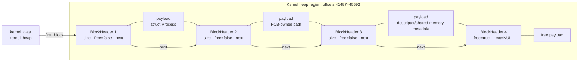
```mermaid
flowchart LR
    ROOT["kernel .data<br/>kernel_heap"] -->|first_block| H1
    subgraph REGION["Kernel heap region, offsets 41497–45592"]
        direction LR
        H1["BlockHeader 1<br/>size · free=false · next"] --- PCB["payload<br/>struct Process"]
        PCB --- H2["BlockHeader 2<br/>size · free=false · next"] --- PATH["payload<br/>PCB-owned path"]
        PATH --- H3["BlockHeader 3<br/>size · free=false · next"] --- META["payload<br/>descriptor/shared-memory metadata"]
        META --- H4["BlockHeader 4<br/>free=true · next=NULL"] --- FP["free payload"]
    end
    H1 -->|next| H2
    H2 -->|next| H3
    H3 -->|next| H4
```

[`create_process()`](kernel/process/process.picoc#L89) obtains each PCB with
[`kmalloc()`](kernel/kmalloc.picoc#L23), so PCB objects live in this region.
The PCB's [`base_address`](kernel/process/process.header#L34) points elsewhere,
to a process-image payload in the outer heap described next.

### 3.3.3 Kernel Heap allocator function reference
[\[↑ TOC\]](#contents)

The functions in [`kernel/kmalloc.picoc`](kernel/kmalloc.picoc) select
[`kernel_heap`](kernel/kmalloc.picoc#L7) for Kernel Heap allocations.
They call the shared allocator directly and add the kernel's panic policy for
failed positive-size requests. The table includes initialization and the
failure helper from the same file.

| Kernel / Library Function | Return value / status | Effects | Calls | Called by |
| --- | --- | --- | --- | --- |
| [`kmalloc(size)`](kernel/kmalloc.picoc#L23) (Kernel only) | Payload pointer, `NULL` for nonpositive size, panics if a positive request has no fit | Allocates through the list rooted at [`kernel_heap`](kernel/kmalloc.picoc#L7)'s [`first_block`](common/heap.header#L12), may insert a split header and marks the selected block allocated | [`require_kernel_heap_allocation()`](kernel/kmalloc.picoc#L9), [`heap_alloc_from()`](common/heap.picoc#L65) | **Kernel functions:** [`copy_shared_memory_name()`](kernel/shared_memory.picoc#L27), [`open_shared_memory()`](kernel/shared_memory.picoc#L92), [`map_shared_memory()`](kernel/shared_memory.picoc#L130), [`copy_process_path()`](kernel/process/process.picoc#L70), [`create_process()`](kernel/process/process.picoc#L89), [`begin_process_load()`](kernel/process/process_loader.picoc#L109), [`copy_file_path()`](kernel/filesystem/file_descriptor.picoc#L6), [`create_file_descriptor_table()`](kernel/filesystem/file_descriptor.picoc#L35) |
| [`krealloc(ptr, size)`](kernel/kmalloc.picoc#L31) (Kernel only) | Original/replacement payload pointer, `NULL` after freeing on nonpositive size, panics on positive-size failure | Resizes a Kernel Heap block, a null pointer requests a new allocation. Currently unused | [`require_kernel_heap_allocation()`](kernel/kmalloc.picoc#L9), [`heap_realloc_from()`](common/heap.picoc#L87) | — |
| [`kfree(ptr)`](kernel/kmalloc.picoc#L38) (Kernel only) | Returns no value | Marks the preceding [`BlockHeader.free`](common/heap.header#L7) true and coalesces free neighbors throughout the Kernel Heap. A null pointer has no effect | [`heap_free_from()`](common/heap.picoc#L146) | **Kernel functions:** [`destroy_shared_memory_entry()`](kernel/shared_memory.picoc#L69), [`open_shared_memory()`](kernel/shared_memory.picoc#L92), [`unlink_shared_memory()`](kernel/shared_memory.picoc#L151), [`release_process_shared_memory()`](kernel/shared_memory.picoc#L172), [`free_process_load()`](kernel/process/process_loader.picoc#L71), [`remove_process()`](kernel/process/process.picoc#L209), [`open_file_descriptor()`](kernel/filesystem/filesystem.picoc#L39), [`set_process_working_directory()`](kernel/filesystem/host_filesystem.picoc#L128), [`copy_file_descriptor()`](kernel/filesystem/file_descriptor.picoc#L82), [`destroy_file_descriptor_table()`](kernel/filesystem/file_descriptor.picoc#L118), [`close_file_descriptor()`](kernel/filesystem/file_descriptor.picoc#L146) |
| [`init_kernel_heap(void)`](kernel/kmalloc.picoc#L17) (Kernel only) | Returns no value | Initializes [`kernel_heap`](kernel/kmalloc.picoc#L7) over [`KERNEL_HEAP_START`](kernel/memory_constants.header#L3) and [`KERNEL_HEAP_SIZE`](kernel/memory_constants.header#L4), creating one free block | [`heap_init_region()`](common/heap.picoc#L49) | **Kernel functions:** [`main()`](kernel/kernel.picoc#L31) |
| [`require_kernel_heap_allocation(memory, size)`](kernel/kmalloc.picoc#L9) (Kernel only) | Returns the unchanged pointer, or does not return if a positive request failed | Converts a failed positive Kernel Heap allocation into a kernel panic | [`panic_kernel_heap_full()`](kernel/exception.picoc#L89) | **Kernel functions:** [`kmalloc()`](kernel/kmalloc.picoc#L23), [`krealloc()`](kernel/kmalloc.picoc#L31) |

## 3.4 Process and Shared Data Heap
[\[↑ TOC\]](#contents)

[`process_memory_heap`](kernel/pmalloc.picoc#L7) manages one region from
[`PROCESS_MEMORY_START`](kernel/memory_constants.header#L5) through the final
SRAM cell. Its first-fit list contains two payload categories. One category is
a complete process image. The other is the data cells of a named shared-memory
object. Process metadata and shared-memory metadata remain separate
[`kmalloc()`](kernel/kmalloc.picoc#L23) allocations in the kernel heap.

### 3.4.1 Process-image allocations
[\[↑ TOC\]](#contents)

[`pmalloc()`](kernel/pmalloc.picoc#L20) returns the payload immediately after an
outer header. [`Process.base_address`](kernel/process/process.header#L34) stores
that returned address. The header is allocator metadata and is not part of the
process image size recorded in the PCB.

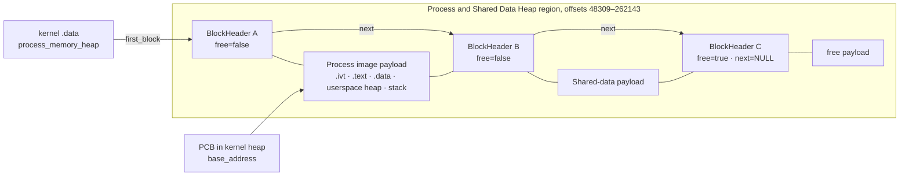
```mermaid
flowchart LR
    ROOT["kernel .data<br/>process_memory_heap"] -->|first_block| H1
    subgraph OUTER["Process and Shared Data Heap region, offsets 48309–262143"]
        direction LR
        H1["BlockHeader A<br/>free=false"] --- IMG["Process image payload<br/>.ivt · .text · .data · userspace heap · stack"]
        IMG --- H2["BlockHeader B<br/>free=false"] --- SHARED["Shared-data payload"]
        SHARED --- H3["BlockHeader C<br/>free=true · next=NULL"] --- FREE["free payload"]
    end
    H1 -->|next| H2
    H2 -->|next| H3
    PCB["PCB in kernel heap<br/>base_address"] --> IMG
```

[`load_process()`](kernel/process/process_loader.picoc#L305) and
[`begin_process_load()`](kernel/process/process_loader.picoc#L109) allocate
these image payloads. [`remove_process()`](kernel/process/process.picoc#L209)
passes the PCB's `base_address` to [`pfree()`](kernel/pmalloc.picoc#L47), which
marks the preceding outer header free and merges adjacent free blocks.

### 3.4.2 Shared-data allocations
[\[↑ TOC\]](#contents)

[`open_shared_memory()`](kernel/shared_memory.picoc#L92) also calls
[`pmalloc()`](kernel/pmalloc.picoc#L20), but stores the returned payload in
[`SharedMemoryEntry.address`](kernel/shared_memory.header#L11). The entry and
its name live in the kernel heap, while the shared cells live in this outer
heap alongside process images.

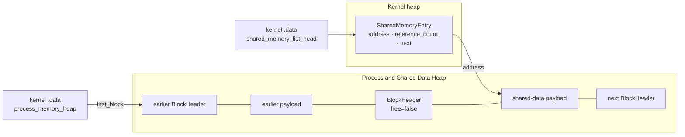
```mermaid
flowchart LR
    LIST["kernel .data<br/>shared_memory_list_head"] --> ENTRY
    subgraph KH["Kernel heap"]
        ENTRY["SharedMemoryEntry<br/>address · reference_count · next"]
    end
    ENTRY -->|address| PAYLOAD
    ROOT["kernel .data<br/>process_memory_heap"] -->|first_block| FIRST["earlier BlockHeader"]
    subgraph PM["Process and Shared Data Heap"]
        direction LR
        FIRST --- EARLIER["earlier payload"] --- HEADER["BlockHeader<br/>free=false"] --- PAYLOAD["shared-data payload"]
        PAYLOAD --- NEXT["next BlockHeader"]
    end
```

The payload has no nested userspace allocator. It remains one outer allocation
until [`destroy_shared_memory_entry()`](kernel/shared_memory.picoc#L69) calls
[`pfree()`](kernel/pmalloc.picoc#L47). Section [3.7, Shared-memory entries and
mappings](#37-shared-memory-entries-and-mappings) explains the entry and
attachment lifetimes that decide when destruction is allowed.

### 3.4.3 Process and Shared Data Heap allocator function reference
[\[↑ TOC\]](#contents)

The functions in [`kernel/pmalloc.picoc`](kernel/pmalloc.picoc) select
[`process_memory_heap`](kernel/pmalloc.picoc#L7) for complete process images
and shared data. They call the shared allocator directly, returning absolute
integer payload addresses or [`PMALLOC_INVALID_START`](kernel/pmalloc.header#L3)
instead of pointers or `NULL`. The current names
[`pmalloc()`](kernel/pmalloc.picoc#L20), [`prealloc()`](kernel/pmalloc.picoc#L31),
and [`pfree()`](kernel/pmalloc.picoc#L47) apply to both payload categories.

User-facing operations reach these kernel allocations through their syscalls.
[`load()`](library/unistd/process.picoc#L17) invokes process loading, whose
handlers reserve an image with [`pmalloc()`](kernel/pmalloc.picoc#L20).
[`shm_open()`](library/sys/mman/mman.picoc#L15) reaches
[`open_shared_memory()`](kernel/shared_memory.picoc#L92), which uses
[`kmalloc()`](kernel/kmalloc.picoc#L23) for metadata and
[`pmalloc()`](kernel/pmalloc.picoc#L20) for shared data.
[`mmap()`](library/sys/mman/mman.picoc#L23) reaches
[`map_shared_memory()`](kernel/shared_memory.picoc#L130), which allocates a
kernel attachment record with [`kmalloc()`](kernel/kmalloc.picoc#L23).

| Kernel / Library Function | Return value / status | Effects | Calls | Called by |
| --- | --- | --- | --- | --- |
| [`pmalloc(size)`](kernel/pmalloc.picoc#L20) (Kernel only) | Absolute payload address, or [`PMALLOC_INVALID_START`](kernel/pmalloc.header#L3) (`-1`) for nonpositive size or no fit | Allocates a complete process image or shared-data region through [`process_memory_heap`](kernel/pmalloc.picoc#L7), converts the common payload pointer to an integer address | [`heap_alloc_from()`](common/heap.picoc#L65) | **Kernel functions:** [`open_shared_memory()`](kernel/shared_memory.picoc#L92), [`begin_process_load()`](kernel/process/process_loader.picoc#L109), [`load_process()`](kernel/process/process_loader.picoc#L305) |
| [`prealloc(start, size)`](kernel/pmalloc.picoc#L31) (Kernel only) | Absolute original/replacement payload address, or [`PMALLOC_INVALID_START`](kernel/pmalloc.header#L3) (`-1`) for nonpositive size or no fit | Resizes an outer allocation. An invalid start requests a new allocation. Nonpositive size releases an existing block, failed positive growth preserves it. Currently unused | [`heap_realloc_from()`](common/heap.picoc#L87) | — |
| [`pfree(start)`](kernel/pmalloc.picoc#L47) (Kernel only) | Returns no value | Releases the outer block at the supplied payload address and coalesces free neighbors throughout [`process_memory_heap`](kernel/pmalloc.picoc#L7). An invalid start has no effect | [`heap_free_from()`](common/heap.picoc#L146) | **Kernel functions:** [`destroy_shared_memory_entry()`](kernel/shared_memory.picoc#L69), [`cancel_process_load()`](kernel/process/process_loader.picoc#L76), [`remove_process()`](kernel/process/process.picoc#L209) |
| [`init_process_memory_heap(void)`](kernel/pmalloc.picoc#L9) (Kernel only) | Returns no value | Initializes [`process_memory_heap`](kernel/pmalloc.picoc#L7) over [`PROCESS_MEMORY_START`](kernel/memory_constants.header#L5) through [`SRAM_MAX_ADDRESS_IN_MEMORY_MAP`](kernel/memory_constants.header#L2), inclusive, creating one free block | [`heap_init_region()`](common/heap.picoc#L49) | **Kernel functions:** [`main()`](kernel/kernel.picoc#L31) |

## 3.5 User-process memory and heap
[\[↑ TOC\]](#contents)

Every process-image payload contains linked program sections, a userspace heap
region, and stack room. This inner heap uses the same block format as the two
kernel-managed heaps, but its descriptor belongs to that process image.

### 3.5.1 Linked sections, heap, and stack ranges
[\[↑ TOC\]](#contents)

Inside one [`pmalloc()`](kernel/pmalloc.picoc#L20) process image, the
`.sections` and binary-header values have the following relationship. These are
linked offsets before the kernel adds the image's absolute base. The loader
receives the first two header values in
[`code_start`](kernel/process/process_loader.picoc#L308) and
[`data_start`](kernel/process/process_loader.picoc#L309).

| Process-image part | Relative address | Runtime role |
| --- | --- | --- |
| Optional `.ivt` section | Before `codesegment_start` when present | Process-local attributed data, ordinary PicoOS user images normally omit it |
| `.text` section | [`codesegment_start`](kernel/kernel.sections#L3) | Added to [`base_address`](kernel/process/process.header#L34) for initial `CS` and entry |
| `.data` section | [`datasegment_start`](kernel/kernel.sections#L4) | Added to [`base_address`](kernel/process/process.header#L34) for `DS`, contains process globals such as [`process_heap`](library/stdlib/malloc.picoc#L6) |
| Userspace heap region | [`heap_start`](kernel/process/process.header#L36) through `heap_start + heap_size - 1` | Contains the first [`BlockHeader`](common/heap.header#L5) and all `malloc()` payloads. Its final cell is the active stack boundary. |
| Stack room | Above the heap through [`stack_start`](kernel/process/process_loader.picoc#L121) | Initial free `SP` is at the high end and the stack grows toward the heap |

The compact map preserves the horizontal address order while also showing the
descriptor and PCB fields that identify the inner heap.

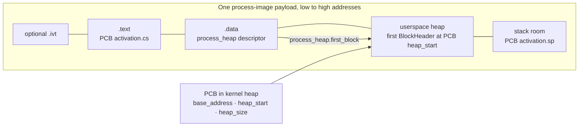
```mermaid
flowchart LR
    subgraph IMAGE["One process-image payload, low to high addresses"]
        direction LR
        IVT["optional .ivt"] --- TEXT[".text<br/>PCB activation.cs"] --- DATA[".data<br/>process_heap descriptor"]
        DATA --- H["userspace heap<br/>first BlockHeader at PCB heap_start"] --- STACK["stack room<br/>PCB activation.sp"]
    end
    PCB["PCB in kernel heap<br/>base_address · heap_start · heap_size"] --> H
    DATA -->|process_heap.first_block| H
```

The kernel relocates these offsets only by adding
[`Process.base_address`](kernel/process/process.header#L34). There is no MMU or
later relocation. The loader fills the PCB fields from the binary header, and
[`libstart`](library/start/libstart.picoc) obtains the absolute heap start and
size through the process-heap syscalls.

### 3.5.2 Per-process heap blocks and active context
[\[↑ TOC\]](#contents)

[`init_process_heap()`](library/stdlib/malloc.picoc#L18) stores the current
process's absolute heap range in that image's global
[`process_heap`](library/stdlib/malloc.picoc#L6). Its
[`first_block`](common/heap.header#L12) points to the first header, and each
header precedes its allocated or free payload.

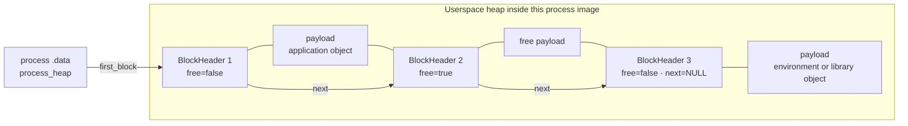
```mermaid
flowchart LR
    DESC["process .data<br/>process_heap"] -->|first_block| H1
    subgraph HEAP["Userspace heap inside this process image"]
        direction LR
        H1["BlockHeader 1<br/>free=false"] --- A["payload<br/>application object"]
        A --- H2["BlockHeader 2<br/>free=true"] --- F["free payload"]
        F --- H3["BlockHeader 3<br/>free=false · next=NULL"] --- E["payload<br/>environment or library object"]
    end
    H1 -->|next| H2
    H2 -->|next| H3
```

PicoOS does not replace one shared userspace-heap pointer during a context
switch. Each linked process image contains its own `process_heap` global at the
same image-relative `.data` location. The dispatcher selects a PCB and restores
that PCB's absolute [`activation.ds`](kernel/process/process.header#L29). RETI
global accesses then resolve through the selected `DS`, so library
[`malloc()`](library/stdlib/malloc.picoc#L35) reaches that process's descriptor.

```mermaid
flowchart LR
    ACTIVE["kernel .data<br/>active_process"] --> PCB["selected PCB<br/>activation.ds"]
    PCB -->|dispatcher restores| DS["CPU DS"]
    DS --> DA["Process A .data<br/>process_heap A"]
    DS -. after another switch .-> DB["Process B .data<br/>process_heap B"]
    DA --> HA["Process A heap blocks"]
    DB --> HB["Process B heap blocks"]
```

Thus changing [`active_process`](kernel/process/process.picoc#L9) and restoring
its activation changes which process image and heap globals the CPU addresses.
The detailed process-image view in [Section 4.3.1, Code, data, heap, and stack
placement](#431-code-data-heap-and-stack-placement) uses this same nesting.

### 3.5.3 User Process Heap allocator function reference
[\[↑ TOC\]](#contents)

The functions in [`library/stdlib/malloc.picoc`](library/stdlib/malloc.picoc)
select the calling image's [`process_heap`](library/stdlib/malloc.picoc#L6).
Their block operations run directly in the linked library code. Syscalls obtain
the initial heap bounds and handle failed positive-size requests.
The table includes these startup and failure helpers from the same file.

| Kernel / Library Function | Return value / status | Effects | Calls | Syscalls | Called by |
| --- | --- | --- | --- | --- | --- |
| [`malloc(size)`](library/stdlib/malloc.picoc#L35) (Library only) | Payload pointer, `NULL` for nonpositive size, process-heap-full exception if a positive request has no fit | Allocates through the calling image's [`process_heap`](library/stdlib/malloc.picoc#L6), searches and updates blocks directly in library code | [`require_process_heap_allocation()`](library/stdlib/malloc.picoc#L8), [`heap_alloc_from()`](common/heap.picoc#L65) | Process-heap-full on positive-size failure | **Library functions:** [`opendir()`](library/dirent/dirent.picoc#L8), [`copy_environment_variable()`](library/stdlib/env.picoc#L20), [`initialize_environment()`](library/stdlib/env.picoc#L97), [`setenv()`](library/stdlib/env.picoc#L126), [`clone_environment()`](library/stdlib/env.picoc#L205)<br>**User applications:** [`main()` in sed](user/sed.picoc#L67), [`read_environment()` in init](system/init.picoc#L19)<br>**Test programs (direct calls):** [`basic_heap_allocator_example.picoc`](test/basic_heap_allocator_example.picoc), [`basic_malloc.picoc`](test/basic_malloc.picoc), [`basic_free.picoc`](test/basic_free.picoc), [`basic_free_block_merging.picoc`](test/basic_free_block_merging.picoc), [`basic_realloc.picoc`](test/basic_realloc.picoc), [`basic_realloc_null_and_zero.picoc`](test/basic_realloc_null_and_zero.picoc), [`basic_string.picoc`](test/basic_string.picoc), [`exception_heap_full/heap_full.picoc`](test/exception_heap_full/heap_full.picoc), [`exercise_sheet_4_heap/launcher.picoc`](test/exercise_sheet_4_heap/launcher.picoc) |
| [`realloc(ptr, size)`](library/stdlib/malloc.picoc#L42) (Library only) | Original/replacement payload pointer, `NULL` after freeing on nonpositive size, process-heap-full exception on positive-size failure | Resizes a User Process Heap block, a null pointer requests a new allocation. Calls the common implementation directly | [`require_process_heap_allocation()`](library/stdlib/malloc.picoc#L8), [`heap_realloc_from()`](common/heap.picoc#L87) | Process-heap-full on positive-size failure | **Library functions:** [`store_environment_variable()`](library/stdlib/env.picoc#L67)<br>**Test programs (direct calls):** [`basic_realloc.picoc`](test/basic_realloc.picoc), [`basic_realloc_null_and_zero.picoc`](test/basic_realloc_null_and_zero.picoc) |
| [`free(ptr)`](library/stdlib/malloc.picoc#L49) (Library only) | Returns no value | Releases and coalesces blocks only in the calling image's [`process_heap`](library/stdlib/malloc.picoc#L6). A null pointer has no effect | [`heap_free_from()`](common/heap.picoc#L146) | None | **Library functions:** [`opendir()`](library/dirent/dirent.picoc#L8), [`closedir()`](library/dirent/dirent.picoc#L66), [`store_environment_variable()`](library/stdlib/env.picoc#L67), [`unsetenv()`](library/stdlib/env.picoc#L157), [`clearenv()`](library/stdlib/env.picoc#L194), [`destroy_environment()`](library/stdlib/env.picoc#L230)<br>**User applications:** [`main()` in sed](user/sed.picoc#L67), [`read_environment()` in init](system/init.picoc#L19)<br>**Test programs (direct calls):** [`basic_heap_allocator_example.picoc`](test/basic_heap_allocator_example.picoc), [`basic_free.picoc`](test/basic_free.picoc), [`basic_free_block_merging.picoc`](test/basic_free_block_merging.picoc), [`basic_realloc.picoc`](test/basic_realloc.picoc), [`exercise_sheet_4_heap/launcher.picoc`](test/exercise_sheet_4_heap/launcher.picoc) |
| [`init_process_heap(void)`](library/stdlib/malloc.picoc#L18) (Library only) | Returns no value | Gets the current process's absolute heap start and size, then initializes [`process_heap`](library/stdlib/malloc.picoc#L6) and its first free header | [`heap_init_region()`](common/heap.picoc#L49) | Process-heap-start, process-heap-size | **Library functions:** [`start_process()`](library/start/start.picoc#L7)<br>**Test programs (direct calls):** [`basic_heap_allocator_example.picoc`](test/basic_heap_allocator_example.picoc), [`basic_environment.picoc`](test/basic_environment.picoc), [`basic_malloc.picoc`](test/basic_malloc.picoc), [`basic_free.picoc`](test/basic_free.picoc), [`basic_free_block_merging.picoc`](test/basic_free_block_merging.picoc), [`basic_realloc.picoc`](test/basic_realloc.picoc), [`basic_realloc_null_and_zero.picoc`](test/basic_realloc_null_and_zero.picoc), [`basic_string.picoc`](test/basic_string.picoc) |
| [`require_process_heap_allocation(memory, size)`](library/stdlib/malloc.picoc#L8) (Library only) | Returns the unchanged pointer, or terminates the process if a positive request failed | Invokes the process-heap-full syscall only when the common allocator returns `NULL` for a positive request | No C calls | Process-heap-full on positive-size failure | **Library functions:** [`malloc()`](library/stdlib/malloc.picoc#L35), [`realloc()`](library/stdlib/malloc.picoc#L42) |

## 3.6 Heap and allocator function reference
[\[↑ TOC\]](#contents)

[`common/heap.picoc`](common/heap.picoc) implements the allocator used by all
three heaps. Its functions take a [`Heap`](common/heap.header#L11) descriptor
rather than choosing a region or an allocation-failure policy themselves.
The heap-specific interfaces are documented in
[`3.3.3 Kernel Heap allocator function reference`](#333-kernel-heap-allocator-function-reference),
[`3.4.3 Process and Shared Data Heap allocator function reference`](#343-process-and-shared-data-heap-allocator-function-reference),
and [`3.5.3 User Process Heap allocator function reference`](#353-user-process-heap-allocator-function-reference).

### 3.6.1 Common allocator linkage and function reference
[\[↑ TOC\]](#contents)

The kernel links [`common/heap.picoc`](common/heap.picoc) as a separate source.
Userspace [`libstdlib`](library/stdlib/libstdlib.picoc#L1) includes that same
source, giving each linked process image its own allocator code and
[`process_heap`](library/stdlib/malloc.picoc#L6) descriptor. The arrows below
are direct C calls within each target. Library block searches, splits, and
merges execute in the calling process image.

```mermaid
flowchart TB
    subgraph K["Kernel target"]
        KW["kmalloc / krealloc / kfree<br/>kernel_heap"] --> KC["common/heap.picoc<br/>heap_alloc_from / heap_realloc_from / heap_free_from"]
        PW["pmalloc / prealloc / pfree<br/>process_memory_heap"] --> KC
    end
    subgraph L["Each userspace target: libstdlib"]
        LW["malloc / realloc / free<br/>process_heap in this image"] --> LC["same common/heap.picoc source<br/>heap_alloc_from / heap_realloc_from / heap_free_from"]
    end
```

The table covers only [`common/heap.picoc`](common/heap.picoc). Sizes and copy
counts are RETI cells. Every header is an in-region
[`BlockHeader`](common/heap.header#L5) with three cells.
For a non-null payload pointer, reallocation and freeing assume a valid
allocation from the supplied heap. They recover its header by pointer
arithmetic, without searching for it or checking ownership.

| Kernel / Library Function | Return value / status | Effects | Calls | Called by |
| --- | --- | --- | --- | --- |
| [`heap_init_region(heap, start, cell_count)`](common/heap.picoc#L49) (Shared/Common) | Returns no value | For a null heap, does nothing. For a null start or at most three cells, sets [`Heap.first_block`](common/heap.header#L12) to `NULL`. Otherwise writes one header with [`size`](common/heap.header#L6) = cell count minus three, [`free`](common/heap.header#L7) = true, [`next`](common/heap.header#L8) = `NULL`, and stores its address in the descriptor | — | **Library functions (directly linked):** [`init_process_heap()`](library/stdlib/malloc.picoc#L18)<br>**Kernel functions (directly linked):** [`init_kernel_heap()`](kernel/kmalloc.picoc#L17), [`init_process_memory_heap()`](kernel/pmalloc.picoc#L9)<br>**Test programs (direct calls):** [`basic_heap_allocator_example.picoc`](test/basic_heap_allocator_example.picoc) |
| [`heap_alloc_from(heap, size)`](common/heap.picoc#L65) (Shared/Common) | Payload pointer, or `NULL` for a null heap, nonpositive size, or no fit | Scans from [`Heap.first_block`](common/heap.header#L12) through [`next`](common/heap.header#L8), selects the first free block with enough payload cells, optionally splits it, sets [`free`](common/heap.header#L7) false, and returns the address immediately after the header | [`heap_split_block()`](common/heap.picoc#L14) | **Library functions (directly linked):** [`malloc()`](library/stdlib/malloc.picoc#L35)<br>**Kernel functions (directly linked):** [`kmalloc()`](kernel/kmalloc.picoc#L23), [`pmalloc()`](kernel/pmalloc.picoc#L20)<br>**Shared/common functions (directly linked):** [`heap_realloc_from()`](common/heap.picoc#L87) |
| [`heap_realloc_from(heap, ptr, size)`](common/heap.picoc#L87) (Shared/Common) | Original/replacement payload pointer, or `NULL` for a null heap, nonpositive size, or failed replacement allocation | With a valid heap, nonpositive size frees the block, a null pointer allocates. Otherwise shrinks/splits in place and coalesces, grows into only the immediate free neighbor if sufficient, or allocates/copies/frees. Failed replacement allocation preserves the old block | [`heap_free_from()`](common/heap.picoc#L146), [`heap_alloc_from()`](common/heap.picoc#L65), [`heap_split_block()`](common/heap.picoc#L14), [`heap_merge_free_blocks()`](common/heap.picoc#L30), [`heap_copy_cells()`](common/heap.picoc#L3) | **Library functions (directly linked):** [`realloc()`](library/stdlib/malloc.picoc#L42)<br>**Kernel functions (directly linked):** [`krealloc()`](kernel/kmalloc.picoc#L31), [`prealloc()`](kernel/pmalloc.picoc#L31) |
| [`heap_free_from(heap, ptr)`](common/heap.picoc#L146) (Shared/Common) | Returns no value | For a null heap or pointer, does nothing. Otherwise finds the preceding header, sets [`free`](common/heap.header#L7) true, and scans the entire heap to coalesce consecutive free blocks. Does not erase payload contents | [`heap_merge_free_blocks()`](common/heap.picoc#L30) | **Library functions (directly linked):** [`free()`](library/stdlib/malloc.picoc#L49)<br>**Kernel functions (directly linked):** [`kfree()`](kernel/kmalloc.picoc#L38), [`pfree()`](kernel/pmalloc.picoc#L47)<br>**Shared/common functions (directly linked):** [`heap_realloc_from()`](common/heap.picoc#L87) |
| [`heap_split_block(block, size)`](common/heap.picoc#L14) (Shared/Common) | Returns no value | Splits only if [`size`](common/heap.header#L6) ≥ requested size + three header cells + one payload cell. Inserts a free header after the requested payload, links it to the old successor, then updates the original size and successor. Otherwise leaves the block unchanged. Does not change the original free flag | — | **Shared/common functions (directly linked):** [`heap_alloc_from()`](common/heap.picoc#L65), [`heap_realloc_from()`](common/heap.picoc#L87) |
| [`heap_merge_free_blocks(heap)`](common/heap.picoc#L30) (Shared/Common) | Returns no value | For a null heap, does nothing. Scans from [`Heap.first_block`](common/heap.header#L12). When current and next are free, adds three header cells and the next payload to the current size, bypasses the next header, and rechecks the same current header. Advances only when the pair cannot merge | — | **Shared/common functions (directly linked):** [`heap_realloc_from()`](common/heap.picoc#L87), [`heap_free_from()`](common/heap.picoc#L146) |
| [`heap_copy_cells(destination, source, count)`](common/heap.picoc#L3) (Shared/Common) | Returns no value | Copies count cells in increasing index order from source to destination. Used for the overlap between old payload size and requested replacement size | — | **Shared/common functions (directly linked):** [`heap_realloc_from()`](common/heap.picoc#L87) |

### 3.6.2 Reallocation decisions
[\[↑ TOC\]](#contents)

The decision graph follows [`heap_realloc_from()`](common/heap.picoc#L87) for a valid existing block
and a positive requested size. It shows when the payload address stays the same and when allocation,
copying, and freeing move it. A failed replacement allocation leaves the original block intact. A
null input pointer instead uses ordinary allocation, a nonpositive size frees the block and returns
`NULL`.

```mermaid
flowchart TD
    R["Resize an existing block"] --> FIT{"Current payload large enough?"}
    FIT -->|Yes| SHRINK["heap_split_block<br/>heap_merge_free_blocks"]
    SHRINK --> SAME["Return original pointer"]
    FIT -->|No| NEXT{"Immediate next block free and combined space enough?"}
    NEXT -->|Yes| GROW["Absorb next header and payload<br/>heap_split_block"]
    GROW --> SAME
    NEXT -->|No| ALLOC["heap_alloc_from"]
    ALLOC --> OK{"Allocation succeeded?"}
    OK -->|No| KEEP["Return NULL<br/>Old block remains allocated"]
    OK -->|Yes| COPY["heap_copy_cells<br/>heap_free_from old block"]
    COPY --> NEW["Return replacement pointer"]
```

In-place growth absorbs at most one successor and then optionally splits the
result. It returns without another merge scan. Shrinking calls
[`heap_merge_free_blocks()`](common/heap.picoc#L30) after splitting, and moving
calls it through [`heap_free_from()`](common/heap.picoc#L146). These paths use
the same repeated merge loop demonstrated next.

### 3.6.3 Allocation and repeated coalescing example
[\[↑ TOC\]](#contents)

This example follows one 52-cell heap through allocation and two frees using
[`heap_alloc_from()`](common/heap.picoc#L65) and
[`heap_free_from()`](common/heap.picoc#L146).
[`3.1 Heap block layout and allocation algorithm`](#31-heap-block-layout-and-allocation-algorithm)
defines the descriptor and header fields used here. Yellow rectangles are
headers, blue payloads are allocated, and green payloads are free. Each header
and payload has its own boundary. Curved arrows show
[`BlockHeader.next`](common/heap.header#L8) pointing to the following header,
and the final header stores `NULL`. The orange outline marks the selected or
changed block. Widths leave room for header fields and are not proportional to
cell counts, but memory boundaries stay in the same positions between steps.
Offsets below the region are in cells relative to its start.

#### 3.6.3.1 Initial state and first-fit search
[\[↑ TOC\]](#contents)

The starting list has four blocks, A through D. Their payload sizes are 8, 4,
12, and 16 cells. With four three-cell headers, this occupies exactly
`8 + 4 + 12 + 16 + 4 × 3 = 52` cells.
This state can be built by initializing the region, allocating those four
sizes in order, then freeing B and D. Allocated C keeps the two free blocks
apart, so the initial state does not require unmerged free neighbors.

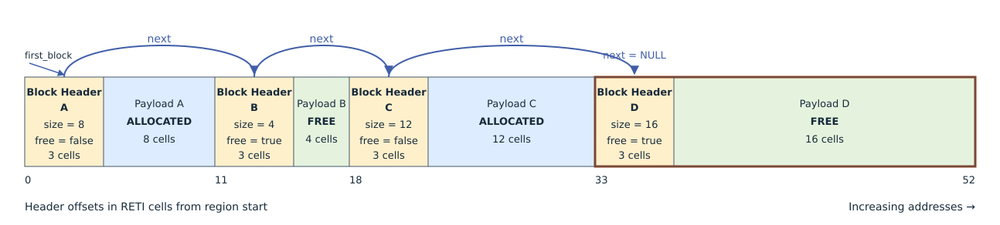

For an 11-cell request, [`heap_alloc_from()`](common/heap.picoc#L65) begins at
[`Heap.first_block`](common/heap.header#L12), which points to Header A.
It skips A because it is allocated, follows A's link to B, and skips B because
its four payload cells are too few. C is allocated, so the next candidate is
D. D is free and has 16 payload cells. First fit selects D immediately.

#### 3.6.3.2 Allocation splits D
[\[↑ TOC\]](#contents)

[`heap_alloc_from()`](common/heap.picoc#L65) calls
[`heap_split_block()`](common/heap.picoc#L14) for D. The split condition
`16 >= 11 + 3 + 1` is true, so D becomes an 11-cell allocation followed by a
new free block. The remainder is labeled D′ to show that it comes from D.
Header D stays at offset 33, its [`size`](common/heap.header#L6) becomes 11,
and the allocator sets its [`free`](common/heap.header#L7) to false.
The returned pointer is D's payload at offset 36.

Header D′ is written at `36 + 11 = 47`. Its
[`size`](common/heap.header#L6) is `16 − 11 − 3 = 2`, its
[`free`](common/heap.header#L7) is true, and its
[`next`](common/heap.header#L8) inherits D's old `NULL` link.
D's [`next`](common/heap.header#L8) now points to D′.
The original 16-cell payload is divided into 11 allocated payload cells,
three cells for Header D′, and two free payload cells at offsets 50 and 51.
A, B, and C do not move, and their links remain unchanged.

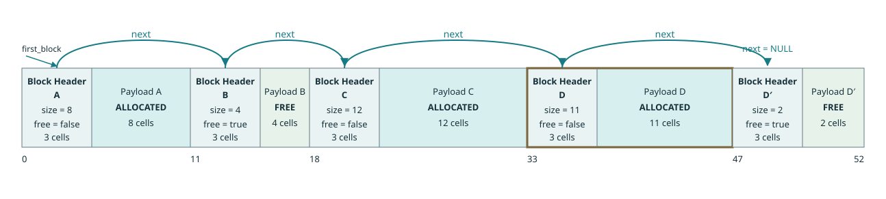

> **Note:** If the request were 14 cells instead, the split condition
> `16 >= 14 + 3 + 1` would be false. The remaining two cells would not fit a
> three-cell header plus at least one usable payload cell. The allocator would
> therefore allocate D's entire 16-cell payload without splitting it, leaving
> its [`size`](common/heap.header#L6) and [`next`](common/heap.header#L8) unchanged.

#### 3.6.3.3 Free D and merge its remainder
[\[↑ TOC\]](#contents)

Freeing the returned pointer lets [`heap_free_from()`](common/heap.picoc#L146)
recover Header D by subtracting one header from the payload pointer. It first
sets D's [`free`](common/heap.header#L7) to true without changing any sizes or
links. This diagram shows that intermediate state before the merge scan.

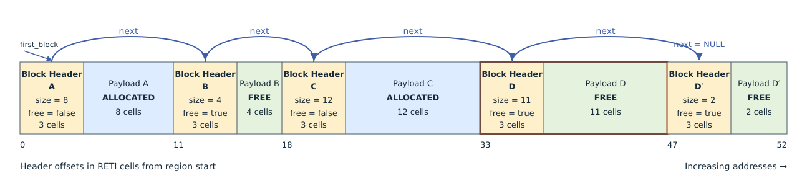

[`heap_merge_free_blocks()`](common/heap.picoc#L30) scans from A rather than
starting at D. It advances past A/B, B/C, and C/D because each pair includes
an allocated block. At D/D′ both headers say free, so D absorbs the header and
payload of D′. D's [`size`](common/heap.header#L6) becomes `11 + 3 + 2 = 16`,
and its [`next`](common/heap.header#L8) inherits the `NULL` link from D′.
The three cells of Header D′ become usable space within D's payload. D′ is no
longer a list node, and its former metadata is not cleared.

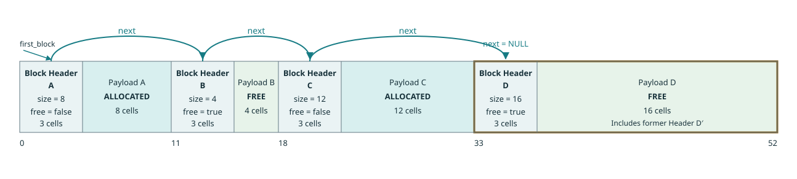

The loop keeps D as its current header, but D's
[`next`](common/heap.header#L8) is now `NULL`, so the loop ends.
The heap has returned to its four-block initial state.

#### 3.6.3.4 Free C and merge repeatedly at B
[\[↑ TOC\]](#contents)

A second free releases C's payload at offset 21.
[`heap_free_from()`](common/heap.picoc#L146) marks Header C free, producing
three consecutive free blocks B, C, and D. This state exists inside the free
operation before its merge scan.

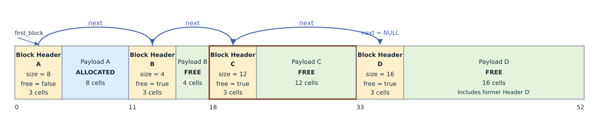

The scan skips A/B and reaches B/C. Both are free, so B absorbs C's header and
payload. B's [`size`](common/heap.header#L6) becomes `4 + 3 + 12 = 19` and its
[`next`](common/heap.header#L8) becomes D. Header C is now part of B's payload.

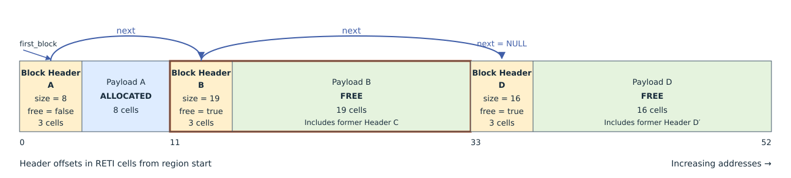

The loop does not advance after that merge. It checks the new B/D pair with
B still current, finds both free, and merges again. B's
[`size`](common/heap.header#L6) becomes `19 + 3 + 16 = 38` and its
[`next`](common/heap.header#L8) becomes `NULL`, inherited from D. The 38-cell
payload at offsets 14 through 51 now includes the former C and D headers and
their payloads, including the cells formerly occupied by Header D′.
This is repeated iteration at the same header, not recursion.

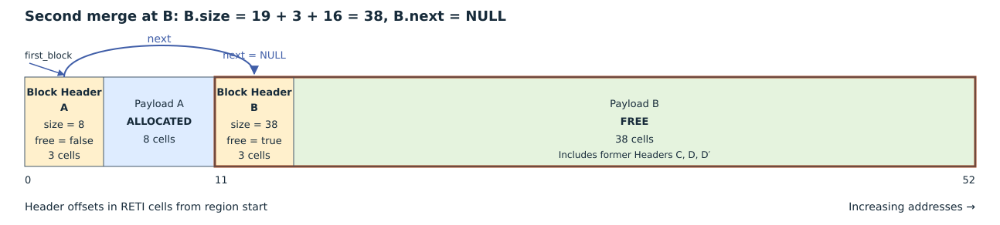

The loop still keeps B as its current header. Because B's
[`next`](common/heap.header#L8) is now `NULL`, the loop condition is false and
the scan finishes. The final list is A → B, and its two headers plus payloads
still occupy `8 + 38 + 2 × 3 = 52` cells.
A remains allocated and does not move, and
[`Heap.first_block`](common/heap.header#L12) continues to point to A throughout
the example.

The merge loop checks the two free flags, relying on the list's headers being
in contiguous address order. It does not compare addresses separately.
By rechecking the same header after every merge and continuing the scan,
[`heap_merge_free_blocks()`](common/heap.picoc#L30) combines every consecutive
free run before it returns.
The Library test
[`basic_heap_allocator_example.picoc`](test/basic_heap_allocator_example.picoc)
checks this 52-cell example through the actual library
[`malloc()`](library/stdlib/malloc.picoc#L35) and
[`free()`](library/stdlib/malloc.picoc#L49) functions, including first fit,
splitting, repeated merging, preserved allocated data, and the no-split note.
The editable diagrams are generated by
[`documentation/generate_heap_allocator_diagrams.py`](documentation/generate_heap_allocator_diagrams.py).

## 3.7 Shared-memory entries and mappings
[\[↑ TOC\]](#contents)

Shared memory gives multiple processes access to the same physical cells, so a value written by
one process is visible to the others that map the region. PicoOS allocates each shared-memory data
region with [`pmalloc()`](kernel/pmalloc.picoc#L20) from the same Process and Shared Data Heap that holds
complete process images. A process image and a shared-memory region are separate allocations, but
both occupy the payload of a [`BlockHeader`](common/heap.header#L5) in that heap. The kernel keeps a
named entry for each shared region and a separate attachment record in every process that maps it.

### 3.7.1 Named entries and per-process attachments
[\[↑ TOC\]](#contents)

Each [`SharedMemoryEntry`](kernel/shared_memory.header#L8) represents one named shared-memory data
region. The kernel's linked list contains one entry for each region. A
[`SharedMemoryAttachment`](kernel/shared_memory.header#L17) represents one process's mapping of
an entry. Attachments are linked from the owning PCB's
[`shared_memory_attachments`](kernel/process/process.header#L55) field, they refer to an entry but
do not own it.

The registry roots are listed with the other globals in
[Section 8.3, Kernel global variables and process-list roots](#83-kernel-global-variables-and-process-list-roots).
[`shared_memory_list_head`](kernel/shared_memory.picoc#L6) points to the first
entry or is `NULL` when the list is empty. [`next_shared_memory_id`](kernel/shared_memory.picoc#L7)
supplies the next unique numeric ID when
[`open_shared_memory()`](kernel/shared_memory.picoc#L92) creates an entry.
[`initialize_shared_memory()`](kernel/shared_memory.picoc#L9) initializes both globals during
kernel startup. The two field tables explain the kernel's linked list first and each process’s
attachment list second.

```c
struct SharedMemoryEntry {
    char *name;
    int id;
    void *address;
    int reference_count;
    bool unlink_requested;
    struct SharedMemoryEntry *next;
};

struct SharedMemoryAttachment {
    struct SharedMemoryEntry *entry;
    struct SharedMemoryAttachment *next;
};
```

[`open_shared_memory()`](kernel/shared_memory.picoc#L92) creates an entry and
name separately from its shared-data region; the entry's
[`address`](kernel/shared_memory.header#L11) reaches that data.
[`map_shared_memory()`](kernel/shared_memory.picoc#L130) adds an attachment to
the current PCB's [`shared_memory_attachments`](kernel/process/process.header#L55)
list and increments the entry's mapping count. Every mapper receives the same
absolute data address. The allocation regions and lifetimes are summarized in
[Section 8.1, Memory layout, allocation sources, and lifetimes](#81-memory-layout-allocation-sources-and-lifetimes).

The [`SharedMemoryAttachment`](kernel/shared_memory.header#L17) is needed because a
[`SharedMemoryEntry`](kernel/shared_memory.header#L8) alone does not say which process must release
a mapping during process cleanup. If two processes map one ID, there is one
[`SharedMemoryEntry`](kernel/shared_memory.header#L8) and two
[`SharedMemoryAttachment`](kernel/shared_memory.header#L17) records, one linked from each PCB. An
attachment does not hold shared bytes or give its process a different address, it records which
entry that process maps.

| Field | Meaning | Used by |
| --- | --- | --- |
| [`SharedMemoryEntry.name`](kernel/shared_memory.header#L9) | Kernel-owned lookup name, freed and set to `NULL` on unlink | First initialized by [`open_shared_memory()`](kernel/shared_memory.picoc#L92), read by [`find_shared_memory_by_name()`](kernel/shared_memory.picoc#L45), freed by [`unlink_shared_memory()`](kernel/shared_memory.picoc#L151) and [`destroy_shared_memory_entry()`](kernel/shared_memory.picoc#L69) |
| [`SharedMemoryEntry.id`](kernel/shared_memory.header#L10) | Numeric open/map handle | First initialized by [`open_shared_memory()`](kernel/shared_memory.picoc#L92), looked up by [`map_shared_memory()`](kernel/shared_memory.picoc#L130) |
| [`SharedMemoryEntry.address`](kernel/shared_memory.header#L11) | Absolute start of the [`pmalloc()`](kernel/pmalloc.picoc#L20) shared-memory data region | First initialized by [`open_shared_memory()`](kernel/shared_memory.picoc#L92), returned by [`map_shared_memory()`](kernel/shared_memory.picoc#L130) and freed by [`destroy_shared_memory_entry()`](kernel/shared_memory.picoc#L69) |
| [`SharedMemoryEntry.reference_count`](kernel/shared_memory.header#L12) | Attachment count, not distinct PID count | First initialized by [`open_shared_memory()`](kernel/shared_memory.picoc#L92), changed by [`map_shared_memory()`](kernel/shared_memory.picoc#L130) and [`release_process_shared_memory()`](kernel/shared_memory.picoc#L172), checked by [`unlink_shared_memory()`](kernel/shared_memory.picoc#L151) |
| [`SharedMemoryEntry.unlink_requested`](kernel/shared_memory.header#L13) | Defers destruction until the last attachment disappears | First initialized by [`open_shared_memory()`](kernel/shared_memory.picoc#L92), set by [`unlink_shared_memory()`](kernel/shared_memory.picoc#L151) and checked by [`release_process_shared_memory()`](kernel/shared_memory.picoc#L172) |
| [`SharedMemoryEntry.next`](kernel/shared_memory.header#L14) | Link to the next entry in the kernel's linked list | First initialized by [`open_shared_memory()`](kernel/shared_memory.picoc#L92), traversed by [`find_shared_memory_by_name()`](kernel/shared_memory.picoc#L45), [`find_shared_memory_by_id()`](kernel/shared_memory.picoc#L57), and [`destroy_shared_memory_entry()`](kernel/shared_memory.picoc#L69) |

The attachment table shows how a mapping records its contribution to the entry’s lifetime without
owning the entry itself.

| Field | Meaning | Used by |
| --- | --- | --- |
| [`SharedMemoryAttachment.entry`](kernel/shared_memory.header#L18) | Non-owning pointer to the linked-list entry whose reference count this mapping contributes to | First initialized by [`map_shared_memory()`](kernel/shared_memory.picoc#L130), released by [`release_process_shared_memory()`](kernel/shared_memory.picoc#L172) |
| [`SharedMemoryAttachment.next`](kernel/shared_memory.header#L19) | Link in one PCB's [`shared_memory_attachments`](kernel/process/process.header#L55) list | First initialized by [`map_shared_memory()`](kernel/shared_memory.picoc#L130), traversed by [`release_process_shared_memory()`](kernel/shared_memory.picoc#L172) |

### 3.7.2 Mapping, unlinking, and deferred destruction
[\[↑ TOC\]](#contents)

With the entry and attachment roles established, the public operations define their lifetime.
[`shm_unlink()`](library/sys/mman/mman.picoc#L27) frees the name and marks the existing
[`SharedMemoryEntry`](kernel/shared_memory.header#L8) for destruction, so the object can no longer
be obtained through that name. Existing attachments and their absolute data addresses remain
valid. The old numeric ID can also still be mapped while the entry exists, whereas opening the
former name creates a new entry. If no attachment exists at unlink time, destruction is immediate.

There is no `munmap()` operation. Every successful [`mmap()`](library/sys/mman/mman.picoc#L23)
therefore adds one attachment and increments
[`SharedMemoryEntry.reference_count`](kernel/shared_memory.header#L12), even when one process maps
the same ID more than once. When [`remove_process()`](kernel/process/process.picoc#L209) removes a
process, [`release_process_shared_memory()`](kernel/shared_memory.picoc#L172) uses that PCB's
attachment list to find each referenced entry, free the attachment, and decrement the count once
for that mapping. The entry and its [`pmalloc()`](kernel/pmalloc.picoc#L20) data region are destroyed
only after unlink has been requested and the count reaches zero. The graph shows the structure
before cleanup, with two attachments accounting for a count of 2.

```mermaid
flowchart LR
    P1["PCB A"] --> A1["attachment"]
    P2["PCB B"] --> A2["attachment"]
    A1 --> E["SharedMemoryEntry<br/>count = 2"]
    A2 --> E
    E --> M["shared-memory data<br/>pmalloc"]
    G["shared-memory list head"] --> E
```

[`shm_open()`](library/sys/mman/mman.picoc#L15) returns a numeric ID, and
[`mmap()`](library/sys/mman/mman.picoc#L23) returns the shared address. The following PicoC launcher
opens and maps one cell, writes `7`, and starts a worker with the shared-memory name as
[`argv[1]`](kernel/process/process_arguments.picoc#L190). After
[`waitpid()`](library/sys/wait/wait.picoc#L14) returns, the launcher observes the worker's change to
the same cell.

```c
// dependencies: ../../library/unistd/libunistd.reti_blocks ../../library/sys/wait/libwait.reti_blocks ../../library/sys/mman/libmman.reti_blocks

#include "../../library/unistd/unistd.header"
#include "../../library/sys/wait/wait.header"
#include "../../library/sys/mman/mman.header"

int main(void) {
    int shared_memory_id;
    int *shared_value;
    int worker_pid;
    int result = 1;

    shared_memory_id = shm_open("shared-value", 1);
    shared_value = (int *)mmap(shared_memory_id);
    shared_value[0] = 7;

    worker_pid = load("test/shared_value/worker.bin");
    run(worker_pid, "shared-value", NULL);
    waitpid(worker_pid);

    if (shared_value[0] == 8) {
        result = 0;
    }
    shm_unlink("shared-value");
    return result;
}
```

The worker uses the same name to obtain the existing ID, maps the region, reads `7`, and writes `8`.
These are the complete source-level steps needed for the second process to access the region, the
[`load()`](library/unistd/process.picoc#L17) and [`run()`](library/unistd/process.picoc#L31) calls in
the launcher perform process creation and startup rather than hiding them in a comment.

```c
// dependencies: ../../library/sys/mman/libmman.reti_blocks

#include "../../library/sys/mman/mman.header"

int main(int argc, char **argv) {
    int shared_memory_id;
    int *shared_value;

    shared_memory_id = shm_open(argv[1], 1);
    shared_value = (int *)mmap(shared_memory_id);
    shared_value[0] = shared_value[0] + 1;
    return 0;
}
```

The launcher waits for the worker, whose process removal releases one
attachment. Unlinking then removes the name, but the launcher's attachment
keeps the region alive. When the launcher is removed, its last attachment is
released and the unlinked entry and shared data region are destroyed.

The function table below identifies which kernel operations implement the lookup, attachment, and
cleanup operations. The syscall-backed operations come first, their **Called by** entries
show the library function that reaches them before their kernel caller. The remaining rows are
internal kernel operations.

| Kernel function | Return value / status | Effects | Calls | Called by |
| --- | --- | --- | --- | --- |
| [`open_shared_memory(request)`](kernel/shared_memory.picoc#L92) | Existing/new ID, `-1` for a null request/name, a nonpositive new size, or insufficient Process and Shared Data Heap space | If the name already exists, returns its [`SharedMemoryEntry.id`](kernel/shared_memory.header#L10) without creating a structure. Otherwise creates a [`SharedMemoryEntry`](kernel/shared_memory.header#L8) and copied name with [`kmalloc()`](kernel/kmalloc.picoc#L23), creates its data region with [`pmalloc()`](kernel/pmalloc.picoc#L20), and prepends the [`SharedMemoryEntry`](kernel/shared_memory.header#L8) to the kernel's linked list | [`find_shared_memory_by_name()`](kernel/shared_memory.picoc#L45), [`kmalloc()`](kernel/kmalloc.picoc#L23), [`copy_shared_memory_name()`](kernel/shared_memory.picoc#L27), [`pmalloc()`](kernel/pmalloc.picoc#L20), [`kfree()`](kernel/kmalloc.picoc#L38) | **Library functions:** [`shm_open()`](library/sys/mman/mman.picoc#L15)<br>**System calls:** via [`handle_syscall()`](kernel/syscall.picoc#L16) |
| [`map_shared_memory(shared_memory_id)`](kernel/shared_memory.picoc#L130) | Address, or `NULL` for an unknown ID or no current process | For every successful mapping, creates one [`SharedMemoryAttachment`](kernel/shared_memory.header#L17) with [`kmalloc()`](kernel/kmalloc.picoc#L23), links it from the current PCB's [`shared_memory_attachments`](kernel/process/process.header#L55) field, points it at the existing [`SharedMemoryEntry`](kernel/shared_memory.header#L8), and increments that entry's count | [`current_process()`](kernel/process/process.picoc#L62), [`find_shared_memory_by_id()`](kernel/shared_memory.picoc#L57), [`kmalloc()`](kernel/kmalloc.picoc#L23) | **Library functions:** [`mmap()`](library/sys/mman/mman.picoc#L23)<br>**System calls:** via [`handle_syscall()`](kernel/syscall.picoc#L16) |
| [`unlink_shared_memory(name)`](kernel/shared_memory.picoc#L151) | `0` on unlink, `-1` for a null or unknown name | Frees the name and marks the existing [`SharedMemoryEntry`](kernel/shared_memory.header#L8) for removal, destroys that [`SharedMemoryEntry`](kernel/shared_memory.header#L8) immediately only when its mapping count is zero | [`find_shared_memory_by_name()`](kernel/shared_memory.picoc#L45), [`kfree()`](kernel/kmalloc.picoc#L38), [`destroy_shared_memory_entry()`](kernel/shared_memory.picoc#L69) | **Library functions:** [`shm_unlink()`](library/sys/mman/mman.picoc#L27)<br>**System calls:** via [`handle_syscall()`](kernel/syscall.picoc#L16) |
|  |  |  |  |  |
| [`initialize_shared_memory(void)`](kernel/shared_memory.picoc#L9) | Returns no value | Initializes the shared-memory list head and next ID | — | **Kernel functions:** [`main()`](kernel/kernel.picoc#L31) |
| [`release_process_shared_memory(process)`](kernel/shared_memory.picoc#L172) | Returns no value | Walks one PCB's [`SharedMemoryAttachment`](kernel/shared_memory.header#L17) list, frees every [`SharedMemoryAttachment`](kernel/shared_memory.header#L17), and decrements the referenced [`SharedMemoryEntry.reference_count`](kernel/shared_memory.header#L12), destroys an unlinked [`SharedMemoryEntry`](kernel/shared_memory.header#L8) after its last attachment is released | [`kfree()`](kernel/kmalloc.picoc#L38), [`destroy_shared_memory_entry()`](kernel/shared_memory.picoc#L69) | **Kernel functions:** [`remove_process()`](kernel/process/process.picoc#L209) |
| [`destroy_shared_memory_entry(entry)`](kernel/shared_memory.picoc#L69) | Returns no value | Removes one [`SharedMemoryEntry`](kernel/shared_memory.header#L8) from the kernel's linked list, frees its [`SharedMemoryEntry.address`](kernel/shared_memory.header#L11) data region with [`pfree()`](kernel/pmalloc.picoc#L47), and frees the [`SharedMemoryEntry`](kernel/shared_memory.header#L8) and its name with [`kfree()`](kernel/kmalloc.picoc#L38) | [`pfree()`](kernel/pmalloc.picoc#L47), [`kfree()`](kernel/kmalloc.picoc#L38) | **Kernel functions:** [`unlink_shared_memory()`](kernel/shared_memory.picoc#L151), [`release_process_shared_memory()`](kernel/shared_memory.picoc#L172) |

Shared memory provides visibility, not mutual exclusion. [Section 14.2, Real-time operating-systems topics](#142-real-time-operating-systems-topics)
shows how a shared [`mutex`](library/mutex/mutex.header#L6) protects data accessed by more than one
process.

# 4. Processes and process lifecycle
[\[↑ TOC\]](#contents)

The memory regions from the previous chapter become useful when the kernel
treats each executing program as a process. A process combines a program's
memory with the identity, resources, saved registers, and state that let the
operating system manage it independently. The sections first describe the
process list, PCB, image, and states, then follow loading, startup,
parent-child relationships, termination, and final removal.

## 4.1 Global process list and current process
[\[↑ TOC\]](#contents)

The name *process table* describes the collection's role, not its concrete data
structure. PicoOS implements it as a singly linked list of PCBs, not as a fixed
array or a dynamically resized array. [Section 8.3, Kernel global variables
and process-list roots](#83-kernel-global-variables-and-process-list-roots)
lists these roots alongside the other kernel globals, while the memory-context
diagram below shows their relationship to PCB allocations.
Each node is one [`struct Process`](kernel/process/process.header#L31) PCB. Its
[`next`](kernel/process/process.header#L53) field reaches the following PCB,
and the final node stores `NULL`. [`first_process()`](kernel/process/process.picoc#L28)
and [`current_process()`](kernel/process/process.picoc#L62) expose the list head
and current PCB, while [`find_process_by_pid()`](kernel/process/process.picoc#L162)
walks the same list from its head.

The list roots themselves are global pointer cells in kernel `.data`. Every
PCB is a separate [`kmalloc()`](kernel/kmalloc.picoc#L23) payload in the kernel
heap, immediately after that allocation's block header. The final PCB's
[`next`](kernel/process/process.header#L53) is `NULL`. The tail and active
pointers refer into the same list and do not own additional PCB copies.

```mermaid
flowchart LR
    subgraph DATA["Kernel .data"]
        HEAD["process_list_head"]
        TAIL["process_list_tail"]
        ACTIVE["active_process"]
    end

    subgraph HEAP["Kernel heap"]
        direction LR
        H1["BlockHeader"] --- P1["PCB 1<br/>pid · state · next"]
        P1 --- OTHER1["other kernel allocations"]
        OTHER1 --- H2["BlockHeader"] --- P2["PCB 2<br/>pid · state · next"]
        P2 --- OTHER2["other kernel allocations"]
        OTHER2 --- H3["BlockHeader"] --- P3["PCB 3<br/>pid · state · next=NULL"]
    end

    HEAD --> P1
    P1 -->|next| P2
    P2 -->|next| P3
    TAIL --> P3
    ACTIVE --> P2
```

The diagram uses three PCBs to show the relationships. Runtime allocation order
may place unrelated kernel-heap blocks between PCB payloads, as shown, and
[`active_process`](kernel/process/process.picoc#L9) may be `NULL` or point to a
different list member.

[`initialize_process_table()`](kernel/process/process.picoc#L21) only clears the
three PCB pointers and resets the next PID, it does not allocate an array or
reserve PCB slots. [`create_process()`](kernel/process/process.picoc#L89)
initializes a new PCB, clears its list link, and appends it after the tail. For
the first process, both endpoints refer to that PCB. Later insertions connect
the old tail to the new PCB and advance the tail.

Process-list removal also works on one node rather than marking a reusable
slot. [`remove_process()`](kernel/process/process.picoc#L209) walks from the
head to find the PCB and its predecessor, then bypasses it by changing either
the head pointer or the predecessor's list link. It moves the tail pointer when
the final node is removed and updates the active-process pointer if it referred
to that node. [Section 4.6.3, Parent collection and final removal](#463-parent-collection-and-final-removal)
explains when removal is allowed and which resources are released.
[Section 6.1, Wait Queue Structure and Intrusive PCB Links](#61-wait-queue-structure-and-intrusive-pcb-links)
explains the separate unlinking required if the PCB is also in a wait queue.

The scheduler scans this same list. There is no separate ready queue. Blocking
queues use a different intrusive link inside each PCB, so
[`next`](kernel/process/process.header#L53) remains available for process-table
order. [Section 5.1.1, Algorithm and Round Robin comparison](#511-algorithm-and-round-robin-comparison)
explains how the scheduler traverses this list.

## 4.2 Process control block fields
[\[↑ TOC\]](#contents)

A process control block (PCB) is the kernel's record for one process. Its
fields keep identity, image metadata, resource pointers, saved CPU state, and
wait/signal state together while the process moves through its lifecycle. The
following definition and attribute table show the complete layout and connect
each field to its initializers and consumers:

```c
struct Process {
    int pid;
    int state;
    int base_address;
    int size;
    int heap_start;
    int heap_size;
    char *binary_path;
    char *working_directory;
    struct ActivationRecord activation;
    struct FileDescriptorTable *file_descriptors;
    int *waiting_status_ptr;
    struct wait_queue waiters;
    struct wait_queue *waiting_queue_ptr;
    struct Process *wait_next;
    struct Process *next;
    struct SharedMemoryAttachment *shared_memory_attachments;
    int parent_pid;
    int parent_death_signal;
    int exit_status;
    int stop_signal;
    int stopped_from_state;
    int pending_termination_signal;
    char *pending_terminal_read_buffer;
    int pending_terminal_read_count;
    struct ProcessLoad *pending_load;
};
```

| Attribute | Meaning | Used by |
| --- | --- | --- |
| [`pid`](kernel/process/process.header#L32) | Assigned from the global counter when the PCB is created, never changes | First initialized by [`create_process()`](kernel/process/process.picoc#L89), read by [`find_process_by_pid()`](kernel/process/process.picoc#L162) and [`wait_for_process_by_pid()`](kernel/process/process.picoc#L348) |
| [`state`](kernel/process/process.header#L33) | [`NEW`](kernel/process/process.header#L12), [`READY`](kernel/process/process.header#L13), [`RUNNING`](kernel/process/process.header#L14), [`BLOCKED`](kernel/process/process.header#L15), [`STOPPED`](kernel/process/process.header#L16), or [`ZOMBIE`](kernel/process/process.header#L17) | First initialized by [`create_process()`](kernel/process/process.picoc#L89), changed by [`mark_process_ready_with_arguments()`](kernel/process/process_arguments.picoc#L241), queue helpers, [`stop_process()`](kernel/signal.picoc#L37), [`continue_process()`](kernel/signal.picoc#L50), [`dispatcher_switch_to_process()`](kernel/dispatcher.picoc#L43), and [`terminate_process()`](kernel/process/process.picoc#L304) |
| [`base_address`](kernel/process/process.header#L34), [`size`](kernel/process/process.header#L35) | Absolute start and total cell count of the [`pmalloc()`](kernel/pmalloc.picoc#L20) process image | First initialized by [`create_process()`](kernel/process/process.picoc#L89), released by [`remove_process()`](kernel/process/process.picoc#L209) |
| [`heap_start`](kernel/process/process.header#L36), [`heap_size`](kernel/process/process.header#L37) | Process-relative userspace heap start and cell count from the binary header/defaults | First initialized by [`create_process()`](kernel/process/process.picoc#L89), read by [`process_heap_start()`](kernel/process/process.picoc#L418), [`process_heap_size()`](kernel/process/process.picoc#L424), and [`process_stack_boundary()`](kernel/exception.picoc#L18) |
| [`binary_path`](kernel/process/process.header#L38) | PCB-owned executable path without the leading `/`, it exists while the process is [`NEW`](kernel/process/process.header#L12), supplies the later [`argv[0]`](kernel/process/process_arguments.picoc#L184) copy, and remains the kernel's stable name for process listings | First initialized by [`create_process()`](kernel/process/process.picoc#L89), copied by [`store_process_arguments()`](kernel/process/process_arguments.picoc#L125), printed by [`list_processes()`](kernel/process/process.picoc#L32), freed by [`remove_process()`](kernel/process/process.picoc#L209) |
| [`working_directory`](kernel/process/process.header#L39) | PCB-owned absolute PicoOS path, copied from the parent or initialized to `/` for PID 1 | First initialized by [`create_process()`](kernel/process/process.picoc#L89) through copying, read by [`build_process_path()`](kernel/filesystem/host_filesystem.picoc#L92), replaced by [`change_working_directory()`](kernel/filesystem/host_filesystem.picoc#L163), freed by [`remove_process()`](kernel/process/process.picoc#L209) |
| [`activation`](kernel/process/process.header#L40) | Embedded saved CPU context needed later by the dispatcher, [Section 5.2, Saved process activation](#52-saved-process-activation) explains its fields | First initialized by [`create_process()`](kernel/process/process.picoc#L89), later maintained by [`store_process_arguments()`](kernel/process/process_arguments.picoc#L125), [`dispatcher_switch_from_context()`](kernel/dispatcher.picoc#L71), [`complete_pending_terminal_read()`](kernel/filesystem/terminal.picoc#L182), and [`dispatcher_jump_to_process()`](kernel/dispatcher.picoc#L21) |
| [`file_descriptors`](kernel/process/process.header#L42) | Pointer to this process's descriptor table; [Section 8.2, Containment and reference relationships](#82-containment-and-reference-relationships) shows the wrapper, entry array, and path references | First initialized by [`create_process()`](kernel/process/process.picoc#L89) through [`create_file_descriptor_table()`](kernel/filesystem/file_descriptor.picoc#L35), inherited by [`mark_process_ready_with_arguments()`](kernel/process/process_arguments.picoc#L241), destroyed by [`remove_process()`](kernel/process/process.picoc#L209) |
| [`waiting_status_ptr`](kernel/process/process.header#L44) | Pointer into this process’s suspended userspace [`waitpid()`](library/sys/wait/wait.picoc#L14) frame | First initialized to `NULL` by [`create_process()`](kernel/process/process.picoc#L89), set by [`wait_for_process_by_pid()`](kernel/process/process.picoc#L348), written and cleared by [`wake_parent_waiting_for_process()`](kernel/process/process.picoc#L261) or [`notify_process_stopped()`](kernel/signal.picoc#L23) |
| [`waiters`](kernel/process/process.header#L46) | Embedded FIFO queue of processes waiting for this process | First initialized by [`create_process()`](kernel/process/process.picoc#L89), filled by [`wait_for_process_by_pid()`](kernel/process/process.picoc#L348), drained by [`wake_parent_waiting_for_process()`](kernel/process/process.picoc#L261) or [`notify_process_stopped()`](kernel/signal.picoc#L23) |
| [`waiting_queue_ptr`](kernel/process/process.header#L48), [`wait_next`](kernel/process/process.header#L51) | Queue containing this PCB and its intrusive successor link | First initialized by [`create_process()`](kernel/process/process.picoc#L89), maintained by [`enqueue_current_process_on_wait_queue()`](kernel/process/process.picoc#L375), [`enqueue_terminal_reader()`](kernel/filesystem/terminal.picoc#L62), [`wakeup_wait_queue()`](kernel/process/process.picoc#L395), and [`remove_from_wait_queue()`](kernel/process/process.picoc#L176) |
| [`next`](kernel/process/process.header#L53) | Link in the global process list | First initialized/linked by [`create_process()`](kernel/process/process.picoc#L89), traversed by [`scheduler_next_process()`](kernel/scheduler.picoc#L12) and [`find_process_by_pid()`](kernel/process/process.picoc#L162), unlinked by [`remove_process()`](kernel/process/process.picoc#L209) |
| [`shared_memory_attachments`](kernel/process/process.header#L55) | Head of this process's mapping-record list; each record references a shared-memory entry as shown in [Section 8.2, Containment and reference relationships](#82-containment-and-reference-relationships) | First initialized by [`create_process()`](kernel/process/process.picoc#L89), extended by [`map_shared_memory()`](kernel/shared_memory.picoc#L130), released by [`remove_process()`](kernel/process/process.picoc#L209) through [`release_process_shared_memory()`](kernel/shared_memory.picoc#L172) |
| [`parent_pid`](kernel/process/process.header#L57), [`parent_death_signal`](kernel/process/process.header#L59) | Creator PID and optional signal delivered when that parent terminates | First initialized by [`create_process()`](kernel/process/process.picoc#L89), parent-death setting changed by [`set_parent_death_signal()`](kernel/signal.picoc#L137), used by [`orphan_and_signal_children()`](kernel/process/process.picoc#L279) |
| [`exit_status`](kernel/process/process.header#L60) | Status retained while the process is a zombie | First initialized to 0 by [`create_process()`](kernel/process/process.picoc#L89), set by [`terminate_process()`](kernel/process/process.picoc#L304), collected by [`wait_for_process_by_pid()`](kernel/process/process.picoc#L348) |
| [`stop_signal`](kernel/process/process.header#L61), [`stopped_from_state`](kernel/process/process.header#L62), [`pending_termination_signal`](kernel/process/process.header#L63) | Signal state for stopped and deferred termination paths | First initialized by [`create_process()`](kernel/process/process.picoc#L89), used by [`stop_process()`](kernel/signal.picoc#L37), [`continue_process()`](kernel/signal.picoc#L50), [`send_signal_to_process()`](kernel/signal.picoc#L75), and [`prepare_process_termination()`](kernel/signal.picoc#L126) |
| [`pending_terminal_read_buffer`](kernel/process/process.header#L65), [`pending_terminal_read_count`](kernel/process/process.header#L66) | Userspace request retained while a terminal read is blocked or stopped | First initialized to `NULL`/0 by [`create_process()`](kernel/process/process.picoc#L89), set by [`begin_terminal_read()`](kernel/filesystem/terminal.picoc#L134), consumed by [`complete_pending_terminal_read()`](kernel/filesystem/terminal.picoc#L182) or [`resume_pending_terminal_read()`](kernel/filesystem/terminal.picoc#L84) |
| [`pending_load`](kernel/process/process.header#L68) | Executable metadata, paths, progress, and reserved Process and Shared Data Heap region while this process is between load chunks | First initialized to `NULL` by [`create_process()`](kernel/process/process.picoc#L89), set by [`begin_process_load()`](kernel/process/process_loader.picoc#L109), advanced by [`continue_process_load()`](kernel/process/process_loader.picoc#L227), cleared by [`finish_process_load()`](kernel/process/process_loader.picoc#L90) or [`cancel_process_load()`](kernel/process/process_loader.picoc#L76) |

The PCB is kernel metadata, but its address fields refer into the separate
process image. Because RETI has no MMU, these are ordinary absolute pointers,
there is no address translation or protection between processes.

Three resource fields are explained where their behavior is used. The
[`working_directory`](kernel/process/process.header#L39) lifecycle and relative-path resolution are
in [Section 7.9, PicoOS paths, working directories, and host operations](#79-picoos-paths-working-directories-and-host-operations),
and the [`file_descriptors`](kernel/process/process.header#L42) ownership model is in
[Section 7.1, Per-process file-descriptor table](#71-per-process-file-descriptor-table).
[Section 4.3.2, Initial `argc`, `argv`, and `envp`](#432-initial-argc-argv-and-envp)
explains the process-image copy used for `argv[0]`. The separate
[`binary_path`](kernel/process/process.header#L38) is required before that copy exists and remains
available to [`list_processes()`](kernel/process/process.picoc#L32) even if userspace later changes
`argv[0]`, it is therefore neither an alias of `argv[0]` nor redundant storage.

## 4.3 Process image and initial userspace stack
[\[↑ TOC\]](#contents)

A process image is the prepared initial memory state from which a process will
execute. It places the linked `.ivt`, `.text`, and `.data` sections at their
expected offsets and reserves room for the userspace heap and stack. `.text`
contains executable instructions, while `.data` holds static data, with the
PicoC-Compiler [`-O1` option](../PicoC-Compiler/README.md#command-line-options),
values known at compile time are written directly into `.data` or `.ivt`.

The compiler records this layout in `program.sections`, and RETI-Emulator uses
it when assembling `program.bin` to prepend the five-word header described in
[Section 1.1.8, Linked `.sections` metadata and the five-word binary header](#118-linked-sections-metadata-and-the-five-word-binary-header).
The loader consumes that header to size the allocation and set the linked
section bases, but copies only the following program words into the process
image. The header's heap and stack values reserve the remaining space. The
initial userspace stack is then built at the high end of that region, so its
entry point, arguments, and environment are part of the prepared state from
which execution begins.

The PCB fields above describe the allocated image by its address, size, and
heap range. The boot-time [`load_process()`](kernel/process/process_loader.picoc#L305)
and userspace [`load_process_chunk()`](kernel/process/process_loader.picoc#L292)
paths each allocate it as one contiguous region from the process-image/shared-memory
heap. The first subsection shows these regions, and the second explains the
startup values stored on the stack.

### 4.3.1 Code, data, heap, and stack placement
[\[↑ TOC\]](#contents)

[Section 3.2, SRAM image and heap hierarchy](#32-sram-image-and-heap-hierarchy)
places each complete process image in SRAM. Within that one
[`pmalloc()`](kernel/pmalloc.picoc#L20) payload, the linked sections come before
the process heap and reserved stack room. The diagram places this image beside
the separate kernel image and another process. A program may have no `.ivt`
section, and widths are not to scale.

```mermaid
flowchart TB
    subgraph SRAM["Physical SRAM"]
        direction LR
        KERNEL["Kernel image and runtime<br/>.ivt · .text · .data<br/>kernel heap · kernel stack"]
        BH1["outer BlockHeader"] --- PA["Process image A payload"]
        PA --- BHS["outer BlockHeader"] --- SHARED["shared-data payload"]
        SHARED --- BH2["outer BlockHeader"] --- PB["Process image B payload"]
    end
    subgraph A["Inside process image A, low to high addresses"]
        direction LR
        IVT["optional .ivt"] --- TEXT[".text<br/>program + libraries"]
        TEXT --- DATA[".data<br/>process globals"] --- HEAP["userspace heap<br/>BlockHeaders + payloads"]
        HEAP --- STACK["stack room<br/>initial stack at high end"]
    end
    PA --> A
```

The relative offsets are defined in
[Section 3.5.1, Linked sections, heap, and stack ranges](#351-linked-sections-heap-and-stack-ranges).
[`malloc()`](library/stdlib/malloc.picoc#L35) manages the heap inside the image.
The stack begins at the high end and grows toward the heap. The active boundary
register protects the final heap cell.

The binary header determines the size of this complete region. If its
[`heap_size`](kernel/process/process_loader.picoc#L120) word is `-1`, the loader
uses the 1000-cell
[`DEFAULT_PROCESS_HEAP_CELLS`](kernel/process/process_loader.header#L6) value.
If [`stack_start`](kernel/process/process_loader.picoc#L121) is `-1`,
[`loaded_process_stack_start()`](kernel/process/process_loader.picoc#L28) places
the highest stack offset 1000 cells after the first cell beyond the heap. The
offset is inclusive, so the allocation contains 1001 cells above the heap. An
explicit stack offset is rejected if it overlaps the heap. The effective stack
offset plus one becomes the size passed to
[`pmalloc()`](kernel/pmalloc.picoc#L20), so code, data, heap, and stack occupy
one allocation rather than separate blocks.

### 4.3.2 Initial `argc`, `argv`, and `envp`
[\[↑ TOC\]](#contents)

Once those regions have been placed and the image has been loaded,
[`store_process_arguments()`](kernel/process/process_arguments.picoc#L125) writes this layout
directly into the high end of its image:

| Order | Contents |
| --- | --- |
| 1 | Entry PC used by the first `RTI` |
| 2 | [`argc`](kernel/process/process_arguments.picoc#L131) |
| 3 | [`argv[]`](kernel/process/process_arguments.picoc#L173) pointers and terminating `NULL` |
| 4 | [`envp[]`](kernel/process/process_arguments.picoc#L141) pointers and terminating `NULL` |
| 5 | Copied binary path, arguments, and environment strings |

All pointers in the tables are absolute SRAM addresses. [`argv[0]`](kernel/process/process_arguments.picoc#L184) points to a
copy of [`binary_path`](kernel/process/process.header#L38), the supplied argument string supplies later entries,
[`envp`](kernel/process/process_arguments.picoc#L141) begins immediately after [`argv[argc] == NULL`](kernel/process/process_arguments.picoc#L180). The entry cell contains
[`activation.cs`](kernel/process/process.header#L27) - 1 because the first `RTI` advances to the real entry. The
saved `SP` points to the free cell below it, while `BAF` is chosen so naked
[`_start()`](library/start/start.picoc#L14) observes [`argc`](kernel/process/process_arguments.picoc#L131) and [`argv`](kernel/process/process_arguments.picoc#L173) in normal argument positions.

Arguments and the initial environment are process-image data, not persistent
kernel allocations. Userspace [`libstart`](library/start/libstart.picoc) later clones the environment into
the process heap, so parent and child environment arrays become independent.

## 4.4 Process states and transitions
[\[↑ TOC\]](#contents)

Process states show where each process is in its lifecycle: whether it can run,
is waiting or stopped, or has finished. The operating system uses them to
decide which processes the scheduler may select and which lifecycle work is
still pending. The table lists PicoOS's six states and their numeric values.

| State | Numeric value | Meaning | Typical transition |
| --- | --- | --- | --- |
| [`NEW`](kernel/process/process.header#L12) | 0 | Complete image and PCB exist but initial run state is incomplete | Completed process load |
| [`READY`](kernel/process/process.header#L13) | 1 | Eligible for the scheduler | Run setup, queue wakeup, or [`SIGCONT`](common/signal.header#L6) |
| [`RUNNING`](kernel/process/process.header#L14) | 2 | Activation is loaded into the CPU | Dispatcher |
| [`BLOCKED`](kernel/process/process.header#L15) | 3 | PCB is linked into one wait queue | Terminal read, DMA completion wait, [`waitpid()`](library/sys/wait/wait.picoc#L14), or [`sleep()`](library/unistd/blocking.picoc#L9) |
| [`STOPPED`](kernel/process/process.header#L16) | 4 | Suspended by [`SIGSTOP`](common/signal.header#L7), [`SIGTSTP`](common/signal.header#L8), or [`SIGTTIN`](common/signal.header#L9) | Signal subsystem |
| [`ZOMBIE`](kernel/process/process.header#L17) | 5 | Terminated status retained for a parent | [`terminate_process()`](kernel/process/process.picoc#L304) |

[`ZOMBIE`](kernel/process/process.header#L17) separates the end of execution
from final removal. It records that execution has ended while the parent may
still need to collect the termination status. The additional state also keeps
the terminated process outside the
[`READY`](kernel/process/process.header#L13) and
[`RUNNING`](kernel/process/process.header#L14) states accepted by
[`scheduler_next_process()`](kernel/scheduler.picoc#L12), so the scheduler does
not select it for execution. [Section 4.6, Parent-child relationships, termination, and collection](#46-parent-child-relationships-termination-and-collection)
explains status retention, parent notification, and final removal.

The state diagram shows the usual load/run, blocking, signal, and termination
paths. Removal ends the PCB's lifetime rather than assigning another state
value. [Section 5, Scheduling and context switching](#5-scheduling-and-context-switching)
explains the [`READY`](kernel/process/process.header#L13) and
[`RUNNING`](kernel/process/process.header#L14) transitions, while
[Section 6, Blocking, wait queues, signals, and mutexes](#6-blocking-wait-queues-signals-and-mutexes)
explains the [`BLOCKED`](kernel/process/process.header#L15) and
[`STOPPED`](kernel/process/process.header#L16) transitions.

```mermaid
%%{init: {"themeCSS": "rect { rx: 0 !important; ry: 0 !important; }"}}%%
stateDiagram-v2
    [*] --> NEW: completed load
    NEW --> READY: run and build initial stack
    READY --> RUNNING: dispatcher
    RUNNING --> READY: timer or yield
    RUNNING --> BLOCKED: waitpid, sleep, empty stdin, or DMA load
    BLOCKED --> READY: wakeup, input, or DMA completion
    READY --> STOPPED: stop signal
    RUNNING --> STOPPED: stop signal
    BLOCKED --> STOPPED: stop signal remembers BLOCKED
    STOPPED --> BLOCKED: SIGCONT while still queued
    STOPPED --> READY: SIGCONT when wait is satisfied
    STOPPED --> STOPPED: pending terminal read without input ownership
    NEW --> ZOMBIE: termination
    READY --> ZOMBIE: unload or fatal signal
    RUNNING --> ZOMBIE: exit or fatal signal
    BLOCKED --> ZOMBIE: fatal signal
    STOPPED --> ZOMBIE: fatal signal
    ZOMBIE --> [*]: waitpid collection or orphan cleanup
```

## 4.5 Loading and starting a process
[\[↑ TOC\]](#contents)

Before a process can execute, the prepared process image described in
[Section 4.3, Process image and initial userspace stack](#43-process-image-and-initial-userspace-stack) must be loaded into
memory. The loader reserves one contiguous region, copies the linked sections,
and leaves the header-defined heap and stack space in place, establishing the
layout from which execution will begin. It then creates the PCB and sets the
initial code, data, stack, and frame register values. Run setup builds the
initial userspace stack, and [`init_process_heap()`](library/stdlib/malloc.picoc#L18)
initializes the reserved heap when the process first starts. The dispatcher
later restores the saved register values before transferring control to the
process, as described in
[Section 5.4, Restoring the selected process and returning with `RTI`](#54-restoring-the-selected-process-and-returning-with-rti).

### 4.5.1 Executable transfer with polling or DMA
[\[↑ TOC\]](#contents)

Loading and starting are deliberately separate operations. Every successful
userspace [`load()`](library/unistd/process.picoc#L17) first reads and validates
the binary header, reserves the complete process image, and stores the partial
load in the caller's PCB. The payload is then received using polling or DMA.
Boot-time loading uses the continuous transfer in
[Section 10.1, Loading the kernel from the EPROM bootloader](#101-loading-the-kernel-from-the-eprom-bootloader).

Without DMA, [`load()`](library/unistd/process.picoc#L17) re-enters the kernel
for each payload chunk of at most 1 KiB. Each syscall requests the next file
range from the host, copies it into the reserved image, and updates progress.
The wrapper continues until the final chunk creates the new PCB and returns
its PID.

With DMA, the loader requests the whole payload once and blocks the caller
while the device copies it. The completion interrupt wakes the caller, whose
next continuation syscall verifies the transfer and creates the PCB.

Both transfer modes end with a complete image and a PCB whose state is
[`NEW`](kernel/process/process.header#L12).
[Section 4.5.2, Changing a completed image from `NEW` to `READY`](#452-changing-a-completed-image-from-new-to-ready) continues
from the returned PID with the separate run setup.

[`ProcessLoad`](kernel/process/process_loader.picoc#L14) is a temporary kernel
structure used while userspace [`load()`](library/unistd/process.picoc#L17) asks
the kernel to receive an executable. [`begin_process_load()`](kernel/process/process_loader.picoc#L109)
stores its pointer in the calling process's
[`pending_load`](kernel/process/process.header#L68) PCB field. Its allocations
and their lifetimes are included in
[Section 8.1, Memory layout, allocation sources, and lifetimes](#81-memory-layout-allocation-sources-and-lifetimes).
Later load syscall requests follow that pointer to reuse the validated header,
reserved image address, transfer progress, and copied path. Completion or
cancellation clears the pointer and frees the structure. The field table shows
which values describe the process being created and which exist only to resume
the transfer.

| Field | Meaning | Used by |
| --- | --- | --- |
| [`ProcessLoad.base_address`](kernel/process/process_loader.picoc#L15) | Absolute start of the reserved Process and Shared Data Heap region | First initialized by [`begin_process_load(path, show_loading_bar, caller_context)`](kernel/process/process_loader.picoc#L109), used by [`continue_process_load(owner)`](kernel/process/process_loader.picoc#L227), [`finish_process_load(owner)`](kernel/process/process_loader.picoc#L90), and [`cancel_process_load(process)`](kernel/process/process_loader.picoc#L76) |
| [`ProcessLoad.process_size`](kernel/process/process_loader.picoc#L16) | Total reserved cells for code, data, heap, stack, and startup values | First initialized by [`begin_process_load(path, show_loading_bar, caller_context)`](kernel/process/process_loader.picoc#L109), passed to [`create_process()`](kernel/process/process.picoc#L89) by [`finish_process_load(owner)`](kernel/process/process_loader.picoc#L90) |
| [`ProcessLoad.code_start`](kernel/process/process_loader.picoc#L17), [`ProcessLoad.data_start`](kernel/process/process_loader.picoc#L18) | Linked code- and data-segment offsets from the binary header | First initialized by [`begin_process_load(path, show_loading_bar, caller_context)`](kernel/process/process_loader.picoc#L109), passed to [`create_process()`](kernel/process/process.picoc#L89) by [`finish_process_load(owner)`](kernel/process/process_loader.picoc#L90) |
| [`ProcessLoad.heap_start`](kernel/process/process_loader.picoc#L19), [`ProcessLoad.heap_size`](kernel/process/process_loader.picoc#L20) | Resolved userspace heap offset and cell count | First initialized by [`begin_process_load(path, show_loading_bar, caller_context)`](kernel/process/process_loader.picoc#L109), passed to [`create_process()`](kernel/process/process.picoc#L89) by [`finish_process_load(owner)`](kernel/process/process_loader.picoc#L90) |
| [`ProcessLoad.payload_word_count`](kernel/process/process_loader.picoc#L21) | Encoded program words after the five-word header | First initialized by [`begin_process_load(path, show_loading_bar, caller_context)`](kernel/process/process_loader.picoc#L109), bounds both DMA and polling transfers in [`begin_process_load(path, show_loading_bar, caller_context)`](kernel/process/process_loader.picoc#L109) and [`continue_process_load(owner)`](kernel/process/process_loader.picoc#L227) |
| [`ProcessLoad.loaded_word_count`](kernel/process/process_loader.picoc#L22) | Words copied by the polling transfer so far | First initialized to 0 by [`begin_process_load(path, show_loading_bar, caller_context)`](kernel/process/process_loader.picoc#L109), advanced and checked by [`continue_process_load(owner)`](kernel/process/process_loader.picoc#L227) |
| [`ProcessLoad.loading_bar_update`](kernel/process/process_loader.picoc#L23) | Next word count at which progress output is redrawn | First initialized by [`begin_process_load(path, show_loading_bar, caller_context)`](kernel/process/process_loader.picoc#L109), updated by [`continue_process_load(owner)`](kernel/process/process_loader.picoc#L227) |
| [`ProcessLoad.uses_dma`](kernel/process/process_loader.picoc#L24) | Whether the reserved image is being filled by one DMA transfer rather than polling chunks | First initialized to `false` and set to `true` by [`begin_process_load(path, show_loading_bar, caller_context)`](kernel/process/process_loader.picoc#L109), checked by [`continue_process_load(owner)`](kernel/process/process_loader.picoc#L227) and [`cancel_process_load(process)`](kernel/process/process_loader.picoc#L76) |
| [`ProcessLoad.path`](kernel/process/process_loader.picoc#L25) | Kernel-owned absolute binary path used by later range requests and copied into the completed PCB | First initialized by [`begin_process_load(path, show_loading_bar, caller_context)`](kernel/process/process_loader.picoc#L109), read by [`continue_process_load(owner)`](kernel/process/process_loader.picoc#L227) and [`finish_process_load(owner)`](kernel/process/process_loader.picoc#L90), freed by [`free_process_load(load)`](kernel/process/process_loader.picoc#L71) |

The caller PCB's [`pending_load`](kernel/process/process.header#L68) pointer
tracks the partial image allocation until the transfer finishes or is
cancelled. [`cancel_process_load()`](kernel/process/process_loader.picoc#L76)
releases that allocation, the copied path, and the temporary
[`ProcessLoad`](kernel/process/process_loader.picoc#L14). The PCB that
represents the new process is created only after the last chunk arrives.

### 4.5.2 Changing a completed image from `NEW` to `READY`
[\[↑ TOC\]](#contents)

Completing [`load_process()`](kernel/process/process_loader.picoc#L305) or
[`load_process_chunk()`](kernel/process/process_loader.picoc#L292) creates a new
PCB with its state set to [`NEW`](kernel/process/process.header#L12). The later
[`mark_process_ready_with_arguments()`](kernel/process/process_arguments.picoc#L241)
inherits descriptor values, writes the initial stack, and changes it to
[`READY`](kernel/process/process.header#L13). This state makes the process
available to [`scheduler_next_process()`](kernel/scheduler.picoc#L12) for
selection.

Creation first gives every PCB a new standard descriptor table. A completed
[`load()`](library/unistd/process.picoc#L17) therefore does not yet inherit the
caller's descriptors. When a process later calls
[`run()`](library/unistd/process.picoc#L31),
[`mark_process_ready_with_arguments()`](kernel/process/process_arguments.picoc#L241)
deep-copies the running caller's inheritable entries, destroys the child's
initial table, and installs the copy before changing the child to `READY`.
The copy always includes standard descriptors 0–2. Slots 3 and 4 are copied
only when they contain descriptors created by [`open()`](library/fcntl/fcntl.picoc#L5),
while the shell's reserved save slots 5–7 stay free. PID 1 has no running
caller and keeps its initial standard table. This timing is why shell
redirection must be installed before [`run()`](library/unistd/process.picoc#L31),
not merely before the child is first scheduled. [Section 7.6, File-descriptor creation, inheritance, duplication, and cleanup](#76-file-descriptor-creation-inheritance-duplication-and-cleanup)
explains the descriptor-table details. Parent-child metadata is established
during PCB creation and is covered next in
[Section 4.6.1, Creating parent-child relationships and handling orphans](#461-creating-parent-child-relationships-and-handling-orphans).

## 4.6 Parent-child relationships, termination, and collection
[\[↑ TOC\]](#contents)

Parent-child metadata determines who may collect a termination status and when
a terminated PCB can be deleted. Unix literature calls that final status
collection and deletion *reaping*; this section uses the clearer term
*collection*. It covers relationship creation, termination, the two important
[`waitpid()`](library/sys/wait/wait.picoc#L14) orderings, and final resource
release. Detailed wait-queue and signal mechanics are in
[Section 6, Blocking, wait queues, signals, and mutexes](#6-blocking-wait-queues-signals-and-mutexes).

### 4.6.1 Creating parent-child relationships and handling orphans
[\[↑ TOC\]](#contents)

The parent relationship is established when
[`create_process()`](kernel/process/process.picoc#L89) creates the PCB, not when
the new process first runs. If [`current_process()`](kernel/process/process.picoc#L62)
returns a PCB, the new PCB receives that process's
[`pid`](kernel/process/process.header#L32) as its
[`parent_pid`](kernel/process/process.header#L57). It also inherits
[`parent_death_signal`](kernel/process/process.header#L59) and receives a copy
of the parent's [`working_directory`](kernel/process/process.header#L39). PID 1
is created without a current process, so its parent PID is 0 and its working
directory starts as `/`. [Section 7.9, PicoOS paths, working directories, and host operations](#79-picoos-paths-working-directories-and-host-operations)
explains how that copied path is used and changed.

Creation and [`run()`](library/unistd/process.picoc#L31) initialize child state at different times.
The table distinguishes copied state from independently created state, there is no general
`fork()`-style PCB or address-space copy.

| Child state | Source and time | Relationship to parent afterward |
| --- | --- | --- |
| [`parent_pid`](kernel/process/process.header#L57) | Parent PID recorded by [`create_process()`](kernel/process/process.picoc#L89) | Identifies the parent until orphaning, not a shared object |
| [`working_directory`](kernel/process/process.header#L39) | Kernel-heap string copied by [`create_process()`](kernel/process/process.picoc#L89) | Independent copy, a later [`chdir()`](library/unistd/working_directory.picoc#L4) changes only the calling process |
| [`parent_death_signal`](kernel/process/process.header#L59) | Integer copied by [`create_process()`](kernel/process/process.picoc#L89) | Later [`prctl()`](library/sys/prctl/prctl.picoc#L14) changes only that process and what its future children inherit |
| [`file_descriptors`](kernel/process/process.header#L42) | Fresh standard table at creation, replaced by a deep copy of the caller's current standard descriptors and opened-file entries in slots 3–4 when [`mark_process_ready_with_arguments()`](kernel/process/process_arguments.picoc#L241) handles [`run()`](library/unistd/process.picoc#L31) | Entry fields, offsets, and path strings are independent, reserved save slots 5–7 remain only in the caller, and changes after the copy do not propagate |
| Initial environment | [`run()`](library/unistd/process.picoc#L31) uses the caller's current environment unless an explicit array is supplied, [`store_process_arguments()`](kernel/process/process_arguments.picoc#L125) copies the selected strings into the child image | [`libstart`](library/start/libstart.picoc) later copies them into the child's userspace heap |
| Executable image, [`binary_path`](kernel/process/process.header#L38), PID, activation, queues, signal state, and shared-memory attachment list | Created or initialized for the child rather than inherited | Separate child-owned state, shared-memory attachments are not inherited |

Because the working-directory copy occurs at process creation but descriptor and environment copies
occur at [`run()`](library/unistd/process.picoc#L31), changes made between
[`load()`](library/unistd/process.picoc#L17) and [`run()`](library/unistd/process.picoc#L31) affect
the latter two but not the already copied directory. The complete directory lifecycle and path
normalization are in [Section 7.9, PicoOS paths, working directories, and host operations](#79-picoos-paths-working-directories-and-host-operations).

When a parent terminates,
[`orphan_and_signal_children()`](kernel/process/process.picoc#L279) changes each
direct child's [`parent_pid`](kernel/process/process.header#L57) to 0. It removes
a child that is already a zombie because no parent remains to collect its
status. A live child instead receives its configured parent-death signal when
that value is nonzero. [Section 6.2, Process Signals](#62-process-signals) explains the
signal state and delivery rules.

### 4.6.2 Recording termination status
[\[↑ TOC\]](#contents)

A normal [`exit()`](library/stdlib/exit.picoc#L3), fatal signal or CPU exception,
and explicit unloading all reach
[`terminate_process()`](kernel/process/process.picoc#L304). It first handles the
terminating process's children, stores the supplied status in
[`exit_status`](kernel/process/process.header#L60), changes
[`state`](kernel/process/process.header#L33) to
[`ZOMBIE`](kernel/process/process.header#L17), and wakes the process's
[`waiters`](kernel/process/process.header#L46). Section
[6.1.2, Child Waiting with `waitpid`](#612-child-waiting-with-waitpid) traces the
status pointer and wakeup; [Section 6.2.1, Supported signals and fixed
actions](#621-supported-signals-and-fixed-actions) and [Section 2.8, CPU
exceptions and runtime errors](#28-cpu-exceptions-and-runtime-errors) define
the non-normal status values.

For normal completion, [`start_process()`](library/start/start.picoc#L7) passes
the application entry point's return value to
[`exit()`](library/stdlib/exit.picoc#L3); explicit unloading uses the success
status and then forces removal.

### 4.6.3 Parent collection and final removal
[\[↑ TOC\]](#contents)

The order of [`waitpid()`](library/sys/wait/wait.picoc#L14) and child
termination decides which kernel path deletes the child PCB. Deletion is not a
later dispatcher task in either case.

| Lifecycle order | Status handoff and child state | Who deletes the child PCB, and when |
| --- | --- | --- |
| Parent calls [`waitpid()`](library/sys/wait/wait.picoc#L14) while child is alive | [`wait_for_process_by_pid()`](kernel/process/process.picoc#L348) links the parent PCB into the child's [`waiters`](kernel/process/process.header#L46) queue and blocks it. Child termination writes through the parent's [`waiting_status_ptr`](kernel/process/process.header#L44) and wakes it. | [`terminate_process()`](kernel/process/process.picoc#L304) calls [`remove_process()`](kernel/process/process.picoc#L209) directly after the status handoff because [`process_has_waiting_parent()`](kernel/process/process.picoc#L249) was true. Deletion occurs inside termination, not during later dispatch; for self-exit it precedes the [`exit_process()`](kernel/process/process.picoc#L430) dispatch. |
| Child terminates before parent calls [`waitpid()`](library/sys/wait/wait.picoc#L14) | The complete child PCB remains [`ZOMBIE`](kernel/process/process.header#L17), retaining [`pid`](kernel/process/process.header#L32), [`parent_pid`](kernel/process/process.header#L57), [`exit_status`](kernel/process/process.header#L60), and owned resources. | The later syscall reaches [`wait_for_process_by_pid()`](kernel/process/process.picoc#L348), which copies [`exit_status`](kernel/process/process.header#L60) to the stack-local status and immediately calls [`remove_process()`](kernel/process/process.picoc#L209) before returning. |
| No live parent remains | No future caller can collect the status. | [`terminate_process()`](kernel/process/process.picoc#L304) removes an orphan immediately; [`orphan_and_signal_children()`](kernel/process/process.picoc#L279) also removes children that were already zombies when their parent terminates. |

PicoOS keeps the complete zombie PCB because it has no smaller exit-status
record. Section [6.1.2, Child Waiting with `waitpid`](#612-child-waiting-with-waitpid)
shows where the suspended request lives, how the child-owned queue reaches the
parent, and how the resumed call returns the status.

Explicit unloading also removes an uncollected zombie, and the test reset
helper removes selected PCBs directly. Final removal unlinks the PCB from its
wait queue and the process list, releases shared-memory attachments, and calls
[`cancel_process_load()`](kernel/process/process_loader.picoc#L76) for any
unfinished load. A retained zombie can therefore retain the partial image of
another process that it had been loading until the zombie is removed.
[Section 3.7.2, Mapping, unlinking, and deferred destruction](#372-mapping-unlinking-and-deferred-destruction)
explains how releasing the attachments affects shared-memory entries.
[`remove_process()`](kernel/process/process.picoc#L209) then calls
[`pfree()`](kernel/pmalloc.picoc#L47) on
[`base_address`](kernel/process/process.header#L34), destroys the descriptor
table, and frees the PCB-owned paths and the PCB with
[`kfree()`](kernel/kmalloc.picoc#L38).

## 4.7 Process list, PCB metadata, and lifecycle function reference
[\[↑ TOC\]](#contents)

Process management is split between global process-list operations, PCB
metadata, and lifecycle operations collected here and the loading and
run-setup operations in the next section. This table covers traversal and
updates of the global process list, process heap queries, process state,
parent-child relationships, and final PCB removal. Wait-queue operations have
their own reference in
[Section 6, Blocking, wait queues, signals, and mutexes](#6-blocking-wait-queues-signals-and-mutexes).

| Kernel function | Return value / status | Effects | Calls | Called by |
| --- | --- | --- | --- | --- |
| [`find_process_by_pid(pid)`](kernel/process/process.picoc#L162), [`list_processes(void)`](kernel/process/process.picoc#L32) | Return a PCB or `NULL`, list function returns no value | Read/traverse the process list, the list function writes each PID/path through descriptor 1 | [`first_process()`](kernel/process/process.picoc#L28), [`uart_append_decimal()`](common/uart_protocol.picoc#L26), [`system_relative_path()`](kernel/filesystem/host_filesystem.picoc#L121), [`write_file_descriptor()`](kernel/filesystem/filesystem.picoc#L217)<br>**Host requests from `list_processes`:** regular-file descriptor 1 uses `write-at <offset> <path>`, optional append `file-size <path>`, then `write stdout`, a copied terminal-stderr entry uses `write stderr` then `write stdout`, terminal-stdout/null output needs none | **Library functions:** [`list_processes()`](library/unistd/process.picoc#L51)<br>**System calls:** via [`handle_syscall()`](kernel/syscall.picoc#L16) (for [`list_processes()`](kernel/process/process.picoc#L32)) |
| [`terminate_process(process, status)`](kernel/process/process.picoc#L304), [`exit_process(status)`](kernel/process/process.picoc#L430), [`unload_process_by_pid(pid)`](kernel/process/process.picoc#L328) | Termination returns no value, [`exit_process()`](kernel/process/process.picoc#L430) does not return normally, unload returns `true` on removal, `false` for a missing or current PID | Store status, set the PCB state to [`ZOMBIE`](kernel/process/process.header#L17), wake waiters, and remove the PCB when permitted | [`orphan_and_signal_children()`](kernel/process/process.picoc#L279), [`find_process_by_pid()`](kernel/process/process.picoc#L162), [`process_has_waiting_parent()`](kernel/process/process.picoc#L249), [`wake_parent_waiting_for_process()`](kernel/process/process.picoc#L261), [`remove_process()`](kernel/process/process.picoc#L209), [`terminate_process()`](kernel/process/process.picoc#L304), [`current_process()`](kernel/process/process.picoc#L62), [`dispatcher_start_next_process()`](kernel/dispatcher.picoc#L55), [`shutdown()`](kernel/kernel.picoc#L15) | **Library functions:** [`unload()`](library/unistd/process.picoc#L47)<br>**System calls:** via [`handle_syscall()`](kernel/syscall.picoc#L16) (for [`unload_process_by_pid()`](kernel/process/process.picoc#L328))<br>**CPU exceptions:** via [`handle_cpu_exception()`](kernel/exception.picoc#L70) (for [`exit_process()`](kernel/process/process.picoc#L430)) |
| [`process_heap_start(void)`](kernel/process/process.picoc#L418), [`process_heap_size(void)`](kernel/process/process.picoc#L424) | Return current process's absolute heap start or heap size | Read current PCB memory fields only | [`current_process()`](kernel/process/process.picoc#L62) | **Library functions:** [`malloc()`](library/stdlib/malloc.picoc#L35)<br>**System calls:** via [`handle_syscall()`](kernel/syscall.picoc#L16) |
|  |  |  |  |  |
| [`initialize_process_table(void)`](kernel/process/process.picoc#L21) | Returns no value | Resets process-list globals and the next PID | — | **Kernel functions:** [`main()`](kernel/kernel.picoc#L31) |
| [`create_process(base_address, size, code_start, data_start, heap_start, heap_size, binary_path)`](kernel/process/process.picoc#L89) | Returns a PCB pointer, kernel-heap exhaustion halts the OS | Allocates and initializes a PCB, paths, descriptor table, embedded queues, and list link, copies the parent's working directory or uses `/` when there is no parent | [`kmalloc()`](kernel/kmalloc.picoc#L23), [`current_process()`](kernel/process/process.picoc#L62), [`copy_process_path()`](kernel/process/process.picoc#L70), [`create_file_descriptor_table()`](kernel/filesystem/file_descriptor.picoc#L35) | **Kernel functions:** [`finish_process_load()`](kernel/process/process_loader.picoc#L90), [`load_process()`](kernel/process/process_loader.picoc#L305) |
| [`first_process(void)`](kernel/process/process.picoc#L28), [`current_process(void)`](kernel/process/process.picoc#L62) | Return the head or active PCB, possibly `NULL` | Read process-list globals only | — | **Kernel functions:** [`activate_current_process_stack_boundary()`](kernel/exception.picoc#L22), [`begin_process_load()`](kernel/process/process_loader.picoc#L109), [`begin_terminal_read()`](kernel/filesystem/terminal.picoc#L134), [`build_process_path()`](kernel/filesystem/host_filesystem.picoc#L92), [`change_working_directory()`](kernel/filesystem/host_filesystem.picoc#L163), [`close_file_descriptor()`](kernel/filesystem/file_descriptor.picoc#L146), [`create_process()`](kernel/process/process.picoc#L89), [`dispatcher_start_next_process()`](kernel/dispatcher.picoc#L55), [`dispatcher_switch_from_context()`](kernel/dispatcher.picoc#L71), [`dispatcher_switch_to_process()`](kernel/dispatcher.picoc#L43), [`duplicate_file_descriptor()`](kernel/filesystem/file_descriptor.picoc#L163), [`enqueue_current_process_on_wait_queue()`](kernel/process/process.picoc#L375), [`exit_process()`](kernel/process/process.picoc#L430), [`get_working_directory()`](kernel/filesystem/host_filesystem.picoc#L156), [`handle_syscall()`](kernel/syscall.picoc#L16), [`list_processes()`](kernel/process/process.picoc#L32), [`load_process_chunk()`](kernel/process/process_loader.picoc#L292), [`map_shared_memory()`](kernel/shared_memory.picoc#L130), [`mark_process_ready_with_arguments()`](kernel/process/process_arguments.picoc#L241), [`open_file_descriptor()`](kernel/filesystem/filesystem.picoc#L39), [`process_heap_size()`](kernel/process/process.picoc#L424), [`process_heap_start()`](kernel/process/process.picoc#L418), [`read_file_descriptor()`](kernel/filesystem/filesystem.picoc#L150), [`scheduler_next_process()`](kernel/scheduler.picoc#L12), [`seek_file_descriptor()`](kernel/filesystem/filesystem.picoc#L268), [`send_signal_to_process()`](kernel/signal.picoc#L75), [`set_foreground_process()`](kernel/signal.picoc#L148), [`set_parent_death_signal()`](kernel/signal.picoc#L137), [`terminal_input_process()`](kernel/signal.picoc#L178), [`wait_for_process_by_pid()`](kernel/process/process.picoc#L348), [`write_file_descriptor()`](kernel/filesystem/filesystem.picoc#L217) |
| [`set_current_process(process)`](kernel/process/process.picoc#L66) | Returns no value | Replaces the active PCB global | — | **Kernel functions:** [`dispatcher_switch_to_process()`](kernel/dispatcher.picoc#L43) |
| [`remove_process(process)`](kernel/process/process.picoc#L209) | Returns no value | Final destructor: unlinks queues/list and releases image, attachments, descriptor table, strings, and PCB | [`remove_from_wait_queue()`](kernel/process/process.picoc#L176), [`release_process_shared_memory()`](kernel/shared_memory.picoc#L172), [`cancel_process_load()`](kernel/process/process_loader.picoc#L76), [`pfree()`](kernel/pmalloc.picoc#L47), [`destroy_file_descriptor_table()`](kernel/filesystem/file_descriptor.picoc#L118), [`kfree()`](kernel/kmalloc.picoc#L38) | **Kernel functions:** [`orphan_and_signal_children()`](kernel/process/process.picoc#L279), [`terminate_process()`](kernel/process/process.picoc#L304), [`unload_process_by_pid()`](kernel/process/process.picoc#L328), [`wait_for_process_by_pid()`](kernel/process/process.picoc#L348) |
| [`orphan_and_signal_children(parent)`](kernel/process/process.picoc#L279), [`wake_parent_waiting_for_process(process, status)`](kernel/process/process.picoc#L261) | Return no value | Update child parent fields or parent wait status/queue | [`remove_process()`](kernel/process/process.picoc#L209), [`send_signal_to_process()`](kernel/signal.picoc#L75), [`wakeup_wait_queue()`](kernel/process/process.picoc#L395) | **Kernel functions:** [`terminate_process()`](kernel/process/process.picoc#L304) |

## 4.8 Process-loader and run-setup function reference
[\[↑ TOC\]](#contents)

Loading reserves memory, copies the executable image, and creates the PCB that
represents the new process with its state set to
[`NEW`](kernel/process/process.header#L12). Run setup later installs inherited
descriptors and startup data, then changes the process state to
[`READY`](kernel/process/process.header#L13) so the scheduler may select it.
The table separates the operations that prepare the image and create the PCB
from the operations that make the represented process eligible for scheduling.

| Kernel function | Return value / status | Effects | Calls | Called by |
| --- | --- | --- | --- | --- |
| [`load_process_chunk(path, show_loading_bar, caller_context)`](kernel/process/process_loader.picoc#L292) | Returns a positive PID on completion, 0 on failure, or [`SYSCALL_LOAD_PROCESS_CONTINUE`](common/syscall.header#L48) (-1) while work remains | Starts or advances the caller's load, DMA blocks for the full payload, polling receives at most 1 KiB per continuation, creates a [`NEW`](kernel/process/process.header#L12) PCB on completion | [`current_process()`](kernel/process/process.picoc#L62), [`begin_process_load()`](kernel/process/process_loader.picoc#L109), [`continue_process_load()`](kernel/process/process_loader.picoc#L227)<br>**Host requests:** `file-size <path>`, then one or more `read-range <offset> <count> <path>` requests | **Library functions:** [`load()`](library/unistd/process.picoc#L17)<br>**System calls:** via [`handle_syscall()`](kernel/syscall.picoc#L16) |
| [`mark_process_ready_with_arguments(request)`](kernel/process/process_arguments.picoc#L241) | Returns `true` after run setup, `false` for a missing PID or a PCB that is not [`NEW`](kernel/process/process.header#L12) | Installs inherited descriptors, stores startup data, and changes [`NEW`](kernel/process/process.header#L12) to [`READY`](kernel/process/process.header#L13) | [`find_process_by_pid()`](kernel/process/process.picoc#L162), [`current_process()`](kernel/process/process.picoc#L62), [`inherit_file_descriptors()`](kernel/filesystem/file_descriptor.picoc#L99), [`destroy_file_descriptor_table()`](kernel/filesystem/file_descriptor.picoc#L118), [`store_process_arguments()`](kernel/process/process_arguments.picoc#L125) | **Library functions:** [`run()`](library/unistd/process.picoc#L31)<br>**System calls:** via [`handle_syscall()`](kernel/syscall.picoc#L16)<br>**Kernel functions:** [`main()`](kernel/kernel.picoc#L31) |
|  |  |  |  |  |
| [`load_process(path, show_loading_bar)`](kernel/process/process_loader.picoc#L305) | Returns PID, or 0 on failure | Resolves the boot-time path from PicoOS `/`, performs the continuous transfer, and creates a [`NEW`](kernel/process/process.header#L12) PCB | [`build_process_path()`](kernel/filesystem/host_filesystem.picoc#L92), [`uart_send_host_request()`](common/uart_protocol.picoc#L82), [`receive_word()`](common/uart_protocol.picoc#L7), [`drain_process_words()`](kernel/process/process_loader.picoc#L40), [`uart_print_loading_bar_label()`](common/loading_bar.picoc#L6), [`system_relative_path()`](kernel/filesystem/host_filesystem.picoc#L121), [`loaded_process_stack_start()`](kernel/process/process_loader.picoc#L28), [`uart_print_string()`](common/uart_protocol.picoc#L73), [`pmalloc()`](kernel/pmalloc.picoc#L20), [`receive_words_to_sram()`](common/sram_loader.picoc#L6), [`create_process()`](kernel/process/process.picoc#L89)<br>**Host request:** `load <path>` | **Kernel functions:** [`main()`](kernel/kernel.picoc#L31) |
| [`cancel_process_load(process)`](kernel/process/process_loader.picoc#L76) | Returns no value | Cancels an active DMA load if necessary, clears the caller's pending-load pointer and frees the partial image, copied path, and metadata | [`dma_transfer_status()`](common/dma.picoc#L21), [`cancel_dma_transfer()`](common/dma.picoc#L32), [`pfree()`](kernel/pmalloc.picoc#L47), [`free_process_load()`](kernel/process/process_loader.picoc#L71) | **Kernel functions:** [`begin_process_load()`](kernel/process/process_loader.picoc#L109), [`continue_process_load()`](kernel/process/process_loader.picoc#L227), [`remove_process()`](kernel/process/process.picoc#L209) |
| [`store_process_arguments(process, arguments, environment)`](kernel/process/process_arguments.picoc#L125) | Returns no value | Writes initial stack/tables/strings into the image and sets activation [`sp`](kernel/process/process.header#L25)/[`baf`](kernel/process/process.header#L26) | [`process_argument_token_count()`](kernel/process/process_arguments.picoc#L14), [`process_environment_count()`](kernel/process/process_arguments.picoc#L89), [`process_string_cell_count()`](kernel/process/process_arguments.picoc#L103), [`process_argument_string_cell_count()`](kernel/process/process_arguments.picoc#L51), [`copy_process_string()`](kernel/process/process_arguments.picoc#L113), [`process_argument_is_space()`](kernel/process/process_arguments.picoc#L5), [`process_argument_is_quote()`](kernel/process/process_arguments.picoc#L9) | **Kernel functions:** [`mark_process_ready_with_arguments()`](kernel/process/process_arguments.picoc#L241) |

# 5. Scheduling and context switching
[\[↑ TOC\]](#contents)

The scheduler and dispatcher have separate responsibilities. The scheduler decides which runnable
process should execute next by examining the process table and the state stored in each process's
[`struct Process`](kernel/process/process.header#L31) PCB. The dispatcher performs the context
switch: it saves the outgoing process's register state, asks the scheduler for the next process,
makes that process current, restores its register state, and transfers execution to it.

After a process blocks, yields, or exhausts its timer interval, the scheduler therefore chooses a
process, represented by its PCB, it does not choose a PCB as though the PCB were the process.
PicoOS uses integer constants rather than a `ProcessState` enum:
[`PROCESS_STATE_READY`](kernel/process/process.header#L13) makes a process runnable, and the
currently selected process remains runnable while its PCB is still
[`PROCESS_STATE_RUNNING`](kernel/process/process.header#L14).
[`PROCESS_STATE_NEW`](kernel/process/process.header#L12),
[`PROCESS_STATE_BLOCKED`](kernel/process/process.header#L15),
[`PROCESS_STATE_STOPPED`](kernel/process/process.header#L16), and
[`PROCESS_STATE_ZOMBIE`](kernel/process/process.header#L17) are not runnable.
The scheduler scans the linked process table, tests each PCB's
[`state`](kernel/process/process.header#L33), and returns the PCB that represents the next runnable
process. The dispatcher uses that returned PCB to perform the switch described in
[Section 5.3, Saving the current process and selecting the next process](#53-saving-the-current-process-and-selecting-the-next-process)
and [Section 5.4, Restoring the selected process and returning with `RTI`](#54-restoring-the-selected-process-and-returning-with-rti).

## 5.1 Scheduler implementation
[\[↑ TOC\]](#contents)

The scheduler implementation uses the process list directly. The first
subsection combines the policy, complete algorithm, example, edge cases, and
comparison with textbook Round Robin. The second is a findable reference for
the two functions in
[`kernel/scheduler.picoc`](kernel/scheduler.picoc).

### 5.1.1 Algorithm and Round Robin comparison
[\[↑ TOC\]](#contents)

PicoOS uses *Lazy Round Robin*: it cyclically scans the complete singly linked
process list described in [Section 4.1, Global process list and current
process](#41-global-process-list-and-current-process), rather than maintaining a
separate FIFO ready queue. [`scheduler_next_process()`](kernel/scheduler.picoc#L12)
starts after [`current_process()`](kernel/process/process.picoc#L62), or at
[`first_process()`](kernel/process/process.picoc#L28) when there is no current
PCB or it is the tail. It scans to the end, wraps to the head, and stops at its
original starting point, so it examines every PCB at most once.

For each PCB, [`scheduler_can_run()`](kernel/scheduler.picoc#L4) accepts
[`PROCESS_STATE_READY`](kernel/process/process.header#L13) or
[`PROCESS_STATE_RUNNING`](kernel/process/process.header#L14). It skips
[`PROCESS_STATE_NEW`](kernel/process/process.header#L12),
[`PROCESS_STATE_BLOCKED`](kernel/process/process.header#L15),
[`PROCESS_STATE_STOPPED`](kernel/process/process.header#L16), and
[`PROCESS_STATE_ZOMBIE`](kernel/process/process.header#L17). Sleeping and waiting processes use the
`BLOCKED` state, so the scan may pass several such PCBs before it finds a process that can execute.

Processes that remain runnable receive cyclic turns, but this is not strict
FIFO Round Robin across state changes. A conventional ready queue appends a
newly unblocked process behind processes already waiting. PicoOS leaves every
PCB at its fixed process-list position, so that process may be found first; a
scheduling decision may also inspect `BLOCKED`, `STOPPED`, `NEW`, and `ZOMBIE`
PCBs that a ready queue would not contain.

Preemption is also slightly looser than a textbook per-process quantum. The timer configured by
[`interrupt_controller_activate_timer()`](kernel/interrupt_controller.picoc#L34) requests a switch
every 5,000 emulated instructions by default.
[`timer_interrupt_process()`](interrupt_service_routines/os_isrs.picoc#L74) dispatches immediately
after a userspace interruption, while a kernel interruption is deferred until syscall return. The
dispatcher does not restart the timer in
[`dispatcher_switch_to_process()`](kernel/dispatcher.picoc#L43), so a process selected after a
voluntary switch may receive only the remainder of the current timer interval rather than a fresh
full quantum.

The example below shows the linked-list order, each process state, and `P3` as the current process.
It makes both the cyclic order and the extra traversal caused by non-runnable PCBs visible.

```mermaid
flowchart LR
    P1["P1<br/>READY"] --> P2["P2<br/>BLOCKED"]
    P2 --> P3["P3<br/>RUNNING<br/>current"]
    P3 --> P4["P4<br/>STOPPED"]
    P4 --> P5["P5<br/>READY"]
```

When `P3` yields or is preempted, the scheduler starts at `P4`, skips it, and
selects `P5`. The following search wraps from tail `P5` to `P1`. A textbook
ready queue would take its runnable head directly; PicoOS obtains the cyclic
order by inspecting the general process list.

If a complete scan finds no `READY` or `RUNNING` PCB,
[`scheduler_next_process()`](kernel/scheduler.picoc#L12) returns `NULL`. PicoOS
has no idle process: [`dispatcher_start_next_process()`](kernel/dispatcher.picoc#L55)
retries while PCBs exist, allowing a UART or DMA interrupt to make one ready;
it can spin indefinitely if no event can do so, and returns if the process
list becomes empty. Preemption and
[`yield()`](library/schedule/schedule.picoc#L4) normally avoid this case because
[`dispatcher_switch_from_context()`](kernel/dispatcher.picoc#L71) first changes
the outgoing process to `READY`.

Scanning the existing list keeps state transitions simple because no ready
queue must also be updated. The cost is an O(number of PCBs) selection in the
worst case, including inspection of non-runnable PCBs; a textbook ready queue
normally selects its head directly.

The complete implementation below shows that
[`scheduler_can_run()`](kernel/scheduler.picoc#L4) checks whether one process can run, while
[`scheduler_next_process()`](kernel/scheduler.picoc#L12) chooses the starting point and performs the
two-part scan with wrap-around.

```c
bool scheduler_can_run(struct Process *process) {
    return process != NULL &&
           (process->state == PROCESS_STATE_READY ||
            // A still-current RUNNING process may be the only runnable process
            // when scheduler_next_process() wraps around to it
            process->state == PROCESS_STATE_RUNNING);
}

struct Process *scheduler_next_process(void) {
    struct Process *start;
    struct Process *candidate;

    if (first_process() == NULL) {
        return NULL;
    }
    if (current_process() == NULL || current_process()->next == NULL) {
        start = first_process();
    } else {
        start = current_process()->next;
    }

    candidate = start;
    while (candidate != NULL) {
        if (scheduler_can_run(candidate)) {
            return candidate;
        }
        candidate = candidate->next;
    }

    candidate = first_process();
    while (candidate != start) {
        if (scheduler_can_run(candidate)) {
            return candidate;
        }
        candidate = candidate->next;
    }
    return NULL;
}
```

### 5.1.2 Scheduler function reference
[\[↑ TOC\]](#contents)

The algorithm above is implemented entirely by the following two functions in
[`kernel/scheduler.picoc`](kernel/scheduler.picoc). The table separates their
contracts, state access, and callers; dispatcher functions remain in [Section
5.5, Dispatcher function reference](#55-dispatcher-function-reference).

| Kernel function | Return value / status | Effects | Calls | Called by |
| --- | --- | --- | --- | --- |
| [`scheduler_can_run(process)`](kernel/scheduler.picoc#L4) | `true` for a non-`NULL` PCB whose state is `READY` or `RUNNING`, otherwise `false` | Reads the candidate PCB's [`state`](kernel/process/process.header#L33) | — | **Kernel functions:** [`scheduler_next_process()`](kernel/scheduler.picoc#L12) |
| [`scheduler_next_process(void)`](kernel/scheduler.picoc#L12) | PCB representing the first runnable process found during one cyclic scan, or `NULL` when the process list is empty or no process can run | Reads [`process_list_head`](kernel/process/process.picoc#L16), [`active_process`](kernel/process/process.picoc#L18), and PCB [`next`](kernel/process/process.header#L53) and [`state`](kernel/process/process.header#L33) fields, does not change process state | [`first_process()`](kernel/process/process.picoc#L28), [`current_process()`](kernel/process/process.picoc#L62), [`scheduler_can_run()`](kernel/scheduler.picoc#L4) | **Kernel functions:** [`dispatcher_start_next_process()`](kernel/dispatcher.picoc#L55) |

## 5.2 Saved process activation
[\[↑ TOC\]](#contents)

The scheduler's PCB result identifies a process, but resuming it also requires the register state
from the point where it stopped. Each PCB therefore embeds an
[`activation`](kernel/process/process.header#L40) field of type
[`struct ActivationRecord`](kernel/process/process.header#L21). This activation is not a separate
global context structure: it belongs to that process's PCB and preserves the values the dispatcher
will restore later.

For an outgoing process, [`current_process()`](kernel/process/process.picoc#L62) reads the global
[`active_process`](kernel/process/process.picoc#L18) PCB pointer. The dispatcher follows that PCB
pointer to its embedded activation and saves the outgoing register state there. For an incoming
process, the scheduler returns its PCB pointer, which the dispatcher passes through
[`dispatcher_switch_to_process()`](kernel/dispatcher.picoc#L43) to
[`dispatcher_jump_to_process()`](kernel/dispatcher.picoc#L21), the latter reads the selected PCB's
activation by fixed offsets. The field order is therefore part of the assembly interface, and the
following definition and table show the values that must remain available.

The PCB containment and storage overview is in
[Section 8.2, Containment and reference relationships](#82-containment-and-reference-relationships).
The activation definition below shows the registers that this dispatcher interface preserves.

```c
struct ActivationRecord {
    int in1;
    int in2;
    int acc;
    int sp;
    int baf;
    int cs;
    int ds;
};
```

| Attribute | Meaning | Used by |
| --- | --- | --- |
| [`in1`](kernel/process/process.header#L22), [`in2`](kernel/process/process.header#L23), [`acc`](kernel/process/process.header#L24) | General argument/result registers at the suspension point | First initialized by [`create_process()`](kernel/process/process.picoc#L89), saved by [`dispatcher_switch_from_context()`](kernel/dispatcher.picoc#L71) and restored by [`dispatcher_jump_to_process()`](kernel/dispatcher.picoc#L21) |
| [`sp`](kernel/process/process.header#L25) | Stack position immediately below the saved return PC, the return PC remains at `sp + 1` | First initialized by [`create_process()`](kernel/process/process.picoc#L89), rebuilt by [`store_process_arguments()`](kernel/process/process_arguments.picoc#L125), saved by [`dispatcher_switch_from_context()`](kernel/dispatcher.picoc#L71), and restored by [`dispatcher_jump_to_process()`](kernel/dispatcher.picoc#L21) |
| [`baf`](kernel/process/process.header#L26) | Base address of the interrupted PicoC function frame | First initialized by [`create_process()`](kernel/process/process.picoc#L89), rebuilt by [`store_process_arguments()`](kernel/process/process_arguments.picoc#L125), saved by [`dispatcher_switch_from_context()`](kernel/dispatcher.picoc#L71), and restored by [`dispatcher_jump_to_process()`](kernel/dispatcher.picoc#L21) |
| [`cs`](kernel/process/process.header#L27) | Absolute code-segment base used for instruction addresses | First initialized by [`create_process()`](kernel/process/process.picoc#L89), saved by [`dispatcher_switch_from_context()`](kernel/dispatcher.picoc#L71) and restored by [`dispatcher_jump_to_process()`](kernel/dispatcher.picoc#L21) |
| [`ds`](kernel/process/process.header#L28) | Absolute data-segment base used for globals/static data | First initialized by [`create_process()`](kernel/process/process.picoc#L89), saved by [`dispatcher_switch_from_context()`](kernel/dispatcher.picoc#L71) and restored by [`dispatcher_jump_to_process()`](kernel/dispatcher.picoc#L21) |

These are the RETI registers required to resume a process. The saved program counter is the one
exception: it stays on that process's own interrupt stack at
[`activation.sp`](kernel/process/process.header#L25) + 1 rather than being
copied into the activation. The fixed PCB offsets and the stack/heap boundary update protect this
representation while another process is activated. In particular,
[`dispatcher_jump_to_process()`](kernel/dispatcher.picoc#L21) keeps the selected PCB pointer in
`BAF` while loading the activation, restores `SP` before enabling the selected process's boundary,
and only then replaces `BAF` with its saved process value.

## 5.3 Saving the current process and selecting the next process
[\[↑ TOC\]](#contents)

This is the first part of the dispatcher/context-switch path. Its responsibility is to preserve a
resumable outgoing process and start dispatching another process, the scheduler's responsibility is
limited to selecting which runnable process comes next.

The resumable entry paths all provide the saved frame described in
[Section 2.3, Saved interrupt stack frame](#23-saved-interrupt-stack-frame):

- Userspace timer preemption calls
  [`dispatcher_switch_from_context()`](kernel/dispatcher.picoc#L71) immediately after saving the
  interrupted process's registers.
- The [`yield()`](library/schedule/schedule.picoc#L4) system call switches unconditionally.
  [`sleep()`](library/unistd/blocking.picoc#L9) also switches after placing the process on its wait
  queue, while [`waitpid()`](library/sys/wait/wait.picoc#L14) does so only when the requested child
  has not stopped or exited.
- A terminal [`read()`](library/unistd/io.picoc#L6) switches when input is unavailable after marking
  the reader `BLOCKED`, or when a background read stops the process with `SIGTTIN`. A DMA-backed
  [`load()`](library/unistd/process.picoc#L17) switches after queuing the caller for DMA completion.
- A timer expiry observed while kernel code is running, or deferred termination requested for the
  running process, sets [`reschedule_requested`](kernel/dispatcher.picoc#L8). Every normally
  returning syscall calls
  [`dispatcher_reschedule_if_requested()`](kernel/dispatcher.picoc#L14), but it enters the context
  switch only when that flag is set.

Every syscall initially saves `ACC`, `IN1`, `IN2`, `BAF`, `CS`, and `DS` on the process stack, RETI
interrupt entry has already saved the program counter. It then installs the kernel segments and
stack before calling [`handle_syscall()`](kernel/syscall.picoc#L16). This common entry does not mean
that every syscall switches processes. Ordinary syscalls restore their caller directly.
Switching/blocking syscalls save the activation, exit and heap-exhaustion syscalls abandon the
outgoing frame, and a pending deferred request switches at syscall return.
[Section 2.4.6, System-call entry, execution, and return to userspace](#246-system-call-entry-execution-and-return-to-userspace)
shows the complete syscall entry and both return paths.

The complete save function below shows how the dispatcher locates the outgoing PCB through
[`current_process()`](kernel/process/process.picoc#L62), copies the frame into that PCB's activation,
and preserves a state that blocking or signal code has already changed.

```c
void dispatcher_switch_from_context(int *caller_context) {
    struct Process *process = current_process();

    if (process != NULL) {
        process->activation.sp = (int)(caller_context + 6);
        process->activation.ds = caller_context[1];
        process->activation.cs = caller_context[2];
        process->activation.baf = caller_context[3];
        process->activation.in2 = caller_context[4];
        process->activation.in1 = caller_context[5];
        process->activation.acc = caller_context[6];

        if (process->state == PROCESS_STATE_RUNNING) {
            process->state = PROCESS_STATE_READY;
        }
    }
    dispatcher_start_next_process();
}
```

Before a blocking switch, the process's PCB
[`state`](kernel/process/process.header#L33) has already been set to
[`PROCESS_STATE_BLOCKED`](kernel/process/process.header#L15). The process still has to leave the
CPU, so the dispatcher saves its context and continues with another process. The conditional above
changes only `RUNNING` to `READY`, a process already marked `BLOCKED` remains blocked. The
corresponding condition later makes it runnable again, for example when a waited-for process exits
and wakes its waiters. [Section 6.1.1, Blocking with `sleep` and Waking with `wakeup`](#611-blocking-with-sleep-and-waking-with-wakeup)
and [Section 6.1.2, Child Waiting with `waitpid`](#612-child-waiting-with-waitpid)
describe those wakeups.

Timer preemption or [`yield()`](library/schedule/schedule.picoc#L4) instead reaches the dispatcher
with the outgoing process still `RUNNING`, so it becomes `READY`.
[`dispatcher_request_reschedule()`](kernel/dispatcher.picoc#L10) records a deferred timer or
termination request without switching inside the kernel, and
[`dispatcher_reschedule_if_requested()`](kernel/dispatcher.picoc#L14) sends the syscall's saved
frame through the same save path at return. Selecting a process for dispatch clears the request,
even when the same process is selected again.

[`dispatcher_start_next_process()`](kernel/dispatcher.picoc#L55) now asks
[`scheduler_next_process()`](kernel/scheduler.picoc#L12) to select a process and calls
[`prepare_process_termination()`](kernel/signal.picoc#L126) before dispatching it. Deferred
termination can remove the selected process, requiring another scheduler pass. The no-runnable,
interrupt-wakeup, and empty-list cases are explained with the selection loop in
[Section 5.1.1, Algorithm and Round Robin comparison](#511-algorithm-and-round-robin-comparison).

## 5.4 Restoring the selected process and returning with `RTI`
[\[↑ TOC\]](#contents)

This is the second part of the dispatcher/context-switch path. After the scheduler has selected a
process, [`dispatcher_switch_to_process()`](kernel/dispatcher.picoc#L43) updates the old and new PCB
states, makes the selected PCB the global current-process reference, and enters
[`dispatcher_jump_to_process()`](kernel/dispatcher.picoc#L21). The complete restoration code below
shows why this last step must be naked: it installs another process's stack and finishes with `RTI`
instead of returning through a C call frame.

```c
__attribute__((naked))
void dispatcher_jump_to_process(struct Process *process, int stack_boundary) {
    // Reads the process pointer and its precomputed stack boundary from the call frame
    asm("LOADIN SP BAF 2");
    asm("LOADIN SP IN1 3");

    // Restores SP before the process boundary so an interrupt cannot compare the
    // kernel stack against the process heap during this context-switch window
    asm("LOADIN BAF SP 11");
    write_stack_heap_boundary_from_in1();

    // Restores the remaining activation record while BAF still points to the process
    asm("LOADIN BAF CS 13");
    asm("LOADIN BAF DS 14");
    asm("LOADIN BAF IN1 8");
    asm("LOADIN BAF IN2 9");
    asm("LOADIN BAF ACC 10");
    asm("LOADIN BAF BAF 12");

    // Restores the saved program counter from the selected process's restored stack and resumes there
    asm("RTI");
}
```

The fixed offsets are why [`activation`](kernel/process/process.header#L40) must remain at its
defined PCB position. The helper restores `SP` before installing the process boundary, so an
interrupt cannot compare the still-active kernel stack with the selected process's heap boundary.
It then restores `CS`, `DS`, `IN1`, `IN2`, `ACC`, and `BAF` from the selected PCB's activation. At
this point the selected register context, including its stack pointer, is active, but the saved
program counter is still at `SP + 1` on that process's own stack. Restoring `SP` therefore makes the
selected process's saved interrupt frame active again. In the RETI emulator, `RTI` loads `PC` from
memory at `SP + 1`, increments `SP`, and completes the instruction's normal PC advance. Hardware
interrupt entry stores one instruction before the interrupted PC, software interrupt entry stores
the `INT` instruction's PC, and a new process starts with `CS - 1`, the final advance consequently
resumes an interrupted process at its interrupted instruction, resumes a syscall after `INT`, or
starts a new process at its first instruction.

A resumable switch arrives with a timer or syscall frame: immediate userspace
timer preemption, [`yield()`](library/schedule/schedule.picoc#L4), a blocking
operation, a DMA load wait, or a deferred request consumed at syscall return.
The dispatcher saves the outgoing activation before selecting and restoring
the next process.

Kernel startup and termination are different because there is no outgoing
activation to preserve. Their shorter path begins directly with
[`dispatcher_start_next_process()`](kernel/dispatcher.picoc#L55). In both paths,
[`prepare_process_termination()`](kernel/signal.picoc#L126) may reject a
scheduler candidate and make the dispatcher select another one before restore.

## 5.5 Dispatcher function reference
[\[↑ TOC\]](#contents)

The preceding save and restore subsections show the two assembly-sensitive functions in full. This
separate table covers every function implemented in
[`kernel/dispatcher.picoc`](kernel/dispatcher.picoc) and states how each one contributes to
rescheduling, process selection, context preservation, or execution transfer.

| Kernel function | Return value / status | Effects | Calls | Called by |
| --- | --- | --- | --- | --- |
| [`dispatcher_switch_from_context(caller_context)`](kernel/dispatcher.picoc#L71) | Returns only if the process list becomes empty. Otherwise the dispatch path leaves through `RTI` | Copies `caller_context` into the current PCB's activation and changes only `RUNNING` to `READY` | [`current_process()`](kernel/process/process.picoc#L62), [`dispatcher_start_next_process()`](kernel/dispatcher.picoc#L55) | **Library functions:** [`yield()`](library/schedule/schedule.picoc#L4), blocking [`sleep()`](library/unistd/blocking.picoc#L9), waiting [`waitpid()`](library/sys/wait/wait.picoc#L14), blocking terminal [`read()`](library/unistd/io.picoc#L6), and DMA-backed [`load()`](library/unistd/process.picoc#L17), all through syscalls<br>**Hardware interrupts:** userspace timer via [`timer_interrupt_after_reschedule_request()`](interrupt_service_routines/os_isrs.picoc#L91)<br>**Kernel functions:** [`dispatcher_reschedule_if_requested()`](kernel/dispatcher.picoc#L14), [`begin_terminal_read()`](kernel/filesystem/terminal.picoc#L134), [`sleep_on_wait_queue()`](kernel/process/process.picoc#L390), [`start_dma_uart_receive()`](kernel/dma.picoc#L18), and the yield branch in [`handle_syscall()`](kernel/syscall.picoc#L16) |
| [`dispatcher_request_reschedule(void)`](kernel/dispatcher.picoc#L10) | Returns no value | Sets [`reschedule_requested`](kernel/dispatcher.picoc#L8) after timer expiry or a terminating signal for the running process | — | **Hardware interrupts:** timer through [`timer_interrupt()`](interrupt_service_routines/os_isrs.picoc#L33) and [`timer_interrupt_process()`](interrupt_service_routines/os_isrs.picoc#L74)<br>**Kernel functions:** [`send_signal_to_process()`](kernel/signal.picoc#L75) |
| [`dispatcher_reschedule_if_requested(caller_context)`](kernel/dispatcher.picoc#L14) | Returns when no request is pending, otherwise returns only if dispatch finds an empty process list | Sends the saved syscall frame into the dispatcher when a deferred request is pending | [`dispatcher_switch_from_context()`](kernel/dispatcher.picoc#L71) | **System-call return:** every normally returning syscall through [`syscall_interrupt_return()`](interrupt_service_routines/os_isrs.picoc#L143) |
| [`dispatcher_start_next_process(void)`](kernel/dispatcher.picoc#L55) | Leaves through `RTI` for a runnable process, waits while existing processes cannot run, or returns for an empty process list | Repeatedly requests a scheduler choice, consumes deferred termination for a selected process, and starts dispatch | [`scheduler_next_process()`](kernel/scheduler.picoc#L12), [`first_process()`](kernel/process/process.picoc#L28), [`prepare_process_termination()`](kernel/signal.picoc#L126), [`dispatcher_switch_to_process()`](kernel/dispatcher.picoc#L43) | **Kernel functions:** [`dispatcher_switch_from_context()`](kernel/dispatcher.picoc#L71), [`exit_process()`](kernel/process/process.picoc#L430), [`main()`](kernel/kernel.picoc#L31) |
| [`dispatcher_switch_to_process(process)`](kernel/dispatcher.picoc#L43) | Does not return normally | Changes an old `RUNNING` process to `READY`, clears the reschedule request, updates [`active_process`](kernel/process/process.picoc#L18), marks the selected process `RUNNING`, and begins restoration | [`current_process()`](kernel/process/process.picoc#L62), [`set_current_process()`](kernel/process/process.picoc#L66), [`process_stack_boundary()`](kernel/exception.picoc#L18), [`dispatcher_jump_to_process()`](kernel/dispatcher.picoc#L21) | **Kernel functions:** [`dispatcher_start_next_process()`](kernel/dispatcher.picoc#L55) |
| [`dispatcher_jump_to_process(process, stack_boundary)`](kernel/dispatcher.picoc#L21) | Leaves through `RTI`, it has no normal C return | Installs the selected process's `SP` and stack boundary, restores the other activation registers, then restores `PC` from the process stack | [`write_stack_heap_boundary_from_in1()`](common/periphery_asm.header#L2) | **Kernel functions:** [`dispatcher_switch_to_process()`](kernel/dispatcher.picoc#L43) |

# 6. Blocking, wait queues, signals, and mutexes
[\[↑ TOC\]](#contents)

Process states become most visible when work cannot continue immediately.
PCB fields and intrusive queues preserve a blocked operation, while signals
add explicit stop, continue, and termination paths. With scheduling already
established, this chapter can show why a process stops running and which event
makes it eligible again.

## 6.1 Wait Queue Structure and Intrusive PCB Links
[\[↑ TOC\]](#contents)

A [`struct wait_queue`](common/wait_queue.header#L5) contains the endpoints of
a FIFO of PCBs. Its declaration is in the shared
[`common/wait_queue.header`](common/wait_queue.header), which is included by
both kernel and library headers, there is no common linked queue
implementation. The library defines
[`wait_queue_init()`](library/unistd/blocking.picoc#L4),
[`sleep()`](library/unistd/blocking.picoc#L9), and
[`wakeup()`](library/unistd/blocking.picoc#L19), while the kernel defines the
operations that link and unlink PCBs in
[`kernel/process/process.picoc`](kernel/process/process.picoc).

The definition below shows that the queue object stores only its first and last
waiter. The links between those waiters are stored in their PCBs.

```c
struct wait_queue {
    struct Process *head;
    struct Process *tail;
};
```

| Attribute | Meaning | Used by |
| --- | --- | --- |
| [`head`](common/wait_queue.header#L6) | First blocked PCB to wake, or `NULL` when empty | First initialized by [`create_process()`](kernel/process/process.picoc#L89) for child waiters, [`initialize_terminal()`](kernel/filesystem/terminal.picoc#L14) for terminal input, [`wait_queue_init()`](library/unistd/blocking.picoc#L4) for userspace queues, or [`initialize_dma()`](kernel/dma.picoc#L9) for DMA, maintained by [`enqueue_current_process_on_wait_queue()`](kernel/process/process.picoc#L375), [`enqueue_terminal_reader()`](kernel/filesystem/terminal.picoc#L62), [`wakeup_wait_queue()`](kernel/process/process.picoc#L395), and [`remove_from_wait_queue()`](kernel/process/process.picoc#L176) |
| [`tail`](common/wait_queue.header#L7) | Last blocked PCB, allowing constant-time append, also `NULL` when empty | First initialized by [`create_process()`](kernel/process/process.picoc#L89) for child waiters, [`initialize_terminal()`](kernel/filesystem/terminal.picoc#L14) for terminal input, [`wait_queue_init()`](library/unistd/blocking.picoc#L4) for userspace queues, or [`initialize_dma()`](kernel/dma.picoc#L9) for DMA, maintained by [`enqueue_current_process_on_wait_queue()`](kernel/process/process.picoc#L375), [`enqueue_terminal_reader()`](kernel/filesystem/terminal.picoc#L62), [`wakeup_wait_queue()`](kernel/process/process.picoc#L395), and [`remove_from_wait_queue()`](kernel/process/process.picoc#L176) |

PicoOS uses this representation for the four concrete cases below. An embedded
[`waiters`](kernel/process/process.header#L46) field is itself a complete
[`struct wait_queue`](common/wait_queue.header#L5), the DMA case instead uses a
standalone queue object.

| Use case | What waits for what | Code using the queue | Queue owner and form |
| --- | --- | --- | --- |
| Exact-child [`waitpid()`](library/sys/wait/wait.picoc#L14) | A parent waits for one child to stop or terminate | Kernel, the library call starts the syscall but does not access the queue | Target child's embedded [`Process.waiters`](kernel/process/process.header#L46) |
| Terminal read | The input owner waits for a UART byte when the terminal ring is empty | Kernel only | Global [`Terminal`](kernel/filesystem/terminal.header#L9) object's embedded [`Terminal.input_waiters`](kernel/filesystem/terminal.header#L14) |
| DMA-assisted process loading | The loading process waits for the active UART DMA transfer to complete | Kernel only | Standalone global [`dma_waiters`](kernel/dma.picoc#L6) |
| Mutex contention | A process waits for another process to unlock the same mutex | Both, the library initializes and passes the queue, the kernel maintains PCB links | Embedded [`mutex.waiters`](library/mutex/mutex.header#L8) |

Queue and request storage for all four paths is compared in
[Section 8.4, Wait requests and queue storage](#84-wait-requests-and-queue-storage).
Userspace passes a mutex queue address to the kernel. This is possible because
PicoOS has no address isolation, the kernel then stores PCB pointers in that
userspace queue object. The [`waitpid()`](library/sys/wait/wait.picoc#L14)
request and result are stack-local, but its queue is not: the queue is the
target child's kernel-heap PCB field. Those local objects exist only for the
duration of the possibly suspended call.

The compact reference below brings together the request, queue, and PCB state
used by both direct sleeping and exact-child waiting. It also distinguishes
embedded fields from pointers into userspace memory.

| Field and containing storage | Meaning and why it exists | Used by and important relationships |
| --- | --- | --- |
| [`WaitPidRequest.pid`](common/syscall.header#L62), in [`request`](library/sys/wait/wait.picoc#L16) on the parent's userspace stack | Exact child PID requested by the public API; it prevents another child's state change from completing this wait. | Set by [`waitpid()`](library/sys/wait/wait.picoc#L14); read by [`wait_for_process_by_pid()`](kernel/process/process.picoc#L348), which also checks the child's [`parent_pid`](kernel/process/process.header#L57). The kernel does not retain this field after blocking. |
| [`WaitPidRequest.status`](common/syscall.header#L63), in the same stack-local request | Points to the separate stack-local [`status`](library/sys/wait/wait.picoc#L15) result. The indirection lets the kernel use one request argument for both PID and result storage. | Set to `&status` by [`waitpid()`](library/sys/wait/wait.picoc#L14). Immediate paths write through it; the blocking path copies its value into the parent PCB's [`waiting_status_ptr`](kernel/process/process.header#L44). Neither the request nor status is allocated on the kernel heap. |
| [`wait_queue.head`](common/wait_queue.header#L6) and [`wait_queue.tail`](common/wait_queue.header#L7), embedded in an owner or stored as a global/userspace object | First and last PCB in a FIFO. `tail` makes append constant-time; both are `NULL` when empty. | Initialized by each queue owner; maintained by [`enqueue_current_process_on_wait_queue()`](kernel/process/process.picoc#L375), [`wakeup_wait_queue()`](kernel/process/process.picoc#L395), and [`remove_from_wait_queue()`](kernel/process/process.picoc#L176). The nodes are PCBs linked through [`wait_next`](kernel/process/process.header#L51). |
| [`Process.waiters`](kernel/process/process.header#L46), embedded in each kernel-heap PCB | Queue of other processes waiting for this process to stop or terminate. It is queue ownership, not the queue containing this process. | Initialized empty by [`create_process()`](kernel/process/process.picoc#L89); the target child is found from the PID and its address `&child->waiters` is passed to [`sleep_on_wait_queue()`](kernel/process/process.picoc#L390). Drained by [`notify_process_stopped()`](kernel/signal.picoc#L23) or [`wake_parent_waiting_for_process()`](kernel/process/process.picoc#L261). |
| [`Process.waiting_status_ptr`](kernel/process/process.header#L44), pointer stored in the waiting parent's kernel-heap PCB | Reaches the `status` integer in the suspended parent's userspace [`waitpid()`](library/sys/wait/wait.picoc#L14) frame. It exists because the child may finish while that call is not executing. | Initialized to `NULL` by [`create_process()`](kernel/process/process.picoc#L89); set from [`WaitPidRequest.status`](common/syscall.header#L63) by [`wait_for_process_by_pid()`](kernel/process/process.picoc#L348); written and cleared through the parent PCB by [`wake_parent_waiting_for_process()`](kernel/process/process.picoc#L261) or [`notify_process_stopped()`](kernel/signal.picoc#L23). |
| [`Process.waiting_queue_ptr`](kernel/process/process.header#L48), pointer stored in every kernel-heap PCB | Back-reference to the one queue currently containing this PCB, or `NULL`. It lets code unlink a blocked process without already knowing whether the owner is a child, mutex, terminal, or DMA subsystem. | Set on insertion and cleared on wake/removal. [`remove_process()`](kernel/process/process.picoc#L209) follows it through [`remove_from_wait_queue()`](kernel/process/process.picoc#L176) before freeing the PCB; this prevents a later wakeup from following a dangling PCB pointer. It is also used when terminal reads are stopped or resumed. |
| [`Process.wait_next`](kernel/process/process.header#L51), embedded in every kernel-heap PCB | Intrusive link to the next PCB in whichever wait queue contains this process. One field is sufficient because a blocked process can join only one queue at a time. | Initialized to `NULL` by [`create_process()`](kernel/process/process.picoc#L89); linked through the old queue tail by [`enqueue_current_process_on_wait_queue()`](kernel/process/process.picoc#L375); traversed by [`remove_from_wait_queue()`](kernel/process/process.picoc#L176); cleared on wake/removal. It is independent of global-list [`next`](kernel/process/process.header#L53). |
| [`Process.state`](kernel/process/process.header#L33) and [`Process.stopped_from_state`](kernel/process/process.header#L62), in the PCB | Record whether the waiter is `BLOCKED`, runnable, or visibly `STOPPED`, including whether a stopped wait completed. | Enqueue changes `state` to `BLOCKED`; [`wakeup_wait_queue()`](kernel/process/process.picoc#L395) changes an ordinary waiter to `READY`, or keeps `state == STOPPED` and changes `stopped_from_state` to `READY` so [`continue_process()`](kernel/signal.picoc#L50) can resume it correctly. |
| [`Process.parent_pid`](kernel/process/process.header#L57), [`Process.exit_status`](kernel/process/process.header#L60), and [`Process.stop_signal`](kernel/process/process.header#L61), in the child PCB | Verify that only the parent can wait and retain the child state needed by immediate/zombie/stopped `waitpid` paths. | Initialized by [`create_process()`](kernel/process/process.picoc#L89); read by [`wait_for_process_by_pid()`](kernel/process/process.picoc#L348); termination writes `exit_status`, stopping writes `stop_signal`, and later collection reads the corresponding value. |

A wait queue is the PCB pointer in [`head`](common/wait_queue.header#L6),
followed through [`wait_next`](kernel/process/process.header#L51) until `NULL`.
[`tail`](common/wait_queue.header#L7) points to the same final PCB. Both endpoints
are `NULL` for an empty queue. Queue owners initialize those endpoints, while
[`create_process()`](kernel/process/process.picoc#L89) initializes every PCB's
membership fields and its own [`waiters`](kernel/process/process.header#L46)
queue.

Normal blocking insertion sets the current process PCB's
[`wait_next`](kernel/process/process.header#L51) to `NULL`, saves the queue in
[`waiting_queue_ptr`](kernel/process/process.header#L48), appends the PCB, and
sets its [`state`](kernel/process/process.header#L33) to
[`PROCESS_STATE_BLOCKED`](kernel/process/process.header#L15). The back-reference
lets later code remove a PCB without already knowing which owner contains it,
[`remove_process()`](kernel/process/process.picoc#L209) and terminal-read stop
and resume handling need this. It is unrelated to the PCB's own
[`waiters`](kernel/process/process.header#L46) queue.

Waking or explicit removal reconnects the neighboring entries and clears both
membership fields. A stopped waiter stays [`STOPPED`](kernel/process/process.header#L16),
but waking records that its underlying wait has finished so
[`SIGCONT`](common/signal.header#L6) can make it ready. Stopping a terminal read
explicitly removes it from the terminal queue, other stopped waits remain
linked. Termination drains the terminating process's own
[`waiters`](kernel/process/process.header#L46) queue. The terminating PCB is
unlinked from any queue that contains it when
[`remove_process()`](kernel/process/process.picoc#L209) frees it, if the PCB is
retained as a zombie, [`terminate_process()`](kernel/process/process.picoc#L304)
does not itself clear that membership before later reaping. Signal killing
through [`kill_process()`](kernel/signal.picoc#L71) uses this same termination
path and has no separate queue cleanup.

One queue can contain several PCBs, but one PCB can belong to only one queue at
a time. Once blocked, that process cannot run another operation and join a
second queue before it is woken. A single
[`wait_next`](kernel/process/process.header#L51) link is therefore sufficient.
A process may simultaneously own its separate
[`waiters`](kernel/process/process.header#L46) queue while its own PCB is blocked
on another queue, ownership does not make the owner an entry in that queue.

The graph below shows the exact-child case and why it needs no separately
allocated queue nodes. PCB A represents the child being waited on. Its
embedded [`waiters`](kernel/process/process.header#L46) field is the queue
object. PCBs B, C, and D represent processes contained in that queue. In the
normal API only A's parent waits for A, but the queue representation and the
wakeup code can traverse more than one entry.

```mermaid
flowchart LR
    subgraph A["PCB A: process being waited on<br/>kernel heap"]
        AW["waiters: embedded wait_queue"]
    end
    AW -->|head| B["PCB B: waiting process<br/>kernel heap"]
    B -->|wait_next| C["PCB C: waiting process<br/>kernel heap"]
    C -->|wait_next| D["PCB D: waiting process<br/>kernel heap"]
    D -->|wait_next| N["NULL"]
    AW -->|tail| D
    B -. waiting_queue_ptr .-> AW
    C -. waiting_queue_ptr .-> AW
    D -. waiting_queue_ptr .-> AW
```

PCB A does not point to a separately allocated queue. The queue is contained
inside PCB A, and the kernel passes its address as `&child->waiters`. Each
waiting PCB's [`waiting_queue_ptr`](kernel/process/process.header#L48) points
back to that embedded object. [Section 6.1.2, Child Waiting with
`waitpid`](#612-child-waiting-with-waitpid) adds the stack-local request and
return-value handoff to this relationship.

### 6.1.1 Blocking with `sleep` and Waking with `wakeup`
[\[↑ TOC\]](#contents)

The library-facing blocking calls pass an existing queue address directly and
create no request structure. The possible caller and kernel queue locations are
compared in [Section 8.4, Wait requests and queue storage](#84-wait-requests-and-queue-storage).
[`sleep(queue)`](library/unistd/blocking.picoc#L9) is not a timed delay. It invokes [`SYSCALL_SLEEP`](common/syscall.header#L19), appends the
current PCB to the supplied queue, changes its state to [`BLOCKED`](kernel/process/process.header#L15), saves its
activation, and dispatches. [`wakeup(queue)`](library/unistd/blocking.picoc#L19) invokes [`SYSCALL_WAKEUP`](common/syscall.header#L20) and
removes at most the FIFO head. The woken PCB's state becomes [`READY`](kernel/process/process.header#L13), but the caller
keeps running until normal scheduling occurs. If the waiter is also
[`STOPPED`](kernel/process/process.header#L16), the kernel changes [`stopped_from_state`](kernel/process/process.header#L62) to [`READY`](kernel/process/process.header#L13) and leaves the
visible state stopped until [`SIGCONT`](common/signal.header#L6). Waking a process
makes it eligible to run, while the dispatcher determines when its suspended
call resumes.

### 6.1.2 Child Waiting with `waitpid`
[\[↑ TOC\]](#contents)

Beyond direct queue calls, [`waitpid()`](library/sys/wait/wait.picoc#L14) uses a
queue owned by the target child. The public API waits for one exact child and
has no options argument. This is one instance of the single active blocking operation described in
[Section 6.1, Wait Queue Structure and Intrusive PCB Links](#61-wait-queue-structure-and-intrusive-pcb-links).
When [`waitpid()`](library/sys/wait/wait.picoc#L14) blocks, the parent cannot
start another wait or any other operation until it is woken. It creates two local objects in the
parent's userspace stack frame. They are the integer
[`status`](library/sys/wait/wait.picoc#L15) and the
[`request`](library/sys/wait/wait.picoc#L16) structure, whose type is
[`struct WaitPidRequest`](common/syscall.header#L61).
[`WaitPidRequest.status`](common/syscall.header#L63) points to the separate
local [`status`](library/sys/wait/wait.picoc#L15) variable, and the syscall
passes the address of [`request`](library/sys/wait/wait.picoc#L16) to the
kernel. If the child is already stopped or a zombie, the kernel writes the
status through that pointer immediately.

The complete public wrapper shows both stack-local objects and the request
pointer passed onward. PicoC allocates `status` and `request` as locals in this
invocation's userspace stack frame. No call to [`malloc()`](library/stdlib/malloc.picoc#L35),
[`kmalloc()`](kernel/kmalloc.picoc#L23), or queue allocator is involved:

```c
int waitpid(int pid) {
    int status = 0;
    struct WaitPidRequest request;

    request.pid = pid;
    request.status = &status;
    while (!invoke_waitpid_syscall(SYSCALL_WAITPID, (int)&request)) {
    }
    return status;
}
```

[`invoke_waitpid_syscall()`](library/sys/wait/wait.picoc#L4) puts
`&request` in `IN1`. [`handle_syscall()`](kernel/syscall.picoc#L16) casts that
same absolute address back to `struct WaitPidRequest *` and passes it to
[`wait_for_process_by_pid()`](kernel/process/process.picoc#L348). The kernel
reads `request.pid` during that syscall entry. On the blocking path it copies
only `request.status`, which is `&status`, into the waiting parent's
[`waiting_status_ptr`](kernel/process/process.header#L44). It does not retain
`&request`. The suspended userspace frame keeps both locals alive until the
parent resumes and returns `status`. The register-level wrapper is explained
in [Section 9.1.2, Packing arguments and executing the syscall](#912-packing-arguments-and-executing-the-syscall).

If the child has neither stopped nor terminated, the kernel copies
[`WaitPidRequest.status`](common/syscall.header#L63) into the parent PCB's
[`waiting_status_ptr`](kernel/process/process.header#L44). It does not retain
or search for the request structure after blocking the parent. Instead, the
parent PCB is linked into the child's embedded
[`waiters`](kernel/process/process.header#L46) queue. When the child terminates,
[`wake_parent_waiting_for_process()`](kernel/process/process.picoc#L261) finds
the parent PCB in that queue, writes the status through
[`waiting_status_ptr`](kernel/process/process.header#L44), and calls
[`wakeup_wait_queue()`](kernel/process/process.picoc#L395). Waking removes the
parent from the queue. An ordinary [`BLOCKED`](kernel/process/process.header#L15)
parent changes to [`READY`](kernel/process/process.header#L13). A parent that
was stopped after it began waiting remains [`STOPPED`](kernel/process/process.header#L16)
but records that the wait has ended, as described in
[Section 6.1.1, Blocking with `sleep` and Waking with `wakeup`](#611-blocking-with-sleep-and-waking-with-wakeup). Once the
parent is ready, the scheduler can select it. It resumes its suspended
[`waitpid()`](library/sys/wait/wait.picoc#L14) call and returns its updated local
[`status`](library/sys/wait/wait.picoc#L15) value.

The immediate cases do not put the parent on a wait queue. The kernel either
collects an existing zombie or reports an already stopped child before
returning directly.

[`wakeup_wait_queue()`](kernel/process/process.picoc#L395) removes the parent
from the head of the child's embedded [`waiters`](kernel/process/process.header#L46)
queue. It follows the parent's [`wait_next`](kernel/process/process.header#L51)
link, updates the queue's head and tail, then clears the parent's
[`waiting_queue_ptr`](kernel/process/process.header#L48) and
[`wait_next`](kernel/process/process.header#L51). If the waiting parent is
deleted first, [`remove_process()`](kernel/process/process.picoc#L209) follows
its [`waiting_queue_ptr`](kernel/process/process.header#L48) to the child's
queue and calls [`remove_from_wait_queue()`](kernel/process/process.picoc#L176)
before freeing the parent. This prevents a later child wakeup from following a
freed PCB.

The local status variable remains valid because the parent's userspace stack
is suspended while it is blocked. If the child exits before the call, it
remains a [`ZOMBIE`](kernel/process/process.header#L17) with
[`exit_status`](kernel/process/process.header#L60) until collected, as described
in [Section 4.6.3, Parent collection and final removal](#463-parent-collection-and-final-removal).
Invalid PIDs and non-children produce `-1`. Exact-child waiting matters to
[`init`](system/init.picoc#L100) and the
[`shell`](user/shell.picoc#L1448) because a state change in another child must
not complete the wrong wait.

### 6.1.3 Wait Queue Function Reference
[\[↑ TOC\]](#contents)

After the direct blocking and child-waiting examples, the table below collects
the paths from each public operation to the shared kernel primitives. It makes
the connection to [Section 6.1.1, Blocking with `sleep` and Waking with
`wakeup`](#611-blocking-with-sleep-and-waking-with-wakeup) and [Section 6.1.2,
Child Waiting with `waitpid`](#612-child-waiting-with-waitpid) explicit.

| Public/library operation | Syscall and kernel call path | Completion path |
| --- | --- | --- |
| [`sleep(wq)`](library/unistd/blocking.picoc#L9) | [`SYSCALL_SLEEP`](common/syscall.header#L19) → [`handle_syscall()`](kernel/syscall.picoc#L16) → [`sleep_on_wait_queue(wq, caller_context)`](kernel/process/process.picoc#L390) → [`enqueue_current_process_on_wait_queue(wq)`](kernel/process/process.picoc#L375) | An event owner reaches [`wakeup_wait_queue(wq)`](kernel/process/process.picoc#L395), often through [`wakeup(wq)`](library/unistd/blocking.picoc#L19). |
| [`wakeup(wq)`](library/unistd/blocking.picoc#L19) | [`SYSCALL_WAKEUP`](common/syscall.header#L20) → [`handle_syscall()`](kernel/syscall.picoc#L16) → [`wakeup_wait_queue(wq)`](kernel/process/process.picoc#L395) | Clears the removed PCB's intrusive membership fields and makes it `READY`, or records completion beneath `STOPPED`. |
| [`waitpid(pid)`](library/sys/wait/wait.picoc#L14) | [`SYSCALL_WAITPID`](common/syscall.header#L13) → [`handle_syscall()`](kernel/syscall.picoc#L16) → [`wait_for_process_by_pid(request, caller_context)`](kernel/process/process.picoc#L348) → the same [`sleep_on_wait_queue()`](kernel/process/process.picoc#L390) used by `sleep` | Child termination calls [`wake_parent_waiting_for_process()`](kernel/process/process.picoc#L261), which writes the status and calls the same [`wakeup_wait_queue()`](kernel/process/process.picoc#L395) used by public `wakeup`. Child stopping uses [`notify_process_stopped()`](kernel/signal.picoc#L23) and that same wake primitive. |

The kernel function reference gives every relevant function its own row.
Syscall-backed operations come first, followed by internal queue and child
lifecycle helpers.

| Kernel function | Return value / status | Effects | Calls | Called by |
| --- | --- | --- | --- | --- |
| [`wait_for_process_by_pid(request, caller_context)`](kernel/process/process.picoc#L348) | Returns `true` after an immediate invalid, zombie, or stopped result. The normal blocking path switches away and resumes userspace with the successful `IN2 = 1` preset by [`syscall_interrupt()`](interrupt_service_routines/os_isrs.picoc#L104); the source-level `false` fallback is reached only if dispatch returns instead of restoring a process. | Validates the parent-child relationship; immediately collects a zombie or stopped status; otherwise copies `request->status` into the parent PCB and blocks it on `&child->waiters`. | [`current_process()`](kernel/process/process.picoc#L62), [`find_process_by_pid()`](kernel/process/process.picoc#L162), [`remove_process()`](kernel/process/process.picoc#L209), [`sleep_on_wait_queue()`](kernel/process/process.picoc#L390) | **Library functions:** [`waitpid()`](library/sys/wait/wait.picoc#L14) through [`SYSCALL_WAITPID`](common/syscall.header#L13)<br>**Kernel functions:** [`handle_syscall()`](kernel/syscall.picoc#L16) |
| [`sleep_on_wait_queue(queue, caller_context)`](kernel/process/process.picoc#L390) | Returns no value. Normally dispatch leaves through `RTI` and the saved userspace context resumes after a later wakeup; a C return is possible only if dispatch finds an empty process list. | Links the current PCB to `queue`, changes it to `BLOCKED`, saves its activation, and dispatches another process. | [`enqueue_current_process_on_wait_queue()`](kernel/process/process.picoc#L375), [`dispatcher_switch_from_context()`](kernel/dispatcher.picoc#L71) | **Library functions:** [`sleep()`](library/unistd/blocking.picoc#L9) through [`SYSCALL_SLEEP`](common/syscall.header#L19); [`waitpid()`](library/sys/wait/wait.picoc#L14) through [`wait_for_process_by_pid()`](kernel/process/process.picoc#L348)<br>**Kernel functions:** [`handle_syscall()`](kernel/syscall.picoc#L16), [`wait_for_process_by_pid()`](kernel/process/process.picoc#L348) |
| [`wakeup_wait_queue(queue)`](kernel/process/process.picoc#L395) | `false` when empty; `true` after waking one FIFO head. | Advances `head`, fixes `tail`, clears the removed PCB's `wait_next` and `waiting_queue_ptr`, and makes it ready or records a completed wait under `STOPPED`. | — | **Library functions:** [`wakeup()`](library/unistd/blocking.picoc#L19) through [`SYSCALL_WAKEUP`](common/syscall.header#L20)<br>**Kernel functions:** [`handle_syscall()`](kernel/syscall.picoc#L16), [`handle_dma_interrupt()`](kernel/dma.picoc#L40), [`notify_process_stopped()`](kernel/signal.picoc#L23), [`wake_parent_waiting_for_process()`](kernel/process/process.picoc#L261) |
|  |  |  |  |  |
| [`enqueue_current_process_on_wait_queue(queue)`](kernel/process/process.picoc#L375) | Returns no value. | Appends the current PCB in constant time, sets its `waiting_queue_ptr`, clears its `wait_next`, and changes it to `BLOCKED`. | [`current_process()`](kernel/process/process.picoc#L62) | **Library functions:** [`sleep()`](library/unistd/blocking.picoc#L9) and [`waitpid()`](library/sys/wait/wait.picoc#L14) through [`sleep_on_wait_queue()`](kernel/process/process.picoc#L390)<br>**Kernel functions:** [`sleep_on_wait_queue()`](kernel/process/process.picoc#L390), [`begin_terminal_read()`](kernel/filesystem/terminal.picoc#L134), [`start_dma_uart_receive()`](kernel/dma.picoc#L18) |
| [`remove_from_wait_queue(process)`](kernel/process/process.picoc#L176) | Returns no value; no change when `waiting_queue_ptr == NULL` or the PCB is not found. | Follows the PCB's queue back-reference, finds its predecessor, reconnects the intrusive list, fixes queue endpoints, and clears membership fields. This is the arbitrary-member removal path, unlike FIFO wakeup. | — | **Kernel functions:** [`remove_process()`](kernel/process/process.picoc#L209), [`complete_pending_terminal_read()`](kernel/filesystem/terminal.picoc#L182), [`resume_pending_terminal_read()`](kernel/filesystem/terminal.picoc#L84), [`suspend_pending_terminal_read()`](kernel/filesystem/terminal.picoc#L75) |
| [`process_has_waiting_parent(process)`](kernel/process/process.picoc#L249) | `true` when the target process's queue contains a PCB whose PID equals its `parent_pid`; otherwise `false`. | Traverses `process->waiters` through `wait_next` without mutation. The result tells termination whether status delivery permits immediate child removal. | — | **Kernel functions:** [`terminate_process()`](kernel/process/process.picoc#L304) |
| [`wake_parent_waiting_for_process(process, status)`](kernel/process/process.picoc#L261) | Returns no value. | Drains the process's waiter queue; for its parent PCB, writes through `waiting_status_ptr` and clears that pointer before waking. | [`wakeup_wait_queue()`](kernel/process/process.picoc#L395) | **Kernel functions:** [`terminate_process()`](kernel/process/process.picoc#L304) |
| [`notify_process_stopped(process)`](kernel/signal.picoc#L23) | Returns no value. | Drains the stopped process's waiter queue, writes `128 + stop_signal` through each non-`NULL` `waiting_status_ptr`, clears it, and wakes each waiter. | [`wakeup_wait_queue()`](kernel/process/process.picoc#L395) | **Kernel functions:** [`stop_process()`](kernel/signal.picoc#L37) |

## 6.2 Process Signals
[\[↑ TOC\]](#contents)

After wait queues establish ordinary blocking, signals add explicit stop,
continue, and termination transitions. The following subsections define their
PCB state, trace those transitions and status delivery, compare the fixed
actions with Unix/Linux, and finish with the kernel function reference.

### 6.2.1 Supported signals and fixed actions
[\[↑ TOC\]](#contents)

Signals have fixed kernel actions and cannot be caught or ignored. The small
amount of per-process signal state is embedded in each PCB:

| Attribute | Meaning | Used by |
| --- | --- | --- |
| [`pending_termination_signal`](kernel/process/process.header#L63) | [`SIGINT`](common/signal.header#L4)/[`SIGKILL`](common/signal.header#L5) deferred while the target is the running process | First initialized to 0 by [`create_process()`](kernel/process/process.picoc#L89), set by [`send_signal_to_process()`](kernel/signal.picoc#L75), consumed by [`prepare_process_termination()`](kernel/signal.picoc#L126) |
| [`stop_signal`](kernel/process/process.header#L61) | Identifies the signal reported for the current stopped state | First initialized to 0 by [`create_process()`](kernel/process/process.picoc#L89), set by [`stop_process()`](kernel/signal.picoc#L37) and the input-ownership check in [`continue_process()`](kernel/signal.picoc#L50), read by [`notify_process_stopped()`](kernel/signal.picoc#L23) and [`wait_for_process_by_pid()`](kernel/process/process.picoc#L348) |
| [`stopped_from_state`](kernel/process/process.header#L62) | State reconsidered on [`SIGCONT`](common/signal.header#L6) | First initialized to [`READY`](kernel/process/process.header#L13) by [`create_process()`](kernel/process/process.picoc#L89), set by [`stop_process()`](kernel/signal.picoc#L37), [`wakeup_wait_queue()`](kernel/process/process.picoc#L395), and [`resume_pending_terminal_read()`](kernel/filesystem/terminal.picoc#L84), read by [`continue_process()`](kernel/signal.picoc#L50) |
| [`parent_death_signal`](kernel/process/process.header#L59) | Signal delivered when the parent terminates | First initialized by [`create_process()`](kernel/process/process.picoc#L89), set by [`set_parent_death_signal()`](kernel/signal.picoc#L137) |
| [`pending_terminal_read_buffer`](kernel/process/process.header#L65), [`pending_terminal_read_count`](kernel/process/process.header#L66) | Terminal request retained across any stop while the read is pending | First initialized to `NULL`/0 by [`create_process()`](kernel/process/process.picoc#L89), set by [`begin_terminal_read()`](kernel/filesystem/terminal.picoc#L134), consumed by [`complete_pending_terminal_read()`](kernel/filesystem/terminal.picoc#L182) or [`resume_pending_terminal_read()`](kernel/filesystem/terminal.picoc#L84) |

The subsystem also has the signed global
[`foreground_process_target`](kernel/signal.picoc#L12) integer in kernel `.data`. It combines the
terminal input owner and terminal-generated signal target without storing a PCB pointer. Its signed
representation, control-character mappings, and the complete [`SIGTTIN`](common/signal.header#L9)
pending-read behavior are documented in
[Section 7.4, Foreground input ownership and terminal-generated signals](#74-foreground-input-ownership-and-terminal-generated-signals).

Six signals are implemented. [`SIGINT`](common/signal.header#L4) and [`SIGKILL`](common/signal.header#L5) terminate, [`SIGSTOP`](common/signal.header#L7),
[`SIGTSTP`](common/signal.header#L8), and [`SIGTTIN`](common/signal.header#L9) stop, and [`SIGCONT`](common/signal.header#L6) resumes a stopped process. Signal
0 remains an existence probe for [`kill()`](library/signal/signal.picoc#L14) and performs no action. Thus PicoOS
implements **six signals** but accepts **seven `kill` selectors** when the
probe is included. The table below maps the accepted numbers to their fixed
actions and reported statuses.

| Number | Name | Kernel action | Reported status/state |
| ---: | --- | --- | --- |
| 0 | Probe | Validates that a non-zombie PID exists | No change |
| 2 | [`SIGINT`](common/signal.header#L4) | Terminates the target | Exit status 130 |
| 9 | [`SIGKILL`](common/signal.header#L5) | Terminates the target | Exit status 137 |
| 18 | [`SIGCONT`](common/signal.header#L6) | Resumes a stopped target | [`READY`](kernel/process/process.header#L13), or [`BLOCKED`](kernel/process/process.header#L15) if its original wait is still active |
| 19 | [`SIGSTOP`](common/signal.header#L7) | Stops the target | [`STOPPED`](kernel/process/process.header#L16), status 147 |
| 20 | [`SIGTSTP`](common/signal.header#L8) | Stops the target | [`STOPPED`](kernel/process/process.header#L16), status 148 |
| 21 | [`SIGTTIN`](common/signal.header#L9) | Stops the target, generated when a background process reads the terminal | [`STOPPED`](kernel/process/process.header#L16), status 149 |

[`signal_number_is_valid()`](kernel/signal.picoc#L14) compares against those six named constants
explicitly. A numeric value in a gap between them is not accepted merely
because it lies within the implemented range. Probe is requested from C as
`kill(pid, 0)` or from the shell as `kill.bin 0 PID`. It is implemented by
[`send_signal_by_pid()`](kernel/signal.picoc#L108): the function returns 0 when
it finds a [`Process`](kernel/process/process.header#L31) whose
[`state`](kernel/process/process.header#L33) is not
[`ZOMBIE`](kernel/process/process.header#L17), and `-1` for a missing or zombie
PID, without calling
[`send_signal_to_process()`](kernel/signal.picoc#L75). The
[`kill.bin`](user/kill.picoc#L69) application exposes it, and the
[`parent_death_signal` test](test/parent_death_signal/launcher.picoc#L22) uses
it to check whether children survived. No production kernel path generates
Probe internally.

This null-signal convention is not PicoOS-specific. The
[POSIX `kill()` specification](https://man7.org/linux/man-pages/man3/kill.3p.html)
calls signal 0 the *null signal*. Linux implements the convention in
[its `kill(2)` system call](https://man7.org/linux/man-pages/man2/kill.2.html),
which sends nothing while checking existence and permission. PicoOS keeps the
existence-test idea but has no user identities, signal permissions, or
process-group PID forms. It also returns `-1` for a zombie, while POSIX counts
a zombie as an existing process until it is collected.

### 6.2.2 Stopping and continuing a process
[\[↑ TOC\]](#contents)

The three stop signals from the preceding table share one state transition.
When one changes a PCB to [`STOPPED`](kernel/process/process.header#L16), the signal and prior state are
retained in [`stop_signal`](kernel/process/process.header#L61) and [`stopped_from_state`](kernel/process/process.header#L62). The child-owned waiter queue
is drained and each waiting process receives that signal's stopped status
through its saved [`waiting_status_ptr`](kernel/process/process.header#L44). [`WIFSTOPPED()`](library/sys/wait/wait.picoc#L25) recognizes all three
stopped statuses. If the process was blocked in a terminal read, it is detached
from [`terminal.input_waiters`](kernel/filesystem/terminal.header#L14), but its userspace buffer and requested count stay
in the PCB. This keeps the inactive reader out of the terminal's active wait
queue without losing the suspended system call.
[`SIGCONT`](common/signal.header#L6) returns an ordinary stopped process to [`READY`](kernel/process/process.header#L13), a process that was
blocked and is still linked to its original wait queue returns to [`BLOCKED`](kernel/process/process.header#L15)
instead, because continuing it does not satisfy that blocking operation.

A process that does not own terminal input cannot consume even already buffered
input. [`begin_terminal_read()`](kernel/filesystem/terminal.picoc#L134) saves the
request in its PCB, sends [`SIGTTIN`](common/signal.header#L9), and dispatches
without inserting it into the terminal wait queue. The
[`shell`](user/shell.picoc#L1448) must give the process foreground ownership
before [`SIGCONT`](common/signal.header#L6) can resume that read.
[Section 7.4, Foreground input ownership and terminal-generated signals](#74-foreground-input-ownership-and-terminal-generated-signals)
explains this terminal-specific state transition and the `fg`/`bg` behavior.

### 6.2.3 Termination, `Ctrl-C`, and parent collection
[\[↑ TOC\]](#contents)

Unlike a reversible stop, termination records a final status and eventually
releases the process. Normal completion reaches
[`exit(status)`](library/stdlib/exit.picoc#L3) through
[`start_process()`](library/start/start.picoc#L7). Signal termination reaches
the same general [`terminate_process(process, status)`](kernel/process/process.picoc#L304)
path through [`kill_process()`](kernel/signal.picoc#L71). The
[`kill.bin`](user/kill.picoc#L69) application sends the selected signal through
[`kill()`](library/signal/signal.picoc#L14), using
[`SIGKILL`](common/signal.header#L5) by default, then yields after an accepted
request. A signal status is `128 + signal_number`, normal exit passes the
application's return value. CPU exceptions and explicit unloading supply the
statuses described in [Section 4.6.2, Recording termination status](#462-recording-termination-status).

`Ctrl-C` follows the terminal-specific path in
[Section 7.4, Foreground input ownership and terminal-generated signals](#74-foreground-input-ownership-and-terminal-generated-signals):
the UART interrupt service routine passes byte 3 to
[`handle_terminal_signal_character()`](kernel/signal.picoc#L192), which sends
[`SIGINT`](common/signal.header#L4) to the positive foreground PID. If that PCB
is blocked or otherwise not the current running process, termination happens
immediately. If it is the current [`RUNNING`](kernel/process/process.header#L14)
PCB, [`send_signal_to_process()`](kernel/signal.picoc#L75) stores the signal in
[`pending_termination_signal`](kernel/process/process.header#L63) and
[`dispatcher_request_reschedule()`](kernel/dispatcher.picoc#L10) requests a
safe switch. The next syscall-return dispatch or timer dispatch saves the
activation, before selecting that PCB again,
[`prepare_process_termination()`](kernel/signal.picoc#L126) consumes the signal,
terminates it, and makes the dispatcher choose another runnable process.

[`terminate_process()`](kernel/process/process.picoc#L304) stores the supplied
status in [`exit_status`](kernel/process/process.header#L60), changes the target
to [`ZOMBIE`](kernel/process/process.header#L17), and drains its embedded
[`waiters`](kernel/process/process.header#L46) queue. If the parent is already
blocked in [`waitpid()`](library/sys/wait/wait.picoc#L14),
[`wake_parent_waiting_for_process()`](kernel/process/process.picoc#L261) writes
the status through the parent's saved
[`waiting_status_ptr`](kernel/process/process.header#L44), clears that pointer,
and wakes the parent, changing an ordinary blocked parent to
[`READY`](kernel/process/process.header#L13) so the scheduler can select it. The
child is then removed immediately. This is the usual foreground `Ctrl-C` case
because the [`shell`](user/shell.picoc#L1448) is waiting for that child, the
parent later resumes, receives status 130, and restores its own terminal
ownership.

If the parent has not waited yet, the child remains a zombie and preserves
[`exit_status`](kernel/process/process.header#L60). A later exact-child
[`waitpid()`](library/sys/wait/wait.picoc#L14) returns that value and reaps the
child. Final removal unlinks the PCB from any wait queue and releases its
remaining resources as detailed in
[Section 4.6.3, Parent collection and final removal](#463-parent-collection-and-final-removal).

### 6.2.4 Fixed PicoOS signal actions compared with Unix
[\[↑ TOC\]](#contents)

With the PicoOS actions established, their main difference from Unix/Linux is
that PicoOS does not support catching or ignoring signals.
Unix/Linux permits a process to catch and handle [`SIGINT`](common/signal.header#L4), while [`SIGKILL`](common/signal.header#L5)
cannot be caught, this educational OS deliberately gives both the same fixed
termination action. Unix/Linux likewise makes [`SIGSTOP`](common/signal.header#L7) uncatchable while
[`SIGTSTP`](common/signal.header#L8) and [`SIGTTIN`](common/signal.header#L9) can normally be caught or ignored. PicoOS gives all
three the same fixed stop action. Destroying a currently running target is
deferred until dispatch, whereas stop and continue update PCB state immediately.

### 6.2.5 Signal Function Reference
[\[↑ TOC\]](#contents)

The preceding subsections explain the signal behavior, the table below maps it
to signal validation, state changes, deferred termination, and parent-death
configuration. Terminal ownership functions remain with the terminal
subsystem that uses them.

| Kernel function | Return value / status | Effects | Calls | Called by |
| --- | --- | --- | --- | --- |
| [`send_signal_by_pid(request)`](kernel/signal.picoc#L108) | `0` on delivery/probe, `-1` for an invalid signal, missing PID, or zombie | Finds target, signal 0 only checks existence | [`signal_number_is_valid()`](kernel/signal.picoc#L14), [`find_process_by_pid()`](kernel/process/process.picoc#L162), [`send_signal_to_process()`](kernel/signal.picoc#L75) | **Library functions:** [`kill()`](library/signal/signal.picoc#L14)<br>**System calls:** via [`handle_syscall()`](kernel/syscall.picoc#L16) |
| [`set_parent_death_signal(request)`](kernel/signal.picoc#L137) | `0` on success, `-1` for an unsupported option or invalid signal | Changes current PCB parent-death setting | [`signal_number_is_valid()`](kernel/signal.picoc#L14), [`current_process()`](kernel/process/process.picoc#L62) | **Library functions:** [`prctl()`](library/sys/prctl/prctl.picoc#L14)<br>**System calls:** via [`handle_syscall()`](kernel/syscall.picoc#L16) |
|  |  |  |  |  |
| [`send_signal_to_process(process, signal_number)`](kernel/signal.picoc#L75) | Returns no value | Continues, stops, terminates, or defers running-target termination and requests a safe reschedule | [`signal_number_is_valid()`](kernel/signal.picoc#L14), [`continue_process()`](kernel/signal.picoc#L50), [`stop_process()`](kernel/signal.picoc#L37), [`current_process()`](kernel/process/process.picoc#L62), [`dispatcher_request_reschedule()`](kernel/dispatcher.picoc#L10), [`kill_process()`](kernel/signal.picoc#L71) | **Kernel functions:** [`begin_terminal_read()`](kernel/filesystem/terminal.picoc#L134), [`handle_terminal_signal_character()`](kernel/signal.picoc#L192), [`orphan_and_signal_children()`](kernel/process/process.picoc#L279), [`send_signal_by_pid()`](kernel/signal.picoc#L108) |
| [`kill_process(process, signal_number)`](kernel/signal.picoc#L71) | Returns no value | Calls the general termination path with that termination signal's status | [`terminate_process()`](kernel/process/process.picoc#L304) | **Kernel functions:** [`prepare_process_termination()`](kernel/signal.picoc#L126), [`send_signal_to_process()`](kernel/signal.picoc#L75) |
| [`stop_process(process, signal_number)`](kernel/signal.picoc#L37) | Returns no value | Saves signal/prior state, changes to [`STOPPED`](kernel/process/process.header#L16), reports to waiters | [`suspend_pending_terminal_read()`](kernel/filesystem/terminal.picoc#L75), [`notify_process_stopped()`](kernel/signal.picoc#L23) | **Kernel functions:** [`send_signal_to_process()`](kernel/signal.picoc#L75) |
| [`continue_process(process)`](kernel/signal.picoc#L50) | Returns no value | Resumes ordinary stops, a pending terminal read additionally requires input ownership | [`process_has_terminal_input()`](kernel/signal.picoc#L173), [`resume_pending_terminal_read()`](kernel/filesystem/terminal.picoc#L84) | **Kernel functions:** [`send_signal_to_process()`](kernel/signal.picoc#L75) |
| [`prepare_process_termination(process)`](kernel/signal.picoc#L126) | `true` when no termination is pending, `false` after applying deferred termination | Applies deferred termination | [`kill_process()`](kernel/signal.picoc#L71) | **Kernel functions:** [`dispatcher_start_next_process()`](kernel/dispatcher.picoc#L55) |

When a parent terminates, every direct child gets [`parent_pid`](kernel/process/process.header#L57) = 0. Zombie
children are removed, live children receive their configured parent-death
signal. New processes inherit [`parent_death_signal`](kernel/process/process.header#L59) from their parent, while
[`prctl(PR_SET_PDEATHSIG, 0)`](library/sys/prctl/prctl.picoc#L14) disables it before further inheritance. This is
part of [`terminate_process()`](kernel/process/process.picoc#L304), not a background reaper. Child status itself is
communicated through the exact-child [`waitpid()`](library/sys/wait/wait.picoc#L14) queue, there is no separate
child-exit notification signal.

## 6.3 Mutex Locking with Test-and-Set and Wait Queues
[\[↑ TOC\]](#contents)

With blocking and signal-driven state changes established, this final
subsection applies the intrusive representation from
[Section 6.1, Wait Queue Structure and Intrusive PCB Links](#61-wait-queue-structure-and-intrusive-pcb-links)
to userspace mutex contention. Atomic `TSL` changes the lock from 0 to 1 while
returning the old value. A contending process sleeps on the embedded mutex
queue instead of spinning, unlock clears the lock and wakes one waiter.

The possible mutex and queue locations are compared in
[Section 8.4, Wait requests and queue storage](#84-wait-requests-and-queue-storage).
In a shared-memory data region, both its lock and queue are visible to all
participants. The kernel still owns the PCBs linked through that queue.

The implementation below shows how [`mutex_lock()`](library/mutex/mutex.picoc#L18) retries [`testset()`](library/mutex/mutex.picoc#L3) after
every wakeup. [`mutex_init()`](library/mutex/mutex.picoc#L12) must initialize both the lock and the embedded
queue before another process uses the object. These are the complete mutex
functions from [`library/mutex/mutex.picoc`](library/mutex/mutex.picoc):

```c
bool testset(bool *lock_addr) {
    int old;

    asm("LOADIN BAF IN2 3");
    asm("TSL IN2 ACC 0");
    asm("STOREIN BAF ACC 0");
    return old;
}

void mutex_init(struct mutex *m) {
    m->lock = false;
    wait_queue_init(&(m->waiters));
    return;
}

void mutex_lock(struct mutex *m) {
    while (testset(&(m->lock))) {
        sleep(&(m->waiters));
    }
    return;
}

void mutex_unlock(struct mutex *m) {
    m->lock = false;
    wakeup(&(m->waiters));
    return;
}
```

[`testset()`](library/mutex/mutex.picoc#L3) is the small userspace wrapper
around RETI's atomic `TSL` instruction. It is not a complete mutex operation.
The inline assembly loads `lock_addr`, atomically reads the old cell while
writing `1`, and returns that old value through the ordinary PicoC return
register. An old value of `false` means this process changed an unlocked cell
to locked and acquired the mutex. An old value of `true` means another process
already held it.

The following flowchart visualizes the loop in
[`mutex_lock()`](library/mutex/mutex.picoc#L18) together with the separate
[`mutex_unlock()`](library/mutex/mutex.picoc#L25) path. A wakeup makes one
waiting process eligible for scheduling. It does not transfer ownership, so
the resumed process must execute `testset()` again.

```mermaid
flowchart TD
    A["mutex_lock: call testset"] --> B{"Old lock value?"}
    B -->|false| C["Lock changed from 0 to 1<br/>enter critical section"]
    B -->|true| D["sleep on mutex.waiters"]
    D --> E["Resume after wakeup and scheduling"]
    E --> A
    C --> F["mutex_unlock: clear lock, then call wakeup"]
    F -.->|If a process is waiting| E
```

The attribute table identifies the two pieces of shared state, the library
function table then connects the operations above to the queue syscalls.

| Attribute | Meaning | Used by |
| --- | --- | --- |
| [`lock`](library/mutex/mutex.header#L7) | False when unlocked, `TSL` stores true and returns the old value | First initialized by [`mutex_init()`](library/mutex/mutex.picoc#L12), tested/set by [`testset()`](library/mutex/mutex.picoc#L3) from [`mutex_lock()`](library/mutex/mutex.picoc#L18), cleared by [`mutex_unlock()`](library/mutex/mutex.picoc#L25) |
| [`waiters`](library/mutex/mutex.header#L8) | Embedded FIFO of contending PCBs | First initialized by [`mutex_init()`](library/mutex/mutex.picoc#L12) through [`wait_queue_init()`](library/unistd/blocking.picoc#L4), passed to [`sleep()`](library/unistd/blocking.picoc#L9) and [`wakeup()`](library/unistd/blocking.picoc#L19) |

| Library function | Return value / status and purpose | Syscalls |
| --- | --- | --- |
| [`testset(lock_addr)`](library/mutex/mutex.picoc#L3) | Returns the previous lock value while atomically storing true | None, uses RETI `TSL` |
| [`mutex_init(m)`](library/mutex/mutex.picoc#L12) | No value, clears the lock and initializes the queue | None |
| [`mutex_lock(m)`](library/mutex/mutex.picoc#L18) | No value, returns after acquiring the lock, sleeping and retrying while it is held | [`SYSCALL_SLEEP`](common/syscall.header#L19) through [`sleep()`](library/unistd/blocking.picoc#L9) |
| [`mutex_unlock(m)`](library/mutex/mutex.picoc#L25) | No value, clears the lock and makes at most one waiter eligible | [`SYSCALL_WAKEUP`](common/syscall.header#L20) through [`wakeup()`](library/unistd/blocking.picoc#L19) |

Only the `TSL` operation itself is atomic. The failed test and subsequent
[`sleep()`](library/unistd/blocking.picoc#L9) are separate: if the owner unlocks between them, the wakeup can occur
before the contender joins the queue. The current implementation can therefore
miss a wakeup under preemption. Also, waking a waiter does not hand it the lock,
it must acquire the lock again when scheduled. The earlier
[Section 5, Scheduling and context switching](#5-scheduling-and-context-switching)
chapter explains how the scheduler and dispatcher choose when that retry runs.

# 7. Terminal, file descriptors, and host filesystem
[\[↑ TOC\]](#contents)

PicoOS does not store file contents in SRAM. The kernel manages process-local
descriptors, path normalization, terminal blocking, and UART requests, while
the emulator performs the host file operations. Building on the UART interrupt
handling described earlier, this chapter follows terminal input through
descriptor state to kernel devices and host-backed files.

## 7.1 Per-process file-descriptor table
[\[↑ TOC\]](#contents)

Each [`Process.file_descriptors`](kernel/process/process.header#L42) points to a
[`FileDescriptorTable`](kernel/filesystem/file_descriptor.header#L22) wrapper, whose
[`entries`](kernel/filesystem/file_descriptor.header#L23) pointer owns one fixed
eight-element [`FileDescriptor`](kernel/filesystem/file_descriptor.header#L15) array. It is an
array indexed directly by descriptor number, not a linked list. The declarations below show these
two levels of kernel metadata:

```c
struct FileDescriptor {
    int kind;
    int flags;
    int offset;
    char *path;
};

struct FileDescriptorTable {
    struct FileDescriptor *entries;
};
```

A descriptor number is an array index. The allocation boundaries and path
pointers are shown centrally in
[Section 8.2, Containment and reference relationships](#82-containment-and-reference-relationships).
[`create_file_descriptor_table()`](kernel/filesystem/file_descriptor.picoc#L35)
initializes all eight entries, then assigns the three standard terminal paths.
When a process is started by another process,
[`inherit_file_descriptors()`](kernel/filesystem/file_descriptor.picoc#L99)
deep-copies standard descriptors 0–2 and opened-file entries in slots 3–4;
[`mark_process_ready_with_arguments()`](kernel/process/process_arguments.picoc#L241)
replaces the new process's initial table. Reserved slots 5–7 remain free in the
copy. PID 1 has no current parent during startup and keeps its initial table.
Closing resets one entry; table destruction releases all its descriptor state.

The wrapper gives the PCB one typed table object that owns the array. It is only partly analogous to
the [`Heap`](common/heap.header#L11) wrapper explained in
[Section 3.1, Heap block layout and allocation algorithm](#31-heap-block-layout-and-allocation-algorithm):
[`Heap.first_block`](common/heap.header#L12) can change while the heap object stays stable, whereas
[`FileDescriptorTable.entries`](kernel/filesystem/file_descriptor.header#L23) is never replaced or
resized after construction. The current implementation therefore does not require this extra
indirection for behavior, it provides a named table object that owns the array. The source records
no stronger runtime reason for the wrapper.

Valid descriptor numbers are 0–7, as defined by
[`FILE_DESCRIPTOR_COUNT`](kernel/filesystem/file_descriptor.header#L6), but ordinary
[`open()`](library/fcntl/fcntl.picoc#L5) allocation ends before slot 5 as defined by
[`FILE_DESCRIPTOR_OPEN_COUNT`](kernel/filesystem/file_descriptor.header#L7). The index table
separates ordinary descriptor slots from the shell's three reserved save slots.

| Index | Initial or conventional use | Availability to [`open()`](library/fcntl/fcntl.picoc#L5) |
| ---: | --- | --- |
| 0 | [`STDIN_FILENO`](common/file.header#L5), initially terminal input | Reused if closed |
| 1 | [`STDOUT_FILENO`](common/file.header#L6), initially terminal output | Reused if closed |
| 2 | [`STDERR_FILENO`](common/file.header#L7), initially terminal error output | Reused if closed |
| 3 | Free initially, first additional opened file or device | Available |
| 4 | Free initially, second additional opened file or device | Available |
| 5 | Reserved shell save slot for stdin during `<` | Never returned by `open()` |
| 6 | Reserved shell save slot for stdout during `>` or `>>` | Never returned by `open()` |
| 7 | Reserved shell save slot for stderr during `2>` or `2>>` | Never returned by `open()` |

The inheritance loop examines only indices `0` through `4`, but "the first
five are inherited" needs one qualification: slots 0–2 are always copied,
whereas slots 3–4 are copied only when their
[`kind`](kernel/filesystem/file_descriptor.header#L16) is
[`FILE_DESCRIPTOR_FILE`](kernel/filesystem/file_descriptor.header#L13).
Slots 5–7 are not examined. Every copied entry and path is independent; the
parent and child do not share Unix-style open-file descriptions.

```mermaid
flowchart LR
    subgraph PARENT["parent entries[0..7]"]
        P02["0, 1, 2<br/>always copy"]
        P34["3, 4<br/>copy only FILE kind"]
        P57["5, 6, 7<br/>never examine"]
    end
    subgraph CHILD["new child table and array"]
        C02["0, 1, 2<br/>deep copies"]
        C34["3, 4<br/>FILE deep copies or FREE"]
        C57["5, 6, 7<br/>FREE"]
    end
    P02 --> C02
    P34 -->|"conditional"| C34
    P57 -. "not inherited" .-> C57
```

[`free_file_descriptor()`](kernel/filesystem/filesystem.picoc#L27) always returns the lowest entry
whose kind is free among slots 0–4. With all three standard descriptors present, a process can
therefore open two additional files or devices simultaneously. Closing a standard descriptor makes
that lower slot available, so at most five ordinary opens can exist when 0–4 all contain opened
files. If none of those five slots is free, [`open_file_descriptor()`](kernel/filesystem/filesystem.picoc#L39)
returns `-1` without changing the table or touching slots 5–7. PicoOS has no `errno`, so callers
must check this return value. [`dup2()`](library/unistd/io.picoc#L58) may explicitly target a valid
slot, which is how the shell uses the reserved entries, but ordinary opens cannot consume them.
[`main()`](user/shell.picoc#L1448) closes descriptors 3–7 once after validating
its arguments. A nested shell therefore keeps inherited redirection on 0–2 but
discards inherited nonstandard entries before accepting commands. The shell
then closes every temporary copy itself, so its save slots are free before
each redirection. The target's own [`open()`](library/fcntl/fcntl.picoc#L5)
can use only 0–4 and therefore cannot collide with slots 5–7.
[Section 11.6, Input/output redirection](#116-inputoutput-redirection) explains
the complete sequence.

The field table below shows that a descriptor is not merely a path. Integer kind constants, access
flags, and the current offset all participate in dispatch.

| Field | Meaning | Used by |
| --- | --- | --- |
| [`FileDescriptor.kind`](kernel/filesystem/file_descriptor.header#L16) | Integer constant, not an enum: [`FILE_DESCRIPTOR_FREE`](kernel/filesystem/file_descriptor.header#L9) = 0, [`FILE_DESCRIPTOR_STDIN`](kernel/filesystem/file_descriptor.header#L10) = 1, [`FILE_DESCRIPTOR_STDOUT`](kernel/filesystem/file_descriptor.header#L11) = 2, [`FILE_DESCRIPTOR_STDERR`](kernel/filesystem/file_descriptor.header#L12) = 3, and [`FILE_DESCRIPTOR_FILE`](kernel/filesystem/file_descriptor.header#L13) = 4. The three standard kinds preserve stream identity. Every explicit open, including a device path, uses `FILE_DESCRIPTOR_FILE`. Slots 3–4 are inherited only for this last kind. | First initialized by [`initialize_file_descriptor()`](kernel/filesystem/file_descriptor.picoc#L24), read by [`inherit_file_descriptors()`](kernel/filesystem/file_descriptor.picoc#L99), [`read_file_descriptor()`](kernel/filesystem/filesystem.picoc#L150), and [`write_file_descriptor()`](kernel/filesystem/filesystem.picoc#L217) |
| [`FileDescriptor.flags`](kernel/filesystem/file_descriptor.header#L17) | Integer bit field containing the read/write mode and create, truncate, or append choices. It decides whether later reads and writes are allowed. | First initialized by [`initialize_file_descriptor()`](kernel/filesystem/file_descriptor.picoc#L24), set by [`open_file_descriptor()`](kernel/filesystem/filesystem.picoc#L39), read by [`file_descriptor_can_read()`](kernel/filesystem/file_descriptor.picoc#L134) and [`file_descriptor_can_write()`](kernel/filesystem/file_descriptor.picoc#L140) |
| [`FileDescriptor.offset`](kernel/filesystem/file_descriptor.header#L18) | Per-entry logical byte position, initialized to 0. Regular reads and successful writes advance it, append writes replace it with the resulting end position, and [`lseek()`](library/unistd/io.picoc#L66) can replace it. | First initialized by [`initialize_file_descriptor()`](kernel/filesystem/file_descriptor.picoc#L24), changed by [`read_regular_file()`](kernel/filesystem/filesystem.picoc#L90), [`write_file_descriptor()`](kernel/filesystem/filesystem.picoc#L217), and [`seek_file_descriptor()`](kernel/filesystem/filesystem.picoc#L268) |
| [`FileDescriptor.path`](kernel/filesystem/file_descriptor.header#L19) | Kernel-owned normalized absolute PicoOS path, or `NULL` for a free entry. Exact terminal/null paths select device behavior before ordinary-file dispatch. | First initialized to `NULL` by [`initialize_file_descriptor()`](kernel/filesystem/file_descriptor.picoc#L24), standard paths assigned by [`create_file_descriptor_table()`](kernel/filesystem/file_descriptor.picoc#L35), copied by [`copy_file_descriptor()`](kernel/filesystem/file_descriptor.picoc#L82), and freed by close/destruction |
| [`FileDescriptorTable.entries`](kernel/filesystem/file_descriptor.header#L23) | Owned eight-entry array of descriptor state | First allocated by [`create_file_descriptor_table()`](kernel/filesystem/file_descriptor.picoc#L35), copied by [`inherit_file_descriptors()`](kernel/filesystem/file_descriptor.picoc#L99), indexed by I/O, and freed by [`destroy_file_descriptor_table()`](kernel/filesystem/file_descriptor.picoc#L118) |

The case table makes the combined `kind`/`path` dispatch explicit. There is no pipe kind: the shell
implements its pipeline with an ordinary temporary file.

| Descriptor case | `kind` | `path` | Read/write behavior |
| --- | --- | --- | --- |
| Initial standard input | [`FILE_DESCRIPTOR_STDIN`](kernel/filesystem/file_descriptor.header#L10) | `/device/terminal.dev` | Read-only, consumes the global terminal ring and may block |
| Initial standard output | [`FILE_DESCRIPTOR_STDOUT`](kernel/filesystem/file_descriptor.header#L11) | `/device/terminal.dev` | Write-only, sends ordinary UART output to emulator stdout |
| Initial standard error | [`FILE_DESCRIPTOR_STDERR`](kernel/filesystem/file_descriptor.header#L12) | `/device/terminal.dev` | Write-only, selects emulator stderr for the bytes, then restores emulator stdout |
| Opened regular file | [`FILE_DESCRIPTOR_FILE`](kernel/filesystem/file_descriptor.header#L13) | Normalized absolute path | Access flags gate I/O, `read-range` and `write-at` use the saved offset, while `file-size` supports existence checks, append, and `SEEK_END`, and `write` creates or truncates |
| Explicitly opened terminal device | [`FILE_DESCRIPTOR_FILE`](kernel/filesystem/file_descriptor.header#L13) | `/device/terminal.dev` | Access flags gate I/O, reads use the terminal ring and writes use emulator stdout because the kind is not `FILE_DESCRIPTOR_STDERR` |
| Explicitly opened null device | [`FILE_DESCRIPTOR_FILE`](kernel/filesystem/file_descriptor.header#L13) | `/device/null.dev` | Reads return 0, writes discard bytes and return the requested count |

[`read_file_descriptor()`](kernel/filesystem/filesystem.picoc#L150) checks flags, then terminal and
null paths, then requires `FILE` for a regular-file read.
[`write_file_descriptor()`](kernel/filesystem/filesystem.picoc#L217) similarly checks flags and
paths, but uses the `STDERR` kind to distinguish terminal error output from terminal stdout. Thus a
descriptor copied from standard error retains stderr behavior even at another index, while opening
`/device/terminal.dev` on descriptor 2 does not acquire stderr behavior merely because of that
number. Unsupported or corrupted combinations that reach neither a device-path branch nor a
`FILE` regular-file branch return `-1`.

Descriptor inheritance deep-copies standard slots 0–2 unconditionally. In slots
3–4 it copies only entries whose [`FileDescriptor.kind`](kernel/filesystem/file_descriptor.header#L16)
is [`FILE_DESCRIPTOR_FILE`](kernel/filesystem/file_descriptor.header#L13), meaning the entry came
from an ordinary open or from duplicating such an entry. A temporary copy of stdin, stdout, or
stderr in slots 3–4 has its standard-stream kind and is skipped. Slots 5–7 are never examined, so
the shell's saved originals cannot consume child slots or give the child access to the original
terminal. Offsets are copied by value and later diverge. PicoOS has no Unix-style shared open-file
descriptions. The terminal itself remains a kernel singleton. Only its special path is copied into
each applicable descriptor.

[`dup2()`](library/unistd/io.picoc#L58) copies scalar fields and the path into an
independent entry. A source path copy is allocated before the old target path
is freed. Duplicating a descriptor onto itself leaves it unchanged. Closing
frees the path and resets every field. Destroying a table frees all paths, the
entry array, and table, but never the global terminal. A process that has
exited but is still a zombie retains its table and process image until its
parent collects it or is removed.

## 7.2 Global terminal input buffer
[\[↑ TOC\]](#contents)

Terminal input does not live in each descriptor table. One global
[`Terminal`](kernel/filesystem/terminal.header#L9) instance is shared by all
descriptors that name this device. Its storage and global name appear in
[Section 8.3, Kernel global variables and process-list roots](#83-kernel-global-variables-and-process-list-roots);
the declaration and field table below explain its ring and reader queue:

```c
struct Terminal {
    char input_buffer[TERMINAL_INPUT_BUFFER_CAPACITY];
    int input_head;
    int input_tail;
    int input_count;
    struct wait_queue input_waiters;
};
```

| Field | Meaning | Used by |
| --- | --- | --- |
| [`Terminal.input_buffer`](kernel/filesystem/terminal.header#L10) | Embedded ring storage | First written by [`enqueue_terminal_byte()`](kernel/filesystem/terminal.picoc#L49), read by [`pop_terminal_byte()`](kernel/filesystem/terminal.picoc#L26) (only occupied cells are meaningful) |
| [`Terminal.input_head`](kernel/filesystem/terminal.header#L11) | Index of next unread byte to consume | First initialized by [`initialize_terminal()`](kernel/filesystem/terminal.picoc#L14), advanced only by [`pop_terminal_byte()`](kernel/filesystem/terminal.picoc#L26) |
| [`Terminal.input_tail`](kernel/filesystem/terminal.header#L12) | Index of next insertion | First initialized by [`initialize_terminal()`](kernel/filesystem/terminal.picoc#L14), advanced by [`enqueue_terminal_byte()`](kernel/filesystem/terminal.picoc#L49) |
| [`Terminal.input_count`](kernel/filesystem/terminal.header#L13) | Distinguishes full from empty when indices match | First initialized by [`initialize_terminal()`](kernel/filesystem/terminal.picoc#L14), read and changed by [`enqueue_terminal_byte()`](kernel/filesystem/terminal.picoc#L49), [`copy_terminal_bytes()`](kernel/filesystem/terminal.picoc#L35), and [`pop_terminal_byte()`](kernel/filesystem/terminal.picoc#L26) |
| [`Terminal.input_waiters`](kernel/filesystem/terminal.header#L14) | Generic blocking queue containing the active foreground reader while it waits for input | First initialized by [`initialize_terminal()`](kernel/filesystem/terminal.picoc#L14), [`begin_terminal_read()`](kernel/filesystem/terminal.picoc#L134) and [`resume_pending_terminal_read()`](kernel/filesystem/terminal.picoc#L84) queue readers, completion/suspension remove them |

[`main()`](kernel/kernel.picoc#L31) calls [`initialize_terminal()`](kernel/filesystem/terminal.picoc#L14)
once during kernel startup, before the first process is loaded. Descriptors do
not contain a terminal pointer. Their exact `/device/terminal.dev` path makes the descriptor layer call
[`kernel_terminal()`](kernel/filesystem/terminal.picoc#L22). The queue contains PCB pointers through
their intrusive [`wait_next`](kernel/process/process.header#L51) links, while the separate
[`foreground_process_target`](kernel/signal.picoc#L12) identifies the process allowed to consume
input.

The PicoC compiler does not implement usable `extern` variable declarations, so other kernel files
cannot declare [`terminal`](kernel/filesystem/terminal.picoc#L12) directly.
[`kernel_terminal()`](kernel/filesystem/terminal.picoc#L22) provides the pointer to the single
global instance instead. [`input_count`](kernel/filesystem/terminal.header#L13) = 0 means empty and
`input_count` = [`TERMINAL_INPUT_BUFFER_CAPACITY`](kernel/filesystem/terminal.header#L7) (128) means
full. In either state, [`input_head`](kernel/filesystem/terminal.header#L11) can equal
[`input_tail`](kernel/filesystem/terminal.header#L12), so the count is what
distinguishes them and also avoids sacrificing one array element. Head and tail
advance modulo 128 during normal consumption and insertion. An index wrapping
from 127 to 0 is only array wraparound, it does not itself mean that the
producer has caught the consumer or that the ring is full. Full is represented
only by `input_count == 128`.

When the ring is full, [`enqueue_terminal_byte()`](kernel/filesystem/terminal.picoc#L49)
returns without changing head, tail, count, or stored bytes. The newly arrived
UART byte is therefore dropped and all unread input is preserved. PicoOS does
not record an overflow counter, report an error to a reader, or use hardware or
software flow control. Blocking is unsuitable in this producer path because
the call runs inside the UART interrupt service routine. Dropping the new byte
is the explicit overload policy, a later read still receives the 128 older
bytes in order. A read copies as many available bytes as possible and need not
fill the requested count.

Callers retrieve this pointer once and pass it to terminal helpers. This avoids extra
[`kernel_terminal()`](kernel/filesystem/terminal.picoc#L22) calls when one helper invokes another.

There is one insertion path in PicoOS. The RETI emulator delivers an interactive, scripted, or test
input byte through the UART receive register and raises the UART hardware interrupt.
[`uart_interrupt()`](interrupt_service_routines/os_isrs.picoc#L195) enters
[`handle_uart_interrupt()`](kernel/filesystem/terminal.picoc#L213), which reads the low eight bits,
acknowledges the device, handles terminal signal characters, and otherwise calls
[`enqueue_terminal_byte()`](kernel/filesystem/terminal.picoc#L49). If space is
available, that helper updates tail and count, if the ring is full, it leaves
the buffered input unchanged. The handler then tries to complete the pending
read owned by the selected input process.

The descriptor layer reaches this object through the virtual device paths described below. They skip
host-file requests, unlike ordinary paths.

## 7.3 Blocking and completing terminal reads
[\[↑ TOC\]](#contents)

The global ring returns available input immediately. When it is empty, the
kernel preserves the request in the reading PCB and uses the dispatcher and
UART handler to complete it later.

If the input ring is empty during a foreground read,
[`begin_terminal_read()`](kernel/filesystem/terminal.picoc#L134) briefly disables UART delivery to
prevent a lost wakeup, stores buffer/count in the current PCB, enqueues it on
[`input_waiters`](kernel/filesystem/terminal.header#L14), restores UART routing, and dispatches. A
later UART ISR resolves the current input owner, copies bytes into that process's request, stores
the result in [`process->activation.in2`](kernel/process/process.header#L23), clears its pending
state, and wakes it.

The saved [`pending_terminal_read_buffer`](kernel/process/process.header#L65) is the absolute pointer
to the caller's actual userspace destination, not a kernel copy, the process image and stack remain
allocated while the PCB is blocked. [`pending_terminal_read_count`](kernel/process/process.header#L66)
stores the requested capacity, and [`waiting_queue_ptr`](kernel/process/process.header#L48) plus
[`wait_next`](kernel/process/process.header#L51) are the kernel queue bookkeeping. When input arrives,
[`complete_pending_terminal_read()`](kernel/filesystem/terminal.picoc#L182) copies directly from the
global ring to that destination, puts the byte count in the saved syscall return register
[`activation.in2`](kernel/process/process.header#L23), clears the pending fields, removes the PCB
from the queue, and changes it from [`BLOCKED`](kernel/process/process.header#L15) to
[`READY`](kernel/process/process.header#L13). The dispatcher later restores the activation, so the
original [`read()`](library/unistd/io.picoc#L6) returns without being issued again.

The shell changes [`foreground_process_target`](kernel/signal.picoc#L12) between its own negative
process ID and one foreground child's positive process ID. [`terminal_input_owner_id()`](kernel/signal.picoc#L166)
returns the represented process ID without the sign. Because there is only one input owner, at most
that active reader belongs in
[`input_waiters`](kernel/filesystem/terminal.header#L14), a stop signal detaches it from the queue.
The queue is still useful for the normal block/wakeup and process-removal machinery, but it does not
choose among stopped jobs. Per-process pending-read fields remain necessary because every stopped
reader must retain the userspace destination and requested count until the shell later selects it
with `fg`.

Background reads stop with [`SIGTTIN`](common/signal.header#L9), as explained
in [Section 7.4, Foreground input ownership and terminal-generated signals](#74-foreground-input-ownership-and-terminal-generated-signals).
[Section 11.5.1, Foreground processes, background processes, and job-control signals](#1151-foreground-processes-background-processes-and-job-control-signals)
shows how the shell selects and resumes the job.

For a concrete call, consider this PicoC source in a user process:

```c
char buffer[16];
read(STDIN_FILENO, buffer, 16);
```

Here `buffer` is a local array in that process's stack portion of its
contiguous process image. PicoOS has one physical address space and no virtual
address translation, so `buffer` evaluates to an address that the kernel can
use directly. The [`read()`](library/unistd/io.picoc#L6) wrapper places that
address and the requested count in its stack-local
[`IoRequest`](common/file.header#L31). The following lines are the actual
wrapper setup:

```c
request.file_descriptor = file_descriptor;
request.buffer = (char *)buffer;
request.count = count;
request.protect_uart_control = false;
request.show_loading_bar =
    getenv(LOADING_BAR_ENVIRONMENT_VARIABLE) != NULL;
request.transferred = 0;
request.complete = false;
```

[`invoke_syscall()`](library/unistd/process.picoc#L7) passes `(int)&request` in
`IN1`. Syscall 23 casts that address back to `struct IoRequest *` and calls
[`read_file_descriptor()`](kernel/filesystem/filesystem.picoc#L150). After
descriptor validation, the actual terminal branch passes the user-buffer
address—not the address of the request object—to
[`begin_terminal_read()`](kernel/filesystem/terminal.picoc#L134):

```c
if (is_terminal_device_path(descriptor->path)) {
    request->complete = true;
    return begin_terminal_read(
        kernel_terminal(),
        request->buffer + request->transferred,
        request->count - request->transferred,
        caller_context
    );
}
```

If bytes are already buffered, [`copy_terminal_bytes()`](kernel/filesystem/terminal.picoc#L35)
returns `min(available, 16)` immediately. Terminal reads are not line-oriented
and do not wait to fill the array. If the ring is empty, the following actual
code stores only the destination and remaining count in the PCB, joins the
terminal's intrusive wait queue, and switches processes:

```c
process->pending_terminal_read_buffer = buffer;
process->pending_terminal_read_count = count;
enqueue_current_process_on_wait_queue(&(terminal->input_waiters));
interrupt_controller_assign_device(
    INTERRUPT_DEVICE_UART,
    uart_interrupt_index,
    uart_interrupt_priority
);
dispatcher_switch_from_context(caller_context);
```

The stack-local [`IoRequest`](common/file.header#L31) is not saved in the PCB,
but the caller's buffer remains valid while the process is blocked. The
possible buffer regions and retained PCB fields are listed in
[Section 8.1, Memory layout, allocation sources, and lifetimes](#81-memory-layout-allocation-sources-and-lifetimes).
On an ordinary UART byte,
[`handle_uart_interrupt()`](kernel/filesystem/terminal.picoc#L213) first calls
[`enqueue_terminal_byte()`](kernel/filesystem/terminal.picoc#L49), then
[`complete_pending_terminal_read()`](kernel/filesystem/terminal.picoc#L182)
executes the following delivery code. Input therefore always enters the ring
before a waiting reader receives it, there is no direct UART-to-user-buffer
bypass.

```c
result = copy_terminal_bytes(
    terminal,
    process->pending_terminal_read_buffer,
    process->pending_terminal_read_count
);

process->activation.in2 = result;
process->pending_terminal_read_buffer = NULL;
process->pending_terminal_read_count = 0;
remove_from_wait_queue(process);
process->state = PROCESS_STATE_READY;
```

The dispatcher later restores [`Process.activation`](kernel/process/process.header#L40),
so the suspended syscall returns the saved count. In the empty-ring case this
is normally one byte, because the interrupt inserts one byte and immediately
completes the read. The pending address is used directly; blocking does not
copy the buffer.

## 7.4 Foreground input ownership and terminal-generated signals
[\[↑ TOC\]](#contents)

Only one process owns terminal input, and a positive
[`foreground_process_target`](kernel/signal.picoc#L12) also makes that process the target of terminal-generated
signals. A negative process ID keeps the same process as input owner while suppressing those
signals. General fixed signal actions and reported statuses are defined in
[Section 6.2, Process Signals](#62-process-signals), this section traces the terminal-specific
sources and pending-read behavior. The following cases show how the signed value changes as the
shell transfers the terminal.

| Situation | Saved [`foreground_process_target`](kernel/signal.picoc#L12) value | Ordinary input | `Ctrl+C`/`Ctrl+Z` |
| --- | ---: | --- | --- |
| Before shell registration | `0` | No process passes the ownership check, bytes are buffered, while [`terminal_input_process()`](kernel/signal.picoc#L178) uses the current PCB only as a possible pending-read completion target | Consumed without signal delivery |
| Shell prompt, including while background work runs | Negative shell process ID | Delivered to the shell | Consumed without signal delivery, so the shell is not terminated or stopped |
| Foreground child runs or resumes through `fg` | Positive child process ID | Delivered to the child | Delivered to the child as [`SIGINT`](common/signal.header#L4) or [`SIGTSTP`](common/signal.header#L8) |

Raw-terminal `Ctrl+C` and `Ctrl+Z` arrive as UART bytes 3 and 26. The UART ISR
consumes them before ring-buffer insertion. For a positive
[`foreground_process_target`](kernel/signal.picoc#L12), byte 3 sends [`SIGINT`](common/signal.header#L4) and byte 26 sends
[`SIGTSTP`](common/signal.header#L8) to the represented process. A value of 0 or a negative process
ID has no signal target, so the handler consumes either control byte without delivering a signal.
The same happens if a positive saved PID no longer resolves to a process. The control-byte table
distinguishes that kernel handling from `Ctrl+D`, whose EOF convention is implemented only by
[`cat.bin`](user/cat.picoc).

| Input byte | Detection and action | Buffered? |
| ---: | --- | --- |
| 3 (`Ctrl+C`) | [`handle_uart_interrupt()`](kernel/filesystem/terminal.picoc#L213) passes it to [`handle_terminal_signal_character()`](kernel/signal.picoc#L192), which sends [`SIGINT`](common/signal.header#L4) to a valid positive foreground target | No, always consumed |
| 26 (`Ctrl+Z`) | The same path sends [`SIGTSTP`](common/signal.header#L8) | No, always consumed |
| 4 (`Ctrl+D`) | Not special to the kernel, follows the ordinary byte path into the ring | Stored as ordinary value 4 when space exists, dropped if the ring is full |
| Any other byte | [`enqueue_terminal_byte()`](kernel/filesystem/terminal.picoc#L49) stores it when space exists and [`complete_pending_terminal_read()`](kernel/filesystem/terminal.picoc#L182) may deliver it | Stored unless the ring is full, an already pending read consumes available bytes immediately after insertion |

The shell saves a positive child-process ID before foreground waiting and restores its own negative
process ID afterward, so background work does not receive prompt-time terminal signals.

A terminal [`read()`](library/unistd/io.picoc#L6) calls [`process_has_terminal_input()`](kernel/signal.picoc#L173), which
compares the caller against the magnitude returned by
[`terminal_input_owner_id()`](kernel/signal.picoc#L166). The sign therefore never changes which
process owns ordinary input. If the caller is not that owner, the kernel retains its buffer/count in
the PCB and sends
it [`SIGTTIN`](common/signal.header#L9) before the read can consume buffered input or claim the terminal
wait queue. Input arrival does not select or continue any [`SIGTTIN`](common/signal.header#L9)-stopped
process. The shell explicitly chooses its tracked job with `fg`, assigns
foreground ownership first, and then sends [`SIGCONT`](common/signal.header#L6). Only then can the read
consume buffered input or join the terminal wait queue until a byte arrives.
A background [`SIGCONT`](common/signal.header#L6) leaves any pending terminal read stopped with
[`SIGTTIN`](common/signal.header#L9), including a read that originally stopped through [`SIGSTOP`](common/signal.header#L7) or
[`SIGTSTP`](common/signal.header#L8). This resume path briefly masks UART delivery around its ring check
and queue insertion to prevent a lost wakeup.

The background read is suspended, not failed or aborted. Before sending
[`SIGTTIN`](common/signal.header#L9), [`begin_terminal_read()`](kernel/filesystem/terminal.picoc#L134)
saves the destination and count but does not put the process on
[`Terminal.input_waiters`](kernel/filesystem/terminal.header#L14). `bg` sends
[`SIGCONT`](common/signal.header#L6), but [`continue_process()`](kernel/signal.picoc#L50) sees that the
process still lacks input ownership and leaves it [`STOPPED`](kernel/process/process.header#L16).
`fg` first makes the process the positive foreground target and then sends `SIGCONT`.
[`resume_pending_terminal_read()`](kernel/filesystem/terminal.picoc#L84) can then copy already buffered
bytes and make the process ready, or enqueue it and leave it blocked until the next byte arrives.
In either case the saved system call eventually returns its byte count, the application does not
retry the read.

`Ctrl+D` is therefore not a kernel EOF marker. When [`cat.bin`](user/cat.picoc) has no path argument,
it uses [`lseek()`](library/unistd/io.picoc#L66) to distinguish seekable redirected input from
terminal-style input. [`edit_standard_input()`](user/cat.picoc#L49) reads one terminal byte at a
time and stops when the received value is 4. It consumes that byte, does not write it, flushes any
partially collected line to stdout, and returns from `cat`, the kernel never converts it into a
zero-length [`read()`](library/unistd/io.picoc#L6). Thus `cat.bin > file.txt` finishes because the
application recognizes the buffered `Ctrl+D`, writes any remaining characters through its
redirected descriptor 1, and exits. Completed writes have already reached the host file, and final
process removal destroys the child's descriptor table. A regular-file input instead reaches EOF
when `read-range` returns zero bytes.

The terminal-specific kernel functions below select the owner and translate
control bytes into signals. Their effects are kept here because they govern
terminal state rather than general signal validation.

| Kernel function | Return value / status | Effects | Calls | Called by |
| --- | --- | --- | --- | --- |
| [`set_foreground_process(pid)`](kernel/signal.picoc#L148) | `0` for PID 0 or an existing direct child, `-1` otherwise | PID 0 saves the negative current-process ID to [`foreground_process_target`](kernel/signal.picoc#L12), giving the caller input without terminal-generated signals, a child PID saves that positive process ID, giving the child input and those signals | [`current_process()`](kernel/process/process.picoc#L62), [`find_process_by_pid()`](kernel/process/process.picoc#L162) | **Library functions:** [`set_foreground_process()`](library/unistd/process.picoc#L59)<br>**System calls:** via [`handle_syscall()`](kernel/syscall.picoc#L16) |
|  |  |  |  |  |
| [`continue_process(process)`](kernel/signal.picoc#L50) | Returns no value | Resumes ordinary stops, a pending terminal read additionally requires input ownership | [`process_has_terminal_input()`](kernel/signal.picoc#L173), [`resume_pending_terminal_read()`](kernel/filesystem/terminal.picoc#L84) | **Kernel functions:** [`send_signal_to_process()`](kernel/signal.picoc#L75) |
| [`terminal_input_owner_id(void)`](kernel/signal.picoc#L166) | `0` for a saved 0, otherwise the positive process ID represented by the saved positive or negative value | Reads [`foreground_process_target`](kernel/signal.picoc#L12) and removes its sign to identify the input owner | — | **Kernel functions:** [`process_has_terminal_input()`](kernel/signal.picoc#L173), [`terminal_input_process()`](kernel/signal.picoc#L178) |
| [`process_has_terminal_input(process)`](kernel/signal.picoc#L173) | `true` only for the PCB whose process ID matches the represented input owner | Checks terminal-input ownership regardless of whether [`foreground_process_target`](kernel/signal.picoc#L12) contains a positive or negative process ID | [`terminal_input_owner_id()`](kernel/signal.picoc#L166) | **Kernel functions:** [`begin_terminal_read()`](kernel/filesystem/terminal.picoc#L134), [`continue_process()`](kernel/signal.picoc#L50) |
| [`terminal_input_process(void)`](kernel/signal.picoc#L178) | Represented input-owner PCB, or current PCB when 0 is saved or the represented process cannot be used | Selects the PCB whose pending read the UART handler may try to complete, the fallback does not itself grant read ownership | [`terminal_input_owner_id()`](kernel/signal.picoc#L166), [`find_process_by_pid()`](kernel/process/process.picoc#L162), [`current_process()`](kernel/process/process.picoc#L62) | **Kernel functions:** [`handle_uart_interrupt()`](kernel/filesystem/terminal.picoc#L213) |
| [`handle_terminal_signal_character(value)`](kernel/signal.picoc#L192) | `true` when it consumed `Ctrl+C`/`Ctrl+Z`, otherwise `false` | Sends the mapped signal when [`foreground_process_target`](kernel/signal.picoc#L12) contains a positive process ID, a saved 0 or negative process ID suppresses delivery while still consuming the byte | [`find_process_by_pid()`](kernel/process/process.picoc#L162), [`send_signal_to_process()`](kernel/signal.picoc#L75) | **Kernel functions:** [`handle_uart_interrupt()`](kernel/filesystem/terminal.picoc#L213) |

## 7.5 Virtual terminal and null-device paths
[\[↑ TOC\]](#contents)

The two special paths in the table below are filesystem-visible names for kernel-provided I/O
behavior, not ordinary PicoOS files backed by persistent data blocks. Unlike a conventional device
inode, the host filesystem stores no device type for them. Instead,
[`open_file_descriptor()`](kernel/filesystem/filesystem.picoc#L39) normalizes the requested name and
[`device_paths_match()`](kernel/filesystem/device.picoc#L3) compares the complete string with
[`TERMINAL_DEVICE_PATH`](kernel/filesystem/device.header#L6) and
[`NULL_DEVICE_PATH`](kernel/filesystem/device.header#L5). Exact matches skip host existence,
creation, and truncation requests, later reads, writes, and seeks special-case the saved path.
Other names under `/device` use ordinary host-file I/O.

The release tree has descriptive marker files in [`binary/device/`](binary/device/) so directory
listings expose the names. Their text is not the device state and cannot be read through the matching
PicoOS path because descriptor dispatch selects the device first. Removing or changing a marker's
host contents does not implement or store terminal/null I/O.

| Device path | Role | Used by |
| --- | --- | --- |
| `/device/terminal.dev` | The terminal device. It is the initial path for standard input, output, and error, reads use the global terminal input ring and may block, writes go to UART output, and seeking fails. | [`create_file_descriptor_table()`](kernel/filesystem/file_descriptor.picoc#L35), [`open_file_descriptor()`](kernel/filesystem/filesystem.picoc#L39), [`read_file_descriptor()`](kernel/filesystem/filesystem.picoc#L150), [`write_file_descriptor()`](kernel/filesystem/filesystem.picoc#L217), [`seek_file_descriptor()`](kernel/filesystem/filesystem.picoc#L268) |
| `/device/null.dev` | The null device. Reads return EOF immediately, writes report success after discarding their bytes, and seeking fails. | [`open_file_descriptor()`](kernel/filesystem/filesystem.picoc#L39), [`read_file_descriptor()`](kernel/filesystem/filesystem.picoc#L150), [`write_file_descriptor()`](kernel/filesystem/filesystem.picoc#L217), [`seek_file_descriptor()`](kernel/filesystem/filesystem.picoc#L268) |

For `echo.bin test > /device/terminal.dev`, the shell opens the terminal path as a `FILE`-kind
descriptor and copies it onto stdout. [`write_file_descriptor()`](kernel/filesystem/filesystem.picoc#L217)
recognizes the path and sends the bytes as ordinary UART terminal output, so `test` appears in the
terminal, no `write` or `write-at` host request touches the marker file. For
`command > /device/null.dev`, the same function recognizes the null path, advances the descriptor's
logical offset, and returns the requested count without sending the bytes over UART. No persistent
null-device contents are created.

## 7.6 File-descriptor creation, inheritance, duplication, and cleanup
[\[↑ TOC\]](#contents)

Descriptor lifecycle operations create, copy, replace, and release the entries
that each process uses for I/O. The table collects those operations, the calls
that consume the entries are documented separately afterward.

| Kernel function | Return value / status | Effects | Calls | Called by |
| --- | --- | --- | --- | --- |
| [`close_file_descriptor(file_descriptor)`](kernel/filesystem/file_descriptor.picoc#L146) | `0` on close, `-1` for an invalid or already free descriptor | Frees the path and resets the selected entry | [`current_process()`](kernel/process/process.picoc#L62), [`file_descriptor_is_valid()`](kernel/filesystem/file_descriptor.picoc#L129), [`kfree()`](kernel/kmalloc.picoc#L38), [`initialize_file_descriptor()`](kernel/filesystem/file_descriptor.picoc#L24) | **Library functions:** [`close()`](library/unistd/io.picoc#L54), [`fclose()`](library/stdio/stdio.picoc#L155)<br>**System calls:** via [`handle_syscall()`](kernel/syscall.picoc#L16) |
| [`duplicate_file_descriptor(request)`](kernel/filesystem/file_descriptor.picoc#L163) | Target descriptor, `-1` for out-of-range descriptors or a free source, panics on allocation failure | Replaces any valid target slot 0–7 with an independent copy | [`current_process()`](kernel/process/process.picoc#L62), [`file_descriptor_is_valid()`](kernel/filesystem/file_descriptor.picoc#L129), [`copy_file_descriptor()`](kernel/filesystem/file_descriptor.picoc#L82) | **Library functions:** [`dup2()`](library/unistd/io.picoc#L58)<br>**System calls:** via [`handle_syscall()`](kernel/syscall.picoc#L16) |
|  |  |  |  |  |
| [`create_file_descriptor_table(void)`](kernel/filesystem/file_descriptor.picoc#L35) | New table, panics if kernel allocation fails | Allocates table/entries and gives standard descriptors terminal paths | [`kmalloc()`](kernel/kmalloc.picoc#L23), [`initialize_file_descriptor()`](kernel/filesystem/file_descriptor.picoc#L24), [`copy_file_path()`](kernel/filesystem/file_descriptor.picoc#L6) | **Kernel functions:** [`create_process()`](kernel/process/process.picoc#L89), [`inherit_file_descriptors()`](kernel/filesystem/file_descriptor.picoc#L99) |
| [`inherit_file_descriptors(source)`](kernel/filesystem/file_descriptor.picoc#L99) | Independent table copy, panics if kernel allocation fails | Deep-copies 0–2 and `FILE_DESCRIPTOR_FILE` entries in 3–4, leaves every other nonstandard entry free, including reserved slots 5–7 | [`create_file_descriptor_table()`](kernel/filesystem/file_descriptor.picoc#L35), [`copy_file_descriptor()`](kernel/filesystem/file_descriptor.picoc#L82) | **Kernel functions:** [`mark_process_ready_with_arguments()`](kernel/process/process_arguments.picoc#L241) |
| [`destroy_file_descriptor_table(table)`](kernel/filesystem/file_descriptor.picoc#L118) | Returns no value | Frees paths, entry array, and table | [`kfree()`](kernel/kmalloc.picoc#L38) | **Kernel functions:** [`mark_process_ready_with_arguments()`](kernel/process/process_arguments.picoc#L241), [`remove_process()`](kernel/process/process.picoc#L209) |
| [`file_descriptor_is_valid(file_descriptor)`](kernel/filesystem/file_descriptor.picoc#L129) | `true` for descriptor 0–7, including a currently free entry, otherwise `false` | Reads fixed descriptor-number range | — | **Kernel functions:** [`close_file_descriptor()`](kernel/filesystem/file_descriptor.picoc#L146), [`duplicate_file_descriptor()`](kernel/filesystem/file_descriptor.picoc#L163), [`read_file_descriptor()`](kernel/filesystem/filesystem.picoc#L150), [`seek_file_descriptor()`](kernel/filesystem/filesystem.picoc#L268), [`write_file_descriptor()`](kernel/filesystem/filesystem.picoc#L217) |
| [`file_descriptor_can_read(descriptor)`](kernel/filesystem/file_descriptor.picoc#L134), [`file_descriptor_can_write(descriptor)`](kernel/filesystem/file_descriptor.picoc#L140) | Boolean access permission | Read descriptor access bits | — | **Kernel functions:** [`read_file_descriptor()`](kernel/filesystem/filesystem.picoc#L150), [`write_file_descriptor()`](kernel/filesystem/filesystem.picoc#L217) |
| [`is_terminal_device_path(path)`](kernel/filesystem/device.picoc#L16), [`is_null_device_path(path)`](kernel/filesystem/device.picoc#L12), [`is_device_path(path)`](kernel/filesystem/device.picoc#L20) | Boolean path classification | Recognize kernel device paths | [`device_paths_match()`](kernel/filesystem/device.picoc#L3), [`is_null_device_path()`](kernel/filesystem/device.picoc#L12), [`is_terminal_device_path()`](kernel/filesystem/device.picoc#L16) | **Kernel functions:** [`is_device_path()`](kernel/filesystem/device.picoc#L20), [`open_file_descriptor()`](kernel/filesystem/filesystem.picoc#L39), [`read_file_descriptor()`](kernel/filesystem/filesystem.picoc#L150), [`seek_file_descriptor()`](kernel/filesystem/filesystem.picoc#L268), [`write_file_descriptor()`](kernel/filesystem/filesystem.picoc#L217) |

## 7.7 Terminal-buffer and pending-read function reference
[\[↑ TOC\]](#contents)

The following functions maintain the global input ring and the request saved
while a terminal reader is blocked or stopped.

| Kernel function | Return value / status | Effects | Calls | Called by |
| --- | --- | --- | --- | --- |
| [`initialize_terminal(void)`](kernel/filesystem/terminal.picoc#L14) | Returns no value | Resets global ring and reader queue | — | **Kernel functions:** [`main()`](kernel/kernel.picoc#L31) |
| [`kernel_terminal(void)`](kernel/filesystem/terminal.picoc#L22) | Pointer to the global terminal | No mutation | — | **Kernel functions:** [`handle_uart_interrupt()`](kernel/filesystem/terminal.picoc#L213), [`read_file_descriptor()`](kernel/filesystem/filesystem.picoc#L150), [`resume_pending_terminal_read()`](kernel/filesystem/terminal.picoc#L84), [`suspend_pending_terminal_read()`](kernel/filesystem/terminal.picoc#L75) |
| [`pop_terminal_byte(terminal)`](kernel/filesystem/terminal.picoc#L26) | Next byte, caller must ensure the ring is nonempty | Advances head and decrements count | — | **Kernel functions:** [`copy_terminal_bytes()`](kernel/filesystem/terminal.picoc#L35) |
| [`copy_terminal_bytes(terminal, buffer, count)`](kernel/filesystem/terminal.picoc#L35) | Number of bytes copied | Pops terminal bytes into a process buffer | [`pop_terminal_byte()`](kernel/filesystem/terminal.picoc#L26) | **Kernel functions:** [`begin_terminal_read()`](kernel/filesystem/terminal.picoc#L134), [`complete_pending_terminal_read()`](kernel/filesystem/terminal.picoc#L182), [`resume_pending_terminal_read()`](kernel/filesystem/terminal.picoc#L84) |
| [`enqueue_terminal_byte(terminal, value)`](kernel/filesystem/terminal.picoc#L49) | Returns no value | Inserts at tail when space exists, drops the new byte without changing unread data when full | — | **Kernel functions:** [`handle_uart_interrupt()`](kernel/filesystem/terminal.picoc#L213) |
| [`suspend_pending_terminal_read(process)`](kernel/filesystem/terminal.picoc#L75) | Returns no value | Detaches a stopped reader from active terminal waiters while retaining its PCB request | [`kernel_terminal()`](kernel/filesystem/terminal.picoc#L22), [`remove_from_wait_queue()`](kernel/process/process.picoc#L176) | **Kernel functions:** [`stop_process()`](kernel/signal.picoc#L37) |
| [`begin_terminal_read(terminal, buffer, count, caller_context)`](kernel/filesystem/terminal.picoc#L134) | Immediate available count, or a saved result on later resumption after blocking/stopping, it does not wait to fill `count` | Reads ring or fills pending fields, queues PCB, saves activation, and dispatches | [`current_process()`](kernel/process/process.picoc#L62), [`process_has_terminal_input()`](kernel/signal.picoc#L173), [`send_signal_to_process()`](kernel/signal.picoc#L75), [`dispatcher_switch_from_context()`](kernel/dispatcher.picoc#L71), [`periphery_read_register()`](kernel/periphery.picoc#L5), [`interrupt_controller_disable_device()`](kernel/interrupt_controller.picoc#L23), [`interrupt_controller_assign_device()`](kernel/interrupt_controller.picoc#L59), [`copy_terminal_bytes()`](kernel/filesystem/terminal.picoc#L35), [`enqueue_current_process_on_wait_queue()`](kernel/process/process.picoc#L375) | **Kernel functions:** [`read_file_descriptor()`](kernel/filesystem/filesystem.picoc#L150) |
| [`resume_pending_terminal_read(process)`](kernel/filesystem/terminal.picoc#L84) | Returns no value | With UART delivery temporarily disabled, fills a stopped foreground reader’s buffer immediately or requeues it, sets [`Process.stopped_from_state`](kernel/process/process.header#L62) for continuation | [`kernel_terminal()`](kernel/filesystem/terminal.picoc#L22), [`periphery_read_register()`](kernel/periphery.picoc#L5), [`interrupt_controller_disable_device()`](kernel/interrupt_controller.picoc#L23), [`copy_terminal_bytes()`](kernel/filesystem/terminal.picoc#L35), [`remove_from_wait_queue()`](kernel/process/process.picoc#L176), [`interrupt_controller_assign_device()`](kernel/interrupt_controller.picoc#L59), [`enqueue_terminal_reader()`](kernel/filesystem/terminal.picoc#L62) | **Kernel functions:** [`continue_process()`](kernel/signal.picoc#L50) |
| [`complete_pending_terminal_read(process, terminal)`](kernel/filesystem/terminal.picoc#L182) | Returns no value | Copies available input, writes saved [`activation.in2`](kernel/process/process.header#L23), clears pending fields, and marks the selected reader ready | [`copy_terminal_bytes()`](kernel/filesystem/terminal.picoc#L35), [`remove_from_wait_queue()`](kernel/process/process.picoc#L176) | **Kernel functions:** [`handle_uart_interrupt()`](kernel/filesystem/terminal.picoc#L213) |
| [`handle_uart_interrupt(void)`](kernel/filesystem/terminal.picoc#L213) | Returns no value | Acknowledges one byte, consumes a terminal signal character or offers ordinary input to the ring, then tries to complete the selected reader | [`terminal_input_process()`](kernel/signal.picoc#L178), [`kernel_terminal()`](kernel/filesystem/terminal.picoc#L22), [`periphery_read_register()`](kernel/periphery.picoc#L5), [`periphery_write_register()`](kernel/periphery.picoc#L11), [`handle_terminal_signal_character()`](kernel/signal.picoc#L192), [`enqueue_terminal_byte()`](kernel/filesystem/terminal.picoc#L49), [`complete_pending_terminal_read()`](kernel/filesystem/terminal.picoc#L182) | **Hardware interrupts:** UART receive via [`uart_interrupt()`](interrupt_service_routines/os_isrs.picoc#L195) |

## 7.8 Opening, reading, writing, and seeking
[\[↑ TOC\]](#contents)

Once a descriptor entry exists, its flags and offset determine how the kernel
performs I/O. The flag table explains how [`OpenRequest.flags`](common/file.header#L28) selects access and
creation behavior. Those choices remain in
[`FileDescriptor.flags`](kernel/filesystem/file_descriptor.header#L16) and govern later I/O.

| Flag | Value | Meaning in [`OpenRequest.flags`](common/file.header#L28) |
| --- | ---: | --- |
| [`O_RDONLY`](common/file.header#L9) | 0 | Permit reads |
| [`O_WRONLY`](common/file.header#L10) | 1 | Permit writes |
| [`O_RDWR`](common/file.header#L11) | 2 | Permit reads and writes, [`O_ACCMODE`](common/file.header#L12) = 3 extracts these two access bits |
| [`O_CREAT`](common/file.header#L13) | 64 | Allow a missing regular path to be created |
| [`O_TRUNC`](common/file.header#L14) | 512 | With writable access, create/empty the regular host file during open |
| [`O_APPEND`](common/file.header#L15) | 1024 | Resolve the current file size before every write and use it as that write's offset |

The kernel validates only the access value masked by
[`O_ACCMODE`](common/file.header#L12). It stores other flag bits unchanged, but only
[`O_CREAT`](common/file.header#L13), [`O_TRUNC`](common/file.header#L14), and
[`O_APPEND`](common/file.header#L15) have implemented behavior.

[`open_file_descriptor()`](kernel/filesystem/filesystem.picoc#L39) normalizes a path against the
current PCB’s working directory, selects the lowest free descriptor, allocates an absolute path
copy, and fills that entry. [`O_TRUNC`](common/file.header#L14) with a writable mode asks the host
to create/truncate immediately. Without [`O_TRUNC`](common/file.header#L14), a missing file is
created only with [`O_CREAT`](common/file.header#L13). The `/device/terminal.dev` and
`/device/null.dev` paths bypass these host-file operations and open their kernel devices directly.

The mode table gives the exact host-request order. Every successful descriptor starts at offset 0.
`literal-output` appears between output selection and data only when a write buffer contains
`<ESC>`.

| Operation or mode | Descriptor flags/state | Offset handling | PicoOS functions | RETI emulator host requests and result |
| --- | --- | --- | --- | --- |
| Open existing without truncation | Any valid access mode, no `O_TRUNC` | Initializes 0 | [`open_file_descriptor()`](kernel/filesystem/filesystem.picoc#L39), [`file_exists()`](kernel/filesystem/filesystem.picoc#L18) | `file-size <path>` verifies that the regular file is readable by the host service, the contents are unchanged |
| Create missing file | `O_CREAT` with any valid access mode | Initializes 0 | [`open_file_descriptor()`](kernel/filesystem/filesystem.picoc#L39) | `file-size <path>` returns failure, then `write <path>`, `write stdout`, the emulator creates/truncates the path while selecting and restoring its output destination |
| Truncate/overwrite open | Writable mode plus `O_TRUNC`, usually with `O_CREAT` | Initializes 0 | [`open_file_descriptor()`](kernel/filesystem/filesystem.picoc#L39) | `write <path>`, `write stdout`, the file is created if needed and emptied immediately |
| Read | Readable descriptor | Starts at saved offset, advances by returned bytes | [`read_file_descriptor()`](kernel/filesystem/filesystem.picoc#L150), [`read_regular_file()`](kernel/filesystem/filesystem.picoc#L90) | `read-range <offset> <count> <path>` returns a count and up to 1 KiB per syscall, zero bytes is EOF |
| Ordinary overwrite/write | Writable regular descriptor without `O_APPEND` | Uses saved offset, advances by requested count | [`write_file_descriptor()`](kernel/filesystem/filesystem.picoc#L217), [`write_uart_bytes()`](kernel/filesystem/filesystem.picoc#L195) | `write-at <offset> <path>`, optional `literal-output <count>`, data bytes, `write stdout`, existing bytes outside the written range remain |
| Append write | Writable regular descriptor with `O_APPEND` | Ignores the prior offset for placement, saves file size plus requested count afterward | [`write_file_descriptor()`](kernel/filesystem/filesystem.picoc#L217), [`receive_file_size()`](kernel/filesystem/filesystem.picoc#L13) | `file-size <path>`, `write-at <size> <path>`, optional `literal-output <count>`, data bytes, `write stdout`, a missing file must first have been created by the open sequence |
| Seek from end | Regular non-device descriptor | File size plus requested displacement becomes the new nonnegative offset | [`seek_file_descriptor()`](kernel/filesystem/filesystem.picoc#L268), [`receive_file_size()`](kernel/filesystem/filesystem.picoc#L13) | `file-size <path>`, no data transfer |

[`read_file_descriptor()`](kernel/filesystem/filesystem.picoc#L150) validates the entry and read
mode. A descriptor whose path is `/device/terminal.dev` reads from the kernel terminal and may
block. A read from `/device/null.dev` returns EOF. Any other file path sends independent ranged host
requests of at most 1 KiB at [`descriptor->offset`](kernel/filesystem/file_descriptor.header#L17),
copies returned bytes, and advances the offset. The userspace [`read()`](library/unistd/io.picoc#L6)
wrapper tracks [`IoRequest.transferred`](common/file.header#L37) and repeats the read syscall until
the requested count, EOF, or an error. If an error follows
successful chunks, it returns the count already transferred, it returns `-1` only when nothing was
read. It does not need to yield between chunks because deferred timer requests are consumed when
each syscall returns.

[`write_file_descriptor()`](kernel/filesystem/filesystem.picoc#L217) validates write mode. Stdout
sends bytes directly with the emulator's default stdout destination. A standard-error-kind terminal
descriptor sends `write stderr`, the bytes, and `write stdout`. A regular file sends
`write-at <offset> <path>`, sends the requested bytes, then sends `write stdout` and advances its
offset. The emulator therefore does maintain one global UART output destination, but PicoOS scopes
each non-stdout write by selecting its destination immediately before the bytes and restoring stdout
immediately afterward. The descriptor path and offset are sent again for every regular-file write.
The emulator does not retain a per-descriptor file identity.
For binary-safe [`write()`](library/unistd/io.picoc#L32),
[`write_uart_bytes()`](kernel/filesystem/filesystem.picoc#L195) checks its buffer for `<ESC>` before
transmission. If it finds one, it sends `literal-output <count>`, so the emulator treats exactly
that many following bytes as data. [`cat.bin`](user/cat.picoc) therefore needs no configuration or
special environment variable: its existing [`write()`](library/unistd/io.picoc#L32) calls remain
safe for arbitrary file contents.

[`write_without_uart_escape_check()`](library/unistd/io.picoc#L43) is the explicit fast path for buffers already known
not to contain `<ESC>`. It clears
[`IoRequest.protect_uart_control`](common/file.header#L35), so
[`write_uart_bytes()`](kernel/filesystem/filesystem.picoc#L195) sends the buffer without first
scanning it. This per-call choice avoids a [`getenv()`](library/stdlib/env.picoc#L115) lookup in the
write path and prevents an inherited process-wide setting from accidentally disabling protection
for unrelated binary output. Callers must use [`write()`](library/unistd/io.picoc#L32) whenever a
buffer may contain `<ESC>`.

Without [`O_APPEND`](common/file.header#L15), the descriptor offset selects where bytes overwrite
the file, so seeking affects both reads and writes. With [`O_APPEND`](common/file.header#L15), the
kernel requests the current file size immediately before every write and uses that as the offset,
regardless of an earlier seek. An explicitly opened `/device/terminal.dev` writes directly to
terminal stdout. Writes to `/device/null.dev` report success without sending their bytes anywhere.
Seeking is rejected for both devices. Successful terminal and null writes still advance their
descriptor offset, although that offset cannot be sought or used to place device output.

The `file-size` and `write-at` requests are separate, so concurrent modification of one host file by
multiple PicoOS processes or host programs is unsupported: another writer could change the size
between the two requests. Empty or overlong PicoOS paths make
[`build_process_path()`](kernel/filesystem/host_filesystem.picoc#L92) fail. A missing path or one
rejected by the emulator makes the existence check fail, an open without `O_CREAT` then returns
`-1`. Host read permissions and the sandbox's regular-file
checks can also make `file-size` or `read-range` return `-1`. With `O_CREAT`, however, a failed
existence check is followed by an unacknowledged `write` request. `write` and `write-at` failures,
including insufficient host permissions, only produce an emulator warning and switch its output to
discard, [`open_file_descriptor()`](kernel/filesystem/filesystem.picoc#L39) may still return a
descriptor and an ordinary [`write()`](library/unistd/io.picoc#L32) may still report the requested
count. Append is different because its preceding acknowledged `file-size` failure makes the kernel
return `-1`. Invalid descriptor numbers, free entries, forbidden access modes, negative read counts,
device seeks, and unsupported kind/path combinations are rejected in PicoOS with `-1`, null reads
and regular-file end-of-file return 0. The kernel function table below distinguishes descriptor
validation, offset changes, terminal blocking, and the host requests each function can trigger.

| Kernel function | Return value / status | Effects | Calls | Called by |
| --- | --- | --- | --- | --- |
| [`open_file_descriptor(request)`](kernel/filesystem/filesystem.picoc#L39) | Descriptor, or `-1` for invalid path/mode, no free entry, or a missing file without create/truncate | Allocates a path and changes a free entry to a file or device | [`current_process()`](kernel/process/process.picoc#L62), [`free_file_descriptor()`](kernel/filesystem/filesystem.picoc#L27), [`build_process_path()`](kernel/filesystem/host_filesystem.picoc#L92), [`copy_file_path()`](kernel/filesystem/file_descriptor.picoc#L6), [`is_device_path()`](kernel/filesystem/device.picoc#L20), [`kfree()`](kernel/kmalloc.picoc#L38), [`uart_send_host_request()`](common/uart_protocol.picoc#L82), [`file_exists()`](kernel/filesystem/filesystem.picoc#L18)<br>**Host requests:** `file-size <path>` for existence, `write <path>` then `write stdout` for create/truncate | **Library functions:** [`open()`](library/fcntl/fcntl.picoc#L5), [`fopen()`](library/stdio/stdio.picoc#L125)<br>**System calls:** via [`handle_syscall()`](kernel/syscall.picoc#L16) |
| [`read_file_descriptor(request, caller_context)`](kernel/filesystem/filesystem.picoc#L150) | Count, `0` at EOF, or `-1` for an invalid request, unreadable descriptor, or failed host range request | Advances regular-file offset, or changes terminal queue/activation state | [`current_process()`](kernel/process/process.picoc#L62), [`file_descriptor_is_valid()`](kernel/filesystem/file_descriptor.picoc#L129), [`file_descriptor_can_read()`](kernel/filesystem/file_descriptor.picoc#L134), [`is_terminal_device_path()`](kernel/filesystem/device.picoc#L16), [`begin_terminal_read()`](kernel/filesystem/terminal.picoc#L134), [`kernel_terminal()`](kernel/filesystem/terminal.picoc#L22), [`is_null_device_path()`](kernel/filesystem/device.picoc#L12), [`read_regular_file()`](kernel/filesystem/filesystem.picoc#L90)<br>**Host request:** `read-range <offset> <count> <path>` for a regular file | **Library functions:** [`read()`](library/unistd/io.picoc#L6), [`fgetc()`](library/stdio/stdio.picoc#L178)<br>**System calls:** via [`handle_syscall()`](kernel/syscall.picoc#L16) |
| [`write_file_descriptor(request)`](kernel/filesystem/filesystem.picoc#L217) | Count, or `-1` for an invalid/unwritable descriptor or failed append-size request | Routes UART output, applies the request's [`IoRequest.protect_uart_control`](common/file.header#L35) choice, and advances the descriptor offset | [`current_process()`](kernel/process/process.picoc#L62), [`file_descriptor_is_valid()`](kernel/filesystem/file_descriptor.picoc#L129), [`file_descriptor_can_write()`](kernel/filesystem/file_descriptor.picoc#L140), [`is_null_device_path()`](kernel/filesystem/device.picoc#L12), [`is_terminal_device_path()`](kernel/filesystem/device.picoc#L16), [`uart_send_host_request()`](common/uart_protocol.picoc#L82), [`receive_file_size()`](kernel/filesystem/filesystem.picoc#L13), [`uart_send_file_write_command()`](common/uart_protocol.picoc#L102), [`write_uart_bytes()`](kernel/filesystem/filesystem.picoc#L195)<br>**Host requests:** optional `file-size <path>` for append, `write-at <offset> <path>` and `write stdout` for a regular file, `write stderr` and `write stdout` for terminal stderr, optional `literal-output <count>` | **Library functions:** [`write()`](library/unistd/io.picoc#L32), [`write_without_uart_escape_check()`](library/unistd/io.picoc#L43), [`fputc()`](library/stdio/stdio.picoc#L204), [`fputs()`](library/stdio/stdio.picoc#L229)<br>**System calls:** via [`handle_syscall()`](kernel/syscall.picoc#L16)<br>**Kernel functions:** [`write_process_exception_message()`](kernel/exception.picoc#L29), [`list_processes()`](kernel/process/process.picoc#L32) |
| [`seek_file_descriptor(request)`](kernel/filesystem/filesystem.picoc#L268) | New offset, or `-1` for invalid descriptor/origin/device/negative result | Replaces a regular-file descriptor offset | [`current_process()`](kernel/process/process.picoc#L62), [`file_descriptor_is_valid()`](kernel/filesystem/file_descriptor.picoc#L129), [`is_device_path()`](kernel/filesystem/device.picoc#L20), [`receive_file_size()`](kernel/filesystem/filesystem.picoc#L13)<br>**Host request:** `file-size <path>` for `SEEK_END` | **Library functions:** [`lseek()`](library/unistd/io.picoc#L66)<br>**System calls:** via [`handle_syscall()`](kernel/syscall.picoc#L16) |
|  |  |  |  |  |
| [`free_file_descriptor(table)`](kernel/filesystem/filesystem.picoc#L27) | Lowest free slot in 0–4, or `-1` when all ordinary slots are occupied | Reads descriptor kinds without changing the table, slots 5–7 are reserved and never considered | — | **Kernel functions:** [`open_file_descriptor()`](kernel/filesystem/filesystem.picoc#L39) |
| [`write_uart_bytes(buffer, count, protect_uart_control)`](kernel/filesystem/filesystem.picoc#L195) | Returns no value | When protection is enabled, scans for `<ESC>` and starts a counted literal-output region if found, then sends exactly `count` bytes to the selected host destination | [`uart_send_literal_output_command()`](common/uart_protocol.picoc#L112), [`uart_print_character()`](common/uart_protocol.picoc#L21)<br>**Host request:** optional `literal-output <count>` | **Kernel functions:** [`write_file_descriptor()`](kernel/filesystem/filesystem.picoc#L217) |

## 7.9 PicoOS paths, working directories, and host operations
[\[↑ TOC\]](#contents)

The host directory in which the RETI emulator starts is PicoOS `/`. The repository and release
launchers change into [`binary/`](binary/) or the extracted runtime directory before starting it, so
`/kernel`, `/boot`, `/system`, `/user`, `/config`, and `/device` refer to entries below that directory.
When the emulator initializes UART, its
[`init_guest_filesystem()`](../RETI-Emulator/source/guest_filesystem.c#L113) opens and retains a handle
for `.`, PicoOS [`chdir()`](library/unistd/working_directory.picoc#L4) never changes the emulator
process's actual working directory. If the emulator is invoked directly from a different directory,
that directory becomes the guest root. Host `/tmp` is not mounted: PicoOS `/tmp` means only a `tmp`
entry created below the selected guest root.

The sandbox lets arbitrary student/user programs use host-backed files without giving PicoOS paths
authority to read, create, overwrite, move, or delete arbitrary host files. PicoOS first normalizes
paths lexically with [`build_process_path()`](kernel/filesystem/host_filesystem.picoc#L92), including
clamping `..` at `/`. The emulator independently normalizes every request path with
[`normalize_guest_path()`](../RETI-Emulator/source/guest_filesystem.c#L13), then performs operations
relative to the retained root handle. On POSIX hosts,
[`open_beneath()`](../RETI-Emulator/source/guest_filesystem.c#L120) pins each directory and refuses
symbolic links, Linux additionally requests `RESOLVE_BENEATH`, `RESOLVE_NO_SYMLINKS`, and
`RESOLVE_NO_XDEV`. Regular file opens reject special files and files with multiple hard links. The
Windows implementation uses root-relative handles and rejects reparse points such as junctions.

This boundary covers `load`, `read-range`, `file-size`, `write`, `write-at`, `is-directory`,
`mkdir`, `ls`, `unlink`, `rmdir`, `move`, and `touch` because their emulator handlers all use the
guest-filesystem API. Root mutation is rejected, and `cd ..` at PicoOS `/` normalizes back to `/`
before `is-directory /` validates it. Explicit emulator command-line inputs, debug metadata,
terminal logs, and emulator configuration are host-side features outside this guest-filesystem
boundary, so the sandbox is specifically filesystem isolation for PicoOS host requests rather than
complete isolation of the emulator process.

Every PCB keeps its own absolute PicoOS working-directory string. PID 1 receives a copy of `/`
from [`create_process()`](kernel/process/process.picoc#L89), each later child receives a separately
allocated copy of the parent's value at creation. Relative filesystem operations read that string
through [`build_process_path()`](kernel/filesystem/host_filesystem.picoc#L92). A successful
[`change_working_directory()`](kernel/filesystem/host_filesystem.picoc#L163) allocates the normalized
replacement first, frees the old string, and changes only the calling PCB, final
[`remove_process()`](kernel/process/process.picoc#L209) frees it. Its storage is covered in
[Section 8.1, Memory layout, allocation sources, and lifetimes](#81-memory-layout-allocation-sources-and-lifetimes); it is
not a userspace string or emulator working-directory setting.

Path normalization starts at `/`, prepends the current PCB directory for a relative path when a
process is running, removes repeated separators and `.`, resolves `..` without moving above root,
and enforces [`PATH_MAX`](common/file.header#L21). The cases below all use the same
[`append_path_segments()`](kernel/filesystem/host_filesystem.picoc#L37) logic before any host request.

| Requested path | Base and normalization | Example result from current directory `/a/b` |
| --- | --- | --- |
| Relative child `dir` | Append to the PCB directory | `/a/b/dir` |
| `.` or repeated separators | Ignore `.` and empty segments | `/a/b` |
| `..` | Remove one existing result segment, but never remove root | `/a`, from `/`, still `/` |
| `../dir` and longer combinations | Apply segments from left to right | `/a/dir` |
| Absolute `/dir` | Ignore the PCB directory and start at root | `/dir` |
| Empty or result at least [`PATH_MAX`](common/file.header#L21) cells | Reject before contacting the emulator | Operation returns failure |

For [`chdir()`](library/unistd/working_directory.picoc#L4), the normalized candidate is sent in an
`is-directory <path>` host request. Only a zero response causes
[`set_process_working_directory()`](kernel/filesystem/host_filesystem.picoc#L128) to replace the PCB
string, a missing path, regular file, permission failure, or sandbox rejection returns `-1` and
leaves the old directory intact. The table below shows which functions only copy kernel state and
which request host validation or file operations.

| Kernel function | Return value / status | Effects | Calls | Called by |
| --- | --- | --- | --- | --- |
| [`get_working_directory(request)`](kernel/filesystem/host_filesystem.picoc#L156) | `0` on success, `-1` when the stored directory is missing or the destination capacity is too small | Copies the PCB directory into the caller buffer | [`copy_working_directory()`](kernel/filesystem/host_filesystem.picoc#L135), [`current_process()`](kernel/process/process.picoc#L62) | **Library functions:** [`getcwd()`](library/unistd/working_directory.picoc#L11)<br>**System calls:** via [`handle_syscall()`](kernel/syscall.picoc#L16) |
| [`change_working_directory(path)`](kernel/filesystem/host_filesystem.picoc#L163) | `0` on success, `-1` for an invalid path or host failure | Validates host directory and replaces current PCB string | [`build_process_path()`](kernel/filesystem/host_filesystem.picoc#L92), [`uart_send_host_request()`](common/uart_protocol.picoc#L82), [`receive_word()`](common/uart_protocol.picoc#L7), [`set_process_working_directory()`](kernel/filesystem/host_filesystem.picoc#L128), [`current_process()`](kernel/process/process.picoc#L62)<br>**Host request:** `is-directory <path>` | **Library functions:** [`chdir()`](library/unistd/working_directory.picoc#L4)<br>**System calls:** via [`handle_syscall()`](kernel/syscall.picoc#L16) |
| [`make_host_directory(path)`](kernel/filesystem/host_filesystem.picoc#L177) | `0` on success, `-1` on invalid path or host failure | Normalizes and sends `mkdir`, no kernel table mutation | [`build_process_path()`](kernel/filesystem/host_filesystem.picoc#L92), [`uart_send_host_request()`](common/uart_protocol.picoc#L82), [`receive_word()`](common/uart_protocol.picoc#L7)<br>**Host request:** `mkdir <path>` | **Library functions:** [`mkdir()`](library/sys/stat/stat.picoc#L5)<br>**System calls:** via [`handle_syscall()`](kernel/syscall.picoc#L16) |
| [`read_host_directory(request)`](kernel/filesystem/host_filesystem.picoc#L187) | Listing count, or `-1` for invalid request/host failure | Writes host listing into caller buffer | [`build_process_path()`](kernel/filesystem/host_filesystem.picoc#L92), [`uart_send_host_request()`](common/uart_protocol.picoc#L82), [`uart_receive_string()`](kernel/filesystem/host_filesystem.picoc#L10)<br>**Host request:** `ls <path>` | **Library functions:** [`opendir()`](library/dirent/dirent.picoc#L8)<br>**System calls:** via [`handle_syscall()`](kernel/syscall.picoc#L16) |
| [`unlink_host_file(path)`](kernel/filesystem/host_filesystem.picoc#L208), [`remove_host_directory(path)`](kernel/filesystem/host_filesystem.picoc#L212) | `0` on success, `-1` on invalid path or host failure | Send bounded host unlink/rmdir requests | [`request_host_path_operation()`](kernel/filesystem/host_filesystem.picoc#L198)<br>**Host requests:** `unlink <path>` or `rmdir <path>` | **Library functions:** [`unlink()`](library/unistd/file_removal.picoc#L4), [`rmdir()`](library/unistd/file_removal.picoc#L8)<br>**System calls:** via [`handle_syscall()`](kernel/syscall.picoc#L16) |
| [`move_host_path(request)`](kernel/filesystem/host_filesystem.picoc#L216) | `0` on success, `-1` on invalid path or host failure | Normalizes both paths and sends a two-path move request to the emulator | [`build_process_path()`](kernel/filesystem/host_filesystem.picoc#L92), [`uart_print_character()`](common/uart_protocol.picoc#L21), [`uart_print_string()`](common/uart_protocol.picoc#L73), [`receive_word()`](common/uart_protocol.picoc#L7)<br>**Host request:** `move <old path>\n<new path>` | **Library functions:** [`move()`](library/unistd/file_removal.picoc#L12)<br>**System calls:** via [`handle_syscall()`](kernel/syscall.picoc#L16) |
| [`touch_host_file(path)`](kernel/filesystem/host_filesystem.picoc#L234) | `0` on success, `-1` on invalid path or host failure | Sends a touch request to create a host file or update its timestamps | [`request_host_path_operation()`](kernel/filesystem/host_filesystem.picoc#L198)<br>**Host request:** `touch <path>` | **Library functions:** [`touch()`](library/unistd/file_removal.picoc#L20)<br>**System calls:** via [`handle_syscall()`](kernel/syscall.picoc#L16) |
|  |  |  |  |  |
| [`build_process_path(path, result, capacity)`](kernel/filesystem/host_filesystem.picoc#L92) | `true` on a nonempty normalized path that fits, otherwise `false` | Writes an absolute PicoOS path, relative input starts from the current PCB directory, or from `/` before the first process exists | [`append_path_segments()`](kernel/filesystem/host_filesystem.picoc#L37), [`current_process()`](kernel/process/process.picoc#L62) | **Kernel functions:** [`begin_process_load()`](kernel/process/process_loader.picoc#L109), [`change_working_directory()`](kernel/filesystem/host_filesystem.picoc#L163), [`load_process()`](kernel/process/process_loader.picoc#L305), [`make_host_directory()`](kernel/filesystem/host_filesystem.picoc#L177), [`move_host_path()`](kernel/filesystem/host_filesystem.picoc#L216), [`open_file_descriptor()`](kernel/filesystem/filesystem.picoc#L39), [`read_host_directory()`](kernel/filesystem/host_filesystem.picoc#L187), [`request_host_path_operation()`](kernel/filesystem/host_filesystem.picoc#L198) |
| [`system_relative_path(path)`](kernel/filesystem/host_filesystem.picoc#L121) | Pointer to the input path or the text after its leading `/` | Removes the leading `/` for program names and loading labels | — | **Kernel functions:** [`begin_process_load()`](kernel/process/process_loader.picoc#L109), [`finish_process_load()`](kernel/process/process_loader.picoc#L90), [`list_processes()`](kernel/process/process.picoc#L32), [`load_process()`](kernel/process/process_loader.picoc#L305) |
| [`set_process_working_directory(process, path)`](kernel/filesystem/host_filesystem.picoc#L128) | Returns no value | Allocates a new kernel copy, frees old string, and replaces PCB pointer | [`copy_process_path()`](kernel/process/process.picoc#L70), [`kfree()`](kernel/kmalloc.picoc#L38) | **Kernel functions:** [`change_working_directory()`](kernel/filesystem/host_filesystem.picoc#L163) |

[`getcwd()`](library/unistd/working_directory.picoc#L11) copies the PCB's stored
directory through [`get_working_directory()`](kernel/filesystem/host_filesystem.picoc#L156)
without a host request. The kernel returns a status integer, which the wrapper
converts to the caller's buffer pointer on success.

# 8. Kernel data structures: relationships, storage, and lifetimes
[\[↑ TOC\]](#contents)

This chapter is the central overview of which kernel data structures exist, how
fields connect them, and where their storage comes from. The process table, for
example, consists of global pointers and a linked list of separately allocated
PCBs. Each PCB references a descriptor table, which in turn references an array
containing individual descriptors. The earlier mechanism chapters explain how
these objects change. The overview here brings their storage and references together.

“Containment” means that a field occupies part of its enclosing object.
“Reference” means that a pointer or stored address reaches another object.
“Ownership” is useful specifically for responsibility for cleanup: a queue
references PCBs but does not own their allocations, and several attachments
can reference the same shared-memory entry.

## 8.1 Memory layout, allocation sources, and lifetimes
[\[↑ TOC\]](#contents)

All kernel and process runtime storage shares physical SRAM.
[Section 3.1, Heap block layout and allocation algorithm](#31-heap-block-layout-and-allocation-algorithm)
shows individual heap blocks.
[Section 3.2, SRAM image and heap hierarchy](#32-sram-image-and-heap-hierarchy)
shows the allocation regions, and
[Section 3.3.1, Kernel SRAM map](#331-kernel-sram-map)
lists their current offsets.
The table below distinguishes complete allocations from fields embedded in
them, showing how individual objects are reached and when their storage is released.
A pointer field lives with its containing object even when the pointed-to
storage is in another region. The wait-specific cases are expanded in
[Section 8.4, Wait requests and queue storage](#84-wait-requests-and-queue-storage).

| Object | Storage and allocation | References / access | Lifetime or release |
| --- | --- | --- | --- |
| [`Process`](kernel/process/process.header#L31), the PCB | One kernel-heap allocation per process via [`create_process()`](kernel/process/process.picoc#L89) | Global list through [`next`](kernel/process/process.header#L53). Current pointer and queue links also reach these same PCBs | Until [`remove_process()`](kernel/process/process.picoc#L209), possibly after a zombie period |
| [`ActivationRecord`](kernel/process/process.header#L21), child [`waiters`](kernel/process/process.header#L46), and PCB scalar/pointer fields | Embedded in the PCB, no separate allocation | [`activation`](kernel/process/process.header#L40) contains saved registers. [`waiting_queue_ptr`](kernel/process/process.header#L48) references the queue containing this PCB | PCB lifetime. Queue membership and pending-operation fields change during it |
| Complete process image | One [`pmalloc()`](kernel/pmalloc.picoc#L20) payload, including program sections, heap and stack reservation | PCB [`base_address`](kernel/process/process.header#L34), [`size`](kernel/process/process.header#L35), relative [`heap_start`](kernel/process/process.header#L36) and absolute saved register addresses | Released with [`pfree()`](kernel/pmalloc.picoc#L47) on PCB removal |
| [`ProcessLoad`](kernel/process/process_loader.picoc#L14) and copied path | Separate kernel-heap allocations, plus a reserved process-image payload | Loading caller's [`pending_load`](kernel/process/process.header#L68). [`ProcessLoad.base_address`](kernel/process/process_loader.picoc#L15) reaches the unfinished image | Completion transfers image to the new PCB and frees load metadata. Cancellation also frees the image |
| PCB [`binary_path`](kernel/process/process.header#L38) and [`working_directory`](kernel/process/process.header#L39) | Separate kernel-heap strings via [`copy_process_path()`](kernel/process/process.picoc#L70) | PCB pointers | PCB removal. Changing directory replaces its string |
| [`FileDescriptorTable`](kernel/filesystem/file_descriptor.header#L22) | One kernel-heap wrapper allocation | [`Process.file_descriptors`](kernel/process/process.header#L42) | Table replacement or PCB removal |
| Eight [`FileDescriptor`](kernel/filesystem/file_descriptor.header#L15) entries | **One separate contiguous kernel-heap array**. Each descriptor is an element, not its own allocation and not embedded in the wrapper | Table [`entries`](kernel/filesystem/file_descriptor.header#L23) points to the array. Descriptor number selects an element | Array lasts with table. Closing resets one element |
| Descriptor [`path`](kernel/filesystem/file_descriptor.header#L19) strings | Separate kernel-heap copies, including standard terminal paths | Each occupied descriptor references its own path | Close, duplication/replacement, or table destruction |
| [`Terminal`](kernel/filesystem/terminal.header#L9) | Global [`terminal`](kernel/filesystem/terminal.picoc#L12) in kernel `.data`. Ring array and input wait queue are embedded | [`kernel_terminal()`](kernel/filesystem/terminal.picoc#L22) returns its address | Whole kernel run |
| [`SharedMemoryEntry`](kernel/shared_memory.header#L8), name, and [`SharedMemoryAttachment`](kernel/shared_memory.header#L17) nodes | Separate kernel-heap allocations | Registry links entries. Each PCB links its attachments. Each attachment references one entry | Attachment released at process removal. Name on unlink. Entry after unlink and final attachment release |
| Shared data | Separate [`pmalloc()`](kernel/pmalloc.picoc#L20) payload | Entry [`address`](kernel/shared_memory.header#L11). Mapping returns the same absolute address to each process | Entry destruction. The data is not tied to one mapper's image |
| Kernel Heap and Process and Shared Data Heap [`Heap`](common/heap.header#L11) descriptors | Two kernel `.data` globals | Each [`first_block`](common/heap.header#L12) points into its own managed region | Whole kernel run |
| Per-process [`process_heap`](library/stdlib/malloc.picoc#L6) and [`environ`](library/stdlib/env.picoc#L4) | Process `.data` globals when the libraries are linked | Descriptor reaches process-heap blocks. Environment pointer reaches the process's environment array | Image lifetime. Environment contents can be replaced |
| [`BlockHeader`](common/heap.header#L5) | Inside **each managed heap**, immediately before its payload. It is not separately allocated metadata | Heap descriptor → first header → [`next`](common/heap.header#L8) header | Split/merged by allocator. Outer heap headers and inner User Process Heap headers belong to different lists |
| Userspace library objects, buffers, and caller-created mutexes/queues | Process heap via [`malloc()`](library/stdlib/malloc.picoc#L35), process `.data`, process stack, or mapped shared data according to the caller | Examples include [`DirectoryStream`](library/dirent/dirent.header#L14), environment copies, and [`mutex`](library/mutex/mutex.header#L6) | Caller/library controls lifetime. Any kernel-retained pointer must remain valid until completion |
| Syscall requests and result cells | Library wrappers use user-process stack locals. Kernel internal calls also use kernel-stack requests, e.g. [`init_request`](kernel/kernel.picoc#L33) and [`IoRequest`](kernel/process/process.picoc#L34) | Syscall pointer argument or direct function argument | Call lifetime. Retained status/buffer addresses can outlast one syscall entry while the user call stays suspended |
| Pending terminal-read state and destination | Buffer pointer/count are PCB fields. Destination is caller storage, potentially stack, `.data`, heap, or shared data | [`pending_terminal_read_buffer`](kernel/process/process.header#L65) and [`pending_terminal_read_count`](kernel/process/process.header#L66) | Fields cleared at completion/cancellation. Caller buffer stays alive through the blocked call |
| Kernel local variables and scratch buffers | Live kernel stack frames in normal kernel calls, e.g. [`absolute_path`](kernel/process/process_loader.picoc#L114) | Parameters and local pointers | Until return or context-switch abandonment of that kernel call chain |
| Interrupt saved frames and handler locals | The **interrupted stack**: process stack for a user interruption, kernel stack for a kernel interruption | [`caller_context`](kernel/dispatcher.picoc#L71). Saved PC remains at [`activation.sp`](kernel/process/process.header#L25) + 1 after dispatch | Until restoration. UART/DMA handlers retain the interrupted `SP`, so their kernel C locals can also occupy a user-process stack |

Ordinary syscalls and the user-preemption timer path switch to the kernel
stack after saving the caller frame. UART/DMA handlers instead keep the live
stack, as shown in [Section 2.6, UART receive interrupt path](#26-uart-receive-interrupt-path)
and [Section 2.7, DMA completion interrupt path](#27-dma-completion-interrupt-path).
Thus a function being kernel code does not by itself determine where its local
variables live. Kernel metadata uses [`kmalloc()`](kernel/kmalloc.picoc#L23),
while caller-created synchronization objects can occupy userspace storage that
the kernel references directly.

## 8.2 Containment and reference relationships
[\[↑ TOC\]](#contents)

The graph follows the main references from a PCB. Boxes inside the PCB and
array boundaries are contained storage. Labeled arrows identify actual pointer
or address fields. The dotted terminal edge is path-based selection, not a
stored terminal pointer. The linked definitions in the preceding table specify
the storage of each node.

```mermaid
flowchart LR
    subgraph PCB["Process / PCB: one kernel-heap allocation"]
        P["PCB fields"]
        A["activation: embedded ActivationRecord"]
        W["waiters: embedded wait_queue<br/>other processes waiting for this process"]
    end
    W -->|head| WA["first waiting PCB"]
    WA -->|wait_next| WZ["last waiting PCB"]
    W -->|tail| WZ
    WA -->|waiting_queue_ptr| W
    P -->|next| PN["next PCB in global process list"]
    P -->|base_address| IMG["process image: pmalloc<br/>.text / .data / user heap / user stack"]
    A -->|"sp and baf"| ST["saved process stack frame and return PC<br/>inside that image"]
    P -->|file_descriptors| FDT["FileDescriptorTable<br/>separate kmalloc allocation"]
    subgraph ARRAY["one separate kmalloc allocation: FileDescriptor entries 0–7"]
        FD["entries[fd]<br/>kind / flags / offset / path"]
    end
    FDT -->|entries| FD
    FD -->|path| PATH["separate kmalloc path string"]
    subgraph TERM["global Terminal object: kernel .data"]
        TROOT["Terminal fields"]
        INPUT["input_buffer[128]<br/>embedded ring storage"]
        INPUTQ["input_waiters<br/>embedded wait_queue"]
    end
    TROOT -->|contains| INPUT
    TROOT -->|contains| INPUTQ
    INPUTQ -->|head / tail| READER["waiting reader PCB<br/>kernel heap"]
    READER -->|waiting_queue_ptr| INPUTQ
    PATH -. "terminal-device path selects" .-> TROOT
    P -->|"binary_path / working_directory"| STR["separate kmalloc strings"]
    P -->|pending_load| LOAD["ProcessLoad: kmalloc<br/>path copy and unfinished pmalloc image"]
    P -->|shared_memory_attachments| ATT["SharedMemoryAttachment: kmalloc"]
    ATT -->|next| ATT2["next attachment or NULL"]
    ATT -->|entry| SE["SharedMemoryEntry: kmalloc"]
    SE -->|next| SE2["next registry entry or NULL"]
    SE -->|name| NAME["kmalloc name or NULL after unlink"]
    SE -->|address| SH["shared data: pmalloc"]
    P -->|waiting_queue_ptr| Q["queue currently containing this PCB<br/>may belong to another PCB, terminal, DMA, or userspace"]
    P -->|wait_next| WP["next PCB in that wait queue or NULL"]
    P -->|waiting_status_ptr| STATUS["parent's stack-local waitpid status<br/>inside its process image, or NULL"]
    P -->|pending_terminal_read_buffer| BUF["pending read destination<br/>caller stack, .data, heap, or shared data"]
```

Call-local syscall request structures form a separate relationship that is
easy to miss in the persistent-object graph. The next diagram uses
[`WaitPidRequest`](common/syscall.header#L61) as the one representative
request type. Other userspace wrappers follow the same stack-local pattern,
although their fields and blocking behavior differ.

```mermaid
flowchart LR
    subgraph IMAGE["parent process image: one pmalloc payload"]
        direction TB
        DATA[".data<br/>library globals such as environ"]
        HEAP["userspace heap<br/>malloc environment and application objects"]
        subgraph FRAME["waitpid function frame: userspace stack"]
            REQ["WaitPidRequest request<br/>pid and status pointer"]
            RESULT["int status"]
        end
    end
    REQ -->|status| RESULT
    REQ -->|"&request through IN1"| ARG["handle_syscall argument<br/>pointer value in a kernel stack frame"]
    ARG -->|read during syscall| WAIT["wait_for_process_by_pid<br/>kernel stack frame"]
    PARENT["parent PCB<br/>kernel heap"] -->|waiting_status_ptr| RESULT
    CHILD["child PCB<br/>kernel heap"] -->|contains| Q["waiters: embedded wait_queue"]
    Q -->|head / tail| PARENT
    PARENT -->|waiting_queue_ptr| Q
```

The request itself remains in the suspended userspace frame. The syscall
entry changes to the kernel stack before [`handle_syscall()`](kernel/syscall.picoc#L16)
and [`wait_for_process_by_pid()`](kernel/process/process.picoc#L348) execute,
but passing its address does not copy the object to that stack. Only the
status-cell address is retained in the PCB. Kernel code can also construct a
request as one of its own stack locals, such as
[`init_request`](kernel/kernel.picoc#L33) or the
[`IoRequest`](common/file.header#L31) in
[`list_processes()`](kernel/process/process.picoc#L32). Those objects reside in
kernel stack frames because their declaring functions execute there. Neither
case creates a kernel-heap request object.

The global process list uses [`Process.next`](kernel/process/process.header#L53).
A wait queue uses the independent [`Process.wait_next`](kernel/process/process.header#L51).
Its [`head`](common/wait_queue.header#L6) and [`tail`](common/wait_queue.header#L7)
reference the waiting PCBs themselves, so there are no separately allocated
waiter nodes. A PCB's embedded [`waiters`](kernel/process/process.header#L46)
contains processes waiting **for that process**. Its
[`waiting_queue_ptr`](kernel/process/process.header#L48) points to the queue
**containing that PCB**. The two relationships can exist at the same time.

Descriptor paths select devices without a terminal pointer in the descriptor.
Likewise, [`parent_pid`](kernel/process/process.header#L57) stores an integer ID,
not a parent PCB pointer. These distinctions prevent interpreting every
relationship as an owning pointer. Cleanup of a table releases its paths and
array, while releasing one shared-memory attachment only decrements the
entry's mapping count. The shared allocation can still be used by others.

## 8.3 Kernel global variables and process-list roots
[\[↑ TOC\]](#contents)

These are the source-declared globals linked into the kernel. They have static
storage for the kernel run in `.data`, except for the interrupt-service-routine
address array explicitly placed in `.ivt`. Compiler-generated string storage
also occupies `.data`. Constants defined with `#define` and memory-mapped
periphery registers are not additional kernel-global allocations.

| Global | Type | Stored value / referenced structure and role |
| --- | --- | --- |
| [`process_list_head`](kernel/process/process.picoc#L16) | `struct Process *` | First PCB, or `NULL`. It is the starting point for process lookup and scheduling |
| [`process_list_tail`](kernel/process/process.picoc#L17) | `struct Process *` | Final PCB, or `NULL`. Appending sets the old tail's [`next`](kernel/process/process.header#L53) then updates this pointer |
| [`active_process`](kernel/process/process.picoc#L18) | `struct Process *` | Selected/current PCB returned by [`current_process()`](kernel/process/process.picoc#L62). It is also the scheduler's position in the list. Initially `NULL`. Removal may replace it with the preceding PCB, so it does not always designate a `RUNNING` process |
| [`next_process_id`](kernel/process/process.picoc#L19) | `int` | Next ID assigned by [`create_process()`](kernel/process/process.picoc#L89), initially 1. It is not a process count or PCB pointer |
| [`kernel_heap`](kernel/kmalloc.picoc#L7) | `struct Heap` | Embedded descriptor whose first-block pointer reaches the kernel heap |
| [`process_memory_heap`](kernel/pmalloc.picoc#L7) | `struct Heap` | Descriptor for the larger Process and Shared Data Heap allocator. It is not a user's local heap |
| [`terminal`](kernel/filesystem/terminal.picoc#L12) | `struct Terminal` | Contains the 128-cell ring, three ring indices/count fields, and embedded input wait queue. It is shared by all terminal descriptors |
| [`shared_memory_list_head`](kernel/shared_memory.picoc#L6) | `struct SharedMemoryEntry *` | First named entry or first unlinked entry that is still used. The registry follows [`SharedMemoryEntry.next`](kernel/shared_memory.header#L14) |
| [`next_shared_memory_id`](kernel/shared_memory.picoc#L7) | `int` | Next registry ID, initially 1. It is independent of process IDs |
| [`dma_waiters`](kernel/dma.picoc#L6) | `struct wait_queue` | Standalone queue whose endpoints reference PCBs waiting for UART DMA completion |
| [`dma_initialized`](kernel/dma.picoc#L7) | `bool` | Initially false. It prevents reinitializing the DMA queue after setup |
| [`reschedule_requested`](kernel/dispatcher.picoc#L8) | `bool` | Deferred timer-rescheduling flag. It is set by [`dispatcher_request_reschedule()`](kernel/dispatcher.picoc#L10) and cleared on process selection |
| [`foreground_process_target`](kernel/signal.picoc#L12) | `int` | Signed process ID for terminal control: 0 means no registered owner, positive ID permits terminal signal delivery, negative ID retains input ownership while suppressing that delivery. It is not a PCB pointer |
| [`interrupt_device_isrs`](kernel/interrupt_controller.picoc#L3) | `int[INTERRUPT_DEVICE_COUNT]` (3 entries) | Timer/DMA/UART service-routine indices `{1, 4, 2}` copied into periphery configuration. They are not function pointers |
| [`interrupt_device_priorities`](kernel/interrupt_controller.picoc#L9) | `int[INTERRUPT_DEVICE_COUNT]` (3 entries) | Timer/DMA/UART priorities `{1, 1, 2}` used during controller initialization |
| [`loading_bar_enabled`](config/config.header#L5) | `bool` | Initially true. This kernel-image copy controls the init transfer. The separately linked bootloader and init images each have their own copy, as explained in [Section 2.4.5, Loading-bar policy and environment inheritance](#245-loading-bar-policy-and-environment-inheritance) |
| [`interrupt_vector_table`](interrupt_service_routines/os_isrs.picoc#L24) | `void (*[OS_INTERRUPT_VECTOR_COUNT])(void)` (5 entries) | `.ivt` array of syscall, timer, UART, exception and DMA handler addresses. The CPU reads these to enter kernel `.text` |

The following example shows three PCBs and the three global pointers into the
same list. The current pointer can select any PCB. It neither contains a copy
nor establishes a separate list. An empty list has `NULL` head and tail. A
one-element list has both pointing to the same PCB.

```mermaid
flowchart LR
    H["process_list_head<br/>kernel .data"] --> A["PCB A<br/>kernel heap"]
    A -->|next| B["PCB B<br/>kernel heap"]
    B -->|next| C["PCB C<br/>kernel heap"]
    C -->|next| N["NULL"]
    T["process_list_tail<br/>kernel .data"] --> C
    AP["active_process<br/>kernel .data"] --> B
```

[`initialize_process_table()`](kernel/process/process.picoc#L21) clears the
three pointers and resets the ID counter. [`create_process()`](kernel/process/process.picoc#L89)
appends PCBs. [`remove_process()`](kernel/process/process.picoc#L209) reconnects
the list and updates any affected roots before freeing storage. There is no
`ActiveProcess` global or separately allocated process-table array.

## 8.4 Wait requests and queue storage
[\[↑ TOC\]](#contents)

The actual types are [`struct wait_queue`](common/wait_queue.header#L5) and
[`struct WaitPidRequest`](common/syscall.header#L61). They serve different
purposes: the queue holds two PCB pointers, while the request carries a child PID
and a status destination. There is no `WaitQueueRequest` type and neither
blocking primitive allocates a request or queue node.

The table follows each call path to the object it uses, making the different
storage choices explicit. Queue storage must outlive all linked waiters. A
stack-local queue is possible only while that containing frame stays alive.

| Call path | Request and queue storage | Retained references and reason |
| --- | --- | --- |
| [`sleep(wq)`](library/unistd/blocking.picoc#L9) → [`sleep_on_wait_queue()`](kernel/process/process.picoc#L390) | Passes the existing queue address directly in `IN1`. The wrapper creates no request struct and no queue. The caller can supply a queue/mutex in a process stack frame, process `.data`, process heap, or shared data | The PCB retains [`waiting_queue_ptr`](kernel/process/process.header#L48). Queue endpoints and [`wait_next`](kernel/process/process.header#L51) link the PCB until wake/removal |
| [`mutex_lock()`](library/mutex/mutex.picoc#L19) → [`sleep()`](library/unistd/blocking.picoc#L9) | Uses embedded [`mutex.waiters`](library/mutex/mutex.header#L8). The [local-mutex test](test/mutex_lock_unlock/mutex_lock_unlock.picoc#L7) puts the mutex in a user stack frame. The [shared-mutex test](test/shared_memory_mutex/shared.header#L5) embeds it in shared data | The kernel writes PCB pointers into that caller-owned queue. PicoOS has no address isolation |
| [`waitpid()`](library/sys/wait/wait.picoc#L14) → [`wait_for_process_by_pid()`](kernel/process/process.picoc#L348) → [`sleep_on_wait_queue()`](kernel/process/process.picoc#L390), when blocking | Both [`request`](library/sys/wait/wait.picoc#L16) and [`status`](library/sys/wait/wait.picoc#L15) are in the **parent's user-process stack frame**. The queue is the **child's embedded [`Process.waiters`](kernel/process/process.header#L46)**, already within its kernel-heap PCB | [`WaitPidRequest.status`](common/syscall.header#L63) is copied into the parent's [`waiting_status_ptr`](kernel/process/process.header#L44). The suspended frame stays alive for the later status write. The kernel does not retain the request pointer or call `kmalloc` here |
| [`begin_terminal_read()`](kernel/filesystem/terminal.picoc#L134) | Uses embedded [`terminal.input_waiters`](kernel/filesystem/terminal.header#L14) in kernel `.data` | PCB retains caller buffer/count for delivery after an input interrupt |
| [`start_dma_uart_receive()`](kernel/dma.picoc#L18) | Uses standalone [`dma_waiters`](kernel/dma.picoc#L6) in kernel `.data` | Intrusive PCB links wait for completion. The persistent [`ProcessLoad`](kernel/process/process_loader.picoc#L14) record separately preserves the partial executable state |

Thus the **queue type** has several possible storage locations, but `sleep`
and `waitpid` do not choose between stack and heap allocation of one common
request type. The kernel-heap part of `waitpid` is the previously created child
PCB and its embedded queue. Immediate error, stopped-child and zombie-child
paths write through the request's status pointer without enqueuing the parent.
Queue mutation and wakeup behavior remain in
[Section 6.1, Wait Queue Structure and Intrusive PCB Links](#61-wait-queue-structure-and-intrusive-pcb-links).

# 9. Userspace libraries
[\[↑ TOC\]](#contents)

Libraries are collections of reusable functions that user programs call to read files, start
processes, manage memory, or perform other common tasks. PicoOS supplies them so each program can
use these operations without implementing them again. Some functions work entirely inside the
program. Others ask the kernel to do work through a system call.

For kernel services, a library function sends a syscall selector and arguments instead of requiring
the program to know or hardcode where a kernel function is located. Kernel functions can move
between OS versions without changing that library code, provided the syscall interface remains
compatible. [Section 2.4, System-call interface and execution](#24-system-call-interface-and-execution) explains this boundary and its compatibility
requirements. Standardized library interfaces can also let application source code work on different
operating systems, with a suitable implementation of the library on each system. They do not by
themselves make compiled libraries or executables portable. PicoOS uses familiar names such as
[`open()`](library/fcntl/fcntl.picoc#L5) and [`waitpid()`](library/sys/wait/wait.picoc#L14), but
implements only the parameters and behavior documented here.

The following walkthrough follows one call from a user program into the kernel. The library
reference then groups the available functions by the library that provides them.

## 9.1 From a library call to the kernel: waitpid
[\[↑ TOC\]](#contents)

[`waitpid(pid)`](library/sys/wait/wait.picoc#L14) waits for the calling process's child selected by
[`pid`](library/sys/wait/wait.picoc#L14) and returns its exit or stopped status. It provides a
concrete example of how declarations, linked library code, request structures, and the syscall
handler fit together.

### 9.1.1 Header, implementation, and linking
[\[↑ TOC\]](#contents)

A header tells the compiler how a program may call a function. The implementation supplies the
code that runs. PicoOS uses `.header` files for declarations and `.picoc` files for PicoC source,
rather than the conventional C suffixes `.h` and `.c`. The wait library consists of these files:

| File | Role |
| --- | --- |
| [`wait.header`](library/sys/wait/wait.header) | Declares `int waitpid(int pid);` and `bool WIFSTOPPED(int status);` for callers |
| [`wait.picoc`](library/sys/wait/wait.picoc) | Defines both functions and the assembly helper [`invoke_waitpid_syscall()`](library/sys/wait/wait.picoc#L4) |
| [`libwait.picoc`](library/sys/wait/libwait.picoc) | The compilation unit, containing `#include "wait.picoc"` |
| [`common/syscall.header`](common/syscall.header) | Defines [`SYSCALL_WAITPID`](common/syscall.header#L13) and the shared [`WaitPidRequest`](common/syscall.header#L61) structure used by the library and kernel |

For example, the [`shell`](user/shell.picoc) includes the header below and calls
[`waitpid(pid)`](library/sys/wait/wait.picoc#L14) after starting a foreground child. These are
excerpts from that program:

```c
#include "../library/sys/wait/wait.header"

last_command_exit_status = waitpid(pid);
```

Including the header does not copy the function's implementation into the program. The compiler
also compiles [`libwait.picoc`](library/sys/wait/libwait.picoc). With `-c`, it produces
`libwait.reti_blocks` containing RETI code blocks and `libwait.st` containing symbols. When linking,
the compiler resolves the program's call to the definition in those library blocks and places the
library code in the program image. This is an ordinary call to code linked into the user program.
The later syscall crosses into the separately built kernel. The shell's build supplies this wait
library together with its other runtime libraries.

Other libraries use the same pattern: an umbrella source such as
[`libstdio.picoc`](library/stdio/libstdio.picoc) includes its implementation parts, and
`// dependencies:` comments name additional `.reti_blocks` units needed during linking, as in
[`libfcntl.picoc`](library/fcntl/libfcntl.picoc). Header inclusion and linking are separate steps.
[`1.1.2 Separate compilation, reusable artifacts, and linking`](#112-separate-compilation-reusable-artifacts-and-linking)
shows the compiler commands. `-C` selects the startup source as explained in
[Section 1.1.5, Selecting a startup function with `-C` / `--startup-source`](#115-selecting-a-startup-function-with--c----startup-source).

### 9.1.2 Packing arguments and executing the syscall
[\[↑ TOC\]](#contents)

The wrapper must pass both the child's PID and somewhere to store its status. It uses exactly the
[`WaitPidRequest`](common/syscall.header#L61) declared in the syscall interface, not a separate
library-only request type. Its definition is:

```c
struct WaitPidRequest {
    int pid;
    int *status;
};
```

The local object is named [`request`](library/sys/wait/wait.picoc#L16), not `waitreq`. Its
[`pid`](common/syscall.header#L62) field receives the function argument and its
[`status`](common/syscall.header#L63) field receives the address of a local integer. The complete
public wrapper and its stack-local request appear in [Section 6.1.2, Child
Waiting with `waitpid`](#612-child-waiting-with-waitpid). The assembly helper
below shows how the wrapper's request address crosses into the kernel:

```c
int invoke_waitpid_syscall(int number, int argument) {
    int result;

    asm("LOADIN BAF ACC 3");
    asm("LOADIN BAF IN1 4");
    asm("INT 0");
    asm("STOREIN BAF IN2 0");
    return result;
}
```

Each `asm("...");` embeds a RETI instruction written as a quoted string in the PicoC source.
`LOADIN BAF ACC 3` loads the helper's first argument,
[`SYSCALL_WAITPID`](common/syscall.header#L13), into `ACC`.
`LOADIN BAF IN1 4` loads its second argument, the absolute address of the request, into `IN1`.
`INT 0` invokes the syscall interrupt service routine. After this process resumes,
`STOREIN BAF IN2 0` copies the syscall result from `IN2` to the helper's local result slot.
These stack offsets follow
[`1.1.3 System V ABI stack frames and call cleanup`](#113-system-v-abi-stack-frames-and-call-cleanup).

The syscall result tells the wrapper whether the wait completed. The child's status is returned
separately through [`WaitPidRequest.status`](common/syscall.header#L63). The wrapper retries if the
helper returns zero, then returns the stored status. This one-argument form has no options or
POSIX-style output parameter. The same request type and its fields are documented in
[`2.4.2 Process, wait, signal, and memory request structures`](#242-process-wait-signal-and-memory-request-structures).

### 9.1.3 Interrupt entry, waiting, and return
[\[↑ TOC\]](#contents)

Execution after `INT 0` first enters
[`syscall_interrupt()`](interrupt_service_routines/os_isrs.picoc#L104) in
[`interrupt_service_routines/os_isrs.picoc`](interrupt_service_routines/os_isrs.picoc). It saves the
process registers, selects the kernel's code, data, and stack, and passes the saved selector,
argument, and caller context to [`handle_syscall()`](kernel/syscall.picoc#L16). The syscall dispatch
file is [`kernel/syscall.picoc`](kernel/syscall.picoc). Its branch for
[`SYSCALL_WAITPID`](common/syscall.header#L13) casts the integer
argument back to the shared request pointer and calls the process code:

```c
} else if (syscall_number == SYSCALL_WAITPID) {
        return wait_for_process_by_pid(
            (struct WaitPidRequest *)argument,
            caller_context
        );
    }
```

[`wait_for_process_by_pid()`](kernel/process/process.picoc#L348) finds the child and checks that it
belongs to the caller. It writes `-1` for an invalid child, collects an already terminated child's
status, or reports the status when the child's
[`Process.state`](kernel/process/process.header#L33) is
[`PROCESS_STATE_STOPPED`](kernel/process/process.header#L16). Otherwise, it saves the status destination
in [`Process.waiting_status_ptr`](kernel/process/process.header#L44) and calls
[`sleep_on_wait_queue()`](kernel/process/process.picoc#L390), which enqueues the caller on the
child's wait queue and calls
[`dispatcher_switch_from_context()`](kernel/dispatcher.picoc#L71) to run another process.

An immediate return goes through
[`syscall_interrupt_return()`](interrupt_service_routines/os_isrs.picoc#L143) and, after any deferred
rescheduling, [`syscall_interrupt_restore()`](interrupt_service_routines/os_isrs.picoc#L158).
A caller whose [`Process.state`](kernel/process/process.header#L33) was set to
[`PROCESS_STATE_BLOCKED`](kernel/process/process.header#L15) resumes later through the dispatcher
after the child wakes it. The saved syscall
result is already set to 1 by the interrupt entry. In either case, `RTI` resumes the user program
after `INT 0`, so the assembly helper can return to the wrapper. The complete entry and return
mechanism belongs in
[Section 2.4.6, System-call entry, execution, and return to userspace](#246-system-call-entry-execution-and-return-to-userspace).
The child-wait behavior is explained in
[`6.1.2 Child Waiting with waitpid`](#612-child-waiting-with-waitpid).

The kernel retains the pointer to the status cell when waiting blocks, not the request object
itself. The suspended caller's stack keeps both locals alive. PicoOS trusts these absolute pointers
in its single physical address space. The ownership rules are in
[`2.4.4 Request-pointer ownership and lifetime`](#244-request-pointer-ownership-and-lifetime).

## 9.2 Library overview and dependencies
[\[↑ TOC\]](#contents)

PicoOS provides **15 libraries** under [`library/`](library/). The table below identifies each
library and the code it uses. Shared declarations live in [`common/`](common/). Kernel-private
structures remain in [`kernel/`](kernel/). A dependency on another library means that its code must
also be linked into the user program, not that a syscall links the two libraries at runtime.

| Library | Main facilities | Library or common code used |
| --- | --- | --- |
| [`unistd`](library/unistd/) | Processes, descriptors, paths, and wait queues | [`stdlib`](library/stdlib/) for environment access |
| [`fcntl`](library/fcntl/) | Opening and creating files | [`unistd`](library/unistd/) syscall helper |
| [`sys/wait`](library/sys/wait/) | Child waiting and stopped-status inspection | Own syscall helper |
| [`mutex`](library/mutex/) | Atomic lock with a wait queue | [`unistd`](library/unistd/) queue functions |
| [`sys/mman`](library/sys/mman/) | Named shared memory | Own syscall helper |
| [`dirent`](library/dirent/) | Directory streams | [`unistd`](library/unistd/) and [`stdlib`](library/stdlib/) |
| [`stdlib`](library/stdlib/) | Process heap, environment, conversion, and exit | [`common/heap.picoc`](common/heap.picoc) included in its compilation unit |
| [`string`](library/string/) | String copying, comparison, and length | [`common/string.picoc`](common/string.picoc) included in its compilation unit |
| [`stdio`](library/stdio/) | Streams, formatting, and scanning | [`common/decimal.picoc`](common/decimal.picoc) included in its compilation unit and its own syscall helper |
| [`start`](library/start/) | Program entry and runtime initialization | [`stdlib`](library/stdlib/) |
| [`schedule`](library/schedule/) | Voluntary scheduling | Direct inline syscall |
| [`signal`](library/signal/) | Sending signals | Own syscall helper |
| [`sys/prctl`](library/sys/prctl/) | Parent-death signal setup | Own syscall helper |
| [`sys/reboot`](library/sys/reboot/) | Restart and power-off | [`unistd`](library/unistd/) syscall helper |
| [`sys/stat`](library/sys/stat/) | Directory creation | [`unistd`](library/unistd/) syscall helper |

The function tables name each syscall and every host request that an operation can issue,
including requests made later by kernel code. A request body such as `file-size <path>` means the
complete UART escape sequence `<ESC>file-size <path><ESC>/`: `<ESC>` is byte 27, placeholders stand
for actual arguments, and `\n` in a move request is one newline byte. Paths are normalized PicoOS
paths, resolved inside the emulator's configured filesystem root. These are emulator **host
requests**, not additional syscalls or shell commands. Their framing and responses are defined in
[`1.2.3 UART host-service protocol`](#123-uart-host-service-protocol).

Requests listed in a row are conditional on the descriptor, flags, input, or failure described
there. Ordinary terminal output needs no destination request, null-device output needs none,
and redirected output can reach a host file even when the library function does not explicitly
open one. The output routing is explained once in
[`7.8 Opening, reading, writing, and seeking`](#78-opening-reading-writing-and-seeking).
The tables describe the function's own operation and its callees. An unrelated program selected
by the scheduler can issue its own requests independently.

### 9.2.1 unistd: processes, descriptors, paths, and wait queues
[\[↑ TOC\]](#contents)

The [`unistd`](library/unistd/) library supplies the basic operations on processes, open
descriptors, paths, and wait queues. Its implementation is divided by topic into the source files
below. Each table follows one source file so the relationship between the public functions and the
implementation remains clear.

#### 9.2.1.1 Process operations in `process.picoc`
[\[↑ TOC\]](#contents)

[`process.picoc`](library/unistd/process.picoc) contains the shared syscall helper and the process
operations. These functions load process images, change a process from
[`PROCESS_STATE_NEW`](kernel/process/process.header#L12) to
[`PROCESS_STATE_READY`](kernel/process/process.header#L13), terminate processes, or read and change
process metadata.

| Library function | Return value / status and purpose | Syscalls / Host Requests |
| --- | --- | --- |
| [`invoke_syscall(number, argument)`](library/unistd/process.picoc#L7) | Result returned by the selected syscall in `IN2`. Internal bridge used by `unistd` and libraries that depend on it | Forwards the supplied selector and argument. The wrapper rows in this section identify each concrete syscall and host request |
| [`load(path)`](library/unistd/process.picoc#L17) | PID, or 0 on failure. Repeats bounded transfers and creates a process whose [`Process.state`](kernel/process/process.header#L33) is [`PROCESS_STATE_NEW`](kernel/process/process.header#L12) | [`SYSCALL_LOAD_PROCESS`](common/syscall.header#L8) with [`LoadProcessRequest`](common/syscall.header#L50)<br>**Host Requests:** `file-size <path>`, then one or more `read-range <offset> <count> <path>` requests |
| [`run(pid, arguments, environment)`](library/unistd/process.picoc#L31) | Whether the process was initialized and its [`Process.state`](kernel/process/process.header#L33) was changed from [`PROCESS_STATE_NEW`](kernel/process/process.header#L12) to [`PROCESS_STATE_READY`](kernel/process/process.header#L13). A `NULL` environment selects the current [`environ`](library/stdlib/env.picoc#L4) | [`SYSCALL_RUN_PROCESS_WITH_ARGUMENTS`](common/syscall.header#L9) with [`RunProcessRequest`](common/syscall.header#L55) |
| [`unload(pid)`](library/unistd/process.picoc#L47) | Whether a non-current target was terminated and removed | [`SYSCALL_UNLOAD_PROCESS`](common/syscall.header#L11) with the PID directly |
| [`list_processes(void)`](library/unistd/process.picoc#L51) | Prints every known PID and binary path | [`SYSCALL_LIST_PROCESSES`](common/syscall.header#L10) with no request structure<br>**Host Requests through descriptor 1:** `write-at <offset> <path>`, then `write stdout` for regular files<br>Optional `file-size <path>` before append<br>`write stderr`, then `write stdout` for terminal stderr<br>No `literal-output` request |
| [`getpid(void)`](library/unistd/process.picoc#L55) | PID stored in the current [`Process`](kernel/process/process.header#L31) | [`SYSCALL_GETPID`](common/syscall.header#L14) with no request structure |
| [`set_foreground_process(pid)`](library/unistd/process.picoc#L59) | 0 or `-1`. A direct child PID stores that positive value in [`foreground_process_target`](kernel/signal.picoc#L12) for input and terminal-generated signals. PID 0 stores the caller's negative PID for input without those signals | [`SYSCALL_SET_FOREGROUND_PROCESS`](common/syscall.header#L15) with the PID directly |

[`invoke_syscall(number, argument)`](library/unistd/process.picoc#L7), also declared in
[`unistd.header`](library/unistd/unistd.header#L7), passes the chosen selector in `ACC` and the
argument in `IN1`, just as the wait-library helper does in
[`9.1.2 Packing arguments and executing the syscall`](#912-packing-arguments-and-executing-the-syscall).
It has no fixed operation of its own. Selecting a supported syscall gives that syscall's effects,
including the host requests listed for the wrappers that call it.

#### 9.2.1.2 Descriptor operations in `io.picoc`
[\[↑ TOC\]](#contents)

[`io.picoc`](library/unistd/io.picoc) builds descriptor requests and repeats reads when the kernel
returns a partial regular-file transfer. The destination descriptor and its flags determine which
host requests a read, write, or seek can issue.

| Library function | Return value / status and purpose | Syscalls / Host Requests |
| --- | --- | --- |
| [`read(file_descriptor, buffer, count)`](library/unistd/io.picoc#L6) | Number read or `-1`. Repeats bounded regular-file chunks and may wait for terminal input | [`SYSCALL_READ`](common/syscall.header#L32) with [`IoRequest`](common/file.header#L31)<br>**Host Request:** `read-range <offset> <count> <path>` for a regular-file descriptor |
| [`write(file_descriptor, buffer, count)`](library/unistd/io.picoc#L32) | Number written or `-1`. Protects arbitrary data from UART control parsing | [`SYSCALL_WRITE`](common/syscall.header#L33) with [`IoRequest`](common/file.header#L31)<br>**Host Requests:** `write-at <offset> <path>`, then `write stdout` for regular files<br>Optional `file-size <path>` before append<br>`write stderr`, then `write stdout` for terminal stderr<br>`literal-output <count>` before output containing `<ESC>`, except for the null device |
| [`write_without_uart_escape_check(file_descriptor, buffer, count)`](library/unistd/io.picoc#L43) | Number written or `-1`. Skips the UART `<ESC>` scan and therefore requires a buffer known not to contain `<ESC>` | [`SYSCALL_WRITE`](common/syscall.header#L33) with [`IoRequest`](common/file.header#L31)<br>**Host Requests:** `write-at <offset> <path>`, then `write stdout` for regular files<br>Optional `file-size <path>` before append<br>`write stderr`, then `write stdout` for terminal stderr<br>No `literal-output` request |
| [`close(file_descriptor)`](library/unistd/io.picoc#L54) | 0 or `-1`. Releases the descriptor entry's path and state | [`SYSCALL_CLOSE`](common/syscall.header#L34) with the descriptor directly |
| [`dup2(old_file_descriptor, new_file_descriptor)`](library/unistd/io.picoc#L58) | New descriptor or `-1`. Copies the entry independently. Later inheritance depends on the target slot and copied descriptor kind | [`SYSCALL_DUP2`](common/syscall.header#L36) with [`Dup2Request`](common/file.header#L48) |
| [`lseek(file_descriptor, offset, origin)`](library/unistd/io.picoc#L66) | New logical offset or `-1` | [`SYSCALL_LSEEK`](common/syscall.header#L35) with [`SeekRequest`](common/file.header#L42)<br>**Host Request:** `file-size <path>` only for `SEEK_END` |

#### 9.2.1.3 Working-directory operations in `working_directory.picoc`
[\[↑ TOC\]](#contents)

[`working_directory.picoc`](library/unistd/working_directory.picoc) reads or replaces the working
directory stored in the calling process's [`Process.working_directory`](kernel/process/process.header#L39).
Only changing the directory must verify a host directory.

| Library function | Return value / status and purpose | Syscalls / Host Requests |
| --- | --- | --- |
| [`chdir(path)`](library/unistd/working_directory.picoc#L4) | 0 or `-1`. Replaces [`Process.working_directory`](kernel/process/process.header#L39) | [`SYSCALL_CHDIR`](common/syscall.header#L39) with the path pointer directly<br>**Host Request:** `is-directory <path>` |
| [`getcwd(buffer, size)`](library/unistd/working_directory.picoc#L11) | The supplied buffer, or `NULL` on failure | [`SYSCALL_GETCWD`](common/syscall.header#L40) with [`GetCwdRequest`](common/syscall.header#L83) |

#### 9.2.1.4 Path operations in `file_removal.picoc`
[\[↑ TOC\]](#contents)

[`file_removal.picoc`](library/unistd/file_removal.picoc) forwards removal, move, and touch
operations to the host filesystem after the kernel normalizes their PicoOS paths.

| Library function | Return value / status and purpose | Syscalls / Host Requests |
| --- | --- | --- |
| [`unlink(path)`](library/unistd/file_removal.picoc#L4) | Host status for removing a file | [`SYSCALL_UNLINK`](common/syscall.header#L43) with the path pointer directly<br>**Host Request:** `unlink <path>` |
| [`rmdir(path)`](library/unistd/file_removal.picoc#L8) | Host status for removing an empty directory | [`SYSCALL_RMDIR`](common/syscall.header#L44) with the path pointer directly<br>**Host Request:** `rmdir <path>` |
| [`move(old_path, new_path)`](library/unistd/file_removal.picoc#L12) | Host status for moving or renaming a file or directory | [`SYSCALL_MOVE`](common/syscall.header#L45) with [`MoveRequest`](common/syscall.header#L94)<br>**Host Request:** `move <old path>\n<new path>` |
| [`touch(path)`](library/unistd/file_removal.picoc#L20) | Host status for creating a file or updating its timestamps | [`SYSCALL_TOUCH`](common/syscall.header#L46) with the path pointer directly<br>**Host Request:** `touch <path>` |

#### 9.2.1.5 Wait-queue operations in `blocking.picoc`
[\[↑ TOC\]](#contents)

[`blocking.picoc`](library/unistd/blocking.picoc) initializes a userspace wait queue and lets a
process wait on or wake that queue. Queue initialization changes the queue object directly and does
not enter the kernel.

| Library function | Return value / status and purpose | Syscalls / Host Requests |
| --- | --- | --- |
| [`wait_queue_init(wq)`](library/unistd/blocking.picoc#L4) | Initializes [`wait_queue.head`](common/wait_queue.header#L6) and [`wait_queue.tail`](common/wait_queue.header#L7) to `NULL` | No syscall |
| [`sleep(wq)`](library/unistd/blocking.picoc#L9) | Sets the process's [`Process.state`](kernel/process/process.header#L33) to [`PROCESS_STATE_BLOCKED`](kernel/process/process.header#L15) and places it on the queue | [`SYSCALL_SLEEP`](common/syscall.header#L19) with the queue pointer directly |
| [`wakeup(wq)`](library/unistd/blocking.picoc#L19) | Wakes at most the process at the FIFO head | [`SYSCALL_WAKEUP`](common/syscall.header#L20) with the queue pointer directly |

### 9.2.2 fcntl: opening and creating files
[\[↑ TOC\]](#contents)

The descriptor operations above need an open descriptor. [`fcntl`](library/fcntl/) provides the
two functions below for opening an existing path or creating or truncating a file. Device paths are
handled inside PicoOS without host file requests.

| Library function | Return value / status and purpose | Syscalls / Host Requests |
| --- | --- | --- |
| [`open(path, flags)`](library/fcntl/fcntl.picoc#L5) | Lowest free descriptor or `-1` | [`SYSCALL_OPEN`](common/syscall.header#L31) with [`OpenRequest`](common/file.header#L26)<br>**Host Requests:** `file-size <path>` for every nontruncating regular open. After failure with `O_CREAT`, or for `O_TRUNC`, the requests are `write <path>` then `write stdout` |
| [`creat(path)`](library/fcntl/fcntl.picoc#L13) | Equivalent to an open for writing, creation, and truncation | Calls [`open()`](library/fcntl/fcntl.picoc#L5), which uses [`SYSCALL_OPEN`](common/syscall.header#L31)<br>**Host Requests:** `write <path>`, then `write stdout` for a regular path |

### 9.2.3 sys/wait: waiting for children
[\[↑ TOC\]](#contents)

The [`sys/wait`](library/sys/wait/) library contains two public functions, so it is not a
single-function library. The walkthrough in
[`9.1 From a library call to the kernel: waitpid`](#91-from-a-library-call-to-the-kernel-waitpid)
explains the implementation. This table summarizes the caller-visible results.

| Library function | Return value / status and purpose | Syscalls / Host Requests |
| --- | --- | --- |
| [`waitpid(pid)`](library/sys/wait/wait.picoc#L14) | Exact child's exit or stopped status, or `-1` | [`SYSCALL_WAITPID`](common/syscall.header#L13) with [`WaitPidRequest`](common/syscall.header#L61). Waiting may suspend its stack frame |
| [`WIFSTOPPED(status)`](library/sys/wait/wait.picoc#L25) | Whether status represents [`SIGSTOP`](common/signal.header#L7), [`SIGTSTP`](common/signal.header#L8), or [`SIGTTIN`](common/signal.header#L9) | No syscall |

### 9.2.4 mutex: locking and waking contenders
[\[↑ TOC\]](#contents)

The [`mutex`](library/mutex/) library combines the RETI `TSL` instruction with the queue
operations in [`unistd`](library/unistd/). Its functions below acquire a lock or block on its wait
queue instead of repeatedly checking the lock.

| Library function | Return value / status and purpose | Syscalls / Host Requests |
| --- | --- | --- |
| [`testset(lock_addr)`](library/mutex/mutex.picoc#L3) | Atomically writes 1 and returns the old lock value | No syscall, one RETI `TSL` instruction |
| [`mutex_init(m)`](library/mutex/mutex.picoc#L12) | Clears lock and initializes embedded wait queue | No syscall |
| [`mutex_lock(m)`](library/mutex/mutex.picoc#L18) | Acquires the lock. Contenders wait instead of spinning | Uses [`testset()`](library/mutex/mutex.picoc#L3), then [`SYSCALL_SLEEP`](common/syscall.header#L19) through [`sleep()`](library/unistd/blocking.picoc#L9) when the lock is held |
| [`mutex_unlock(m)`](library/mutex/mutex.picoc#L25) | Clears the lock and wakes one contender | Uses [`SYSCALL_WAKEUP`](common/syscall.header#L20) through [`wakeup()`](library/unistd/blocking.picoc#L19) |

[`struct mutex`](library/mutex/mutex.header#L6) contains a Boolean lock and an embedded
[`struct wait_queue`](common/wait_queue.header#L5). It is userspace data. Placing it in shared
memory lets participating processes use the same lock and queue, although the queue links
kernel-owned [`Process`](kernel/process/process.header#L31) structures. See
[`6.3 Mutex Locking with Test-and-Set and Wait Queues`](#63-mutex-locking-with-test-and-set-and-wait-queues)
for the acquisition and wakeup sequence.

### 9.2.5 sys/mman: named shared memory
[\[↑ TOC\]](#contents)

The [`sys/mman`](library/sys/mman/) functions below let processes share storage by name.
Opening obtains an ID, mapping attaches the storage to the caller, and unlinking removes its name.
[Section 3.7, Shared-memory entries and mappings](#37-shared-memory-entries-and-mappings) explains when the
storage can finally be freed.

| Library function | Return value / status and purpose | Syscalls / Host Requests |
| --- | --- | --- |
| [`shm_open(name, size)`](library/sys/mman/mman.picoc#L15) | Existing or new shared-memory ID, or `-1` | [`SYSCALL_SHM_OPEN`](common/syscall.header#L26) with [`ShmOpenRequest`](common/syscall.header#L78) |
| [`mmap(shared_memory_id)`](library/sys/mman/mman.picoc#L23) | Shared absolute address or `NULL`. Creates a [`SharedMemoryAttachment`](kernel/shared_memory.header#L17) for the calling process | [`SYSCALL_MMAP`](common/syscall.header#L27) with the ID directly |
| [`shm_unlink(name)`](library/sys/mman/mman.picoc#L27) | 0 or `-1`. Removes the name and requests deferred destruction | [`SYSCALL_SHM_UNLINK`](common/syscall.header#L28) with the name pointer directly |

### 9.2.6 dirent: directory streams
[\[↑ TOC\]](#contents)

The [`dirent`](library/dirent/) library obtains a directory listing once and parses it in the
user program. The declarations below show why a directory stream needs no kernel descriptor.
[`DirectoryStream`](library/dirent/dirent.header#L14) owns a listing buffer and reuses one embedded
[`dirent`](library/dirent/dirent.header#L9) for each result.

```c
struct dirent {
    int d_type;
    char d_name[DIRENT_NAME_MAX];
};

struct DirectoryStream {
    char *contents;
    int length;
    int offset;
    struct dirent entry;
};
```

[`DIR`](library/dirent/dirent.header#L21) is a userspace heap object.
[`contents`](library/dirent/dirent.header#L15) points to a separately allocated 512-cell listing,
[`length`](library/dirent/dirent.header#L16) is the returned host listing length,
[`offset`](library/dirent/dirent.header#L17) is the next record, and embedded
[`entry`](library/dirent/dirent.header#L18) is overwritten by every
[`readdir()`](library/dirent/dirent.picoc#L40) call. Neither object is stored in a
[`Process`](kernel/process/process.header#L31) or
[`FileDescriptorTable`](kernel/filesystem/file_descriptor.header#L22). The field table identifies
who first fills each value and who consumes it. In particular, the embedded entry is first
populated when a record is read.

| Field | Meaning | Used by |
| --- | --- | --- |
| [`DirectoryStream.contents`](library/dirent/dirent.header#L15) | Owned 512-cell listing buffer | First allocated by [`opendir()`](library/dirent/dirent.picoc#L8) and filled by [`read_host_directory()`](kernel/filesystem/host_filesystem.picoc#L187), parsed by [`readdir()`](library/dirent/dirent.picoc#L40) and freed by [`closedir()`](library/dirent/dirent.picoc#L66) |
| [`DirectoryStream.length`](library/dirent/dirent.header#L16) | Received listing length, excluding its terminator | First initialized by [`opendir()`](library/dirent/dirent.picoc#L8), bounds reads in [`readdir()`](library/dirent/dirent.picoc#L40) |
| [`DirectoryStream.offset`](library/dirent/dirent.header#L17) | Position of the next listing record | First initialized to 0 by [`opendir()`](library/dirent/dirent.picoc#L8), advanced by [`readdir()`](library/dirent/dirent.picoc#L40) |
| [`DirectoryStream.entry`](library/dirent/dirent.header#L18) | Embedded result reused for each directory entry | First populated by [`readdir()`](library/dirent/dirent.picoc#L40), its returned pointer stays valid only while the stream exists and its contents change on the next read |
| [`dirent.d_type`](library/dirent/dirent.header#L10) | Directory or regular-file type | First initialized by [`readdir()`](library/dirent/dirent.picoc#L40) from the record’s leading character |
| [`dirent.d_name`](library/dirent/dirent.header#L11) | Terminated name, limited to 127 characters | First initialized by [`readdir()`](library/dirent/dirent.picoc#L40), long names are truncated |

Only opening requests a listing. Reading parses the stored listing and closing frees it, as the
function table shows. Opening also allocates memory, so allocation failure can issue the diagnostic
output requests described under
[`9.2.7 stdlib: process heap, environment, conversion, and exit`](#927-stdlib-process-heap-environment-conversion-and-exit).

| Library function | Return value / status and purpose | Syscalls / Host Requests |
| --- | --- | --- |
| [`opendir(path)`](library/dirent/dirent.picoc#L8) | Stream pointer, or `NULL` for a null path or listing failure. Allocates the stream and buffer. Allocation failure terminates the process in PicoOS | [`SYSCALL_READ_DIRECTORY`](common/syscall.header#L42) with [`ReadDirectoryRequest`](common/syscall.header#L88)<br>[`SYSCALL_PROCESS_HEAP_FULL`](common/syscall.header#L25) through [`malloc()`](library/stdlib/malloc.picoc#L35) on allocation failure<br>**Host Requests:** `ls <path>`<br>For the heap-full message, `write-at <offset> <path>`, then `write stdout` for a regular descriptor 1<br>Optional `file-size <path>` before append<br>`write stderr`, then `write stdout` for terminal stderr |
| [`readdir(directory)`](library/dirent/dirent.picoc#L40) | Pointer to the reused [`entry`](library/dirent/dirent.header#L18), or `NULL` at end/for a null stream | No syscall |
| [`closedir(directory)`](library/dirent/dirent.picoc#L66) | `0` after freeing buffer/stream, `-1` for a null stream | No syscall |

### 9.2.7 stdlib: process heap, environment, conversion, and exit
[\[↑ TOC\]](#contents)

Each program linked with [`stdlib`](library/stdlib/) has its own
[`process_heap`](library/stdlib/malloc.picoc#L6) descriptor and
[`environ`](library/stdlib/env.picoc#L4) pointer in its data section. Environment arrays and strings
are allocated in that process's heap. The implementation separates allocation, conversion,
environment handling, and process exit into four source files.

#### 9.2.7.1 Heap operations in `malloc.picoc`
[\[↑ TOC\]](#contents)

A failed positive allocation is an important exception:
[`malloc()`](library/stdlib/malloc.picoc#L35) or [`realloc()`](library/stdlib/malloc.picoc#L42) calls
[`require_process_heap_allocation()`](library/stdlib/malloc.picoc#L8), which invokes
[`SYSCALL_PROCESS_HEAP_FULL`](common/syscall.header#L25).
[`handle_syscall()`](kernel/syscall.picoc#L16) then calls
[`handle_process_heap_full_exception()`](kernel/exception.picoc#L82), which calls
[`write_process_exception_message()`](kernel/exception.picoc#L29) and
[`write_file_descriptor()`](kernel/filesystem/filesystem.picoc#L217) before terminating the process.
The message goes through descriptor 1, so redirection can trigger host requests even for an
allocation or environment operation. This fixed message contains no escape byte and requests no
`literal-output` protection. The table includes that failure path wherever allocation can occur.

| Library function | Return value / status and purpose | Syscalls / Host Requests |
| --- | --- | --- |
| [`require_process_heap_allocation(memory, size)`](library/stdlib/malloc.picoc#L8) | Returns `memory`. A `NULL` result for a positive size terminates the process | [`SYSCALL_PROCESS_HEAP_FULL`](common/syscall.header#L25) only for a failed positive allocation<br>**Host Requests for the heap-full message:** `write-at <offset> <path>`, then `write stdout` for a regular descriptor 1<br>Optional `file-size <path>` before append<br>`write stderr`, then `write stdout` for terminal stderr |
| [`init_process_heap(void)`](library/stdlib/malloc.picoc#L18) | Initializes [`process_heap`](library/stdlib/malloc.picoc#L6) over the region recorded in the current [`Process`](kernel/process/process.header#L31) | [`SYSCALL_PROCESS_HEAP_START`](common/syscall.header#L23) and [`SYSCALL_PROCESS_HEAP_SIZE`](common/syscall.header#L24) |
| [`malloc(size)`](library/stdlib/malloc.picoc#L35) | Pointer to a first-fit allocation. Returns `NULL` for a nonpositive size. A failed positive allocation terminates the process | [`SYSCALL_PROCESS_HEAP_FULL`](common/syscall.header#L25) through [`require_process_heap_allocation()`](library/stdlib/malloc.picoc#L8) only on failure<br>**Host Requests:** The heap-full diagnostic requests listed above |
| [`realloc(ptr, size)`](library/stdlib/malloc.picoc#L42) | Resized or moved pointer. Size 0 frees the block and returns `NULL`. A failed positive allocation terminates the process | [`SYSCALL_PROCESS_HEAP_FULL`](common/syscall.header#L25) through [`require_process_heap_allocation()`](library/stdlib/malloc.picoc#L8) only on failure<br>**Host Requests:** The heap-full diagnostic requests listed above |
| [`free(ptr)`](library/stdlib/malloc.picoc#L49) | Releases and coalesces a process-heap block | No syscall |

#### 9.2.7.2 Decimal conversion in `atoi.picoc`
[\[↑ TOC\]](#contents)

[`atoi.picoc`](library/stdlib/atoi.picoc) converts text by reading the supplied string directly. It
does not allocate memory or enter the kernel.

| Library function | Return value / status and purpose | Syscalls / Host Requests |
| --- | --- | --- |
| [`atoi(text)`](library/stdlib/atoi.picoc#L4) | Converts optional sign and decimal characters | No syscall |

#### 9.2.7.3 Environment operations in `env.picoc`
[\[↑ TOC\]](#contents)

[`env.picoc`](library/stdlib/env.picoc) reads and modifies the process-global
[`environ`](library/stdlib/env.picoc#L4) array. Functions that create or enlarge strings use
[`malloc()`](library/stdlib/malloc.picoc#L35) or [`realloc()`](library/stdlib/malloc.picoc#L42), so
their allocation-failure path can print the heap-full diagnostic described in
[`9.2.7.1 Heap operations in malloc.picoc`](#9271-heap-operations-in-mallocpicoc).

| Library function | Return value / status and purpose | Syscalls / Host Requests |
| --- | --- | --- |
| [`getenv(name)`](library/stdlib/env.picoc#L115) | Pointer to value within matching `NAME=value` string, or `NULL` | No syscall |
| [`current_environment(void)`](library/stdlib/env.picoc#L6) | Current process-global [`environ`](library/stdlib/env.picoc#L4) pointer | No syscall |
| [`copy_environment_variable(variable)`](library/stdlib/env.picoc#L20) | Pointer to an allocated copy. A failed positive allocation terminates the process | [`SYSCALL_PROCESS_HEAP_FULL`](common/syscall.header#L25) through [`malloc()`](library/stdlib/malloc.picoc#L35) only on failure<br>**Host Requests for the heap-full message:** `write-at <offset> <path>`, then `write stdout` for a regular descriptor 1<br>Optional `file-size <path>` before append<br>`write stderr`, then `write stdout` for terminal stderr |
| [`store_environment_variable(variable, name_length)`](library/stdlib/env.picoc#L67) | 0 after replacing or adding an entry. A failed positive reallocation terminates the process | [`SYSCALL_PROCESS_HEAP_FULL`](common/syscall.header#L25) through [`realloc()`](library/stdlib/malloc.picoc#L42) only on failure<br>**Host Requests for the heap-full message:** `write-at <offset> <path>`, then `write stdout` for a regular descriptor 1<br>Optional `file-size <path>` before append<br>`write stderr`, then `write stdout` for terminal stderr |
| [`initialize_environment(environment)`](library/stdlib/env.picoc#L97) | Creates [`environ`](library/stdlib/env.picoc#L4) and copies the initial strings. Used internally during process startup | [`SYSCALL_PROCESS_HEAP_FULL`](common/syscall.header#L25) through allocation helpers only on failure<br>**Host Requests for the heap-full message:** `write-at <offset> <path>`, then `write stdout` for a regular descriptor 1<br>Optional `file-size <path>` before append<br>`write stderr`, then `write stdout` for terminal stderr |
| [`setenv(name, value, overwrite)`](library/stdlib/env.picoc#L126) | 0 on success or when overwrite is disabled for an existing name. Allocates or replaces one owned string | [`SYSCALL_PROCESS_HEAP_FULL`](common/syscall.header#L25) through allocation helpers only on failure<br>**Host Requests for the heap-full message:** `write-at <offset> <path>`, then `write stdout` for a regular descriptor 1<br>Optional `file-size <path>` before append<br>`write stderr`, then `write stdout` for terminal stderr |
| [`unsetenv(name)`](library/stdlib/env.picoc#L157) | 0. Frees a matching string and compacts the pointer array | No syscall |
| [`putenv(variable)`](library/stdlib/env.picoc#L174) | 0 after copying and storing `NAME=value`, or `-1` when `=` is missing | [`SYSCALL_PROCESS_HEAP_FULL`](common/syscall.header#L25) through allocation helpers only on failure<br>**Host Requests for the heap-full message:** `write-at <offset> <path>`, then `write stdout` for a regular descriptor 1<br>Optional `file-size <path>` before append<br>`write stderr`, then `write stdout` for terminal stderr |
| [`clearenv(void)`](library/stdlib/env.picoc#L194) | 0. Frees all strings but retains an empty array | No syscall |
| [`clone_environment(void)`](library/stdlib/env.picoc#L205) | Deep process-heap copy of the current environment. Exposed to applications but not used by PicoOS programs | [`SYSCALL_PROCESS_HEAP_FULL`](common/syscall.header#L25) through allocation helpers only on failure<br>**Host Requests for the heap-full message:** `write-at <offset> <path>`, then `write stdout` for a regular descriptor 1<br>Optional `file-size <path>` before append<br>`write stderr`, then `write stdout` for terminal stderr |
| [`destroy_environment(environment)`](library/stdlib/env.picoc#L230) | Frees a cloned array and its strings | No syscall |
| [`restore_environment(environment)`](library/stdlib/env.picoc#L243) | 0 after recreating current [`environ`](library/stdlib/env.picoc#L4), or `-1` for an invalid entry | [`SYSCALL_PROCESS_HEAP_FULL`](common/syscall.header#L25) through allocation helpers only on failure<br>**Host Requests for the heap-full message:** `write-at <offset> <path>`, then `write stdout` for a regular descriptor 1<br>Optional `file-size <path>` before append<br>`write stderr`, then `write stdout` for terminal stderr |

[`initialize_environment(environment)`](library/stdlib/env.picoc#L97) is declared internally by
[`start.picoc`](library/start/start.picoc#L5), not in the public
[`stdlib.header`](library/stdlib/stdlib.header).

#### 9.2.7.4 Process exit in `exit.picoc`
[\[↑ TOC\]](#contents)

[`exit.picoc`](library/stdlib/exit.picoc) contains the terminating operation used both directly and
when the application entry function returns.

| Library function | Return value / status and purpose | Syscalls / Host Requests |
| --- | --- | --- |
| [`exit(status)`](library/stdlib/exit.picoc#L3) | Terminates the current process and does not normally return | [`SYSCALL_EXIT`](common/syscall.header#L12) with the status directly |

### 9.2.8 string: copying, comparison, and length
[\[↑ TOC\]](#contents)

The [`string`](library/string/) functions below work entirely on memory supplied by their
caller. They neither allocate memory nor invoke syscalls. Lengths and sizes use RETI cells.
Callers must provide enough space for a copied string and its terminator.

| Library function | Return value / status and purpose | Syscalls / Host Requests |
| --- | --- | --- |
| [`strcpy(destination, source)`](library/string/string.picoc#L4) | Copies a terminated string and returns the destination | No syscall |
| [`strcat(destination, source)`](library/string/string.picoc#L16) | Appends a terminated string and returns the destination | No syscall |
| [`strcmp(left, right)`](library/string/string.picoc#L34) | Difference between the first unequal cells, or 0 for equal strings | No syscall |
| [`strncmp(left, right, count)`](library/string/string.picoc#L44) | Comparison limited to `count` cells. Returns a negative value, zero, or a positive value | No syscall |
| [`strlen(string)`](library/string/string.picoc#L60) | Number of cells before the terminator | No syscall |

### 9.2.9 stdio: streams, formatting, and scanning
[\[↑ TOC\]](#contents)

The [`stdio`](library/stdio/) library builds streams and formatted I/O on the descriptor
interface. The declaration below shows that a [`PicoFile`](library/stdio/stdio.header#L3) stores
only a descriptor number.

```c
struct PicoFile {
    int file_descriptor;
};
```

The process has three global standard stream objects, five
[`file_streams`](library/stdio/stdio.picoc#L12) slots, a five-cell
[`file_stream_used`](library/stdio/stdio.picoc#L13) array, and pointers used by
the [`stdin`](library/stdio/stdio.header#L9), [`stdout`](library/stdio/stdio.header#L10), and
[`stderr`](library/stdio/stdio.header#L11) macros. A [`FILE`](library/stdio/stdio.header#L7)
contains only a descriptor. There is no userspace buffer, EOF flag, error flag, or shared open-file
object. [`scanf()`](library/stdio/scanf.picoc#L112) separately uses the process-global
[`has_unread_input`](library/stdio/scanf.picoc#L4) and
[`unread_input`](library/stdio/scanf.picoc#L5) cells as a one-character pushback slot. The field
table shows how stream preparation and opening supply the descriptor used by later I/O.

| Field | Meaning | Used by |
| --- | --- | --- |
| [`PicoFile.file_descriptor`](library/stdio/stdio.header#L4) | Entry number in the current process’s descriptor table | First initialized by [`prepare_standard_streams()`](library/stdio/stdio.picoc#L45) for standard streams and [`fopen()`](library/stdio/stdio.picoc#L125) for extra streams, used by [`fgetc()`](library/stdio/stdio.picoc#L178), [`fputc()`](library/stdio/stdio.picoc#L204), [`fputs()`](library/stdio/stdio.picoc#L229), and [`fclose()`](library/stdio/stdio.picoc#L155) |

The implementation separates stream and output operations from scanning. Each source file has its
own table below, while the host requests still include requests caused by redirected standard
streams.

#### 9.2.9.1 Streams and output in `stdio.picoc`
[\[↑ TOC\]](#contents)

[`stdio.picoc`](library/stdio/stdio.picoc) prepares standard streams, manages five additional stream
slots, and performs descriptor-backed input and output. Formatting happens in userspace before the
result is passed to the same output functions. Each function below may first call
[`prepare_standard_streams()`](library/stdio/stdio.picoc#L45), which invokes
[`SYSCALL_FILE_DESCRIPTORS_AVAILABLE`](common/syscall.header#L30) once for the process.

| Library function | Return value / status and purpose | Syscalls / Host Requests |
| --- | --- | --- |
| [`standard_input(void)`](library/stdio/stdio.picoc#L79) | Address of the process-global input stream | [`SYSCALL_FILE_DESCRIPTORS_AVAILABLE`](common/syscall.header#L30) only on first stream preparation. No host request |
| [`standard_output(void)`](library/stdio/stdio.picoc#L84) | Address of the process-global output stream | [`SYSCALL_FILE_DESCRIPTORS_AVAILABLE`](common/syscall.header#L30) only on first stream preparation. No host request |
| [`standard_error(void)`](library/stdio/stdio.picoc#L89) | Address of the process-global error stream | [`SYSCALL_FILE_DESCRIPTORS_AVAILABLE`](common/syscall.header#L30) only on first stream preparation. No host request |
| [`fopen(path, mode)`](library/stdio/stdio.picoc#L125) | One of five stream slots or `NULL`. Supports `r`, `w`, `a`, and `+` | [`SYSCALL_FILE_DESCRIPTORS_AVAILABLE`](common/syscall.header#L30) on first preparation<br>[`SYSCALL_OPEN`](common/syscall.header#L31) with [`OpenRequest`](common/file.header#L26)<br>**Host Requests:** `file-size <path>` for a nontruncating regular open<br>`write <path>`, then `write stdout` for truncation or creation after a failed existence check |
| [`fclose(stream)`](library/stdio/stdio.picoc#L155) | 0 on close, or `-1` for an invalid stream or descriptor. Releases an additional stream slot | [`SYSCALL_FILE_DESCRIPTORS_AVAILABLE`](common/syscall.header#L30) on first preparation<br>[`SYSCALL_CLOSE`](common/syscall.header#L34) with the descriptor directly |
| [`fgetc(stream)`](library/stdio/stdio.picoc#L178) | Read character or `-1` | [`SYSCALL_FILE_DESCRIPTORS_AVAILABLE`](common/syscall.header#L30) on first preparation<br>[`SYSCALL_READ`](common/syscall.header#L32) with [`IoRequest`](common/file.header#L31)<br>**Host Request:** `read-range <offset> <count> <path>` for a regular-file stream |
| [`fputc(character, stream)`](library/stdio/stdio.picoc#L204) | Written character or `-1` | [`SYSCALL_FILE_DESCRIPTORS_AVAILABLE`](common/syscall.header#L30) on first preparation<br>[`SYSCALL_WRITE`](common/syscall.header#L33) with [`IoRequest`](common/file.header#L31)<br>**Host Requests:** `write-at <offset> <path>`, then `write stdout` for regular files<br>Optional `file-size <path>` before append<br>`write stderr`, then `write stdout` for terminal stderr<br>`literal-output <count>` before output containing `<ESC>`, except for the null device |
| [`fputs(text, stream)`](library/stdio/stdio.picoc#L229) | Written count or `-1` | [`SYSCALL_FILE_DESCRIPTORS_AVAILABLE`](common/syscall.header#L30) on first preparation<br>[`SYSCALL_WRITE`](common/syscall.header#L33) with [`IoRequest`](common/file.header#L31)<br>**Host Requests:** `write-at <offset> <path>`, then `write stdout` for regular files<br>Optional `file-size <path>` before append<br>`write stderr`, then `write stdout` for terminal stderr<br>`literal-output <count>` before output containing `<ESC>`, except for the null device |
| [`write_decimal(stream, value)`](library/stdio/stdio.picoc#L259) | Count written, or `-1` if writing a digit fails. Internal formatting helper | [`SYSCALL_FILE_DESCRIPTORS_AVAILABLE`](common/syscall.header#L30) on first preparation and [`SYSCALL_WRITE`](common/syscall.header#L33) through [`fputc()`](library/stdio/stdio.picoc#L204)<br>**Host Requests:** `write-at <offset> <path>`, then `write stdout` for regular files<br>Optional `file-size <path>` before append<br>`write stderr`, then `write stdout` for terminal stderr<br>No `literal-output` request because decimal output contains no `<ESC>` |
| [`format_stream(stream, format, argument_base, first_argument)`](library/stdio/stdio.picoc#L277) | Formatted count, or `-1` if output fails. Internal formatting helper | [`SYSCALL_FILE_DESCRIPTORS_AVAILABLE`](common/syscall.header#L30) on first preparation and [`SYSCALL_WRITE`](common/syscall.header#L33) through [`fputc()`](library/stdio/stdio.picoc#L204) or [`fputs()`](library/stdio/stdio.picoc#L229)<br>**Host Requests:** `write-at <offset> <path>`, then `write stdout` for regular files<br>Optional `file-size <path>` before append<br>`write stderr`, then `write stdout` for terminal stderr<br>`literal-output <count>` before an output value containing `<ESC>`, except for the null device |
| [`fprintf(stream, format, ...)`](library/stdio/stdio.picoc#L346) | Written count or `-1` | [`SYSCALL_FILE_DESCRIPTORS_AVAILABLE`](common/syscall.header#L30) on first preparation and [`SYSCALL_WRITE`](common/syscall.header#L33) through [`format_stream()`](library/stdio/stdio.picoc#L277)<br>**Host Requests:** `write-at <offset> <path>`, then `write stdout` for regular files<br>Optional `file-size <path>` before append<br>`write stderr`, then `write stdout` for terminal stderr<br>`literal-output <count>` before an output value containing `<ESC>`, except for the null device |
| [`printf(format, ...)`](library/stdio/stdio.picoc#L354) | Written count or `-1` to [`stdout`](library/stdio/stdio.header#L10) | [`SYSCALL_FILE_DESCRIPTORS_AVAILABLE`](common/syscall.header#L30) on first preparation and [`SYSCALL_WRITE`](common/syscall.header#L33) through [`format_stream()`](library/stdio/stdio.picoc#L277)<br>**Host Requests:** `write-at <offset> <path>`, then `write stdout` when descriptor 1 is a regular file<br>Optional `file-size <path>` before append<br>`write stderr`, then `write stdout` when descriptor 1 is a copied terminal-stderr entry<br>`literal-output <count>` before an output value containing `<ESC>`, except for the null device |

Formatting supports `%d`, `%c`, `%s`, and `%%`.
[`1.1.3 System V ABI stack frames and call cleanup`](#113-system-v-abi-stack-frames-and-call-cleanup)
gives the stack locations used for variadic arguments.

#### 9.2.9.2 Scanning in `scanf.picoc`
[\[↑ TOC\]](#contents)

[`scanf.picoc`](library/stdio/scanf.picoc) parses `%d`, `%c`, `%s`, literal characters, and
whitespace. It reads through [`fgetc()`](library/stdio/stdio.picoc#L178) and uses
[`has_unread_input`](library/stdio/scanf.picoc#L4) with
[`unread_input`](library/stdio/scanf.picoc#L5) as one-character pushback state.

| Library function | Return value / status and purpose | Syscalls / Host Requests |
| --- | --- | --- |
| [`read_input(void)`](library/stdio/scanf.picoc#L16) | Returns the saved pushback character when present, otherwise reads one character from [`stdin`](library/stdio/stdio.header#L9). Internal scanning helper | [`SYSCALL_FILE_DESCRIPTORS_AVAILABLE`](common/syscall.header#L30) on first stream preparation and [`SYSCALL_READ`](common/syscall.header#L32) through [`fgetc()`](library/stdio/stdio.picoc#L178) when no character is saved<br>**Host Request:** `read-range <offset> <count> <path>` when descriptor 0 is a regular file |
| [`skip_whitespace(void)`](library/stdio/scanf.picoc#L30) | Consumes whitespace and saves the first following character. Internal scanning helper | [`SYSCALL_FILE_DESCRIPTORS_AVAILABLE`](common/syscall.header#L30) on first stream preparation and [`SYSCALL_READ`](common/syscall.header#L32) through [`read_input()`](library/stdio/scanf.picoc#L16)<br>**Host Request:** `read-range <offset> <count> <path>` when descriptor 0 is a regular file |
| [`read_decimal(target)`](library/stdio/scanf.picoc#L40) | Whether a signed decimal value was read into `target`. Internal scanning helper | [`SYSCALL_FILE_DESCRIPTORS_AVAILABLE`](common/syscall.header#L30) on first stream preparation and [`SYSCALL_READ`](common/syscall.header#L32) through [`read_input()`](library/stdio/scanf.picoc#L16)<br>**Host Request:** `read-range <offset> <count> <path>` when descriptor 0 is a regular file |
| [`read_string(target)`](library/stdio/scanf.picoc#L83) | Whether a nonempty, whitespace-delimited string was read into `target`. Internal scanning helper | [`SYSCALL_FILE_DESCRIPTORS_AVAILABLE`](common/syscall.header#L30) on first stream preparation and [`SYSCALL_READ`](common/syscall.header#L32) through [`read_input()`](library/stdio/scanf.picoc#L16)<br>**Host Request:** `read-range <offset> <count> <path>` when descriptor 0 is a regular file |
| [`scanf(format, ...)`](library/stdio/scanf.picoc#L112) | Number of assigned arguments | [`SYSCALL_FILE_DESCRIPTORS_AVAILABLE`](common/syscall.header#L30) on first stream preparation and [`SYSCALL_READ`](common/syscall.header#L32) through the scanning helpers above<br>**Host Request:** `read-range <offset> <count> <path>` when descriptor 0 is a regular file |

### 9.2.10 start: entering and leaving a user program
[\[↑ TOC\]](#contents)

The [`start`](library/start/) library supplies the entry point selected with `-C` and a helper
that prepares the process before calling its application entry function. It has no public header
and contains two function definitions. The table shows their roles. The complete source and stack
setup are in [`1.1.5.2 PicoOS libstart startup sequence`](#1152-picoos-libstart-startup-sequence).
Calls made by the application's own entry function depend on that application.

| Library function | Return value / status and purpose | Syscalls / Host Requests |
| --- | --- | --- |
| [`_start(argc, first_argument)`](library/start/start.picoc#L14) | Entry point without a generated stack frame. Calls [`start_process()`](library/start/start.picoc#L7) | Through [`start_process()`](library/start/start.picoc#L7), [`SYSCALL_PROCESS_HEAP_START`](common/syscall.header#L23), [`SYSCALL_PROCESS_HEAP_SIZE`](common/syscall.header#L24), and [`SYSCALL_EXIT`](common/syscall.header#L12)<br>[`SYSCALL_PROCESS_HEAP_FULL`](common/syscall.header#L25) on environment allocation failure<br>**Host Requests for the heap-full message:** `write-at <offset> <path>`, then `write stdout` for a regular descriptor 1<br>Optional `file-size <path>` before append<br>`write stderr`, then `write stdout` for terminal stderr |
| [`start_process(argc, argv)`](library/start/start.picoc#L7) | Initializes the heap and environment, calls the application entry function, then exits with its status | [`SYSCALL_PROCESS_HEAP_START`](common/syscall.header#L23), [`SYSCALL_PROCESS_HEAP_SIZE`](common/syscall.header#L24), and [`SYSCALL_EXIT`](common/syscall.header#L12)<br>[`SYSCALL_PROCESS_HEAP_FULL`](common/syscall.header#L25) on environment allocation failure<br>**Host Requests for the heap-full message:** `write-at <offset> <path>`, then `write stdout` for a regular descriptor 1<br>Optional `file-size <path>` before append<br>`write stderr`, then `write stdout` for terminal stderr |

### 9.2.11 Single-function libraries
[\[↑ TOC\]](#contents)

Five libraries each expose one public function: [`schedule`](library/schedule/),
[`signal`](library/signal/), [`sys/prctl`](library/sys/prctl/), [`sys/reboot`](library/sys/reboot/),
and [`sys/stat`](library/sys/stat/). Private assembly helpers in some implementations do not add
public operations. This combined table identifies the library for each function.

| Library | Library function | Return value / status and purpose | Syscalls / Host Requests |
| --- | --- | --- | --- |
| [`schedule`](library/schedule/) | [`yield(void)`](library/schedule/schedule.picoc#L4) | Voluntarily saves the current activation and schedules another runnable process | [`SYSCALL_YIELD`](common/syscall.header#L21) with no request structure |
| [`signal`](library/signal/) | [`kill(pid, signal_number)`](library/signal/signal.picoc#L14) | 0 or `-1`. Signal 0 only probes existence | [`SYSCALL_KILL`](common/syscall.header#L16) with [`KillRequest`](common/syscall.header#L66) |
| [`sys/prctl`](library/sys/prctl/) | [`prctl(option, argument)`](library/sys/prctl/prctl.picoc#L14) | 0 or `-1`. Supports [`PR_SET_PDEATHSIG`](common/prctl.header#L3) | [`SYSCALL_PRCTL`](common/syscall.header#L17) with [`PrctlRequest`](common/syscall.header#L71) |
| [`sys/reboot`](library/sys/reboot/) | [`reboot(command)`](library/sys/reboot/reboot.picoc#L5) | Does not return for [`REBOOT_CMD_RESTART`](library/sys/reboot/reboot.header#L3) or [`REBOOT_CMD_POWER_OFF`](library/sys/reboot/reboot.header#L4). Returns `-1` for any other command | [`SYSCALL_REBOOT`](common/syscall.header#L6) for restart or [`SYSCALL_SHUTDOWN`](common/syscall.header#L5) for power-off<br>**Host Requests after firmware restart:** `load kernel/kernel.bin` from the bootloader, then `load /system/init.bin` from kernel startup<br>None for power-off |
| [`sys/stat`](library/sys/stat/) | [`mkdir(path)`](library/sys/stat/stat.picoc#L5) | 0 on success, or `-1` for an invalid path or host failure | [`SYSCALL_MKDIR`](common/syscall.header#L41) with the path pointer directly<br>**Host Request:** `mkdir <path>` |

The restart path in [`reboot()`](library/sys/reboot/reboot.picoc#L5) reaches
[`reboot()`](kernel/kernel.picoc#L19) in the kernel, which jumps to EPROM address 0. With the PicoOS
bootloader installed, [`boot_main()`](boot/bootloader.picoc#L41) requests the kernel image and the
restarted kernel's [`main()`](kernel/kernel.picoc#L31) calls
[`load_process()`](kernel/process/process_loader.picoc#L305) to load the initial process. These
requests are consequences of restarting, not a separate UART restart command. See
[Section 10, Complete startup: bootloader, kernel, init, shell, and user applications](#10-complete-startup-bootloader-kernel-init-shell-and-user-applications) for the boot sequence.

Signal requests are read synchronously. A self-directed terminating signal can return before the
dispatcher applies termination. The actions and timing are explained in
[`6.2 Process Signals`](#62-process-signals).

# 10. Complete startup: bootloader, kernel, init, shell, and user applications
[\[↑ TOC\]](#contents)

The preceding chapters explain the toolchain, the different parts of the kernel,
and the libraries. This chapter follows the complete startup sequence: the
bootloader loads the kernel, the kernel loads the init process, init loads the
shell, and the shell loads user applications. Loading places a component in
memory. A separate transfer of execution enters its startup function.

The diagram combines this loading chain with a schematic memory layout. Its
enclosing boxes show EPROM, kernel-reserved SRAM, and the
process-image/shared-memory part of SRAM from left to right. The fixed kernel
regions appear from lower to higher SRAM offsets. The process images are
allocations inside the final dynamic region, so their exact addresses and order
can change. EPROM holds the bootloader's code and constant data. SRAM holds its
temporary stack and, after loading, the kernel and process images. The kernel
binary comes from the emulator's host filesystem over UART, using DMA when
enabled. It is not copied from EPROM. Solid arrows show loading and kernel
initialization. Dotted arrows show the register setup and control transfer
performed by
[`start_loaded_kernel()`](boot/bootloader.picoc#L20). Later process entries use
the dispatcher and `RTI`, as explained below.

```mermaid
%%{init: {"sequence": {"height": 45, "width": 110, "actorMargin": 15, "boxMargin": 5, "diagramMarginX": 10, "wrap": true}, "themeCSS": "rect { rx: 0 !important; ry: 0 !important; }"}}%%
sequenceDiagram
    box rgb(232, 248, 248) EPROM
        participant B as Bootloader<br/>.text and .data
    end
    box rgb(255, 248, 237) Kernel-reserved SRAM
        participant K as Kernel image<br/>0–41496<br/>.ivt: 0–4<br/>.text from 5<br/>.data from 40766
        participant KH as Kernel heap<br/>41497–45592
        participant KS as Kernel stack<br/>45593–48308
    end
    box rgb(239, 252, 242) Process and Shared Data Heap
        participant I as Init image<br/>libstart startup
        participant SH as Shell image<br/>libstart startup
        participant A as Application A<br/>libstart startup
        participant C as Application B<br/>libstart startup
    end
    B->>K: boot_main loads the kernel payload at SRAM offset 0
    B-->>KS: start_loaded_kernel sets SP and BAF from stack_start
    B-->>K: MOVE CS PC transfers control to kernel _start
    K->>KS: main calls activate_kernel_stack_boundary
    K->>KH: main calls init_kernel_heap, then heap_init_region
    K->>I: load_process loads init
    I->>SH: init loads the shell
    SH->>A: shell loads application A
    SH->>C: shell loads application B
```

These offsets match the current [`kernel/kernel.sections`](kernel/kernel.sections)
and [`kernel/memory_constants.header`](kernel/memory_constants.header). They move
when the linked image changes. The bootloader's temporary stack starts at SRAM
offset `262143` and is abandoned before the kernel initializes that area for
processes. [`start_loaded_kernel()`](boot/bootloader.picoc#L20) reads the linked
`stack_start` value and sets both `SP` and `BAF` to offset `48308`. Kernel
[`main()`](kernel/kernel.picoc#L31) then calls
[`activate_kernel_stack_boundary()`](kernel/exception.picoc#L11), which sets the
stack boundary to the end of the kernel heap at offset `45592`, and
[`init_kernel_heap()`](kernel/kmalloc.picoc#L17), which calls
[`heap_init_region()`](common/heap.picoc#L49) for offsets `41497` through
`45592`. The kernel stack grows toward that boundary.

The separate Process and Shared Data Heap starts at offset `48309`, one cell
above the initial kernel `SP`. Calling this latter region the *kernel heap*
would confuse two distinct allocators:
[`kmalloc()`](kernel/kmalloc.picoc#L23) manages the kernel heap before the stack,
and [`pmalloc()`](kernel/pmalloc.picoc#L20) manages the region after it.

Each init, shell, or application image is a separate allocation containing its
`.text`, `.data`, local heap, and stack. Its PCB is in the kernel heap. The
process blocks above illustrate the loading relationship, not fixed allocation
addresses or sizes. Shared-memory data uses separate allocations from the same
region. The full SRAM map is in
[Section 3.3.1, Kernel SRAM map](#331-kernel-sram-map), and the
allocation ownership is in
[Section 8.1, Memory layout, allocation sources, and lifetimes](#81-memory-layout-allocation-sources-and-lifetimes).

The components use the following startup implementations. Although each entry
is named `_start`, the bootloader, kernel, and userspace entries have different
jobs. [`libstart`](library/start/libstart.picoc) is the library that supplies
the userspace implementation, not the name of a function.

| Component | Startup implementation | Execution path |
| --- | --- | --- |
| Bootloader | Custom naked [`_start(void)`](boot/bootloader.picoc#L9), defined in the bootloader itself | Sets the initial registers, then jumps to [`boot_main()`](boot/bootloader.picoc#L41) |
| Kernel | Default PicoC compiler-generated [`_start`](kernel/kernel.reti#L7), linked without `-C` | Calls kernel [`main()`](kernel/kernel.picoc#L31) and halts if it returns |
| Init process | [`libstart`](library/start/libstart.picoc), selected with `-C library/start/libstart.picoc` | [`_start()`](library/start/start.picoc#L14) → [`start_process()`](library/start/start.picoc#L7) → init [`main()`](system/init.picoc#L100) → [`exit()`](library/stdlib/exit.picoc#L3) if it returns |
| Shell | The same [`libstart`](library/start/libstart.picoc) selection | [`_start()`](library/start/start.picoc#L14) → [`start_process()`](library/start/start.picoc#L7) → shell [`main()`](user/shell.picoc#L1448) → [`exit()`](library/stdlib/exit.picoc#L3) |
| User applications | The same [`libstart`](library/start/libstart.picoc) selection | [`_start()`](library/start/start.picoc#L14) → [`start_process()`](library/start/start.picoc#L7) → the application's `main` → [`exit()`](library/stdlib/exit.picoc#L3) |

## 10.1 Loading the kernel from the EPROM bootloader
[\[↑ TOC\]](#contents)

The bootloader stays in EPROM while it loads the kernel into SRAM. Its custom
naked [`_start()`](boot/bootloader.picoc#L9) sets `CS` to the EPROM base, `DS` to
its EPROM `.data`, and `SP`/`BAF` to the top of SRAM. It then jumps to
[`boot_main()`](boot/bootloader.picoc#L41). This is bootloader-specific startup
code, with no compiler-generated call to a `main` function and no userspace
[`libstart`](library/start/libstart.picoc).

The table summarizes the three functions whose complete implementations follow.

<!-- TODO: Consider removing this function table once the prose and source examples are sufficient. -->

| Bootloader function | Return value / status | Effects | Calls | Called by |
| --- | --- | --- | --- | --- |
| [`_start(void)`](boot/bootloader.picoc#L9) | Does not return | Establishes EPROM `CS`/`DS` and a temporary stack at the top of SRAM | Jumps to [`boot_main()`](boot/bootloader.picoc#L41) | **Machine entry:** PC 0 at boot. Kernel [`reboot()`](kernel/kernel.picoc#L19) |
| [`boot_main(void)`](boot/bootloader.picoc#L41) | Jumps into the kernel on success, halts on a missing or undersized image | Requests `kernel/kernel.bin`, consumes the five header words, and copies the payload to SRAM | [`uart_send_host_request()`](common/uart_protocol.picoc#L82), [`receive_word()`](common/uart_protocol.picoc#L7), [`uart_print_string()`](common/uart_protocol.picoc#L73), [`uart_print_loading_bar_label()`](common/loading_bar.picoc#L6), [`receive_words_to_sram()`](common/sram_loader.picoc#L6), jumps to [`start_loaded_kernel()`](boot/bootloader.picoc#L21)<br>**Host request:** `load kernel/kernel.bin` | **Bootloader functions:** [`_start()`](boot/bootloader.picoc#L9) |
| [`start_loaded_kernel(void)`](boot/bootloader.picoc#L21) | Does not return | Adds the SRAM base to the header's code/data/stack offsets, replaces the boot stack, and sets kernel `CS`, `DS`, `SP`, and `BAF` | Jumps to the generated kernel [`_start`](kernel/kernel.reti#L7), which calls [`main()`](kernel/kernel.picoc#L31) | **Bootloader functions:** [`boot_main()`](boot/bootloader.picoc#L41) |

The initial entry establishes the segments and temporary stack before any
ordinary PicoC call frames are needed:

```c
__attribute__((naked))
void _start(void) {
    asm("LOADI CS 0"); // Sets CS to the EPROM base
    asm(EPROM_STACK_START_ASM); // LOADI32 SP eprom_stack_start
    asm("MOVE SP BAF"); // BAF = eprom_stack_start
    asm(EPROM_DS_START_ASM); // LOADI32 DS eprom_ds_start
    asm("ADD DS CS"); // DS = CS + eprom_ds_start
    asm("LOADI32 ACC boot_main"); // ACC = boot_main in EPROM
    asm("ADD ACC CS"); // ACC = CS + boot_main
    asm("MOVE ACC PC"); // JUMP to boot_main in EPROM
}
```

Next, [`boot_main()`](boot/bootloader.picoc#L41) requests
[`kernel/kernel.bin`](binary/kernel/kernel.bin), checks the returned word count,
reads the five-word header, and loads only the payload at
[`SRAM_BASE`](kernel/memory_constants.header#L1). The header describes placement.
it is not part of the image copied into SRAM. The payload begins with the
kernel's five `.ivt` entries, followed by `.text` and `.data`.
[`receive_words_to_sram()`](common/sram_loader.picoc#L6) selects DMA or polling.
Once loading is complete, an explicit jump enters the final bootloader function:

```c
void boot_main(void) {
    int code_start;
    int data_start;
    int stack_start;
    int word_count;
    int payload_word_count;

    uart_send_host_request("load ", "kernel/kernel.bin");

    word_count = receive_word();
    if (word_count == -1) {
        uart_print_string("error: could not load kernel\n");
        asm("JUMP 0");
    }
    if (word_count < 5) {
        uart_print_string("error: invalid kernel image\n");
        asm("JUMP 0");
    }
    code_start = receive_word();
    data_start = receive_word();
    receive_word(); // Discards heap_start because the kernel uses memory_constants.header
    receive_word(); // Discards heap_size because the kernel uses memory_constants.header
    stack_start = receive_word();
    if (stack_start == -1) {
        stack_start = SRAM_MAX_ADDRESS;
    }

    payload_word_count = word_count - 5;
    uart_print_loading_bar_label(
        loading_bar_enabled,
        "load ",
        "kernel/kernel.bin"
    );
    receive_words_to_sram(
        SRAM_BASE,
        payload_word_count,
        loading_bar_enabled
    );
    asm("LOADI32 ACC start_loaded_kernel"); // ACC = start_loaded_kernel
    asm("ADD ACC CS"); // ACC = CS + start_loaded_kernel in EPROM
    asm("MOVE ACC PC"); // JUMP to start_loaded_kernel in EPROM
}
```

[`start_loaded_kernel()`](boot/bootloader.picoc#L21) still executes in EPROM.
The existing boot frame gives it the header offsets. It adds the SRAM base to
those offsets, replaces `CS`, `DS`, `SP`, and `BAF`, and writes `CS` into `PC`:

```c
__attribute__((naked))
void start_loaded_kernel(void) {
    // BAF points behind the kernel metadata
    asm("LOADIN BAF ACC 0"); // ACC = code_start
    asm("LOADIN BAF IN1 -1"); // IN1 = data_start
    asm("LOADIN BAF IN2 -2"); // IN2 = stack_start

    asm("LOADI32 CS -2147483648"); // -2^31, SRAM base
    asm("MOVE CS DS"); // DS = SRAM base
    asm("MOVE CS SP"); // SP = SRAM base

    asm("ADD CS ACC"); // CS = SRAM base + code_start

    asm("ADD DS IN1"); // DS = SRAM base + data_start

    asm("ADD SP IN2"); // SP = SRAM base + stack_start
    asm("MOVE SP BAF"); // BAF = SP

    asm("MOVE CS PC"); // JUMP to CS
}
```

Thus `MOVE CS PC` transfers execution to SRAM base plus the header's code offset,
currently `0x80000005`. This is the first instruction of the kernel's generated
[`_start`](kernel/kernel.reti#L7), not kernel [`main()`](kernel/kernel.picoc#L31).
It is a jump with no return address into the bootloader. Changing `CS` and `DS`
does not itself transfer execution. The final write to `PC` does.

## 10.2 Kernel startup
[\[↑ TOC\]](#contents)

The kernel uses the default startup implementation shown in
[Section 1.1.5.1, Default compiler-generated `_start`](#1151-default-compiler-generated-_start).
That entry calls kernel [`main()`](kernel/kernel.picoc#L31). Its instructions
and any executable global-initializer code belong to `.text`. Global storage
and constants belong to `.data`. Neither the entry nor
[`main()`](kernel/kernel.picoc#L31) runs from `.data`. The linked
[`kernel/kernel.reti`](kernel/kernel.reti#L7) shows the generated call to
[`main()`](kernel/kernel.picoc#L31) at the beginning of `.text`, after `.ivt`.

<!-- Presentation generation: Reproduce the default compiler-generated _start source from 1.1.5.1 here, directly before kernel main. Show the main call and exit operation again at this presentation stage. Do not require navigation back to earlier presentation stages. -->

The complete [`main()`](kernel/kernel.picoc#L31) below sets up memory allocation,
terminal and process state, DMA when enabled, and interrupt handling. It then
loads init and starts scheduling. Allocation must be available before creating
processes, and interrupt handling must be configured before enabling the timer.

```c
int main(void) {
    int init_pid;
    struct RunProcessRequest init_request;

    activate_kernel_stack_boundary();
    init_kernel_heap();
    initialize_terminal();
    initialize_process_table();
    init_process_memory_heap();
    initialize_shared_memory();
    if (dma_is_active()) {
        initialize_dma();
    }
    interrupt_controller_initialize();
    init_pid = load_process("system/init.bin", loading_bar_enabled);
    init_request.pid = init_pid;
    init_request.arguments = NULL;
    init_request.environment = NULL;
    if (mark_process_ready_with_arguments(&init_request)) {
        interrupt_controller_activate_timer();
        dispatcher_start_next_process();
    }
    return 0;
}
```

The heap descriptors, process-list pointers, terminal state, and other kernel
globals reside in kernel `.data`. The regions they manage are shown in the
startup diagram and explained in
[Section 8.3, Kernel global variables and process-list roots](#83-kernel-global-variables-and-process-list-roots).
The local [`init_request`](kernel/kernel.picoc#L33) lives on
the kernel stack. It only supplies arguments to
[`mark_process_ready_with_arguments()`](kernel/process/process_arguments.picoc#L241),
which builds init's initial stack and sets
[`Process.state`](kernel/process/process.header#L33) to
[`PROCESS_STATE_READY`](kernel/process/process.header#L13).

### 10.2.1 Loading init and entering normal execution
[\[↑ TOC\]](#contents)

The final part of [`main()`](kernel/kernel.picoc#L31), shown above, calls
[`load_process("system/init.bin", loading_bar_enabled)`](kernel/process/process_loader.picoc#L305).
It allocates the complete image through [`pmalloc()`](kernel/pmalloc.picoc#L20),
loads the payload, and creates the first PCB with PID 1. Its
[`Process.base_address`](kernel/process/process.header#L34),
[`Process.heap_start`](kernel/process/process.header#L36), and
[`Process.heap_size`](kernel/process/process.header#L37) describe the image.
Its [`Process.activation`](kernel/process/process.header#L40) stores the initial
code, data, and stack registers. Init initially has no parent,
starts in `/`, and receives its executable path as its first argument with an
empty environment.

After loading, init's [`Process.state`](kernel/process/process.header#L33) is
[`PROCESS_STATE_NEW`](kernel/process/process.header#L12).
[`mark_process_ready_with_arguments()`](kernel/process/process_arguments.picoc#L241)
constructs its argument and environment layout, stores an entry PC of `CS - 1`,
and sets [`Process.state`](kernel/process/process.header#L33) to
[`PROCESS_STATE_READY`](kernel/process/process.header#L13). After enabling the
timer, [`dispatcher_start_next_process()`](kernel/dispatcher.picoc#L55)
selects init, [`dispatcher_switch_to_process()`](kernel/dispatcher.picoc#L43)
sets its [`Process.state`](kernel/process/process.header#L33) to
[`PROCESS_STATE_RUNNING`](kernel/process/process.header#L14), and
[`dispatcher_jump_to_process()`](kernel/dispatcher.picoc#L21)
restores its registers and executes `RTI`. `RTI` restores the saved PC and
advances it by one, so execution begins at init's
[`libstart _start()`](library/start/start.picoc#L14). This is the transition
from kernel startup to the first userspace process, not a direct call of
init's [`main()`](system/init.picoc#L100).

There is no ordinary infinite loop in kernel [`main()`](kernel/kernel.picoc#L31).
A successful dispatch leaves it through `RTI`. Interrupts and syscalls later
enter kernel code as needed. If processes exist but none is runnable, the
dispatcher waits in kernel context. If loading or preparing init fails,
[`main()`](kernel/kernel.picoc#L31) returns `0` and the generated
[`_start`](kernel/kernel.reti#L35) halts with `JUMP 0`.

The kernel also provides these complete machine-control functions.
[`shutdown()`](kernel/kernel.picoc#L15) executes `JUMP 0`, which stops the emulator.
It does not first release allocated objects.
[`reboot()`](kernel/kernel.picoc#L19) disables device interrupts, clears the
timer interval and stack boundary, and writes `0` to `PC` to enter the EPROM
bootloader again. The next startup reloads the kernel and initializes its state.

```c
void shutdown(void) {
    asm("JUMP 0");
}

void reboot(void) {
    int device = 0;

    while (device < INTERRUPT_DEVICE_COUNT) {
        interrupt_controller_disable_device(device);
        device = device + 1;
    }
    periphery_write_register(INTERRUPT_CONTROLLER_TIMER_INTERVAL_REGISTER, 0);
    periphery_write_register(STACK_HEAP_BOUNDARY_REGISTER, 0);
    asm("LOADI PC 0");
}
```

Userspace requests these actions through
[`reboot(REBOOT_CMD_POWER_OFF)`](library/sys/reboot/reboot.picoc#L5) or
[`reboot(REBOOT_CMD_RESTART)`](library/sys/reboot/reboot.picoc#L5).
[`handle_syscall()`](kernel/syscall.picoc#L16) selects the corresponding kernel
function. Kernel exceptions and allocation failure can also call
[`shutdown()`](kernel/kernel.picoc#L15).
[`exit_process()`](kernel/process/process.picoc#L430) calls it when termination
leaves no process to dispatch. The signal-path limitation is described in
[Section 10.3.7, When init terminates](#1037-when-init-terminates).

## 10.3 Init process
[\[↑ TOC\]](#contents)

The dispatch above enters init's copy of
[`libstart _start()`](library/start/start.picoc#L14). It calls
[`start_process(argc, argv)`](library/start/start.picoc#L7), which initializes
init's local heap and environment, then calls init's
[`main()`](system/init.picoc#L100). If that returns, the same wrapper passes
its return value to [`exit()`](library/stdlib/exit.picoc#L3). The complete
startup source is already shown in
[Section 1.1.5.2, PicoOS `libstart` startup sequence](#1152-picoos-libstart-startup-sequence).

<!-- Presentation generation: Reproduce the libstart source from 1.1.5.2 here, directly before init's main/session loop. Show _start and start_process, including heap/environment initialization and exit(main(...)). Do not require navigation back to earlier presentation stages. -->

### 10.3.1 Init responsibilities
[\[↑ TOC\]](#contents)

The kernel manages resources and process execution. Init configures the
userspace session and keeps a shell available. This keeps environment
configuration and shell restart decisions in an ordinary userspace program.
The responsibilities follow the startup chain:

| Component | Responsibility |
| --- | --- |
| Kernel [`main()`](kernel/kernel.picoc#L31) | Initialize kernel state and devices, load PID 1, prepare its first execution, and dispatch |
| [`Init`](system/init.picoc#L100) | Read environment configuration, load and start a shell, wait for it, and load a new shell afterward |
| [`Shell`](user/shell.picoc#L1448) | Read commands, find and load applications, redirect input/output, and manage foreground execution |

The kernel creates init's PCB before any current process exists. Therefore
[`build_process_path()`](kernel/filesystem/host_filesystem.picoc#L92) resolves the relative
`system/init.bin` input from PicoOS `/` and sends `/system/init.bin` to the emulator. Since PID 1
also has no parent from which to inherit a directory, [`create_process()`](kernel/process/process.picoc#L89)
stores a [`kmalloc()`](kernel/kmalloc.picoc#L23) copy of `/` directly in
[`Process.working_directory`](kernel/process/process.header#L39), no `pwd` request is needed. Init
otherwise uses the same public libraries and syscalls as every other process.

### 10.3.2 Initial environment configuration
[\[↑ TOC\]](#contents)

[`read_environment()`](system/init.picoc#L19) allocates a 257-cell buffer, opens
[`config/environment.txt`](config/environment.txt) with
[`open(O_RDONLY)`](library/fcntl/fcntl.picoc#L5), reads at most 256 cells (a file of 256 or more
cells is rejected), closes the descriptor, and parses newline/CRLF-separated `NAME=value` records.
Each valid record is copied into the process heap by
[`setenv(name, value, true)`](library/stdlib/env.picoc#L126). The current file establishes
`PATH=/user`. After reading it, init's separately compiled
[`loading_bar_enabled`](config/config.header#L5) flag causes init to add
[`PICOOS_LOADING_BAR=true`](common/loading_bar.header#L5). The variable's complete origin and child-inheritance
path are explained in [Section 2.4.5, Loading-bar policy and environment
inheritance](#245-loading-bar-policy-and-environment-inheritance). The function
table relates configuration parsing and shell restarts to the libraries init uses.

| Init function | Return value / status | Library functions |
| --- | --- | --- |
| [`init_write_error(text)`](system/init.picoc#L10) | No value | [`write()`](library/unistd/io.picoc#L32) sends the diagnostic to standard error without changing persistent init state |
| [`read_environment(void)`](system/init.picoc#L19) | `true` when the complete file was read into the environment, `false` after an allocation, file, size, or syntax failure | [`malloc()`](library/stdlib/malloc.picoc#L35), [`open()`](library/fcntl/fcntl.picoc#L5), [`read()`](library/unistd/io.picoc#L6), [`close()`](library/unistd/io.picoc#L54), [`setenv()`](library/stdlib/env.picoc#L126), and [`free()`](library/stdlib/malloc.picoc#L49), changes the process-global [`environ`](library/stdlib/env.picoc#L4) array |
| [`main(void)`](system/init.picoc#L100) | Returns status 1 when setup or shell launch fails, otherwise does not return | [`setenv()`](library/stdlib/env.picoc#L126), [`load()`](library/unistd/process.picoc#L17), [`run()`](library/unistd/process.picoc#L31), and exact-child [`waitpid()`](library/sys/wait/wait.picoc#L14) |

Missing, unreadable, oversized, or malformed environment input makes init report an error and return
status 1. [`load()`](library/unistd/process.picoc#L17) is given the shell's direct path, not a
`PATH` search. [`run(pid, NULL, NULL)`](library/unistd/process.picoc#L31) inherits init's current
environment into the child’s stack, while the kernel copies init’s descriptor table. The working
directory was already copied when the child was loaded.

### 10.3.3 Loading, starting, and waiting for the shell
[\[↑ TOC\]](#contents)

After the startup path above reaches init's [`main()`](system/init.picoc#L100),
init reads its configuration and repeats the following shell session loop.
The code keeps loading separate from starting: [`load()`](library/unistd/process.picoc#L17)
creates the shell image, [`run()`](library/unistd/process.picoc#L31) sets the shell's
[`Process.state`](kernel/process/process.header#L33) to
[`PROCESS_STATE_READY`](kernel/process/process.header#L13),
and [`waitpid()`](library/sys/wait/wait.picoc#L14) waits for that child.

```c
int main(void) {
    int shell_pid;

    if (!read_environment()) {
        return 1;
    }
    if (loading_bar_enabled) {
        if (setenv(
                LOADING_BAR_ENVIRONMENT_VARIABLE,
                "true",
                true
            ) != 0) {
            init_write_error("init: could not configure loading bar\n");
            return 1;
        }
    }

    while (true) {
        shell_pid = load("./user/shell.bin");
        if (shell_pid == 0) {
            init_write_error("init: could not load shell\n");
            return 1;
        }

        if (!run(shell_pid, NULL, NULL)) {
            init_write_error("init: could not start shell\n");
            return 1;
        }

        waitpid(shell_pid);
    }
}
```

The helper [`read_environment()`](system/init.picoc#L19) is explained under
[Section 10.3.2, Initial environment configuration](#1032-initial-environment-configuration).
The complete code above expresses init's policy directly: after configuration,
each loop iteration loads one shell, sets its
[`Process.state`](kernel/process/process.header#L33) to
[`PROCESS_STATE_READY`](kernel/process/process.header#L13), and waits for that
exact child before starting another session. The userspace
[`load()`](library/unistd/process.picoc#L17) wrapper invokes
[`load_process_chunk()`](kernel/process/process_loader.picoc#L292), its separate
polling and DMA flows are shown in
[Section 4.5.1, Executable transfer with polling or DMA](#451-executable-transfer-with-polling-or-dma).

### 10.3.4 Shell startup
[\[↑ TOC\]](#contents)

After init loads the shell and sets its
[`Process.state`](kernel/process/process.header#L33) to
[`PROCESS_STATE_READY`](kernel/process/process.header#L13), the dispatcher
enters the shell's
[`libstart _start()`](library/start/start.picoc#L14), just as it entered init.
[`start_process()`](library/start/start.picoc#L7) prepares the shell's own heap
and inherited environment and calls shell [`main()`](user/shell.picoc#L1448).
The shared startup code is shown in
[Section 1.1.5.2, PicoOS `libstart` startup sequence](#1152-picoos-libstart-startup-sequence).

<!-- Presentation generation: Show the libstart source from 1.1.5.2 again at shell startup when this stage has its own presentation stage. Place it here rather than sending the audience back to the earlier startup presentation stage. -->

The shell configures descriptors, terminal input ownership, and its parent-death
signal, then enters its command-reading loop. Init remains blocked waiting for
this shell. When the shell returns from [`main()`](user/shell.picoc#L1448),
[`libstart`](library/start/start.picoc#L7) calls [`exit()`](library/stdlib/exit.picoc#L3)
and init can load the next shell. The command loop is explained in
[Section 11.2, Shell startup and command loop](#112-shell-startup-and-command-loop).

### 10.3.5 Loading user applications
[\[↑ TOC\]](#contents)

For an external command, the shell loads the application using
[`load()`](library/unistd/process.picoc#L17), either with a supplied path or
through [`load_from_path()`](user/shell.picoc#L1186). The kernel allocates a
separate process image in the Process and Shared Data Heap.
[`run_process()`](user/shell.picoc#L1034) then calls
[`run()`](library/unistd/process.picoc#L31) to prepare arguments, inherit the
environment and descriptors, and set the application's
[`Process.state`](kernel/process/process.header#L33) to
[`PROCESS_STATE_READY`](kernel/process/process.header#L13). Shell built-ins
execute in the shell and do not require a new process image.

When scheduled, each application enters its own
[`libstart _start()`](library/start/start.picoc#L14), then
[`start_process()`](library/start/start.picoc#L7), then its `main` function.
The common startup source is shown in
[Section 1.1.5.2, PicoOS `libstart` startup sequence](#1152-picoos-libstart-startup-sequence).
Returning from `main` becomes an [`exit()`](library/stdlib/exit.picoc#L3) syscall,
so the kernel records the result and handles process termination. The shell
waits for foreground applications and can keep accepting commands while
background applications run. Multiple separate images can therefore coexist
as in the diagram. Command details follow in
[Section 11.4, Command parsing, expansion, and execution](#114-command-parsing-expansion-and-execution)
and [Section 12, User applications and commands](#12-user-applications-and-commands).

<!-- Presentation generation: Reproduce the libstart source from 1.1.5.2 directly at this application-startup stage in its presentation stage. Show the application's main call and the exit path here. Do not rely on navigation back to earlier presentation stages. -->

### 10.3.6 Shell exit and restart policy
[\[↑ TOC\]](#contents)

Init blocks on [`waitpid()`](library/sys/wait/wait.picoc#L14) for
[`shell_pid`](system/init.picoc#L101), not on an arbitrary child notification. Entering the shell
built-in `exit` therefore ends one shell process, init collects it and loads a new shell.
[`poweroff.bin`](user/poweroff.picoc#L12) calls
[`reboot(REBOOT_CMD_POWER_OFF)`](library/sys/reboot/reboot.picoc#L5) to halt PicoOS, while
[`reboot.bin`](user/reboot.picoc#L12) calls
[`reboot(REBOOT_CMD_RESTART)`](library/sys/reboot/reboot.picoc#L5) to disable active hardware state
and jump back to the EPROM bootloader. Since [`waitpid()`](library/sys/wait/wait.picoc#L14) also reports
a stopped child, explicitly stopping the shell itself can make init begin a new session, normal
foreground job control targets the shell's children instead.

[`init`](system/init.picoc) lives under [`system`](system/) because it implements
system policy. It is not exposed through the normal `PATH=/user` command directory.

### 10.3.7 When init terminates
[\[↑ TOC\]](#contents)

PID 1 has no special signal protection.
[`send_signal_by_pid()`](kernel/signal.picoc#L108) accepts it like any other live
process, so the [`kill`](user/kill.picoc) command can kill init. The signal path
reaches [`kill_process()`](kernel/signal.picoc#L71) and
[`terminate_process()`](kernel/process/process.picoc#L304), which stores
`128 + signal` in
[`Process.exit_status`](kernel/process/process.header#L60). If the target is
currently running, termination is deferred
until the dispatcher can process it safely.

Because init has no parent, it is removed immediately after termination rather
than retained for parent collection.
[`remove_process()`](kernel/process/process.picoc#L209) removes its wait-queue
entry, releases shared-memory attachments, cancels an unfinished load, frees
its image, destroys its descriptor table, and frees its paths and PCB.
Shared-memory data is freed only when its entry has been unlinked and the final
attachment is gone. Killing bypasses userspace cleanup. Kernel process cleanup
still runs.

Before removing init, [`orphan_and_signal_children()`](kernel/process/process.picoc#L279)
sets each child's
[`Process.parent_pid`](kernel/process/process.header#L57) to `0`, removes zombie
children, and sends each live child its
[`Process.parent_death_signal`](kernel/process/process.header#L59). The normal
shell configures [`prctl(PR_SET_PDEATHSIG, SIGKILL)`](user/shell.picoc#L1469)
with [`SIGKILL`](common/signal.header#L5), so killing init
also terminates that shell. Children inherit this setting when loaded, so
termination normally continues through the shell's applications. A child that
cleared or changed the setting can behave differently, and a shell killed
before it configures the setting need not receive `SIGKILL`.

The kernel does not reload init, restart the shell, or automatically reboot.
Surviving processes can continue, but init's shell-restart loop is gone. If
init instead returns because configuration or shell loading failed,
[`libstart`](library/start/start.picoc#L7) calls [`exit()`](library/stdlib/exit.picoc#L3).
[`exit_process()`](kernel/process/process.picoc#L430) shuts down if no processes
remain.

There is a limitation when signals remove the final runnable process:
[`dispatcher_start_next_process()`](kernel/dispatcher.picoc#L55) has no explicit
shutdown for this case. If
[`prepare_process_termination()`](kernel/signal.picoc#L126) removes the final
selected process, the local [`next_process`](kernel/dispatcher.picoc#L56) can
still point to its freed PCB and reach the switch below the loop. Therefore
killing init and its whole process tree must not be described as a guaranteed
clean shutdown: this path can attempt to resume freed process state. This is a
source-code limitation, not a special PID-1 panic or reboot policy.

# 11. Shell
[\[↑ TOC\]](#contents)

The shell is init's interactive child and turns terminal input into userspace process operations.
[`shell.picoc`](user/shell.picoc#L1448) is one of the **18 user applications** in [`user`](user/):
the shell plus 17 standalone commands, listed under
[Section 12, User applications and commands](#12-user-applications-and-commands). It builds on
the descriptor, signal, process, and library interfaces described above, then
hands command execution to the applications in the next chapter. The sections
below follow a command from persistent shell state through input, parsing,
process control, redirection, and optional pipeline execution.

## 11.1 Shell-owned state
[\[↑ TOC\]](#contents)

The shell is an ordinary process. Its persistent state is stored in globals in that shell image’s
`.data`. The table below identifies the values retained between commands and the buffers used by
command editing and pipelines:

| Global | Meaning and storage |
| --- | --- |
| [`last_command_exit_status`](user/shell.picoc#L29) | One integer used for `$?` |
| [`last_background_process_id`](user/shell.picoc#L30) | Most recently tracked background/stopped PID used for `$!`, `fg`, and `bg` |
| [`shell_executable_path`](user/shell.picoc#L31) | Embedded scratch buffer for one `PATH` candidate |
| [`shell_pipe_left_command`](user/shell.picoc#L32), [`shell_pipe_right_command`](user/shell.picoc#L33), [`shell_pipe_path`](user/shell.picoc#L34) | Embedded command and temporary-path storage for one two-command pipeline |
| [`command_history`](user/shell.picoc#L36) | Embedded ring containing at most eight recent commands, only consecutive duplicates are suppressed |
| [`command_history_draft`](user/shell.picoc#L39) | Current unfinished line preserved while navigating history |
| [`shell_line_erase_sequence`](user/shell.picoc#L41) | Embedded scratch array holding one batched terminal erase sequence |
| [`shell_input_buffer`](user/shell.picoc#L42) | Up to 128 input bytes retained across command lines so one [`read()`](library/unistd/io.picoc#L6) can drain the kernel terminal ring |
| [`command_history_start`](user/shell.picoc#L43), [`command_history_count`](user/shell.picoc#L44) | History ring indices/count |
| [`shell_input_index`](user/shell.picoc#L45), [`shell_input_count`](user/shell.picoc#L46) | Next retained input byte and number of valid bytes in [`shell_input_buffer`](user/shell.picoc#L42) |

The active command buffer is an 80-cell local array in [`main()`](user/shell.picoc#L1448)'s
userspace stack. The shell closes inherited descriptors 3–7 during startup,
then uses ordinary slot 3 or 4 while opening a redirection target, reserved slot
5 to save stdin, slot 6 to save stdout, and slot 7 to save stderr. The kernel
never allocates 5–7 for [`open()`](library/fcntl/fcntl.picoc#L5), and
[`run()`](library/unistd/process.picoc#L31) never copies them to a child. All
descriptor state itself remains in the shell PCB's kernel-heap table. The status,
history, and input counters have zero initializers in the shell image, and
command helpers fill the scratch buffers. In particular,
[`shell_input_buffer`](user/shell.picoc#L42) is the array itself, not a global pointer to another allocation:

```mermaid
flowchart LR
    subgraph UI["shell process image"]
        subgraph DATA[".data: storage exists for the shell's lifetime"]
            IB["shell_input_buffer[128]<br/>bytes stored inline"]
            IX["shell_input_index"]
            CT["shell_input_count"]
            HS["history and pipeline arrays<br/>also stored inline"]
        end
        subgraph STACK["main() stack frame"]
            CMD["command[80]<br/>current editable line"]
        end
    end
    subgraph KH["kernel heap"]
        PCB["shell Process"] --> FDT["FileDescriptorTable"]
        FDT --> ENTRIES["entries → 8-descriptor array"]
    end
    IX -->|"next byte"| IB
    CT -->|"valid prefix length"| IB
    IB -->|"read_line copies one byte at a time"| CMD
```

This separates three often-confused stores: terminal bytes first wait in the kernel's global
[`Terminal.input_buffer`](kernel/filesystem/terminal.header#L10), one [`read()`](library/unistd/io.picoc#L6) copies available bytes
into the shell image's global [`shell_input_buffer`](user/shell.picoc#L42), and
[`read_line()`](user/shell.picoc#L271) builds the current command in
the stack-local [`command`](user/shell.picoc#L1449) array. None of those arrays is allocated on the userspace heap.

## 11.2 Shell startup and command loop
[\[↑ TOC\]](#contents)

At startup the shell first closes descriptors 3–7 so its private redirection
slots cannot collide with nonstandard descriptors inherited from init or a
nested-shell parent. It retains descriptors 0–2, including any redirection
used to start this shell. Because save slots 5–7 are never inherited, the test
runner no longer needs to start a second shell merely to avoid a saved-descriptor
collision. A nested shell is still supported when a command actually requests
one. The shell then calls
[`set_foreground_process(0)`](library/unistd/process.picoc#L59), which
saves its negative process ID to [`foreground_process_target`](kernel/signal.picoc#L12) so it can
read commands without becoming a `Ctrl+C` or `Ctrl+Z` target. It then
configures [`prctl(PR_SET_PDEATHSIG, SIGKILL)`](library/sys/prctl/prctl.picoc#L14), then repeatedly
calls [`read_line()`](user/shell.picoc#L271), stores nonempty commands in history,
and sends them to [`eval()`](user/shell.picoc#L1224). [`read_line()`](user/shell.picoc#L271) returns
`-1` at EOF, so redirected stdin ends the shell normally. Therefore, `shell.bin < commands.txt`
reads and executes the newline-separated commands in `commands.txt` without requiring typed terminal
input.

For example, suppose one terminal read returns two already typed lines. The
first [`read_line()`](user/shell.picoc#L271) stops at the first newline. The
second line stays in the persistent read-ahead array and the next prompt
consumes it without another syscall. The unchanged cells and changed index are
shown together below:

| Buffer state | Cell 0 | Cell 1 | Cell 2 | Cell 3 | Cell 4 | Cell 5 | Cell 6 | `shell_input_index` | `shell_input_count` |
| --- | --- | --- | --- | --- | --- | --- | --- | ---: | ---: |
| After `read()` | `p` | `w` | `d` | `\n` | `l` | `s` | `\n` | 0 | 7 |
| After `read_line()` returns `pwd` | `p` | `w` | `d` | `\n` | `l` | `s` | `\n` | 4 | 7 |

Cells 4 through 6 therefore hold the next command, `ls\n`.

The complete helper is short enough to show the boundary between buffered and unbuffered input:

```c
int read_shell_character(char *character) {
    if (shell_input_index >= shell_input_count) {
        shell_input_count = read(
            STDIN_FILENO,
            shell_input_buffer,
            SHELL_INPUT_BUFFER_CAPACITY
        );
        shell_input_index = 0;
        if (shell_input_count <= 0) {
            return shell_input_count;
        }
    }

    *character = shell_input_buffer[shell_input_index];
    shell_input_index = shell_input_index + 1;
    return 1;
}
```

The function table below links the main loop’s operations to their library calls and local effects.

| Shell function | Return value / status | Library functions |
| --- | --- | --- |
| [`read_shell_character(character)`](user/shell.picoc#L252) | 1 after returning one byte, 0 at EOF, or the negative [`read()`](library/unistd/io.picoc#L6) error | Refills [`shell_input_buffer`](user/shell.picoc#L42) with one [`read()`](library/unistd/io.picoc#L6) and returns retained bytes one at a time across command lines |
| [`read_line(buffer, capacity)`](user/shell.picoc#L271) | Command length, or `-1` at EOF | Calls [`read_shell_character()`](user/shell.picoc#L252), batches consecutive printable echoes through [`flush_shell_line_echo()`](user/shell.picoc#L240), flushes them before editing controls, edits the stack buffer, and updates history-navigation state |
| [`remember_shell_command(command)`](user/shell.picoc#L147) | No value | [`strcmp()`](library/string/string.picoc#L34) and [`strcpy()`](library/string/string.picoc#L4), mutates the global eight-entry history ring and skips consecutive duplicates |
| [`expand_variables(arguments, result, capacity)`](user/shell.picoc#L466) | Expanded buffer (truncated to capacity minus one), or `NULL` for a null input | Uses [`getenv()`](library/stdlib/env.picoc#L115) and the `$?`/`$!` globals while preserving quotes for argument parsing, expansion also occurs inside single quotes |
| [`load_from_path(name)`](user/shell.picoc#L1186) | Loaded PID, or 0 | Reads `PATH` with [`getenv()`](library/stdlib/env.picoc#L115), builds candidates, and calls [`load()`](library/unistd/process.picoc#L17) in order |
| [`run_process(pid, arguments, background, stdin_path, stdout_path, append_stdout, stderr_path, append_stderr)`](user/shell.picoc#L1034) | `true` when [`run()`](library/unistd/process.picoc#L31) succeeds, otherwise `false` | [`run()`](library/unistd/process.picoc#L31), [`WIFSTOPPED()`](library/sys/wait/wait.picoc#L25), [`open()`](library/fcntl/fcntl.picoc#L5), [`dup2()`](library/unistd/io.picoc#L58), [`close()`](library/unistd/io.picoc#L54), [`set_foreground_process()`](library/unistd/process.picoc#L59), and [`waitpid()`](library/sys/wait/wait.picoc#L14), changes `$?`/`$!` state |
| [`continue_background_process(foreground)`](user/shell.picoc#L1127) | `true` when the tracked process was continued, otherwise `false` | [`kill()`](library/signal/signal.picoc#L14) and, for `fg`, [`set_foreground_process()`](library/unistd/process.picoc#L59) and [`waitpid()`](library/sys/wait/wait.picoc#L14) |
| [`eval(command)`](user/shell.picoc#L1224) | `false` only for `exit`, otherwise `true` | Selects a built-in or external execution path |
| [`main(argc, argv)`](user/shell.picoc#L1448) | Shell exit status | [`prctl()`](library/sys/prctl/prctl.picoc#L14), [`set_foreground_process()`](library/unistd/process.picoc#L59), [`lseek()`](library/unistd/io.picoc#L66), [`unsetenv()`](library/stdlib/env.picoc#L157), [`close()`](library/unistd/io.picoc#L54), [`read_line()`](user/shell.picoc#L271), and [`eval()`](user/shell.picoc#L1224), closes 3–7 at startup and owns the interactive or redirected-input execution path |

## 11.3 Interactive line editing and command history
[\[↑ TOC\]](#contents)

The terminal ISR and descriptor layer deliver bytes, then
[`read_line()`](user/shell.picoc#L271) decides how each editing or navigation byte is handled. The helper column is
included because history navigation and screen erasure are delegated to different functions. No
separate control-key dispatcher exists. The 80-cell line buffer holds at most 79 characters plus
the terminator:

| Input | Shell behavior | Implementation |
| --- | --- | --- |
| Line feed or carriage return | Echo one newline and finish the command | [`read_line()`](user/shell.picoc#L271) calls [`shell_write_character()`](user/shell.picoc#L50) and ends its loop |
| Backspace (8) or Delete (127) | Remove one buffered character and erase it visually | [`read_line()`](user/shell.picoc#L271) calls [`erase_shell_line_suffix()`](user/shell.picoc#L125) with `length - 1` |
| `Ctrl+U` (21) | Erase the complete current line | [`read_line()`](user/shell.picoc#L271) calls [`erase_shell_line_suffix()`](user/shell.picoc#L125) with retained length 0 |
| `Ctrl+V` (22) | Ignore the byte because PicoOS has no literal-next-character mode | It matches no [`read_line()`](user/shell.picoc#L271) branch and is below the printable range, so it is not appended |
| `Ctrl+W` (23) | Erase trailing whitespace and the previous word | [`read_line()`](user/shell.picoc#L271) finds the retained prefix, then calls [`erase_shell_line_suffix()`](user/shell.picoc#L125) |
| Up arrow (`ESC [ A` or `ESC O A`) | Move toward older entries in the eight-command history ring | [`read_line()`](user/shell.picoc#L271) decodes the sequence, then calls [`navigate_command_history(..., 1)`](user/shell.picoc#L194) |
| Down arrow (`ESC [ B` or `ESC O B`) | Move toward newer entries and finally restore the draft | [`read_line()`](user/shell.picoc#L271) calls [`navigate_command_history(..., -1)`](user/shell.picoc#L194) |
| Left/right arrows (`ESC [ C/D` or `ESC O C/D`) | Consume the escape sequence but do not move the cursor | [`read_line()`](user/shell.picoc#L271) sets [`process_character`](user/shell.picoc#L281) to `false` without changing the line |
| Tab | Append one space if room remains | [`read_line()`](user/shell.picoc#L271) converts it to a space, then calls [`append_shell_line_character()`](user/shell.picoc#L227) |
| Printable byte | Append it if room remains | [`read_line()`](user/shell.picoc#L271) calls [`append_shell_line_character()`](user/shell.picoc#L227) |

The two decisive parts of the dispatcher make the distinction concrete:

```c
if (character == 'A') {
    length = navigate_command_history(
        buffer, length, capacity, &history_position, 1
    );
    process_character = false;
} else if (character == 'B') {
    length = navigate_command_history(
        buffer, length, capacity, &history_position, -1
    );
    process_character = false;
}

/* ... inside the ordinary-character branch ... */
if (character == SHELL_CTRL_U) {
    length = erase_shell_line_suffix(length, 0);
} else if (character == SHELL_CTRL_W) {
    /* scan backward over whitespace and the preceding word */
    length = erase_shell_line_suffix(length, retained_length);
}
```

`Ctrl+C` and `Ctrl+Z` follow a different path: the UART interrupt handler passes them to
[`handle_terminal_signal_character()`](kernel/signal.picoc#L192), which consumes them before they
enter either terminal input buffer. They control the foreground process as described in
[Section 11.5.1, Foreground processes, background processes, and job-control signals](#1151-foreground-processes-background-processes-and-job-control-signals), not the
editable line.

[`read_shell_character()`](user/shell.picoc#L252) refills the shell's 128-byte input buffer with one
[`read()`](library/unistd/io.picoc#L6). If several typed bytes have accumulated in the kernel ring,
this drains them together instead of making one syscall per byte. Bytes after a newline remain
available for the next command. The read blocks when the global terminal ring is empty. The command
buffer and its stack frame remain intact while the PCB waits on
[`Terminal.input_waiters`](kernel/filesystem/terminal.header#L14), the UART ISR writes the character
and the dispatcher later resumes [`shell.bin`](user/shell.picoc).
[`read_line()`](user/shell.picoc#L271) passes consecutive printable bytes to
[`flush_shell_line_echo()`](user/shell.picoc#L240) in one call and flushes them before applying an
editing control. [`shell_write_character()`](user/shell.picoc#L50),
[`erase_shell_line_suffix()`](user/shell.picoc#L125), and
[`replace_shell_line()`](user/shell.picoc#L171) use
[`write_without_uart_escape_check()`](library/unistd/io.picoc#L43) because the application consumes input escape sequences
and only passes known escape-free characters, backspaces, spaces, and newlines to these output
paths. This avoids scanning known-safe output and avoids one output syscall per byte when input has
accumulated.

## 11.4 Command parsing, expansion, and execution
[\[↑ TOC\]](#contents)

The parser validates balanced single and double quotes and recognizes one unquoted `|` before
selecting a built-in or external command. For external commands and the `run` built-in, it removes a
trailing `&`, extracts final whitespace-preceded `<`, `>`, `>>`, `2>`, and `2>>` redirections, and
separates the command/PID from its raw arguments. [`run_process()`](user/shell.picoc#L1034) expands
`$NAME`, `$?`, and `$!` in those arguments. `export` expands its assignment separately. Expansion
preserves quote characters, including single quotes, and truncates at the output buffer limit.
Command names and redirection paths are not expanded. A command containing `/` is loaded directly,
another name is searched through colon-separated `PATH` entries.

For a concrete trace, assume `NAME=Ada` and the preceding status `$?` is 0. The same 80-cell
command array is edited in place. Returned argument and redirection pointers refer into that array.

| Stage | Result | What changed |
| --- | --- | --- |
| Input | `echo.bin "hello $NAME ($?)" > result.txt &` | Nothing yet |
| [`strip_background_operator()`](user/shell.picoc#L804) | `echo.bin "hello $NAME ($?)"` and [`background`](user/shell.picoc#L1236) set to `true` | Removed only the trailing `&` and adjacent whitespace |
| [`strip_command_redirections()`](user/shell.picoc#L926) | Command prefix `echo.bin "hello $NAME ($?)"`<br>[`stdout_path`](user/shell.picoc#L1228) points at `result.txt` | Parsed the final `>` suffix and terminated the command before it. The path is not expanded |
| [`command_arguments()`](user/shell.picoc#L400) | Name `echo.bin`<br>Raw arguments `"hello $NAME ($?)"` | Replaced the separator after the name with `\0` and returned a pointer to the remainder |
| [`load_from_path()`](user/shell.picoc#L1186) | Loaded `/user/echo.bin`, returning a [`NEW`](kernel/process/process.header#L12) PID | Used `PATH`. This step does **not** copy descriptors |
| [`expand_variables()`](user/shell.picoc#L466) | `"hello Ada (0)"` | Replaced `$NAME` and `$?`, deliberately retaining quote bytes |
| [`run()`](library/unistd/process.picoc#L31) | Child [`argv[1]`](kernel/process/process_arguments.picoc#L200) is `hello Ada (0)` | Kernel run setup removed matching quotes while building `argv`, inherited the temporarily redirected descriptors, and made the child [`READY`](kernel/process/process.header#L13) |

The quote behavior is intentionally smaller than a conventional shell grammar. Expansion scans raw
argument characters without tracking quote state, so `echo.bin '$NAME'` also becomes one argument
containing `Ada`. Single quotes do **not** suppress expansion. Quotes only keep whitespace inside one
argument and are removed later by
[`store_process_arguments()`](kernel/process/process_arguments.picoc#L125). There is no general
backslash escape pass.

The configured `PATH=/user` uses the PicoOS root, so commands remain discoverable after `cd`
and from nested shells. A relative entry supplied by the user is resolved from the shell's current
[`Process.working_directory`](kernel/process/process.header#L39), just like other relative paths.

Built-ins execute directly in the shell and are listed in
[Section 11.5, Shell built-in commands](#115-shell-built-in-commands).
For an external command, [`eval()`](user/shell.picoc#L1224) loads the image
through [`load_from_path()`](user/shell.picoc#L1186), then calls
[`run_process()`](user/shell.picoc#L1034) to expand arguments, apply redirections,
and start the new process. Image transfer is described in
[Section 4.5.1, Executable transfer with polling or DMA](#451-executable-transfer-with-polling-or-dma).
A foreground command receives terminal ownership while the shell waits for
its exit or stop status, as explained in
[Section 11.5.1, Foreground processes, background processes, and job-control signals](#1151-foreground-processes-background-processes-and-job-control-signals).

A background external command shares the load and run preparation but does not
transfer terminal ownership or call [`waitpid()`](library/sys/wait/wait.picoc#L14).
After restoring its own descriptors, the shell records the background PID in
`$!` and returns to the prompt.

Argument handling is intentionally small. The kernel splits the final string on unquoted spaces and
tabs and removes matching single or double quotes. There is no general escape grammar.
[`echo.bin`](user/echo.picoc#L20) itself interprets the two characters `\n`.

## 11.5 Shell built-in commands
[\[↑ TOC\]](#contents)

Built-ins execute inside the shell process. This is essential for operations such as `cd` and
`export`, since a separate child could change only its own PCB or process-local
[`environ`](library/stdlib/env.picoc#L4). The table lists all **9 built-ins** and the library
operations they use.

| Built-in | Behavior | Library functions / host requests |
| --- | --- | --- |
| `exit` | Accepts no argument and returns false from [`eval()`](user/shell.picoc#L1224), ending this shell session | No immediate syscall, [`libstart`](library/start/libstart.picoc) later calls [`exit(main_result)`](library/stdlib/exit.picoc#L3) |
| `eval COMMAND` | Recursively evaluates the remaining text in the same shell state | Re-enters [`eval()`](user/shell.picoc#L1224), resulting command calls apply normally |
| `export NAME=value` | Expands the complete assignment and stores/replaces the variable | [`getenv`](library/stdlib/env.picoc#L115) during expansion and [`setenv(..., true)`](library/stdlib/env.picoc#L126) |
| `cd DIRECTORY` | Changes this shell PCB's working-directory string after host validation | [`chdir()`](library/unistd/working_directory.picoc#L4)<br>**Host request:** `is-directory <absolute-path>` |
| `load PATH` | Loads a binary but leaves its PCB in [`NEW`](kernel/process/process.header#L12) | [`load()`](library/unistd/process.picoc#L17)<br>**Host requests:** `file-size <path>`, then `read-range <offset> <count> <path>` for the header and executable payload |
| `run PID [ARGUMENTS]` | Starts a previously loaded PCB, supports `&`, `<`, `>`, `>>`, `2>`, and `2>>` | [`run()`](library/unistd/process.picoc#L31), and possibly [`open()`](library/fcntl/fcntl.picoc#L5)/[`dup2()`](library/unistd/io.picoc#L58)/[`close()`](library/unistd/io.picoc#L54), [`set_foreground_process()`](library/unistd/process.picoc#L59), [`waitpid()`](library/sys/wait/wait.picoc#L14)<br>**Host requests when opening redirections:** `file-size <path>` for input/append existence checks, or `write <path>` followed by `write stdout` to create/truncate output |
| `unload PID` | Terminates/removes the selected non-current process | [`unload()`](library/unistd/process.picoc#L47) |
| `fg` | Makes the most recently tracked PID foreground, sends [`SIGCONT`](common/signal.header#L6), and waits | [`set_foreground_process`](library/unistd/process.picoc#L59), [`kill`](library/signal/signal.picoc#L14), [`waitpid`](library/sys/wait/wait.picoc#L14) |
| `bg` | Sends [`SIGCONT`](common/signal.header#L6) to the most recently tracked PID without waiting | [`kill()`](library/signal/signal.picoc#L14) |

The built-ins report missing required operands. `exit`, `fg`, and `bg` reject extra operands, while
`cd` requires exactly one directory or help argument. `load` accepts the remaining text as its path,
`run` accepts arguments after the PID. `cd -h`/`--help` prints its usage. A bare `NAME=value` is not
assignment syntax and is treated as an external command, `unset` is not implemented even though the
library provides [`unsetenv()`](library/stdlib/env.picoc#L157).

### 11.5.1 Foreground processes, background processes, and job-control signals
[\[↑ TOC\]](#contents)

For a foreground child, the shell gives the child's PID to
[`set_foreground_process(pid)`](library/unistd/process.picoc#L59), which saves the positive process
ID to [`foreground_process_target`](kernel/signal.picoc#L12). The shell waits for exactly that PID,
calls [`set_foreground_process(0)`](library/unistd/process.picoc#L59) to save its own negative process
ID and restore input without making itself a signal target, and stores the returned status in `$?`.
`Ctrl+C` becomes
[`SIGINT`](common/signal.header#L4), `Ctrl+Z` becomes [`SIGTSTP`](common/signal.header#L8). A
stopped status is recorded as the current `$!` target so `fg` or `bg` can continue it.

This [`run_process()`](user/shell.picoc#L1034) excerpt shows the actual order. Descriptor
restoration happens first. Foreground ownership is set only after [`run()`](library/unistd/process.picoc#L31) has succeeded, and is
restored after the exact-child wait returns:

```c
started = run(pid, expand_variables(
                       arguments,
                       expanded_arguments,
                       SHELL_COMMAND_BUFFER_CAPACITY),
              NULL);
restore_standard_descriptors(
    stdin_redirected, stdout_redirected, stderr_redirected
);

if (!started) {
    shell_write_error_string("error: could not start process\n");
} else if (background) {
    last_background_process_id = pid;
} else {
    set_foreground_process(pid);
    last_command_exit_status = waitpid(pid);
    set_foreground_process(0);
    /* report status and remember a stopped pid */
}
```

The value passed during assignment is the newly loaded or selected child PID, not the shell PID and
not a process-group ID. The apparent reset argument `0` is a command to the kernel rather than the
value retained in the global. The complete kernel function is only 17 lines:

```c
int set_foreground_process(int pid) {
    struct Process *process;

    if (pid == 0) {
        foreground_process_target = -current_process()->pid;
        return 0;
    }

    process = find_process_by_pid(pid);
    if (process == NULL ||
        process->parent_pid != current_process()->pid) {
        return -1;
    }

    foreground_process_target = pid;
    return 0;
}
```

Thus the global holds a **positive child PID** while that child owns input and receives terminal
signals, then a **negative shell PID** while the prompt owns input but terminal signal generation is
suppressed. It is initialized to literal 0 only before any owner is registered during kernel
startup. The `fg` path uses the same set–wait–reset sequence around
[`SIGCONT`](common/signal.header#L6) in
[`continue_background_process(true)`](user/shell.picoc#L1127). `bg` never changes the foreground
target and never waits.

A trailing `&` starts the child without waiting and stores the PID in `$!`. The
shell tracks only one background or stopped PID rather than a job table. A
successful ordinary external background start leaves `$?` unchanged, a
successful `run PID &` built-in explicitly sets `$?` to 0. Failures set `$?`
to 1. Background completion does not update either parameter asynchronously,
so `$!` remains the last stored PID until another background/stopped process
replaces it or shell job handling clears it.

Redirection does not change that scheduling rule. For `command > file &`, the
shell installs the file on its descriptor 1, calls
[`run()`](library/unistd/process.picoc#L31), and immediately restores its own
descriptor 1. The child already received an independent copy during that
[`run()`](library/unistd/process.picoc#L31) syscall, so it can continue writing
the file after the shell prints another prompt. The same applies to redirected
stdin and stderr. A background process whose stdin still names the terminal is
stopped with [`SIGTTIN`](common/signal.header#L9) when it tries to read, a
process with file-redirected stdin can read without terminal ownership.

Several background processes may coexist even though `$!` remembers only one. Every successful
[`run()`](library/unistd/process.picoc#L31) allocates and installs a different child descriptor table before returning, so restoring the
shell cannot affect any earlier child and starting a later child cannot overwrite an earlier one's
redirection. When a background child terminates without a waiting parent, it becomes a zombie and
retains its own table until it is collected, unloaded, or orphan cleanup removes it. Final removal
destroys that child table. Neither termination nor later removal restores or changes the shell
table. The shell does not issue an automatic [`waitpid()`](library/sys/wait/wait.picoc#L14) for background completion.

The general library route for obtaining the eventual status is the exact-child
[`waitpid(pid)`](library/sys/wait/wait.picoc#L14) call. The shell exposes no
`wait PID` built-in. Its `fg` command can wait for the PID in `$!` while that
process is running or stopped, but if the process has already become a zombie,
the preceding `SIGCONT` request fails and the current shell code reports that
there is no background process instead of collecting it. An uncollected
background exit therefore remains [`ZOMBIE`](kernel/process/process.header#L17)
with its exit status and resources until its parent explicitly waits, unloads
it, or terminates. Older background PIDs that are replaced in `$!` cannot be
selected by this shell's `fg`, their zombies are removed when the shell exits
and they become parentless. This is a small teaching job-control interface, not
a complete job table or asynchronous reaper.

For a stopped terminal reader, `fg` chooses the tracked process, transfers
input ownership by saving its positive process ID, and then continues its
pending read. The retained buffer pointer, queue changes, and exact `fg`/`bg`
resume behavior are traced in
[Section 7.4, Foreground input ownership and terminal-generated signals](#74-foreground-input-ownership-and-terminal-generated-signals).
At shell startup, `PR_SET_PDEATHSIG=SIGKILL` is installed on the shell and
inherited by children, so children receive [`SIGKILL`](common/signal.header#L5)
when their direct parent terminates, with termination propagating to further
descendants that retain this setting.

## 11.6 Input/output redirection
[\[↑ TOC\]](#contents)

A conventional Unix shell commonly calls `fork()`, applies redirections to the child process's
inherited descriptor state, and then calls `exec()` to replace that child's image. The parent
shell's descriptor table is never redirected, so it needs no save-and-restore operation.

PicoOS has no paging, virtual memory, copy-on-write, `fork()`-style process clone, or `exec()` image
replacement. Paging is not logically required for `fork()`. A kernel could copy a complete process
image. The repository therefore does **not** support the stronger claim that lack of paging is the stated
cause of this shell design. What the source establishes is the immediate architectural reason: the
available API is split into [`load()`](library/unistd/process.picoc#L17), which creates a separate
[`NEW`](kernel/process/process.header#L12) image and PCB, and [`run()`](library/unistd/process.picoc#L31), which copies selected state from
the caller and makes that image [`READY`](kernel/process/process.header#L13). There is no child context in which the shell can execute
redirection code before startup. The PicoOS shell must therefore rearrange its own descriptors,
call [`run()`](library/unistd/process.picoc#L31) so the kernel copies that snapshot, and immediately restore itself.

[`dup2(old_file_descriptor, new_file_descriptor)`](library/unistd/io.picoc#L58)
does not create a shared alias in PicoOS. [`duplicate_file_descriptor()`](kernel/filesystem/file_descriptor.picoc#L163)
first deep-copies the source path, frees the previous target path, and copies `kind`, flags, and
offset by value. The source remains unchanged and both entries then evolve independently. If the
numbers are equal it simply returns that number. This replacement operation is what lets the same
mechanism install regular files for redirection and for the shell's file-backed pipeline.

The shell constants reserve the last three table entries for redirection:
[`SHELL_SAVED_STDIN_FILENO`](user/shell.picoc#L21) is 5,
[`SHELL_SAVED_STDOUT_FILENO`](user/shell.picoc#L22) is 6, and
[`SHELL_SAVED_STDERR_FILENO`](user/shell.picoc#L23) is 7. Stdin is therefore
temporarily saved too, but only when `<` is used. The kernel's
[`free_file_descriptor()`](kernel/filesystem/filesystem.picoc#L27) searches only
0–4, so neither an earlier normal [`open()`](library/fcntl/fcntl.picoc#L5) nor
opening a redirection target can consume 5–7. When 0–4 are occupied, another
open returns `-1`, and [`run_process()`](user/shell.picoc#L1034) reports the
corresponding redirection error without starting the process.

The following verified trace uses `COMMAND > OUT`. `T-in`, `T-out`, and `T-err` are the terminal
endpoints. `OUT` is the normalized target path. Each cell is a complete descriptor entry
(`kind`, flags, offset, and its own path allocation), not a pointer to a shared Unix open-file
description.

| Descriptor | 1. Initial shell | 2. After opening `OUT` as 3, then saving 1 as 6 | 3. After installing 3 as 1 and closing 3 | 4. Child after run setup | 5. Shell after restoring 6 as 1 and closing 6 |
| ---: | --- | --- | --- | --- | --- |
| 0 | `T-in` | `T-in` | `T-in` | independent `T-in` copy | `T-in` |
| 1 | `T-out` | `T-out` | `OUT` | independent `OUT` copy | `T-out` |
| 2 | `T-err` | `T-err` | `T-err` | independent `T-err` copy | `T-err` |
| 3 | free | `OUT` opened here | free | free | free |
| 4 | free | free | free | free | free |
| 5 | free | free | free | free because inheritance never examines it | free |
| 6 | free | saved `T-out` copy | saved `T-out` copy | free because inheritance never examines it | free |
| 7 | free | free | free | free because inheritance never examines it | free |

The arrows below show the operations that produce those snapshots. The target is opened before the
original stdout is saved. If that open fails, the shell table has not yet changed. PicoOS [`dup2()`](library/unistd/io.picoc#L58)
deep-copies an entry in the arrow direction.

```mermaid
flowchart TB
    subgraph SAVE["2. shell saves its stdout"]
        S3["fd 3: OUT (open happened first)"]
        S1["fd 1: T-out"] -->|"dup2(1, 6)"| S6["fd 6: saved T-out"]
    end

    subgraph REDIRECT["3. shell installs OUT"]
        O3["fd 3: OUT from open()"] -->|"dup2(3, 1)"| O1["fd 1: OUT"]
        O3 -->|"close(3)"| OF["fd 3: free"]
    end

    subgraph RUN["4. run(): shell and child tables are different allocations"]
        direction LR
        subgraph ST["shell table"]
            ST0["0: T-in"]
            ST1["1: OUT"]
            ST2["2: T-err"]
            ST34["3–4: free (or opened FILE entries)"]
            ST57["5: free · 6: saved T-out · 7: free"]
        end
        subgraph CT["new child table"]
            CT0["0: T-in copy"]
            CT1["1: OUT copy"]
            CT2["2: T-err copy"]
            CT34["3–4: FILE copies or free"]
            CT57["5–7: free"]
        end
        ST0 -->|"always copied"| CT0
        ST1 -->|"always copied"| CT1
        ST2 -->|"always copied"| CT2
        ST34 -->|"copy only FILE entries"| CT34
        ST57 -. "not examined" .-> CT57
    end

    subgraph RESTORE["5. shell restores itself while the child remains unchanged"]
        R6["shell fd 6: saved T-out"] -->|"dup2(6, 1)"| R1["shell fd 1: T-out"]
        R6 -->|"close(6)"| RF["shell fd 6: free"]
        C1["child fd 1: OUT"] --> KEEP["continues to name OUT"]
    end

    SAVE --> REDIRECT --> RUN --> RESTORE
```

The inheritance itself happens in
[`mark_process_ready_with_arguments()`](kernel/process/process_arguments.picoc#L241), during the
[`run()`](library/unistd/process.picoc#L31) syscall. It does not happen during
[`load()`](library/unistd/process.picoc#L17) or on the child's first scheduled instruction:

```c
bool mark_process_ready_with_arguments(struct RunProcessRequest *request) {
    struct Process *process;
    struct FileDescriptorTable *file_descriptors;

    /* Earlier: find process and require PROCESS_STATE_NEW. */
    if (current_process() != NULL) {
        file_descriptors = inherit_file_descriptors(
            current_process()->file_descriptors
        );
        destroy_file_descriptor_table(process->file_descriptors);
        process->file_descriptors = file_descriptors;
    }

    store_process_arguments(process, request->arguments, request->environment);
    process->state = PROCESS_STATE_READY;
    return true;
}
```

[`inherit_file_descriptors()`](kernel/filesystem/file_descriptor.picoc#L99) examines exactly slots
0–4. It always copies 0–2, copies 3–4 only when their kind is
[`FILE_DESCRIPTOR_FILE`](kernel/filesystem/file_descriptor.header#L13), and never
examines 5–7. The shell-only backups therefore cannot leak into the child.
[Section 7.1, Per-process file-descriptor table](#71-per-process-file-descriptor-table) visualizes the same
general rule independently of this shell example.

The table shows the complete descriptor choreography. The shell also closes
3–7 once in [`main()`](user/shell.picoc#L1448), so a nested shell starts command
processing without inherited nonstandard entries. Output targets normally use
slot 3, slot 4 remains available for a second ordinary open.

| Shell form | Opens/creates | Copies and replacements before [`run()`](library/unistd/process.picoc#L31) | Child endpoints and shell cleanup |
| --- | --- | --- | --- |
| `COMMAND` | None | None | Child receives independent copies of 0–2 and opened-file entries in 3–4 |
| `COMMAND < IN` | Save 0 in reserved slot 5, close 0, then [`open(IN, O_RDONLY)`](library/fcntl/fcntl.picoc#L5) must return 0 | [`dup2(0, 5)`](library/unistd/io.picoc#L58) saves current stdin | Child reads `IN` on 0 but does not inherit slot 5, shell restores 5 to 0, then closes 5 |
| `COMMAND > OUT` | [`open(OUT, O_WRONLY \| O_CREAT \| O_TRUNC)`](library/fcntl/fcntl.picoc#L5), normally temporary slot 3 | [`dup2(1, 6)`](library/unistd/io.picoc#L58) saves stdout, [`dup2(temporary, 1)`](library/unistd/io.picoc#L58) installs `OUT`, close temporary | Child writes `OUT` on 1 but does not inherit slot 6, shell restores 6 to 1, then closes 6 |
| `COMMAND >> OUT` | Same, with `O_APPEND` instead of `O_TRUNC` | Same stdout operations | Each child write appends using a `file-size` request |
| `COMMAND 2> ERR` / `2>> ERR` | Open with the corresponding truncate/append flags | [`dup2(2, 7)`](library/unistd/io.picoc#L58) saves stderr, [`dup2(temporary, 2)`](library/unistd/io.picoc#L58) installs `ERR`, close temporary | Child writes `ERR` on 2 but does not inherit slot 7, shell restores 7 to 2, then closes 7 |
| `COMMAND < IN > OUT 2> ERR` | Perform stdout, stderr, then stdin setup, append variants may replace either output operator | Combines the operations above, using reserved slots 5, 6, and 7 | Child receives all redirected 0/1/2 endpoints but none of the saved originals, shell restores and closes every used save slot after [`run()`](library/unistd/process.picoc#L31) |
| `LEFT \| RIGHT` | Create `.picoos-pipe-PID.tmp` through `LEFT > temporary`, then open it through `RIGHT < temporary` | Uses stdout save slot 6 for `LEFT` and stdin save slot 5 for `RIGHT`, no pipe descriptor kind exists | `LEFT` writes the host-backed file and exits before `RIGHT` reads it, each command's shell descriptors are restored, then the shell unlinks the temporary path |

In a combined redirection, the operators must appear in the shown input, stdout, stderr order.
[`strip_command_redirections()`](user/shell.picoc#L926) removes them in reverse order, and each
individual [`strip_redirection()`](user/shell.picoc#L850) accepts only a current command suffix.

The descriptor used only to open an output path is closed before
[`run()`](library/unistd/process.picoc#L31), after its contents have been copied onto descriptor 1
or 2. Saved descriptors must remain open until the shell restores itself, but
[`inherit_file_descriptors()`](kernel/filesystem/file_descriptor.picoc#L99)
never copies slots 5–7. This prevents an application from consuming one of the
reserved entries or using a saved descriptor to bypass redirection and reach
the shell's original terminal. The shell immediately restores and closes its own saved entries after
[`run()`](library/unistd/process.picoc#L31) returns,
before waiting for a foreground child. Consequently the next command starts with normal standard
streams. Because the table, entry array, path strings, and offsets were copied,
a later [`open()`](library/fcntl/fcntl.picoc#L5), [`close()`](library/unistd/io.picoc#L54),
or [`lseek()`](library/unistd/io.picoc#L66) in the child changes only the
child's table and cannot overwrite a shell descriptor. No shell cleanup changes
a RETI-emulator-wide stdout setting: each kernel file/error write
selects the emulator destination for that write and restores stdout itself, as explained in
[Section 7.8, Opening, reading, writing, and seeking](#78-opening-reading-writing-and-seeking).

`cat.bin < input.txt` uses [`cat.bin`](user/cat.picoc)'s ordinary no-argument stdin path. The
application contains no redirection parser. `shell.bin < commands.txt` similarly uses its normal
line reader and exits when regular-file input reaches EOF. A nested
[`shell.bin`](user/shell.picoc) can also have stdout and stderr redirected. It
retains those inherited 0–2 entries while its startup cleanup closes only 3–7.
Its prompts and command output then follow the redirected streams.
`/device/terminal.dev` and
`/device/null.dev` can be redirection targets with the special behavior explained in
[Section 7.5, Virtual terminal and null-device paths](#75-virtual-terminal-and-null-device-paths).

For `program > file.txt`, [`run_process()`](user/shell.picoc#L1034) calls
[`redirect_output()`](user/shell.picoc#L1003) with stdout, reserved slot 6, and
`append_stdout == false`. These are the conceptually important lines. Error
branches also show how partial setup is rolled back:

```c
opened_file_descriptor = open(path, flags);
if (opened_file_descriptor < 0) {
    return false;
}
if (dup2(target_file_descriptor, saved_file_descriptor) < 0) {
    close(opened_file_descriptor);
    return false;
}
if (dup2(opened_file_descriptor, target_file_descriptor) < 0) {
    close(opened_file_descriptor);
    close(saved_file_descriptor);
    return false;
}
close(opened_file_descriptor);
return true;
```

For `program >> file.txt`, [`append_stdout`](user/shell.picoc#L1040) is true, so the
[`redirect_output()`](user/shell.picoc#L1003) branch selects
[`O_APPEND`](common/file.header#L15). Each later write asks for the current file
size before writing, `>` instead selects [`O_TRUNC`](common/file.header#L14).
Stderr uses the same helper with target 2 and save slot 7. `2>` selects
[`O_TRUNC`](common/file.header#L14), while `2>>` selects
[`O_APPEND`](common/file.header#L15).

For `program < input.txt`, [`redirect_standard_input()`](user/shell.picoc#L985)
saves stdin in reserved slot 5, frees slot 0, and requires the lowest-free
allocation rule to return the input file on slot 0. This is the actual input
redirection function:

```c
if (dup2(STDIN_FILENO, SHELL_SAVED_STDIN_FILENO) < 0) {
    return false;
}
close(STDIN_FILENO);
file_descriptor = open(path, O_RDONLY);
if (file_descriptor != STDIN_FILENO) {
    if (file_descriptor >= 0) {
        close(file_descriptor);
    }
    restore_standard_descriptors(true, false, false);
    return false;
}
return true;
```

This also explains background redirection. [`run()`](library/unistd/process.picoc#L31)
finishes the independent descriptor-table copy before returning, so the shell
can restore its own 0–2 immediately while `command > file &` continues with
the child's copied descriptor 1. The background status, `$?`, `$!`, and zombie
behavior is described in [Section 11.5.1, Foreground processes, background processes, and job-control signals](#1151-foreground-processes-background-processes-and-job-control-signals).
Redirections can be combined, including
`sed.bin "5iNEW" < input.txt > output.txt 2> str_err_file.txt`.

## 11.7 Sequential file-backed pipelines
[\[↑ TOC\]](#contents)

Redirection also provides the storage used by the shell's single pipeline
operator. PicoOS implements it with a temporary host-backed file rather than a
streaming kernel pipe, which determines both the execution order and the
limitations described here.

One `LEFT | RIGHT` operator is supported. [`build_shell_pipe_path()`](user/shell.picoc#L753)
chooses `.picoos-pipe-<shell PID>.tmp`, relative to the shell's current
directory. [`run_pipeline()`](user/shell.picoc#L762) inserts `> temporary` at
the end of the left command and inserts `< temporary` before any output
redirection on the right command. The central mechanism is this actual PicoOS
source:

```c
build_shell_pipe_path();
if (!insert_redirection(
        command,
        ">",
        shell_pipe_path,
        strlen(command),
        shell_pipe_left_command
    ) || !insert_redirection(
        right_command,
        "<",
        shell_pipe_path,
        find_output_redirection(right_command),
        shell_pipe_right_command
    )) {
    shell_write_error_string("error: pipeline is too long\n");
    last_command_exit_status = 1;
    return true;
}

eval(shell_pipe_left_command);
evaluating = eval(shell_pipe_right_command);
unlink(shell_pipe_path);
```

For `LEFT | RIGHT > OUT`, the rewrite and both complete descriptor snapshots are:

```mermaid
flowchart TB
    I["input: LEFT | RIGHT > OUT"]
    W["rewrite<br/>LEFT > TMP<br/>RIGHT < TMP > OUT<br/>TMP = .picoos-pipe-&lt;shell-pid&gt;.tmp"]

    subgraph PRODUCER["producer: eval(LEFT > TMP)"]
        P0["shell before setup<br/>0 T-in · 1 T-out · 2 T-err<br/>3 free · 4 free · 5 free · 6 free · 7 free"]
        P1["open(TMP) → 3<br/>1 → 6: dup2(1,6)<br/>3 → 1: dup2(3,1)<br/>close(3)<br/><b>shell:</b> 0 T-in · 1 TMP · 2 T-err · 3 free · 4 free · 5 free · 6 T-out · 7 free"]
        PC["run() copies child table<br/><b>producer:</b> 0 T-in · 1 TMP · 2 T-err<br/>3 free · 4 free · 5 free · 6 free · 7 free"]
        PR["shell immediately restores<br/>6 → 1: dup2(6,1)<br/>close(6)<br/><b>shell:</b> 0 T-in · 1 T-out · 2 T-err<br/>3–7 free"]
        PW["waitpid(producer)<br/>TMP now contains the complete output"]
        P0 --> P1 --> PC --> PR --> PW
    end

    subgraph CONSUMER["consumer: eval(RIGHT < TMP > OUT)"]
        C1["stdout first<br/>open(OUT) → 3<br/>1 → 6<br/>3 → 1<br/>close(3)<br/>stdin next<br/>0 → 5<br/>close(0)<br/>open(TMP) → 0<br/><b>shell:</b> 0 TMP · 1 OUT · 2 T-err · 3 free · 4 free · 5 T-in · 6 T-out · 7 free"]
        CC["run() copies child table<br/><b>consumer:</b> 0 TMP · 1 OUT · 2 T-err<br/>3 free · 4 free · 5 free · 6 free · 7 free"]
        CR["shell immediately restores<br/>5 → 0<br/>close(5)<br/>6 → 1<br/>close(6)<br/><b>shell:</b> 0 T-in · 1 T-out · 2 T-err · 3–7 free"]
        CW["waitpid(consumer)"]
        CU["unlink(TMP)"]
        C1 --> CC --> CR --> CW --> CU
    end

    I --> W --> P0
    PW --> C1
```

The producer's [`waitpid()`](library/sys/wait/wait.picoc#L14) is the sequencing barrier. Consumer setup does not begin until the
producer has finished. The producer and consumer never inherit save slots 5–7.
Each inherits only its final standard endpoints. The shell restores itself immediately after each
[`run()`](library/unistd/process.picoc#L31), before either foreground wait.

The first [`eval()`](user/shell.picoc#L1224) opens the path with
[`O_CREAT`](common/file.header#L13) plus [`O_TRUNC`](common/file.header#L14),
which creates or empties the host-backed file, starts the
producer, and waits for it because the generated left command has no `&`.
After the producer exits, the second [`eval()`](user/shell.picoc#L1224) opens
the same path read-only as consumer stdin and waits for the consumer. Only
after that call returns does [`unlink()`](library/unistd/file_removal.picoc#L4)
remove the path. Producer stdout becomes consumer stdin through two independent
descriptors that store the same normalized pathname. No bytes pass through an
in-memory kernel pipe. A pre-existing file with the generated name is
truncated and later removed, so the PID-derived hidden name reduces accidental
collisions but does not provide exclusive temporary-file creation.

This supports finite commands such as
`cat.bin file.txt | sed.bin "5aNEW" > file2.txt`, but it is sequential rather
than streaming and does not support longer pipelines. `LEFT | RIGHT &` starts
the right side in the background and then immediately unlinks its pathname.
Because regular-file descriptors reopen by saved path on each read, later
consumer reads can fail. `LEFT & | RIGHT` has no producer/consumer completion
coordination and can expose an empty or partial file. Combining `&` with `|` is
therefore unsupported even though the small parser may accept it.

A conventional pipe instead gives the producer and consumer two endpoints of
one bounded kernel buffer and normally runs both processes concurrently. Reads
block while that buffer is empty, writes block while it is full, closing the
last writer produces EOF, and backpressure prevents the producer from having
to materialize its entire output first. PicoOS instead performs host I/O,
stores the whole producer result, and starts the consumer only afterward. It
therefore cannot support unbounded or interactive streaming pipelines.

The repository records the implementation choice, but no comment or design
document states the historical reason it was chosen. The defensible
architectural comparison is that the existing file-backed version reuses
path-based [`open()`](library/fcntl/fcntl.picoc#L5), the redirection helpers,
exact-child [`waitpid()`](library/sys/wait/wait.picoc#L14), and
[`unlink()`](library/unistd/file_removal.picoc#L4)
without adding a pipe descriptor kind or a `pipe()` syscall. A conventional
implementation would need shared endpoint state rather than PicoOS's current
deep-copied descriptor paths, plus a pipe buffer, read/write wait queues,
endpoint lifetime/EOF rules, and a launch sequence that starts both children
before waiting. Reuse and lower implementation cost are therefore visible
consequences of the design, but should not be presented as a documented author
rationale.

The command example below uses [`echo.bin`](user/echo.picoc#L20) to create input,
[`cat.bin`](user/cat.picoc#L104) and [`sed.bin`](user/sed.picoc#L67) to pass it through a
two-command pipeline, and [`rm.bin`](user/rm.picoc#L11) to remove the files afterward. Enter the
lines at the PicoOS prompt in a writable working directory, the final display is `first`,
`INSERTED`, and `second` on separate lines. The intermediate pipeline file is removed by the shell.

```text
echo.bin "first\nsecond" > pipeline-input.txt
cat.bin pipeline-input.txt | sed.bin "1aINSERTED" > pipeline-output.txt
cat.bin pipeline-output.txt
rm.bin pipeline-input.txt pipeline-output.txt
```

# 12. User applications and commands
[\[↑ TOC\]](#contents)

The shell described above is one of **18 user applications** in [`user/`](user/):
**17 standalone commands plus the shell**. The separate init program in
[`system/`](system/) is not included in this count. An application
runs in its own process and cannot directly change its parent shell's
environment, working directory, or descriptor table. This chapter first maps
each application to its library functions and Host Requests, then documents
command behavior and error reporting.

## 12.1 Available applications, library functions, and Host Requests
[\[↑ TOC\]](#contents)

The table lists all 18 programs, links each source at its entry point, and
identifies the main library calls and UART Host Requests behind its behavior.
The calls come from the 15 libraries listed in
[Section 9.2, Library overview and dependencies](#92-library-overview-and-dependencies)
and use the 37 kernel syscalls in
[Section 2.4.6.2, System-call groups](#2462-system-call-groups). Host Requests are
listed only when the command's execution reaches the emulator-backed host
service. Loading the command binary itself belongs to its parent shell and is
not repeated in every row.

Several rows refer to **shared output requests**. Terminal stdout and the null
device need none. A regular-file output can use `file-size <path>` when
appending, then `write-at <offset> <path>` and `write stdout`. Terminal stderr
uses `write stderr` followed by `write stdout`. A protected write containing
the protocol's Escape byte first uses `literal-output <count>`. This common
descriptor routing is stated once rather than duplicated for every command's
ordinary output, help text, and diagnostics. Shared command helpers are
explained below the table.

| Binary (source link) | Behavior | Library functions / Host Requests |
| --- | --- | --- |
| [`shell.bin`](user/shell.picoc#L1448) | Interactive command interpreter that can read newline-separated commands from redirected stdin | [`read()`](library/unistd/io.picoc#L6), [`write_without_uart_escape_check()`](library/unistd/io.picoc#L43), [`lseek()`](library/unistd/io.picoc#L66), [`load()`](library/unistd/process.picoc#L17), [`run()`](library/unistd/process.picoc#L31), [`waitpid()`](library/sys/wait/wait.picoc#L14), [`kill()`](library/signal/signal.picoc#L14), [`prctl()`](library/sys/prctl/prctl.picoc#L14), [`getenv()`](library/stdlib/env.picoc#L115), [`setenv()`](library/stdlib/env.picoc#L126), [`strlen()`](library/string/string.picoc#L60), [`open()`](library/fcntl/fcntl.picoc#L5), [`dup2()`](library/unistd/io.picoc#L58), [`close()`](library/unistd/io.picoc#L54), [`unlink()`](library/unistd/file_removal.picoc#L4), [`chdir()`](library/unistd/working_directory.picoc#L4), [`getcwd()`](library/unistd/working_directory.picoc#L11). See [Section 11, Shell](#11-shell) for the other calls<br>**Host Requests:** `file-size <path>` and `read-range <offset> <count> <path>` for process loading and regular-file stdin<br>`write <path>` then `write stdout` when creating/truncating redirected output<br>`is-directory <path>` for `cd`<br>`unlink <path>` for the pipeline file<br>Shared output requests when its own descriptors require them |
| [`echo.bin`](user/echo.picoc#L20) | Prints [`argv[1..]`](user/echo.picoc#L20) separated by spaces, converts `\n` inside an argument, and adds a newline | [`printf()`](library/stdio/stdio.picoc#L354)<br>**Host Requests:** shared output requests only |
| [`count.bin`](user/count.picoc#L20) | Counts forever with an optional busy-loop delay and yields after each displayed value | [`printf()`](library/stdio/stdio.picoc#L354), [`atoi()`](library/stdlib/atoi.picoc#L4), [`yield()`](library/schedule/schedule.picoc#L4)<br>**Host Requests:** shared output requests only |
| [`cat.bin`](user/cat.picoc#L104) | Copies named files or stdin to stdout, terminal stdin supports line editing | [`open()`](library/fcntl/fcntl.picoc#L5), [`read()`](library/unistd/io.picoc#L6), [`write()`](library/unistd/io.picoc#L32), [`lseek()`](library/unistd/io.picoc#L66), [`close()`](library/unistd/io.picoc#L54), [`unsetenv()`](library/stdlib/env.picoc#L157)<br>**Host Requests:** `file-size <path>` on named-file open, `read-range <offset> <count> <path>` for regular input, plus shared output requests |
| [`touch.bin`](user/touch.picoc#L11) | Creates each named file or updates its timestamps while preserving contents | [`touch()`](library/unistd/file_removal.picoc#L20)<br>**Host Request:** `touch <path>`<br>Shared output requests only for help/diagnostics |
| [`cp.bin`](user/cp.picoc#L16) | Copies one file to another in 64-cell chunks | [`open()`](library/fcntl/fcntl.picoc#L5), [`read()`](library/unistd/io.picoc#L6), [`write()`](library/unistd/io.picoc#L32), [`close()`](library/unistd/io.picoc#L54), [`unsetenv()`](library/stdlib/env.picoc#L157)<br>**Host Requests:** source `file-size <path>` and `read-range <offset> <count> <path>`<br>Destination `write <path>`, `write stdout`, then `write-at <offset> <path>` and `write stdout`<br>Shared output requests for diagnostics |
| [`mv.bin`](user/mv.picoc#L11) | Moves or renames one file or directory | [`move()`](library/unistd/file_removal.picoc#L12)<br>**Host Request:** `move <old path>\n<new path>`<br>Shared output requests for help/diagnostics |
| [`sed.bin`](user/sed.picoc#L67) | Reads stdin and inserts, changes, appends, or substitutes text at selected lines | [`lseek()`](library/unistd/io.picoc#L66), [`read()`](library/unistd/io.picoc#L6), [`write()`](library/unistd/io.picoc#L32), [`malloc()`](library/stdlib/malloc.picoc#L35), [`free()`](library/stdlib/malloc.picoc#L49), [`unsetenv()`](library/stdlib/env.picoc#L157)<br>**Host Requests:** `file-size <path>` for its `SEEK_END`, `read-range <offset> <count> <path>` for regular stdin, plus shared output requests |
| [`ps.bin`](user/ps.picoc#L11) | Prints every process PID and canonical system-relative binary path | [`list_processes()`](library/unistd/process.picoc#L51)<br>**Host Requests:** shared output requests only |
| [`ls.bin`](user/ls.picoc#L13) | Lists `.` or one directory, hides dot entries by default, and supports `-a` | [`opendir()`](library/dirent/dirent.picoc#L8), [`readdir()`](library/dirent/dirent.picoc#L40), [`closedir()`](library/dirent/dirent.picoc#L66)<br>**Host Request:** `ls <path>`<br>Shared output requests |
| [`mkdir.bin`](user/mkdir.picoc#L12) | Creates every supplied directory and reports individual failures | [`mkdir()`](library/sys/stat/stat.picoc#L5)<br>**Host Request:** `mkdir <path>` for each operand<br>Shared output requests for help/diagnostics |
| [`pwd.bin`](user/pwd.picoc#L11) | Prints [`working_directory`](kernel/process/process.header#L39) from the current [`Process`](kernel/process/process.header#L31) | [`getcwd()`](library/unistd/working_directory.picoc#L11)<br>**Host Requests:** shared output requests only |
| [`rm.bin`](user/rm.picoc#L11) | Removes every supplied file and continues after errors | [`unlink()`](library/unistd/file_removal.picoc#L4)<br>**Host Request:** `unlink <path>` for each operand<br>Shared output requests for help/diagnostics |
| [`rmdir.bin`](user/rmdir.picoc#L11) | Removes every supplied empty directory and continues after errors | [`rmdir()`](library/unistd/file_removal.picoc#L8)<br>**Host Request:** `rmdir <path>` for each operand<br>Shared output requests for help/diagnostics |
| [`kill.bin`](user/kill.picoc#L69) | Sends [`SIGKILL`](common/signal.header#L5) by default, a named/numbered signal, or signal 0 as a PID probe | [`kill()`](library/signal/signal.picoc#L14), [`atoi()`](library/stdlib/atoi.picoc#L4), [`yield()`](library/schedule/schedule.picoc#L4)<br>**Host Requests:** none on success<br>Shared output requests for help/diagnostics |
| [`poweroff.bin`](user/poweroff.picoc#L12) | Halts PicoOS | [`reboot(REBOOT_CMD_POWER_OFF)`](library/sys/reboot/reboot.picoc#L5)<br>**Host Requests:** none on shutdown<br>Shared output requests for help/diagnostics |
| [`reboot.bin`](user/reboot.picoc#L12) | Requests a kernel-controlled reboot | [`reboot(REBOOT_CMD_RESTART)`](library/sys/reboot/reboot.picoc#L5)<br>**Host Requests after restart:** `load kernel/kernel.bin`, then `load /system/init.bin`<br>Shared output requests for help/diagnostics before a valid reboot |
| [`uname.bin`](user/uname.picoc#L15) | Prints the PicoOS version stored in [`config/os-release.txt`](config/os-release.txt) | [`open()`](library/fcntl/fcntl.picoc#L5), [`read()`](library/unistd/io.picoc#L6), [`write()`](library/unistd/io.picoc#L32), [`close()`](library/unistd/io.picoc#L54)<br>**Host Requests:** `file-size <path>`, `read-range <offset> <count> <path>`, plus shared output requests |

[`common/user_command.picoc`](common/user_command.picoc) supplies two shared
application helpers. The table explains their return values, output effects,
and calls. Neither helper keeps persistent state.

| Kernel function (shared helper) | Return value / status | Effects | Calls | Called by |
| --- | --- | --- | --- | --- |
| [`command_write(file_descriptor, text)`](common/user_command.picoc#L4) | No return value, the write result is ignored | Counts the text and writes it to the selected descriptor, such as stdout or stderr, the call creates an [`IoRequest`](common/file.header#L31) inside the library | [`write()`](library/unistd/io.picoc#L32)<br>**Host requests:** descriptor-dependent `file-size`, `write-at`, `write stderr`, `write stdout`, and optional `literal-output` requests described in [Section 7.8, Opening, reading, writing, and seeking](#78-opening-reading-writing-and-seeking) | **User applications:** [`cat_usage()`](user/cat.picoc#L21), [`count_usage()`](user/count.picoc#L12), [`cp_usage()`](user/cp.picoc#L11), [`edit_standard_input()`](user/cat.picoc#L49), [`kill_write_usage()`](user/kill.picoc#L58), [`ls_usage()`](user/ls.picoc#L7), [`main()`](user/kill.picoc#L69), [`main()`](user/mkdir.picoc#L12), [`main()`](user/pwd.picoc#L11), [`main()`](user/rm.picoc#L11), [`main()`](user/rmdir.picoc#L11), [`main()`](user/cp.picoc#L16), [`main()`](user/ls.picoc#L13), [`main()`](user/mv.picoc#L11), [`main()`](user/touch.picoc#L11), [`main()`](user/uname.picoc#L15), [`main()`](user/cat.picoc#L104), [`main()`](user/count.picoc#L20), [`main()`](user/sed.picoc#L67), [`mkdir_usage()`](user/mkdir.picoc#L7), [`mv_usage()`](user/mv.picoc#L6), [`poweroff_usage()`](user/poweroff.picoc#L7), [`print_path_error()`](user/cat.picoc#L13), [`ps_usage()`](user/ps.picoc#L6), [`pwd_usage()`](user/pwd.picoc#L6), [`reboot_usage()`](user/reboot.picoc#L7), [`rm_usage()`](user/rm.picoc#L6), [`rmdir_usage()`](user/rmdir.picoc#L6), [`sed_usage()`](user/sed.picoc#L62), [`shell_usage()`](user/shell.picoc#L71), [`touch_usage()`](user/touch.picoc#L6), [`uname_usage()`](user/uname.picoc#L10), [`write_replacement()`](user/sed.picoc#L57) |
| [`command_is_help(argument)`](common/user_command.picoc#L13) | `true` for exactly `-h` or `--help`, `false` otherwise | Reads the argument without changing it | None | **User applications:** [`eval()`](user/shell.picoc#L1224), [`main()`](user/kill.picoc#L69), [`main()`](user/mkdir.picoc#L12), [`main()`](user/pwd.picoc#L11), [`main()`](user/rm.picoc#L11), [`main()`](user/rmdir.picoc#L11), [`main()`](user/cp.picoc#L16), [`main()`](user/ls.picoc#L13), [`main()`](user/mv.picoc#L11), [`main()`](user/poweroff.picoc#L12), [`main()`](user/ps.picoc#L11), [`main()`](user/reboot.picoc#L12), [`main()`](user/touch.picoc#L11), [`main()`](user/uname.picoc#L15), [`main()`](user/cat.picoc#L104), [`main()`](user/count.picoc#L20), [`main()`](user/sed.picoc#L67), [`main()`](user/shell.picoc#L1448) |

Every user program except [`echo.bin`](user/echo.picoc) uses [`command_is_help()`](common/user_command.picoc#L13) for a sole help
argument. [`echo.bin`](user/echo.picoc) keeps `-h` and `--help` as ordinary text to print.

### 12.1.1 Command behavior and supported options
[\[↑ TOC\]](#contents)

The application overview identifies each command's main purpose. This section
records the accepted operands and options, along with behavior that differs
from familiar Unix commands. Every application except
[`echo.bin`](user/echo.picoc) accepts a sole `-h` or `--help`. Those two strings
are ordinary output operands for [`echo.bin`](user/echo.picoc). The executable
names are also deliberately small and exact. Copying and moving use
[`cp.bin`](user/cp.picoc) and [`mv.bin`](user/mv.picoc), text editing uses
[`sed.bin`](user/sed.picoc), and the repository has no `cut.bin`. Changing the
shell's directory uses the [`cd` built-in](user/shell.picoc#L1290) rather than
a separate application.

- [`echo.bin`](user/echo.picoc) converts each literal `\n` pair inside an
  argument to a newline, separates arguments with spaces, adds a final
  newline, and always returns 0. It has no `-n` option.
- [`count.bin`](user/count.picoc) accepts at most one nonnegative busy-loop
  delay. The value is not milliseconds. [`yield()`](library/schedule/schedule.picoc#L4)
  after every displayed number makes the infinite loop a visible scheduler
  example.
- [`cat.bin`](user/cat.picoc) copies each named path in 64-cell chunks. With no
  operands, seekable stdin is copied byte-for-byte, so `cat.bin < input.txt`
  needs no special cat logic. Terminal stdin is line-buffered: Backspace/Delete
  edits, Enter emits the line, and Ctrl+D finishes. With redirected stdout,
  editing feedback stays on stderr. An open, read, or write failure returns 1.
- [`touch.bin`](user/touch.picoc) accepts one or more paths and stops at the
  first failure. [`cp.bin`](user/cp.picoc) and [`mv.bin`](user/mv.picoc) accept
  exactly one source and destination and no options. [`cp.bin`](user/cp.picoc)
  copies in 64-cell chunks and disables
  [`PICOOS_LOADING_BAR`](common/loading_bar.header#L5). [`mv.bin`](user/mv.picoc)
  uses one [`move()`](library/unistd/file_removal.picoc#L12) call and matching
  `move` Host Request. [`ps.bin`](user/ps.picoc) takes no operands and lists
  every [`Process`](kernel/process/process.header#L31), including its own and
  any process whose [`state`](kernel/process/process.header#L33) is
  [`ZOMBIE`](kernel/process/process.header#L17) and has not yet been removed.
- [`sed.bin`](user/sed.picoc) has no path operand: `sed.bin EXPRESSION` reads
  seekable stdin and writes stdout. `5iNEW LINE`, `5cNEW LINE`, `5aNEW LINE`,
  and `/pattern/iNEW LINE` insert before, change, append after, or insert before
  each matching line. `s/pattern/replacement/` replaces the first literal
  occurrence on every line. It reads all input into memory and disables the
  loading bar.
- [`ls.bin`](user/ls.picoc) lists `.` or one directory. Its only special option
  is `-a`, which includes names beginning with `.`. Directories receive `d `
  and other entries `- `. There is no long or recursive mode.
  [`mkdir.bin`](user/mkdir.picoc) has no `-p`, [`rm.bin`](user/rm.picoc) has no
  force/recursive mode, and [`rmdir.bin`](user/rmdir.picoc) removes only empty
  directories. Those three commands accept multiple operands and continue
  after an individual error.
- [`kill.bin`](user/kill.picoc) defaults to [`SIGKILL`](common/signal.header#L5).
  It accepts `0`, or [`SIGINT`](common/signal.header#L4),
  [`SIGKILL`](common/signal.header#L5), [`SIGCONT`](common/signal.header#L6),
  [`SIGSTOP`](common/signal.header#L7), [`SIGTSTP`](common/signal.header#L8), and
  [`SIGTTIN`](common/signal.header#L9) by exact name without a leading `-`, or
  by number. Probe 0 checks for a non-zombie PID without delivering anything.
  See [Section 6.2, Process Signals](#62-process-signals). After an accepted
  request, the command yields so the target can be selected promptly.
- [`poweroff.bin`](user/poweroff.picoc) invokes
  [`SYSCALL_SHUTDOWN`](common/syscall.header#L5) and halts PicoOS.
  Unlike the shell's [`exit`](user/shell.picoc#L1257), it does not let init
  start a replacement shell. [`reboot.bin`](user/reboot.picoc) invokes
  [`SYSCALL_REBOOT`](common/syscall.header#L6) for full bootloader and kernel
  startup without ending the emulator process.
  [`uname.bin`](user/uname.picoc) prints `PicoOS-` plus the installed
  [`config/os-release.txt`](config/os-release.txt) version. These commands take
  no operands.

The compact session below builds a small report and uses one
[`echo.bin`](user/echo.picoc) command to write a five-command PicoOS shell
script. Redirecting that file into [`shell.bin`](user/shell.picoc) runs each
line in sequence. It is not a Bash script. The second half controls an infinite
background counter. Process-creation/loading messages, most script output, and
unrelated [`ps.bin`](user/ps.picoc) rows are omitted. In this fresh-session
example the counter is PID 14, while `$!` avoids relying on that number.

```console
PicoOS> mkdir.bin demo
PicoOS> cd demo
PicoOS> echo.bin "todo\nreview" > n
PicoOS> cat.bin n | sed.bin "s/todo/done/" > r
PicoOS> echo.bin "pwd.bin\ntouch.bin e\ncp.bin n c\nmv.bin c b\nls.bin -a" > x
PicoOS> shell.bin < x
/demo
PicoOS> count.bin 0 > /device/null.dev &
PicoOS> ps.bin
14 user/count.bin
PicoOS> kill.bin SIGSTOP $!
PicoOS> kill.bin SIGCONT $!
PicoOS> kill.bin $!
PicoOS> kill.bin 0 $!
kill: process not found
PicoOS> echo.bin $?
1
PicoOS> ps.bin
14 user/count.bin
PicoOS> cd ..
PicoOS> rm.bin demo/n demo/b demo/e demo/r demo/x
PicoOS> rmdir.bin demo
```

The first [`ps.bin`](user/ps.picoc) excerpt shows the live counter. After
the default [`SIGKILL`](common/signal.header#L5), Probe fails and
[`echo.bin`](user/echo.picoc) prints the resulting status 1. The second
[`ps.bin`](user/ps.picoc) still lists PID 14 because it prints every PCB,
including the counter's uncollected zombie
[`Process`](kernel/process/process.header#L31). The pipeline retains the useful
[`cat.bin`](user/cat.picoc) `|` [`sed.bin`](user/sed.picoc) `> file` form.
PicoOS waits for the producer and backs the single pipe with a temporary file,
as explained in
[Section 11.7, Sequential file-backed pipelines](#117-sequential-file-backed-pipelines).

### 12.1.2 Command errors and exit statuses
[\[↑ TOC\]](#contents)

Commands send ordinary results to stdout and diagnostics/usage failures to
stderr, so shell redirection of descriptor 1 does not hide errors. [`cat.bin`](user/cat.picoc),
[`mkdir.bin`](user/mkdir.picoc), [`rm.bin`](user/rm.picoc), and [`rmdir.bin`](user/rmdir.picoc) retain a failure result while continuing
through later operands. [`kill.bin`](user/kill.picoc) distinguishes an invalid PID, invalid signal, and a PID
that does not exist. The shell similarly diagnoses unmatched quotes, malformed
redirection, missing built-in operands, failed process operations, and unknown
commands. Successful built-ins set `$?` to 0, built-in errors set it to 1, and
foreground process return values replace it with their exit status. Signal
termination/stopping is reported with the PID and signal name.

Error checking is intentionally small: [`cp.bin`](user/cp.picoc) returns failure for open/read
errors but does not check write results, and [`sed.bin`](user/sed.picoc) does not check output
writes or fully validate expressions. [`echo.bin`](user/echo.picoc) also ignores output failures.
A zero exit status therefore does not guarantee that all output was written.
For the status transfer from a child to the shell, see
[`run_process()`](user/shell.picoc#L1034) and
[Section 6.1.2, Child Waiting with `waitpid`](#612-child-waiting-with-waitpid).

# 13. Test system
[\[↑ TOC\]](#contents)

The preceding chapters describe how library code and a complete PicoOS system
execute. The test system turns those paths into repeatable checks. A test
provides input, runs code in RETI-Emulator, records the produced output, and
compares that output with a concrete expected value. This section first shows
the files that provide those pieces, then follows each kind of test from its
input to its pass or failure result.

## 13.1 Library, OS, shell, and boot test categories
[\[↑ TOC\]](#contents)

The repository currently has **62 tests**. The count is **13 Library tests**,
**1 Boot test**, **23 OS tests**, and **25 Shell tests**. The 48 OS and Shell
tests form the **System tests** selected by `make test-sys`. One test can check
many related behaviors. For example, the single
[`stream_redirection` test](test/stream_redirection/) checks input, output, and
error redirection, append mode, the null device, and a pipeline.

This count follows the selection rules in
[`run_sys_tests.sh`](run_sys_tests.sh) and
[`selected_test_dirs()`](run_os_tests.py#L130). Empty directories created by a
previous emulator run, such as `test/ls/`, `test/shell_file/`, and
`test/stdio_terminal/`, are not tests because they have neither `input.txt`
nor `expected_output.txt`. Counting those directories produced the older but
incorrect total of 28 Shell tests.

The diagram shows both the categories and the value used for the final output
comparison. The Boot test remains its own category and Make target. In the
current implementation, however, OS and Shell tests also start through the
EPROM bootloader, so they share more than only the comparison mechanism with
the Boot test.

```mermaid
flowchart TD
    T["62 Tests<br/><code>make test</code>"] --> L["13 Library Tests<br/><code>make test-lib</code>"]
    T --> B["1 Boot Test<br/><code>make test-boot</code>"]
    T --> S["48 System Tests<br/><code>make test-sys</code>"]
    S --> O["23 OS Tests<br/><code>make test-os</code>"]
    S --> H["25 Shell Tests<br/><code>make test-shell</code>"]
    L --> LM["Expected output from<br/><code>// expected:</code> source metadata"]
    B --> EF["Expected output from<br/><code>expected_output.txt</code>"]
    O --> EF
    H --> EF
    LM --> LC["Compare actual Library output<br/>with expected output"]
    EF --> SC["Compare normalized <code>output.txt</code><br/>with <code>expected_output.txt</code>"]
```

### 13.1.1 Files that make up a test
[\[↑ TOC\]](#contents)

A Library test is one `.picoc` source file directly in [`test/`](test/). Boot,
OS, and Shell tests instead use one subdirectory per test. These two real
examples show the source-controlled files before any generated build or output
files exist. The top-level source is one complete Library test, while the four
files below `hello_world/` together form one complete OS test.

```mermaid
flowchart TD
    T["<code>test/</code>"] --> L["<code>basic_printf_newline_escape.picoc</code><br/>one Library test"]
    T --> O["<code>hello_world/</code><br/>one OS test"]
    O --> I["<code>input.txt</code>"]
    O --> E["<code>expected_output.txt</code>"]
    O --> A["<code>launcher.picoc</code>"]
    O --> P["<code>hello_world.picoc</code>"]
```

Every runnable Boot, OS, or Shell directory has `input.txt` and
`expected_output.txt`. The other files depend on what the test needs. A Shell
test that exercises release commands may need no private PicoC program, while
an OS test can contain a launcher, several worker programs, a shared header,
and ordinary data files.

| File or generated file | Role | Test categories |
| --- | --- | --- |
| [`test/*.picoc`](test/) | One top-level file is one Library test. Its opening comments declare emulator input, expected output, and linked `.reti_blocks` dependencies. The Library tests have no separate test-specific `.header` files. | Library |
| `test/<name>/input.txt` | Host-side UTF-8 text read by [`run_os_tests.py`](run_os_tests.py#L522). Each line becomes one command or encoded key sequence sent to the shell after the runner sees `PicoOS> `. | Boot, OS, Shell |
| `test/<name>/expected_output.txt` | Source-controlled UTF-8 output that the test expects after terminal output has been normalized. | Boot, OS, Shell |
| `test/<name>/launcher.picoc` | A test-specific user program that coordinates an OS test by loading, starting, waiting for, or checking other programs. Its presence alone does not classify a directory as an OS test. | Every OS test and the [`shell_exit_status_pid` Shell test](test/shell_exit_status_pid/) |
| `test/<name>/<program>.picoc` | Optional test application or worker. Every `.picoc` file in the directory is compiled and assembled into a `.bin` file under `binary/test/<name>/`. | OS, Shell |
| `test/<name>/*.header` | Optional definitions shared by test programs. The current shared-memory mutex tests use this form. | OS when needed |
| Other `test/<name>/*.txt` source files | Optional guest-visible data, command script, or expected-output variant used by the test. The runner copies these files below `binary/test/<name>/`. | OS, Shell |
| `test/<name>/raw_output.txt` | Generated complete RETI-Emulator stdout, including prompts, typed commands, control characters, and loading bars. | Boot, OS, Shell |
| `test/<name>/output.txt` | Generated readable output after prompt lines, loading bars, terminal cursor effects, and empty lines have been removed. This is the actual value used for comparison. | Boot, OS, Shell |
| `test/<library-name>.input`, `.expected_output`, `.output`, `.error`, `.reti`, and compiler files | Generated files derived from a top-level Library source. The `.input` and `.expected_output` values come from its first two metadata comments. | Library |

[`stage_test_directories()`](run_os_tests.py#L176) copies each selected
directory to `binary/test/<name>/`, which becomes `/test/<name>/` from the
guest's view. [`build_test_programs()`](run_os_tests.py#L725) compiles every
test-local `.picoc` file and assembles its staged `.reti` file into a `.bin`
file in that copied directory. Although `input.txt` is also copied, the Python
runner reads commands from the original source-controlled file. Guest programs
can open copied data files through paths such as
`test/stdio_scanf/values.txt`.

### 13.1.2 Library test example
[\[↑ TOC\]](#contents)

The complete
[`basic_printf_newline_escape.picoc`](test/basic_printf_newline_escape.picoc)
test shows the Library format. `// in:` declares no input. `// expected:` uses
the emulator metadata spelling `\n` for the expected newline. The dependency
comment tells the test build to link the stdio library implementation.

```c
// in:
// expected:newline\n
// dependencies: ../library/stdio/libstdio.reti_blocks

#include "../library/stdio/stdio.header"

int main() {
    printf("newline\n");
    return 0;
}
```

[`run_sys_tests.sh`](run_sys_tests.sh#L112) extracts the first two comments to
`test/basic_printf_newline_escape.input` and
`test/basic_printf_newline_escape.expected_output`. The compiler links the
test with its declared stdio dependency. RETI-Emulator runs the resulting RETI
program with the small
[`interrupt_service_routines/isrs.picoc`](interrupt_service_routines/isrs.picoc)
implementation rather than the PicoOS kernel. Emulator test mode consumes the
declared input and writes the program's output to
`test/basic_printf_newline_escape.output`.

In the default staged build mode,
[`run_lib_test_case.sh`](run_lib_test_case.sh#L41) recognizes `input` or `in`,
`expected` or `exp`, and `datasegment` or `data` metadata comments. It rewrites
them as `# input:`, `# expected:`, and `# datasegment:` lines at the start of
the linked `.reti` file for emulator test mode. In direct build mode, the
compiler receives the `.picoc` source and dependencies directly. In both
modes, the host comparison value is the `.expected_output` file extracted
from the source's second line.

[`run_lib_test_case.sh`](run_lib_test_case.sh#L79) removes trailing whitespace
from each expected and actual line and passes the test only when `diff` finds
no difference. A compiler error, emulator error, missing output file, or the
five-second timeout also prevents a pass.

```mermaid
flowchart LR
    M["Source metadata in <code>.picoc</code>"] --> R["Compiled RETI program"]
    M --> E["Generated <code>.expected_output</code>"]
    R --> A["Actual <code>.output</code>"]
    E --> C["Exact line comparison"]
    A --> C
    C --> P["Pass or fail"]
```

### 13.1.3 OS test example
[\[↑ TOC\]](#contents)

An OS test moves the process orchestration into a test-local `launcher.picoc`.
[`is_os_feature_test()`](run_os_tests.py#L117) classifies a directory as an OS
test only when it has `launcher.picoc` and its `input.txt` contains exactly the
three lines shown by the
[`hello_world` test](test/hello_world/):

```text
load test/hello_world/launcher.bin
run 3
poweroff.bin
```

The shell's `load` built-in creates the launcher as PID 3 in this fresh system.
Its `run` built-in starts that PID and waits for it. The launcher then loads,
starts, and waits for the actual test application:

```c
// test/hello_world/launcher.picoc
// dependencies: ../../library/unistd/libunistd.reti_blocks ../../library/sys/wait/libwait.reti_blocks

#include "../../library/unistd/unistd.header"
#include "../../library/sys/wait/wait.header"
#include "../../common/stddef.header"

int main(void) {
    int pid = load("test/hello_world/hello_world.bin");

    run(pid, NULL, NULL);
    waitpid(pid);
    return 0;
}
```

The launched application is also a complete test-local source file:

```c
// test/hello_world/hello_world.picoc
// dependencies: ../../library/stdio/libstdio.reti_blocks

#include "../../library/stdio/stdio.header"

int main(void) {
    printf("hello world");
    return 0;
}
```

The shell messages around the application's output are intentional parts of
[`expected_output.txt`](test/hello_world/expected_output.txt):

```text
process with pid 3 created
hello world
process with pid 5 created
```

The complete path is therefore:

```mermaid
flowchart LR
    I["<code>input.txt</code>"] --> S["Shell <code>load</code> and <code>run</code> built-ins"]
    S --> L["<code>launcher.bin</code>"]
    L --> H["<code>hello_world.bin</code>"]
    H --> C["Captured emulator stdout"]
    C --> O["Normalized <code>output.txt</code>"]
    O --> D["Comparison"]
    E["<code>expected_output.txt</code>"] --> D
    D --> P["Pass or fail"]
```

This design lets one launcher coordinate several processes, shared memory,
signals, or scheduler events while the host input remains three simple shell
commands.

### 13.1.4 Shell test example
[\[↑ TOC\]](#contents)

A Shell test uses `input.txt` primarily as commands typed into the running
shell. It does not have the exact OS-test launcher sequence. It may invoke
release applications directly, run test-local programs, use shell built-ins,
or send encoded editing keys. [`decode_test_input()`](run_os_tests.py#L461)
recognizes `\up`, `\down`, `\right`, `\left`, `\home`, `\esc`, `\ctrlU`,
`\ctrlW`, `\ctrlC`, `\ctrlZ`, `\ctrlL`, and `\b`. After startup, the runner
stays synchronized with the shell by waiting for each new `PicoOS> ` prompt
before it sends the next line.

The complete [`ps` Shell test](test/ps/) needs only the two required text
files. Its [`input.txt`](test/ps/input.txt) runs the release `ps.bin` command
and then powers off PicoOS:

```text
ps.bin
poweroff.bin
```

Its [`expected_output.txt`](test/ps/expected_output.txt) checks both the shell's
process-creation messages and the command's process listing:

```text
process with pid 3 created
1 system/init.bin
2 user/shell.bin
3 user/ps.bin
process with pid 4 created
```

For each command, the shell parses the line, loads the selected application,
starts it, waits for a foreground process, and returns to its command loop.
The host runner then sees the next prompt and sends the next line. A more
complex Shell test can contain private `.picoc` applications or additional
text files, but input still begins in `input.txt` and passes through the shell.

```mermaid
flowchart LR
    I["<code>input.txt</code>"] --> R["Runner waits for <code>PicoOS&gt;</code>"]
    R --> S["Shell"]
    S --> A["Command or test application"]
    A --> C["Captured UART output"]
    C --> O["Normalized <code>output.txt</code>"]
    O --> D["Comparison"]
    E["<code>expected_output.txt</code>"] --> D
    D --> P["Pass or fail"]
```

### 13.1.5 Boot test example
[\[↑ TOC\]](#contents)

The one [`boot` test directory](test/boot/) has no private PicoC program. Its
[`input.txt`](test/boot/input.txt) runs a release command after startup:

```text
echo.bin hello world
poweroff.bin
```

Its [`expected_output.txt`](test/boot/expected_output.txt) is:

```text
process with pid 3 created
hello world
process with pid 4 created
```

`make test-boot` selects only this directory. RETI-Emulator receives
`binary/boot/bootloader.reti` through its `-e` EPROM option. The bootloader
requests `kernel/kernel.bin`, the kernel loads `system/init.bin`, Init loads
`user/shell.bin`, and the runner supplies the two lines above after the shell
prompts appear. The `echo.bin` process produces `hello world`, then
`poweroff.bin` ends the emulator run.

```mermaid
flowchart LR
    B["EPROM <code>bootloader.reti</code>"] --> K["<code>kernel.bin</code>"]
    K --> I["<code>init.bin</code>"]
    I --> S["<code>shell.bin</code>"]
    S --> E["<code>echo.bin</code>"]
    E --> C["Captured UART output"]
    C --> O["Normalized <code>output.txt</code>"]
    O --> D["Comparison"]
    X["<code>expected_output.txt</code>"] --> D
    D --> P["Pass or fail"]
```

The Boot test has a separate target so its small command sequence can serve as
the explicit startup check. It is important not to infer a different startup
path for the System tests from that organization. The current
[`RUNTIME_BOOT_ARGUMENTS`](run_os_tests.py#L28) are used by all Boot, OS, and
Shell tests, so every one of those tests also supplies the EPROM bootloader and
executes the same bootloader, kernel, Init, and shell startup. There is no
direct-kernel shortcut in the current System test implementation.

## 13.2 Test execution
[\[↑ TOC\]](#contents)

Each Library test and each Boot, OS, or Shell directory gets a separate
RETI-Emulator process and temporary peripheral directory. Boot, OS, and Shell
tests each get a fresh PicoOS boot. Independent tests can run in parallel, but
no running PicoOS instance is reset and reused for another test. The redesigned
table uses one unique test representation per row and follows its complete
data path.

| Test representation | Started by | Input path | Code that runs | Output and pass condition |
| --- | --- | --- | --- | --- |
| Top-level Library `.picoc` file | [`run_sys_tests.sh`](run_sys_tests.sh), then [`run_lib_test_case.sh`](run_lib_test_case.sh) | `// in:` is extracted from the source and supplied by RETI-Emulator test mode | The compiled test and declared library dependencies run with the generated `config/isrs.reti` test interrupt service routines, without PicoOS | Emulator output in `<name>.output` is compared with the value extracted from `// expected:`. Trailing whitespace is removed per line. Compile, emulator, timeout, missing-file, or comparison failure prevents a pass. |
| OS directory | [`run_os_tests.py`](run_os_tests.py) with `--kind os` | The runner waits for `PicoOS> ` before sending each decoded `input.txt` line to emulator stdin. The shell loads and runs `launcher.bin`. | EPROM bootloader, kernel, Init, shell, launcher, and any worker or application binaries | Complete stdout is saved as `raw_output.txt`. [`normalize_os_output()`](run_os_tests.py#L440) applies terminal cursor effects and removes prompts, typed commands, loading bars, and empty lines to produce `output.txt`. [`outputs_match()`](run_os_tests.py#L633) removes trailing whitespace from the complete expected and actual strings and requires equality. |
| Shell directory | [`run_os_tests.py`](run_os_tests.py) with `--kind shell` | The same prompt-controlled `input.txt` path feeds shell commands and encoded keys. | EPROM bootloader, kernel, Init, shell, and commands or test-local applications named by those lines | The same `raw_output.txt`, normalized `output.txt`, and `expected_output.txt` comparison as an OS test. |
| [`test/boot/`](test/boot/) | [`run_os_tests.py`](run_os_tests.py) with `--kind boot` | The same prompt-controlled path sends `echo.bin hello world` and `poweroff.bin` from `input.txt` | EPROM bootloader, kernel, Init, shell, and release applications. There is no test-local binary. | The same `raw_output.txt`, normalized `output.txt`, and `expected_output.txt` comparison as OS and Shell tests. |

All test-local user programs are compiled with
[`library/start/libstart.picoc`](library/start/libstart.picoc) as their startup
source. This initializes the process heap, calls the program's `main`, and exits
through the process syscall.
In staged build mode, reusable `.reti_blocks` and `.st` files are compiled
first. `TEST_BUILD_MODE=direct` instead makes the compiler link directly from
the `.picoc` sources. The execution path and output comparison do not change.
Library tests have a five-second emulator timeout. Boot, OS, and Shell tests
have a 120-second timeout.

The [CI workflow](.github/workflows/run_tests.yml) calls `make test` with direct
source linking and DMA enabled. It therefore runs all four categories through
the same target hierarchy described below.

### 13.2.1 Make targets
[\[↑ TOC\]](#contents)

The repository uses singular `test` target names. There is no `make tests`
target or a two-word form such as `make tests boot`. The table lists the actual
target spelling and its current scope.

| Command | Tests run |
| --- | --- |
| `make test` | Builds the release tree, then runs `make test-lib`, `make test-sys`, and `make test-boot`, in that order. With the default empty patterns, this is all 62 tests. |
| `make test-all` | Alias for `make test`. |
| `make test-lib` | The 13 top-level Library tests, or the subset selected by `TEST_PATTERN`. |
| `make test-sys` | Aggregate for `make test-os` followed by `make test-shell`. It does not invoke `make test-boot`. |
| `make test-os` | The 23 directories recognized by the exact `launcher.picoc` and three-line `input.txt` rule. |
| `make test-shell` | The 25 runnable non-Boot directories that do not match the OS rule. |
| `make test-boot` | Only `test/boot/`, using one emulator job. This target is called directly by `make test`, not by `make test-sys`. |
| `make test_not_passed` | Only Library source paths recorded in `config/not_passed_tests.txt` by the preceding Library run. |

`make run-os` is related but is not a pass or failure test target. It runs the
directory selected by `OS_RUN_PATH`, produces output files outside debug mode,
and deliberately skips the `expected_output.txt` comparison. The path is useful
when inspecting one scenario interactively before running its category target.

# 14. Use in operating-systems and real-time operating-systems lectures
[\[↑ TOC\]](#contents)

PicoOS was developed primarily so that students can inspect implementations of
operating-systems and real-time operating-systems lecture concepts directly in
the code and while the OS is executing. The first part gives operating-systems
examples at the PicoC, RETI, and emulator levels, the second relates the
scheduler, wait queues, and mutexes to real-time operating-systems topics.

## 14.1 Operating-systems topics
[\[↑ TOC\]](#contents)

The table connects operating-systems lecture topics
to the code and runtime state students can inspect. Host file access uses
per-process file descriptors and UART requests, PicoOS does not implement an
on-device filesystem.

| Operating-systems lecture topic | What students can inspect in PicoOS |
| --- | --- |
| Parent/child relationships and process loading | [`load()`](library/unistd/process.picoc#L17), [`run()`](library/unistd/process.picoc#L31), [`Process`](kernel/process/process.header#L31), its [`parent_pid`](kernel/process/process.header#L57), process images, zombies, [`waitpid()`](library/sys/wait/wait.picoc#L14), and cleanup |
| Signals | [Section 6.2, Process Signals](#62-process-signals) in [`Process`](kernel/process/process.header#L31) |
| Interrupt vector tables and ISRs | The IVT and interrupt service routines in [Section 2.1, RETI interrupt entry and the interrupt vector table](#21-reti-interrupt-entry-and-the-interrupt-vector-table), the saved [`ActivationRecord`](kernel/process/process.header#L21), timer/UART handlers, and `RTI` |
| Software, hardware, and synchronous interrupts | System calls, timer and UART interrupts, and CPU exceptions with their fixed exception vector |
| [`malloc()`](library/stdlib/malloc.picoc#L35) / [`free()`](library/stdlib/malloc.picoc#L49) | Heap headers, first-fit allocation, block splitting, freeing, and merging adjacent free blocks |
| Filesystem boundary | Per-process file descriptors, descriptor inheritance, and UART host requests instead of an on-device filesystem |

Generated `.reti`, `.sections`, and debug files allow PicoC source, symbolic
RETI, binary layout, and live machine state to be compared.

### 14.1.1 Inspecting PicoOS execution in the RETI-Emulator
[\[↑ TOC\]](#contents)

Students who want to understand one of the RTOS or OS lecture concepts above
can follow it directly while PicoOS is executing in the RETI-Emulator. The
following commands illustrate compiling a standalone program with intermediate
output (`-i -w`), debug metadata (`-g`), and verbose annotations (`-v`), then
opening its commented debugger (`-d -c`) with that metadata (`-D`):

```console
$ picoc_compiler -O1 -i -w -g -v -o program.reti program.picoc
$ reti_emulator -d -c -D program.debuginfo program.reti
```

For the kernel, use the EPROM boot command and kernel metadata described in
[Build and run](#build-and-run). While PicoOS is running, students can use the
following controls for the teaching uses described here. The RETI-Emulator documentation covers its other
controls.

| Keys or option | What students can inspect or do |
| --- | --- |
| `c`, then `E` (`Enter again`) | Continue execution and stop it at any point to see the RETI instruction of the kernel/PicoOS code currently being executed |
| `d` (`debug source`) | Show the PicoC source code from which the current RETI instruction resulted |
| `A` (`Assign value`) | Correct a wrong register or memory cell and continue without starting again |
| `r` (`restart`) | Quickly restart the emulator |
| `S` / `R` (`Snapshot` / `Restore`) | Save/restore emulator state to repeat a scheduler decision, system call, or interrupt |
| `e`, then `T` | Trigger and inspect an interrupt handler without waiting for a timer event or UART input |

`d` uses `<program>.debuginfo`, or the file supplied with `-D`, and the
matching `.pre` source file. It also shows annotations for global data,
string literals, and the current stack frame's local variables and arguments.
The table below illustrates the annotation format, its addresses and variable
names are examples, not fixed PicoOS locations:

| SRAM address | Value | Annotation in the debug TUI |
| ---: | ---: | --- |
| `8012` | `3` | `global current_pid@12` |
| `8179` | `42` | `var timeslice@0` |
| `8182` | `9001` | `return addr.` |
| `8183` | `7` | `arg next_pid@0` |

Their exact form is documented in the
[RETI-Emulator README](../RETI-Emulator/README.md).

The [PicoC-Compiler](../PicoC-Compiler/README.md) and
[RETI-Emulator](../RETI-Emulator/README.md) documentation describe their
command-line options.

This lets students follow the PicoC-to-RETI translation patterns from the
operating-systems concepts while the real kernel executes.

<!-- TODO: Add the details for trying out memory-mapped devices with `(A)ssign value`. -->

### 14.1.2 Exploring userspace heap allocation
[\[↑ TOC\]](#contents)

[`test/exercise_sheet_4_heap/launcher.picoc`](test/exercise_sheet_4_heap/launcher.picoc)
can be used to understand PicoOS's heap, [`malloc()`](library/stdlib/malloc.picoc#L35), and [`free()`](library/stdlib/malloc.picoc#L49). It is based
on an exercise from operating-systems exercise sheet 4 and uses the complete
PicoOS heap implementation. The full test below lets students follow stack
objects, pointers to the same object, one heap allocation, and its cleanup:

```c
// dependencies: ../../library/stdlib/libstdlib.reti_blocks

#include "../../library/stdlib/stdlib.header"

struct point {
    int x;
    int y;
};

int main(void) {
    struct point *p1;
    struct point *p3;
    int *a;
    struct point p2;

    a = &(p2.x);
    p2.x = 7;
    p2.y = 4;

    p1 = (struct point *)malloc(sizeof(struct point));
    (*p1).y = *a;
    p3 = p1;
    p1 = &p2;

    if ((*p1).y > 5) {
        *a = 42;
    } else {
        *a = 1;
    }

    free(p3);
    return 0;
}
```

Students can first predict which objects are on the stack, which object is on
the process heap, and which pointers alias each object. They can then
single-step the test and compare their drawing with the debugger's stack and
memory annotations. Useful follow-up tasks are to explain why `p3` must retain
the allocated address, predict the value written through `a`, and identify the
address that must be passed to [`free()`](library/stdlib/malloc.picoc#L49).

The mechanisms needed to check those answers are established earlier. [Section
3.1, Heap block layout and allocation algorithm](#31-heap-block-layout-and-allocation-algorithm)
explains allocation, splitting, freeing, and merging. [Section 8.1, Memory
layout, allocation sources, and lifetimes](#81-memory-layout-allocation-sources-and-lifetimes)
distinguishes the process stack from the process heap. The startup sequence
that makes [`malloc()`](library/stdlib/malloc.picoc#L35) available before
[`main()`](test/exercise_sheet_4_heap/launcher.picoc#L10) is visualized in
[Section 1.1.5.2, PicoOS `libstart` startup sequence](#1152-picoos-libstart-startup-sequence).

After the one-allocation exercise, students can use
[`basic_free.picoc`](test/basic_free.picoc) and
[`basic_free_block_merging.picoc`](test/basic_free_block_merging.picoc) to
test their understanding of reuse and merging with longer allocation traces.

### 14.1.3 Editing and executing symbolic RETI assembly
[\[↑ TOC\]](#contents)

The heap exercise stays at the PicoC level. To inspect and modify the
compiler's symbolic RETI output instead, a compile-only build can be edited
before the final link.

The [PicoC-Compiler](../PicoC-Compiler/README.md) supports structured,
symbolic RETI assembly in `.reti_blocks` files. This example counts down from
three, stores the final value in a global cell, and then stops at `JUMP 0`.
That instruction jumps to itself and is the emulator's stop marker, it does
not jump to address zero.

First save this small source as `exercise.picoc`. It declares the global and
entry point so the compiler can generate their matching symbol metadata:

```c
int result;

int main(void) {
    result = 0;
    return 0;
}
```

Compile it without linking to produce `exercise.reti_blocks` and `exercise.st`:

```console
$ picoc_compiler -c exercise.picoc
```

Keep `exercise.st` and replace the contents of `exercise.reti_blocks` with the
complete assembly unit below. The symbolic loop label avoids manually
calculating a branch offset, the global operand uses the symbol table:

```reti
  .ivt
  .text
main:
  LOADI ACC 3
loop:
  SUBI ACC 1
  JUMP> loop
  STOREIN DS ACC result
  JUMP 0
  .data
```

Link the edited assembly and its matching `exercise.st` using `-o`, then
open the result in the debugger. Watch ACC count down and the global data cell
receive zero:

```console
$ picoc_compiler -o exercise.reti exercise.reti_blocks
$ reti_emulator -d -c exercise.reti
```

## 14.2 Real-time operating-systems topics
[\[↑ TOC\]](#contents)

PicoOS also connects with topics from the real-time operating-systems lecture,
including mutexes, process states, scheduling, dispatching, [`waitpid()`](library/sys/wait/wait.picoc#L14),
wait-queue [`sleep()`](library/unistd/blocking.picoc#L9), and [`wakeup()`](library/unistd/blocking.picoc#L19). The table identifies the runtime behavior
behind each topic, these are teaching mechanisms, with no deadline guarantees.

| Real-time operating-systems lecture topic | What students can inspect in PicoOS |
| --- | --- |
| Process states | New, ready, running, blocked, stopped, and zombie entries in the [`Process`](kernel/process/process.header#L31) list, [Section 4.6, Parent-child relationships, termination, and collection](#46-parent-child-relationships-termination-and-collection) explains why termination and removal are separate steps |
| Scheduling and dispatching | The scheduler chooses a ready process, the dispatcher saves and restores its activation record |
| [`waitpid()`](library/sys/wait/wait.picoc#L14), [`sleep()`](library/unistd/blocking.picoc#L9), and [`wakeup()`](library/unistd/blocking.picoc#L19) | A process blocks in a wait queue until a child, mutex, or other event wakes it |
| Mutexes | [`mutex_lock()`](library/mutex/mutex.picoc#L18) blocks a contending process and [`mutex_unlock()`](library/mutex/mutex.picoc#L25) wakes a waiting process |

[`test/shared_memory_mutex/worker.picoc`](test/shared_memory_mutex/worker.picoc)
is a minimal demonstration of [`mutex_lock()`](library/mutex/mutex.picoc#L18) and [`mutex_unlock()`](library/mutex/mutex.picoc#L25). Two workers
map the same [`SharedState`](test/shared_memory_mutex/shared.header#L5) and increment its [`workers`](test/shared_memory_mutex/shared.header#L6) counter. Worker 1 yields while
holding the mutex, giving the other worker a chance to try the lock. If it
tries the lock before worker 1 unlocks, it must wait. The complete
worker below includes the shared-state definition and library headers needed
for mapping, locking, and yielding:

```c
// dependencies: ../../library/stdlib/libstdlib.reti_blocks ../../library/mutex/libmutex.reti_blocks ../../library/schedule/libschedule.reti_blocks ../../library/sys/mman/libmman.reti_blocks

#include "shared.header"
#include "../../library/schedule/schedule.header"
#include "../../library/stdlib/stdlib.header"
#include "../../library/sys/mman/mman.header"

int main(int argc, char **argv) {
    struct SharedState *shared_state;

    shared_state = (struct SharedState *)mmap(atoi(argv[2]));
    mutex_lock(&(shared_state->mutex));
    shared_state->workers = shared_state->workers + 1;
    if (atoi(argv[1]) == 1) {
        yield();
    }
    mutex_unlock(&(shared_state->mutex));
    return 0;
}
```

The [`launcher`](test/shared_memory_mutex/launcher.picoc#L33) initializes the
counter to zero and calls [`mutex_init()`](library/mutex/mutex.picoc#L12) before starting the workers, prints
`workers: 2` after waiting for both, then calls [`shm_unlink()`](library/sys/mman/mman.picoc#L27) to release the
name. The yield occurs **after** the increment, so it demonstrates holding a
lock across a scheduling point, it does not force a lost update without the
lock. The separate
[`shared_memory_mutual_exclusion`](test/shared_memory_mutual_exclusion/)
scenario adds messages around lock acquisition, yielding, and unlocking so
students can follow the order in its
[expected output](test/shared_memory_mutual_exclusion/expected_output.txt).

As an exercise, students can predict the possible worker order before running
the test, record each worker's process state at the yield and unlock points,
and explain why the final counter is two. Removing the lock or moving the
yield gives a comparison for discussing mutual exclusion and scheduling.
[Section 6.3, Mutex Locking with Test-and-Set and Wait
Queues](#63-mutex-locking-with-test-and-set-and-wait-queues) contains the
implementation and the lock, sleep, wakeup, and retry flowchart
needed to check those explanations. [Section 5.1.1, Algorithm and Round Robin
comparison](#511-algorithm-and-round-robin-comparison) provides the scheduling
policy for predicting which ready worker can run next.

# 15. Use of AI in the project
[\[↑ TOC\]](#contents)

This section applies the University of Freiburg's transparency and documentation
principles from its
[Academic Writing Guide](https://uni-freiburg.de/ska/wp-content/uploads/sites/186/AcademicWritingGuide_2025.09.29.pdf)
to PicoOS. The guide is about academic writing, not source-code creation, and
does not explicitly cover code generation. For this project, I apply its
distinction between work done on one's own and help with repetitive or
time-consuming tasks to source-code work. Its recommendation to state the
tool, stage, use, and result also gives a useful way to document AI use in this
project.

I developed all core concepts, the architecture, structural decisions,
and the understanding behind PicoOS on my own. AI was not used
to decide how the operating system should work or how its core mechanisms
should be structured.

A **substantial part of the work consisted of manual debugging**. I had to add
my own source-code debugger to the RETI-Emulator, which I had previously used
as an assembly-level debugger. GDB cannot be used with this custom RETI
architecture. RETI assembly is the assembly language of a custom, little-known
educational CPU architecture, for which little public training material exists.
The PicoC-Compiler compiles PicoC into this RETI assembly, and its code
generation, including its stack-frame layout and other runtime conventions, is
also highly custom. AI could not directly use my RETI-Emulator or its
source-code debugger: AI companies obviously wouldn't and also couldn't use such non-established custom
tools to train their models. AI could not reliably see how all these parts fit
together: the generated RETI assembly and the way the
compiler's stack-frame layout and runtime conventions arrange data on the
stack. There is no established debugging ecosystem for this architecture, so I
had to debug the code myself with my own tools.

I used AI only to speed up repetitive or very time-consuming work, or work
that was not important to the core operating system and not directly related to
the results I had to present at the end. In each case, the intended behavior,
implementation approach, and expected result were already clear. This work did
not involve AI doing the work that a Master's project is meant to assess:
understanding a complex system in detail, keeping an overview of it, and
planning and integrating new features into it. It reduced the time spent on
repetitive tasks and made small extra additions possible that I otherwise would
not have had time to create.

Low-level pointer arithmetic is one example. I may already understand the
solution and required memory layout, but writing the exact address calculations
and fixing small arithmetic mistakes by hand can take a lot of time. When the
requirements were known, AI could often produce an almost correct
implementation immediately, leaving only a few small changes or fixes. In
these cases, I did not use AI to find the solution, but to write an already
understood solution more quickly.

Compared with the core operating-system mechanisms, user applications, tests,
Makefiles, Python and shell scripts, and similar supporting code are generally
simple and do not contribute to understanding how an operating system works.
I would simply not have created some of these applications and tests without
AI. They are the cherry on top of the project, not a central part of it. The
[AI usage record](documentation/ai_usage.md) lists where AI was used in the
source code.

Towards the end of the project, the models in GitHub Copilot through GitHub
Education became better, so I started using AI more. At other university chairs
(especially AI chairs), I saw that supervisors even told students to use AI. I
therefore thought that using the newest technical advances was entirely normal,
as people similarly began using computers instead of typewriters and the
internet instead of going to libraries.
By then, I was already far beyond the 18 ECTS mark: I had worked on this
Master's project for three semesters and spent the last one doing nothing but
coding this operating system, so I thought it was reasonable to use AI a bit
more extensively.

# 16. Limitations
[\[↑ TOC\]](#contents)

The lecture examples and tests above should be read with these limits in
mind. The list links each main limitation to the implementation or its fuller
explanation.

- one physical address space with no MMU, hardware memory isolation, or virtual
  memory, as described in [Section 3, Memory management and shared memory](#3-memory-management-and-shared-memory)
- host-backed UART files rather than a resident filesystem, as described in
  [Section 7.9, PicoOS paths, working directories, and host operations](#79-picoos-paths-working-directories-and-host-operations)
- eight descriptors per process (0–7), set by
  [`FILE_DESCRIPTOR_COUNT`](kernel/filesystem/file_descriptor.header#L6), with
  copied descriptor state rather than shared open-file descriptions, as
  described in [Section 7.1, Per-process file-descriptor table](#71-per-process-file-descriptor-table)
- cyclic process selection (Lazy Round Robin) rather than ready-queue rotation (Round Robin), as described in
  [Section 5.1.1, Algorithm and Round Robin comparison](#511-algorithm-and-round-robin-comparison)
- non-preemptive kernel execution and deferred rescheduling, as explained in
  [Section 2.5.2, Kernel non-preemption and deferred rescheduling](#252-kernel-non-preemption-and-deferred-rescheduling)
- fixed/default process heap and stack sizing with no dynamic stack growth, as
  described in [Section 4.3, Process image and initial userspace stack](#43-process-image-and-initial-userspace-stack)
- limited formatting and scanning, shell parsing, and standard-library subsets,
  as described in [Section 9.2.9, stdio: streams, formatting, and scanning](#929-stdio-streams-formatting-and-scanning),
  [Section 11.4, Command parsing, expansion, and execution](#114-command-parsing-expansion-and-execution), and
  [Section 9.2, Library overview and dependencies](#92-library-overview-and-dependencies)
- no implemented PicoOS-specific physical RETI CPU or hardware timer: the
  emulator's instruction-count timer provides reproducible preemption, not
  exact elapsed-time behavior, so programs that require exact timing, such as
  games, cannot be supported reliably
- no sound hardware or dedicated LCD monitor: terminal I/O and host-backed
  files are provided through the emulator and host operating system rather
  than PicoOS devices
- statically linked program images, with no dynamic loader, shared libraries,
  or dynamically linked libc, the C library is a reduced PicoOS subset linked
  through [`libstart`](library/start/libstart.picoc)
- familiar POSIX-like names without full POSIX semantics

# Appendix: Inspecting `.bin` files with `hexyl`
[\[↑ TOC\]](#contents)

[`hexyl`](https://github.com/sharkdp/hexyl) helps connect the process-image layout from
[Section 4.3, Process image and initial userspace stack](#43-process-image-and-initial-userspace-stack) to the bytes in a
generated `.bin` file. Each RETI word occupies four file bytes in big-endian
order. The first five words form a **20-byte loader header**, followed by the
image payload. The table gives byte offsets for finding those header words,
the stored addresses and sizes are measured in RETI cells, not file bytes.

| File byte offset | Header word | Meaning |
| --- | --- | --- |
| `0x00` | Code start | Offset of executable code within the loaded image |
| `0x04` | Data start | Offset used to initialize the data-segment register |
| `0x08` | Heap start | Start of the process heap within its allocated memory |
| `0x0c` | Heap size | Number of cells reserved for the process heap, `ff ff ff ff` selects the kernel default |
| `0x10` | Stack start | Initial stack offset, `ff ff ff ff` denotes automatic stack placement |

The [bootloader](boot/bootloader.picoc#L41) receives a word count from the UART
load protocol before reading these five header words. That count is **not**
an extra word stored at the beginning of the `.bin` file. Process loading
reads the same header in [`begin_process_load()`](kernel/process/process_loader.picoc#L109).

After a user binary has been assembled, these commands show its header and
then the first 64 payload bytes. Grouping four bytes with `-g 4` makes each
32-bit RETI word easier to recognize, `-s` skips bytes and `-n` limits how
many bytes are displayed:

```console
$ hexyl -g 4 -n 20 binary/user/echo.bin
$ hexyl -g 4 -s 20 -n 64 binary/user/echo.bin
```

For example, a header group `00000020` means 32 RETI cells. To inspect the word
at image offset 32, skip `20 + 4 * 32 = 148` file bytes. This conversion avoids
confusing the byte positions shown by `hexyl` with the cell addresses in the
emulator.

Skip and length values accept decimal, hexadecimal, and size suffixes. A
negative skip is relative to the file end, so the following command displays
the final 64 bytes of the binary. The `=` keeps the negative number attached
to the option, as in [hexyl's negative-offset examples](https://github.com/sharkdp/hexyl/releases/tag/v0.9.0):

```console
$ hexyl --skip=-64 -n 64 binary/user/echo.bin
```
