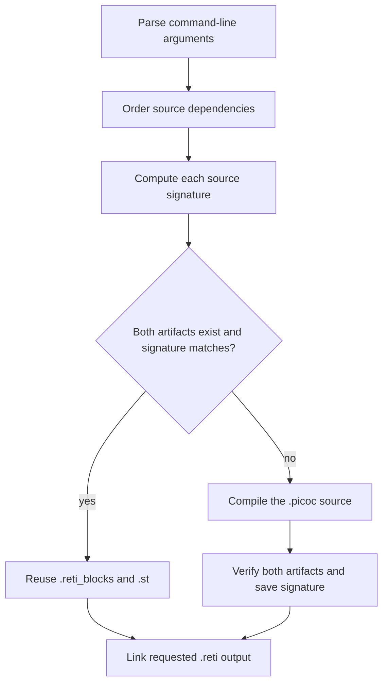

# Incremental PicoC compilation

PicoOS builds PicoC programs through `compile_picoc.py`. The script separates
compilation from linking: every `.picoc` compilation unit produces a
`.reti_blocks` file and a matching `.st` symbol table, then the resulting
blocks are linked into the requested `.reti` file.

The incremental compilation cache reuses the two per-source artifacts when
all inputs that can affect them are unchanged. This applies to every existing
caller of the shared script, including firmware targets, user and system
programs, normal program runs, library tests, and OS tests.

## Build flow



`parse_arguments()` first separates source and staged-artifact inputs from
compiler options and link configuration such as the output path, startup
source, and kernel-header mode. Options used during compilation are retained
for the cache signature; output-specific link arguments are not.

`dependency_order()` then follows leading comments of this form:

```c
// dependencies: ../lib/stdio/libstdio.reti_blocks
```

The referenced `.reti_blocks` or `.st` path is mapped back to its `.picoc`
source. Dependencies are visited before the source that uses them, duplicate
sources are compiled only once per invocation, and cycles are rejected. A
`.picoc` startup source supplied with `-C` is also treated as a compilation
root.

Each ordered source is passed to `compile_source()`. After every source is
either reused or compiled successfully, the script links the requested output.
The linker receives `.reti_blocks` inputs; matching `.st` files remain beside
the blocks for symbol resolution. A `-c` invocation stops after the staged
artifacts and does not link.

## Cache signature

Every compiled source has three generated files with the same basename:

```text
example.picoc
example.reti_blocks
example.st
example.picoc_build.json
```

The JSON file stores a SHA-256 build signature and SHA-256 digests of both
compiled artifacts. It is generated build state, is covered by the
repository's `*.json` ignore rule, and is removed by the normal clean targets
together with other generated files.

The signature contains:

- The cache format version from `CACHE_VERSION`
- Every compiler argument used for the compilation stage, in order
- The resolved compiler executable path, file size, and modification time
- The resolved path and complete contents of the source
- The resolved paths and complete contents of recursively included files

Hash values are length-prefixed before they are added, so adjacent values
cannot be confused with a different sequence of inputs. Resolved paths are
included because generated debug information can contain source paths; moving
the repository therefore correctly invalidates cached artifacts.

Literal `#include` directives are followed recursively. Quoted includes are
looked up relative to the including file first and then in directories passed
through `-I` or `--include`. Angle-bracket includes use the configured include
directories. A visited set prevents repeated work and include cycles.

Dependency comments and includes have different roles:

| Input form | Meaning | Cache behavior |
| --- | --- | --- |
| `// dependencies: library.reti_blocks` | A separately compiled and linked unit | The dependency gets its own artifacts and signature |
| `#include "implementation.picoc"` | Text compiled as part of the including unit | Its contents contribute to the including source's signature |
| `#include "declarations.header"` | Declarations or constants compiled with the source | Its contents contribute to the including source's signature |

This distinction allows a change to one header or included implementation to
rebuild only compilation units that actually include it.

## Cache hits and misses

A cache hit requires all of the following:

- The `.reti_blocks` file exists
- The `.st` file exists
- The `.picoc_build.json` file contains valid JSON with the current signature
- Both artifacts still match the digests recorded after compilation

On a hit, the compiler is not started for that source and the script reports
the two reused files. Merely having old artifacts is insufficient because
their compiler options and included inputs cannot otherwise be verified. The
first build after introducing the cache therefore compiles a source once to
create trusted cache state.

On a miss, the old cache record is removed before `picoc_compiler -c` runs.
The signature is written only after the compiler succeeds and both expected
artifacts exist. Consequently, a failed or interrupted compilation cannot
leave a valid cache record pointing at incomplete output.

Common invalidation cases are:

| Change | Result |
| --- | --- |
| Source contents change | Recompile that source |
| Included `.picoc` or header contents change | Recompile every source that includes it |
| Dependency source changes | Recompile that dependency; other units are reused unless they include it |
| Optimization, debug, include-path, or other compiler options change | Recompile under the new options |
| Compiler executable changes | Recompile with the new compiler |
| Either staged artifact is missing | Recompile and recreate both artifacts |
| A staged artifact was changed after compilation | Recompile and recreate both artifacts |
| Only the requested `.reti` output changes or is missing | Reuse staged artifacts and relink |

The final `.reti` output is deliberately linked on each non-`-c` invocation.
Linking depends on the selected block set, startup source, kernel-header mode,
output path, and metadata handling. The cache is scoped to the expensive
per-source compilation products requested for reuse.

## Why the cache is not implemented as directory Makefiles

The top-level Makefile still owns high-level targets and their repository-wide
prerequisites. Per-directory Makefiles were not added because all compilation
paths already converge in `compile_picoc.py`, while PicoC compilation units
and options are selected dynamically:

- Test directories are discovered at runtime
- Leading dependency comments form a recursive compilation graph
- The same source can be built with different debug, optimization, metadata,
  and include options
- Runs, tests, firmware, and program targets all use the same staged compiler

Putting the cache at that common boundary gives every caller identical
behavior without duplicating rules or generating Makefile fragments. It also
allows content-based tracking of recursive includes instead of relying only on
top-level source timestamps.

A Make-native design would become more attractive if `picoc_compiler`
eventually emitted dependency files comparable to C compiler `.d` files. Make
could then include an exact generated dependency graph while the compiler
remained responsible for discovering preprocessing inputs.

## Maintenance and limitations

Increase `CACHE_VERSION` whenever the meaning of a valid cached compilation
changes in a way that is not already represented by the signature inputs.

The cache validates the contents of existing `.reti_blocks` and `.st` targets.
This is important when a linked output uses the same basename as a source:
the compiler's diagnostic file output can replace that source's `.st` with a
combined link symbol table. The changed digest makes the next build recompile
the source instead of reusing the combined table as a compilation unit.
`make clean` removes the artifacts and cache records as well.

There is no lock around a source's artifacts or cache record. Normal PicoOS
targets invoke the build serially, but independent concurrent builds of the
same source, especially with different compiler options, can overwrite each
other. Such builds should use separate working trees or be run sequentially.
