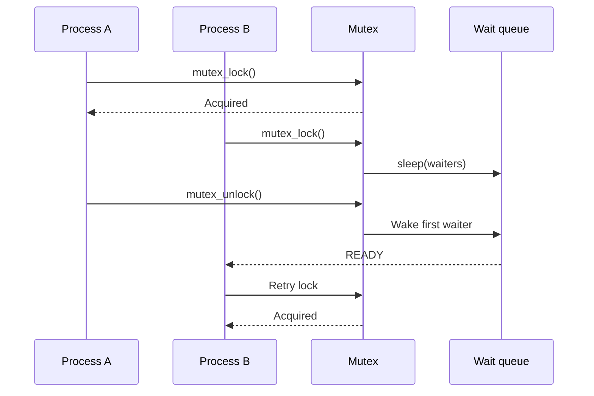
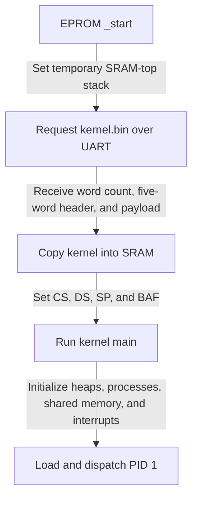
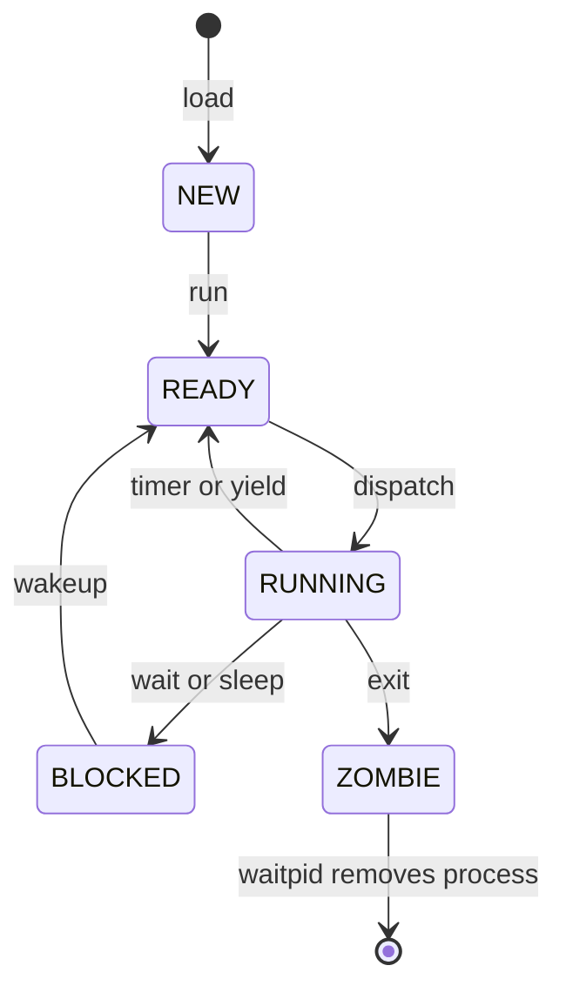
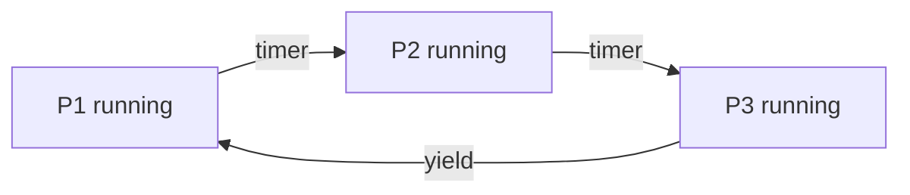
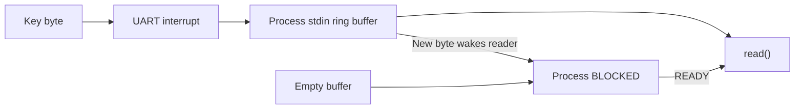
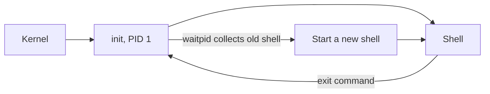

# Features in PicoOS

This document follows all 78 PicoOS commits from the initial commit to the
current tree. Sections are ordered by the commit in which each surviving
user-visible feature first appeared. Later commits that completed, corrected,
or extended that feature are listed with it.

Removed interfaces are omitted. Test infrastructure, build reporting,
code-navigation support, formatting, file moves, and internal-only refactoring
are also outside this list.

## Dynamic heap allocation

PicoC programs use the familiar allocation interface:

```c
int *values = malloc(4);
values[0] = 10;
free(values);
```

The allocator takes the first suitable free block, splits it, and merges
adjacent free blocks after `free()`:

| Stage | Resulting blocks |
| --- | --- |
| Before `free(b)` | Free block A, allocated block `b`, free block C |
| After `free(b)` | One merged free block containing A, `b`, and C |

The same algorithm manages three independent regions:

| Interface | Storage managed |
| --- | --- |
| `malloc()` / `free()` | Current process heap |
| `kmalloc()` / `kfree()` | Kernel objects |
| `pmalloc()` / `pfree()` | Processes and shared-memory backing |

A failed positive-size user allocation terminates only that process with
`Process terminated: heap full`; a failed kernel allocation prints
`Kernel panic: kernel heap full` and shuts PicoOS down.

Relevant commits: `7006d2bf2320`, `ec2bbc1cb1fa`, `25765026d228`,
`2e4be1825e2e`, `792c323dcf65`, `02e2fb84971d`

## Formatted terminal and stream I/O

The small stdio library supports the conversions used by PicoOS programs:

```c
printf("pid=%d name=%s ready=%c %%\n", pid, name, 'Y');

int number;
char word[16];
scanf("%d %s", &number, word);
```

Output may target a stream as well as the terminal:

```c
FILE *file = fopen("log.txt", "w");
fprintf(file, "result=%d\n", result);
fclose(file);
```

`printf()`, `fprintf()`, and `scanf()` understand `%d`, `%c`, `%s`, and `%%`.
The stream objects are thin, unbuffered descriptor wrappers rather than a
complete libc implementation.

Relevant commits: `7006d2bf2320`, `ec2bbc1cb1fa`, `838a7e718898`,
`d4dac3133cea`, `a7d44cc59460`, `0b5e8ca6f079`, `ef0fb5aa79ba`,
`55337da52a41`

## Mutex synchronization with blocking wait queues

```c
struct mutex lock;

mutex_init(&lock);
mutex_lock(&lock);
shared_counter = shared_counter + 1;
mutex_unlock(&lock);
```

A failed `testset` blocks instead of spinning:



Programs may also use `wait_queue_init()`, `sleep()`, and `wakeup()` directly.
`sleep()` means “block on this queue,” not “wait for a duration,” and
`wakeup()` readies at most the first waiter.

Relevant commits: `7006d2bf2320`, `838a7e718898`, `e8104b49736a`,
`ed9d0db27d08`

## String and memory utilities

The string library provides the operations used throughout applications and
the shell:

```c
char path[32];

strcpy(path, "./user/");
strcat(path, "echo.bin");

if (strcmp(path, "./user/echo.bin") == 0) {
    memset(buffer, 0, sizeof(buffer));
}
```

The current API contains `memcpy()`, `memset()`, `strcpy()`, `strcat()`,
`strcmp()`, `strncmp()`, and `strlen()`.

Relevant commits: `1fde82e40b74`, `838a7e718898`, `ffa167713d30`

## EPROM bootloading and kernel startup

`make bootload` follows this path:



The five binary header words are:

| Word | Field |
| ---: | --- |
| 0 | `code_start` |
| 1 | `data_start` |
| 2 | `heap_start` |
| 3 | `heap_size` |
| 4 | `stack_start` |

The bootloader consumes the header but uses generated constants for the kernel
heap. `make bootload-debug` uses the same boot path with debug information.

Relevant commits: `b994a12977ae`, `90fab1dbe05c`, `f39651ef7064`,
`e6287f5b40ea`, `da7e4734ed9d`

## Resizing allocated memory

```c
char *text = malloc(8);
strcpy(text, "hello");
text = realloc(text, 32);
```

`realloc()` chooses among three paths:

| Situation | Result |
| --- | --- |
| Block is too large | Shrink and split in place |
| Following block is free | Grow in place |
| Neither works | Allocate, copy, and free the old block |

`realloc(NULL, n)` is `malloc(n)`. `realloc(pointer, 0)` frees the block and
returns `NULL`. The kernel and process-region variants are `krealloc()` and
`prealloc()`.

Relevant commits: `f398718fad58`, `792c323dcf65`, `02e2fb84971d`

## Kernel-managed process loading and lifecycle control

Loading and starting are deliberately separate:

```c
int pid = load("./user/echo.bin");  // Creates a NEW process
run(pid, "hello PicoOS", NULL);     // NEW -> READY
```

The shell exposes the same stages:

```text
PicoOS> load ./user/echo.bin
PicoOS> list
PicoOS> run 3 hello PicoOS
PicoOS> unload 3
```

The current lifecycle is:



Removal returns the complete process region, descriptors, shared-memory
attachments, path, and process record to their allocators. A later load can
reuse the earliest sufficiently large free region.

Relevant commits: `01fa0b234f00`, `ffa167713d30`, `babb464d0b8a`,
`e8104b49736a`, `792c323dcf65`, `8d9e84b0355d`, `04588d05f985`,
`068f84d75f19`, `6fe45d4f365c`, `da7e4734ed9d`

## Round-robin multitasking, timer preemption, and yielding

With three ready processes, dispatch proceeds in process-list order:



Only user processes are preempted. A timer interrupt that interrupted kernel
code returns to that kernel work. Programs can request the same scheduling
path explicitly:

```c
while (work_remains) {
    do_one_step();
    yield();
}
```

Blocked, stopped, new, and zombie processes are skipped.

Relevant commits: `ffa167713d30`, `e8104b49736a`, `41b51069ac7e`,
`792c323dcf65`

## Conventional program arguments and automatic startup

An application receives normal `argc` and `argv` values:

```c
int main(int argc, char **argv) {
    printf("program: %s\n", argv[0]);
    if (argc > 1) {
        printf("number: %d\n", atoi(argv[1]));
    }
    return 7;
}
```

For `echo.bin hello`, the kernel-built stack contains:

| Value | Contents |
| --- | --- |
| `argc` | `2` |
| `argv[0]` | `"./user/echo.bin"` |
| `argv[1]` | `"hello"` |
| `argv[2]` | `NULL` |

The custom `_start` initializes the process heap and environment, calls
`main(argc, argv)`, and passes its return value to `exit()`.

Relevant commits: `ffa167713d30`, `c2b13a8331c0`, `e8104b49736a`,
`792c323dcf65`

## Exact-child waiting and process IDs

```c
int child = load("./user/worker.bin");
run(child, NULL, NULL);

printf("parent=%d child=%d\n", getpid(), child);
int status = waitpid(child);
```

| Situation | Result |
| --- | --- |
| Child is still running | Parent becomes `BLOCKED` on `child.waiters` |
| Child exits first | Child becomes a `ZOMBIE` and retains its status |
| Parent calls `waitpid()` later | Status returns to the parent and the child is removed |

`waitpid()` accepts one exact child PID, with no options argument. It returns a
stopped status for `SIGTSTP`; `WIFSTOPPED(status)` identifies that case.

Relevant commits: `babb464d0b8a`, `e8104b49736a`, `7f0da4af5dfd`,
`068f84d75f19`

## Direct shell execution and PATH lookup

Both explicit paths and `PATH` searches work:

```text
PicoOS> ./user/echo.bin direct path
direct path

PicoOS> echo.bin found through PATH
found through PATH
```

Init currently supplies `PATH=./user`. The shell uses an 80-cell command
buffer. Double quotes are removed during expansion but do not preserve spaces
as one argument; unmatched quotes produce an error. The current prompt is
`PicoOS> `.

Relevant commits: `01fa0b234f00`, `285fec05bd52`, `8d9e84b0355d`,
`17de305d4cce`, `fbe915710f14`

## Background commands and shell status parameters

```text
PicoOS> worker.bin &
PicoOS> echo.bin background pid: $!
background pid: 3

PicoOS> failing.bin
PicoOS> echo.bin status: $?
status: 1
```

`&` starts a process without waiting. `$!` is the most recent background PID;
`$?` is the most recent foreground status. A background launch does not replace
`$?`. `fg` and `bg` operate on the one most recently tracked background or
stopped process.

Relevant commits: `e8104b49736a`, `285fec05bd52`, `a1ff93f81ff7`,
`068f84d75f19`

## Echo command and newline escapes

```text
PicoOS> echo.bin one two three
one two three

PicoOS> echo.bin first\nsecond
first
second
```

`echo.bin` separates arguments with one space and adds a final newline. It
expands only backslash-`n`; the shell passes that sequence unchanged to other
programs. Options such as `-n` are not implemented.

Relevant commits: `285fec05bd52`, `36979558d57e`, `87ffd61d28e8`

## Count command

```text
PicoOS> count.bin
PicoOS> count.bin 10000
```

`count.bin` counts upward forever on one terminal line. Its optional argument
sets the busy-loop iterations between values; the default is 25,000. The
program is useful for trying terminal job control: Ctrl+Z stops it, `fg`
continues it, and Ctrl+C terminates it.

## Host directory commands

```text
PicoOS> pwd.bin
PicoOS> ls.bin
PicoOS> cd /tmp
PicoOS> ls.bin > files.txt
PicoOS> mkdir.bin new-directory
PicoOS> rm.bin files.txt
PicoOS> rmdir.bin new-directory
```

Every PCB owns an inherited absolute working-directory string. The kernel gives
PID 1 the emulator startup directory while creating it, and the shell records
that inherited directory when it starts. Relative `PATH` entries are looked up from this shell
startup directory, so commands such as `echo.bin` remain available after
`cd /tmp`. The kernel prefixes the calling process's current directory to
other relative load and file paths.

`ls.bin`, `mkdir.bin`, `pwd.bin`, `rm.bin`, and `rmdir.bin` call PicoOS library
functions. `ls.bin` uses the `opendir()`, `readdir()`, and
`closedir()` functions from `library/dirent`; it always includes hidden entries
and prints only `d name` or `- name`. The syscalls use bounded `is-directory`,
`ls`, `mkdir`, `pwd`, `unlink`, and `rmdir` UART frames. For `chdir()`, the
kernel combines the argument with the calling process's PCB directory and
removes `.` and `..` components. It sends the resulting absolute path through
`is-directory`; the emulator only checks whether that directory exists and
returns success or failure. After success, PicoOS stores the already-built path
in the calling process's PCB. The emulator keeps its own working directory
unchanged.

For example, a PCB directory of `/opt/picoos/binary/user` and the argument
`.././kernel` produce `/opt/picoos/binary/kernel`. PicoOS validates that path
and then stores it in the caller's PCB. `cd` is implemented as a shell built-in
so this caller is the shell itself. Starting an ordinary child for `cd` would
only change the child's PCB and would have no lasting effect on the shell.

`ls` and `pwd` output passes through ordinary process stdout, including `>` and
`>>`.

## Boolean type and constants for PicoC code

```c
bool ready = false;

if (queue_has_work()) {
    ready = true;
}
```

`bool` is an integer-sized PicoC alias, and public process, scheduler, mutex,
heap, UART, stdio, and standard-library APIs use `true` and `false` with it.

Relevant commit: `285fec05bd52`

## Process environments and shell variable expansion

```text
PicoOS> export GREETING=hello
PicoOS> echo.bin $GREETING
hello
```

Applications use the standard-style API:

```c
setenv("MODE", "debug", true);
printf("%s\n", getenv("MODE"));
unsetenv("MODE");
```

Each child receives a copy of the parent's `NAME=value` strings unless `run()`
is given a custom environment array. Later changes are process-local. The
library also provides `putenv()` and `clearenv()`.

Relevant commits: `8d9e84b0355d`, `3840ffddf1d3`, `a1ff93f81ff7`

## Kernel file descriptors and host-backed files

```c
int fd = open("notes.txt", O_RDONLY);
int count = read(fd, buffer, sizeof(buffer));
lseek(fd, 0, SEEK_SET);
close(fd);
```

Each process has eight descriptor slots:

| Descriptors | Initial use |
| --- | --- |
| `0` | UART-backed standard input |
| `1` | UART-backed standard output |
| `2` | UART-backed standard error |
| `3..7` | Host-backed files |

The emulator provides the host files; PicoOS does not store a filesystem in
SRAM. Reads request only the needed range, while a separate file-size request
supports existence checks and `SEEK_END`. `open()`, `creat()`, `read()`,
`write()`, `close()`, `lseek()`, and `dup2()` are implemented.

Children inherit copies of descriptors 0, 1, and 2. Descriptors do not share a
common offset object after copying.

Relevant commits: `55337da52a41`, `04588d05f985`, `75f56868e8d3`,
`91850647fc48`

## Interrupt-driven stdin and shell line editing



The shell adds line editing on top:

| Input | Visible behavior |
| --- | --- |
| Printable character | Store and echo it |
| Enter or carriage return | Finish the line |
| Backspace or Delete | Remove and erase the previous character |
| Ctrl+U | Remove and erase the complete current line |
| Ctrl+W | Remove and erase trailing whitespace and the previous word |
| Up or Down | Select the previous or next command-history entry |
| Left or Right | Ignore the unsupported cursor movement |
| Escape or another unsupported escape sequence | Ignore it without echoing raw control bytes |
| Other ASCII control byte | Ignore it without echoing it |

UART interrupts are briefly disabled around the empty-buffer check and wait
queue insertion, preventing a byte from arriving in the gap and leaving the
reader asleep. Each UART byte is routed to a stable terminal-input owner rather
than whichever process happens to be running. The shell owns input at its
prompt, transfers ownership to a foreground child, and takes ownership back
after waiting for that child.

Relevant commits: `55337da52a41`, `52310640f2eb`

## Cat command

```text
PicoOS> cat.bin first.txt second.txt
first file
second file

PicoOS> cat.bin missing.txt
cat: missing.txt: could not open file
```

`cat.bin` reads each named file in 64-cell chunks and handles partial writes to
stdout. It continues with later files where possible and returns status 1 if an
operand is missing or an open, read, or write fails. Stdin concatenation and
options are not implemented.

Relevant commits: `422e25b3ecf0`, `6b5fd18bfac6`, `fbe915710f14`

## Named shared memory

```c
struct SharedState {
    int counter;
    struct mutex lock;
};

int id = shm_open("counter", sizeof(struct SharedState));
struct SharedState *state = (struct SharedState *)mmap(id);
mutex_init(&(state->lock));

mutex_lock(&(state->lock));
state->counter = state->counter + 1;
mutex_unlock(&(state->lock));

shm_unlink("counter");
```

Every process mapping `id` receives the same absolute SRAM address:

```mermaid
flowchart LR
    A["Process A"] -->|mmap(id)| S["Shared SRAM block"]
    B["Process B"] -->|mmap(id)| S
```

Unlinking removes the name immediately and frees the block after the last
attached process exits. There is no `munmap()`, access control, or automatic
mutual exclusion.

Relevant commit: `7b0facc60d85`

## Loading labels and progress bars

Kernel, process, and file transfers can display their operation and path:

```text
load ./user/echo.bin
[#####     ] 50%
[##########] 100%
```

The initial setting is `loading_bar_enabled`. Init exports
`PICOOS_LOADING_BAR=true` when bars are enabled, so child process and file
operations inherit the choice. Internal operations can suppress the bar when
it would mix with program output.

Relevant commit: `d7cfac2eeafe`

## Standard-output redirection and appending

```text
PicoOS> echo.bin first > result.txt
PicoOS> echo.bin second >> result.txt
PicoOS> cat.bin result.txt
first
second
```

The shell opens the target, saves its own stdout with `dup2()`, replaces
descriptor 1, and starts the child. The child inherits the redirected
descriptor while the shell restores its terminal stdout.

`>` truncates and `>>` appends. Input redirection, pipelines, stderr
redirection, and arbitrary descriptor syntax are not implemented.

Relevant commits: `04588d05f985`, `36979558d57e`

## Persistent init, restartable shell sessions, and poweroff



The shell's `exit` built-in ends only that shell session. The external command
below invokes the shutdown syscall:

```text
PicoOS> poweroff.bin
```

Relevant commits: `8d9e84b0355d`, `5c85f36a528b`

## CPU and allocation exception handling

Faults identify the affected context and produce a specific result:

| Context | Fault | Diagnostic |
| --- | --- | --- |
| User process | Division by zero | `Process terminated: division by zero` |
| User process | Stack overflow | `Process terminated: stack overflow` |
| User process | Illegal instruction | `Process terminated: illegal instruction` |
| User process | Heap full | `Process terminated: heap full` |
| Kernel | Division by zero | `Kernel panic: division by zero` |
| Kernel | Stack overflow | `Kernel panic: kernel stack overflow` |
| Kernel | Illegal instruction | `Kernel panic: illegal instruction` |
| Kernel | Heap full | `Kernel panic: kernel heap full` |

A user fault exits that process with status 1 and lets PicoOS dispatch another
one. CPU faults use exception vector 3; heap-full uses a dedicated syscall.
User diagnostics go through the process's stdout descriptor, so `>` can capture
them.

Relevant commits: `c4f7df0b91b3`, `6fe45d4f365c`, `02e2fb84971d`

## Signals, parent relationships, and shell job control

```c
void cleanup(int signal_number) {
    printf("cleanup\n");
}

signal(SIGTERM, cleanup);
prctl(PR_SET_PDEATHSIG, SIGTERM);
```

| Signal | Default effect |
| --- | --- |
| `SIGKILL` | Terminate; cannot be caught or ignored |
| `SIGTERM` | Terminate; may be caught or ignored |
| `SIGCHLD` | Notify parent; ignored by default |
| `SIGCONT` | Continue a stopped process |
| `SIGTSTP` | Stop a process |

Ctrl+C sends `SIGTERM` to the foreground process; Ctrl+Z sends `SIGTSTP`. `fg`
and `bg` resume the most recently tracked job with `SIGCONT`. In debugger mode,
these shortcuts require RETI-Emulator's `(V)iew raw terminal`; its normal
`(v)iew terminal` keeps host control-key handling active. A configured
parent-death signal is inherited by later children.

PicoOS defines `SIGKILL`, `SIGTERM`, `SIGCHLD`, `SIGCONT`, and `SIGTSTP`.
`SIGINT` and `SIGSTOP` are not defined; the terminal uses `SIGTERM` and
`SIGTSTP` for the corresponding interactive actions. The shell reports process
creation and signal-driven foreground stops or termination on separate lines.

Relevant commit: `068f84d75f19`

## Kill command

| Command | Signal sent |
| --- | --- |
| `kill.bin 3` | `SIGTERM` |
| `kill.bin SIGKILL 3` | `SIGKILL` |
| `kill.bin SIGTERM 3` | `SIGTERM` |
| `kill.bin 0 3` | Check existence without sending a signal |

The optional first argument may name an implemented signal or give its number.
Invalid PIDs, invalid signals, unknown processes, and incorrect argument counts
print an error and short usage help, then return status 1.

Relevant commits: `432568fd9a97`, `fbe915710f14`

## Actionable errors for shell, init, and utilities

Common invalid input names the failed operation:

```text
PicoOS> load
error: load requires a path

PicoOS> list extra
error: list does not accept arguments

PicoOS> echo.bin "unfinished
error: unmatched double quote
```

Init likewise distinguishes a missing, unreadable, oversized, or malformed
environment file. `cat.bin` reports missing operands and I/O failures;
`kill.bin` reports usage, PID, signal, and process lookup errors. The commands
return failure where appropriate, so `$?` exposes the result.

Relevant commits: `6b5fd18bfac6`, `fbe915710f14`

## Configurable process heap and stack layout

Before assembling a program, its generated `.sections` JSON may be edited to
request an explicit process layout. For example, the current
`user/echo.sections` boundaries can be given a 2000-word heap and a 1000-word
stack like this:

```json
{
  "codesegment_start": 0,
  "datasegment_start": 11595,
  "heap_start": 11621,
  "heap_size": 2000,
  "stack_start": 14621
}
```

| Boundary | Relative offset | Meaning |
| --- | ---: | --- |
| `codesegment_start` | `0` | `.text` begins |
| `datasegment_start` | `11595` | `.data` begins |
| `heap_start` | `11621` | 2000-word heap begins |
| Heap end | `13621` | First word above the heap and lower stack boundary |
| `stack_start` | `14621` | Initial stack pointer; the stack grows downward |

All five shown keys are required. A file whose SRAM image begins with numeric
interrupt-vector entries may additionally contain
`interrupt_service_routines_start`. `heap_size: -1` selects PicoOS's 1000-word
default, and `stack_start: -1` places a further 1000 stack words above the
effective heap. An explicit stack may not overlap the heap.

Assembly writes the five required values into the binary header. Kernel
binaries use the same header format but take their heap range from generated
kernel constants.

Relevant commit: `da7e4734ed9d`
